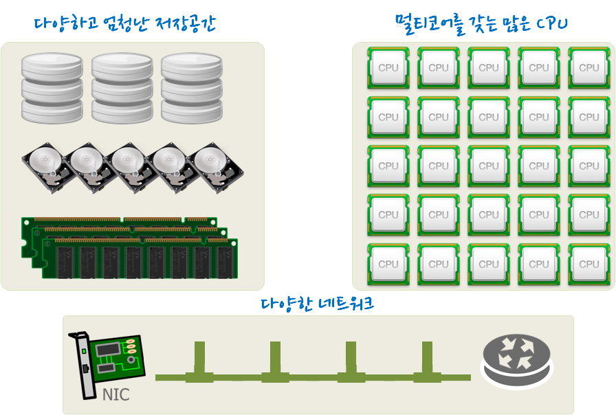
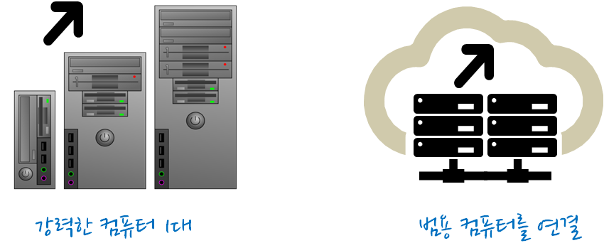
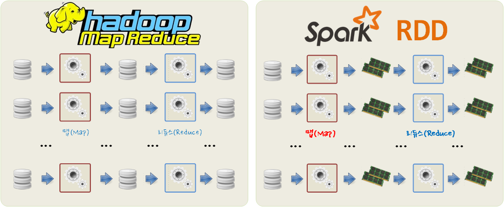

> ### 학습 목표 {.objectives}
>
> * 빅데이터를 담을 그릇에 대해 살펴본다.
> * 동질적인 컴퓨팅 자원을 분산해서 관리하는 방법을 이해한다.

### 1. 하드웨어를 어떻게 할 것인가?

다양한 메모리, 디스크, 저장소 등 데이터를 저장할 방법은 넘쳐나고 있고, 멀티코어를 갖는 중앙처리장치(CPU)도 아주 저렴한 비용으로 엄청나게 많이 소유할 수도 있고, GPU도 이제 주류로 편입되고 있으며, 네트워크도 CPU와 메모리간 공유메모리, 메모리와 디스크 사이에 네트워크, 그리고 인터넷 통신망으로 연결된 컴퓨터 등 거의 무한에 가까운 컴퓨팅 자원을 갖출 수 있는 환경이 되었다. 

그럼 문제는 어떻게 다양하고 엄청난 저장공간, 멀티코어를 갖춘 수많은 중앙처리장치, 그리고 컴퓨터를 연결하는 네트워크 통신을 어떻게 최적화할 수 있을까?

### 2. 두가지 접근방법

첫번째 접근법은 컴퓨터 한대를 점점더 강력하게 만들어 나가는 방법으로 1990년대를 풍미한 접근법이다.
하지만, 한대의 강력한 컴퓨터를 제작하는 기술보다 훨씬 더 많은 데이터가 더욱 빠르게 생성되어 가는 환경이 2000년대 출현하였다.

범용 장비를 갖춘 컴퓨터를 네트워크로 연결하여 데이터를 분산해서 처리하는 아키텍처가 가장 현실적인 대안으로 제시되었고, 이와 관련된 기술이 사회경제적인 요청에 맞추어 발달해 나갔다.

### 3. 분산처리 난제

범용 장비를 갖춘 컴퓨터를 네트워크로 연결하여 대용량의 데이터를 정말 빠른 시간내에 처리한다는 방향에는 모두 동의하지만, 모든 것을 컴퓨터 한대에 때려넣는 방법에 비해 예상치 못한 다양한 난제에 봉착했다.

|    난제영역       |                   고장 통계자료                        | 
|-------------------|--------------------------------------------------------|
|  서버 컴퓨터 고장 | 3년마다 서버컴퓨터 교체 &rarr;  10,000대 운영, 10대/일 |
|   하드 디스크     |    1 -- 5 % / 년 고장 (구글)                           |
|   메모리(DIMM)    |       0.2 % / 년 고장 (구글)                           |
|   네트워크 속도   |  공유메모리 << 디스크 << 네트워크 지연속도             |

하지만 더큰 문제는 고장은 아닌데 엄청 느리게 동작하는 범용장비가 다수 존재하는데 이를 어떻게 인지하고 식별해서 교체해주느냐도 난제에 속한다.

### 4. 하둡 맵리듀스에서 스파크 RDD 

HDFS에서 데이터를 전통적인 맵리듀스(Map Reduce, MR) 방식으로 처리하면 디스크 입출력(Disk I/O) 때문에 병렬처리를 하든 배치방식으로 연속처리를 하든 문제가 성능에 심각한 문제가 발생된다. 그렇다고 데이터를 저장하고 중앙처리장치에서 처리하는 패러다임을 바꿀 수는 없는 노릇이다. 

그런데, 메모리 가격이 지속적으로 떨어져 물론 하드디스크나 기타 보조 저장장치보다는 여전히 비싸지만, 적당한 가격에 빅데이터를 처리하는데 문제가 적을만큼 가격이 떨어졌다. 따라서, 기존 주기억장치로 사용되던 메모리를 보조기억장치에 사용하여 빅데이터를 처리할 경우 맵리듀스가 갖는 성능문제를 극복하면서 대용량 데이터를 다루는 것이 가능해졌고, 이렇게 구현된 것이 스파크 RDD다. 즉 메모리 위에서 데이터 공유를 해서 성능문제를 극복한다.

지속적으로 하락하는 메모리 가격에 대한 정보는 [Graph of Memory Prices Decreasing with Time (1957-2015)](http://www.jcmit.com/mem2015.htm)을 참조한다.

#### 하둡 맵리듀스와 스파크 RDD 비교

|       구분    |       하둡 맵리듀스      |        스파크 RDD       |
|---------------|--------------------------|-------------------------|
|    저장소     |          디스크          |   메모리 혹은 디스크    |
|    연산작업   | 맵(Map)과 리듀스(Reduce) | 맵, 리듀스, 표본추출, 합병...|
|   실행모형    |     배치(Batch)          | 배치, 인터랙티브, 스트리밍 |
| 프로그래밍 언어 |       자바             | 자바, R, 파이썬, 스칼라 | 

