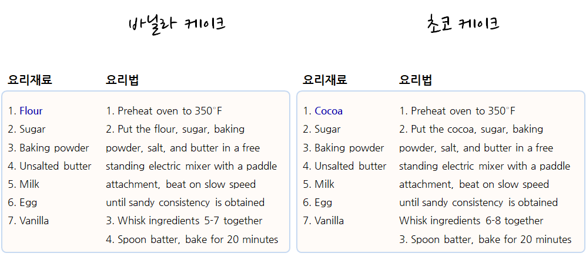

> ## 학습 목표 {.objectives}
>
> * 함수형 프로그래밍이 필요한 이유를 살펴본다.
> * 함수도 인자라는 것을 이해한다.
> * `purrr` 함수형 프로그래밍 기본을 이해한다.

### 1. `for` 루프 대안이 필요한 이유

`for` 루프는 객체와 구현 패턴을 강조하다보니 동작을 숨기게 된다. 
반면에 함수형 프로그래밍은 명사와 마찬가지로 동사도 강조하고, 구현에 대한 상세한 내용은
추상화하여 감추어 버린다. 이런 점에서 함수형 프로그래밍으로 코드를 작성하게 되면 
간결하고 유지보수성이 좋아진다.

> #### 함수형 프로그램 작성 순서 {.callout}
>
> 1. 전문영역지식을 활용하여 작성내용을 체계화한다.
> 1. 변수를 사용하여 정리한다.
> 1. 공통되는 코드를 뽑아낸다.

R 함수형 프로그램 작성에 Hadley Wickham이 사용하는 서양식 작은 케익(cupcake) 제작 요리법을 살펴본다.
바닐라 케이크와 쵸코 케이크 요리재료와 요리법은 거의 유사하다. 차이점이 있다면 밀가루(flour)와 코코아(cocoa)가 
큰 차이가 나고 나머지 요리법의 절차는 거의 유사하다.

바닐라 케이크와 쵸코 케이크 조리법이 두 페이지에 걸쳐 있는데 이를 한 페이지로 줄이면 다음과 같다.
즉, 요리재료를 표준화해서 공통 요소를 뽑아내면 밀가루(flour)와 코코아(cocoa)를 바꿔 넣으면 되고,
요리법의 경우 먼저 요리법을 체계화해서 1단계 예열, 2단계 재료 섞기, 3단계 굽기로 나누고 
2단계를 좀더 상세하게 마른 재료와 젖은 재료를 섞어 혼합하는 과정으로 체계화한다.

`mtcars` 데이터셋 각변수에 대한 평균과 중위수를 계산하는 것을 살펴본다. `for` 루프를 사용하는 경우 객체와 
구현 패턴에 중점을 두게 되어 `mean`, `median` 함수명만 차이나는 `for` 루프가 두개 생성되었다.

~~~{.r}
# 각 변수 평균을 계산

out1 <- vector("double", ncol(mtcars))

for(i in seq_along(mtcars)) {
	out1[[i]] <- mean(mtcars[[i]], na.rm = TRUE)
}

# 각 변수 중위수를 계산
out2 <- vector("double", ncol(mtcars))

for(i in seq_along(mtcars)) {
	out2[[i]] <- median(mtcars[[i]], na.rm = TRUE)
}
~~~

이를 `purrr` 팩키지를 사용해서 함수형 프로그램으로 작성하면 다음과 같다.

~~~{.r}
library(purrr)

means <- map_dbl(mtcars, mean)
medians <- map_dbl(mtcars, median)
~~~

### 2. 함수도 인자다.

함수도 인자로 넣어 처리할 수 있다는 점이 처음에 이상할 수도 있지만, 함수를 인자로 처리할 경우 코드 중복을 상당히 줄일 수 있다.
$L_1$, $L_2$, $L_3$ 값을 구하는 함수를 다음과 같이 작성해야 한다. 숫자 1,2,3 만 차이날 뿐 함수 중복이 심하다.

* 1단계: 중복이 심한 함수, 기능 구현에 초점을 맞춤

~~~{.r}
f1 <- function(x) abs(x - mean(x)) ^ 1
f2 <- function(x) abs(x - mean(x)) ^ 2
f3 <- function(x) abs(x - mean(x)) ^ 3
~~~

* 2단계: 임시 변수로 처리할 수 있는 부분을 식별하고 적절한 인자명(`power`)을 부여한다.

~~~{.r}
f1 <- function(x) abs(x - mean(x)) ^ power
f2 <- function(x) abs(x - mean(x)) ^ power
f3 <- function(x) abs(x - mean(x)) ^ power
~~~

* 3단계: 식별된 변수명을 함수 인자로 변환한다.

~~~{.r}
f1 <- function(x, power) abs(x - mean(x)) ^ power
f2 <- function(x, power) abs(x - mean(x)) ^ power
f3 <- function(x, power) abs(x - mean(x)) ^ power
~~~

#### 2.1. 기초통계 사례 

특정 변수의 중위수, 평균, 표준편차를 계산하는 함수를 작성하는 경우를 상정한다.

* 1 단계: 각 기능을 구현하는 기능 구현에 초점을 맞춤

~~~{.r}
col_median <- 
	function(df) {
		output <- numeric(length(df))
		for (i in seq_along(df)) {
			output[i] <- median(df[[i]])
		}
		output
	}

col_mean <- 
	function(df) {
		output <- numeric(length(df))
		for (i in seq_along(df)) {
			output[i] <- mean(df[[i]])
		}
		output
	}

col_sd <- 
	function(df) {
		output <- numeric(length(df))
		for (i in seq_along(df)) {
			output[i] <- sd(df[[i]])
		}
		output
	}
~~~

* 2 단계: `median`, `mean`, `sd`를 함수 인자 `fun` 으로 함수명을 통일.

~~~{.r}
col_median <- 
	function(df) {
		output <- numeric(length(df))
		for (i in seq_along(df)) {
			output[i] <- fun(df[[i]])
		}
		output
	}

col_mean <- 
	function(df) {
		output <- numeric(length(df))
		for (i in seq_along(df)) {
			output[i] <- fun(df[[i]])
		}
		output
	}

col_sd <- 
	function(df) {
		output <- numeric(length(df))
		for (i in seq_along(df)) {
			output[i] <- fun(df[[i]])
		}
		output
	}
~~~

* 3 단계: 함수 인자 `fun` 을 넣어 중복을 제거.

~~~{.r}
col_median <- 
	function(df, fun) {
		output <- numeric(length(df))
		for (i in seq_along(df)) {
			output[i] <- fun(df[[i]])
		}
		output
	}

col_mean <- 
	function(df, fun) {
		output <- numeric(length(df))
		for (i in seq_along(df)) {
			output[i] <- fun(df[[i]])
		}
		output
	}

col_sd <- 
	function(df, fun) {
		output <- numeric(length(df))
		for (i in seq_along(df)) {
			output[i] <- fun(df[[i]])
		}
		output
	}
~~~

* 4 단계: 함수를 인자로 갖는 요약통계 함수를 최종적으로 정리하고, 테스트 사례를 통해 검증.

~~~{.r}
col_summary <- 
	function(df, fun) {
		output <- numeric(length(df))
		for (i in seq_along(df)) {
			output[i] <- fun(df[[i]])
		}
		output
	}
col_summary(df, fun = median)
~~~

~~~{.output}
[1]  3 30  6  5

~~~

~~~{.r}
col_summary(df, fun = mean)
~~~

~~~{.output}
[1]  3.0 30.0  5.0  4.4

~~~

~~~{.r}
col_summary(df, fun = sd)
~~~

~~~{.output}
[1]  1.581139 15.811388  2.915476  1.516575

~~~

### 3. 함수형 프로그래밍 라이브러리 `purrr`

함수를 인자로 넘기는 방법이 하나만 있는 것은 아니다. `sapply`, `lapply` 함수를 사용하는 방법이 많이 사용되고 있으며, 
위에서 처럼 직접 함수를 작성해도 되지만, `purrr` 팩키지를 사용하여 기능을 동일한 기능 구현을 통일하는 것도 가능하다.

~~~{.r}
sapply(df, mean)
~~~

~~~{.output}
   a    b    c    d 
 3.0 30.0  5.0  4.4 

~~~

~~~{.r}
col_summary(df, mean)
~~~

~~~{.output}
[1]  3.0 30.0  5.0  4.4

~~~

~~~{.r}
library(purrr)
map_dbl(df, mean)
~~~

~~~{.output}
   a    b    c    d 
 3.0 30.0  5.0  4.4 

~~~

> #### `purrr` 팩키지 `map` 함수를 사용할 경우 장점{.callout}
>
> `map_dbl(.x, .f, ...)` 작업을 실행시키면 특정 벡터(`.x`)에 대한 연산작업(`.f`)을 반복해서 실행
>
> * `.x` 벡터에 대해 반복 연산작업을 수행
> * 원소 각각에 대해서 `.f` 함수 연산 작업을 수행
> * 결과를 반환

`map` 함수는 반환되는 자료형에 따라 차이가 나지만 기본적인 작동방식은 동일하다.

* `map()` : 리스트를 반환
* `map_dbl()` : double 숫자벡터를 반환
* `map_lgl()` : 부울 논리 벡터를 반환
* `map_int()` : 정수형 벡터를 반환
* `map_chr()` : 문자형 벡터를 반환

#### 3.1. `purrr` `map` 함수 `.f` 지정방법

`.f` 함수를 지정하는 다양한 방법을 살펴보면 다음과 같다.

* 기존 함수를 사용 : `map(df, summary)`
* 사용자 정의 함수를 사용 : `map(df, rescale)`
* 익명 함수를 사용 : `map(df, function(x) sum(is.na(x)))`
* 공식 단축키 함수를 사용 : `map(df, ~ sum(is.na(x)))`

`.f` 함수를 `[[`으로 원소 혹은 하위집합을 뽑아내는 경우를 살펴보자.

~~~{.r}
list_of_results <- list(
	list(a = 1, b = "A"),
	list(a = 2, b = "C"),
	list(a = 3, b = "D"))

map_dbl(list_of_results, function(x) x[["a"]])
~~~

~~~{.output}
[1] 1 2 3

~~~

~~~{.r}
map_dbl(list_of_results, "a")
~~~

~~~{.output}
[1] 1 2 3

~~~

~~~{.r}
map_dbl(list_of_results, 1)
~~~

~~~{.output}
[1] 1 2 3

~~~

`map_dbl(list_of_results, function(x) x[["a"]])` 첫번째 경우 익명함수를 사용해서 리스트명을 기준으로 뽑아낸다.
두번째 `map_dbl(list_of_results, "a")`는 문자열 명칭을 사용해서 하위집합 뽑아내기를 통해 단축키를 사용해서 뽑아낸다.
마지막, `map_dbl(list_of_results, 1)`은 정수 숫자위치를 기준으로 하위집합 뽑아내는 단축키 활용법을 보여주고 있다.

함수형 프로그래밍은 패턴을 일반화하여 추상화해서, 개발자가 데이터와 동작에 집중하게도록 한다.
이를 통해 반복문제를 좀더 쉽게 풀 수 있도록 하고, 더 이해하기 좋은 코드를 만들게 돕는다.
