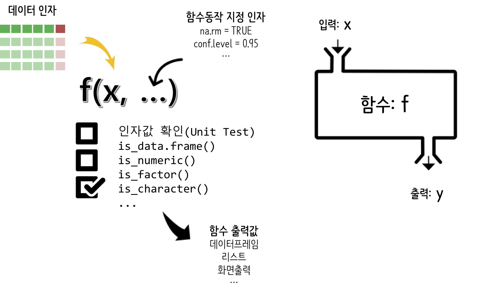

```{r, include=FALSE}
options(htmltools.dir.version = FALSE)

knitr::opts_chunk$set(echo = TRUE, warning=FALSE, message=FALSE,
                    comment="", digits = 3, tidy = FALSE, prompt = FALSE, fig.align = 'center')
```

# 함수에 관한 기초 지식 {#all-about-function}

함수는 입력값(`x`)를 넣어 어떤 작업(`f`)을 수행한 결과를 반환(`y`) 과정으로 이해할 수 있는데, 인자로 다양한 값을 함수에 넣을 수 있고, 물론 함수가 뭔가 유용한 작업을 수행하기 위한 전제조건을 만족시키는지 확인하는 과정을 `assert` 개념을 넣어 확인하고 기술된 작업을 수행한 후에 출력값을 변환시키게 된다.



## 함수를 작성하는 이유 {#why-write-function}

함수를 작성하는 이유는 반복되는 중복 문제를 해결하고 추상화를 통해 더 복잡한 작업을 가능하게 만들기 위해 사용한다. 즉,

1. 반복적인 복사하여 붙여넣기를 줄여 작업량을 상당히 줄인다.
1. 버그와 오류가 끼어들 여지를 줄인다.
1. 코드 재사용을 증가시킨다.
1. 작성한 지적 산출물 공유를 촉진시킨다.

예를 들어, 데이터프레임에 담긴 변수의 측도가 상이하여 측도를 재조정하는 경우 다음과 같은 수학식이 많이 사용된다.
즉, 최대값과 최소값을 빼서 분모에 놓고 분자에 최소값을 빼고 나누면 0--1 사이 값으로 척도를 재조정하게 된다.

$$ f(x)_{\text{척도조정}} = \frac{x-min(x)}{max(x)-min(x)} $$

``` {r fp-duplication}
df <- data.frame(a=c(1,2,3,4,5),
				 b=c(10,20,30,40,50),
				 c=c(7,8,6,1,3),
				 d=c(5,4,6,5,2))
df$a <- (df$a - min(df$a, na.rm = TRUE)) /
        (max(df$a, na.rm = TRUE) - min(df$a, na.rm = TRUE))
df$b <- (df$b - min(df$b, na.rm = TRUE)) /
        (max(df$a, na.rm = TRUE) - min(df$b, na.rm = TRUE))
df$c <- (df$c - min(df$c, na.rm = TRUE)) /
        (max(df$c, na.rm = TRUE) - min(df$c, na.rm = TRUE))
df$d <- (df$d - min(df$d, na.rm = TRUE)) /
        (max(df$d, na.rm = TRUE) - min(df$d, na.rm = TRUE))
df        
```

상기 R 코드는 측도를 모두 맞춰서 변수 4개(`a`, `b`, `c`, `d`)를 비교하거나 향후 분석을 위한 것이다. 
하지만, 읽어야 되는 코드가 중복되고 길어 코드를 작성한 개발자의 **의도** 가 의도적이지는 않지만 숨겨졌다.

그리고, R 코드에 실수한 것이 그냥 남게 되어 다음 프로그램 실행에서 버그(특히, 구문론이 아닌 의미론적 버그)가 숨겨지게 된다. 즉, 상기 코드가 만들어 지는 과정을 살펴보면 이해가 쉽게된다.

1. `df$a <- (df$a - min(df$a, na.rm = TRUE)) / (max(df$a, na.rm = TRUE) - min(df$a, na.rm = TRUE))` 코드를 작성한 후,
정상적으로 돌아가는지 확인한다.
1. 1번 코드가 잘 동작하게 되면 다음 복사하여 붙여넣기 신공을 사용하여 다른 칼럼 작업을 확장해 나간다. `df$b`, `df$c`, `df$d`를 생성하게 된다.
1. 즉, 복사해서 붙여넣은 것을 변수명을 편집해서 `df$b`, `df$c`, `df$d` 변수를 순차적으로 생성해 낸다.


<style>
div.blue { background-color:#e6f0ff; border-radius: 5px; padding: 10px;}
</style>
<div class = "blue">

**위캠 어록**

* Duplication hides the intent
* If you have copied-and-pasted twice, it is time to write a function

</div>

## 함수를 작성하는 시점 {#time-to-write-function}

복사해서 붙여넣는 것을 두번 하게 되면, 함수를 작성할 시점이다. 중복을 제거하는 한 방법은 함수를 작성하는 것이다.
함수를 작성하게 되면 의도가 명확해진다.
함수명을 `rescale`로 붙이고 이를 실행하게 되면, 의도가 명확하게 드러나게 되고, 복사해서 붙여넣게 되면서 
생겨나는 중복과 반복에 의한 실수를 줄일 수 있게 되고, 향후 코드를 갱신할 때도 도움이 된다.


``` {r fp-write-fn}
rescale <- function(x){
              rng <- range(x, na.rm = TRUE)
              (x - rng[1]) / (rng[2] - rng[1])
            }

df$a <- rescale(df$a)
df$b <- rescale(df$b)
df$c <- rescale(df$c)
df$d <- rescale(df$d)
```

또다른 방법은 함수형 프로그래밍을 사용하는 것으로 함수명을 반복적으로 사용하는 것조차도 피할 수 있다.


``` {r fp-write-purrr}
library(purrr)
df <- map_df(df, rescale)
```


## 좋은 함수 {#criteria-on-good-function}

좋은 함수를 작성하려면 다음과 같은 조건이 만족되어야 한다.

1. 함수와 인자에 대해 유의미한 명칭을 사용한다.
    * 함수명에 적절한 동사명을 사용한다.
1. 직관적으로 인자를 배치하고 기본디폴트값에도 추론가능한 값을 사용한다.
1. 함수가 인자로 받아 반환하는 것을 명확히 한다.
1. 함수 내부 몸통부문에 좋은 스타일을 잘 사용한다.

좋은 함수 작성과 연계하여  **깨끗한 코드(Clean code)**는 다음과 같은 특성을 갖고 작성된 코드를 뜻한다.

- 가볍고 빠르다 - Light
- 가독성이 좋다 - Readable
- 해석가능하다 - Interpretable
- 유지보수가 뛰어나다 - Maintainable

<style>
div.blue { background-color:#e6f0ff; border-radius: 5px; padding: 10px;}
</style>
<div class = "blue">

**좋은 함수란?**

척도를 일치시키는 기능을 함수로 구현했지만, 기능을 구현했다고 좋은 함수가 되지는 않는다.
좋은 함수가 되는 조건은 다음과 같다.

1. **Correct:** 기능이 잘 구현되어 올바르게 동작할 것
1. **Understandable:** 사람이 이해할 수 있어야 함. 즉, 함수는 컴퓨터를 위해 기능이 올바르게 구현되고, 사람도 이해할 수 있도록 작성되어야 한다.
1. 즉, **Correct + Understandable:** 컴퓨터와 사람을 위해 적성될 것.

</div>

# 함수 구성요소 {#funciton-component}

## 인자(argument) {#function-component-argument}

함수 구성요소 중 중요한 요소로 인자(argument)를 꼽을 수 있다. 인자는 크게 두가지로 나뉜다.

- 데이터 인자(data argumnets): 대다수 함수는 기본적으로 데이터에 대한 연산을 가정하고 있다. 따라서 데이터를 함수 인자로 지정하여 이를 함수몸통에서 처리하고 결과를 반환시키는 것은 당연한 귀결이다.
- 동작방식 지정 인자(detail arguments): 함수가 동작하는 방식에 대해서 세부적으로 동작하는 방식에 대해서 지정할 필요가 있는데 이때 필요한 것이 동작방식 지정 인자가 된다.

예를 들어 `t.test()` 함수를 살펴보면 `x`가 데이터 인자가 되며, 기타 `alternative = c("two.sided", "less", "greater")`, `mu = 0`, `paired = FALSE`, `var.equal = FALSE`, `conf.level = 0.95`, `...`은 함수가 구체적으로 어떻게 동작하는지 명세한 인자값이다.  

```{r t.test-example, eval=FALSE}
? t.test

## Default S3 method:
t.test(x, y = NULL,
       alternative = c("two.sided", "less", "greater"),
       mu = 0, paired = FALSE, var.equal = FALSE,
       conf.level = 0.95, ...)
```

## 인자값 확인 - `assert` {#function-component-argument-assert}

인자값이 제대로 입력되어야 함수몸통에서 기술한 연산작업이 제대로 수행될 수 있다.
이를 위해서 `testthat`, `assertive`, `assertr`, `assertthat` 등 수많은 팩키지가 존재한다.
`stopifnot()`, `stop()` 등 Base R 함수를 사용해도 문제는 없다.
다음과 같이 입력값에 `NA`가 포함된 경우 벡터의 합계를 구하는 함수가 동작하지 않거나 아무 의미없는 값을 반환시키곤 한다. 그리고 앞서 인자값을 잘 제어하지 않게 되면 귀중한 컴퓨팅 자원을 낭비하기도 한다. 이를 방기하기 위해서 `stopifnot()`함수로 함수 몸통을 수호하는 보호자처럼 앞서 인자값의 적절성에 대해서 검정을 먼저 수행한다. 그리고 나서 사전 유효성 검사를 통과한 인자값에 대해서만 함수 몸통에 기술된 연산작업을 수행하고 결과값을 반환시킨다.

```{r assert-that, error=TRUE}
library(testthat)

num_vector <- c(1,2,3,4, 5)
na_vector <- c(1,2,3,NA, 5)

sum_numbers <- function(vec) {
  
  stopifnot(!any(is.na(vec)))
  
  total <- 0

  for(i in 1:length(vec)) {
    total <- total + vec[i]
  }
  total
}

sum_numbers(num_vector)
sum_numbers(na_vector)
```

상기 코드의 문제점은 `stopifnot()` 함수가 잘못된 입력값에 대해서 문제가 무엇이고, 어떤 행동을 취해야 하는지 친절하지 않다는데 있다. 이를 [`assertive`](https://cran.r-project.org/web/packages/assertive/) 팩키지를 활용해서 극복하는 방안을 살펴보자. `asserive` 팩키지를 설치하면 R 함수 작성에 걸림돌이 될 수 있는 거의 모든 사전 점검작업을 수행할 수 있다는 것이 매력적이다. `install.packages("assertive")`를 실행하게 되면 함께 설치되는 팩키지는 다음과 같다.

‘assertive.base’, ‘assertive.properties’, ‘assertive.types’, ‘assertive.numbers’, ‘assertive.strings’, ‘assertive.datetimes’, ‘assertive.files’, ‘assertive.sets’, ‘assertive.matrices’, ‘assertive.models’, ‘assertive.data’, ‘assertive.data.uk’, ‘assertive.data.us’, ‘assertive.reflection’, ‘assertive.code’

```{r assertive-function, error=TRUE}
library(assertive)

sum_numbers_assertive <- function(vec) {
  
  assert_is_numeric(vec)
  
  if(assert_any_are_na(vec)) {
      stop("벡터 x는 NA 값이 있어요. 그래서 총합을 구하는게 의미가 없네요")
  }
  
  total <- 0

  for(i in 1:length(vec)) {
    total <- total + vec[i]
  }
  total
}

# sum_numbers_assertive(num_vector)
sum_numbers_assertive(na_vector)
```


## 반환값 확인 {#function-component-return}

R은 파이썬과 달리 `return()`이 꼭 필요하지는 않다. 왜냐하면 마지막 객체가 자동으로 함수 반환값으로 정의되기 때문이다. 함수 반환값 관련하여 몇가지 사항을 알아두면 도움이 많이 된다.

먼저 함수에서 반환되는 값이 하나가 아닌 경우 이를 담아내는 방법을 살펴보자. `list()`로 감싸 이를 반환하는 경우가 많이 사용되었지만, 최근 `zeallot` 팩키지가 도입되어 함수 출력값을 받아내는데 간결하고 깔끔하게 작업할 수 있게 되었다. [zeallot vignette](https://cran.r-project.org/web/packages/zeallot/vignettes/unpacking-assignment.html)에 다양한 사례가 나와 있다.

예를 들어 단변량 회귀모형의 경우 `lm()` 함수로 회귀식을 적합시킨다. 그리고 나서 `coef()` 함수로 절편과 회귀계수를 추출할 때 `%<-%` 연산자를 사용하게 되면 해당값을 벡터객체에 할당시킬 수 있다.

```{r return-value-zeallot-example}
library(tidyverse)
library(zeallot)

c(inter, slope) %<-% coef(lm(mpg ~ cyl, data = mtcars))
inter
slope
```

`iris` 데이터셋을 훈련/시험 데이터셋으로 쪼갠다. 이를 위해서 일양균등분포에서 난수를 생성시켜 8:2 비율로 훈련/시험 데이터를 나눈다.
그리고 나서, `%<-%` 연산자로 훈련/시험 데이터로 쪼개 저장시킨다. 

```{r return-value-zeallot}
iris_df <- iris %>% 
  mutate(runif = runif(n())) %>% 
  mutate(train_test = ifelse(runif > 0.2, "train", "test")) 

iris_df %>% 
  count(train_test)

c(test, train) %<-%  split(iris_df, iris_df$train_test)

glimpse(train)
```

혹은, 회귀분석 결과를 `list()` 함수로 결합시켜 리스트로 반환시킨다.
이런 경우 결과값이 하나가 아니더라도 추후 리스트 객체를 풀어 활용하는 것이 가능하다.


```{r return-value-list}
get_lm_statistics <- function(df) {
  mtcars_lm <- lm(mpg ~ cyl, data=df)
  
  intercept <- coef(mtcars_lm)[1]
  beta      <- coef(mtcars_lm)[2]
  
  lm_stats <- list(intercept = intercept, 
                   beta = beta)
  
  return(lm_stats)
}

mtcars_list <- get_lm_statistics(mtcars)

mtcars_list

```


# 함수 사용하는 방법 {#how-to-use-function}

## 함수 이해 {#understand-function}

함수를 작성하기 전에 먼저, 함수를 사용하는 방법을 익히는 것이 필요하다.
함수는 함수명, 인자(argument), 함수 몸통(body), 반환값(return value)으로 구성된다.  
데이터 사이언스 언어 R과 파이썬으로 4칙연산을 구현하는 함수를 작성하여 비교도 겸해보자.

<div class = "row">
  <div class = "col-md-6">
**R 함수**

- 함수명: 함수명을 먼저 적고 `<-`, `function()`, `{`, `}` 순으로 R이 함수임을 알 수 있도록 전개한다.
- 함수 인자: 함수에 넣을 인자를 정의하여 넣어 둔다.
- 함수 몸통(body): 앞서 사칙연산처럼 함수가 수행해야 되는 작업을 기술한다.
- 반환값(return): `return` 예약어로 함수작업결과 반환되는 값을 명시할 수도 있고, 그냥 놔두면 마지막 객체가 자동으로 반환된다.

```{r r-function-explain}
basic_operation <- function(first, second) {
  sum_number <- first + second
  minus_number <- first - second
  multiply_number <- first * second
  divide_number <- first / second
  
  result <- list(sum_number, minus_number, multiply_number, divide_number)
  
  return(result)
}

basic_operation(7, 3)

```

  </div>
  <div class = "col-md-6">
**파이썬 함수**

- 함수 머리(header): `def`로 함수임을 선언하고, 함수명과 함수인자를 기술, 마지막을 `:`으로 마무리.
- 함수 설명: docstring으로 """ … """ 으로 함수에 대한 도움말을 기술한다. 함수가 하는 역할, 매개변수, 반환되는 값, 예제 등을 넣어 개발자가 봤을 때 피로도가 없도록 작성한다.
- 함수 몸통(body): 앞서 사칙연산처럼 함수가 수행해야 되는 작업을 기술한다.
- 반환값(return): `return` 예약어로 함수작업결과 반환되는 값을 지정한다.

```{python python-function-explain}
def basic_operation(first, second):
    """
    숫자 두개를 받아 사칙연산을 수행하는 함수.
    
    예제
        basic_operation(10, 20)
    매개변수(args)
        first(int): 정수형 숫자
        second(int): 정수형 숫자
    반환값(return)
        리스트: +-*/ 사칙연산 결과
    """
    sum_number = first + second
    minus_number = first - second
    multiply_number = first * second
    divide_number = first / second
    
    result = [sum_number, minus_number, multiply_number, divide_number]
    
    return result
    
basic_operation(7, 3)    
```

  </div>
</div>

## 함수 인자 {#understand-argument}

함수를 구성하는 중요한 요소는 함수인자다. 

## 함수 호출 {#call-function}

다른 사람이 작성한 함수를 사용한다는 것은 좀더 엄밀한 의미로 함수를 호출(call)한다고 한다.
함수를 호출해서 사용하기 위해서 먼저 함수명을 알아야 되고, 그 다음으로 함수에서 사용되는 인자(arugment)를 파악해서 올바르게 전달해야 원하는 결과를 얻을 수 있다.

표준편차(`sd`)를 계산하는 `sd` 함수의 경우 전달되는 인자는 두개 `x`, `na.rm = FALSE`인데 이를 확인할 수 있는 명령어가 `args()` 함수다. 

```{r call-function}
args(sd)
```

`x`는 `? sd` 명령어를 통해서 숫자 벡터를 전달해 주어야 하고 따라서, 데이터프레임의 변수 하나(`lifeExp`)를 지정하여 전달하고 `na.rm = TRUE`도 명세하여 다시 전달해둔다. 이와 같이 인자값이 기본디폴트 설정된 경우 타이핑을 줄일 수 있고, 경우에 따라서 다른 인자를 넣어 전달시켜주면 된다.

```{r gapminder-sd}
library(gapminder)
sd(gapminder$lifeExp, na.rm = TRUE)
```

# 스크립트 &rarr; 함수 {#convert-scripts-to-function}

함수를 작성하는 경우는 먼저 데이터를 가져와서 정제하고 EDA과정을 거치며 모형과 시각화 산출물을 제작하는 과정을 거친다. 그리고 나서 이런 작업이 몇번 반복하게 되면 함수작성을 고려하게 된다.
즉, 스크립트에서 함수로 변환하는 과정을 설명하면 다음과 같다.

1. R 함수 템플릿을 제작한다. 
    - 함수명 <- function() { }
1. 스크립트를 함수 몸통에 복사하여 붙인다.
1. 반복작업되는 인자를 찾아내 이를 인자로 넣어둔다.
1. 인자값과 연동되는 부분을 찾아 맞춰준다.
1. 함수명을 적절한 동사를 갖춘 이름으로 작명한다.
1. `return`이 불필요하기 때문에 R 언어 특성을 반영하여 필요한 경우 제거한다.


## 주사위 {#writing-funciton-dice}

먼저 주사위를 모사하여 보자. 즉, 주사위를 물리적으로 만드는 대신 주사위를 던진 것과 동일한 효과가 나타나도록 이를 구현해본다.

1. 주사위 던지는 스크립트

먼저 주사위 눈을 1,2,3,4,5,6 숫자 벡터로 정의하고 나서 `sample()` 함수로 `size=1`을 지정한다. 즉, 주사위 눈 6개중 임의로 하나를 선택한다.

```{r dice-draw}
dice <- c(1,2,3,4,5,6)

sample(dice, size=1)
```

2. 함수 템플릿

"함수명 <- function() { }"으로 구성되는 함수 템플릿을 작성한다.

```{r dice-draw-template}
draw_dice <- function() {
  
}
```

3. 함수 몸통으로 복사하여 붙여넣기 

함수 몸통내부에 `dice <- c(1,2,3,4,5,6)`을 함수를 매번 호출할 때마다 실행시킬 필요는 없기 때문에 외부로 빼내고 실제 주사위 던지는 과정을 모사하는 코드만 복사하여 붙여넣는다.

```{r dice-draw-paste}
dice <- c(1,2,3,4,5,6)

draw_dice <- function() {
  sample(dice, size=1)
}

draw_dice()
```

4. 함수명, 함수 인자 등 마무리 

함수명을 `draw_dice` 말고 다른 더 기억하기 좋고 짧고 간결한 형태로 필요한 경우 변경시키고, 인자도 없는 것에서 횟수를 지정할 수 있도록 변경시키고, 필요한 경우 `return` 함수를 지정하여 반환값을 명시적으로 적어 둔다.

```{r dice-draw-return}
draw_dice <- function(num_try) {
  simulated_value <- sample(dice, size=num_try)
  return(simulated_value) # 불필요함.
}

draw_dice(3)
```

## 함수작성 사례 - `rescale` {#how-to-write-function}

함수를 작성할 경우 먼저 매우 단순한 문제에서 출발한다. 척도를 맞추는 상기 과정을 R 함수로 만들어본다. 

1. 입력값과 출력값을 정의한다. 즉, 입력값이 `c(1,2,3,4,5)` 으로 들어오면 출력값은 
`0.00 0.25 0.50 0.75 1.00` 0--1 사이 값으로 나오는 것이 확인되어야 하고, 각 원소값도
출력벡터 원소값에 매칭이 되는지 확인한다.

2. 기능이 구현되어 동작이 제대로 되는지 확인되는 R코드를 작성한다. 

``` {r fp-write-fn-01, eval=FALSE}
(df$a - min(df$a, na.rm = TRUE)) / (max(df$a, na.rm = TRUE) - min(df$a, na.rm = TRUE))
```

3. 확장가능하게 임시 변수를 사용해서 위에서 구현된 코드를 다시 작성한다. 

``` {r fp-write-fn-02, eval=FALSE}
( x - min( x , na.rm = TRUE)) / (max( x , na.rm = TRUE) - min( x , na.rm = TRUE))
```

``` {r fp-write-fn-03, eval=FALSE}
x <- df$a
( x - min( x , na.rm = TRUE)) / (max( x , na.rm = TRUE) - min( x , na.rm = TRUE))
```

4. 함수 작성의도를 명확히 하도록 다시 코드를 작성한다.

``` {r fp-write-fn-04, eval=FALSE}
x <- df$a
rng <- range(x, na.rm = TRUE)
(x - rng[1]) / (rng[2] - rng[1])
```

5. 최종적으로 재작성한 코드를 함수로 변환한다.

``` {r fp-write-fn-05, eval=FALSE}
x <- df$a

rescale <- function(x){
				rng <- range(x, na.rm = TRUE)
				(x - rng[1]) / (rng[2] - rng[1])
			}

rescale(x)
```

## 함수를 하나의 인자로 넘기는 함수 제작   {#function-is-argument}

기능 먼저 구현 추후 중복 제거하여 함수로 제작한다. 함수도 인자로 넣어 처리할 수 있다는 점이 처음에 이상할 수도 있지만, 함수를 인자로 처리할 경우 코드 중복을 상당히 줄일 수 있다.
$L_1$, $L_2$, $L_3$ 값을 구하는 함수를 다음과 같이 작성해야 한다. 숫자 1,2,3 만 차이날 뿐 함수 중복이 심하다.

* 1단계: 중복이 심한 함수, 기능 구현에 초점을 맞춤

``` {r fp-dedup-01}
f1 <- function(x) abs(x - mean(x)) ^ 1
f2 <- function(x) abs(x - mean(x)) ^ 2
f3 <- function(x) abs(x - mean(x)) ^ 3
```

* 2단계: 임시 변수로 처리할 수 있는 부분을 식별하고 적절한 인자명(`power`)을 부여한다.

``` {r fp-dedup-02}
f1 <- function(x) abs(x - mean(x)) ^ power
f2 <- function(x) abs(x - mean(x)) ^ power
f3 <- function(x) abs(x - mean(x)) ^ power
```

* 3단계: 식별된 변수명을 함수 인자로 변환한다.

``` {r fp-dedup-03}
f1 <- function(x, power) abs(x - mean(x)) ^ power
f2 <- function(x, power) abs(x - mean(x)) ^ power
f3 <- function(x, power) abs(x - mean(x)) ^ power
```

앞서 학습한 내용을 바탕으로 기초통계 함수를 제작해 본다.
여기서 기초통계함수 인자로 "데이터"(`df`)와 기초통계 요약 "함수"(`mean`, `sd` 등)도 함께 넘긴다는 점에 유의한다.

먼저, 특정 변수의 중위수, 평균, 표준편차를 계산하는 함수를 작성하는 경우를 상정한다.

* 1 단계: 각 기능을 구현하는 기능 구현에 초점을 맞춤

``` {r fp-functions-argument-ex01}
col_median <- function(df) {
    output <- numeric(length(df))
    for (i in seq_along(df)) {
      output[i] <- median(df[[i]])
    }
    output
  }

col_mean <- function(df) {
    output <- numeric(length(df))
    for (i in seq_along(df)) {
      output[i] <- mean(df[[i]])
    }
    output
  }

col_sd <- function(df) {
    output <- numeric(length(df))
    for (i in seq_along(df)) {
      output[i] <- sd(df[[i]])
    }
    output
  }
```

* 2 단계: `median`, `mean`, `sd`를 함수 인자 `fun` 으로 함수명을 통일.

``` {r fp-functions-argument-ex02}
col_median <- function(df) {
    output <- numeric(length(df))
    for (i in seq_along(df)) {
      output[i] <- fun(df[[i]])
    }
    output
  }

col_mean <- function(df) {
    output <- numeric(length(df))
    for (i in seq_along(df)) {
      output[i] <- fun(df[[i]])
    }
    output
  }

col_sd <- function(df) {
    output <- numeric(length(df))
    for (i in seq_along(df)) {
      output[i] <- fun(df[[i]])
    }
    output
  }
```

* 3 단계: 함수 인자 `fun` 을 넣어 중복을 제거.

``` {r fp-functions-argument-ex03}
col_median <- function(df, fun) {
    output <- numeric(length(df))
    for (i in seq_along(df)) {
      output[i] <- fun(df[[i]])
    }
    output
  }

col_mean <- function(df, fun) {
    output <- numeric(length(df))
    for (i in seq_along(df)) {
      output[i] <- fun(df[[i]])
    }
    output
  }

col_sd <- function(df, fun) {
    output <- numeric(length(df))
    for (i in seq_along(df)) {
      output[i] <- fun(df[[i]])
    }
    output
  }
```

* 4 단계: 함수를 인자로 갖는 요약통계 함수를 최종적으로 정리하고, 테스트 사례를 통해 검증.

``` {r fp-functions-argument-ex04}
col_summary <- function(df, fun) {
    output <- numeric(length(df))
    for (i in seq_along(df)) {
      output[i] <- fun(df[[i]])
    }
    output
}

col_summary(df, fun = median)
col_summary(df, fun = mean)
col_summary(df, fun = sd)
```


<style>
div.blue { background-color:#e6f0ff; border-radius: 5px; padding: 10px;}
</style>
<div class = "blue">

**`purrr` 함수형 프로그래밍**

`map(.x, .f, ...)` `.x` 원소 각각에 대해서 `.f` 함수를 적용시키는 연산작업을 한다.

</div>


