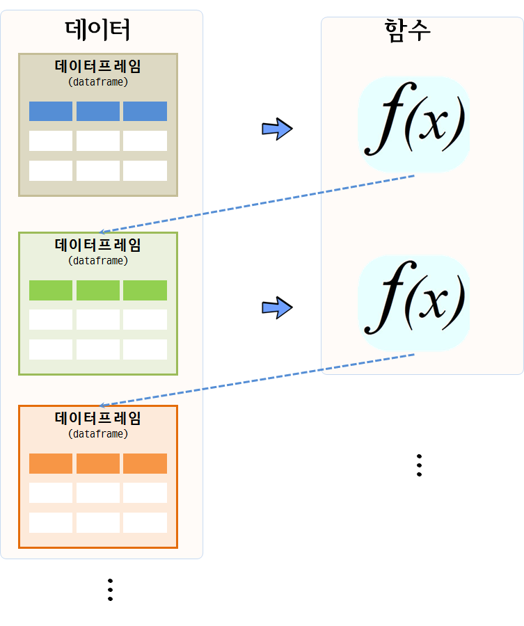
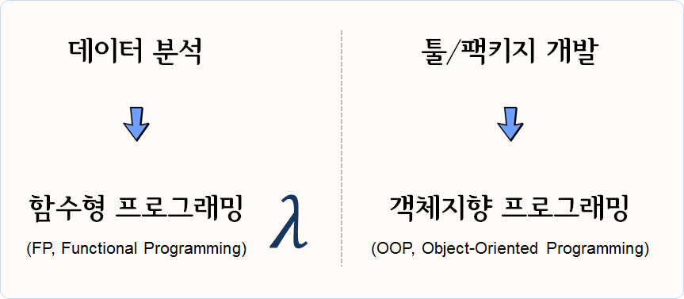

```{r, include=FALSE}
source("tools/chunk-options.R")
options(warn=-1)
```

> ## 학습 목표 {.objectives}
>
> * 데이터 과학 맥락에서 함수형 프로그래밍을 이해한다.
> * 함수형 프로그래밍과 짝꿍인 단위 테스트에 대해서 살펴본다.
> * 함수형 프로그래밍을 수치해석 예제를 통해 학습한다.


## 1. 함수형 프로그래밍 {#r-functional-programming}

함수형 프로그래밍은 코드를 작성하는 한 방식으로 특정 연산을 수행하는 함수를 먼저 작성하고 나서,
사용자로 함수를 호출해서 작업을 수행하는 방식이다.

순수 함수형 언어, 예를 들어 [하스케(Haskell)](https://ko.wikipedia.org/wiki/하스켈)은 루프가 없다.
루푸없이 어떻게 프로그램을 작성할 수 있을까? 루프는 재귀(recursion)로 대체된다. 이런 이유로 아래에서
뉴톤 방법을 통해 근을 구하는 방식을 R코드로 두가지 방법을 보여준다. R은 아직 
[꼬리 호출(tail-call recurssion)](http://hanmomhanda.github.io/2015/07/27/%EC%9E%AC%EA%B7%80-%EB%B0%98%EB%B3%B5-Tail-Recursion/) 기능을 
제공하지 않기 때문에 루프를 사용하는 것이 더 낫다. 

수학 함수는 멋진 특성이 있는데, 즉 해당 입력에 항상 동일한 결과를 갖는다. 이 특성을 **참조 투명성(referential transparaency)** 이라고 부른다.
참조 투명성은 **부수효과(side effect)** 없음을 표현하는 속성인데, 함수가 결과값 외에 다른 상태를 변경시킬 때 부수효과(side effect)가 있다고 한다.
부수 효과는 프로그램 버그를 발생시키는 온상으로, 부수 효과를 없애면 디버깅이 용이해진다.
따라서, 부수 효과를 제거하고 참조 투명성을 유지함으로써 데이터 분석 수행 결과를 예측 가능한 상태로 유지시켜 재현가능한 과학이 가능하게 된다.

> ### 함수형 프로그래밍 {.callout}
> 
> 
> R 함수형 프로그래밍을 이해하기 위해서는 먼저 자료구조에 대한 이해가 선행되어야 한다. 그리고 나서,
> 함수를 작성하는 이유와 더불어 작성법에 대한 이해도 확고히 해야만 한다.
> 
> 객체(object)가 함수를 갖는 데이터라면, 클러져는 데이터를 갖는 함수다.
> 
> > "An object is data with functions. A closure is a function with data." -- John D. Cook


명령형 언어(Imperative Language) 방식으로 R코드를 쭉 작성하게 되면, 각 단계별로 상태가 변경되는 것에 대해 신경을 쓰고 관리를 해나가야 된다.
그렇지 않으면 예기치 않은 부수 효과가 발생하여 데이터 분석 및 모형을 잘못 해석하게 된다.

그렇다고, 부수효과가 없는 순수 함수가 반듯이 좋은 것은 아니다. 예를 들어 `rnorm()` 함수를 통해 평균 0, 분산 1인 난수를 생성시키는데,
항상 동일한 값만 뽑아내면 사용자에게 의미있는 함수는 아니다. 

결국, 함수형 프로그래밍을 통해 **테스팅(testing)**과 **디버깅(debugging)**을 수월하게 하는 것이 추구하는 바이다. 이를 위해 
다음 3가지 요인이 중요하다. 

- 한번에 한가지 작업을 수행하는 함수 
- 부수효과(side effect) 회피
- 참조 투명성(Referential transparaency)

### 1.1. 왜 함수형 프로그래밍인가? {#why-functional-programming}

데이터 분석을 아주 추상화해서 간략하게 얘기한다면 데이터프레임을 함수에 넣어 새로운 데이터프레임으로 만들어 내는 것이다.


데이터 분석, 데이터 전처리, 변수 선택, 모형 개발이 한번에 해결되는 것이 아니라서, 
데이터프레임을 함수에 넣어 상태가 변경된 데이터프레임이 생성되고, 이를 다시 함수에 넣어 또다른 변경된 상태 
데이터프레임을 얻게 되는 과정을 쭉 반복해 나간다.



따라서... 데이터 분석에는 함수형 프로그래밍 패러다임을 활용하고, 툴/패키지 개발에는 객체지향 프로그래밍 패러다임 사용이 권장된다.




### 1.2. [뉴튼 방법(Newton's Method)](https://en.wikipedia.org/wiki/Newton%27s_method) {#functional-programming-newton}

뉴튼-랩슨 알고리즘으로도 알려진 뉴튼(Newton Method) 방법은 
컴퓨터를 사용해서 수치해석 방법으로 실함수의 근을 찾아내는 방법이다. 

특정 함수 $f$ 의 근을 찾을 경우, 함수 미분값 $f'$, 초기값 $x_0$가 주어지면 
근사적 근에 가까운 값은 다음과 같이 정의된다.

$$x_{1} = x_0 - \frac{f(x_0)}{f'(x_0)}$$

이 과정을 반복하게 되면 오차가 매우 적게 근의 값에 도달하게 된다.

$$x_{n+1} = x_n - \frac{f(x_n)}{f'(x_n)}$$

기하적으로 보면, 파란 선은 함수 $f$ 이고, 
$f$를 미분한 $f'$ 빨간 선은  뉴턴방법을 활용하여 근을 구해가는 과정을 시각적으로 보여주고 있다.
$x_{n-1}$ 보다 $x_n$이, $x_n$ 보다 $x_{n+1}$이 함수 $f$ 근에 더 가깝게 접근해 나가는 것이 확인된다.


### 1.3. 뉴튼 방법 R 코드 [^fp-book] {#functional-programming-newton-method}

[^fp-book]: [Bruno Rodrigues(2016), "Functional programming and unit testing for data munging with R", LeanPub, 2016-12-23](http://www.brodrigues.co/fput/)

뉴튼 방법을 R코들 구현하면 다음과 같이 612의 제곱근 값을 수치적으로 컴퓨터를 활용하여 구할 수 있다.
`while`같은 루프를 활용하여 반복적으로 해를 구하는 것도 가능하지만 재귀를 활용하여 해를 구하는 방법이 
코드를 작성하고 읽는 개발자 관점에서는 훨씬 더 편리하고 권장된다.

하지만, 속도는 `while` 루프를 사용하는 것이 R에서는 득이 많다. 이유는 오랜 세월에 걸쳐 최적화 과정을 거쳐 진화했기 때문이다.


<div class = "row">
<div class = "col-md-6">
**while 루프를 사용한 방법**

``` {r fp-newton, message=FALSE}
find_root <- function(guess, init, eps = 10^(-10)){
    while(abs(init**2 - guess) > eps){
        init <- 1/2 *(init + guess/init)
        cat("현재 값: ", init, "\n")
    }
    return(init)
}

find_root(612, 10)
```

</div>
<div class = "col-md-6">
**재귀를 사용한 방법**

``` {r fp-newton-recurrsion, message=FALSE}
find_root_recur <- function(guess, init, eps = 10^(-10)){
    if(abs(init**2 - guess) < eps){
        return(init)
    } else{
        init <- 1/2 *(init + guess/init)
        cat("재귀방법 현재 값: ", init, "\n")
        return(find_root_recur(guess, init, eps))
    }
}

find_root_recur(612, 10)
```
</div>
</div>


## 2. `Map()`, `Reduce()` 함수와 `*apply()` 함수 가족 [^jennybc-purrr] [^jennybc-purrr-github] {#map-reduce-apply}

[^jennybc-purrr]: [`purrr` tutorial: Lessons and Examples](https://jennybc.github.io/purrr-tutorial/index.html)

[^jennybc-purrr-github]: [`purrr` tutorial GitHub Webpage](https://github.com/jennybc/purrr-tutorial/)

함수를 인자로 받는 함수를 고차함수(High-order function)라고 부른다. 
대표적으로 `Map()`, `Reduce()`가 있다. 숫자 하나가 아닌 벡터에 대한 제곱근을 구하기 위해서 
`Map` 함수를 사용한다.


``` {r fp-map, message=FALSE}
# 제곱근 함수 -------------------------------------------

find_root_recur <- function(guess, init, eps = 10^(-10)){
    if(abs(init**2 - guess) < eps){
        return(init)
    } else{
        init <- 1/2 *(init + guess/init)
        return(find_root_recur(guess, init, eps))
    }
}

# 벡터에 대한 제곱근 계산 

numbers <- c(16, 25, 36, 49, 64, 81)
Map(find_root_recur, numbers, init=1, eps = 10^-10)
```

숫자 하나를 받는 함수가 아니라, 벡터를 인자로 받아 제곱근을 계산하는 함수를 
작성할 경우 함수 내부에서 함수를 인자로 받을 수 있도록 `Map` 함수를 활용한다.


``` {r fp-map-ver, message=FALSE}
# `Map` 벡터 제곱근 계산

find_vec_root_recur <- function(numbers, init, eps = 10^(-10)){
    return(Map(find_root_recur, numbers, init, eps))
}

numbers_z <- c(9, 16, 25, 49, 121)
find_vec_root_recur(numbers_z, init=1, eps=10^(-10))
```

이러한 패턴이 많이 활용되어 `*apply` 함수가 있어, 이전에 많이 사용했을 것이다.
벡터를 인자로 먼저 넣고, 함수명을 두번째 인자로 넣고, 함수에 들어갈 매개변수를 순서대로 쭉 나열하여 
`lapply`, `sapply` 함수에 넣는다.

``` {r fp-apply-family, message=FALSE}
# `lapply` 활용 제급근 계산

lapply(numbers_z, find_root_recur, init=1, eps=10^(-10))
sapply(numbers_z, find_root_recur, init=1, eps=10^(-10))
```

`Reduce` 함수도 삶을 편안하게 할 수 있는, 루프를 회피하는 또다른 방법이다.
이름에서 알 수 있듯이 `numbers_z` 벡터 원소 각각에 대해 해당 연산작업 `+`, `%%`

``` {r fp-reduce, message=FALSE}
# Reduce ----------------------------------------------
numbers_z
Reduce(`+`, numbers_z)

numbers_z <- c(10,7,5)
Reduce(`%%`, numbers_z)
```

## 3. `purrr` 팩키지 {#functional-programming-purrr}

`*apply` 계열 함수는 각각의 자료형에 맞춰 기억하기가 쉽지 않아, 매번 도움말을 찾아 확인하고 코딩을 해야하는 번거러움이 많다.
데이터 분석을 함수형 프로그래밍 패러다임으로 실행하도록 `purrr` 팩키지가 개발되었다. 이를 통해 데이터 분석 작업이 수월하게 되어
저녁이 있는 삶이 길어질 것으로 기대된다.


