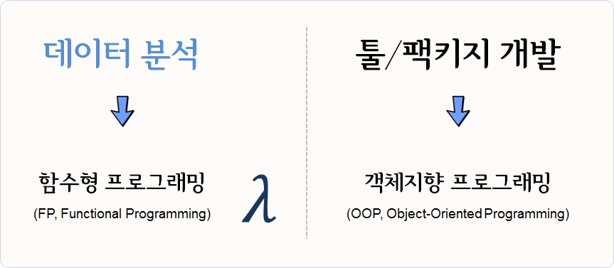

```{r setup, include=FALSE}
options(htmltools.dir.version = FALSE)

knitr::opts_chunk$set(echo = TRUE, warning=FALSE, message=FALSE,
                    comment="", digits = 3, tidy = FALSE, prompt = FALSE, fig.align = 'center')


```

# 함수형 프로그래밍 {#r-functional-programming}

데이터 과학 맥락에서 함수형 프로그래밍을 이해하고, 수치해석 예제를 통해 코드를 작성하고,
함수형 프로그래밍과 짝꿍인 단위 테스트에 대해서 살펴본다.

**함수형 프로그래밍(functional programming)**은 코드를 작성하는 한 방식으로 특정 연산을 수행하는 함수를 먼저 작성하고 나서,
사용자가 함수를 호출해서 작업을 수행하는 방식이다. 순수 함수형 언어, 예를 들어 [하스케(Haskell)](https://ko.wikipedia.org/wiki/하스켈)은 루프가 없다.
루푸없이 어떻게 프로그램을 작성할 수 있을까? 루프는 재귀(recursion)로 대체된다. 이런 이유로 아래에서
뉴톤 방법을 통해 근을 구하는 방식을 R코드로 두가지 방법을 보여준다. R은 아직 
[꼬리 호출(tail-call recurssion)](http://hanmomhanda.github.io/2015/07/27/%EC%9E%AC%EA%B7%80-%EB%B0%98%EB%B3%B5-Tail-Recursion/) 기능을 
제공하지 않기 때문에 루프를 사용하는 것이 더 낫다. 

수학 함수는 멋진 특성이 있는데, 즉 해당 입력에 항상 동일한 결과를 갖는다. 이 특성을 **참조 투명성(referential transparaency)** 이라고 부른다.
참조 투명성은 **부수효과(side effect)** 없음을 표현하는 속성인데, 함수가 결과값 외에 다른 상태를 변경시킬 때 부수효과(side effect)가 있다고 한다.
부수 효과는 프로그램 버그를 발생시키는 온상으로, 부수 효과를 없애면 디버깅이 용이해진다.
따라서, 부수 효과를 제거하고 참조 투명성을 유지함으로써 데이터 분석 수행 결과를 예측 가능한 상태로 유지시켜 **재현가능한 과학**이 가능하게 된다.


<style>
div.blue { background-color:#e6f0ff; border-radius: 5px; padding: 10px;}
</style>
<div class = "blue">

**함수형 프로그래밍**

R 함수형 프로그래밍을 이해하기 위해서는 먼저 자료구조에 대한 이해가 선행되어야 한다. 그리고 나서,
함수를 작성하는 이유와 더불어 작성법에 대한 이해도 확고히 해야만 한다.
 
객체(object)가 함수를 갖는 데이터라면, 클러져는 데이터를 갖는 함수다.
 
> "An object is data with functions. A closure is a function with data." -- John D. Cook

</div>


명령형 언어(Imperative Language) 방식으로 R코드를 쭉 작성하게 되면, 각 단계별로 상태가 변경되는 것에 대해 신경을 쓰고 관리를 해나가야 된다.
그렇지 않으면 예기치 않은 부수 효과가 발생하여 데이터 분석 및 모형을 잘못 해석하게 된다.

그렇다고, 부수효과가 없는 순수 함수가 반듯이 좋은 것은 아니다. 예를 들어 `rnorm()` 함수를 통해 평균 0, 분산 1인 난수를 생성시키는데,
항상 동일한 값만 뽑아내면 사용자에게 의미있는 함수는 아니다. 

결국, 함수형 프로그래밍을 통해 **테스팅(testing)**과 **디버깅(debugging)**을 수월하게 하는 것이 추구하는 바이다. 이를 위해 
다음 3가지 요인이 중요하다. 

- 한번에 한가지 작업을 수행하는 함수 
- 부수효과(side effect) 회피
- 참조 투명성(Referential transparaency)

## 왜 함수형 프로그래밍인가? {#why-functional-programming}

데이터 분석을 아주 추상화해서 간략하게 얘기한다면 데이터프레임을 함수에 넣어 새로운 데이터프레임으로 만들어 내는 것이다.


데이터 분석, 데이터 전처리, 변수 선택, 모형 개발이 한번에 해결되는 것이 아니라서, 
데이터프레임을 함수에 넣어 상태가 변경된 데이터프레임이 생성되고, 이를 다시 함수에 넣어 또다른 변경된 상태 
데이터프레임을 얻게 되는 과정을 쭉 반복해 나간다.


따라서... 데이터 분석에는 함수형 프로그래밍 패러다임을 활용하고, 툴/패키지 개발에는 객체지향 프로그래밍 패러다임 사용이 권장된다.




## [뉴튼 방법(Newton's Method)](https://en.wikipedia.org/wiki/Newton%27s_method) {#functional-programming-newton}

뉴튼-랩슨 알고리즘으로도 알려진 뉴튼(Newton Method) 방법은 
컴퓨터를 사용해서 수치해석 방법으로 실함수의 근을 찾아내는 방법이다. 

특정 함수 $f$ 의 근을 찾을 경우, 함수 미분값 $f'$, 초기값 $x_0$가 주어지면 
근사적 근에 가까운 값은 다음과 같이 정의된다.

$$x_{1} = x_0 - \frac{f(x_0)}{f'(x_0)}$$

이 과정을 반복하게 되면 오차가 매우 적게 근의 값에 도달하게 된다.

$$x_{n+1} = x_n - \frac{f(x_n)}{f'(x_n)}$$

기하적으로 보면, 파란 선은 함수 $f$ 이고, 
$f$를 미분한 $f'$ 빨간 선은  뉴턴방법을 활용하여 근을 구해가는 과정을 시각적으로 보여주고 있다.
$x_{n-1}$ 보다 $x_n$이, $x_n$ 보다 $x_{n+1}$이 함수 $f$ 근에 더 가깝게 접근해 나가는 것이 확인된다.


## 뉴튼 방법 R 코드 [^fp-book] {#functional-programming-newton-method}

[^fp-book]: [Bruno Rodrigues(2016), "Functional programming and unit testing for data munging with R", LeanPub, 2016-12-23](http://www.brodrigues.co/fput/)

뉴튼 방법을 R코들 구현하면 다음과 같이 612의 제곱근 값을 수치적으로 컴퓨터를 활용하여 구할 수 있다.
`while`같은 루프를 활용하여 반복적으로 해를 구하는 것도 가능하지만 재귀를 활용하여 해를 구하는 방법이 
코드를 작성하고 읽는 개발자 관점에서는 훨씬 더 편리하고 권장된다.

하지만, 속도는 `while` 루프를 사용하는 것이 R에서는 득이 많다. 이유는 오랜 세월에 걸쳐 최적화 과정을 거쳐 진화했기 때문이다.

<div class = "row">
<div class = "col-md-6">
**while 루프를 사용한 방법**

``` {r fp-newton, message=FALSE}
find_root <- function(guess, init, eps = 10^(-10)){
    while(abs(init**2 - guess) > eps){
        init <- 1/2 *(init + guess/init)
        cat("현재 값: ", init, "\n")
    }
    return(init)
}

find_root(612, 10)
```

</div>
<div class = "col-md-6">
**재귀를 사용한 방법**

``` {r fp-newton-recurrsion, message=FALSE}
find_root_recur <- function(guess, init, eps = 10^(-10)){
    if(abs(init**2 - guess) < eps){
        return(init)
    } else{
        init <- 1/2 *(init + guess/init)
        cat("재귀방법 현재 값: ", init, "\n")
        return(find_root_recur(guess, init, eps))
    }
}

find_root_recur(612, 10)
```
</div>
</div>


# `Map()`, `Reduce()` 함수와 `*apply()` 함수 가족 [^jennybc-purrr] [^jennybc-purrr-github] {#map-reduce-apply}

[^jennybc-purrr]: [`purrr` tutorial: Lessons and Examples](https://jennybc.github.io/purrr-tutorial/index.html)

[^jennybc-purrr-github]: [`purrr` tutorial GitHub Webpage](https://github.com/jennybc/purrr-tutorial/)

함수를 인자로 받는 함수를 고차함수(High-order function)라고 부른다. 
대표적으로 `Map()`, `Reduce()`가 있다. 숫자 하나가 아닌 벡터에 대한 제곱근을 구하기 위해서 
`Map` 함수를 사용한다.


``` {r fp-map}
# 제곱근 함수 -------------------------------------------

find_root_recur <- function(guess, init, eps = 10^(-10)){
    if(abs(init**2 - guess) < eps){
        return(init)
    } else{
        init <- 1/2 *(init + guess/init)
        return(find_root_recur(guess, init, eps))
    }
}

# 벡터에 대한 제곱근 계산 

numbers <- c(16, 25, 36, 49, 64, 81)
Map(find_root_recur, numbers, init=1, eps = 10^-10)
```

숫자 하나를 받는 함수가 아니라, 벡터를 인자로 받아 제곱근을 계산하는 함수를 
작성할 경우 함수 내부에서 함수를 인자로 받을 수 있도록 `Map` 함수를 활용한다.


``` {r fp-map-ver}
# `Map` 벡터 제곱근 계산

find_vec_root_recur <- function(numbers, init, eps = 10^(-10)){
    return(Map(find_root_recur, numbers, init, eps))
}

numbers_z <- c(9, 16, 25, 49, 121)
find_vec_root_recur(numbers_z, init=1, eps=10^(-10))
```

이러한 패턴이 많이 활용되어 `*apply` 함수가 있어, 이전에 많이 사용했을 것이다.
벡터를 인자로 먼저 넣고, 함수명을 두번째 인자로 넣고, 함수에 들어갈 매개변수를 순서대로 쭉 나열하여 
`lapply`, `sapply` 함수에 넣는다.

``` {r fp-apply-family}
# `lapply` 활용 제급근 계산

lapply(numbers_z, find_root_recur, init=1, eps=10^(-10))
sapply(numbers_z, find_root_recur, init=1, eps=10^(-10))
```

`Reduce` 함수도 삶을 편안하게 할 수 있는, 루프를 회피하는 또다른 방법이다.
이름에서 알 수 있듯이 `numbers_z` 벡터 원소 각각에 대해 해당 연산작업 `+`, `%%`을 수행시킨다.
`%%`는 나머지 연산자로 기본디폴트 설정으로 $\frac{10}{7}$로 몫 대신에 나머지 3을 우선 계산하고,
그 다음으로 $\frac{3}{5}$로 최종 나머지 3을 순차적으로 계산하여 결과를 도출한다.

``` {r fp-reduce}
# Reduce ----------------------------------------------
numbers_z
Reduce(`+`, numbers_z)

numbers_z <- c(10,7,5)
Reduce(`%%`, numbers_z)
```


# `purrr` 팩키지 {#functional-programming-purrr}

`*apply` 계열 함수는 각각의 자료형에 맞춰 기억하기가 쉽지 않아, 매번 도움말을 찾아 확인하고 코딩을 해야하는 번거러움이 많다.
데이터 분석을 함수형 프로그래밍 패러다임으로 실행하도록 `purrr` 팩키지가 개발되었다. 이를 통해 데이터 분석 작업이 수월하게 되어 저녁이 있는 삶이 길어질 것으로 기대된다.

## `purrr` 헬로월드 {#functional-programming-purrr-hello-world}

`purrr` 팩키지를 불러와서 `map_dbl()` 함수에 구문에 맞게 작성하면 동일한 결과를 깔끔하게 얻을 수 있다. 즉,

- `map_dbl()`: 벡터, 데이터프레임, 리스트에 대해 함수를 원소별로 적용시켜 결과를 `double` 숫자형으로 출력시킨다.
- `numbers`: 함수를 각 원소별로 적용시킬 벡터 입력값
- `find_root_recur`: 앞서 작성한 뉴톤 방법으로 제곱근을 수치적으로 구하는 사용자 정의함수.
- `init=1, eps = 10^-10`: 뉴톤 방법을 구현한 사용자 정의함수에 필요한 초기값.

``` {r newton-fp-purrr}
library(purrr)
numbers <- c(16, 25, 36, 49, 64, 81)
map_dbl(numbers, find_root_recur, init=1, eps = 10^-10)
```

## 데이터 불러오는 사례 {#functional-programming-purrr-read-iris}

구글 검색을 통해서 쉽게 [iris(붓꽃) 데이터](https://gist.githubusercontent.com/curran/a08a1080b88344b0c8a7/raw/d546eaee765268bf2f487608c537c05e22e4b221/iris.csv)를 구할 수 있다. 이를 불러와서 각 종별로 `setosa`
`versicolor`, `virginica`로 나눠 로컬 `.csv` 파일로 저장하고 나서 이를 다시 불러오는 사례를 함수형 프로그래밍으로 구현해본다.


먼저 `iris.csv` 파일을 R로 불러와서 각 종별로 나눠서 `iris_종명.csv` 파일형식으로 저장시킨다.

```{r fp-iris}
library(tidyverse)
iris_df <- read_csv("https://gist.githubusercontent.com/curran/a08a1080b88344b0c8a7/raw/d546eaee765268bf2f487608c537c05e22e4b221/iris.csv")

iris_species <- iris_df %>% 
  count(species) %>% pull(species)

for(i in 1:nrow(iris_df)) {
  tmp_df <- iris_df %>% 
    filter(species == iris_species[i])
  species_name <- iris_species[i]
  tmp_df %>% write_csv(paste0("data/iris_", species_name, ".csv"))
}

Sys.glob("data/iris_*.csv")
```

로컬 파일 `iris_종명.csv` 형식으로 저장된 데이터를 함수형 프로그래밍을 통해 불러와서 분석작업을 수행해보자. `map()` 함수를 사용해서 각 종별로 데이터를 깔끔하게 불러왔다.

`iris_filename` 벡터에 `iris_종명.csv`과 경로명이 포함된 문자열을 저장시켜 놓고 `read_csv()` 함수를 각 벡터 원소에 적용시켜 출력값으로 리스트 `iris_list` 객체를 생성시켰다.

```{r fp-iris-read}
iris_filename <- c("data/iris_setosa.csv", "data/iris_versicolor.csv", "data/iris_virginica.csv")

iris_list <- map(iris_filename, read_csv) %>% 
  set_names(iris_species)

listviewer::jsonedit(iris_list)
```

## 데이터 분석사례 {#functional-programming-purrr-analysis}

`iris_list` 각 원소는 데이터프레임이라 `summary` 함수를 사용해서 기술 통계량을 구할 수도 있다. 물론 `cor()` 함수를 사용해서 `iris_list`의 각 원소를 지정하는 `.x` 여기서는 종별 데이터프레임에서 변수 두개를 추출하여 `sepal_length`, `sepal_width` 이 둘간의 스피커만 상관계수를 계산하는데 출력값이 `double` 연속형이라 `map_dbl`로 저정하여 작업시킨다.

```{r fp-iris-analysis}
map(iris_list, summary)

map_dbl(iris_list, ~cor(.x$sepal_length, .x$sepal_width, method = "spearman"))
```


## 난수생성 사례 {#functional-programming-purrr-random-number}

서로 다른 난수를 생성시키는 방법을 살펴보자. 
정규분포를 가정하고 평균과 표준편차를 달리하는 모수를 지정하고 난수갯수도 숫자를 달리하여 난수를 생성시킨다.

### $\mu$ 평균만 달리함 {#functional-programming-purrr-random-number-mean}

정규분포에서 난수를 10개 추출하는데 표준편차는 1로 고정시키고, 평균만 달리한다.
평균만 달리하기 때문에 `map()` 함수를 그대로 사용한다. 즉, 입력값으로 평균만 달리하는 리스트를 입력값으로 넣는다.

```{r fp-iris-random-number-mean}
## 평균을 달리하는 경우
normal_mean <- list(1,5,10)

sim_mu_name <- paste0("mu: ", normal_mean)

sim_mu_list <- map(normal_mean, ~ data.frame(mean = .x, 
                            random_number = rnorm(mean=.x, sd=1, n=10))) %>% 
  set_names(sim_mu_name)

map_dbl(sim_mu_list, ~mean(.x$random_number))

listviewer::jsonedit(sim_mu_list)
```

### $\mu$ 평균과 $\sigma$ 표준편차를 달리함 {#functional-programming-purrr-random-number-mean-sd}

난수갯수만 고정시키고 평균과 표준편차를 달리하여 난수를 정규분포에서 추출한다. 입력값으로 평균과 표준편차 두개가 되기 때문에 `map2()` 함수를 사용한다.

```{r fp-iris-random-number-mean-sd}
## 평균과 표준편차를 달리하는 경우
normal_mean <- list(1,5,10)
normal_sd   <- list(10,5,1)

sim_mu_sd_name <- paste0("mu: ", normal_mean, ",  sd: ", normal_sd)

sim_mu_sd_list <- map2(normal_mean, normal_sd, 
                        ~ data.frame(mean = .x, sd = .y,
                            random_number = rnorm(mean=.x, sd=.y, n=10))) %>% 
  set_names(sim_mu_sd_name)

map_dbl(sim_mu_sd_list, ~sd(.x$random_number))

listviewer::jsonedit(sim_mu_sd_list)
```

### $\mu$ 평균, $\sigma$ 표준편차, 표본크기를 달리함 {#functional-programming-purrr-random-number-mean-sd-size}

$\mu$ 평균, $\sigma$ 표준편차, 표본크기를 모두 다르게 지정하여 난수를 추출한다. 이런 경우 `pmap()` 함수를 사용하고 입력 리스트가 다수라 이를 `normal_list`로 한번더 감싸서 이름이 붙은 리스트(named list)형태로 넣어주고, 이를 `function()` 함수의 내부 인수로 사용한다.

```{r fp-iris-random-number-mean-sd-size}
## 평균, 표준편차, 표본크기를 달리하는 경우
normal_mean <- list(1,5,10)
normal_sd   <- list(10,5,1)
normal_size <- list(10,20,30)

sim_mu_sd_size_name <- paste0("mu: ", normal_mean, ",  sd: ", normal_sd,
                              "  size: ", normal_size)

normal_list <- list(normal_mean=normal_mean, normal_sd=normal_sd, normal_size=normal_size)

sim_mu_sd_size_list <- pmap(normal_list,
                            function(normal_mean, normal_sd, normal_size)
                        data.frame(mean=normal_mean, sd = normal_sd, size = normal_size,
                            random_number = rnorm(mean=normal_mean, sd=normal_sd, n=normal_size))) %>% 
  set_names(sim_mu_sd_size_name)

map_dbl(sim_mu_sd_size_list, ~length(.x$random_number))

listviewer::jsonedit(sim_mu_sd_size_list)

```


## `ggplot` 시각화 [^eda-map] {#functional-programming-purrr-ggplot}

[^eda-map]: [Very statisticious (August 20, 2018), "Automating exploratory plots with ggplot2 and purrr"](https://aosmith.rbind.io/2018/08/20/automating-exploratory-plots/)

`list-column`을 활용하여 티블(tibble) 데이터프레임에 담아서 시각화를 진행해도 되고,
다른 방법으로 리스트에 담아서 이를 한장에 찍는 것도 가능하다.

```{r fp-iris-viz}
library(gapminder)

## 데이터 -----
three_country <-  c("Korea, Rep.", "Japan", "China")

gapminder_tbl <- gapminder %>% 
  filter(str_detect(continent, "Asia")) %>% 
  group_by(continent, country) %>% 
  nest() %>% 
  select(-continent) %>% 
  filter(country %in% three_country )

## 티블 데이터 시각화 -----
gapminder_plot_tbl <- gapminder_tbl %>% 
  mutate(graph = map2(data, three_country, 
                     ~ggplot(.x, aes(x=year, y=gdpPercap)) +
                       geom_line() +
                       labs(title=.y)))

gapminder_plot_tbl

## 리스트 데이터 시각화 -----
gapminder_plot <- map2(gapminder_tbl$data , three_country, 
                     ~ggplot(.x, aes(x=year, y=gdpPercap)) +
                       geom_line() +
                       labs(title=.y))

walk(gapminder_plot, print)

## 리스트 데이터 시각화 - 한장에 찍기 -----
cowplot::plot_grid(plotlist = gapminder_plot)
```


# 함수형 프로그래밍 이론과 실제 {#fp-theory-practice}

함수는 다음과 같이 될 수도 있어 함수형 프로그래밍 언어가 된다. [^fp-advanced-r]

[^fp-advanced-r]: [Advanced R, "Introduction"](https://adv-r.hadley.nz/fp.html)

- 함수의 인자
- 함수로 반환
- 리스트에 저장
- 변수에 저장
- 무명함수
- 조작할 수 있다.

Firstly, functional languages have first-class functions, functions that behave like any other data structure. 
In R, this means that you can do anything with a function that you can do with a vector: 
you can assign them to variables, store them in lists, pass them as arguments to other functions, create them inside functions, 
and even return them as the result of a function.

<style>
div.blue { background-color:#e6f0ff; border-radius: 5px; padding: 10px;}
</style>
<div class = "blue">

John Chambers 창시자가 말하는 R 계산의 기본원칙

- 존재하는 모든 것은 객체다. (Everything that exists is an object.)
- 일어나는 모든 것은 함수호출이다. (Everything that happens is a function call.)

```{r function-calls}
library(tidyverse)
class(`%>%`)
class(`$`)
class(`<-`)
class(`+`)
```

</div>

## 순수한 함수 vs 순수하지 않은 함수 {#pure-vs-impure-function}

**순수한 함수(pure function)**는 입력값에만 출력값이 의존하게 되는 특성과 부수효과(side-effect)를 갖지 않는 반면 **순수하지 않은 함수(impure function)**는 환경에 의존하며 부수효과도 갖는다.

<div class = "row">
<div class = "col-md-6">
**순수한 함수(pure function)**

``` {r fp-pure-function}
min(1:100)

mean(1:100)
```

</div>
<div class = "col-md-6">
**순수하지 않은 함수(impure function)**

``` {r fp-impure-function}
Sys.time()

rnorm(10)

# write_csv("data/sample.csv")
```
</div>
</div>


## 무명함수(lambda function)와 매퍼(mapper) {#fp-lambda-functin}

$\lambda$ (람다) 함수는 무명(anonymous) 함수는 함수명을 갖는 일반적인 함수와 비교하여 함수의 좋은 점은 그대로 누리면서 함수가 많아 함수명으로 메모리가 난잡하게 지져분해지는 것을 막을 수 있다.

무명함수로 기능르 구현한 후에 매퍼(mapper)를 사용해서 `as_mapper()` 명칭을 부여하여 함수처럼 사용하는 것도 가능하다. 매퍼(mapper)를 사용하는 이유를 다음과 같이 정리할 수 있다.

- 간결함(Concise)
- 가독성(Easy to read)
- 재사용성(Reusable)

정치인 페이스북 페이지에서 팬수를 추출한다. 그리고 이를 이름이 부은 리스트(named list)로 일자별 팬수 추이를 리스트로 준비한다. 그리고 나서 안철수, 문재인, 심상정 세 후보에 대한 최고 팬수증가를 무명함수로 계산한다.

```{r fp-lambda-function}
library(tidyverse)
## 데이터프레임을 리스트로 변환
ahn_df  <- read_csv("data/fb_ahn.csv")  %>% rename(fans = ahn_fans) %>% 
  mutate(fans_lag = lag(fans),
         fans_diff = fans - fans_lag) %>% 
  select(fdate, fans = fans_diff) %>% 
  filter(!is.na(fans))
moon_df <- read_csv("data/fb_moon.csv") %>% rename(fans = moon_fans) %>% 
  mutate(fans_lag = lag(fans),
         fans_diff = fans - fans_lag) %>% 
  select(fdate, fans = fans_diff) %>% 
  filter(!is.na(fans))
sim_df  <- read_csv("data/fb_sim.csv")  %>% rename(fans = sim_fans) %>% 
  mutate(fans_lag = lag(fans),
         fans_diff = fans - fans_lag) %>% 
  select(fdate, fans = fans_diff) %>% 
  filter(!is.na(fans))

convert_to_list <- function(df) {
  df_fans_v <- df$fans %>% 
    set_names(df$fdate)
  return(df_fans_v)
}

ahn_v  <- convert_to_list(ahn_df)
moon_v <- convert_to_list(moon_df)
sim_v  <- convert_to_list(sim_df)

fans_lst <- list(ahn_fans  = ahn_v,
                 moon_fans = moon_v,
                 sim_fans  = sim_v)

listviewer::jsonedit(fans_lst)

## 무명함수 테스트
map_dbl(fans_lst, ~max(.x))
```

`rlang_lambda_function` 무명함수로 `increase_1000_fans` 작성해서 일별 팬수 증가가 1000명 이상인 경우 `keep()` 함수를 사용해서 각 후보별로 추출할 수 있다.  `discard()` 함수를 사용해서 반대로 버려버릴 수도 있다.

```{r list-data-manipulation, eval=TRUE}
increase_1000_fans <- as_mapper( ~.x > 1000)

map(fans_lst, ~keep(.x, increase_1000_fans))
```

[술어논리(predicate logic)](https://terms.naver.com/entry.nhn?docId=1116302&cid=40942&categoryId=31530)은 조건을 테스트하여 참(`TRUE`), 거짓(`FALSE`)을 반환시킨다. `every`, `some`을 사용하여 팬수가 증가한 날이 매일 1,000명이 증가했는지, 전부는 아니고 일부 특정한 날에 1,000명이 증가했는지 파악할 수 있다.

```{r list-data-manipulation-predicate, eval=TRUE}
## 세후보 팬수가 매일 모두 1000명 이상 증가했나요?
map(fans_lst, ~every(.x, increase_1000_fans))
## 세후보 팬수가 전체는 아니고 일부 특정한 날에 1000명 이상 증가했나요?
map(fans_lst, ~some(.x, increase_1000_fans))
```

## 고차 함수(High order function) {#high-order-function}

고차 함수(High order function)는 함수의 인자로 함수를 받아 함수로 반환시키는 함수를 지칭한다. `high_order_fun` 함수는 함수를 인자(`func`)로 받아 함수를 반환시키는 고차함수다. 
평균 함수(`mean`)를 인자로 넣어 출력값으로 `mean_na()` 함수를 새롭게 생성시킨다. 
`NA`가 포함된 벡터를 넣어 평균값을 계산하게 된다.

```{r high-order-function}
high_order_fun <- function(func){
  function(...){
    func(..., na.rm = TRUE)
  }
}

mean_na <- high_order_fun(mean)
mean_na( c(NA, 1:10) )

```

벡터가 입력값으로 들어가서 벡터가 출력값으로 나오는 보통 함수(Regular Function)외에 고차함수는 3가지 유형이 있다. 

- 벡터 &rarr; 함수: 함수공장(Function Factory) 
- 함수 &rarr; 벡터: Functional - `for`루프를 `purrr` 팩키지 `map()` 함수로 대체
- 함수 &rarr; 함수: 함수연산자(Function Operator) - `Functional`과 함께 사용될 경우 `adverbs`로서 강력한 기능을 발휘


## 부사(`adverbs`) - `safely`, `possibly`,... {#adverbs-safely-possibly}

`purrr` 팩키지의 대표적인 부사(adverbs)에는 `possibly()`와 `safely()`가 있다.
그외에도 `silently()`, `surely()` 등 다른 부사도 있으니 필요한 경우 `purrr` 팩키지 문서를 참조한다.

`safely(mean)`은 동사 함수(`mean()`)를 받아 부사 `safely()`로 "부사 + 동사"로 기능이 추가된 부사 동사를 반환시킨다. 따라서, `NA`가 추가된 벡터를 넣을 경우 `$result`와 `$error`를 원소로 갖는 리스트를 반환시킨다.

```{r adverbs-safely-example}
mean_safe <- safely(mean)
class(mean_safe)

mean_safe(c(NA, 1:10))
```

이를 활용하여 오류처리작업을 간결하게 수행시킬 수 있다.
`$result`와 `$error`을 원소로 갖는 리스트를 반환시키기 때문에 오류와 결과값을 추출하여 후속작업을 수행하여 디버깅하는데 유용하게 활용할 수 있다.

```{r adverbs-safely-error}
test_lst <- list("NA", 1,2,3,4,5)
log_safe <- safely(log)

map(test_lst, log_safe) %>% 
  map("result")

map(test_lst, log_safe) %>% 
  map("error")
```


반면에 `possibly()`는 결과와 `otherwise` 값을 반환시켜서 오류가 발생되면 중단되는 것이 아니라 오류가 있다는 사실을 알고 예외처리시킨 후에 쭉 정상진행시킨다.

```{r adverbs-possibly}
max_possibly <- possibly(sum, otherwise = "watch out")

max_possibly(c(1:10))

max_possibly(c(NA, 1:10))

max_possibly(c("NA", 1:10))
```

`possibly()`는 부울 논리값, `NA`, 문자열, 숫자를 반환시킬 수 있다.

`transpose()`와 결합하여 `safely()`, `possibly()` 결과를 변형시킬 수도 있다.

```{r adverbs-transpose}
map(test_lst, log_safe) %>% length()

map(test_lst, log_safe) %>% transpose() %>% length()
```

`compact()`를 사용해서 `NULL`을 제거하는데, 앞서 `possibly()`의 인자로 `otherwise=`를 지정하는 경우 `otherwise=NULL`와 같이 정의해서 예외처리로 `NULL`을 만들어 내고 `compact()`로 정상처리된 데이터만 얻는 작업흐름을 갖춘다.

```{r adverbs-possibly-compact}
null_lst <- list(1, NULL, 3, 4, NULL, 6, 7, NA)
compact(null_lst)

possibly_log <- possibly(log, otherwise = NULL)
map(null_lst, possibly_log) %>% compact()
```

# 깨끗한 코드(clean code) [^clean-code-colin-fay] {#fp-clean-code}

[^clean-code-colin-fay]: [Colin Fay, "A Crazy Little Thing Called {purrr} - Part 5: code optimization"](https://colinfay.me/purrr-code-optim/)

`round_mean()` 함수를 `compose()` 함수를 사용해서 `mean()` 함수로 평균을 구한 후에 `round()`함수로 반올림하는 코드를 다음과 같이 쉽게 작성할 수 있다.

```{r fp-clean-code}
round_mean <- compose(round, mean)
round_mean(1:10)
```

두번째 사례로 전형적인 데이터 분석 사례로 `lm()` &rarr; `anova()` &rarr; `tidy()`를 통해 한방에 선형회귀 모형 산출물을 깨끗한 코드로 작성하는 사례를 살펴보자.

`mtcars` 데이터셋에서 연비 예측에 변수 두개를 넣고 일반적인 `lm()` 선형예측모형 제작방식과 동일하게 인자를 넣는다.

```{r fp-clean-code-lm-compose}
clean_lm <- compose(broom::tidy, anova, lm)
clean_lm(mpg ~ hp + wt, data=mtcars)
```

`compose()`를 통해 함수를 조합하는 경우 함수의 인자를 함께 전달해야될 경우가 있다. 이와 같은 경우 `partial()`을 사용해서 인자를 넘기는 함수를 제작하여 `compose()`에 넣어준다.

```{r fp-clean-code-partial}
robust_round_mean <- compose(
  partial(round, digits=1),
  partial(mean, na.rm=TRUE))
robust_round_mean(c(NA, 1:10))
```

리스트 칼럼(list-column)과 결합하여 모형에서 나온 데이터 분석결과를 깔끔하게 코드로 제작해보자. 먼저 `lm`을 돌려 모형 요약하는 함수 `summary`를 통해 `r.squared`값을 추출하는 함수를 `summary_lm`으로 제작한다.

그리고 나서 `nest()` 함수로 리스트 칼럼(list-column)을 만들고 두개의 집단 수동/자동을 나타내는 `am` 변수를 그룹으로 삼아 두 집단에 속한 수동/자동 데이터에 대한 선형 회귀모형을 적합시키고 나서 "r.squared"값을 추출하여 이를 티블 데이터프레임에 저장시킨다. 

```{r fp-clean-code-lm}
summary_lm <- compose(summary, lm) 

mtcars %>%
  group_by(am) %>%
  nest() %>%
  mutate(lm_mod = map(data, ~ summary_lm(mpg ~ hp + wt, data = .x)),
         r_squared = map(lm_mod, "r.squared")) %>%
  unnest(r_squared)
```
