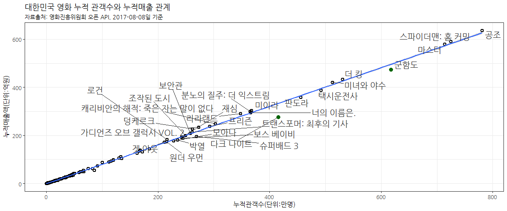
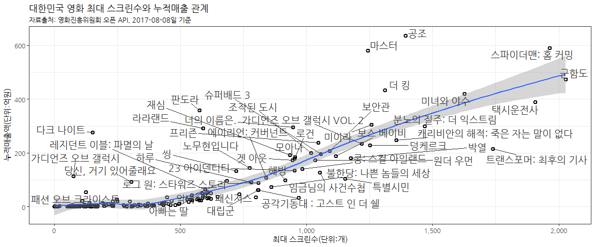

# R 병렬 프로그래밍
xwMOOC  
`r Sys.Date()`  
 

## 1. 국내 영화 데이터 {#kofic-data}

[영화진흥위원회(KOFIC)](http://www.kobis.or.kr/) 홈페이지를 통해 [영화 오픈API](http://www.kobis.or.kr/kobisopenapi/homepg/main/main.do) 서비스를 제공하고 있다.
물론, 회원가입하고 API Key를 발급받아야 하고 하루 3,000번으로 제약이 있지만 분석에 필요한 데이터를 얻는데는 어려움이 없을 것으로 보인다.
오픈 API를 통해 제공하는 데이터는 다음과 같다.

1. 박스오피스: 일별 박스오피스, 주간/주말 박스오피스
1. 공통코드	: 공통코드 조회
1. 영화 정보 : 영화목록, 영화 상세정보
1. 영화사 정보: 영화사목록, 영화사 상세정보
1. 영화인 정보: 영화인목록, 영화인 상세정보

하단에 호출하는 예시도 있으니 참조하여 활용한다.

- XML : http://www.kobis.or.kr/kobisopenapi/webservice/rest/boxoffice/searchDailyBoxOfficeList.xml?key=430156241533f1d058c603178cc3ca0e&targetDt=20120101
- JSON : http://www.kobis.or.kr/kobisopenapi/webservice/rest/boxoffice/searchDailyBoxOfficeList.json?key=430156241533f1d058c603178cc3ca0e&targetDt=20120101

## 2. 두가지 궁금한 점 {#two-hypothesis}

국내 영화데이터를 받아보고 두가지 궁금한 점이 생겼다.

- 어떤 영화에 무료 영화 티켓이 많이 배부되었을까?
- 스크린수가 많다고 해서 매출이 늘어날까?

이 두가지 궁금증에 대한 탐색적 데이터 분석을 진행해 본다.

### 2.1. 데이터 긁어오기 {#data-scraping}

영진위 오픈 API를 통해 발급받은 키를 활용하여 영화 일일 박스오피스 데이터를 긁어온다.
일별 박스오피스 상위 10개 영화에 대한 사항만 제공하기 때문에 유념하고 2017-01-01 부터 
2017-08-08 일까지 데이터를 받아온다.

~~~{.r}
# 0. 환경설정 ------------------------------

library(tidyverse)
library(rjson)
library(lubridate)
library(stringr)
library(purrr)
library(ggrepel)
library(ggthemes)
library(extrafont)
loadfonts()

# 1. 데이터 긁어오기 ------------------------------

api_key <- '01xxxxxxxxxxxxxxxxxxxxxxxxxxxxxx'

scraping_movie_info <- function(start_date, end_date) {
    # 영화 검색 시작일과 종료일
    start_date <- ymd(start_date)
    end_date   <- ymd(end_date)
    
    # 영화 API 정보 저장
    movie_list <- list()
    
    for(i in 1:(as.numeric(end_date - start_date)+1)) {
        parameter_date <- str_replace_all(as.character(start_date+i-1), "-", "")
        url <- paste0('http://www.kobis.or.kr/kobisopenapi/webservice/rest/boxoffice/searchDailyBoxOfficeList.json?key=', api_key, '&targetDt=', parameter_date)
        print(url)
        movie_list[i] <- fromJSON(file = url) 
    }
    return(movie_list)
}

movie_list <- scraping_movie_info('2017-01-01', '2017-08-08')
~~~

### 2.2. 데이터 전처리 {#data-preprocessing}

데이터를 긁어왔다면 다음은 데이터와 사투과정이 기다리고 있다.
웹데이터를 긁어오게 되면 대부분 데이터프레임 대신에 리스트 형태라 
리스트 데이터 구조를 살펴보고 데이터프레임으로 변환하는 과정을 거쳐 모형이나 시각화를 위한 사전 준비 과정을 거친다.

~~~{.r}
listviewer::jsonedit(movie_list, mode="view")
~~~

<!--html_preserve-->

<script type="application/json" data-for="htmlwidget-cf1f45bdd799c1faddc4">{"x":{"data":[{"boxofficeType":"일별 박스오피스","showRange":"20170101~20170101","dailyBoxOfficeList":[{"rnum":"1","rank":"1","rankInten":"0","rankOldAndNew":"OLD","movieCd":"20161725","movieNm":"마스터","openDt":"2016-12-21","salesAmt":"4395114100","salesShare":"46.2","salesInten":"-188384150","salesChange":"-4.1","salesAcc":"44179755165","audiCnt":"505602","audiInten":"-32182","audiChange":"-6","audiAcc":"5440922","scrnCnt":"1243","showCnt":"5715"},{"rnum":"2","rank":"2","rankInten":"0","rankOldAndNew":"OLD","movieCd":"20163183","movieNm":"로그 원: 스타워즈 스토리","openDt":"2016-12-28","salesAmt":"1612424700","salesShare":"17.0","salesInten":"-351990650","salesChange":"-17.9","salesAcc":"6739961794","audiCnt":"173451","audiInten":"-40093","audiChange":"-18.8","audiAcc":"769938","scrnCnt":"810","showCnt":"3335"},{"rnum":"3","rank":"3","rankInten":"0","rankOldAndNew":"OLD","movieCd":"20162025","movieNm":"씽","openDt":"2016-12-21","salesAmt":"943975500","salesShare":"9.9","salesInten":"-118258900","salesChange":"-11.1","salesAcc":"9147833289","audiCnt":"115152","audiInten":"-18516","audiChange":"-13.9","audiAcc":"1178327","scrnCnt":"721","showCnt":"1755"},{"rnum":"4","rank":"4","rankInten":"1","rankOldAndNew":"OLD","movieCd":"20144641","movieNm":"판도라","openDt":"2016-12-07","salesAmt":"736915900","salesShare":"7.8","salesInten":"-35315100","salesChange":"-4.6","salesAcc":"34692314064","audiCnt":"87969","audiInten":"-6796","audiChange":"-7.2","audiAcc":"4401833","scrnCnt":"576","showCnt":"1476"},{"rnum":"5","rank":"5","rankInten":"-1","rankOldAndNew":"OLD","movieCd":"20167904","movieNm":"라라랜드","openDt":"2016-12-07","salesAmt":"770889600","salesShare":"8.1","salesInten":"-162044100","salesChange":"-17.4","salesAcc":"20767028832","audiCnt":"87529","audiInten":"-21007","audiChange":"-19.4","audiAcc":"2472637","scrnCnt":"590","showCnt":"1578"},{"rnum":"6","rank":"6","rankInten":"0","rankOldAndNew":"OLD","movieCd":"20161872","movieNm":"너의 이름은.","openDt":"2017-01-04","salesAmt":"325811500","salesShare":"3.4","salesInten":"31854500","salesChange":"10.8","salesAcc":"640998500","audiCnt":"37418","audiInten":"3245","audiChange":"9.5","audiAcc":"74181","scrnCnt":"275","showCnt":"342"},{"rnum":"7","rank":"7","rankInten":"0","rankOldAndNew":"OLD","movieCd":"20162727","movieNm":"루돌프와 많이있어","openDt":"2016-12-28","salesAmt":"243890000","salesShare":"2.6","salesInten":"-23742600","salesChange":"-8.9","salesAcc":"926773600","audiCnt":"29910","audiInten":"-4074","audiChange":"-12","audiAcc":"119420","scrnCnt":"372","showCnt":"581"},{"rnum":"8","rank":"8","rankInten":"0","rankOldAndNew":"OLD","movieCd":"20162183","movieNm":"포켓몬 더 무비 XY&Z 「볼케니온 : 기계왕국의 비밀」","openDt":"2016-12-22","salesAmt":"154931400","salesShare":"1.6","salesInten":"-31745800","salesChange":"-17","salesAcc":"1821568800","audiCnt":"19405","audiInten":"-4703","audiChange":"-19.5","audiAcc":"238452","scrnCnt":"300","showCnt":"422"},{"rnum":"9","rank":"9","rankInten":"0","rankOldAndNew":"OLD","movieCd":"20152371","movieNm":"당신, 거기 있어줄래요","openDt":"2016-12-14","salesAmt":"166222000","salesShare":"1.7","salesInten":"-30383700","salesChange":"-15.5","salesAcc":"9165307248","audiCnt":"18630","audiInten":"-4126","audiChange":"-18.1","audiAcc":"1143445","scrnCnt":"261","showCnt":"572"},{"rnum":"10","rank":"10","rankInten":"1","rankOldAndNew":"OLD","movieCd":"20165285","movieNm":"극장판 도라에몽: 신 진구의 버스 오브 재팬","openDt":"2016-12-21","salesAmt":"28628400","salesShare":"0.3","salesInten":"-7085700","salesChange":"-19.8","salesAcc":"482548500","audiCnt":"3552","audiInten":"-985","audiChange":"-21.7","audiAcc":"62699","scrnCnt":"97","showCnt":"107"}]},{"boxofficeType":"일별 박스오피스","showRange":"20170102~20170102","dailyBoxOfficeList":[{"rnum":"1","rank":"1","rankInten":"0","rankOldAndNew":"OLD","movieCd":"20161725","movieNm":"마스터","openDt":"2016-12-21","salesAmt":"1401258500","salesShare":"41.9","salesInten":"-2993855600","salesChange":"-68.1","salesAcc":"45581013665","audiCnt":"182940","audiInten":"-322662","audiChange":"-63.8","audiAcc":"5623862","scrnCnt":"1159","showCnt":"5375"},{"rnum":"2","rank":"2","rankInten":"1","rankOldAndNew":"OLD","movieCd":"20162025","movieNm":"씽","openDt":"2016-12-21","salesAmt":"510172500","salesShare":"15.2","salesInten":"-433803000","salesChange":"-46","salesAcc":"9658005789","audiCnt":"70665","audiInten":"-44487","audiChange":"-38.6","audiAcc":"1248992","scrnCnt":"647","showCnt":"1718"},{"rnum":"3","rank":"3","rankInten":"-1","rankOldAndNew":"OLD","movieCd":"20163183","movieNm":"로그 원: 스타워즈 스토리","openDt":"2016-12-28","salesAmt":"417096300","salesShare":"12.5","salesInten":"-1195328400","salesChange":"-74.1","salesAcc":"7157058094","audiCnt":"49907","audiInten":"-123544","audiChange":"-71.2","audiAcc":"819845","scrnCnt":"756","showCnt":"3163"},{"rnum":"4","rank":"4","rankInten":"1","rankOldAndNew":"OLD","movieCd":"20167904","movieNm":"라라랜드","openDt":"2016-12-07","salesAmt":"356192200","salesShare":"10.6","salesInten":"-414697400","salesChange":"-53.8","salesAcc":"21123221032","audiCnt":"45774","audiInten":"-41755","audiChange":"-47.7","audiAcc":"2518411","scrnCnt":"556","showCnt":"1654"},{"rnum":"5","rank":"5","rankInten":"-1","rankOldAndNew":"OLD","movieCd":"20144641","movieNm":"판도라","openDt":"2016-12-07","salesAmt":"283473300","salesShare":"8.5","salesInten":"-453442600","salesChange":"-61.5","salesAcc":"34975787364","audiCnt":"38072","audiInten":"-49897","audiChange":"-56.7","audiAcc":"4439905","scrnCnt":"540","showCnt":"1495"},{"rnum":"6","rank":"6","rankInten":"1","rankOldAndNew":"OLD","movieCd":"20162727","movieNm":"루돌프와 많이있어","openDt":"2016-12-28","salesAmt":"136419000","salesShare":"4.1","salesInten":"-107471000","salesChange":"-44.1","salesAcc":"1063192600","audiCnt":"19063","audiInten":"-10847","audiChange":"-36.3","audiAcc":"138483","scrnCnt":"340","showCnt":"533"},{"rnum":"7","rank":"7","rankInten":"2","rankOldAndNew":"OLD","movieCd":"20152371","movieNm":"당신, 거기 있어줄래요","openDt":"2016-12-14","salesAmt":"77880200","salesShare":"2.3","salesInten":"-88341800","salesChange":"-53.1","salesAcc":"9243187448","audiCnt":"10133","audiInten":"-8497","audiChange":"-45.6","audiAcc":"1153578","scrnCnt":"305","showCnt":"616"},{"rnum":"8","rank":"8","rankInten":"0","rankOldAndNew":"OLD","movieCd":"20162183","movieNm":"포켓몬 더 무비 XY&Z 「볼케니온 : 기계왕국의 비밀」","openDt":"2016-12-22","salesAmt":"64021400","salesShare":"1.9","salesInten":"-90910000","salesChange":"-58.7","salesAcc":"1885590200","audiCnt":"9156","audiInten":"-10249","audiChange":"-52.8","audiAcc":"247608","scrnCnt":"246","showCnt":"353"},{"rnum":"9","rank":"9","rankInten":"4","rankOldAndNew":"OLD","movieCd":"19890291","movieNm":"해리가 샐리를 만났을 때","openDt":"1989-11-18","salesAmt":"11575000","salesShare":"0.3","salesInten":"-5005900","salesChange":"-30.2","salesAcc":"125812200","audiCnt":"1507","audiInten":"-378","audiChange":"-20.1","audiAcc":"16098","scrnCnt":"76","showCnt":"130"},{"rnum":"10","rank":"10","rankInten":"1","rankOldAndNew":"OLD","movieCd":"20161763","movieNm":"나, 다니엘 블레이크","openDt":"2016-12-08","salesAmt":"10006000","salesShare":"0.3","salesInten":"-8031800","salesChange":"-44.5","salesAcc":"454890100","audiCnt":"1361","audiInten":"-724","audiChange":"-34.7","audiAcc":"57298","scrnCnt":"39","showCnt":"60"}]},{"boxofficeType":"일별 박스오피스","showRange":"20170103~20170103","dailyBoxOfficeList":[{"rnum":"1","rank":"1","rankInten":"0","rankOldAndNew":"OLD","movieCd":"20161725","movieNm":"마스터","openDt":"2016-12-21","salesAmt":"1035677100","salesShare":"36.9","salesInten":"-365581400","salesChange":"-26.1","salesAcc":"46616690765","audiCnt":"135700","audiInten":"-47240","audiChange":"-25.8","audiAcc":"5759562","scrnCnt":"1171","showCnt":"5328"},{"rnum":"2","rank":"2","rankInten":"0","rankOldAndNew":"OLD","movieCd":"20162025","movieNm":"씽","openDt":"2016-12-21","salesAmt":"501522100","salesShare":"17.9","salesInten":"-8650400","salesChange":"-1.7","salesAcc":"10159527889","audiCnt":"70773","audiInten":"108","audiChange":"0.2","audiAcc":"1319765","scrnCnt":"681","showCnt":"1762"},{"rnum":"3","rank":"3","rankInten":"1","rankOldAndNew":"OLD","movieCd":"20167904","movieNm":"라라랜드","openDt":"2016-12-07","salesAmt":"317474800","salesShare":"11.3","salesInten":"-38717400","salesChange":"-10.9","salesAcc":"21440695832","audiCnt":"41085","audiInten":"-4689","audiChange":"-10.2","audiAcc":"2559496","scrnCnt":"567","showCnt":"1638"},{"rnum":"4","rank":"4","rankInten":"-1","rankOldAndNew":"OLD","movieCd":"20163183","movieNm":"로그 원: 스타워즈 스토리","openDt":"2016-12-28","salesAmt":"293678300","salesShare":"10.5","salesInten":"-123418000","salesChange":"-29.6","salesAcc":"7450736394","audiCnt":"35485","audiInten":"-14422","audiChange":"-28.9","audiAcc":"855330","scrnCnt":"759","showCnt":"3002"},{"rnum":"5","rank":"5","rankInten":"0","rankOldAndNew":"OLD","movieCd":"20144641","movieNm":"판도라","openDt":"2016-12-07","salesAmt":"205442000","salesShare":"7.3","salesInten":"-78031300","salesChange":"-27.5","salesAcc":"35181229364","audiCnt":"27605","audiInten":"-10467","audiChange":"-27.5","audiAcc":"4467510","scrnCnt":"538","showCnt":"1463"},{"rnum":"6","rank":"6","rankInten":"0","rankOldAndNew":"OLD","movieCd":"20162727","movieNm":"루돌프와 많이있어","openDt":"2016-12-28","salesAmt":"143517700","salesShare":"5.1","salesInten":"7098700","salesChange":"5.2","salesAcc":"1206710300","audiCnt":"20377","audiInten":"1314","audiChange":"6.9","audiAcc":"158860","scrnCnt":"361","showCnt":"554"},{"rnum":"7","rank":"7","rankInten":"1","rankOldAndNew":"OLD","movieCd":"20162183","movieNm":"포켓몬 더 무비 XY&Z 「볼케니온 : 기계왕국의 비밀」","openDt":"2016-12-22","salesAmt":"63022700","salesShare":"2.2","salesInten":"-998700","salesChange":"-1.6","salesAcc":"1948612900","audiCnt":"9079","audiInten":"-77","audiChange":"-0.8","audiAcc":"256687","scrnCnt":"244","showCnt":"348"},{"rnum":"8","rank":"8","rankInten":"-1","rankOldAndNew":"OLD","movieCd":"20152371","movieNm":"당신, 거기 있어줄래요","openDt":"2016-12-14","salesAmt":"67144600","salesShare":"2.4","salesInten":"-10735600","salesChange":"-13.8","salesAcc":"9310332048","audiCnt":"8951","audiInten":"-1182","audiChange":"-11.7","audiAcc":"1162529","scrnCnt":"306","showCnt":"614"},{"rnum":"9","rank":"9","rankInten":"1","rankOldAndNew":"OLD","movieCd":"20161763","movieNm":"나, 다니엘 블레이크","openDt":"2016-12-08","salesAmt":"21098300","salesShare":"0.8","salesInten":"11092300","salesChange":"110.9","salesAcc":"475988400","audiCnt":"3091","audiInten":"1730","audiChange":"127.1","audiAcc":"60389","scrnCnt":"65","showCnt":"91"},{"rnum":"10","rank":"10","rankInten":"0","rankOldAndNew":"NEW","movieCd":"20163014","movieNm":"7년-그들이 없는 언론","openDt":"2017-01-12","salesAmt":"16408000","salesShare":"0.6","salesInten":"16408000","salesChange":"100","salesAcc":"19488000","audiCnt":"2051","audiInten":"2051","audiChange":"100","audiAcc":"2473","scrnCnt":"10","showCnt":"10"}]},{"boxofficeType":"일별 박스오피스","showRange":"20170104~20170104","dailyBoxOfficeList":[{"rnum":"1","rank":"1","rankInten":"0","rankOldAndNew":"NEW","movieCd":"20161872","movieNm":"너의 이름은.","openDt":"2017-01-04","salesAmt":"1032712400","salesShare":"24.8","salesInten":"1032712400","salesChange":"100","salesAcc":"1674169900","audiCnt":"138028","audiInten":"138028","audiChange":"100","audiAcc":"212267","scrnCnt":"555","showCnt":"2176"},{"rnum":"2","rank":"2","rankInten":"-1","rankOldAndNew":"OLD","movieCd":"20161725","movieNm":"마스터","openDt":"2016-12-21","salesAmt":"783759300","salesShare":"18.8","salesInten":"-251917800","salesChange":"-24.3","salesAcc":"47400450065","audiCnt":"102215","audiInten":"-33485","audiChange":"-24.7","audiAcc":"5861777","scrnCnt":"870","showCnt":"3547"},{"rnum":"3","rank":"3","rankInten":"0","rankOldAndNew":"NEW","movieCd":"20161084","movieNm":"패신저스","openDt":"2017-01-04","salesAmt":"652157500","salesShare":"15.7","salesInten":"652157500","salesChange":"100","salesAcc":"655365500","audiCnt":"85044","audiInten":"85044","audiChange":"100","audiAcc":"85445","scrnCnt":"524","showCnt":"2225"},{"rnum":"4","rank":"4","rankInten":"7","rankOldAndNew":"OLD","movieCd":"20150966","movieNm":"사랑하기 때문에","openDt":"2017-01-04","salesAmt":"334212300","salesShare":"8.0","salesInten":"315529500","salesChange":"1688.9","salesAcc":"490275100","audiCnt":"44941","audiInten":"43011","audiChange":"2228.5","audiAcc":"63618","scrnCnt":"496","showCnt":"1942"},{"rnum":"5","rank":"5","rankInten":"-3","rankOldAndNew":"OLD","movieCd":"20162025","movieNm":"씽","openDt":"2016-12-21","salesAmt":"313220000","salesShare":"7.5","salesInten":"-188302100","salesChange":"-37.5","salesAcc":"10472747889","audiCnt":"44224","audiInten":"-26549","audiChange":"-37.5","audiAcc":"1363989","scrnCnt":"533","showCnt":"1113"},{"rnum":"6","rank":"6","rankInten":"0","rankOldAndNew":"NEW","movieCd":"20165153","movieNm":"눈의 여왕 3: 눈과 불의 마법대결","openDt":"2017-01-04","salesAmt":"239802400","salesShare":"5.8","salesInten":"239802400","salesChange":"100","salesAcc":"255303400","audiCnt":"34965","audiInten":"34965","audiChange":"100","audiAcc":"36987","scrnCnt":"458","showCnt":"825"},{"rnum":"7","rank":"7","rankInten":"-4","rankOldAndNew":"OLD","movieCd":"20167904","movieNm":"라라랜드","openDt":"2016-12-07","salesAmt":"201287700","salesShare":"4.8","salesInten":"-116187100","salesChange":"-36.6","salesAcc":"21641983532","audiCnt":"25457","audiInten":"-15628","audiChange":"-38","audiAcc":"2584953","scrnCnt":"385","showCnt":"920"},{"rnum":"8","rank":"8","rankInten":"4","rankOldAndNew":"OLD","movieCd":"20151181","movieNm":"여교사","openDt":"2017-01-04","salesAmt":"152788900","salesShare":"3.7","salesInten":"139499400","salesChange":"1049.7","salesAcc":"180671400","audiCnt":"19575","audiInten":"17907","audiChange":"1073.6","audiAcc":"23013","scrnCnt":"371","showCnt":"910"},{"rnum":"9","rank":"9","rankInten":"-5","rankOldAndNew":"OLD","movieCd":"20163183","movieNm":"로그 원: 스타워즈 스토리","openDt":"2016-12-28","salesAmt":"154758800","salesShare":"3.7","salesInten":"-138919500","salesChange":"-47.3","salesAcc":"7605495194","audiCnt":"17103","audiInten":"-18382","audiChange":"-51.8","audiAcc":"872433","scrnCnt":"482","showCnt":"1278"},{"rnum":"10","rank":"10","rankInten":"-5","rankOldAndNew":"OLD","movieCd":"20144641","movieNm":"판도라","openDt":"2016-12-07","salesAmt":"92821100","salesShare":"2.2","salesInten":"-112620900","salesChange":"-54.8","salesAcc":"35274050464","audiCnt":"12620","audiInten":"-14985","audiChange":"-54.3","audiAcc":"4480130","scrnCnt":"335","showCnt":"685"}]},{"boxofficeType":"일별 박스오피스","showRange":"20170105~20170105","dailyBoxOfficeList":[{"rnum":"1","rank":"1","rankInten":"0","rankOldAndNew":"OLD","movieCd":"20161872","movieNm":"너의 이름은.","openDt":"2017-01-04","salesAmt":"1003477000","salesShare":"26.5","salesInten":"-29235400","salesChange":"-2.8","salesAcc":"2677646900","audiCnt":"132463","audiInten":"-5565","audiChange":"-4","audiAcc":"344730","scrnCnt":"780","showCnt":"2771"},{"rnum":"2","rank":"2","rankInten":"0","rankOldAndNew":"OLD","movieCd":"20161725","movieNm":"마스터","openDt":"2016-12-21","salesAmt":"708836100","salesShare":"18.7","salesInten":"-74923200","salesChange":"-9.6","salesAcc":"48109286165","audiCnt":"92153","audiInten":"-10062","audiChange":"-9.8","audiAcc":"5953930","scrnCnt":"854","showCnt":"3318"},{"rnum":"3","rank":"3","rankInten":"0","rankOldAndNew":"OLD","movieCd":"20161084","movieNm":"패신저스","openDt":"2017-01-04","salesAmt":"522148500","salesShare":"13.8","salesInten":"-130009000","salesChange":"-19.9","salesAcc":"1177514000","audiCnt":"67929","audiInten":"-17115","audiChange":"-20.1","audiAcc":"153374","scrnCnt":"530","showCnt":"2193"},{"rnum":"4","rank":"4","rankInten":"1","rankOldAndNew":"OLD","movieCd":"20162025","movieNm":"씽","openDt":"2016-12-21","salesAmt":"293819600","salesShare":"7.8","salesInten":"-19400400","salesChange":"-6.2","salesAcc":"10766567489","audiCnt":"41738","audiInten":"-2486","audiChange":"-5.6","audiAcc":"1405727","scrnCnt":"553","showCnt":"1127"},{"rnum":"5","rank":"5","rankInten":"-1","rankOldAndNew":"OLD","movieCd":"20150966","movieNm":"사랑하기 때문에","openDt":"2017-01-04","salesAmt":"268551700","salesShare":"7.1","salesInten":"-65660600","salesChange":"-19.6","salesAcc":"758826800","audiCnt":"36355","audiInten":"-8586","audiChange":"-19.1","audiAcc":"99973","scrnCnt":"495","showCnt":"1848"},{"rnum":"6","rank":"6","rankInten":"0","rankOldAndNew":"OLD","movieCd":"20165153","movieNm":"눈의 여왕 3: 눈과 불의 마법대결","openDt":"2017-01-04","salesAmt":"238594000","salesShare":"6.3","salesInten":"-1208400","salesChange":"-0.5","salesAcc":"493897400","audiCnt":"34484","audiInten":"-481","audiChange":"-1.4","audiAcc":"71471","scrnCnt":"478","showCnt":"878"},{"rnum":"7","rank":"7","rankInten":"0","rankOldAndNew":"OLD","movieCd":"20167904","movieNm":"라라랜드","openDt":"2016-12-07","salesAmt":"189576400","salesShare":"5.0","salesInten":"-11711300","salesChange":"-5.8","salesAcc":"21831559932","audiCnt":"24059","audiInten":"-1398","audiChange":"-5.5","audiAcc":"2609012","scrnCnt":"388","showCnt":"917"},{"rnum":"8","rank":"8","rankInten":"0","rankOldAndNew":"OLD","movieCd":"20151181","movieNm":"여교사","openDt":"2017-01-04","salesAmt":"128918100","salesShare":"3.4","salesInten":"-23870800","salesChange":"-15.6","salesAcc":"309589500","audiCnt":"16513","audiInten":"-3062","audiChange":"-15.6","audiAcc":"39526","scrnCnt":"381","showCnt":"884"},{"rnum":"9","rank":"9","rankInten":"0","rankOldAndNew":"OLD","movieCd":"20163183","movieNm":"로그 원: 스타워즈 스토리","openDt":"2016-12-28","salesAmt":"142000900","salesShare":"3.7","salesInten":"-12757900","salesChange":"-8.2","salesAcc":"7747496094","audiCnt":"15460","audiInten":"-1643","audiChange":"-9.6","audiAcc":"887893","scrnCnt":"458","showCnt":"1149"},{"rnum":"10","rank":"10","rankInten":"0","rankOldAndNew":"OLD","movieCd":"20144641","movieNm":"판도라","openDt":"2016-12-07","salesAmt":"84874600","salesShare":"2.2","salesInten":"-7946500","salesChange":"-8.6","salesAcc":"35358925064","audiCnt":"11481","audiInten":"-1139","audiChange":"-9","audiAcc":"4491611","scrnCnt":"322","showCnt":"642"}]},{"boxofficeType":"일별 박스오피스","showRange":"20170106~20170106","dailyBoxOfficeList":[{"rnum":"1","rank":"1","rankInten":"0","rankOldAndNew":"OLD","movieCd":"20161872","movieNm":"너의 이름은.","openDt":"2017-01-04","salesAmt":"1430176183","salesShare":"30.7","salesInten":"426699183","salesChange":"42.5","salesAcc":"4107823083","audiCnt":"169402","audiInten":"36939","audiChange":"27.9","audiAcc":"514132","scrnCnt":"907","showCnt":"3320"},{"rnum":"2","rank":"2","rankInten":"0","rankOldAndNew":"OLD","movieCd":"20161725","movieNm":"마스터","openDt":"2016-12-21","salesAmt":"906471400","salesShare":"19.4","salesInten":"197635300","salesChange":"27.9","salesAcc":"49015757565","audiCnt":"105141","audiInten":"12988","audiChange":"14.1","audiAcc":"6059071","scrnCnt":"870","showCnt":"3258"},{"rnum":"3","rank":"3","rankInten":"0","rankOldAndNew":"OLD","movieCd":"20161084","movieNm":"패신저스","openDt":"2017-01-04","salesAmt":"623237647","salesShare":"13.4","salesInten":"101089147","salesChange":"19.4","salesAcc":"1800751647","audiCnt":"72707","audiInten":"4778","audiChange":"7","audiAcc":"226081","scrnCnt":"567","showCnt":"2243"},{"rnum":"4","rank":"4","rankInten":"0","rankOldAndNew":"OLD","movieCd":"20162025","movieNm":"씽","openDt":"2016-12-21","salesAmt":"311574600","salesShare":"6.7","salesInten":"17755000","salesChange":"6","salesAcc":"11078142089","audiCnt":"40419","audiInten":"-1319","audiChange":"-3.2","audiAcc":"1446146","scrnCnt":"566","showCnt":"1196"},{"rnum":"5","rank":"5","rankInten":"0","rankOldAndNew":"OLD","movieCd":"20150966","movieNm":"사랑하기 때문에","openDt":"2017-01-04","salesAmt":"282776370","salesShare":"6.1","salesInten":"14224670","salesChange":"5.3","salesAcc":"1041603170","audiCnt":"34492","audiInten":"-1863","audiChange":"-5.1","audiAcc":"134465","scrnCnt":"507","showCnt":"1789"},{"rnum":"6","rank":"6","rankInten":"0","rankOldAndNew":"OLD","movieCd":"20165153","movieNm":"눈의 여왕 3: 눈과 불의 마법대결","openDt":"2017-01-04","salesAmt":"251587600","salesShare":"5.4","salesInten":"12993600","salesChange":"5.4","salesAcc":"745485000","audiCnt":"33216","audiInten":"-1268","audiChange":"-3.7","audiAcc":"104687","scrnCnt":"498","showCnt":"956"},{"rnum":"7","rank":"7","rankInten":"0","rankOldAndNew":"OLD","movieCd":"20167904","movieNm":"라라랜드","openDt":"2016-12-07","salesAmt":"250921653","salesShare":"5.4","salesInten":"61345253","salesChange":"32.4","salesAcc":"22082481585","audiCnt":"28540","audiInten":"4481","audiChange":"18.6","audiAcc":"2637552","scrnCnt":"390","showCnt":"922"},{"rnum":"8","rank":"8","rankInten":"1","rankOldAndNew":"OLD","movieCd":"20163183","movieNm":"로그 원: 스타워즈 스토리","openDt":"2016-12-28","salesAmt":"191462300","salesShare":"4.1","salesInten":"49461400","salesChange":"34.8","salesAcc":"7938958394","audiCnt":"18632","audiInten":"3172","audiChange":"20.5","audiAcc":"906525","scrnCnt":"444","showCnt":"1056"},{"rnum":"9","rank":"9","rankInten":"-1","rankOldAndNew":"OLD","movieCd":"20151181","movieNm":"여교사","openDt":"2017-01-04","salesAmt":"128854930","salesShare":"2.8","salesInten":"-63170","salesChange":"0","salesAcc":"438444430","audiCnt":"14947","audiInten":"-1566","audiChange":"-9.5","audiAcc":"54473","scrnCnt":"382","showCnt":"849"},{"rnum":"10","rank":"10","rankInten":"0","rankOldAndNew":"OLD","movieCd":"20144641","movieNm":"판도라","openDt":"2016-12-07","salesAmt":"94003800","salesShare":"2.0","salesInten":"9129200","salesChange":"10.8","salesAcc":"35452928864","audiCnt":"11450","audiInten":"-31","audiChange":"-0.3","audiAcc":"4503061","scrnCnt":"310","showCnt":"598"}]},{"boxofficeType":"일별 박스오피스","showRange":"20170107~20170107","dailyBoxOfficeList":[{"rnum":"1","rank":"1","rankInten":"0","rankOldAndNew":"OLD","movieCd":"20161872","movieNm":"너의 이름은.","openDt":"2017-01-04","salesAmt":"2828380459","salesShare":"30.7","salesInten":"1398204276","salesChange":"97.8","salesAcc":"6936203542","audiCnt":"335325","audiInten":"165923","audiChange":"97.9","audiAcc":"849457","scrnCnt":"933","showCnt":"4061"},{"rnum":"2","rank":"2","rankInten":"0","rankOldAndNew":"OLD","movieCd":"20161725","movieNm":"마스터","openDt":"2016-12-21","salesAmt":"2035409200","salesShare":"22.1","salesInten":"1128937800","salesChange":"124.5","salesAcc":"51051166765","audiCnt":"236202","audiInten":"131061","audiChange":"124.7","audiAcc":"6295273","scrnCnt":"883","showCnt":"3312"},{"rnum":"3","rank":"3","rankInten":"0","rankOldAndNew":"OLD","movieCd":"20161084","movieNm":"패신저스","openDt":"2017-01-04","salesAmt":"1268189171","salesShare":"13.8","salesInten":"644951524","salesChange":"103.5","salesAcc":"3068940818","audiCnt":"148502","audiInten":"75795","audiChange":"104.2","audiAcc":"374583","scrnCnt":"603","showCnt":"2360"},{"rnum":"4","rank":"4","rankInten":"0","rankOldAndNew":"OLD","movieCd":"20162025","movieNm":"씽","openDt":"2016-12-21","salesAmt":"601160900","salesShare":"6.5","salesInten":"289586300","salesChange":"92.9","salesAcc":"11679302989","audiCnt":"74686","audiInten":"34267","audiChange":"84.8","audiAcc":"1520832","scrnCnt":"573","showCnt":"1309"},{"rnum":"5","rank":"5","rankInten":"1","rankOldAndNew":"OLD","movieCd":"20165153","movieNm":"눈의 여왕 3: 눈과 불의 마법대결","openDt":"2017-01-04","salesAmt":"547675400","salesShare":"5.9","salesInten":"296087800","salesChange":"117.7","salesAcc":"1293160400","audiCnt":"69879","audiInten":"36663","audiChange":"110.4","audiAcc":"174566","scrnCnt":"526","showCnt":"1176"},{"rnum":"6","rank":"6","rankInten":"-1","rankOldAndNew":"OLD","movieCd":"20150966","movieNm":"사랑하기 때문에","openDt":"2017-01-04","salesAmt":"476635370","salesShare":"5.2","salesInten":"193859000","salesChange":"68.6","salesAcc":"1518238540","audiCnt":"57846","audiInten":"23354","audiChange":"67.7","audiAcc":"192311","scrnCnt":"534","showCnt":"1596"},{"rnum":"7","rank":"7","rankInten":"0","rankOldAndNew":"OLD","movieCd":"20167904","movieNm":"라라랜드","openDt":"2016-12-07","salesAmt":"432717029","salesShare":"4.7","salesInten":"181795376","salesChange":"72.5","salesAcc":"22515198614","audiCnt":"48729","audiInten":"20189","audiChange":"70.7","audiAcc":"2686281","scrnCnt":"373","showCnt":"886"},{"rnum":"8","rank":"8","rankInten":"0","rankOldAndNew":"OLD","movieCd":"20163183","movieNm":"로그 원: 스타워즈 스토리","openDt":"2016-12-28","salesAmt":"407776700","salesShare":"4.4","salesInten":"216314400","salesChange":"113","salesAcc":"8346735094","audiCnt":"38850","audiInten":"20218","audiChange":"108.5","audiAcc":"945375","scrnCnt":"433","showCnt":"937"},{"rnum":"9","rank":"9","rankInten":"1","rankOldAndNew":"OLD","movieCd":"20144641","movieNm":"판도라","openDt":"2016-12-07","salesAmt":"177307500","salesShare":"1.9","salesInten":"83303700","salesChange":"88.6","salesAcc":"35630236364","audiCnt":"21657","audiInten":"10207","audiChange":"89.1","audiAcc":"4524718","scrnCnt":"304","showCnt":"555"},{"rnum":"10","rank":"10","rankInten":"-1","rankOldAndNew":"OLD","movieCd":"20151181","movieNm":"여교사","openDt":"2017-01-04","salesAmt":"161276530","salesShare":"1.8","salesInten":"32421600","salesChange":"25.2","salesAcc":"599720960","audiCnt":"18450","audiInten":"3503","audiChange":"23.4","audiAcc":"72923","scrnCnt":"393","showCnt":"730"}]},{"boxofficeType":"일별 박스오피스","showRange":"20170108~20170108","dailyBoxOfficeList":[{"rnum":"1","rank":"1","rankInten":"0","rankOldAndNew":"OLD","movieCd":"20161872","movieNm":"너의 이름은.","openDt":"2017-01-04","salesAmt":"2809088900","salesShare":"32.5","salesInten":"-19291559","salesChange":"-0.7","salesAcc":"9745292442","audiCnt":"333008","audiInten":"-2317","audiChange":"-0.7","audiAcc":"1182465","scrnCnt":"947","showCnt":"4101"},{"rnum":"2","rank":"2","rankInten":"0","rankOldAndNew":"OLD","movieCd":"20161725","movieNm":"마스터","openDt":"2016-12-21","salesAmt":"1902552600","salesShare":"22.0","salesInten":"-132856600","salesChange":"-6.5","salesAcc":"52953719365","audiCnt":"220805","audiInten":"-15397","audiChange":"-6.5","audiAcc":"6516078","scrnCnt":"865","showCnt":"3183"},{"rnum":"3","rank":"3","rankInten":"0","rankOldAndNew":"OLD","movieCd":"20161084","movieNm":"패신저스","openDt":"2017-01-04","salesAmt":"1107502600","salesShare":"12.8","salesInten":"-160686571","salesChange":"-12.7","salesAcc":"4176443418","audiCnt":"129810","audiInten":"-18692","audiChange":"-12.6","audiAcc":"504393","scrnCnt":"608","showCnt":"2272"},{"rnum":"4","rank":"4","rankInten":"0","rankOldAndNew":"OLD","movieCd":"20162025","movieNm":"씽","openDt":"2016-12-21","salesAmt":"553849300","salesShare":"6.4","salesInten":"-47311600","salesChange":"-7.9","salesAcc":"12233152289","audiCnt":"68237","audiInten":"-6449","audiChange":"-8.6","audiAcc":"1589069","scrnCnt":"575","showCnt":"1274"},{"rnum":"5","rank":"5","rankInten":"0","rankOldAndNew":"OLD","movieCd":"20165153","movieNm":"눈의 여왕 3: 눈과 불의 마법대결","openDt":"2017-01-04","salesAmt":"535436000","salesShare":"6.2","salesInten":"-12239400","salesChange":"-2.2","salesAcc":"1828596400","audiCnt":"67605","audiInten":"-2274","audiChange":"-3.3","audiAcc":"242171","scrnCnt":"524","showCnt":"1163"},{"rnum":"6","rank":"6","rankInten":"0","rankOldAndNew":"OLD","movieCd":"20150966","movieNm":"사랑하기 때문에","openDt":"2017-01-04","salesAmt":"450612400","salesShare":"5.2","salesInten":"-26022970","salesChange":"-5.5","salesAcc":"1968850940","audiCnt":"53856","audiInten":"-3990","audiChange":"-6.9","audiAcc":"246167","scrnCnt":"542","showCnt":"1533"},{"rnum":"7","rank":"7","rankInten":"0","rankOldAndNew":"OLD","movieCd":"20167904","movieNm":"라라랜드","openDt":"2016-12-07","salesAmt":"377343100","salesShare":"4.4","salesInten":"-55373929","salesChange":"-12.8","salesAcc":"22892541714","audiCnt":"42658","audiInten":"-6071","audiChange":"-12.5","audiAcc":"2728939","scrnCnt":"387","showCnt":"889"},{"rnum":"8","rank":"8","rankInten":"0","rankOldAndNew":"OLD","movieCd":"20163183","movieNm":"로그 원: 스타워즈 스토리","openDt":"2016-12-28","salesAmt":"346352500","salesShare":"4.0","salesInten":"-61424200","salesChange":"-15.1","salesAcc":"8693087594","audiCnt":"33704","audiInten":"-5146","audiChange":"-13.2","audiAcc":"979079","scrnCnt":"422","showCnt":"888"},{"rnum":"9","rank":"9","rankInten":"0","rankOldAndNew":"OLD","movieCd":"20144641","movieNm":"판도라","openDt":"2016-12-07","salesAmt":"172051100","salesShare":"2.0","salesInten":"-5256400","salesChange":"-3","salesAcc":"35802287464","audiCnt":"20971","audiInten":"-686","audiChange":"-3.2","audiAcc":"4545689","scrnCnt":"297","showCnt":"539"},{"rnum":"10","rank":"10","rankInten":"0","rankOldAndNew":"OLD","movieCd":"20151181","movieNm":"여교사","openDt":"2017-01-04","salesAmt":"118774800","salesShare":"1.4","salesInten":"-42501730","salesChange":"-26.4","salesAcc":"718495760","audiCnt":"13516","audiInten":"-4934","audiChange":"-26.7","audiAcc":"86439","scrnCnt":"379","showCnt":"666"}]},{"boxofficeType":"일별 박스오피스","showRange":"20170109~20170109","dailyBoxOfficeList":[{"rnum":"1","rank":"1","rankInten":"0","rankOldAndNew":"OLD","movieCd":"20161872","movieNm":"너의 이름은.","openDt":"2017-01-04","salesAmt":"1178187800","salesShare":"41.2","salesInten":"-1630901100","salesChange":"-58.1","salesAcc":"10923480242","audiCnt":"154781","audiInten":"-178227","audiChange":"-53.5","audiAcc":"1337246","scrnCnt":"801","showCnt":"3882"},{"rnum":"2","rank":"2","rankInten":"0","rankOldAndNew":"OLD","movieCd":"20161725","movieNm":"마스터","openDt":"2016-12-21","salesAmt":"499034500","salesShare":"17.4","salesInten":"-1403518100","salesChange":"-73.8","salesAcc":"53452753865","audiCnt":"65276","audiInten":"-155529","audiChange":"-70.4","audiAcc":"6581354","scrnCnt":"781","showCnt":"2971"},{"rnum":"3","rank":"3","rankInten":"0","rankOldAndNew":"OLD","movieCd":"20161084","movieNm":"패신저스","openDt":"2017-01-04","salesAmt":"284265400","salesShare":"9.9","salesInten":"-823237200","salesChange":"-74.3","salesAcc":"4460708818","audiCnt":"36992","audiInten":"-92818","audiChange":"-71.5","audiAcc":"541385","scrnCnt":"549","showCnt":"2192"},{"rnum":"4","rank":"4","rankInten":"0","rankOldAndNew":"OLD","movieCd":"20162025","movieNm":"씽","openDt":"2016-12-21","salesAmt":"151838200","salesShare":"5.3","salesInten":"-402011100","salesChange":"-72.6","salesAcc":"12384990489","audiCnt":"21302","audiInten":"-46935","audiChange":"-68.8","audiAcc":"1610371","scrnCnt":"494","showCnt":"1137"},{"rnum":"5","rank":"5","rankInten":"2","rankOldAndNew":"OLD","movieCd":"20167904","movieNm":"라라랜드","openDt":"2016-12-07","salesAmt":"167658900","salesShare":"5.9","salesInten":"-209684200","salesChange":"-55.6","salesAcc":"23060200614","audiCnt":"21210","audiInten":"-21448","audiChange":"-50.3","audiAcc":"2750149","scrnCnt":"401","showCnt":"920"},{"rnum":"6","rank":"6","rankInten":"0","rankOldAndNew":"OLD","movieCd":"20150966","movieNm":"사랑하기 때문에","openDt":"2017-01-04","salesAmt":"150380500","salesShare":"5.3","salesInten":"-300231900","salesChange":"-66.6","salesAcc":"2119231440","audiCnt":"20277","audiInten":"-33579","audiChange":"-62.3","audiAcc":"266444","scrnCnt":"494","showCnt":"1530"},{"rnum":"7","rank":"7","rankInten":"-2","rankOldAndNew":"OLD","movieCd":"20165153","movieNm":"눈의 여왕 3: 눈과 불의 마법대결","openDt":"2017-01-04","salesAmt":"120724000","salesShare":"4.2","salesInten":"-414712000","salesChange":"-77.5","salesAcc":"1949320400","audiCnt":"17324","audiInten":"-50281","audiChange":"-74.4","audiAcc":"259495","scrnCnt":"433","showCnt":"949"},{"rnum":"8","rank":"8","rankInten":"0","rankOldAndNew":"OLD","movieCd":"20163183","movieNm":"로그 원: 스타워즈 스토리","openDt":"2016-12-28","salesAmt":"90907800","salesShare":"3.2","salesInten":"-255444700","salesChange":"-73.8","salesAcc":"8783995394","audiCnt":"9818","audiInten":"-23886","audiChange":"-70.9","audiAcc":"988897","scrnCnt":"406","showCnt":"873"},{"rnum":"9","rank":"9","rankInten":"1","rankOldAndNew":"OLD","movieCd":"20151181","movieNm":"여교사","openDt":"2017-01-04","salesAmt":"63408000","salesShare":"2.2","salesInten":"-55366800","salesChange":"-46.6","salesAcc":"781903760","audiCnt":"8165","audiInten":"-5351","audiChange":"-39.6","audiAcc":"94604","scrnCnt":"369","showCnt":"750"},{"rnum":"10","rank":"10","rankInten":"-1","rankOldAndNew":"OLD","movieCd":"20144641","movieNm":"판도라","openDt":"2016-12-07","salesAmt":"49099800","salesShare":"1.7","salesInten":"-122951300","salesChange":"-71.5","salesAcc":"35851387264","audiCnt":"6682","audiInten":"-14289","audiChange":"-68.1","audiAcc":"4552371","scrnCnt":"295","showCnt":"539"}]},{"boxofficeType":"일별 박스오피스","showRange":"20170110~20170110","dailyBoxOfficeList":[{"rnum":"1","rank":"1","rankInten":"0","rankOldAndNew":"OLD","movieCd":"20161872","movieNm":"너의 이름은.","openDt":"2017-01-04","salesAmt":"1141832500","salesShare":"38.4","salesInten":"-36355300","salesChange":"-3.1","salesAcc":"12065312742","audiCnt":"150768","audiInten":"-4013","audiChange":"-2.6","audiAcc":"1488014","scrnCnt":"805","showCnt":"3900"},{"rnum":"2","rank":"2","rankInten":"0","rankOldAndNew":"OLD","movieCd":"20161725","movieNm":"마스터","openDt":"2016-12-21","salesAmt":"472477800","salesShare":"15.9","salesInten":"-26556700","salesChange":"-5.3","salesAcc":"53925231665","audiCnt":"62575","audiInten":"-2701","audiChange":"-4.1","audiAcc":"6643929","scrnCnt":"813","showCnt":"2956"},{"rnum":"3","rank":"3","rankInten":"0","rankOldAndNew":"OLD","movieCd":"20161084","movieNm":"패신저스","openDt":"2017-01-04","salesAmt":"252569600","salesShare":"8.5","salesInten":"-31695800","salesChange":"-11.2","salesAcc":"4713278418","audiCnt":"33095","audiInten":"-3897","audiChange":"-10.5","audiAcc":"574480","scrnCnt":"550","showCnt":"2140"},{"rnum":"4","rank":"4","rankInten":"1","rankOldAndNew":"OLD","movieCd":"20167904","movieNm":"라라랜드","openDt":"2016-12-07","salesAmt":"211839700","salesShare":"7.1","salesInten":"44180800","salesChange":"26.4","salesAcc":"23272040314","audiCnt":"27160","audiInten":"5950","audiChange":"28.1","audiAcc":"2777309","scrnCnt":"403","showCnt":"927"},{"rnum":"5","rank":"5","rankInten":"-1","rankOldAndNew":"OLD","movieCd":"20162025","movieNm":"씽","openDt":"2016-12-21","salesAmt":"177040800","salesShare":"5.9","salesInten":"25202600","salesChange":"16.6","salesAcc":"12562031289","audiCnt":"25162","audiInten":"3860","audiChange":"18.1","audiAcc":"1635533","scrnCnt":"500","showCnt":"1142"},{"rnum":"6","rank":"6","rankInten":"1","rankOldAndNew":"OLD","movieCd":"20165153","movieNm":"눈의 여왕 3: 눈과 불의 마법대결","openDt":"2017-01-04","salesAmt":"149170200","salesShare":"5.0","salesInten":"28446200","salesChange":"23.6","salesAcc":"2098490600","audiCnt":"21843","audiInten":"4519","audiChange":"26.1","audiAcc":"281338","scrnCnt":"460","showCnt":"967"},{"rnum":"7","rank":"7","rankInten":"-1","rankOldAndNew":"OLD","movieCd":"20150966","movieNm":"사랑하기 때문에","openDt":"2017-01-04","salesAmt":"149426000","salesShare":"5.0","salesInten":"-954500","salesChange":"-0.6","salesAcc":"2268657440","audiCnt":"20444","audiInten":"167","audiChange":"0.8","audiAcc":"286888","scrnCnt":"498","showCnt":"1501"},{"rnum":"8","rank":"8","rankInten":"0","rankOldAndNew":"OLD","movieCd":"20163183","movieNm":"로그 원: 스타워즈 스토리","openDt":"2016-12-28","salesAmt":"100255100","salesShare":"3.4","salesInten":"9347300","salesChange":"10.3","salesAcc":"8884250494","audiCnt":"10621","audiInten":"803","audiChange":"8.2","audiAcc":"999518","scrnCnt":"399","showCnt":"854"},{"rnum":"9","rank":"9","rankInten":"0","rankOldAndNew":"OLD","movieCd":"20151181","movieNm":"여교사","openDt":"2017-01-04","salesAmt":"64188500","salesShare":"2.2","salesInten":"780500","salesChange":"1.2","salesAcc":"846092260","audiCnt":"8330","audiInten":"165","audiChange":"2","audiAcc":"102934","scrnCnt":"375","showCnt":"739"},{"rnum":"10","rank":"10","rankInten":"0","rankOldAndNew":"OLD","movieCd":"20144641","movieNm":"판도라","openDt":"2016-12-07","salesAmt":"50113000","salesShare":"1.7","salesInten":"1013200","salesChange":"2.1","salesAcc":"35901500264","audiCnt":"6870","audiInten":"188","audiChange":"2.8","audiAcc":"4559241","scrnCnt":"294","showCnt":"533"}]},{"boxofficeType":"일별 박스오피스","showRange":"20170111~20170111","dailyBoxOfficeList":[{"rnum":"1","rank":"1","rankInten":"0","rankOldAndNew":"OLD","movieCd":"20161872","movieNm":"너의 이름은.","openDt":"2017-01-04","salesAmt":"1062600700","salesShare":"33.4","salesInten":"-79231800","salesChange":"-6.9","salesAcc":"13127913442","audiCnt":"140350","audiInten":"-10418","audiChange":"-6.9","audiAcc":"1628364","scrnCnt":"740","showCnt":"3782"},{"rnum":"2","rank":"2","rankInten":"0","rankOldAndNew":"NEW","movieCd":"20164421","movieNm":"어쌔신 크리드","openDt":"2017-01-11","salesAmt":"464929400","salesShare":"14.6","salesInten":"464929400","salesChange":"100","salesAcc":"475010400","audiCnt":"60843","audiInten":"60843","audiChange":"100","audiAcc":"61857","scrnCnt":"540","showCnt":"2382"},{"rnum":"3","rank":"3","rankInten":"-1","rankOldAndNew":"OLD","movieCd":"20161725","movieNm":"마스터","openDt":"2016-12-21","salesAmt":"415251100","salesShare":"13.0","salesInten":"-57226700","salesChange":"-12.1","salesAcc":"54340482765","audiCnt":"54588","audiInten":"-7987","audiChange":"-12.8","audiAcc":"6698517","scrnCnt":"653","showCnt":"2302"},{"rnum":"4","rank":"4","rankInten":"0","rankOldAndNew":"NEW","movieCd":"20168381","movieNm":"얼라이드","openDt":"2017-01-11","salesAmt":"330131300","salesShare":"10.4","salesInten":"330131300","salesChange":"100","salesAcc":"364026300","audiCnt":"43776","audiInten":"43776","audiChange":"100","audiAcc":"47724","scrnCnt":"488","showCnt":"2096"},{"rnum":"5","rank":"5","rankInten":"-1","rankOldAndNew":"OLD","movieCd":"20167904","movieNm":"라라랜드","openDt":"2016-12-07","salesAmt":"171456300","salesShare":"5.4","salesInten":"-40383400","salesChange":"-19.1","salesAcc":"23443496614","audiCnt":"21988","audiInten":"-5172","audiChange":"-19","audiAcc":"2799297","scrnCnt":"309","showCnt":"673"},{"rnum":"6","rank":"6","rankInten":"-1","rankOldAndNew":"OLD","movieCd":"20162025","movieNm":"씽","openDt":"2016-12-21","salesAmt":"131201200","salesShare":"4.1","salesInten":"-45839600","salesChange":"-25.9","salesAcc":"12693232489","audiCnt":"19209","audiInten":"-5953","audiChange":"-23.7","audiAcc":"1654742","scrnCnt":"381","showCnt":"771"},{"rnum":"7","rank":"7","rankInten":"-4","rankOldAndNew":"OLD","movieCd":"20161084","movieNm":"패신저스","openDt":"2017-01-04","salesAmt":"132942900","salesShare":"4.2","salesInten":"-119626700","salesChange":"-47.4","salesAcc":"4846221318","audiCnt":"17473","audiInten":"-15622","audiChange":"-47.2","audiAcc":"591953","scrnCnt":"436","showCnt":"1343"},{"rnum":"8","rank":"8","rankInten":"-2","rankOldAndNew":"OLD","movieCd":"20165153","movieNm":"눈의 여왕 3: 눈과 불의 마법대결","openDt":"2017-01-04","salesAmt":"102046800","salesShare":"3.2","salesInten":"-47123400","salesChange":"-31.6","salesAcc":"2200537400","audiCnt":"15370","audiInten":"-6473","audiChange":"-29.6","audiAcc":"296708","scrnCnt":"361","showCnt":"700"},{"rnum":"9","rank":"9","rankInten":"-2","rankOldAndNew":"OLD","movieCd":"20150966","movieNm":"사랑하기 때문에","openDt":"2017-01-04","salesAmt":"64180000","salesShare":"2.0","salesInten":"-85246000","salesChange":"-57","salesAcc":"2332837440","audiCnt":"8989","audiInten":"-11455","audiChange":"-56","audiAcc":"295877","scrnCnt":"324","showCnt":"688"},{"rnum":"10","rank":"10","rankInten":"10","rankOldAndNew":"OLD","movieCd":"20168324","movieNm":"반지의 제왕 : 반지원정대 (확장판)","openDt":"2017-01-11","salesAmt":"66408900","salesShare":"2.1","salesInten":"57417400","salesChange":"638.6","salesAcc":"75400400","audiCnt":"5099","audiInten":"4346","audiChange":"577.2","audiAcc":"5852","scrnCnt":"69","showCnt":"143"}]},{"boxofficeType":"일별 박스오피스","showRange":"20170112~20170112","dailyBoxOfficeList":[{"rnum":"1","rank":"1","rankInten":"0","rankOldAndNew":"OLD","movieCd":"20161872","movieNm":"너의 이름은.","openDt":"2017-01-04","salesAmt":"921887800","salesShare":"29.0","salesInten":"-140712900","salesChange":"-13.2","salesAcc":"14049801242","audiCnt":"121478","audiInten":"-18872","audiChange":"-13.4","audiAcc":"1749842","scrnCnt":"714","showCnt":"3356"},{"rnum":"2","rank":"2","rankInten":"10","rankOldAndNew":"OLD","movieCd":"20165443","movieNm":"모아나","openDt":"2017-01-12","salesAmt":"612702800","salesShare":"19.3","salesInten":"581658800","salesChange":"1873.7","salesAcc":"653458800","audiCnt":"84797","audiInten":"80906","audiChange":"2079.3","audiAcc":"89880","scrnCnt":"756","showCnt":"3141"},{"rnum":"3","rank":"3","rankInten":"0","rankOldAndNew":"OLD","movieCd":"20161725","movieNm":"마스터","openDt":"2016-12-21","salesAmt":"347972100","salesShare":"11.0","salesInten":"-67279000","salesChange":"-16.2","salesAcc":"54688454865","audiCnt":"46126","audiInten":"-8462","audiChange":"-15.5","audiAcc":"6744643","scrnCnt":"566","showCnt":"1824"},{"rnum":"4","rank":"4","rankInten":"0","rankOldAndNew":"OLD","movieCd":"20168381","movieNm":"얼라이드","openDt":"2017-01-11","salesAmt":"328213200","salesShare":"10.3","salesInten":"-1918100","salesChange":"-0.6","salesAcc":"692239500","audiCnt":"43512","audiInten":"-264","audiChange":"-0.6","audiAcc":"91236","scrnCnt":"496","showCnt":"1975"},{"rnum":"5","rank":"5","rankInten":"-3","rankOldAndNew":"OLD","movieCd":"20164421","movieNm":"어쌔신 크리드","openDt":"2017-01-11","salesAmt":"315927100","salesShare":"10.0","salesInten":"-149002300","salesChange":"-32","salesAcc":"790937500","audiCnt":"41410","audiInten":"-19433","audiChange":"-31.9","audiAcc":"103267","scrnCnt":"557","showCnt":"2227"},{"rnum":"6","rank":"6","rankInten":"-1","rankOldAndNew":"OLD","movieCd":"20167904","movieNm":"라라랜드","openDt":"2016-12-07","salesAmt":"135602300","salesShare":"4.3","salesInten":"-35854000","salesChange":"-20.9","salesAcc":"23579098914","audiCnt":"17385","audiInten":"-4603","audiChange":"-20.9","audiAcc":"2816682","scrnCnt":"262","showCnt":"502"},{"rnum":"7","rank":"7","rankInten":"0","rankOldAndNew":"OLD","movieCd":"20161084","movieNm":"패신저스","openDt":"2017-01-04","salesAmt":"84264900","salesShare":"2.7","salesInten":"-48678000","salesChange":"-36.6","salesAcc":"4930486218","audiCnt":"11093","audiInten":"-6380","audiChange":"-36.5","audiAcc":"603046","scrnCnt":"397","showCnt":"892"},{"rnum":"8","rank":"8","rankInten":"-2","rankOldAndNew":"OLD","movieCd":"20162025","movieNm":"씽","openDt":"2016-12-21","salesAmt":"63429900","salesShare":"2.0","salesInten":"-67771300","salesChange":"-51.7","salesAcc":"12756662389","audiCnt":"9271","audiInten":"-9938","audiChange":"-51.7","audiAcc":"1664013","scrnCnt":"279","showCnt":"417"},{"rnum":"9","rank":"9","rankInten":"-1","rankOldAndNew":"OLD","movieCd":"20165153","movieNm":"눈의 여왕 3: 눈과 불의 마법대결","openDt":"2017-01-04","salesAmt":"58752400","salesShare":"1.9","salesInten":"-43294400","salesChange":"-42.4","salesAcc":"2259289800","audiCnt":"9076","audiInten":"-6294","audiChange":"-40.9","audiAcc":"305784","scrnCnt":"296","showCnt":"430"},{"rnum":"10","rank":"10","rankInten":"-1","rankOldAndNew":"OLD","movieCd":"20150966","movieNm":"사랑하기 때문에","openDt":"2017-01-04","salesAmt":"49425300","salesShare":"1.6","salesInten":"-14754700","salesChange":"-23","salesAcc":"2382262740","audiCnt":"6741","audiInten":"-2248","audiChange":"-25","audiAcc":"302618","scrnCnt":"250","showCnt":"458"}]},{"boxofficeType":"일별 박스오피스","showRange":"20170113~20170113","dailyBoxOfficeList":[{"rnum":"1","rank":"1","rankInten":"0","rankOldAndNew":"OLD","movieCd":"20161872","movieNm":"너의 이름은.","openDt":"2017-01-04","salesAmt":"1246387707","salesShare":"31.9","salesInten":"324499907","salesChange":"35.2","salesAcc":"15296188949","audiCnt":"148996","audiInten":"27518","audiChange":"22.7","audiAcc":"1898838","scrnCnt":"759","showCnt":"3585"},{"rnum":"2","rank":"2","rankInten":"0","rankOldAndNew":"OLD","movieCd":"20165443","movieNm":"모아나","openDt":"2017-01-12","salesAmt":"674187693","salesShare":"17.2","salesInten":"61484893","salesChange":"10","salesAcc":"1327646493","audiCnt":"84390","audiInten":"-407","audiChange":"-0.5","audiAcc":"174270","scrnCnt":"795","showCnt":"3204"},{"rnum":"3","rank":"3","rankInten":"0","rankOldAndNew":"OLD","movieCd":"20161725","movieNm":"마스터","openDt":"2016-12-21","salesAmt":"452878300","salesShare":"11.6","salesInten":"104906200","salesChange":"30.1","salesAcc":"55141333165","audiCnt":"52717","audiInten":"6591","audiChange":"14.3","audiAcc":"6797360","scrnCnt":"576","showCnt":"1909"},{"rnum":"4","rank":"4","rankInten":"0","rankOldAndNew":"OLD","movieCd":"20168381","movieNm":"얼라이드","openDt":"2017-01-11","salesAmt":"440754449","salesShare":"11.3","salesInten":"112541249","salesChange":"34.3","salesAcc":"1132993949","audiCnt":"51445","audiInten":"7933","audiChange":"18.2","audiAcc":"142681","scrnCnt":"528","showCnt":"2004"},{"rnum":"5","rank":"5","rankInten":"0","rankOldAndNew":"OLD","movieCd":"20164421","movieNm":"어쌔신 크리드","openDt":"2017-01-11","salesAmt":"369226751","salesShare":"9.4","salesInten":"53299651","salesChange":"16.9","salesAcc":"1160164251","audiCnt":"43150","audiInten":"1740","audiChange":"4.2","audiAcc":"146417","scrnCnt":"560","showCnt":"2206"},{"rnum":"6","rank":"6","rankInten":"0","rankOldAndNew":"OLD","movieCd":"20167904","movieNm":"라라랜드","openDt":"2016-12-07","salesAmt":"190298607","salesShare":"4.9","salesInten":"54696307","salesChange":"40.3","salesAcc":"23769397521","audiCnt":"21825","audiInten":"4440","audiChange":"25.5","audiAcc":"2838507","scrnCnt":"305","showCnt":"596"},{"rnum":"7","rank":"7","rankInten":"0","rankOldAndNew":"OLD","movieCd":"20161084","movieNm":"패신저스","openDt":"2017-01-04","salesAmt":"107583000","salesShare":"2.7","salesInten":"23318100","salesChange":"27.7","salesAcc":"5038069218","audiCnt":"12752","audiInten":"1659","audiChange":"15","audiAcc":"615798","scrnCnt":"394","showCnt":"856"},{"rnum":"8","rank":"8","rankInten":"0","rankOldAndNew":"OLD","movieCd":"20162025","movieNm":"씽","openDt":"2016-12-21","salesAmt":"65655300","salesShare":"1.7","salesInten":"2225400","salesChange":"3.5","salesAcc":"12822317689","audiCnt":"8708","audiInten":"-563","audiChange":"-6.1","audiAcc":"1672721","scrnCnt":"273","showCnt":"424"},{"rnum":"9","rank":"9","rankInten":"0","rankOldAndNew":"OLD","movieCd":"20165153","movieNm":"눈의 여왕 3: 눈과 불의 마법대결","openDt":"2017-01-04","salesAmt":"55050000","salesShare":"1.4","salesInten":"-3702400","salesChange":"-6.3","salesAcc":"2314339800","audiCnt":"7863","audiInten":"-1213","audiChange":"-13.4","audiAcc":"313647","scrnCnt":"300","showCnt":"430"},{"rnum":"10","rank":"10","rankInten":"0","rankOldAndNew":"OLD","movieCd":"20150966","movieNm":"사랑하기 때문에","openDt":"2017-01-04","salesAmt":"50090200","salesShare":"1.3","salesInten":"664900","salesChange":"1.3","salesAcc":"2432352940","audiCnt":"6433","audiInten":"-308","audiChange":"-4.6","audiAcc":"309051","scrnCnt":"261","showCnt":"463"}]},{"boxofficeType":"일별 박스오피스","showRange":"20170114~20170114","dailyBoxOfficeList":[{"rnum":"1","rank":"1","rankInten":"0","rankOldAndNew":"OLD","movieCd":"20161872","movieNm":"너의 이름은.","openDt":"2017-01-04","salesAmt":"2462539601","salesShare":"29.2","salesInten":"1216151894","salesChange":"97.6","salesAcc":"17758728550","audiCnt":"292247","audiInten":"143251","audiChange":"96.1","audiAcc":"2191085","scrnCnt":"845","showCnt":"4049"},{"rnum":"2","rank":"2","rankInten":"0","rankOldAndNew":"OLD","movieCd":"20165443","movieNm":"모아나","openDt":"2017-01-12","salesAmt":"1994310699","salesShare":"23.7","salesInten":"1320123006","salesChange":"195.8","salesAcc":"3321957192","audiCnt":"243738","audiInten":"159348","audiChange":"188.8","audiAcc":"418008","scrnCnt":"912","showCnt":"3600"},{"rnum":"3","rank":"3","rankInten":"0","rankOldAndNew":"OLD","movieCd":"20161725","movieNm":"마스터","openDt":"2016-12-21","salesAmt":"1037767200","salesShare":"12.3","salesInten":"584888900","salesChange":"129.1","salesAcc":"56179100365","audiCnt":"120452","audiInten":"67735","audiChange":"128.5","audiAcc":"6917812","scrnCnt":"647","showCnt":"1999"},{"rnum":"4","rank":"4","rankInten":"0","rankOldAndNew":"OLD","movieCd":"20168381","movieNm":"얼라이드","openDt":"2017-01-11","salesAmt":"878948030","salesShare":"10.4","salesInten":"438193581","salesChange":"99.4","salesAcc":"2011941979","audiCnt":"101641","audiInten":"50196","audiChange":"97.6","audiAcc":"244322","scrnCnt":"540","showCnt":"1924"},{"rnum":"5","rank":"5","rankInten":"0","rankOldAndNew":"OLD","movieCd":"20164421","movieNm":"어쌔신 크리드","openDt":"2017-01-11","salesAmt":"739370170","salesShare":"8.8","salesInten":"370143419","salesChange":"100.2","salesAcc":"1899534421","audiCnt":"86748","audiInten":"43598","audiChange":"101","audiAcc":"233165","scrnCnt":"566","showCnt":"2085"},{"rnum":"6","rank":"6","rankInten":"0","rankOldAndNew":"OLD","movieCd":"20167904","movieNm":"라라랜드","openDt":"2016-12-07","salesAmt":"398593901","salesShare":"4.7","salesInten":"208295294","salesChange":"109.5","salesAcc":"24167991422","audiCnt":"45303","audiInten":"23478","audiChange":"107.6","audiAcc":"2883810","scrnCnt":"360","showCnt":"729"},{"rnum":"7","rank":"7","rankInten":"0","rankOldAndNew":"OLD","movieCd":"20161084","movieNm":"패신저스","openDt":"2017-01-04","salesAmt":"184278200","salesShare":"2.2","salesInten":"76695200","salesChange":"71.3","salesAcc":"5222347418","audiCnt":"21708","audiInten":"8956","audiChange":"70.2","audiAcc":"637506","scrnCnt":"368","showCnt":"717"},{"rnum":"8","rank":"8","rankInten":"0","rankOldAndNew":"OLD","movieCd":"20162025","movieNm":"씽","openDt":"2016-12-21","salesAmt":"153400000","salesShare":"1.8","salesInten":"87744700","salesChange":"133.6","salesAcc":"12975717689","audiCnt":"19241","audiInten":"10533","audiChange":"121","audiAcc":"1691962","scrnCnt":"286","showCnt":"463"},{"rnum":"9","rank":"9","rankInten":"0","rankOldAndNew":"OLD","movieCd":"20165153","movieNm":"눈의 여왕 3: 눈과 불의 마법대결","openDt":"2017-01-04","salesAmt":"129026400","salesShare":"1.5","salesInten":"73976400","salesChange":"134.4","salesAcc":"2443366200","audiCnt":"16679","audiInten":"8816","audiChange":"112.1","audiAcc":"330326","scrnCnt":"311","showCnt":"484"},{"rnum":"10","rank":"10","rankInten":"0","rankOldAndNew":"OLD","movieCd":"20150966","movieNm":"사랑하기 때문에","openDt":"2017-01-04","salesAmt":"86948300","salesShare":"1.0","salesInten":"36858100","salesChange":"73.6","salesAcc":"2519301240","audiCnt":"10814","audiInten":"4381","audiChange":"68.1","audiAcc":"319865","scrnCnt":"248","showCnt":"432"}]},{"boxofficeType":"일별 박스오피스","showRange":"20170115~20170115","dailyBoxOfficeList":[{"rnum":"1","rank":"1","rankInten":"0","rankOldAndNew":"OLD","movieCd":"20161872","movieNm":"너의 이름은.","openDt":"2017-01-04","salesAmt":"2472059900","salesShare":"30.5","salesInten":"9520299","salesChange":"0.4","salesAcc":"20230788450","audiCnt":"298280","audiInten":"6033","audiChange":"2.1","audiAcc":"2489365","scrnCnt":"842","showCnt":"3983"},{"rnum":"2","rank":"2","rankInten":"0","rankOldAndNew":"OLD","movieCd":"20165443","movieNm":"모아나","openDt":"2017-01-12","salesAmt":"2089628500","salesShare":"25.8","salesInten":"95317801","salesChange":"4.8","salesAcc":"5411585692","audiCnt":"255212","audiInten":"11474","audiChange":"4.7","audiAcc":"673220","scrnCnt":"953","showCnt":"3569"},{"rnum":"3","rank":"3","rankInten":"0","rankOldAndNew":"OLD","movieCd":"20161725","movieNm":"마스터","openDt":"2016-12-21","salesAmt":"956852300","salesShare":"11.8","salesInten":"-80914900","salesChange":"-7.8","salesAcc":"57135952665","audiCnt":"110882","audiInten":"-9570","audiChange":"-7.9","audiAcc":"7028694","scrnCnt":"634","showCnt":"1932"},{"rnum":"4","rank":"4","rankInten":"0","rankOldAndNew":"OLD","movieCd":"20168381","movieNm":"얼라이드","openDt":"2017-01-11","salesAmt":"810222400","salesShare":"10.0","salesInten":"-68725630","salesChange":"-7.8","salesAcc":"2822164379","audiCnt":"93567","audiInten":"-8074","audiChange":"-7.9","audiAcc":"337889","scrnCnt":"546","showCnt":"1898"},{"rnum":"5","rank":"5","rankInten":"0","rankOldAndNew":"OLD","movieCd":"20164421","movieNm":"어쌔신 크리드","openDt":"2017-01-11","salesAmt":"610980500","salesShare":"7.5","salesInten":"-128389670","salesChange":"-17.4","salesAcc":"2510514921","audiCnt":"72067","audiInten":"-14681","audiChange":"-16.9","audiAcc":"305232","scrnCnt":"551","showCnt":"1944"},{"rnum":"6","rank":"6","rankInten":"0","rankOldAndNew":"OLD","movieCd":"20167904","movieNm":"라라랜드","openDt":"2016-12-07","salesAmt":"355169700","salesShare":"4.4","salesInten":"-43424201","salesChange":"-10.9","salesAcc":"24523161122","audiCnt":"40288","audiInten":"-5015","audiChange":"-11.1","audiAcc":"2924098","scrnCnt":"358","showCnt":"733"},{"rnum":"7","rank":"7","rankInten":"1","rankOldAndNew":"OLD","movieCd":"20162025","movieNm":"씽","openDt":"2016-12-21","salesAmt":"146446500","salesShare":"1.8","salesInten":"-6953500","salesChange":"-4.5","salesAcc":"13122164189","audiCnt":"18093","audiInten":"-1148","audiChange":"-6","audiAcc":"1710055","scrnCnt":"280","showCnt":"456"},{"rnum":"8","rank":"8","rankInten":"-1","rankOldAndNew":"OLD","movieCd":"20161084","movieNm":"패신저스","openDt":"2017-01-04","salesAmt":"146595900","salesShare":"1.8","salesInten":"-37682300","salesChange":"-20.4","salesAcc":"5368943318","audiCnt":"17377","audiInten":"-4331","audiChange":"-20","audiAcc":"654883","scrnCnt":"355","showCnt":"673"},{"rnum":"9","rank":"9","rankInten":"0","rankOldAndNew":"OLD","movieCd":"20165153","movieNm":"눈의 여왕 3: 눈과 불의 마법대결","openDt":"2017-01-04","salesAmt":"123683000","salesShare":"1.5","salesInten":"-5343400","salesChange":"-4.1","salesAcc":"2567049200","audiCnt":"15766","audiInten":"-913","audiChange":"-5.5","audiAcc":"346092","scrnCnt":"307","showCnt":"470"},{"rnum":"10","rank":"10","rankInten":"0","rankOldAndNew":"OLD","movieCd":"20150966","movieNm":"사랑하기 때문에","openDt":"2017-01-04","salesAmt":"77488500","salesShare":"1.0","salesInten":"-9459800","salesChange":"-10.9","salesAcc":"2596789740","audiCnt":"9683","audiInten":"-1131","audiChange":"-10.5","audiAcc":"329548","scrnCnt":"238","showCnt":"401"}]},{"boxofficeType":"일별 박스오피스","showRange":"20170116~20170116","dailyBoxOfficeList":[{"rnum":"1","rank":"1","rankInten":"0","rankOldAndNew":"OLD","movieCd":"20161872","movieNm":"너의 이름은.","openDt":"2017-01-04","salesAmt":"740590900","salesShare":"31.1","salesInten":"-1731469000","salesChange":"-70","salesAcc":"20971379350","audiCnt":"97566","audiInten":"-200714","audiChange":"-67.3","audiAcc":"2586931","scrnCnt":"759","showCnt":"3685"},{"rnum":"2","rank":"2","rankInten":"0","rankOldAndNew":"OLD","movieCd":"20165443","movieNm":"모아나","openDt":"2017-01-12","salesAmt":"471774900","salesShare":"19.8","salesInten":"-1617853600","salesChange":"-77.4","salesAcc":"5883360592","audiCnt":"64650","audiInten":"-190562","audiChange":"-74.7","audiAcc":"737870","scrnCnt":"780","showCnt":"3071"},{"rnum":"3","rank":"3","rankInten":"0","rankOldAndNew":"OLD","movieCd":"20161725","movieNm":"마스터","openDt":"2016-12-21","salesAmt":"282345100","salesShare":"11.9","salesInten":"-674507200","salesChange":"-70.5","salesAcc":"57418297765","audiCnt":"36976","audiInten":"-73906","audiChange":"-66.7","audiAcc":"7065670","scrnCnt":"564","showCnt":"1830"},{"rnum":"4","rank":"4","rankInten":"0","rankOldAndNew":"OLD","movieCd":"20168381","movieNm":"얼라이드","openDt":"2017-01-11","salesAmt":"280917000","salesShare":"11.8","salesInten":"-529305400","salesChange":"-65.3","salesAcc":"3103081379","audiCnt":"36848","audiInten":"-56719","audiChange":"-60.6","audiAcc":"374737","scrnCnt":"521","showCnt":"1971"},{"rnum":"5","rank":"5","rankInten":"0","rankOldAndNew":"OLD","movieCd":"20164421","movieNm":"어쌔신 크리드","openDt":"2017-01-11","salesAmt":"154042400","salesShare":"6.5","salesInten":"-456938100","salesChange":"-74.8","salesAcc":"2664557321","audiCnt":"20191","audiInten":"-51876","audiChange":"-72","audiAcc":"325423","scrnCnt":"546","showCnt":"1885"},{"rnum":"6","rank":"6","rankInten":"0","rankOldAndNew":"OLD","movieCd":"20167904","movieNm":"라라랜드","openDt":"2016-12-07","salesAmt":"134242400","salesShare":"5.6","salesInten":"-220927300","salesChange":"-62.2","salesAcc":"24657403522","audiCnt":"17258","audiInten":"-23030","audiChange":"-57.2","audiAcc":"2941356","scrnCnt":"347","showCnt":"740"},{"rnum":"7","rank":"7","rankInten":"1","rankOldAndNew":"OLD","movieCd":"20161084","movieNm":"패신저스","openDt":"2017-01-04","salesAmt":"43373100","salesShare":"1.8","salesInten":"-103222800","salesChange":"-70.4","salesAcc":"5412316418","audiCnt":"5778","audiInten":"-11599","audiChange":"-66.7","audiAcc":"660661","scrnCnt":"345","showCnt":"668"},{"rnum":"8","rank":"8","rankInten":"2","rankOldAndNew":"OLD","movieCd":"20150966","movieNm":"사랑하기 때문에","openDt":"2017-01-04","salesAmt":"31321600","salesShare":"1.3","salesInten":"-46166900","salesChange":"-59.6","salesAcc":"2628111340","audiCnt":"4433","audiInten":"-5250","audiChange":"-54.2","audiAcc":"333981","scrnCnt":"235","showCnt":"424"},{"rnum":"9","rank":"9","rankInten":"-2","rankOldAndNew":"OLD","movieCd":"20162025","movieNm":"씽","openDt":"2016-12-21","salesAmt":"31280800","salesShare":"1.3","salesInten":"-115165700","salesChange":"-78.6","salesAcc":"13153444989","audiCnt":"4431","audiInten":"-13662","audiChange":"-75.5","audiAcc":"1714486","scrnCnt":"254","showCnt":"382"},{"rnum":"10","rank":"10","rankInten":"-1","rankOldAndNew":"OLD","movieCd":"20165153","movieNm":"눈의 여왕 3: 눈과 불의 마법대결","openDt":"2017-01-04","salesAmt":"19781500","salesShare":"0.8","salesInten":"-103901500","salesChange":"-84","salesAcc":"2586830700","audiCnt":"2962","audiInten":"-12804","audiChange":"-81.2","audiAcc":"349054","scrnCnt":"256","showCnt":"345"}]},{"boxofficeType":"일별 박스오피스","showRange":"20170117~20170117","dailyBoxOfficeList":[{"rnum":"1","rank":"1","rankInten":"0","rankOldAndNew":"OLD","movieCd":"20161872","movieNm":"너의 이름은.","openDt":"2017-01-04","salesAmt":"700870000","salesShare":"28.3","salesInten":"-39720900","salesChange":"-5.4","salesAcc":"21672249350","audiCnt":"93300","audiInten":"-4266","audiChange":"-4.4","audiAcc":"2680231","scrnCnt":"788","showCnt":"3687"},{"rnum":"2","rank":"2","rankInten":"0","rankOldAndNew":"OLD","movieCd":"20165443","movieNm":"모아나","openDt":"2017-01-12","salesAmt":"547783700","salesShare":"22.1","salesInten":"76008800","salesChange":"16.1","salesAcc":"6431144292","audiCnt":"76621","audiInten":"11971","audiChange":"18.5","audiAcc":"814491","scrnCnt":"802","showCnt":"3067"},{"rnum":"3","rank":"3","rankInten":"0","rankOldAndNew":"OLD","movieCd":"20161725","movieNm":"마스터","openDt":"2016-12-21","salesAmt":"271255000","salesShare":"11.0","salesInten":"-11090100","salesChange":"-3.9","salesAcc":"57689552765","audiCnt":"35948","audiInten":"-1028","audiChange":"-2.8","audiAcc":"7101618","scrnCnt":"574","showCnt":"1845"},{"rnum":"4","rank":"4","rankInten":"0","rankOldAndNew":"OLD","movieCd":"20168381","movieNm":"얼라이드","openDt":"2017-01-11","salesAmt":"262659400","salesShare":"10.6","salesInten":"-18257600","salesChange":"-6.5","salesAcc":"3365740779","audiCnt":"34506","audiInten":"-2342","audiChange":"-6.4","audiAcc":"409243","scrnCnt":"520","showCnt":"1951"},{"rnum":"5","rank":"5","rankInten":"1","rankOldAndNew":"OLD","movieCd":"20167904","movieNm":"라라랜드","openDt":"2016-12-07","salesAmt":"139514200","salesShare":"5.6","salesInten":"5271800","salesChange":"3.9","salesAcc":"24796917722","audiCnt":"17977","audiInten":"719","audiChange":"4.2","audiAcc":"2959333","scrnCnt":"357","showCnt":"740"},{"rnum":"6","rank":"6","rankInten":"-1","rankOldAndNew":"OLD","movieCd":"20164421","movieNm":"어쌔신 크리드","openDt":"2017-01-11","salesAmt":"129960600","salesShare":"5.3","salesInten":"-24081800","salesChange":"-15.6","salesAcc":"2794517921","audiCnt":"16996","audiInten":"-3195","audiChange":"-15.8","audiAcc":"342419","scrnCnt":"523","showCnt":"1800"},{"rnum":"7","rank":"7","rankInten":"2","rankOldAndNew":"OLD","movieCd":"20162025","movieNm":"씽","openDt":"2016-12-21","salesAmt":"43509100","salesShare":"1.8","salesInten":"12228300","salesChange":"39.1","salesAcc":"13196954089","audiCnt":"6390","audiInten":"1959","audiChange":"44.2","audiAcc":"1720876","scrnCnt":"260","showCnt":"389"},{"rnum":"8","rank":"8","rankInten":"-1","rankOldAndNew":"OLD","movieCd":"20161084","movieNm":"패신저스","openDt":"2017-01-04","salesAmt":"41818000","salesShare":"1.7","salesInten":"-1555100","salesChange":"-3.6","salesAcc":"5454134418","audiCnt":"5624","audiInten":"-154","audiChange":"-2.7","audiAcc":"666285","scrnCnt":"333","showCnt":"655"},{"rnum":"9","rank":"9","rankInten":"1","rankOldAndNew":"OLD","movieCd":"20165153","movieNm":"눈의 여왕 3: 눈과 불의 마법대결","openDt":"2017-01-04","salesAmt":"33634500","salesShare":"1.4","salesInten":"13853000","salesChange":"70","salesAcc":"2620465200","audiCnt":"5273","audiInten":"2311","audiChange":"78","audiAcc":"354327","scrnCnt":"277","showCnt":"374"},{"rnum":"10","rank":"10","rankInten":"-2","rankOldAndNew":"OLD","movieCd":"20150966","movieNm":"사랑하기 때문에","openDt":"2017-01-04","salesAmt":"31703700","salesShare":"1.3","salesInten":"382100","salesChange":"1.2","salesAcc":"2659815040","audiCnt":"4607","audiInten":"174","audiChange":"3.9","audiAcc":"338588","scrnCnt":"248","showCnt":"428"}]},{"boxofficeType":"일별 박스오피스","showRange":"20170118~20170118","dailyBoxOfficeList":[{"rnum":"1","rank":"1","rankInten":"10","rankOldAndNew":"OLD","movieCd":"20151229","movieNm":"더 킹","openDt":"2017-01-18","salesAmt":"2197763200","salesShare":"45.7","salesInten":"2155148200","salesChange":"5057.3","salesAcc":"2332147200","audiCnt":"288966","audiInten":"285072","audiChange":"7320.8","audiAcc":"302978","scrnCnt":"1125","showCnt":"5364"},{"rnum":"2","rank":"2","rankInten":"19","rankOldAndNew":"OLD","movieCd":"20151228","movieNm":"공조","openDt":"2017-01-18","salesAmt":"1145130100","salesShare":"23.8","salesInten":"1136429100","salesChange":"13060.9","salesAcc":"1271631400","audiCnt":"151845","audiInten":"150731","audiChange":"13530.6","audiAcc":"166451","scrnCnt":"900","showCnt":"4126"},{"rnum":"3","rank":"3","rankInten":"-2","rankOldAndNew":"OLD","movieCd":"20161872","movieNm":"너의 이름은.","openDt":"2017-01-04","salesAmt":"435316300","salesShare":"9.1","salesInten":"-265553700","salesChange":"-37.9","salesAcc":"22107565650","audiCnt":"58068","audiInten":"-35232","audiChange":"-37.8","audiAcc":"2738299","scrnCnt":"573","showCnt":"2060"},{"rnum":"4","rank":"4","rankInten":"35","rankOldAndNew":"OLD","movieCd":"20163845","movieNm":"터닝메카드W: 블랙미러의 부활","openDt":"2017-01-18","salesAmt":"334154700","salesShare":"7.0","salesInten":"332554700","salesChange":"20784.7","salesAcc":"347570700","audiCnt":"50159","audiInten":"49959","audiChange":"24979.5","audiAcc":"51883","scrnCnt":"500","showCnt":"1249"},{"rnum":"5","rank":"5","rankInten":"-3","rankOldAndNew":"OLD","movieCd":"20165443","movieNm":"모아나","openDt":"2017-01-12","salesAmt":"336296600","salesShare":"7.0","salesInten":"-211487100","salesChange":"-38.6","salesAcc":"6767440892","audiCnt":"48075","audiInten":"-28546","audiChange":"-37.3","audiAcc":"862566","scrnCnt":"593","showCnt":"1380"},{"rnum":"6","rank":"6","rankInten":"-2","rankOldAndNew":"OLD","movieCd":"20168381","movieNm":"얼라이드","openDt":"2017-01-11","salesAmt":"67761300","salesShare":"1.4","salesInten":"-194898100","salesChange":"-74.2","salesAcc":"3433502079","audiCnt":"8918","audiInten":"-25588","audiChange":"-74.2","audiAcc":"418161","scrnCnt":"334","showCnt":"657"},{"rnum":"7","rank":"7","rankInten":"-2","rankOldAndNew":"OLD","movieCd":"20167904","movieNm":"라라랜드","openDt":"2016-12-07","salesAmt":"68492700","salesShare":"1.4","salesInten":"-71021500","salesChange":"-50.9","salesAcc":"24865410422","audiCnt":"8833","audiInten":"-9144","audiChange":"-50.9","audiAcc":"2968166","scrnCnt":"225","showCnt":"392"},{"rnum":"8","rank":"8","rankInten":"-5","rankOldAndNew":"OLD","movieCd":"20161725","movieNm":"마스터","openDt":"2016-12-21","salesAmt":"44755700","salesShare":"0.9","salesInten":"-226499300","salesChange":"-83.5","salesAcc":"57734308465","audiCnt":"5932","audiInten":"-30016","audiChange":"-83.5","audiAcc":"7107550","scrnCnt":"285","showCnt":"501"},{"rnum":"9","rank":"9","rankInten":"15","rankOldAndNew":"OLD","movieCd":"20168664","movieNm":"반지의 제왕 : 두개의 탑 (확장판)","openDt":"2017-01-18","salesAmt":"41878600","salesShare":"0.9","salesInten":"31718600","salesChange":"312.2","salesAcc":"52038600","audiCnt":"3237","audiInten":"2403","audiChange":"288.1","audiAcc":"4071","scrnCnt":"53","showCnt":"87"},{"rnum":"10","rank":"10","rankInten":"-1","rankOldAndNew":"OLD","movieCd":"20165153","movieNm":"눈의 여왕 3: 눈과 불의 마법대결","openDt":"2017-01-04","salesAmt":"12757600","salesShare":"0.3","salesInten":"-20876900","salesChange":"-62.1","salesAcc":"2633222800","audiCnt":"2343","audiInten":"-2930","audiChange":"-55.6","audiAcc":"356670","scrnCnt":"62","showCnt":"67"}]},{"boxofficeType":"일별 박스오피스","showRange":"20170119~20170119","dailyBoxOfficeList":[{"rnum":"1","rank":"1","rankInten":"0","rankOldAndNew":"OLD","movieCd":"20151229","movieNm":"더 킹","openDt":"2017-01-18","salesAmt":"1810239800","salesShare":"43.2","salesInten":"-387523400","salesChange":"-17.6","salesAcc":"4142387000","audiCnt":"238039","audiInten":"-50927","audiChange":"-17.6","audiAcc":"541017","scrnCnt":"1147","showCnt":"5395"},{"rnum":"2","rank":"2","rankInten":"0","rankOldAndNew":"OLD","movieCd":"20151228","movieNm":"공조","openDt":"2017-01-18","salesAmt":"1063411600","salesShare":"25.4","salesInten":"-81718500","salesChange":"-7.1","salesAcc":"2335043000","audiCnt":"141569","audiInten":"-10276","audiChange":"-6.8","audiAcc":"308020","scrnCnt":"918","showCnt":"4157"},{"rnum":"3","rank":"3","rankInten":"0","rankOldAndNew":"OLD","movieCd":"20161872","movieNm":"너의 이름은.","openDt":"2017-01-04","salesAmt":"400685000","salesShare":"9.6","salesInten":"-34631300","salesChange":"-8","salesAcc":"22508250650","audiCnt":"53380","audiInten":"-4688","audiChange":"-8.1","audiAcc":"2791679","scrnCnt":"601","showCnt":"2067"},{"rnum":"4","rank":"4","rankInten":"1","rankOldAndNew":"OLD","movieCd":"20165443","movieNm":"모아나","openDt":"2017-01-12","salesAmt":"366566500","salesShare":"8.8","salesInten":"30269900","salesChange":"9","salesAcc":"7134007392","audiCnt":"53001","audiInten":"4926","audiChange":"10.2","audiAcc":"915567","scrnCnt":"605","showCnt":"1401"},{"rnum":"5","rank":"5","rankInten":"-1","rankOldAndNew":"OLD","movieCd":"20163845","movieNm":"터닝메카드W: 블랙미러의 부활","openDt":"2017-01-18","salesAmt":"189852600","salesShare":"4.5","salesInten":"-144302100","salesChange":"-43.2","salesAcc":"537423300","audiCnt":"27622","audiInten":"-22537","audiChange":"-44.9","audiAcc":"79505","scrnCnt":"483","showCnt":"1197"},{"rnum":"6","rank":"6","rankInten":"1","rankOldAndNew":"OLD","movieCd":"20167904","movieNm":"라라랜드","openDt":"2016-12-07","salesAmt":"72219300","salesShare":"1.7","salesInten":"3726600","salesChange":"5.4","salesAcc":"24937629722","audiCnt":"9337","audiInten":"504","audiChange":"5.7","audiAcc":"2977503","scrnCnt":"226","showCnt":"389"},{"rnum":"7","rank":"7","rankInten":"-1","rankOldAndNew":"OLD","movieCd":"20168381","movieNm":"얼라이드","openDt":"2017-01-11","salesAmt":"61999800","salesShare":"1.5","salesInten":"-5761500","salesChange":"-8.5","salesAcc":"3495501879","audiCnt":"8125","audiInten":"-793","audiChange":"-8.9","audiAcc":"426286","scrnCnt":"338","showCnt":"644"},{"rnum":"8","rank":"8","rankInten":"0","rankOldAndNew":"OLD","movieCd":"20161725","movieNm":"마스터","openDt":"2016-12-21","salesAmt":"35521300","salesShare":"0.8","salesInten":"-9234400","salesChange":"-20.6","salesAcc":"57769829765","audiCnt":"4788","audiInten":"-1144","audiChange":"-19.3","audiAcc":"7112338","scrnCnt":"288","showCnt":"484"},{"rnum":"9","rank":"9","rankInten":"0","rankOldAndNew":"OLD","movieCd":"20168664","movieNm":"반지의 제왕 : 두개의 탑 (확장판)","openDt":"2017-01-18","salesAmt":"39515700","salesShare":"0.9","salesInten":"-2362900","salesChange":"-5.6","salesAcc":"91554300","audiCnt":"3048","audiInten":"-189","audiChange":"-5.8","audiAcc":"7119","scrnCnt":"58","showCnt":"89"},{"rnum":"10","rank":"10","rankInten":"1","rankOldAndNew":"OLD","movieCd":"20163186","movieNm":"단지 세상의 끝","openDt":"2017-01-18","salesAmt":"19463400","salesShare":"0.5","salesInten":"5778400","salesChange":"42.2","salesAcc":"45411400","audiCnt":"2569","audiInten":"739","audiChange":"40.4","audiAcc":"5959","scrnCnt":"124","showCnt":"204"}]},{"boxofficeType":"일별 박스오피스","showRange":"20170120~20170120","dailyBoxOfficeList":[{"rnum":"1","rank":"1","rankInten":"0","rankOldAndNew":"OLD","movieCd":"20151229","movieNm":"더 킹","openDt":"2017-01-18","salesAmt":"2235092100","salesShare":"45.1","salesInten":"424852300","salesChange":"23.5","salesAcc":"6377479100","audiCnt":"261528","audiInten":"23489","audiChange":"9.9","audiAcc":"802545","scrnCnt":"1188","showCnt":"5615"},{"rnum":"2","rank":"2","rankInten":"0","rankOldAndNew":"OLD","movieCd":"20151228","movieNm":"공조","openDt":"2017-01-18","salesAmt":"1350950693","salesShare":"27.3","salesInten":"287539093","salesChange":"27","salesAcc":"3685993693","audiCnt":"160116","audiInten":"18547","audiChange":"13.1","audiAcc":"468136","scrnCnt":"938","showCnt":"4217"},{"rnum":"3","rank":"3","rankInten":"0","rankOldAndNew":"OLD","movieCd":"20161872","movieNm":"너의 이름은.","openDt":"2017-01-04","salesAmt":"467773193","salesShare":"9.4","salesInten":"67088193","salesChange":"16.7","salesAcc":"22976023843","audiCnt":"55958","audiInten":"2578","audiChange":"4.8","audiAcc":"2847637","scrnCnt":"578","showCnt":"2063"},{"rnum":"4","rank":"4","rankInten":"0","rankOldAndNew":"OLD","movieCd":"20165443","movieNm":"모아나","openDt":"2017-01-12","salesAmt":"374653707","salesShare":"7.6","salesInten":"8087207","salesChange":"2.2","salesAcc":"7508661099","audiCnt":"48522","audiInten":"-4479","audiChange":"-8.5","audiAcc":"964089","scrnCnt":"618","showCnt":"1436"},{"rnum":"5","rank":"5","rankInten":"0","rankOldAndNew":"OLD","movieCd":"20163845","movieNm":"터닝메카드W: 블랙미러의 부활","openDt":"2017-01-18","salesAmt":"145186700","salesShare":"2.9","salesInten":"-44665900","salesChange":"-23.5","salesAcc":"682610000","audiCnt":"18988","audiInten":"-8634","audiChange":"-31.3","audiAcc":"98493","scrnCnt":"490","showCnt":"1192"},{"rnum":"6","rank":"6","rankInten":"0","rankOldAndNew":"OLD","movieCd":"20167904","movieNm":"라라랜드","openDt":"2016-12-07","salesAmt":"95834593","salesShare":"1.9","salesInten":"23615293","salesChange":"32.7","salesAcc":"25033464315","audiCnt":"10966","audiInten":"1629","audiChange":"17.4","audiAcc":"2988469","scrnCnt":"228","showCnt":"413"},{"rnum":"7","rank":"7","rankInten":"0","rankOldAndNew":"OLD","movieCd":"20168381","movieNm":"얼라이드","openDt":"2017-01-11","salesAmt":"78991000","salesShare":"1.6","salesInten":"16991200","salesChange":"27.4","salesAcc":"3574492879","audiCnt":"9058","audiInten":"933","audiChange":"11.5","audiAcc":"435344","scrnCnt":"329","showCnt":"645"},{"rnum":"8","rank":"8","rankInten":"0","rankOldAndNew":"OLD","movieCd":"20161725","movieNm":"마스터","openDt":"2016-12-21","salesAmt":"40804500","salesShare":"0.8","salesInten":"5283200","salesChange":"14.9","salesAcc":"57810634265","audiCnt":"4769","audiInten":"-19","audiChange":"-0.4","audiAcc":"7117107","scrnCnt":"262","showCnt":"452"},{"rnum":"9","rank":"9","rankInten":"0","rankOldAndNew":"OLD","movieCd":"20168664","movieNm":"반지의 제왕 : 두개의 탑 (확장판)","openDt":"2017-01-18","salesAmt":"43207400","salesShare":"0.9","salesInten":"3691700","salesChange":"9.3","salesAcc":"134761700","audiCnt":"3279","audiInten":"231","audiChange":"7.6","audiAcc":"10398","scrnCnt":"53","showCnt":"85"},{"rnum":"10","rank":"10","rankInten":"0","rankOldAndNew":"OLD","movieCd":"20163186","movieNm":"단지 세상의 끝","openDt":"2017-01-18","salesAmt":"16682100","salesShare":"0.3","salesInten":"-2781300","salesChange":"-14.3","salesAcc":"62093500","audiCnt":"2019","audiInten":"-550","audiChange":"-21.4","audiAcc":"7978","scrnCnt":"116","showCnt":"193"}]},{"boxofficeType":"일별 박스오피스","showRange":"20170121~20170121","dailyBoxOfficeList":[{"rnum":"1","rank":"1","rankInten":"0","rankOldAndNew":"OLD","movieCd":"20151229","movieNm":"더 킹","openDt":"2017-01-18","salesAmt":"4490105729","salesShare":"42.2","salesInten":"2255013629","salesChange":"100.9","salesAcc":"10867584829","audiCnt":"524841","audiInten":"263313","audiChange":"100.7","audiAcc":"1327386","scrnCnt":"1310","showCnt":"6092"},{"rnum":"2","rank":"2","rankInten":"0","rankOldAndNew":"OLD","movieCd":"20151228","movieNm":"공조","openDt":"2017-01-18","salesAmt":"2810573092","salesShare":"26.4","salesInten":"1459622399","salesChange":"108","salesAcc":"6496566785","audiCnt":"333625","audiInten":"173509","audiChange":"108.4","audiAcc":"801761","scrnCnt":"976","showCnt":"4221"},{"rnum":"3","rank":"3","rankInten":"1","rankOldAndNew":"OLD","movieCd":"20165443","movieNm":"모아나","openDt":"2017-01-12","salesAmt":"1124354508","salesShare":"10.6","salesInten":"749700801","salesChange":"200.1","salesAcc":"8633015607","audiCnt":"141432","audiInten":"92910","audiChange":"191.5","audiAcc":"1105521","scrnCnt":"715","showCnt":"1700"},{"rnum":"4","rank":"4","rankInten":"-1","rankOldAndNew":"OLD","movieCd":"20161872","movieNm":"너의 이름은.","openDt":"2017-01-04","salesAmt":"888981713","salesShare":"8.3","salesInten":"421208520","salesChange":"90","salesAcc":"23865005556","audiCnt":"107103","audiInten":"51145","audiChange":"91.4","audiAcc":"2954740","scrnCnt":"605","showCnt":"1947"},{"rnum":"5","rank":"5","rankInten":"0","rankOldAndNew":"OLD","movieCd":"20163845","movieNm":"터닝메카드W: 블랙미러의 부활","openDt":"2017-01-18","salesAmt":"747597000","salesShare":"7.0","salesInten":"602410300","salesChange":"414.9","salesAcc":"1430207000","audiCnt":"97501","audiInten":"78513","audiChange":"413.5","audiAcc":"195994","scrnCnt":"570","showCnt":"1487"},{"rnum":"6","rank":"6","rankInten":"0","rankOldAndNew":"OLD","movieCd":"20167904","movieNm":"라라랜드","openDt":"2016-12-07","salesAmt":"162176713","salesShare":"1.5","salesInten":"66342120","salesChange":"69.2","salesAcc":"25195641028","audiCnt":"18699","audiInten":"7733","audiChange":"70.5","audiAcc":"3007168","scrnCnt":"243","showCnt":"425"},{"rnum":"7","rank":"7","rankInten":"0","rankOldAndNew":"OLD","movieCd":"20168381","movieNm":"얼라이드","openDt":"2017-01-11","salesAmt":"125779900","salesShare":"1.2","salesInten":"46788900","salesChange":"59.2","salesAcc":"3700272779","audiCnt":"14237","audiInten":"5179","audiChange":"57.2","audiAcc":"449581","scrnCnt":"300","showCnt":"537"},{"rnum":"8","rank":"8","rankInten":"0","rankOldAndNew":"OLD","movieCd":"20161725","movieNm":"마스터","openDt":"2016-12-21","salesAmt":"67984500","salesShare":"0.6","salesInten":"27180000","salesChange":"66.6","salesAcc":"57878618765","audiCnt":"7847","audiInten":"3078","audiChange":"64.5","audiAcc":"7124954","scrnCnt":"242","showCnt":"377"},{"rnum":"9","rank":"9","rankInten":"0","rankOldAndNew":"OLD","movieCd":"20168664","movieNm":"반지의 제왕 : 두개의 탑 (확장판)","openDt":"2017-01-18","salesAmt":"64286200","salesShare":"0.6","salesInten":"21078800","salesChange":"48.8","salesAcc":"199047900","audiCnt":"5044","audiInten":"1765","audiChange":"53.8","audiAcc":"15442","scrnCnt":"54","showCnt":"80"},{"rnum":"10","rank":"10","rankInten":"0","rankOldAndNew":"OLD","movieCd":"20163186","movieNm":"단지 세상의 끝","openDt":"2017-01-18","salesAmt":"21956100","salesShare":"0.2","salesInten":"5274000","salesChange":"31.6","salesAcc":"84049600","audiCnt":"2628","audiInten":"609","audiChange":"30.2","audiAcc":"10606","scrnCnt":"114","showCnt":"163"}]},{"boxofficeType":"일별 박스오피스","showRange":"20170122~20170122","dailyBoxOfficeList":[{"rnum":"1","rank":"1","rankInten":"0","rankOldAndNew":"OLD","movieCd":"20151229","movieNm":"더 킹","openDt":"2017-01-18","salesAmt":"4504282600","salesShare":"42.5","salesInten":"14176871","salesChange":"0.3","salesAcc":"15371867429","audiCnt":"525513","audiInten":"672","audiChange":"0.1","audiAcc":"1852899","scrnCnt":"1289","showCnt":"5913"},{"rnum":"2","rank":"2","rankInten":"0","rankOldAndNew":"OLD","movieCd":"20151228","movieNm":"공조","openDt":"2017-01-18","salesAmt":"2967913800","salesShare":"28.0","salesInten":"157340708","salesChange":"5.6","salesAcc":"9464480585","audiCnt":"352228","audiInten":"18603","audiChange":"5.6","audiAcc":"1153989","scrnCnt":"972","showCnt":"4120"},{"rnum":"3","rank":"3","rankInten":"0","rankOldAndNew":"OLD","movieCd":"20165443","movieNm":"모아나","openDt":"2017-01-12","salesAmt":"1177759800","salesShare":"11.1","salesInten":"53405292","salesChange":"4.7","salesAcc":"9810775407","audiCnt":"145485","audiInten":"4053","audiChange":"2.9","audiAcc":"1251006","scrnCnt":"746","showCnt":"1772"},{"rnum":"4","rank":"4","rankInten":"0","rankOldAndNew":"OLD","movieCd":"20161872","movieNm":"너의 이름은.","openDt":"2017-01-04","salesAmt":"810785300","salesShare":"7.7","salesInten":"-78196413","salesChange":"-8.8","salesAcc":"24675790856","audiCnt":"97603","audiInten":"-9500","audiChange":"-8.9","audiAcc":"3052343","scrnCnt":"593","showCnt":"1866"},{"rnum":"5","rank":"5","rankInten":"0","rankOldAndNew":"OLD","movieCd":"20163845","movieNm":"터닝메카드W: 블랙미러의 부활","openDt":"2017-01-18","salesAmt":"626538700","salesShare":"5.9","salesInten":"-121058300","salesChange":"-16.2","salesAcc":"2056745700","audiCnt":"80707","audiInten":"-16794","audiChange":"-17.2","audiAcc":"276701","scrnCnt":"567","showCnt":"1471"},{"rnum":"6","rank":"6","rankInten":"0","rankOldAndNew":"OLD","movieCd":"20167904","movieNm":"라라랜드","openDt":"2016-12-07","salesAmt":"142308400","salesShare":"1.3","salesInten":"-19868313","salesChange":"-12.3","salesAcc":"25337949428","audiCnt":"16278","audiInten":"-2421","audiChange":"-12.9","audiAcc":"3023446","scrnCnt":"234","showCnt":"409"},{"rnum":"7","rank":"7","rankInten":"0","rankOldAndNew":"OLD","movieCd":"20168381","movieNm":"얼라이드","openDt":"2017-01-11","salesAmt":"106534900","salesShare":"1.0","salesInten":"-19245000","salesChange":"-15.3","salesAcc":"3806807679","audiCnt":"12089","audiInten":"-2148","audiChange":"-15.1","audiAcc":"461670","scrnCnt":"289","showCnt":"488"},{"rnum":"8","rank":"8","rankInten":"0","rankOldAndNew":"OLD","movieCd":"20161725","movieNm":"마스터","openDt":"2016-12-21","salesAmt":"51530000","salesShare":"0.5","salesInten":"-16454500","salesChange":"-24.2","salesAcc":"57930148765","audiCnt":"5988","audiInten":"-1859","audiChange":"-23.7","audiAcc":"7130942","scrnCnt":"228","showCnt":"345"},{"rnum":"9","rank":"9","rankInten":"0","rankOldAndNew":"OLD","movieCd":"20168664","movieNm":"반지의 제왕 : 두개의 탑 (확장판)","openDt":"2017-01-18","salesAmt":"58795600","salesShare":"0.6","salesInten":"-5490600","salesChange":"-8.5","salesAcc":"257843500","audiCnt":"4732","audiInten":"-312","audiChange":"-6.2","audiAcc":"20174","scrnCnt":"56","showCnt":"79"},{"rnum":"10","rank":"10","rankInten":"0","rankOldAndNew":"OLD","movieCd":"20163186","movieNm":"단지 세상의 끝","openDt":"2017-01-18","salesAmt":"22828200","salesShare":"0.2","salesInten":"872100","salesChange":"4","salesAcc":"106877800","audiCnt":"2713","audiInten":"85","audiChange":"3.2","audiAcc":"13319","scrnCnt":"118","showCnt":"173"}]},{"boxofficeType":"일별 박스오피스","showRange":"20170123~20170123","dailyBoxOfficeList":[{"rnum":"1","rank":"1","rankInten":"0","rankOldAndNew":"OLD","movieCd":"20151229","movieNm":"더 킹","openDt":"2017-01-18","salesAmt":"1243052400","salesShare":"38.7","salesInten":"-3261230200","salesChange":"-72.4","salesAcc":"16614919829","audiCnt":"163491","audiInten":"-362022","audiChange":"-68.9","audiAcc":"2016390","scrnCnt":"1169","showCnt":"5524"},{"rnum":"2","rank":"2","rankInten":"0","rankOldAndNew":"OLD","movieCd":"20151228","movieNm":"공조","openDt":"2017-01-18","salesAmt":"1051594800","salesShare":"32.8","salesInten":"-1916319000","salesChange":"-64.6","salesAcc":"10516075385","audiCnt":"138338","audiInten":"-213890","audiChange":"-60.7","audiAcc":"1292327","scrnCnt":"928","showCnt":"4117"},{"rnum":"3","rank":"3","rankInten":"0","rankOldAndNew":"OLD","movieCd":"20165443","movieNm":"모아나","openDt":"2017-01-12","salesAmt":"288374500","salesShare":"9.0","salesInten":"-889385300","salesChange":"-75.5","salesAcc":"10099149907","audiCnt":"40440","audiInten":"-105045","audiChange":"-72.2","audiAcc":"1291446","scrnCnt":"637","showCnt":"1573"},{"rnum":"4","rank":"4","rankInten":"0","rankOldAndNew":"OLD","movieCd":"20161872","movieNm":"너의 이름은.","openDt":"2017-01-04","salesAmt":"302182700","salesShare":"9.4","salesInten":"-508602600","salesChange":"-62.7","salesAcc":"24977973556","audiCnt":"40227","audiInten":"-57376","audiChange":"-58.8","audiAcc":"3092570","scrnCnt":"558","showCnt":"1906"},{"rnum":"5","rank":"5","rankInten":"0","rankOldAndNew":"OLD","movieCd":"20163845","movieNm":"터닝메카드W: 블랙미러의 부활","openDt":"2017-01-18","salesAmt":"68650500","salesShare":"2.1","salesInten":"-557888200","salesChange":"-89","salesAcc":"2125396200","audiCnt":"9910","audiInten":"-70797","audiChange":"-87.7","audiAcc":"286611","scrnCnt":"428","showCnt":"1023"},{"rnum":"6","rank":"6","rankInten":"0","rankOldAndNew":"OLD","movieCd":"20167904","movieNm":"라라랜드","openDt":"2016-12-07","salesAmt":"67812700","salesShare":"2.1","salesInten":"-74495700","salesChange":"-52.3","salesAcc":"25405762128","audiCnt":"8829","audiInten":"-7449","audiChange":"-45.8","audiAcc":"3032275","scrnCnt":"247","showCnt":"444"},{"rnum":"7","rank":"7","rankInten":"0","rankOldAndNew":"OLD","movieCd":"20168381","movieNm":"얼라이드","openDt":"2017-01-11","salesAmt":"45852100","salesShare":"1.4","salesInten":"-60682800","salesChange":"-57","salesAcc":"3852659779","audiCnt":"6012","audiInten":"-6077","audiChange":"-50.3","audiAcc":"467682","scrnCnt":"297","showCnt":"556"},{"rnum":"8","rank":"8","rankInten":"0","rankOldAndNew":"OLD","movieCd":"20161725","movieNm":"마스터","openDt":"2016-12-21","salesAmt":"19208200","salesShare":"0.6","salesInten":"-32321800","salesChange":"-62.7","salesAcc":"57949356965","audiCnt":"2560","audiInten":"-3428","audiChange":"-57.2","audiAcc":"7133502","scrnCnt":"235","showCnt":"374"},{"rnum":"9","rank":"9","rankInten":"0","rankOldAndNew":"OLD","movieCd":"20168664","movieNm":"반지의 제왕 : 두개의 탑 (확장판)","openDt":"2017-01-18","salesAmt":"28532000","salesShare":"0.9","salesInten":"-30263600","salesChange":"-51.5","salesAcc":"286375500","audiCnt":"2180","audiInten":"-2552","audiChange":"-53.9","audiAcc":"22354","scrnCnt":"56","showCnt":"88"},{"rnum":"10","rank":"10","rankInten":"0","rankOldAndNew":"OLD","movieCd":"20163186","movieNm":"단지 세상의 끝","openDt":"2017-01-18","salesAmt":"11430200","salesShare":"0.4","salesInten":"-11398000","salesChange":"-49.9","salesAcc":"118308000","audiCnt":"1539","audiInten":"-1174","audiChange":"-43.3","audiAcc":"14858","scrnCnt":"110","showCnt":"174"}]},{"boxofficeType":"일별 박스오피스","showRange":"20170124~20170124","dailyBoxOfficeList":[{"rnum":"1","rank":"1","rankInten":"0","rankOldAndNew":"OLD","movieCd":"20151229","movieNm":"더 킹","openDt":"2017-01-18","salesAmt":"1189158900","salesShare":"36.7","salesInten":"-53893500","salesChange":"-4.3","salesAcc":"17804078729","audiCnt":"156749","audiInten":"-6742","audiChange":"-4.1","audiAcc":"2173139","scrnCnt":"1181","showCnt":"5500"},{"rnum":"2","rank":"2","rankInten":"0","rankOldAndNew":"OLD","movieCd":"20151228","movieNm":"공조","openDt":"2017-01-18","salesAmt":"1022534750","salesShare":"31.5","salesInten":"-29060050","salesChange":"-2.8","salesAcc":"11538610135","audiCnt":"135694","audiInten":"-2644","audiChange":"-1.9","audiAcc":"1428021","scrnCnt":"955","showCnt":"4177"},{"rnum":"3","rank":"3","rankInten":"0","rankOldAndNew":"OLD","movieCd":"20165443","movieNm":"모아나","openDt":"2017-01-12","salesAmt":"346203000","salesShare":"10.7","salesInten":"57828500","salesChange":"20.1","salesAcc":"10445352907","audiCnt":"50077","audiInten":"9637","audiChange":"23.8","audiAcc":"1341523","scrnCnt":"640","showCnt":"1593"},{"rnum":"4","rank":"4","rankInten":"0","rankOldAndNew":"OLD","movieCd":"20161872","movieNm":"너의 이름은.","openDt":"2017-01-04","salesAmt":"308879700","salesShare":"9.5","salesInten":"6697000","salesChange":"2.2","salesAcc":"25286853256","audiCnt":"41488","audiInten":"1261","audiChange":"3.1","audiAcc":"3134058","scrnCnt":"553","showCnt":"1913"},{"rnum":"5","rank":"5","rankInten":"0","rankOldAndNew":"OLD","movieCd":"20163845","movieNm":"터닝메카드W: 블랙미러의 부활","openDt":"2017-01-18","salesAmt":"75048900","salesShare":"2.3","salesInten":"6398400","salesChange":"9.3","salesAcc":"2200445100","audiCnt":"10875","audiInten":"965","audiChange":"9.7","audiAcc":"297486","scrnCnt":"438","showCnt":"1023"},{"rnum":"6","rank":"6","rankInten":"0","rankOldAndNew":"OLD","movieCd":"20167904","movieNm":"라라랜드","openDt":"2016-12-07","salesAmt":"72091500","salesShare":"2.2","salesInten":"4278800","salesChange":"6.3","salesAcc":"25477853628","audiCnt":"9377","audiInten":"548","audiChange":"6.2","audiAcc":"3041652","scrnCnt":"248","showCnt":"453"},{"rnum":"7","rank":"7","rankInten":"0","rankOldAndNew":"OLD","movieCd":"20168381","movieNm":"얼라이드","openDt":"2017-01-11","salesAmt":"47573400","salesShare":"1.5","salesInten":"1721300","salesChange":"3.8","salesAcc":"3900233179","audiCnt":"6427","audiInten":"415","audiChange":"6.9","audiAcc":"474109","scrnCnt":"311","showCnt":"567"},{"rnum":"8","rank":"8","rankInten":"1","rankOldAndNew":"OLD","movieCd":"20168664","movieNm":"반지의 제왕 : 두개의 탑 (확장판)","openDt":"2017-01-18","salesAmt":"38506600","salesShare":"1.2","salesInten":"9974600","salesChange":"35","salesAcc":"324882100","audiCnt":"3037","audiInten":"857","audiChange":"39.3","audiAcc":"25391","scrnCnt":"57","showCnt":"86"},{"rnum":"9","rank":"9","rankInten":"-1","rankOldAndNew":"OLD","movieCd":"20161725","movieNm":"마스터","openDt":"2016-12-21","salesAmt":"20995900","salesShare":"0.6","salesInten":"1787700","salesChange":"9.3","salesAcc":"57970352865","audiCnt":"2819","audiInten":"259","audiChange":"10.1","audiAcc":"7136321","scrnCnt":"240","showCnt":"376"},{"rnum":"10","rank":"10","rankInten":"0","rankOldAndNew":"OLD","movieCd":"20163186","movieNm":"단지 세상의 끝","openDt":"2017-01-18","salesAmt":"12343400","salesShare":"0.4","salesInten":"913200","salesChange":"8","salesAcc":"130651400","audiCnt":"1675","audiInten":"136","audiChange":"8.8","audiAcc":"16533","scrnCnt":"114","showCnt":"175"}]},{"boxofficeType":"일별 박스오피스","showRange":"20170125~20170125","dailyBoxOfficeList":[{"rnum":"1","rank":"1","rankInten":"0","rankOldAndNew":"OLD","movieCd":"20151229","movieNm":"더 킹","openDt":"2017-01-18","salesAmt":"1204847600","salesShare":"31.7","salesInten":"15688700","salesChange":"1.3","salesAcc":"19008926329","audiCnt":"199750","audiInten":"43001","audiChange":"27.4","audiAcc":"2372889","scrnCnt":"1071","showCnt":"4658"},{"rnum":"2","rank":"2","rankInten":"0","rankOldAndNew":"OLD","movieCd":"20151228","movieNm":"공조","openDt":"2017-01-18","salesAmt":"1172426200","salesShare":"30.9","salesInten":"149891450","salesChange":"14.7","salesAcc":"12711036335","audiCnt":"193551","audiInten":"57857","audiChange":"42.6","audiAcc":"1621572","scrnCnt":"987","showCnt":"4227"},{"rnum":"3","rank":"3","rankInten":"0","rankOldAndNew":"NEW","movieCd":"20168688","movieNm":"레지던트 이블: 파멸의 날","openDt":"2017-01-25","salesAmt":"475128400","salesShare":"12.5","salesInten":"475128400","salesChange":"100","salesAcc":"478336400","audiCnt":"71038","audiInten":"71038","audiChange":"100","audiAcc":"71439","scrnCnt":"545","showCnt":"2068"},{"rnum":"4","rank":"4","rankInten":"-1","rankOldAndNew":"OLD","movieCd":"20165443","movieNm":"모아나","openDt":"2017-01-12","salesAmt":"287999500","salesShare":"7.6","salesInten":"-58203500","salesChange":"-16.8","salesAcc":"10733352407","audiCnt":"45856","audiInten":"-4221","audiChange":"-8.4","audiAcc":"1387379","scrnCnt":"591","showCnt":"1301"},{"rnum":"5","rank":"5","rankInten":"-1","rankOldAndNew":"OLD","movieCd":"20161872","movieNm":"너의 이름은.","openDt":"2017-01-04","salesAmt":"239371500","salesShare":"6.3","salesInten":"-69508200","salesChange":"-22.5","salesAcc":"25526224756","audiCnt":"39161","audiInten":"-2327","audiChange":"-5.6","audiAcc":"3173219","scrnCnt":"478","showCnt":"1110"},{"rnum":"6","rank":"6","rankInten":"92","rankOldAndNew":"OLD","movieCd":"20168154","movieNm":"딥워터 호라이즌","openDt":"2017-01-25","salesAmt":"78334600","salesShare":"2.1","salesInten":"78334600","salesChange":"100","salesAcc":"92238600","audiCnt":"12845","audiInten":"12845","audiChange":"100","audiAcc":"14654","scrnCnt":"425","showCnt":"1203"},{"rnum":"7","rank":"7","rankInten":"-1","rankOldAndNew":"OLD","movieCd":"20167904","movieNm":"라라랜드","openDt":"2016-12-07","salesAmt":"58983000","salesShare":"1.6","salesInten":"-13108500","salesChange":"-18.2","salesAcc":"25536836628","audiCnt":"9443","audiInten":"66","audiChange":"0.7","audiAcc":"3051095","scrnCnt":"188","showCnt":"293"},{"rnum":"8","rank":"8","rankInten":"0","rankOldAndNew":"NEW","movieCd":"20167285","movieNm":"짱구는 못말려 극장판: 폭풍수면! 꿈꾸는 세계 대돌격","openDt":"2017-01-25","salesAmt":"61103000","salesShare":"1.6","salesInten":"61103000","salesChange":"100","salesAcc":"82767000","audiCnt":"8967","audiInten":"8967","audiChange":"100","audiAcc":"11675","scrnCnt":"315","showCnt":"452"},{"rnum":"9","rank":"9","rankInten":"-4","rankOldAndNew":"OLD","movieCd":"20163845","movieNm":"터닝메카드W: 블랙미러의 부활","openDt":"2017-01-18","salesAmt":"40966900","salesShare":"1.1","salesInten":"-34082000","salesChange":"-45.4","salesAcc":"2241412000","audiCnt":"6112","audiInten":"-4763","audiChange":"-43.8","audiAcc":"303598","scrnCnt":"323","showCnt":"480"},{"rnum":"10","rank":"10","rankInten":"-3","rankOldAndNew":"OLD","movieCd":"20168381","movieNm":"얼라이드","openDt":"2017-01-11","salesAmt":"22343500","salesShare":"0.6","salesInten":"-25229900","salesChange":"-53","salesAcc":"3922576679","audiCnt":"3858","audiInten":"-2569","audiChange":"-40","audiAcc":"477967","scrnCnt":"151","showCnt":"209"}]},{"boxofficeType":"일별 박스오피스","showRange":"20170126~20170126","dailyBoxOfficeList":[{"rnum":"1","rank":"1","rankInten":"1","rankOldAndNew":"OLD","movieCd":"20151228","movieNm":"공조","openDt":"2017-01-18","salesAmt":"1830307900","salesShare":"35.5","salesInten":"657881700","salesChange":"56.1","salesAcc":"14541344235","audiCnt":"238425","audiInten":"44874","audiChange":"23.2","audiAcc":"1859997","scrnCnt":"991","showCnt":"4491"},{"rnum":"2","rank":"2","rankInten":"-1","rankOldAndNew":"OLD","movieCd":"20151229","movieNm":"더 킹","openDt":"2017-01-18","salesAmt":"1642237400","salesShare":"31.8","salesInten":"437389800","salesChange":"36.3","salesAcc":"20651163729","audiCnt":"212511","audiInten":"12761","audiChange":"6.4","audiAcc":"2585400","scrnCnt":"1046","showCnt":"4859"},{"rnum":"3","rank":"3","rankInten":"0","rankOldAndNew":"OLD","movieCd":"20168688","movieNm":"레지던트 이블: 파멸의 날","openDt":"2017-01-25","salesAmt":"574263900","salesShare":"11.1","salesInten":"99135500","salesChange":"20.9","salesAcc":"1052600300","audiCnt":"72754","audiInten":"1716","audiChange":"2.4","audiAcc":"144193","scrnCnt":"546","showCnt":"2108"},{"rnum":"4","rank":"4","rankInten":"0","rankOldAndNew":"OLD","movieCd":"20165443","movieNm":"모아나","openDt":"2017-01-12","salesAmt":"309480100","salesShare":"6.0","salesInten":"21480600","salesChange":"7.5","salesAcc":"11042832507","audiCnt":"42954","audiInten":"-2902","audiChange":"-6.3","audiAcc":"1430333","scrnCnt":"571","showCnt":"1340"},{"rnum":"5","rank":"5","rankInten":"0","rankOldAndNew":"OLD","movieCd":"20161872","movieNm":"너의 이름은.","openDt":"2017-01-04","salesAmt":"299673600","salesShare":"5.8","salesInten":"60302100","salesChange":"25.2","salesAcc":"25825898356","audiCnt":"39450","audiInten":"289","audiChange":"0.7","audiAcc":"3212669","scrnCnt":"495","showCnt":"1131"},{"rnum":"6","rank":"6","rankInten":"0","rankOldAndNew":"OLD","movieCd":"20168154","movieNm":"딥워터 호라이즌","openDt":"2017-01-25","salesAmt":"100009900","salesShare":"1.9","salesInten":"21675300","salesChange":"27.7","salesAcc":"192248500","audiCnt":"13332","audiInten":"487","audiChange":"3.8","audiAcc":"27986","scrnCnt":"433","showCnt":"1176"},{"rnum":"7","rank":"7","rankInten":"0","rankOldAndNew":"OLD","movieCd":"20167904","movieNm":"라라랜드","openDt":"2016-12-07","salesAmt":"97691300","salesShare":"1.9","salesInten":"38708300","salesChange":"65.6","salesAcc":"25634527928","audiCnt":"12680","audiInten":"3237","audiChange":"34.3","audiAcc":"3063775","scrnCnt":"191","showCnt":"310"},{"rnum":"8","rank":"8","rankInten":"0","rankOldAndNew":"OLD","movieCd":"20167285","movieNm":"짱구는 못말려 극장판: 폭풍수면! 꿈꾸는 세계 대돌격","openDt":"2017-01-25","salesAmt":"53014000","salesShare":"1.0","salesInten":"-8089000","salesChange":"-13.2","salesAcc":"135781000","audiCnt":"7644","audiInten":"-1323","audiChange":"-14.8","audiAcc":"19319","scrnCnt":"321","showCnt":"455"},{"rnum":"9","rank":"9","rankInten":"0","rankOldAndNew":"OLD","movieCd":"20163845","movieNm":"터닝메카드W: 블랙미러의 부활","openDt":"2017-01-18","salesAmt":"48032300","salesShare":"0.9","salesInten":"7065400","salesChange":"17.2","salesAcc":"2289444300","audiCnt":"6920","audiInten":"808","audiChange":"13.2","audiAcc":"310518","scrnCnt":"326","showCnt":"481"},{"rnum":"10","rank":"10","rankInten":"1","rankOldAndNew":"OLD","movieCd":"20168689","movieNm":"반지의 제왕 : 왕의 귀환 (확장판)","openDt":"2017-01-25","salesAmt":"56639900","salesShare":"1.1","salesInten":"18422900","salesChange":"48.2","salesAcc":"102262900","audiCnt":"4547","audiInten":"780","audiChange":"20.7","audiAcc":"8942","scrnCnt":"54","showCnt":"79"}]},{"boxofficeType":"일별 박스오피스","showRange":"20170127~20170127","dailyBoxOfficeList":[{"rnum":"1","rank":"1","rankInten":"0","rankOldAndNew":"OLD","movieCd":"20151228","movieNm":"공조","openDt":"2017-01-18","salesAmt":"4057287634","salesShare":"42.6","salesInten":"2226979734","salesChange":"121.7","salesAcc":"18598631869","audiCnt":"472221","audiInten":"233796","audiChange":"98.1","audiAcc":"2332218","scrnCnt":"1177","showCnt":"5360"},{"rnum":"2","rank":"2","rankInten":"0","rankOldAndNew":"OLD","movieCd":"20151229","movieNm":"더 킹","openDt":"2017-01-18","salesAmt":"2825968112","salesShare":"29.6","salesInten":"1183730712","salesChange":"72.1","salesAcc":"23477131841","audiCnt":"326746","audiInten":"114235","audiChange":"53.8","audiAcc":"2912146","scrnCnt":"1118","showCnt":"5066"},{"rnum":"3","rank":"3","rankInten":"1","rankOldAndNew":"OLD","movieCd":"20165443","movieNm":"모아나","openDt":"2017-01-12","salesAmt":"732270400","salesShare":"7.7","salesInten":"422790300","salesChange":"136.6","salesAcc":"11775102907","audiCnt":"88759","audiInten":"45805","audiChange":"106.6","audiAcc":"1519092","scrnCnt":"693","showCnt":"1650"},{"rnum":"4","rank":"4","rankInten":"-1","rankOldAndNew":"OLD","movieCd":"20168688","movieNm":"레지던트 이블: 파멸의 날","openDt":"2017-01-25","salesAmt":"703366389","salesShare":"7.4","salesInten":"129102489","salesChange":"22.5","salesAcc":"1755966689","audiCnt":"78851","audiInten":"6097","audiChange":"8.4","audiAcc":"223044","scrnCnt":"578","showCnt":"1759"},{"rnum":"5","rank":"5","rankInten":"0","rankOldAndNew":"OLD","movieCd":"20161872","movieNm":"너의 이름은.","openDt":"2017-01-04","salesAmt":"449140500","salesShare":"4.7","salesInten":"149466900","salesChange":"49.9","salesAcc":"26275038856","audiCnt":"53932","audiInten":"14482","audiChange":"36.7","audiAcc":"3266601","scrnCnt":"529","showCnt":"1094"},{"rnum":"6","rank":"6","rankInten":"3","rankOldAndNew":"OLD","movieCd":"20163845","movieNm":"터닝메카드W: 블랙미러의 부활","openDt":"2017-01-18","salesAmt":"148641200","salesShare":"1.6","salesInten":"100608900","salesChange":"209.5","salesAcc":"2438085500","audiCnt":"18976","audiInten":"12056","audiChange":"174.2","audiAcc":"329494","scrnCnt":"412","showCnt":"612"},{"rnum":"7","rank":"7","rankInten":"0","rankOldAndNew":"OLD","movieCd":"20167904","movieNm":"라라랜드","openDt":"2016-12-07","salesAmt":"146189400","salesShare":"1.5","salesInten":"48498100","salesChange":"49.6","salesAcc":"25780717328","audiCnt":"16867","audiInten":"4187","audiChange":"33","audiAcc":"3080642","scrnCnt":"189","showCnt":"316"},{"rnum":"8","rank":"8","rankInten":"-2","rankOldAndNew":"OLD","movieCd":"20168154","movieNm":"딥워터 호라이즌","openDt":"2017-01-25","salesAmt":"109502977","salesShare":"1.1","salesInten":"9493077","salesChange":"9.5","salesAcc":"301751477","audiCnt":"13037","audiInten":"-295","audiChange":"-2.2","audiAcc":"41023","scrnCnt":"400","showCnt":"739"},{"rnum":"9","rank":"9","rankInten":"-1","rankOldAndNew":"OLD","movieCd":"20167285","movieNm":"짱구는 못말려 극장판: 폭풍수면! 꿈꾸는 세계 대돌격","openDt":"2017-01-25","salesAmt":"102195800","salesShare":"1.1","salesInten":"49181800","salesChange":"92.8","salesAcc":"237976800","audiCnt":"13025","audiInten":"5381","audiChange":"70.4","audiAcc":"32344","scrnCnt":"334","showCnt":"492"},{"rnum":"10","rank":"10","rankInten":"3","rankOldAndNew":"OLD","movieCd":"20168366","movieNm":"바다 탐험대 옥토넛 시즌4: 바다 괴물 대소동","openDt":"2017-01-25","salesAmt":"41072500","salesShare":"0.4","salesInten":"26417500","salesChange":"180.3","salesAcc":"70249500","audiCnt":"6183","audiInten":"3971","audiChange":"179.5","audiAcc":"10632","scrnCnt":"145","showCnt":"201"}]},{"boxofficeType":"일별 박스오피스","showRange":"20170128~20170128","dailyBoxOfficeList":[{"rnum":"1","rank":"1","rankInten":"0","rankOldAndNew":"OLD","movieCd":"20151228","movieNm":"공조","openDt":"2017-01-18","salesAmt":"5774705700","salesShare":"47.8","salesInten":"1717418066","salesChange":"42.3","salesAcc":"24373337569","audiCnt":"664830","audiInten":"192609","audiChange":"40.8","audiAcc":"2997048","scrnCnt":"1279","showCnt":"5806"},{"rnum":"2","rank":"2","rankInten":"0","rankOldAndNew":"OLD","movieCd":"20151229","movieNm":"더 킹","openDt":"2017-01-18","salesAmt":"3768450768","salesShare":"31.2","salesInten":"942482656","salesChange":"33.4","salesAcc":"27245582609","audiCnt":"429935","audiInten":"103189","audiChange":"31.6","audiAcc":"3342081","scrnCnt":"1113","showCnt":"4974"},{"rnum":"3","rank":"3","rankInten":"0","rankOldAndNew":"OLD","movieCd":"20165443","movieNm":"모아나","openDt":"2017-01-12","salesAmt":"711520300","salesShare":"5.9","salesInten":"-20750100","salesChange":"-2.8","salesAcc":"12486623207","audiCnt":"83424","audiInten":"-5335","audiChange":"-6","audiAcc":"1602516","scrnCnt":"689","showCnt":"1620"},{"rnum":"4","rank":"4","rankInten":"0","rankOldAndNew":"OLD","movieCd":"20168688","movieNm":"레지던트 이블: 파멸의 날","openDt":"2017-01-25","salesAmt":"755843534","salesShare":"6.3","salesInten":"52477145","salesChange":"7.5","salesAcc":"2511810223","audiCnt":"83047","audiInten":"4196","audiChange":"5.3","audiAcc":"306091","scrnCnt":"585","showCnt":"1708"},{"rnum":"5","rank":"5","rankInten":"0","rankOldAndNew":"OLD","movieCd":"20161872","movieNm":"너의 이름은.","openDt":"2017-01-04","salesAmt":"394476500","salesShare":"3.3","salesInten":"-54664000","salesChange":"-12.2","salesAcc":"26669515356","audiCnt":"45660","audiInten":"-8272","audiChange":"-15.3","audiAcc":"3312261","scrnCnt":"499","showCnt":"1032"},{"rnum":"6","rank":"6","rankInten":"1","rankOldAndNew":"OLD","movieCd":"20167904","movieNm":"라라랜드","openDt":"2016-12-07","salesAmt":"167443100","salesShare":"1.4","salesInten":"21253700","salesChange":"14.5","salesAcc":"25948160428","audiCnt":"19012","audiInten":"2145","audiChange":"12.7","audiAcc":"3099654","scrnCnt":"205","showCnt":"344"},{"rnum":"7","rank":"7","rankInten":"1","rankOldAndNew":"OLD","movieCd":"20168154","movieNm":"딥워터 호라이즌","openDt":"2017-01-25","salesAmt":"108235166","salesShare":"0.9","salesInten":"-1267811","salesChange":"-1.2","salesAcc":"409986643","audiCnt":"12832","audiInten":"-205","audiChange":"-1.6","audiAcc":"53855","scrnCnt":"341","showCnt":"581"},{"rnum":"8","rank":"8","rankInten":"-2","rankOldAndNew":"OLD","movieCd":"20163845","movieNm":"터닝메카드W: 블랙미러의 부활","openDt":"2017-01-18","salesAmt":"86230000","salesShare":"0.7","salesInten":"-62411200","salesChange":"-42","salesAcc":"2524315500","audiCnt":"10653","audiInten":"-8323","audiChange":"-43.9","audiAcc":"340147","scrnCnt":"362","showCnt":"513"},{"rnum":"9","rank":"9","rankInten":"0","rankOldAndNew":"OLD","movieCd":"20167285","movieNm":"짱구는 못말려 극장판: 폭풍수면! 꿈꾸는 세계 대돌격","openDt":"2017-01-25","salesAmt":"82972200","salesShare":"0.7","salesInten":"-19223600","salesChange":"-18.8","salesAcc":"320949000","audiCnt":"10168","audiInten":"-2857","audiChange":"-21.9","audiAcc":"42512","scrnCnt":"315","showCnt":"452"},{"rnum":"10","rank":"10","rankInten":"1","rankOldAndNew":"OLD","movieCd":"20168381","movieNm":"얼라이드","openDt":"2017-01-11","salesAmt":"58572900","salesShare":"0.5","salesInten":"14708900","salesChange":"33.5","salesAcc":"4054854079","audiCnt":"6335","audiInten":"1541","audiChange":"32.1","audiAcc":"492860","scrnCnt":"134","showCnt":"192"}]},{"boxofficeType":"일별 박스오피스","showRange":"20170129~20170129","dailyBoxOfficeList":[{"rnum":"1","rank":"1","rankInten":"0","rankOldAndNew":"OLD","movieCd":"20151228","movieNm":"공조","openDt":"2017-01-18","salesAmt":"6821569400","salesShare":"47.1","salesInten":"1046863700","salesChange":"18.1","salesAcc":"31194906969","audiCnt":"797994","audiInten":"133164","audiChange":"20","audiAcc":"3795042","scrnCnt":"1383","showCnt":"6249"},{"rnum":"2","rank":"2","rankInten":"0","rankOldAndNew":"OLD","movieCd":"20151229","movieNm":"더 킹","openDt":"2017-01-18","salesAmt":"4253180700","salesShare":"29.4","salesInten":"484729932","salesChange":"12.9","salesAcc":"31498763309","audiCnt":"493140","audiInten":"63205","audiChange":"14.7","audiAcc":"3835221","scrnCnt":"1117","showCnt":"4888"},{"rnum":"3","rank":"3","rankInten":"0","rankOldAndNew":"OLD","movieCd":"20165443","movieNm":"모아나","openDt":"2017-01-12","salesAmt":"1047316300","salesShare":"7.2","salesInten":"335796000","salesChange":"47.2","salesAcc":"13533939507","audiCnt":"126246","audiInten":"42822","audiChange":"51.3","audiAcc":"1728762","scrnCnt":"708","showCnt":"1637"},{"rnum":"4","rank":"4","rankInten":"0","rankOldAndNew":"OLD","movieCd":"20168688","movieNm":"레지던트 이블: 파멸의 날","openDt":"2017-01-25","salesAmt":"930224650","salesShare":"6.4","salesInten":"174381116","salesChange":"23.1","salesAcc":"3442034873","audiCnt":"103452","audiInten":"20405","audiChange":"24.6","audiAcc":"409543","scrnCnt":"599","showCnt":"1676"},{"rnum":"5","rank":"5","rankInten":"0","rankOldAndNew":"OLD","movieCd":"20161872","movieNm":"너의 이름은.","openDt":"2017-01-04","salesAmt":"464872400","salesShare":"3.2","salesInten":"70395900","salesChange":"17.8","salesAcc":"27134387756","audiCnt":"55061","audiInten":"9401","audiChange":"20.6","audiAcc":"3367322","scrnCnt":"492","showCnt":"1012"},{"rnum":"6","rank":"6","rankInten":"2","rankOldAndNew":"OLD","movieCd":"20163845","movieNm":"터닝메카드W: 블랙미러의 부활","openDt":"2017-01-18","salesAmt":"180520900","salesShare":"1.2","salesInten":"94290900","salesChange":"109.3","salesAcc":"2704836400","audiCnt":"22616","audiInten":"11963","audiChange":"112.3","audiAcc":"362763","scrnCnt":"401","showCnt":"589"},{"rnum":"7","rank":"7","rankInten":"-1","rankOldAndNew":"OLD","movieCd":"20167904","movieNm":"라라랜드","openDt":"2016-12-07","salesAmt":"196314100","salesShare":"1.4","salesInten":"28871000","salesChange":"17.2","salesAcc":"26144474528","audiCnt":"22454","audiInten":"3442","audiChange":"18.1","audiAcc":"3122108","scrnCnt":"204","showCnt":"346"},{"rnum":"8","rank":"8","rankInten":"1","rankOldAndNew":"OLD","movieCd":"20167285","movieNm":"짱구는 못말려 극장판: 폭풍수면! 꿈꾸는 세계 대돌격","openDt":"2017-01-25","salesAmt":"153413400","salesShare":"1.1","salesInten":"70441200","salesChange":"84.9","salesAcc":"474362400","audiCnt":"19385","audiInten":"9217","audiChange":"90.6","audiAcc":"61897","scrnCnt":"326","showCnt":"464"},{"rnum":"9","rank":"9","rankInten":"-2","rankOldAndNew":"OLD","movieCd":"20168154","movieNm":"딥워터 호라이즌","openDt":"2017-01-25","salesAmt":"121176100","salesShare":"0.8","salesInten":"12940934","salesChange":"12","salesAcc":"531162743","audiCnt":"14526","audiInten":"1694","audiChange":"13.2","audiAcc":"68381","scrnCnt":"355","showCnt":"575"},{"rnum":"10","rank":"10","rankInten":"1","rankOldAndNew":"OLD","movieCd":"20168366","movieNm":"바다 탐험대 옥토넛 시즌4: 바다 괴물 대소동","openDt":"2017-01-25","salesAmt":"53176500","salesShare":"0.4","salesInten":"30116500","salesChange":"130.6","salesAcc":"146486000","audiCnt":"7940","audiInten":"4506","audiChange":"131.2","audiAcc":"22006","scrnCnt":"139","showCnt":"192"}]},{"boxofficeType":"일별 박스오피스","showRange":"20170130~20170130","dailyBoxOfficeList":[{"rnum":"1","rank":"1","rankInten":"0","rankOldAndNew":"OLD","movieCd":"20151228","movieNm":"공조","openDt":"2017-01-18","salesAmt":"6399470500","salesShare":"46.7","salesInten":"-422098900","salesChange":"-6.2","salesAcc":"37594377469","audiCnt":"761071","audiInten":"-36923","audiChange":"-4.6","audiAcc":"4556113","scrnCnt":"1392","showCnt":"6123"},{"rnum":"2","rank":"2","rankInten":"0","rankOldAndNew":"OLD","movieCd":"20151229","movieNm":"더 킹","openDt":"2017-01-18","salesAmt":"3636637800","salesShare":"26.5","salesInten":"-616542900","salesChange":"-14.5","salesAcc":"35135401109","audiCnt":"430334","audiInten":"-62806","audiChange":"-12.7","audiAcc":"4265555","scrnCnt":"1081","showCnt":"4611"},{"rnum":"3","rank":"3","rankInten":"0","rankOldAndNew":"OLD","movieCd":"20165443","movieNm":"모아나","openDt":"2017-01-12","salesAmt":"1264342600","salesShare":"9.2","salesInten":"217026300","salesChange":"20.7","salesAcc":"14798282107","audiCnt":"157236","audiInten":"30990","audiChange":"24.5","audiAcc":"1885998","scrnCnt":"696","showCnt":"1582"},{"rnum":"4","rank":"4","rankInten":"0","rankOldAndNew":"OLD","movieCd":"20168688","movieNm":"레지던트 이블: 파멸의 날","openDt":"2017-01-25","salesAmt":"803385400","salesShare":"5.9","salesInten":"-126839250","salesChange":"-13.6","salesAcc":"4245420273","audiCnt":"90436","audiInten":"-13016","audiChange":"-12.6","audiAcc":"499979","scrnCnt":"576","showCnt":"1613"},{"rnum":"5","rank":"5","rankInten":"0","rankOldAndNew":"OLD","movieCd":"20161872","movieNm":"너의 이름은.","openDt":"2017-01-04","salesAmt":"479910200","salesShare":"3.5","salesInten":"15037800","salesChange":"3.2","salesAcc":"27614297956","audiCnt":"58556","audiInten":"3495","audiChange":"6.3","audiAcc":"3425878","scrnCnt":"470","showCnt":"956"},{"rnum":"6","rank":"6","rankInten":"0","rankOldAndNew":"OLD","movieCd":"20163845","movieNm":"터닝메카드W: 블랙미러의 부활","openDt":"2017-01-18","salesAmt":"252698700","salesShare":"1.8","salesInten":"72177800","salesChange":"40","salesAcc":"2957535100","audiCnt":"32217","audiInten":"9601","audiChange":"42.5","audiAcc":"394980","scrnCnt":"392","showCnt":"567"},{"rnum":"7","rank":"7","rankInten":"1","rankOldAndNew":"OLD","movieCd":"20167285","movieNm":"짱구는 못말려 극장판: 폭풍수면! 꿈꾸는 세계 대돌격","openDt":"2017-01-25","salesAmt":"210733200","salesShare":"1.5","salesInten":"57319800","salesChange":"37.4","salesAcc":"685095600","audiCnt":"27080","audiInten":"7695","audiChange":"39.7","audiAcc":"88977","scrnCnt":"329","showCnt":"467"},{"rnum":"8","rank":"8","rankInten":"-1","rankOldAndNew":"OLD","movieCd":"20167904","movieNm":"라라랜드","openDt":"2016-12-07","salesAmt":"202648800","salesShare":"1.5","salesInten":"6334700","salesChange":"3.2","salesAcc":"26347123328","audiCnt":"23881","audiInten":"1427","audiChange":"6.4","audiAcc":"3145989","scrnCnt":"204","showCnt":"349"},{"rnum":"9","rank":"9","rankInten":"0","rankOldAndNew":"OLD","movieCd":"20168154","movieNm":"딥워터 호라이즌","openDt":"2017-01-25","salesAmt":"99799800","salesShare":"0.7","salesInten":"-21376300","salesChange":"-17.6","salesAcc":"630962543","audiCnt":"12235","audiInten":"-2291","audiChange":"-15.8","audiAcc":"80616","scrnCnt":"347","showCnt":"548"},{"rnum":"10","rank":"10","rankInten":"0","rankOldAndNew":"OLD","movieCd":"20168366","movieNm":"바다 탐험대 옥토넛 시즌4: 바다 괴물 대소동","openDt":"2017-01-25","salesAmt":"76631000","salesShare":"0.6","salesInten":"23454500","salesChange":"44.1","salesAcc":"223117000","audiCnt":"11460","audiInten":"3520","audiChange":"44.3","audiAcc":"33466","scrnCnt":"139","showCnt":"191"}]},{"boxofficeType":"일별 박스오피스","showRange":"20170131~20170131","dailyBoxOfficeList":[{"rnum":"1","rank":"1","rankInten":"0","rankOldAndNew":"OLD","movieCd":"20151228","movieNm":"공조","openDt":"2017-01-18","salesAmt":"2269255100","salesShare":"47.9","salesInten":"-4130215400","salesChange":"-64.5","salesAcc":"39863632569","audiCnt":"304016","audiInten":"-457055","audiChange":"-60.1","audiAcc":"4860129","scrnCnt":"1094","showCnt":"5160"},{"rnum":"2","rank":"2","rankInten":"0","rankOldAndNew":"OLD","movieCd":"20151229","movieNm":"더 킹","openDt":"2017-01-18","salesAmt":"1082066400","salesShare":"22.9","salesInten":"-2554571400","salesChange":"-70.2","salesAcc":"36217467509","audiCnt":"144575","audiInten":"-285759","audiChange":"-66.4","audiAcc":"4410130","scrnCnt":"982","showCnt":"4323"},{"rnum":"3","rank":"3","rankInten":"1","rankOldAndNew":"OLD","movieCd":"20168688","movieNm":"레지던트 이블: 파멸의 날","openDt":"2017-01-25","salesAmt":"366385800","salesShare":"7.7","salesInten":"-436999600","salesChange":"-54.4","salesAcc":"4611806073","audiCnt":"47201","audiInten":"-43235","audiChange":"-47.8","audiAcc":"547180","scrnCnt":"541","showCnt":"1936"},{"rnum":"4","rank":"4","rankInten":"-1","rankOldAndNew":"OLD","movieCd":"20165443","movieNm":"모아나","openDt":"2017-01-12","salesAmt":"338621800","salesShare":"7.2","salesInten":"-925720800","salesChange":"-73.2","salesAcc":"15136903907","audiCnt":"47046","audiInten":"-110190","audiChange":"-70.1","audiAcc":"1933044","scrnCnt":"577","showCnt":"1365"},{"rnum":"5","rank":"5","rankInten":"0","rankOldAndNew":"OLD","movieCd":"20161872","movieNm":"너의 이름은.","openDt":"2017-01-04","salesAmt":"212287300","salesShare":"4.5","salesInten":"-267622900","salesChange":"-55.8","salesAcc":"27826585256","audiCnt":"28695","audiInten":"-29861","audiChange":"-51","audiAcc":"3454573","scrnCnt":"459","showCnt":"1080"},{"rnum":"6","rank":"6","rankInten":"2","rankOldAndNew":"OLD","movieCd":"20167904","movieNm":"라라랜드","openDt":"2016-12-07","salesAmt":"91441100","salesShare":"1.9","salesInten":"-111207700","salesChange":"-54.9","salesAcc":"26438564428","audiCnt":"12189","audiInten":"-11692","audiChange":"-49","audiAcc":"3158178","scrnCnt":"216","showCnt":"371"},{"rnum":"7","rank":"7","rankInten":"2","rankOldAndNew":"OLD","movieCd":"20168154","movieNm":"딥워터 호라이즌","openDt":"2017-01-25","salesAmt":"62735700","salesShare":"1.3","salesInten":"-37064100","salesChange":"-37.1","salesAcc":"693698243","audiCnt":"8520","audiInten":"-3715","audiChange":"-30.4","audiAcc":"89136","scrnCnt":"368","showCnt":"780"},{"rnum":"8","rank":"8","rankInten":"-1","rankOldAndNew":"OLD","movieCd":"20167285","movieNm":"짱구는 못말려 극장판: 폭풍수면! 꿈꾸는 세계 대돌격","openDt":"2017-01-25","salesAmt":"53724900","salesShare":"1.1","salesInten":"-157008300","salesChange":"-74.5","salesAcc":"738820500","audiCnt":"7734","audiInten":"-19346","audiChange":"-71.4","audiAcc":"96711","scrnCnt":"294","showCnt":"403"},{"rnum":"9","rank":"9","rankInten":"-3","rankOldAndNew":"OLD","movieCd":"20163845","movieNm":"터닝메카드W: 블랙미러의 부활","openDt":"2017-01-18","salesAmt":"42473000","salesShare":"0.9","salesInten":"-210225700","salesChange":"-83.2","salesAcc":"3000008100","audiCnt":"6020","audiInten":"-26197","audiChange":"-81.3","audiAcc":"401000","scrnCnt":"315","showCnt":"432"},{"rnum":"10","rank":"10","rankInten":"1","rankOldAndNew":"OLD","movieCd":"20168381","movieNm":"얼라이드","openDt":"2017-01-11","salesAmt":"23359000","salesShare":"0.5","salesInten":"-37486500","salesChange":"-61.6","salesAcc":"4202065579","audiCnt":"3023","audiInten":"-3683","audiChange":"-54.9","audiAcc":"509407","scrnCnt":"140","showCnt":"224"}]},{"boxofficeType":"일별 박스오피스","showRange":"20170201~20170201","dailyBoxOfficeList":[{"rnum":"1","rank":"1","rankInten":"0","rankOldAndNew":"OLD","movieCd":"20151228","movieNm":"공조","openDt":"2017-01-18","salesAmt":"1416506700","salesShare":"48.0","salesInten":"-852748400","salesChange":"-37.6","salesAcc":"41280139269","audiCnt":"189579","audiInten":"-114437","audiChange":"-37.6","audiAcc":"5049708","scrnCnt":"1075","showCnt":"5290"},{"rnum":"2","rank":"2","rankInten":"0","rankOldAndNew":"OLD","movieCd":"20151229","movieNm":"더 킹","openDt":"2017-01-18","salesAmt":"689402400","salesShare":"23.3","salesInten":"-392664000","salesChange":"-36.3","salesAcc":"36906869909","audiCnt":"92503","audiInten":"-52072","audiChange":"-36","audiAcc":"4502633","scrnCnt":"909","showCnt":"3982"},{"rnum":"3","rank":"3","rankInten":"0","rankOldAndNew":"OLD","movieCd":"20168688","movieNm":"레지던트 이블: 파멸의 날","openDt":"2017-01-25","salesAmt":"224355000","salesShare":"7.6","salesInten":"-142030800","salesChange":"-38.8","salesAcc":"4836161073","audiCnt":"29001","audiInten":"-18200","audiChange":"-38.6","audiAcc":"576181","scrnCnt":"497","showCnt":"1727"},{"rnum":"4","rank":"4","rankInten":"0","rankOldAndNew":"OLD","movieCd":"20165443","movieNm":"모아나","openDt":"2017-01-12","salesAmt":"161084300","salesShare":"5.5","salesInten":"-177537500","salesChange":"-52.4","salesAcc":"15297988207","audiCnt":"22344","audiInten":"-24702","audiChange":"-52.5","audiAcc":"1955388","scrnCnt":"520","showCnt":"1211"},{"rnum":"5","rank":"5","rankInten":"0","rankOldAndNew":"OLD","movieCd":"20161872","movieNm":"너의 이름은.","openDt":"2017-01-04","salesAmt":"132712800","salesShare":"4.5","salesInten":"-79574500","salesChange":"-37.5","salesAcc":"27959298056","audiCnt":"17774","audiInten":"-10921","audiChange":"-38.1","audiAcc":"3472347","scrnCnt":"425","showCnt":"998"},{"rnum":"6","rank":"6","rankInten":"21","rankOldAndNew":"OLD","movieCd":"20167324","movieNm":"라이언","openDt":"2017-02-01","salesAmt":"79505500","salesShare":"2.7","salesInten":"77669500","salesChange":"4230.4","salesAcc":"121527100","audiCnt":"10688","audiInten":"10382","audiChange":"3392.8","audiAcc":"16246","scrnCnt":"173","showCnt":"803"},{"rnum":"7","rank":"7","rankInten":"-1","rankOldAndNew":"OLD","movieCd":"20167904","movieNm":"라라랜드","openDt":"2016-12-07","salesAmt":"66537700","salesShare":"2.3","salesInten":"-24903400","salesChange":"-27.2","salesAcc":"26505102128","audiCnt":"8823","audiInten":"-3366","audiChange":"-27.6","audiAcc":"3167001","scrnCnt":"218","showCnt":"406"},{"rnum":"8","rank":"8","rankInten":"-1","rankOldAndNew":"OLD","movieCd":"20168154","movieNm":"딥워터 호라이즌","openDt":"2017-01-25","salesAmt":"20698300","salesShare":"0.7","salesInten":"-42037400","salesChange":"-67","salesAcc":"714396543","audiCnt":"2845","audiInten":"-5675","audiChange":"-66.6","audiAcc":"91981","scrnCnt":"218","showCnt":"392"},{"rnum":"9","rank":"9","rankInten":"-1","rankOldAndNew":"OLD","movieCd":"20167285","movieNm":"짱구는 못말려 극장판: 폭풍수면! 꿈꾸는 세계 대돌격","openDt":"2017-01-25","salesAmt":"15700700","salesShare":"0.5","salesInten":"-38024200","salesChange":"-70.8","salesAcc":"754521200","audiCnt":"2283","audiInten":"-5451","audiChange":"-70.5","audiAcc":"98994","scrnCnt":"189","showCnt":"234"},{"rnum":"10","rank":"10","rankInten":"-1","rankOldAndNew":"OLD","movieCd":"20163845","movieNm":"터닝메카드W: 블랙미러의 부활","openDt":"2017-01-18","salesAmt":"13028500","salesShare":"0.4","salesInten":"-29444500","salesChange":"-69.3","salesAcc":"3013036600","audiCnt":"1912","audiInten":"-4108","audiChange":"-68.2","audiAcc":"402912","scrnCnt":"195","showCnt":"251"}]},{"boxofficeType":"일별 박스오피스","showRange":"20170202~20170202","dailyBoxOfficeList":[{"rnum":"1","rank":"1","rankInten":"0","rankOldAndNew":"OLD","movieCd":"20151228","movieNm":"공조","openDt":"2017-01-18","salesAmt":"1306151800","salesShare":"43.3","salesInten":"-110354900","salesChange":"-7.8","salesAcc":"42586291069","audiCnt":"174342","audiInten":"-15237","audiChange":"-8","audiAcc":"5224050","scrnCnt":"998","showCnt":"5011"},{"rnum":"2","rank":"2","rankInten":"0","rankOldAndNew":"OLD","movieCd":"20151229","movieNm":"더 킹","openDt":"2017-01-18","salesAmt":"587350500","salesShare":"19.5","salesInten":"-102051900","salesChange":"-14.8","salesAcc":"37494220409","audiCnt":"78761","audiInten":"-13742","audiChange":"-14.9","audiAcc":"4581394","scrnCnt":"827","showCnt":"3523"},{"rnum":"3","rank":"3","rankInten":"82","rankOldAndNew":"OLD","movieCd":"20179281","movieNm":"컨택트","openDt":"2017-02-02","salesAmt":"407616000","salesShare":"13.5","salesInten":"407604000","salesChange":"3396700","salesAcc":"448158800","audiCnt":"54584","audiInten":"54582","audiChange":"2729100","audiAcc":"59414","scrnCnt":"509","showCnt":"2223"},{"rnum":"4","rank":"4","rankInten":"-1","rankOldAndNew":"OLD","movieCd":"20168688","movieNm":"레지던트 이블: 파멸의 날","openDt":"2017-01-25","salesAmt":"167024200","salesShare":"5.5","salesInten":"-57330800","salesChange":"-25.6","salesAcc":"5003185273","audiCnt":"21561","audiInten":"-7440","audiChange":"-25.7","audiAcc":"597742","scrnCnt":"446","showCnt":"1341"},{"rnum":"5","rank":"5","rankInten":"-1","rankOldAndNew":"OLD","movieCd":"20165443","movieNm":"모아나","openDt":"2017-01-12","salesAmt":"136237500","salesShare":"4.5","salesInten":"-24846800","salesChange":"-15.4","salesAcc":"15434225707","audiCnt":"19177","audiInten":"-3167","audiChange":"-14.2","audiAcc":"1974565","scrnCnt":"491","showCnt":"1009"},{"rnum":"6","rank":"6","rankInten":"-1","rankOldAndNew":"OLD","movieCd":"20161872","movieNm":"너의 이름은.","openDt":"2017-01-04","salesAmt":"99014000","salesShare":"3.3","salesInten":"-33698800","salesChange":"-25.4","salesAcc":"28058312056","audiCnt":"13249","audiInten":"-4525","audiChange":"-25.5","audiAcc":"3485596","scrnCnt":"363","showCnt":"770"},{"rnum":"7","rank":"7","rankInten":"-1","rankOldAndNew":"OLD","movieCd":"20167324","movieNm":"라이언","openDt":"2017-02-01","salesAmt":"57512400","salesShare":"1.9","salesInten":"-21993100","salesChange":"-27.7","salesAcc":"179039500","audiCnt":"7806","audiInten":"-2882","audiChange":"-27","audiAcc":"24052","scrnCnt":"176","showCnt":"695"},{"rnum":"8","rank":"8","rankInten":"-1","rankOldAndNew":"OLD","movieCd":"20167904","movieNm":"라라랜드","openDt":"2016-12-07","salesAmt":"57306300","salesShare":"1.9","salesInten":"-9231400","salesChange":"-13.9","salesAcc":"26562408428","audiCnt":"7590","audiInten":"-1233","audiChange":"-14","audiAcc":"3174591","scrnCnt":"194","showCnt":"342"},{"rnum":"9","rank":"9","rankInten":"9","rankOldAndNew":"OLD","movieCd":"20150964","movieNm":"조작된 도시","openDt":"2017-02-09","salesAmt":"24000000","salesShare":"0.8","salesInten":"18600000","salesChange":"344.4","salesAcc":"47716000","audiCnt":"3000","audiInten":"2100","audiChange":"233.3","audiAcc":"6271","scrnCnt":"10","showCnt":"10"},{"rnum":"10","rank":"10","rankInten":"2","rankOldAndNew":"OLD","movieCd":"20165822","movieNm":"매기스 플랜","openDt":"2017-01-25","salesAmt":"14024700","salesShare":"0.5","salesInten":"609200","salesChange":"4.5","salesAcc":"220870800","audiCnt":"1869","audiInten":"84","audiChange":"4.7","audiAcc":"27614","scrnCnt":"69","showCnt":"100"}]},{"boxofficeType":"일별 박스오피스","showRange":"20170203~20170203","dailyBoxOfficeList":[{"rnum":"1","rank":"1","rankInten":"0","rankOldAndNew":"OLD","movieCd":"20151228","movieNm":"공조","openDt":"2017-01-18","salesAmt":"1698784568","salesShare":"45.1","salesInten":"392632768","salesChange":"30.1","salesAcc":"44285075637","audiCnt":"202908","audiInten":"28566","audiChange":"16.4","audiAcc":"5426958","scrnCnt":"1022","showCnt":"5198"},{"rnum":"2","rank":"2","rankInten":"0","rankOldAndNew":"OLD","movieCd":"20151229","movieNm":"더 킹","openDt":"2017-01-18","salesAmt":"723431518","salesShare":"19.2","salesInten":"136081018","salesChange":"23.2","salesAcc":"38217651927","audiCnt":"86879","audiInten":"8118","audiChange":"10.3","audiAcc":"4668273","scrnCnt":"837","showCnt":"3542"},{"rnum":"3","rank":"3","rankInten":"0","rankOldAndNew":"OLD","movieCd":"20179281","movieNm":"컨택트","openDt":"2017-02-02","salesAmt":"512632832","salesShare":"13.6","salesInten":"105016832","salesChange":"25.8","salesAcc":"960791632","audiCnt":"61006","audiInten":"6422","audiChange":"11.8","audiAcc":"120420","scrnCnt":"558","showCnt":"2353"},{"rnum":"4","rank":"4","rankInten":"0","rankOldAndNew":"OLD","movieCd":"20168688","movieNm":"레지던트 이블: 파멸의 날","openDt":"2017-01-25","salesAmt":"220219750","salesShare":"5.8","salesInten":"53195550","salesChange":"31.8","salesAcc":"5223405023","audiCnt":"25268","audiInten":"3707","audiChange":"17.2","audiAcc":"623010","scrnCnt":"468","showCnt":"1394"},{"rnum":"5","rank":"5","rankInten":"0","rankOldAndNew":"OLD","movieCd":"20165443","movieNm":"모아나","openDt":"2017-01-12","salesAmt":"153447000","salesShare":"4.1","salesInten":"17209500","salesChange":"12.6","salesAcc":"15587672707","audiCnt":"19657","audiInten":"480","audiChange":"2.5","audiAcc":"1994222","scrnCnt":"488","showCnt":"1014"},{"rnum":"6","rank":"6","rankInten":"0","rankOldAndNew":"OLD","movieCd":"20161872","movieNm":"너의 이름은.","openDt":"2017-01-04","salesAmt":"124687400","salesShare":"3.3","salesInten":"25673400","salesChange":"25.9","salesAcc":"28182999456","audiCnt":"15053","audiInten":"1804","audiChange":"13.6","audiAcc":"3500649","scrnCnt":"379","showCnt":"796"},{"rnum":"7","rank":"7","rankInten":"1","rankOldAndNew":"OLD","movieCd":"20167904","movieNm":"라라랜드","openDt":"2016-12-07","salesAmt":"75353200","salesShare":"2.0","salesInten":"18046900","salesChange":"31.5","salesAcc":"26637761628","audiCnt":"8818","audiInten":"1228","audiChange":"16.2","audiAcc":"3183409","scrnCnt":"200","showCnt":"365"},{"rnum":"8","rank":"8","rankInten":"-1","rankOldAndNew":"OLD","movieCd":"20167324","movieNm":"라이언","openDt":"2017-02-01","salesAmt":"65816000","salesShare":"1.7","salesInten":"8303600","salesChange":"14.4","salesAcc":"244855500","audiCnt":"8035","audiInten":"229","audiChange":"2.9","audiAcc":"32087","scrnCnt":"185","showCnt":"651"},{"rnum":"9","rank":"9","rankInten":"13","rankOldAndNew":"OLD","movieCd":"20162873","movieNm":"레고 배트맨 무비","openDt":"2017-02-09","salesAmt":"25835000","salesShare":"0.7","salesInten":"19397000","salesChange":"301.3","salesAcc":"32273000","audiCnt":"2690","audiInten":"1850","audiChange":"220.2","audiAcc":"3530","scrnCnt":"11","showCnt":"11"},{"rnum":"10","rank":"10","rankInten":"0","rankOldAndNew":"OLD","movieCd":"20165822","movieNm":"매기스 플랜","openDt":"2017-01-25","salesAmt":"15252000","salesShare":"0.4","salesInten":"1227300","salesChange":"8.8","salesAcc":"236122800","audiCnt":"1779","audiInten":"-90","audiChange":"-4.8","audiAcc":"29393","scrnCnt":"64","showCnt":"98"}]},{"boxofficeType":"일별 박스오피스","showRange":"20170204~20170204","dailyBoxOfficeList":[{"rnum":"1","rank":"1","rankInten":"0","rankOldAndNew":"OLD","movieCd":"20151228","movieNm":"공조","openDt":"2017-01-18","salesAmt":"3758373250","salesShare":"46.0","salesInten":"2059588682","salesChange":"121.2","salesAcc":"48043448887","audiCnt":"442556","audiInten":"239648","audiChange":"118.1","audiAcc":"5869514","scrnCnt":"1099","showCnt":"5616"},{"rnum":"2","rank":"2","rankInten":"0","rankOldAndNew":"OLD","movieCd":"20151229","movieNm":"더 킹","openDt":"2017-01-18","salesAmt":"1428182708","salesShare":"17.5","salesInten":"704751190","salesChange":"97.4","salesAcc":"39645834635","audiCnt":"168326","audiInten":"81447","audiChange":"93.7","audiAcc":"4836599","scrnCnt":"832","showCnt":"3513"},{"rnum":"3","rank":"3","rankInten":"0","rankOldAndNew":"OLD","movieCd":"20179281","movieNm":"컨택트","openDt":"2017-02-02","salesAmt":"1076729150","salesShare":"13.2","salesInten":"564096318","salesChange":"110","salesAcc":"2037520782","audiCnt":"126370","audiInten":"65364","audiChange":"107.1","audiAcc":"246790","scrnCnt":"605","showCnt":"2414"},{"rnum":"4","rank":"4","rankInten":"1","rankOldAndNew":"OLD","movieCd":"20165443","movieNm":"모아나","openDt":"2017-01-12","salesAmt":"591333600","salesShare":"7.2","salesInten":"437886600","salesChange":"285.4","salesAcc":"16179006307","audiCnt":"73943","audiInten":"54286","audiChange":"276.2","audiAcc":"2068165","scrnCnt":"562","showCnt":"1197"},{"rnum":"5","rank":"5","rankInten":"-1","rankOldAndNew":"OLD","movieCd":"20168688","movieNm":"레지던트 이블: 파멸의 날","openDt":"2017-01-25","salesAmt":"405987342","salesShare":"5.0","salesInten":"185767592","salesChange":"84.4","salesAcc":"5629392365","audiCnt":"46339","audiInten":"21071","audiChange":"83.4","audiAcc":"669349","scrnCnt":"486","showCnt":"1255"},{"rnum":"6","rank":"6","rankInten":"0","rankOldAndNew":"OLD","movieCd":"20161872","movieNm":"너의 이름은.","openDt":"2017-01-04","salesAmt":"234927500","salesShare":"2.9","salesInten":"110240100","salesChange":"88.4","salesAcc":"28417926956","audiCnt":"28466","audiInten":"13413","audiChange":"89.1","audiAcc":"3529115","scrnCnt":"383","showCnt":"743"},{"rnum":"7","rank":"7","rankInten":"0","rankOldAndNew":"OLD","movieCd":"20167904","movieNm":"라라랜드","openDt":"2016-12-07","salesAmt":"129415900","salesShare":"1.6","salesInten":"54062700","salesChange":"71.7","salesAcc":"26767177528","audiCnt":"14872","audiInten":"6054","audiChange":"68.7","audiAcc":"3198281","scrnCnt":"199","showCnt":"360"},{"rnum":"8","rank":"8","rankInten":"0","rankOldAndNew":"OLD","movieCd":"20167324","movieNm":"라이언","openDt":"2017-02-01","salesAmt":"122513000","salesShare":"1.5","salesInten":"56697000","salesChange":"86.1","salesAcc":"367368500","audiCnt":"14480","audiInten":"6445","audiChange":"80.2","audiAcc":"46567","scrnCnt":"205","showCnt":"567"},{"rnum":"9","rank":"9","rankInten":"0","rankOldAndNew":"OLD","movieCd":"20162873","movieNm":"레고 배트맨 무비","openDt":"2017-02-09","salesAmt":"101069200","salesShare":"1.2","salesInten":"75234200","salesChange":"291.2","salesAcc":"133342200","audiCnt":"12534","audiInten":"9844","audiChange":"365.9","audiAcc":"16064","scrnCnt":"276","showCnt":"496"},{"rnum":"10","rank":"10","rankInten":"2","rankOldAndNew":"OLD","movieCd":"20163845","movieNm":"터닝메카드W: 블랙미러의 부활","openDt":"2017-01-18","salesAmt":"62431500","salesShare":"0.8","salesInten":"51114100","salesChange":"451.6","salesAcc":"3095252500","audiCnt":"8184","audiInten":"6609","audiChange":"419.6","audiAcc":"413883","scrnCnt":"188","showCnt":"225"}]},{"boxofficeType":"일별 박스오피스","showRange":"20170205~20170205","dailyBoxOfficeList":[{"rnum":"1","rank":"1","rankInten":"0","rankOldAndNew":"OLD","movieCd":"20151228","movieNm":"공조","openDt":"2017-01-18","salesAmt":"3407131600","salesShare":"45.6","salesInten":"-351241650","salesChange":"-9.3","salesAcc":"51450580487","audiCnt":"402889","audiInten":"-39667","audiChange":"-9","audiAcc":"6272403","scrnCnt":"1094","showCnt":"5456"},{"rnum":"2","rank":"2","rankInten":"0","rankOldAndNew":"OLD","movieCd":"20151229","movieNm":"더 킹","openDt":"2017-01-18","salesAmt":"1305062900","salesShare":"17.4","salesInten":"-123119808","salesChange":"-8.6","salesAcc":"40950897535","audiCnt":"154446","audiInten":"-13880","audiChange":"-8.2","audiAcc":"4991045","scrnCnt":"818","showCnt":"3369"},{"rnum":"3","rank":"3","rankInten":"0","rankOldAndNew":"OLD","movieCd":"20179281","movieNm":"컨택트","openDt":"2017-02-02","salesAmt":"946606900","salesShare":"12.7","salesInten":"-130122250","salesChange":"-12.1","salesAcc":"2984127682","audiCnt":"111552","audiInten":"-14818","audiChange":"-11.7","audiAcc":"358342","scrnCnt":"598","showCnt":"2356"},{"rnum":"4","rank":"4","rankInten":"0","rankOldAndNew":"OLD","movieCd":"20165443","movieNm":"모아나","openDt":"2017-01-12","salesAmt":"628423400","salesShare":"8.4","salesInten":"37089800","salesChange":"6.3","salesAcc":"16807429707","audiCnt":"77871","audiInten":"3928","audiChange":"5.3","audiAcc":"2146036","scrnCnt":"583","showCnt":"1248"},{"rnum":"5","rank":"5","rankInten":"0","rankOldAndNew":"OLD","movieCd":"20168688","movieNm":"레지던트 이블: 파멸의 날","openDt":"2017-01-25","salesAmt":"339636900","salesShare":"4.5","salesInten":"-66350442","salesChange":"-16.3","salesAcc":"5969029265","audiCnt":"38653","audiInten":"-7686","audiChange":"-16.6","audiAcc":"708002","scrnCnt":"473","showCnt":"1216"},{"rnum":"6","rank":"6","rankInten":"0","rankOldAndNew":"OLD","movieCd":"20161872","movieNm":"너의 이름은.","openDt":"2017-01-04","salesAmt":"210425700","salesShare":"2.8","salesInten":"-24501800","salesChange":"-10.4","salesAcc":"28628352656","audiCnt":"25533","audiInten":"-2933","audiChange":"-10.3","audiAcc":"3554648","scrnCnt":"383","showCnt":"737"},{"rnum":"7","rank":"7","rankInten":"2","rankOldAndNew":"OLD","movieCd":"20162873","movieNm":"레고 배트맨 무비","openDt":"2017-02-09","salesAmt":"110014400","salesShare":"1.5","salesInten":"8945200","salesChange":"8.9","salesAcc":"243356600","audiCnt":"13516","audiInten":"982","audiChange":"7.8","audiAcc":"29580","scrnCnt":"267","showCnt":"468"},{"rnum":"8","rank":"8","rankInten":"0","rankOldAndNew":"OLD","movieCd":"20167324","movieNm":"라이언","openDt":"2017-02-01","salesAmt":"108780400","salesShare":"1.5","salesInten":"-13732600","salesChange":"-11.2","salesAcc":"476148900","audiCnt":"12872","audiInten":"-1608","audiChange":"-11.1","audiAcc":"59439","scrnCnt":"197","showCnt":"517"},{"rnum":"9","rank":"9","rankInten":"-2","rankOldAndNew":"OLD","movieCd":"20167904","movieNm":"라라랜드","openDt":"2016-12-07","salesAmt":"105754800","salesShare":"1.4","salesInten":"-23661100","salesChange":"-18.3","salesAcc":"26872932328","audiCnt":"12189","audiInten":"-2683","audiChange":"-18","audiAcc":"3210470","scrnCnt":"201","showCnt":"356"},{"rnum":"10","rank":"10","rankInten":"0","rankOldAndNew":"OLD","movieCd":"20163845","movieNm":"터닝메카드W: 블랙미러의 부활","openDt":"2017-01-18","salesAmt":"68822800","salesShare":"0.9","salesInten":"6391300","salesChange":"10.2","salesAcc":"3164075300","audiCnt":"8972","audiInten":"788","audiChange":"9.6","audiAcc":"422855","scrnCnt":"196","showCnt":"237"}]},{"boxofficeType":"일별 박스오피스","showRange":"20170206~20170206","dailyBoxOfficeList":[{"rnum":"1","rank":"1","rankInten":"0","rankOldAndNew":"OLD","movieCd":"20151228","movieNm":"공조","openDt":"2017-01-18","salesAmt":"934708000","salesShare":"45.2","salesInten":"-2472423600","salesChange":"-72.6","salesAcc":"52385288487","audiCnt":"124410","audiInten":"-278479","audiChange":"-69.1","audiAcc":"6396813","scrnCnt":"1018","showCnt":"5048"},{"rnum":"2","rank":"2","rankInten":"0","rankOldAndNew":"OLD","movieCd":"20151229","movieNm":"더 킹","openDt":"2017-01-18","salesAmt":"374987900","salesShare":"18.1","salesInten":"-930075000","salesChange":"-71.3","salesAcc":"41325885435","audiCnt":"50002","audiInten":"-104444","audiChange":"-67.6","audiAcc":"5041047","scrnCnt":"768","showCnt":"3223"},{"rnum":"3","rank":"3","rankInten":"0","rankOldAndNew":"OLD","movieCd":"20179281","movieNm":"컨택트","openDt":"2017-02-02","salesAmt":"280998200","salesShare":"13.6","salesInten":"-665608700","salesChange":"-70.3","salesAcc":"3265125882","audiCnt":"36897","audiInten":"-74655","audiChange":"-66.9","audiAcc":"395239","scrnCnt":"546","showCnt":"2327"},{"rnum":"4","rank":"4","rankInten":"1","rankOldAndNew":"OLD","movieCd":"20168688","movieNm":"레지던트 이블: 파멸의 날","openDt":"2017-01-25","salesAmt":"123567900","salesShare":"6.0","salesInten":"-216069000","salesChange":"-63.6","salesAcc":"6092597165","audiCnt":"15899","audiInten":"-22754","audiChange":"-58.9","audiAcc":"723901","scrnCnt":"465","showCnt":"1324"},{"rnum":"5","rank":"5","rankInten":"-1","rankOldAndNew":"OLD","movieCd":"20165443","movieNm":"모아나","openDt":"2017-01-12","salesAmt":"82232100","salesShare":"4.0","salesInten":"-546191300","salesChange":"-86.9","salesAcc":"16889661807","audiCnt":"11293","audiInten":"-66578","audiChange":"-85.5","audiAcc":"2157329","scrnCnt":"467","showCnt":"969"},{"rnum":"6","rank":"6","rankInten":"0","rankOldAndNew":"OLD","movieCd":"20161872","movieNm":"너의 이름은.","openDt":"2017-01-04","salesAmt":"67759100","salesShare":"3.3","salesInten":"-142666600","salesChange":"-67.8","salesAcc":"28696111756","audiCnt":"8883","audiInten":"-16650","audiChange":"-65.2","audiAcc":"3563531","scrnCnt":"378","showCnt":"765"},{"rnum":"7","rank":"7","rankInten":"1","rankOldAndNew":"OLD","movieCd":"20167324","movieNm":"라이언","openDt":"2017-02-01","salesAmt":"42555600","salesShare":"2.1","salesInten":"-66224800","salesChange":"-60.9","salesAcc":"518704500","audiCnt":"6483","audiInten":"-6389","audiChange":"-49.6","audiAcc":"65922","scrnCnt":"172","showCnt":"555"},{"rnum":"8","rank":"8","rankInten":"1","rankOldAndNew":"OLD","movieCd":"20167904","movieNm":"라라랜드","openDt":"2016-12-07","salesAmt":"44899600","salesShare":"2.2","salesInten":"-60855200","salesChange":"-57.5","salesAcc":"26917831928","audiCnt":"5876","audiInten":"-6313","audiChange":"-51.8","audiAcc":"3216346","scrnCnt":"201","showCnt":"368"},{"rnum":"9","rank":"9","rankInten":"0","rankOldAndNew":"NEW","movieCd":"20150964","movieNm":"조작된 도시","openDt":"2017-02-09","salesAmt":"14528000","salesShare":"0.7","salesInten":"14528000","salesChange":"100","salesAcc":"66744000","audiCnt":"1816","audiInten":"1816","audiChange":"100","audiAcc":"8837","scrnCnt":"9","showCnt":"9"},{"rnum":"10","rank":"10","rankInten":"3","rankOldAndNew":"OLD","movieCd":"20154342","movieNm":"뚜르: 내 생애 최고의 49일","openDt":"2017-02-01","salesAmt":"9932100","salesShare":"0.5","salesInten":"-8747900","salesChange":"-46.8","salesAcc":"166360400","audiCnt":"1464","audiInten":"-872","audiChange":"-37.3","audiAcc":"21667","scrnCnt":"197","showCnt":"283"}]},{"boxofficeType":"일별 박스오피스","showRange":"20170207~20170207","dailyBoxOfficeList":[{"rnum":"1","rank":"1","rankInten":"0","rankOldAndNew":"OLD","movieCd":"20151228","movieNm":"공조","openDt":"2017-01-18","salesAmt":"878530200","salesShare":"42.3","salesInten":"-56177800","salesChange":"-6","salesAcc":"53263818687","audiCnt":"118066","audiInten":"-6344","audiChange":"-5.1","audiAcc":"6514879","scrnCnt":"1022","showCnt":"5007"},{"rnum":"2","rank":"2","rankInten":"0","rankOldAndNew":"OLD","movieCd":"20151229","movieNm":"더 킹","openDt":"2017-01-18","salesAmt":"363715400","salesShare":"17.5","salesInten":"-11272500","salesChange":"-3","salesAcc":"41689600835","audiCnt":"49014","audiInten":"-988","audiChange":"-2","audiAcc":"5090061","scrnCnt":"777","showCnt":"3201"},{"rnum":"3","rank":"3","rankInten":"0","rankOldAndNew":"OLD","movieCd":"20179281","movieNm":"컨택트","openDt":"2017-02-02","salesAmt":"258802100","salesShare":"12.5","salesInten":"-22196100","salesChange":"-7.9","salesAcc":"3523927982","audiCnt":"34217","audiInten":"-2680","audiChange":"-7.3","audiAcc":"429456","scrnCnt":"558","showCnt":"2304"},{"rnum":"4","rank":"4","rankInten":"0","rankOldAndNew":"OLD","movieCd":"20168688","movieNm":"레지던트 이블: 파멸의 날","openDt":"2017-01-25","salesAmt":"113581700","salesShare":"5.5","salesInten":"-9986200","salesChange":"-8.1","salesAcc":"6206178865","audiCnt":"14727","audiInten":"-1172","audiChange":"-7.4","audiAcc":"738628","scrnCnt":"462","showCnt":"1309"},{"rnum":"5","rank":"5","rankInten":"0","rankOldAndNew":"OLD","movieCd":"20165443","movieNm":"모아나","openDt":"2017-01-12","salesAmt":"93958400","salesShare":"4.5","salesInten":"11726300","salesChange":"14.3","salesAcc":"16983620207","audiCnt":"13612","audiInten":"2319","audiChange":"20.5","audiAcc":"2170941","scrnCnt":"478","showCnt":"978"},{"rnum":"6","rank":"6","rankInten":"0","rankOldAndNew":"OLD","movieCd":"20161872","movieNm":"너의 이름은.","openDt":"2017-01-04","salesAmt":"74844800","salesShare":"3.6","salesInten":"7085700","salesChange":"10.5","salesAcc":"28770956556","audiCnt":"10175","audiInten":"1292","audiChange":"14.5","audiAcc":"3573706","scrnCnt":"376","showCnt":"798"},{"rnum":"7","rank":"7","rankInten":"1","rankOldAndNew":"OLD","movieCd":"20167904","movieNm":"라라랜드","openDt":"2016-12-07","salesAmt":"45304900","salesShare":"2.2","salesInten":"405300","salesChange":"0.9","salesAcc":"26963136828","audiCnt":"6050","audiInten":"174","audiChange":"3","audiAcc":"3222396","scrnCnt":"205","showCnt":"368"},{"rnum":"8","rank":"8","rankInten":"-1","rankOldAndNew":"OLD","movieCd":"20167324","movieNm":"라이언","openDt":"2017-02-01","salesAmt":"38688000","salesShare":"1.9","salesInten":"-3867600","salesChange":"-9.1","salesAcc":"557392500","audiCnt":"5879","audiInten":"-604","audiChange":"-9.3","audiAcc":"71801","scrnCnt":"179","showCnt":"551"},{"rnum":"9","rank":"9","rankInten":"0","rankOldAndNew":"OLD","movieCd":"20150964","movieNm":"조작된 도시","openDt":"2017-02-09","salesAmt":"49941200","salesShare":"2.4","salesInten":"35413200","salesChange":"243.8","salesAcc":"116685200","audiCnt":"5457","audiInten":"3641","audiChange":"200.5","audiAcc":"14294","scrnCnt":"34","showCnt":"34"},{"rnum":"10","rank":"10","rankInten":"0","rankOldAndNew":"NEW","movieCd":"20167644","movieNm":"발레리나","openDt":"2017-02-09","salesAmt":"31700000","salesShare":"1.5","salesInten":"31700000","salesChange":"100","salesAcc":"46747500","audiCnt":"3834","audiInten":"3834","audiChange":"100","audiAcc":"5816","scrnCnt":"15","showCnt":"15"}]},{"boxofficeType":"일별 박스오피스","showRange":"20170208~20170208","dailyBoxOfficeList":[{"rnum":"1","rank":"1","rankInten":"0","rankOldAndNew":"OLD","movieCd":"20151228","movieNm":"공조","openDt":"2017-01-18","salesAmt":"847015900","salesShare":"34.1","salesInten":"-31514300","salesChange":"-3.6","salesAcc":"54110834587","audiCnt":"113012","audiInten":"-5054","audiChange":"-4.3","audiAcc":"6627891","scrnCnt":"942","showCnt":"4564"},{"rnum":"2","rank":"2","rankInten":"0","rankOldAndNew":"NEW","movieCd":"20167716","movieNm":"트리플 엑스 리턴즈","openDt":"2017-02-08","salesAmt":"536597600","salesShare":"21.6","salesInten":"536597600","salesChange":"100","salesAcc":"547915600","audiCnt":"68598","audiInten":"68598","audiChange":"100","audiAcc":"69608","scrnCnt":"581","showCnt":"2943"},{"rnum":"3","rank":"3","rankInten":"-1","rankOldAndNew":"OLD","movieCd":"20151229","movieNm":"더 킹","openDt":"2017-01-18","salesAmt":"310697000","salesShare":"12.5","salesInten":"-53018400","salesChange":"-14.6","salesAcc":"42000297835","audiCnt":"41728","audiInten":"-7286","audiChange":"-14.9","audiAcc":"5131789","scrnCnt":"663","showCnt":"2612"},{"rnum":"4","rank":"4","rankInten":"-1","rankOldAndNew":"OLD","movieCd":"20179281","movieNm":"컨택트","openDt":"2017-02-02","salesAmt":"216025600","salesShare":"8.7","salesInten":"-42776500","salesChange":"-16.5","salesAcc":"3739953582","audiCnt":"28406","audiInten":"-5811","audiChange":"-17","audiAcc":"457862","scrnCnt":"483","showCnt":"1910"},{"rnum":"5","rank":"5","rankInten":"11","rankOldAndNew":"OLD","movieCd":"20178881","movieNm":"명탐정 코난: 에피소드 원-작아진 명탐정","openDt":"2017-02-08","salesAmt":"115078400","salesShare":"4.6","salesInten":"108874400","salesChange":"1754.9","salesAcc":"121282400","audiCnt":"15453","audiInten":"14553","audiChange":"1617","audiAcc":"16353","scrnCnt":"166","showCnt":"428"},{"rnum":"6","rank":"6","rankInten":"-1","rankOldAndNew":"OLD","movieCd":"20165443","movieNm":"모아나","openDt":"2017-01-12","salesAmt":"80621500","salesShare":"3.2","salesInten":"-13336900","salesChange":"-14.2","salesAcc":"17064241707","audiCnt":"11805","audiInten":"-1807","audiChange":"-13.3","audiAcc":"2182746","scrnCnt":"389","showCnt":"780"},{"rnum":"7","rank":"7","rankInten":"-3","rankOldAndNew":"OLD","movieCd":"20168688","movieNm":"레지던트 이블: 파멸의 날","openDt":"2017-01-25","salesAmt":"75332900","salesShare":"3.0","salesInten":"-38248800","salesChange":"-33.7","salesAcc":"6281511765","audiCnt":"9824","audiInten":"-4903","audiChange":"-33.3","audiAcc":"748452","scrnCnt":"348","showCnt":"981"},{"rnum":"8","rank":"8","rankInten":"-2","rankOldAndNew":"OLD","movieCd":"20161872","movieNm":"너의 이름은.","openDt":"2017-01-04","salesAmt":"68245500","salesShare":"2.7","salesInten":"-6599300","salesChange":"-8.8","salesAcc":"28839202056","audiCnt":"9140","audiInten":"-1035","audiChange":"-10.2","audiAcc":"3582846","scrnCnt":"327","showCnt":"632"},{"rnum":"9","rank":"9","rankInten":"-2","rankOldAndNew":"OLD","movieCd":"20167904","movieNm":"라라랜드","openDt":"2016-12-07","salesAmt":"45197700","salesShare":"1.8","salesInten":"-107200","salesChange":"-0.2","salesAcc":"27008334528","audiCnt":"6035","audiInten":"-15","audiChange":"-0.2","audiAcc":"3228431","scrnCnt":"196","showCnt":"360"},{"rnum":"10","rank":"10","rankInten":"-2","rankOldAndNew":"OLD","movieCd":"20167324","movieNm":"라이언","openDt":"2017-02-01","salesAmt":"28069000","salesShare":"1.1","salesInten":"-10619000","salesChange":"-27.4","salesAcc":"585461500","audiCnt":"4287","audiInten":"-1592","audiChange":"-27.1","audiAcc":"76088","scrnCnt":"150","showCnt":"358"}]},{"boxofficeType":"일별 박스오피스","showRange":"20170209~20170209","dailyBoxOfficeList":[{"rnum":"1","rank":"1","rankInten":"10","rankOldAndNew":"OLD","movieCd":"20150964","movieNm":"조작된 도시","openDt":"2017-02-09","salesAmt":"1177376000","salesShare":"36.9","salesInten":"1145494000","salesChange":"3592.9","salesAcc":"1325943200","audiCnt":"157669","audiInten":"153760","audiChange":"3933.5","audiAcc":"175872","scrnCnt":"771","showCnt":"3503"},{"rnum":"2","rank":"2","rankInten":"-1","rankOldAndNew":"OLD","movieCd":"20151228","movieNm":"공조","openDt":"2017-01-18","salesAmt":"681229400","salesShare":"21.3","salesInten":"-165786500","salesChange":"-19.6","salesAcc":"54792063987","audiCnt":"90606","audiInten":"-22406","audiChange":"-19.8","audiAcc":"6718497","scrnCnt":"742","showCnt":"3271"},{"rnum":"3","rank":"3","rankInten":"-1","rankOldAndNew":"OLD","movieCd":"20167716","movieNm":"트리플 엑스 리턴즈","openDt":"2017-02-08","salesAmt":"343727300","salesShare":"10.8","salesInten":"-192870300","salesChange":"-35.9","salesAcc":"891642900","audiCnt":"43816","audiInten":"-24782","audiChange":"-36.1","audiAcc":"113424","scrnCnt":"541","showCnt":"2469"},{"rnum":"4","rank":"4","rankInten":"-1","rankOldAndNew":"OLD","movieCd":"20151229","movieNm":"더 킹","openDt":"2017-01-18","salesAmt":"189208600","salesShare":"5.9","salesInten":"-121488400","salesChange":"-39.1","salesAcc":"42189506435","audiCnt":"25352","audiInten":"-16376","audiChange":"-39.2","audiAcc":"5157141","scrnCnt":"466","showCnt":"1359"},{"rnum":"5","rank":"5","rankInten":"33","rankOldAndNew":"OLD","movieCd":"20161141","movieNm":"50가지 그림자: 심연","openDt":"2017-02-09","salesAmt":"192090500","salesShare":"6.0","salesInten":"190989500","salesChange":"17346.9","salesAcc":"193191500","audiCnt":"24738","audiInten":"24579","audiChange":"15458.5","audiAcc":"24897","scrnCnt":"419","showCnt":"1304"},{"rnum":"6","rank":"6","rankInten":"-2","rankOldAndNew":"OLD","movieCd":"20179281","movieNm":"컨택트","openDt":"2017-02-02","salesAmt":"123797000","salesShare":"3.9","salesInten":"-92228600","salesChange":"-42.7","salesAcc":"3863750582","audiCnt":"16178","audiInten":"-12228","audiChange":"-43","audiAcc":"474040","scrnCnt":"399","showCnt":"949"},{"rnum":"7","rank":"7","rankInten":"-2","rankOldAndNew":"OLD","movieCd":"20178881","movieNm":"명탐정 코난: 에피소드 원-작아진 명탐정","openDt":"2017-02-08","salesAmt":"62127500","salesShare":"1.9","salesInten":"-52950900","salesChange":"-46","salesAcc":"183409900","audiCnt":"8337","audiInten":"-7116","audiChange":"-46","audiAcc":"24690","scrnCnt":"172","showCnt":"364"},{"rnum":"8","rank":"8","rankInten":"-2","rankOldAndNew":"OLD","movieCd":"20165443","movieNm":"모아나","openDt":"2017-01-12","salesAmt":"51672800","salesShare":"1.6","salesInten":"-28948700","salesChange":"-35.9","salesAcc":"17115914507","audiCnt":"7596","audiInten":"-4209","audiChange":"-35.7","audiAcc":"2190342","scrnCnt":"281","showCnt":"364"},{"rnum":"9","rank":"9","rankInten":"0","rankOldAndNew":"NEW","movieCd":"20162873","movieNm":"레고 배트맨 무비","openDt":"2017-02-09","salesAmt":"54661700","salesShare":"1.7","salesInten":"54661700","salesChange":"100","salesAcc":"298018300","audiCnt":"7285","audiInten":"7285","audiChange":"100","audiAcc":"36865","scrnCnt":"381","showCnt":"593"},{"rnum":"10","rank":"10","rankInten":"57","rankOldAndNew":"OLD","movieCd":"20167644","movieNm":"발레리나","openDt":"2017-02-09","salesAmt":"44750700","salesShare":"1.4","salesInten":"44675700","salesChange":"59567.6","salesAcc":"91573200","audiCnt":"6787","audiInten":"6777","audiChange":"67770","audiAcc":"12613","scrnCnt":"317","showCnt":"406"}]},{"boxofficeType":"일별 박스오피스","showRange":"20170210~20170210","dailyBoxOfficeList":[{"rnum":"1","rank":"1","rankInten":"0","rankOldAndNew":"OLD","movieCd":"20150964","movieNm":"조작된 도시","openDt":"2017-02-09","salesAmt":"1551046539","salesShare":"38.8","salesInten":"373670539","salesChange":"31.7","salesAcc":"2876989739","audiCnt":"186738","audiInten":"29069","audiChange":"18.4","audiAcc":"362610","scrnCnt":"825","showCnt":"3784"},{"rnum":"2","rank":"2","rankInten":"0","rankOldAndNew":"OLD","movieCd":"20151228","movieNm":"공조","openDt":"2017-01-18","salesAmt":"880984312","salesShare":"22.0","salesInten":"199754912","salesChange":"29.3","salesAcc":"55673048299","audiCnt":"104469","audiInten":"13863","audiChange":"15.3","audiAcc":"6822966","scrnCnt":"748","showCnt":"3345"},{"rnum":"3","rank":"3","rankInten":"0","rankOldAndNew":"OLD","movieCd":"20167716","movieNm":"트리플 엑스 리턴즈","openDt":"2017-02-08","salesAmt":"432633449","salesShare":"10.8","salesInten":"88906149","salesChange":"25.9","salesAcc":"1324276349","audiCnt":"49555","audiInten":"5739","audiChange":"13.1","audiAcc":"162979","scrnCnt":"554","showCnt":"2492"},{"rnum":"4","rank":"4","rankInten":"0","rankOldAndNew":"OLD","movieCd":"20151229","movieNm":"더 킹","openDt":"2017-01-18","salesAmt":"223421800","salesShare":"5.6","salesInten":"34213200","salesChange":"18.1","salesAcc":"42412928235","audiCnt":"26656","audiInten":"1304","audiChange":"5.1","audiAcc":"5183797","scrnCnt":"479","showCnt":"1371"},{"rnum":"5","rank":"5","rankInten":"0","rankOldAndNew":"OLD","movieCd":"20161141","movieNm":"50가지 그림자: 심연","openDt":"2017-02-09","salesAmt":"222566700","salesShare":"5.6","salesInten":"30476200","salesChange":"15.9","salesAcc":"415758200","audiCnt":"25446","audiInten":"708","audiChange":"2.9","audiAcc":"50343","scrnCnt":"424","showCnt":"1310"},{"rnum":"6","rank":"6","rankInten":"0","rankOldAndNew":"OLD","movieCd":"20179281","movieNm":"컨택트","openDt":"2017-02-02","salesAmt":"168501288","salesShare":"4.2","salesInten":"44704288","salesChange":"36.1","salesAcc":"4032251870","audiCnt":"19578","audiInten":"3400","audiChange":"21","audiAcc":"493618","scrnCnt":"416","showCnt":"965"},{"rnum":"7","rank":"7","rankInten":"0","rankOldAndNew":"OLD","movieCd":"20178881","movieNm":"명탐정 코난: 에피소드 원-작아진 명탐정","openDt":"2017-02-08","salesAmt":"69642400","salesShare":"1.7","salesInten":"7514900","salesChange":"12.1","salesAcc":"253052300","audiCnt":"8488","audiInten":"151","audiChange":"1.8","audiAcc":"33178","scrnCnt":"180","showCnt":"377"},{"rnum":"8","rank":"8","rankInten":"1","rankOldAndNew":"OLD","movieCd":"20162873","movieNm":"레고 배트맨 무비","openDt":"2017-02-09","salesAmt":"68906851","salesShare":"1.7","salesInten":"14245151","salesChange":"26.1","salesAcc":"366925151","audiCnt":"8404","audiInten":"1119","audiChange":"15.4","audiAcc":"45269","scrnCnt":"373","showCnt":"591"},{"rnum":"9","rank":"9","rankInten":"1","rankOldAndNew":"OLD","movieCd":"20167644","movieNm":"발레리나","openDt":"2017-02-09","salesAmt":"62239100","salesShare":"1.6","salesInten":"17488400","salesChange":"39.1","salesAcc":"153812300","audiCnt":"8319","audiInten":"1532","audiChange":"22.6","audiAcc":"20932","scrnCnt":"325","showCnt":"430"},{"rnum":"10","rank":"10","rankInten":"-2","rankOldAndNew":"OLD","movieCd":"20165443","movieNm":"모아나","openDt":"2017-01-12","salesAmt":"59218700","salesShare":"1.5","salesInten":"7545900","salesChange":"14.6","salesAcc":"17175133207","audiCnt":"7735","audiInten":"139","audiChange":"1.8","audiAcc":"2198077","scrnCnt":"285","showCnt":"362"}]},{"boxofficeType":"일별 박스오피스","showRange":"20170211~20170211","dailyBoxOfficeList":[{"rnum":"1","rank":"1","rankInten":"0","rankOldAndNew":"OLD","movieCd":"20150964","movieNm":"조작된 도시","openDt":"2017-02-09","salesAmt":"2960746805","salesShare":"36.1","salesInten":"1409700266","salesChange":"90.9","salesAcc":"5837736544","audiCnt":"353192","audiInten":"166454","audiChange":"89.1","audiAcc":"715802","scrnCnt":"1006","showCnt":"4495"},{"rnum":"2","rank":"2","rankInten":"0","rankOldAndNew":"OLD","movieCd":"20151228","movieNm":"공조","openDt":"2017-01-18","salesAmt":"1929374549","salesShare":"23.5","salesInten":"1048390237","salesChange":"119","salesAcc":"57602422848","audiCnt":"225583","audiInten":"121114","audiChange":"115.9","audiAcc":"7048549","scrnCnt":"803","showCnt":"3552"},{"rnum":"3","rank":"3","rankInten":"0","rankOldAndNew":"OLD","movieCd":"20167716","movieNm":"트리플 엑스 리턴즈","openDt":"2017-02-08","salesAmt":"910730146","salesShare":"11.1","salesInten":"478096697","salesChange":"110.5","salesAcc":"2235006495","audiCnt":"104170","audiInten":"54615","audiChange":"110.2","audiAcc":"267149","scrnCnt":"590","showCnt":"2420"},{"rnum":"4","rank":"4","rankInten":"0","rankOldAndNew":"OLD","movieCd":"20151229","movieNm":"더 킹","openDt":"2017-01-18","salesAmt":"387276800","salesShare":"4.7","salesInten":"163855000","salesChange":"73.3","salesAcc":"42800205035","audiCnt":"45802","audiInten":"19146","audiChange":"71.8","audiAcc":"5229599","scrnCnt":"477","showCnt":"1211"},{"rnum":"5","rank":"5","rankInten":"1","rankOldAndNew":"OLD","movieCd":"20179281","movieNm":"컨택트","openDt":"2017-02-02","salesAmt":"332495751","salesShare":"4.1","salesInten":"163994463","salesChange":"97.3","salesAcc":"4364747621","audiCnt":"37935","audiInten":"18357","audiChange":"93.8","audiAcc":"531553","scrnCnt":"422","showCnt":"868"},{"rnum":"6","rank":"6","rankInten":"3","rankOldAndNew":"OLD","movieCd":"20167644","movieNm":"발레리나","openDt":"2017-02-09","salesAmt":"267826700","salesShare":"3.3","salesInten":"205587600","salesChange":"330.3","salesAcc":"421639000","audiCnt":"34405","audiInten":"26086","audiChange":"313.6","audiAcc":"55337","scrnCnt":"416","showCnt":"645"},{"rnum":"7","rank":"7","rankInten":"-2","rankOldAndNew":"OLD","movieCd":"20161141","movieNm":"50가지 그림자: 심연","openDt":"2017-02-09","salesAmt":"282042300","salesShare":"3.4","salesInten":"59475600","salesChange":"26.7","salesAcc":"697800500","audiCnt":"31958","audiInten":"6512","audiChange":"25.6","audiAcc":"82301","scrnCnt":"435","showCnt":"1085"},{"rnum":"8","rank":"8","rankInten":"2","rankOldAndNew":"OLD","movieCd":"20165443","movieNm":"모아나","openDt":"2017-01-12","salesAmt":"251662500","salesShare":"3.1","salesInten":"192443800","salesChange":"325","salesAcc":"17426795707","audiCnt":"31321","audiInten":"23586","audiChange":"304.9","audiAcc":"2229398","scrnCnt":"390","showCnt":"597"},{"rnum":"9","rank":"9","rankInten":"-1","rankOldAndNew":"OLD","movieCd":"20162873","movieNm":"레고 배트맨 무비","openDt":"2017-02-09","salesAmt":"231355354","salesShare":"2.8","salesInten":"162448503","salesChange":"235.8","salesAcc":"598280505","audiCnt":"28669","audiInten":"20265","audiChange":"241.1","audiAcc":"73938","scrnCnt":"427","showCnt":"717"},{"rnum":"10","rank":"10","rankInten":"-3","rankOldAndNew":"OLD","movieCd":"20178881","movieNm":"명탐정 코난: 에피소드 원-작아진 명탐정","openDt":"2017-02-08","salesAmt":"201436600","salesShare":"2.5","salesInten":"131794200","salesChange":"189.2","salesAcc":"454488900","audiCnt":"25197","audiInten":"16709","audiChange":"196.9","audiAcc":"58375","scrnCnt":"214","showCnt":"430"}]},{"boxofficeType":"일별 박스오피스","showRange":"20170212~20170212","dailyBoxOfficeList":[{"rnum":"1","rank":"1","rankInten":"0","rankOldAndNew":"OLD","movieCd":"20150964","movieNm":"조작된 도시","openDt":"2017-02-09","salesAmt":"2985432400","salesShare":"37.3","salesInten":"24685595","salesChange":"0.8","salesAcc":"8823168944","audiCnt":"356648","audiInten":"3456","audiChange":"1","audiAcc":"1072450","scrnCnt":"1019","showCnt":"4471"},{"rnum":"2","rank":"2","rankInten":"0","rankOldAndNew":"OLD","movieCd":"20151228","movieNm":"공조","openDt":"2017-01-18","salesAmt":"1817148100","salesShare":"22.7","salesInten":"-112226449","salesChange":"-5.8","salesAcc":"59419570948","audiCnt":"213339","audiInten":"-12244","audiChange":"-5.4","audiAcc":"7261888","scrnCnt":"811","showCnt":"3468"},{"rnum":"3","rank":"3","rankInten":"0","rankOldAndNew":"OLD","movieCd":"20167716","movieNm":"트리플 엑스 리턴즈","openDt":"2017-02-08","salesAmt":"882426100","salesShare":"11.0","salesInten":"-28304046","salesChange":"-3.1","salesAcc":"3117432595","audiCnt":"101190","audiInten":"-2980","audiChange":"-2.9","audiAcc":"368339","scrnCnt":"580","showCnt":"2305"},{"rnum":"4","rank":"4","rankInten":"0","rankOldAndNew":"OLD","movieCd":"20151229","movieNm":"더 킹","openDt":"2017-01-18","salesAmt":"350755700","salesShare":"4.4","salesInten":"-36521100","salesChange":"-9.4","salesAcc":"43150960735","audiCnt":"41732","audiInten":"-4070","audiChange":"-8.9","audiAcc":"5271331","scrnCnt":"482","showCnt":"1172"},{"rnum":"5","rank":"5","rankInten":"1","rankOldAndNew":"OLD","movieCd":"20167644","movieNm":"발레리나","openDt":"2017-02-09","salesAmt":"309297100","salesShare":"3.9","salesInten":"41470400","salesChange":"15.5","salesAcc":"730936100","audiCnt":"39352","audiInten":"4947","audiChange":"14.4","audiAcc":"94689","scrnCnt":"434","showCnt":"686"},{"rnum":"6","rank":"6","rankInten":"2","rankOldAndNew":"OLD","movieCd":"20165443","movieNm":"모아나","openDt":"2017-01-12","salesAmt":"283285800","salesShare":"3.5","salesInten":"31623300","salesChange":"12.6","salesAcc":"17710081507","audiCnt":"34967","audiInten":"3646","audiChange":"11.6","audiAcc":"2264365","scrnCnt":"401","showCnt":"599"},{"rnum":"7","rank":"7","rankInten":"-2","rankOldAndNew":"OLD","movieCd":"20179281","movieNm":"컨택트","openDt":"2017-02-02","salesAmt":"282061100","salesShare":"3.5","salesInten":"-50434651","salesChange":"-15.2","salesAcc":"4646808721","audiCnt":"32438","audiInten":"-5497","audiChange":"-14.5","audiAcc":"563991","scrnCnt":"417","showCnt":"829"},{"rnum":"8","rank":"8","rankInten":"1","rankOldAndNew":"OLD","movieCd":"20162873","movieNm":"레고 배트맨 무비","openDt":"2017-02-09","salesAmt":"260414500","salesShare":"3.3","salesInten":"29059146","salesChange":"12.6","salesAcc":"858695005","audiCnt":"32024","audiInten":"3355","audiChange":"11.7","audiAcc":"105962","scrnCnt":"425","showCnt":"705"},{"rnum":"9","rank":"9","rankInten":"-2","rankOldAndNew":"OLD","movieCd":"20161141","movieNm":"50가지 그림자: 심연","openDt":"2017-02-09","salesAmt":"240771500","salesShare":"3.0","salesInten":"-41270800","salesChange":"-14.6","salesAcc":"938572000","audiCnt":"27065","audiInten":"-4893","audiChange":"-15.3","audiAcc":"109366","scrnCnt":"430","showCnt":"1055"},{"rnum":"10","rank":"10","rankInten":"0","rankOldAndNew":"OLD","movieCd":"20178881","movieNm":"명탐정 코난: 에피소드 원-작아진 명탐정","openDt":"2017-02-08","salesAmt":"187325700","salesShare":"2.3","salesInten":"-14110900","salesChange":"-7","salesAcc":"641814600","audiCnt":"23332","audiInten":"-1865","audiChange":"-7.4","audiAcc":"81707","scrnCnt":"215","showCnt":"432"}]},{"boxofficeType":"일별 박스오피스","showRange":"20170213~20170213","dailyBoxOfficeList":[{"rnum":"1","rank":"1","rankInten":"0","rankOldAndNew":"OLD","movieCd":"20150964","movieNm":"조작된 도시","openDt":"2017-02-09","salesAmt":"978097300","salesShare":"40.8","salesInten":"-2007335100","salesChange":"-67.2","salesAcc":"9801266244","audiCnt":"130484","audiInten":"-226164","audiChange":"-63.4","audiAcc":"1202934","scrnCnt":"886","showCnt":"4125"},{"rnum":"2","rank":"2","rankInten":"0","rankOldAndNew":"OLD","movieCd":"20151228","movieNm":"공조","openDt":"2017-01-18","salesAmt":"490600900","salesShare":"20.4","salesInten":"-1326547200","salesChange":"-73","salesAcc":"59910171848","audiCnt":"65398","audiInten":"-147941","audiChange":"-69.3","audiAcc":"7327286","scrnCnt":"729","showCnt":"3198"},{"rnum":"3","rank":"3","rankInten":"0","rankOldAndNew":"OLD","movieCd":"20167716","movieNm":"트리플 엑스 리턴즈","openDt":"2017-02-08","salesAmt":"227658100","salesShare":"9.5","salesInten":"-654768000","salesChange":"-74.2","salesAcc":"3345090695","audiCnt":"29366","audiInten":"-71824","audiChange":"-71","audiAcc":"397705","scrnCnt":"542","showCnt":"2227"},{"rnum":"4","rank":"4","rankInten":"5","rankOldAndNew":"OLD","movieCd":"20161141","movieNm":"50가지 그림자: 심연","openDt":"2017-02-09","salesAmt":"132942900","salesShare":"5.5","salesInten":"-107828600","salesChange":"-44.8","salesAcc":"1071514900","audiCnt":"16981","audiInten":"-10084","audiChange":"-37.3","audiAcc":"126347","scrnCnt":"405","showCnt":"1166"},{"rnum":"5","rank":"5","rankInten":"-1","rankOldAndNew":"OLD","movieCd":"20151229","movieNm":"더 킹","openDt":"2017-01-18","salesAmt":"118303900","salesShare":"4.9","salesInten":"-232451800","salesChange":"-66.3","salesAcc":"43269264635","audiCnt":"15844","audiInten":"-25888","audiChange":"-62","audiAcc":"5287175","scrnCnt":"477","showCnt":"1196"},{"rnum":"6","rank":"6","rankInten":"1","rankOldAndNew":"OLD","movieCd":"20179281","movieNm":"컨택트","openDt":"2017-02-02","salesAmt":"89915300","salesShare":"3.7","salesInten":"-192145800","salesChange":"-68.1","salesAcc":"4736724021","audiCnt":"11734","audiInten":"-20704","audiChange":"-63.8","audiAcc":"575725","scrnCnt":"390","showCnt":"855"},{"rnum":"7","rank":"7","rankInten":"-2","rankOldAndNew":"OLD","movieCd":"20167644","movieNm":"발레리나","openDt":"2017-02-09","salesAmt":"50887900","salesShare":"2.1","salesInten":"-258409200","salesChange":"-83.5","salesAcc":"781824000","audiCnt":"7562","audiInten":"-31790","audiChange":"-80.8","audiAcc":"102251","scrnCnt":"351","showCnt":"485"},{"rnum":"8","rank":"8","rankInten":"0","rankOldAndNew":"OLD","movieCd":"20162873","movieNm":"레고 배트맨 무비","openDt":"2017-02-09","salesAmt":"43354600","salesShare":"1.8","salesInten":"-217059900","salesChange":"-83.4","salesAcc":"902049605","audiCnt":"5822","audiInten":"-26202","audiChange":"-81.8","audiAcc":"111784","scrnCnt":"359","showCnt":"560"},{"rnum":"9","rank":"9","rankInten":"-3","rankOldAndNew":"OLD","movieCd":"20165443","movieNm":"모아나","openDt":"2017-01-12","salesAmt":"40267200","salesShare":"1.7","salesInten":"-243018600","salesChange":"-85.8","salesAcc":"17750348707","audiCnt":"5571","audiInten":"-29396","audiChange":"-84.1","audiAcc":"2269936","scrnCnt":"278","showCnt":"381"},{"rnum":"10","rank":"10","rankInten":"0","rankOldAndNew":"OLD","movieCd":"20178881","movieNm":"명탐정 코난: 에피소드 원-작아진 명탐정","openDt":"2017-02-08","salesAmt":"35937900","salesShare":"1.5","salesInten":"-151387800","salesChange":"-80.8","salesAcc":"677752500","audiCnt":"4895","audiInten":"-18437","audiChange":"-79","audiAcc":"86602","scrnCnt":"174","showCnt":"350"}]},{"boxofficeType":"일별 박스오피스","showRange":"20170214~20170214","dailyBoxOfficeList":[{"rnum":"1","rank":"1","rankInten":"0","rankOldAndNew":"OLD","movieCd":"20150964","movieNm":"조작된 도시","openDt":"2017-02-09","salesAmt":"1084946500","salesShare":"39.9","salesInten":"106849200","salesChange":"10.9","salesAcc":"10886212744","audiCnt":"144305","audiInten":"13821","audiChange":"10.6","audiAcc":"1347239","scrnCnt":"900","showCnt":"4173"},{"rnum":"2","rank":"2","rankInten":"0","rankOldAndNew":"OLD","movieCd":"20151228","movieNm":"공조","openDt":"2017-01-18","salesAmt":"517482300","salesShare":"19.0","salesInten":"26881400","salesChange":"5.5","salesAcc":"60427654148","audiCnt":"69610","audiInten":"4212","audiChange":"6.4","audiAcc":"7396896","scrnCnt":"753","showCnt":"3220"},{"rnum":"3","rank":"3","rankInten":"0","rankOldAndNew":"OLD","movieCd":"20167716","movieNm":"트리플 엑스 리턴즈","openDt":"2017-02-08","salesAmt":"237228500","salesShare":"8.7","salesInten":"9570400","salesChange":"4.2","salesAcc":"3582319195","audiCnt":"30333","audiInten":"967","audiChange":"3.3","audiAcc":"428038","scrnCnt":"546","showCnt":"2200"},{"rnum":"4","rank":"4","rankInten":"0","rankOldAndNew":"OLD","movieCd":"20161141","movieNm":"50가지 그림자: 심연","openDt":"2017-02-09","salesAmt":"153785900","salesShare":"5.7","salesInten":"20843000","salesChange":"15.7","salesAcc":"1225300800","audiCnt":"19711","audiInten":"2730","audiChange":"16.1","audiAcc":"146058","scrnCnt":"417","showCnt":"1173"},{"rnum":"5","rank":"5","rankInten":"0","rankOldAndNew":"OLD","movieCd":"20151229","movieNm":"더 킹","openDt":"2017-01-18","salesAmt":"125666200","salesShare":"4.6","salesInten":"7362300","salesChange":"6.2","salesAcc":"43394930835","audiCnt":"16886","audiInten":"1042","audiChange":"6.6","audiAcc":"5304061","scrnCnt":"477","showCnt":"1196"},{"rnum":"6","rank":"6","rankInten":"0","rankOldAndNew":"OLD","movieCd":"20179281","movieNm":"컨택트","openDt":"2017-02-02","salesAmt":"99784700","salesShare":"3.7","salesInten":"9869400","salesChange":"11","salesAcc":"4836508721","audiCnt":"12914","audiInten":"1180","audiChange":"10.1","audiAcc":"588639","scrnCnt":"395","showCnt":"841"},{"rnum":"7","rank":"7","rankInten":"0","rankOldAndNew":"OLD","movieCd":"20167644","movieNm":"발레리나","openDt":"2017-02-09","salesAmt":"66387800","salesShare":"2.4","salesInten":"15499900","salesChange":"30.5","salesAcc":"848211800","audiCnt":"9997","audiInten":"2435","audiChange":"32.2","audiAcc":"112248","scrnCnt":"353","showCnt":"506"},{"rnum":"8","rank":"8","rankInten":"1","rankOldAndNew":"OLD","movieCd":"20165443","movieNm":"모아나","openDt":"2017-01-12","salesAmt":"47993900","salesShare":"1.8","salesInten":"7726700","salesChange":"19.2","salesAcc":"17798342607","audiCnt":"6731","audiInten":"1160","audiChange":"20.8","audiAcc":"2276667","scrnCnt":"283","showCnt":"380"},{"rnum":"9","rank":"9","rankInten":"-1","rankOldAndNew":"OLD","movieCd":"20162873","movieNm":"레고 배트맨 무비","openDt":"2017-02-09","salesAmt":"47921000","salesShare":"1.8","salesInten":"4566400","salesChange":"10.5","salesAcc":"949970605","audiCnt":"6725","audiInten":"903","audiChange":"15.5","audiAcc":"118509","scrnCnt":"366","showCnt":"552"},{"rnum":"10","rank":"10","rankInten":"0","rankOldAndNew":"OLD","movieCd":"20178881","movieNm":"명탐정 코난: 에피소드 원-작아진 명탐정","openDt":"2017-02-08","salesAmt":"37905800","salesShare":"1.4","salesInten":"1967900","salesChange":"5.5","salesAcc":"715658300","audiCnt":"5211","audiInten":"316","audiChange":"6.5","audiAcc":"91813","scrnCnt":"175","showCnt":"342"}]},{"boxofficeType":"일별 박스오피스","showRange":"20170215~20170215","dailyBoxOfficeList":[{"rnum":"1","rank":"1","rankInten":"13","rankOldAndNew":"OLD","movieCd":"20166421","movieNm":"재심","openDt":"2017-02-15","salesAmt":"916887400","salesShare":"31.1","salesInten":"895504400","salesChange":"4187.9","salesAcc":"1014371400","audiCnt":"121122","audiInten":"118113","audiChange":"3925.3","audiAcc":"134255","scrnCnt":"727","showCnt":"3577"},{"rnum":"2","rank":"2","rankInten":"-1","rankOldAndNew":"OLD","movieCd":"20150964","movieNm":"조작된 도시","openDt":"2017-02-09","salesAmt":"655763900","salesShare":"22.3","salesInten":"-429182600","salesChange":"-39.6","salesAcc":"11541976644","audiCnt":"88129","audiInten":"-56176","audiChange":"-38.9","audiAcc":"1435368","scrnCnt":"686","showCnt":"2878"},{"rnum":"3","rank":"3","rankInten":"15","rankOldAndNew":"OLD","movieCd":"20163580","movieNm":"그레이트 월","openDt":"2017-02-15","salesAmt":"377515500","salesShare":"12.8","salesInten":"352525500","salesChange":"1410.7","salesAcc":"405105500","audiCnt":"46451","audiInten":"44553","audiChange":"2347.4","audiAcc":"48549","scrnCnt":"593","showCnt":"3088"},{"rnum":"4","rank":"4","rankInten":"-2","rankOldAndNew":"OLD","movieCd":"20151228","movieNm":"공조","openDt":"2017-01-18","salesAmt":"303371300","salesShare":"10.3","salesInten":"-214111000","salesChange":"-41.4","salesAcc":"60731025448","audiCnt":"40953","audiInten":"-28657","audiChange":"-41.2","audiAcc":"7437849","scrnCnt":"511","showCnt":"1657"},{"rnum":"5","rank":"5","rankInten":"21","rankOldAndNew":"OLD","movieCd":"20167362","movieNm":"더 큐어","openDt":"2017-02-15","salesAmt":"202013400","salesShare":"6.9","salesInten":"197477400","salesChange":"4353.6","salesAcc":"215624400","audiCnt":"25961","audiInten":"25394","audiChange":"4478.7","audiAcc":"27657","scrnCnt":"405","showCnt":"1204"},{"rnum":"6","rank":"6","rankInten":"1","rankOldAndNew":"OLD","movieCd":"20167644","movieNm":"발레리나","openDt":"2017-02-09","salesAmt":"54502700","salesShare":"1.9","salesInten":"-11885100","salesChange":"-17.9","salesAcc":"902714500","audiCnt":"8197","audiInten":"-1800","audiChange":"-18","audiAcc":"120445","scrnCnt":"284","showCnt":"379"},{"rnum":"7","rank":"7","rankInten":"0","rankOldAndNew":"NEW","movieCd":"20161366","movieNm":"그래, 가족","openDt":"2017-02-15","salesAmt":"57885300","salesShare":"2.0","salesInten":"57885300","salesChange":"100","salesAcc":"79069300","audiCnt":"8010","audiInten":"8010","audiChange":"100","audiAcc":"10808","scrnCnt":"353","showCnt":"940"},{"rnum":"8","rank":"8","rankInten":"-5","rankOldAndNew":"OLD","movieCd":"20167716","movieNm":"트리플 엑스 리턴즈","openDt":"2017-02-08","salesAmt":"51332000","salesShare":"1.7","salesInten":"-185896500","salesChange":"-78.4","salesAcc":"3633651195","audiCnt":"6815","audiInten":"-23518","audiChange":"-77.5","audiAcc":"434853","scrnCnt":"311","showCnt":"640"},{"rnum":"9","rank":"9","rankInten":"-5","rankOldAndNew":"OLD","movieCd":"20161141","movieNm":"50가지 그림자: 심연","openDt":"2017-02-09","salesAmt":"50420400","salesShare":"1.7","salesInten":"-103365500","salesChange":"-67.2","salesAcc":"1275721200","audiCnt":"6446","audiInten":"-13265","audiChange":"-67.3","audiAcc":"152504","scrnCnt":"205","showCnt":"324"},{"rnum":"10","rank":"10","rankInten":"0","rankOldAndNew":"OLD","movieCd":"20178881","movieNm":"명탐정 코난: 에피소드 원-작아진 명탐정","openDt":"2017-02-08","salesAmt":"35637800","salesShare":"1.2","salesInten":"-2268000","salesChange":"-6","salesAcc":"751296100","audiCnt":"4994","audiInten":"-217","audiChange":"-4.2","audiAcc":"96807","scrnCnt":"125","showCnt":"162"}]},{"boxofficeType":"일별 박스오피스","showRange":"20170216~20170216","dailyBoxOfficeList":[{"rnum":"1","rank":"1","rankInten":"0","rankOldAndNew":"OLD","movieCd":"20166421","movieNm":"재심","openDt":"2017-02-15","salesAmt":"1005300000","salesShare":"32.3","salesInten":"88412600","salesChange":"9.6","salesAcc":"2019671400","audiCnt":"133292","audiInten":"12170","audiChange":"10","audiAcc":"267547","scrnCnt":"789","showCnt":"3664"},{"rnum":"2","rank":"2","rankInten":"0","rankOldAndNew":"OLD","movieCd":"20150964","movieNm":"조작된 도시","openDt":"2017-02-09","salesAmt":"566544100","salesShare":"18.2","salesInten":"-89219800","salesChange":"-13.6","salesAcc":"12108520744","audiCnt":"75708","audiInten":"-12421","audiChange":"-14.1","audiAcc":"1511076","scrnCnt":"729","showCnt":"2923"},{"rnum":"3","rank":"3","rankInten":"0","rankOldAndNew":"OLD","movieCd":"20163580","movieNm":"그레이트 월","openDt":"2017-02-15","salesAmt":"407649200","salesShare":"13.1","salesInten":"30133700","salesChange":"8","salesAcc":"812754700","audiCnt":"49801","audiInten":"3350","audiChange":"7.2","audiAcc":"98350","scrnCnt":"598","showCnt":"2860"},{"rnum":"4","rank":"4","rankInten":"0","rankOldAndNew":"OLD","movieCd":"20151228","movieNm":"공조","openDt":"2017-01-18","salesAmt":"264392400","salesShare":"8.5","salesInten":"-38978900","salesChange":"-12.8","salesAcc":"60995417848","audiCnt":"36022","audiInten":"-4931","audiChange":"-12","audiAcc":"7473871","scrnCnt":"557","showCnt":"1549"},{"rnum":"5","rank":"5","rankInten":"0","rankOldAndNew":"NEW","movieCd":"20161744","movieNm":"트롤","openDt":"2017-02-16","salesAmt":"194536300","salesShare":"6.2","salesInten":"194536300","salesChange":"100","salesAcc":"210360300","audiCnt":"29500","audiInten":"29500","audiChange":"100","audiAcc":"31478","scrnCnt":"507","showCnt":"985"},{"rnum":"6","rank":"6","rankInten":"-1","rankOldAndNew":"OLD","movieCd":"20167362","movieNm":"더 큐어","openDt":"2017-02-15","salesAmt":"179395600","salesShare":"5.8","salesInten":"-22617800","salesChange":"-11.2","salesAcc":"395020000","audiCnt":"23007","audiInten":"-2954","audiChange":"-11.4","audiAcc":"50664","scrnCnt":"408","showCnt":"1172"},{"rnum":"7","rank":"7","rankInten":"14","rankOldAndNew":"OLD","movieCd":"20167906","movieNm":"마이펫 오지","openDt":"2017-02-16","salesAmt":"114609700","salesShare":"3.7","salesInten":"108957700","salesChange":"1927.8","salesAcc":"128213700","audiCnt":"16002","audiInten":"15158","audiChange":"1796","audiAcc":"17840","scrnCnt":"390","showCnt":"566"},{"rnum":"8","rank":"8","rankInten":"-1","rankOldAndNew":"OLD","movieCd":"20161366","movieNm":"그래, 가족","openDt":"2017-02-15","salesAmt":"55506700","salesShare":"1.8","salesInten":"-2378600","salesChange":"-4.1","salesAcc":"134576000","audiCnt":"7301","audiInten":"-709","audiChange":"-8.9","audiAcc":"18109","scrnCnt":"361","showCnt":"884"},{"rnum":"9","rank":"9","rankInten":"-1","rankOldAndNew":"OLD","movieCd":"20167716","movieNm":"트리플 엑스 리턴즈","openDt":"2017-02-08","salesAmt":"39208200","salesShare":"1.3","salesInten":"-12123800","salesChange":"-23.6","salesAcc":"3672859395","audiCnt":"5193","audiInten":"-1622","audiChange":"-23.8","audiAcc":"440046","scrnCnt":"275","showCnt":"525"},{"rnum":"10","rank":"10","rankInten":"-4","rankOldAndNew":"OLD","movieCd":"20167644","movieNm":"발레리나","openDt":"2017-02-09","salesAmt":"34130400","salesShare":"1.1","salesInten":"-20372300","salesChange":"-37.4","salesAcc":"936844900","audiCnt":"5092","audiInten":"-3105","audiChange":"-37.9","audiAcc":"125537","scrnCnt":"167","showCnt":"196"}]},{"boxofficeType":"일별 박스오피스","showRange":"20170217~20170217","dailyBoxOfficeList":[{"rnum":"1","rank":"1","rankInten":"0","rankOldAndNew":"OLD","movieCd":"20166421","movieNm":"재심","openDt":"2017-02-15","salesAmt":"1325871259","salesShare":"33.9","salesInten":"320571259","salesChange":"31.9","salesAcc":"3345542659","audiCnt":"158861","audiInten":"25569","audiChange":"19.2","audiAcc":"426408","scrnCnt":"831","showCnt":"3920"},{"rnum":"2","rank":"2","rankInten":"0","rankOldAndNew":"OLD","movieCd":"20150964","movieNm":"조작된 도시","openDt":"2017-02-09","salesAmt":"763363690","salesShare":"19.5","salesInten":"196819590","salesChange":"34.7","salesAcc":"12871884434","audiCnt":"91801","audiInten":"16093","audiChange":"21.3","audiAcc":"1602877","scrnCnt":"773","showCnt":"3218"},{"rnum":"3","rank":"3","rankInten":"0","rankOldAndNew":"OLD","movieCd":"20163580","movieNm":"그레이트 월","openDt":"2017-02-15","salesAmt":"531290259","salesShare":"13.6","salesInten":"123641059","salesChange":"30.3","salesAcc":"1344044959","audiCnt":"58707","audiInten":"8906","audiChange":"17.9","audiAcc":"157057","scrnCnt":"569","showCnt":"2666"},{"rnum":"4","rank":"4","rankInten":"0","rankOldAndNew":"OLD","movieCd":"20151228","movieNm":"공조","openDt":"2017-01-18","salesAmt":"347836051","salesShare":"8.9","salesInten":"83443651","salesChange":"31.6","salesAcc":"61343253899","audiCnt":"41352","audiInten":"5330","audiChange":"14.8","audiAcc":"7515223","scrnCnt":"536","showCnt":"1606"},{"rnum":"5","rank":"5","rankInten":"0","rankOldAndNew":"OLD","movieCd":"20161744","movieNm":"트롤","openDt":"2017-02-16","salesAmt":"228837200","salesShare":"5.8","salesInten":"34300900","salesChange":"17.6","salesAcc":"439197500","audiCnt":"31417","audiInten":"1917","audiChange":"6.5","audiAcc":"62895","scrnCnt":"529","showCnt":"1032"},{"rnum":"6","rank":"6","rankInten":"0","rankOldAndNew":"OLD","movieCd":"20167362","movieNm":"더 큐어","openDt":"2017-02-15","salesAmt":"194924400","salesShare":"5.0","salesInten":"15528800","salesChange":"8.7","salesAcc":"589944400","audiCnt":"22178","audiInten":"-829","audiChange":"-3.6","audiAcc":"72842","scrnCnt":"419","showCnt":"1149"},{"rnum":"7","rank":"7","rankInten":"0","rankOldAndNew":"OLD","movieCd":"20167906","movieNm":"마이펫 오지","openDt":"2017-02-16","salesAmt":"62687400","salesShare":"1.6","salesInten":"-51922300","salesChange":"-45.3","salesAcc":"190901100","audiCnt":"8423","audiInten":"-7579","audiChange":"-47.4","audiAcc":"26263","scrnCnt":"357","showCnt":"534"},{"rnum":"8","rank":"8","rankInten":"0","rankOldAndNew":"OLD","movieCd":"20161366","movieNm":"그래, 가족","openDt":"2017-02-15","salesAmt":"48135000","salesShare":"1.2","salesInten":"-7371700","salesChange":"-13.3","salesAcc":"182711000","audiCnt":"6092","audiInten":"-1209","audiChange":"-16.6","audiAcc":"24201","scrnCnt":"347","showCnt":"799"},{"rnum":"9","rank":"9","rankInten":"0","rankOldAndNew":"OLD","movieCd":"20167716","movieNm":"트리플 엑스 리턴즈","openDt":"2017-02-08","salesAmt":"51954100","salesShare":"1.3","salesInten":"12745900","salesChange":"32.5","salesAcc":"3724813495","audiCnt":"6054","audiInten":"861","audiChange":"16.6","audiAcc":"446100","scrnCnt":"285","showCnt":"552"},{"rnum":"10","rank":"10","rankInten":"0","rankOldAndNew":"OLD","movieCd":"20167644","movieNm":"발레리나","openDt":"2017-02-09","salesAmt":"42332100","salesShare":"1.1","salesInten":"8201700","salesChange":"24","salesAcc":"979177000","audiCnt":"5647","audiInten":"555","audiChange":"10.9","audiAcc":"131184","scrnCnt":"182","showCnt":"211"}]},{"boxofficeType":"일별 박스오피스","showRange":"20170218~20170218","dailyBoxOfficeList":[{"rnum":"1","rank":"1","rankInten":"0","rankOldAndNew":"OLD","movieCd":"20166421","movieNm":"재심","openDt":"2017-02-15","salesAmt":"2609252599","salesShare":"33.9","salesInten":"1283381340","salesChange":"96.8","salesAcc":"5954795258","audiCnt":"309045","audiInten":"150184","audiChange":"94.5","audiAcc":"735453","scrnCnt":"935","showCnt":"4454"},{"rnum":"2","rank":"2","rankInten":"0","rankOldAndNew":"OLD","movieCd":"20150964","movieNm":"조작된 도시","openDt":"2017-02-09","salesAmt":"1620878074","salesShare":"21.1","salesInten":"857514384","salesChange":"112.3","salesAcc":"14492762508","audiCnt":"192248","audiInten":"100447","audiChange":"109.4","audiAcc":"1795125","scrnCnt":"829","showCnt":"3516"},{"rnum":"3","rank":"3","rankInten":"0","rankOldAndNew":"OLD","movieCd":"20163580","movieNm":"그레이트 월","openDt":"2017-02-15","salesAmt":"1035449099","salesShare":"13.4","salesInten":"504158840","salesChange":"94.9","salesAcc":"2379494058","audiCnt":"112413","audiInten":"53706","audiChange":"91.5","audiAcc":"269470","scrnCnt":"583","showCnt":"2420"},{"rnum":"4","rank":"4","rankInten":"0","rankOldAndNew":"OLD","movieCd":"20151228","movieNm":"공조","openDt":"2017-01-18","salesAmt":"687210327","salesShare":"8.9","salesInten":"339374276","salesChange":"97.6","salesAcc":"62030464226","audiCnt":"80982","audiInten":"39630","audiChange":"95.8","audiAcc":"7596205","scrnCnt":"539","showCnt":"1614"},{"rnum":"5","rank":"5","rankInten":"0","rankOldAndNew":"OLD","movieCd":"20161744","movieNm":"트롤","openDt":"2017-02-16","salesAmt":"597592900","salesShare":"7.8","salesInten":"368755700","salesChange":"161.1","salesAcc":"1036790400","audiCnt":"76759","audiInten":"45342","audiChange":"144.3","audiAcc":"139654","scrnCnt":"592","showCnt":"1319"},{"rnum":"6","rank":"6","rankInten":"0","rankOldAndNew":"OLD","movieCd":"20167362","movieNm":"더 큐어","openDt":"2017-02-15","salesAmt":"269240300","salesShare":"3.5","salesInten":"74315900","salesChange":"38.1","salesAcc":"859184700","audiCnt":"30307","audiInten":"8129","audiChange":"36.7","audiAcc":"103149","scrnCnt":"412","showCnt":"1005"},{"rnum":"7","rank":"7","rankInten":"0","rankOldAndNew":"OLD","movieCd":"20167906","movieNm":"마이펫 오지","openDt":"2017-02-16","salesAmt":"151426150","salesShare":"2.0","salesInten":"88738750","salesChange":"141.6","salesAcc":"342327250","audiCnt":"19528","audiInten":"11105","audiChange":"131.8","audiAcc":"45791","scrnCnt":"393","showCnt":"693"},{"rnum":"8","rank":"8","rankInten":"2","rankOldAndNew":"OLD","movieCd":"20167644","movieNm":"발레리나","openDt":"2017-02-09","salesAmt":"101880700","salesShare":"1.3","salesInten":"59548600","salesChange":"140.7","salesAcc":"1081057700","audiCnt":"12964","audiInten":"7317","audiChange":"129.6","audiAcc":"144148","scrnCnt":"235","showCnt":"305"},{"rnum":"9","rank":"9","rankInten":"0","rankOldAndNew":"OLD","movieCd":"20167716","movieNm":"트리플 엑스 리턴즈","openDt":"2017-02-08","salesAmt":"91178900","salesShare":"1.2","salesInten":"39224800","salesChange":"75.5","salesAcc":"3815992395","audiCnt":"10425","audiInten":"4371","audiChange":"72.2","audiAcc":"456525","scrnCnt":"272","showCnt":"475"},{"rnum":"10","rank":"10","rankInten":"3","rankOldAndNew":"OLD","movieCd":"20179281","movieNm":"컨택트","openDt":"2017-02-02","salesAmt":"61034600","salesShare":"0.8","salesInten":"28751300","salesChange":"89.1","salesAcc":"4977315421","audiCnt":"6923","audiInten":"3241","audiChange":"88","audiAcc":"605431","scrnCnt":"81","showCnt":"127"}]},{"boxofficeType":"일별 박스오피스","showRange":"20170219~20170219","dailyBoxOfficeList":[{"rnum":"1","rank":"1","rankInten":"0","rankOldAndNew":"OLD","movieCd":"20166421","movieNm":"재심","openDt":"2017-02-15","salesAmt":"2430864550","salesShare":"34.2","salesInten":"-178388049","salesChange":"-6.8","salesAcc":"8385659808","audiCnt":"287337","audiInten":"-21708","audiChange":"-7","audiAcc":"1022790","scrnCnt":"924","showCnt":"4358"},{"rnum":"2","rank":"2","rankInten":"0","rankOldAndNew":"OLD","movieCd":"20150964","movieNm":"조작된 도시","openDt":"2017-02-09","salesAmt":"1509223700","salesShare":"21.2","salesInten":"-111654374","salesChange":"-6.9","salesAcc":"16001986208","audiCnt":"179139","audiInten":"-13109","audiChange":"-6.8","audiAcc":"1974264","scrnCnt":"821","showCnt":"3406"},{"rnum":"3","rank":"3","rankInten":"0","rankOldAndNew":"OLD","movieCd":"20163580","movieNm":"그레이트 월","openDt":"2017-02-15","salesAmt":"925858300","salesShare":"13.0","salesInten":"-109590799","salesChange":"-10.6","salesAcc":"3305352358","audiCnt":"101656","audiInten":"-10757","audiChange":"-9.6","audiAcc":"371126","scrnCnt":"585","showCnt":"2364"},{"rnum":"4","rank":"4","rankInten":"1","rankOldAndNew":"OLD","movieCd":"20161744","movieNm":"트롤","openDt":"2017-02-16","salesAmt":"599620900","salesShare":"8.4","salesInten":"2028000","salesChange":"0.3","salesAcc":"1636411300","audiCnt":"76052","audiInten":"-707","audiChange":"-0.9","audiAcc":"215706","scrnCnt":"622","showCnt":"1382"},{"rnum":"5","rank":"5","rankInten":"-1","rankOldAndNew":"OLD","movieCd":"20151228","movieNm":"공조","openDt":"2017-01-18","salesAmt":"604653800","salesShare":"8.5","salesInten":"-82556527","salesChange":"-12","salesAcc":"62635118026","audiCnt":"71218","audiInten":"-9764","audiChange":"-12.1","audiAcc":"7667423","scrnCnt":"521","showCnt":"1533"},{"rnum":"6","rank":"6","rankInten":"0","rankOldAndNew":"OLD","movieCd":"20167362","movieNm":"더 큐어","openDt":"2017-02-15","salesAmt":"207478600","salesShare":"2.9","salesInten":"-61761700","salesChange":"-22.9","salesAcc":"1066663300","audiCnt":"23307","audiInten":"-7000","audiChange":"-23.1","audiAcc":"126456","scrnCnt":"400","showCnt":"951"},{"rnum":"7","rank":"7","rankInten":"0","rankOldAndNew":"OLD","movieCd":"20167906","movieNm":"마이펫 오지","openDt":"2017-02-16","salesAmt":"141799200","salesShare":"2.0","salesInten":"-9626950","salesChange":"-6.4","salesAcc":"484126450","audiCnt":"17912","audiInten":"-1616","audiChange":"-8.3","audiAcc":"63703","scrnCnt":"392","showCnt":"680"},{"rnum":"8","rank":"8","rankInten":"0","rankOldAndNew":"OLD","movieCd":"20167644","movieNm":"발레리나","openDt":"2017-02-09","salesAmt":"105363600","salesShare":"1.5","salesInten":"3482900","salesChange":"3.4","salesAcc":"1186421300","audiCnt":"13350","audiInten":"386","audiChange":"3","audiAcc":"157498","scrnCnt":"242","showCnt":"319"},{"rnum":"9","rank":"9","rankInten":"0","rankOldAndNew":"OLD","movieCd":"20167716","movieNm":"트리플 엑스 리턴즈","openDt":"2017-02-08","salesAmt":"76093200","salesShare":"1.1","salesInten":"-15085700","salesChange":"-16.5","salesAcc":"3892085595","audiCnt":"8748","audiInten":"-1677","audiChange":"-16.1","audiAcc":"465273","scrnCnt":"275","showCnt":"448"},{"rnum":"10","rank":"10","rankInten":"1","rankOldAndNew":"OLD","movieCd":"20178881","movieNm":"명탐정 코난: 에피소드 원-작아진 명탐정","openDt":"2017-02-08","salesAmt":"53900000","salesShare":"0.8","salesInten":"1539500","salesChange":"2.9","salesAcc":"907821800","audiCnt":"6565","audiInten":"129","audiChange":"2","audiAcc":"116312","scrnCnt":"129","showCnt":"161"}]},{"boxofficeType":"일별 박스오피스","showRange":"20170220~20170220","dailyBoxOfficeList":[{"rnum":"1","rank":"1","rankInten":"0","rankOldAndNew":"OLD","movieCd":"20166421","movieNm":"재심","openDt":"2017-02-15","salesAmt":"855173500","salesShare":"35.5","salesInten":"-1575691050","salesChange":"-64.8","salesAcc":"9240833308","audiCnt":"113754","audiInten":"-173583","audiChange":"-60.4","audiAcc":"1136544","scrnCnt":"847","showCnt":"4090"},{"rnum":"2","rank":"2","rankInten":"0","rankOldAndNew":"OLD","movieCd":"20150964","movieNm":"조작된 도시","openDt":"2017-02-09","salesAmt":"473420400","salesShare":"19.6","salesInten":"-1035803300","salesChange":"-68.6","salesAcc":"16475406608","audiCnt":"63134","audiInten":"-116005","audiChange":"-64.8","audiAcc":"2037398","scrnCnt":"738","showCnt":"3130"},{"rnum":"3","rank":"3","rankInten":"0","rankOldAndNew":"OLD","movieCd":"20163580","movieNm":"그레이트 월","openDt":"2017-02-15","salesAmt":"258180100","salesShare":"10.7","salesInten":"-667678200","salesChange":"-72.1","salesAcc":"3563532458","audiCnt":"31741","audiInten":"-69915","audiChange":"-68.8","audiAcc":"402867","scrnCnt":"547","showCnt":"2351"},{"rnum":"4","rank":"4","rankInten":"1","rankOldAndNew":"OLD","movieCd":"20151228","movieNm":"공조","openDt":"2017-01-18","salesAmt":"198335500","salesShare":"8.2","salesInten":"-406318300","salesChange":"-67.2","salesAcc":"62833453526","audiCnt":"26372","audiInten":"-44846","audiChange":"-63","audiAcc":"7693795","scrnCnt":"513","showCnt":"1490"},{"rnum":"5","rank":"5","rankInten":"-1","rankOldAndNew":"OLD","movieCd":"20161744","movieNm":"트롤","openDt":"2017-02-16","salesAmt":"169652100","salesShare":"7.0","salesInten":"-429968800","salesChange":"-71.7","salesAcc":"1806063400","audiCnt":"25368","audiInten":"-50684","audiChange":"-66.6","audiAcc":"241074","scrnCnt":"518","showCnt":"1109"},{"rnum":"6","rank":"6","rankInten":"0","rankOldAndNew":"OLD","movieCd":"20167362","movieNm":"더 큐어","openDt":"2017-02-15","salesAmt":"102257000","salesShare":"4.2","salesInten":"-105221600","salesChange":"-50.7","salesAcc":"1168920300","audiCnt":"12983","audiInten":"-10324","audiChange":"-44.3","audiAcc":"139439","scrnCnt":"401","showCnt":"1020"},{"rnum":"7","rank":"7","rankInten":"0","rankOldAndNew":"OLD","movieCd":"20167906","movieNm":"마이펫 오지","openDt":"2017-02-16","salesAmt":"44936400","salesShare":"1.9","salesInten":"-96862800","salesChange":"-68.3","salesAcc":"529062850","audiCnt":"6558","audiInten":"-11354","audiChange":"-63.4","audiAcc":"70261","scrnCnt":"329","showCnt":"531"},{"rnum":"8","rank":"8","rankInten":"0","rankOldAndNew":"OLD","movieCd":"20167644","movieNm":"발레리나","openDt":"2017-02-09","salesAmt":"31002100","salesShare":"1.3","salesInten":"-74361500","salesChange":"-70.6","salesAcc":"1217423400","audiCnt":"4511","audiInten":"-8839","audiChange":"-66.2","audiAcc":"162009","scrnCnt":"181","showCnt":"226"},{"rnum":"9","rank":"9","rankInten":"0","rankOldAndNew":"OLD","movieCd":"20167716","movieNm":"트리플 엑스 리턴즈","openDt":"2017-02-08","salesAmt":"28340400","salesShare":"1.2","salesInten":"-47752800","salesChange":"-62.8","salesAcc":"3920425995","audiCnt":"3770","audiInten":"-4978","audiChange":"-56.9","audiAcc":"469043","scrnCnt":"259","showCnt":"436"},{"rnum":"10","rank":"10","rankInten":"6","rankOldAndNew":"OLD","movieCd":"20161141","movieNm":"50가지 그림자: 심연","openDt":"2017-02-09","salesAmt":"28591300","salesShare":"1.2","salesInten":"-17161000","salesChange":"-37.5","salesAcc":"1485705600","audiCnt":"3624","audiInten":"-1513","audiChange":"-29.5","audiAcc":"176975","scrnCnt":"102","showCnt":"192"}]},{"boxofficeType":"일별 박스오피스","showRange":"20170221~20170221","dailyBoxOfficeList":[{"rnum":"1","rank":"1","rankInten":"0","rankOldAndNew":"OLD","movieCd":"20166421","movieNm":"재심","openDt":"2017-02-15","salesAmt":"794784200","salesShare":"33.9","salesInten":"-60389300","salesChange":"-7.1","salesAcc":"10035617508","audiCnt":"106084","audiInten":"-7670","audiChange":"-6.7","audiAcc":"1242628","scrnCnt":"865","showCnt":"4099"},{"rnum":"2","rank":"2","rankInten":"0","rankOldAndNew":"OLD","movieCd":"20150964","movieNm":"조작된 도시","openDt":"2017-02-09","salesAmt":"441554300","salesShare":"18.8","salesInten":"-31866100","salesChange":"-6.7","salesAcc":"16916960908","audiCnt":"59236","audiInten":"-3898","audiChange":"-6.2","audiAcc":"2096634","scrnCnt":"747","showCnt":"3145"},{"rnum":"3","rank":"3","rankInten":"2","rankOldAndNew":"OLD","movieCd":"20161744","movieNm":"트롤","openDt":"2017-02-16","salesAmt":"211935700","salesShare":"9.0","salesInten":"42283600","salesChange":"24.9","salesAcc":"2017999100","audiCnt":"31739","audiInten":"6371","audiChange":"25.1","audiAcc":"272813","scrnCnt":"520","showCnt":"1096"},{"rnum":"4","rank":"4","rankInten":"-1","rankOldAndNew":"OLD","movieCd":"20163580","movieNm":"그레이트 월","openDt":"2017-02-15","salesAmt":"210389600","salesShare":"9.0","salesInten":"-47790500","salesChange":"-18.5","salesAcc":"3773922058","audiCnt":"26100","audiInten":"-5641","audiChange":"-17.8","audiAcc":"428967","scrnCnt":"545","showCnt":"2298"},{"rnum":"5","rank":"5","rankInten":"-1","rankOldAndNew":"OLD","movieCd":"20151228","movieNm":"공조","openDt":"2017-01-18","salesAmt":"187502300","salesShare":"8.0","salesInten":"-10833200","salesChange":"-5.5","salesAcc":"63020955826","audiCnt":"25227","audiInten":"-1145","audiChange":"-4.3","audiAcc":"7719022","scrnCnt":"510","showCnt":"1480"},{"rnum":"6","rank":"6","rankInten":"0","rankOldAndNew":"OLD","movieCd":"20167362","movieNm":"더 큐어","openDt":"2017-02-15","salesAmt":"86839900","salesShare":"3.7","salesInten":"-15417100","salesChange":"-15.1","salesAcc":"1255760200","audiCnt":"11077","audiInten":"-1906","audiChange":"-14.7","audiAcc":"150516","scrnCnt":"399","showCnt":"977"},{"rnum":"7","rank":"7","rankInten":"0","rankOldAndNew":"OLD","movieCd":"20167906","movieNm":"마이펫 오지","openDt":"2017-02-16","salesAmt":"59465300","salesShare":"2.5","salesInten":"14528900","salesChange":"32.3","salesAcc":"588528150","audiCnt":"8716","audiInten":"2158","audiChange":"32.9","audiAcc":"78977","scrnCnt":"344","showCnt":"531"},{"rnum":"8","rank":"8","rankInten":"0","rankOldAndNew":"OLD","movieCd":"20167644","movieNm":"발레리나","openDt":"2017-02-09","salesAmt":"44125700","salesShare":"1.9","salesInten":"13123600","salesChange":"42.3","salesAcc":"1261549100","audiCnt":"6469","audiInten":"1958","audiChange":"43.4","audiAcc":"168478","scrnCnt":"190","showCnt":"236"},{"rnum":"9","rank":"9","rankInten":"2","rankOldAndNew":"OLD","movieCd":"20161366","movieNm":"그래, 가족","openDt":"2017-02-15","salesAmt":"29756400","salesShare":"1.3","salesInten":"6340800","salesChange":"27.1","salesAcc":"315758800","audiCnt":"4172","audiInten":"895","audiChange":"27.3","audiAcc":"41732","scrnCnt":"326","showCnt":"675"},{"rnum":"10","rank":"10","rankInten":"0","rankOldAndNew":"OLD","movieCd":"20161141","movieNm":"50가지 그림자: 심연","openDt":"2017-02-09","salesAmt":"28232400","salesShare":"1.2","salesInten":"-358900","salesChange":"-1.3","salesAcc":"1513938000","audiCnt":"3556","audiInten":"-68","audiChange":"-1.9","audiAcc":"180531","scrnCnt":"101","showCnt":"188"}]},{"boxofficeType":"일별 박스오피스","showRange":"20170222~20170222","dailyBoxOfficeList":[{"rnum":"1","rank":"1","rankInten":"0","rankOldAndNew":"NEW","movieCd":"20170241","movieNm":"23 아이덴티티","openDt":"2017-02-22","salesAmt":"851225800","salesShare":"23.7","salesInten":"851225800","salesChange":"100","salesAcc":"853417800","audiCnt":"137005","audiInten":"137005","audiChange":"100","audiAcc":"137279","scrnCnt":"503","showCnt":"1925"},{"rnum":"2","rank":"2","rankInten":"-1","rankOldAndNew":"OLD","movieCd":"20166421","movieNm":"재심","openDt":"2017-02-15","salesAmt":"762083300","salesShare":"21.2","salesInten":"-32700900","salesChange":"-4.1","salesAcc":"10797700808","audiCnt":"128189","audiInten":"22105","audiChange":"20.8","audiAcc":"1370817","scrnCnt":"715","showCnt":"2974"},{"rnum":"3","rank":"3","rankInten":"9","rankOldAndNew":"OLD","movieCd":"20161723","movieNm":"싱글라이더","openDt":"2017-02-22","salesAmt":"395873500","salesShare":"11.0","salesInten":"366334900","salesChange":"1240.2","salesAcc":"439032100","audiCnt":"65584","audiInten":"62150","audiChange":"1809.8","audiAcc":"71037","scrnCnt":"554","showCnt":"2402"},{"rnum":"4","rank":"4","rankInten":"-2","rankOldAndNew":"OLD","movieCd":"20150964","movieNm":"조작된 도시","openDt":"2017-02-09","salesAmt":"350908200","salesShare":"9.8","salesInten":"-90646100","salesChange":"-20.5","salesAcc":"17267869108","audiCnt":"58961","audiInten":"-275","audiChange":"-0.5","audiAcc":"2155595","scrnCnt":"520","showCnt":"1694"},{"rnum":"5","rank":"5","rankInten":"40","rankOldAndNew":"OLD","movieCd":"20166101","movieNm":"존 윅 - 리로드","openDt":"2017-02-22","salesAmt":"257445100","salesShare":"7.2","salesInten":"256365100","salesChange":"23737.5","salesAcc":"270536100","audiCnt":"40988","audiInten":"40868","audiChange":"34056.7","audiAcc":"42661","scrnCnt":"224","showCnt":"1007"},{"rnum":"6","rank":"6","rankInten":"-3","rankOldAndNew":"OLD","movieCd":"20161744","movieNm":"트롤","openDt":"2017-02-16","salesAmt":"185754400","salesShare":"5.2","salesInten":"-26181300","salesChange":"-12.4","salesAcc":"2203753500","audiCnt":"28695","audiInten":"-3044","audiChange":"-9.6","audiAcc":"301508","scrnCnt":"415","showCnt":"728"},{"rnum":"7","rank":"7","rankInten":"41","rankOldAndNew":"OLD","movieCd":"20156562","movieNm":"루시드 드림","openDt":"2017-02-22","salesAmt":"161582300","salesShare":"4.5","salesInten":"160862300","salesChange":"22342","salesAcc":"208652300","audiCnt":"26333","audiInten":"26243","audiChange":"29158.9","audiAcc":"32468","scrnCnt":"461","showCnt":"1738"},{"rnum":"8","rank":"8","rankInten":"68","rankOldAndNew":"OLD","movieCd":"20167922","movieNm":"핵소 고지","openDt":"2017-02-22","salesAmt":"138404400","salesShare":"3.8","salesInten":"138264400","salesChange":"98760.3","salesAcc":"204985600","audiCnt":"23123","audiInten":"23101","audiChange":"105004.5","audiAcc":"31354","scrnCnt":"442","showCnt":"1352"},{"rnum":"9","rank":"9","rankInten":"-5","rankOldAndNew":"OLD","movieCd":"20163580","movieNm":"그레이트 월","openDt":"2017-02-15","salesAmt":"109081300","salesShare":"3.0","salesInten":"-101308300","salesChange":"-48.2","salesAcc":"3883003358","audiCnt":"15833","audiInten":"-10267","audiChange":"-39.3","audiAcc":"444800","scrnCnt":"367","showCnt":"1006"},{"rnum":"10","rank":"10","rankInten":"-5","rankOldAndNew":"OLD","movieCd":"20151228","movieNm":"공조","openDt":"2017-01-18","salesAmt":"97681700","salesShare":"2.7","salesInten":"-89820600","salesChange":"-47.9","salesAcc":"63118637526","audiCnt":"15745","audiInten":"-9482","audiChange":"-37.6","audiAcc":"7734767","scrnCnt":"339","showCnt":"629"}]},{"boxofficeType":"일별 박스오피스","showRange":"20170223~20170223","dailyBoxOfficeList":[{"rnum":"1","rank":"1","rankInten":"0","rankOldAndNew":"OLD","movieCd":"20170241","movieNm":"23 아이덴티티","openDt":"2017-02-22","salesAmt":"996096500","salesShare":"30.6","salesInten":"144870700","salesChange":"17","salesAcc":"1849514300","audiCnt":"130784","audiInten":"-6221","audiChange":"-4.5","audiAcc":"268063","scrnCnt":"651","showCnt":"2347"},{"rnum":"2","rank":"2","rankInten":"0","rankOldAndNew":"OLD","movieCd":"20166421","movieNm":"재심","openDt":"2017-02-15","salesAmt":"577787600","salesShare":"17.8","salesInten":"-184295700","salesChange":"-24.2","salesAcc":"11375488408","audiCnt":"76857","audiInten":"-51332","audiChange":"-40","audiAcc":"1447674","scrnCnt":"683","showCnt":"2954"},{"rnum":"3","rank":"3","rankInten":"0","rankOldAndNew":"OLD","movieCd":"20161723","movieNm":"싱글라이더","openDt":"2017-02-22","salesAmt":"265294500","salesShare":"8.2","salesInten":"-130579000","salesChange":"-33","salesAcc":"704326600","audiCnt":"35835","audiInten":"-29749","audiChange":"-45.4","audiAcc":"106872","scrnCnt":"531","showCnt":"2275"},{"rnum":"4","rank":"4","rankInten":"0","rankOldAndNew":"OLD","movieCd":"20150964","movieNm":"조작된 도시","openDt":"2017-02-09","salesAmt":"253174000","salesShare":"7.8","salesInten":"-97734200","salesChange":"-27.9","salesAcc":"17521043108","audiCnt":"33918","audiInten":"-25043","audiChange":"-42.5","audiAcc":"2189513","scrnCnt":"500","showCnt":"1661"},{"rnum":"5","rank":"5","rankInten":"1","rankOldAndNew":"OLD","movieCd":"20161744","movieNm":"트롤","openDt":"2017-02-16","salesAmt":"223615900","salesShare":"6.9","salesInten":"37861500","salesChange":"20.4","salesAcc":"2427369400","audiCnt":"33028","audiInten":"4333","audiChange":"15.1","audiAcc":"334536","scrnCnt":"406","showCnt":"746"},{"rnum":"6","rank":"6","rankInten":"-1","rankOldAndNew":"OLD","movieCd":"20166101","movieNm":"존 윅 - 리로드","openDt":"2017-02-22","salesAmt":"179767700","salesShare":"5.5","salesInten":"-77677400","salesChange":"-30.2","salesAcc":"450303800","audiCnt":"22981","audiInten":"-18007","audiChange":"-43.9","audiAcc":"65642","scrnCnt":"213","showCnt":"987"},{"rnum":"7","rank":"7","rankInten":"1","rankOldAndNew":"OLD","movieCd":"20167922","movieNm":"핵소 고지","openDt":"2017-02-22","salesAmt":"116991800","salesShare":"3.6","salesInten":"-21412600","salesChange":"-15.5","salesAcc":"321977400","audiCnt":"16083","audiInten":"-7040","audiChange":"-30.4","audiAcc":"47437","scrnCnt":"419","showCnt":"1250"},{"rnum":"8","rank":"8","rankInten":"0","rankOldAndNew":"NEW","movieCd":"20170509","movieNm":"극장판 소드 아트 온라인 -오디널 스케일-","openDt":"2017-02-23","salesAmt":"112968000","salesShare":"3.5","salesInten":"112968000","salesChange":"100","salesAcc":"112968000","audiCnt":"15368","audiInten":"15368","audiChange":"100","audiAcc":"15368","scrnCnt":"98","showCnt":"187"},{"rnum":"9","rank":"9","rankInten":"-2","rankOldAndNew":"OLD","movieCd":"20156562","movieNm":"루시드 드림","openDt":"2017-02-22","salesAmt":"99236600","salesShare":"3.0","salesInten":"-62345700","salesChange":"-38.6","salesAcc":"307888900","audiCnt":"13396","audiInten":"-12937","audiChange":"-49.1","audiAcc":"45864","scrnCnt":"459","showCnt":"1548"},{"rnum":"10","rank":"10","rankInten":"0","rankOldAndNew":"OLD","movieCd":"20151228","movieNm":"공조","openDt":"2017-01-18","salesAmt":"79016400","salesShare":"2.4","salesInten":"-18665300","salesChange":"-19.1","salesAcc":"63197653926","audiCnt":"10867","audiInten":"-4878","audiChange":"-31","audiAcc":"7745634","scrnCnt":"340","showCnt":"600"}]},{"boxofficeType":"일별 박스오피스","showRange":"20170224~20170224","dailyBoxOfficeList":[{"rnum":"1","rank":"1","rankInten":"0","rankOldAndNew":"OLD","movieCd":"20170241","movieNm":"23 아이덴티티","openDt":"2017-02-22","salesAmt":"1278700300","salesShare":"32.7","salesInten":"282603800","salesChange":"28.4","salesAcc":"3128214600","audiCnt":"150119","audiInten":"19335","audiChange":"14.8","audiAcc":"418182","scrnCnt":"831","showCnt":"3019"},{"rnum":"2","rank":"2","rankInten":"0","rankOldAndNew":"OLD","movieCd":"20166421","movieNm":"재심","openDt":"2017-02-15","salesAmt":"732181628","salesShare":"18.7","salesInten":"154394028","salesChange":"26.7","salesAcc":"12107670036","audiCnt":"87870","audiInten":"11013","audiChange":"14.3","audiAcc":"1535544","scrnCnt":"704","showCnt":"3050"},{"rnum":"3","rank":"3","rankInten":"0","rankOldAndNew":"OLD","movieCd":"20161723","movieNm":"싱글라이더","openDt":"2017-02-22","salesAmt":"333300821","salesShare":"8.5","salesInten":"68006321","salesChange":"25.6","salesAcc":"1037627421","audiCnt":"39873","audiInten":"4038","audiChange":"11.3","audiAcc":"146745","scrnCnt":"546","showCnt":"2219"},{"rnum":"4","rank":"4","rankInten":"0","rankOldAndNew":"OLD","movieCd":"20150964","movieNm":"조작된 도시","openDt":"2017-02-09","salesAmt":"309739128","salesShare":"7.9","salesInten":"56565128","salesChange":"22.3","salesAcc":"17830782236","audiCnt":"37363","audiInten":"3445","audiChange":"10.2","audiAcc":"2226876","scrnCnt":"515","showCnt":"1656"},{"rnum":"5","rank":"5","rankInten":"0","rankOldAndNew":"OLD","movieCd":"20161744","movieNm":"트롤","openDt":"2017-02-16","salesAmt":"251044200","salesShare":"6.4","salesInten":"27428300","salesChange":"12.3","salesAcc":"2678413600","audiCnt":"33390","audiInten":"362","audiChange":"1.1","audiAcc":"367926","scrnCnt":"443","showCnt":"824"},{"rnum":"6","rank":"6","rankInten":"0","rankOldAndNew":"OLD","movieCd":"20166101","movieNm":"존 윅 - 리로드","openDt":"2017-02-22","salesAmt":"223047100","salesShare":"5.7","salesInten":"43279400","salesChange":"24.1","salesAcc":"673350900","audiCnt":"25443","audiInten":"2462","audiChange":"10.7","audiAcc":"91085","scrnCnt":"241","showCnt":"1028"},{"rnum":"7","rank":"7","rankInten":"0","rankOldAndNew":"OLD","movieCd":"20167922","movieNm":"핵소 고지","openDt":"2017-02-22","salesAmt":"141305551","salesShare":"3.6","salesInten":"24313751","salesChange":"20.8","salesAcc":"463282951","audiCnt":"17400","audiInten":"1317","audiChange":"8.2","audiAcc":"64837","scrnCnt":"421","showCnt":"1167"},{"rnum":"8","rank":"8","rankInten":"1","rankOldAndNew":"OLD","movieCd":"20156562","movieNm":"루시드 드림","openDt":"2017-02-22","salesAmt":"99199251","salesShare":"2.5","salesInten":"-37349","salesChange":"0","salesAcc":"407088151","audiCnt":"12099","audiInten":"-1297","audiChange":"-9.7","audiAcc":"57963","scrnCnt":"460","showCnt":"1360"},{"rnum":"9","rank":"9","rankInten":"1","rankOldAndNew":"OLD","movieCd":"20151228","movieNm":"공조","openDt":"2017-01-18","salesAmt":"86666700","salesShare":"2.2","salesInten":"7650300","salesChange":"9.7","salesAcc":"63284320626","audiCnt":"10561","audiInten":"-306","audiChange":"-2.8","audiAcc":"7756195","scrnCnt":"326","showCnt":"566"},{"rnum":"10","rank":"10","rankInten":"-2","rankOldAndNew":"OLD","movieCd":"20170509","movieNm":"극장판 소드 아트 온라인 -오디널 스케일-","openDt":"2017-02-23","salesAmt":"82417500","salesShare":"2.1","salesInten":"-30550500","salesChange":"-27","salesAcc":"195385500","audiCnt":"10440","audiInten":"-4928","audiChange":"-32.1","audiAcc":"25808","scrnCnt":"111","showCnt":"218"}]},{"boxofficeType":"일별 박스오피스","showRange":"20170225~20170225","dailyBoxOfficeList":[{"rnum":"1","rank":"1","rankInten":"0","rankOldAndNew":"OLD","movieCd":"20170241","movieNm":"23 아이덴티티","openDt":"2017-02-22","salesAmt":"2437020000","salesShare":"34.1","salesInten":"1158319700","salesChange":"90.6","salesAcc":"5565234600","audiCnt":"283621","audiInten":"133502","audiChange":"88.9","audiAcc":"701803","scrnCnt":"952","showCnt":"3949"},{"rnum":"2","rank":"2","rankInten":"0","rankOldAndNew":"OLD","movieCd":"20166421","movieNm":"재심","openDt":"2017-02-15","salesAmt":"1511003001","salesShare":"21.1","salesInten":"778821373","salesChange":"106.4","salesAcc":"13618673037","audiCnt":"179354","audiInten":"91484","audiChange":"104.1","audiAcc":"1714898","scrnCnt":"767","showCnt":"3261"},{"rnum":"3","rank":"3","rankInten":"1","rankOldAndNew":"OLD","movieCd":"20150964","movieNm":"조작된 도시","openDt":"2017-02-09","salesAmt":"640086951","salesShare":"9.0","salesInten":"330347823","salesChange":"106.7","salesAcc":"18470869187","audiCnt":"76656","audiInten":"39293","audiChange":"105.2","audiAcc":"2303532","scrnCnt":"545","showCnt":"1691"},{"rnum":"4","rank":"4","rankInten":"-1","rankOldAndNew":"OLD","movieCd":"20161723","movieNm":"싱글라이더","openDt":"2017-02-22","salesAmt":"508710800","salesShare":"7.1","salesInten":"175409979","salesChange":"52.6","salesAcc":"1546338221","audiCnt":"60277","audiInten":"20404","audiChange":"51.2","audiAcc":"207022","scrnCnt":"570","showCnt":"1988"},{"rnum":"5","rank":"5","rankInten":"0","rankOldAndNew":"OLD","movieCd":"20161744","movieNm":"트롤","openDt":"2017-02-16","salesAmt":"394101900","salesShare":"5.5","salesInten":"143057700","salesChange":"57","salesAcc":"3072515500","audiCnt":"50733","audiInten":"17343","audiChange":"51.9","audiAcc":"418659","scrnCnt":"536","showCnt":"1122"},{"rnum":"6","rank":"6","rankInten":"0","rankOldAndNew":"OLD","movieCd":"20166101","movieNm":"존 윅 - 리로드","openDt":"2017-02-22","salesAmt":"413663800","salesShare":"5.8","salesInten":"190616700","salesChange":"85.5","salesAcc":"1087014700","audiCnt":"46729","audiInten":"21286","audiChange":"83.7","audiAcc":"137814","scrnCnt":"250","showCnt":"1041"},{"rnum":"7","rank":"7","rankInten":"0","rankOldAndNew":"OLD","movieCd":"20167922","movieNm":"핵소 고지","openDt":"2017-02-22","salesAmt":"240399449","salesShare":"3.4","salesInten":"99093898","salesChange":"70.1","salesAcc":"703682400","audiCnt":"29070","audiInten":"11670","audiChange":"67.1","audiAcc":"93907","scrnCnt":"425","showCnt":"924"},{"rnum":"8","rank":"8","rankInten":"1","rankOldAndNew":"OLD","movieCd":"20151228","movieNm":"공조","openDt":"2017-01-18","salesAmt":"174445500","salesShare":"2.4","salesInten":"87778800","salesChange":"101.3","salesAcc":"63458766126","audiCnt":"20672","audiInten":"10111","audiChange":"95.7","audiAcc":"7776867","scrnCnt":"335","showCnt":"553"},{"rnum":"9","rank":"9","rankInten":"1","rankOldAndNew":"OLD","movieCd":"20170509","movieNm":"극장판 소드 아트 온라인 -오디널 스케일-","openDt":"2017-02-23","salesAmt":"111018500","salesShare":"1.6","salesInten":"28601000","salesChange":"34.7","salesAcc":"306404000","audiCnt":"14177","audiInten":"3737","audiChange":"35.8","audiAcc":"39985","scrnCnt":"119","showCnt":"245"},{"rnum":"10","rank":"10","rankInten":"-2","rankOldAndNew":"OLD","movieCd":"20156562","movieNm":"루시드 드림","openDt":"2017-02-22","salesAmt":"115482949","salesShare":"1.6","salesInten":"16283698","salesChange":"16.4","salesAcc":"522571100","audiCnt":"13976","audiInten":"1877","audiChange":"15.5","audiAcc":"71939","scrnCnt":"461","showCnt":"1027"}]},{"boxofficeType":"일별 박스오피스","showRange":"20170226~20170226","dailyBoxOfficeList":[{"rnum":"1","rank":"1","rankInten":"0","rankOldAndNew":"OLD","movieCd":"20170241","movieNm":"23 아이덴티티","openDt":"2017-02-22","salesAmt":"2282551100","salesShare":"33.7","salesInten":"-154468900","salesChange":"-6.3","salesAcc":"7847785700","audiCnt":"265101","audiInten":"-18520","audiChange":"-6.5","audiAcc":"966904","scrnCnt":"934","showCnt":"3958"},{"rnum":"2","rank":"2","rankInten":"0","rankOldAndNew":"OLD","movieCd":"20166421","movieNm":"재심","openDt":"2017-02-15","salesAmt":"1452277600","salesShare":"21.5","salesInten":"-58725401","salesChange":"-3.9","salesAcc":"15070950637","audiCnt":"172320","audiInten":"-7034","audiChange":"-3.9","audiAcc":"1887218","scrnCnt":"755","showCnt":"3190"},{"rnum":"3","rank":"3","rankInten":"0","rankOldAndNew":"OLD","movieCd":"20150964","movieNm":"조작된 도시","openDt":"2017-02-09","salesAmt":"636204600","salesShare":"9.4","salesInten":"-3882351","salesChange":"-0.6","salesAcc":"19107073787","audiCnt":"76007","audiInten":"-649","audiChange":"-0.8","audiAcc":"2379539","scrnCnt":"538","showCnt":"1634"},{"rnum":"4","rank":"4","rankInten":"0","rankOldAndNew":"OLD","movieCd":"20161723","movieNm":"싱글라이더","openDt":"2017-02-22","salesAmt":"465403700","salesShare":"6.9","salesInten":"-43307100","salesChange":"-8.5","salesAcc":"2011741921","audiCnt":"55284","audiInten":"-4993","audiChange":"-8.3","audiAcc":"262306","scrnCnt":"576","showCnt":"1880"},{"rnum":"5","rank":"5","rankInten":"0","rankOldAndNew":"OLD","movieCd":"20161744","movieNm":"트롤","openDt":"2017-02-16","salesAmt":"382840600","salesShare":"5.7","salesInten":"-11261300","salesChange":"-2.9","salesAcc":"3455356100","audiCnt":"48393","audiInten":"-2340","audiChange":"-4.6","audiAcc":"467052","scrnCnt":"519","showCnt":"1120"},{"rnum":"6","rank":"6","rankInten":"0","rankOldAndNew":"OLD","movieCd":"20166101","movieNm":"존 윅 - 리로드","openDt":"2017-02-22","salesAmt":"364033200","salesShare":"5.4","salesInten":"-49630600","salesChange":"-12","salesAcc":"1451047900","audiCnt":"41344","audiInten":"-5385","audiChange":"-11.5","audiAcc":"179158","scrnCnt":"247","showCnt":"1006"},{"rnum":"7","rank":"7","rankInten":"0","rankOldAndNew":"OLD","movieCd":"20167922","movieNm":"핵소 고지","openDt":"2017-02-22","salesAmt":"229741600","salesShare":"3.4","salesInten":"-10657849","salesChange":"-4.4","salesAcc":"933424000","audiCnt":"27775","audiInten":"-1295","audiChange":"-4.5","audiAcc":"121682","scrnCnt":"427","showCnt":"891"},{"rnum":"8","rank":"8","rankInten":"0","rankOldAndNew":"OLD","movieCd":"20151228","movieNm":"공조","openDt":"2017-01-18","salesAmt":"163037900","salesShare":"2.4","salesInten":"-11407600","salesChange":"-6.5","salesAcc":"63621804026","audiCnt":"19474","audiInten":"-1198","audiChange":"-5.8","audiAcc":"7796341","scrnCnt":"336","showCnt":"545"},{"rnum":"9","rank":"9","rankInten":"1","rankOldAndNew":"OLD","movieCd":"20156562","movieNm":"루시드 드림","openDt":"2017-02-22","salesAmt":"111513600","salesShare":"1.6","salesInten":"-3969349","salesChange":"-3.4","salesAcc":"634084700","audiCnt":"13308","audiInten":"-668","audiChange":"-4.8","audiAcc":"85247","scrnCnt":"443","showCnt":"950"},{"rnum":"10","rank":"10","rankInten":"1","rankOldAndNew":"OLD","movieCd":"20163580","movieNm":"그레이트 월","openDt":"2017-02-15","salesAmt":"113944800","salesShare":"1.7","salesInten":"-11814100","salesChange":"-9.4","salesAcc":"4265161858","audiCnt":"12809","audiInten":"-1096","audiChange":"-7.9","audiAcc":"488683","scrnCnt":"311","showCnt":"601"}]},{"boxofficeType":"일별 박스오피스","showRange":"20170227~20170227","dailyBoxOfficeList":[{"rnum":"1","rank":"1","rankInten":"0","rankOldAndNew":"OLD","movieCd":"20170241","movieNm":"23 아이덴티티","openDt":"2017-02-22","salesAmt":"864657500","salesShare":"31.7","salesInten":"-1417893600","salesChange":"-62.1","salesAcc":"8712443200","audiCnt":"113233","audiInten":"-151868","audiChange":"-57.3","audiAcc":"1080137","scrnCnt":"799","showCnt":"3644"},{"rnum":"2","rank":"2","rankInten":"0","rankOldAndNew":"OLD","movieCd":"20166421","movieNm":"재심","openDt":"2017-02-15","salesAmt":"488932000","salesShare":"17.9","salesInten":"-963345600","salesChange":"-66.3","salesAcc":"15559882637","audiCnt":"65625","audiInten":"-106695","audiChange":"-61.9","audiAcc":"1952843","scrnCnt":"707","showCnt":"3029"},{"rnum":"3","rank":"3","rankInten":"2","rankOldAndNew":"OLD","movieCd":"20161744","movieNm":"트롤","openDt":"2017-02-16","salesAmt":"214347400","salesShare":"7.9","salesInten":"-168493200","salesChange":"-44","salesAcc":"3669703500","audiCnt":"31281","audiInten":"-17112","audiChange":"-35.4","audiAcc":"498333","scrnCnt":"426","showCnt":"897"},{"rnum":"4","rank":"4","rankInten":"-1","rankOldAndNew":"OLD","movieCd":"20150964","movieNm":"조작된 도시","openDt":"2017-02-09","salesAmt":"213595100","salesShare":"7.8","salesInten":"-422609500","salesChange":"-66.4","salesAcc":"19320668887","audiCnt":"28848","audiInten":"-47159","audiChange":"-62","audiAcc":"2408387","scrnCnt":"498","showCnt":"1596"},{"rnum":"5","rank":"5","rankInten":"-1","rankOldAndNew":"OLD","movieCd":"20161723","movieNm":"싱글라이더","openDt":"2017-02-22","salesAmt":"188968100","salesShare":"6.9","salesInten":"-276435600","salesChange":"-59.4","salesAcc":"2200710021","audiCnt":"25585","audiInten":"-29699","audiChange":"-53.7","audiAcc":"287891","scrnCnt":"507","showCnt":"1826"},{"rnum":"6","rank":"6","rankInten":"0","rankOldAndNew":"OLD","movieCd":"20166101","movieNm":"존 윅 - 리로드","openDt":"2017-02-22","salesAmt":"127526100","salesShare":"4.7","salesInten":"-236507100","salesChange":"-65","salesAcc":"1578574000","audiCnt":"16255","audiInten":"-25089","audiChange":"-60.7","audiAcc":"195413","scrnCnt":"222","showCnt":"966"},{"rnum":"7","rank":"7","rankInten":"0","rankOldAndNew":"OLD","movieCd":"20167922","movieNm":"핵소 고지","openDt":"2017-02-22","salesAmt":"102131000","salesShare":"3.7","salesInten":"-127610600","salesChange":"-55.5","salesAcc":"1035555000","audiCnt":"14022","audiInten":"-13753","audiChange":"-49.5","audiAcc":"135704","scrnCnt":"407","showCnt":"970"},{"rnum":"8","rank":"8","rankInten":"0","rankOldAndNew":"OLD","movieCd":"20151228","movieNm":"공조","openDt":"2017-01-18","salesAmt":"62895800","salesShare":"2.3","salesInten":"-100142100","salesChange":"-61.4","salesAcc":"63684699826","audiCnt":"8492","audiInten":"-10982","audiChange":"-56.4","audiAcc":"7804833","scrnCnt":"318","showCnt":"555"},{"rnum":"9","rank":"9","rankInten":"0","rankOldAndNew":"OLD","movieCd":"20156562","movieNm":"루시드 드림","openDt":"2017-02-22","salesAmt":"55454500","salesShare":"2.0","salesInten":"-56059100","salesChange":"-50.3","salesAcc":"689539200","audiCnt":"7423","audiInten":"-5885","audiChange":"-44.2","audiAcc":"92670","scrnCnt":"425","showCnt":"943"},{"rnum":"10","rank":"10","rankInten":"2","rankOldAndNew":"OLD","movieCd":"20165927","movieNm":"문라이트","openDt":"2017-02-22","salesAmt":"53892900","salesShare":"2.0","salesInten":"-17040700","salesChange":"-24","salesAcc":"378081100","audiCnt":"7056","audiInten":"-1252","audiChange":"-15.1","audiAcc":"47747","scrnCnt":"170","showCnt":"364"}]},{"boxofficeType":"일별 박스오피스","showRange":"20170228~20170228","dailyBoxOfficeList":[{"rnum":"1","rank":"1","rankInten":"0","rankOldAndNew":"OLD","movieCd":"20170241","movieNm":"23 아이덴티티","openDt":"2017-02-22","salesAmt":"882255300","salesShare":"24.2","salesInten":"17597800","salesChange":"2","salesAcc":"9594698500","audiCnt":"116555","audiInten":"3322","audiChange":"2.9","audiAcc":"1196692","scrnCnt":"841","showCnt":"3378"},{"rnum":"2","rank":"2","rankInten":"33","rankOldAndNew":"OLD","movieCd":"20161827","movieNm":"로건","openDt":"2017-03-01","salesAmt":"792353500","salesShare":"21.8","salesInten":"790085500","salesChange":"34836.2","salesAcc":"800097500","audiCnt":"97994","audiInten":"97616","audiChange":"25824.3","audiAcc":"99025","scrnCnt":"831","showCnt":"2234"},{"rnum":"3","rank":"3","rankInten":"-1","rankOldAndNew":"OLD","movieCd":"20166421","movieNm":"재심","openDt":"2017-02-15","salesAmt":"573047300","salesShare":"15.7","salesInten":"84115300","salesChange":"17.2","salesAcc":"16132929937","audiCnt":"77863","audiInten":"12238","audiChange":"18.6","audiAcc":"2030706","scrnCnt":"723","showCnt":"2701"},{"rnum":"4","rank":"4","rankInten":"-1","rankOldAndNew":"OLD","movieCd":"20161744","movieNm":"트롤","openDt":"2017-02-16","salesAmt":"238610000","salesShare":"6.6","salesInten":"24262600","salesChange":"11.3","salesAcc":"3908313500","audiCnt":"35276","audiInten":"3995","audiChange":"12.8","audiAcc":"533609","scrnCnt":"411","showCnt":"847"},{"rnum":"5","rank":"5","rankInten":"-1","rankOldAndNew":"OLD","movieCd":"20150964","movieNm":"조작된 도시","openDt":"2017-02-09","salesAmt":"231674300","salesShare":"6.4","salesInten":"18079200","salesChange":"8.5","salesAcc":"19552343187","audiCnt":"31737","audiInten":"2889","audiChange":"10","audiAcc":"2440124","scrnCnt":"516","showCnt":"1346"},{"rnum":"6","rank":"6","rankInten":"-1","rankOldAndNew":"OLD","movieCd":"20161723","movieNm":"싱글라이더","openDt":"2017-02-22","salesAmt":"173179600","salesShare":"4.8","salesInten":"-15788500","salesChange":"-8.4","salesAcc":"2373889621","audiCnt":"24027","audiInten":"-1558","audiChange":"-6.1","audiAcc":"311918","scrnCnt":"541","showCnt":"1435"},{"rnum":"7","rank":"7","rankInten":"-1","rankOldAndNew":"OLD","movieCd":"20166101","movieNm":"존 윅 - 리로드","openDt":"2017-02-22","salesAmt":"106476300","salesShare":"2.9","salesInten":"-21049800","salesChange":"-16.5","salesAcc":"1685050300","audiCnt":"13795","audiInten":"-2460","audiChange":"-15.1","audiAcc":"209208","scrnCnt":"238","showCnt":"762"},{"rnum":"8","rank":"8","rankInten":"-1","rankOldAndNew":"OLD","movieCd":"20167922","movieNm":"핵소 고지","openDt":"2017-02-22","salesAmt":"83786800","salesShare":"2.3","salesInten":"-18344200","salesChange":"-18","salesAcc":"1119341800","audiCnt":"11877","audiInten":"-2145","audiChange":"-15.3","audiAcc":"147581","scrnCnt":"362","showCnt":"689"},{"rnum":"9","rank":"9","rankInten":"1","rankOldAndNew":"OLD","movieCd":"20165927","movieNm":"문라이트","openDt":"2017-02-22","salesAmt":"75121600","salesShare":"2.1","salesInten":"21228700","salesChange":"39.4","salesAcc":"453202700","audiCnt":"10267","audiInten":"3211","audiChange":"45.5","audiAcc":"58014","scrnCnt":"167","showCnt":"329"},{"rnum":"10","rank":"10","rankInten":"49","rankOldAndNew":"OLD","movieCd":"20166468","movieNm":"사일런스","openDt":"2017-02-28","salesAmt":"52392200","salesShare":"1.4","salesInten":"52167200","salesChange":"23185.4","salesAcc":"78718900","audiCnt":"7030","audiInten":"6985","audiChange":"15522.2","audiAcc":"10060","scrnCnt":"304","showCnt":"510"}]},{"boxofficeType":"일별 박스오피스","showRange":"20170301~20170301","dailyBoxOfficeList":[{"rnum":"1","rank":"1","rankInten":"19","rankOldAndNew":"OLD","movieCd":"20150971","movieNm":"해빙","openDt":"2017-03-01","salesAmt":"3220411500","salesShare":"36.3","salesInten":"3206331500","salesChange":"22772.2","salesAcc":"3246080500","audiCnt":"386128","audiInten":"384368","audiChange":"21839.1","audiAcc":"389152","scrnCnt":"828","showCnt":"3969"},{"rnum":"2","rank":"2","rankInten":"0","rankOldAndNew":"OLD","movieCd":"20161827","movieNm":"로건","openDt":"2017-03-01","salesAmt":"2278583500","salesShare":"25.7","salesInten":"1486230000","salesChange":"187.6","salesAcc":"3078681000","audiCnt":"256255","audiInten":"158261","audiChange":"161.5","audiAcc":"355280","scrnCnt":"849","showCnt":"3782"},{"rnum":"3","rank":"3","rankInten":"-2","rankOldAndNew":"OLD","movieCd":"20170241","movieNm":"23 아이덴티티","openDt":"2017-02-22","salesAmt":"1018527000","salesShare":"11.5","salesInten":"136271700","salesChange":"15.4","salesAcc":"10613225500","audiCnt":"119402","audiInten":"2847","audiChange":"2.4","audiAcc":"1316094","scrnCnt":"540","showCnt":"2169"},{"rnum":"4","rank":"4","rankInten":"-1","rankOldAndNew":"OLD","movieCd":"20166421","movieNm":"재심","openDt":"2017-02-15","salesAmt":"663812800","salesShare":"7.5","salesInten":"90765500","salesChange":"15.8","salesAcc":"16796742737","audiCnt":"80454","audiInten":"2591","audiChange":"3.3","audiAcc":"2111160","scrnCnt":"545","showCnt":"1497"},{"rnum":"5","rank":"5","rankInten":"-1","rankOldAndNew":"OLD","movieCd":"20161744","movieNm":"트롤","openDt":"2017-02-16","salesAmt":"429686700","salesShare":"4.8","salesInten":"191076700","salesChange":"80.1","salesAcc":"4338000200","audiCnt":"55644","audiInten":"20368","audiChange":"57.7","audiAcc":"589253","scrnCnt":"383","showCnt":"714"},{"rnum":"6","rank":"6","rankInten":"25","rankOldAndNew":"OLD","movieCd":"20158799","movieNm":"눈길","openDt":"2017-03-01","salesAmt":"291392500","salesShare":"3.3","salesInten":"287017500","salesChange":"6560.4","salesAcc":"318570500","audiCnt":"37284","audiInten":"36659","audiChange":"5865.4","audiAcc":"41013","scrnCnt":"495","showCnt":"1278"},{"rnum":"7","rank":"7","rankInten":"-2","rankOldAndNew":"OLD","movieCd":"20150964","movieNm":"조작된 도시","openDt":"2017-02-09","salesAmt":"149143600","salesShare":"1.7","salesInten":"-82530700","salesChange":"-35.6","salesAcc":"19701486787","audiCnt":"18446","audiInten":"-13291","audiChange":"-41.9","audiAcc":"2458570","scrnCnt":"258","showCnt":"409"},{"rnum":"8","rank":"8","rankInten":"1","rankOldAndNew":"OLD","movieCd":"20165927","movieNm":"문라이트","openDt":"2017-02-22","salesAmt":"110638200","salesShare":"1.2","salesInten":"35516600","salesChange":"47.3","salesAcc":"563840900","audiCnt":"13017","audiInten":"2750","audiChange":"26.8","audiAcc":"71031","scrnCnt":"134","showCnt":"255"},{"rnum":"9","rank":"9","rankInten":"1","rankOldAndNew":"OLD","movieCd":"20166468","movieNm":"사일런스","openDt":"2017-02-28","salesAmt":"94744600","salesShare":"1.1","salesInten":"42352400","salesChange":"80.8","salesAcc":"173463500","audiCnt":"11917","audiInten":"4887","audiChange":"69.5","audiAcc":"21977","scrnCnt":"338","showCnt":"552"},{"rnum":"10","rank":"10","rankInten":"-3","rankOldAndNew":"OLD","movieCd":"20166101","movieNm":"존 윅 - 리로드","openDt":"2017-02-22","salesAmt":"98326400","salesShare":"1.1","salesInten":"-8149900","salesChange":"-7.7","salesAcc":"1783376700","audiCnt":"11417","audiInten":"-2378","audiChange":"-17.2","audiAcc":"220625","scrnCnt":"165","showCnt":"404"}]},{"boxofficeType":"일별 박스오피스","showRange":"20170302~20170302","dailyBoxOfficeList":[{"rnum":"1","rank":"1","rankInten":"1","rankOldAndNew":"OLD","movieCd":"20161827","movieNm":"로건","openDt":"2017-03-01","salesAmt":"717483800","salesShare":"32.4","salesInten":"-1561099700","salesChange":"-68.5","salesAcc":"3796164800","audiCnt":"91603","audiInten":"-164652","audiChange":"-64.3","audiAcc":"446883","scrnCnt":"817","showCnt":"3587"},{"rnum":"2","rank":"2","rankInten":"-1","rankOldAndNew":"OLD","movieCd":"20150971","movieNm":"해빙","openDt":"2017-03-01","salesAmt":"655762600","salesShare":"29.6","salesInten":"-2564648900","salesChange":"-79.6","salesAcc":"3901843100","audiCnt":"87354","audiInten":"-298774","audiChange":"-77.4","audiAcc":"476506","scrnCnt":"802","showCnt":"3755"},{"rnum":"3","rank":"3","rankInten":"0","rankOldAndNew":"OLD","movieCd":"20170241","movieNm":"23 아이덴티티","openDt":"2017-02-22","salesAmt":"247391100","salesShare":"11.2","salesInten":"-771135900","salesChange":"-75.7","salesAcc":"10860616600","audiCnt":"32123","audiInten":"-87279","audiChange":"-73.1","audiAcc":"1348217","scrnCnt":"505","showCnt":"1981"},{"rnum":"4","rank":"4","rankInten":"0","rankOldAndNew":"OLD","movieCd":"20166421","movieNm":"재심","openDt":"2017-02-15","salesAmt":"163100700","salesShare":"7.4","salesInten":"-500712100","salesChange":"-75.4","salesAcc":"16959843437","audiCnt":"22108","audiInten":"-58346","audiChange":"-72.5","audiAcc":"2133268","scrnCnt":"497","showCnt":"1435"},{"rnum":"5","rank":"5","rankInten":"1","rankOldAndNew":"OLD","movieCd":"20158799","movieNm":"눈길","openDt":"2017-03-01","salesAmt":"63344700","salesShare":"2.9","salesInten":"-228047800","salesChange":"-78.3","salesAcc":"381915200","audiCnt":"9072","audiInten":"-28212","audiChange":"-75.7","audiAcc":"50085","scrnCnt":"438","showCnt":"1086"},{"rnum":"6","rank":"6","rankInten":"2","rankOldAndNew":"OLD","movieCd":"20165927","movieNm":"문라이트","openDt":"2017-02-22","salesAmt":"40089100","salesShare":"1.8","salesInten":"-70549100","salesChange":"-63.8","salesAcc":"603930000","audiCnt":"5381","audiInten":"-7636","audiChange":"-58.7","audiAcc":"76412","scrnCnt":"141","showCnt":"268"},{"rnum":"7","rank":"7","rankInten":"-2","rankOldAndNew":"OLD","movieCd":"20161744","movieNm":"트롤","openDt":"2017-02-16","salesAmt":"38250100","salesShare":"1.7","salesInten":"-391436600","salesChange":"-91.1","salesAcc":"4376250300","audiCnt":"5369","audiInten":"-50275","audiChange":"-90.4","audiAcc":"594622","scrnCnt":"250","showCnt":"372"},{"rnum":"8","rank":"8","rankInten":"1","rankOldAndNew":"OLD","movieCd":"20166468","movieNm":"사일런스","openDt":"2017-02-28","salesAmt":"36239400","salesShare":"1.6","salesInten":"-58505200","salesChange":"-61.8","salesAcc":"209702900","audiCnt":"5136","audiInten":"-6781","audiChange":"-56.9","audiAcc":"27113","scrnCnt":"327","showCnt":"572"},{"rnum":"9","rank":"9","rankInten":"1","rankOldAndNew":"OLD","movieCd":"20166101","movieNm":"존 윅 - 리로드","openDt":"2017-02-22","salesAmt":"35080400","salesShare":"1.6","salesInten":"-63246000","salesChange":"-64.3","salesAcc":"1818457100","audiCnt":"4522","audiInten":"-6895","audiChange":"-60.4","audiAcc":"225147","scrnCnt":"172","showCnt":"446"},{"rnum":"10","rank":"10","rankInten":"-3","rankOldAndNew":"OLD","movieCd":"20150964","movieNm":"조작된 도시","openDt":"2017-02-09","salesAmt":"29531400","salesShare":"1.3","salesInten":"-119612200","salesChange":"-80.2","salesAcc":"19731018187","audiCnt":"3996","audiInten":"-14450","audiChange":"-78.3","audiAcc":"2462566","scrnCnt":"263","showCnt":"405"}]},{"boxofficeType":"일별 박스오피스","showRange":"20170303~20170303","dailyBoxOfficeList":[{"rnum":"1","rank":"1","rankInten":"0","rankOldAndNew":"OLD","movieCd":"20161827","movieNm":"로건","openDt":"2017-03-01","salesAmt":"1058967148","salesShare":"37.2","salesInten":"341483348","salesChange":"47.6","salesAcc":"4855131948","audiCnt":"120875","audiInten":"29272","audiChange":"32","audiAcc":"567758","scrnCnt":"852","showCnt":"3710"},{"rnum":"2","rank":"2","rankInten":"0","rankOldAndNew":"OLD","movieCd":"20150971","movieNm":"해빙","openDt":"2017-03-01","salesAmt":"770505348","salesShare":"27.1","salesInten":"114742748","salesChange":"17.5","salesAcc":"4672348448","audiCnt":"91277","audiInten":"3923","audiChange":"4.5","audiAcc":"567783","scrnCnt":"850","showCnt":"3969"},{"rnum":"3","rank":"3","rankInten":"0","rankOldAndNew":"OLD","movieCd":"20170241","movieNm":"23 아이덴티티","openDt":"2017-02-22","salesAmt":"312842052","salesShare":"11.0","salesInten":"65450952","salesChange":"26.5","salesAcc":"11173458652","audiCnt":"36224","audiInten":"4101","audiChange":"12.8","audiAcc":"1384441","scrnCnt":"499","showCnt":"2029"},{"rnum":"4","rank":"4","rankInten":"0","rankOldAndNew":"OLD","movieCd":"20166421","movieNm":"재심","openDt":"2017-02-15","salesAmt":"204515100","salesShare":"7.2","salesInten":"41414400","salesChange":"25.4","salesAcc":"17164358537","audiCnt":"24979","audiInten":"2871","audiChange":"13","audiAcc":"2158247","scrnCnt":"506","showCnt":"1490"},{"rnum":"5","rank":"5","rankInten":"0","rankOldAndNew":"OLD","movieCd":"20158799","movieNm":"눈길","openDt":"2017-03-01","salesAmt":"63072100","salesShare":"2.2","salesInten":"-272600","salesChange":"-0.4","salesAcc":"444987300","audiCnt":"8157","audiInten":"-915","audiChange":"-10.1","audiAcc":"58242","scrnCnt":"416","showCnt":"1034"},{"rnum":"6","rank":"6","rankInten":"0","rankOldAndNew":"OLD","movieCd":"20165927","movieNm":"문라이트","openDt":"2017-02-22","salesAmt":"54519000","salesShare":"1.9","salesInten":"14429900","salesChange":"36","salesAcc":"658449000","audiCnt":"6545","audiInten":"1164","audiChange":"21.6","audiAcc":"82957","scrnCnt":"162","showCnt":"300"},{"rnum":"7","rank":"7","rankInten":"1","rankOldAndNew":"OLD","movieCd":"20166468","movieNm":"사일런스","openDt":"2017-02-28","salesAmt":"48776600","salesShare":"1.7","salesInten":"12537200","salesChange":"34.6","salesAcc":"258479500","audiCnt":"6131","audiInten":"995","audiChange":"19.4","audiAcc":"33244","scrnCnt":"342","showCnt":"592"},{"rnum":"8","rank":"8","rankInten":"1","rankOldAndNew":"OLD","movieCd":"20166101","movieNm":"존 윅 - 리로드","openDt":"2017-02-22","salesAmt":"48766500","salesShare":"1.7","salesInten":"13686100","salesChange":"39","salesAcc":"1867223600","audiCnt":"5593","audiInten":"1071","audiChange":"23.7","audiAcc":"230740","scrnCnt":"170","showCnt":"436"},{"rnum":"9","rank":"9","rankInten":"1","rankOldAndNew":"OLD","movieCd":"20150964","movieNm":"조작된 도시","openDt":"2017-02-09","salesAmt":"43770800","salesShare":"1.5","salesInten":"14239400","salesChange":"48.2","salesAcc":"19774788987","audiCnt":"5293","audiInten":"1297","audiChange":"32.5","audiAcc":"2467859","scrnCnt":"264","showCnt":"429"},{"rnum":"10","rank":"10","rankInten":"3","rankOldAndNew":"OLD","movieCd":"20167904","movieNm":"라라랜드","openDt":"2016-12-07","salesAmt":"45927000","salesShare":"1.6","salesInten":"20509900","salesChange":"80.7","salesAcc":"27909501528","audiCnt":"5279","audiInten":"1912","audiChange":"56.8","audiAcc":"3337447","scrnCnt":"137","showCnt":"199"}]},{"boxofficeType":"일별 박스오피스","showRange":"20170304~20170304","dailyBoxOfficeList":[{"rnum":"1","rank":"1","rankInten":"0","rankOldAndNew":"OLD","movieCd":"20161827","movieNm":"로건","openDt":"2017-03-01","salesAmt":"2396326817","salesShare":"38.2","salesInten":"1337359669","salesChange":"126.3","salesAcc":"7251458765","audiCnt":"269110","audiInten":"148235","audiChange":"122.6","audiAcc":"836868","scrnCnt":"926","showCnt":"4029"},{"rnum":"2","rank":"2","rankInten":"0","rankOldAndNew":"OLD","movieCd":"20150971","movieNm":"해빙","openDt":"2017-03-01","salesAmt":"1626236917","salesShare":"25.9","salesInten":"855731569","salesChange":"111.1","salesAcc":"6298585365","audiCnt":"191841","audiInten":"100564","audiChange":"110.2","audiAcc":"759624","scrnCnt":"915","showCnt":"4396"},{"rnum":"3","rank":"3","rankInten":"0","rankOldAndNew":"OLD","movieCd":"20170241","movieNm":"23 아이덴티티","openDt":"2017-02-22","salesAmt":"669656283","salesShare":"10.7","salesInten":"356814231","salesChange":"114.1","salesAcc":"11843114935","audiCnt":"77733","audiInten":"41509","audiChange":"114.6","audiAcc":"1462174","scrnCnt":"539","showCnt":"1970"},{"rnum":"4","rank":"4","rankInten":"0","rankOldAndNew":"OLD","movieCd":"20166421","movieNm":"재심","openDt":"2017-02-15","salesAmt":"482742100","salesShare":"7.7","salesInten":"278227000","salesChange":"136","salesAcc":"17647100637","audiCnt":"57437","audiInten":"32458","audiChange":"129.9","audiAcc":"2215684","scrnCnt":"535","showCnt":"1509"},{"rnum":"5","rank":"5","rankInten":"7","rankOldAndNew":"OLD","movieCd":"20161744","movieNm":"트롤","openDt":"2017-02-16","salesAmt":"174559600","salesShare":"2.8","salesInten":"150649100","salesChange":"630.1","salesAcc":"4574720400","audiCnt":"22276","audiInten":"19318","audiChange":"653.1","audiAcc":"619856","scrnCnt":"395","showCnt":"760"},{"rnum":"6","rank":"6","rankInten":"-1","rankOldAndNew":"OLD","movieCd":"20158799","movieNm":"눈길","openDt":"2017-03-01","salesAmt":"125814300","salesShare":"2.0","salesInten":"62742200","salesChange":"99.5","salesAcc":"570801600","audiCnt":"16090","audiInten":"7933","audiChange":"97.3","audiAcc":"74332","scrnCnt":"450","showCnt":"920"},{"rnum":"7","rank":"7","rankInten":"3","rankOldAndNew":"OLD","movieCd":"20167904","movieNm":"라라랜드","openDt":"2016-12-07","salesAmt":"114154800","salesShare":"1.8","salesInten":"68227800","salesChange":"148.6","salesAcc":"28023656328","audiCnt":"13089","audiInten":"7810","audiChange":"147.9","audiAcc":"3350536","scrnCnt":"165","showCnt":"253"},{"rnum":"8","rank":"8","rankInten":"1","rankOldAndNew":"OLD","movieCd":"20150964","movieNm":"조작된 도시","openDt":"2017-02-09","salesAmt":"104955000","salesShare":"1.7","salesInten":"61184200","salesChange":"139.8","salesAcc":"19879743987","audiCnt":"12629","audiInten":"7336","audiChange":"138.6","audiAcc":"2480488","scrnCnt":"259","showCnt":"438"},{"rnum":"9","rank":"9","rankInten":"-3","rankOldAndNew":"OLD","movieCd":"20165927","movieNm":"문라이트","openDt":"2017-02-22","salesAmt":"99963900","salesShare":"1.6","salesInten":"45444900","salesChange":"83.4","salesAcc":"758412900","audiCnt":"11608","audiInten":"5063","audiChange":"77.4","audiAcc":"94565","scrnCnt":"175","showCnt":"336"},{"rnum":"10","rank":"10","rankInten":"-2","rankOldAndNew":"OLD","movieCd":"20166101","movieNm":"존 윅 - 리로드","openDt":"2017-02-22","salesAmt":"83014500","salesShare":"1.3","salesInten":"34248000","salesChange":"70.2","salesAcc":"1950238100","audiCnt":"9410","audiInten":"3817","audiChange":"68.2","audiAcc":"240150","scrnCnt":"178","showCnt":"385"}]},{"boxofficeType":"일별 박스오피스","showRange":"20170305~20170305","dailyBoxOfficeList":[{"rnum":"1","rank":"1","rankInten":"0","rankOldAndNew":"OLD","movieCd":"20161827","movieNm":"로건","openDt":"2017-03-01","salesAmt":"2153128400","salesShare":"39.6","salesInten":"-243198417","salesChange":"-10.1","salesAcc":"9404587165","audiCnt":"242997","audiInten":"-26113","audiChange":"-9.7","audiAcc":"1079865","scrnCnt":"954","showCnt":"4047"},{"rnum":"2","rank":"2","rankInten":"0","rankOldAndNew":"OLD","movieCd":"20150971","movieNm":"해빙","openDt":"2017-03-01","salesAmt":"1277909300","salesShare":"23.5","salesInten":"-348327617","salesChange":"-21.4","salesAcc":"7576494665","audiCnt":"150264","audiInten":"-41577","audiChange":"-21.7","audiAcc":"909888","scrnCnt":"896","showCnt":"4145"},{"rnum":"3","rank":"3","rankInten":"0","rankOldAndNew":"OLD","movieCd":"20170241","movieNm":"23 아이덴티티","openDt":"2017-02-22","salesAmt":"561934400","salesShare":"10.3","salesInten":"-107721883","salesChange":"-16.1","salesAcc":"12405049335","audiCnt":"65168","audiInten":"-12565","audiChange":"-16.2","audiAcc":"1527342","scrnCnt":"525","showCnt":"1885"},{"rnum":"4","rank":"4","rankInten":"0","rankOldAndNew":"OLD","movieCd":"20166421","movieNm":"재심","openDt":"2017-02-15","salesAmt":"431965100","salesShare":"7.9","salesInten":"-50777000","salesChange":"-10.5","salesAcc":"18079065737","audiCnt":"51240","audiInten":"-6197","audiChange":"-10.8","audiAcc":"2266924","scrnCnt":"534","showCnt":"1476"},{"rnum":"5","rank":"5","rankInten":"0","rankOldAndNew":"OLD","movieCd":"20161744","movieNm":"트롤","openDt":"2017-02-16","salesAmt":"180860800","salesShare":"3.3","salesInten":"6301200","salesChange":"3.6","salesAcc":"4755581200","audiCnt":"22796","audiInten":"520","audiChange":"2.3","audiAcc":"642652","scrnCnt":"389","showCnt":"763"},{"rnum":"6","rank":"6","rankInten":"0","rankOldAndNew":"OLD","movieCd":"20158799","movieNm":"눈길","openDt":"2017-03-01","salesAmt":"123051900","salesShare":"2.3","salesInten":"-2762400","salesChange":"-2.2","salesAcc":"693853500","audiCnt":"15389","audiInten":"-701","audiChange":"-4.4","audiAcc":"89721","scrnCnt":"436","showCnt":"885"},{"rnum":"7","rank":"7","rankInten":"1","rankOldAndNew":"OLD","movieCd":"20150964","movieNm":"조작된 도시","openDt":"2017-02-09","salesAmt":"99962400","salesShare":"1.8","salesInten":"-4992600","salesChange":"-4.8","salesAcc":"19979706387","audiCnt":"11901","audiInten":"-728","audiChange":"-5.8","audiAcc":"2492389","scrnCnt":"251","showCnt":"431"},{"rnum":"8","rank":"8","rankInten":"-1","rankOldAndNew":"OLD","movieCd":"20167904","movieNm":"라라랜드","openDt":"2016-12-07","salesAmt":"100091300","salesShare":"1.8","salesInten":"-14063500","salesChange":"-12.3","salesAcc":"28123747628","audiCnt":"11473","audiInten":"-1616","audiChange":"-12.3","audiAcc":"3362009","scrnCnt":"162","showCnt":"256"},{"rnum":"9","rank":"9","rankInten":"0","rankOldAndNew":"OLD","movieCd":"20165927","movieNm":"문라이트","openDt":"2017-02-22","salesAmt":"96835300","salesShare":"1.8","salesInten":"-3128600","salesChange":"-3.1","salesAcc":"855248200","audiCnt":"10719","audiInten":"-889","audiChange":"-7.7","audiAcc":"105284","scrnCnt":"180","showCnt":"346"},{"rnum":"10","rank":"10","rankInten":"1","rankOldAndNew":"OLD","movieCd":"20166468","movieNm":"사일런스","openDt":"2017-02-28","salesAmt":"66839600","salesShare":"1.2","salesInten":"-7244200","salesChange":"-9.8","salesAcc":"399402900","audiCnt":"8442","audiInten":"-834","audiChange":"-9","audiAcc":"50962","scrnCnt":"301","showCnt":"455"}]},{"boxofficeType":"일별 박스오피스","showRange":"20170306~20170306","dailyBoxOfficeList":[{"rnum":"1","rank":"1","rankInten":"0","rankOldAndNew":"OLD","movieCd":"20161827","movieNm":"로건","openDt":"2017-03-01","salesAmt":"681379000","salesShare":"43.8","salesInten":"-1471749400","salesChange":"-68.4","salesAcc":"10085966165","audiCnt":"87367","audiInten":"-155630","audiChange":"-64","audiAcc":"1167232","scrnCnt":"886","showCnt":"3857"},{"rnum":"2","rank":"2","rankInten":"0","rankOldAndNew":"OLD","movieCd":"20150971","movieNm":"해빙","openDt":"2017-03-01","salesAmt":"301544100","salesShare":"19.4","salesInten":"-976365200","salesChange":"-76.4","salesAcc":"7878038765","audiCnt":"39765","audiInten":"-110499","audiChange":"-73.5","audiAcc":"949653","scrnCnt":"766","showCnt":"3482"},{"rnum":"3","rank":"3","rankInten":"0","rankOldAndNew":"OLD","movieCd":"20170241","movieNm":"23 아이덴티티","openDt":"2017-02-22","salesAmt":"145155200","salesShare":"9.3","salesInten":"-416779200","salesChange":"-74.2","salesAcc":"12550204535","audiCnt":"18765","audiInten":"-46403","audiChange":"-71.2","audiAcc":"1546107","scrnCnt":"469","showCnt":"1745"},{"rnum":"4","rank":"4","rankInten":"0","rankOldAndNew":"OLD","movieCd":"20166421","movieNm":"재심","openDt":"2017-02-15","salesAmt":"115002000","salesShare":"7.4","salesInten":"-316963100","salesChange":"-73.4","salesAcc":"18194067737","audiCnt":"15650","audiInten":"-35590","audiChange":"-69.5","audiAcc":"2282574","scrnCnt":"492","showCnt":"1422"},{"rnum":"5","rank":"5","rankInten":"5","rankOldAndNew":"OLD","movieCd":"20166468","movieNm":"사일런스","openDt":"2017-02-28","salesAmt":"37643000","salesShare":"2.4","salesInten":"-29196600","salesChange":"-43.7","salesAcc":"437045900","audiCnt":"5482","audiInten":"-2960","audiChange":"-35.1","audiAcc":"56444","scrnCnt":"321","showCnt":"498"},{"rnum":"6","rank":"6","rankInten":"0","rankOldAndNew":"OLD","movieCd":"20158799","movieNm":"눈길","openDt":"2017-03-01","salesAmt":"35772700","salesShare":"2.3","salesInten":"-87279200","salesChange":"-70.9","salesAcc":"729626200","audiCnt":"5189","audiInten":"-10200","audiChange":"-66.3","audiAcc":"94910","scrnCnt":"419","showCnt":"873"},{"rnum":"7","rank":"7","rankInten":"2","rankOldAndNew":"OLD","movieCd":"20165927","movieNm":"문라이트","openDt":"2017-02-22","salesAmt":"35729800","salesShare":"2.3","salesInten":"-61105500","salesChange":"-63.1","salesAcc":"890978000","audiCnt":"4751","audiInten":"-5968","audiChange":"-55.7","audiAcc":"110035","scrnCnt":"179","showCnt":"343"},{"rnum":"8","rank":"8","rankInten":"0","rankOldAndNew":"OLD","movieCd":"20167904","movieNm":"라라랜드","openDt":"2016-12-07","salesAmt":"33095100","salesShare":"2.1","salesInten":"-66996200","salesChange":"-66.9","salesAcc":"28156842728","audiCnt":"4388","audiInten":"-7085","audiChange":"-61.8","audiAcc":"3366397","scrnCnt":"156","showCnt":"269"},{"rnum":"9","rank":"9","rankInten":"2","rankOldAndNew":"OLD","movieCd":"20166101","movieNm":"존 윅 - 리로드","openDt":"2017-02-22","salesAmt":"25878900","salesShare":"1.7","salesInten":"-41171600","salesChange":"-61.4","salesAcc":"2043167500","audiCnt":"3964","audiInten":"-3573","audiChange":"-47.4","audiAcc":"251651","scrnCnt":"176","showCnt":"402"},{"rnum":"10","rank":"10","rankInten":"-3","rankOldAndNew":"OLD","movieCd":"20150964","movieNm":"조작된 도시","openDt":"2017-02-09","salesAmt":"27730300","salesShare":"1.8","salesInten":"-72232100","salesChange":"-72.3","salesAcc":"20007436687","audiCnt":"3820","audiInten":"-8081","audiChange":"-67.9","audiAcc":"2496209","scrnCnt":"236","showCnt":"412"}]},{"boxofficeType":"일별 박스오피스","showRange":"20170307~20170307","dailyBoxOfficeList":[{"rnum":"1","rank":"1","rankInten":"0","rankOldAndNew":"OLD","movieCd":"20161827","movieNm":"로건","openDt":"2017-03-01","salesAmt":"613191900","salesShare":"40.6","salesInten":"-68187100","salesChange":"-10","salesAcc":"10699158065","audiCnt":"78915","audiInten":"-8452","audiChange":"-9.7","audiAcc":"1246147","scrnCnt":"877","showCnt":"3832"},{"rnum":"2","rank":"2","rankInten":"0","rankOldAndNew":"OLD","movieCd":"20150971","movieNm":"해빙","openDt":"2017-03-01","salesAmt":"257946900","salesShare":"17.1","salesInten":"-43597200","salesChange":"-14.5","salesAcc":"8135985665","audiCnt":"34330","audiInten":"-5435","audiChange":"-13.7","audiAcc":"983983","scrnCnt":"770","showCnt":"3443"},{"rnum":"3","rank":"3","rankInten":"0","rankOldAndNew":"OLD","movieCd":"20170241","movieNm":"23 아이덴티티","openDt":"2017-02-22","salesAmt":"127320400","salesShare":"8.4","salesInten":"-17834800","salesChange":"-12.3","salesAcc":"12677524935","audiCnt":"16504","audiInten":"-2261","audiChange":"-12","audiAcc":"1562611","scrnCnt":"470","showCnt":"1717"},{"rnum":"4","rank":"4","rankInten":"0","rankOldAndNew":"OLD","movieCd":"20166421","movieNm":"재심","openDt":"2017-02-15","salesAmt":"112129000","salesShare":"7.4","salesInten":"-2873000","salesChange":"-2.5","salesAcc":"18306196737","audiCnt":"15439","audiInten":"-211","audiChange":"-1.3","audiAcc":"2298013","scrnCnt":"500","showCnt":"1415"},{"rnum":"5","rank":"5","rankInten":"1","rankOldAndNew":"OLD","movieCd":"20158799","movieNm":"눈길","openDt":"2017-03-01","salesAmt":"43960300","salesShare":"2.9","salesInten":"8187600","salesChange":"22.9","salesAcc":"773586500","audiCnt":"6355","audiInten":"1166","audiChange":"22.5","audiAcc":"101265","scrnCnt":"422","showCnt":"876"},{"rnum":"6","rank":"6","rankInten":"2","rankOldAndNew":"OLD","movieCd":"20167904","movieNm":"라라랜드","openDt":"2016-12-07","salesAmt":"42911400","salesShare":"2.8","salesInten":"9816300","salesChange":"29.7","salesAcc":"28199754128","audiCnt":"6040","audiInten":"1652","audiChange":"37.6","audiAcc":"3372437","scrnCnt":"175","showCnt":"291"},{"rnum":"7","rank":"7","rankInten":"0","rankOldAndNew":"OLD","movieCd":"20165927","movieNm":"문라이트","openDt":"2017-02-22","salesAmt":"40230400","salesShare":"2.7","salesInten":"4500600","salesChange":"12.6","salesAcc":"931208400","audiCnt":"5703","audiInten":"952","audiChange":"20","audiAcc":"115738","scrnCnt":"191","showCnt":"357"},{"rnum":"8","rank":"8","rankInten":"13","rankOldAndNew":"OLD","movieCd":"20167363","movieNm":"히든 피겨스","openDt":"2017-03-23","salesAmt":"40640000","salesShare":"2.7","salesInten":"37094000","salesChange":"1046.1","salesAcc":"79462600","audiCnt":"5080","audiInten":"4686","audiChange":"1189.3","audiAcc":"9671","scrnCnt":"24","showCnt":"24"},{"rnum":"9","rank":"9","rankInten":"-4","rankOldAndNew":"OLD","movieCd":"20166468","movieNm":"사일런스","openDt":"2017-02-28","salesAmt":"33177400","salesShare":"2.2","salesInten":"-4465600","salesChange":"-11.9","salesAcc":"470223300","audiCnt":"4793","audiInten":"-689","audiChange":"-12.6","audiAcc":"61237","scrnCnt":"316","showCnt":"483"},{"rnum":"10","rank":"10","rankInten":"-1","rankOldAndNew":"OLD","movieCd":"20166101","movieNm":"존 윅 - 리로드","openDt":"2017-02-22","salesAmt":"25765000","salesShare":"1.7","salesInten":"-113900","salesChange":"-0.4","salesAcc":"2068932500","audiCnt":"3990","audiInten":"26","audiChange":"0.7","audiAcc":"255641","scrnCnt":"174","showCnt":"407"}]},{"boxofficeType":"일별 박스오피스","showRange":"20170308~20170308","dailyBoxOfficeList":[{"rnum":"1","rank":"1","rankInten":"16","rankOldAndNew":"OLD","movieCd":"20168183","movieNm":"콩: 스컬 아일랜드","openDt":"2017-03-08","salesAmt":"743887100","salesShare":"39.5","salesInten":"736127100","salesChange":"9486.2","salesAcc":"792942100","audiCnt":"93804","audiInten":"92834","audiChange":"9570.5","audiAcc":"98822","scrnCnt":"780","showCnt":"3927"},{"rnum":"2","rank":"2","rankInten":"-1","rankOldAndNew":"OLD","movieCd":"20161827","movieNm":"로건","openDt":"2017-03-01","salesAmt":"512820600","salesShare":"27.3","salesInten":"-100371300","salesChange":"-16.4","salesAcc":"11211978665","audiCnt":"66647","audiInten":"-12268","audiChange":"-15.5","audiAcc":"1312794","scrnCnt":"822","showCnt":"3313"},{"rnum":"3","rank":"3","rankInten":"-1","rankOldAndNew":"OLD","movieCd":"20150971","movieNm":"해빙","openDt":"2017-03-01","salesAmt":"170273600","salesShare":"9.1","salesInten":"-87673300","salesChange":"-34","salesAcc":"8306259265","audiCnt":"22936","audiInten":"-11394","audiChange":"-33.2","audiAcc":"1006919","scrnCnt":"570","showCnt":"2314"},{"rnum":"4","rank":"4","rankInten":"0","rankOldAndNew":"OLD","movieCd":"20166421","movieNm":"재심","openDt":"2017-02-15","salesAmt":"85839800","salesShare":"4.6","salesInten":"-26289200","salesChange":"-23.4","salesAcc":"18392036537","audiCnt":"11769","audiInten":"-3670","audiChange":"-23.8","audiAcc":"2309782","scrnCnt":"435","showCnt":"1052"},{"rnum":"5","rank":"5","rankInten":"-2","rankOldAndNew":"OLD","movieCd":"20170241","movieNm":"23 아이덴티티","openDt":"2017-02-22","salesAmt":"87311100","salesShare":"4.6","salesInten":"-40009300","salesChange":"-31.4","salesAcc":"12764836035","audiCnt":"11348","audiInten":"-5156","audiChange":"-31.2","audiAcc":"1573959","scrnCnt":"396","showCnt":"1132"},{"rnum":"6","rank":"6","rankInten":"0","rankOldAndNew":"OLD","movieCd":"20167904","movieNm":"라라랜드","openDt":"2016-12-07","salesAmt":"34450000","salesShare":"1.8","salesInten":"-8461400","salesChange":"-19.7","salesAcc":"28234204128","audiCnt":"4583","audiInten":"-1457","audiChange":"-24.1","audiAcc":"3377020","scrnCnt":"166","showCnt":"296"},{"rnum":"7","rank":"7","rankInten":"0","rankOldAndNew":"OLD","movieCd":"20165927","movieNm":"문라이트","openDt":"2017-02-22","salesAmt":"30705000","salesShare":"1.6","salesInten":"-9525400","salesChange":"-23.7","salesAcc":"961913400","audiCnt":"4179","audiInten":"-1524","audiChange":"-26.7","audiAcc":"119917","scrnCnt":"138","showCnt":"266"},{"rnum":"8","rank":"8","rankInten":"37","rankOldAndNew":"OLD","movieCd":"20168750","movieNm":"파도가 지나간 자리","openDt":"2017-03-08","salesAmt":"25687600","salesShare":"1.4","salesInten":"25039600","salesChange":"3864.1","salesAcc":"39117100","audiCnt":"3677","audiInten":"3569","audiChange":"3304.6","audiAcc":"5166","scrnCnt":"228","showCnt":"459"},{"rnum":"9","rank":"9","rankInten":"-4","rankOldAndNew":"OLD","movieCd":"20158799","movieNm":"눈길","openDt":"2017-03-01","salesAmt":"22582500","salesShare":"1.2","salesInten":"-21377800","salesChange":"-48.6","salesAcc":"796169000","audiCnt":"3361","audiInten":"-2994","audiChange":"-47.1","audiAcc":"104626","scrnCnt":"257","showCnt":"406"},{"rnum":"10","rank":"10","rankInten":"-1","rankOldAndNew":"OLD","movieCd":"20166468","movieNm":"사일런스","openDt":"2017-02-28","salesAmt":"16302100","salesShare":"0.9","salesInten":"-16875300","salesChange":"-50.9","salesAcc":"486525400","audiCnt":"2404","audiInten":"-2389","audiChange":"-49.8","audiAcc":"63641","scrnCnt":"153","showCnt":"186"}]},{"boxofficeType":"일별 박스오피스","showRange":"20170309~20170309","dailyBoxOfficeList":[{"rnum":"1","rank":"1","rankInten":"0","rankOldAndNew":"OLD","movieCd":"20168183","movieNm":"콩: 스컬 아일랜드","openDt":"2017-03-08","salesAmt":"698423100","salesShare":"40.4","salesInten":"-45464000","salesChange":"-6.1","salesAcc":"1491365200","audiCnt":"89323","audiInten":"-4481","audiChange":"-4.8","audiAcc":"188145","scrnCnt":"821","showCnt":"3960"},{"rnum":"2","rank":"2","rankInten":"0","rankOldAndNew":"OLD","movieCd":"20161827","movieNm":"로건","openDt":"2017-03-01","salesAmt":"448535400","salesShare":"25.9","salesInten":"-64285200","salesChange":"-12.5","salesAcc":"11660514065","audiCnt":"58148","audiInten":"-8499","audiChange":"-12.8","audiAcc":"1370942","scrnCnt":"804","showCnt":"3213"},{"rnum":"3","rank":"3","rankInten":"0","rankOldAndNew":"OLD","movieCd":"20150971","movieNm":"해빙","openDt":"2017-03-01","salesAmt":"149543500","salesShare":"8.7","salesInten":"-20730100","salesChange":"-12.2","salesAcc":"8455802765","audiCnt":"20217","audiInten":"-2719","audiChange":"-11.9","audiAcc":"1027136","scrnCnt":"542","showCnt":"2105"},{"rnum":"4","rank":"4","rankInten":"0","rankOldAndNew":"OLD","movieCd":"20166421","movieNm":"재심","openDt":"2017-02-15","salesAmt":"69909900","salesShare":"4.0","salesInten":"-15929900","salesChange":"-18.6","salesAcc":"18461946437","audiCnt":"9738","audiInten":"-2031","audiChange":"-17.3","audiAcc":"2319520","scrnCnt":"386","showCnt":"880"},{"rnum":"5","rank":"5","rankInten":"0","rankOldAndNew":"OLD","movieCd":"20170241","movieNm":"23 아이덴티티","openDt":"2017-02-22","salesAmt":"72233000","salesShare":"4.2","salesInten":"-15078100","salesChange":"-17.3","salesAcc":"12837069035","audiCnt":"9442","audiInten":"-1906","audiChange":"-16.8","audiAcc":"1583401","scrnCnt":"357","showCnt":"955"},{"rnum":"6","rank":"6","rankInten":"2","rankOldAndNew":"OLD","movieCd":"20168750","movieNm":"파도가 지나간 자리","openDt":"2017-03-08","salesAmt":"37340700","salesShare":"2.2","salesInten":"11653100","salesChange":"45.4","salesAcc":"76457800","audiCnt":"5284","audiInten":"1607","audiChange":"43.7","audiAcc":"10450","scrnCnt":"266","showCnt":"530"},{"rnum":"7","rank":"7","rankInten":"-1","rankOldAndNew":"OLD","movieCd":"20167904","movieNm":"라라랜드","openDt":"2016-12-07","salesAmt":"34584000","salesShare":"2.0","salesInten":"134000","salesChange":"0.4","salesAcc":"28268788128","audiCnt":"4643","audiInten":"60","audiChange":"1.3","audiAcc":"3381663","scrnCnt":"160","showCnt":"269"},{"rnum":"8","rank":"8","rankInten":"0","rankOldAndNew":"NEW","movieCd":"20170761","movieNm":"걸 온 더 트레인","openDt":"2017-03-09","salesAmt":"29506200","salesShare":"1.7","salesInten":"29506200","salesChange":"100","salesAcc":"36898200","audiCnt":"4046","audiInten":"4046","audiChange":"100","audiAcc":"5396","scrnCnt":"331","showCnt":"692"},{"rnum":"9","rank":"9","rankInten":"-2","rankOldAndNew":"OLD","movieCd":"20165927","movieNm":"문라이트","openDt":"2017-02-22","salesAmt":"27292900","salesShare":"1.6","salesInten":"-3412100","salesChange":"-11.1","salesAcc":"989206300","audiCnt":"3655","audiInten":"-524","audiChange":"-12.5","audiAcc":"123572","scrnCnt":"121","showCnt":"229"},{"rnum":"10","rank":"10","rankInten":"13","rankOldAndNew":"OLD","movieCd":"20170509","movieNm":"극장판 소드 아트 온라인 -오디널 스케일-","openDt":"2017-02-23","salesAmt":"18175500","salesShare":"1.1","salesInten":"13727500","salesChange":"308.6","salesAcc":"719340000","audiCnt":"2507","audiInten":"1926","audiChange":"331.5","audiAcc":"94173","scrnCnt":"54","showCnt":"84"}]},{"boxofficeType":"일별 박스오피스","showRange":"20170310~20170310","dailyBoxOfficeList":[{"rnum":"1","rank":"1","rankInten":"0","rankOldAndNew":"OLD","movieCd":"20168183","movieNm":"콩: 스컬 아일랜드","openDt":"2017-03-08","salesAmt":"1056097973","salesShare":"42.9","salesInten":"357674873","salesChange":"51.2","salesAcc":"2547463173","audiCnt":"120878","audiInten":"31555","audiChange":"35.3","audiAcc":"309023","scrnCnt":"846","showCnt":"4187"},{"rnum":"2","rank":"2","rankInten":"0","rankOldAndNew":"OLD","movieCd":"20161827","movieNm":"로건","openDt":"2017-03-01","salesAmt":"687272527","salesShare":"27.9","salesInten":"238737127","salesChange":"53.2","salesAcc":"12347786592","audiCnt":"78974","audiInten":"20826","audiChange":"35.8","audiAcc":"1449916","scrnCnt":"831","showCnt":"3365"},{"rnum":"3","rank":"3","rankInten":"0","rankOldAndNew":"OLD","movieCd":"20150971","movieNm":"해빙","openDt":"2017-03-01","salesAmt":"192190727","salesShare":"7.8","salesInten":"42647227","salesChange":"28.5","salesAcc":"8647993492","audiCnt":"22843","audiInten":"2626","audiChange":"13","audiAcc":"1049979","scrnCnt":"536","showCnt":"2094"},{"rnum":"4","rank":"4","rankInten":"1","rankOldAndNew":"OLD","movieCd":"20170241","movieNm":"23 아이덴티티","openDt":"2017-02-22","salesAmt":"102518200","salesShare":"4.2","salesInten":"30285200","salesChange":"41.9","salesAcc":"12939587235","audiCnt":"11908","audiInten":"2466","audiChange":"26.1","audiAcc":"1595309","scrnCnt":"361","showCnt":"941"},{"rnum":"5","rank":"5","rankInten":"-1","rankOldAndNew":"OLD","movieCd":"20166421","movieNm":"재심","openDt":"2017-02-15","salesAmt":"91000800","salesShare":"3.7","salesInten":"21090900","salesChange":"30.2","salesAcc":"18552947237","audiCnt":"11066","audiInten":"1328","audiChange":"13.6","audiAcc":"2330586","scrnCnt":"392","showCnt":"913"},{"rnum":"6","rank":"6","rankInten":"1","rankOldAndNew":"OLD","movieCd":"20167904","movieNm":"라라랜드","openDt":"2016-12-07","salesAmt":"51485468","salesShare":"2.1","salesInten":"16901468","salesChange":"48.9","salesAcc":"28320273596","audiCnt":"5982","audiInten":"1339","audiChange":"28.8","audiAcc":"3387645","scrnCnt":"168","showCnt":"293"},{"rnum":"7","rank":"7","rankInten":"-1","rankOldAndNew":"OLD","movieCd":"20168750","movieNm":"파도가 지나간 자리","openDt":"2017-03-08","salesAmt":"48038400","salesShare":"1.9","salesInten":"10697700","salesChange":"28.6","salesAcc":"124496200","audiCnt":"5946","audiInten":"662","audiChange":"12.5","audiAcc":"16396","scrnCnt":"266","showCnt":"536"},{"rnum":"8","rank":"8","rankInten":"0","rankOldAndNew":"OLD","movieCd":"20170761","movieNm":"걸 온 더 트레인","openDt":"2017-03-09","salesAmt":"37217200","salesShare":"1.5","salesInten":"7711000","salesChange":"26.1","salesAcc":"74115400","audiCnt":"4496","audiInten":"450","audiChange":"11.1","audiAcc":"9892","scrnCnt":"320","showCnt":"684"},{"rnum":"9","rank":"9","rankInten":"0","rankOldAndNew":"OLD","movieCd":"20165927","movieNm":"문라이트","openDt":"2017-02-22","salesAmt":"33205932","salesShare":"1.3","salesInten":"5913032","salesChange":"21.7","salesAcc":"1022412232","audiCnt":"3956","audiInten":"301","audiChange":"8.2","audiAcc":"127528","scrnCnt":"134","showCnt":"243"},{"rnum":"10","rank":"10","rankInten":"2","rankOldAndNew":"OLD","movieCd":"20166468","movieNm":"사일런스","openDt":"2017-02-28","salesAmt":"16130400","salesShare":"0.7","salesInten":"1704100","salesChange":"11.8","salesAcc":"517082100","audiCnt":"2234","audiInten":"68","audiChange":"3.1","audiAcc":"68041","scrnCnt":"124","showCnt":"141"}]},{"boxofficeType":"일별 박스오피스","showRange":"20170311~20170311","dailyBoxOfficeList":[{"rnum":"1","rank":"1","rankInten":"0","rankOldAndNew":"OLD","movieCd":"20168183","movieNm":"콩: 스컬 아일랜드","openDt":"2017-03-08","salesAmt":"3132944270","salesShare":"49.7","salesInten":"2076846297","salesChange":"196.7","salesAcc":"5680407443","audiCnt":"365391","audiInten":"244513","audiChange":"202.3","audiAcc":"674414","scrnCnt":"984","showCnt":"4949"},{"rnum":"2","rank":"2","rankInten":"0","rankOldAndNew":"OLD","movieCd":"20161827","movieNm":"로건","openDt":"2017-03-01","salesAmt":"1549437630","salesShare":"24.6","salesInten":"862165103","salesChange":"125.4","salesAcc":"13897224222","audiCnt":"175967","audiInten":"96993","audiChange":"122.8","audiAcc":"1625883","scrnCnt":"899","showCnt":"3633"},{"rnum":"3","rank":"3","rankInten":"0","rankOldAndNew":"OLD","movieCd":"20150971","movieNm":"해빙","openDt":"2017-03-01","salesAmt":"421625230","salesShare":"6.7","salesInten":"229434503","salesChange":"119.4","salesAcc":"9069618722","audiCnt":"50276","audiInten":"27433","audiChange":"120.1","audiAcc":"1100255","scrnCnt":"544","showCnt":"2035"},{"rnum":"4","rank":"4","rankInten":"0","rankOldAndNew":"OLD","movieCd":"20170241","movieNm":"23 아이덴티티","openDt":"2017-02-22","salesAmt":"243145400","salesShare":"3.9","salesInten":"140627200","salesChange":"137.2","salesAcc":"13182732635","audiCnt":"28415","audiInten":"16507","audiChange":"138.6","audiAcc":"1623724","scrnCnt":"400","showCnt":"993"},{"rnum":"5","rank":"5","rankInten":"0","rankOldAndNew":"OLD","movieCd":"20166421","movieNm":"재심","openDt":"2017-02-15","salesAmt":"211736400","salesShare":"3.4","salesInten":"120735600","salesChange":"132.7","salesAcc":"18764683637","audiCnt":"25431","audiInten":"14365","audiChange":"129.8","audiAcc":"2356017","scrnCnt":"420","showCnt":"933"},{"rnum":"6","rank":"6","rankInten":"0","rankOldAndNew":"OLD","movieCd":"20167904","movieNm":"라라랜드","openDt":"2016-12-07","salesAmt":"119028337","salesShare":"1.9","salesInten":"67542869","salesChange":"131.2","salesAcc":"28439301933","audiCnt":"13709","audiInten":"7727","audiChange":"129.2","audiAcc":"3401354","scrnCnt":"197","showCnt":"346"},{"rnum":"7","rank":"7","rankInten":"0","rankOldAndNew":"OLD","movieCd":"20168750","movieNm":"파도가 지나간 자리","openDt":"2017-03-08","salesAmt":"94421900","salesShare":"1.5","salesInten":"46383500","salesChange":"96.6","salesAcc":"218918100","audiCnt":"11374","audiInten":"5428","audiChange":"91.3","audiAcc":"27770","scrnCnt":"275","showCnt":"473"},{"rnum":"8","rank":"8","rankInten":"11","rankOldAndNew":"OLD","movieCd":"20161744","movieNm":"트롤","openDt":"2017-02-16","salesAmt":"80497900","salesShare":"1.3","salesInten":"75144200","salesChange":"1403.6","salesAcc":"4864400800","audiCnt":"10297","audiInten":"9588","audiChange":"1352.3","audiAcc":"656817","scrnCnt":"254","showCnt":"395"},{"rnum":"9","rank":"9","rankInten":"0","rankOldAndNew":"OLD","movieCd":"20165927","movieNm":"문라이트","openDt":"2017-02-22","salesAmt":"61744363","salesShare":"1.0","salesInten":"28538431","salesChange":"85.9","salesAcc":"1084156595","audiCnt":"7147","audiInten":"3191","audiChange":"80.7","audiAcc":"134675","scrnCnt":"139","showCnt":"256"},{"rnum":"10","rank":"10","rankInten":"-2","rankOldAndNew":"OLD","movieCd":"20170761","movieNm":"걸 온 더 트레인","openDt":"2017-03-09","salesAmt":"48856300","salesShare":"0.8","salesInten":"11639100","salesChange":"31.3","salesAcc":"122971700","audiCnt":"5758","audiInten":"1262","audiChange":"28.1","audiAcc":"15650","scrnCnt":"306","showCnt":"545"}]},{"boxofficeType":"일별 박스오피스","showRange":"20170312~20170312","dailyBoxOfficeList":[{"rnum":"1","rank":"1","rankInten":"0","rankOldAndNew":"OLD","movieCd":"20168183","movieNm":"콩: 스컬 아일랜드","openDt":"2017-03-08","salesAmt":"2881542800","salesShare":"51.2","salesInten":"-251401470","salesChange":"-8","salesAcc":"8561950243","audiCnt":"336936","audiInten":"-28455","audiChange":"-7.8","audiAcc":"1011350","scrnCnt":"984","showCnt":"4886"},{"rnum":"2","rank":"2","rankInten":"0","rankOldAndNew":"OLD","movieCd":"20161827","movieNm":"로건","openDt":"2017-03-01","salesAmt":"1276600700","salesShare":"22.7","salesInten":"-272836930","salesChange":"-17.6","salesAcc":"15173824922","audiCnt":"145438","audiInten":"-30529","audiChange":"-17.3","audiAcc":"1771321","scrnCnt":"880","showCnt":"3520"},{"rnum":"3","rank":"3","rankInten":"0","rankOldAndNew":"OLD","movieCd":"20150971","movieNm":"해빙","openDt":"2017-03-01","salesAmt":"352415600","salesShare":"6.3","salesInten":"-69209630","salesChange":"-16.4","salesAcc":"9422034322","audiCnt":"41939","audiInten":"-8337","audiChange":"-16.6","audiAcc":"1142194","scrnCnt":"532","showCnt":"1912"},{"rnum":"4","rank":"4","rankInten":"1","rankOldAndNew":"OLD","movieCd":"20166421","movieNm":"재심","openDt":"2017-02-15","salesAmt":"208081200","salesShare":"3.7","salesInten":"-3655200","salesChange":"-1.7","salesAcc":"18972764837","audiCnt":"25144","audiInten":"-287","audiChange":"-1.1","audiAcc":"2381161","scrnCnt":"414","showCnt":"906"},{"rnum":"5","rank":"5","rankInten":"-1","rankOldAndNew":"OLD","movieCd":"20170241","movieNm":"23 아이덴티티","openDt":"2017-02-22","salesAmt":"203709200","salesShare":"3.6","salesInten":"-39436200","salesChange":"-16.2","salesAcc":"13386441835","audiCnt":"23740","audiInten":"-4675","audiChange":"-16.5","audiAcc":"1647464","scrnCnt":"398","showCnt":"968"},{"rnum":"6","rank":"6","rankInten":"0","rankOldAndNew":"OLD","movieCd":"20167904","movieNm":"라라랜드","openDt":"2016-12-07","salesAmt":"113811500","salesShare":"2.0","salesInten":"-5216837","salesChange":"-4.4","salesAcc":"28553113433","audiCnt":"13144","audiInten":"-565","audiChange":"-4.1","audiAcc":"3414498","scrnCnt":"202","showCnt":"350"},{"rnum":"7","rank":"7","rankInten":"1","rankOldAndNew":"OLD","movieCd":"20161744","movieNm":"트롤","openDt":"2017-02-16","salesAmt":"99225000","salesShare":"1.8","salesInten":"18727100","salesChange":"23.3","salesAcc":"4963625800","audiCnt":"12445","audiInten":"2148","audiChange":"20.9","audiAcc":"669262","scrnCnt":"263","showCnt":"407"},{"rnum":"8","rank":"8","rankInten":"-1","rankOldAndNew":"OLD","movieCd":"20168750","movieNm":"파도가 지나간 자리","openDt":"2017-03-08","salesAmt":"86344000","salesShare":"1.5","salesInten":"-8077900","salesChange":"-8.6","salesAcc":"305262100","audiCnt":"10341","audiInten":"-1033","audiChange":"-9.1","audiAcc":"38111","scrnCnt":"264","showCnt":"452"},{"rnum":"9","rank":"9","rankInten":"0","rankOldAndNew":"OLD","movieCd":"20165927","movieNm":"문라이트","openDt":"2017-02-22","salesAmt":"54546400","salesShare":"1.0","salesInten":"-7197963","salesChange":"-11.7","salesAcc":"1138702995","audiCnt":"6395","audiInten":"-752","audiChange":"-10.5","audiAcc":"141070","scrnCnt":"138","showCnt":"252"},{"rnum":"10","rank":"10","rankInten":"1","rankOldAndNew":"OLD","movieCd":"20158799","movieNm":"눈길","openDt":"2017-03-01","salesAmt":"35531600","salesShare":"0.6","salesInten":"-348000","salesChange":"-1","salesAcc":"899737200","audiCnt":"4705","audiInten":"-144","audiChange":"-3","audiAcc":"118820","scrnCnt":"194","showCnt":"268"}]},{"boxofficeType":"일별 박스오피스","showRange":"20170313~20170313","dailyBoxOfficeList":[{"rnum":"1","rank":"1","rankInten":"0","rankOldAndNew":"OLD","movieCd":"20168183","movieNm":"콩: 스컬 아일랜드","openDt":"2017-03-08","salesAmt":"507224700","salesShare":"39.9","salesInten":"-2374318100","salesChange":"-82.4","salesAcc":"9069174943","audiCnt":"64860","audiInten":"-272076","audiChange":"-80.8","audiAcc":"1076210","scrnCnt":"874","showCnt":"4251"},{"rnum":"2","rank":"2","rankInten":"0","rankOldAndNew":"OLD","movieCd":"20161827","movieNm":"로건","openDt":"2017-03-01","salesAmt":"336682400","salesShare":"26.5","salesInten":"-939918300","salesChange":"-73.6","salesAcc":"15510507322","audiCnt":"43840","audiInten":"-101598","audiChange":"-69.9","audiAcc":"1815161","scrnCnt":"807","showCnt":"3245"},{"rnum":"3","rank":"3","rankInten":"0","rankOldAndNew":"OLD","movieCd":"20150971","movieNm":"해빙","openDt":"2017-03-01","salesAmt":"84099000","salesShare":"6.6","salesInten":"-268316600","salesChange":"-76.1","salesAcc":"9506133322","audiCnt":"11382","audiInten":"-30557","audiChange":"-72.9","audiAcc":"1153576","scrnCnt":"496","showCnt":"1729"},{"rnum":"4","rank":"4","rankInten":"0","rankOldAndNew":"OLD","movieCd":"20166421","movieNm":"재심","openDt":"2017-02-15","salesAmt":"55338100","salesShare":"4.4","salesInten":"-152743100","salesChange":"-73.4","salesAcc":"19028102937","audiCnt":"7709","audiInten":"-17435","audiChange":"-69.3","audiAcc":"2388870","scrnCnt":"396","showCnt":"903"},{"rnum":"5","rank":"5","rankInten":"0","rankOldAndNew":"OLD","movieCd":"20170241","movieNm":"23 아이덴티티","openDt":"2017-02-22","salesAmt":"49953200","salesShare":"3.9","salesInten":"-153756000","salesChange":"-75.5","salesAcc":"13436395035","audiCnt":"6510","audiInten":"-17230","audiChange":"-72.6","audiAcc":"1653974","scrnCnt":"361","showCnt":"891"},{"rnum":"6","rank":"6","rankInten":"2","rankOldAndNew":"OLD","movieCd":"20168750","movieNm":"파도가 지나간 자리","openDt":"2017-03-08","salesAmt":"38779900","salesShare":"3.1","salesInten":"-47564100","salesChange":"-55.1","salesAcc":"344042000","audiCnt":"5417","audiInten":"-4924","audiChange":"-47.6","audiAcc":"43528","scrnCnt":"263","showCnt":"498"},{"rnum":"7","rank":"7","rankInten":"-1","rankOldAndNew":"OLD","movieCd":"20167904","movieNm":"라라랜드","openDt":"2016-12-07","salesAmt":"33993000","salesShare":"2.7","salesInten":"-79818500","salesChange":"-70.1","salesAcc":"28587106433","audiCnt":"4524","audiInten":"-8620","audiChange":"-65.6","audiAcc":"3419022","scrnCnt":"175","showCnt":"339"},{"rnum":"8","rank":"8","rankInten":"1","rankOldAndNew":"OLD","movieCd":"20165927","movieNm":"문라이트","openDt":"2017-02-22","salesAmt":"19410300","salesShare":"1.5","salesInten":"-35136100","salesChange":"-64.4","salesAcc":"1158113295","audiCnt":"2647","audiInten":"-3748","audiChange":"-58.6","audiAcc":"143717","scrnCnt":"126","showCnt":"230"},{"rnum":"9","rank":"9","rankInten":"4","rankOldAndNew":"OLD","movieCd":"20166468","movieNm":"사일런스","openDt":"2017-02-28","salesAmt":"16888000","salesShare":"1.3","salesInten":"-12440000","salesChange":"-42.4","salesAcc":"593697400","audiCnt":"2623","audiInten":"-1327","audiChange":"-33.6","audiAcc":"78685","scrnCnt":"126","showCnt":"155"},{"rnum":"10","rank":"10","rankInten":"2","rankOldAndNew":"OLD","movieCd":"20170761","movieNm":"걸 온 더 트레인","openDt":"2017-03-09","salesAmt":"16288500","salesShare":"1.3","salesInten":"-21861400","salesChange":"-57.3","salesAcc":"177410100","audiCnt":"2258","audiInten":"-2290","audiChange":"-50.4","audiAcc":"22456","scrnCnt":"281","showCnt":"495"}]},{"boxofficeType":"일별 박스오피스","showRange":"20170314~20170314","dailyBoxOfficeList":[{"rnum":"1","rank":"1","rankInten":"0","rankOldAndNew":"OLD","movieCd":"20168183","movieNm":"콩: 스컬 아일랜드","openDt":"2017-03-08","salesAmt":"499328500","salesShare":"37.0","salesInten":"-7896200","salesChange":"-1.6","salesAcc":"9568503443","audiCnt":"63930","audiInten":"-930","audiChange":"-1.4","audiAcc":"1140140","scrnCnt":"893","showCnt":"4251"},{"rnum":"2","rank":"2","rankInten":"0","rankOldAndNew":"OLD","movieCd":"20161827","movieNm":"로건","openDt":"2017-03-01","salesAmt":"340937900","salesShare":"25.3","salesInten":"4255500","salesChange":"1.3","salesAcc":"15851445222","audiCnt":"44292","audiInten":"452","audiChange":"1","audiAcc":"1859453","scrnCnt":"815","showCnt":"3224"},{"rnum":"3","rank":"3","rankInten":"0","rankOldAndNew":"OLD","movieCd":"20150971","movieNm":"해빙","openDt":"2017-03-01","salesAmt":"86339300","salesShare":"6.4","salesInten":"2240300","salesChange":"2.7","salesAcc":"9592472622","audiCnt":"11630","audiInten":"248","audiChange":"2.2","audiAcc":"1165206","scrnCnt":"502","showCnt":"1716"},{"rnum":"4","rank":"4","rankInten":"0","rankOldAndNew":"OLD","movieCd":"20166421","movieNm":"재심","openDt":"2017-02-15","salesAmt":"57588200","salesShare":"4.3","salesInten":"2250100","salesChange":"4.1","salesAcc":"19085691137","audiCnt":"8009","audiInten":"300","audiChange":"3.9","audiAcc":"2396879","scrnCnt":"403","showCnt":"869"},{"rnum":"5","rank":"5","rankInten":"0","rankOldAndNew":"OLD","movieCd":"20170241","movieNm":"23 아이덴티티","openDt":"2017-02-22","salesAmt":"50985000","salesShare":"3.8","salesInten":"1031800","salesChange":"2.1","salesAcc":"13487380035","audiCnt":"6632","audiInten":"122","audiChange":"1.9","audiAcc":"1660606","scrnCnt":"371","showCnt":"888"},{"rnum":"6","rank":"6","rankInten":"0","rankOldAndNew":"OLD","movieCd":"20168750","movieNm":"파도가 지나간 자리","openDt":"2017-03-08","salesAmt":"46426700","salesShare":"3.4","salesInten":"7646800","salesChange":"19.7","salesAcc":"390468700","audiCnt":"6173","audiInten":"756","audiChange":"14","audiAcc":"49701","scrnCnt":"276","showCnt":"521"},{"rnum":"7","rank":"7","rankInten":"0","rankOldAndNew":"OLD","movieCd":"20167904","movieNm":"라라랜드","openDt":"2016-12-07","salesAmt":"40103000","salesShare":"3.0","salesInten":"6110000","salesChange":"18","salesAcc":"28627209433","audiCnt":"5373","audiInten":"849","audiChange":"18.8","audiAcc":"3424395","scrnCnt":"192","showCnt":"353"},{"rnum":"8","rank":"8","rankInten":"0","rankOldAndNew":"NEW","movieCd":"20162181","movieNm":"프리즌","openDt":"2017-03-23","salesAmt":"30603000","salesShare":"2.3","salesInten":"30603000","salesChange":"100","salesAcc":"59697000","audiCnt":"3788","audiInten":"3788","audiChange":"100","audiAcc":"7634","scrnCnt":"14","showCnt":"14"},{"rnum":"9","rank":"9","rankInten":"-1","rankOldAndNew":"OLD","movieCd":"20165927","movieNm":"문라이트","openDt":"2017-02-22","salesAmt":"21152900","salesShare":"1.6","salesInten":"1742600","salesChange":"9","salesAcc":"1179266195","audiCnt":"2872","audiInten":"225","audiChange":"8.5","audiAcc":"146589","scrnCnt":"135","showCnt":"246"},{"rnum":"10","rank":"10","rankInten":"0","rankOldAndNew":"OLD","movieCd":"20170761","movieNm":"걸 온 더 트레인","openDt":"2017-03-09","salesAmt":"16474400","salesShare":"1.2","salesInten":"185900","salesChange":"1.1","salesAcc":"193884500","audiCnt":"2287","audiInten":"29","audiChange":"1.3","audiAcc":"24743","scrnCnt":"279","showCnt":"491"}]},{"boxofficeType":"일별 박스오피스","showRange":"20170315~20170315","dailyBoxOfficeList":[{"rnum":"1","rank":"1","rankInten":"0","rankOldAndNew":"OLD","movieCd":"20168183","movieNm":"콩: 스컬 아일랜드","openDt":"2017-03-08","salesAmt":"429128900","salesShare":"35.8","salesInten":"-70199600","salesChange":"-14.1","salesAcc":"9997632343","audiCnt":"55370","audiInten":"-8560","audiChange":"-13.4","audiAcc":"1195510","scrnCnt":"899","showCnt":"4255"},{"rnum":"2","rank":"2","rankInten":"0","rankOldAndNew":"OLD","movieCd":"20161827","movieNm":"로건","openDt":"2017-03-01","salesAmt":"305984100","salesShare":"25.6","salesInten":"-34953800","salesChange":"-10.3","salesAcc":"16157429322","audiCnt":"39860","audiInten":"-4432","audiChange":"-10","audiAcc":"1899313","scrnCnt":"819","showCnt":"3207"},{"rnum":"3","rank":"3","rankInten":"0","rankOldAndNew":"OLD","movieCd":"20150971","movieNm":"해빙","openDt":"2017-03-01","salesAmt":"75278100","salesShare":"6.3","salesInten":"-11061200","salesChange":"-12.8","salesAcc":"9667750722","audiCnt":"10218","audiInten":"-1412","audiChange":"-12.1","audiAcc":"1175424","scrnCnt":"498","showCnt":"1657"},{"rnum":"4","rank":"4","rankInten":"0","rankOldAndNew":"OLD","movieCd":"20166421","movieNm":"재심","openDt":"2017-02-15","salesAmt":"50404400","salesShare":"4.2","salesInten":"-7183800","salesChange":"-12.5","salesAcc":"19136095537","audiCnt":"6939","audiInten":"-1070","audiChange":"-13.4","audiAcc":"2403818","scrnCnt":"383","showCnt":"868"},{"rnum":"5","rank":"5","rankInten":"0","rankOldAndNew":"OLD","movieCd":"20170241","movieNm":"23 아이덴티티","openDt":"2017-02-22","salesAmt":"46469000","salesShare":"3.9","salesInten":"-4516000","salesChange":"-8.9","salesAcc":"13533849035","audiCnt":"6130","audiInten":"-502","audiChange":"-7.6","audiAcc":"1666736","scrnCnt":"376","showCnt":"885"},{"rnum":"6","rank":"6","rankInten":"0","rankOldAndNew":"OLD","movieCd":"20168750","movieNm":"파도가 지나간 자리","openDt":"2017-03-08","salesAmt":"41239300","salesShare":"3.4","salesInten":"-5187400","salesChange":"-11.2","salesAcc":"431708000","audiCnt":"5774","audiInten":"-399","audiChange":"-6.5","audiAcc":"55475","scrnCnt":"271","showCnt":"513"},{"rnum":"7","rank":"7","rankInten":"0","rankOldAndNew":"OLD","movieCd":"20167904","movieNm":"라라랜드","openDt":"2016-12-07","salesAmt":"39728900","salesShare":"3.3","salesInten":"-374100","salesChange":"-0.9","salesAcc":"28666938333","audiCnt":"5353","audiInten":"-20","audiChange":"-0.4","audiAcc":"3429748","scrnCnt":"180","showCnt":"363"},{"rnum":"8","rank":"8","rankInten":"1","rankOldAndNew":"OLD","movieCd":"20165927","movieNm":"문라이트","openDt":"2017-02-22","salesAmt":"20494000","salesShare":"1.7","salesInten":"-658900","salesChange":"-3.1","salesAcc":"1199760195","audiCnt":"2788","audiInten":"-84","audiChange":"-2.9","audiAcc":"149377","scrnCnt":"137","showCnt":"241"},{"rnum":"9","rank":"9","rankInten":"1","rankOldAndNew":"OLD","movieCd":"20170761","movieNm":"걸 온 더 트레인","openDt":"2017-03-09","salesAmt":"17036000","salesShare":"1.4","salesInten":"561600","salesChange":"3.4","salesAcc":"210920500","audiCnt":"2367","audiInten":"80","audiChange":"3.5","audiAcc":"27110","scrnCnt":"287","showCnt":"492"},{"rnum":"10","rank":"10","rankInten":"1","rankOldAndNew":"OLD","movieCd":"20158799","movieNm":"눈길","openDt":"2017-03-01","salesAmt":"13373500","salesShare":"1.1","salesInten":"2064500","salesChange":"18.3","salesAcc":"935668200","audiCnt":"2091","audiInten":"365","audiChange":"21.1","audiAcc":"124326","scrnCnt":"196","showCnt":"279"}]},{"boxofficeType":"일별 박스오피스","showRange":"20170316~20170316","dailyBoxOfficeList":[{"rnum":"1","rank":"1","rankInten":"0","rankOldAndNew":"NEW","movieCd":"20164721","movieNm":"미녀와 야수","openDt":"2017-03-16","salesAmt":"1322211700","salesShare":"60.9","salesInten":"1322211700","salesChange":"100","salesAcc":"1349114700","audiCnt":"166930","audiInten":"166930","audiChange":"100","audiAcc":"169423","scrnCnt":"1244","showCnt":"5726"},{"rnum":"2","rank":"2","rankInten":"-1","rankOldAndNew":"OLD","movieCd":"20168183","movieNm":"콩: 스컬 아일랜드","openDt":"2017-03-08","salesAmt":"272140800","salesShare":"12.5","salesInten":"-156988100","salesChange":"-36.6","salesAcc":"10269773143","audiCnt":"36007","audiInten":"-19363","audiChange":"-35","audiAcc":"1231517","scrnCnt":"619","showCnt":"2546"},{"rnum":"3","rank":"3","rankInten":"-1","rankOldAndNew":"OLD","movieCd":"20161827","movieNm":"로건","openDt":"2017-03-01","salesAmt":"189382300","salesShare":"8.7","salesInten":"-116601800","salesChange":"-38.1","salesAcc":"16346811622","audiCnt":"24933","audiInten":"-14927","audiChange":"-37.4","audiAcc":"1924246","scrnCnt":"491","showCnt":"1572"},{"rnum":"4","rank":"4","rankInten":"40","rankOldAndNew":"OLD","movieCd":"20167905","movieNm":"비정규직 특수요원","openDt":"2017-03-16","salesAmt":"156722400","salesShare":"7.2","salesInten":"155714400","salesChange":"15447.9","salesAcc":"183562400","audiCnt":"21892","audiInten":"21766","audiChange":"17274.6","audiAcc":"25451","scrnCnt":"448","showCnt":"1763"},{"rnum":"5","rank":"5","rankInten":"15","rankOldAndNew":"OLD","movieCd":"20178942","movieNm":"스페이스 비트윈 어스","openDt":"2017-03-16","salesAmt":"31717200","salesShare":"1.5","salesInten":"26967200","salesChange":"567.7","salesAcc":"42281200","audiCnt":"4401","audiInten":"3722","audiChange":"548.2","audiAcc":"5800","scrnCnt":"347","showCnt":"996"},{"rnum":"6","rank":"6","rankInten":"-3","rankOldAndNew":"OLD","movieCd":"20150971","movieNm":"해빙","openDt":"2017-03-01","salesAmt":"26521000","salesShare":"1.2","salesInten":"-48757100","salesChange":"-64.8","salesAcc":"9694271722","audiCnt":"3571","audiInten":"-6647","audiChange":"-65.1","audiAcc":"1178995","scrnCnt":"243","showCnt":"585"},{"rnum":"7","rank":"7","rankInten":"0","rankOldAndNew":"OLD","movieCd":"20167904","movieNm":"라라랜드","openDt":"2016-12-07","salesAmt":"24842000","salesShare":"1.1","salesInten":"-14886900","salesChange":"-37.5","salesAcc":"28691780333","audiCnt":"3355","audiInten":"-1998","audiChange":"-37.3","audiAcc":"3433103","scrnCnt":"140","showCnt":"215"},{"rnum":"8","rank":"8","rankInten":"-4","rankOldAndNew":"OLD","movieCd":"20166421","movieNm":"재심","openDt":"2017-02-15","salesAmt":"17645500","salesShare":"0.8","salesInten":"-32758900","salesChange":"-65","salesAcc":"19153741037","audiCnt":"2575","audiInten":"-4364","audiChange":"-62.9","audiAcc":"2406393","scrnCnt":"152","showCnt":"226"},{"rnum":"9","rank":"9","rankInten":"-3","rankOldAndNew":"OLD","movieCd":"20168750","movieNm":"파도가 지나간 자리","openDt":"2017-03-08","salesAmt":"14890400","salesShare":"0.7","salesInten":"-26348900","salesChange":"-63.9","salesAcc":"446598400","audiCnt":"2074","audiInten":"-3700","audiChange":"-64.1","audiAcc":"57549","scrnCnt":"101","showCnt":"169"},{"rnum":"10","rank":"10","rankInten":"-2","rankOldAndNew":"OLD","movieCd":"20165927","movieNm":"문라이트","openDt":"2017-02-22","salesAmt":"12024400","salesShare":"0.6","salesInten":"-8469600","salesChange":"-41.3","salesAcc":"1211784595","audiCnt":"1613","audiInten":"-1175","audiChange":"-42.1","audiAcc":"150990","scrnCnt":"89","showCnt":"127"}]},{"boxofficeType":"일별 박스오피스","showRange":"20170317~20170317","dailyBoxOfficeList":[{"rnum":"1","rank":"1","rankInten":"0","rankOldAndNew":"OLD","movieCd":"20164721","movieNm":"미녀와 야수","openDt":"2017-03-16","salesAmt":"2040619869","salesShare":"62.3","salesInten":"718408169","salesChange":"54.3","salesAcc":"3389734569","audiCnt":"234961","audiInten":"68031","audiChange":"40.8","audiAcc":"404384","scrnCnt":"1260","showCnt":"6028"},{"rnum":"2","rank":"2","rankInten":"0","rankOldAndNew":"OLD","movieCd":"20168183","movieNm":"콩: 스컬 아일랜드","openDt":"2017-03-08","salesAmt":"432709409","salesShare":"13.2","salesInten":"160568609","salesChange":"59","salesAcc":"10702482552","audiCnt":"51534","audiInten":"15527","audiChange":"43.1","audiAcc":"1283051","scrnCnt":"641","showCnt":"2646"},{"rnum":"3","rank":"3","rankInten":"0","rankOldAndNew":"OLD","movieCd":"20161827","movieNm":"로건","openDt":"2017-03-01","salesAmt":"301108131","salesShare":"9.2","salesInten":"111725831","salesChange":"59","salesAcc":"16647919753","audiCnt":"35023","audiInten":"10090","audiChange":"40.5","audiAcc":"1959269","scrnCnt":"492","showCnt":"1642"},{"rnum":"4","rank":"4","rankInten":"0","rankOldAndNew":"OLD","movieCd":"20167905","movieNm":"비정규직 특수요원","openDt":"2017-03-16","salesAmt":"159589500","salesShare":"4.9","salesInten":"2867100","salesChange":"1.8","salesAcc":"343151900","audiCnt":"20211","audiInten":"-1681","audiChange":"-7.7","audiAcc":"45662","scrnCnt":"467","showCnt":"1747"},{"rnum":"5","rank":"5","rankInten":"108","rankOldAndNew":"OLD","movieCd":"20162181","movieNm":"프리즌","openDt":"2017-03-23","salesAmt":"74826000","salesShare":"2.3","salesInten":"74826000","salesChange":"100","salesAcc":"142466000","audiCnt":"8314","audiInten":"8314","audiChange":"100","audiAcc":"16854","scrnCnt":"42","showCnt":"42"},{"rnum":"6","rank":"6","rankInten":"-1","rankOldAndNew":"OLD","movieCd":"20178942","movieNm":"스페이스 비트윈 어스","openDt":"2017-03-16","salesAmt":"42527622","salesShare":"1.3","salesInten":"10810422","salesChange":"34.1","salesAcc":"84808822","audiCnt":"5267","audiInten":"866","audiChange":"19.7","audiAcc":"11067","scrnCnt":"361","showCnt":"1009"},{"rnum":"7","rank":"7","rankInten":"-1","rankOldAndNew":"OLD","movieCd":"20150971","movieNm":"해빙","openDt":"2017-03-01","salesAmt":"36183600","salesShare":"1.1","salesInten":"9662600","salesChange":"36.4","salesAcc":"9730455322","audiCnt":"4267","audiInten":"696","audiChange":"19.5","audiAcc":"1183262","scrnCnt":"251","showCnt":"613"},{"rnum":"8","rank":"8","rankInten":"-1","rankOldAndNew":"OLD","movieCd":"20167904","movieNm":"라라랜드","openDt":"2016-12-07","salesAmt":"34555700","salesShare":"1.1","salesInten":"9713700","salesChange":"39.1","salesAcc":"28726336033","audiCnt":"4086","audiInten":"731","audiChange":"21.8","audiAcc":"3437189","scrnCnt":"144","showCnt":"222"},{"rnum":"9","rank":"9","rankInten":"0","rankOldAndNew":"OLD","movieCd":"20168750","movieNm":"파도가 지나간 자리","openDt":"2017-03-08","salesAmt":"21557000","salesShare":"0.7","salesInten":"6666600","salesChange":"44.8","salesAcc":"468155400","audiCnt":"2664","audiInten":"590","audiChange":"28.4","audiAcc":"60213","scrnCnt":"105","showCnt":"177"},{"rnum":"10","rank":"10","rankInten":"-2","rankOldAndNew":"OLD","movieCd":"20166421","movieNm":"재심","openDt":"2017-02-15","salesAmt":"19252300","salesShare":"0.6","salesInten":"1606800","salesChange":"9.1","salesAcc":"19172993337","audiCnt":"2316","audiInten":"-259","audiChange":"-10.1","audiAcc":"2408709","scrnCnt":"142","showCnt":"221"}]},{"boxofficeType":"일별 박스오피스","showRange":"20170318~20170318","dailyBoxOfficeList":[{"rnum":"1","rank":"1","rankInten":"0","rankOldAndNew":"OLD","movieCd":"20164721","movieNm":"미녀와 야수","openDt":"2017-03-16","salesAmt":"5146353230","salesShare":"67.1","salesInten":"3105733361","salesChange":"152.2","salesAcc":"8536087799","audiCnt":"602569","audiInten":"367608","audiChange":"156.5","audiAcc":"1006953","scrnCnt":"1611","showCnt":"7886"},{"rnum":"2","rank":"2","rankInten":"0","rankOldAndNew":"OLD","movieCd":"20168183","movieNm":"콩: 스컬 아일랜드","openDt":"2017-03-08","salesAmt":"1173127731","salesShare":"15.3","salesInten":"740418322","salesChange":"171.1","salesAcc":"11875610283","audiCnt":"141266","audiInten":"89732","audiChange":"174.1","audiAcc":"1424317","scrnCnt":"644","showCnt":"2630"},{"rnum":"3","rank":"3","rankInten":"0","rankOldAndNew":"OLD","movieCd":"20161827","movieNm":"로건","openDt":"2017-03-01","salesAmt":"599544870","salesShare":"7.8","salesInten":"298436739","salesChange":"99.1","salesAcc":"17247464623","audiCnt":"69438","audiInten":"34415","audiChange":"98.3","audiAcc":"2028707","scrnCnt":"521","showCnt":"1589"},{"rnum":"4","rank":"4","rankInten":"0","rankOldAndNew":"OLD","movieCd":"20167905","movieNm":"비정규직 특수요원","openDt":"2017-03-16","salesAmt":"287146100","salesShare":"3.7","salesInten":"127556600","salesChange":"79.9","salesAcc":"630298000","audiCnt":"35653","audiInten":"15442","audiChange":"76.4","audiAcc":"81315","scrnCnt":"493","showCnt":"1550"},{"rnum":"5","rank":"5","rankInten":"3","rankOldAndNew":"OLD","movieCd":"20167904","movieNm":"라라랜드","openDt":"2016-12-07","salesAmt":"71696500","salesShare":"0.9","salesInten":"37140800","salesChange":"107.5","salesAcc":"28798032533","audiCnt":"8356","audiInten":"4270","audiChange":"104.5","audiAcc":"3445545","scrnCnt":"149","showCnt":"231"},{"rnum":"6","rank":"6","rankInten":"1","rankOldAndNew":"OLD","movieCd":"20150971","movieNm":"해빙","openDt":"2017-03-01","salesAmt":"69499100","salesShare":"0.9","salesInten":"33315500","salesChange":"92.1","salesAcc":"9799954422","audiCnt":"8190","audiInten":"3923","audiChange":"91.9","audiAcc":"1191452","scrnCnt":"253","showCnt":"513"},{"rnum":"7","rank":"7","rankInten":"-1","rankOldAndNew":"OLD","movieCd":"20178942","movieNm":"스페이스 비트윈 어스","openDt":"2017-03-16","salesAmt":"51184539","salesShare":"0.7","salesInten":"8656917","salesChange":"20.4","salesAcc":"135993361","audiCnt":"6407","audiInten":"1140","audiChange":"21.6","audiAcc":"17474","scrnCnt":"370","showCnt":"701"},{"rnum":"8","rank":"8","rankInten":"1","rankOldAndNew":"OLD","movieCd":"20168750","movieNm":"파도가 지나간 자리","openDt":"2017-03-08","salesAmt":"35658300","salesShare":"0.5","salesInten":"14101300","salesChange":"65.4","salesAcc":"503813700","audiCnt":"4230","audiInten":"1566","audiChange":"58.8","audiAcc":"64443","scrnCnt":"101","showCnt":"153"},{"rnum":"9","rank":"9","rankInten":"1","rankOldAndNew":"OLD","movieCd":"20166421","movieNm":"재심","openDt":"2017-02-15","salesAmt":"30095000","salesShare":"0.4","salesInten":"10842700","salesChange":"56.3","salesAcc":"19203088337","audiCnt":"3601","audiInten":"1285","audiChange":"55.5","audiAcc":"2412310","scrnCnt":"124","showCnt":"189"},{"rnum":"10","rank":"10","rankInten":"1","rankOldAndNew":"OLD","movieCd":"20165927","movieNm":"문라이트","openDt":"2017-02-22","salesAmt":"28636800","salesShare":"0.4","salesInten":"9458300","salesChange":"49.3","salesAcc":"1259599895","audiCnt":"3286","audiInten":"1044","audiChange":"46.6","audiAcc":"156518","scrnCnt":"79","showCnt":"119"}]},{"boxofficeType":"일별 박스오피스","showRange":"20170319~20170319","dailyBoxOfficeList":[{"rnum":"1","rank":"1","rankInten":"0","rankOldAndNew":"OLD","movieCd":"20164721","movieNm":"미녀와 야수","openDt":"2017-03-16","salesAmt":"4781249450","salesShare":"68.7","salesInten":"-365103780","salesChange":"-7.1","salesAcc":"13317337249","audiCnt":"564477","audiInten":"-38092","audiChange":"-6.3","audiAcc":"1571430","scrnCnt":"1627","showCnt":"7757"},{"rnum":"2","rank":"2","rankInten":"0","rankOldAndNew":"OLD","movieCd":"20168183","movieNm":"콩: 스컬 아일랜드","openDt":"2017-03-08","salesAmt":"1033908800","salesShare":"14.9","salesInten":"-139218931","salesChange":"-11.9","salesAcc":"12909519083","audiCnt":"124872","audiInten":"-16394","audiChange":"-11.6","audiAcc":"1549189","scrnCnt":"630","showCnt":"2554"},{"rnum":"3","rank":"3","rankInten":"0","rankOldAndNew":"OLD","movieCd":"20161827","movieNm":"로건","openDt":"2017-03-01","salesAmt":"470969700","salesShare":"6.8","salesInten":"-128575170","salesChange":"-21.4","salesAcc":"17718434323","audiCnt":"54260","audiInten":"-15178","audiChange":"-21.9","audiAcc":"2082967","scrnCnt":"517","showCnt":"1534"},{"rnum":"4","rank":"4","rankInten":"0","rankOldAndNew":"OLD","movieCd":"20167905","movieNm":"비정규직 특수요원","openDt":"2017-03-16","salesAmt":"271455700","salesShare":"3.9","salesInten":"-15690400","salesChange":"-5.5","salesAcc":"901753700","audiCnt":"33426","audiInten":"-2227","audiChange":"-6.2","audiAcc":"114741","scrnCnt":"497","showCnt":"1460"},{"rnum":"5","rank":"5","rankInten":"0","rankOldAndNew":"OLD","movieCd":"20167904","movieNm":"라라랜드","openDt":"2016-12-07","salesAmt":"66277800","salesShare":"1.0","salesInten":"-5418700","salesChange":"-7.6","salesAcc":"28864310333","audiCnt":"7953","audiInten":"-403","audiChange":"-4.8","audiAcc":"3453498","scrnCnt":"156","showCnt":"247"},{"rnum":"6","rank":"6","rankInten":"0","rankOldAndNew":"OLD","movieCd":"20150971","movieNm":"해빙","openDt":"2017-03-01","salesAmt":"54972900","salesShare":"0.8","salesInten":"-14526200","salesChange":"-20.9","salesAcc":"9854927322","audiCnt":"6417","audiInten":"-1773","audiChange":"-21.6","audiAcc":"1197869","scrnCnt":"250","showCnt":"487"},{"rnum":"7","rank":"7","rankInten":"0","rankOldAndNew":"OLD","movieCd":"20178942","movieNm":"스페이스 비트윈 어스","openDt":"2017-03-16","salesAmt":"37604000","salesShare":"0.5","salesInten":"-13580539","salesChange":"-26.5","salesAcc":"173597361","audiCnt":"4726","audiInten":"-1681","audiChange":"-26.2","audiAcc":"22200","scrnCnt":"360","showCnt":"598"},{"rnum":"8","rank":"8","rankInten":"0","rankOldAndNew":"OLD","movieCd":"20168750","movieNm":"파도가 지나간 자리","openDt":"2017-03-08","salesAmt":"29447400","salesShare":"0.4","salesInten":"-6210900","salesChange":"-17.4","salesAcc":"533261100","audiCnt":"3583","audiInten":"-647","audiChange":"-15.3","audiAcc":"68026","scrnCnt":"102","showCnt":"146"},{"rnum":"9","rank":"9","rankInten":"0","rankOldAndNew":"OLD","movieCd":"20166421","movieNm":"재심","openDt":"2017-02-15","salesAmt":"24776300","salesShare":"0.4","salesInten":"-5318700","salesChange":"-17.7","salesAcc":"19227864637","audiCnt":"2943","audiInten":"-658","audiChange":"-18.3","audiAcc":"2415253","scrnCnt":"120","showCnt":"172"},{"rnum":"10","rank":"10","rankInten":"0","rankOldAndNew":"OLD","movieCd":"20165927","movieNm":"문라이트","openDt":"2017-02-22","salesAmt":"23856700","salesShare":"0.3","salesInten":"-4780100","salesChange":"-16.7","salesAcc":"1283456595","audiCnt":"2770","audiInten":"-516","audiChange":"-15.7","audiAcc":"159288","scrnCnt":"73","showCnt":"115"}]},{"boxofficeType":"일별 박스오피스","showRange":"20170320~20170320","dailyBoxOfficeList":[{"rnum":"1","rank":"1","rankInten":"0","rankOldAndNew":"OLD","movieCd":"20164721","movieNm":"미녀와 야수","openDt":"2017-03-16","salesAmt":"1124594800","salesShare":"64.3","salesInten":"-3656654650","salesChange":"-76.5","salesAcc":"14441932049","audiCnt":"144248","audiInten":"-420229","audiChange":"-74.4","audiAcc":"1715678","scrnCnt":"1336","showCnt":"6305"},{"rnum":"2","rank":"2","rankInten":"0","rankOldAndNew":"OLD","movieCd":"20168183","movieNm":"콩: 스컬 아일랜드","openDt":"2017-03-08","salesAmt":"184077300","salesShare":"10.5","salesInten":"-849831500","salesChange":"-82.2","salesAcc":"13093596383","audiCnt":"24550","audiInten":"-100322","audiChange":"-80.3","audiAcc":"1573739","scrnCnt":"589","showCnt":"2352"},{"rnum":"3","rank":"3","rankInten":"0","rankOldAndNew":"OLD","movieCd":"20161827","movieNm":"로건","openDt":"2017-03-01","salesAmt":"145551600","salesShare":"8.3","salesInten":"-325418100","salesChange":"-69.1","salesAcc":"17863985923","audiCnt":"19285","audiInten":"-34975","audiChange":"-64.5","audiAcc":"2102252","scrnCnt":"508","showCnt":"1596"},{"rnum":"4","rank":"4","rankInten":"0","rankOldAndNew":"OLD","movieCd":"20167905","movieNm":"비정규직 특수요원","openDt":"2017-03-16","salesAmt":"87410500","salesShare":"5.0","salesInten":"-184045200","salesChange":"-67.8","salesAcc":"989164200","audiCnt":"12282","audiInten":"-21144","audiChange":"-63.3","audiAcc":"127023","scrnCnt":"453","showCnt":"1518"},{"rnum":"5","rank":"5","rankInten":"0","rankOldAndNew":"OLD","movieCd":"20167904","movieNm":"라라랜드","openDt":"2016-12-07","salesAmt":"24374000","salesShare":"1.4","salesInten":"-41903800","salesChange":"-63.2","salesAcc":"28888684333","audiCnt":"3252","audiInten":"-4701","audiChange":"-59.1","audiAcc":"3456750","scrnCnt":"161","showCnt":"264"},{"rnum":"6","rank":"6","rankInten":"0","rankOldAndNew":"NEW","movieCd":"20167902","movieNm":"보통사람","openDt":"2017-03-23","salesAmt":"20664000","salesShare":"1.2","salesInten":"20664000","salesChange":"100","salesAcc":"35730000","audiCnt":"2583","audiInten":"2583","audiChange":"100","audiAcc":"4855","scrnCnt":"12","showCnt":"12"},{"rnum":"7","rank":"7","rankInten":"0","rankOldAndNew":"OLD","movieCd":"20178942","movieNm":"스페이스 비트윈 어스","openDt":"2017-03-16","salesAmt":"15571500","salesShare":"0.9","salesInten":"-22032500","salesChange":"-58.6","salesAcc":"189168861","audiCnt":"2191","audiInten":"-2535","audiChange":"-53.6","audiAcc":"24391","scrnCnt":"327","showCnt":"626"},{"rnum":"8","rank":"8","rankInten":"-2","rankOldAndNew":"OLD","movieCd":"20150971","movieNm":"해빙","openDt":"2017-03-01","salesAmt":"15804000","salesShare":"0.9","salesInten":"-39168900","salesChange":"-71.3","salesAcc":"9870731322","audiCnt":"2104","audiInten":"-4313","audiChange":"-67.2","audiAcc":"1199973","scrnCnt":"226","showCnt":"469"},{"rnum":"9","rank":"9","rankInten":"-1","rankOldAndNew":"OLD","movieCd":"20168750","movieNm":"파도가 지나간 자리","openDt":"2017-03-08","salesAmt":"14218000","salesShare":"0.8","salesInten":"-15229400","salesChange":"-51.7","salesAcc":"547479100","audiCnt":"2072","audiInten":"-1511","audiChange":"-42.2","audiAcc":"70098","scrnCnt":"105","showCnt":"185"},{"rnum":"10","rank":"10","rankInten":"9","rankOldAndNew":"OLD","movieCd":"20162181","movieNm":"프리즌","openDt":"2017-03-23","salesAmt":"19302000","salesShare":"1.1","salesInten":"10194000","salesChange":"111.9","salesAcc":"172082000","audiCnt":"1731","audiInten":"903","audiChange":"109.1","audiAcc":"19547","scrnCnt":"17","showCnt":"17"}]},{"boxofficeType":"일별 박스오피스","showRange":"20170321~20170321","dailyBoxOfficeList":[{"rnum":"1","rank":"1","rankInten":"0","rankOldAndNew":"OLD","movieCd":"20164721","movieNm":"미녀와 야수","openDt":"2017-03-16","salesAmt":"1057859200","salesShare":"64.0","salesInten":"-66735600","salesChange":"-5.9","salesAcc":"15499791249","audiCnt":"136339","audiInten":"-7909","audiChange":"-5.5","audiAcc":"1852017","scrnCnt":"1352","showCnt":"6325"},{"rnum":"2","rank":"2","rankInten":"0","rankOldAndNew":"OLD","movieCd":"20168183","movieNm":"콩: 스컬 아일랜드","openDt":"2017-03-08","salesAmt":"163342300","salesShare":"9.9","salesInten":"-20735000","salesChange":"-11.3","salesAcc":"13256938683","audiCnt":"21644","audiInten":"-2906","audiChange":"-11.8","audiAcc":"1595383","scrnCnt":"594","showCnt":"2347"},{"rnum":"3","rank":"3","rankInten":"0","rankOldAndNew":"OLD","movieCd":"20161827","movieNm":"로건","openDt":"2017-03-01","salesAmt":"131476900","salesShare":"7.9","salesInten":"-14074700","salesChange":"-9.7","salesAcc":"17995462823","audiCnt":"17445","audiInten":"-1840","audiChange":"-9.5","audiAcc":"2119697","scrnCnt":"500","showCnt":"1577"},{"rnum":"4","rank":"4","rankInten":"0","rankOldAndNew":"OLD","movieCd":"20167905","movieNm":"비정규직 특수요원","openDt":"2017-03-16","salesAmt":"78130900","salesShare":"4.7","salesInten":"-9279600","salesChange":"-10.6","salesAcc":"1067295100","audiCnt":"11077","audiInten":"-1205","audiChange":"-9.8","audiAcc":"138100","scrnCnt":"443","showCnt":"1477"},{"rnum":"5","rank":"5","rankInten":"0","rankOldAndNew":"OLD","movieCd":"20167904","movieNm":"라라랜드","openDt":"2016-12-07","salesAmt":"29134600","salesShare":"1.8","salesInten":"4760600","salesChange":"19.5","salesAcc":"28917818933","audiCnt":"3929","audiInten":"677","audiChange":"20.8","audiAcc":"3460679","scrnCnt":"158","showCnt":"272"},{"rnum":"6","rank":"6","rankInten":"4","rankOldAndNew":"OLD","movieCd":"20162181","movieNm":"프리즌","openDt":"2017-03-23","salesAmt":"28259000","salesShare":"1.7","salesInten":"8957000","salesChange":"46.4","salesAcc":"200341000","audiCnt":"3551","audiInten":"1820","audiChange":"105.1","audiAcc":"23098","scrnCnt":"13","showCnt":"13"},{"rnum":"7","rank":"7","rankInten":"2","rankOldAndNew":"OLD","movieCd":"20168750","movieNm":"파도가 지나간 자리","openDt":"2017-03-08","salesAmt":"16509000","salesShare":"1.0","salesInten":"2291000","salesChange":"16.1","salesAcc":"563988100","audiCnt":"2383","audiInten":"311","audiChange":"15","audiAcc":"72481","scrnCnt":"114","showCnt":"195"},{"rnum":"8","rank":"8","rankInten":"-1","rankOldAndNew":"OLD","movieCd":"20178942","movieNm":"스페이스 비트윈 어스","openDt":"2017-03-16","salesAmt":"16336000","salesShare":"1.0","salesInten":"764500","salesChange":"4.9","salesAcc":"205504861","audiCnt":"2287","audiInten":"96","audiChange":"4.4","audiAcc":"26678","scrnCnt":"317","showCnt":"627"},{"rnum":"9","rank":"9","rankInten":"-1","rankOldAndNew":"OLD","movieCd":"20150971","movieNm":"해빙","openDt":"2017-03-01","salesAmt":"16639000","salesShare":"1.0","salesInten":"835000","salesChange":"5.3","salesAcc":"9887370322","audiCnt":"2223","audiInten":"119","audiChange":"5.7","audiAcc":"1202196","scrnCnt":"232","showCnt":"463"},{"rnum":"10","rank":"10","rankInten":"2","rankOldAndNew":"OLD","movieCd":"20166421","movieNm":"재심","openDt":"2017-02-15","salesAmt":"12502000","salesShare":"0.8","salesInten":"2453000","salesChange":"24.4","salesAcc":"19250415637","audiCnt":"1952","audiInten":"530","audiChange":"37.3","audiAcc":"2418627","scrnCnt":"147","showCnt":"222"}]},{"boxofficeType":"일별 박스오피스","showRange":"20170322~20170322","dailyBoxOfficeList":[{"rnum":"1","rank":"1","rankInten":"0","rankOldAndNew":"OLD","movieCd":"20164721","movieNm":"미녀와 야수","openDt":"2017-03-16","salesAmt":"959937600","salesShare":"46.7","salesInten":"-97921600","salesChange":"-9.3","salesAcc":"16459728849","audiCnt":"124015","audiInten":"-12324","audiChange":"-9","audiAcc":"1976032","scrnCnt":"1318","showCnt":"5424"},{"rnum":"2","rank":"2","rankInten":"4","rankOldAndNew":"OLD","movieCd":"20162181","movieNm":"프리즌","openDt":"2017-03-23","salesAmt":"661246800","salesShare":"32.2","salesInten":"632987800","salesChange":"2240","salesAcc":"861587800","audiCnt":"85056","audiInten":"81505","audiChange":"2295.3","audiAcc":"108154","scrnCnt":"871","showCnt":"2417"},{"rnum":"3","rank":"3","rankInten":"-1","rankOldAndNew":"OLD","movieCd":"20168183","movieNm":"콩: 스컬 아일랜드","openDt":"2017-03-08","salesAmt":"106774000","salesShare":"5.2","salesInten":"-56568300","salesChange":"-34.6","salesAcc":"13363712683","audiCnt":"14507","audiInten":"-7137","audiChange":"-33","audiAcc":"1609890","scrnCnt":"609","showCnt":"1816"},{"rnum":"4","rank":"4","rankInten":"-1","rankOldAndNew":"OLD","movieCd":"20161827","movieNm":"로건","openDt":"2017-03-01","salesAmt":"91521200","salesShare":"4.5","salesInten":"-39955700","salesChange":"-30.4","salesAcc":"18086984023","audiCnt":"12272","audiInten":"-5173","audiChange":"-29.7","audiAcc":"2131969","scrnCnt":"515","showCnt":"1211"},{"rnum":"5","rank":"5","rankInten":"-1","rankOldAndNew":"OLD","movieCd":"20167905","movieNm":"비정규직 특수요원","openDt":"2017-03-16","salesAmt":"37781100","salesShare":"1.8","salesInten":"-40349800","salesChange":"-51.6","salesAcc":"1105076200","audiCnt":"5583","audiInten":"-5494","audiChange":"-49.6","audiAcc":"143683","scrnCnt":"408","showCnt":"907"},{"rnum":"6","rank":"6","rankInten":"18","rankOldAndNew":"OLD","movieCd":"20170221","movieNm":"골드","openDt":"2017-03-22","salesAmt":"31233800","salesShare":"1.5","salesInten":"28673800","salesChange":"1120.1","salesAcc":"54296800","audiCnt":"4355","audiInten":"4035","audiChange":"1260.9","audiAcc":"7315","scrnCnt":"200","showCnt":"485"},{"rnum":"7","rank":"7","rankInten":"31","rankOldAndNew":"OLD","movieCd":"20168742","movieNm":"아우토반","openDt":"2017-03-22","salesAmt":"26823000","salesShare":"1.3","salesInten":"25615000","salesChange":"2120.4","salesAcc":"39736000","audiCnt":"3707","audiInten":"3556","audiChange":"2355","audiAcc":"5336","scrnCnt":"149","showCnt":"601"},{"rnum":"8","rank":"8","rankInten":"-3","rankOldAndNew":"OLD","movieCd":"20167904","movieNm":"라라랜드","openDt":"2016-12-07","salesAmt":"25396700","salesShare":"1.2","salesInten":"-3737900","salesChange":"-12.8","salesAcc":"28943215633","audiCnt":"3464","audiInten":"-465","audiChange":"-11.8","audiAcc":"3464143","scrnCnt":"148","showCnt":"223"},{"rnum":"9","rank":"9","rankInten":"-2","rankOldAndNew":"OLD","movieCd":"20168750","movieNm":"파도가 지나간 자리","openDt":"2017-03-08","salesAmt":"12231500","salesShare":"0.6","salesInten":"-4277500","salesChange":"-25.9","salesAcc":"576219600","audiCnt":"1803","audiInten":"-580","audiChange":"-24.3","audiAcc":"74284","scrnCnt":"107","showCnt":"154"},{"rnum":"10","rank":"10","rankInten":"1","rankOldAndNew":"OLD","movieCd":"20165927","movieNm":"문라이트","openDt":"2017-02-22","salesAmt":"8963400","salesShare":"0.4","salesInten":"-2697400","salesChange":"-23.1","salesAcc":"1314584395","audiCnt":"1454","audiInten":"-458","audiChange":"-24","audiAcc":"164343","scrnCnt":"78","showCnt":"110"}]},{"boxofficeType":"일별 박스오피스","showRange":"20170323~20170323","dailyBoxOfficeList":[{"rnum":"1","rank":"1","rankInten":"1","rankOldAndNew":"OLD","movieCd":"20162181","movieNm":"프리즌","openDt":"2017-03-23","salesAmt":"1257773300","salesShare":"47.0","salesInten":"596526500","salesChange":"90.2","salesAcc":"2119361100","audiCnt":"168336","audiInten":"83280","audiChange":"97.9","audiAcc":"276490","scrnCnt":"909","showCnt":"4234"},{"rnum":"2","rank":"2","rankInten":"-1","rankOldAndNew":"OLD","movieCd":"20164721","movieNm":"미녀와 야수","openDt":"2017-03-16","salesAmt":"779664700","salesShare":"29.1","salesInten":"-180272900","salesChange":"-18.8","salesAcc":"17239393549","audiCnt":"99762","audiInten":"-24253","audiChange":"-19.6","audiAcc":"2075794","scrnCnt":"896","showCnt":"4063"},{"rnum":"3","rank":"3","rankInten":"8","rankOldAndNew":"OLD","movieCd":"20167902","movieNm":"보통사람","openDt":"2017-03-23","salesAmt":"248145500","salesShare":"9.3","salesInten":"239355500","salesChange":"2723","salesAcc":"296281500","audiCnt":"35583","audiInten":"34494","audiChange":"3167.5","audiAcc":"41979","scrnCnt":"621","showCnt":"2604"},{"rnum":"4","rank":"4","rankInten":"18","rankOldAndNew":"OLD","movieCd":"20167363","movieNm":"히든 피겨스","openDt":"2017-03-23","salesAmt":"117138800","salesShare":"4.4","salesInten":"113591800","salesChange":"3202.5","salesAcc":"243723600","audiCnt":"15834","audiInten":"15457","audiChange":"4100","audiAcc":"31076","scrnCnt":"419","showCnt":"1241"},{"rnum":"5","rank":"5","rankInten":"-2","rankOldAndNew":"OLD","movieCd":"20168183","movieNm":"콩: 스컬 아일랜드","openDt":"2017-03-08","salesAmt":"41786200","salesShare":"1.6","salesInten":"-64987800","salesChange":"-60.9","salesAcc":"13405498883","audiCnt":"5696","audiInten":"-8811","audiChange":"-60.7","audiAcc":"1615586","scrnCnt":"386","showCnt":"783"},{"rnum":"6","rank":"6","rankInten":"0","rankOldAndNew":"NEW","movieCd":"20179442","movieNm":"밤의 해변에서 혼자","openDt":"2017-03-23","salesAmt":"35911400","salesShare":"1.3","salesInten":"35911400","salesChange":"100","salesAcc":"39119400","audiCnt":"5022","audiInten":"5022","audiChange":"100","audiAcc":"5423","scrnCnt":"129","showCnt":"327"},{"rnum":"7","rank":"7","rankInten":"-3","rankOldAndNew":"OLD","movieCd":"20161827","movieNm":"로건","openDt":"2017-03-01","salesAmt":"28473600","salesShare":"1.1","salesInten":"-63047600","salesChange":"-68.9","salesAcc":"18115457623","audiCnt":"3778","audiInten":"-8494","audiChange":"-69.2","audiAcc":"2135747","scrnCnt":"212","showCnt":"324"},{"rnum":"8","rank":"8","rankInten":"0","rankOldAndNew":"NEW","movieCd":"20151230","movieNm":"원라인","openDt":"2017-03-29","salesAmt":"23384000","salesShare":"0.9","salesInten":"23384000","salesChange":"100","salesAcc":"37454000","audiCnt":"2923","audiInten":"2923","audiChange":"100","audiAcc":"4848","scrnCnt":"9","showCnt":"9"},{"rnum":"9","rank":"9","rankInten":"-3","rankOldAndNew":"OLD","movieCd":"20170221","movieNm":"골드","openDt":"2017-03-22","salesAmt":"16349500","salesShare":"0.6","salesInten":"-14884300","salesChange":"-47.7","salesAcc":"70646300","audiCnt":"2252","audiInten":"-2103","audiChange":"-48.3","audiAcc":"9567","scrnCnt":"197","showCnt":"435"},{"rnum":"10","rank":"10","rankInten":"0","rankOldAndNew":"NEW","movieCd":"20171801","movieNm":"극장판 암살교실 : 365일의 시간","openDt":"2017-03-23","salesAmt":"16298000","salesShare":"0.6","salesInten":"16298000","salesChange":"100","salesAcc":"18754000","audiCnt":"2240","audiInten":"2240","audiChange":"100","audiAcc":"2524","scrnCnt":"86","showCnt":"151"}]},{"boxofficeType":"일별 박스오피스","showRange":"20170324~20170324","dailyBoxOfficeList":[{"rnum":"1","rank":"1","rankInten":"0","rankOldAndNew":"OLD","movieCd":"20162181","movieNm":"프리즌","openDt":"2017-03-23","salesAmt":"1641165534","salesShare":"42.2","salesInten":"383392234","salesChange":"30.5","salesAcc":"3760526634","audiCnt":"194224","audiInten":"25888","audiChange":"15.4","audiAcc":"470714","scrnCnt":"942","showCnt":"4453"},{"rnum":"2","rank":"2","rankInten":"0","rankOldAndNew":"OLD","movieCd":"20164721","movieNm":"미녀와 야수","openDt":"2017-03-16","salesAmt":"1371221755","salesShare":"35.3","salesInten":"591557055","salesChange":"75.9","salesAcc":"18610615304","audiCnt":"158998","audiInten":"59236","audiChange":"59.4","audiAcc":"2234792","scrnCnt":"939","showCnt":"4338"},{"rnum":"3","rank":"3","rankInten":"0","rankOldAndNew":"OLD","movieCd":"20167902","movieNm":"보통사람","openDt":"2017-03-23","salesAmt":"343195434","salesShare":"8.8","salesInten":"95049934","salesChange":"38.3","salesAcc":"639476934","audiCnt":"43460","audiInten":"7877","audiChange":"22.1","audiAcc":"85439","scrnCnt":"620","showCnt":"2617"},{"rnum":"4","rank":"4","rankInten":"0","rankOldAndNew":"OLD","movieCd":"20167363","movieNm":"히든 피겨스","openDt":"2017-03-23","salesAmt":"177781061","salesShare":"4.6","salesInten":"60642261","salesChange":"51.8","salesAcc":"421504661","audiCnt":"21300","audiInten":"5466","audiChange":"34.5","audiAcc":"52376","scrnCnt":"413","showCnt":"1256"},{"rnum":"5","rank":"5","rankInten":"0","rankOldAndNew":"OLD","movieCd":"20168183","movieNm":"콩: 스컬 아일랜드","openDt":"2017-03-08","salesAmt":"69832300","salesShare":"1.8","salesInten":"28046100","salesChange":"67.1","salesAcc":"13475331183","audiCnt":"8564","audiInten":"2868","audiChange":"50.4","audiAcc":"1624150","scrnCnt":"387","showCnt":"770"},{"rnum":"6","rank":"6","rankInten":"1","rankOldAndNew":"OLD","movieCd":"20161827","movieNm":"로건","openDt":"2017-03-01","salesAmt":"49573200","salesShare":"1.3","salesInten":"21099600","salesChange":"74.1","salesAcc":"18165030823","audiCnt":"5647","audiInten":"1869","audiChange":"49.5","audiAcc":"2141394","scrnCnt":"213","showCnt":"325"},{"rnum":"7","rank":"7","rankInten":"1","rankOldAndNew":"OLD","movieCd":"20151230","movieNm":"원라인","openDt":"2017-03-29","salesAmt":"40297000","salesShare":"1.0","salesInten":"16913000","salesChange":"72.3","salesAcc":"77751000","audiCnt":"4477","audiInten":"1554","audiChange":"53.2","audiAcc":"9325","scrnCnt":"23","showCnt":"23"},{"rnum":"8","rank":"8","rankInten":"-2","rankOldAndNew":"OLD","movieCd":"20179442","movieNm":"밤의 해변에서 혼자","openDt":"2017-03-23","salesAmt":"35825700","salesShare":"0.9","salesInten":"-85700","salesChange":"-0.2","salesAcc":"74945100","audiCnt":"4372","audiInten":"-650","audiChange":"-12.9","audiAcc":"9795","scrnCnt":"128","showCnt":"313"},{"rnum":"9","rank":"9","rankInten":"2","rankOldAndNew":"OLD","movieCd":"20168742","movieNm":"아우토반","openDt":"2017-03-22","salesAmt":"24466500","salesShare":"0.6","salesInten":"9593000","salesChange":"64.5","salesAcc":"79076000","audiCnt":"2927","audiInten":"878","audiChange":"42.9","audiAcc":"10312","scrnCnt":"140","showCnt":"500"},{"rnum":"10","rank":"10","rankInten":"-1","rankOldAndNew":"OLD","movieCd":"20170221","movieNm":"골드","openDt":"2017-03-22","salesAmt":"21923100","salesShare":"0.6","salesInten":"5573600","salesChange":"34.1","salesAcc":"92569400","audiCnt":"2659","audiInten":"407","audiChange":"18.1","audiAcc":"12226","scrnCnt":"190","showCnt":"411"}]},{"boxofficeType":"일별 박스오피스","showRange":"20170325~20170325","dailyBoxOfficeList":[{"rnum":"1","rank":"1","rankInten":"1","rankOldAndNew":"OLD","movieCd":"20164721","movieNm":"미녀와 야수","openDt":"2017-03-16","salesAmt":"3859719239","salesShare":"42.6","salesInten":"2488497484","salesChange":"181.5","salesAcc":"22470334543","audiCnt":"456409","audiInten":"297411","audiChange":"187.1","audiAcc":"2691201","scrnCnt":"1221","showCnt":"5451"},{"rnum":"2","rank":"2","rankInten":"-1","rankOldAndNew":"OLD","movieCd":"20162181","movieNm":"프리즌","openDt":"2017-03-23","salesAmt":"3439513889","salesShare":"38.0","salesInten":"1798348355","salesChange":"109.6","salesAcc":"7200040523","audiCnt":"403084","audiInten":"208860","audiChange":"107.5","audiAcc":"873798","scrnCnt":"1047","showCnt":"4889"},{"rnum":"3","rank":"3","rankInten":"0","rankOldAndNew":"OLD","movieCd":"20167902","movieNm":"보통사람","openDt":"2017-03-23","salesAmt":"708074189","salesShare":"7.8","salesInten":"364878755","salesChange":"106.3","salesAcc":"1347551123","audiCnt":"86992","audiInten":"43532","audiChange":"100.2","audiAcc":"172431","scrnCnt":"619","showCnt":"2402"},{"rnum":"4","rank":"4","rankInten":"0","rankOldAndNew":"OLD","movieCd":"20167363","movieNm":"히든 피겨스","openDt":"2017-03-23","salesAmt":"373358372","salesShare":"4.1","salesInten":"195577311","salesChange":"110","salesAcc":"794863033","audiCnt":"44551","audiInten":"23251","audiChange":"109.2","audiAcc":"96927","scrnCnt":"436","showCnt":"1122"},{"rnum":"5","rank":"5","rankInten":"0","rankOldAndNew":"OLD","movieCd":"20168183","movieNm":"콩: 스컬 아일랜드","openDt":"2017-03-08","salesAmt":"206573300","salesShare":"2.3","salesInten":"136741000","salesChange":"195.8","salesAcc":"13681904483","audiCnt":"25654","audiInten":"17090","audiChange":"199.6","audiAcc":"1649804","scrnCnt":"399","showCnt":"696"},{"rnum":"6","rank":"6","rankInten":"0","rankOldAndNew":"OLD","movieCd":"20161827","movieNm":"로건","openDt":"2017-03-01","salesAmt":"69019800","salesShare":"0.8","salesInten":"19446600","salesChange":"39.2","salesAcc":"18234050623","audiCnt":"8114","audiInten":"2467","audiChange":"43.7","audiAcc":"2149508","scrnCnt":"186","showCnt":"257"},{"rnum":"7","rank":"7","rankInten":"5","rankOldAndNew":"OLD","movieCd":"20171801","movieNm":"극장판 암살교실 : 365일의 시간","openDt":"2017-03-23","salesAmt":"54871000","salesShare":"0.6","salesInten":"41941000","salesChange":"324.4","salesAcc":"86555000","audiCnt":"7413","audiInten":"5789","audiChange":"356.5","audiAcc":"11561","scrnCnt":"90","showCnt":"153"},{"rnum":"8","rank":"8","rankInten":"14","rankOldAndNew":"OLD","movieCd":"20171661","movieNm":"아기돼지 3형제와 매직램프","openDt":"2017-03-23","salesAmt":"45994500","salesShare":"0.5","salesInten":"43243000","salesChange":"1571.6","salesAcc":"54065500","audiCnt":"5772","audiInten":"5426","audiChange":"1568.2","audiAcc":"6817","scrnCnt":"129","showCnt":"184"},{"rnum":"9","rank":"9","rankInten":"-1","rankOldAndNew":"OLD","movieCd":"20179442","movieNm":"밤의 해변에서 혼자","openDt":"2017-03-23","salesAmt":"45793400","salesShare":"0.5","salesInten":"9967700","salesChange":"27.8","salesAcc":"120738500","audiCnt":"5450","audiInten":"1078","audiChange":"24.7","audiAcc":"15245","scrnCnt":"116","showCnt":"268"},{"rnum":"10","rank":"10","rankInten":"-1","rankOldAndNew":"OLD","movieCd":"20168742","movieNm":"아우토반","openDt":"2017-03-22","salesAmt":"33075500","salesShare":"0.4","salesInten":"8609000","salesChange":"35.2","salesAcc":"112151500","audiCnt":"3950","audiInten":"1023","audiChange":"35","audiAcc":"14262","scrnCnt":"153","showCnt":"370"}]},{"boxofficeType":"일별 박스오피스","showRange":"20170326~20170326","dailyBoxOfficeList":[{"rnum":"1","rank":"1","rankInten":"0","rankOldAndNew":"OLD","movieCd":"20164721","movieNm":"미녀와 야수","openDt":"2017-03-16","salesAmt":"3471299150","salesShare":"41.8","salesInten":"-388420089","salesChange":"-10.1","salesAcc":"25941633693","audiCnt":"413463","audiInten":"-42946","audiChange":"-9.4","audiAcc":"3104664","scrnCnt":"1256","showCnt":"5410"},{"rnum":"2","rank":"2","rankInten":"0","rankOldAndNew":"OLD","movieCd":"20162181","movieNm":"프리즌","openDt":"2017-03-23","salesAmt":"3170344300","salesShare":"38.2","salesInten":"-269169589","salesChange":"-7.8","salesAcc":"10370384823","audiCnt":"369870","audiInten":"-33214","audiChange":"-8.2","audiAcc":"1243668","scrnCnt":"1036","showCnt":"4772"},{"rnum":"3","rank":"3","rankInten":"0","rankOldAndNew":"OLD","movieCd":"20167902","movieNm":"보통사람","openDt":"2017-03-23","salesAmt":"679910200","salesShare":"8.2","salesInten":"-28163989","salesChange":"-4","salesAcc":"2027461323","audiCnt":"82796","audiInten":"-4196","audiChange":"-4.8","audiAcc":"255227","scrnCnt":"598","showCnt":"2236"},{"rnum":"4","rank":"4","rankInten":"0","rankOldAndNew":"OLD","movieCd":"20167363","movieNm":"히든 피겨스","openDt":"2017-03-23","salesAmt":"354333200","salesShare":"4.3","salesInten":"-19025172","salesChange":"-5.1","salesAcc":"1149196233","audiCnt":"42356","audiInten":"-2195","audiChange":"-4.9","audiAcc":"139283","scrnCnt":"448","showCnt":"1099"},{"rnum":"5","rank":"5","rankInten":"0","rankOldAndNew":"OLD","movieCd":"20168183","movieNm":"콩: 스컬 아일랜드","openDt":"2017-03-08","salesAmt":"195247600","salesShare":"2.4","salesInten":"-11325700","salesChange":"-5.5","salesAcc":"13877152083","audiCnt":"24466","audiInten":"-1188","audiChange":"-4.6","audiAcc":"1674270","scrnCnt":"391","showCnt":"670"},{"rnum":"6","rank":"6","rankInten":"1","rankOldAndNew":"OLD","movieCd":"20171801","movieNm":"극장판 암살교실 : 365일의 시간","openDt":"2017-03-23","salesAmt":"51825500","salesShare":"0.6","salesInten":"-3045500","salesChange":"-5.6","salesAcc":"138380500","audiCnt":"6999","audiInten":"-414","audiChange":"-5.6","audiAcc":"18560","scrnCnt":"98","showCnt":"167"},{"rnum":"7","rank":"7","rankInten":"1","rankOldAndNew":"OLD","movieCd":"20171661","movieNm":"아기돼지 3형제와 매직램프","openDt":"2017-03-23","salesAmt":"53321000","salesShare":"0.6","salesInten":"7326500","salesChange":"15.9","salesAcc":"107386500","audiCnt":"6671","audiInten":"899","audiChange":"15.6","audiAcc":"13488","scrnCnt":"135","showCnt":"196"},{"rnum":"8","rank":"8","rankInten":"-2","rankOldAndNew":"OLD","movieCd":"20161827","movieNm":"로건","openDt":"2017-03-01","salesAmt":"53609200","salesShare":"0.6","salesInten":"-15410600","salesChange":"-22.3","salesAcc":"18287659823","audiCnt":"6243","audiInten":"-1871","audiChange":"-23.1","audiAcc":"2155751","scrnCnt":"174","showCnt":"247"},{"rnum":"9","rank":"9","rankInten":"0","rankOldAndNew":"OLD","movieCd":"20179442","movieNm":"밤의 해변에서 혼자","openDt":"2017-03-23","salesAmt":"41811700","salesShare":"0.5","salesInten":"-3981700","salesChange":"-8.7","salesAcc":"162550200","audiCnt":"4964","audiInten":"-486","audiChange":"-8.9","audiAcc":"20209","scrnCnt":"113","showCnt":"252"},{"rnum":"10","rank":"10","rankInten":"1","rankOldAndNew":"OLD","movieCd":"20170382","movieNm":"개구리왕국 2","openDt":"2017-03-23","salesAmt":"30011900","salesShare":"0.4","salesInten":"1390300","salesChange":"4.9","salesAcc":"72761500","audiCnt":"4023","audiInten":"124","audiChange":"3.2","audiAcc":"10176","scrnCnt":"171","showCnt":"197"}]},{"boxofficeType":"일별 박스오피스","showRange":"20170327~20170327","dailyBoxOfficeList":[{"rnum":"1","rank":"1","rankInten":"1","rankOldAndNew":"OLD","movieCd":"20162181","movieNm":"프리즌","openDt":"2017-03-23","salesAmt":"987093300","salesShare":"45.8","salesInten":"-2183251000","salesChange":"-68.9","salesAcc":"11357478123","audiCnt":"131499","audiInten":"-238371","audiChange":"-64.4","audiAcc":"1375167","scrnCnt":"962","showCnt":"4551"},{"rnum":"2","rank":"2","rankInten":"-1","rankOldAndNew":"OLD","movieCd":"20164721","movieNm":"미녀와 야수","openDt":"2017-03-16","salesAmt":"628933400","salesShare":"29.2","salesInten":"-2842365750","salesChange":"-81.9","salesAcc":"26570567093","audiCnt":"81433","audiInten":"-332030","audiChange":"-80.3","audiAcc":"3186097","scrnCnt":"961","showCnt":"4373"},{"rnum":"3","rank":"3","rankInten":"0","rankOldAndNew":"OLD","movieCd":"20167902","movieNm":"보통사람","openDt":"2017-03-23","salesAmt":"189136800","salesShare":"8.8","salesInten":"-490773400","salesChange":"-72.2","salesAcc":"2216598123","audiCnt":"26302","audiInten":"-56494","audiChange":"-68.2","audiAcc":"281529","scrnCnt":"557","showCnt":"2252"},{"rnum":"4","rank":"4","rankInten":"0","rankOldAndNew":"OLD","movieCd":"20167363","movieNm":"히든 피겨스","openDt":"2017-03-23","salesAmt":"135567800","salesShare":"6.3","salesInten":"-218765400","salesChange":"-61.7","salesAcc":"1284764033","audiCnt":"18345","audiInten":"-24011","audiChange":"-56.7","audiAcc":"157628","scrnCnt":"424","showCnt":"1289"},{"rnum":"5","rank":"5","rankInten":"0","rankOldAndNew":"OLD","movieCd":"20168183","movieNm":"콩: 스컬 아일랜드","openDt":"2017-03-08","salesAmt":"29674400","salesShare":"1.4","salesInten":"-165573200","salesChange":"-84.8","salesAcc":"13906826483","audiCnt":"4034","audiInten":"-20432","audiChange":"-83.5","audiAcc":"1678304","scrnCnt":"337","showCnt":"632"},{"rnum":"6","rank":"6","rankInten":"3","rankOldAndNew":"OLD","movieCd":"20179442","movieNm":"밤의 해변에서 혼자","openDt":"2017-03-23","salesAmt":"25026300","salesShare":"1.2","salesInten":"-16785400","salesChange":"-40.1","salesAcc":"187576500","audiCnt":"3466","audiInten":"-1498","audiChange":"-30.2","audiAcc":"23675","scrnCnt":"133","showCnt":"314"},{"rnum":"7","rank":"7","rankInten":"1","rankOldAndNew":"OLD","movieCd":"20161827","movieNm":"로건","openDt":"2017-03-01","salesAmt":"25127100","salesShare":"1.2","salesInten":"-28482100","salesChange":"-53.1","salesAcc":"18312786923","audiCnt":"3334","audiInten":"-2909","audiChange":"-46.6","audiAcc":"2159085","scrnCnt":"222","showCnt":"332"},{"rnum":"8","rank":"8","rankInten":"4","rankOldAndNew":"OLD","movieCd":"20170221","movieNm":"골드","openDt":"2017-03-22","salesAmt":"13034800","salesShare":"0.6","salesInten":"-15320200","salesChange":"-54","salesAcc":"166376500","audiCnt":"2005","audiInten":"-1382","audiChange":"-40.8","audiAcc":"21477","scrnCnt":"163","showCnt":"317"},{"rnum":"9","rank":"9","rankInten":"0","rankOldAndNew":"NEW","movieCd":"20167364","movieNm":"미스 슬로운","openDt":"2017-03-29","salesAmt":"15556000","salesShare":"0.7","salesInten":"15556000","salesChange":"100","salesAcc":"26546000","audiCnt":"1848","audiInten":"1848","audiChange":"100","audiAcc":"3266","scrnCnt":"9","showCnt":"9"},{"rnum":"10","rank":"10","rankInten":"1","rankOldAndNew":"OLD","movieCd":"20168742","movieNm":"아우토반","openDt":"2017-03-22","salesAmt":"11449500","salesShare":"0.5","salesInten":"-20576500","salesChange":"-64.2","salesAcc":"155627000","audiCnt":"1564","audiInten":"-2226","audiChange":"-58.7","audiAcc":"19616","scrnCnt":"135","showCnt":"338"}]},{"boxofficeType":"일별 박스오피스","showRange":"20170328~20170328","dailyBoxOfficeList":[{"rnum":"1","rank":"1","rankInten":"0","rankOldAndNew":"OLD","movieCd":"20162181","movieNm":"프리즌","openDt":"2017-03-23","salesAmt":"809719450","salesShare":"41.8","salesInten":"-177373850","salesChange":"-18","salesAcc":"12167197573","audiCnt":"108066","audiInten":"-23433","audiChange":"-17.8","audiAcc":"1483233","scrnCnt":"977","showCnt":"4555"},{"rnum":"2","rank":"2","rankInten":"0","rankOldAndNew":"OLD","movieCd":"20164721","movieNm":"미녀와 야수","openDt":"2017-03-16","salesAmt":"570227800","salesShare":"29.4","salesInten":"-58705600","salesChange":"-9.3","salesAcc":"27140794893","audiCnt":"73783","audiInten":"-7650","audiChange":"-9.4","audiAcc":"3259880","scrnCnt":"974","showCnt":"4327"},{"rnum":"3","rank":"3","rankInten":"0","rankOldAndNew":"OLD","movieCd":"20167902","movieNm":"보통사람","openDt":"2017-03-23","salesAmt":"173810700","salesShare":"9.0","salesInten":"-15326100","salesChange":"-8.1","salesAcc":"2390408823","audiCnt":"24083","audiInten":"-2219","audiChange":"-8.4","audiAcc":"305612","scrnCnt":"567","showCnt":"2225"},{"rnum":"4","rank":"4","rankInten":"0","rankOldAndNew":"OLD","movieCd":"20167363","movieNm":"히든 피겨스","openDt":"2017-03-23","salesAmt":"135417700","salesShare":"7.0","salesInten":"-150100","salesChange":"-0.1","salesAcc":"1420181733","audiCnt":"18363","audiInten":"18","audiChange":"0.1","audiAcc":"175991","scrnCnt":"447","showCnt":"1297"},{"rnum":"5","rank":"5","rankInten":"0","rankOldAndNew":"OLD","movieCd":"20168183","movieNm":"콩: 스컬 아일랜드","openDt":"2017-03-08","salesAmt":"26634300","salesShare":"1.4","salesInten":"-3040100","salesChange":"-10.2","salesAcc":"13933460783","audiCnt":"3668","audiInten":"-366","audiChange":"-9.1","audiAcc":"1681972","scrnCnt":"346","showCnt":"627"},{"rnum":"6","rank":"6","rankInten":"0","rankOldAndNew":"OLD","movieCd":"20179442","movieNm":"밤의 해변에서 혼자","openDt":"2017-03-23","salesAmt":"25777200","salesShare":"1.3","salesInten":"750900","salesChange":"3","salesAcc":"213353700","audiCnt":"3641","audiInten":"175","audiChange":"5","audiAcc":"27316","scrnCnt":"128","showCnt":"305"},{"rnum":"7","rank":"7","rankInten":"0","rankOldAndNew":"OLD","movieCd":"20161827","movieNm":"로건","openDt":"2017-03-01","salesAmt":"23002800","salesShare":"1.2","salesInten":"-2124300","salesChange":"-8.5","salesAcc":"18335789723","audiCnt":"3095","audiInten":"-239","audiChange":"-7.2","audiAcc":"2162180","scrnCnt":"217","showCnt":"321"},{"rnum":"8","rank":"8","rankInten":"5","rankOldAndNew":"OLD","movieCd":"20171781","movieNm":"패트리어트 데이","openDt":"2017-04-06","salesAmt":"16736000","salesShare":"0.9","salesInten":"10088000","salesChange":"151.7","salesAcc":"59672000","audiCnt":"2092","audiInten":"1261","audiChange":"151.7","audiAcc":"7252","scrnCnt":"31","showCnt":"31"},{"rnum":"9","rank":"9","rankInten":"1","rankOldAndNew":"OLD","movieCd":"20168742","movieNm":"아우토반","openDt":"2017-03-22","salesAmt":"14320000","salesShare":"0.7","salesInten":"2870500","salesChange":"25.1","salesAcc":"169947000","audiCnt":"1894","audiInten":"330","audiChange":"21.1","audiAcc":"21510","scrnCnt":"141","showCnt":"338"},{"rnum":"10","rank":"10","rankInten":"1","rankOldAndNew":"OLD","movieCd":"20167904","movieNm":"라라랜드","openDt":"2016-12-07","salesAmt":"12669500","salesShare":"0.7","salesInten":"1813300","salesChange":"16.7","salesAcc":"29047096133","audiCnt":"1740","audiInten":"258","audiChange":"17.4","audiAcc":"3477020","scrnCnt":"86","showCnt":"114"}]},{"boxofficeType":"일별 박스오피스","showRange":"20170329~20170329","dailyBoxOfficeList":[{"rnum":"1","rank":"1","rankInten":"0","rankOldAndNew":"OLD","movieCd":"20162181","movieNm":"프리즌","openDt":"2017-03-23","salesAmt":"808985100","salesShare":"27.2","salesInten":"-734350","salesChange":"-0.1","salesAcc":"12976182673","audiCnt":"136337","audiInten":"28271","audiChange":"26.2","audiAcc":"1619570","scrnCnt":"785","showCnt":"3363"},{"rnum":"2","rank":"2","rankInten":"0","rankOldAndNew":"OLD","movieCd":"20164721","movieNm":"미녀와 야수","openDt":"2017-03-16","salesAmt":"699627100","salesShare":"23.5","salesInten":"129399300","salesChange":"22.7","salesAcc":"27840421993","audiCnt":"122513","audiInten":"48730","audiChange":"66","audiAcc":"3382393","scrnCnt":"758","showCnt":"2900"},{"rnum":"3","rank":"3","rankInten":"14","rankOldAndNew":"OLD","movieCd":"20163194","movieNm":"공각기동대 : 고스트 인 더 쉘","openDt":"2017-03-29","salesAmt":"749148100","salesShare":"25.2","salesInten":"741216100","salesChange":"9344.6","salesAcc":"761090100","audiCnt":"114618","audiInten":"113836","audiChange":"14557","audiAcc":"115801","scrnCnt":"763","showCnt":"3784"},{"rnum":"4","rank":"4","rankInten":"0","rankOldAndNew":"NEW","movieCd":"20151230","movieNm":"원라인","openDt":"2017-03-29","salesAmt":"305148800","salesShare":"10.3","salesInten":"305148800","salesChange":"100","salesAcc":"387492800","audiCnt":"53333","audiInten":"53333","audiChange":"100","audiAcc":"63221","scrnCnt":"613","showCnt":"2376"},{"rnum":"5","rank":"5","rankInten":"-1","rankOldAndNew":"OLD","movieCd":"20167363","movieNm":"히든 피겨스","openDt":"2017-03-23","salesAmt":"121064400","salesShare":"4.1","salesInten":"-14353300","salesChange":"-10.6","salesAcc":"1541246133","audiCnt":"20436","audiInten":"2073","audiChange":"11.3","audiAcc":"196427","scrnCnt":"356","showCnt":"713"},{"rnum":"6","rank":"6","rankInten":"-3","rankOldAndNew":"OLD","movieCd":"20167902","movieNm":"보통사람","openDt":"2017-03-23","salesAmt":"95416800","salesShare":"3.2","salesInten":"-78393900","salesChange":"-45.1","salesAcc":"2485825623","audiCnt":"15679","audiInten":"-8404","audiChange":"-34.9","audiAcc":"321291","scrnCnt":"437","showCnt":"893"},{"rnum":"7","rank":"7","rankInten":"32","rankOldAndNew":"OLD","movieCd":"20167005","movieNm":"데스노트: 더 뉴 월드","openDt":"2017-03-29","salesAmt":"30307000","salesShare":"1.0","salesInten":"29011700","salesChange":"2239.8","salesAcc":"34905300","audiCnt":"4947","audiInten":"4783","audiChange":"2916.5","audiAcc":"5513","scrnCnt":"309","showCnt":"564"},{"rnum":"8","rank":"8","rankInten":"30","rankOldAndNew":"OLD","movieCd":"20167364","movieNm":"미스 슬로운","openDt":"2017-03-29","salesAmt":"20345100","salesShare":"0.7","salesInten":"19355100","salesChange":"1955.1","salesAcc":"47881100","audiCnt":"3474","audiInten":"3309","audiChange":"2005.5","audiAcc":"6905","scrnCnt":"102","showCnt":"255"},{"rnum":"9","rank":"9","rankInten":"-3","rankOldAndNew":"OLD","movieCd":"20179442","movieNm":"밤의 해변에서 혼자","openDt":"2017-03-23","salesAmt":"20564400","salesShare":"0.7","salesInten":"-5212800","salesChange":"-20.2","salesAcc":"233918100","audiCnt":"3294","audiInten":"-347","audiChange":"-9.5","audiAcc":"30610","scrnCnt":"82","showCnt":"204"},{"rnum":"10","rank":"10","rankInten":"0","rankOldAndNew":"OLD","movieCd":"20167904","movieNm":"라라랜드","openDt":"2016-12-07","salesAmt":"8181000","salesShare":"0.3","salesInten":"-4488500","salesChange":"-35.4","salesAcc":"29055277133","audiCnt":"1249","audiInten":"-491","audiChange":"-28.2","audiAcc":"3478269","scrnCnt":"52","showCnt":"57"}]},{"boxofficeType":"일별 박스오피스","showRange":"20170330~20170330","dailyBoxOfficeList":[{"rnum":"1","rank":"1","rankInten":"0","rankOldAndNew":"OLD","movieCd":"20162181","movieNm":"프리즌","openDt":"2017-03-23","salesAmt":"609911900","salesShare":"28.1","salesInten":"-199073200","salesChange":"-24.6","salesAcc":"13586094573","audiCnt":"81339","audiInten":"-54998","audiChange":"-40.3","audiAcc":"1700909","scrnCnt":"771","showCnt":"3383"},{"rnum":"2","rank":"2","rankInten":"0","rankOldAndNew":"OLD","movieCd":"20164721","movieNm":"미녀와 야수","openDt":"2017-03-16","salesAmt":"476170800","salesShare":"22.0","salesInten":"-223456300","salesChange":"-31.9","salesAcc":"28316592793","audiCnt":"62955","audiInten":"-59558","audiChange":"-48.6","audiAcc":"3445348","scrnCnt":"740","showCnt":"2953"},{"rnum":"3","rank":"3","rankInten":"0","rankOldAndNew":"OLD","movieCd":"20163194","movieNm":"공각기동대 : 고스트 인 더 쉘","openDt":"2017-03-29","salesAmt":"491421600","salesShare":"22.7","salesInten":"-257726500","salesChange":"-34.4","salesAcc":"1252511700","audiCnt":"61598","audiInten":"-53020","audiChange":"-46.3","audiAcc":"177399","scrnCnt":"752","showCnt":"3755"},{"rnum":"4","rank":"4","rankInten":"0","rankOldAndNew":"OLD","movieCd":"20151230","movieNm":"원라인","openDt":"2017-03-29","salesAmt":"222913700","salesShare":"10.3","salesInten":"-82235100","salesChange":"-26.9","salesAcc":"610406500","audiCnt":"30533","audiInten":"-22800","audiChange":"-42.8","audiAcc":"93754","scrnCnt":"594","showCnt":"2309"},{"rnum":"5","rank":"5","rankInten":"0","rankOldAndNew":"OLD","movieCd":"20167363","movieNm":"히든 피겨스","openDt":"2017-03-23","salesAmt":"91961000","salesShare":"4.2","salesInten":"-29103400","salesChange":"-24","salesAcc":"1633207133","audiCnt":"12382","audiInten":"-8054","audiChange":"-39.4","audiAcc":"208809","scrnCnt":"324","showCnt":"679"},{"rnum":"6","rank":"6","rankInten":"0","rankOldAndNew":"OLD","movieCd":"20167902","movieNm":"보통사람","openDt":"2017-03-23","salesAmt":"58168900","salesShare":"2.7","salesInten":"-37247900","salesChange":"-39","salesAcc":"2543994523","audiCnt":"8311","audiInten":"-7368","audiChange":"-47","audiAcc":"329602","scrnCnt":"393","showCnt":"780"},{"rnum":"7","rank":"7","rankInten":"0","rankOldAndNew":"OLD","movieCd":"20167005","movieNm":"데스노트: 더 뉴 월드","openDt":"2017-03-29","salesAmt":"27082100","salesShare":"1.2","salesInten":"-3224900","salesChange":"-10.6","salesAcc":"61987400","audiCnt":"3559","audiInten":"-1388","audiChange":"-28.1","audiAcc":"9072","scrnCnt":"297","showCnt":"527"},{"rnum":"8","rank":"8","rankInten":"0","rankOldAndNew":"OLD","movieCd":"20167364","movieNm":"미스 슬로운","openDt":"2017-03-29","salesAmt":"20044800","salesShare":"0.9","salesInten":"-300300","salesChange":"-1.5","salesAcc":"67925900","audiCnt":"2756","audiInten":"-718","audiChange":"-20.7","audiAcc":"9661","scrnCnt":"102","showCnt":"273"},{"rnum":"9","rank":"9","rankInten":"0","rankOldAndNew":"NEW","movieCd":"20167901","movieNm":"어느날","openDt":"2017-04-05","salesAmt":"17048000","salesShare":"0.8","salesInten":"17048000","salesChange":"100","salesAcc":"17167000","audiCnt":"2431","audiInten":"2431","audiChange":"100","audiAcc":"2448","scrnCnt":"7","showCnt":"12"},{"rnum":"10","rank":"10","rankInten":"9","rankOldAndNew":"OLD","movieCd":"20161923","movieNm":"시간위의 집","openDt":"2017-04-05","salesAmt":"17456000","salesShare":"0.8","salesInten":"12958000","salesChange":"288.1","salesAcc":"32766000","audiCnt":"2182","audiInten":"1604","audiChange":"277.5","audiAcc":"4374","scrnCnt":"11","showCnt":"11"}]},{"boxofficeType":"일별 박스오피스","showRange":"20170331~20170331","dailyBoxOfficeList":[{"rnum":"1","rank":"1","rankInten":"0","rankOldAndNew":"OLD","movieCd":"20162181","movieNm":"프리즌","openDt":"2017-03-23","salesAmt":"934868387","salesShare":"28.1","salesInten":"324956487","salesChange":"53.3","salesAcc":"14520962960","audiCnt":"111341","audiInten":"30002","audiChange":"36.9","audiAcc":"1812250","scrnCnt":"820","showCnt":"3611"},{"rnum":"2","rank":"2","rankInten":"0","rankOldAndNew":"OLD","movieCd":"20164721","movieNm":"미녀와 야수","openDt":"2017-03-16","salesAmt":"879491663","salesShare":"26.5","salesInten":"403320863","salesChange":"84.7","salesAcc":"29196084456","audiCnt":"106055","audiInten":"43100","audiChange":"68.5","audiAcc":"3551403","scrnCnt":"811","showCnt":"3237"},{"rnum":"3","rank":"3","rankInten":"0","rankOldAndNew":"OLD","movieCd":"20163194","movieNm":"공각기동대 : 고스트 인 더 쉘","openDt":"2017-03-29","salesAmt":"746064666","salesShare":"22.4","salesInten":"254643066","salesChange":"51.8","salesAcc":"1998576366","audiCnt":"85348","audiInten":"23750","audiChange":"38.6","audiAcc":"262747","scrnCnt":"761","showCnt":"3841"},{"rnum":"4","rank":"4","rankInten":"0","rankOldAndNew":"OLD","movieCd":"20151230","movieNm":"원라인","openDt":"2017-03-29","salesAmt":"336022913","salesShare":"10.1","salesInten":"113109213","salesChange":"50.7","salesAcc":"946429413","audiCnt":"41698","audiInten":"11165","audiChange":"36.6","audiAcc":"135452","scrnCnt":"589","showCnt":"2228"},{"rnum":"5","rank":"5","rankInten":"0","rankOldAndNew":"OLD","movieCd":"20167363","movieNm":"히든 피겨스","openDt":"2017-03-23","salesAmt":"152744900","salesShare":"4.6","salesInten":"60783900","salesChange":"66.1","salesAcc":"1785952033","audiCnt":"18709","audiInten":"6327","audiChange":"51.1","audiAcc":"227518","scrnCnt":"351","showCnt":"739"},{"rnum":"6","rank":"6","rankInten":"0","rankOldAndNew":"OLD","movieCd":"20167902","movieNm":"보통사람","openDt":"2017-03-23","salesAmt":"77861500","salesShare":"2.3","salesInten":"19692600","salesChange":"33.9","salesAcc":"2621856023","audiCnt":"9908","audiInten":"1597","audiChange":"19.2","audiAcc":"339510","scrnCnt":"391","showCnt":"755"},{"rnum":"7","rank":"7","rankInten":"1","rankOldAndNew":"OLD","movieCd":"20167364","movieNm":"미스 슬로운","openDt":"2017-03-29","salesAmt":"28563800","salesShare":"0.9","salesInten":"8519000","salesChange":"42.5","salesAcc":"96489700","audiCnt":"3486","audiInten":"730","audiChange":"26.5","audiAcc":"13147","scrnCnt":"104","showCnt":"268"},{"rnum":"8","rank":"8","rankInten":"-1","rankOldAndNew":"OLD","movieCd":"20167005","movieNm":"데스노트: 더 뉴 월드","openDt":"2017-03-29","salesAmt":"28512434","salesShare":"0.9","salesInten":"1430334","salesChange":"5.3","salesAcc":"90499834","audiCnt":"3458","audiInten":"-101","audiChange":"-2.8","audiAcc":"12530","scrnCnt":"290","showCnt":"496"},{"rnum":"9","rank":"9","rankInten":"2","rankOldAndNew":"OLD","movieCd":"20179442","movieNm":"밤의 해변에서 혼자","openDt":"2017-03-23","salesAmt":"19476100","salesShare":"0.6","salesInten":"4607000","salesChange":"31","salesAcc":"268263300","audiCnt":"2433","audiInten":"379","audiChange":"18.5","audiAcc":"35097","scrnCnt":"71","showCnt":"167"},{"rnum":"10","rank":"10","rankInten":"2","rankOldAndNew":"OLD","movieCd":"20164926","movieNm":"분노","openDt":"2017-03-30","salesAmt":"13750566","salesShare":"0.4","salesInten":"1933066","salesChange":"16.4","salesAcc":"44307066","audiCnt":"1705","audiInten":"130","audiChange":"8.3","audiAcc":"5539","scrnCnt":"96","showCnt":"146"}]},{"boxofficeType":"일별 박스오피스","showRange":"20170401~20170401","dailyBoxOfficeList":[{"rnum":"1","rank":"1","rankInten":"1","rankOldAndNew":"OLD","movieCd":"20164721","movieNm":"미녀와 야수","openDt":"2017-03-16","salesAmt":"2553235820","salesShare":"33.8","salesInten":"1673744157","salesChange":"190.3","salesAcc":"31749320276","audiCnt":"306314","audiInten":"200259","audiChange":"188.8","audiAcc":"3857717","scrnCnt":"1105","showCnt":"4370"},{"rnum":"2","rank":"2","rankInten":"-1","rankOldAndNew":"OLD","movieCd":"20162181","movieNm":"프리즌","openDt":"2017-03-23","salesAmt":"1938640180","salesShare":"25.7","salesInten":"1003771793","salesChange":"107.4","salesAcc":"16459603140","audiCnt":"224529","audiInten":"113188","audiChange":"101.7","audiAcc":"2036779","scrnCnt":"908","showCnt":"3854"},{"rnum":"3","rank":"3","rankInten":"0","rankOldAndNew":"OLD","movieCd":"20163194","movieNm":"공각기동대 : 고스트 인 더 쉘","openDt":"2017-03-29","salesAmt":"1568756471","salesShare":"20.8","salesInten":"822691805","salesChange":"110.3","salesAcc":"3567332837","audiCnt":"177091","audiInten":"91743","audiChange":"107.5","audiAcc":"439838","scrnCnt":"807","showCnt":"3742"},{"rnum":"4","rank":"4","rankInten":"0","rankOldAndNew":"OLD","movieCd":"20151230","movieNm":"원라인","openDt":"2017-03-29","salesAmt":"707181120","salesShare":"9.4","salesInten":"371158207","salesChange":"110.5","salesAcc":"1653610533","audiCnt":"86002","audiInten":"44304","audiChange":"106.2","audiAcc":"221454","scrnCnt":"584","showCnt":"1908"},{"rnum":"5","rank":"5","rankInten":"0","rankOldAndNew":"OLD","movieCd":"20167363","movieNm":"히든 피겨스","openDt":"2017-03-23","salesAmt":"281831500","salesShare":"3.7","salesInten":"129086600","salesChange":"84.5","salesAcc":"2067783533","audiCnt":"33452","audiInten":"14743","audiChange":"78.8","audiAcc":"260970","scrnCnt":"350","showCnt":"706"},{"rnum":"6","rank":"6","rankInten":"0","rankOldAndNew":"OLD","movieCd":"20167902","movieNm":"보통사람","openDt":"2017-03-23","salesAmt":"117118300","salesShare":"1.6","salesInten":"39256800","salesChange":"50.4","salesAcc":"2738974323","audiCnt":"14710","audiInten":"4802","audiChange":"48.5","audiAcc":"354220","scrnCnt":"362","showCnt":"604"},{"rnum":"7","rank":"7","rankInten":"1","rankOldAndNew":"OLD","movieCd":"20167005","movieNm":"데스노트: 더 뉴 월드","openDt":"2017-03-29","salesAmt":"48400829","salesShare":"0.6","salesInten":"19888395","salesChange":"69.8","salesAcc":"138900663","audiCnt":"5865","audiInten":"2407","audiChange":"69.6","audiAcc":"18395","scrnCnt":"273","showCnt":"398"},{"rnum":"8","rank":"8","rankInten":"-1","rankOldAndNew":"OLD","movieCd":"20167364","movieNm":"미스 슬로운","openDt":"2017-03-29","salesAmt":"41437700","salesShare":"0.5","salesInten":"12873900","salesChange":"45.1","salesAcc":"137927400","audiCnt":"4865","audiInten":"1379","audiChange":"39.6","audiAcc":"18012","scrnCnt":"101","showCnt":"215"},{"rnum":"9","rank":"9","rankInten":"15","rankOldAndNew":"OLD","movieCd":"20171661","movieNm":"아기돼지 3형제와 매직램프","openDt":"2017-03-23","salesAmt":"30529000","salesShare":"0.4","salesInten":"27554500","salesChange":"926.4","salesAcc":"150468600","audiCnt":"3895","audiInten":"3509","audiChange":"909.1","audiAcc":"19141","scrnCnt":"87","showCnt":"117"},{"rnum":"10","rank":"10","rankInten":"-1","rankOldAndNew":"OLD","movieCd":"20179442","movieNm":"밤의 해변에서 혼자","openDt":"2017-03-23","salesAmt":"26397700","salesShare":"0.3","salesInten":"6921600","salesChange":"35.5","salesAcc":"294661000","audiCnt":"3173","audiInten":"740","audiChange":"30.4","audiAcc":"38270","scrnCnt":"71","showCnt":"157"}]},{"boxofficeType":"일별 박스오피스","showRange":"20170402~20170402","dailyBoxOfficeList":[{"rnum":"1","rank":"1","rankInten":"0","rankOldAndNew":"OLD","movieCd":"20164721","movieNm":"미녀와 야수","openDt":"2017-03-16","salesAmt":"1989683400","salesShare":"33.9","salesInten":"-563552420","salesChange":"-22.1","salesAcc":"33739003676","audiCnt":"239654","audiInten":"-66660","audiChange":"-21.8","audiAcc":"4097371","scrnCnt":"1123","showCnt":"4362"},{"rnum":"2","rank":"2","rankInten":"0","rankOldAndNew":"OLD","movieCd":"20162181","movieNm":"프리즌","openDt":"2017-03-23","salesAmt":"1538943500","salesShare":"26.2","salesInten":"-399696680","salesChange":"-20.6","salesAcc":"17998546640","audiCnt":"178045","audiInten":"-46484","audiChange":"-20.7","audiAcc":"2214824","scrnCnt":"881","showCnt":"3766"},{"rnum":"3","rank":"3","rankInten":"0","rankOldAndNew":"OLD","movieCd":"20163194","movieNm":"공각기동대 : 고스트 인 더 쉘","openDt":"2017-03-29","salesAmt":"1141560200","salesShare":"19.4","salesInten":"-427196271","salesChange":"-27.2","salesAcc":"4708893037","audiCnt":"129863","audiInten":"-47228","audiChange":"-26.7","audiAcc":"569701","scrnCnt":"759","showCnt":"3589"},{"rnum":"4","rank":"4","rankInten":"0","rankOldAndNew":"OLD","movieCd":"20151230","movieNm":"원라인","openDt":"2017-03-29","salesAmt":"572810800","salesShare":"9.8","salesInten":"-134370320","salesChange":"-19","salesAcc":"2226421333","audiCnt":"69577","audiInten":"-16425","audiChange":"-19.1","audiAcc":"291031","scrnCnt":"558","showCnt":"1838"},{"rnum":"5","rank":"5","rankInten":"0","rankOldAndNew":"OLD","movieCd":"20167363","movieNm":"히든 피겨스","openDt":"2017-03-23","salesAmt":"223360000","salesShare":"3.8","salesInten":"-58471500","salesChange":"-20.7","salesAcc":"2291143533","audiCnt":"26517","audiInten":"-6935","audiChange":"-20.7","audiAcc":"287487","scrnCnt":"340","showCnt":"700"},{"rnum":"6","rank":"6","rankInten":"0","rankOldAndNew":"OLD","movieCd":"20167902","movieNm":"보통사람","openDt":"2017-03-23","salesAmt":"100369500","salesShare":"1.7","salesInten":"-16748800","salesChange":"-14.3","salesAcc":"2839343823","audiCnt":"12477","audiInten":"-2233","audiChange":"-15.2","audiAcc":"366697","scrnCnt":"365","showCnt":"592"},{"rnum":"7","rank":"7","rankInten":"0","rankOldAndNew":"OLD","movieCd":"20167005","movieNm":"데스노트: 더 뉴 월드","openDt":"2017-03-29","salesAmt":"36510300","salesShare":"0.6","salesInten":"-11890529","salesChange":"-24.6","salesAcc":"175410963","audiCnt":"4427","audiInten":"-1438","audiChange":"-24.5","audiAcc":"22822","scrnCnt":"267","showCnt":"378"},{"rnum":"8","rank":"8","rankInten":"0","rankOldAndNew":"OLD","movieCd":"20167364","movieNm":"미스 슬로운","openDt":"2017-03-29","salesAmt":"35550100","salesShare":"0.6","salesInten":"-5887600","salesChange":"-14.2","salesAcc":"173477500","audiCnt":"4182","audiInten":"-683","audiChange":"-14","audiAcc":"22194","scrnCnt":"98","showCnt":"217"},{"rnum":"9","rank":"9","rankInten":"0","rankOldAndNew":"OLD","movieCd":"20171661","movieNm":"아기돼지 3형제와 매직램프","openDt":"2017-03-23","salesAmt":"30216000","salesShare":"0.5","salesInten":"-313000","salesChange":"-1","salesAcc":"180684600","audiCnt":"3789","audiInten":"-106","audiChange":"-2.7","audiAcc":"22930","scrnCnt":"90","showCnt":"119"},{"rnum":"10","rank":"10","rankInten":"2","rankOldAndNew":"OLD","movieCd":"20171801","movieNm":"극장판 암살교실 : 365일의 시간","openDt":"2017-03-23","salesAmt":"18383500","salesShare":"0.3","salesInten":"-888500","salesChange":"-4.6","salesAcc":"189289500","audiCnt":"2469","audiInten":"-162","audiChange":"-6.2","audiAcc":"25498","scrnCnt":"65","showCnt":"84"}]},{"boxofficeType":"일별 박스오피스","showRange":"20170403~20170403","dailyBoxOfficeList":[{"rnum":"1","rank":"1","rankInten":"1","rankOldAndNew":"OLD","movieCd":"20162181","movieNm":"프리즌","openDt":"2017-03-23","salesAmt":"457732200","salesShare":"29.4","salesInten":"-1081211300","salesChange":"-70.3","salesAcc":"18456278840","audiCnt":"60719","audiInten":"-117326","audiChange":"-65.9","audiAcc":"2275543","scrnCnt":"787","showCnt":"3505"},{"rnum":"2","rank":"2","rankInten":"-1","rankOldAndNew":"OLD","movieCd":"20164721","movieNm":"미녀와 야수","openDt":"2017-03-16","salesAmt":"375622700","salesShare":"24.1","salesInten":"-1614060700","salesChange":"-81.1","salesAcc":"34114626376","audiCnt":"49485","audiInten":"-190169","audiChange":"-79.4","audiAcc":"4146856","scrnCnt":"790","showCnt":"3181"},{"rnum":"3","rank":"3","rankInten":"0","rankOldAndNew":"OLD","movieCd":"20163194","movieNm":"공각기동대 : 고스트 인 더 쉘","openDt":"2017-03-29","salesAmt":"262878300","salesShare":"16.9","salesInten":"-878681900","salesChange":"-77","salesAcc":"4971771337","audiCnt":"33326","audiInten":"-96537","audiChange":"-74.3","audiAcc":"603027","scrnCnt":"736","showCnt":"3252"},{"rnum":"4","rank":"4","rankInten":"0","rankOldAndNew":"OLD","movieCd":"20151230","movieNm":"원라인","openDt":"2017-03-29","salesAmt":"181142200","salesShare":"11.6","salesInten":"-391668600","salesChange":"-68.4","salesAcc":"2407563533","audiCnt":"24601","audiInten":"-44976","audiChange":"-64.6","audiAcc":"315632","scrnCnt":"554","showCnt":"1877"},{"rnum":"5","rank":"5","rankInten":"0","rankOldAndNew":"OLD","movieCd":"20167363","movieNm":"히든 피겨스","openDt":"2017-03-23","salesAmt":"73050300","salesShare":"4.7","salesInten":"-150309700","salesChange":"-67.3","salesAcc":"2364193833","audiCnt":"9860","audiInten":"-16657","audiChange":"-62.8","audiAcc":"297347","scrnCnt":"356","showCnt":"794"},{"rnum":"6","rank":"6","rankInten":"0","rankOldAndNew":"NEW","movieCd":"20171381","movieNm":"라이프","openDt":"2017-04-05","salesAmt":"41948200","salesShare":"2.7","salesInten":"41948200","salesChange":"100","salesAcc":"52986900","audiCnt":"5420","audiInten":"5420","audiChange":"100","audiAcc":"6867","scrnCnt":"341","showCnt":"540"},{"rnum":"7","rank":"7","rankInten":"-1","rankOldAndNew":"OLD","movieCd":"20167902","movieNm":"보통사람","openDt":"2017-03-23","salesAmt":"36624700","salesShare":"2.4","salesInten":"-63744800","salesChange":"-63.5","salesAcc":"2875968523","audiCnt":"5215","audiInten":"-7262","audiChange":"-58.2","audiAcc":"371912","scrnCnt":"366","showCnt":"667"},{"rnum":"8","rank":"8","rankInten":"0","rankOldAndNew":"OLD","movieCd":"20167364","movieNm":"미스 슬로운","openDt":"2017-03-29","salesAmt":"17182500","salesShare":"1.1","salesInten":"-18367600","salesChange":"-51.7","salesAcc":"190660000","audiCnt":"2335","audiInten":"-1847","audiChange":"-44.2","audiAcc":"24529","scrnCnt":"101","showCnt":"241"},{"rnum":"9","rank":"9","rankInten":"-2","rankOldAndNew":"OLD","movieCd":"20167005","movieNm":"데스노트: 더 뉴 월드","openDt":"2017-03-29","salesAmt":"11777000","salesShare":"0.8","salesInten":"-24733300","salesChange":"-67.7","salesAcc":"187187963","audiCnt":"1547","audiInten":"-2880","audiChange":"-65.1","audiAcc":"24369","scrnCnt":"241","showCnt":"345"},{"rnum":"10","rank":"10","rankInten":"1","rankOldAndNew":"OLD","movieCd":"20179442","movieNm":"밤의 해변에서 혼자","openDt":"2017-03-23","salesAmt":"10346500","salesShare":"0.7","salesInten":"-9669300","salesChange":"-48.3","salesAcc":"325023300","audiCnt":"1433","audiInten":"-1022","audiChange":"-41.6","audiAcc":"42158","scrnCnt":"64","showCnt":"160"}]},{"boxofficeType":"일별 박스오피스","showRange":"20170404~20170404","dailyBoxOfficeList":[{"rnum":"1","rank":"1","rankInten":"0","rankOldAndNew":"OLD","movieCd":"20162181","movieNm":"프리즌","openDt":"2017-03-23","salesAmt":"387888000","salesShare":"26.9","salesInten":"-69844200","salesChange":"-15.3","salesAcc":"18844166840","audiCnt":"51701","audiInten":"-9018","audiChange":"-14.9","audiAcc":"2327244","scrnCnt":"791","showCnt":"3402"},{"rnum":"2","rank":"2","rankInten":"0","rankOldAndNew":"OLD","movieCd":"20164721","movieNm":"미녀와 야수","openDt":"2017-03-16","salesAmt":"332139100","salesShare":"23.1","salesInten":"-43483600","salesChange":"-11.6","salesAcc":"34446765476","audiCnt":"44223","audiInten":"-5262","audiChange":"-10.6","audiAcc":"4191079","scrnCnt":"791","showCnt":"3120"},{"rnum":"3","rank":"3","rankInten":"0","rankOldAndNew":"OLD","movieCd":"20163194","movieNm":"공각기동대 : 고스트 인 더 쉘","openDt":"2017-03-29","salesAmt":"233762300","salesShare":"16.2","salesInten":"-29116000","salesChange":"-11.1","salesAcc":"5205533637","audiCnt":"29398","audiInten":"-3928","audiChange":"-11.8","audiAcc":"632425","scrnCnt":"732","showCnt":"3183"},{"rnum":"4","rank":"4","rankInten":"0","rankOldAndNew":"OLD","movieCd":"20151230","movieNm":"원라인","openDt":"2017-03-29","salesAmt":"159543600","salesShare":"11.1","salesInten":"-21598600","salesChange":"-11.9","salesAcc":"2567107133","audiCnt":"21754","audiInten":"-2847","audiChange":"-11.6","audiAcc":"337386","scrnCnt":"551","showCnt":"1863"},{"rnum":"5","rank":"5","rankInten":"0","rankOldAndNew":"OLD","movieCd":"20167363","movieNm":"히든 피겨스","openDt":"2017-03-23","salesAmt":"70593200","salesShare":"4.9","salesInten":"-2457100","salesChange":"-3.4","salesAcc":"2434787033","audiCnt":"9688","audiInten":"-172","audiChange":"-1.7","audiAcc":"307035","scrnCnt":"360","showCnt":"779"},{"rnum":"6","rank":"6","rankInten":"0","rankOldAndNew":"OLD","movieCd":"20171381","movieNm":"라이프","openDt":"2017-04-05","salesAmt":"57603300","salesShare":"4.0","salesInten":"15655100","salesChange":"37.3","salesAcc":"110590200","audiCnt":"7348","audiInten":"1928","audiChange":"35.6","audiAcc":"14215","scrnCnt":"351","showCnt":"558"},{"rnum":"7","rank":"7","rankInten":"0","rankOldAndNew":"OLD","movieCd":"20167902","movieNm":"보통사람","openDt":"2017-03-23","salesAmt":"37550500","salesShare":"2.6","salesInten":"925800","salesChange":"2.5","salesAcc":"2913519023","audiCnt":"5329","audiInten":"114","audiChange":"2.2","audiAcc":"377241","scrnCnt":"368","showCnt":"661"},{"rnum":"8","rank":"8","rankInten":"0","rankOldAndNew":"NEW","movieCd":"20167901","movieNm":"어느날","openDt":"2017-04-05","salesAmt":"18284000","salesShare":"1.3","salesInten":"18284000","salesChange":"100","salesAcc":"36755000","audiCnt":"2543","audiInten":"2543","audiChange":"100","audiAcc":"5208","scrnCnt":"12","showCnt":"14"},{"rnum":"9","rank":"9","rankInten":"-1","rankOldAndNew":"OLD","movieCd":"20167364","movieNm":"미스 슬로운","openDt":"2017-03-29","salesAmt":"16126500","salesShare":"1.1","salesInten":"-1056000","salesChange":"-6.1","salesAcc":"206786500","audiCnt":"2182","audiInten":"-153","audiChange":"-6.6","audiAcc":"26711","scrnCnt":"102","showCnt":"228"},{"rnum":"10","rank":"10","rankInten":"-1","rankOldAndNew":"OLD","movieCd":"20167005","movieNm":"데스노트: 더 뉴 월드","openDt":"2017-03-29","salesAmt":"11533300","salesShare":"0.8","salesInten":"-243700","salesChange":"-2.1","salesAcc":"198721263","audiCnt":"1543","audiInten":"-4","audiChange":"-0.3","audiAcc":"25912","scrnCnt":"232","showCnt":"328"}]},{"boxofficeType":"일별 박스오피스","showRange":"20170405~20170405","dailyBoxOfficeList":[{"rnum":"1","rank":"1","rankInten":"0","rankOldAndNew":"OLD","movieCd":"20162181","movieNm":"프리즌","openDt":"2017-03-23","salesAmt":"385939900","salesShare":"21.8","salesInten":"-1948100","salesChange":"-0.5","salesAcc":"19230106740","audiCnt":"51173","audiInten":"-528","audiChange":"-1","audiAcc":"2378417","scrnCnt":"661","showCnt":"2775"},{"rnum":"2","rank":"2","rankInten":"4","rankOldAndNew":"OLD","movieCd":"20171381","movieNm":"라이프","openDt":"2017-04-05","salesAmt":"330951300","salesShare":"18.7","salesInten":"273348000","salesChange":"474.5","salesAcc":"441541500","audiCnt":"42630","audiInten":"35282","audiChange":"480.2","audiAcc":"56845","scrnCnt":"533","showCnt":"2773"},{"rnum":"3","rank":"3","rankInten":"-1","rankOldAndNew":"OLD","movieCd":"20164721","movieNm":"미녀와 야수","openDt":"2017-03-16","salesAmt":"321218300","salesShare":"18.2","salesInten":"-10920800","salesChange":"-3.3","salesAcc":"34767983776","audiCnt":"42189","audiInten":"-2034","audiChange":"-4.6","audiAcc":"4233268","scrnCnt":"620","showCnt":"2546"},{"rnum":"4","rank":"4","rankInten":"4","rankOldAndNew":"OLD","movieCd":"20167901","movieNm":"어느날","openDt":"2017-04-05","salesAmt":"180031700","salesShare":"10.2","salesInten":"161747700","salesChange":"884.6","salesAcc":"216786700","audiCnt":"24326","audiInten":"21783","audiChange":"856.6","audiAcc":"29534","scrnCnt":"457","showCnt":"1933"},{"rnum":"5","rank":"5","rankInten":"-2","rankOldAndNew":"OLD","movieCd":"20163194","movieNm":"공각기동대 : 고스트 인 더 쉘","openDt":"2017-03-29","salesAmt":"146268600","salesShare":"8.3","salesInten":"-87493700","salesChange":"-37.4","salesAcc":"5351802237","audiCnt":"19047","audiInten":"-10351","audiChange":"-35.2","audiAcc":"651472","scrnCnt":"482","showCnt":"1829"},{"rnum":"6","rank":"6","rankInten":"16","rankOldAndNew":"OLD","movieCd":"20161923","movieNm":"시간위의 집","openDt":"2017-04-05","salesAmt":"116057900","salesShare":"6.6","salesInten":"110137900","salesChange":"1860.4","salesAcc":"163820500","audiCnt":"15518","audiInten":"15044","audiChange":"3173.8","audiAcc":"21604","scrnCnt":"407","showCnt":"1657"},{"rnum":"7","rank":"7","rankInten":"-3","rankOldAndNew":"OLD","movieCd":"20151230","movieNm":"원라인","openDt":"2017-03-29","salesAmt":"103658400","salesShare":"5.9","salesInten":"-55885200","salesChange":"-35","salesAcc":"2670765533","audiCnt":"14339","audiInten":"-7415","audiChange":"-34.1","audiAcc":"351725","scrnCnt":"398","showCnt":"1068"},{"rnum":"8","rank":"8","rankInten":"-3","rankOldAndNew":"OLD","movieCd":"20167363","movieNm":"히든 피겨스","openDt":"2017-03-23","salesAmt":"65012600","salesShare":"3.7","salesInten":"-5580600","salesChange":"-7.9","salesAcc":"2499799633","audiCnt":"8802","audiInten":"-886","audiChange":"-9.1","audiAcc":"315837","scrnCnt":"260","showCnt":"617"},{"rnum":"9","rank":"9","rankInten":"-2","rankOldAndNew":"OLD","movieCd":"20167902","movieNm":"보통사람","openDt":"2017-03-23","salesAmt":"12324500","salesShare":"0.7","salesInten":"-25226000","salesChange":"-67.2","salesAcc":"2925843523","audiCnt":"1782","audiInten":"-3547","audiChange":"-66.6","audiAcc":"379023","scrnCnt":"116","showCnt":"187"},{"rnum":"10","rank":"10","rankInten":"-1","rankOldAndNew":"OLD","movieCd":"20167364","movieNm":"미스 슬로운","openDt":"2017-03-29","salesAmt":"13234000","salesShare":"0.7","salesInten":"-2892500","salesChange":"-17.9","salesAcc":"220020500","audiCnt":"1740","audiInten":"-442","audiChange":"-20.3","audiAcc":"28451","scrnCnt":"76","showCnt":"149"}]},{"boxofficeType":"일별 박스오피스","showRange":"20170406~20170406","dailyBoxOfficeList":[{"rnum":"1","rank":"1","rankInten":"0","rankOldAndNew":"OLD","movieCd":"20162181","movieNm":"프리즌","openDt":"2017-03-23","salesAmt":"356401900","salesShare":"21.1","salesInten":"-29538000","salesChange":"-7.7","salesAcc":"19586508640","audiCnt":"47467","audiInten":"-3706","audiChange":"-7.2","audiAcc":"2425884","scrnCnt":"583","showCnt":"2430"},{"rnum":"2","rank":"2","rankInten":"1","rankOldAndNew":"OLD","movieCd":"20164721","movieNm":"미녀와 야수","openDt":"2017-03-16","salesAmt":"313495100","salesShare":"18.5","salesInten":"-7723200","salesChange":"-2.4","salesAcc":"35081478876","audiCnt":"41678","audiInten":"-511","audiChange":"-1.2","audiAcc":"4274946","scrnCnt":"577","showCnt":"2290"},{"rnum":"3","rank":"3","rankInten":"-1","rankOldAndNew":"OLD","movieCd":"20171381","movieNm":"라이프","openDt":"2017-04-05","salesAmt":"304648400","salesShare":"18.0","salesInten":"-26302900","salesChange":"-7.9","salesAcc":"746189900","audiCnt":"39646","audiInten":"-2984","audiChange":"-7","audiAcc":"96491","scrnCnt":"529","showCnt":"2687"},{"rnum":"4","rank":"4","rankInten":"0","rankOldAndNew":"OLD","movieCd":"20167901","movieNm":"어느날","openDt":"2017-04-05","salesAmt":"174698300","salesShare":"10.3","salesInten":"-5333400","salesChange":"-3","salesAcc":"391485000","audiCnt":"23785","audiInten":"-541","audiChange":"-2.2","audiAcc":"53319","scrnCnt":"485","showCnt":"1885"},{"rnum":"5","rank":"5","rankInten":"0","rankOldAndNew":"OLD","movieCd":"20163194","movieNm":"공각기동대 : 고스트 인 더 쉘","openDt":"2017-03-29","salesAmt":"116611100","salesShare":"6.9","salesInten":"-29657500","salesChange":"-20.3","salesAcc":"5468413337","audiCnt":"15135","audiInten":"-3912","audiChange":"-20.5","audiAcc":"666607","scrnCnt":"454","showCnt":"1462"},{"rnum":"6","rank":"6","rankInten":"0","rankOldAndNew":"OLD","movieCd":"20161923","movieNm":"시간위의 집","openDt":"2017-04-05","salesAmt":"106854100","salesShare":"6.3","salesInten":"-9203800","salesChange":"-7.9","salesAcc":"270674600","audiCnt":"14459","audiInten":"-1059","audiChange":"-6.8","audiAcc":"36063","scrnCnt":"410","showCnt":"1525"},{"rnum":"7","rank":"7","rankInten":"0","rankOldAndNew":"OLD","movieCd":"20151230","movieNm":"원라인","openDt":"2017-03-29","salesAmt":"73909200","salesShare":"4.4","salesInten":"-29749200","salesChange":"-28.7","salesAcc":"2744674733","audiCnt":"10056","audiInten":"-4283","audiChange":"-29.9","audiAcc":"361781","scrnCnt":"347","showCnt":"736"},{"rnum":"8","rank":"8","rankInten":"11","rankOldAndNew":"OLD","movieCd":"20171781","movieNm":"패트리어트 데이","openDt":"2017-04-06","salesAmt":"69011900","salesShare":"4.1","salesInten":"65947900","salesChange":"2152.3","salesAcc":"163194400","audiCnt":"9580","audiInten":"9197","audiChange":"2401.3","audiAcc":"20961","scrnCnt":"373","showCnt":"1176"},{"rnum":"9","rank":"9","rankInten":"-1","rankOldAndNew":"OLD","movieCd":"20167363","movieNm":"히든 피겨스","openDt":"2017-03-23","salesAmt":"57879400","salesShare":"3.4","salesInten":"-7133200","salesChange":"-11","salesAcc":"2557679033","audiCnt":"7737","audiInten":"-1065","audiChange":"-12.1","audiAcc":"323574","scrnCnt":"244","showCnt":"496"},{"rnum":"10","rank":"10","rankInten":"0","rankOldAndNew":"NEW","movieCd":"20173444","movieNm":"링스","openDt":"2017-04-06","salesAmt":"14705500","salesShare":"0.9","salesInten":"14705500","salesChange":"100","salesAcc":"15755000","audiCnt":"1880","audiInten":"1880","audiChange":"100","audiAcc":"2017","scrnCnt":"103","showCnt":"155"}]},{"boxofficeType":"일별 박스오피스","showRange":"20170407~20170407","dailyBoxOfficeList":[{"rnum":"1","rank":"1","rankInten":"1","rankOldAndNew":"OLD","movieCd":"20164721","movieNm":"미녀와 야수","openDt":"2017-03-16","salesAmt":"491753723","salesShare":"21.5","salesInten":"178258623","salesChange":"56.9","salesAcc":"35573232599","audiCnt":"58295","audiInten":"16617","audiChange":"39.9","audiAcc":"4333241","scrnCnt":"623","showCnt":"2447"},{"rnum":"2","rank":"2","rankInten":"-1","rankOldAndNew":"OLD","movieCd":"20162181","movieNm":"프리즌","openDt":"2017-03-23","salesAmt":"445426377","salesShare":"19.4","salesInten":"89024477","salesChange":"25","salesAcc":"20031935017","audiCnt":"52309","audiInten":"4842","audiChange":"10.2","audiAcc":"2478193","scrnCnt":"627","showCnt":"2572"},{"rnum":"3","rank":"3","rankInten":"0","rankOldAndNew":"OLD","movieCd":"20171381","movieNm":"라이프","openDt":"2017-04-05","salesAmt":"432421560","salesShare":"18.9","salesInten":"127773160","salesChange":"41.9","salesAcc":"1178611460","audiCnt":"50620","audiInten":"10974","audiChange":"27.7","audiAcc":"147111","scrnCnt":"563","showCnt":"2750"},{"rnum":"4","rank":"4","rankInten":"0","rankOldAndNew":"OLD","movieCd":"20167901","movieNm":"어느날","openDt":"2017-04-05","salesAmt":"226586440","salesShare":"9.9","salesInten":"51888140","salesChange":"29.7","salesAcc":"618071440","audiCnt":"27619","audiInten":"3834","audiChange":"16.1","audiAcc":"80938","scrnCnt":"480","showCnt":"1947"},{"rnum":"5","rank":"5","rankInten":"0","rankOldAndNew":"OLD","movieCd":"20163194","movieNm":"공각기동대 : 고스트 인 더 쉘","openDt":"2017-03-29","salesAmt":"144271277","salesShare":"6.3","salesInten":"27660177","salesChange":"23.7","salesAcc":"5612684614","audiCnt":"16857","audiInten":"1722","audiChange":"11.4","audiAcc":"683464","scrnCnt":"474","showCnt":"1442"},{"rnum":"6","rank":"6","rankInten":"0","rankOldAndNew":"OLD","movieCd":"20161923","movieNm":"시간위의 집","openDt":"2017-04-05","salesAmt":"136436100","salesShare":"6.0","salesInten":"29582000","salesChange":"27.7","salesAcc":"407110700","audiCnt":"16466","audiInten":"2007","audiChange":"13.9","audiAcc":"52529","scrnCnt":"422","showCnt":"1483"},{"rnum":"7","rank":"7","rankInten":"0","rankOldAndNew":"OLD","movieCd":"20151230","movieNm":"원라인","openDt":"2017-03-29","salesAmt":"93173200","salesShare":"4.1","salesInten":"19264000","salesChange":"26.1","salesAcc":"2837847933","audiCnt":"11864","audiInten":"1808","audiChange":"18","audiAcc":"373645","scrnCnt":"350","showCnt":"729"},{"rnum":"8","rank":"8","rankInten":"0","rankOldAndNew":"OLD","movieCd":"20171781","movieNm":"패트리어트 데이","openDt":"2017-04-06","salesAmt":"84964160","salesShare":"3.7","salesInten":"15952260","salesChange":"23.1","salesAcc":"248158560","audiCnt":"10577","audiInten":"997","audiChange":"10.4","audiAcc":"31538","scrnCnt":"372","showCnt":"1119"},{"rnum":"9","rank":"9","rankInten":"0","rankOldAndNew":"OLD","movieCd":"20167363","movieNm":"히든 피겨스","openDt":"2017-03-23","salesAmt":"86229400","salesShare":"3.8","salesInten":"28350000","salesChange":"49","salesAcc":"2643908433","audiCnt":"10255","audiInten":"2518","audiChange":"32.5","audiAcc":"333829","scrnCnt":"272","showCnt":"500"},{"rnum":"10","rank":"10","rankInten":"0","rankOldAndNew":"OLD","movieCd":"20173444","movieNm":"링스","openDt":"2017-04-06","salesAmt":"28133700","salesShare":"1.2","salesInten":"13428200","salesChange":"91.3","salesAcc":"43888700","audiCnt":"3279","audiInten":"1399","audiChange":"74.4","audiAcc":"5296","scrnCnt":"117","showCnt":"289"}]},{"boxofficeType":"일별 박스오피스","showRange":"20170408~20170408","dailyBoxOfficeList":[{"rnum":"1","rank":"1","rankInten":"0","rankOldAndNew":"OLD","movieCd":"20164721","movieNm":"미녀와 야수","openDt":"2017-03-16","salesAmt":"1301207080","salesShare":"28.8","salesInten":"809453357","salesChange":"164.6","salesAcc":"36874439679","audiCnt":"153866","audiInten":"95571","audiChange":"163.9","audiAcc":"4487107","scrnCnt":"959","showCnt":"3531"},{"rnum":"2","rank":"2","rankInten":"0","rankOldAndNew":"OLD","movieCd":"20162181","movieNm":"프리즌","openDt":"2017-03-23","salesAmt":"885023470","salesShare":"19.6","salesInten":"439597093","salesChange":"98.7","salesAcc":"20916958487","audiCnt":"102167","audiInten":"49858","audiChange":"95.3","audiAcc":"2580360","scrnCnt":"743","showCnt":"2966"},{"rnum":"3","rank":"3","rankInten":"0","rankOldAndNew":"OLD","movieCd":"20171381","movieNm":"라이프","openDt":"2017-04-05","salesAmt":"855330058","salesShare":"18.9","salesInten":"422908498","salesChange":"97.8","salesAcc":"2033941518","audiCnt":"98099","audiInten":"47479","audiChange":"93.8","audiAcc":"245210","scrnCnt":"643","showCnt":"2830"},{"rnum":"4","rank":"4","rankInten":"0","rankOldAndNew":"OLD","movieCd":"20167901","movieNm":"어느날","openDt":"2017-04-05","salesAmt":"357223742","salesShare":"7.9","salesInten":"130637302","salesChange":"57.7","salesAcc":"975295182","audiCnt":"42573","audiInten":"14954","audiChange":"54.1","audiAcc":"123511","scrnCnt":"532","showCnt":"1960"},{"rnum":"5","rank":"5","rankInten":"0","rankOldAndNew":"OLD","movieCd":"20163194","movieNm":"공각기동대 : 고스트 인 더 쉘","openDt":"2017-03-29","salesAmt":"245795770","salesShare":"5.4","salesInten":"101524493","salesChange":"70.4","salesAcc":"5858480384","audiCnt":"28396","audiInten":"11539","audiChange":"68.5","audiAcc":"711860","scrnCnt":"483","showCnt":"1305"},{"rnum":"6","rank":"6","rankInten":"0","rankOldAndNew":"OLD","movieCd":"20161923","movieNm":"시간위의 집","openDt":"2017-04-05","salesAmt":"188736700","salesShare":"4.2","salesInten":"52300600","salesChange":"38.3","salesAcc":"595847400","audiCnt":"22522","audiInten":"6056","audiChange":"36.8","audiAcc":"75051","scrnCnt":"454","showCnt":"1224"},{"rnum":"7","rank":"7","rankInten":"0","rankOldAndNew":"OLD","movieCd":"20151230","movieNm":"원라인","openDt":"2017-03-29","salesAmt":"177451000","salesShare":"3.9","salesInten":"84277800","salesChange":"90.5","salesAcc":"3015298933","audiCnt":"21191","audiInten":"9327","audiChange":"78.6","audiAcc":"394836","scrnCnt":"349","showCnt":"689"},{"rnum":"8","rank":"8","rankInten":"1","rankOldAndNew":"OLD","movieCd":"20167363","movieNm":"히든 피겨스","openDt":"2017-03-23","salesAmt":"149994900","salesShare":"3.3","salesInten":"63765500","salesChange":"73.9","salesAcc":"2793903333","audiCnt":"17255","audiInten":"7000","audiChange":"68.3","audiAcc":"351084","scrnCnt":"249","showCnt":"469"},{"rnum":"9","rank":"9","rankInten":"-1","rankOldAndNew":"OLD","movieCd":"20171781","movieNm":"패트리어트 데이","openDt":"2017-04-06","salesAmt":"114952158","salesShare":"2.5","salesInten":"29987998","salesChange":"35.3","salesAcc":"363110718","audiCnt":"13910","audiInten":"3333","audiChange":"31.5","audiAcc":"45448","scrnCnt":"375","showCnt":"835"},{"rnum":"10","rank":"10","rankInten":"7","rankOldAndNew":"OLD","movieCd":"20162607","movieNm":"슈퍼 버드","openDt":"2017-04-06","salesAmt":"49484100","salesShare":"1.1","salesInten":"43403600","salesChange":"713.8","salesAcc":"82938600","audiCnt":"6629","audiInten":"5751","audiChange":"655","audiAcc":"11150","scrnCnt":"288","showCnt":"405"}]},{"boxofficeType":"일별 박스오피스","showRange":"20170409~20170409","dailyBoxOfficeList":[{"rnum":"1","rank":"1","rankInten":"0","rankOldAndNew":"OLD","movieCd":"20164721","movieNm":"미녀와 야수","openDt":"2017-03-16","salesAmt":"1132454900","salesShare":"28.0","salesInten":"-168752180","salesChange":"-13","salesAcc":"38006894579","audiCnt":"134921","audiInten":"-18945","audiChange":"-12.3","audiAcc":"4622028","scrnCnt":"942","showCnt":"3487"},{"rnum":"2","rank":"2","rankInten":"0","rankOldAndNew":"OLD","movieCd":"20162181","movieNm":"프리즌","openDt":"2017-03-23","salesAmt":"831151600","salesShare":"20.5","salesInten":"-53871870","salesChange":"-6.1","salesAcc":"21748110087","audiCnt":"95374","audiInten":"-6793","audiChange":"-6.6","audiAcc":"2675734","scrnCnt":"725","showCnt":"2879"},{"rnum":"3","rank":"3","rankInten":"0","rankOldAndNew":"OLD","movieCd":"20171381","movieNm":"라이프","openDt":"2017-04-05","salesAmt":"742426800","salesShare":"18.3","salesInten":"-112903258","salesChange":"-13.2","salesAcc":"2776368318","audiCnt":"85946","audiInten":"-12153","audiChange":"-12.4","audiAcc":"331156","scrnCnt":"647","showCnt":"2774"},{"rnum":"4","rank":"4","rankInten":"0","rankOldAndNew":"OLD","movieCd":"20167901","movieNm":"어느날","openDt":"2017-04-05","salesAmt":"330713300","salesShare":"8.2","salesInten":"-26510442","salesChange":"-7.4","salesAcc":"1306008482","audiCnt":"39445","audiInten":"-3128","audiChange":"-7.3","audiAcc":"162956","scrnCnt":"528","showCnt":"1878"},{"rnum":"5","rank":"5","rankInten":"0","rankOldAndNew":"OLD","movieCd":"20163194","movieNm":"공각기동대 : 고스트 인 더 쉘","openDt":"2017-03-29","salesAmt":"203877800","salesShare":"5.0","salesInten":"-41917970","salesChange":"-17.1","salesAcc":"6062358184","audiCnt":"23476","audiInten":"-4920","audiChange":"-17.3","audiAcc":"735336","scrnCnt":"482","showCnt":"1236"},{"rnum":"6","rank":"6","rankInten":"0","rankOldAndNew":"OLD","movieCd":"20161923","movieNm":"시간위의 집","openDt":"2017-04-05","salesAmt":"196860300","salesShare":"4.9","salesInten":"8123600","salesChange":"4.3","salesAcc":"792707700","audiCnt":"23382","audiInten":"860","audiChange":"3.8","audiAcc":"98433","scrnCnt":"453","showCnt":"1172"},{"rnum":"7","rank":"7","rankInten":"0","rankOldAndNew":"OLD","movieCd":"20151230","movieNm":"원라인","openDt":"2017-03-29","salesAmt":"148323000","salesShare":"3.7","salesInten":"-29128000","salesChange":"-16.4","salesAcc":"3163621933","audiCnt":"17863","audiInten":"-3328","audiChange":"-15.7","audiAcc":"412699","scrnCnt":"340","showCnt":"671"},{"rnum":"8","rank":"8","rankInten":"0","rankOldAndNew":"OLD","movieCd":"20167363","movieNm":"히든 피겨스","openDt":"2017-03-23","salesAmt":"128260000","salesShare":"3.2","salesInten":"-21734900","salesChange":"-14.5","salesAcc":"2922163333","audiCnt":"14972","audiInten":"-2283","audiChange":"-13.2","audiAcc":"366056","scrnCnt":"257","showCnt":"471"},{"rnum":"9","rank":"9","rankInten":"0","rankOldAndNew":"OLD","movieCd":"20171781","movieNm":"패트리어트 데이","openDt":"2017-04-06","salesAmt":"105087900","salesShare":"2.6","salesInten":"-9864258","salesChange":"-8.6","salesAcc":"468198618","audiCnt":"12674","audiInten":"-1236","audiChange":"-8.9","audiAcc":"58122","scrnCnt":"366","showCnt":"801"},{"rnum":"10","rank":"10","rankInten":"0","rankOldAndNew":"OLD","movieCd":"20162607","movieNm":"슈퍼 버드","openDt":"2017-04-06","salesAmt":"52153200","salesShare":"1.3","salesInten":"2669100","salesChange":"5.4","salesAcc":"135091800","audiCnt":"6889","audiInten":"260","audiChange":"3.9","audiAcc":"18039","scrnCnt":"285","showCnt":"404"}]},{"boxofficeType":"일별 박스오피스","showRange":"20170410~20170410","dailyBoxOfficeList":[{"rnum":"1","rank":"1","rankInten":"1","rankOldAndNew":"OLD","movieCd":"20162181","movieNm":"프리즌","openDt":"2017-03-23","salesAmt":"241795200","salesShare":"21.6","salesInten":"-589356400","salesChange":"-70.9","salesAcc":"21989905287","audiCnt":"32013","audiInten":"-63361","audiChange":"-66.4","audiAcc":"2707747","scrnCnt":"638","showCnt":"2591"},{"rnum":"2","rank":"2","rankInten":"-1","rankOldAndNew":"OLD","movieCd":"20164721","movieNm":"미녀와 야수","openDt":"2017-03-16","salesAmt":"204786000","salesShare":"18.3","salesInten":"-927668900","salesChange":"-81.9","salesAcc":"38211680579","audiCnt":"26982","audiInten":"-107939","audiChange":"-80","audiAcc":"4649010","scrnCnt":"646","showCnt":"2414"},{"rnum":"3","rank":"3","rankInten":"0","rankOldAndNew":"OLD","movieCd":"20171381","movieNm":"라이프","openDt":"2017-04-05","salesAmt":"188833100","salesShare":"16.9","salesInten":"-553593700","salesChange":"-74.6","salesAcc":"2965201418","audiCnt":"24592","audiInten":"-61354","audiChange":"-71.4","audiAcc":"355748","scrnCnt":"561","showCnt":"2551"},{"rnum":"4","rank":"4","rankInten":"0","rankOldAndNew":"OLD","movieCd":"20167901","movieNm":"어느날","openDt":"2017-04-05","salesAmt":"109365400","salesShare":"9.8","salesInten":"-221347900","salesChange":"-66.9","salesAcc":"1415373882","audiCnt":"14789","audiInten":"-24656","audiChange":"-62.5","audiAcc":"177745","scrnCnt":"468","showCnt":"1767"},{"rnum":"5","rank":"5","rankInten":"1","rankOldAndNew":"OLD","movieCd":"20161923","movieNm":"시간위의 집","openDt":"2017-04-05","salesAmt":"69520100","salesShare":"6.2","salesInten":"-127340200","salesChange":"-64.7","salesAcc":"862227800","audiCnt":"9388","audiInten":"-13994","audiChange":"-59.8","audiAcc":"107821","scrnCnt":"407","showCnt":"1149"},{"rnum":"6","rank":"6","rankInten":"-1","rankOldAndNew":"OLD","movieCd":"20163194","movieNm":"공각기동대 : 고스트 인 더 쉘","openDt":"2017-03-29","salesAmt":"59374500","salesShare":"5.3","salesInten":"-144503300","salesChange":"-70.9","salesAcc":"6121732684","audiCnt":"7628","audiInten":"-15848","audiChange":"-67.5","audiAcc":"742964","scrnCnt":"437","showCnt":"1205"},{"rnum":"7","rank":"7","rankInten":"0","rankOldAndNew":"OLD","movieCd":"20151230","movieNm":"원라인","openDt":"2017-03-29","salesAmt":"45354700","salesShare":"4.1","salesInten":"-102968300","salesChange":"-69.4","salesAcc":"3208976633","audiCnt":"6180","audiInten":"-11683","audiChange":"-65.4","audiAcc":"418879","scrnCnt":"332","showCnt":"703"},{"rnum":"8","rank":"8","rankInten":"0","rankOldAndNew":"OLD","movieCd":"20167363","movieNm":"히든 피겨스","openDt":"2017-03-23","salesAmt":"40655000","salesShare":"3.6","salesInten":"-87605000","salesChange":"-68.3","salesAcc":"2962818333","audiCnt":"5457","audiInten":"-9515","audiChange":"-63.6","audiAcc":"371513","scrnCnt":"247","showCnt":"514"},{"rnum":"9","rank":"9","rankInten":"0","rankOldAndNew":"OLD","movieCd":"20171781","movieNm":"패트리어트 데이","openDt":"2017-04-06","salesAmt":"37725500","salesShare":"3.4","salesInten":"-67362400","salesChange":"-64.1","salesAcc":"505924118","audiCnt":"5263","audiInten":"-7411","audiChange":"-58.5","audiAcc":"63385","scrnCnt":"342","showCnt":"831"},{"rnum":"10","rank":"10","rankInten":"24","rankOldAndNew":"OLD","movieCd":"20040525","movieNm":"패션 오브 크라이스트","openDt":"2004-04-02","salesAmt":"13086900","salesShare":"1.2","salesInten":"11581900","salesChange":"769.6","salesAcc":"5359388400","audiCnt":"1796","audiInten":"1581","audiChange":"735.3","audiAcc":"843790","scrnCnt":"111","showCnt":"222"}]},{"boxofficeType":"일별 박스오피스","showRange":"20170411~20170411","dailyBoxOfficeList":[{"rnum":"1","rank":"1","rankInten":"0","rankOldAndNew":"OLD","movieCd":"20162181","movieNm":"프리즌","openDt":"2017-03-23","salesAmt":"234043000","salesShare":"21.4","salesInten":"-7752200","salesChange":"-3.2","salesAcc":"22223948287","audiCnt":"31082","audiInten":"-931","audiChange":"-2.9","audiAcc":"2738829","scrnCnt":"646","showCnt":"2585"},{"rnum":"2","rank":"2","rankInten":"0","rankOldAndNew":"OLD","movieCd":"20164721","movieNm":"미녀와 야수","openDt":"2017-03-16","salesAmt":"193871700","salesShare":"17.7","salesInten":"-10914300","salesChange":"-5.3","salesAcc":"38405552279","audiCnt":"25764","audiInten":"-1218","audiChange":"-4.5","audiAcc":"4674774","scrnCnt":"650","showCnt":"2426"},{"rnum":"3","rank":"3","rankInten":"0","rankOldAndNew":"OLD","movieCd":"20171381","movieNm":"라이프","openDt":"2017-04-05","salesAmt":"171066400","salesShare":"15.6","salesInten":"-17766700","salesChange":"-9.4","salesAcc":"3136267818","audiCnt":"22231","audiInten":"-2361","audiChange":"-9.6","audiAcc":"377979","scrnCnt":"572","showCnt":"2509"},{"rnum":"4","rank":"4","rankInten":"0","rankOldAndNew":"OLD","movieCd":"20167901","movieNm":"어느날","openDt":"2017-04-05","salesAmt":"108513000","salesShare":"9.9","salesInten":"-852400","salesChange":"-0.8","salesAcc":"1523886882","audiCnt":"14926","audiInten":"137","audiChange":"0.9","audiAcc":"192671","scrnCnt":"465","showCnt":"1747"},{"rnum":"5","rank":"5","rankInten":"0","rankOldAndNew":"OLD","movieCd":"20161923","movieNm":"시간위의 집","openDt":"2017-04-05","salesAmt":"67753300","salesShare":"6.2","salesInten":"-1766800","salesChange":"-2.5","salesAcc":"929981100","audiCnt":"9265","audiInten":"-123","audiChange":"-1.3","audiAcc":"117086","scrnCnt":"412","showCnt":"1146"},{"rnum":"6","rank":"6","rankInten":"0","rankOldAndNew":"OLD","movieCd":"20163194","movieNm":"공각기동대 : 고스트 인 더 쉘","openDt":"2017-03-29","salesAmt":"54814700","salesShare":"5.0","salesInten":"-4559800","salesChange":"-7.7","salesAcc":"6176547384","audiCnt":"7082","audiInten":"-546","audiChange":"-7.2","audiAcc":"750046","scrnCnt":"438","showCnt":"1171"},{"rnum":"7","rank":"7","rankInten":"0","rankOldAndNew":"OLD","movieCd":"20151230","movieNm":"원라인","openDt":"2017-03-29","salesAmt":"44535800","salesShare":"4.1","salesInten":"-818900","salesChange":"-1.8","salesAcc":"3253512433","audiCnt":"6140","audiInten":"-40","audiChange":"-0.6","audiAcc":"425019","scrnCnt":"346","showCnt":"718"},{"rnum":"8","rank":"8","rankInten":"0","rankOldAndNew":"OLD","movieCd":"20167363","movieNm":"히든 피겨스","openDt":"2017-03-23","salesAmt":"42301600","salesShare":"3.9","salesInten":"1646600","salesChange":"4.1","salesAcc":"3005119933","audiCnt":"5702","audiInten":"245","audiChange":"4.5","audiAcc":"377215","scrnCnt":"249","showCnt":"506"},{"rnum":"9","rank":"9","rankInten":"0","rankOldAndNew":"OLD","movieCd":"20171781","movieNm":"패트리어트 데이","openDt":"2017-04-06","salesAmt":"39111000","salesShare":"3.6","salesInten":"1385500","salesChange":"3.7","salesAcc":"545035118","audiCnt":"5368","audiInten":"105","audiChange":"2","audiAcc":"68753","scrnCnt":"338","showCnt":"828"},{"rnum":"10","rank":"10","rankInten":"0","rankOldAndNew":"OLD","movieCd":"20040525","movieNm":"패션 오브 크라이스트","openDt":"2004-04-02","salesAmt":"15084500","salesShare":"1.4","salesInten":"1997600","salesChange":"15.3","salesAcc":"5374472900","audiCnt":"2083","audiInten":"287","audiChange":"16","audiAcc":"845873","scrnCnt":"115","showCnt":"235"}]},{"boxofficeType":"일별 박스오피스","showRange":"20170412~20170412","dailyBoxOfficeList":[{"rnum":"1","rank":"1","rankInten":"27","rankOldAndNew":"OLD","movieCd":"20167542","movieNm":"분노의 질주: 더 익스트림","openDt":"2017-04-12","salesAmt":"1620818400","salesShare":"67.3","salesInten":"1617182400","salesChange":"44477","salesAcc":"1626454400","audiCnt":"208481","audiInten":"208178","audiChange":"68705.6","audiAcc":"208984","scrnCnt":"1238","showCnt":"6040"},{"rnum":"2","rank":"2","rankInten":"9","rankOldAndNew":"OLD","movieCd":"20151227","movieNm":"아빠는 딸","openDt":"2017-04-12","salesAmt":"244461600","salesShare":"10.1","salesInten":"227492600","salesChange":"1340.6","salesAcc":"305306600","audiCnt":"33396","audiInten":"31496","audiChange":"1657.7","audiAcc":"40824","scrnCnt":"460","showCnt":"2092"},{"rnum":"3","rank":"3","rankInten":"-1","rankOldAndNew":"OLD","movieCd":"20164721","movieNm":"미녀와 야수","openDt":"2017-03-16","salesAmt":"146037500","salesShare":"6.1","salesInten":"-47834200","salesChange":"-24.7","salesAcc":"38551589779","audiCnt":"19463","audiInten":"-6301","audiChange":"-24.5","audiAcc":"4694237","scrnCnt":"501","showCnt":"1600"},{"rnum":"4","rank":"4","rankInten":"-3","rankOldAndNew":"OLD","movieCd":"20162181","movieNm":"프리즌","openDt":"2017-03-23","salesAmt":"132616200","salesShare":"5.5","salesInten":"-101426800","salesChange":"-43.3","salesAcc":"22356564487","audiCnt":"17603","audiInten":"-13479","audiChange":"-43.4","audiAcc":"2756432","scrnCnt":"451","showCnt":"1573"},{"rnum":"5","rank":"5","rankInten":"-2","rankOldAndNew":"OLD","movieCd":"20171381","movieNm":"라이프","openDt":"2017-04-05","salesAmt":"69900800","salesShare":"2.9","salesInten":"-101165600","salesChange":"-59.1","salesAcc":"3206168618","audiCnt":"9312","audiInten":"-12919","audiChange":"-58.1","audiAcc":"387291","scrnCnt":"460","showCnt":"1091"},{"rnum":"6","rank":"6","rankInten":"-2","rankOldAndNew":"OLD","movieCd":"20167901","movieNm":"어느날","openDt":"2017-04-05","salesAmt":"41295000","salesShare":"1.7","salesInten":"-67218000","salesChange":"-61.9","salesAcc":"1565181882","audiCnt":"5737","audiInten":"-9189","audiChange":"-61.6","audiAcc":"198408","scrnCnt":"324","showCnt":"672"},{"rnum":"7","rank":"7","rankInten":"1","rankOldAndNew":"OLD","movieCd":"20167363","movieNm":"히든 피겨스","openDt":"2017-03-23","salesAmt":"27194100","salesShare":"1.1","salesInten":"-15107500","salesChange":"-35.7","salesAcc":"3032314033","audiCnt":"3697","audiInten":"-2005","audiChange":"-35.2","audiAcc":"380912","scrnCnt":"164","showCnt":"269"},{"rnum":"8","rank":"8","rankInten":"-3","rankOldAndNew":"OLD","movieCd":"20161923","movieNm":"시간위의 집","openDt":"2017-04-05","salesAmt":"16135700","salesShare":"0.7","salesInten":"-51617600","salesChange":"-76.2","salesAcc":"946116800","audiCnt":"2188","audiInten":"-7077","audiChange":"-76.4","audiAcc":"119274","scrnCnt":"152","showCnt":"242"},{"rnum":"9","rank":"9","rankInten":"-3","rankOldAndNew":"OLD","movieCd":"20163194","movieNm":"공각기동대 : 고스트 인 더 쉘","openDt":"2017-03-29","salesAmt":"11088400","salesShare":"0.5","salesInten":"-43726300","salesChange":"-79.8","salesAcc":"6187635784","audiCnt":"1533","audiInten":"-5549","audiChange":"-78.4","audiAcc":"751579","scrnCnt":"151","showCnt":"242"},{"rnum":"10","rank":"10","rankInten":"0","rankOldAndNew":"OLD","movieCd":"20040525","movieNm":"패션 오브 크라이스트","openDt":"2004-04-02","salesAmt":"10126900","salesShare":"0.4","salesInten":"-4957600","salesChange":"-32.9","salesAcc":"5384599800","audiCnt":"1392","audiInten":"-691","audiChange":"-33.2","audiAcc":"847265","scrnCnt":"113","showCnt":"194"}]},{"boxofficeType":"일별 박스오피스","showRange":"20170413~20170413","dailyBoxOfficeList":[{"rnum":"1","rank":"1","rankInten":"0","rankOldAndNew":"OLD","movieCd":"20167542","movieNm":"분노의 질주: 더 익스트림","openDt":"2017-04-12","salesAmt":"1255361100","salesShare":"61.9","salesInten":"-365457300","salesChange":"-22.5","salesAcc":"2881815500","audiCnt":"162386","audiInten":"-46095","audiChange":"-22.1","audiAcc":"371370","scrnCnt":"1295","showCnt":"6189"},{"rnum":"2","rank":"2","rankInten":"0","rankOldAndNew":"OLD","movieCd":"20151227","movieNm":"아빠는 딸","openDt":"2017-04-12","salesAmt":"234205600","salesShare":"11.5","salesInten":"-10256000","salesChange":"-4.2","salesAcc":"539512200","audiCnt":"31745","audiInten":"-1651","audiChange":"-4.9","audiAcc":"72569","scrnCnt":"464","showCnt":"2131"},{"rnum":"3","rank":"3","rankInten":"0","rankOldAndNew":"OLD","movieCd":"20164721","movieNm":"미녀와 야수","openDt":"2017-03-16","salesAmt":"127748400","salesShare":"6.3","salesInten":"-18289100","salesChange":"-12.5","salesAcc":"38679338179","audiCnt":"16951","audiInten":"-2512","audiChange":"-12.9","audiAcc":"4711188","scrnCnt":"476","showCnt":"1495"},{"rnum":"4","rank":"4","rankInten":"0","rankOldAndNew":"OLD","movieCd":"20162181","movieNm":"프리즌","openDt":"2017-03-23","salesAmt":"112757400","salesShare":"5.6","salesInten":"-19858800","salesChange":"-15","salesAcc":"22469321887","audiCnt":"14899","audiInten":"-2704","audiChange":"-15.4","audiAcc":"2771331","scrnCnt":"445","showCnt":"1497"},{"rnum":"5","rank":"5","rankInten":"0","rankOldAndNew":"OLD","movieCd":"20171381","movieNm":"라이프","openDt":"2017-04-05","salesAmt":"56112000","salesShare":"2.8","salesInten":"-13788800","salesChange":"-19.7","salesAcc":"3262280618","audiCnt":"7526","audiInten":"-1786","audiChange":"-19.2","audiAcc":"394817","scrnCnt":"425","showCnt":"958"},{"rnum":"6","rank":"6","rankInten":"0","rankOldAndNew":"OLD","movieCd":"20167901","movieNm":"어느날","openDt":"2017-04-05","salesAmt":"30511400","salesShare":"1.5","salesInten":"-10783600","salesChange":"-26.1","salesAcc":"1595693282","audiCnt":"4092","audiInten":"-1645","audiChange":"-28.7","audiAcc":"202500","scrnCnt":"290","showCnt":"543"},{"rnum":"7","rank":"7","rankInten":"0","rankOldAndNew":"OLD","movieCd":"20167363","movieNm":"히든 피겨스","openDt":"2017-03-23","salesAmt":"24536500","salesShare":"1.2","salesInten":"-2657600","salesChange":"-9.8","salesAcc":"3056850533","audiCnt":"3334","audiInten":"-363","audiChange":"-9.8","audiAcc":"384246","scrnCnt":"160","showCnt":"245"},{"rnum":"8","rank":"8","rankInten":"0","rankOldAndNew":"NEW","movieCd":"20173690","movieNm":"흑집사 -북 오브 더 아틀란틱-","openDt":"2017-04-13","salesAmt":"22089000","salesShare":"1.1","salesInten":"22089000","salesChange":"100","salesAcc":"22089000","audiCnt":"3011","audiInten":"3011","audiChange":"100","audiAcc":"3011","scrnCnt":"80","showCnt":"144"},{"rnum":"9","rank":"9","rankInten":"12","rankOldAndNew":"OLD","movieCd":"20170741","movieNm":"지니어스","openDt":"2017-04-13","salesAmt":"21148400","salesShare":"1.0","salesInten":"18075000","salesChange":"588.1","salesAcc":"39785800","audiCnt":"2955","audiInten":"2605","audiChange":"744.3","audiAcc":"5219","scrnCnt":"167","showCnt":"293"},{"rnum":"10","rank":"10","rankInten":"0","rankOldAndNew":"OLD","movieCd":"20040525","movieNm":"패션 오브 크라이스트","openDt":"2004-04-02","salesAmt":"14628700","salesShare":"0.7","salesInten":"4501800","salesChange":"44.5","salesAcc":"5399228500","audiCnt":"2113","audiInten":"721","audiChange":"51.8","audiAcc":"849378","scrnCnt":"126","showCnt":"209"}]},{"boxofficeType":"일별 박스오피스","showRange":"20170414~20170414","dailyBoxOfficeList":[{"rnum":"1","rank":"1","rankInten":"0","rankOldAndNew":"OLD","movieCd":"20167542","movieNm":"분노의 질주: 더 익스트림","openDt":"2017-04-12","salesAmt":"1950147738","salesShare":"63.3","salesInten":"694786638","salesChange":"55.3","salesAcc":"4831963238","audiCnt":"227537","audiInten":"65151","audiChange":"40.1","audiAcc":"598907","scrnCnt":"1337","showCnt":"6505"},{"rnum":"2","rank":"2","rankInten":"0","rankOldAndNew":"OLD","movieCd":"20151227","movieNm":"아빠는 딸","openDt":"2017-04-12","salesAmt":"361455162","salesShare":"11.7","salesInten":"127249562","salesChange":"54.3","salesAcc":"900967362","audiCnt":"44942","audiInten":"13197","audiChange":"41.6","audiAcc":"117511","scrnCnt":"478","showCnt":"2170"},{"rnum":"3","rank":"3","rankInten":"0","rankOldAndNew":"OLD","movieCd":"20164721","movieNm":"미녀와 야수","openDt":"2017-03-16","salesAmt":"224104900","salesShare":"7.3","salesInten":"96356500","salesChange":"75.4","salesAcc":"38903443079","audiCnt":"26570","audiInten":"9619","audiChange":"56.7","audiAcc":"4737758","scrnCnt":"506","showCnt":"1606"},{"rnum":"4","rank":"4","rankInten":"0","rankOldAndNew":"OLD","movieCd":"20162181","movieNm":"프리즌","openDt":"2017-03-23","salesAmt":"174922600","salesShare":"5.7","salesInten":"62165200","salesChange":"55.1","salesAcc":"22644244487","audiCnt":"20584","audiInten":"5685","audiChange":"38.2","audiAcc":"2791915","scrnCnt":"472","showCnt":"1555"},{"rnum":"5","rank":"5","rankInten":"0","rankOldAndNew":"OLD","movieCd":"20171381","movieNm":"라이프","openDt":"2017-04-05","salesAmt":"95545038","salesShare":"3.1","salesInten":"39433038","salesChange":"70.3","salesAcc":"3357825656","audiCnt":"11584","audiInten":"4058","audiChange":"53.9","audiAcc":"406401","scrnCnt":"457","showCnt":"998"},{"rnum":"6","rank":"6","rankInten":"1","rankOldAndNew":"OLD","movieCd":"20167363","movieNm":"히든 피겨스","openDt":"2017-03-23","salesAmt":"46254200","salesShare":"1.5","salesInten":"21717700","salesChange":"88.5","salesAcc":"3103104733","audiCnt":"5519","audiInten":"2185","audiChange":"65.5","audiAcc":"389765","scrnCnt":"168","showCnt":"265"},{"rnum":"7","rank":"7","rankInten":"-1","rankOldAndNew":"OLD","movieCd":"20167901","movieNm":"어느날","openDt":"2017-04-05","salesAmt":"43002200","salesShare":"1.4","salesInten":"12490800","salesChange":"40.9","salesAcc":"1638695482","audiCnt":"5249","audiInten":"1157","audiChange":"28.3","audiAcc":"207749","scrnCnt":"302","showCnt":"563"},{"rnum":"8","rank":"8","rankInten":"1","rankOldAndNew":"OLD","movieCd":"20170741","movieNm":"지니어스","openDt":"2017-04-13","salesAmt":"19401200","salesShare":"0.6","salesInten":"-1747200","salesChange":"-8.3","salesAcc":"59187000","audiCnt":"2401","audiInten":"-554","audiChange":"-18.7","audiAcc":"7620","scrnCnt":"172","showCnt":"294"},{"rnum":"9","rank":"9","rankInten":"-1","rankOldAndNew":"OLD","movieCd":"20173690","movieNm":"흑집사 -북 오브 더 아틀란틱-","openDt":"2017-04-13","salesAmt":"18059000","salesShare":"0.6","salesInten":"-4030000","salesChange":"-18.2","salesAcc":"40148000","audiCnt":"2211","audiInten":"-800","audiChange":"-26.6","audiAcc":"5222","scrnCnt":"82","showCnt":"140"},{"rnum":"10","rank":"10","rankInten":"0","rankOldAndNew":"OLD","movieCd":"20040525","movieNm":"패션 오브 크라이스트","openDt":"2004-04-02","salesAmt":"16176800","salesShare":"0.5","salesInten":"1548100","salesChange":"10.6","salesAcc":"5415405300","audiCnt":"2093","audiInten":"-20","audiChange":"-0.9","audiAcc":"851471","scrnCnt":"126","showCnt":"209"}]},{"boxofficeType":"일별 박스오피스","showRange":"20170415~20170415","dailyBoxOfficeList":[{"rnum":"1","rank":"1","rankInten":"0","rankOldAndNew":"OLD","movieCd":"20167542","movieNm":"분노의 질주: 더 익스트림","openDt":"2017-04-12","salesAmt":"3791412254","salesShare":"63.6","salesInten":"1841264516","salesChange":"94.4","salesAcc":"8623375492","audiCnt":"437834","audiInten":"210297","audiChange":"92.4","audiAcc":"1036741","scrnCnt":"1469","showCnt":"7330"},{"rnum":"2","rank":"2","rankInten":"0","rankOldAndNew":"OLD","movieCd":"20151227","movieNm":"아빠는 딸","openDt":"2017-04-12","salesAmt":"684514546","salesShare":"11.5","salesInten":"323059384","salesChange":"89.4","salesAcc":"1585481908","audiCnt":"83474","audiInten":"38532","audiChange":"85.7","audiAcc":"200985","scrnCnt":"501","showCnt":"2171"},{"rnum":"3","rank":"3","rankInten":"0","rankOldAndNew":"OLD","movieCd":"20164721","movieNm":"미녀와 야수","openDt":"2017-03-16","salesAmt":"579015800","salesShare":"9.7","salesInten":"354910900","salesChange":"158.4","salesAcc":"39482458879","audiCnt":"68987","audiInten":"42417","audiChange":"159.6","audiAcc":"4806745","scrnCnt":"652","showCnt":"2047"},{"rnum":"4","rank":"4","rankInten":"0","rankOldAndNew":"OLD","movieCd":"20162181","movieNm":"프리즌","openDt":"2017-03-23","salesAmt":"275359500","salesShare":"4.6","salesInten":"100436900","salesChange":"57.4","salesAcc":"22919603987","audiCnt":"32038","audiInten":"11454","audiChange":"55.6","audiAcc":"2823953","scrnCnt":"494","showCnt":"1310"},{"rnum":"5","rank":"5","rankInten":"0","rankOldAndNew":"OLD","movieCd":"20171381","movieNm":"라이프","openDt":"2017-04-05","salesAmt":"136043954","salesShare":"2.3","salesInten":"40498916","salesChange":"42.4","salesAcc":"3493869610","audiCnt":"15973","audiInten":"4389","audiChange":"37.9","audiAcc":"422374","scrnCnt":"429","showCnt":"803"},{"rnum":"6","rank":"6","rankInten":"12","rankOldAndNew":"OLD","movieCd":"20173601","movieNm":"리틀 프린세스 소피아: 엘레나와 비밀의 아발로 왕국","openDt":"2017-04-13","salesAmt":"54129000","salesShare":"0.9","salesInten":"49032000","salesChange":"962","salesAcc":"62647000","audiCnt":"7713","audiInten":"6966","audiChange":"932.5","audiAcc":"8994","scrnCnt":"141","showCnt":"229"},{"rnum":"7","rank":"7","rankInten":"-1","rankOldAndNew":"OLD","movieCd":"20167363","movieNm":"히든 피겨스","openDt":"2017-03-23","salesAmt":"64924400","salesShare":"1.1","salesInten":"18670200","salesChange":"40.4","salesAcc":"3168029133","audiCnt":"7544","audiInten":"2025","audiChange":"36.7","audiAcc":"397309","scrnCnt":"166","showCnt":"240"},{"rnum":"8","rank":"8","rankInten":"-1","rankOldAndNew":"OLD","movieCd":"20167901","movieNm":"어느날","openDt":"2017-04-05","salesAmt":"60173600","salesShare":"1.0","salesInten":"17171400","salesChange":"39.9","salesAcc":"1698869082","audiCnt":"7129","audiInten":"1880","audiChange":"35.8","audiAcc":"214878","scrnCnt":"275","showCnt":"463"},{"rnum":"9","rank":"9","rankInten":"17","rankOldAndNew":"OLD","movieCd":"20174023","movieNm":"극장판 어드벤처 타임: 비밀의 아일랜드","openDt":"2017-04-13","salesAmt":"42994200","salesShare":"0.7","salesInten":"39720400","salesChange":"1213.3","salesAcc":"58707000","audiCnt":"5214","audiInten":"4800","audiChange":"1159.4","audiAcc":"6942","scrnCnt":"124","showCnt":"161"},{"rnum":"10","rank":"10","rankInten":"-1","rankOldAndNew":"OLD","movieCd":"20173690","movieNm":"흑집사 -북 오브 더 아틀란틱-","openDt":"2017-04-13","salesAmt":"30071500","salesShare":"0.5","salesInten":"12012500","salesChange":"66.5","salesAcc":"70219500","audiCnt":"3852","audiInten":"1641","audiChange":"74.2","audiAcc":"9074","scrnCnt":"94","showCnt":"156"}]},{"boxofficeType":"일별 박스오피스","showRange":"20170416~20170416","dailyBoxOfficeList":[{"rnum":"1","rank":"1","rankInten":"0","rankOldAndNew":"OLD","movieCd":"20167542","movieNm":"분노의 질주: 더 익스트림","openDt":"2017-04-12","salesAmt":"3389522800","salesShare":"64.2","salesInten":"-401889454","salesChange":"-10.6","salesAcc":"12012898292","audiCnt":"391851","audiInten":"-45983","audiChange":"-10.5","audiAcc":"1428592","scrnCnt":"1457","showCnt":"7141"},{"rnum":"2","rank":"2","rankInten":"0","rankOldAndNew":"OLD","movieCd":"20151227","movieNm":"아빠는 딸","openDt":"2017-04-12","salesAmt":"637588450","salesShare":"12.1","salesInten":"-46926096","salesChange":"-6.9","salesAcc":"2223070358","audiCnt":"77429","audiInten":"-6045","audiChange":"-7.2","audiAcc":"278414","scrnCnt":"520","showCnt":"2151"},{"rnum":"3","rank":"3","rankInten":"0","rankOldAndNew":"OLD","movieCd":"20164721","movieNm":"미녀와 야수","openDt":"2017-03-16","salesAmt":"484431100","salesShare":"9.2","salesInten":"-94584700","salesChange":"-16.3","salesAcc":"39966889979","audiCnt":"57978","audiInten":"-11009","audiChange":"-16","audiAcc":"4864723","scrnCnt":"653","showCnt":"2002"},{"rnum":"4","rank":"4","rankInten":"0","rankOldAndNew":"OLD","movieCd":"20162181","movieNm":"프리즌","openDt":"2017-03-23","salesAmt":"226336700","salesShare":"4.3","salesInten":"-49022800","salesChange":"-17.8","salesAcc":"23145940687","audiCnt":"26181","audiInten":"-5857","audiChange":"-18.3","audiAcc":"2850134","scrnCnt":"494","showCnt":"1258"},{"rnum":"5","rank":"5","rankInten":"0","rankOldAndNew":"OLD","movieCd":"20171381","movieNm":"라이프","openDt":"2017-04-05","salesAmt":"108426700","salesShare":"2.1","salesInten":"-27617254","salesChange":"-20.3","salesAcc":"3602296310","audiCnt":"12784","audiInten":"-3189","audiChange":"-20","audiAcc":"435158","scrnCnt":"416","showCnt":"760"},{"rnum":"6","rank":"6","rankInten":"0","rankOldAndNew":"OLD","movieCd":"20173601","movieNm":"리틀 프린세스 소피아: 엘레나와 비밀의 아발로 왕국","openDt":"2017-04-13","salesAmt":"54732500","salesShare":"1.0","salesInten":"603500","salesChange":"1.1","salesAcc":"117379500","audiCnt":"7820","audiInten":"107","audiChange":"1.4","audiAcc":"16814","scrnCnt":"149","showCnt":"242"},{"rnum":"7","rank":"7","rankInten":"0","rankOldAndNew":"OLD","movieCd":"20167363","movieNm":"히든 피겨스","openDt":"2017-03-23","salesAmt":"53479000","salesShare":"1.0","salesInten":"-11445400","salesChange":"-17.6","salesAcc":"3221508133","audiCnt":"6236","audiInten":"-1308","audiChange":"-17.3","audiAcc":"403545","scrnCnt":"157","showCnt":"236"},{"rnum":"8","rank":"8","rankInten":"0","rankOldAndNew":"OLD","movieCd":"20167901","movieNm":"어느날","openDt":"2017-04-05","salesAmt":"49193800","salesShare":"0.9","salesInten":"-10979800","salesChange":"-18.2","salesAcc":"1748062882","audiCnt":"5829","audiInten":"-1300","audiChange":"-18.2","audiAcc":"220707","scrnCnt":"280","showCnt":"439"},{"rnum":"9","rank":"9","rankInten":"0","rankOldAndNew":"OLD","movieCd":"20174023","movieNm":"극장판 어드벤처 타임: 비밀의 아일랜드","openDt":"2017-04-13","salesAmt":"46436200","salesShare":"0.9","salesInten":"3442000","salesChange":"8","salesAcc":"105143200","audiCnt":"5607","audiInten":"393","audiChange":"7.5","audiAcc":"12549","scrnCnt":"125","showCnt":"167"},{"rnum":"10","rank":"10","rankInten":"1","rankOldAndNew":"OLD","movieCd":"20040525","movieNm":"패션 오브 크라이스트","openDt":"2004-04-02","salesAmt":"24723800","salesShare":"0.5","salesInten":"-2247100","salesChange":"-8.3","salesAcc":"5467100000","audiCnt":"3059","audiInten":"-313","audiChange":"-9.3","audiAcc":"857902","scrnCnt":"125","showCnt":"206"}]},{"boxofficeType":"일별 박스오피스","showRange":"20170417~20170417","dailyBoxOfficeList":[{"rnum":"1","rank":"1","rankInten":"0","rankOldAndNew":"OLD","movieCd":"20167542","movieNm":"분노의 질주: 더 익스트림","openDt":"2017-04-12","salesAmt":"1127874400","salesShare":"61.9","salesInten":"-2261648400","salesChange":"-66.7","salesAcc":"13140772692","audiCnt":"147098","audiInten":"-244753","audiChange":"-62.5","audiAcc":"1575690","scrnCnt":"1294","showCnt":"6346"},{"rnum":"2","rank":"2","rankInten":"0","rankOldAndNew":"OLD","movieCd":"20151227","movieNm":"아빠는 딸","openDt":"2017-04-12","salesAmt":"215300600","salesShare":"11.8","salesInten":"-422287850","salesChange":"-66.2","salesAcc":"2438370958","audiCnt":"29353","audiInten":"-48076","audiChange":"-62.1","audiAcc":"307767","scrnCnt":"476","showCnt":"2165"},{"rnum":"3","rank":"3","rankInten":"0","rankOldAndNew":"OLD","movieCd":"20164721","movieNm":"미녀와 야수","openDt":"2017-03-16","salesAmt":"116009600","salesShare":"6.4","salesInten":"-368421500","salesChange":"-76.1","salesAcc":"40082899579","audiCnt":"15468","audiInten":"-42510","audiChange":"-73.3","audiAcc":"4880191","scrnCnt":"487","showCnt":"1499"},{"rnum":"4","rank":"4","rankInten":"0","rankOldAndNew":"OLD","movieCd":"20162181","movieNm":"프리즌","openDt":"2017-03-23","salesAmt":"109731400","salesShare":"6.0","salesInten":"-116605300","salesChange":"-51.5","salesAcc":"23255672087","audiCnt":"14531","audiInten":"-11650","audiChange":"-44.5","audiAcc":"2864665","scrnCnt":"449","showCnt":"1370"},{"rnum":"5","rank":"5","rankInten":"0","rankOldAndNew":"OLD","movieCd":"20171381","movieNm":"라이프","openDt":"2017-04-05","salesAmt":"44464000","salesShare":"2.4","salesInten":"-63962700","salesChange":"-59","salesAcc":"3646760310","audiCnt":"6018","audiInten":"-6766","audiChange":"-52.9","audiAcc":"441176","scrnCnt":"419","showCnt":"840"},{"rnum":"6","rank":"6","rankInten":"0","rankOldAndNew":"NEW","movieCd":"20161726","movieNm":"임금님의 사건수첩","openDt":"2017-04-26","salesAmt":"30394000","salesShare":"1.7","salesInten":"30394000","salesChange":"100","salesAcc":"35206000","audiCnt":"4118","audiInten":"4118","audiChange":"100","audiAcc":"4801","scrnCnt":"8","showCnt":"20"},{"rnum":"7","rank":"7","rankInten":"1","rankOldAndNew":"OLD","movieCd":"20167901","movieNm":"어느날","openDt":"2017-04-05","salesAmt":"23167000","salesShare":"1.3","salesInten":"-26026800","salesChange":"-52.9","salesAcc":"1771229882","audiCnt":"3263","audiInten":"-2566","audiChange":"-44","audiAcc":"223970","scrnCnt":"286","showCnt":"494"},{"rnum":"8","rank":"8","rankInten":"-1","rankOldAndNew":"OLD","movieCd":"20167363","movieNm":"히든 피겨스","openDt":"2017-03-23","salesAmt":"23414200","salesShare":"1.3","salesInten":"-30064800","salesChange":"-56.2","salesAcc":"3244922333","audiCnt":"3237","audiInten":"-2999","audiChange":"-48.1","audiAcc":"406782","scrnCnt":"156","showCnt":"266"},{"rnum":"9","rank":"9","rankInten":"3","rankOldAndNew":"OLD","movieCd":"20170741","movieNm":"지니어스","openDt":"2017-04-13","salesAmt":"12885300","salesShare":"0.7","salesInten":"-10405200","salesChange":"-44.7","salesAcc":"121500900","audiCnt":"1840","audiInten":"-1002","audiChange":"-35.3","audiAcc":"15499","scrnCnt":"152","showCnt":"243"},{"rnum":"10","rank":"10","rankInten":"0","rankOldAndNew":"OLD","movieCd":"20040525","movieNm":"패션 오브 크라이스트","openDt":"2004-04-02","salesAmt":"9968500","salesShare":"0.5","salesInten":"-14755300","salesChange":"-59.7","salesAcc":"5477068500","audiCnt":"1435","audiInten":"-1624","audiChange":"-53.1","audiAcc":"859337","scrnCnt":"122","showCnt":"202"}]},{"boxofficeType":"일별 박스오피스","showRange":"20170418~20170418","dailyBoxOfficeList":[{"rnum":"1","rank":"1","rankInten":"0","rankOldAndNew":"OLD","movieCd":"20167542","movieNm":"분노의 질주: 더 익스트림","openDt":"2017-04-12","salesAmt":"873006200","salesShare":"58.6","salesInten":"-254868200","salesChange":"-22.6","salesAcc":"14013778892","audiCnt":"113803","audiInten":"-33295","audiChange":"-22.6","audiAcc":"1689493","scrnCnt":"1330","showCnt":"6294"},{"rnum":"2","rank":"2","rankInten":"0","rankOldAndNew":"OLD","movieCd":"20151227","movieNm":"아빠는 딸","openDt":"2017-04-12","salesAmt":"184595400","salesShare":"12.4","salesInten":"-30705200","salesChange":"-14.3","salesAcc":"2622966358","audiCnt":"25263","audiInten":"-4090","audiChange":"-13.9","audiAcc":"333030","scrnCnt":"500","showCnt":"2146"},{"rnum":"3","rank":"3","rankInten":"0","rankOldAndNew":"OLD","movieCd":"20164721","movieNm":"미녀와 야수","openDt":"2017-03-16","salesAmt":"100256700","salesShare":"6.7","salesInten":"-15752900","salesChange":"-13.6","salesAcc":"40183156279","audiCnt":"13367","audiInten":"-2101","audiChange":"-13.6","audiAcc":"4893558","scrnCnt":"480","showCnt":"1470"},{"rnum":"4","rank":"4","rankInten":"0","rankOldAndNew":"OLD","movieCd":"20162181","movieNm":"프리즌","openDt":"2017-03-23","salesAmt":"81076700","salesShare":"5.4","salesInten":"-28654700","salesChange":"-26.1","salesAcc":"23336748787","audiCnt":"10861","audiInten":"-3670","audiChange":"-25.3","audiAcc":"2875526","scrnCnt":"447","showCnt":"1322"},{"rnum":"5","rank":"5","rankInten":"0","rankOldAndNew":"OLD","movieCd":"20171381","movieNm":"라이프","openDt":"2017-04-05","salesAmt":"37019100","salesShare":"2.5","salesInten":"-7444900","salesChange":"-16.7","salesAcc":"3683779410","audiCnt":"5030","audiInten":"-988","audiChange":"-16.4","audiAcc":"446206","scrnCnt":"405","showCnt":"802"},{"rnum":"6","rank":"6","rankInten":"2","rankOldAndNew":"OLD","movieCd":"20167363","movieNm":"히든 피겨스","openDt":"2017-03-23","salesAmt":"22011600","salesShare":"1.5","salesInten":"-1402600","salesChange":"-6","salesAcc":"3266933933","audiCnt":"3019","audiInten":"-218","audiChange":"-6.7","audiAcc":"409801","scrnCnt":"163","showCnt":"276"},{"rnum":"7","rank":"7","rankInten":"0","rankOldAndNew":"OLD","movieCd":"20167901","movieNm":"어느날","openDt":"2017-04-05","salesAmt":"19877500","salesShare":"1.3","salesInten":"-3289500","salesChange":"-14.2","salesAcc":"1791107382","audiCnt":"2781","audiInten":"-482","audiChange":"-14.8","audiAcc":"226751","scrnCnt":"283","showCnt":"483"},{"rnum":"8","rank":"8","rankInten":"0","rankOldAndNew":"NEW","movieCd":"20162871","movieNm":"특별시민","openDt":"2017-04-26","salesAmt":"20770600","salesShare":"1.4","salesInten":"20770600","salesChange":"100","salesAcc":"20770600","audiCnt":"2274","audiInten":"2274","audiChange":"100","audiAcc":"2274","scrnCnt":"21","showCnt":"21"},{"rnum":"9","rank":"9","rankInten":"0","rankOldAndNew":"OLD","movieCd":"20170741","movieNm":"지니어스","openDt":"2017-04-13","salesAmt":"13400000","salesShare":"0.9","salesInten":"514700","salesChange":"4","salesAcc":"134900900","audiCnt":"1885","audiInten":"45","audiChange":"2.4","audiAcc":"17384","scrnCnt":"152","showCnt":"255"},{"rnum":"10","rank":"10","rankInten":"12","rankOldAndNew":"OLD","movieCd":"20151230","movieNm":"원라인","openDt":"2017-03-29","salesAmt":"7851000","salesShare":"0.5","salesInten":"4608500","salesChange":"142.1","salesAcc":"3301971433","audiCnt":"1488","audiInten":"1023","audiChange":"220","audiAcc":"432069","scrnCnt":"84","showCnt":"114"}]},{"boxofficeType":"일별 박스오피스","showRange":"20170419~20170419","dailyBoxOfficeList":[{"rnum":"1","rank":"1","rankInten":"0","rankOldAndNew":"OLD","movieCd":"20167542","movieNm":"분노의 질주: 더 익스트림","openDt":"2017-04-12","salesAmt":"807986000","salesShare":"57.7","salesInten":"-65020200","salesChange":"-7.4","salesAcc":"14821764892","audiCnt":"105485","audiInten":"-8318","audiChange":"-7.3","audiAcc":"1794978","scrnCnt":"1309","showCnt":"6272"},{"rnum":"2","rank":"2","rankInten":"0","rankOldAndNew":"OLD","movieCd":"20151227","movieNm":"아빠는 딸","openDt":"2017-04-12","salesAmt":"178269900","salesShare":"12.7","salesInten":"-6325500","salesChange":"-3.4","salesAcc":"2801236258","audiCnt":"24595","audiInten":"-668","audiChange":"-2.6","audiAcc":"357625","scrnCnt":"494","showCnt":"2117"},{"rnum":"3","rank":"3","rankInten":"0","rankOldAndNew":"OLD","movieCd":"20164721","movieNm":"미녀와 야수","openDt":"2017-03-16","salesAmt":"102272300","salesShare":"7.3","salesInten":"2015600","salesChange":"2","salesAcc":"40285428579","audiCnt":"13702","audiInten":"335","audiChange":"2.5","audiAcc":"4907260","scrnCnt":"478","showCnt":"1470"},{"rnum":"4","rank":"4","rankInten":"0","rankOldAndNew":"OLD","movieCd":"20162181","movieNm":"프리즌","openDt":"2017-03-23","salesAmt":"76113700","salesShare":"5.4","salesInten":"-4963000","salesChange":"-6.1","salesAcc":"23412862487","audiCnt":"10127","audiInten":"-734","audiChange":"-6.8","audiAcc":"2885653","scrnCnt":"447","showCnt":"1318"},{"rnum":"5","rank":"5","rankInten":"0","rankOldAndNew":"OLD","movieCd":"20171381","movieNm":"라이프","openDt":"2017-04-05","salesAmt":"36596700","salesShare":"2.6","salesInten":"-422400","salesChange":"-1.1","salesAcc":"3720376110","audiCnt":"4892","audiInten":"-138","audiChange":"-2.7","audiAcc":"451098","scrnCnt":"404","showCnt":"804"},{"rnum":"6","rank":"6","rankInten":"0","rankOldAndNew":"OLD","movieCd":"20167363","movieNm":"히든 피겨스","openDt":"2017-03-23","salesAmt":"25067200","salesShare":"1.8","salesInten":"3055600","salesChange":"13.9","salesAcc":"3292001133","audiCnt":"3395","audiInten":"376","audiChange":"12.5","audiAcc":"413196","scrnCnt":"166","showCnt":"285"},{"rnum":"7","rank":"7","rankInten":"0","rankOldAndNew":"OLD","movieCd":"20167901","movieNm":"어느날","openDt":"2017-04-05","salesAmt":"19291700","salesShare":"1.4","salesInten":"-585800","salesChange":"-2.9","salesAcc":"1810399082","audiCnt":"2662","audiInten":"-119","audiChange":"-4.3","audiAcc":"229413","scrnCnt":"278","showCnt":"482"},{"rnum":"8","rank":"8","rankInten":"1","rankOldAndNew":"OLD","movieCd":"20170741","movieNm":"지니어스","openDt":"2017-04-13","salesAmt":"13607000","salesShare":"1.0","salesInten":"207000","salesChange":"1.5","salesAcc":"148507900","audiCnt":"1891","audiInten":"6","audiChange":"0.3","audiAcc":"19275","scrnCnt":"155","showCnt":"264"},{"rnum":"9","rank":"9","rankInten":"7","rankOldAndNew":"OLD","movieCd":"20161726","movieNm":"임금님의 사건수첩","openDt":"2017-04-26","salesAmt":"10516000","salesShare":"0.8","salesInten":"3532000","salesChange":"50.6","salesAcc":"52706000","audiCnt":"1449","audiInten":"586","audiChange":"67.9","audiAcc":"7113","scrnCnt":"6","showCnt":"6"},{"rnum":"10","rank":"10","rankInten":"1","rankOldAndNew":"OLD","movieCd":"20162722","movieNm":"보안관","openDt":"2017-05-03","salesAmt":"10584000","salesShare":"0.8","salesInten":"480000","salesChange":"4.8","salesAcc":"23094000","audiCnt":"1323","audiInten":"60","audiChange":"4.8","audiAcc":"2987","scrnCnt":"13","showCnt":"13"}]},{"boxofficeType":"일별 박스오피스","showRange":"20170420~20170420","dailyBoxOfficeList":[{"rnum":"1","rank":"1","rankInten":"0","rankOldAndNew":"OLD","movieCd":"20167542","movieNm":"분노의 질주: 더 익스트림","openDt":"2017-04-12","salesAmt":"796386400","salesShare":"53.7","salesInten":"-11599600","salesChange":"-1.4","salesAcc":"15618151292","audiCnt":"103894","audiInten":"-1591","audiChange":"-1.5","audiAcc":"1898872","scrnCnt":"1182","showCnt":"5641"},{"rnum":"2","rank":"2","rankInten":"0","rankOldAndNew":"OLD","movieCd":"20151227","movieNm":"아빠는 딸","openDt":"2017-04-12","salesAmt":"168443300","salesShare":"11.4","salesInten":"-9826600","salesChange":"-5.5","salesAcc":"2969679558","audiCnt":"23368","audiInten":"-1227","audiChange":"-5","audiAcc":"380993","scrnCnt":"474","showCnt":"1646"},{"rnum":"3","rank":"3","rankInten":"0","rankOldAndNew":"OLD","movieCd":"20164721","movieNm":"미녀와 야수","openDt":"2017-03-16","salesAmt":"82161800","salesShare":"5.5","salesInten":"-20110500","salesChange":"-19.7","salesAcc":"40367590379","audiCnt":"11035","audiInten":"-2667","audiChange":"-19.5","audiAcc":"4918295","scrnCnt":"422","showCnt":"975"},{"rnum":"4","rank":"4","rankInten":"0","rankOldAndNew":"NEW","movieCd":"20179662","movieNm":"파워레인져스: 더 비기닝","openDt":"2017-04-20","salesAmt":"76845000","salesShare":"5.2","salesInten":"76845000","salesChange":"100","salesAcc":"87453000","audiCnt":"10413","audiInten":"10413","audiChange":"100","audiAcc":"11758","scrnCnt":"431","showCnt":"1581"},{"rnum":"5","rank":"5","rankInten":"0","rankOldAndNew":"NEW","movieCd":"20172541","movieNm":"오두막","openDt":"2017-04-20","salesAmt":"43087800","salesShare":"2.9","salesInten":"43087800","salesChange":"100","salesAcc":"44507800","audiCnt":"6150","audiInten":"6150","audiChange":"100","audiAcc":"6382","scrnCnt":"382","showCnt":"850"},{"rnum":"6","rank":"6","rankInten":"-2","rankOldAndNew":"OLD","movieCd":"20162181","movieNm":"프리즌","openDt":"2017-03-23","salesAmt":"41412000","salesShare":"2.8","salesInten":"-34701700","salesChange":"-45.6","salesAcc":"23454274487","audiCnt":"5497","audiInten":"-4630","audiChange":"-45.7","audiAcc":"2891150","scrnCnt":"332","showCnt":"629"},{"rnum":"7","rank":"7","rankInten":"40","rankOldAndNew":"OLD","movieCd":"20174561","movieNm":"더 플랜","openDt":"2017-04-20","salesAmt":"34363600","salesShare":"2.3","salesInten":"33258600","salesChange":"3009.8","salesAcc":"37740600","audiCnt":"4533","audiInten":"4410","audiChange":"3585.4","audiAcc":"4940","scrnCnt":"147","showCnt":"310"},{"rnum":"8","rank":"8","rankInten":"11","rankOldAndNew":"OLD","movieCd":"20173690","movieNm":"흑집사 -북 오브 더 아틀란틱-","openDt":"2017-04-13","salesAmt":"28850500","salesShare":"1.9","salesInten":"24115500","salesChange":"509.3","salesAcc":"135563500","audiCnt":"4010","audiInten":"3357","audiChange":"514.1","audiAcc":"17894","scrnCnt":"67","showCnt":"92"},{"rnum":"9","rank":"9","rankInten":"0","rankOldAndNew":"NEW","movieCd":"20172125","movieNm":"파운더","openDt":"2017-04-20","salesAmt":"27090800","salesShare":"1.8","salesInten":"27090800","salesChange":"100","salesAcc":"39093100","audiCnt":"3730","audiInten":"3730","audiChange":"100","audiAcc":"5201","scrnCnt":"288","showCnt":"591"},{"rnum":"10","rank":"10","rankInten":"0","rankOldAndNew":"NEW","movieCd":"20173121","movieNm":"콜로설","openDt":"2017-04-20","salesAmt":"24375000","salesShare":"1.6","salesInten":"24375000","salesChange":"100","salesAcc":"35090000","audiCnt":"3367","audiInten":"3367","audiChange":"100","audiAcc":"4636","scrnCnt":"305","showCnt":"625"}]},{"boxofficeType":"일별 박스오피스","showRange":"20170421~20170421","dailyBoxOfficeList":[{"rnum":"1","rank":"1","rankInten":"0","rankOldAndNew":"OLD","movieCd":"20167542","movieNm":"분노의 질주: 더 익스트림","openDt":"2017-04-12","salesAmt":"1226790583","salesShare":"57.2","salesInten":"430404183","salesChange":"54","salesAcc":"16844941875","audiCnt":"143780","audiInten":"39886","audiChange":"38.4","audiAcc":"2042652","scrnCnt":"1216","showCnt":"5906"},{"rnum":"2","rank":"2","rankInten":"0","rankOldAndNew":"OLD","movieCd":"20151227","movieNm":"아빠는 딸","openDt":"2017-04-12","salesAmt":"251202300","salesShare":"11.7","salesInten":"82759000","salesChange":"49.1","salesAcc":"3220881858","audiCnt":"31140","audiInten":"7772","audiChange":"33.3","audiAcc":"412133","scrnCnt":"516","showCnt":"1819"},{"rnum":"3","rank":"3","rankInten":"0","rankOldAndNew":"OLD","movieCd":"20164721","movieNm":"미녀와 야수","openDt":"2017-03-16","salesAmt":"142347600","salesShare":"6.6","salesInten":"60185800","salesChange":"73.3","salesAcc":"40509937979","audiCnt":"16904","audiInten":"5869","audiChange":"53.2","audiAcc":"4935199","scrnCnt":"467","showCnt":"1054"},{"rnum":"4","rank":"4","rankInten":"0","rankOldAndNew":"OLD","movieCd":"20179662","movieNm":"파워레인져스: 더 비기닝","openDt":"2017-04-20","salesAmt":"97164983","salesShare":"4.5","salesInten":"20319983","salesChange":"26.4","salesAcc":"184617983","audiCnt":"11816","audiInten":"1403","audiChange":"13.5","audiAcc":"23574","scrnCnt":"445","showCnt":"1437"},{"rnum":"5","rank":"5","rankInten":"0","rankOldAndNew":"OLD","movieCd":"20172541","movieNm":"오두막","openDt":"2017-04-20","salesAmt":"53860600","salesShare":"2.5","salesInten":"10772800","salesChange":"25","salesAcc":"98368400","audiCnt":"6827","audiInten":"677","audiChange":"11","audiAcc":"13209","scrnCnt":"396","showCnt":"848"},{"rnum":"6","rank":"6","rankInten":"0","rankOldAndNew":"OLD","movieCd":"20162181","movieNm":"프리즌","openDt":"2017-03-23","salesAmt":"54883700","salesShare":"2.6","salesInten":"13471700","salesChange":"32.5","salesAcc":"23509158187","audiCnt":"6488","audiInten":"991","audiChange":"18","audiAcc":"2897638","scrnCnt":"348","showCnt":"653"},{"rnum":"7","rank":"7","rankInten":"2","rankOldAndNew":"OLD","movieCd":"20172125","movieNm":"파운더","openDt":"2017-04-20","salesAmt":"35309000","salesShare":"1.6","salesInten":"8218200","salesChange":"30.3","salesAcc":"74402100","audiCnt":"4287","audiInten":"557","audiChange":"14.9","audiAcc":"9488","scrnCnt":"279","showCnt":"569"},{"rnum":"8","rank":"8","rankInten":"3","rankOldAndNew":"OLD","movieCd":"20149317","movieNm":"가디언즈 오브 갤럭시","openDt":"2014-07-31","salesAmt":"35160900","salesShare":"1.6","salesInten":"11845600","salesChange":"50.8","salesAcc":"11156715384","audiCnt":"3941","audiInten":"1053","audiChange":"36.5","audiAcc":"1318019","scrnCnt":"72","showCnt":"195"},{"rnum":"9","rank":"9","rankInten":"-2","rankOldAndNew":"OLD","movieCd":"20174561","movieNm":"더 플랜","openDt":"2017-04-20","salesAmt":"26800702","salesShare":"1.2","salesInten":"-7562898","salesChange":"-22","salesAcc":"64541302","audiCnt":"3275","audiInten":"-1258","audiChange":"-27.8","audiAcc":"8215","scrnCnt":"156","showCnt":"327"},{"rnum":"10","rank":"10","rankInten":"2","rankOldAndNew":"OLD","movieCd":"20167363","movieNm":"히든 피겨스","openDt":"2017-03-23","salesAmt":"23898900","salesShare":"1.1","salesInten":"7420000","salesChange":"45","salesAcc":"3332378933","audiCnt":"2828","audiInten":"618","audiChange":"28","audiAcc":"418234","scrnCnt":"116","showCnt":"170"}]},{"boxofficeType":"일별 박스오피스","showRange":"20170422~20170422","dailyBoxOfficeList":[{"rnum":"1","rank":"1","rankInten":"0","rankOldAndNew":"OLD","movieCd":"20167542","movieNm":"분노의 질주: 더 익스트림","openDt":"2017-04-12","salesAmt":"2502960378","salesShare":"57.5","salesInten":"1276169795","salesChange":"104","salesAcc":"19347902253","audiCnt":"288020","audiInten":"144240","audiChange":"100.3","audiAcc":"2330672","scrnCnt":"1283","showCnt":"6469"},{"rnum":"2","rank":"2","rankInten":"0","rankOldAndNew":"OLD","movieCd":"20151227","movieNm":"아빠는 딸","openDt":"2017-04-12","salesAmt":"552654900","salesShare":"12.7","salesInten":"301452600","salesChange":"120","salesAcc":"3773536758","audiCnt":"67260","audiInten":"36120","audiChange":"116","audiAcc":"479393","scrnCnt":"581","showCnt":"2147"},{"rnum":"3","rank":"3","rankInten":"0","rankOldAndNew":"OLD","movieCd":"20164721","movieNm":"미녀와 야수","openDt":"2017-03-16","salesAmt":"392474200","salesShare":"9.0","salesInten":"250126600","salesChange":"175.7","salesAcc":"40902412179","audiCnt":"46734","audiInten":"29830","audiChange":"176.5","audiAcc":"4981933","scrnCnt":"593","showCnt":"1512"},{"rnum":"4","rank":"4","rankInten":"0","rankOldAndNew":"OLD","movieCd":"20179662","movieNm":"파워레인져스: 더 비기닝","openDt":"2017-04-20","salesAmt":"168503278","salesShare":"3.9","salesInten":"71338295","salesChange":"73.4","salesAcc":"353121261","audiCnt":"20942","audiInten":"9126","audiChange":"77.2","audiAcc":"44516","scrnCnt":"479","showCnt":"1292"},{"rnum":"5","rank":"5","rankInten":"1","rankOldAndNew":"OLD","movieCd":"20162181","movieNm":"프리즌","openDt":"2017-03-23","salesAmt":"105377800","salesShare":"2.4","salesInten":"50494100","salesChange":"92","salesAcc":"23614535987","audiCnt":"12262","audiInten":"5774","audiChange":"89","audiAcc":"2909900","scrnCnt":"349","showCnt":"652"},{"rnum":"6","rank":"6","rankInten":"-1","rankOldAndNew":"OLD","movieCd":"20172541","movieNm":"오두막","openDt":"2017-04-20","salesAmt":"71507300","salesShare":"1.6","salesInten":"17646700","salesChange":"32.8","salesAcc":"169875700","audiCnt":"8757","audiInten":"1930","audiChange":"28.3","audiAcc":"21966","scrnCnt":"375","showCnt":"663"},{"rnum":"7","rank":"7","rankInten":"11","rankOldAndNew":"OLD","movieCd":"20173601","movieNm":"리틀 프린세스 소피아: 엘레나와 비밀의 아발로 왕국","openDt":"2017-04-13","salesAmt":"53815000","salesShare":"1.2","salesInten":"46026500","salesChange":"591","salesAcc":"192246500","audiCnt":"7677","audiInten":"6721","audiChange":"703","audiAcc":"27529","scrnCnt":"164","showCnt":"291"},{"rnum":"8","rank":"8","rankInten":"0","rankOldAndNew":"OLD","movieCd":"20149317","movieNm":"가디언즈 오브 갤럭시","openDt":"2014-07-31","salesAmt":"60210900","salesShare":"1.4","salesInten":"25050000","salesChange":"71.2","salesAcc":"11216926284","audiCnt":"6662","audiInten":"2721","audiChange":"69","audiAcc":"1324681","scrnCnt":"76","showCnt":"204"},{"rnum":"9","rank":"9","rankInten":"1","rankOldAndNew":"OLD","movieCd":"20167363","movieNm":"히든 피겨스","openDt":"2017-03-23","salesAmt":"47693800","salesShare":"1.1","salesInten":"23794900","salesChange":"99.6","salesAcc":"3380072733","audiCnt":"5449","audiInten":"2621","audiChange":"92.7","audiAcc":"423683","scrnCnt":"114","showCnt":"179"},{"rnum":"10","rank":"10","rankInten":"-3","rankOldAndNew":"OLD","movieCd":"20172125","movieNm":"파운더","openDt":"2017-04-20","salesAmt":"45786500","salesShare":"1.1","salesInten":"10477500","salesChange":"29.7","salesAcc":"120188600","audiCnt":"5440","audiInten":"1153","audiChange":"26.9","audiAcc":"14928","scrnCnt":"274","showCnt":"461"}]},{"boxofficeType":"일별 박스오피스","showRange":"20170423~20170423","dailyBoxOfficeList":[{"rnum":"1","rank":"1","rankInten":"0","rankOldAndNew":"OLD","movieCd":"20167542","movieNm":"분노의 질주: 더 익스트림","openDt":"2017-04-12","salesAmt":"2170993650","salesShare":"57.1","salesInten":"-331966728","salesChange":"-13.3","salesAcc":"21518895903","audiCnt":"250791","audiInten":"-37229","audiChange":"-12.9","audiAcc":"2581463","scrnCnt":"1264","showCnt":"6289"},{"rnum":"2","rank":"2","rankInten":"0","rankOldAndNew":"OLD","movieCd":"20151227","movieNm":"아빠는 딸","openDt":"2017-04-12","salesAmt":"513529100","salesShare":"13.5","salesInten":"-39125800","salesChange":"-7.1","salesAcc":"4287065858","audiCnt":"62244","audiInten":"-5016","audiChange":"-7.5","audiAcc":"541637","scrnCnt":"586","showCnt":"2128"},{"rnum":"3","rank":"3","rankInten":"0","rankOldAndNew":"OLD","movieCd":"20164721","movieNm":"미녀와 야수","openDt":"2017-03-16","salesAmt":"344980100","salesShare":"9.1","salesInten":"-47494100","salesChange":"-12.1","salesAcc":"41247392279","audiCnt":"41250","audiInten":"-5484","audiChange":"-11.7","audiAcc":"5023183","scrnCnt":"613","showCnt":"1520"},{"rnum":"4","rank":"4","rankInten":"0","rankOldAndNew":"OLD","movieCd":"20179662","movieNm":"파워레인져스: 더 비기닝","openDt":"2017-04-20","salesAmt":"140279700","salesShare":"3.7","salesInten":"-28223578","salesChange":"-16.7","salesAcc":"493400961","audiCnt":"17513","audiInten":"-3429","audiChange":"-16.4","audiAcc":"62029","scrnCnt":"466","showCnt":"1202"},{"rnum":"5","rank":"5","rankInten":"0","rankOldAndNew":"OLD","movieCd":"20162181","movieNm":"프리즌","openDt":"2017-03-23","salesAmt":"92897800","salesShare":"2.4","salesInten":"-12480000","salesChange":"-11.8","salesAcc":"23707433787","audiCnt":"10630","audiInten":"-1632","audiChange":"-13.3","audiAcc":"2920530","scrnCnt":"347","showCnt":"634"},{"rnum":"6","rank":"6","rankInten":"1","rankOldAndNew":"OLD","movieCd":"20173601","movieNm":"리틀 프린세스 소피아: 엘레나와 비밀의 아발로 왕국","openDt":"2017-04-13","salesAmt":"54432000","salesShare":"1.4","salesInten":"617000","salesChange":"1.1","salesAcc":"246678500","audiCnt":"7724","audiInten":"47","audiChange":"0.6","audiAcc":"35253","scrnCnt":"158","showCnt":"281"},{"rnum":"7","rank":"7","rankInten":"-1","rankOldAndNew":"OLD","movieCd":"20172541","movieNm":"오두막","openDt":"2017-04-20","salesAmt":"60061500","salesShare":"1.6","salesInten":"-11445800","salesChange":"-16","salesAcc":"229937200","audiCnt":"7363","audiInten":"-1394","audiChange":"-15.9","audiAcc":"29329","scrnCnt":"365","showCnt":"616"},{"rnum":"8","rank":"8","rankInten":"0","rankOldAndNew":"OLD","movieCd":"20149317","movieNm":"가디언즈 오브 갤럭시","openDt":"2014-07-31","salesAmt":"47487700","salesShare":"1.2","salesInten":"-12723200","salesChange":"-21.1","salesAcc":"11264413984","audiCnt":"5311","audiInten":"-1351","audiChange":"-20.3","audiAcc":"1329992","scrnCnt":"77","showCnt":"198"},{"rnum":"9","rank":"9","rankInten":"1","rankOldAndNew":"OLD","movieCd":"20172125","movieNm":"파운더","openDt":"2017-04-20","salesAmt":"41702500","salesShare":"1.1","salesInten":"-4084000","salesChange":"-8.9","salesAcc":"161891100","audiCnt":"4938","audiInten":"-502","audiChange":"-9.2","audiAcc":"19866","scrnCnt":"261","showCnt":"424"},{"rnum":"10","rank":"10","rankInten":"-1","rankOldAndNew":"OLD","movieCd":"20167363","movieNm":"히든 피겨스","openDt":"2017-03-23","salesAmt":"40327200","salesShare":"1.1","salesInten":"-7366600","salesChange":"-15.4","salesAcc":"3420399933","audiCnt":"4608","audiInten":"-841","audiChange":"-15.4","audiAcc":"428291","scrnCnt":"111","showCnt":"172"}]},{"boxofficeType":"일별 박스오피스","showRange":"20170424~20170424","dailyBoxOfficeList":[{"rnum":"1","rank":"1","rankInten":"0","rankOldAndNew":"OLD","movieCd":"20167542","movieNm":"분노의 질주: 더 익스트림","openDt":"2017-04-12","salesAmt":"563072900","salesShare":"51.8","salesInten":"-1607920750","salesChange":"-74.1","salesAcc":"22081968803","audiCnt":"73571","audiInten":"-177220","audiChange":"-70.7","audiAcc":"2655034","scrnCnt":"1197","showCnt":"5603"},{"rnum":"2","rank":"2","rankInten":"0","rankOldAndNew":"OLD","movieCd":"20151227","movieNm":"아빠는 딸","openDt":"2017-04-12","salesAmt":"134916400","salesShare":"12.4","salesInten":"-378612700","salesChange":"-73.7","salesAcc":"4421982258","audiCnt":"18406","audiInten":"-43838","audiChange":"-70.4","audiAcc":"560043","scrnCnt":"510","showCnt":"1913"},{"rnum":"3","rank":"3","rankInten":"0","rankOldAndNew":"OLD","movieCd":"20164721","movieNm":"미녀와 야수","openDt":"2017-03-16","salesAmt":"71135500","salesShare":"6.5","salesInten":"-273844600","salesChange":"-79.4","salesAcc":"41318527779","audiCnt":"9413","audiInten":"-31837","audiChange":"-77.2","audiAcc":"5032596","scrnCnt":"454","showCnt":"1122"},{"rnum":"4","rank":"4","rankInten":"3","rankOldAndNew":"OLD","movieCd":"20172541","movieNm":"오두막","openDt":"2017-04-20","salesAmt":"38487500","salesShare":"3.5","salesInten":"-21574000","salesChange":"-35.9","salesAcc":"268424700","audiCnt":"5546","audiInten":"-1817","audiChange":"-24.7","audiAcc":"34875","scrnCnt":"356","showCnt":"707"},{"rnum":"5","rank":"5","rankInten":"0","rankOldAndNew":"OLD","movieCd":"20162181","movieNm":"프리즌","openDt":"2017-03-23","salesAmt":"36667400","salesShare":"3.4","salesInten":"-56230400","salesChange":"-60.5","salesAcc":"23744101187","audiCnt":"4888","audiInten":"-5742","audiChange":"-54","audiAcc":"2925418","scrnCnt":"334","showCnt":"671"},{"rnum":"6","rank":"6","rankInten":"-2","rankOldAndNew":"OLD","movieCd":"20179662","movieNm":"파워레인져스: 더 비기닝","openDt":"2017-04-20","salesAmt":"28657700","salesShare":"2.6","salesInten":"-111622000","salesChange":"-79.6","salesAcc":"522058661","audiCnt":"3911","audiInten":"-13602","audiChange":"-77.7","audiAcc":"65940","scrnCnt":"378","showCnt":"997"},{"rnum":"7","rank":"7","rankInten":"0","rankOldAndNew":"NEW","movieCd":"20162871","movieNm":"특별시민","openDt":"2017-04-26","salesAmt":"25480000","salesShare":"2.3","salesInten":"25480000","salesChange":"100","salesAcc":"65416600","audiCnt":"3181","audiInten":"3181","audiChange":"100","audiAcc":"7555","scrnCnt":"15","showCnt":"17"},{"rnum":"8","rank":"8","rankInten":"1","rankOldAndNew":"OLD","movieCd":"20172125","movieNm":"파운더","openDt":"2017-04-20","salesAmt":"21231800","salesShare":"2.0","salesInten":"-20470700","salesChange":"-49.1","salesAcc":"183122900","audiCnt":"2859","audiInten":"-2079","audiChange":"-42.1","audiAcc":"22725","scrnCnt":"276","showCnt":"492"},{"rnum":"9","rank":"9","rankInten":"12","rankOldAndNew":"OLD","movieCd":"20161726","movieNm":"임금님의 사건수첩","openDt":"2017-04-26","salesAmt":"22689100","salesShare":"2.1","salesInten":"9342100","salesChange":"70","salesAcc":"111326100","audiCnt":"2429","audiInten":"946","audiChange":"63.8","audiAcc":"13437","scrnCnt":"25","showCnt":"25"},{"rnum":"10","rank":"10","rankInten":"1","rankOldAndNew":"OLD","movieCd":"20174561","movieNm":"더 플랜","openDt":"2017-04-20","salesAmt":"15718500","salesShare":"1.4","salesInten":"-21390800","salesChange":"-57.6","salesAcc":"160241907","audiCnt":"2165","audiInten":"-2338","audiChange":"-51.9","audiAcc":"20008","scrnCnt":"132","showCnt":"310"}]},{"boxofficeType":"일별 박스오피스","showRange":"20170425~20170425","dailyBoxOfficeList":[{"rnum":"1","rank":"1","rankInten":"0","rankOldAndNew":"OLD","movieCd":"20167542","movieNm":"분노의 질주: 더 익스트림","openDt":"2017-04-12","salesAmt":"530229200","salesShare":"48.6","salesInten":"-32843700","salesChange":"-5.8","salesAcc":"22612198003","audiCnt":"69702","audiInten":"-3869","audiChange":"-5.3","audiAcc":"2724736","scrnCnt":"1211","showCnt":"5575"},{"rnum":"2","rank":"2","rankInten":"0","rankOldAndNew":"OLD","movieCd":"20151227","movieNm":"아빠는 딸","openDt":"2017-04-12","salesAmt":"140444700","salesShare":"12.9","salesInten":"5528300","salesChange":"4.1","salesAcc":"4562426958","audiCnt":"19326","audiInten":"920","audiChange":"5","audiAcc":"579369","scrnCnt":"534","showCnt":"1932"},{"rnum":"3","rank":"3","rankInten":"0","rankOldAndNew":"OLD","movieCd":"20164721","movieNm":"미녀와 야수","openDt":"2017-03-16","salesAmt":"78084200","salesShare":"7.2","salesInten":"6948700","salesChange":"9.8","salesAcc":"41396611979","audiCnt":"10580","audiInten":"1167","audiChange":"12.4","audiAcc":"5043176","scrnCnt":"453","showCnt":"1110"},{"rnum":"4","rank":"4","rankInten":"0","rankOldAndNew":"OLD","movieCd":"20172541","movieNm":"오두막","openDt":"2017-04-20","salesAmt":"43292100","salesShare":"4.0","salesInten":"4804600","salesChange":"12.5","salesAcc":"311716800","audiCnt":"6137","audiInten":"591","audiChange":"10.7","audiAcc":"41012","scrnCnt":"375","showCnt":"729"},{"rnum":"5","rank":"5","rankInten":"0","rankOldAndNew":"OLD","movieCd":"20162181","movieNm":"프리즌","openDt":"2017-03-23","salesAmt":"31025800","salesShare":"2.8","salesInten":"-5641600","salesChange":"-15.4","salesAcc":"23775126987","audiCnt":"4167","audiInten":"-721","audiChange":"-14.8","audiAcc":"2929585","scrnCnt":"334","showCnt":"644"},{"rnum":"6","rank":"6","rankInten":"0","rankOldAndNew":"OLD","movieCd":"20179662","movieNm":"파워레인져스: 더 비기닝","openDt":"2017-04-20","salesAmt":"25772400","salesShare":"2.4","salesInten":"-2885300","salesChange":"-10.1","salesAcc":"547831061","audiCnt":"3478","audiInten":"-433","audiChange":"-11.1","audiAcc":"69418","scrnCnt":"381","showCnt":"942"},{"rnum":"7","rank":"7","rankInten":"2","rankOldAndNew":"OLD","movieCd":"20161726","movieNm":"임금님의 사건수첩","openDt":"2017-04-26","salesAmt":"21651000","salesShare":"2.0","salesInten":"-1038100","salesChange":"-4.6","salesAcc":"132977100","audiCnt":"2943","audiInten":"514","audiChange":"21.2","audiAcc":"16380","scrnCnt":"14","showCnt":"14"},{"rnum":"8","rank":"8","rankInten":"0","rankOldAndNew":"OLD","movieCd":"20172125","movieNm":"파운더","openDt":"2017-04-20","salesAmt":"18151800","salesShare":"1.7","salesInten":"-3080000","salesChange":"-14.5","salesAcc":"201274700","audiCnt":"2553","audiInten":"-306","audiChange":"-10.7","audiAcc":"25278","scrnCnt":"268","showCnt":"465"},{"rnum":"9","rank":"9","rankInten":"2","rankOldAndNew":"OLD","movieCd":"20167363","movieNm":"히든 피겨스","openDt":"2017-03-23","salesAmt":"16386900","salesShare":"1.5","salesInten":"1555800","salesChange":"10.5","salesAcc":"3451617933","audiCnt":"2181","audiInten":"174","audiChange":"8.7","audiAcc":"432479","scrnCnt":"116","showCnt":"188"},{"rnum":"10","rank":"10","rankInten":"3","rankOldAndNew":"OLD","movieCd":"20172641","movieNm":"마리안느와 마가렛","openDt":"2017-04-20","salesAmt":"14520200","salesShare":"1.3","salesInten":"4590800","salesChange":"46.2","salesAcc":"84561000","audiCnt":"2118","audiInten":"652","audiChange":"44.5","audiAcc":"11503","scrnCnt":"61","showCnt":"103"}]},{"boxofficeType":"일별 박스오피스","showRange":"20170426~20170426","dailyBoxOfficeList":[{"rnum":"1","rank":"1","rankInten":"17","rankOldAndNew":"OLD","movieCd":"20162871","movieNm":"특별시민","openDt":"2017-04-26","salesAmt":"1114329400","salesShare":"44.8","salesInten":"1106201400","salesChange":"13609.8","salesAcc":"1187874000","audiCnt":"186007","audiInten":"184931","audiChange":"17186.9","audiAcc":"194638","scrnCnt":"1154","showCnt":"5445"},{"rnum":"2","rank":"2","rankInten":"5","rankOldAndNew":"OLD","movieCd":"20161726","movieNm":"임금님의 사건수첩","openDt":"2017-04-26","salesAmt":"640011200","salesShare":"25.7","salesInten":"618360200","salesChange":"2856","salesAcc":"772988300","audiCnt":"108463","audiInten":"105520","audiChange":"3585.5","audiAcc":"124843","scrnCnt":"934","showCnt":"4670"},{"rnum":"3","rank":"3","rankInten":"-2","rankOldAndNew":"OLD","movieCd":"20167542","movieNm":"분노의 질주: 더 익스트림","openDt":"2017-04-12","salesAmt":"444767700","salesShare":"17.9","salesInten":"-85461500","salesChange":"-16.1","salesAcc":"23056965703","audiCnt":"73324","audiInten":"3622","audiChange":"5.2","audiAcc":"2798060","scrnCnt":"643","showCnt":"2487"},{"rnum":"4","rank":"4","rankInten":"-2","rankOldAndNew":"OLD","movieCd":"20151227","movieNm":"아빠는 딸","openDt":"2017-04-12","salesAmt":"59578000","salesShare":"2.4","salesInten":"-80866700","salesChange":"-57.6","salesAcc":"4622004958","audiCnt":"10101","audiInten":"-9225","audiChange":"-47.7","audiAcc":"589470","scrnCnt":"360","showCnt":"789"},{"rnum":"5","rank":"5","rankInten":"-2","rankOldAndNew":"OLD","movieCd":"20164721","movieNm":"미녀와 야수","openDt":"2017-03-16","salesAmt":"45554800","salesShare":"1.8","salesInten":"-32529400","salesChange":"-41.7","salesAcc":"41442166779","audiCnt":"7663","audiInten":"-2917","audiChange":"-27.6","audiAcc":"5050839","scrnCnt":"258","showCnt":"430"},{"rnum":"6","rank":"6","rankInten":"30","rankOldAndNew":"OLD","movieCd":"20173301","movieNm":"서서평, 천천히 평온하게","openDt":"2017-04-26","salesAmt":"18701700","salesShare":"0.8","salesInten":"17045700","salesChange":"1029.3","salesAcc":"43670700","audiCnt":"3034","audiInten":"2827","audiChange":"1365.7","audiAcc":"6420","scrnCnt":"164","showCnt":"221"},{"rnum":"7","rank":"7","rankInten":"7","rankOldAndNew":"OLD","movieCd":"20162722","movieNm":"보안관","openDt":"2017-05-03","salesAmt":"19488000","salesShare":"0.8","salesInten":"7213000","salesChange":"58.8","salesAcc":"73177000","audiCnt":"2436","audiInten":"883","audiChange":"56.9","audiAcc":"9266","scrnCnt":"12","showCnt":"12"},{"rnum":"8","rank":"8","rankInten":"-4","rankOldAndNew":"OLD","movieCd":"20172541","movieNm":"오두막","openDt":"2017-04-20","salesAmt":"13090200","salesShare":"0.5","salesInten":"-30201900","salesChange":"-69.8","salesAcc":"324807000","audiCnt":"1950","audiInten":"-4187","audiChange":"-68.2","audiAcc":"42962","scrnCnt":"114","showCnt":"151"},{"rnum":"9","rank":"9","rankInten":"2","rankOldAndNew":"OLD","movieCd":"20174561","movieNm":"더 플랜","openDt":"2017-04-20","salesAmt":"10749900","salesShare":"0.4","salesInten":"-3899600","salesChange":"-26.6","salesAcc":"185641307","audiCnt":"1783","audiInten":"-263","audiChange":"-12.9","audiAcc":"23837","scrnCnt":"97","showCnt":"158"},{"rnum":"10","rank":"10","rankInten":"-1","rankOldAndNew":"OLD","movieCd":"20167363","movieNm":"히든 피겨스","openDt":"2017-03-23","salesAmt":"10832000","salesShare":"0.4","salesInten":"-5554900","salesChange":"-33.9","salesAcc":"3462449933","audiCnt":"1729","audiInten":"-452","audiChange":"-20.7","audiAcc":"434208","scrnCnt":"52","showCnt":"71"}]},{"boxofficeType":"일별 박스오피스","showRange":"20170427~20170427","dailyBoxOfficeList":[{"rnum":"1","rank":"1","rankInten":"0","rankOldAndNew":"OLD","movieCd":"20162871","movieNm":"특별시민","openDt":"2017-04-26","salesAmt":"817411300","salesShare":"39.0","salesInten":"-296918100","salesChange":"-26.6","salesAcc":"2005285300","audiCnt":"110872","audiInten":"-75135","audiChange":"-40.4","audiAcc":"305510","scrnCnt":"1132","showCnt":"5565"},{"rnum":"2","rank":"2","rankInten":"0","rankOldAndNew":"OLD","movieCd":"20161726","movieNm":"임금님의 사건수첩","openDt":"2017-04-26","salesAmt":"562468200","salesShare":"26.8","salesInten":"-77543000","salesChange":"-12.1","salesAcc":"1335456500","audiCnt":"79824","audiInten":"-28639","audiChange":"-26.4","audiAcc":"204667","scrnCnt":"966","showCnt":"4822"},{"rnum":"3","rank":"3","rankInten":"0","rankOldAndNew":"OLD","movieCd":"20167542","movieNm":"분노의 질주: 더 익스트림","openDt":"2017-04-12","salesAmt":"362487500","salesShare":"17.3","salesInten":"-82280200","salesChange":"-18.5","salesAcc":"23419453203","audiCnt":"48097","audiInten":"-25227","audiChange":"-34.4","audiAcc":"2846157","scrnCnt":"630","showCnt":"2495"},{"rnum":"4","rank":"4","rankInten":"0","rankOldAndNew":"OLD","movieCd":"20151227","movieNm":"아빠는 딸","openDt":"2017-04-12","salesAmt":"46385100","salesShare":"2.2","salesInten":"-13192900","salesChange":"-22.1","salesAcc":"4668390058","audiCnt":"6448","audiInten":"-3653","audiChange":"-36.2","audiAcc":"595918","scrnCnt":"346","showCnt":"770"},{"rnum":"5","rank":"5","rankInten":"1","rankOldAndNew":"OLD","movieCd":"20173301","movieNm":"서서평, 천천히 평온하게","openDt":"2017-04-26","salesAmt":"40888600","salesShare":"2.0","salesInten":"22186900","salesChange":"118.6","salesAcc":"84559300","audiCnt":"5807","audiInten":"2773","audiChange":"91.4","audiAcc":"12227","scrnCnt":"197","showCnt":"280"},{"rnum":"6","rank":"6","rankInten":"0","rankOldAndNew":"NEW","movieCd":"20175142","movieNm":"극장판 쿠로코의 농구 라스트 게임","openDt":"2017-04-27","salesAmt":"39116500","salesShare":"1.9","salesInten":"39116500","salesChange":"100","salesAcc":"39116500","audiCnt":"5416","audiInten":"5416","audiChange":"100","audiAcc":"5416","scrnCnt":"96","showCnt":"215"},{"rnum":"7","rank":"7","rankInten":"-2","rankOldAndNew":"OLD","movieCd":"20164721","movieNm":"미녀와 야수","openDt":"2017-03-16","salesAmt":"37018100","salesShare":"1.8","salesInten":"-8536700","salesChange":"-18.7","salesAcc":"41479184879","audiCnt":"4994","audiInten":"-2669","audiChange":"-34.8","audiAcc":"5055833","scrnCnt":"231","showCnt":"380"},{"rnum":"8","rank":"8","rankInten":"0","rankOldAndNew":"NEW","movieCd":"20174165","movieNm":"극장판 또봇: 로봇군단의 습격","openDt":"2017-04-27","salesAmt":"22495600","salesShare":"1.1","salesInten":"22495600","salesChange":"100","salesAcc":"41497600","audiCnt":"3017","audiInten":"3017","audiChange":"100","audiAcc":"5345","scrnCnt":"143","showCnt":"196"},{"rnum":"9","rank":"9","rankInten":"0","rankOldAndNew":"NEW","movieCd":"20173961","movieNm":"킹 아서: 제왕의 검","openDt":"2017-05-17","salesAmt":"25458000","salesShare":"1.2","salesInten":"25458000","salesChange":"100","salesAcc":"25458000","audiCnt":"2871","audiInten":"2871","audiChange":"100","audiAcc":"2871","scrnCnt":"7","showCnt":"7"},{"rnum":"10","rank":"10","rankInten":"2","rankOldAndNew":"OLD","movieCd":"20164829","movieNm":"나는 부정한다","openDt":"2017-04-26","salesAmt":"11507800","salesShare":"0.5","salesInten":"2837800","salesChange":"32.7","salesAcc":"26175000","audiCnt":"1588","audiInten":"267","audiChange":"20.2","audiAcc":"3621","scrnCnt":"102","showCnt":"181"}]},{"boxofficeType":"일별 박스오피스","showRange":"20170428~20170428","dailyBoxOfficeList":[{"rnum":"1","rank":"1","rankInten":"0","rankOldAndNew":"OLD","movieCd":"20162871","movieNm":"특별시민","openDt":"2017-04-26","salesAmt":"1099516418","salesShare":"35.7","salesInten":"282105118","salesChange":"34.5","salesAcc":"3104801718","audiCnt":"134485","audiInten":"23613","audiChange":"21.3","audiAcc":"439995","scrnCnt":"1150","showCnt":"5597"},{"rnum":"2","rank":"2","rankInten":"0","rankOldAndNew":"OLD","movieCd":"20161726","movieNm":"임금님의 사건수첩","openDt":"2017-04-26","salesAmt":"802370765","salesShare":"26.1","salesInten":"239902565","salesChange":"42.7","salesAcc":"2137827265","audiCnt":"99361","audiInten":"19537","audiChange":"24.5","audiAcc":"304028","scrnCnt":"979","showCnt":"4919"},{"rnum":"3","rank":"3","rankInten":"0","rankOldAndNew":"OLD","movieCd":"20167542","movieNm":"분노의 질주: 더 익스트림","openDt":"2017-04-12","salesAmt":"621684818","salesShare":"20.2","salesInten":"259197318","salesChange":"71.5","salesAcc":"24041138021","audiCnt":"75156","audiInten":"27059","audiChange":"56.3","audiAcc":"2921313","scrnCnt":"659","showCnt":"2497"},{"rnum":"4","rank":"4","rankInten":"1","rankOldAndNew":"OLD","movieCd":"20173301","movieNm":"서서평, 천천히 평온하게","openDt":"2017-04-26","salesAmt":"93373700","salesShare":"3.0","salesInten":"52485100","salesChange":"128.4","salesAcc":"177933000","audiCnt":"12253","audiInten":"6446","audiChange":"111","audiAcc":"24480","scrnCnt":"234","showCnt":"317"},{"rnum":"5","rank":"5","rankInten":"-1","rankOldAndNew":"OLD","movieCd":"20151227","movieNm":"아빠는 딸","openDt":"2017-04-12","salesAmt":"76737717","salesShare":"2.5","salesInten":"30352617","salesChange":"65.4","salesAcc":"4745127775","audiCnt":"9920","audiInten":"3472","audiChange":"53.8","audiAcc":"605838","scrnCnt":"331","showCnt":"693"},{"rnum":"6","rank":"6","rankInten":"45","rankOldAndNew":"OLD","movieCd":"20161665","movieNm":"스머프: 비밀의 숲","openDt":"2017-04-28","salesAmt":"65677100","salesShare":"2.1","salesInten":"65059100","salesChange":"10527.4","salesAcc":"78642100","audiCnt":"9077","audiInten":"8974","audiChange":"8712.6","audiAcc":"10633","scrnCnt":"384","showCnt":"657"},{"rnum":"7","rank":"7","rankInten":"0","rankOldAndNew":"OLD","movieCd":"20164721","movieNm":"미녀와 야수","openDt":"2017-03-16","salesAmt":"59362100","salesShare":"1.9","salesInten":"22344000","salesChange":"60.4","salesAcc":"41538546979","audiCnt":"7294","audiInten":"2300","audiChange":"46.1","audiAcc":"5063127","scrnCnt":"214","showCnt":"331"},{"rnum":"8","rank":"8","rankInten":"29","rankOldAndNew":"OLD","movieCd":"20162722","movieNm":"보안관","openDt":"2017-05-03","salesAmt":"58540000","salesShare":"1.9","salesInten":"57212000","salesChange":"4308.1","salesAcc":"133045000","audiCnt":"6240","audiInten":"6074","audiChange":"3659","audiAcc":"15672","scrnCnt":"31","showCnt":"31"},{"rnum":"9","rank":"9","rankInten":"-3","rankOldAndNew":"OLD","movieCd":"20175142","movieNm":"극장판 쿠로코의 농구 라스트 게임","openDt":"2017-04-27","salesAmt":"24365000","salesShare":"0.8","salesInten":"-14751500","salesChange":"-37.7","salesAcc":"63481500","audiCnt":"3107","audiInten":"-2309","audiChange":"-42.6","audiAcc":"8523","scrnCnt":"88","showCnt":"189"},{"rnum":"10","rank":"10","rankInten":"-2","rankOldAndNew":"OLD","movieCd":"20174165","movieNm":"극장판 또봇: 로봇군단의 습격","openDt":"2017-04-27","salesAmt":"20581700","salesShare":"0.7","salesInten":"-1913900","salesChange":"-8.5","salesAcc":"62079300","audiCnt":"2502","audiInten":"-515","audiChange":"-17.1","audiAcc":"7847","scrnCnt":"139","showCnt":"200"}]},{"boxofficeType":"일별 박스오피스","showRange":"20170429~20170429","dailyBoxOfficeList":[{"rnum":"1","rank":"1","rankInten":"0","rankOldAndNew":"OLD","movieCd":"20162871","movieNm":"특별시민","openDt":"2017-04-26","salesAmt":"2011128527","salesShare":"32.9","salesInten":"911612109","salesChange":"82.9","salesAcc":"5115930245","audiCnt":"240988","audiInten":"106503","audiChange":"79.2","audiAcc":"680983","scrnCnt":"1148","showCnt":"5675"},{"rnum":"2","rank":"2","rankInten":"0","rankOldAndNew":"OLD","movieCd":"20161726","movieNm":"임금님의 사건수첩","openDt":"2017-04-26","salesAmt":"1674007453","salesShare":"27.4","salesInten":"871636688","salesChange":"108.6","salesAcc":"3811834718","audiCnt":"202606","audiInten":"103245","audiChange":"103.9","audiAcc":"506634","scrnCnt":"1054","showCnt":"5254"},{"rnum":"3","rank":"3","rankInten":"0","rankOldAndNew":"OLD","movieCd":"20167542","movieNm":"분노의 질주: 더 익스트림","openDt":"2017-04-12","salesAmt":"1154378227","salesShare":"18.9","salesInten":"532693409","salesChange":"85.7","salesAcc":"25195516248","audiCnt":"136724","audiInten":"61568","audiChange":"81.9","audiAcc":"3058037","scrnCnt":"697","showCnt":"2564"},{"rnum":"4","rank":"4","rankInten":"2","rankOldAndNew":"OLD","movieCd":"20161665","movieNm":"스머프: 비밀의 숲","openDt":"2017-04-28","salesAmt":"516485700","salesShare":"8.5","salesInten":"450808600","salesChange":"686.4","salesAcc":"595127800","audiCnt":"69137","audiInten":"60060","audiChange":"661.7","audiAcc":"79770","scrnCnt":"545","showCnt":"1210"},{"rnum":"5","rank":"5","rankInten":"5","rankOldAndNew":"OLD","movieCd":"20174165","movieNm":"극장판 또봇: 로봇군단의 습격","openDt":"2017-04-27","salesAmt":"201904200","salesShare":"3.3","salesInten":"181322500","salesChange":"881","salesAcc":"263983500","audiCnt":"25599","audiInten":"23097","audiChange":"923.1","audiAcc":"33446","scrnCnt":"222","showCnt":"474"},{"rnum":"6","rank":"6","rankInten":"1","rankOldAndNew":"OLD","movieCd":"20164721","movieNm":"미녀와 야수","openDt":"2017-03-16","salesAmt":"123557300","salesShare":"2.0","salesInten":"64195200","salesChange":"108.1","salesAcc":"41662104279","audiCnt":"14999","audiInten":"7705","audiChange":"105.6","audiAcc":"5078126","scrnCnt":"238","showCnt":"393"},{"rnum":"7","rank":"7","rankInten":"-2","rankOldAndNew":"OLD","movieCd":"20151227","movieNm":"아빠는 딸","openDt":"2017-04-12","salesAmt":"96259220","salesShare":"1.6","salesInten":"19521503","salesChange":"25.4","salesAcc":"4841386995","audiCnt":"12238","audiInten":"2318","audiChange":"23.4","audiAcc":"618076","scrnCnt":"301","showCnt":"563"},{"rnum":"8","rank":"8","rankInten":"-4","rankOldAndNew":"OLD","movieCd":"20173301","movieNm":"서서평, 천천히 평온하게","openDt":"2017-04-26","salesAmt":"59894300","salesShare":"1.0","salesInten":"-33479400","salesChange":"-35.9","salesAcc":"237827300","audiCnt":"7912","audiInten":"-4341","audiChange":"-35.4","audiAcc":"32392","scrnCnt":"197","showCnt":"270"},{"rnum":"9","rank":"9","rankInten":"0","rankOldAndNew":"OLD","movieCd":"20175142","movieNm":"극장판 쿠로코의 농구 라스트 게임","openDt":"2017-04-27","salesAmt":"27902000","salesShare":"0.5","salesInten":"3537000","salesChange":"14.5","salesAcc":"91383500","audiCnt":"3531","audiInten":"424","audiChange":"13.6","audiAcc":"12054","scrnCnt":"92","showCnt":"195"},{"rnum":"10","rank":"10","rankInten":"2","rankOldAndNew":"OLD","movieCd":"20164829","movieNm":"나는 부정한다","openDt":"2017-04-26","salesAmt":"24493500","salesShare":"0.4","salesInten":"8555575","salesChange":"53.7","salesAcc":"66606425","audiCnt":"2955","audiInten":"1013","audiChange":"52.2","audiAcc":"8518","scrnCnt":"94","showCnt":"157"}]},{"boxofficeType":"일별 박스오피스","showRange":"20170430~20170430","dailyBoxOfficeList":[{"rnum":"1","rank":"1","rankInten":"0","rankOldAndNew":"OLD","movieCd":"20162871","movieNm":"특별시민","openDt":"2017-04-26","salesAmt":"1874862400","salesShare":"30.2","salesInten":"-136266127","salesChange":"-6.8","salesAcc":"6990792645","audiCnt":"223261","audiInten":"-17727","audiChange":"-7.4","audiAcc":"904244","scrnCnt":"1113","showCnt":"5458"},{"rnum":"2","rank":"2","rankInten":"0","rankOldAndNew":"OLD","movieCd":"20161726","movieNm":"임금님의 사건수첩","openDt":"2017-04-26","salesAmt":"1790546200","salesShare":"28.9","salesInten":"116538747","salesChange":"7","salesAcc":"5602380918","audiCnt":"215703","audiInten":"13097","audiChange":"6.5","audiAcc":"722337","scrnCnt":"1029","showCnt":"5155"},{"rnum":"3","rank":"3","rankInten":"0","rankOldAndNew":"OLD","movieCd":"20167542","movieNm":"분노의 질주: 더 익스트림","openDt":"2017-04-12","salesAmt":"1198563100","salesShare":"19.3","salesInten":"44184873","salesChange":"3.8","salesAcc":"26394079348","audiCnt":"141287","audiInten":"4563","audiChange":"3.3","audiAcc":"3199324","scrnCnt":"715","showCnt":"2610"},{"rnum":"4","rank":"4","rankInten":"0","rankOldAndNew":"OLD","movieCd":"20161665","movieNm":"스머프: 비밀의 숲","openDt":"2017-04-28","salesAmt":"606133100","salesShare":"9.8","salesInten":"89647400","salesChange":"17.4","salesAcc":"1201260900","audiCnt":"80084","audiInten":"10947","audiChange":"15.8","audiAcc":"159854","scrnCnt":"607","showCnt":"1366"},{"rnum":"5","rank":"5","rankInten":"0","rankOldAndNew":"OLD","movieCd":"20174165","movieNm":"극장판 또봇: 로봇군단의 습격","openDt":"2017-04-27","salesAmt":"187728800","salesShare":"3.0","salesInten":"-14175400","salesChange":"-7","salesAcc":"451712300","audiCnt":"23747","audiInten":"-1852","audiChange":"-7.2","audiAcc":"57193","scrnCnt":"231","showCnt":"499"},{"rnum":"6","rank":"6","rankInten":"0","rankOldAndNew":"OLD","movieCd":"20164721","movieNm":"미녀와 야수","openDt":"2017-03-16","salesAmt":"131914600","salesShare":"2.1","salesInten":"8357300","salesChange":"6.8","salesAcc":"41794018879","audiCnt":"15987","audiInten":"988","audiChange":"6.6","audiAcc":"5094113","scrnCnt":"239","showCnt":"393"},{"rnum":"7","rank":"7","rankInten":"0","rankOldAndNew":"OLD","movieCd":"20151227","movieNm":"아빠는 딸","openDt":"2017-04-12","salesAmt":"91283500","salesShare":"1.5","salesInten":"-4975720","salesChange":"-5.2","salesAcc":"4932670495","audiCnt":"11576","audiInten":"-662","audiChange":"-5.4","audiAcc":"629652","scrnCnt":"301","showCnt":"542"},{"rnum":"8","rank":"8","rankInten":"0","rankOldAndNew":"OLD","movieCd":"20173301","movieNm":"서서평, 천천히 평온하게","openDt":"2017-04-26","salesAmt":"62534000","salesShare":"1.0","salesInten":"2639700","salesChange":"4.4","salesAcc":"300361300","audiCnt":"7954","audiInten":"42","audiChange":"0.5","audiAcc":"40346","scrnCnt":"179","showCnt":"252"},{"rnum":"9","rank":"9","rankInten":"1","rankOldAndNew":"OLD","movieCd":"20164829","movieNm":"나는 부정한다","openDt":"2017-04-26","salesAmt":"23818100","salesShare":"0.4","salesInten":"-675400","salesChange":"-2.8","salesAcc":"90424525","audiCnt":"2865","audiInten":"-90","audiChange":"-3","audiAcc":"11383","scrnCnt":"96","showCnt":"155"},{"rnum":"10","rank":"10","rankInten":"-1","rankOldAndNew":"OLD","movieCd":"20175142","movieNm":"극장판 쿠로코의 농구 라스트 게임","openDt":"2017-04-27","salesAmt":"21091500","salesShare":"0.3","salesInten":"-6810500","salesChange":"-24.4","salesAcc":"112475000","audiCnt":"2698","audiInten":"-833","audiChange":"-23.6","audiAcc":"14752","scrnCnt":"93","showCnt":"192"}]},{"boxofficeType":"일별 박스오피스","showRange":"20170501~20170501","dailyBoxOfficeList":[{"rnum":"1","rank":"1","rankInten":"1","rankOldAndNew":"OLD","movieCd":"20161726","movieNm":"임금님의 사건수첩","openDt":"2017-04-26","salesAmt":"1162464800","salesShare":"30.2","salesInten":"-628081400","salesChange":"-35.1","salesAcc":"6764845718","audiCnt":"158053","audiInten":"-57650","audiChange":"-26.7","audiAcc":"880390","scrnCnt":"989","showCnt":"4983"},{"rnum":"2","rank":"2","rankInten":"-1","rankOldAndNew":"OLD","movieCd":"20162871","movieNm":"특별시민","openDt":"2017-04-26","salesAmt":"1100381300","salesShare":"28.6","salesInten":"-774481100","salesChange":"-41.3","salesAcc":"8091173945","audiCnt":"149835","audiInten":"-73426","audiChange":"-32.9","audiAcc":"1054079","scrnCnt":"1087","showCnt":"5255"},{"rnum":"3","rank":"3","rankInten":"0","rankOldAndNew":"OLD","movieCd":"20167542","movieNm":"분노의 질주: 더 익스트림","openDt":"2017-04-12","salesAmt":"794300600","salesShare":"20.6","salesInten":"-404262500","salesChange":"-33.7","salesAcc":"27188379948","audiCnt":"106836","audiInten":"-34451","audiChange":"-24.4","audiAcc":"3306160","scrnCnt":"755","showCnt":"2802"},{"rnum":"4","rank":"4","rankInten":"0","rankOldAndNew":"OLD","movieCd":"20161665","movieNm":"스머프: 비밀의 숲","openDt":"2017-04-28","salesAmt":"283685000","salesShare":"7.4","salesInten":"-322448100","salesChange":"-53.2","salesAcc":"1484945900","audiCnt":"41692","audiInten":"-38392","audiChange":"-47.9","audiAcc":"201546","scrnCnt":"537","showCnt":"1176"},{"rnum":"5","rank":"5","rankInten":"0","rankOldAndNew":"OLD","movieCd":"20174165","movieNm":"극장판 또봇: 로봇군단의 습격","openDt":"2017-04-27","salesAmt":"97432200","salesShare":"2.5","salesInten":"-90296600","salesChange":"-48.1","salesAcc":"549144500","audiCnt":"13727","audiInten":"-10020","audiChange":"-42.2","audiAcc":"70920","scrnCnt":"187","showCnt":"415"},{"rnum":"6","rank":"6","rankInten":"0","rankOldAndNew":"OLD","movieCd":"20164721","movieNm":"미녀와 야수","openDt":"2017-03-16","salesAmt":"96551700","salesShare":"2.5","salesInten":"-35362900","salesChange":"-26.8","salesAcc":"41890570579","audiCnt":"13249","audiInten":"-2738","audiChange":"-17.1","audiAcc":"5107362","scrnCnt":"250","showCnt":"411"},{"rnum":"7","rank":"7","rankInten":"0","rankOldAndNew":"OLD","movieCd":"20151227","movieNm":"아빠는 딸","openDt":"2017-04-12","salesAmt":"53412500","salesShare":"1.4","salesInten":"-37871000","salesChange":"-41.5","salesAcc":"4986082995","audiCnt":"7570","audiInten":"-4006","audiChange":"-34.6","audiAcc":"637222","scrnCnt":"300","showCnt":"554"},{"rnum":"8","rank":"8","rankInten":"0","rankOldAndNew":"OLD","movieCd":"20173301","movieNm":"서서평, 천천히 평온하게","openDt":"2017-04-26","salesAmt":"47282900","salesShare":"1.2","salesInten":"-15251100","salesChange":"-24.4","salesAcc":"347644200","audiCnt":"6683","audiInten":"-1271","audiChange":"-16","audiAcc":"47029","scrnCnt":"194","showCnt":"287"},{"rnum":"9","rank":"9","rankInten":"0","rankOldAndNew":"OLD","movieCd":"20164829","movieNm":"나는 부정한다","openDt":"2017-04-26","salesAmt":"18950500","salesShare":"0.5","salesInten":"-4867600","salesChange":"-20.4","salesAcc":"109375025","audiCnt":"2583","audiInten":"-282","audiChange":"-9.8","audiAcc":"13966","scrnCnt":"92","showCnt":"150"},{"rnum":"10","rank":"10","rankInten":"3","rankOldAndNew":"OLD","movieCd":"20172541","movieNm":"오두막","openDt":"2017-04-20","salesAmt":"17456100","salesShare":"0.5","salesInten":"2156000","salesChange":"14.1","salesAcc":"392638600","audiCnt":"2480","audiInten":"633","audiChange":"34.3","audiAcc":"51808","scrnCnt":"31","showCnt":"51"}]},{"boxofficeType":"일별 박스오피스","showRange":"20170502~20170502","dailyBoxOfficeList":[{"rnum":"1","rank":"1","rankInten":"26","rankOldAndNew":"OLD","movieCd":"20163603","movieNm":"가디언즈 오브 갤럭시 VOL. 2","openDt":"2017-05-03","salesAmt":"1240607700","salesShare":"34.7","salesInten":"1236889700","salesChange":"33267.6","salesAcc":"1244337700","audiCnt":"148071","audiInten":"147655","audiChange":"35494","audiAcc":"148489","scrnCnt":"1033","showCnt":"2563"},{"rnum":"2","rank":"2","rankInten":"-1","rankOldAndNew":"OLD","movieCd":"20161726","movieNm":"임금님의 사건수첩","openDt":"2017-04-26","salesAmt":"746988900","salesShare":"20.9","salesInten":"-415475900","salesChange":"-35.7","salesAcc":"7511834618","audiCnt":"102367","audiInten":"-55686","audiChange":"-35.2","audiAcc":"982757","scrnCnt":"1038","showCnt":"4284"},{"rnum":"3","rank":"3","rankInten":"-1","rankOldAndNew":"OLD","movieCd":"20162871","movieNm":"특별시민","openDt":"2017-04-26","salesAmt":"599428500","salesShare":"16.8","salesInten":"-500952800","salesChange":"-45.5","salesAcc":"8690602445","audiCnt":"82119","audiInten":"-67716","audiChange":"-45.2","audiAcc":"1136198","scrnCnt":"1134","showCnt":"4327"},{"rnum":"4","rank":"4","rankInten":"-1","rankOldAndNew":"OLD","movieCd":"20167542","movieNm":"분노의 질주: 더 익스트림","openDt":"2017-04-12","salesAmt":"465023500","salesShare":"13.0","salesInten":"-329277100","salesChange":"-41.5","salesAcc":"27653403448","audiCnt":"63166","audiInten":"-43670","audiChange":"-40.9","audiAcc":"3369326","scrnCnt":"725","showCnt":"2169"},{"rnum":"5","rank":"5","rankInten":"-1","rankOldAndNew":"OLD","movieCd":"20161665","movieNm":"스머프: 비밀의 숲","openDt":"2017-04-28","salesAmt":"151245900","salesShare":"4.2","salesInten":"-132439100","salesChange":"-46.7","salesAcc":"1636191800","audiCnt":"23224","audiInten":"-18468","audiChange":"-44.3","audiAcc":"224770","scrnCnt":"508","showCnt":"998"},{"rnum":"6","rank":"6","rankInten":"0","rankOldAndNew":"OLD","movieCd":"20164721","movieNm":"미녀와 야수","openDt":"2017-03-16","salesAmt":"61908300","salesShare":"1.7","salesInten":"-34643400","salesChange":"-35.9","salesAcc":"41952478879","audiCnt":"8490","audiInten":"-4759","audiChange":"-35.9","audiAcc":"5115852","scrnCnt":"215","showCnt":"341"},{"rnum":"7","rank":"7","rankInten":"0","rankOldAndNew":"OLD","movieCd":"20151227","movieNm":"아빠는 딸","openDt":"2017-04-12","salesAmt":"40737900","salesShare":"1.1","salesInten":"-12674600","salesChange":"-23.7","salesAcc":"5026820895","audiCnt":"5963","audiInten":"-1607","audiChange":"-21.2","audiAcc":"643185","scrnCnt":"278","showCnt":"433"},{"rnum":"8","rank":"8","rankInten":"0","rankOldAndNew":"OLD","movieCd":"20173301","movieNm":"서서평, 천천히 평온하게","openDt":"2017-04-26","salesAmt":"35569300","salesShare":"1.0","salesInten":"-11713600","salesChange":"-24.8","salesAcc":"383213500","audiCnt":"5134","audiInten":"-1549","audiChange":"-23.2","audiAcc":"52163","scrnCnt":"186","showCnt":"267"},{"rnum":"9","rank":"9","rankInten":"0","rankOldAndNew":"NEW","movieCd":"20162722","movieNm":"보안관","openDt":"2017-05-03","salesAmt":"42213000","salesShare":"1.2","salesInten":"42213000","salesChange":"100","salesAcc":"189085900","audiCnt":"5028","audiInten":"5028","audiChange":"100","audiAcc":"22154","scrnCnt":"24","showCnt":"24"},{"rnum":"10","rank":"10","rankInten":"-5","rankOldAndNew":"OLD","movieCd":"20174165","movieNm":"극장판 또봇: 로봇군단의 습격","openDt":"2017-04-27","salesAmt":"26019500","salesShare":"0.7","salesInten":"-71412700","salesChange":"-73.3","salesAcc":"575164000","audiCnt":"3656","audiInten":"-10071","audiChange":"-73.4","audiAcc":"74576","scrnCnt":"159","showCnt":"312"}]},{"boxofficeType":"일별 박스오피스","showRange":"20170503~20170503","dailyBoxOfficeList":[{"rnum":"1","rank":"1","rankInten":"0","rankOldAndNew":"OLD","movieCd":"20163603","movieNm":"가디언즈 오브 갤럭시 VOL. 2","openDt":"2017-05-03","salesAmt":"3708346100","salesShare":"36.2","salesInten":"2467738400","salesChange":"198.9","salesAcc":"4952683800","audiCnt":"422412","audiInten":"274341","audiChange":"185.3","audiAcc":"570901","scrnCnt":"1166","showCnt":"5365"},{"rnum":"2","rank":"2","rankInten":"0","rankOldAndNew":"NEW","movieCd":"20174061","movieNm":"보스 베이비","openDt":"2017-05-03","salesAmt":"1841294400","salesShare":"18.0","salesInten":"1841294400","salesChange":"100","salesAcc":"1859070400","audiCnt":"237463","audiInten":"237463","audiChange":"100","audiAcc":"239685","scrnCnt":"799","showCnt":"2661"},{"rnum":"3","rank":"3","rankInten":"6","rankOldAndNew":"OLD","movieCd":"20162722","movieNm":"보안관","openDt":"2017-05-03","salesAmt":"1707833700","salesShare":"16.7","salesInten":"1665620700","salesChange":"3945.8","salesAcc":"1896919600","audiCnt":"206706","audiInten":"201678","audiChange":"4011.1","audiAcc":"228860","scrnCnt":"669","showCnt":"2682"},{"rnum":"4","rank":"4","rankInten":"-2","rankOldAndNew":"OLD","movieCd":"20161726","movieNm":"임금님의 사건수첩","openDt":"2017-04-26","salesAmt":"1050917600","salesShare":"10.3","salesInten":"303928700","salesChange":"40.7","salesAcc":"8562752218","audiCnt":"128812","audiInten":"26445","audiChange":"25.8","audiAcc":"1111569","scrnCnt":"640","showCnt":"2177"},{"rnum":"5","rank":"5","rankInten":"-2","rankOldAndNew":"OLD","movieCd":"20162871","movieNm":"특별시민","openDt":"2017-04-26","salesAmt":"597927800","salesShare":"5.8","salesInten":"-1500700","salesChange":"-0.3","salesAcc":"9288530245","audiCnt":"72290","audiInten":"-9829","audiChange":"-12","audiAcc":"1208488","scrnCnt":"597","showCnt":"1849"},{"rnum":"6","rank":"6","rankInten":"-2","rankOldAndNew":"OLD","movieCd":"20167542","movieNm":"분노의 질주: 더 익스트림","openDt":"2017-04-12","salesAmt":"465764200","salesShare":"4.5","salesInten":"740700","salesChange":"0.2","salesAcc":"28119167648","audiCnt":"55437","audiInten":"-7729","audiChange":"-12.2","audiAcc":"3424763","scrnCnt":"451","showCnt":"987"},{"rnum":"7","rank":"7","rankInten":"-2","rankOldAndNew":"OLD","movieCd":"20161665","movieNm":"스머프: 비밀의 숲","openDt":"2017-04-28","salesAmt":"311594200","salesShare":"3.0","salesInten":"160348300","salesChange":"106","salesAcc":"1947786000","audiCnt":"41381","audiInten":"18157","audiChange":"78.2","audiAcc":"266151","scrnCnt":"428","showCnt":"685"},{"rnum":"8","rank":"8","rankInten":"7","rankOldAndNew":"OLD","movieCd":"20173061","movieNm":"슈퍼 빼꼼: 스파이 대작전","openDt":"2017-05-03","salesAmt":"145901900","salesShare":"1.4","salesInten":"136645900","salesChange":"1476.3","salesAcc":"174497900","audiCnt":"20063","audiInten":"18906","audiChange":"1634.1","audiAcc":"23695","scrnCnt":"307","showCnt":"420"},{"rnum":"9","rank":"9","rankInten":"1","rankOldAndNew":"OLD","movieCd":"20174165","movieNm":"극장판 또봇: 로봇군단의 습격","openDt":"2017-04-27","salesAmt":"106950100","salesShare":"1.0","salesInten":"80930600","salesChange":"311","salesAcc":"682114100","audiCnt":"13710","audiInten":"10054","audiChange":"275","audiAcc":"88286","scrnCnt":"150","showCnt":"209"},{"rnum":"10","rank":"10","rankInten":"0","rankOldAndNew":"NEW","movieCd":"20174501","movieNm":"오즈의 마법사 2","openDt":"2017-05-03","salesAmt":"54821600","salesShare":"0.5","salesInten":"54821600","salesChange":"100","salesAcc":"59453600","audiCnt":"7009","audiInten":"7009","audiChange":"100","audiAcc":"7588","scrnCnt":"142","showCnt":"182"}]},{"boxofficeType":"일별 박스오피스","showRange":"20170504~20170504","dailyBoxOfficeList":[{"rnum":"1","rank":"1","rankInten":"0","rankOldAndNew":"OLD","movieCd":"20163603","movieNm":"가디언즈 오브 갤럭시 VOL. 2","openDt":"2017-05-03","salesAmt":"2129890000","salesShare":"31.3","salesInten":"-1578456100","salesChange":"-42.6","salesAcc":"7082573800","audiCnt":"269106","audiInten":"-153306","audiChange":"-36.3","audiAcc":"840007","scrnCnt":"1154","showCnt":"5308"},{"rnum":"2","rank":"2","rankInten":"0","rankOldAndNew":"OLD","movieCd":"20174061","movieNm":"보스 베이비","openDt":"2017-05-03","salesAmt":"1410795500","salesShare":"20.7","salesInten":"-430498900","salesChange":"-23.4","salesAcc":"3269865900","audiCnt":"202935","audiInten":"-34528","audiChange":"-14.5","audiAcc":"442620","scrnCnt":"863","showCnt":"2743"},{"rnum":"3","rank":"3","rankInten":"0","rankOldAndNew":"OLD","movieCd":"20162722","movieNm":"보안관","openDt":"2017-05-03","salesAmt":"1426211000","salesShare":"21.0","salesInten":"-281622700","salesChange":"-16.5","salesAcc":"3323130600","audiCnt":"193863","audiInten":"-12843","audiChange":"-6.2","audiAcc":"422723","scrnCnt":"758","showCnt":"2864"},{"rnum":"4","rank":"4","rankInten":"0","rankOldAndNew":"OLD","movieCd":"20161726","movieNm":"임금님의 사건수첩","openDt":"2017-04-26","salesAmt":"630301700","salesShare":"9.3","salesInten":"-420615900","salesChange":"-40","salesAcc":"9193053918","audiCnt":"86504","audiInten":"-42308","audiChange":"-32.8","audiAcc":"1198073","scrnCnt":"646","showCnt":"2163"},{"rnum":"5","rank":"5","rankInten":"1","rankOldAndNew":"OLD","movieCd":"20167542","movieNm":"분노의 질주: 더 익스트림","openDt":"2017-04-12","salesAmt":"308482800","salesShare":"4.5","salesInten":"-157281400","salesChange":"-33.8","salesAcc":"28427650448","audiCnt":"41125","audiInten":"-14312","audiChange":"-25.8","audiAcc":"3465888","scrnCnt":"462","showCnt":"1004"},{"rnum":"6","rank":"6","rankInten":"-1","rankOldAndNew":"OLD","movieCd":"20162871","movieNm":"특별시민","openDt":"2017-04-26","salesAmt":"263029500","salesShare":"3.9","salesInten":"-334898300","salesChange":"-56","salesAcc":"9551559745","audiCnt":"35640","audiInten":"-36650","audiChange":"-50.7","audiAcc":"1244128","scrnCnt":"549","showCnt":"1565"},{"rnum":"7","rank":"7","rankInten":"0","rankOldAndNew":"OLD","movieCd":"20161665","movieNm":"스머프: 비밀의 숲","openDt":"2017-04-28","salesAmt":"210098600","salesShare":"3.1","salesInten":"-101495600","salesChange":"-32.6","salesAcc":"2157884600","audiCnt":"31826","audiInten":"-9555","audiChange":"-23.1","audiAcc":"297977","scrnCnt":"422","showCnt":"642"},{"rnum":"8","rank":"8","rankInten":"0","rankOldAndNew":"OLD","movieCd":"20173061","movieNm":"슈퍼 빼꼼: 스파이 대작전","openDt":"2017-05-03","salesAmt":"91180800","salesShare":"1.3","salesInten":"-54721100","salesChange":"-37.5","salesAcc":"265678700","audiCnt":"13913","audiInten":"-6150","audiChange":"-30.7","audiAcc":"37608","scrnCnt":"315","showCnt":"424"},{"rnum":"9","rank":"9","rankInten":"0","rankOldAndNew":"OLD","movieCd":"20174165","movieNm":"극장판 또봇: 로봇군단의 습격","openDt":"2017-04-27","salesAmt":"61868600","salesShare":"0.9","salesInten":"-45081500","salesChange":"-42.2","salesAcc":"743982700","audiCnt":"9012","audiInten":"-4698","audiChange":"-34.3","audiAcc":"97298","scrnCnt":"134","showCnt":"192"},{"rnum":"10","rank":"10","rankInten":"6","rankOldAndNew":"OLD","movieCd":"20175142","movieNm":"극장판 쿠로코의 농구 라스트 게임","openDt":"2017-04-27","salesAmt":"45872000","salesShare":"0.7","salesInten":"31185000","salesChange":"212.3","salesAcc":"193198500","audiCnt":"6665","audiInten":"4743","audiChange":"246.8","audiAcc":"26124","scrnCnt":"73","showCnt":"107"}]},{"boxofficeType":"일별 박스오피스","showRange":"20170505~20170505","dailyBoxOfficeList":[{"rnum":"1","rank":"1","rankInten":"0","rankOldAndNew":"OLD","movieCd":"20163603","movieNm":"가디언즈 오브 갤럭시 VOL. 2","openDt":"2017-05-03","salesAmt":"3269303748","salesShare":"29.3","salesInten":"1139413748","salesChange":"53.5","salesAcc":"10351877548","audiCnt":"373681","audiInten":"104575","audiChange":"38.9","audiAcc":"1213688","scrnCnt":"1218","showCnt":"5221"},{"rnum":"2","rank":"2","rankInten":"0","rankOldAndNew":"OLD","movieCd":"20174061","movieNm":"보스 베이비","openDt":"2017-05-03","salesAmt":"2753672236","salesShare":"24.7","salesInten":"1342876736","salesChange":"95.2","salesAcc":"6023538136","audiCnt":"352637","audiInten":"149702","audiChange":"73.8","audiAcc":"795257","scrnCnt":"1116","showCnt":"3631"},{"rnum":"3","rank":"3","rankInten":"0","rankOldAndNew":"OLD","movieCd":"20162722","movieNm":"보안관","openDt":"2017-05-03","salesAmt":"2320947094","salesShare":"20.8","salesInten":"894736094","salesChange":"62.7","salesAcc":"5644077694","audiCnt":"281401","audiInten":"87538","audiChange":"45.2","audiAcc":"704124","scrnCnt":"878","showCnt":"3062"},{"rnum":"4","rank":"4","rankInten":"0","rankOldAndNew":"OLD","movieCd":"20161726","movieNm":"임금님의 사건수첩","openDt":"2017-04-26","salesAmt":"1055355158","salesShare":"9.5","salesInten":"425053458","salesChange":"67.4","salesAcc":"10248409076","audiCnt":"130495","audiInten":"43991","audiChange":"50.9","audiAcc":"1328568","scrnCnt":"663","showCnt":"1996"},{"rnum":"5","rank":"5","rankInten":"2","rankOldAndNew":"OLD","movieCd":"20161665","movieNm":"스머프: 비밀의 숲","openDt":"2017-04-28","salesAmt":"394813200","salesShare":"3.5","salesInten":"184714600","salesChange":"87.9","salesAcc":"2552697800","audiCnt":"51877","audiInten":"20051","audiChange":"63","audiAcc":"349854","scrnCnt":"488","showCnt":"856"},{"rnum":"6","rank":"6","rankInten":"-1","rankOldAndNew":"OLD","movieCd":"20167542","movieNm":"분노의 질주: 더 익스트림","openDt":"2017-04-12","salesAmt":"428620500","salesShare":"3.8","salesInten":"120137700","salesChange":"38.9","salesAcc":"28856270948","audiCnt":"50923","audiInten":"9798","audiChange":"23.8","audiAcc":"3516811","scrnCnt":"444","showCnt":"863"},{"rnum":"7","rank":"7","rankInten":"-1","rankOldAndNew":"OLD","movieCd":"20162871","movieNm":"특별시민","openDt":"2017-04-26","salesAmt":"367265500","salesShare":"3.3","salesInten":"104236000","salesChange":"39.6","salesAcc":"9918825245","audiCnt":"44484","audiInten":"8844","audiChange":"24.8","audiAcc":"1288612","scrnCnt":"510","showCnt":"1140"},{"rnum":"8","rank":"8","rankInten":"0","rankOldAndNew":"OLD","movieCd":"20173061","movieNm":"슈퍼 빼꼼: 스파이 대작전","openDt":"2017-05-03","salesAmt":"162003500","salesShare":"1.5","salesInten":"70822700","salesChange":"77.7","salesAcc":"427682200","audiCnt":"21958","audiInten":"8045","audiChange":"57.8","audiAcc":"59566","scrnCnt":"358","showCnt":"528"},{"rnum":"9","rank":"9","rankInten":"0","rankOldAndNew":"OLD","movieCd":"20174165","movieNm":"극장판 또봇: 로봇군단의 습격","openDt":"2017-04-27","salesAmt":"133910300","salesShare":"1.2","salesInten":"72041700","salesChange":"116.4","salesAcc":"877893000","audiCnt":"17149","audiInten":"8137","audiChange":"90.3","audiAcc":"114447","scrnCnt":"182","showCnt":"294"},{"rnum":"10","rank":"10","rankInten":"1","rankOldAndNew":"OLD","movieCd":"20164721","movieNm":"미녀와 야수","openDt":"2017-03-16","salesAmt":"40316900","salesShare":"0.4","salesInten":"16071100","salesChange":"66.3","salesAcc":"42051225879","audiCnt":"4737","audiInten":"1521","audiChange":"47.3","audiAcc":"5127795","scrnCnt":"58","showCnt":"77"}]},{"boxofficeType":"일별 박스오피스","showRange":"20170506~20170506","dailyBoxOfficeList":[{"rnum":"1","rank":"1","rankInten":"2","rankOldAndNew":"OLD","movieCd":"20162722","movieNm":"보안관","openDt":"2017-05-03","salesAmt":"2452801346","salesShare":"28.3","salesInten":"131854252","salesChange":"5.7","salesAcc":"8096879040","audiCnt":"294102","audiInten":"12701","audiChange":"4.5","audiAcc":"998226","scrnCnt":"1069","showCnt":"3812"},{"rnum":"2","rank":"2","rankInten":"-1","rankOldAndNew":"OLD","movieCd":"20163603","movieNm":"가디언즈 오브 갤럭시 VOL. 2","openDt":"2017-05-03","salesAmt":"2557936407","salesShare":"29.5","salesInten":"-711367341","salesChange":"-21.8","salesAcc":"12909813955","audiCnt":"286689","audiInten":"-86992","audiChange":"-23.3","audiAcc":"1500377","scrnCnt":"1133","showCnt":"4914"},{"rnum":"3","rank":"3","rankInten":"-1","rankOldAndNew":"OLD","movieCd":"20174061","movieNm":"보스 베이비","openDt":"2017-05-03","salesAmt":"1742628799","salesShare":"20.1","salesInten":"-1011043437","salesChange":"-36.7","salesAcc":"7766166935","audiCnt":"219836","audiInten":"-132801","audiChange":"-37.7","audiAcc":"1015093","scrnCnt":"1033","showCnt":"3468"},{"rnum":"4","rank":"4","rankInten":"0","rankOldAndNew":"OLD","movieCd":"20161726","movieNm":"임금님의 사건수첩","openDt":"2017-04-26","salesAmt":"787254247","salesShare":"9.1","salesInten":"-268100911","salesChange":"-25.4","salesAcc":"11035663323","audiCnt":"95953","audiInten":"-34542","audiChange":"-26.5","audiAcc":"1424521","scrnCnt":"668","showCnt":"2003"},{"rnum":"5","rank":"5","rankInten":"1","rankOldAndNew":"OLD","movieCd":"20167542","movieNm":"분노의 질주: 더 익스트림","openDt":"2017-04-12","salesAmt":"375093700","salesShare":"4.3","salesInten":"-53526800","salesChange":"-12.5","salesAcc":"29231364648","audiCnt":"44131","audiInten":"-6792","audiChange":"-13.3","audiAcc":"3560942","scrnCnt":"451","showCnt":"941"},{"rnum":"6","rank":"6","rankInten":"1","rankOldAndNew":"OLD","movieCd":"20162871","movieNm":"특별시민","openDt":"2017-04-26","salesAmt":"226347500","salesShare":"2.6","salesInten":"-140918000","salesChange":"-38.4","salesAcc":"10145172745","audiCnt":"27522","audiInten":"-16962","audiChange":"-38.1","audiAcc":"1316134","scrnCnt":"479","showCnt":"1019"},{"rnum":"7","rank":"7","rankInten":"-2","rankOldAndNew":"OLD","movieCd":"20161665","movieNm":"스머프: 비밀의 숲","openDt":"2017-04-28","salesAmt":"154270100","salesShare":"1.8","salesInten":"-240543100","salesChange":"-60.9","salesAcc":"2706967900","audiCnt":"20561","audiInten":"-31316","audiChange":"-60.4","audiAcc":"370415","scrnCnt":"421","showCnt":"676"},{"rnum":"8","rank":"8","rankInten":"0","rankOldAndNew":"OLD","movieCd":"20173061","movieNm":"슈퍼 빼꼼: 스파이 대작전","openDt":"2017-05-03","salesAmt":"71142200","salesShare":"0.8","salesInten":"-90861300","salesChange":"-56.1","salesAcc":"498824400","audiCnt":"9731","audiInten":"-12227","audiChange":"-55.7","audiAcc":"69297","scrnCnt":"308","showCnt":"437"},{"rnum":"9","rank":"9","rankInten":"0","rankOldAndNew":"OLD","movieCd":"20174165","movieNm":"극장판 또봇: 로봇군단의 습격","openDt":"2017-04-27","salesAmt":"58932300","salesShare":"0.7","salesInten":"-74978000","salesChange":"-56","salesAcc":"936825300","audiCnt":"7504","audiInten":"-9645","audiChange":"-56.2","audiAcc":"121951","scrnCnt":"148","showCnt":"225"},{"rnum":"10","rank":"10","rankInten":"0","rankOldAndNew":"NEW","movieCd":"20170321","movieNm":"목소리의 형태","openDt":"2017-05-09","salesAmt":"29684200","salesShare":"0.3","salesInten":"29684200","salesChange":"100","salesAcc":"59754400","audiCnt":"3501","audiInten":"3501","audiChange":"100","audiAcc":"6766","scrnCnt":"34","showCnt":"34"}]},{"boxofficeType":"일별 박스오피스","showRange":"20170507~20170507","dailyBoxOfficeList":[{"rnum":"1","rank":"1","rankInten":"0","rankOldAndNew":"OLD","movieCd":"20162722","movieNm":"보안관","openDt":"2017-05-03","salesAmt":"2210941500","salesShare":"31.0","salesInten":"-241859846","salesChange":"-9.9","salesAcc":"10307820540","audiCnt":"261919","audiInten":"-32183","audiChange":"-10.9","audiAcc":"1260145","scrnCnt":"1091","showCnt":"4030"},{"rnum":"2","rank":"2","rankInten":"0","rankOldAndNew":"OLD","movieCd":"20163603","movieNm":"가디언즈 오브 갤럭시 VOL. 2","openDt":"2017-05-03","salesAmt":"1984075400","salesShare":"27.8","salesInten":"-573861007","salesChange":"-22.4","salesAcc":"14893889355","audiCnt":"223461","audiInten":"-63228","audiChange":"-22.1","audiAcc":"1723838","scrnCnt":"1084","showCnt":"4619"},{"rnum":"3","rank":"3","rankInten":"0","rankOldAndNew":"OLD","movieCd":"20174061","movieNm":"보스 베이비","openDt":"2017-05-03","salesAmt":"1533772700","salesShare":"21.5","salesInten":"-208856099","salesChange":"-12","salesAcc":"9299939635","audiCnt":"192172","audiInten":"-27664","audiChange":"-12.6","audiAcc":"1207265","scrnCnt":"996","showCnt":"3356"},{"rnum":"4","rank":"4","rankInten":"0","rankOldAndNew":"OLD","movieCd":"20161726","movieNm":"임금님의 사건수첩","openDt":"2017-04-26","salesAmt":"564665000","salesShare":"7.9","salesInten":"-222589247","salesChange":"-28.3","salesAcc":"11600328323","audiCnt":"68526","audiInten":"-27427","audiChange":"-28.6","audiAcc":"1493047","scrnCnt":"678","showCnt":"1961"},{"rnum":"5","rank":"5","rankInten":"0","rankOldAndNew":"OLD","movieCd":"20167542","movieNm":"분노의 질주: 더 익스트림","openDt":"2017-04-12","salesAmt":"262152100","salesShare":"3.7","salesInten":"-112941600","salesChange":"-30.1","salesAcc":"29493516748","audiCnt":"30612","audiInten":"-13519","audiChange":"-30.6","audiAcc":"3591554","scrnCnt":"446","showCnt":"937"},{"rnum":"6","rank":"6","rankInten":"0","rankOldAndNew":"OLD","movieCd":"20162871","movieNm":"특별시민","openDt":"2017-04-26","salesAmt":"147873200","salesShare":"2.1","salesInten":"-78474300","salesChange":"-34.7","salesAcc":"10293045945","audiCnt":"17950","audiInten":"-9572","audiChange":"-34.8","audiAcc":"1334084","scrnCnt":"476","showCnt":"947"},{"rnum":"7","rank":"7","rankInten":"0","rankOldAndNew":"OLD","movieCd":"20161665","movieNm":"스머프: 비밀의 숲","openDt":"2017-04-28","salesAmt":"119137100","salesShare":"1.7","salesInten":"-35133000","salesChange":"-22.8","salesAcc":"2826105000","audiCnt":"15744","audiInten":"-4817","audiChange":"-23.4","audiAcc":"386159","scrnCnt":"416","showCnt":"643"},{"rnum":"8","rank":"8","rankInten":"0","rankOldAndNew":"OLD","movieCd":"20173061","movieNm":"슈퍼 빼꼼: 스파이 대작전","openDt":"2017-05-03","salesAmt":"58251800","salesShare":"0.8","salesInten":"-12890400","salesChange":"-18.1","salesAcc":"557076200","audiCnt":"7770","audiInten":"-1961","audiChange":"-20.2","audiAcc":"77067","scrnCnt":"304","showCnt":"414"},{"rnum":"9","rank":"9","rankInten":"0","rankOldAndNew":"OLD","movieCd":"20174165","movieNm":"극장판 또봇: 로봇군단의 습격","openDt":"2017-04-27","salesAmt":"48911300","salesShare":"0.7","salesInten":"-10021000","salesChange":"-17","salesAcc":"985736600","audiCnt":"6148","audiInten":"-1356","audiChange":"-18.1","audiAcc":"128099","scrnCnt":"139","showCnt":"201"},{"rnum":"10","rank":"10","rankInten":"1","rankOldAndNew":"OLD","movieCd":"20173301","movieNm":"서서평, 천천히 평온하게","openDt":"2017-04-26","salesAmt":"28101000","salesShare":"0.4","salesInten":"772300","salesChange":"2.8","salesAcc":"519530800","audiCnt":"3588","audiInten":"200","audiChange":"5.9","audiAcc":"69553","scrnCnt":"102","showCnt":"127"}]},{"boxofficeType":"일별 박스오피스","showRange":"20170508~20170508","dailyBoxOfficeList":[{"rnum":"1","rank":"1","rankInten":"0","rankOldAndNew":"OLD","movieCd":"20162722","movieNm":"보안관","openDt":"2017-05-03","salesAmt":"1106714000","salesShare":"38.2","salesInten":"-1104227500","salesChange":"-49.9","salesAcc":"11414534540","audiCnt":"149813","audiInten":"-112106","audiChange":"-42.8","audiAcc":"1409958","scrnCnt":"947","showCnt":"4299"},{"rnum":"2","rank":"2","rankInten":"0","rankOldAndNew":"OLD","movieCd":"20163603","movieNm":"가디언즈 오브 갤럭시 VOL. 2","openDt":"2017-05-03","salesAmt":"823989500","salesShare":"28.5","salesInten":"-1160085900","salesChange":"-58.5","salesAcc":"15717878855","audiCnt":"102201","audiInten":"-121260","audiChange":"-54.3","audiAcc":"1826039","scrnCnt":"999","showCnt":"4445"},{"rnum":"3","rank":"3","rankInten":"0","rankOldAndNew":"OLD","movieCd":"20174061","movieNm":"보스 베이비","openDt":"2017-05-03","salesAmt":"364931400","salesShare":"12.6","salesInten":"-1168841300","salesChange":"-76.2","salesAcc":"9664871035","audiCnt":"48542","audiInten":"-143630","audiChange":"-74.7","audiAcc":"1255807","scrnCnt":"771","showCnt":"2660"},{"rnum":"4","rank":"4","rankInten":"0","rankOldAndNew":"OLD","movieCd":"20161726","movieNm":"임금님의 사건수첩","openDt":"2017-04-26","salesAmt":"237734900","salesShare":"8.2","salesInten":"-326930100","salesChange":"-57.9","salesAcc":"11838063223","audiCnt":"32564","audiInten":"-35962","audiChange":"-52.5","audiAcc":"1525611","scrnCnt":"601","showCnt":"2091"},{"rnum":"5","rank":"5","rankInten":"0","rankOldAndNew":"OLD","movieCd":"20167542","movieNm":"분노의 질주: 더 익스트림","openDt":"2017-04-12","salesAmt":"136234300","salesShare":"4.7","salesInten":"-125917800","salesChange":"-48","salesAcc":"29629751048","audiCnt":"18064","audiInten":"-12548","audiChange":"-41","audiAcc":"3609618","scrnCnt":"439","showCnt":"1002"},{"rnum":"6","rank":"6","rankInten":"0","rankOldAndNew":"OLD","movieCd":"20162871","movieNm":"특별시민","openDt":"2017-04-26","salesAmt":"84389000","salesShare":"2.9","salesInten":"-63484200","salesChange":"-42.9","salesAcc":"10377434945","audiCnt":"11613","audiInten":"-6337","audiChange":"-35.3","audiAcc":"1345697","scrnCnt":"478","showCnt":"1046"},{"rnum":"7","rank":"7","rankInten":"3","rankOldAndNew":"OLD","movieCd":"20173301","movieNm":"서서평, 천천히 평온하게","openDt":"2017-04-26","salesAmt":"16071500","salesShare":"0.6","salesInten":"-12029500","salesChange":"-42.8","salesAcc":"535602300","audiCnt":"2276","audiInten":"-1312","audiChange":"-36.6","audiAcc":"71829","scrnCnt":"104","showCnt":"145"},{"rnum":"8","rank":"8","rankInten":"0","rankOldAndNew":"NEW","movieCd":"20156708","movieNm":"석조저택 살인사건","openDt":"2017-05-09","salesAmt":"14560000","salesShare":"0.5","salesInten":"14560000","salesChange":"100","salesAcc":"43612000","audiCnt":"1820","audiInten":"1820","audiChange":"100","audiAcc":"5540","scrnCnt":"9","showCnt":"9"},{"rnum":"9","rank":"9","rankInten":"-2","rankOldAndNew":"OLD","movieCd":"20161665","movieNm":"스머프: 비밀의 숲","openDt":"2017-04-28","salesAmt":"9753600","salesShare":"0.3","salesInten":"-109383500","salesChange":"-91.8","salesAcc":"2835858600","audiCnt":"1501","audiInten":"-14243","audiChange":"-90.5","audiAcc":"387660","scrnCnt":"233","showCnt":"296"},{"rnum":"10","rank":"10","rankInten":"3","rankOldAndNew":"OLD","movieCd":"20163185","movieNm":"언노운 걸","openDt":"2017-05-03","salesAmt":"9070300","salesShare":"0.3","salesInten":"-5917300","salesChange":"-39.5","salesAcc":"107298100","audiCnt":"1235","audiInten":"-556","audiChange":"-31","audiAcc":"13135","scrnCnt":"61","showCnt":"83"}]},{"boxofficeType":"일별 박스오피스","showRange":"20170509~20170509","dailyBoxOfficeList":[{"rnum":"1","rank":"1","rankInten":"16","rankOldAndNew":"OLD","movieCd":"20179382","movieNm":"에이리언: 커버넌트","openDt":"2017-05-09","salesAmt":"2310310850","salesShare":"23.1","salesInten":"2304330850","salesChange":"38534","salesAcc":"2329985850","audiCnt":"279185","audiInten":"278587","audiChange":"46586.5","audiAcc":"281028","scrnCnt":"841","showCnt":"3592"},{"rnum":"2","rank":"2","rankInten":"1","rankOldAndNew":"OLD","movieCd":"20174061","movieNm":"보스 베이비","openDt":"2017-05-03","salesAmt":"1999922200","salesShare":"20.0","salesInten":"1634990800","salesChange":"448","salesAcc":"11664793235","audiCnt":"261424","audiInten":"212882","audiChange":"438.6","audiAcc":"1517231","scrnCnt":"764","showCnt":"2524"},{"rnum":"3","rank":"3","rankInten":"-2","rankOldAndNew":"OLD","movieCd":"20162722","movieNm":"보안관","openDt":"2017-05-03","salesAmt":"1988366800","salesShare":"19.9","salesInten":"881652800","salesChange":"79.7","salesAcc":"13402901340","audiCnt":"241627","audiInten":"91814","audiChange":"61.3","audiAcc":"1651585","scrnCnt":"806","showCnt":"3366"},{"rnum":"4","rank":"4","rankInten":"-2","rankOldAndNew":"OLD","movieCd":"20163603","movieNm":"가디언즈 오브 갤럭시 VOL. 2","openDt":"2017-05-03","salesAmt":"1592356800","salesShare":"16.0","salesInten":"768367300","salesChange":"93.2","salesAcc":"17310235655","audiCnt":"183247","audiInten":"81046","audiChange":"79.3","audiAcc":"2009286","scrnCnt":"748","showCnt":"2884"},{"rnum":"5","rank":"5","rankInten":"3","rankOldAndNew":"OLD","movieCd":"20156708","movieNm":"석조저택 살인사건","openDt":"2017-05-09","salesAmt":"686422300","salesShare":"6.9","salesInten":"671862300","salesChange":"4614.4","salesAcc":"730034300","audiCnt":"84068","audiInten":"82248","audiChange":"4519.1","audiAcc":"89608","scrnCnt":"493","showCnt":"1921"},{"rnum":"6","rank":"6","rankInten":"10","rankOldAndNew":"OLD","movieCd":"20170321","movieNm":"목소리의 형태","openDt":"2017-05-09","salesAmt":"576663700","salesShare":"5.8","salesInten":"571929200","salesChange":"12080","salesAcc":"661083700","audiCnt":"74057","audiInten":"73433","audiChange":"11768.1","audiAcc":"83782","scrnCnt":"450","showCnt":"1019"},{"rnum":"7","rank":"7","rankInten":"-3","rankOldAndNew":"OLD","movieCd":"20161726","movieNm":"임금님의 사건수첩","openDt":"2017-04-26","salesAmt":"275732000","salesShare":"2.8","salesInten":"37997100","salesChange":"16","salesAcc":"12113795223","audiCnt":"35102","audiInten":"2538","audiChange":"7.8","audiAcc":"1560713","scrnCnt":"433","showCnt":"888"},{"rnum":"8","rank":"8","rankInten":"1","rankOldAndNew":"OLD","movieCd":"20161665","movieNm":"스머프: 비밀의 숲","openDt":"2017-04-28","salesAmt":"131901700","salesShare":"1.3","salesInten":"122148100","salesChange":"1252.3","salesAcc":"2967760300","audiCnt":"17896","audiInten":"16395","audiChange":"1092.3","audiAcc":"405556","scrnCnt":"247","showCnt":"318"},{"rnum":"9","rank":"9","rankInten":"-4","rankOldAndNew":"OLD","movieCd":"20167542","movieNm":"분노의 질주: 더 익스트림","openDt":"2017-04-12","salesAmt":"88767500","salesShare":"0.9","salesInten":"-47466800","salesChange":"-34.8","salesAcc":"29718518548","audiCnt":"10874","audiInten":"-7190","audiChange":"-39.8","audiAcc":"3620492","scrnCnt":"195","showCnt":"289"},{"rnum":"10","rank":"10","rankInten":"2","rankOldAndNew":"OLD","movieCd":"20173061","movieNm":"슈퍼 빼꼼: 스파이 대작전","openDt":"2017-05-03","salesAmt":"64007300","salesShare":"0.6","salesInten":"58866300","salesChange":"1145","salesAcc":"626224500","audiCnt":"8979","audiInten":"8203","audiChange":"1057.1","audiAcc":"86822","scrnCnt":"185","showCnt":"211"}]},{"boxofficeType":"일별 박스오피스","showRange":"20170510~20170510","dailyBoxOfficeList":[{"rnum":"1","rank":"1","rankInten":"0","rankOldAndNew":"OLD","movieCd":"20179382","movieNm":"에이리언: 커버넌트","openDt":"2017-05-09","salesAmt":"618071400","salesShare":"28.4","salesInten":"-1692239450","salesChange":"-73.2","salesAcc":"2948057250","audiCnt":"81345","audiInten":"-197840","audiChange":"-70.9","audiAcc":"362373","scrnCnt":"769","showCnt":"3529"},{"rnum":"2","rank":"2","rankInten":"1","rankOldAndNew":"OLD","movieCd":"20162722","movieNm":"보안관","openDt":"2017-05-03","salesAmt":"481728600","salesShare":"22.1","salesInten":"-1506638200","salesChange":"-75.8","salesAcc":"13884629940","audiCnt":"65039","audiInten":"-176588","audiChange":"-73.1","audiAcc":"1716624","scrnCnt":"696","showCnt":"3229"},{"rnum":"3","rank":"3","rankInten":"1","rankOldAndNew":"OLD","movieCd":"20163603","movieNm":"가디언즈 오브 갤럭시 VOL. 2","openDt":"2017-05-03","salesAmt":"378461900","salesShare":"17.4","salesInten":"-1213894900","salesChange":"-76.2","salesAcc":"17688697555","audiCnt":"46708","audiInten":"-136539","audiChange":"-74.5","audiAcc":"2055994","scrnCnt":"692","showCnt":"2726"},{"rnum":"4","rank":"4","rankInten":"-2","rankOldAndNew":"OLD","movieCd":"20174061","movieNm":"보스 베이비","openDt":"2017-05-03","salesAmt":"214795800","salesShare":"9.9","salesInten":"-1785126400","salesChange":"-89.3","salesAcc":"11879589035","audiCnt":"28623","audiInten":"-232801","audiChange":"-89.1","audiAcc":"1545854","scrnCnt":"529","showCnt":"1591"},{"rnum":"5","rank":"5","rankInten":"0","rankOldAndNew":"OLD","movieCd":"20156708","movieNm":"석조저택 살인사건","openDt":"2017-05-09","salesAmt":"187922200","salesShare":"8.6","salesInten":"-498500100","salesChange":"-72.6","salesAcc":"917956500","audiCnt":"25466","audiInten":"-58602","audiChange":"-69.7","audiAcc":"115074","scrnCnt":"460","showCnt":"1952"},{"rnum":"6","rank":"6","rankInten":"0","rankOldAndNew":"OLD","movieCd":"20170321","movieNm":"목소리의 형태","openDt":"2017-05-09","salesAmt":"97900700","salesShare":"4.5","salesInten":"-478763000","salesChange":"-83","salesAcc":"758984400","audiCnt":"13125","audiInten":"-60932","audiChange":"-82.3","audiAcc":"96907","scrnCnt":"438","showCnt":"1077"},{"rnum":"7","rank":"7","rankInten":"0","rankOldAndNew":"OLD","movieCd":"20161726","movieNm":"임금님의 사건수첩","openDt":"2017-04-26","salesAmt":"62439200","salesShare":"2.9","salesInten":"-213292800","salesChange":"-77.4","salesAcc":"12176234423","audiCnt":"8766","audiInten":"-26336","audiChange":"-75","audiAcc":"1569479","scrnCnt":"410","showCnt":"879"},{"rnum":"8","rank":"8","rankInten":"1","rankOldAndNew":"OLD","movieCd":"20167542","movieNm":"분노의 질주: 더 익스트림","openDt":"2017-04-12","salesAmt":"32380800","salesShare":"1.5","salesInten":"-56386700","salesChange":"-63.5","salesAcc":"29750899348","audiCnt":"4358","audiInten":"-6516","audiChange":"-59.9","audiAcc":"3624850","scrnCnt":"191","showCnt":"323"},{"rnum":"9","rank":"9","rankInten":"4","rankOldAndNew":"OLD","movieCd":"20173301","movieNm":"서서평, 천천히 평온하게","openDt":"2017-04-26","salesAmt":"18129800","salesShare":"0.8","salesInten":"-12497500","salesChange":"-40.8","salesAcc":"584359400","audiCnt":"2722","audiInten":"-1035","audiChange":"-27.5","audiAcc":"78308","scrnCnt":"83","showCnt":"113"},{"rnum":"10","rank":"10","rankInten":"2","rankOldAndNew":"OLD","movieCd":"20162871","movieNm":"특별시민","openDt":"2017-04-26","salesAmt":"12156400","salesShare":"0.6","salesInten":"-20404500","salesChange":"-62.7","salesAcc":"10422152245","audiCnt":"1741","audiInten":"-2515","audiChange":"-59.1","audiAcc":"1351694","scrnCnt":"142","showCnt":"209"}]},{"boxofficeType":"일별 박스오피스","showRange":"20170511~20170511","dailyBoxOfficeList":[{"rnum":"1","rank":"1","rankInten":"0","rankOldAndNew":"OLD","movieCd":"20179382","movieNm":"에이리언: 커버넌트","openDt":"2017-05-09","salesAmt":"555823000","salesShare":"25.8","salesInten":"-62248400","salesChange":"-10.1","salesAcc":"3503880250","audiCnt":"72975","audiInten":"-8370","audiChange":"-10.3","audiAcc":"435348","scrnCnt":"790","showCnt":"3541"},{"rnum":"2","rank":"2","rankInten":"0","rankOldAndNew":"OLD","movieCd":"20162722","movieNm":"보안관","openDt":"2017-05-03","salesAmt":"474274400","salesShare":"22.0","salesInten":"-7454200","salesChange":"-1.5","salesAcc":"14358904340","audiCnt":"64302","audiInten":"-737","audiChange":"-1.1","audiAcc":"1780926","scrnCnt":"699","showCnt":"3217"},{"rnum":"3","rank":"3","rankInten":"0","rankOldAndNew":"OLD","movieCd":"20163603","movieNm":"가디언즈 오브 갤럭시 VOL. 2","openDt":"2017-05-03","salesAmt":"354835700","salesShare":"16.5","salesInten":"-23626200","salesChange":"-6.2","salesAcc":"18043533255","audiCnt":"43911","audiInten":"-2797","audiChange":"-6","audiAcc":"2099905","scrnCnt":"694","showCnt":"2665"},{"rnum":"4","rank":"4","rankInten":"0","rankOldAndNew":"OLD","movieCd":"20174061","movieNm":"보스 베이비","openDt":"2017-05-03","salesAmt":"207525900","salesShare":"9.6","salesInten":"-7269900","salesChange":"-3.4","salesAcc":"12087114935","audiCnt":"27873","audiInten":"-750","audiChange":"-2.6","audiAcc":"1573727","scrnCnt":"550","showCnt":"1553"},{"rnum":"5","rank":"5","rankInten":"0","rankOldAndNew":"OLD","movieCd":"20156708","movieNm":"석조저택 살인사건","openDt":"2017-05-09","salesAmt":"199915400","salesShare":"9.3","salesInten":"11993200","salesChange":"6.4","salesAcc":"1117871900","audiCnt":"26492","audiInten":"1026","audiChange":"4","audiAcc":"141566","scrnCnt":"460","showCnt":"1921"},{"rnum":"6","rank":"6","rankInten":"0","rankOldAndNew":"OLD","movieCd":"20170321","movieNm":"목소리의 형태","openDt":"2017-05-09","salesAmt":"83631800","salesShare":"3.9","salesInten":"-14268900","salesChange":"-14.6","salesAcc":"842616200","audiCnt":"11127","audiInten":"-1998","audiChange":"-15.2","audiAcc":"108034","scrnCnt":"446","showCnt":"1070"},{"rnum":"7","rank":"7","rankInten":"0","rankOldAndNew":"OLD","movieCd":"20161726","movieNm":"임금님의 사건수첩","openDt":"2017-04-26","salesAmt":"55791700","salesShare":"2.6","salesInten":"-6647500","salesChange":"-10.6","salesAcc":"12232026123","audiCnt":"8178","audiInten":"-588","audiChange":"-6.7","audiAcc":"1577657","scrnCnt":"418","showCnt":"832"},{"rnum":"8","rank":"8","rankInten":"0","rankOldAndNew":"NEW","movieCd":"20164844","movieNm":"불한당: 나쁜 놈들의 세상","openDt":"2017-05-17","salesAmt":"42598000","salesShare":"2.0","salesInten":"42598000","salesChange":"100","salesAcc":"54338000","audiCnt":"5321","audiInten":"5321","audiChange":"100","audiAcc":"6870","scrnCnt":"22","showCnt":"23"},{"rnum":"9","rank":"9","rankInten":"10","rankOldAndNew":"OLD","movieCd":"20175142","movieNm":"극장판 쿠로코의 농구 라스트 게임","openDt":"2017-04-27","salesAmt":"31102000","salesShare":"1.4","salesInten":"28688000","salesChange":"1188.4","salesAcc":"288849500","audiCnt":"4377","audiInten":"4052","audiChange":"1246.8","audiAcc":"38946","scrnCnt":"55","showCnt":"78"},{"rnum":"10","rank":"10","rankInten":"-2","rankOldAndNew":"OLD","movieCd":"20167542","movieNm":"분노의 질주: 더 익스트림","openDt":"2017-04-12","salesAmt":"26715900","salesShare":"1.2","salesInten":"-5664900","salesChange":"-17.5","salesAcc":"29777615248","audiCnt":"3549","audiInten":"-809","audiChange":"-18.6","audiAcc":"3628399","scrnCnt":"181","showCnt":"287"}]},{"boxofficeType":"일별 박스오피스","showRange":"20170512~20170512","dailyBoxOfficeList":[{"rnum":"1","rank":"1","rankInten":"0","rankOldAndNew":"OLD","movieCd":"20179382","movieNm":"에이리언: 커버넌트","openDt":"2017-05-09","salesAmt":"916071355","salesShare":"28.1","salesInten":"360248355","salesChange":"64.8","salesAcc":"4419951605","audiCnt":"107955","audiInten":"34980","audiChange":"47.9","audiAcc":"543303","scrnCnt":"830","showCnt":"3701"},{"rnum":"2","rank":"2","rankInten":"0","rankOldAndNew":"OLD","movieCd":"20162722","movieNm":"보안관","openDt":"2017-05-03","salesAmt":"709803222","salesShare":"21.8","salesInten":"235528822","salesChange":"49.7","salesAcc":"15068707562","audiCnt":"86702","audiInten":"22400","audiChange":"34.8","audiAcc":"1867628","scrnCnt":"748","showCnt":"3367"},{"rnum":"3","rank":"3","rankInten":"0","rankOldAndNew":"OLD","movieCd":"20163603","movieNm":"가디언즈 오브 갤럭시 VOL. 2","openDt":"2017-05-03","salesAmt":"578912978","salesShare":"17.8","salesInten":"224077278","salesChange":"63.1","salesAcc":"18622446233","audiCnt":"65437","audiInten":"21526","audiChange":"49","audiAcc":"2165342","scrnCnt":"683","showCnt":"2715"},{"rnum":"4","rank":"4","rankInten":"0","rankOldAndNew":"OLD","movieCd":"20174061","movieNm":"보스 베이비","openDt":"2017-05-03","salesAmt":"346819622","salesShare":"10.6","salesInten":"139293722","salesChange":"67.1","salesAcc":"12433934557","audiCnt":"42863","audiInten":"14990","audiChange":"53.8","audiAcc":"1616590","scrnCnt":"579","showCnt":"1652"},{"rnum":"5","rank":"5","rankInten":"0","rankOldAndNew":"OLD","movieCd":"20156708","movieNm":"석조저택 살인사건","openDt":"2017-05-09","salesAmt":"283134845","salesShare":"8.7","salesInten":"83219445","salesChange":"41.6","salesAcc":"1401006745","audiCnt":"35076","audiInten":"8584","audiChange":"32.4","audiAcc":"176642","scrnCnt":"472","showCnt":"1947"},{"rnum":"6","rank":"6","rankInten":"0","rankOldAndNew":"OLD","movieCd":"20170321","movieNm":"목소리의 형태","openDt":"2017-05-09","salesAmt":"148755455","salesShare":"4.6","salesInten":"65123655","salesChange":"77.9","salesAcc":"991371655","audiCnt":"18056","audiInten":"6929","audiChange":"62.3","audiAcc":"126090","scrnCnt":"464","showCnt":"1088"},{"rnum":"7","rank":"7","rankInten":"0","rankOldAndNew":"OLD","movieCd":"20161726","movieNm":"임금님의 사건수첩","openDt":"2017-04-26","salesAmt":"80160500","salesShare":"2.5","salesInten":"24368800","salesChange":"43.7","salesAcc":"12312186623","audiCnt":"10334","audiInten":"2156","audiChange":"26.4","audiAcc":"1587991","scrnCnt":"429","showCnt":"837"},{"rnum":"8","rank":"8","rankInten":"2","rankOldAndNew":"OLD","movieCd":"20167542","movieNm":"분노의 질주: 더 익스트림","openDt":"2017-04-12","salesAmt":"37685600","salesShare":"1.2","salesInten":"10969700","salesChange":"41.1","salesAcc":"29815300848","audiCnt":"4449","audiInten":"900","audiChange":"25.4","audiAcc":"3632848","scrnCnt":"178","showCnt":"282"},{"rnum":"9","rank":"9","rankInten":"-1","rankOldAndNew":"OLD","movieCd":"20164844","movieNm":"불한당: 나쁜 놈들의 세상","openDt":"2017-05-17","salesAmt":"28984000","salesShare":"0.9","salesInten":"-13614000","salesChange":"-32","salesAcc":"83322000","audiCnt":"2983","audiInten":"-2338","audiChange":"-43.9","audiAcc":"9853","scrnCnt":"7","showCnt":"8"},{"rnum":"10","rank":"10","rankInten":"1","rankOldAndNew":"OLD","movieCd":"20173301","movieNm":"서서평, 천천히 평온하게","openDt":"2017-04-26","salesAmt":"13625900","salesShare":"0.4","salesInten":"1706400","salesChange":"14.3","salesAcc":"609904800","audiCnt":"1784","audiInten":"135","audiChange":"8.2","audiAcc":"81741","scrnCnt":"78","showCnt":"105"}]},{"boxofficeType":"일별 박스오피스","showRange":"20170513~20170513","dailyBoxOfficeList":[{"rnum":"1","rank":"1","rankInten":"0","rankOldAndNew":"OLD","movieCd":"20179382","movieNm":"에이리언: 커버넌트","openDt":"2017-05-09","salesAmt":"1943969759","salesShare":"26.5","salesInten":"1027898404","salesChange":"112.2","salesAcc":"6363921364","audiCnt":"226810","audiInten":"118855","audiChange":"110.1","audiAcc":"770113","scrnCnt":"822","showCnt":"3634"},{"rnum":"2","rank":"2","rankInten":"0","rankOldAndNew":"OLD","movieCd":"20162722","movieNm":"보안관","openDt":"2017-05-03","salesAmt":"1475699847","salesShare":"20.1","salesInten":"765896625","salesChange":"107.9","salesAcc":"16544407409","audiCnt":"174313","audiInten":"87611","audiChange":"101","audiAcc":"2041941","scrnCnt":"758","showCnt":"3352"},{"rnum":"3","rank":"3","rankInten":"1","rankOldAndNew":"OLD","movieCd":"20174061","movieNm":"보스 베이비","openDt":"2017-05-03","salesAmt":"1154176047","salesShare":"15.7","salesInten":"807356425","salesChange":"232.8","salesAcc":"13588110604","audiCnt":"144673","audiInten":"101810","audiChange":"237.5","audiAcc":"1761263","scrnCnt":"720","showCnt":"2363"},{"rnum":"4","rank":"4","rankInten":"-1","rankOldAndNew":"OLD","movieCd":"20163603","movieNm":"가디언즈 오브 갤럭시 VOL. 2","openDt":"2017-05-03","salesAmt":"1254581353","salesShare":"17.1","salesInten":"675668375","salesChange":"116.7","salesAcc":"19877027586","audiCnt":"140079","audiInten":"74642","audiChange":"114.1","audiAcc":"2305421","scrnCnt":"734","showCnt":"2649"},{"rnum":"5","rank":"5","rankInten":"0","rankOldAndNew":"OLD","movieCd":"20156708","movieNm":"석조저택 살인사건","openDt":"2017-05-09","salesAmt":"518259241","salesShare":"7.1","salesInten":"235124396","salesChange":"83","salesAcc":"1919265986","audiCnt":"61720","audiInten":"26644","audiChange":"76","audiAcc":"238362","scrnCnt":"539","showCnt":"1906"},{"rnum":"6","rank":"6","rankInten":"0","rankOldAndNew":"OLD","movieCd":"20170321","movieNm":"목소리의 형태","openDt":"2017-05-09","salesAmt":"326294459","salesShare":"4.4","salesInten":"177539004","salesChange":"119.3","salesAcc":"1317666114","audiCnt":"40387","audiInten":"22331","audiChange":"123.7","audiAcc":"166477","scrnCnt":"464","showCnt":"1007"},{"rnum":"7","rank":"7","rankInten":"0","rankOldAndNew":"NEW","movieCd":"20173961","movieNm":"킹 아서: 제왕의 검","openDt":"2017-05-17","salesAmt":"211413700","salesShare":"2.9","salesInten":"211413700","salesChange":"100","salesAcc":"245128700","audiCnt":"23795","audiInten":"23795","audiChange":"100","audiAcc":"27631","scrnCnt":"253","showCnt":"711"},{"rnum":"8","rank":"8","rankInten":"-1","rankOldAndNew":"OLD","movieCd":"20161726","movieNm":"임금님의 사건수첩","openDt":"2017-04-26","salesAmt":"104407900","salesShare":"1.4","salesInten":"24247400","salesChange":"30.2","salesAcc":"12416594523","audiCnt":"12979","audiInten":"2645","audiChange":"25.6","audiAcc":"1600970","scrnCnt":"335","showCnt":"599"},{"rnum":"9","rank":"9","rankInten":"-1","rankOldAndNew":"OLD","movieCd":"20167542","movieNm":"분노의 질주: 더 익스트림","openDt":"2017-04-12","salesAmt":"61752300","salesShare":"0.8","salesInten":"24066700","salesChange":"63.9","salesAcc":"29877053148","audiCnt":"7257","audiInten":"2808","audiChange":"63.1","audiAcc":"3640105","scrnCnt":"153","showCnt":"224"},{"rnum":"10","rank":"10","rankInten":"7","rankOldAndNew":"OLD","movieCd":"20161665","movieNm":"스머프: 비밀의 숲","openDt":"2017-04-28","salesAmt":"47745600","salesShare":"0.7","salesInten":"43878600","salesChange":"1134.7","salesAcc":"3027525900","audiCnt":"6475","audiInten":"5916","audiChange":"1058.3","audiAcc":"414021","scrnCnt":"201","showCnt":"240"}]},{"boxofficeType":"일별 박스오피스","showRange":"20170514~20170514","dailyBoxOfficeList":[{"rnum":"1","rank":"1","rankInten":"0","rankOldAndNew":"OLD","movieCd":"20179382","movieNm":"에이리언: 커버넌트","openDt":"2017-05-09","salesAmt":"1616139800","salesShare":"24.0","salesInten":"-327829959","salesChange":"-16.9","salesAcc":"7980061164","audiCnt":"189844","audiInten":"-36966","audiChange":"-16.3","audiAcc":"959957","scrnCnt":"836","showCnt":"3544"},{"rnum":"2","rank":"2","rankInten":"0","rankOldAndNew":"OLD","movieCd":"20162722","movieNm":"보안관","openDt":"2017-05-03","salesAmt":"1389646100","salesShare":"20.6","salesInten":"-86053747","salesChange":"-5.8","salesAcc":"17934053509","audiCnt":"164624","audiInten":"-9689","audiChange":"-5.6","audiAcc":"2206565","scrnCnt":"751","showCnt":"3236"},{"rnum":"3","rank":"3","rankInten":"0","rankOldAndNew":"OLD","movieCd":"20174061","movieNm":"보스 베이비","openDt":"2017-05-03","salesAmt":"1289171600","salesShare":"19.1","salesInten":"134995553","salesChange":"11.7","salesAcc":"14877282204","audiCnt":"160758","audiInten":"16085","audiChange":"11.1","audiAcc":"1922021","scrnCnt":"723","showCnt":"2363"},{"rnum":"4","rank":"4","rankInten":"0","rankOldAndNew":"OLD","movieCd":"20163603","movieNm":"가디언즈 오브 갤럭시 VOL. 2","openDt":"2017-05-03","salesAmt":"1067398100","salesShare":"15.9","salesInten":"-187183253","salesChange":"-14.9","salesAcc":"20944425686","audiCnt":"120264","audiInten":"-19815","audiChange":"-14.1","audiAcc":"2425685","scrnCnt":"720","showCnt":"2552"},{"rnum":"5","rank":"5","rankInten":"0","rankOldAndNew":"OLD","movieCd":"20156708","movieNm":"석조저택 살인사건","openDt":"2017-05-09","salesAmt":"451035600","salesShare":"6.7","salesInten":"-67223641","salesChange":"-13","salesAcc":"2370301586","audiCnt":"53527","audiInten":"-8193","audiChange":"-13.3","audiAcc":"291889","scrnCnt":"538","showCnt":"1847"},{"rnum":"6","rank":"6","rankInten":"0","rankOldAndNew":"OLD","movieCd":"20170321","movieNm":"목소리의 형태","openDt":"2017-05-09","salesAmt":"288840300","salesShare":"4.3","salesInten":"-37454159","salesChange":"-11.5","salesAcc":"1606506414","audiCnt":"36149","audiInten":"-4238","audiChange":"-10.5","audiAcc":"202626","scrnCnt":"466","showCnt":"988"},{"rnum":"7","rank":"7","rankInten":"0","rankOldAndNew":"OLD","movieCd":"20173961","movieNm":"킹 아서: 제왕의 검","openDt":"2017-05-17","salesAmt":"202530600","salesShare":"3.0","salesInten":"-8883100","salesChange":"-4.2","salesAcc":"447659300","audiCnt":"23119","audiInten":"-676","audiChange":"-2.8","audiAcc":"50750","scrnCnt":"256","showCnt":"684"},{"rnum":"8","rank":"8","rankInten":"0","rankOldAndNew":"OLD","movieCd":"20161726","movieNm":"임금님의 사건수첩","openDt":"2017-04-26","salesAmt":"94455000","salesShare":"1.4","salesInten":"-9952900","salesChange":"-9.5","salesAcc":"12511049523","audiCnt":"11748","audiInten":"-1231","audiChange":"-9.5","audiAcc":"1612718","scrnCnt":"341","showCnt":"582"},{"rnum":"9","rank":"9","rankInten":"1","rankOldAndNew":"OLD","movieCd":"20161665","movieNm":"스머프: 비밀의 숲","openDt":"2017-04-28","salesAmt":"50097700","salesShare":"0.7","salesInten":"2352100","salesChange":"4.9","salesAcc":"3077623600","audiCnt":"6594","audiInten":"119","audiChange":"1.8","audiAcc":"420615","scrnCnt":"198","showCnt":"238"},{"rnum":"10","rank":"10","rankInten":"-1","rankOldAndNew":"OLD","movieCd":"20167542","movieNm":"분노의 질주: 더 익스트림","openDt":"2017-04-12","salesAmt":"48298900","salesShare":"0.7","salesInten":"-13453400","salesChange":"-21.8","salesAcc":"29925352048","audiCnt":"5662","audiInten":"-1595","audiChange":"-22","audiAcc":"3645767","scrnCnt":"150","showCnt":"222"}]},{"boxofficeType":"일별 박스오피스","showRange":"20170515~20170515","dailyBoxOfficeList":[{"rnum":"1","rank":"1","rankInten":"1","rankOldAndNew":"OLD","movieCd":"20162722","movieNm":"보안관","openDt":"2017-05-03","salesAmt":"470701000","salesShare":"24.3","salesInten":"-918945100","salesChange":"-66.1","salesAcc":"18404754509","audiCnt":"64447","audiInten":"-100177","audiChange":"-60.9","audiAcc":"2271012","scrnCnt":"714","showCnt":"3246"},{"rnum":"2","rank":"2","rankInten":"-1","rankOldAndNew":"OLD","movieCd":"20179382","movieNm":"에이리언: 커버넌트","openDt":"2017-05-09","salesAmt":"443849600","salesShare":"22.9","salesInten":"-1172290200","salesChange":"-72.5","salesAcc":"8423910764","audiCnt":"58773","audiInten":"-131071","audiChange":"-69","audiAcc":"1018730","scrnCnt":"776","showCnt":"3476"},{"rnum":"3","rank":"3","rankInten":"1","rankOldAndNew":"OLD","movieCd":"20163603","movieNm":"가디언즈 오브 갤럭시 VOL. 2","openDt":"2017-05-03","salesAmt":"301862100","salesShare":"15.6","salesInten":"-765536000","salesChange":"-71.7","salesAcc":"21246287786","audiCnt":"37940","audiInten":"-82324","audiChange":"-68.5","audiAcc":"2463625","scrnCnt":"672","showCnt":"2588"},{"rnum":"4","rank":"4","rankInten":"-1","rankOldAndNew":"OLD","movieCd":"20174061","movieNm":"보스 베이비","openDt":"2017-05-03","salesAmt":"279496600","salesShare":"14.4","salesInten":"-1009675000","salesChange":"-78.3","salesAcc":"15156778804","audiCnt":"37848","audiInten":"-122910","audiChange":"-76.5","audiAcc":"1959869","scrnCnt":"558","showCnt":"1698"},{"rnum":"5","rank":"5","rankInten":"0","rankOldAndNew":"OLD","movieCd":"20156708","movieNm":"석조저택 살인사건","openDt":"2017-05-09","salesAmt":"160221600","salesShare":"8.3","salesInten":"-290814000","salesChange":"-64.5","salesAcc":"2530523186","audiCnt":"21599","audiInten":"-31928","audiChange":"-59.6","audiAcc":"313488","scrnCnt":"458","showCnt":"1867"},{"rnum":"6","rank":"6","rankInten":"0","rankOldAndNew":"OLD","movieCd":"20170321","movieNm":"목소리의 형태","openDt":"2017-05-09","salesAmt":"85666800","salesShare":"4.4","salesInten":"-203173500","salesChange":"-70.3","salesAcc":"1692173214","audiCnt":"11696","audiInten":"-24453","audiChange":"-67.6","audiAcc":"214322","scrnCnt":"418","showCnt":"967"},{"rnum":"7","rank":"7","rankInten":"1","rankOldAndNew":"OLD","movieCd":"20161726","movieNm":"임금님의 사건수첩","openDt":"2017-04-26","salesAmt":"45965800","salesShare":"2.4","salesInten":"-48489200","salesChange":"-51.3","salesAcc":"12557015323","audiCnt":"6602","audiInten":"-5146","audiChange":"-43.8","audiAcc":"1619320","scrnCnt":"368","showCnt":"697"},{"rnum":"8","rank":"8","rankInten":"-1","rankOldAndNew":"OLD","movieCd":"20173961","movieNm":"킹 아서: 제왕의 검","openDt":"2017-05-17","salesAmt":"29341600","salesShare":"1.5","salesInten":"-173189000","salesChange":"-85.5","salesAcc":"477000900","audiCnt":"3423","audiInten":"-19696","audiChange":"-85.2","audiAcc":"54173","scrnCnt":"45","showCnt":"137"},{"rnum":"9","rank":"9","rankInten":"1","rankOldAndNew":"OLD","movieCd":"20167542","movieNm":"분노의 질주: 더 익스트림","openDt":"2017-04-12","salesAmt":"21219800","salesShare":"1.1","salesInten":"-27079100","salesChange":"-56.1","salesAcc":"29946571848","audiCnt":"2848","audiInten":"-2814","audiChange":"-49.7","audiAcc":"3648615","scrnCnt":"173","showCnt":"283"},{"rnum":"10","rank":"10","rankInten":"1","rankOldAndNew":"OLD","movieCd":"20164844","movieNm":"불한당: 나쁜 놈들의 세상","openDt":"2017-05-17","salesAmt":"20336000","salesShare":"1.0","salesInten":"-22261200","salesChange":"-52.3","salesAcc":"185489800","audiCnt":"2542","audiInten":"-2171","audiChange":"-46.1","audiAcc":"21444","scrnCnt":"13","showCnt":"13"}]},{"boxofficeType":"일별 박스오피스","showRange":"20170516~20170516","dailyBoxOfficeList":[{"rnum":"1","rank":"1","rankInten":"0","rankOldAndNew":"OLD","movieCd":"20162722","movieNm":"보안관","openDt":"2017-05-03","salesAmt":"380132700","salesShare":"24.7","salesInten":"-90568300","salesChange":"-19.2","salesAcc":"18784887209","audiCnt":"52173","audiInten":"-12274","audiChange":"-19","audiAcc":"2323185","scrnCnt":"732","showCnt":"3262"},{"rnum":"2","rank":"2","rankInten":"0","rankOldAndNew":"OLD","movieCd":"20179382","movieNm":"에이리언: 커버넌트","openDt":"2017-05-09","salesAmt":"338088500","salesShare":"22.0","salesInten":"-105761100","salesChange":"-23.8","salesAcc":"8761999264","audiCnt":"44467","audiInten":"-14306","audiChange":"-24.3","audiAcc":"1063197","scrnCnt":"762","showCnt":"3395"},{"rnum":"3","rank":"3","rankInten":"0","rankOldAndNew":"OLD","movieCd":"20163603","movieNm":"가디언즈 오브 갤럭시 VOL. 2","openDt":"2017-05-03","salesAmt":"257682800","salesShare":"16.8","salesInten":"-44179300","salesChange":"-14.6","salesAcc":"21503970586","audiCnt":"31765","audiInten":"-6175","audiChange":"-16.3","audiAcc":"2495390","scrnCnt":"672","showCnt":"2578"},{"rnum":"4","rank":"4","rankInten":"0","rankOldAndNew":"OLD","movieCd":"20174061","movieNm":"보스 베이비","openDt":"2017-05-03","salesAmt":"186227900","salesShare":"12.1","salesInten":"-93268700","salesChange":"-33.4","salesAcc":"15343006704","audiCnt":"24749","audiInten":"-13099","audiChange":"-34.6","audiAcc":"1984618","scrnCnt":"544","showCnt":"1612"},{"rnum":"5","rank":"5","rankInten":"0","rankOldAndNew":"OLD","movieCd":"20156708","movieNm":"석조저택 살인사건","openDt":"2017-05-09","salesAmt":"111344600","salesShare":"7.2","salesInten":"-48877000","salesChange":"-30.5","salesAcc":"2641867786","audiCnt":"15096","audiInten":"-6503","audiChange":"-30.1","audiAcc":"328584","scrnCnt":"457","showCnt":"1812"},{"rnum":"6","rank":"6","rankInten":"0","rankOldAndNew":"OLD","movieCd":"20170321","movieNm":"목소리의 형태","openDt":"2017-05-09","salesAmt":"52514800","salesShare":"3.4","salesInten":"-33152000","salesChange":"-38.7","salesAcc":"1744688014","audiCnt":"7041","audiInten":"-4655","audiChange":"-39.8","audiAcc":"221363","scrnCnt":"411","showCnt":"906"},{"rnum":"7","rank":"7","rankInten":"0","rankOldAndNew":"OLD","movieCd":"20161726","movieNm":"임금님의 사건수첩","openDt":"2017-04-26","salesAmt":"37198500","salesShare":"2.4","salesInten":"-8767300","salesChange":"-19.1","salesAcc":"12594213823","audiCnt":"5704","audiInten":"-898","audiChange":"-13.6","audiAcc":"1625024","scrnCnt":"371","showCnt":"677"},{"rnum":"8","rank":"8","rankInten":"2","rankOldAndNew":"OLD","movieCd":"20164844","movieNm":"불한당: 나쁜 놈들의 세상","openDt":"2017-05-17","salesAmt":"43667900","salesShare":"2.8","salesInten":"23331900","salesChange":"114.7","salesAcc":"229157700","audiCnt":"4819","audiInten":"2277","audiChange":"89.6","audiAcc":"26263","scrnCnt":"34","showCnt":"34"},{"rnum":"9","rank":"9","rankInten":"-1","rankOldAndNew":"OLD","movieCd":"20173961","movieNm":"킹 아서: 제왕의 검","openDt":"2017-05-17","salesAmt":"27800600","salesShare":"1.8","salesInten":"-1541000","salesChange":"-5.3","salesAcc":"504801500","audiCnt":"3264","audiInten":"-159","audiChange":"-4.6","audiAcc":"57437","scrnCnt":"47","showCnt":"142"},{"rnum":"10","rank":"10","rankInten":"-1","rankOldAndNew":"OLD","movieCd":"20167542","movieNm":"분노의 질주: 더 익스트림","openDt":"2017-04-12","salesAmt":"18605500","salesShare":"1.2","salesInten":"-2614300","salesChange":"-12.3","salesAcc":"29965177348","audiCnt":"2462","audiInten":"-386","audiChange":"-13.6","audiAcc":"3651077","scrnCnt":"166","showCnt":"268"}]},{"boxofficeType":"일별 박스오피스","showRange":"20170517~20170517","dailyBoxOfficeList":[{"rnum":"1","rank":"1","rankInten":"7","rankOldAndNew":"OLD","movieCd":"20164844","movieNm":"불한당: 나쁜 놈들의 세상","openDt":"2017-05-17","salesAmt":"713315600","salesShare":"28.6","salesInten":"669647700","salesChange":"1533.5","salesAcc":"942473300","audiCnt":"95271","audiInten":"90452","audiChange":"1877","audiAcc":"121534","scrnCnt":"800","showCnt":"3800"},{"rnum":"2","rank":"2","rankInten":"0","rankOldAndNew":"NEW","movieCd":"20175262","movieNm":"겟 아웃","openDt":"2017-05-17","salesAmt":"703529100","salesShare":"28.3","salesInten":"703529100","salesChange":"100","salesAcc":"705721100","audiCnt":"92124","audiInten":"92124","audiChange":"100","audiAcc":"92398","scrnCnt":"531","showCnt":"2641"},{"rnum":"3","rank":"3","rankInten":"6","rankOldAndNew":"OLD","movieCd":"20173961","movieNm":"킹 아서: 제왕의 검","openDt":"2017-05-17","salesAmt":"234956600","salesShare":"9.4","salesInten":"207156000","salesChange":"745.1","salesAcc":"739758100","audiCnt":"31067","audiInten":"27803","audiChange":"851.8","audiAcc":"88504","scrnCnt":"554","showCnt":"2328"},{"rnum":"4","rank":"4","rankInten":"-3","rankOldAndNew":"OLD","movieCd":"20162722","movieNm":"보안관","openDt":"2017-05-03","salesAmt":"202147700","salesShare":"8.1","salesInten":"-177985000","salesChange":"-46.8","salesAcc":"18987034909","audiCnt":"28064","audiInten":"-24109","audiChange":"-46.2","audiAcc":"2351249","scrnCnt":"603","showCnt":"2136"},{"rnum":"5","rank":"5","rankInten":"-3","rankOldAndNew":"OLD","movieCd":"20179382","movieNm":"에이리언: 커버넌트","openDt":"2017-05-09","salesAmt":"195132900","salesShare":"7.8","salesInten":"-142955600","salesChange":"-42.3","salesAcc":"8957132164","audiCnt":"25972","audiInten":"-18495","audiChange":"-41.6","audiAcc":"1089169","scrnCnt":"503","showCnt":"1867"},{"rnum":"6","rank":"6","rankInten":"-3","rankOldAndNew":"OLD","movieCd":"20163603","movieNm":"가디언즈 오브 갤럭시 VOL. 2","openDt":"2017-05-03","salesAmt":"159947300","salesShare":"6.4","salesInten":"-97735500","salesChange":"-37.9","salesAcc":"21663917886","audiCnt":"21142","audiInten":"-10623","audiChange":"-33.4","audiAcc":"2516532","scrnCnt":"473","showCnt":"1221"},{"rnum":"7","rank":"7","rankInten":"-3","rankOldAndNew":"OLD","movieCd":"20174061","movieNm":"보스 베이비","openDt":"2017-05-03","salesAmt":"123475400","salesShare":"5.0","salesInten":"-62752500","salesChange":"-33.7","salesAcc":"15466482104","audiCnt":"16783","audiInten":"-7966","audiChange":"-32.2","audiAcc":"2001401","scrnCnt":"418","showCnt":"973"},{"rnum":"8","rank":"8","rankInten":"-3","rankOldAndNew":"OLD","movieCd":"20156708","movieNm":"석조저택 살인사건","openDt":"2017-05-09","salesAmt":"28268400","salesShare":"1.1","salesInten":"-83076200","salesChange":"-74.6","salesAcc":"2670136186","audiCnt":"3994","audiInten":"-11102","audiChange":"-73.5","audiAcc":"332578","scrnCnt":"274","showCnt":"507"},{"rnum":"9","rank":"9","rankInten":"-3","rankOldAndNew":"OLD","movieCd":"20170321","movieNm":"목소리의 형태","openDt":"2017-05-09","salesAmt":"26696600","salesShare":"1.1","salesInten":"-25818200","salesChange":"-49.2","salesAcc":"1771384614","audiCnt":"3629","audiInten":"-3412","audiChange":"-48.5","audiAcc":"224992","scrnCnt":"217","showCnt":"341"},{"rnum":"10","rank":"10","rankInten":"-3","rankOldAndNew":"OLD","movieCd":"20161726","movieNm":"임금님의 사건수첩","openDt":"2017-04-26","salesAmt":"12419000","salesShare":"0.5","salesInten":"-24779500","salesChange":"-66.6","salesAcc":"12606632823","audiCnt":"1833","audiInten":"-3871","audiChange":"-67.9","audiAcc":"1626857","scrnCnt":"58","showCnt":"81"}]},{"boxofficeType":"일별 박스오피스","showRange":"20170518~20170518","dailyBoxOfficeList":[{"rnum":"1","rank":"1","rankInten":"1","rankOldAndNew":"OLD","movieCd":"20175262","movieNm":"겟 아웃","openDt":"2017-05-17","salesAmt":"831984300","salesShare":"32.9","salesInten":"128455200","salesChange":"18.3","salesAcc":"1537705400","audiCnt":"108629","audiInten":"16505","audiChange":"17.9","audiAcc":"201027","scrnCnt":"622","showCnt":"2767"},{"rnum":"2","rank":"2","rankInten":"-1","rankOldAndNew":"OLD","movieCd":"20164844","movieNm":"불한당: 나쁜 놈들의 세상","openDt":"2017-05-17","salesAmt":"687727400","salesShare":"27.2","salesInten":"-25588200","salesChange":"-3.6","salesAcc":"1630200700","audiCnt":"91667","audiInten":"-3604","audiChange":"-3.8","audiAcc":"213201","scrnCnt":"813","showCnt":"3776"},{"rnum":"3","rank":"3","rankInten":"0","rankOldAndNew":"OLD","movieCd":"20173961","movieNm":"킹 아서: 제왕의 검","openDt":"2017-05-17","salesAmt":"235114800","salesShare":"9.3","salesInten":"158200","salesChange":"0.1","salesAcc":"974872900","audiCnt":"31813","audiInten":"746","audiChange":"2.4","audiAcc":"120317","scrnCnt":"567","showCnt":"2233"},{"rnum":"4","rank":"4","rankInten":"0","rankOldAndNew":"OLD","movieCd":"20162722","movieNm":"보안관","openDt":"2017-05-03","salesAmt":"176399500","salesShare":"7.0","salesInten":"-25748200","salesChange":"-12.7","salesAcc":"19163434409","audiCnt":"24608","audiInten":"-3456","audiChange":"-12.3","audiAcc":"2375857","scrnCnt":"589","showCnt":"2000"},{"rnum":"5","rank":"5","rankInten":"0","rankOldAndNew":"OLD","movieCd":"20179382","movieNm":"에이리언: 커버넌트","openDt":"2017-05-09","salesAmt":"166551400","salesShare":"6.6","salesInten":"-28581500","salesChange":"-14.6","salesAcc":"9123683564","audiCnt":"22037","audiInten":"-3935","audiChange":"-15.2","audiAcc":"1111206","scrnCnt":"516","showCnt":"1745"},{"rnum":"6","rank":"6","rankInten":"0","rankOldAndNew":"OLD","movieCd":"20163603","movieNm":"가디언즈 오브 갤럭시 VOL. 2","openDt":"2017-05-03","salesAmt":"135698500","salesShare":"5.4","salesInten":"-24248800","salesChange":"-15.2","salesAcc":"21799616386","audiCnt":"17631","audiInten":"-3511","audiChange":"-16.6","audiAcc":"2534163","scrnCnt":"465","showCnt":"1112"},{"rnum":"7","rank":"7","rankInten":"0","rankOldAndNew":"OLD","movieCd":"20174061","movieNm":"보스 베이비","openDt":"2017-05-03","salesAmt":"112225600","salesShare":"4.4","salesInten":"-11249800","salesChange":"-9.1","salesAcc":"15578707704","audiCnt":"15057","audiInten":"-1726","audiChange":"-10.3","audiAcc":"2016458","scrnCnt":"419","showCnt":"873"},{"rnum":"8","rank":"8","rankInten":"31","rankOldAndNew":"OLD","movieCd":"20175142","movieNm":"극장판 쿠로코의 농구 라스트 게임","openDt":"2017-04-27","salesAmt":"22417500","salesShare":"0.9","salesInten":"21477500","salesChange":"2284.8","salesAcc":"351207500","audiCnt":"3225","audiInten":"3094","audiChange":"2361.8","audiAcc":"47357","scrnCnt":"29","showCnt":"39"},{"rnum":"9","rank":"9","rankInten":"0","rankOldAndNew":"OLD","movieCd":"20170321","movieNm":"목소리의 형태","openDt":"2017-05-09","salesAmt":"22686200","salesShare":"0.9","salesInten":"-4010400","salesChange":"-15","salesAcc":"1794070814","audiCnt":"3107","audiInten":"-522","audiChange":"-14.4","audiAcc":"228099","scrnCnt":"210","showCnt":"299"},{"rnum":"10","rank":"10","rankInten":"-2","rankOldAndNew":"OLD","movieCd":"20156708","movieNm":"석조저택 살인사건","openDt":"2017-05-09","salesAmt":"18801200","salesShare":"0.7","salesInten":"-9467200","salesChange":"-33.5","salesAcc":"2688937386","audiCnt":"2801","audiInten":"-1193","audiChange":"-29.9","audiAcc":"335379","scrnCnt":"252","showCnt":"398"}]},{"boxofficeType":"일별 박스오피스","showRange":"20170519~20170519","dailyBoxOfficeList":[{"rnum":"1","rank":"1","rankInten":"0","rankOldAndNew":"OLD","movieCd":"20175262","movieNm":"겟 아웃","openDt":"2017-05-17","salesAmt":"1426284828","salesShare":"40.1","salesInten":"594300528","salesChange":"71.4","salesAcc":"2963990228","audiCnt":"170206","audiInten":"61577","audiChange":"56.7","audiAcc":"371233","scrnCnt":"740","showCnt":"3240"},{"rnum":"2","rank":"2","rankInten":"0","rankOldAndNew":"OLD","movieCd":"20164844","movieNm":"불한당: 나쁜 놈들의 세상","openDt":"2017-05-17","salesAmt":"731886572","salesShare":"20.6","salesInten":"44159172","salesChange":"6.4","salesAcc":"2362087272","audiCnt":"87670","audiInten":"-3997","audiChange":"-4.4","audiAcc":"300871","scrnCnt":"828","showCnt":"3888"},{"rnum":"3","rank":"3","rankInten":"0","rankOldAndNew":"OLD","movieCd":"20173961","movieNm":"킹 아서: 제왕의 검","openDt":"2017-05-17","salesAmt":"343412728","salesShare":"9.7","salesInten":"108297928","salesChange":"46.1","salesAcc":"1318285628","audiCnt":"41481","audiInten":"9668","audiChange":"30.4","audiAcc":"161798","scrnCnt":"588","showCnt":"2231"},{"rnum":"4","rank":"4","rankInten":"1","rankOldAndNew":"OLD","movieCd":"20179382","movieNm":"에이리언: 커버넌트","openDt":"2017-05-09","salesAmt":"252096500","salesShare":"7.1","salesInten":"85545100","salesChange":"51.4","salesAcc":"9375780064","audiCnt":"29962","audiInten":"7925","audiChange":"36","audiAcc":"1141168","scrnCnt":"525","showCnt":"1726"},{"rnum":"5","rank":"5","rankInten":"-1","rankOldAndNew":"OLD","movieCd":"20162722","movieNm":"보안관","openDt":"2017-05-03","salesAmt":"235093200","salesShare":"6.6","salesInten":"58693700","salesChange":"33.3","salesAcc":"19398527609","audiCnt":"29514","audiInten":"4906","audiChange":"19.9","audiAcc":"2405371","scrnCnt":"605","showCnt":"2018"},{"rnum":"6","rank":"6","rankInten":"0","rankOldAndNew":"OLD","movieCd":"20163603","movieNm":"가디언즈 오브 갤럭시 VOL. 2","openDt":"2017-05-03","salesAmt":"219555500","salesShare":"6.2","salesInten":"83857000","salesChange":"61.8","salesAcc":"22019171886","audiCnt":"26219","audiInten":"8588","audiChange":"48.7","audiAcc":"2560382","scrnCnt":"473","showCnt":"1124"},{"rnum":"7","rank":"7","rankInten":"0","rankOldAndNew":"OLD","movieCd":"20174061","movieNm":"보스 베이비","openDt":"2017-05-03","salesAmt":"172316100","salesShare":"4.8","salesInten":"60090500","salesChange":"53.5","salesAcc":"15751023804","audiCnt":"21326","audiInten":"6269","audiChange":"41.6","audiAcc":"2037784","scrnCnt":"446","showCnt":"945"},{"rnum":"8","rank":"8","rankInten":"1","rankOldAndNew":"OLD","movieCd":"20170321","movieNm":"목소리의 형태","openDt":"2017-05-09","salesAmt":"36428800","salesShare":"1.0","salesInten":"13742600","salesChange":"60.6","salesAcc":"1830499614","audiCnt":"4579","audiInten":"1472","audiChange":"47.4","audiAcc":"232678","scrnCnt":"213","showCnt":"299"},{"rnum":"9","rank":"9","rankInten":"1","rankOldAndNew":"OLD","movieCd":"20156708","movieNm":"석조저택 살인사건","openDt":"2017-05-09","salesAmt":"23579900","salesShare":"0.7","salesInten":"4778700","salesChange":"25.4","salesAcc":"2712517286","audiCnt":"3075","audiInten":"274","audiChange":"9.8","audiAcc":"338454","scrnCnt":"243","showCnt":"377"},{"rnum":"10","rank":"10","rankInten":"3","rankOldAndNew":"OLD","movieCd":"20174721","movieNm":"로스트 인 파리","openDt":"2017-05-18","salesAmt":"12418600","salesShare":"0.3","salesInten":"303700","salesChange":"2.5","salesAcc":"36266000","audiCnt":"1532","audiInten":"-125","audiChange":"-7.5","audiAcc":"4459","scrnCnt":"81","showCnt":"126"}]},{"boxofficeType":"일별 박스오피스","showRange":"20170520~20170520","dailyBoxOfficeList":[{"rnum":"1","rank":"1","rankInten":"0","rankOldAndNew":"OLD","movieCd":"20175262","movieNm":"겟 아웃","openDt":"2017-05-17","salesAmt":"2834691927","salesShare":"39.1","salesInten":"1408407099","salesChange":"98.7","salesAcc":"5798682155","audiCnt":"333900","audiInten":"163694","audiChange":"96.2","audiAcc":"705133","scrnCnt":"923","showCnt":"4253"},{"rnum":"2","rank":"2","rankInten":"0","rankOldAndNew":"OLD","movieCd":"20164844","movieNm":"불한당: 나쁜 놈들의 세상","openDt":"2017-05-17","salesAmt":"1289300573","salesShare":"17.8","salesInten":"557414001","salesChange":"76.2","salesAcc":"3651387845","audiCnt":"150449","audiInten":"62779","audiChange":"71.6","audiAcc":"451320","scrnCnt":"860","showCnt":"3846"},{"rnum":"3","rank":"3","rankInten":"0","rankOldAndNew":"OLD","movieCd":"20173961","movieNm":"킹 아서: 제왕의 검","openDt":"2017-05-17","salesAmt":"717845127","salesShare":"9.9","salesInten":"374432399","salesChange":"109","salesAcc":"2036130755","audiCnt":"85119","audiInten":"43638","audiChange":"105.2","audiAcc":"246917","scrnCnt":"580","showCnt":"2071"},{"rnum":"4","rank":"4","rankInten":"3","rankOldAndNew":"OLD","movieCd":"20174061","movieNm":"보스 베이비","openDt":"2017-05-03","salesAmt":"666701900","salesShare":"9.2","salesInten":"494385800","salesChange":"286.9","salesAcc":"16417725704","audiCnt":"84272","audiInten":"62946","audiChange":"295.2","audiAcc":"2122056","scrnCnt":"632","showCnt":"1611"},{"rnum":"5","rank":"5","rankInten":"-1","rankOldAndNew":"OLD","movieCd":"20179382","movieNm":"에이리언: 커버넌트","openDt":"2017-05-09","salesAmt":"485211300","salesShare":"6.7","salesInten":"233114800","salesChange":"92.5","salesAcc":"9860991364","audiCnt":"56816","audiInten":"26854","audiChange":"89.6","audiAcc":"1197984","scrnCnt":"537","showCnt":"1505"},{"rnum":"6","rank":"6","rankInten":"-1","rankOldAndNew":"OLD","movieCd":"20162722","movieNm":"보안관","openDt":"2017-05-03","salesAmt":"450810600","salesShare":"6.2","salesInten":"215717400","salesChange":"91.8","salesAcc":"19849338209","audiCnt":"54356","audiInten":"24842","audiChange":"84.2","audiAcc":"2459727","scrnCnt":"530","showCnt":"1873"},{"rnum":"7","rank":"7","rankInten":"-1","rankOldAndNew":"OLD","movieCd":"20163603","movieNm":"가디언즈 오브 갤럭시 VOL. 2","openDt":"2017-05-03","salesAmt":"455947100","salesShare":"6.3","salesInten":"236391600","salesChange":"107.7","salesAcc":"22475118986","audiCnt":"54193","audiInten":"27974","audiChange":"106.7","audiAcc":"2614575","scrnCnt":"490","showCnt":"1089"},{"rnum":"8","rank":"8","rankInten":"0","rankOldAndNew":"OLD","movieCd":"20170321","movieNm":"목소리의 형태","openDt":"2017-05-09","salesAmt":"105684500","salesShare":"1.5","salesInten":"69255700","salesChange":"190.1","salesAcc":"1936184114","audiCnt":"13271","audiInten":"8692","audiChange":"189.8","audiAcc":"245949","scrnCnt":"216","showCnt":"305"},{"rnum":"9","rank":"9","rankInten":"0","rankOldAndNew":"OLD","movieCd":"20156708","movieNm":"석조저택 살인사건","openDt":"2017-05-09","salesAmt":"32294400","salesShare":"0.4","salesInten":"8714500","salesChange":"37","salesAcc":"2744811686","audiCnt":"4050","audiInten":"975","audiChange":"31.7","audiAcc":"342504","scrnCnt":"217","showCnt":"307"},{"rnum":"10","rank":"10","rankInten":"18","rankOldAndNew":"OLD","movieCd":"20172522","movieNm":"정글북","openDt":"2017-05-18","salesAmt":"21042400","salesShare":"0.3","salesInten":"18534400","salesChange":"739","salesAcc":"33153600","audiCnt":"2681","audiInten":"2363","audiChange":"743.1","audiAcc":"4321","scrnCnt":"120","showCnt":"158"}]},{"boxofficeType":"일별 박스오피스","showRange":"20170521~20170521","dailyBoxOfficeList":[{"rnum":"1","rank":"1","rankInten":"0","rankOldAndNew":"OLD","movieCd":"20175262","movieNm":"겟 아웃","openDt":"2017-05-17","salesAmt":"2551822000","salesShare":"38.3","salesInten":"-282869927","salesChange":"-10","salesAcc":"8350504155","audiCnt":"298866","audiInten":"-35034","audiChange":"-10.5","audiAcc":"1003999","scrnCnt":"945","showCnt":"4318"},{"rnum":"2","rank":"2","rankInten":"0","rankOldAndNew":"OLD","movieCd":"20164844","movieNm":"불한당: 나쁜 놈들의 세상","openDt":"2017-05-17","salesAmt":"1190814900","salesShare":"17.9","salesInten":"-98485673","salesChange":"-7.6","salesAcc":"4842202745","audiCnt":"138594","audiInten":"-11855","audiChange":"-7.9","audiAcc":"589914","scrnCnt":"826","showCnt":"3624"},{"rnum":"3","rank":"3","rankInten":"1","rankOldAndNew":"OLD","movieCd":"20174061","movieNm":"보스 베이비","openDt":"2017-05-03","salesAmt":"699808600","salesShare":"10.5","salesInten":"33106700","salesChange":"5","salesAcc":"17117534304","audiCnt":"88138","audiInten":"3866","audiChange":"4.6","audiAcc":"2210194","scrnCnt":"645","showCnt":"1624"},{"rnum":"4","rank":"4","rankInten":"-1","rankOldAndNew":"OLD","movieCd":"20173961","movieNm":"킹 아서: 제왕의 검","openDt":"2017-05-17","salesAmt":"695528700","salesShare":"10.4","salesInten":"-22316427","salesChange":"-3.1","salesAcc":"2731659455","audiCnt":"82972","audiInten":"-2147","audiChange":"-2.5","audiAcc":"329889","scrnCnt":"567","showCnt":"1996"},{"rnum":"5","rank":"5","rankInten":"1","rankOldAndNew":"OLD","movieCd":"20162722","movieNm":"보안관","openDt":"2017-05-03","salesAmt":"415640900","salesShare":"6.2","salesInten":"-35169700","salesChange":"-7.8","salesAcc":"20264979109","audiCnt":"49740","audiInten":"-4616","audiChange":"-8.5","audiAcc":"2509467","scrnCnt":"532","showCnt":"1756"},{"rnum":"6","rank":"6","rankInten":"1","rankOldAndNew":"OLD","movieCd":"20163603","movieNm":"가디언즈 오브 갤럭시 VOL. 2","openDt":"2017-05-03","salesAmt":"410646000","salesShare":"6.2","salesInten":"-45301100","salesChange":"-9.9","salesAcc":"22885764986","audiCnt":"49239","audiInten":"-4954","audiChange":"-9.1","audiAcc":"2663814","scrnCnt":"498","showCnt":"1101"},{"rnum":"7","rank":"7","rankInten":"-2","rankOldAndNew":"OLD","movieCd":"20179382","movieNm":"에이리언: 커버넌트","openDt":"2017-05-09","salesAmt":"401558500","salesShare":"6.0","salesInten":"-83652800","salesChange":"-17.2","salesAcc":"10262549864","audiCnt":"46943","audiInten":"-9873","audiChange":"-17.4","audiAcc":"1244927","scrnCnt":"538","showCnt":"1450"},{"rnum":"8","rank":"8","rankInten":"0","rankOldAndNew":"OLD","movieCd":"20170321","movieNm":"목소리의 형태","openDt":"2017-05-09","salesAmt":"102512800","salesShare":"1.5","salesInten":"-3171700","salesChange":"-3","salesAcc":"2038696914","audiCnt":"12891","audiInten":"-380","audiChange":"-2.9","audiAcc":"258840","scrnCnt":"221","showCnt":"318"},{"rnum":"9","rank":"9","rankInten":"0","rankOldAndNew":"OLD","movieCd":"20156708","movieNm":"석조저택 살인사건","openDt":"2017-05-09","salesAmt":"27748300","salesShare":"0.4","salesInten":"-4546100","salesChange":"-14.1","salesAcc":"2772559986","audiCnt":"3540","audiInten":"-510","audiChange":"-12.6","audiAcc":"346044","scrnCnt":"207","showCnt":"291"},{"rnum":"10","rank":"10","rankInten":"0","rankOldAndNew":"OLD","movieCd":"20172522","movieNm":"정글북","openDt":"2017-05-18","salesAmt":"22343700","salesShare":"0.3","salesInten":"1301300","salesChange":"6.2","salesAcc":"55497300","audiCnt":"2818","audiInten":"137","audiChange":"5.1","audiAcc":"7139","scrnCnt":"114","showCnt":"150"}]},{"boxofficeType":"일별 박스오피스","showRange":"20170522~20170522","dailyBoxOfficeList":[{"rnum":"1","rank":"1","rankInten":"0","rankOldAndNew":"OLD","movieCd":"20175262","movieNm":"겟 아웃","openDt":"2017-05-17","salesAmt":"769926900","salesShare":"41.7","salesInten":"-1781895100","salesChange":"-69.8","salesAcc":"9120431055","audiCnt":"99654","audiInten":"-199212","audiChange":"-66.7","audiAcc":"1103653","scrnCnt":"782","showCnt":"4012"},{"rnum":"2","rank":"2","rankInten":"0","rankOldAndNew":"OLD","movieCd":"20164844","movieNm":"불한당: 나쁜 놈들의 세상","openDt":"2017-05-17","salesAmt":"377148100","salesShare":"20.4","salesInten":"-813666800","salesChange":"-68.3","salesAcc":"5219350845","audiCnt":"50096","audiInten":"-88498","audiChange":"-63.9","audiAcc":"640010","scrnCnt":"752","showCnt":"3482"},{"rnum":"3","rank":"3","rankInten":"1","rankOldAndNew":"OLD","movieCd":"20173961","movieNm":"킹 아서: 제왕의 검","openDt":"2017-05-17","salesAmt":"180090500","salesShare":"9.7","salesInten":"-515438200","salesChange":"-74.1","salesAcc":"2911749955","audiCnt":"24017","audiInten":"-58955","audiChange":"-71.1","audiAcc":"353906","scrnCnt":"517","showCnt":"2006"},{"rnum":"4","rank":"4","rankInten":"1","rankOldAndNew":"OLD","movieCd":"20162722","movieNm":"보안관","openDt":"2017-05-03","salesAmt":"117706200","salesShare":"6.4","salesInten":"-297934700","salesChange":"-71.7","salesAcc":"20382685309","audiCnt":"16135","audiInten":"-33605","audiChange":"-67.6","audiAcc":"2525602","scrnCnt":"511","showCnt":"1743"},{"rnum":"5","rank":"5","rankInten":"2","rankOldAndNew":"OLD","movieCd":"20179382","movieNm":"에이리언: 커버넌트","openDt":"2017-05-09","salesAmt":"110147300","salesShare":"6.0","salesInten":"-291411200","salesChange":"-72.6","salesAcc":"10372697164","audiCnt":"14579","audiInten":"-32364","audiChange":"-68.9","audiAcc":"1259506","scrnCnt":"487","showCnt":"1484"},{"rnum":"6","rank":"6","rankInten":"0","rankOldAndNew":"OLD","movieCd":"20163603","movieNm":"가디언즈 오브 갤럭시 VOL. 2","openDt":"2017-05-03","salesAmt":"109441200","salesShare":"5.9","salesInten":"-301204800","salesChange":"-73.3","salesAcc":"22995206186","audiCnt":"14274","audiInten":"-34965","audiChange":"-71","audiAcc":"2678088","scrnCnt":"462","showCnt":"1080"},{"rnum":"7","rank":"7","rankInten":"-4","rankOldAndNew":"OLD","movieCd":"20174061","movieNm":"보스 베이비","openDt":"2017-05-03","salesAmt":"82686400","salesShare":"4.5","salesInten":"-617122200","salesChange":"-88.2","salesAcc":"17200220704","audiCnt":"10885","audiInten":"-77253","audiChange":"-87.7","audiAcc":"2221079","scrnCnt":"430","showCnt":"914"},{"rnum":"8","rank":"8","rankInten":"0","rankOldAndNew":"OLD","movieCd":"20170321","movieNm":"목소리의 형태","openDt":"2017-05-09","salesAmt":"16796100","salesShare":"0.9","salesInten":"-85716700","salesChange":"-83.6","salesAcc":"2055493014","audiCnt":"2198","audiInten":"-10693","audiChange":"-82.9","audiAcc":"261038","scrnCnt":"201","showCnt":"287"},{"rnum":"9","rank":"9","rankInten":"0","rankOldAndNew":"OLD","movieCd":"20156708","movieNm":"석조저택 살인사건","openDt":"2017-05-09","salesAmt":"10932500","salesShare":"0.6","salesInten":"-16815800","salesChange":"-60.6","salesAcc":"2783492486","audiCnt":"1523","audiInten":"-2017","audiChange":"-57","audiAcc":"347567","scrnCnt":"217","showCnt":"320"},{"rnum":"10","rank":"10","rankInten":"1","rankOldAndNew":"OLD","movieCd":"20174721","movieNm":"로스트 인 파리","openDt":"2017-05-18","salesAmt":"9440500","salesShare":"0.5","salesInten":"-10515600","salesChange":"-52.7","salesAcc":"86664700","audiCnt":"1311","audiInten":"-1098","audiChange":"-45.6","audiAcc":"10653","scrnCnt":"84","showCnt":"129"}]},{"boxofficeType":"일별 박스오피스","showRange":"20170523~20170523","dailyBoxOfficeList":[{"rnum":"1","rank":"1","rankInten":"0","rankOldAndNew":"OLD","movieCd":"20175262","movieNm":"겟 아웃","openDt":"2017-05-17","salesAmt":"660741200","salesShare":"39.5","salesInten":"-109185700","salesChange":"-14.2","salesAcc":"9781172255","audiCnt":"85896","audiInten":"-13758","audiChange":"-13.8","audiAcc":"1189549","scrnCnt":"796","showCnt":"4003"},{"rnum":"2","rank":"2","rankInten":"0","rankOldAndNew":"OLD","movieCd":"20164844","movieNm":"불한당: 나쁜 놈들의 세상","openDt":"2017-05-17","salesAmt":"323563800","salesShare":"19.4","salesInten":"-53584300","salesChange":"-14.2","salesAcc":"5542914645","audiCnt":"43303","audiInten":"-6793","audiChange":"-13.6","audiAcc":"683313","scrnCnt":"767","showCnt":"3411"},{"rnum":"3","rank":"3","rankInten":"0","rankOldAndNew":"OLD","movieCd":"20173961","movieNm":"킹 아서: 제왕의 검","openDt":"2017-05-17","salesAmt":"159956000","salesShare":"9.6","salesInten":"-20134500","salesChange":"-11.2","salesAcc":"3071705955","audiCnt":"21546","audiInten":"-2471","audiChange":"-10.3","audiAcc":"375452","scrnCnt":"532","showCnt":"1971"},{"rnum":"4","rank":"4","rankInten":"0","rankOldAndNew":"OLD","movieCd":"20162722","movieNm":"보안관","openDt":"2017-05-03","salesAmt":"110498300","salesShare":"6.6","salesInten":"-7207900","salesChange":"-6.1","salesAcc":"20493183609","audiCnt":"15334","audiInten":"-801","audiChange":"-5","audiAcc":"2540936","scrnCnt":"512","showCnt":"1709"},{"rnum":"5","rank":"5","rankInten":"0","rankOldAndNew":"OLD","movieCd":"20179382","movieNm":"에이리언: 커버넌트","openDt":"2017-05-09","salesAmt":"95490500","salesShare":"5.7","salesInten":"-14656800","salesChange":"-13.3","salesAcc":"10468187664","audiCnt":"12672","audiInten":"-1907","audiChange":"-13.1","audiAcc":"1272178","scrnCnt":"489","showCnt":"1428"},{"rnum":"6","rank":"6","rankInten":"0","rankOldAndNew":"OLD","movieCd":"20163603","movieNm":"가디언즈 오브 갤럭시 VOL. 2","openDt":"2017-05-03","salesAmt":"95170900","salesShare":"5.7","salesInten":"-14270300","salesChange":"-13","salesAcc":"23090377086","audiCnt":"12409","audiInten":"-1865","audiChange":"-13.1","audiAcc":"2690497","scrnCnt":"458","showCnt":"1075"},{"rnum":"7","rank":"7","rankInten":"0","rankOldAndNew":"OLD","movieCd":"20174061","movieNm":"보스 베이비","openDt":"2017-05-03","salesAmt":"67749900","salesShare":"4.1","salesInten":"-14936500","salesChange":"-18.1","salesAcc":"17267970604","audiCnt":"9015","audiInten":"-1870","audiChange":"-17.2","audiAcc":"2230094","scrnCnt":"416","showCnt":"890"},{"rnum":"8","rank":"8","rankInten":"5","rankOldAndNew":"OLD","movieCd":"20174602","movieNm":"노무현입니다","openDt":"2017-05-25","salesAmt":"45161900","salesShare":"2.7","salesInten":"40257900","salesChange":"820.9","salesAcc":"62073900","audiCnt":"4086","audiInten":"3431","audiChange":"523.8","audiAcc":"6643","scrnCnt":"25","showCnt":"25"},{"rnum":"9","rank":"9","rankInten":"-1","rankOldAndNew":"OLD","movieCd":"20170321","movieNm":"목소리의 형태","openDt":"2017-05-09","salesAmt":"14942500","salesShare":"0.9","salesInten":"-1853600","salesChange":"-11","salesAcc":"2070435514","audiCnt":"2032","audiInten":"-166","audiChange":"-7.6","audiAcc":"263070","scrnCnt":"199","showCnt":"286"},{"rnum":"10","rank":"10","rankInten":"0","rankOldAndNew":"NEW","movieCd":"20170982","movieNm":"캐리비안의 해적: 죽은 자는 말이 없다","openDt":"2017-05-24","salesAmt":"19295000","salesShare":"1.2","salesInten":"19295000","salesChange":"100","salesAcc":"19295000","audiCnt":"1859","audiInten":"1859","audiChange":"100","audiAcc":"1859","scrnCnt":"4","showCnt":"5"}]},{"boxofficeType":"일별 박스오피스","showRange":"20170524~20170524","dailyBoxOfficeList":[{"rnum":"1","rank":"1","rankInten":"9","rankOldAndNew":"OLD","movieCd":"20170982","movieNm":"캐리비안의 해적: 죽은 자는 말이 없다","openDt":"2017-05-24","salesAmt":"1614550800","salesShare":"58.4","salesInten":"1595255800","salesChange":"8267.7","salesAcc":"1633845800","audiCnt":"206541","audiInten":"204682","audiChange":"11010.3","audiAcc":"208400","scrnCnt":"1357","showCnt":"6955"},{"rnum":"2","rank":"2","rankInten":"-1","rankOldAndNew":"OLD","movieCd":"20175262","movieNm":"겟 아웃","openDt":"2017-05-17","salesAmt":"548389600","salesShare":"19.8","salesInten":"-112351600","salesChange":"-17","salesAcc":"10329561855","audiCnt":"71894","audiInten":"-14002","audiChange":"-16.3","audiAcc":"1261443","scrnCnt":"636","showCnt":"2985"},{"rnum":"3","rank":"3","rankInten":"-1","rankOldAndNew":"OLD","movieCd":"20164844","movieNm":"불한당: 나쁜 놈들의 세상","openDt":"2017-05-17","salesAmt":"217414200","salesShare":"7.9","salesInten":"-106149600","salesChange":"-32.8","salesAcc":"5760328845","audiCnt":"29212","audiInten":"-14091","audiChange":"-32.5","audiAcc":"712525","scrnCnt":"497","showCnt":"1931"},{"rnum":"4","rank":"4","rankInten":"52","rankOldAndNew":"OLD","movieCd":"20174644","movieNm":"길","openDt":"2017-05-11","salesAmt":"43457000","salesShare":"1.6","salesInten":"43093800","salesChange":"11865","salesAcc":"68694600","audiCnt":"10846","audiInten":"10785","audiChange":"17680.3","audiAcc":"15053","scrnCnt":"72","showCnt":"77"},{"rnum":"5","rank":"5","rankInten":"-1","rankOldAndNew":"OLD","movieCd":"20162722","movieNm":"보안관","openDt":"2017-05-03","salesAmt":"59466000","salesShare":"2.1","salesInten":"-51032300","salesChange":"-46.2","salesAcc":"20552649609","audiCnt":"8478","audiInten":"-6856","audiChange":"-44.7","audiAcc":"2549414","scrnCnt":"334","showCnt":"789"},{"rnum":"6","rank":"6","rankInten":"-3","rankOldAndNew":"OLD","movieCd":"20173961","movieNm":"킹 아서: 제왕의 검","openDt":"2017-05-17","salesAmt":"59956700","salesShare":"2.2","salesInten":"-99999300","salesChange":"-62.5","salesAcc":"3131662655","audiCnt":"8216","audiInten":"-13330","audiChange":"-61.9","audiAcc":"383668","scrnCnt":"397","showCnt":"937"},{"rnum":"7","rank":"7","rankInten":"0","rankOldAndNew":"OLD","movieCd":"20174061","movieNm":"보스 베이비","openDt":"2017-05-03","salesAmt":"46004000","salesShare":"1.7","salesInten":"-21745900","salesChange":"-32.1","salesAcc":"17313974604","audiCnt":"6424","audiInten":"-2591","audiChange":"-28.7","audiAcc":"2236518","scrnCnt":"309","showCnt":"544"},{"rnum":"8","rank":"8","rankInten":"-2","rankOldAndNew":"OLD","movieCd":"20163603","movieNm":"가디언즈 오브 갤럭시 VOL. 2","openDt":"2017-05-03","salesAmt":"43074000","salesShare":"1.6","salesInten":"-52096900","salesChange":"-54.7","salesAcc":"23133451086","audiCnt":"5708","audiInten":"-6701","audiChange":"-54","audiAcc":"2696205","scrnCnt":"242","showCnt":"464"},{"rnum":"9","rank":"9","rankInten":"-4","rankOldAndNew":"OLD","movieCd":"20179382","movieNm":"에이리언: 커버넌트","openDt":"2017-05-09","salesAmt":"42464800","salesShare":"1.5","salesInten":"-53025700","salesChange":"-55.5","salesAcc":"10510652464","audiCnt":"5667","audiInten":"-7005","audiChange":"-55.3","audiAcc":"1277845","scrnCnt":"272","showCnt":"566"},{"rnum":"10","rank":"10","rankInten":"-1","rankOldAndNew":"OLD","movieCd":"20170321","movieNm":"목소리의 형태","openDt":"2017-05-09","salesAmt":"8271300","salesShare":"0.3","salesInten":"-6671200","salesChange":"-44.6","salesAcc":"2078706814","audiCnt":"1087","audiInten":"-945","audiChange":"-46.5","audiAcc":"264157","scrnCnt":"87","showCnt":"122"}]},{"boxofficeType":"일별 박스오피스","showRange":"20170525~20170525","dailyBoxOfficeList":[{"rnum":"1","rank":"1","rankInten":"0","rankOldAndNew":"OLD","movieCd":"20170982","movieNm":"캐리비안의 해적: 죽은 자는 말이 없다","openDt":"2017-05-24","salesAmt":"1270927600","salesShare":"45.3","salesInten":"-343623200","salesChange":"-21.3","salesAcc":"2904773400","audiCnt":"162826","audiInten":"-43715","audiChange":"-21.2","audiAcc":"371226","scrnCnt":"1309","showCnt":"6665"},{"rnum":"2","rank":"2","rankInten":"13","rankOldAndNew":"OLD","movieCd":"20174602","movieNm":"노무현입니다","openDt":"2017-05-25","salesAmt":"586213900","salesShare":"20.9","salesInten":"581119900","salesChange":"11407.9","salesAcc":"653381800","audiCnt":"78816","audiInten":"78131","audiChange":"11406","audiAcc":"86144","scrnCnt":"580","showCnt":"2743"},{"rnum":"3","rank":"3","rankInten":"-1","rankOldAndNew":"OLD","movieCd":"20175262","movieNm":"겟 아웃","openDt":"2017-05-17","salesAmt":"450006400","salesShare":"16.0","salesInten":"-98383200","salesChange":"-17.9","salesAcc":"10779568255","audiCnt":"58759","audiInten":"-13135","audiChange":"-18.3","audiAcc":"1320202","scrnCnt":"567","showCnt":"2595"},{"rnum":"4","rank":"4","rankInten":"-1","rankOldAndNew":"OLD","movieCd":"20164844","movieNm":"불한당: 나쁜 놈들의 세상","openDt":"2017-05-17","salesAmt":"170543500","salesShare":"6.1","salesInten":"-46870700","salesChange":"-21.6","salesAcc":"5930872345","audiCnt":"22610","audiInten":"-6602","audiChange":"-22.6","audiAcc":"735135","scrnCnt":"461","showCnt":"1368"},{"rnum":"5","rank":"5","rankInten":"0","rankOldAndNew":"OLD","movieCd":"20162722","movieNm":"보안관","openDt":"2017-05-03","salesAmt":"36578300","salesShare":"1.3","salesInten":"-22887700","salesChange":"-38.5","salesAcc":"20589227909","audiCnt":"5386","audiInten":"-3092","audiChange":"-36.5","audiAcc":"2554800","scrnCnt":"250","showCnt":"437"},{"rnum":"6","rank":"6","rankInten":"0","rankOldAndNew":"NEW","movieCd":"20173642","movieNm":"너와 100번째 사랑","openDt":"2017-05-25","salesAmt":"36050500","salesShare":"1.3","salesInten":"36050500","salesChange":"100","salesAcc":"49189800","audiCnt":"4851","audiInten":"4851","audiChange":"100","audiAcc":"6502","scrnCnt":"114","showCnt":"300"},{"rnum":"7","rank":"7","rankInten":"-1","rankOldAndNew":"OLD","movieCd":"20173961","movieNm":"킹 아서: 제왕의 검","openDt":"2017-05-17","salesAmt":"31813400","salesShare":"1.1","salesInten":"-28143300","salesChange":"-46.9","salesAcc":"3163476055","audiCnt":"4495","audiInten":"-3721","audiChange":"-45.3","audiAcc":"388163","scrnCnt":"323","showCnt":"543"},{"rnum":"8","rank":"8","rankInten":"-1","rankOldAndNew":"OLD","movieCd":"20174061","movieNm":"보스 베이비","openDt":"2017-05-03","salesAmt":"30931400","salesShare":"1.1","salesInten":"-15072600","salesChange":"-32.8","salesAcc":"17344906004","audiCnt":"4303","audiInten":"-2121","audiChange":"-33","audiAcc":"2240821","scrnCnt":"260","showCnt":"368"},{"rnum":"9","rank":"9","rankInten":"-1","rankOldAndNew":"OLD","movieCd":"20163603","movieNm":"가디언즈 오브 갤럭시 VOL. 2","openDt":"2017-05-03","salesAmt":"28566800","salesShare":"1.0","salesInten":"-14507200","salesChange":"-33.7","salesAcc":"23162017886","audiCnt":"3854","audiInten":"-1854","audiChange":"-32.5","audiAcc":"2700059","scrnCnt":"167","showCnt":"255"},{"rnum":"10","rank":"10","rankInten":"0","rankOldAndNew":"NEW","movieCd":"20169348","movieNm":"대립군","openDt":"2017-05-31","salesAmt":"29360000","salesShare":"1.0","salesInten":"29360000","salesChange":"100","salesAcc":"39205000","audiCnt":"3549","audiInten":"3549","audiChange":"100","audiAcc":"4755","scrnCnt":"11","showCnt":"11"}]},{"boxofficeType":"일별 박스오피스","showRange":"20170526~20170526","dailyBoxOfficeList":[{"rnum":"1","rank":"1","rankInten":"0","rankOldAndNew":"OLD","movieCd":"20170982","movieNm":"캐리비안의 해적: 죽은 자는 말이 없다","openDt":"2017-05-24","salesAmt":"1908727515","salesShare":"47.7","salesInten":"637799915","salesChange":"50.2","salesAcc":"4813500915","audiCnt":"220949","audiInten":"58123","audiChange":"35.7","audiAcc":"592175","scrnCnt":"1329","showCnt":"6798"},{"rnum":"2","rank":"2","rankInten":"0","rankOldAndNew":"OLD","movieCd":"20174602","movieNm":"노무현입니다","openDt":"2017-05-25","salesAmt":"792506705","salesShare":"19.8","salesInten":"206292805","salesChange":"35.2","salesAcc":"1445888505","audiCnt":"94985","audiInten":"16169","audiChange":"20.5","audiAcc":"181129","scrnCnt":"659","showCnt":"3017"},{"rnum":"3","rank":"3","rankInten":"0","rankOldAndNew":"OLD","movieCd":"20175262","movieNm":"겟 아웃","openDt":"2017-05-17","salesAmt":"711486315","salesShare":"17.8","salesInten":"261479915","salesChange":"58.1","salesAcc":"11491054570","audiCnt":"84409","audiInten":"25650","audiChange":"43.7","audiAcc":"1404611","scrnCnt":"596","showCnt":"2631"},{"rnum":"4","rank":"4","rankInten":"0","rankOldAndNew":"OLD","movieCd":"20164844","movieNm":"불한당: 나쁜 놈들의 세상","openDt":"2017-05-17","salesAmt":"222835285","salesShare":"5.6","salesInten":"52291785","salesChange":"30.7","salesAcc":"6153707630","audiCnt":"26798","audiInten":"4188","audiChange":"18.5","audiAcc":"761933","scrnCnt":"471","showCnt":"1374"},{"rnum":"5","rank":"5","rankInten":"1","rankOldAndNew":"OLD","movieCd":"20173642","movieNm":"너와 100번째 사랑","openDt":"2017-05-25","salesAmt":"50398000","salesShare":"1.3","salesInten":"14347500","salesChange":"39.8","salesAcc":"99587800","audiCnt":"6105","audiInten":"1254","audiChange":"25.9","audiAcc":"12607","scrnCnt":"119","showCnt":"309"},{"rnum":"6","rank":"6","rankInten":"-1","rankOldAndNew":"OLD","movieCd":"20162722","movieNm":"보안관","openDt":"2017-05-03","salesAmt":"44058400","salesShare":"1.1","salesInten":"7480100","salesChange":"20.4","salesAcc":"20633286309","audiCnt":"5611","audiInten":"225","audiChange":"4.2","audiAcc":"2560411","scrnCnt":"239","showCnt":"419"},{"rnum":"7","rank":"7","rankInten":"1","rankOldAndNew":"OLD","movieCd":"20174061","movieNm":"보스 베이비","openDt":"2017-05-03","salesAmt":"44484000","salesShare":"1.1","salesInten":"13552600","salesChange":"43.8","salesAcc":"17389390004","audiCnt":"5589","audiInten":"1286","audiChange":"29.9","audiAcc":"2246410","scrnCnt":"265","showCnt":"371"},{"rnum":"8","rank":"8","rankInten":"1","rankOldAndNew":"OLD","movieCd":"20163603","movieNm":"가디언즈 오브 갤럭시 VOL. 2","openDt":"2017-05-03","salesAmt":"43176800","salesShare":"1.1","salesInten":"14610000","salesChange":"51.1","salesAcc":"23205194686","audiCnt":"5146","audiInten":"1292","audiChange":"33.5","audiAcc":"2705205","scrnCnt":"168","showCnt":"259"},{"rnum":"9","rank":"9","rankInten":"-2","rankOldAndNew":"OLD","movieCd":"20173961","movieNm":"킹 아서: 제왕의 검","openDt":"2017-05-17","salesAmt":"39756600","salesShare":"1.0","salesInten":"7943200","salesChange":"25","salesAcc":"3203232655","audiCnt":"5014","audiInten":"519","audiChange":"11.5","audiAcc":"393177","scrnCnt":"313","showCnt":"529"},{"rnum":"10","rank":"10","rankInten":"3","rankOldAndNew":"OLD","movieCd":"20179382","movieNm":"에이리언: 커버넌트","openDt":"2017-05-09","salesAmt":"30508500","salesShare":"0.8","salesInten":"9944600","salesChange":"48.4","salesAcc":"10561724864","audiCnt":"3669","audiInten":"874","audiChange":"31.3","audiAcc":"1284309","scrnCnt":"156","showCnt":"242"}]},{"boxofficeType":"일별 박스오피스","showRange":"20170527~20170527","dailyBoxOfficeList":[{"rnum":"1","rank":"1","rankInten":"0","rankOldAndNew":"OLD","movieCd":"20170982","movieNm":"캐리비안의 해적: 죽은 자는 말이 없다","openDt":"2017-05-24","salesAmt":"4239776605","salesShare":"49.2","salesInten":"2331049090","salesChange":"122.1","salesAcc":"9053277520","audiCnt":"488214","audiInten":"267265","audiChange":"121","audiAcc":"1080389","scrnCnt":"1324","showCnt":"7040"},{"rnum":"2","rank":"2","rankInten":"0","rankOldAndNew":"OLD","movieCd":"20174602","movieNm":"노무현입니다","openDt":"2017-05-25","salesAmt":"1721566407","salesShare":"20.0","salesInten":"929059702","salesChange":"117.2","salesAcc":"3167454912","audiCnt":"205704","audiInten":"110719","audiChange":"116.6","audiAcc":"386833","scrnCnt":"775","showCnt":"3578"},{"rnum":"3","rank":"3","rankInten":"0","rankOldAndNew":"OLD","movieCd":"20175262","movieNm":"겟 아웃","openDt":"2017-05-17","salesAmt":"1433857305","salesShare":"16.6","salesInten":"722370990","salesChange":"101.5","salesAcc":"12924911875","audiCnt":"170299","audiInten":"85890","audiChange":"101.8","audiAcc":"1574910","scrnCnt":"602","showCnt":"2724"},{"rnum":"4","rank":"4","rankInten":"3","rankOldAndNew":"OLD","movieCd":"20174061","movieNm":"보스 베이비","openDt":"2017-05-03","salesAmt":"337786900","salesShare":"3.9","salesInten":"293302900","salesChange":"659.3","salesAcc":"17727176904","audiCnt":"43734","audiInten":"38145","audiChange":"682.5","audiAcc":"2290144","scrnCnt":"493","showCnt":"968"},{"rnum":"5","rank":"5","rankInten":"-1","rankOldAndNew":"OLD","movieCd":"20164844","movieNm":"불한당: 나쁜 놈들의 세상","openDt":"2017-05-17","salesAmt":"360448295","salesShare":"4.2","salesInten":"137613010","salesChange":"61.8","salesAcc":"6514155925","audiCnt":"42571","audiInten":"15773","audiChange":"58.9","audiAcc":"804504","scrnCnt":"485","showCnt":"1142"},{"rnum":"6","rank":"6","rankInten":"-1","rankOldAndNew":"OLD","movieCd":"20173642","movieNm":"너와 100번째 사랑","openDt":"2017-05-25","salesAmt":"73313500","salesShare":"0.9","salesInten":"22915500","salesChange":"45.5","salesAcc":"172901300","audiCnt":"8805","audiInten":"2700","audiChange":"44.2","audiAcc":"21412","scrnCnt":"135","showCnt":"300"},{"rnum":"7","rank":"7","rankInten":"1","rankOldAndNew":"OLD","movieCd":"20163603","movieNm":"가디언즈 오브 갤럭시 VOL. 2","openDt":"2017-05-03","salesAmt":"75066800","salesShare":"0.9","salesInten":"31890000","salesChange":"73.9","salesAcc":"23280261486","audiCnt":"8768","audiInten":"3622","audiChange":"70.4","audiAcc":"2713973","scrnCnt":"145","showCnt":"209"},{"rnum":"8","rank":"8","rankInten":"-2","rankOldAndNew":"OLD","movieCd":"20162722","movieNm":"보안관","openDt":"2017-05-03","salesAmt":"67881700","salesShare":"0.8","salesInten":"23823300","salesChange":"54.1","salesAcc":"20701168009","audiCnt":"8253","audiInten":"2642","audiChange":"47.1","audiAcc":"2568664","scrnCnt":"222","showCnt":"335"},{"rnum":"9","rank":"9","rankInten":"0","rankOldAndNew":"OLD","movieCd":"20173961","movieNm":"킹 아서: 제왕의 검","openDt":"2017-05-17","salesAmt":"63070200","salesShare":"0.7","salesInten":"23313600","salesChange":"58.6","salesAcc":"3266302855","audiCnt":"7988","audiInten":"2974","audiChange":"59.3","audiAcc":"401165","scrnCnt":"280","showCnt":"396"},{"rnum":"10","rank":"10","rankInten":"0","rankOldAndNew":"OLD","movieCd":"20179382","movieNm":"에이리언: 커버넌트","openDt":"2017-05-09","salesAmt":"55947200","salesShare":"0.6","salesInten":"25438700","salesChange":"83.4","salesAcc":"10617672064","audiCnt":"6752","audiInten":"3083","audiChange":"84","audiAcc":"1291061","scrnCnt":"136","showCnt":"195"}]},{"boxofficeType":"일별 박스오피스","showRange":"20170528~20170528","dailyBoxOfficeList":[{"rnum":"1","rank":"1","rankInten":"0","rankOldAndNew":"OLD","movieCd":"20170982","movieNm":"캐리비안의 해적: 죽은 자는 말이 없다","openDt":"2017-05-24","salesAmt":"3849478200","salesShare":"47.9","salesInten":"-390298405","salesChange":"-9.2","salesAcc":"12902755720","audiCnt":"446266","audiInten":"-41948","audiChange":"-8.6","audiAcc":"1526655","scrnCnt":"1314","showCnt":"6820"},{"rnum":"2","rank":"2","rankInten":"0","rankOldAndNew":"OLD","movieCd":"20174602","movieNm":"노무현입니다","openDt":"2017-05-25","salesAmt":"1736580900","salesShare":"21.6","salesInten":"15014493","salesChange":"0.9","salesAcc":"4904035812","audiCnt":"209858","audiInten":"4154","audiChange":"2","audiAcc":"596691","scrnCnt":"763","showCnt":"3503"},{"rnum":"3","rank":"3","rankInten":"0","rankOldAndNew":"OLD","movieCd":"20175262","movieNm":"겟 아웃","openDt":"2017-05-17","salesAmt":"1251707800","salesShare":"15.6","salesInten":"-182149505","salesChange":"-12.7","salesAcc":"14176619675","audiCnt":"147898","audiInten":"-22401","audiChange":"-13.2","audiAcc":"1722808","scrnCnt":"616","showCnt":"2696"},{"rnum":"4","rank":"4","rankInten":"0","rankOldAndNew":"OLD","movieCd":"20174061","movieNm":"보스 베이비","openDt":"2017-05-03","salesAmt":"392090200","salesShare":"4.9","salesInten":"54303300","salesChange":"16.1","salesAcc":"18119267104","audiCnt":"50392","audiInten":"6658","audiChange":"15.2","audiAcc":"2340536","scrnCnt":"500","showCnt":"997"},{"rnum":"5","rank":"5","rankInten":"0","rankOldAndNew":"OLD","movieCd":"20164844","movieNm":"불한당: 나쁜 놈들의 세상","openDt":"2017-05-17","salesAmt":"355677600","salesShare":"4.4","salesInten":"-4770695","salesChange":"-1.3","salesAcc":"6869833525","audiCnt":"41762","audiInten":"-809","audiChange":"-1.9","audiAcc":"846266","scrnCnt":"462","showCnt":"1106"},{"rnum":"6","rank":"6","rankInten":"0","rankOldAndNew":"OLD","movieCd":"20173642","movieNm":"너와 100번째 사랑","openDt":"2017-05-25","salesAmt":"71973500","salesShare":"0.9","salesInten":"-1340000","salesChange":"-1.8","salesAcc":"244874800","audiCnt":"8720","audiInten":"-85","audiChange":"-1","audiAcc":"30132","scrnCnt":"140","showCnt":"297"},{"rnum":"7","rank":"7","rankInten":"0","rankOldAndNew":"OLD","movieCd":"20163603","movieNm":"가디언즈 오브 갤럭시 VOL. 2","openDt":"2017-05-03","salesAmt":"70700800","salesShare":"0.9","salesInten":"-4366000","salesChange":"-5.8","salesAcc":"23350962286","audiCnt":"8350","audiInten":"-418","audiChange":"-4.8","audiAcc":"2722323","scrnCnt":"139","showCnt":"204"},{"rnum":"8","rank":"8","rankInten":"1","rankOldAndNew":"OLD","movieCd":"20173961","movieNm":"킹 아서: 제왕의 검","openDt":"2017-05-17","salesAmt":"55205600","salesShare":"0.7","salesInten":"-7864600","salesChange":"-12.5","salesAcc":"3321508455","audiCnt":"7033","audiInten":"-955","audiChange":"-12","audiAcc":"408198","scrnCnt":"270","showCnt":"373"},{"rnum":"9","rank":"9","rankInten":"-1","rankOldAndNew":"OLD","movieCd":"20162722","movieNm":"보안관","openDt":"2017-05-03","salesAmt":"57974500","salesShare":"0.7","salesInten":"-9907200","salesChange":"-14.6","salesAcc":"20759142509","audiCnt":"6906","audiInten":"-1347","audiChange":"-16.3","audiAcc":"2575570","scrnCnt":"212","showCnt":"321"},{"rnum":"10","rank":"10","rankInten":"0","rankOldAndNew":"OLD","movieCd":"20179382","movieNm":"에이리언: 커버넌트","openDt":"2017-05-09","salesAmt":"44604300","salesShare":"0.6","salesInten":"-11342900","salesChange":"-20.3","salesAcc":"10662276364","audiCnt":"5383","audiInten":"-1369","audiChange":"-20.3","audiAcc":"1296444","scrnCnt":"133","showCnt":"194"}]},{"boxofficeType":"일별 박스오피스","showRange":"20170529~20170529","dailyBoxOfficeList":[{"rnum":"1","rank":"1","rankInten":"0","rankOldAndNew":"OLD","movieCd":"20170982","movieNm":"캐리비안의 해적: 죽은 자는 말이 없다","openDt":"2017-05-24","salesAmt":"897045000","salesShare":"40.9","salesInten":"-2952433200","salesChange":"-76.7","salesAcc":"13799800720","audiCnt":"116006","audiInten":"-330260","audiChange":"-74","audiAcc":"1642661","scrnCnt":"1204","showCnt":"6138"},{"rnum":"2","rank":"2","rankInten":"0","rankOldAndNew":"OLD","movieCd":"20174602","movieNm":"노무현입니다","openDt":"2017-05-25","salesAmt":"572126700","salesShare":"26.1","salesInten":"-1164454200","salesChange":"-67.1","salesAcc":"5476162512","audiCnt":"77835","audiInten":"-132023","audiChange":"-62.9","audiAcc":"674526","scrnCnt":"685","showCnt":"3356"},{"rnum":"3","rank":"3","rankInten":"0","rankOldAndNew":"OLD","movieCd":"20175262","movieNm":"겟 아웃","openDt":"2017-05-17","salesAmt":"314880700","salesShare":"14.3","salesInten":"-936827100","salesChange":"-74.8","salesAcc":"14491500375","audiCnt":"41046","audiInten":"-106852","audiChange":"-72.2","audiAcc":"1763854","scrnCnt":"563","showCnt":"2565"},{"rnum":"4","rank":"4","rankInten":"1","rankOldAndNew":"OLD","movieCd":"20164844","movieNm":"불한당: 나쁜 놈들의 세상","openDt":"2017-05-17","salesAmt":"144208700","salesShare":"6.6","salesInten":"-211468900","salesChange":"-59.5","salesAcc":"7014042225","audiCnt":"19379","audiInten":"-22383","audiChange":"-53.6","audiAcc":"865645","scrnCnt":"474","showCnt":"1345"},{"rnum":"5","rank":"5","rankInten":"-1","rankOldAndNew":"OLD","movieCd":"20174061","movieNm":"보스 베이비","openDt":"2017-05-03","salesAmt":"29680300","salesShare":"1.4","salesInten":"-362409900","salesChange":"-92.4","salesAcc":"18148947404","audiCnt":"4278","audiInten":"-46114","audiChange":"-91.5","audiAcc":"2344814","scrnCnt":"259","showCnt":"366"},{"rnum":"6","rank":"6","rankInten":"0","rankOldAndNew":"OLD","movieCd":"20173642","movieNm":"너와 100번째 사랑","openDt":"2017-05-25","salesAmt":"25695500","salesShare":"1.2","salesInten":"-46278000","salesChange":"-64.3","salesAcc":"270570300","audiCnt":"3433","audiInten":"-5287","audiChange":"-60.6","audiAcc":"33565","scrnCnt":"121","showCnt":"307"},{"rnum":"7","rank":"7","rankInten":"0","rankOldAndNew":"NEW","movieCd":"20169348","movieNm":"대립군","openDt":"2017-05-31","salesAmt":"32732600","salesShare":"1.5","salesInten":"32732600","salesChange":"100","salesAcc":"78297600","audiCnt":"3339","audiInten":"3339","audiChange":"100","audiAcc":"8730","scrnCnt":"28","showCnt":"28"},{"rnum":"8","rank":"8","rankInten":"-1","rankOldAndNew":"OLD","movieCd":"20163603","movieNm":"가디언즈 오브 갤럭시 VOL. 2","openDt":"2017-05-03","salesAmt":"23900700","salesShare":"1.1","salesInten":"-46800100","salesChange":"-66.2","salesAcc":"23374862986","audiCnt":"3177","audiInten":"-5173","audiChange":"-62","audiAcc":"2725500","scrnCnt":"159","showCnt":"259"},{"rnum":"9","rank":"9","rankInten":"-1","rankOldAndNew":"OLD","movieCd":"20173961","movieNm":"킹 아서: 제왕의 검","openDt":"2017-05-17","salesAmt":"21551700","salesShare":"1.0","salesInten":"-33653900","salesChange":"-61","salesAcc":"3343060155","audiCnt":"3075","audiInten":"-3958","audiChange":"-56.3","audiAcc":"411273","scrnCnt":"289","showCnt":"456"},{"rnum":"10","rank":"10","rankInten":"-1","rankOldAndNew":"OLD","movieCd":"20162722","movieNm":"보안관","openDt":"2017-05-03","salesAmt":"21935500","salesShare":"1.0","salesInten":"-36039000","salesChange":"-62.2","salesAcc":"20781078009","audiCnt":"3030","audiInten":"-3876","audiChange":"-56.1","audiAcc":"2578600","scrnCnt":"230","showCnt":"390"}]},{"boxofficeType":"일별 박스오피스","showRange":"20170530~20170530","dailyBoxOfficeList":[{"rnum":"1","rank":"1","rankInten":"0","rankOldAndNew":"OLD","movieCd":"20170982","movieNm":"캐리비안의 해적: 죽은 자는 말이 없다","openDt":"2017-05-24","salesAmt":"766646100","salesShare":"39.7","salesInten":"-130398900","salesChange":"-14.5","salesAcc":"14566446820","audiCnt":"100048","audiInten":"-15958","audiChange":"-13.8","audiAcc":"1742709","scrnCnt":"1212","showCnt":"6086"},{"rnum":"2","rank":"2","rankInten":"0","rankOldAndNew":"OLD","movieCd":"20174602","movieNm":"노무현입니다","openDt":"2017-05-25","salesAmt":"511103600","salesShare":"26.5","salesInten":"-61023100","salesChange":"-10.7","salesAcc":"5987266112","audiCnt":"70693","audiInten":"-7142","audiChange":"-9.2","audiAcc":"745219","scrnCnt":"710","showCnt":"3380"},{"rnum":"3","rank":"3","rankInten":"0","rankOldAndNew":"OLD","movieCd":"20175262","movieNm":"겟 아웃","openDt":"2017-05-17","salesAmt":"270834500","salesShare":"14.0","salesInten":"-44046200","salesChange":"-14","salesAcc":"14762334875","audiCnt":"35637","audiInten":"-5409","audiChange":"-13.2","audiAcc":"1799491","scrnCnt":"580","showCnt":"2581"},{"rnum":"4","rank":"4","rankInten":"0","rankOldAndNew":"OLD","movieCd":"20164844","movieNm":"불한당: 나쁜 놈들의 세상","openDt":"2017-05-17","salesAmt":"142523300","salesShare":"7.4","salesInten":"-1685400","salesChange":"-1.2","salesAcc":"7156565525","audiCnt":"19233","audiInten":"-146","audiChange":"-0.8","audiAcc":"884878","scrnCnt":"486","showCnt":"1347"},{"rnum":"5","rank":"5","rankInten":"0","rankOldAndNew":"OLD","movieCd":"20174061","movieNm":"보스 베이비","openDt":"2017-05-03","salesAmt":"28380100","salesShare":"1.5","salesInten":"-1300200","salesChange":"-4.4","salesAcc":"18177327504","audiCnt":"3937","audiInten":"-341","audiChange":"-8","audiAcc":"2348751","scrnCnt":"262","showCnt":"387"},{"rnum":"6","rank":"6","rankInten":"0","rankOldAndNew":"OLD","movieCd":"20173642","movieNm":"너와 100번째 사랑","openDt":"2017-05-25","salesAmt":"25679500","salesShare":"1.3","salesInten":"-16000","salesChange":"-0.1","salesAcc":"296249800","audiCnt":"3457","audiInten":"24","audiChange":"0.7","audiAcc":"37022","scrnCnt":"122","showCnt":"311"},{"rnum":"7","rank":"7","rankInten":"3","rankOldAndNew":"OLD","movieCd":"20162722","movieNm":"보안관","openDt":"2017-05-03","salesAmt":"23777500","salesShare":"1.2","salesInten":"1842000","salesChange":"8.4","salesAcc":"20804855509","audiCnt":"3407","audiInten":"377","audiChange":"12.4","audiAcc":"2582007","scrnCnt":"223","showCnt":"375"},{"rnum":"8","rank":"8","rankInten":"0","rankOldAndNew":"OLD","movieCd":"20163603","movieNm":"가디언즈 오브 갤럭시 VOL. 2","openDt":"2017-05-03","salesAmt":"23634900","salesShare":"1.2","salesInten":"-265800","salesChange":"-1.1","salesAcc":"23398497886","audiCnt":"3192","audiInten":"15","audiChange":"0.5","audiAcc":"2728692","scrnCnt":"155","showCnt":"258"},{"rnum":"9","rank":"9","rankInten":"0","rankOldAndNew":"OLD","movieCd":"20173961","movieNm":"킹 아서: 제왕의 검","openDt":"2017-05-17","salesAmt":"22022500","salesShare":"1.1","salesInten":"470800","salesChange":"2.2","salesAcc":"3365082655","audiCnt":"3160","audiInten":"85","audiChange":"2.8","audiAcc":"414433","scrnCnt":"288","showCnt":"445"},{"rnum":"10","rank":"10","rankInten":"2","rankOldAndNew":"OLD","movieCd":"20179382","movieNm":"에이리언: 커버넌트","openDt":"2017-05-09","salesAmt":"19594400","salesShare":"1.0","salesInten":"249400","salesChange":"1.3","salesAcc":"10701215764","audiCnt":"2605","audiInten":"52","audiChange":"2","audiAcc":"1301602","scrnCnt":"147","showCnt":"231"}]},{"boxofficeType":"일별 박스오피스","showRange":"20170531~20170531","dailyBoxOfficeList":[{"rnum":"1","rank":"1","rankInten":"15","rankOldAndNew":"OLD","movieCd":"20168261","movieNm":"원더 우먼","openDt":"2017-05-31","salesAmt":"1314211200","salesShare":"34.9","salesInten":"1309427200","salesChange":"27371","salesAcc":"1346313200","audiCnt":"206944","audiInten":"206346","audiChange":"34506","audiAcc":"210260","scrnCnt":"941","showCnt":"4179"},{"rnum":"2","rank":"2","rankInten":"9","rankOldAndNew":"OLD","movieCd":"20169348","movieNm":"대립군","openDt":"2017-05-31","salesAmt":"800909400","salesShare":"21.3","salesInten":"784772400","salesChange":"4863.2","salesAcc":"895344000","audiCnt":"136240","audiInten":"134226","audiChange":"6664.6","audiAcc":"146984","scrnCnt":"809","showCnt":"3532"},{"rnum":"3","rank":"3","rankInten":"-2","rankOldAndNew":"OLD","movieCd":"20170982","movieNm":"캐리비안의 해적: 죽은 자는 말이 없다","openDt":"2017-05-24","salesAmt":"753212300","salesShare":"20.0","salesInten":"-13433800","salesChange":"-1.8","salesAcc":"15319659120","audiCnt":"122409","audiInten":"22361","audiChange":"22.4","audiAcc":"1865118","scrnCnt":"761","showCnt":"3157"},{"rnum":"4","rank":"4","rankInten":"-2","rankOldAndNew":"OLD","movieCd":"20174602","movieNm":"노무현입니다","openDt":"2017-05-25","salesAmt":"464977600","salesShare":"12.4","salesInten":"-46126000","salesChange":"-9","salesAcc":"6452243712","audiCnt":"78580","audiInten":"7887","audiChange":"11.2","audiAcc":"823799","scrnCnt":"578","showCnt":"2198"},{"rnum":"5","rank":"5","rankInten":"-2","rankOldAndNew":"OLD","movieCd":"20175262","movieNm":"겟 아웃","openDt":"2017-05-17","salesAmt":"231906300","salesShare":"6.2","salesInten":"-38928200","salesChange":"-14.4","salesAcc":"14994241175","audiCnt":"39102","audiInten":"3465","audiChange":"9.7","audiAcc":"1838593","scrnCnt":"466","showCnt":"1381"},{"rnum":"6","rank":"6","rankInten":"-2","rankOldAndNew":"OLD","movieCd":"20164844","movieNm":"불한당: 나쁜 놈들의 세상","openDt":"2017-05-17","salesAmt":"36207800","salesShare":"1.0","salesInten":"-106315500","salesChange":"-74.6","salesAcc":"7192773325","audiCnt":"5899","audiInten":"-13334","audiChange":"-69.3","audiAcc":"890777","scrnCnt":"188","showCnt":"301"},{"rnum":"7","rank":"7","rankInten":"0","rankOldAndNew":"NEW","movieCd":"20174803","movieNm":"7번째 내가 죽던 날","openDt":"2017-05-31","salesAmt":"30058000","salesShare":"0.8","salesInten":"30058000","salesChange":"100","salesAcc":"38861000","audiCnt":"4812","audiInten":"4812","audiChange":"100","audiAcc":"5951","scrnCnt":"225","showCnt":"413"},{"rnum":"8","rank":"8","rankInten":"-2","rankOldAndNew":"OLD","movieCd":"20173642","movieNm":"너와 100번째 사랑","openDt":"2017-05-25","salesAmt":"19350000","salesShare":"0.5","salesInten":"-6329500","salesChange":"-24.6","salesAcc":"315599800","audiCnt":"3338","audiInten":"-119","audiChange":"-3.4","audiAcc":"40360","scrnCnt":"107","showCnt":"174"},{"rnum":"9","rank":"9","rankInten":"0","rankOldAndNew":"NEW","movieCd":"20175461","movieNm":"암살교실: 졸업편","openDt":"2017-04-21","salesAmt":"13390000","salesShare":"0.4","salesInten":"13390000","salesChange":"100","salesAcc":"21189500","audiCnt":"2678","audiInten":"2678","audiChange":"100","audiAcc":"3772","scrnCnt":"1","showCnt":"7"},{"rnum":"10","rank":"10","rankInten":"-5","rankOldAndNew":"OLD","movieCd":"20174061","movieNm":"보스 베이비","openDt":"2017-05-03","salesAmt":"13881500","salesShare":"0.4","salesInten":"-14498600","salesChange":"-51.1","salesAcc":"18191209004","audiCnt":"2285","audiInten":"-1652","audiChange":"-42","audiAcc":"2351036","scrnCnt":"94","showCnt":"124"}]},{"boxofficeType":"일별 박스오피스","showRange":"20170601~20170601","dailyBoxOfficeList":[{"rnum":"1","rank":"1","rankInten":"0","rankOldAndNew":"OLD","movieCd":"20168261","movieNm":"원더 우먼","openDt":"2017-05-31","salesAmt":"919011500","salesShare":"33.5","salesInten":"-395199700","salesChange":"-30.1","salesAcc":"2265324700","audiCnt":"116914","audiInten":"-90030","audiChange":"-43.5","audiAcc":"327174","scrnCnt":"913","showCnt":"4164"},{"rnum":"2","rank":"2","rankInten":"0","rankOldAndNew":"OLD","movieCd":"20169348","movieNm":"대립군","openDt":"2017-05-31","salesAmt":"532286700","salesShare":"19.4","salesInten":"-268622700","salesChange":"-33.5","salesAcc":"1427630700","audiCnt":"73171","audiInten":"-63069","audiChange":"-46.3","audiAcc":"220155","scrnCnt":"776","showCnt":"3447"},{"rnum":"3","rank":"3","rankInten":"0","rankOldAndNew":"OLD","movieCd":"20170982","movieNm":"캐리비안의 해적: 죽은 자는 말이 없다","openDt":"2017-05-24","salesAmt":"507501000","salesShare":"18.5","salesInten":"-245711300","salesChange":"-32.6","salesAcc":"15827160120","audiCnt":"67078","audiInten":"-55331","audiChange":"-45.2","audiAcc":"1932196","scrnCnt":"710","showCnt":"3040"},{"rnum":"4","rank":"4","rankInten":"0","rankOldAndNew":"OLD","movieCd":"20174602","movieNm":"노무현입니다","openDt":"2017-05-25","salesAmt":"365275400","salesShare":"13.3","salesInten":"-99702200","salesChange":"-21.4","salesAcc":"6817519112","audiCnt":"50155","audiInten":"-28425","audiChange":"-36.2","audiAcc":"873954","scrnCnt":"593","showCnt":"2205"},{"rnum":"5","rank":"5","rankInten":"0","rankOldAndNew":"OLD","movieCd":"20175262","movieNm":"겟 아웃","openDt":"2017-05-17","salesAmt":"201343500","salesShare":"7.4","salesInten":"-30562800","salesChange":"-13.2","salesAcc":"15195584675","audiCnt":"26331","audiInten":"-12771","audiChange":"-32.7","audiAcc":"1864924","scrnCnt":"434","showCnt":"1290"},{"rnum":"6","rank":"6","rankInten":"1","rankOldAndNew":"OLD","movieCd":"20174803","movieNm":"7번째 내가 죽던 날","openDt":"2017-05-31","salesAmt":"30172500","salesShare":"1.1","salesInten":"114500","salesChange":"0.4","salesAcc":"69033500","audiCnt":"4125","audiInten":"-687","audiChange":"-14.3","audiAcc":"10076","scrnCnt":"230","showCnt":"421"},{"rnum":"7","rank":"7","rankInten":"-1","rankOldAndNew":"OLD","movieCd":"20164844","movieNm":"불한당: 나쁜 놈들의 세상","openDt":"2017-05-17","salesAmt":"27554800","salesShare":"1.0","salesInten":"-8653000","salesChange":"-23.9","salesAcc":"7220328125","audiCnt":"3779","audiInten":"-2120","audiChange":"-35.9","audiAcc":"894556","scrnCnt":"179","showCnt":"268"},{"rnum":"8","rank":"8","rankInten":"0","rankOldAndNew":"NEW","movieCd":"20162629","movieNm":"하이큐!! 끝과 시작","openDt":"2016-11-16","salesAmt":"22345000","salesShare":"0.8","salesInten":"22345000","salesChange":"100","salesAcc":"567191000","audiCnt":"3091","audiInten":"3091","audiChange":"100","audiAcc":"78795","scrnCnt":"73","showCnt":"134"},{"rnum":"9","rank":"9","rankInten":"-1","rankOldAndNew":"OLD","movieCd":"20173642","movieNm":"너와 100번째 사랑","openDt":"2017-05-25","salesAmt":"21572500","salesShare":"0.8","salesInten":"2222500","salesChange":"11.5","salesAcc":"337172300","audiCnt":"2879","audiInten":"-459","audiChange":"-13.8","audiAcc":"43239","scrnCnt":"108","showCnt":"181"},{"rnum":"10","rank":"10","rankInten":"0","rankOldAndNew":"NEW","movieCd":"20176141","movieNm":"베이블레이드 버스트 갓 : 갓 발키리의 탄생","openDt":"2017-06-01","salesAmt":"16030100","salesShare":"0.6","salesInten":"16030100","salesChange":"100","salesAcc":"20188100","audiCnt":"2314","audiInten":"2314","audiChange":"100","audiAcc":"2776","scrnCnt":"107","showCnt":"143"}]},{"boxofficeType":"일별 박스오피스","showRange":"20170602~20170602","dailyBoxOfficeList":[{"rnum":"1","rank":"1","rankInten":"0","rankOldAndNew":"OLD","movieCd":"20168261","movieNm":"원더 우먼","openDt":"2017-05-31","salesAmt":"1338334495","salesShare":"35.6","salesInten":"419322995","salesChange":"45.6","salesAcc":"3603659195","audiCnt":"154172","audiInten":"37258","audiChange":"31.9","audiAcc":"481346","scrnCnt":"958","showCnt":"4352"},{"rnum":"2","rank":"2","rankInten":"1","rankOldAndNew":"OLD","movieCd":"20170982","movieNm":"캐리비안의 해적: 죽은 자는 말이 없다","openDt":"2017-05-24","salesAmt":"753973405","salesShare":"20.1","salesInten":"246472405","salesChange":"48.6","salesAcc":"16581133525","audiCnt":"89719","audiInten":"22641","audiChange":"33.8","audiAcc":"2021915","scrnCnt":"722","showCnt":"3106"},{"rnum":"3","rank":"3","rankInten":"-1","rankOldAndNew":"OLD","movieCd":"20169348","movieNm":"대립군","openDt":"2017-05-31","salesAmt":"693724105","salesShare":"18.5","salesInten":"161437405","salesChange":"30.3","salesAcc":"2121354805","audiCnt":"85851","audiInten":"12680","audiChange":"17.3","audiAcc":"306006","scrnCnt":"786","showCnt":"3419"},{"rnum":"4","rank":"4","rankInten":"0","rankOldAndNew":"OLD","movieCd":"20174602","movieNm":"노무현입니다","openDt":"2017-05-25","salesAmt":"486686800","salesShare":"13.0","salesInten":"121411400","salesChange":"33.2","salesAcc":"7304205912","audiCnt":"59584","audiInten":"9429","audiChange":"18.8","audiAcc":"933538","scrnCnt":"598","showCnt":"2293"},{"rnum":"5","rank":"5","rankInten":"0","rankOldAndNew":"OLD","movieCd":"20175262","movieNm":"겟 아웃","openDt":"2017-05-17","salesAmt":"269545800","salesShare":"7.2","salesInten":"68202300","salesChange":"33.9","salesAcc":"15465130475","audiCnt":"31940","audiInten":"5609","audiChange":"21.3","audiAcc":"1896864","scrnCnt":"457","showCnt":"1291"},{"rnum":"6","rank":"6","rankInten":"0","rankOldAndNew":"OLD","movieCd":"20174803","movieNm":"7번째 내가 죽던 날","openDt":"2017-05-31","salesAmt":"38301900","salesShare":"1.0","salesInten":"8129400","salesChange":"26.9","salesAcc":"107335400","audiCnt":"4721","audiInten":"596","audiChange":"14.4","audiAcc":"14797","scrnCnt":"226","showCnt":"418"},{"rnum":"7","rank":"7","rankInten":"0","rankOldAndNew":"OLD","movieCd":"20164844","movieNm":"불한당: 나쁜 놈들의 세상","openDt":"2017-05-17","salesAmt":"32924600","salesShare":"0.9","salesInten":"5369800","salesChange":"19.5","salesAcc":"7253252725","audiCnt":"3923","audiInten":"144","audiChange":"3.8","audiAcc":"898479","scrnCnt":"168","showCnt":"264"},{"rnum":"8","rank":"8","rankInten":"1","rankOldAndNew":"OLD","movieCd":"20173642","movieNm":"너와 100번째 사랑","openDt":"2017-05-25","salesAmt":"24753500","salesShare":"0.7","salesInten":"3181000","salesChange":"14.7","salesAcc":"361925800","audiCnt":"2957","audiInten":"78","audiChange":"2.7","audiAcc":"46196","scrnCnt":"114","showCnt":"189"},{"rnum":"9","rank":"9","rankInten":"1","rankOldAndNew":"OLD","movieCd":"20176141","movieNm":"베이블레이드 버스트 갓 : 갓 발키리의 탄생","openDt":"2017-06-01","salesAmt":"12717900","salesShare":"0.3","salesInten":"-3312200","salesChange":"-20.7","salesAcc":"32906000","audiCnt":"1600","audiInten":"-714","audiChange":"-30.9","audiAcc":"4376","scrnCnt":"104","showCnt":"132"},{"rnum":"10","rank":"10","rankInten":"1","rankOldAndNew":"OLD","movieCd":"20174061","movieNm":"보스 베이비","openDt":"2017-05-03","salesAmt":"10251000","salesShare":"0.3","salesInten":"1122000","salesChange":"12.3","salesAcc":"18210589004","audiCnt":"1493","audiInten":"74","audiChange":"5.2","audiAcc":"2353948","scrnCnt":"81","showCnt":"99"}]},{"boxofficeType":"일별 박스오피스","showRange":"20170603~20170603","dailyBoxOfficeList":[{"rnum":"1","rank":"1","rankInten":"0","rankOldAndNew":"OLD","movieCd":"20168261","movieNm":"원더 우먼","openDt":"2017-05-31","salesAmt":"3095136603","salesShare":"37.0","salesInten":"1756802108","salesChange":"131.3","salesAcc":"6698795798","audiCnt":"356554","audiInten":"202382","audiChange":"131.3","audiAcc":"837900","scrnCnt":"1030","showCnt":"4723"},{"rnum":"2","rank":"2","rankInten":"0","rankOldAndNew":"OLD","movieCd":"20170982","movieNm":"캐리비안의 해적: 죽은 자는 말이 없다","openDt":"2017-05-24","salesAmt":"1819417797","salesShare":"21.7","salesInten":"1065444392","salesChange":"141.3","salesAcc":"18400551322","audiCnt":"215180","audiInten":"125461","audiChange":"139.8","audiAcc":"2237095","scrnCnt":"756","showCnt":"3220"},{"rnum":"3","rank":"3","rankInten":"0","rankOldAndNew":"OLD","movieCd":"20169348","movieNm":"대립군","openDt":"2017-05-31","salesAmt":"1274123297","salesShare":"15.2","salesInten":"580399192","salesChange":"83.7","salesAcc":"3395478102","audiCnt":"153756","audiInten":"67905","audiChange":"79.1","audiAcc":"459762","scrnCnt":"725","showCnt":"3194"},{"rnum":"4","rank":"4","rankInten":"0","rankOldAndNew":"OLD","movieCd":"20174602","movieNm":"노무현입니다","openDt":"2017-05-25","salesAmt":"992209200","salesShare":"11.8","salesInten":"505522400","salesChange":"103.9","salesAcc":"8296415112","audiCnt":"119639","audiInten":"60055","audiChange":"100.8","audiAcc":"1053177","scrnCnt":"627","showCnt":"2439"},{"rnum":"5","rank":"5","rankInten":"0","rankOldAndNew":"OLD","movieCd":"20175262","movieNm":"겟 아웃","openDt":"2017-05-17","salesAmt":"513223500","salesShare":"6.1","salesInten":"243677700","salesChange":"90.4","salesAcc":"15978353975","audiCnt":"61165","audiInten":"29225","audiChange":"91.5","audiAcc":"1958029","scrnCnt":"475","showCnt":"1273"},{"rnum":"6","rank":"6","rankInten":"3","rankOldAndNew":"OLD","movieCd":"20176141","movieNm":"베이블레이드 버스트 갓 : 갓 발키리의 탄생","openDt":"2017-06-01","salesAmt":"176507800","salesShare":"2.1","salesInten":"163789900","salesChange":"1287.9","salesAcc":"209413800","audiCnt":"23444","audiInten":"21844","audiChange":"1365.3","audiAcc":"27820","scrnCnt":"188","showCnt":"379"},{"rnum":"7","rank":"7","rankInten":"3","rankOldAndNew":"OLD","movieCd":"20174061","movieNm":"보스 베이비","openDt":"2017-05-03","salesAmt":"121074600","salesShare":"1.4","salesInten":"110823600","salesChange":"1081.1","salesAcc":"18331663604","audiCnt":"15992","audiInten":"14499","audiChange":"971.1","audiAcc":"2369940","scrnCnt":"253","showCnt":"346"},{"rnum":"8","rank":"8","rankInten":"5","rankOldAndNew":"OLD","movieCd":"20174821","movieNm":"바다 탐험대 옥토넛 시즌4: 더 파이널","openDt":"2017-06-01","salesAmt":"69214500","salesShare":"0.8","salesInten":"62238500","salesChange":"892.2","salesAcc":"88191000","audiCnt":"10637","audiInten":"9586","audiChange":"912.1","audiAcc":"13479","scrnCnt":"162","showCnt":"280"},{"rnum":"9","rank":"9","rankInten":"-1","rankOldAndNew":"OLD","movieCd":"20173642","movieNm":"너와 100번째 사랑","openDt":"2017-05-25","salesAmt":"50424000","salesShare":"0.6","salesInten":"25670500","salesChange":"103.7","salesAcc":"412349800","audiCnt":"6191","audiInten":"3234","audiChange":"109.4","audiAcc":"52387","scrnCnt":"114","showCnt":"199"},{"rnum":"10","rank":"10","rankInten":"-4","rankOldAndNew":"OLD","movieCd":"20174803","movieNm":"7번째 내가 죽던 날","openDt":"2017-05-31","salesAmt":"48567800","salesShare":"0.6","salesInten":"10265900","salesChange":"26.8","salesAcc":"155903200","audiCnt":"5901","audiInten":"1180","audiChange":"25","audiAcc":"20698","scrnCnt":"214","showCnt":"331"}]},{"boxofficeType":"일별 박스오피스","showRange":"20170604~20170604","dailyBoxOfficeList":[{"rnum":"1","rank":"1","rankInten":"0","rankOldAndNew":"OLD","movieCd":"20168261","movieNm":"원더 우먼","openDt":"2017-05-31","salesAmt":"2760840900","salesShare":"36.4","salesInten":"-334295703","salesChange":"-10.8","salesAcc":"9459636698","audiCnt":"320500","audiInten":"-36054","audiChange":"-10.1","audiAcc":"1158400","scrnCnt":"1034","showCnt":"4649"},{"rnum":"2","rank":"2","rankInten":"0","rankOldAndNew":"OLD","movieCd":"20170982","movieNm":"캐리비안의 해적: 죽은 자는 말이 없다","openDt":"2017-05-24","salesAmt":"1626367900","salesShare":"21.4","salesInten":"-193049897","salesChange":"-10.6","salesAcc":"20026919222","audiCnt":"193400","audiInten":"-21780","audiChange":"-10.1","audiAcc":"2430495","scrnCnt":"776","showCnt":"3184"},{"rnum":"3","rank":"3","rankInten":"0","rankOldAndNew":"OLD","movieCd":"20169348","movieNm":"대립군","openDt":"2017-05-31","salesAmt":"1115793400","salesShare":"14.7","salesInten":"-158329897","salesChange":"-12.4","salesAcc":"4511271502","audiCnt":"134745","audiInten":"-19011","audiChange":"-12.4","audiAcc":"594507","scrnCnt":"714","showCnt":"3047"},{"rnum":"4","rank":"4","rankInten":"0","rankOldAndNew":"OLD","movieCd":"20174602","movieNm":"노무현입니다","openDt":"2017-05-25","salesAmt":"1020713800","salesShare":"13.5","salesInten":"28504600","salesChange":"2.9","salesAcc":"9317128912","audiCnt":"123572","audiInten":"3933","audiChange":"3.3","audiAcc":"1176749","scrnCnt":"614","showCnt":"2372"},{"rnum":"5","rank":"5","rankInten":"0","rankOldAndNew":"OLD","movieCd":"20175262","movieNm":"겟 아웃","openDt":"2017-05-17","salesAmt":"429273100","salesShare":"5.7","salesInten":"-83950400","salesChange":"-16.4","salesAcc":"16407627075","audiCnt":"50722","audiInten":"-10443","audiChange":"-17.1","audiAcc":"2008751","scrnCnt":"474","showCnt":"1260"},{"rnum":"6","rank":"6","rankInten":"0","rankOldAndNew":"OLD","movieCd":"20176141","movieNm":"베이블레이드 버스트 갓 : 갓 발키리의 탄생","openDt":"2017-06-01","salesAmt":"165509100","salesShare":"2.2","salesInten":"-10998700","salesChange":"-6.2","salesAcc":"374922900","audiCnt":"21628","audiInten":"-1816","audiChange":"-7.7","audiAcc":"49448","scrnCnt":"198","showCnt":"414"},{"rnum":"7","rank":"7","rankInten":"0","rankOldAndNew":"OLD","movieCd":"20174061","movieNm":"보스 베이비","openDt":"2017-05-03","salesAmt":"122790800","salesShare":"1.6","salesInten":"1716200","salesChange":"1.4","salesAcc":"18454454404","audiCnt":"16036","audiInten":"44","audiChange":"0.3","audiAcc":"2385976","scrnCnt":"245","showCnt":"333"},{"rnum":"8","rank":"8","rankInten":"0","rankOldAndNew":"OLD","movieCd":"20174821","movieNm":"바다 탐험대 옥토넛 시즌4: 더 파이널","openDt":"2017-06-01","salesAmt":"69156000","salesShare":"0.9","salesInten":"-58500","salesChange":"-0.1","salesAcc":"157347000","audiCnt":"10578","audiInten":"-59","audiChange":"-0.6","audiAcc":"24057","scrnCnt":"167","showCnt":"299"},{"rnum":"9","rank":"9","rankInten":"0","rankOldAndNew":"OLD","movieCd":"20173642","movieNm":"너와 100번째 사랑","openDt":"2017-05-25","salesAmt":"55404500","salesShare":"0.7","salesInten":"4980500","salesChange":"9.9","salesAcc":"467754300","audiCnt":"6759","audiInten":"568","audiChange":"9.2","audiAcc":"59146","scrnCnt":"114","showCnt":"199"},{"rnum":"10","rank":"10","rankInten":"0","rankOldAndNew":"OLD","movieCd":"20174803","movieNm":"7번째 내가 죽던 날","openDt":"2017-05-31","salesAmt":"42636300","salesShare":"0.6","salesInten":"-5931500","salesChange":"-12.2","salesAcc":"198539500","audiCnt":"5249","audiInten":"-652","audiChange":"-11","audiAcc":"25947","scrnCnt":"207","showCnt":"319"}]},{"boxofficeType":"일별 박스오피스","showRange":"20170605~20170605","dailyBoxOfficeList":[{"rnum":"1","rank":"1","rankInten":"0","rankOldAndNew":"OLD","movieCd":"20168261","movieNm":"원더 우먼","openDt":"2017-05-31","salesAmt":"1408139700","salesShare":"35.9","salesInten":"-1352701200","salesChange":"-49","salesAcc":"10867776398","audiCnt":"182789","audiInten":"-137711","audiChange":"-43","audiAcc":"1341189","scrnCnt":"996","showCnt":"4623"},{"rnum":"2","rank":"2","rankInten":"0","rankOldAndNew":"OLD","movieCd":"20170982","movieNm":"캐리비안의 해적: 죽은 자는 말이 없다","openDt":"2017-05-24","salesAmt":"859250700","salesShare":"21.9","salesInten":"-767117200","salesChange":"-47.2","salesAcc":"20886169922","audiCnt":"115762","audiInten":"-77638","audiChange":"-40.1","audiAcc":"2546257","scrnCnt":"732","showCnt":"3209"},{"rnum":"3","rank":"3","rankInten":"1","rankOldAndNew":"OLD","movieCd":"20174602","movieNm":"노무현입니다","openDt":"2017-05-25","salesAmt":"571869100","salesShare":"14.6","salesInten":"-448844700","salesChange":"-44","salesAcc":"9888998012","audiCnt":"78345","audiInten":"-45227","audiChange":"-36.6","audiAcc":"1255094","scrnCnt":"593","showCnt":"2385"},{"rnum":"4","rank":"4","rankInten":"-1","rankOldAndNew":"OLD","movieCd":"20169348","movieNm":"대립군","openDt":"2017-05-31","salesAmt":"534008000","salesShare":"13.6","salesInten":"-581785400","salesChange":"-52.1","salesAcc":"5045279502","audiCnt":"73276","audiInten":"-61469","audiChange":"-45.6","audiAcc":"667783","scrnCnt":"687","showCnt":"3058"},{"rnum":"5","rank":"5","rankInten":"0","rankOldAndNew":"OLD","movieCd":"20175262","movieNm":"겟 아웃","openDt":"2017-05-17","salesAmt":"253171000","salesShare":"6.5","salesInten":"-176102100","salesChange":"-41","salesAcc":"16660798075","audiCnt":"33624","audiInten":"-17098","audiChange":"-33.7","audiAcc":"2042375","scrnCnt":"469","showCnt":"1332"},{"rnum":"6","rank":"6","rankInten":"1","rankOldAndNew":"OLD","movieCd":"20174061","movieNm":"보스 베이비","openDt":"2017-05-03","salesAmt":"38956300","salesShare":"1.0","salesInten":"-83834500","salesChange":"-68.3","salesAcc":"18493410704","audiCnt":"5674","audiInten":"-10362","audiChange":"-64.6","audiAcc":"2391650","scrnCnt":"114","showCnt":"149"},{"rnum":"7","rank":"7","rankInten":"3","rankOldAndNew":"OLD","movieCd":"20174803","movieNm":"7번째 내가 죽던 날","openDt":"2017-05-31","salesAmt":"36129900","salesShare":"0.9","salesInten":"-6506400","salesChange":"-15.3","salesAcc":"234669400","audiCnt":"5024","audiInten":"-225","audiChange":"-4.3","audiAcc":"30971","scrnCnt":"220","showCnt":"366"},{"rnum":"8","rank":"8","rankInten":"1","rankOldAndNew":"OLD","movieCd":"20173642","movieNm":"너와 100번째 사랑","openDt":"2017-05-25","salesAmt":"33920500","salesShare":"0.9","salesInten":"-21484000","salesChange":"-38.8","salesAcc":"501674800","audiCnt":"4660","audiInten":"-2099","audiChange":"-31.1","audiAcc":"63806","scrnCnt":"109","showCnt":"198"},{"rnum":"9","rank":"9","rankInten":"-3","rankOldAndNew":"OLD","movieCd":"20176141","movieNm":"베이블레이드 버스트 갓 : 갓 발키리의 탄생","openDt":"2017-06-01","salesAmt":"31867200","salesShare":"0.8","salesInten":"-133641900","salesChange":"-80.7","salesAcc":"406790100","audiCnt":"4650","audiInten":"-16978","audiChange":"-78.5","audiAcc":"54098","scrnCnt":"142","showCnt":"216"},{"rnum":"10","rank":"10","rankInten":"2","rankOldAndNew":"OLD","movieCd":"20164844","movieNm":"불한당: 나쁜 놈들의 세상","openDt":"2017-05-17","salesAmt":"34093200","salesShare":"0.9","salesInten":"-5494400","salesChange":"-13.9","salesAcc":"7370844825","audiCnt":"4476","audiInten":"-145","audiChange":"-3.1","audiAcc":"912747","scrnCnt":"161","showCnt":"249"}]},{"boxofficeType":"일별 박스오피스","showRange":"20170606~20170606","dailyBoxOfficeList":[{"rnum":"1","rank":"1","rankInten":"22","rankOldAndNew":"OLD","movieCd":"20166488","movieNm":"미이라","openDt":"2017-06-06","salesAmt":"7394929400","salesShare":"58.7","salesInten":"7389778400","salesChange":"143463","salesAcc":"7403330400","audiCnt":"873079","audiInten":"872776","audiChange":"288044.9","audiAcc":"873632","scrnCnt":"1257","showCnt":"7039"},{"rnum":"2","rank":"2","rankInten":"-1","rankOldAndNew":"OLD","movieCd":"20168261","movieNm":"원더 우먼","openDt":"2017-05-31","salesAmt":"1655306600","salesShare":"13.1","salesInten":"247166900","salesChange":"17.6","salesAcc":"12523082998","audiCnt":"203843","audiInten":"21054","audiChange":"11.5","audiAcc":"1545032","scrnCnt":"750","showCnt":"2958"},{"rnum":"3","rank":"3","rankInten":"-1","rankOldAndNew":"OLD","movieCd":"20170982","movieNm":"캐리비안의 해적: 죽은 자는 말이 없다","openDt":"2017-05-24","salesAmt":"1142408500","salesShare":"9.1","salesInten":"283157800","salesChange":"33","salesAcc":"22028578422","audiCnt":"140244","audiInten":"24482","audiChange":"21.1","audiAcc":"2686501","scrnCnt":"561","showCnt":"2102"},{"rnum":"4","rank":"4","rankInten":"-1","rankOldAndNew":"OLD","movieCd":"20174602","movieNm":"노무현입니다","openDt":"2017-05-25","salesAmt":"946948900","salesShare":"7.5","salesInten":"375079800","salesChange":"65.6","salesAcc":"10835946912","audiCnt":"117258","audiInten":"38913","audiChange":"49.7","audiAcc":"1372352","scrnCnt":"557","showCnt":"1751"},{"rnum":"5","rank":"5","rankInten":"-1","rankOldAndNew":"OLD","movieCd":"20169348","movieNm":"대립군","openDt":"2017-05-31","salesAmt":"494170500","salesShare":"3.9","salesInten":"-39837500","salesChange":"-7.5","salesAcc":"5539450002","audiCnt":"61555","audiInten":"-11721","audiChange":"-16","audiAcc":"729338","scrnCnt":"534","showCnt":"1534"},{"rnum":"6","rank":"6","rankInten":"-1","rankOldAndNew":"OLD","movieCd":"20175262","movieNm":"겟 아웃","openDt":"2017-05-17","salesAmt":"252628500","salesShare":"2.0","salesInten":"-542500","salesChange":"-0.2","salesAcc":"16913426575","audiCnt":"30499","audiInten":"-3125","audiChange":"-9.3","audiAcc":"2072874","scrnCnt":"290","showCnt":"650"},{"rnum":"7","rank":"7","rankInten":"2","rankOldAndNew":"OLD","movieCd":"20176141","movieNm":"베이블레이드 버스트 갓 : 갓 발키리의 탄생","openDt":"2017-06-01","salesAmt":"215992000","salesShare":"1.7","salesInten":"184124800","salesChange":"577.8","salesAcc":"622782100","audiCnt":"28812","audiInten":"24162","audiChange":"519.6","audiAcc":"82910","scrnCnt":"187","showCnt":"367"},{"rnum":"8","rank":"8","rankInten":"-2","rankOldAndNew":"OLD","movieCd":"20174061","movieNm":"보스 베이비","openDt":"2017-05-03","salesAmt":"163845100","salesShare":"1.3","salesInten":"124888800","salesChange":"320.6","salesAcc":"18657255804","audiCnt":"21751","audiInten":"16077","audiChange":"283.3","audiAcc":"2413401","scrnCnt":"182","showCnt":"254"},{"rnum":"9","rank":"9","rankInten":"2","rankOldAndNew":"OLD","movieCd":"20174821","movieNm":"바다 탐험대 옥토넛 시즌4: 더 파이널","openDt":"2017-06-01","salesAmt":"118994500","salesShare":"0.9","salesInten":"101167000","salesChange":"567.5","salesAcc":"294169000","audiCnt":"18370","audiInten":"15671","audiChange":"580.6","audiAcc":"45126","scrnCnt":"167","showCnt":"270"},{"rnum":"10","rank":"10","rankInten":"3","rankOldAndNew":"OLD","movieCd":"20175581","movieNm":"파워배틀 와치카: 와치가면의 역습","openDt":"2017-06-01","salesAmt":"42720100","salesShare":"0.3","salesInten":"32319200","salesChange":"310.7","salesAcc":"139593500","audiCnt":"6046","audiInten":"4457","audiChange":"280.5","audiAcc":"19331","scrnCnt":"163","showCnt":"193"}]},{"boxofficeType":"일별 박스오피스","showRange":"20170607~20170607","dailyBoxOfficeList":[{"rnum":"1","rank":"1","rankInten":"0","rankOldAndNew":"OLD","movieCd":"20166488","movieNm":"미이라","openDt":"2017-06-06","salesAmt":"1639908800","salesShare":"61.4","salesInten":"-5755020600","salesChange":"-77.8","salesAcc":"9043239200","audiCnt":"214601","audiInten":"-658478","audiChange":"-75.4","audiAcc":"1088233","scrnCnt":"1126","showCnt":"6496"},{"rnum":"2","rank":"2","rankInten":"0","rankOldAndNew":"OLD","movieCd":"20168261","movieNm":"원더 우먼","openDt":"2017-05-31","salesAmt":"314874400","salesShare":"11.8","salesInten":"-1340432200","salesChange":"-81","salesAcc":"12837957398","audiCnt":"42679","audiInten":"-161164","audiChange":"-79.1","audiAcc":"1587711","scrnCnt":"731","showCnt":"2907"},{"rnum":"3","rank":"3","rankInten":"1","rankOldAndNew":"OLD","movieCd":"20174602","movieNm":"노무현입니다","openDt":"2017-05-25","salesAmt":"237138900","salesShare":"8.9","salesInten":"-709810000","salesChange":"-75","salesAcc":"11073085812","audiCnt":"33176","audiInten":"-84082","audiChange":"-71.7","audiAcc":"1405528","scrnCnt":"533","showCnt":"1910"},{"rnum":"4","rank":"4","rankInten":"-1","rankOldAndNew":"OLD","movieCd":"20170982","movieNm":"캐리비안의 해적: 죽은 자는 말이 없다","openDt":"2017-05-24","salesAmt":"193571000","salesShare":"7.3","salesInten":"-948837500","salesChange":"-83.1","salesAcc":"22222149422","audiCnt":"25871","audiInten":"-114373","audiChange":"-81.6","audiAcc":"2712372","scrnCnt":"508","showCnt":"2003"},{"rnum":"5","rank":"5","rankInten":"0","rankOldAndNew":"OLD","movieCd":"20169348","movieNm":"대립군","openDt":"2017-05-31","salesAmt":"122077000","salesShare":"4.6","salesInten":"-372093500","salesChange":"-75.3","salesAcc":"5661527002","audiCnt":"17445","audiInten":"-44110","audiChange":"-71.7","audiAcc":"746783","scrnCnt":"513","showCnt":"1543"},{"rnum":"6","rank":"6","rankInten":"0","rankOldAndNew":"OLD","movieCd":"20175262","movieNm":"겟 아웃","openDt":"2017-05-17","salesAmt":"54123400","salesShare":"2.0","salesInten":"-198505100","salesChange":"-78.6","salesAcc":"16967549975","audiCnt":"7052","audiInten":"-23447","audiChange":"-76.9","audiAcc":"2079926","scrnCnt":"280","showCnt":"642"},{"rnum":"7","rank":"7","rankInten":"0","rankOldAndNew":"NEW","movieCd":"20166384","movieNm":"하루","openDt":"2017-06-15","salesAmt":"14350000","salesShare":"0.5","salesInten":"14350000","salesChange":"100","salesAcc":"19934000","audiCnt":"1799","audiInten":"1799","audiChange":"100","audiAcc":"2497","scrnCnt":"8","showCnt":"8"},{"rnum":"8","rank":"8","rankInten":"7","rankOldAndNew":"OLD","movieCd":"20164844","movieNm":"불한당: 나쁜 놈들의 세상","openDt":"2017-05-17","salesAmt":"9455500","salesShare":"0.4","salesInten":"1628500","salesChange":"20.8","salesAcc":"7388127325","audiCnt":"1292","audiInten":"341","audiChange":"35.9","audiAcc":"914990","scrnCnt":"54","showCnt":"79"},{"rnum":"9","rank":"9","rankInten":"2","rankOldAndNew":"OLD","movieCd":"20173642","movieNm":"너와 100번째 사랑","openDt":"2017-05-25","salesAmt":"9217500","salesShare":"0.3","salesInten":"-34652000","salesChange":"-79","salesAcc":"554761800","audiCnt":"1248","audiInten":"-4272","audiChange":"-77.4","audiAcc":"70574","scrnCnt":"69","showCnt":"108"},{"rnum":"10","rank":"10","rankInten":"4","rankOldAndNew":"OLD","movieCd":"20160483","movieNm":"꿈의 제인","openDt":"2017-05-31","salesAmt":"6991000","salesShare":"0.3","salesInten":"-5431000","salesChange":"-43.7","salesAcc":"103786700","audiCnt":"927","audiInten":"-504","audiChange":"-35.2","audiAcc":"12651","scrnCnt":"54","showCnt":"106"}]},{"boxofficeType":"일별 박스오피스","showRange":"20170608~20170608","dailyBoxOfficeList":[{"rnum":"1","rank":"1","rankInten":"0","rankOldAndNew":"OLD","movieCd":"20166488","movieNm":"미이라","openDt":"2017-06-06","salesAmt":"1286215600","salesShare":"49.0","salesInten":"-353693200","salesChange":"-21.6","salesAcc":"10329454800","audiCnt":"167531","audiInten":"-47070","audiChange":"-21.9","audiAcc":"1255764","scrnCnt":"1120","showCnt":"6238"},{"rnum":"2","rank":"2","rankInten":"17","rankOldAndNew":"OLD","movieCd":"20162343","movieNm":"악녀","openDt":"2017-06-08","salesAmt":"543427900","salesShare":"20.7","salesInten":"540819900","salesChange":"20737","salesAcc":"578013900","audiCnt":"73305","audiInten":"72979","audiChange":"22386.2","audiAcc":"77718","scrnCnt":"563","showCnt":"2506"},{"rnum":"3","rank":"3","rankInten":"-1","rankOldAndNew":"OLD","movieCd":"20168261","movieNm":"원더 우먼","openDt":"2017-05-31","salesAmt":"234560300","salesShare":"8.9","salesInten":"-80314100","salesChange":"-25.5","salesAcc":"13072517698","audiCnt":"31667","audiInten":"-11012","audiChange":"-25.8","audiAcc":"1619378","scrnCnt":"598","showCnt":"2249"},{"rnum":"4","rank":"4","rankInten":"-1","rankOldAndNew":"OLD","movieCd":"20174602","movieNm":"노무현입니다","openDt":"2017-05-25","salesAmt":"180701600","salesShare":"6.9","salesInten":"-56437300","salesChange":"-23.8","salesAcc":"11253787412","audiCnt":"24993","audiInten":"-8183","audiChange":"-24.7","audiAcc":"1430521","scrnCnt":"494","showCnt":"1431"},{"rnum":"5","rank":"5","rankInten":"-1","rankOldAndNew":"OLD","movieCd":"20170982","movieNm":"캐리비안의 해적: 죽은 자는 말이 없다","openDt":"2017-05-24","salesAmt":"147942600","salesShare":"5.6","salesInten":"-45628400","salesChange":"-23.6","salesAcc":"22370092022","audiCnt":"19365","audiInten":"-6506","audiChange":"-25.1","audiAcc":"2731737","scrnCnt":"461","showCnt":"1509"},{"rnum":"6","rank":"6","rankInten":"-1","rankOldAndNew":"OLD","movieCd":"20169348","movieNm":"대립군","openDt":"2017-05-31","salesAmt":"72813000","salesShare":"2.8","salesInten":"-49264000","salesChange":"-40.4","salesAcc":"5734340002","audiCnt":"10589","audiInten":"-6856","audiChange":"-39.3","audiAcc":"757372","scrnCnt":"436","showCnt":"930"},{"rnum":"7","rank":"7","rankInten":"-1","rankOldAndNew":"OLD","movieCd":"20175262","movieNm":"겟 아웃","openDt":"2017-05-17","salesAmt":"28446400","salesShare":"1.1","salesInten":"-25677000","salesChange":"-47.4","salesAcc":"16995996375","audiCnt":"3700","audiInten":"-3352","audiChange":"-47.5","audiAcc":"2083626","scrnCnt":"180","showCnt":"326"},{"rnum":"8","rank":"8","rankInten":"21","rankOldAndNew":"OLD","movieCd":"20173833","movieNm":"심야식당 2","openDt":"2017-06-08","salesAmt":"24197300","salesShare":"0.9","salesInten":"22933300","salesChange":"1814.3","salesAcc":"36055300","audiCnt":"3355","audiInten":"3197","audiChange":"2023.4","audiAcc":"4911","scrnCnt":"229","showCnt":"462"},{"rnum":"9","rank":"9","rankInten":"44","rankOldAndNew":"OLD","movieCd":"20175142","movieNm":"극장판 쿠로코의 농구 라스트 게임","openDt":"2017-04-27","salesAmt":"12132000","salesShare":"0.5","salesInten":"11741000","salesChange":"3002.8","salesAcc":"427373000","audiCnt":"1703","audiInten":"1650","audiChange":"3113.2","audiAcc":"57729","scrnCnt":"16","showCnt":"21"},{"rnum":"10","rank":"10","rankInten":"0","rankOldAndNew":"NEW","movieCd":"20168041","movieNm":"용순","openDt":"2017-06-08","salesAmt":"8979500","salesShare":"0.3","salesInten":"8979500","salesChange":"100","salesAcc":"16813000","audiCnt":"1236","audiInten":"1236","audiChange":"100","audiAcc":"2655","scrnCnt":"117","showCnt":"272"}]},{"boxofficeType":"일별 박스오피스","showRange":"20170609~20170609","dailyBoxOfficeList":[{"rnum":"1","rank":"1","rankInten":"0","rankOldAndNew":"OLD","movieCd":"20166488","movieNm":"미이라","openDt":"2017-06-06","salesAmt":"1877265986","salesShare":"51.8","salesInten":"591050386","salesChange":"46","salesAcc":"12206720786","audiCnt":"222022","audiInten":"54491","audiChange":"32.5","audiAcc":"1477786","scrnCnt":"1170","showCnt":"6612"},{"rnum":"2","rank":"2","rankInten":"0","rankOldAndNew":"OLD","movieCd":"20162343","movieNm":"악녀","openDt":"2017-06-08","salesAmt":"662090414","salesShare":"18.3","salesInten":"118662514","salesChange":"21.8","salesAcc":"1240104314","audiCnt":"80452","audiInten":"7147","audiChange":"9.7","audiAcc":"158170","scrnCnt":"590","showCnt":"2595"},{"rnum":"3","rank":"3","rankInten":"0","rankOldAndNew":"OLD","movieCd":"20168261","movieNm":"원더 우먼","openDt":"2017-05-31","salesAmt":"371818514","salesShare":"10.3","salesInten":"137258214","salesChange":"58.5","salesAcc":"13444336212","audiCnt":"45025","audiInten":"13358","audiChange":"42.2","audiAcc":"1664403","scrnCnt":"607","showCnt":"2267"},{"rnum":"4","rank":"4","rankInten":"0","rankOldAndNew":"OLD","movieCd":"20174602","movieNm":"노무현입니다","openDt":"2017-05-25","salesAmt":"227095600","salesShare":"6.3","salesInten":"46394000","salesChange":"25.7","salesAcc":"11480883012","audiCnt":"28285","audiInten":"3292","audiChange":"13.2","audiAcc":"1458806","scrnCnt":"513","showCnt":"1489"},{"rnum":"5","rank":"5","rankInten":"0","rankOldAndNew":"OLD","movieCd":"20170982","movieNm":"캐리비안의 해적: 죽은 자는 말이 없다","openDt":"2017-05-24","salesAmt":"234391000","salesShare":"6.5","salesInten":"86448400","salesChange":"58.4","salesAcc":"22604483022","audiCnt":"28206","audiInten":"8841","audiChange":"45.7","audiAcc":"2759943","scrnCnt":"483","showCnt":"1537"},{"rnum":"6","rank":"6","rankInten":"0","rankOldAndNew":"OLD","movieCd":"20169348","movieNm":"대립군","openDt":"2017-05-31","salesAmt":"76302300","salesShare":"2.1","salesInten":"3489300","salesChange":"4.8","salesAcc":"5810642302","audiCnt":"10115","audiInten":"-474","audiChange":"-4.5","audiAcc":"767487","scrnCnt":"442","showCnt":"931"},{"rnum":"7","rank":"7","rankInten":"0","rankOldAndNew":"OLD","movieCd":"20175262","movieNm":"겟 아웃","openDt":"2017-05-17","salesAmt":"39739700","salesShare":"1.1","salesInten":"11293300","salesChange":"39.7","salesAcc":"17035736075","audiCnt":"4780","audiInten":"1080","audiChange":"29.2","audiAcc":"2088406","scrnCnt":"180","showCnt":"316"},{"rnum":"8","rank":"8","rankInten":"0","rankOldAndNew":"OLD","movieCd":"20173833","movieNm":"심야식당 2","openDt":"2017-06-08","salesAmt":"35399600","salesShare":"1.0","salesInten":"11202300","salesChange":"46.3","salesAcc":"71454900","audiCnt":"4351","audiInten":"996","audiChange":"29.7","audiAcc":"9262","scrnCnt":"235","showCnt":"459"},{"rnum":"9","rank":"9","rankInten":"4","rankOldAndNew":"OLD","movieCd":"20164844","movieNm":"불한당: 나쁜 놈들의 세상","openDt":"2017-05-17","salesAmt":"12217000","salesShare":"0.3","salesInten":"6378200","salesChange":"109.2","salesAcc":"7406183125","audiCnt":"1350","audiInten":"456","audiChange":"51","audiAcc":"917234","scrnCnt":"30","showCnt":"37"},{"rnum":"10","rank":"10","rankInten":"0","rankOldAndNew":"OLD","movieCd":"20168041","movieNm":"용순","openDt":"2017-06-08","salesAmt":"8493500","salesShare":"0.2","salesInten":"-486000","salesChange":"-5.4","salesAcc":"25306500","audiCnt":"1108","audiInten":"-128","audiChange":"-10.4","audiAcc":"3763","scrnCnt":"120","showCnt":"263"}]},{"boxofficeType":"일별 박스오피스","showRange":"20170610~20170610","dailyBoxOfficeList":[{"rnum":"1","rank":"1","rankInten":"0","rankOldAndNew":"OLD","movieCd":"20166488","movieNm":"미이라","openDt":"2017-06-06","salesAmt":"4169729015","salesShare":"52.7","salesInten":"2292463029","salesChange":"122.1","salesAcc":"16376449801","audiCnt":"483476","audiInten":"261454","audiChange":"117.8","audiAcc":"1961262","scrnCnt":"1254","showCnt":"7519"},{"rnum":"2","rank":"2","rankInten":"0","rankOldAndNew":"OLD","movieCd":"20162343","movieNm":"악녀","openDt":"2017-06-08","salesAmt":"1256538235","salesShare":"15.9","salesInten":"594447821","salesChange":"89.8","salesAcc":"2496642549","audiCnt":"149219","audiInten":"68767","audiChange":"85.5","audiAcc":"307389","scrnCnt":"671","showCnt":"2724"},{"rnum":"3","rank":"3","rankInten":"0","rankOldAndNew":"OLD","movieCd":"20168261","movieNm":"원더 우먼","openDt":"2017-05-31","salesAmt":"858554735","salesShare":"10.9","salesInten":"486736221","salesChange":"130.9","salesAcc":"14302890947","audiCnt":"103585","audiInten":"58560","audiChange":"130.1","audiAcc":"1767988","scrnCnt":"611","showCnt":"2062"},{"rnum":"4","rank":"4","rankInten":"1","rankOldAndNew":"OLD","movieCd":"20170982","movieNm":"캐리비안의 해적: 죽은 자는 말이 없다","openDt":"2017-05-24","salesAmt":"532428000","salesShare":"6.7","salesInten":"298037000","salesChange":"127.2","salesAcc":"23136911022","audiCnt":"63514","audiInten":"35308","audiChange":"125.2","audiAcc":"2823457","scrnCnt":"512","showCnt":"1427"},{"rnum":"5","rank":"5","rankInten":"-1","rankOldAndNew":"OLD","movieCd":"20174602","movieNm":"노무현입니다","openDt":"2017-05-25","salesAmt":"455729800","salesShare":"5.8","salesInten":"228634200","salesChange":"100.7","salesAcc":"11936612812","audiCnt":"55330","audiInten":"27045","audiChange":"95.6","audiAcc":"1514136","scrnCnt":"509","showCnt":"1440"},{"rnum":"6","rank":"6","rankInten":"0","rankOldAndNew":"OLD","movieCd":"20169348","movieNm":"대립군","openDt":"2017-05-31","salesAmt":"105799300","salesShare":"1.3","salesInten":"29497000","salesChange":"38.7","salesAcc":"5916441602","audiCnt":"13284","audiInten":"3169","audiChange":"31.3","audiAcc":"780771","scrnCnt":"388","showCnt":"669"},{"rnum":"7","rank":"7","rankInten":"0","rankOldAndNew":"OLD","movieCd":"20175262","movieNm":"겟 아웃","openDt":"2017-05-17","salesAmt":"84076400","salesShare":"1.1","salesInten":"44336700","salesChange":"111.6","salesAcc":"17119812475","audiCnt":"9887","audiInten":"5107","audiChange":"106.8","audiAcc":"2098293","scrnCnt":"180","showCnt":"314"},{"rnum":"8","rank":"8","rankInten":"17","rankOldAndNew":"OLD","movieCd":"20176141","movieNm":"베이블레이드 버스트 갓 : 갓 발키리의 탄생","openDt":"2017-06-01","salesAmt":"69682800","salesShare":"0.9","salesInten":"67497100","salesChange":"3088.1","salesAcc":"700585100","audiCnt":"9000","audiInten":"8725","audiChange":"3172.7","audiAcc":"93035","scrnCnt":"158","showCnt":"254"},{"rnum":"9","rank":"9","rankInten":"14","rankOldAndNew":"OLD","movieCd":"20174061","movieNm":"보스 베이비","openDt":"2017-05-03","salesAmt":"59347100","salesShare":"0.8","salesInten":"57139600","salesChange":"2588.4","salesAcc":"18726127904","audiCnt":"8016","audiInten":"7702","audiChange":"2452.9","audiAcc":"2422849","scrnCnt":"161","showCnt":"223"},{"rnum":"10","rank":"10","rankInten":"2","rankOldAndNew":"OLD","movieCd":"20174821","movieNm":"바다 탐험대 옥토넛 시즌4: 더 파이널","openDt":"2017-06-01","salesAmt":"45381500","salesShare":"0.6","salesInten":"40874500","salesChange":"906.9","salesAcc":"351814500","audiCnt":"6963","audiInten":"6238","audiChange":"860.4","audiAcc":"53992","scrnCnt":"145","showCnt":"262"}]},{"boxofficeType":"일별 박스오피스","showRange":"20170611~20170611","dailyBoxOfficeList":[{"rnum":"1","rank":"1","rankInten":"0","rankOldAndNew":"OLD","movieCd":"20166488","movieNm":"미이라","openDt":"2017-06-06","salesAmt":"3626364200","salesShare":"50.7","salesInten":"-543364815","salesChange":"-13","salesAcc":"20002814001","audiCnt":"422902","audiInten":"-60574","audiChange":"-12.5","audiAcc":"2384164","scrnCnt":"1251","showCnt":"7316"},{"rnum":"2","rank":"2","rankInten":"0","rankOldAndNew":"OLD","movieCd":"20162343","movieNm":"악녀","openDt":"2017-06-08","salesAmt":"1288823000","salesShare":"18.0","salesInten":"32284765","salesChange":"2.6","salesAcc":"3785465549","audiCnt":"151449","audiInten":"2230","audiChange":"1.5","audiAcc":"458838","scrnCnt":"679","showCnt":"2688"},{"rnum":"3","rank":"3","rankInten":"0","rankOldAndNew":"OLD","movieCd":"20168261","movieNm":"원더 우먼","openDt":"2017-05-31","salesAmt":"758943500","salesShare":"10.6","salesInten":"-99611235","salesChange":"-11.6","salesAcc":"15061834447","audiCnt":"91939","audiInten":"-11646","audiChange":"-11.2","audiAcc":"1859927","scrnCnt":"604","showCnt":"2001"},{"rnum":"4","rank":"4","rankInten":"0","rankOldAndNew":"OLD","movieCd":"20170982","movieNm":"캐리비안의 해적: 죽은 자는 말이 없다","openDt":"2017-05-24","salesAmt":"485136600","salesShare":"6.8","salesInten":"-47291400","salesChange":"-8.9","salesAcc":"23622047622","audiCnt":"57959","audiInten":"-5555","audiChange":"-8.7","audiAcc":"2881416","scrnCnt":"506","showCnt":"1405"},{"rnum":"5","rank":"5","rankInten":"0","rankOldAndNew":"OLD","movieCd":"20174602","movieNm":"노무현입니다","openDt":"2017-05-25","salesAmt":"438584200","salesShare":"6.1","salesInten":"-17145600","salesChange":"-3.8","salesAcc":"12375197012","audiCnt":"53664","audiInten":"-1666","audiChange":"-3","audiAcc":"1567800","scrnCnt":"530","showCnt":"1427"},{"rnum":"6","rank":"6","rankInten":"0","rankOldAndNew":"OLD","movieCd":"20169348","movieNm":"대립군","openDt":"2017-05-31","salesAmt":"94842200","salesShare":"1.3","salesInten":"-10957100","salesChange":"-10.4","salesAcc":"6011283802","audiCnt":"11850","audiInten":"-1434","audiChange":"-10.8","audiAcc":"792621","scrnCnt":"364","showCnt":"629"},{"rnum":"7","rank":"7","rankInten":"1","rankOldAndNew":"OLD","movieCd":"20176141","movieNm":"베이블레이드 버스트 갓 : 갓 발키리의 탄생","openDt":"2017-06-01","salesAmt":"78852800","salesShare":"1.1","salesInten":"9170000","salesChange":"13.2","salesAcc":"779437900","audiCnt":"10100","audiInten":"1100","audiChange":"12.2","audiAcc":"103135","scrnCnt":"161","showCnt":"257"},{"rnum":"8","rank":"8","rankInten":"1","rankOldAndNew":"OLD","movieCd":"20174061","movieNm":"보스 베이비","openDt":"2017-05-03","salesAmt":"74369300","salesShare":"1.0","salesInten":"15022200","salesChange":"25.3","salesAcc":"18800497204","audiCnt":"9872","audiInten":"1856","audiChange":"23.2","audiAcc":"2432721","scrnCnt":"166","showCnt":"235"},{"rnum":"9","rank":"9","rankInten":"1","rankOldAndNew":"OLD","movieCd":"20174821","movieNm":"바다 탐험대 옥토넛 시즌4: 더 파이널","openDt":"2017-06-01","salesAmt":"49856000","salesShare":"0.7","salesInten":"4474500","salesChange":"9.9","salesAcc":"401670500","audiCnt":"7652","audiInten":"689","audiChange":"9.9","audiAcc":"61644","scrnCnt":"146","showCnt":"265"},{"rnum":"10","rank":"10","rankInten":"-3","rankOldAndNew":"OLD","movieCd":"20175262","movieNm":"겟 아웃","openDt":"2017-05-17","salesAmt":"64500600","salesShare":"0.9","salesInten":"-19575800","salesChange":"-23.3","salesAcc":"17184313075","audiCnt":"7578","audiInten":"-2309","audiChange":"-23.4","audiAcc":"2105871","scrnCnt":"174","showCnt":"306"}]},{"boxofficeType":"일별 박스오피스","showRange":"20170612~20170612","dailyBoxOfficeList":[{"rnum":"1","rank":"1","rankInten":"0","rankOldAndNew":"OLD","movieCd":"20166488","movieNm":"미이라","openDt":"2017-06-06","salesAmt":"812419200","salesShare":"43.2","salesInten":"-2813945000","salesChange":"-77.6","salesAcc":"20815233201","audiCnt":"106244","audiInten":"-316658","audiChange":"-74.9","audiAcc":"2490408","scrnCnt":"1086","showCnt":"6146"},{"rnum":"2","rank":"2","rankInten":"0","rankOldAndNew":"OLD","movieCd":"20162343","movieNm":"악녀","openDt":"2017-06-08","salesAmt":"472364500","salesShare":"25.1","salesInten":"-816458500","salesChange":"-63.3","salesAcc":"4257830049","audiCnt":"62732","audiInten":"-88717","audiChange":"-58.6","audiAcc":"521570","scrnCnt":"660","showCnt":"2840"},{"rnum":"3","rank":"3","rankInten":"0","rankOldAndNew":"OLD","movieCd":"20168261","movieNm":"원더 우먼","openDt":"2017-05-31","salesAmt":"192160600","salesShare":"10.2","salesInten":"-566782900","salesChange":"-74.7","salesAcc":"15253995047","audiCnt":"25772","audiInten":"-66167","audiChange":"-72","audiAcc":"1885699","scrnCnt":"548","showCnt":"2002"},{"rnum":"4","rank":"4","rankInten":"1","rankOldAndNew":"OLD","movieCd":"20174602","movieNm":"노무현입니다","openDt":"2017-05-25","salesAmt":"127987100","salesShare":"6.8","salesInten":"-310597100","salesChange":"-70.8","salesAcc":"12503184112","audiCnt":"17701","audiInten":"-35963","audiChange":"-67","audiAcc":"1585501","scrnCnt":"513","showCnt":"1510"},{"rnum":"5","rank":"5","rankInten":"-1","rankOldAndNew":"OLD","movieCd":"20170982","movieNm":"캐리비안의 해적: 죽은 자는 말이 없다","openDt":"2017-05-24","salesAmt":"115628900","salesShare":"6.1","salesInten":"-369507700","salesChange":"-76.2","salesAcc":"23737676522","audiCnt":"15309","audiInten":"-42650","audiChange":"-73.6","audiAcc":"2896725","scrnCnt":"450","showCnt":"1379"},{"rnum":"6","rank":"6","rankInten":"0","rankOldAndNew":"OLD","movieCd":"20169348","movieNm":"대립군","openDt":"2017-05-31","salesAmt":"39503300","salesShare":"2.1","salesInten":"-55338900","salesChange":"-58.3","salesAcc":"6050787102","audiCnt":"5785","audiInten":"-6065","audiChange":"-51.2","audiAcc":"798406","scrnCnt":"390","showCnt":"745"},{"rnum":"7","rank":"7","rankInten":"4","rankOldAndNew":"OLD","movieCd":"20173833","movieNm":"심야식당 2","openDt":"2017-06-08","salesAmt":"23849100","salesShare":"1.3","salesInten":"-20464600","salesChange":"-46.2","salesAcc":"194613000","audiCnt":"3284","audiInten":"-2068","audiChange":"-38.6","audiAcc":"24518","scrnCnt":"213","showCnt":"403"},{"rnum":"8","rank":"8","rankInten":"2","rankOldAndNew":"OLD","movieCd":"20175262","movieNm":"겟 아웃","openDt":"2017-05-17","salesAmt":"20142900","salesShare":"1.1","salesInten":"-44357700","salesChange":"-68.8","salesAcc":"17204455975","audiCnt":"2649","audiInten":"-4929","audiChange":"-65","audiAcc":"2108520","scrnCnt":"164","showCnt":"298"},{"rnum":"9","rank":"9","rankInten":"10","rankOldAndNew":"OLD","movieCd":"20158485","movieNm":"옥자","openDt":"2017-06-29","salesAmt":"10647000","salesShare":"0.6","salesInten":"3959000","salesChange":"59.2","salesAcc":"17335000","audiCnt":"1521","audiInten":"685","audiChange":"81.9","audiAcc":"2357","scrnCnt":"4","showCnt":"5"},{"rnum":"10","rank":"10","rankInten":"2","rankOldAndNew":"OLD","movieCd":"20176983","movieNm":"킹 오브 프리즘 - 프라이드 더 히어로","openDt":"2017-06-10","salesAmt":"10533000","salesShare":"0.6","salesInten":"-16219500","salesChange":"-60.6","salesAcc":"113008500","audiCnt":"1421","audiInten":"-1865","audiChange":"-56.8","audiAcc":"12108","scrnCnt":"78","showCnt":"143"}]},{"boxofficeType":"일별 박스오피스","showRange":"20170613~20170613","dailyBoxOfficeList":[{"rnum":"1","rank":"1","rankInten":"0","rankOldAndNew":"OLD","movieCd":"20166488","movieNm":"미이라","openDt":"2017-06-06","salesAmt":"682481000","salesShare":"39.9","salesInten":"-129938200","salesChange":"-16","salesAcc":"21497714201","audiCnt":"89712","audiInten":"-16532","audiChange":"-15.6","audiAcc":"2580120","scrnCnt":"1094","showCnt":"6106"},{"rnum":"2","rank":"2","rankInten":"0","rankOldAndNew":"OLD","movieCd":"20162343","movieNm":"악녀","openDt":"2017-06-08","salesAmt":"429041400","salesShare":"25.1","salesInten":"-43323100","salesChange":"-9.2","salesAcc":"4686871449","audiCnt":"57342","audiInten":"-5390","audiChange":"-8.6","audiAcc":"578912","scrnCnt":"678","showCnt":"2857"},{"rnum":"3","rank":"3","rankInten":"0","rankOldAndNew":"OLD","movieCd":"20168261","movieNm":"원더 우먼","openDt":"2017-05-31","salesAmt":"171278900","salesShare":"10.0","salesInten":"-20881700","salesChange":"-10.9","salesAcc":"15425273947","audiCnt":"23181","audiInten":"-2591","audiChange":"-10.1","audiAcc":"1908880","scrnCnt":"557","showCnt":"1982"},{"rnum":"4","rank":"4","rankInten":"0","rankOldAndNew":"OLD","movieCd":"20174602","movieNm":"노무현입니다","openDt":"2017-05-25","salesAmt":"119798900","salesShare":"7.0","salesInten":"-8188200","salesChange":"-6.4","salesAcc":"12622983012","audiCnt":"16682","audiInten":"-1019","audiChange":"-5.8","audiAcc":"1602183","scrnCnt":"518","showCnt":"1504"},{"rnum":"5","rank":"5","rankInten":"0","rankOldAndNew":"OLD","movieCd":"20170982","movieNm":"캐리비안의 해적: 죽은 자는 말이 없다","openDt":"2017-05-24","salesAmt":"99904400","salesShare":"5.8","salesInten":"-15724500","salesChange":"-13.6","salesAcc":"23837580922","audiCnt":"13317","audiInten":"-1992","audiChange":"-13","audiAcc":"2910042","scrnCnt":"434","showCnt":"1324"},{"rnum":"6","rank":"6","rankInten":"0","rankOldAndNew":"OLD","movieCd":"20169348","movieNm":"대립군","openDt":"2017-05-31","salesAmt":"36607500","salesShare":"2.1","salesInten":"-2895800","salesChange":"-7.3","salesAcc":"6087394602","audiCnt":"5550","audiInten":"-235","audiChange":"-4.1","audiAcc":"803956","scrnCnt":"379","showCnt":"706"},{"rnum":"7","rank":"7","rankInten":"0","rankOldAndNew":"OLD","movieCd":"20173833","movieNm":"심야식당 2","openDt":"2017-06-08","salesAmt":"20391500","salesShare":"1.2","salesInten":"-3457600","salesChange":"-14.5","salesAcc":"215004500","audiCnt":"2831","audiInten":"-453","audiChange":"-13.8","audiAcc":"27349","scrnCnt":"216","showCnt":"393"},{"rnum":"8","rank":"8","rankInten":"1","rankOldAndNew":"OLD","movieCd":"20158485","movieNm":"옥자","openDt":"2017-06-29","salesAmt":"17479000","salesShare":"1.0","salesInten":"6832000","salesChange":"64.2","salesAcc":"34814000","audiCnt":"2497","audiInten":"976","audiChange":"64.2","audiAcc":"4854","scrnCnt":"8","showCnt":"8"},{"rnum":"9","rank":"9","rankInten":"-1","rankOldAndNew":"OLD","movieCd":"20175262","movieNm":"겟 아웃","openDt":"2017-05-17","salesAmt":"17815500","salesShare":"1.0","salesInten":"-2327400","salesChange":"-11.6","salesAcc":"17222271475","audiCnt":"2334","audiInten":"-315","audiChange":"-11.9","audiAcc":"2110854","scrnCnt":"167","showCnt":"293"},{"rnum":"10","rank":"10","rankInten":"0","rankOldAndNew":"NEW","movieCd":"20175423","movieNm":"나의 붉은고래","openDt":"2017-06-15","salesAmt":"13139000","salesShare":"0.8","salesInten":"13139000","salesChange":"100","salesAcc":"42833000","audiCnt":"1877","audiInten":"1877","audiChange":"100","audiAcc":"6188","scrnCnt":"14","showCnt":"14"}]},{"boxofficeType":"일별 박스오피스","showRange":"20170614~20170614","dailyBoxOfficeList":[{"rnum":"1","rank":"1","rankInten":"0","rankOldAndNew":"OLD","movieCd":"20166488","movieNm":"미이라","openDt":"2017-06-06","salesAmt":"674222700","salesShare":"38.7","salesInten":"-8258300","salesChange":"-1.2","salesAcc":"22171936901","audiCnt":"88983","audiInten":"-729","audiChange":"-0.8","audiAcc":"2669103","scrnCnt":"1070","showCnt":"5925"},{"rnum":"2","rank":"2","rankInten":"0","rankOldAndNew":"OLD","movieCd":"20162343","movieNm":"악녀","openDt":"2017-06-08","salesAmt":"437419200","salesShare":"25.1","salesInten":"8377800","salesChange":"2","salesAcc":"5124290649","audiCnt":"58452","audiInten":"1110","audiChange":"1.9","audiAcc":"637364","scrnCnt":"685","showCnt":"2948"},{"rnum":"3","rank":"3","rankInten":"0","rankOldAndNew":"OLD","movieCd":"20168261","movieNm":"원더 우먼","openDt":"2017-05-31","salesAmt":"182526200","salesShare":"10.5","salesInten":"11247300","salesChange":"6.6","salesAcc":"15607800147","audiCnt":"24757","audiInten":"1576","audiChange":"6.8","audiAcc":"1933637","scrnCnt":"550","showCnt":"1981"},{"rnum":"4","rank":"4","rankInten":"0","rankOldAndNew":"OLD","movieCd":"20174602","movieNm":"노무현입니다","openDt":"2017-05-25","salesAmt":"149895200","salesShare":"8.6","salesInten":"30096300","salesChange":"25.1","salesAcc":"12772878212","audiCnt":"20977","audiInten":"4295","audiChange":"25.7","audiAcc":"1623160","scrnCnt":"518","showCnt":"1524"},{"rnum":"5","rank":"5","rankInten":"0","rankOldAndNew":"OLD","movieCd":"20170982","movieNm":"캐리비안의 해적: 죽은 자는 말이 없다","openDt":"2017-05-24","salesAmt":"108672400","salesShare":"6.2","salesInten":"8768000","salesChange":"8.8","salesAcc":"23946253322","audiCnt":"14569","audiInten":"1252","audiChange":"9.4","audiAcc":"2924611","scrnCnt":"449","showCnt":"1350"},{"rnum":"6","rank":"6","rankInten":"0","rankOldAndNew":"OLD","movieCd":"20169348","movieNm":"대립군","openDt":"2017-05-31","salesAmt":"36800600","salesShare":"2.1","salesInten":"193100","salesChange":"0.5","salesAcc":"6124195202","audiCnt":"5244","audiInten":"-306","audiChange":"-5.5","audiAcc":"809200","scrnCnt":"351","showCnt":"658"},{"rnum":"7","rank":"7","rankInten":"0","rankOldAndNew":"OLD","movieCd":"20173833","movieNm":"심야식당 2","openDt":"2017-06-08","salesAmt":"25316400","salesShare":"1.5","salesInten":"4924900","salesChange":"24.2","salesAcc":"240320900","audiCnt":"3484","audiInten":"653","audiChange":"23.1","audiAcc":"30833","scrnCnt":"213","showCnt":"398"},{"rnum":"8","rank":"8","rankInten":"1","rankOldAndNew":"OLD","movieCd":"20175262","movieNm":"겟 아웃","openDt":"2017-05-17","salesAmt":"21001800","salesShare":"1.2","salesInten":"3186300","salesChange":"17.9","salesAcc":"17243273275","audiCnt":"2735","audiInten":"401","audiChange":"17.2","audiAcc":"2113589","scrnCnt":"166","showCnt":"293"},{"rnum":"9","rank":"9","rankInten":"7","rankOldAndNew":"OLD","movieCd":"20166384","movieNm":"하루","openDt":"2017-06-15","salesAmt":"16679000","salesShare":"1.0","salesInten":"11819000","salesChange":"243.2","salesAcc":"60102000","audiCnt":"1872","audiInten":"1062","audiChange":"131.1","audiAcc":"7124","scrnCnt":"5","showCnt":"5"},{"rnum":"10","rank":"10","rankInten":"0","rankOldAndNew":"NEW","movieCd":"20175662","movieNm":"엘르","openDt":"2017-06-15","salesAmt":"11001100","salesShare":"0.6","salesInten":"11001100","salesChange":"100","salesAcc":"17181600","audiCnt":"1223","audiInten":"1223","audiChange":"100","audiAcc":"1919","scrnCnt":"17","showCnt":"17"}]},{"boxofficeType":"일별 박스오피스","showRange":"20170615~20170615","dailyBoxOfficeList":[{"rnum":"1","rank":"1","rankInten":"8","rankOldAndNew":"OLD","movieCd":"20166384","movieNm":"하루","openDt":"2017-06-15","salesAmt":"582488900","salesShare":"29.3","salesInten":"565809900","salesChange":"3392.3","salesAcc":"642590900","audiCnt":"77978","audiInten":"76106","audiChange":"4065.5","audiAcc":"85102","scrnCnt":"672","showCnt":"3672"},{"rnum":"2","rank":"2","rankInten":"-1","rankOldAndNew":"OLD","movieCd":"20166488","movieNm":"미이라","openDt":"2017-06-06","salesAmt":"560562300","salesShare":"28.2","salesInten":"-113660400","salesChange":"-16.9","salesAcc":"22732499201","audiCnt":"73443","audiInten":"-15540","audiChange":"-17.5","audiAcc":"2742546","scrnCnt":"864","showCnt":"4651"},{"rnum":"3","rank":"3","rankInten":"-1","rankOldAndNew":"OLD","movieCd":"20162343","movieNm":"악녀","openDt":"2017-06-08","salesAmt":"317627200","salesShare":"16.0","salesInten":"-119792000","salesChange":"-27.4","salesAcc":"5441917849","audiCnt":"42513","audiInten":"-15939","audiChange":"-27.3","audiAcc":"679877","scrnCnt":"581","showCnt":"2423"},{"rnum":"4","rank":"4","rankInten":"-1","rankOldAndNew":"OLD","movieCd":"20168261","movieNm":"원더 우먼","openDt":"2017-05-31","salesAmt":"132034000","salesShare":"6.6","salesInten":"-50492200","salesChange":"-27.7","salesAcc":"15739834147","audiCnt":"17754","audiInten":"-7003","audiChange":"-28.3","audiAcc":"1951391","scrnCnt":"468","showCnt":"1327"},{"rnum":"5","rank":"5","rankInten":"-1","rankOldAndNew":"OLD","movieCd":"20174602","movieNm":"노무현입니다","openDt":"2017-05-25","salesAmt":"112364300","salesShare":"5.7","salesInten":"-37530900","salesChange":"-25","salesAcc":"12885242512","audiCnt":"15626","audiInten":"-5351","audiChange":"-25.5","audiAcc":"1638786","scrnCnt":"455","showCnt":"1129"},{"rnum":"6","rank":"6","rankInten":"-1","rankOldAndNew":"OLD","movieCd":"20170982","movieNm":"캐리비안의 해적: 죽은 자는 말이 없다","openDt":"2017-05-24","salesAmt":"67901000","salesShare":"3.4","salesInten":"-40771400","salesChange":"-37.5","salesAcc":"24014154322","audiCnt":"8970","audiInten":"-5599","audiChange":"-38.4","audiAcc":"2933581","scrnCnt":"357","showCnt":"726"},{"rnum":"7","rank":"7","rankInten":"23","rankOldAndNew":"OLD","movieCd":"20175423","movieNm":"나의 붉은고래","openDt":"2017-06-15","salesAmt":"48763200","salesShare":"2.5","salesInten":"47676200","salesChange":"4386","salesAcc":"92683200","audiCnt":"6571","audiInten":"6416","audiChange":"4139.4","audiAcc":"12914","scrnCnt":"365","showCnt":"1052"},{"rnum":"8","rank":"8","rankInten":"2","rankOldAndNew":"OLD","movieCd":"20175662","movieNm":"엘르","openDt":"2017-06-15","salesAmt":"13215200","salesShare":"0.7","salesInten":"2214100","salesChange":"20.1","salesAcc":"30396800","audiCnt":"1874","audiInten":"651","audiChange":"53.2","audiAcc":"3793","scrnCnt":"49","showCnt":"133"},{"rnum":"9","rank":"9","rankInten":"49","rankOldAndNew":"OLD","movieCd":"20175142","movieNm":"극장판 쿠로코의 농구 라스트 게임","openDt":"2017-04-27","salesAmt":"12597000","salesShare":"0.6","salesInten":"12391000","salesChange":"6015","salesAcc":"444061500","audiCnt":"1786","audiInten":"1758","audiChange":"6278.6","audiAcc":"60034","scrnCnt":"15","showCnt":"20"},{"rnum":"10","rank":"10","rankInten":"-4","rankOldAndNew":"OLD","movieCd":"20169348","movieNm":"대립군","openDt":"2017-05-31","salesAmt":"11372900","salesShare":"0.6","salesInten":"-25427700","salesChange":"-69.1","salesAcc":"6135568102","audiCnt":"1733","audiInten":"-3511","audiChange":"-67","audiAcc":"810933","scrnCnt":"101","showCnt":"146"}]},{"boxofficeType":"일별 박스오피스","showRange":"20170616~20170616","dailyBoxOfficeList":[{"rnum":"1","rank":"1","rankInten":"0","rankOldAndNew":"OLD","movieCd":"20166384","movieNm":"하루","openDt":"2017-06-15","salesAmt":"836373655","salesShare":"29.9","salesInten":"253884755","salesChange":"43.6","salesAcc":"1478964555","audiCnt":"101803","audiInten":"23825","audiChange":"30.6","audiAcc":"186905","scrnCnt":"707","showCnt":"3798"},{"rnum":"2","rank":"2","rankInten":"0","rankOldAndNew":"OLD","movieCd":"20166488","movieNm":"미이라","openDt":"2017-06-06","salesAmt":"827449180","salesShare":"29.5","salesInten":"266886880","salesChange":"47.6","salesAcc":"23559948381","audiCnt":"98073","audiInten":"24630","audiChange":"33.5","audiAcc":"2840619","scrnCnt":"892","showCnt":"4814"},{"rnum":"3","rank":"3","rankInten":"0","rankOldAndNew":"OLD","movieCd":"20162343","movieNm":"악녀","openDt":"2017-06-08","salesAmt":"443873220","salesShare":"15.8","salesInten":"126246020","salesChange":"39.7","salesAcc":"5885791069","audiCnt":"52939","audiInten":"10426","audiChange":"24.5","audiAcc":"732816","scrnCnt":"606","showCnt":"2536"},{"rnum":"4","rank":"4","rankInten":"0","rankOldAndNew":"OLD","movieCd":"20168261","movieNm":"원더 우먼","openDt":"2017-05-31","salesAmt":"200465575","salesShare":"7.2","salesInten":"68431575","salesChange":"51.8","salesAcc":"15940299722","audiCnt":"24054","audiInten":"6300","audiChange":"35.5","audiAcc":"1975445","scrnCnt":"486","showCnt":"1384"},{"rnum":"5","rank":"5","rankInten":"0","rankOldAndNew":"OLD","movieCd":"20174602","movieNm":"노무현입니다","openDt":"2017-05-25","salesAmt":"147649000","salesShare":"5.3","salesInten":"35284700","salesChange":"31.4","salesAcc":"13032891512","audiCnt":"18206","audiInten":"2580","audiChange":"16.5","audiAcc":"1656992","scrnCnt":"445","showCnt":"1164"},{"rnum":"6","rank":"6","rankInten":"0","rankOldAndNew":"OLD","movieCd":"20170982","movieNm":"캐리비안의 해적: 죽은 자는 말이 없다","openDt":"2017-05-24","salesAmt":"112000900","salesShare":"4.0","salesInten":"44099900","salesChange":"64.9","salesAcc":"24126155222","audiCnt":"13358","audiInten":"4388","audiChange":"48.9","audiAcc":"2946939","scrnCnt":"384","showCnt":"777"},{"rnum":"7","rank":"7","rankInten":"0","rankOldAndNew":"OLD","movieCd":"20175423","movieNm":"나의 붉은고래","openDt":"2017-06-15","salesAmt":"55511200","salesShare":"2.0","salesInten":"6748000","salesChange":"13.8","salesAcc":"148194400","audiCnt":"6907","audiInten":"336","audiChange":"5.1","audiAcc":"19821","scrnCnt":"358","showCnt":"960"},{"rnum":"8","rank":"8","rankInten":"2","rankOldAndNew":"OLD","movieCd":"20169348","movieNm":"대립군","openDt":"2017-05-31","salesAmt":"14600700","salesShare":"0.5","salesInten":"3227800","salesChange":"28.4","salesAcc":"6150168802","audiCnt":"2076","audiInten":"343","audiChange":"19.8","audiAcc":"813009","scrnCnt":"100","showCnt":"142"},{"rnum":"9","rank":"9","rankInten":"-1","rankOldAndNew":"OLD","movieCd":"20175662","movieNm":"엘르","openDt":"2017-06-15","salesAmt":"14622200","salesShare":"0.5","salesInten":"1407000","salesChange":"10.6","salesAcc":"45019000","audiCnt":"1801","audiInten":"-73","audiChange":"-3.9","audiAcc":"5594","scrnCnt":"52","showCnt":"138"},{"rnum":"10","rank":"10","rankInten":"5","rankOldAndNew":"OLD","movieCd":"20175262","movieNm":"겟 아웃","openDt":"2017-05-17","salesAmt":"13489900","salesShare":"0.5","salesInten":"5043900","salesChange":"59.7","salesAcc":"17265209175","audiCnt":"1568","audiInten":"478","audiChange":"43.9","audiAcc":"2116247","scrnCnt":"62","showCnt":"104"}]},{"boxofficeType":"일별 박스오피스","showRange":"20170617~20170617","dailyBoxOfficeList":[{"rnum":"1","rank":"1","rankInten":"1","rankOldAndNew":"OLD","movieCd":"20166488","movieNm":"미이라","openDt":"2017-06-06","salesAmt":"1808650899","salesShare":"30.4","salesInten":"981201719","salesChange":"118.6","salesAcc":"25368599280","audiCnt":"210633","audiInten":"112560","audiChange":"114.8","audiAcc":"3051252","scrnCnt":"931","showCnt":"5160"},{"rnum":"2","rank":"2","rankInten":"-1","rankOldAndNew":"OLD","movieCd":"20166384","movieNm":"하루","openDt":"2017-06-15","salesAmt":"1667832363","salesShare":"28.0","salesInten":"831458708","salesChange":"99.4","salesAcc":"3146796918","audiCnt":"199548","audiInten":"97745","audiChange":"96","audiAcc":"386453","scrnCnt":"769","showCnt":"4192"},{"rnum":"3","rank":"3","rankInten":"0","rankOldAndNew":"OLD","movieCd":"20162343","movieNm":"악녀","openDt":"2017-06-08","salesAmt":"867863501","salesShare":"14.6","salesInten":"423990281","salesChange":"95.5","salesAcc":"6753654570","audiCnt":"102101","audiInten":"49162","audiChange":"92.9","audiAcc":"834917","scrnCnt":"629","showCnt":"2593"},{"rnum":"4","rank":"4","rankInten":"0","rankOldAndNew":"OLD","movieCd":"20168261","movieNm":"원더 우먼","openDt":"2017-05-31","salesAmt":"466826464","salesShare":"7.8","salesInten":"266360889","salesChange":"132.9","salesAcc":"16407126186","audiCnt":"56027","audiInten":"31973","audiChange":"132.9","audiAcc":"2031472","scrnCnt":"510","showCnt":"1397"},{"rnum":"5","rank":"5","rankInten":"0","rankOldAndNew":"OLD","movieCd":"20174602","movieNm":"노무현입니다","openDt":"2017-05-25","salesAmt":"283217000","salesShare":"4.8","salesInten":"135568000","salesChange":"91.8","salesAcc":"13316108512","audiCnt":"34301","audiInten":"16095","audiChange":"88.4","audiAcc":"1691293","scrnCnt":"492","showCnt":"1214"},{"rnum":"6","rank":"6","rankInten":"0","rankOldAndNew":"OLD","movieCd":"20170982","movieNm":"캐리비안의 해적: 죽은 자는 말이 없다","openDt":"2017-05-24","salesAmt":"268531600","salesShare":"4.5","salesInten":"156530700","salesChange":"139.8","salesAcc":"24394686822","audiCnt":"31722","audiInten":"18364","audiChange":"137.5","audiAcc":"2978661","scrnCnt":"396","showCnt":"832"},{"rnum":"7","rank":"7","rankInten":"0","rankOldAndNew":"OLD","movieCd":"20175423","movieNm":"나의 붉은고래","openDt":"2017-06-15","salesAmt":"108606500","salesShare":"1.8","salesInten":"53095300","salesChange":"95.6","salesAcc":"256800900","audiCnt":"13497","audiInten":"6590","audiChange":"95.4","audiAcc":"33318","scrnCnt":"390","showCnt":"899"},{"rnum":"8","rank":"8","rankInten":"6","rankOldAndNew":"OLD","movieCd":"20176741","movieNm":"꼬마참새 리차드: 아프리카 원정대","openDt":"2017-06-15","salesAmt":"95189900","salesShare":"1.6","salesInten":"86364500","salesChange":"978.6","salesAcc":"137299800","audiCnt":"12638","audiInten":"11390","audiChange":"912.7","audiAcc":"18276","scrnCnt":"319","showCnt":"454"},{"rnum":"9","rank":"9","rankInten":"6","rankOldAndNew":"OLD","movieCd":"20172241","movieNm":"꼬마돼지 베이브의 대모험","openDt":"2017-06-15","salesAmt":"67644000","salesShare":"1.1","salesInten":"59557000","salesChange":"736.5","salesAcc":"89451000","audiCnt":"9168","audiInten":"7959","audiChange":"658.3","audiAcc":"12612","scrnCnt":"306","showCnt":"411"},{"rnum":"10","rank":"10","rankInten":"47","rankOldAndNew":"OLD","movieCd":"20174061","movieNm":"보스 베이비","openDt":"2017-05-03","salesAmt":"31189900","salesShare":"0.5","salesInten":"30897900","salesChange":"10581.5","salesAcc":"18838764904","audiCnt":"4291","audiInten":"4255","audiChange":"11819.4","audiAcc":"2438168","scrnCnt":"97","showCnt":"127"}]},{"boxofficeType":"일별 박스오피스","showRange":"20170618~20170618","dailyBoxOfficeList":[{"rnum":"1","rank":"1","rankInten":"0","rankOldAndNew":"OLD","movieCd":"20166488","movieNm":"미이라","openDt":"2017-06-06","salesAmt":"1622618100","salesShare":"30.1","salesInten":"-186032799","salesChange":"-10.3","salesAcc":"26991217380","audiCnt":"189596","audiInten":"-21037","audiChange":"-10","audiAcc":"3240848","scrnCnt":"933","showCnt":"5022"},{"rnum":"2","rank":"2","rankInten":"0","rankOldAndNew":"OLD","movieCd":"20166384","movieNm":"하루","openDt":"2017-06-15","salesAmt":"1507498700","salesShare":"27.9","salesInten":"-160333663","salesChange":"-9.6","salesAcc":"4654295618","audiCnt":"179441","audiInten":"-20107","audiChange":"-10.1","audiAcc":"565894","scrnCnt":"781","showCnt":"4125"},{"rnum":"3","rank":"3","rankInten":"0","rankOldAndNew":"OLD","movieCd":"20162343","movieNm":"악녀","openDt":"2017-06-08","salesAmt":"788708500","salesShare":"14.6","salesInten":"-79155001","salesChange":"-9.1","salesAcc":"7542363070","audiCnt":"92143","audiInten":"-9958","audiChange":"-9.8","audiAcc":"927060","scrnCnt":"629","showCnt":"2544"},{"rnum":"4","rank":"4","rankInten":"0","rankOldAndNew":"OLD","movieCd":"20168261","movieNm":"원더 우먼","openDt":"2017-05-31","salesAmt":"403256900","salesShare":"7.5","salesInten":"-63569564","salesChange":"-13.6","salesAcc":"16810383086","audiCnt":"48556","audiInten":"-7471","audiChange":"-13.3","audiAcc":"2080028","scrnCnt":"499","showCnt":"1365"},{"rnum":"5","rank":"5","rankInten":"0","rankOldAndNew":"OLD","movieCd":"20174602","movieNm":"노무현입니다","openDt":"2017-05-25","salesAmt":"259698800","salesShare":"4.8","salesInten":"-23518200","salesChange":"-8.3","salesAcc":"13575807312","audiCnt":"31675","audiInten":"-2626","audiChange":"-7.7","audiAcc":"1722968","scrnCnt":"488","showCnt":"1163"},{"rnum":"6","rank":"6","rankInten":"0","rankOldAndNew":"OLD","movieCd":"20170982","movieNm":"캐리비안의 해적: 죽은 자는 말이 없다","openDt":"2017-05-24","salesAmt":"241279000","salesShare":"4.5","salesInten":"-27252600","salesChange":"-10.1","salesAcc":"24635965822","audiCnt":"28423","audiInten":"-3299","audiChange":"-10.4","audiAcc":"3007084","scrnCnt":"402","showCnt":"842"},{"rnum":"7","rank":"7","rankInten":"1","rankOldAndNew":"OLD","movieCd":"20176741","movieNm":"꼬마참새 리차드: 아프리카 원정대","openDt":"2017-06-15","salesAmt":"117045800","salesShare":"2.2","salesInten":"21855900","salesChange":"23","salesAcc":"254345600","audiCnt":"15201","audiInten":"2563","audiChange":"20.3","audiAcc":"33477","scrnCnt":"313","showCnt":"448"},{"rnum":"8","rank":"8","rankInten":"-1","rankOldAndNew":"OLD","movieCd":"20175423","movieNm":"나의 붉은고래","openDt":"2017-06-15","salesAmt":"97156600","salesShare":"1.8","salesInten":"-11449900","salesChange":"-10.5","salesAcc":"353957500","audiCnt":"12114","audiInten":"-1383","audiChange":"-10.2","audiAcc":"45432","scrnCnt":"376","showCnt":"819"},{"rnum":"9","rank":"9","rankInten":"0","rankOldAndNew":"OLD","movieCd":"20172241","movieNm":"꼬마돼지 베이브의 대모험","openDt":"2017-06-15","salesAmt":"68824700","salesShare":"1.3","salesInten":"1180700","salesChange":"1.7","salesAcc":"158275700","audiCnt":"9143","audiInten":"-25","audiChange":"-0.3","audiAcc":"21755","scrnCnt":"312","showCnt":"419"},{"rnum":"10","rank":"10","rankInten":"0","rankOldAndNew":"OLD","movieCd":"20174061","movieNm":"보스 베이비","openDt":"2017-05-03","salesAmt":"38086800","salesShare":"0.7","salesInten":"6896900","salesChange":"22.1","salesAcc":"18876851704","audiCnt":"5160","audiInten":"869","audiChange":"20.3","audiAcc":"2443328","scrnCnt":"101","showCnt":"132"}]},{"boxofficeType":"일별 박스오피스","showRange":"20170619~20170619","dailyBoxOfficeList":[{"rnum":"1","rank":"1","rankInten":"1","rankOldAndNew":"OLD","movieCd":"20166384","movieNm":"하루","openDt":"2017-06-15","salesAmt":"435218600","salesShare":"28.9","salesInten":"-1072280100","salesChange":"-71.1","salesAcc":"5089514218","audiCnt":"58150","audiInten":"-121291","audiChange":"-67.6","audiAcc":"624044","scrnCnt":"700","showCnt":"3884"},{"rnum":"2","rank":"2","rankInten":"-1","rankOldAndNew":"OLD","movieCd":"20166488","movieNm":"미이라","openDt":"2017-06-06","salesAmt":"415929500","salesShare":"27.6","salesInten":"-1206688600","salesChange":"-74.4","salesAcc":"27407146880","audiCnt":"54700","audiInten":"-134896","audiChange":"-71.1","audiAcc":"3295548","scrnCnt":"831","showCnt":"4500"},{"rnum":"3","rank":"3","rankInten":"0","rankOldAndNew":"OLD","movieCd":"20162343","movieNm":"악녀","openDt":"2017-06-08","salesAmt":"262173400","salesShare":"17.4","salesInten":"-526535100","salesChange":"-66.8","salesAcc":"7804536470","audiCnt":"34993","audiInten":"-57150","audiChange":"-62","audiAcc":"962053","scrnCnt":"599","showCnt":"2510"},{"rnum":"4","rank":"4","rankInten":"0","rankOldAndNew":"OLD","movieCd":"20168261","movieNm":"원더 우먼","openDt":"2017-05-31","salesAmt":"108044100","salesShare":"7.2","salesInten":"-295212800","salesChange":"-73.2","salesAcc":"16918427186","audiCnt":"14521","audiInten":"-34035","audiChange":"-70.1","audiAcc":"2094549","scrnCnt":"440","showCnt":"1300"},{"rnum":"5","rank":"5","rankInten":"0","rankOldAndNew":"OLD","movieCd":"20174602","movieNm":"노무현입니다","openDt":"2017-05-25","salesAmt":"85313700","salesShare":"5.7","salesInten":"-174385100","salesChange":"-67.1","salesAcc":"13661121012","audiCnt":"11656","audiInten":"-20019","audiChange":"-63.2","audiAcc":"1734624","scrnCnt":"435","showCnt":"1161"},{"rnum":"6","rank":"6","rankInten":"0","rankOldAndNew":"OLD","movieCd":"20170982","movieNm":"캐리비안의 해적: 죽은 자는 말이 없다","openDt":"2017-05-24","salesAmt":"70650900","salesShare":"4.7","salesInten":"-170628100","salesChange":"-70.7","salesAcc":"24706616722","audiCnt":"9248","audiInten":"-19175","audiChange":"-67.5","audiAcc":"3016332","scrnCnt":"352","showCnt":"779"},{"rnum":"7","rank":"7","rankInten":"1","rankOldAndNew":"OLD","movieCd":"20175423","movieNm":"나의 붉은고래","openDt":"2017-06-15","salesAmt":"21223700","salesShare":"1.4","salesInten":"-75932900","salesChange":"-78.2","salesAcc":"375181200","audiCnt":"2873","audiInten":"-9241","audiChange":"-76.3","audiAcc":"48305","scrnCnt":"319","showCnt":"668"},{"rnum":"8","rank":"8","rankInten":"12","rankOldAndNew":"OLD","movieCd":"20169348","movieNm":"대립군","openDt":"2017-05-31","salesAmt":"8705300","salesShare":"0.6","salesInten":"-1156700","salesChange":"-11.7","salesAcc":"6180249802","audiCnt":"1410","audiInten":"157","audiChange":"12.5","audiAcc":"817148","scrnCnt":"75","showCnt":"116"},{"rnum":"9","rank":"9","rankInten":"4","rankOldAndNew":"OLD","movieCd":"20175662","movieNm":"엘르","openDt":"2017-06-15","salesAmt":"10214000","salesShare":"0.7","salesInten":"-11934600","salesChange":"-53.9","salesAcc":"100442200","audiCnt":"1404","audiInten":"-1230","audiChange":"-46.7","audiAcc":"12408","scrnCnt":"48","showCnt":"126"},{"rnum":"10","rank":"10","rankInten":"2","rankOldAndNew":"OLD","movieCd":"20178982","movieNm":"박열","openDt":"2017-06-28","salesAmt":"6615000","salesShare":"0.4","salesInten":"-18317900","salesChange":"-73.5","salesAcc":"84138000","audiCnt":"1323","audiInten":"-1414","audiChange":"-51.7","audiAcc":"10433","scrnCnt":"5","showCnt":"5"}]},{"boxofficeType":"일별 박스오피스","showRange":"20170620~20170620","dailyBoxOfficeList":[{"rnum":"1","rank":"1","rankInten":"0","rankOldAndNew":"OLD","movieCd":"20166384","movieNm":"하루","openDt":"2017-06-15","salesAmt":"422916100","salesShare":"27.6","salesInten":"-12302500","salesChange":"-2.8","salesAcc":"5512430318","audiCnt":"56833","audiInten":"-1317","audiChange":"-2.3","audiAcc":"680877","scrnCnt":"733","showCnt":"3888"},{"rnum":"2","rank":"2","rankInten":"0","rankOldAndNew":"OLD","movieCd":"20166488","movieNm":"미이라","openDt":"2017-06-06","salesAmt":"386299700","salesShare":"25.2","salesInten":"-29629800","salesChange":"-7.1","salesAcc":"27793446580","audiCnt":"51044","audiInten":"-3656","audiChange":"-6.7","audiAcc":"3346592","scrnCnt":"844","showCnt":"4440"},{"rnum":"3","rank":"3","rankInten":"0","rankOldAndNew":"OLD","movieCd":"20162343","movieNm":"악녀","openDt":"2017-06-08","salesAmt":"245545200","salesShare":"16.0","salesInten":"-16628200","salesChange":"-6.3","salesAcc":"8050081670","audiCnt":"32972","audiInten":"-2021","audiChange":"-5.8","audiAcc":"995025","scrnCnt":"617","showCnt":"2476"},{"rnum":"4","rank":"4","rankInten":"0","rankOldAndNew":"OLD","movieCd":"20168261","movieNm":"원더 우먼","openDt":"2017-05-31","salesAmt":"107644500","salesShare":"7.0","salesInten":"-399600","salesChange":"-0.4","salesAcc":"17026071686","audiCnt":"14509","audiInten":"-12","audiChange":"-0.1","audiAcc":"2109058","scrnCnt":"441","showCnt":"1275"},{"rnum":"5","rank":"5","rankInten":"0","rankOldAndNew":"OLD","movieCd":"20174602","movieNm":"노무현입니다","openDt":"2017-05-25","salesAmt":"89729200","salesShare":"5.8","salesInten":"4415500","salesChange":"5.2","salesAcc":"13750850212","audiCnt":"12627","audiInten":"971","audiChange":"8.3","audiAcc":"1747251","scrnCnt":"463","showCnt":"1178"},{"rnum":"6","rank":"6","rankInten":"0","rankOldAndNew":"OLD","movieCd":"20170982","movieNm":"캐리비안의 해적: 죽은 자는 말이 없다","openDt":"2017-05-24","salesAmt":"69673200","salesShare":"4.5","salesInten":"-977700","salesChange":"-1.4","salesAcc":"24776289922","audiCnt":"9168","audiInten":"-80","audiChange":"-0.9","audiAcc":"3025500","scrnCnt":"344","showCnt":"756"},{"rnum":"7","rank":"7","rankInten":"3","rankOldAndNew":"OLD","movieCd":"20178982","movieNm":"박열","openDt":"2017-06-28","salesAmt":"37896000","salesShare":"2.5","salesInten":"31281000","salesChange":"472.9","salesAcc":"122034000","audiCnt":"4842","audiInten":"3519","audiChange":"266","audiAcc":"15275","scrnCnt":"29","showCnt":"29"},{"rnum":"8","rank":"8","rankInten":"-1","rankOldAndNew":"OLD","movieCd":"20175423","movieNm":"나의 붉은고래","openDt":"2017-06-15","salesAmt":"20941900","salesShare":"1.4","salesInten":"-281800","salesChange":"-1.3","salesAcc":"396123100","audiCnt":"2859","audiInten":"-14","audiChange":"-0.5","audiAcc":"51164","scrnCnt":"317","showCnt":"629"},{"rnum":"9","rank":"9","rankInten":"0","rankOldAndNew":"NEW","movieCd":"20166967","movieNm":"트랜스포머: 최후의 기사","openDt":"2017-06-21","salesAmt":"20871000","salesShare":"1.4","salesInten":"20871000","salesChange":"100","salesAcc":"20871000","audiCnt":"1839","audiInten":"1839","audiChange":"100","audiAcc":"1839","scrnCnt":"4","showCnt":"5"},{"rnum":"10","rank":"10","rankInten":"-1","rankOldAndNew":"OLD","movieCd":"20175662","movieNm":"엘르","openDt":"2017-06-15","salesAmt":"10546500","salesShare":"0.7","salesInten":"332500","salesChange":"3.3","salesAcc":"110988700","audiCnt":"1473","audiInten":"69","audiChange":"4.9","audiAcc":"13881","scrnCnt":"47","showCnt":"125"}]},{"boxofficeType":"일별 박스오피스","showRange":"20170621~20170621","dailyBoxOfficeList":[{"rnum":"1","rank":"1","rankInten":"8","rankOldAndNew":"OLD","movieCd":"20166967","movieNm":"트랜스포머: 최후의 기사","openDt":"2017-06-21","salesAmt":"2238537300","salesShare":"69.7","salesInten":"2217666300","salesChange":"10625.6","salesAcc":"2259408300","audiCnt":"285979","audiInten":"284140","audiChange":"15450.8","audiAcc":"287818","scrnCnt":"1739","showCnt":"8121"},{"rnum":"2","rank":"2","rankInten":"-1","rankOldAndNew":"OLD","movieCd":"20166384","movieNm":"하루","openDt":"2017-06-15","salesAmt":"321454900","salesShare":"10.0","salesInten":"-101461200","salesChange":"-24","salesAcc":"5833885218","audiCnt":"43196","audiInten":"-13637","audiChange":"-24","audiAcc":"724073","scrnCnt":"597","showCnt":"2140"},{"rnum":"3","rank":"3","rankInten":"-1","rankOldAndNew":"OLD","movieCd":"20166488","movieNm":"미이라","openDt":"2017-06-06","salesAmt":"211068900","salesShare":"6.6","salesInten":"-175230800","salesChange":"-45.4","salesAcc":"28004515480","audiCnt":"28457","audiInten":"-22587","audiChange":"-44.3","audiAcc":"3375049","scrnCnt":"547","showCnt":"1801"},{"rnum":"4","rank":"4","rankInten":"-1","rankOldAndNew":"OLD","movieCd":"20162343","movieNm":"악녀","openDt":"2017-06-08","salesAmt":"148812500","salesShare":"4.6","salesInten":"-96732700","salesChange":"-39.4","salesAcc":"8198894170","audiCnt":"19882","audiInten":"-13090","audiChange":"-39.7","audiAcc":"1014907","scrnCnt":"442","showCnt":"1233"},{"rnum":"5","rank":"5","rankInten":"8","rankOldAndNew":"OLD","movieCd":"20169348","movieNm":"대립군","openDt":"2017-05-31","salesAmt":"56013500","salesShare":"1.7","salesInten":"48498000","salesChange":"645.3","salesAcc":"6243778802","audiCnt":"13750","audiInten":"12556","audiChange":"1051.6","audiAcc":"832092","scrnCnt":"91","showCnt":"98"},{"rnum":"6","rank":"6","rankInten":"-1","rankOldAndNew":"OLD","movieCd":"20174602","movieNm":"노무현입니다","openDt":"2017-05-25","salesAmt":"56862500","salesShare":"1.8","salesInten":"-32866700","salesChange":"-36.6","salesAcc":"13807712712","audiCnt":"8000","audiInten":"-4627","audiChange":"-36.6","audiAcc":"1755251","scrnCnt":"330","showCnt":"628"},{"rnum":"7","rank":"7","rankInten":"-3","rankOldAndNew":"OLD","movieCd":"20168261","movieNm":"원더 우먼","openDt":"2017-05-31","salesAmt":"38405900","salesShare":"1.2","salesInten":"-69238600","salesChange":"-64.3","salesAcc":"17064477586","audiCnt":"5170","audiInten":"-9339","audiChange":"-64.4","audiAcc":"2114228","scrnCnt":"209","showCnt":"376"},{"rnum":"8","rank":"8","rankInten":"-2","rankOldAndNew":"OLD","movieCd":"20170982","movieNm":"캐리비안의 해적: 죽은 자는 말이 없다","openDt":"2017-05-24","salesAmt":"20627900","salesShare":"0.6","salesInten":"-49045300","salesChange":"-70.4","salesAcc":"24796917822","audiCnt":"2700","audiInten":"-6468","audiChange":"-70.5","audiAcc":"3028200","scrnCnt":"97","showCnt":"171"},{"rnum":"9","rank":"9","rankInten":"1","rankOldAndNew":"OLD","movieCd":"20175662","movieNm":"엘르","openDt":"2017-06-15","salesAmt":"11496900","salesShare":"0.4","salesInten":"950400","salesChange":"9","salesAcc":"122485600","audiCnt":"1548","audiInten":"75","audiChange":"5.1","audiAcc":"15429","scrnCnt":"31","showCnt":"85"},{"rnum":"10","rank":"10","rankInten":"-2","rankOldAndNew":"OLD","movieCd":"20175423","movieNm":"나의 붉은고래","openDt":"2017-06-15","salesAmt":"10134500","salesShare":"0.3","salesInten":"-10807400","salesChange":"-51.6","salesAcc":"406257600","audiCnt":"1378","audiInten":"-1481","audiChange":"-51.8","audiAcc":"52542","scrnCnt":"145","showCnt":"179"}]},{"boxofficeType":"일별 박스오피스","showRange":"20170622~20170622","dailyBoxOfficeList":[{"rnum":"1","rank":"1","rankInten":"0","rankOldAndNew":"OLD","movieCd":"20166967","movieNm":"트랜스포머: 최후의 기사","openDt":"2017-06-21","salesAmt":"1544556400","salesShare":"61.2","salesInten":"-693980900","salesChange":"-31","salesAcc":"3803964700","audiCnt":"196749","audiInten":"-89230","audiChange":"-31.2","audiAcc":"484567","scrnCnt":"1711","showCnt":"7975"},{"rnum":"2","rank":"2","rankInten":"0","rankOldAndNew":"OLD","movieCd":"20166384","movieNm":"하루","openDt":"2017-06-15","salesAmt":"287537400","salesShare":"11.4","salesInten":"-33917500","salesChange":"-10.6","salesAcc":"6121422618","audiCnt":"38578","audiInten":"-4618","audiChange":"-10.7","audiAcc":"762651","scrnCnt":"562","showCnt":"1900"},{"rnum":"3","rank":"3","rankInten":"0","rankOldAndNew":"OLD","movieCd":"20166488","movieNm":"미이라","openDt":"2017-06-06","salesAmt":"189940300","salesShare":"7.5","salesInten":"-21128600","salesChange":"-10","salesAcc":"28194455780","audiCnt":"25459","audiInten":"-2998","audiChange":"-10.5","audiAcc":"3400508","scrnCnt":"536","showCnt":"1653"},{"rnum":"4","rank":"4","rankInten":"0","rankOldAndNew":"OLD","movieCd":"20162343","movieNm":"악녀","openDt":"2017-06-08","salesAmt":"126603500","salesShare":"5.0","salesInten":"-22209000","salesChange":"-14.9","salesAcc":"8325497670","audiCnt":"17130","audiInten":"-2752","audiChange":"-13.8","audiAcc":"1032037","scrnCnt":"416","showCnt":"973"},{"rnum":"5","rank":"5","rankInten":"0","rankOldAndNew":"NEW","movieCd":"20176201","movieNm":"더 서클","openDt":"2017-06-22","salesAmt":"77967000","salesShare":"3.1","salesInten":"77967000","salesChange":"100","salesAcc":"85991000","audiCnt":"10401","audiInten":"10401","audiChange":"100","audiAcc":"11431","scrnCnt":"155","showCnt":"827"},{"rnum":"6","rank":"6","rankInten":"17","rankOldAndNew":"OLD","movieCd":"20175982","movieNm":"다크 하우스","openDt":"2017-06-22","salesAmt":"62210400","salesShare":"2.5","salesInten":"58832400","salesChange":"1741.6","salesAcc":"66596400","audiCnt":"8171","audiInten":"7748","audiChange":"1831.7","audiAcc":"8720","scrnCnt":"278","showCnt":"552"},{"rnum":"7","rank":"7","rankInten":"-1","rankOldAndNew":"OLD","movieCd":"20174602","movieNm":"노무현입니다","openDt":"2017-05-25","salesAmt":"45418500","salesShare":"1.8","salesInten":"-11444000","salesChange":"-20.1","salesAcc":"13853131212","audiCnt":"6427","audiInten":"-1573","audiChange":"-19.7","audiAcc":"1761678","scrnCnt":"287","showCnt":"481"},{"rnum":"8","rank":"8","rankInten":"-1","rankOldAndNew":"OLD","movieCd":"20168261","movieNm":"원더 우먼","openDt":"2017-05-31","salesAmt":"27900500","salesShare":"1.1","salesInten":"-10505400","salesChange":"-27.4","salesAcc":"17092378086","audiCnt":"3803","audiInten":"-1367","audiChange":"-26.4","audiAcc":"2118031","scrnCnt":"151","showCnt":"232"},{"rnum":"9","rank":"9","rankInten":"66","rankOldAndNew":"OLD","movieCd":"20040526","movieNm":"첫키스만 50번째","openDt":"2004-04-15","salesAmt":"21458700","salesShare":"0.9","salesInten":"21339700","salesChange":"17932.5","salesAcc":"1236608200","audiCnt":"2943","audiInten":"2926","audiChange":"17211.8","audiAcc":"187370","scrnCnt":"134","showCnt":"287"},{"rnum":"10","rank":"10","rankInten":"-2","rankOldAndNew":"OLD","movieCd":"20170982","movieNm":"캐리비안의 해적: 죽은 자는 말이 없다","openDt":"2017-05-24","salesAmt":"13559500","salesShare":"0.5","salesInten":"-7068400","salesChange":"-34.3","salesAcc":"24810477322","audiCnt":"1742","audiInten":"-958","audiChange":"-35.5","audiAcc":"3029942","scrnCnt":"70","showCnt":"92"}]},{"boxofficeType":"일별 박스오피스","showRange":"20170623~20170623","dailyBoxOfficeList":[{"rnum":"1","rank":"1","rankInten":"0","rankOldAndNew":"OLD","movieCd":"20166967","movieNm":"트랜스포머: 최후의 기사","openDt":"2017-06-21","salesAmt":"2083334664","salesShare":"63.8","salesInten":"538778264","salesChange":"34.9","salesAcc":"5887299364","audiCnt":"240812","audiInten":"44063","audiChange":"22.4","audiAcc":"725379","scrnCnt":"1727","showCnt":"8079"},{"rnum":"2","rank":"2","rankInten":"0","rankOldAndNew":"OLD","movieCd":"20166384","movieNm":"하루","openDt":"2017-06-15","salesAmt":"367430025","salesShare":"11.2","salesInten":"79892625","salesChange":"27.8","salesAcc":"6488852643","audiCnt":"44572","audiInten":"5994","audiChange":"15.5","audiAcc":"807223","scrnCnt":"594","showCnt":"2022"},{"rnum":"3","rank":"3","rankInten":"0","rankOldAndNew":"OLD","movieCd":"20166488","movieNm":"미이라","openDt":"2017-06-06","salesAmt":"251635197","salesShare":"7.7","salesInten":"61694897","salesChange":"32.5","salesAcc":"28446090977","audiCnt":"30257","audiInten":"4798","audiChange":"18.8","audiAcc":"3430765","scrnCnt":"548","showCnt":"1657"},{"rnum":"4","rank":"4","rankInten":"0","rankOldAndNew":"OLD","movieCd":"20162343","movieNm":"악녀","openDt":"2017-06-08","salesAmt":"172237539","salesShare":"5.3","salesInten":"45634039","salesChange":"36","salesAcc":"8497735209","audiCnt":"20652","audiInten":"3522","audiChange":"20.6","audiAcc":"1052689","scrnCnt":"451","showCnt":"1050"},{"rnum":"5","rank":"5","rankInten":"0","rankOldAndNew":"OLD","movieCd":"20176201","movieNm":"더 서클","openDt":"2017-06-22","salesAmt":"83488300","salesShare":"2.6","salesInten":"5521300","salesChange":"7.1","salesAcc":"169479300","audiCnt":"9912","audiInten":"-489","audiChange":"-4.7","audiAcc":"21343","scrnCnt":"160","showCnt":"806"},{"rnum":"6","rank":"6","rankInten":"1","rankOldAndNew":"OLD","movieCd":"20174602","movieNm":"노무현입니다","openDt":"2017-05-25","salesAmt":"56668500","salesShare":"1.7","salesInten":"11250000","salesChange":"24.8","salesAcc":"13909799712","audiCnt":"7145","audiInten":"718","audiChange":"11.2","audiAcc":"1768823","scrnCnt":"300","showCnt":"529"},{"rnum":"7","rank":"7","rankInten":"-1","rankOldAndNew":"OLD","movieCd":"20175982","movieNm":"다크 하우스","openDt":"2017-06-22","salesAmt":"56271600","salesShare":"1.7","salesInten":"-5938800","salesChange":"-9.5","salesAcc":"122868000","audiCnt":"6655","audiInten":"-1516","audiChange":"-18.6","audiAcc":"15375","scrnCnt":"271","showCnt":"533"},{"rnum":"8","rank":"8","rankInten":"0","rankOldAndNew":"OLD","movieCd":"20168261","movieNm":"원더 우먼","openDt":"2017-05-31","salesAmt":"39214100","salesShare":"1.2","salesInten":"11313600","salesChange":"40.5","salesAcc":"17131592186","audiCnt":"4629","audiInten":"826","audiChange":"21.7","audiAcc":"2122660","scrnCnt":"150","showCnt":"224"},{"rnum":"9","rank":"9","rankInten":"0","rankOldAndNew":"OLD","movieCd":"20040526","movieNm":"첫키스만 50번째","openDt":"2004-04-15","salesAmt":"30707800","salesShare":"0.9","salesInten":"9249100","salesChange":"43.1","salesAcc":"1267316000","audiCnt":"3714","audiInten":"771","audiChange":"26.2","audiAcc":"191084","scrnCnt":"139","showCnt":"299"},{"rnum":"10","rank":"10","rankInten":"0","rankOldAndNew":"OLD","movieCd":"20170982","movieNm":"캐리비안의 해적: 죽은 자는 말이 없다","openDt":"2017-05-24","salesAmt":"15757500","salesShare":"0.5","salesInten":"2198000","salesChange":"16.2","salesAcc":"24826234822","audiCnt":"1819","audiInten":"77","audiChange":"4.4","audiAcc":"3031761","scrnCnt":"71","showCnt":"94"}]},{"boxofficeType":"일별 박스오피스","showRange":"20170624~20170624","dailyBoxOfficeList":[{"rnum":"1","rank":"1","rankInten":"0","rankOldAndNew":"OLD","movieCd":"20166967","movieNm":"트랜스포머: 최후의 기사","openDt":"2017-06-21","salesAmt":"4642964064","salesShare":"65.3","salesInten":"2559629400","salesChange":"122.9","salesAcc":"10530263428","audiCnt":"540674","audiInten":"299862","audiChange":"124.5","audiAcc":"1266053","scrnCnt":"1709","showCnt":"8288"},{"rnum":"2","rank":"2","rankInten":"0","rankOldAndNew":"OLD","movieCd":"20166384","movieNm":"하루","openDt":"2017-06-15","salesAmt":"763525729","salesShare":"10.7","salesInten":"396095704","salesChange":"107.8","salesAcc":"7252378372","audiCnt":"90935","audiInten":"46363","audiChange":"104","audiAcc":"898158","scrnCnt":"663","showCnt":"2248"},{"rnum":"3","rank":"3","rankInten":"0","rankOldAndNew":"OLD","movieCd":"20166488","movieNm":"미이라","openDt":"2017-06-06","salesAmt":"566172101","salesShare":"8.0","salesInten":"314536904","salesChange":"125","salesAcc":"29012263078","audiCnt":"67485","audiInten":"37228","audiChange":"123","audiAcc":"3498250","scrnCnt":"591","showCnt":"1690"},{"rnum":"4","rank":"4","rankInten":"0","rankOldAndNew":"OLD","movieCd":"20162343","movieNm":"악녀","openDt":"2017-06-08","salesAmt":"314081435","salesShare":"4.4","salesInten":"141843896","salesChange":"82.4","salesAcc":"8811816644","audiCnt":"37035","audiInten":"16383","audiChange":"79.3","audiAcc":"1089724","scrnCnt":"463","showCnt":"1067"},{"rnum":"5","rank":"5","rankInten":"0","rankOldAndNew":"OLD","movieCd":"20176201","movieNm":"더 서클","openDt":"2017-06-22","salesAmt":"133568300","salesShare":"1.9","salesInten":"50080000","salesChange":"60","salesAcc":"303047600","audiCnt":"15291","audiInten":"5379","audiChange":"54.3","audiAcc":"36634","scrnCnt":"165","showCnt":"726"},{"rnum":"6","rank":"6","rankInten":"0","rankOldAndNew":"OLD","movieCd":"20174602","movieNm":"노무현입니다","openDt":"2017-05-25","salesAmt":"115885600","salesShare":"1.6","salesInten":"59217100","salesChange":"104.5","salesAcc":"14025685312","audiCnt":"14121","audiInten":"6976","audiChange":"97.6","audiAcc":"1782944","scrnCnt":"299","showCnt":"545"},{"rnum":"7","rank":"7","rankInten":"6","rankOldAndNew":"OLD","movieCd":"20175821","movieNm":"언더더씨","openDt":"2017-06-22","salesAmt":"76568600","salesShare":"1.1","salesInten":"70228400","salesChange":"1107.7","salesAcc":"91248800","audiCnt":"9831","audiInten":"8975","audiChange":"1048.5","audiAcc":"11885","scrnCnt":"156","showCnt":"299"},{"rnum":"8","rank":"8","rankInten":"0","rankOldAndNew":"OLD","movieCd":"20168261","movieNm":"원더 우먼","openDt":"2017-05-31","salesAmt":"82058200","salesShare":"1.2","salesInten":"42844100","salesChange":"109.3","salesAcc":"17213650386","audiCnt":"9665","audiInten":"5036","audiChange":"108.8","audiAcc":"2132325","scrnCnt":"165","showCnt":"241"},{"rnum":"9","rank":"9","rankInten":"-2","rankOldAndNew":"OLD","movieCd":"20175982","movieNm":"다크 하우스","openDt":"2017-06-22","salesAmt":"68831800","salesShare":"1.0","salesInten":"12560200","salesChange":"22.3","salesAcc":"191699800","audiCnt":"8005","audiInten":"1350","audiChange":"20.3","audiAcc":"23380","scrnCnt":"248","showCnt":"479"},{"rnum":"10","rank":"10","rankInten":"7","rankOldAndNew":"OLD","movieCd":"20176741","movieNm":"꼬마참새 리차드: 아프리카 원정대","openDt":"2017-06-15","salesAmt":"58882400","salesShare":"0.8","salesInten":"54586900","salesChange":"1270.8","salesAcc":"337579900","audiCnt":"7872","audiInten":"7255","audiChange":"1175.9","audiAcc":"45035","scrnCnt":"155","showCnt":"213"}]},{"boxofficeType":"일별 박스오피스","showRange":"20170625~20170625","dailyBoxOfficeList":[{"rnum":"1","rank":"1","rankInten":"0","rankOldAndNew":"OLD","movieCd":"20166967","movieNm":"트랜스포머: 최후의 기사","openDt":"2017-06-21","salesAmt":"4125746400","salesShare":"63.0","salesInten":"-517217664","salesChange":"-11.1","salesAcc":"14656009828","audiCnt":"484562","audiInten":"-56112","audiChange":"-10.4","audiAcc":"1750615","scrnCnt":"1674","showCnt":"8031"},{"rnum":"2","rank":"2","rankInten":"0","rankOldAndNew":"OLD","movieCd":"20166384","movieNm":"하루","openDt":"2017-06-15","salesAmt":"764321700","salesShare":"11.7","salesInten":"795971","salesChange":"0.1","salesAcc":"8016700072","audiCnt":"90994","audiInten":"59","audiChange":"0.1","audiAcc":"989152","scrnCnt":"666","showCnt":"2257"},{"rnum":"3","rank":"3","rankInten":"0","rankOldAndNew":"OLD","movieCd":"20166488","movieNm":"미이라","openDt":"2017-06-06","salesAmt":"538721900","salesShare":"8.2","salesInten":"-27450201","salesChange":"-4.8","salesAcc":"29550984978","audiCnt":"64167","audiInten":"-3318","audiChange":"-4.9","audiAcc":"3562417","scrnCnt":"570","showCnt":"1646"},{"rnum":"4","rank":"4","rankInten":"0","rankOldAndNew":"OLD","movieCd":"20162343","movieNm":"악녀","openDt":"2017-06-08","salesAmt":"321164200","salesShare":"4.9","salesInten":"7082765","salesChange":"2.3","salesAcc":"9132980844","audiCnt":"37775","audiInten":"740","audiChange":"2","audiAcc":"1127499","scrnCnt":"465","showCnt":"1063"},{"rnum":"5","rank":"5","rankInten":"1","rankOldAndNew":"OLD","movieCd":"20174602","movieNm":"노무현입니다","openDt":"2017-05-25","salesAmt":"123610500","salesShare":"1.9","salesInten":"7724900","salesChange":"6.7","salesAcc":"14149295812","audiCnt":"15089","audiInten":"968","audiChange":"6.9","audiAcc":"1798033","scrnCnt":"294","showCnt":"535"},{"rnum":"6","rank":"6","rankInten":"-1","rankOldAndNew":"OLD","movieCd":"20176201","movieNm":"더 서클","openDt":"2017-06-22","salesAmt":"116973400","salesShare":"1.8","salesInten":"-16594900","salesChange":"-12.4","salesAcc":"420021000","audiCnt":"13484","audiInten":"-1807","audiChange":"-11.8","audiAcc":"50118","scrnCnt":"169","showCnt":"668"},{"rnum":"7","rank":"7","rankInten":"3","rankOldAndNew":"OLD","movieCd":"20176741","movieNm":"꼬마참새 리차드: 아프리카 원정대","openDt":"2017-06-15","salesAmt":"79447500","salesShare":"1.2","salesInten":"20565100","salesChange":"34.9","salesAcc":"417027400","audiCnt":"10490","audiInten":"2618","audiChange":"33.3","audiAcc":"55525","scrnCnt":"158","showCnt":"223"},{"rnum":"8","rank":"8","rankInten":"-1","rankOldAndNew":"OLD","movieCd":"20175821","movieNm":"언더더씨","openDt":"2017-06-22","salesAmt":"82561500","salesShare":"1.3","salesInten":"5992900","salesChange":"7.8","salesAcc":"173810300","audiCnt":"10466","audiInten":"635","audiChange":"6.5","audiAcc":"22351","scrnCnt":"163","showCnt":"298"},{"rnum":"9","rank":"9","rankInten":"-1","rankOldAndNew":"OLD","movieCd":"20168261","movieNm":"원더 우먼","openDt":"2017-05-31","salesAmt":"78253000","salesShare":"1.2","salesInten":"-3805200","salesChange":"-4.6","salesAcc":"17291903386","audiCnt":"9238","audiInten":"-427","audiChange":"-4.4","audiAcc":"2141563","scrnCnt":"168","showCnt":"240"},{"rnum":"10","rank":"10","rankInten":"-1","rankOldAndNew":"OLD","movieCd":"20175982","movieNm":"다크 하우스","openDt":"2017-06-22","salesAmt":"47545200","salesShare":"0.7","salesInten":"-21286600","salesChange":"-30.9","salesAcc":"239245000","audiCnt":"5585","audiInten":"-2420","audiChange":"-30.2","audiAcc":"28965","scrnCnt":"242","showCnt":"432"}]},{"boxofficeType":"일별 박스오피스","showRange":"20170626~20170626","dailyBoxOfficeList":[{"rnum":"1","rank":"1","rankInten":"0","rankOldAndNew":"OLD","movieCd":"20166967","movieNm":"트랜스포머: 최후의 기사","openDt":"2017-06-21","salesAmt":"786042300","salesShare":"48.8","salesInten":"-3339704100","salesChange":"-80.9","salesAcc":"15442052128","audiCnt":"101082","audiInten":"-383480","audiChange":"-79.1","audiAcc":"1851697","scrnCnt":"1535","showCnt":"7001"},{"rnum":"2","rank":"2","rankInten":"0","rankOldAndNew":"OLD","movieCd":"20166384","movieNm":"하루","openDt":"2017-06-15","salesAmt":"255340300","salesShare":"15.9","salesInten":"-508981400","salesChange":"-66.6","salesAcc":"8272040372","audiCnt":"33944","audiInten":"-57050","audiChange":"-62.7","audiAcc":"1023096","scrnCnt":"630","showCnt":"2325"},{"rnum":"3","rank":"3","rankInten":"0","rankOldAndNew":"OLD","movieCd":"20166488","movieNm":"미이라","openDt":"2017-06-06","salesAmt":"164401600","salesShare":"10.2","salesInten":"-374320300","salesChange":"-69.5","salesAcc":"29715386578","audiCnt":"22016","audiInten":"-42151","audiChange":"-65.7","audiAcc":"3584433","scrnCnt":"510","showCnt":"1679"},{"rnum":"4","rank":"4","rankInten":"0","rankOldAndNew":"OLD","movieCd":"20162343","movieNm":"악녀","openDt":"2017-06-08","salesAmt":"141375100","salesShare":"8.8","salesInten":"-179789100","salesChange":"-56","salesAcc":"9274355944","audiCnt":"19001","audiInten":"-18774","audiChange":"-49.7","audiAcc":"1146500","scrnCnt":"458","showCnt":"1275"},{"rnum":"5","rank":"5","rankInten":"0","rankOldAndNew":"OLD","movieCd":"20174602","movieNm":"노무현입니다","openDt":"2017-05-25","salesAmt":"44418600","salesShare":"2.8","salesInten":"-79191900","salesChange":"-64.1","salesAcc":"14193714412","audiCnt":"6350","audiInten":"-8739","audiChange":"-57.9","audiAcc":"1804383","scrnCnt":"305","showCnt":"605"},{"rnum":"6","rank":"6","rankInten":"0","rankOldAndNew":"OLD","movieCd":"20176201","movieNm":"더 서클","openDt":"2017-06-22","salesAmt":"44749600","salesShare":"2.8","salesInten":"-72223800","salesChange":"-61.7","salesAcc":"464770600","audiCnt":"5932","audiInten":"-7552","audiChange":"-56","audiAcc":"56050","scrnCnt":"161","showCnt":"680"},{"rnum":"7","rank":"7","rankInten":"2","rankOldAndNew":"OLD","movieCd":"20168261","movieNm":"원더 우먼","openDt":"2017-05-31","salesAmt":"31283200","salesShare":"1.9","salesInten":"-46969800","salesChange":"-60","salesAcc":"17323186586","audiCnt":"4136","audiInten":"-5102","audiChange":"-55.2","audiAcc":"2145699","scrnCnt":"169","showCnt":"269"},{"rnum":"8","rank":"8","rankInten":"3","rankOldAndNew":"OLD","movieCd":"20040526","movieNm":"첫키스만 50번째","openDt":"2004-04-15","salesAmt":"22369200","salesShare":"1.4","salesInten":"-22530100","salesChange":"-50.2","salesAcc":"1377865400","audiCnt":"3080","audiInten":"-2242","audiChange":"-42.1","audiAcc":"204615","scrnCnt":"130","showCnt":"279"},{"rnum":"9","rank":"9","rankInten":"1","rankOldAndNew":"OLD","movieCd":"20175982","movieNm":"다크 하우스","openDt":"2017-06-22","salesAmt":"22364100","salesShare":"1.4","salesInten":"-25181100","salesChange":"-53","salesAcc":"261609100","audiCnt":"2949","audiInten":"-2636","audiChange":"-47.2","audiAcc":"31914","scrnCnt":"231","showCnt":"425"},{"rnum":"10","rank":"10","rankInten":"0","rankOldAndNew":"NEW","movieCd":"20159647","movieNm":"리얼","openDt":"2017-06-28","salesAmt":"15832000","salesShare":"1.0","salesInten":"15832000","salesChange":"100","salesAcc":"19642000","audiCnt":"2064","audiInten":"2064","audiChange":"100","audiAcc":"2490","scrnCnt":"4","showCnt":"8"}]},{"boxofficeType":"일별 박스오피스","showRange":"20170627~20170627","dailyBoxOfficeList":[{"rnum":"1","rank":"1","rankInten":"0","rankOldAndNew":"OLD","movieCd":"20166967","movieNm":"트랜스포머: 최후의 기사","openDt":"2017-06-21","salesAmt":"612068600","salesShare":"42.5","salesInten":"-173973700","salesChange":"-22.1","salesAcc":"16054120728","audiCnt":"79111","audiInten":"-21971","audiChange":"-21.7","audiAcc":"1930808","scrnCnt":"1539","showCnt":"6822"},{"rnum":"2","rank":"2","rankInten":"0","rankOldAndNew":"OLD","movieCd":"20166384","movieNm":"하루","openDt":"2017-06-15","salesAmt":"240837900","salesShare":"16.7","salesInten":"-14502400","salesChange":"-5.7","salesAcc":"8512878272","audiCnt":"32025","audiInten":"-1919","audiChange":"-5.7","audiAcc":"1055121","scrnCnt":"625","showCnt":"2300"},{"rnum":"3","rank":"3","rankInten":"0","rankOldAndNew":"OLD","movieCd":"20166488","movieNm":"미이라","openDt":"2017-06-06","salesAmt":"150315000","salesShare":"10.4","salesInten":"-14086600","salesChange":"-8.6","salesAcc":"29865701578","audiCnt":"20298","audiInten":"-1718","audiChange":"-7.8","audiAcc":"3604731","scrnCnt":"534","showCnt":"1698"},{"rnum":"4","rank":"4","rankInten":"0","rankOldAndNew":"OLD","movieCd":"20162343","movieNm":"악녀","openDt":"2017-06-08","salesAmt":"127459000","salesShare":"8.9","salesInten":"-13916100","salesChange":"-9.8","salesAcc":"9401814944","audiCnt":"17302","audiInten":"-1699","audiChange":"-8.9","audiAcc":"1163802","scrnCnt":"470","showCnt":"1284"},{"rnum":"5","rank":"5","rankInten":"0","rankOldAndNew":"OLD","movieCd":"20174602","movieNm":"노무현입니다","openDt":"2017-05-25","salesAmt":"47161400","salesShare":"3.3","salesInten":"2742800","salesChange":"6.2","salesAcc":"14240875812","audiCnt":"7238","audiInten":"888","audiChange":"14","audiAcc":"1811621","scrnCnt":"315","showCnt":"609"},{"rnum":"6","rank":"6","rankInten":"0","rankOldAndNew":"OLD","movieCd":"20176201","movieNm":"더 서클","openDt":"2017-06-22","salesAmt":"44420500","salesShare":"3.1","salesInten":"-329100","salesChange":"-0.7","salesAcc":"509191100","audiCnt":"5943","audiInten":"11","audiChange":"0.2","audiAcc":"61993","scrnCnt":"159","showCnt":"667"},{"rnum":"7","rank":"7","rankInten":"0","rankOldAndNew":"OLD","movieCd":"20168261","movieNm":"원더 우먼","openDt":"2017-05-31","salesAmt":"31130600","salesShare":"2.2","salesInten":"-152600","salesChange":"-0.5","salesAcc":"17354317186","audiCnt":"4205","audiInten":"69","audiChange":"1.7","audiAcc":"2149904","scrnCnt":"172","showCnt":"285"},{"rnum":"8","rank":"8","rankInten":"0","rankOldAndNew":"OLD","movieCd":"20040526","movieNm":"첫키스만 50번째","openDt":"2004-04-15","salesAmt":"23099400","salesShare":"1.6","salesInten":"730200","salesChange":"3.3","salesAcc":"1400964800","audiCnt":"3176","audiInten":"96","audiChange":"3.1","audiAcc":"207791","scrnCnt":"131","showCnt":"286"},{"rnum":"9","rank":"9","rankInten":"21","rankOldAndNew":"OLD","movieCd":"20178982","movieNm":"박열","openDt":"2017-06-28","salesAmt":"28321800","salesShare":"2.0","salesInten":"27241800","salesChange":"2522.4","salesAcc":"157460300","audiCnt":"3058","audiInten":"2878","audiChange":"1598.9","audiAcc":"19177","scrnCnt":"25","showCnt":"25"},{"rnum":"10","rank":"10","rankInten":"-1","rankOldAndNew":"OLD","movieCd":"20175982","movieNm":"다크 하우스","openDt":"2017-06-22","salesAmt":"17592000","salesShare":"1.2","salesInten":"-4772100","salesChange":"-21.3","salesAcc":"279201100","audiCnt":"2351","audiInten":"-598","audiChange":"-20.3","audiAcc":"34265","scrnCnt":"222","showCnt":"403"}]},{"boxofficeType":"일별 박스오피스","showRange":"20170628~20170628","dailyBoxOfficeList":[{"rnum":"1","rank":"1","rankInten":"8","rankOldAndNew":"OLD","movieCd":"20178982","movieNm":"박열","openDt":"2017-06-28","salesAmt":"1184873200","salesShare":"40.1","salesInten":"1156551400","salesChange":"4083.6","salesAcc":"1342333500","audiCnt":"201987","audiInten":"198929","audiChange":"6505.2","audiAcc":"221164","scrnCnt":"917","showCnt":"4191"},{"rnum":"2","rank":"2","rankInten":"10","rankOldAndNew":"OLD","movieCd":"20159647","movieNm":"리얼","openDt":"2017-06-28","salesAmt":"887028600","salesShare":"30.0","salesInten":"875820600","salesChange":"7814.2","salesAcc":"917878600","audiCnt":"146965","audiInten":"145564","audiChange":"10390","audiAcc":"150856","scrnCnt":"970","showCnt":"4097"},{"rnum":"3","rank":"3","rankInten":"-2","rankOldAndNew":"OLD","movieCd":"20166967","movieNm":"트랜스포머: 최후의 기사","openDt":"2017-06-21","salesAmt":"532385800","salesShare":"18.0","salesInten":"-79682800","salesChange":"-13","salesAcc":"16586506528","audiCnt":"84629","audiInten":"5518","audiChange":"7","audiAcc":"2015437","scrnCnt":"910","showCnt":"3611"},{"rnum":"4","rank":"4","rankInten":"-2","rankOldAndNew":"OLD","movieCd":"20166384","movieNm":"하루","openDt":"2017-06-15","salesAmt":"88218200","salesShare":"3.0","salesInten":"-152619700","salesChange":"-63.4","salesAcc":"8601096472","audiCnt":"14217","audiInten":"-17808","audiChange":"-55.6","audiAcc":"1069338","scrnCnt":"442","showCnt":"961"},{"rnum":"5","rank":"5","rankInten":"-2","rankOldAndNew":"OLD","movieCd":"20166488","movieNm":"미이라","openDt":"2017-06-06","salesAmt":"57503000","salesShare":"1.9","salesInten":"-92812000","salesChange":"-61.7","salesAcc":"29923204578","audiCnt":"9460","audiInten":"-10838","audiChange":"-53.4","audiAcc":"3614191","scrnCnt":"286","showCnt":"534"},{"rnum":"6","rank":"6","rankInten":"25","rankOldAndNew":"OLD","movieCd":"20176961","movieNm":"지랄발광 17세","openDt":"2017-06-28","salesAmt":"37818900","salesShare":"1.3","salesInten":"36270900","salesChange":"2343.1","salesAcc":"53442400","audiCnt":"6369","audiInten":"6111","audiChange":"2368.6","audiAcc":"8285","scrnCnt":"81","showCnt":"366"},{"rnum":"7","rank":"7","rankInten":"-3","rankOldAndNew":"OLD","movieCd":"20162343","movieNm":"악녀","openDt":"2017-06-08","salesAmt":"32919900","salesShare":"1.1","salesInten":"-94539100","salesChange":"-74.2","salesAcc":"9434734844","audiCnt":"5254","audiInten":"-12048","audiChange":"-69.6","audiAcc":"1169056","scrnCnt":"234","showCnt":"402"},{"rnum":"8","rank":"8","rankInten":"-3","rankOldAndNew":"OLD","movieCd":"20174602","movieNm":"노무현입니다","openDt":"2017-05-25","salesAmt":"20861500","salesShare":"0.7","salesInten":"-26299900","salesChange":"-55.8","salesAcc":"14261737312","audiCnt":"3376","audiInten":"-3862","audiChange":"-53.4","audiAcc":"1814997","scrnCnt":"151","showCnt":"229"},{"rnum":"9","rank":"9","rankInten":"0","rankOldAndNew":"NEW","movieCd":"20020186","movieNm":"헤드윅","openDt":"2002-08-09","salesAmt":"13518000","salesShare":"0.5","salesInten":"13518000","salesChange":"100","salesAcc":"51025300","audiCnt":"1925","audiInten":"1925","audiChange":"100","audiAcc":"7667","scrnCnt":"67","showCnt":"101"},{"rnum":"10","rank":"10","rankInten":"-4","rankOldAndNew":"OLD","movieCd":"20176201","movieNm":"더 서클","openDt":"2017-06-22","salesAmt":"10628400","salesShare":"0.4","salesInten":"-33792100","salesChange":"-76.1","salesAcc":"519819500","audiCnt":"1739","audiInten":"-4204","audiChange":"-70.7","audiAcc":"63732","scrnCnt":"100","showCnt":"180"}]},{"boxofficeType":"일별 박스오피스","showRange":"20170629~20170629","dailyBoxOfficeList":[{"rnum":"1","rank":"1","rankInten":"0","rankOldAndNew":"OLD","movieCd":"20178982","movieNm":"박열","openDt":"2017-06-28","salesAmt":"1028040500","salesShare":"44.9","salesInten":"-156832700","salesChange":"-13.2","salesAcc":"2370374000","audiCnt":"141299","audiInten":"-60688","audiChange":"-30","audiAcc":"362463","scrnCnt":"995","showCnt":"4495"},{"rnum":"2","rank":"2","rankInten":"0","rankOldAndNew":"OLD","movieCd":"20159647","movieNm":"리얼","openDt":"2017-06-28","salesAmt":"419672400","salesShare":"18.3","salesInten":"-467356200","salesChange":"-52.7","salesAcc":"1337551000","audiCnt":"57733","audiInten":"-89232","audiChange":"-60.7","audiAcc":"208589","scrnCnt":"918","showCnt":"3805"},{"rnum":"3","rank":"3","rankInten":"0","rankOldAndNew":"OLD","movieCd":"20166967","movieNm":"트랜스포머: 최후의 기사","openDt":"2017-06-21","salesAmt":"364323700","salesShare":"15.9","salesInten":"-168062100","salesChange":"-31.6","salesAcc":"16950830228","audiCnt":"46591","audiInten":"-38038","audiChange":"-44.9","audiAcc":"2062028","scrnCnt":"859","showCnt":"3423"},{"rnum":"4","rank":"4","rankInten":"28","rankOldAndNew":"OLD","movieCd":"20158485","movieNm":"옥자","openDt":"2017-06-29","salesAmt":"173044600","salesShare":"7.6","salesInten":"171010600","salesChange":"8407.6","salesAcc":"209892600","audiCnt":"23131","audiInten":"22905","audiChange":"10135","audiAcc":"28211","scrnCnt":"94","showCnt":"324"},{"rnum":"5","rank":"5","rankInten":"-1","rankOldAndNew":"OLD","movieCd":"20166384","movieNm":"하루","openDt":"2017-06-15","salesAmt":"52323200","salesShare":"2.3","salesInten":"-35895000","salesChange":"-40.7","salesAcc":"8653419672","audiCnt":"7134","audiInten":"-7083","audiChange":"-49.8","audiAcc":"1076472","scrnCnt":"397","showCnt":"865"},{"rnum":"6","rank":"6","rankInten":"-1","rankOldAndNew":"OLD","movieCd":"20166488","movieNm":"미이라","openDt":"2017-06-06","salesAmt":"47208600","salesShare":"2.1","salesInten":"-10294400","salesChange":"-17.9","salesAcc":"29970413178","audiCnt":"6450","audiInten":"-3010","audiChange":"-31.8","audiAcc":"3620641","scrnCnt":"284","showCnt":"521"},{"rnum":"7","rank":"7","rankInten":"-1","rankOldAndNew":"OLD","movieCd":"20176961","movieNm":"지랄발광 17세","openDt":"2017-06-28","salesAmt":"39024300","salesShare":"1.7","salesInten":"1205400","salesChange":"3.2","salesAcc":"92466700","audiCnt":"5078","audiInten":"-1291","audiChange":"-20.3","audiAcc":"13363","scrnCnt":"73","showCnt":"364"},{"rnum":"8","rank":"8","rankInten":"-1","rankOldAndNew":"OLD","movieCd":"20162343","movieNm":"악녀","openDt":"2017-06-08","salesAmt":"29269800","salesShare":"1.3","salesInten":"-3650100","salesChange":"-11.1","salesAcc":"9464004644","audiCnt":"3997","audiInten":"-1257","audiChange":"-23.9","audiAcc":"1173053","scrnCnt":"221","showCnt":"395"},{"rnum":"9","rank":"9","rankInten":"-1","rankOldAndNew":"OLD","movieCd":"20174602","movieNm":"노무현입니다","openDt":"2017-05-25","salesAmt":"18673400","salesShare":"0.8","salesInten":"-2188100","salesChange":"-10.5","salesAcc":"14280410712","audiCnt":"2713","audiInten":"-663","audiChange":"-19.6","audiAcc":"1817710","scrnCnt":"143","showCnt":"213"},{"rnum":"10","rank":"10","rankInten":"-1","rankOldAndNew":"OLD","movieCd":"20020186","movieNm":"헤드윅","openDt":"2002-08-09","salesAmt":"15186700","salesShare":"0.7","salesInten":"1668700","salesChange":"12.3","salesAcc":"66212000","audiCnt":"2027","audiInten":"102","audiChange":"5.3","audiAcc":"9694","scrnCnt":"80","showCnt":"125"}]},{"boxofficeType":"일별 박스오피스","showRange":"20170630~20170630","dailyBoxOfficeList":[{"rnum":"1","rank":"1","rankInten":"0","rankOldAndNew":"OLD","movieCd":"20178982","movieNm":"박열","openDt":"2017-06-28","salesAmt":"1400110126","salesShare":"48.2","salesInten":"372069626","salesChange":"36.2","salesAcc":"3770484126","audiCnt":"174136","audiInten":"32837","audiChange":"23.2","audiAcc":"536599","scrnCnt":"1066","showCnt":"4954"},{"rnum":"2","rank":"2","rankInten":"1","rankOldAndNew":"OLD","movieCd":"20166967","movieNm":"트랜스포머: 최후의 기사","openDt":"2017-06-21","salesAmt":"542329100","salesShare":"18.7","salesInten":"178005400","salesChange":"48.9","salesAcc":"17493159328","audiCnt":"63927","audiInten":"17336","audiChange":"37.2","audiAcc":"2125955","scrnCnt":"869","showCnt":"3437"},{"rnum":"3","rank":"3","rankInten":"-1","rankOldAndNew":"OLD","movieCd":"20159647","movieNm":"리얼","openDt":"2017-06-28","salesAmt":"379787874","salesShare":"13.1","salesInten":"-39884526","salesChange":"-9.5","salesAcc":"1717338874","audiCnt":"46591","audiInten":"-11142","audiChange":"-19.3","audiAcc":"255180","scrnCnt":"859","showCnt":"3469"},{"rnum":"4","rank":"4","rankInten":"0","rankOldAndNew":"OLD","movieCd":"20158485","movieNm":"옥자","openDt":"2017-06-29","salesAmt":"162618800","salesShare":"5.6","salesInten":"-10425800","salesChange":"-6","salesAcc":"372511400","audiCnt":"21262","audiInten":"-1869","audiChange":"-8.1","audiAcc":"49473","scrnCnt":"96","showCnt":"344"},{"rnum":"5","rank":"5","rankInten":"0","rankOldAndNew":"OLD","movieCd":"20166384","movieNm":"하루","openDt":"2017-06-15","salesAmt":"72936026","salesShare":"2.5","salesInten":"20612826","salesChange":"39.4","salesAcc":"8726355698","audiCnt":"9206","audiInten":"2072","audiChange":"29","audiAcc":"1085678","scrnCnt":"425","showCnt":"881"},{"rnum":"6","rank":"6","rankInten":"0","rankOldAndNew":"OLD","movieCd":"20166488","movieNm":"미이라","openDt":"2017-06-06","salesAmt":"66399900","salesShare":"2.3","salesInten":"19191300","salesChange":"40.7","salesAcc":"30036813078","audiCnt":"8271","audiInten":"1821","audiChange":"28.2","audiAcc":"3628912","scrnCnt":"288","showCnt":"544"},{"rnum":"7","rank":"7","rankInten":"0","rankOldAndNew":"OLD","movieCd":"20176961","movieNm":"지랄발광 17세","openDt":"2017-06-28","salesAmt":"55442900","salesShare":"1.9","salesInten":"16418600","salesChange":"42.1","salesAcc":"147909600","audiCnt":"6637","audiInten":"1559","audiChange":"30.7","audiAcc":"20000","scrnCnt":"80","showCnt":"377"},{"rnum":"8","rank":"8","rankInten":"0","rankOldAndNew":"OLD","movieCd":"20162343","movieNm":"악녀","openDt":"2017-06-08","salesAmt":"38742100","salesShare":"1.3","salesInten":"9472300","salesChange":"32.4","salesAcc":"9502746744","audiCnt":"4822","audiInten":"825","audiChange":"20.6","audiAcc":"1177875","scrnCnt":"234","showCnt":"397"},{"rnum":"9","rank":"9","rankInten":"0","rankOldAndNew":"OLD","movieCd":"20174602","movieNm":"노무현입니다","openDt":"2017-05-25","salesAmt":"24654300","salesShare":"0.8","salesInten":"5980900","salesChange":"32","salesAcc":"14305065012","audiCnt":"3268","audiInten":"555","audiChange":"20.5","audiAcc":"1820978","scrnCnt":"152","showCnt":"241"},{"rnum":"10","rank":"10","rankInten":"0","rankOldAndNew":"OLD","movieCd":"20020186","movieNm":"헤드윅","openDt":"2002-08-09","salesAmt":"23428631","salesShare":"0.8","salesInten":"8241931","salesChange":"54.3","salesAcc":"89640631","audiCnt":"2850","audiInten":"823","audiChange":"40.6","audiAcc":"12544","scrnCnt":"87","showCnt":"137"}]},{"boxofficeType":"일별 박스오피스","showRange":"20170701~20170701","dailyBoxOfficeList":[{"rnum":"1","rank":"1","rankInten":"0","rankOldAndNew":"OLD","movieCd":"20178982","movieNm":"박열","openDt":"2017-06-28","salesAmt":"2746208244","salesShare":"48.4","salesInten":"1346098118","salesChange":"96.1","salesAcc":"6516692370","audiCnt":"330778","audiInten":"156642","audiChange":"90","audiAcc":"867377","scrnCnt":"1176","showCnt":"5812"},{"rnum":"2","rank":"2","rankInten":"0","rankOldAndNew":"OLD","movieCd":"20166967","movieNm":"트랜스포머: 최후의 기사","openDt":"2017-06-21","salesAmt":"1293840000","salesShare":"22.8","salesInten":"751510900","salesChange":"138.6","salesAcc":"18786999328","audiCnt":"151334","audiInten":"87407","audiChange":"136.7","audiAcc":"2277289","scrnCnt":"877","showCnt":"3575"},{"rnum":"3","rank":"3","rankInten":"0","rankOldAndNew":"OLD","movieCd":"20159647","movieNm":"리얼","openDt":"2017-06-28","salesAmt":"550755256","salesShare":"9.7","salesInten":"170967382","salesChange":"45","salesAcc":"2268094130","audiCnt":"67807","audiInten":"21216","audiChange":"45.5","audiAcc":"322987","scrnCnt":"735","showCnt":"2826"},{"rnum":"4","rank":"4","rankInten":"0","rankOldAndNew":"OLD","movieCd":"20158485","movieNm":"옥자","openDt":"2017-06-29","salesAmt":"291290500","salesShare":"5.1","salesInten":"128671700","salesChange":"79.1","salesAcc":"663801900","audiCnt":"37281","audiInten":"16019","audiChange":"75.3","audiAcc":"86754","scrnCnt":"111","showCnt":"399"},{"rnum":"5","rank":"5","rankInten":"1","rankOldAndNew":"OLD","movieCd":"20166488","movieNm":"미이라","openDt":"2017-06-06","salesAmt":"134266700","salesShare":"2.4","salesInten":"67866800","salesChange":"102.2","salesAcc":"30171079778","audiCnt":"15977","audiInten":"7706","audiChange":"93.2","audiAcc":"3644889","scrnCnt":"314","showCnt":"580"},{"rnum":"6","rank":"6","rankInten":"-1","rankOldAndNew":"OLD","movieCd":"20166384","movieNm":"하루","openDt":"2017-06-15","salesAmt":"111680244","salesShare":"2.0","salesInten":"38744218","salesChange":"53.1","salesAcc":"8838035942","audiCnt":"13441","audiInten":"4235","audiChange":"46","audiAcc":"1099119","scrnCnt":"420","showCnt":"891"},{"rnum":"7","rank":"7","rankInten":"0","rankOldAndNew":"OLD","movieCd":"20176961","movieNm":"지랄발광 17세","openDt":"2017-06-28","salesAmt":"80227300","salesShare":"1.4","salesInten":"24784400","salesChange":"44.7","salesAcc":"228136900","audiCnt":"9410","audiInten":"2773","audiChange":"41.8","audiAcc":"29410","scrnCnt":"84","showCnt":"384"},{"rnum":"8","rank":"8","rankInten":"0","rankOldAndNew":"OLD","movieCd":"20162343","movieNm":"악녀","openDt":"2017-06-08","salesAmt":"66880700","salesShare":"1.2","salesInten":"28138600","salesChange":"72.6","salesAcc":"9569627444","audiCnt":"7910","audiInten":"3088","audiChange":"64","audiAcc":"1185785","scrnCnt":"233","showCnt":"420"},{"rnum":"9","rank":"9","rankInten":"6","rankOldAndNew":"OLD","movieCd":"20178121","movieNm":"부니베어: 로거빅 컴백홈 프로젝트","openDt":"2017-06-29","salesAmt":"50438200","salesShare":"0.9","salesInten":"43862700","salesChange":"667.1","salesAcc":"66697100","audiCnt":"6935","audiInten":"5943","audiChange":"599.1","audiAcc":"9264","scrnCnt":"277","showCnt":"392"},{"rnum":"10","rank":"10","rankInten":"19","rankOldAndNew":"OLD","movieCd":"20175821","movieNm":"언더더씨","openDt":"2017-06-22","salesAmt":"42139200","salesShare":"0.7","salesInten":"40090700","salesChange":"1957.1","salesAcc":"230721200","audiCnt":"5413","audiInten":"5106","audiChange":"1663.2","audiAcc":"30016","scrnCnt":"109","showCnt":"171"}]},{"boxofficeType":"일별 박스오피스","showRange":"20170702~20170702","dailyBoxOfficeList":[{"rnum":"1","rank":"1","rankInten":"0","rankOldAndNew":"OLD","movieCd":"20178982","movieNm":"박열","openDt":"2017-06-28","salesAmt":"2601614600","salesShare":"49.4","salesInten":"-144593644","salesChange":"-5.3","salesAcc":"9118306970","audiCnt":"313190","audiInten":"-17588","audiChange":"-5.3","audiAcc":"1180567","scrnCnt":"1172","showCnt":"5734"},{"rnum":"2","rank":"2","rankInten":"0","rankOldAndNew":"OLD","movieCd":"20166967","movieNm":"트랜스포머: 최후의 기사","openDt":"2017-06-21","salesAmt":"1193159100","salesShare":"22.7","salesInten":"-100680900","salesChange":"-7.8","salesAcc":"19980158428","audiCnt":"140851","audiInten":"-10483","audiChange":"-6.9","audiAcc":"2418140","scrnCnt":"894","showCnt":"3507"},{"rnum":"3","rank":"3","rankInten":"0","rankOldAndNew":"OLD","movieCd":"20159647","movieNm":"리얼","openDt":"2017-06-28","salesAmt":"428498400","salesShare":"8.1","salesInten":"-122256856","salesChange":"-22.2","salesAcc":"2696592530","audiCnt":"50734","audiInten":"-17073","audiChange":"-25.2","audiAcc":"373721","scrnCnt":"679","showCnt":"2571"},{"rnum":"4","rank":"4","rankInten":"0","rankOldAndNew":"OLD","movieCd":"20158485","movieNm":"옥자","openDt":"2017-06-29","salesAmt":"233010500","salesShare":"4.4","salesInten":"-58280000","salesChange":"-20","salesAcc":"896812400","audiCnt":"30087","audiInten":"-7194","audiChange":"-19.3","audiAcc":"116841","scrnCnt":"103","showCnt":"373"},{"rnum":"5","rank":"5","rankInten":"0","rankOldAndNew":"OLD","movieCd":"20166488","movieNm":"미이라","openDt":"2017-06-06","salesAmt":"137442300","salesShare":"2.6","salesInten":"3175600","salesChange":"2.4","salesAcc":"30308522078","audiCnt":"16355","audiInten":"378","audiChange":"2.4","audiAcc":"3661244","scrnCnt":"322","showCnt":"598"},{"rnum":"6","rank":"6","rankInten":"0","rankOldAndNew":"OLD","movieCd":"20166384","movieNm":"하루","openDt":"2017-06-15","salesAmt":"106433000","salesShare":"2.0","salesInten":"-5247244","salesChange":"-4.7","salesAcc":"8944468942","audiCnt":"12739","audiInten":"-702","audiChange":"-5.2","audiAcc":"1111858","scrnCnt":"409","showCnt":"857"},{"rnum":"7","rank":"7","rankInten":"0","rankOldAndNew":"OLD","movieCd":"20176961","movieNm":"지랄발광 17세","openDt":"2017-06-28","salesAmt":"88298100","salesShare":"1.7","salesInten":"8070800","salesChange":"10.1","salesAcc":"316435000","audiCnt":"10311","audiInten":"901","audiChange":"9.6","audiAcc":"39721","scrnCnt":"86","showCnt":"423"},{"rnum":"8","rank":"8","rankInten":"2","rankOldAndNew":"OLD","movieCd":"20175821","movieNm":"언더더씨","openDt":"2017-06-22","salesAmt":"58040800","salesShare":"1.1","salesInten":"15901600","salesChange":"37.7","salesAcc":"288762000","audiCnt":"7359","audiInten":"1946","audiChange":"36","audiAcc":"37375","scrnCnt":"115","showCnt":"182"},{"rnum":"9","rank":"9","rankInten":"0","rankOldAndNew":"OLD","movieCd":"20178121","movieNm":"부니베어: 로거빅 컴백홈 프로젝트","openDt":"2017-06-29","salesAmt":"53321000","salesShare":"1.0","salesInten":"2882800","salesChange":"5.7","salesAcc":"120018100","audiCnt":"7217","audiInten":"282","audiChange":"4.1","audiAcc":"16481","scrnCnt":"268","showCnt":"394"},{"rnum":"10","rank":"10","rankInten":"-2","rankOldAndNew":"OLD","movieCd":"20162343","movieNm":"악녀","openDt":"2017-06-08","salesAmt":"60680900","salesShare":"1.2","salesInten":"-6199800","salesChange":"-9.3","salesAcc":"9630308344","audiCnt":"7103","audiInten":"-807","audiChange":"-10.2","audiAcc":"1192888","scrnCnt":"220","showCnt":"386"}]},{"boxofficeType":"일별 박스오피스","showRange":"20170703~20170703","dailyBoxOfficeList":[{"rnum":"1","rank":"1","rankInten":"0","rankOldAndNew":"OLD","movieCd":"20178982","movieNm":"박열","openDt":"2017-06-28","salesAmt":"836172000","salesShare":"52.0","salesInten":"-1765442600","salesChange":"-67.9","salesAcc":"9954478970","audiCnt":"113352","audiInten":"-199838","audiChange":"-63.8","audiAcc":"1293919","scrnCnt":"1089","showCnt":"5350"},{"rnum":"2","rank":"2","rankInten":"0","rankOldAndNew":"OLD","movieCd":"20166967","movieNm":"트랜스포머: 최후의 기사","openDt":"2017-06-21","salesAmt":"246206700","salesShare":"15.3","salesInten":"-946952400","salesChange":"-79.4","salesAcc":"20226365128","audiCnt":"31444","audiInten":"-109407","audiChange":"-77.7","audiAcc":"2449584","scrnCnt":"807","showCnt":"3213"},{"rnum":"3","rank":"3","rankInten":"0","rankOldAndNew":"OLD","movieCd":"20159647","movieNm":"리얼","openDt":"2017-06-28","salesAmt":"159148000","salesShare":"9.9","salesInten":"-269350400","salesChange":"-62.9","salesAcc":"2855740530","audiCnt":"21996","audiInten":"-28738","audiChange":"-56.6","audiAcc":"395717","scrnCnt":"634","showCnt":"2401"},{"rnum":"4","rank":"4","rankInten":"0","rankOldAndNew":"OLD","movieCd":"20158485","movieNm":"옥자","openDt":"2017-06-29","salesAmt":"96769400","salesShare":"6.0","salesInten":"-136241100","salesChange":"-58.5","salesAcc":"993581800","audiCnt":"13246","audiInten":"-16841","audiChange":"-56","audiAcc":"130087","scrnCnt":"92","showCnt":"326"},{"rnum":"5","rank":"5","rankInten":"0","rankOldAndNew":"OLD","movieCd":"20166488","movieNm":"미이라","openDt":"2017-06-06","salesAmt":"45070200","salesShare":"2.8","salesInten":"-92372100","salesChange":"-67.2","salesAcc":"30353592278","audiCnt":"6130","audiInten":"-10225","audiChange":"-62.5","audiAcc":"3667374","scrnCnt":"287","showCnt":"601"},{"rnum":"6","rank":"6","rankInten":"0","rankOldAndNew":"OLD","movieCd":"20166384","movieNm":"하루","openDt":"2017-06-15","salesAmt":"39556600","salesShare":"2.5","salesInten":"-66876400","salesChange":"-62.8","salesAcc":"8984025542","audiCnt":"5406","audiInten":"-7333","audiChange":"-57.6","audiAcc":"1117264","scrnCnt":"376","showCnt":"842"},{"rnum":"7","rank":"7","rankInten":"0","rankOldAndNew":"OLD","movieCd":"20176961","movieNm":"지랄발광 17세","openDt":"2017-06-28","salesAmt":"38166400","salesShare":"2.4","salesInten":"-50131700","salesChange":"-56.8","salesAcc":"354601400","audiCnt":"4979","audiInten":"-5332","audiChange":"-51.7","audiAcc":"44700","scrnCnt":"86","showCnt":"422"},{"rnum":"8","rank":"8","rankInten":"2","rankOldAndNew":"OLD","movieCd":"20162343","movieNm":"악녀","openDt":"2017-06-08","salesAmt":"29907200","salesShare":"1.9","salesInten":"-30773700","salesChange":"-50.7","salesAcc":"9660215544","audiCnt":"4046","audiInten":"-3057","audiChange":"-43","audiAcc":"1196934","scrnCnt":"241","showCnt":"491"},{"rnum":"9","rank":"9","rankInten":"5","rankOldAndNew":"OLD","movieCd":"20020186","movieNm":"헤드윅","openDt":"2002-08-09","salesAmt":"17758900","salesShare":"1.1","salesInten":"-11407700","salesChange":"-39.1","salesAcc":"168204231","audiCnt":"2280","audiInten":"-1039","audiChange":"-31.3","audiAcc":"21772","scrnCnt":"90","showCnt":"166"},{"rnum":"10","rank":"10","rankInten":"2","rankOldAndNew":"OLD","movieCd":"20174602","movieNm":"노무현입니다","openDt":"2017-05-25","salesAmt":"14496500","salesShare":"0.9","salesInten":"-28759600","salesChange":"-66.5","salesAcc":"14402558312","audiCnt":"2034","audiInten":"-3264","audiChange":"-61.6","audiAcc":"1833205","scrnCnt":"163","showCnt":"275"}]},{"boxofficeType":"일별 박스오피스","showRange":"20170704~20170704","dailyBoxOfficeList":[{"rnum":"1","rank":"1","rankInten":"0","rankOldAndNew":"OLD","movieCd":"20178982","movieNm":"박열","openDt":"2017-06-28","salesAmt":"765695800","salesShare":"48.5","salesInten":"-70476200","salesChange":"-8.4","salesAcc":"10720174770","audiCnt":"104154","audiInten":"-9198","audiChange":"-8.1","audiAcc":"1398073","scrnCnt":"1102","showCnt":"5343"},{"rnum":"2","rank":"2","rankInten":"0","rankOldAndNew":"OLD","movieCd":"20166967","movieNm":"트랜스포머: 최후의 기사","openDt":"2017-06-21","salesAmt":"238474900","salesShare":"15.1","salesInten":"-7731800","salesChange":"-3.1","salesAcc":"20464840028","audiCnt":"30372","audiInten":"-1072","audiChange":"-3.4","audiAcc":"2479956","scrnCnt":"801","showCnt":"3174"},{"rnum":"3","rank":"3","rankInten":"0","rankOldAndNew":"OLD","movieCd":"20159647","movieNm":"리얼","openDt":"2017-06-28","salesAmt":"144161600","salesShare":"9.1","salesInten":"-14986400","salesChange":"-9.4","salesAcc":"2999902130","audiCnt":"20030","audiInten":"-1966","audiChange":"-8.9","audiAcc":"415747","scrnCnt":"635","showCnt":"2347"},{"rnum":"4","rank":"4","rankInten":"0","rankOldAndNew":"OLD","movieCd":"20158485","movieNm":"옥자","openDt":"2017-06-29","salesAmt":"92658400","salesShare":"5.9","salesInten":"-4111000","salesChange":"-4.2","salesAcc":"1086240200","audiCnt":"12652","audiInten":"-594","audiChange":"-4.5","audiAcc":"142739","scrnCnt":"97","showCnt":"334"},{"rnum":"5","rank":"5","rankInten":"0","rankOldAndNew":"OLD","movieCd":"20166488","movieNm":"미이라","openDt":"2017-06-06","salesAmt":"44304700","salesShare":"2.8","salesInten":"-765500","salesChange":"-1.7","salesAcc":"30397896978","audiCnt":"5985","audiInten":"-145","audiChange":"-2.4","audiAcc":"3673359","scrnCnt":"282","showCnt":"600"},{"rnum":"6","rank":"6","rankInten":"0","rankOldAndNew":"OLD","movieCd":"20166384","movieNm":"하루","openDt":"2017-06-15","salesAmt":"42487200","salesShare":"2.7","salesInten":"2930600","salesChange":"7.4","salesAcc":"9026512742","audiCnt":"5809","audiInten":"403","audiChange":"7.5","audiAcc":"1123073","scrnCnt":"379","showCnt":"837"},{"rnum":"7","rank":"7","rankInten":"0","rankOldAndNew":"OLD","movieCd":"20176961","movieNm":"지랄발광 17세","openDt":"2017-06-28","salesAmt":"35682100","salesShare":"2.3","salesInten":"-2484300","salesChange":"-6.5","salesAcc":"390283500","audiCnt":"4716","audiInten":"-263","audiChange":"-5.3","audiAcc":"49416","scrnCnt":"90","showCnt":"417"},{"rnum":"8","rank":"8","rankInten":"0","rankOldAndNew":"OLD","movieCd":"20162343","movieNm":"악녀","openDt":"2017-06-08","salesAmt":"27094200","salesShare":"1.7","salesInten":"-2813000","salesChange":"-9.4","salesAcc":"9687309744","audiCnt":"3656","audiInten":"-390","audiChange":"-9.6","audiAcc":"1200590","scrnCnt":"240","showCnt":"481"},{"rnum":"9","rank":"9","rankInten":"2","rankOldAndNew":"OLD","movieCd":"20167303","movieNm":"스파이더맨: 홈 커밍","openDt":"2017-07-05","salesAmt":"27943000","salesShare":"1.8","salesInten":"16663000","salesChange":"147.7","salesAcc":"58867000","audiCnt":"3098","audiInten":"1688","audiChange":"119.7","audiAcc":"6601","scrnCnt":"8","showCnt":"8"},{"rnum":"10","rank":"10","rankInten":"0","rankOldAndNew":"OLD","movieCd":"20174602","movieNm":"노무현입니다","openDt":"2017-05-25","salesAmt":"16299300","salesShare":"1.0","salesInten":"1802800","salesChange":"12.4","salesAcc":"14418857612","audiCnt":"2409","audiInten":"375","audiChange":"18.4","audiAcc":"1835614","scrnCnt":"163","showCnt":"279"}]},{"boxofficeType":"일별 박스오피스","showRange":"20170705~20170705","dailyBoxOfficeList":[{"rnum":"1","rank":"1","rankInten":"8","rankOldAndNew":"OLD","movieCd":"20167303","movieNm":"스파이더맨: 홈 커밍","openDt":"2017-07-05","salesAmt":"4247758050","salesShare":"84.8","salesInten":"4219815050","salesChange":"15101.5","salesAcc":"4306625050","audiCnt":"545304","audiInten":"542206","audiChange":"17501.8","audiAcc":"551905","scrnCnt":"1703","showCnt":"9117"},{"rnum":"2","rank":"2","rankInten":"-1","rankOldAndNew":"OLD","movieCd":"20178982","movieNm":"박열","openDt":"2017-06-28","salesAmt":"431482500","salesShare":"8.6","salesInten":"-334213300","salesChange":"-43.6","salesAcc":"11151657270","audiCnt":"59576","audiInten":"-44578","audiChange":"-42.8","audiAcc":"1457649","scrnCnt":"743","showCnt":"3228"},{"rnum":"3","rank":"3","rankInten":"0","rankOldAndNew":"OLD","movieCd":"20159647","movieNm":"리얼","openDt":"2017-06-28","salesAmt":"67192100","salesShare":"1.3","salesInten":"-76969500","salesChange":"-53.4","salesAcc":"3067094230","audiCnt":"10820","audiInten":"-9210","audiChange":"-46","audiAcc":"426567","scrnCnt":"353","showCnt":"614"},{"rnum":"4","rank":"4","rankInten":"0","rankOldAndNew":"OLD","movieCd":"20158485","movieNm":"옥자","openDt":"2017-06-29","salesAmt":"74836200","salesShare":"1.5","salesInten":"-17822200","salesChange":"-19.2","salesAcc":"1161076400","audiCnt":"10095","audiInten":"-2557","audiChange":"-20.2","audiAcc":"152834","scrnCnt":"91","showCnt":"276"},{"rnum":"5","rank":"5","rankInten":"-3","rankOldAndNew":"OLD","movieCd":"20166967","movieNm":"트랜스포머: 최후의 기사","openDt":"2017-06-21","salesAmt":"64895300","salesShare":"1.3","salesInten":"-173579600","salesChange":"-72.8","salesAcc":"20529735328","audiCnt":"8739","audiInten":"-21633","audiChange":"-71.2","audiAcc":"2488695","scrnCnt":"392","showCnt":"988"},{"rnum":"6","rank":"6","rankInten":"1","rankOldAndNew":"OLD","movieCd":"20176961","movieNm":"지랄발광 17세","openDt":"2017-06-28","salesAmt":"23001700","salesShare":"0.5","salesInten":"-12680400","salesChange":"-35.5","salesAcc":"413285200","audiCnt":"3055","audiInten":"-1661","audiChange":"-35.2","audiAcc":"52471","scrnCnt":"110","showCnt":"327"},{"rnum":"7","rank":"7","rankInten":"4","rankOldAndNew":"OLD","movieCd":"20020186","movieNm":"헤드윅","openDt":"2002-08-09","salesAmt":"10634700","salesShare":"0.2","salesInten":"-5448800","salesChange":"-33.9","salesAcc":"194922431","audiCnt":"1384","audiInten":"-794","audiChange":"-36.5","audiAcc":"25334","scrnCnt":"64","showCnt":"109"},{"rnum":"8","rank":"8","rankInten":"-2","rankOldAndNew":"OLD","movieCd":"20166384","movieNm":"하루","openDt":"2017-06-15","salesAmt":"7741700","salesShare":"0.2","salesInten":"-34745500","salesChange":"-81.8","salesAcc":"9034254442","audiCnt":"1124","audiInten":"-4685","audiChange":"-80.7","audiAcc":"1124197","scrnCnt":"120","showCnt":"156"},{"rnum":"9","rank":"9","rankInten":"1","rankOldAndNew":"OLD","movieCd":"20174602","movieNm":"노무현입니다","openDt":"2017-05-25","salesAmt":"7422400","salesShare":"0.1","salesInten":"-8876900","salesChange":"-54.5","salesAcc":"14426280012","audiCnt":"1098","audiInten":"-1311","audiChange":"-54.4","audiAcc":"1836712","scrnCnt":"69","showCnt":"106"},{"rnum":"10","rank":"10","rankInten":"9","rankOldAndNew":"OLD","movieCd":"20178121","movieNm":"부니베어: 로거빅 컴백홈 프로젝트","openDt":"2017-06-29","salesAmt":"5343500","salesShare":"0.1","salesInten":"1361000","salesChange":"34.2","salesAcc":"131888600","audiCnt":"943","audiInten":"245","audiChange":"35.1","audiAcc":"18507","scrnCnt":"49","showCnt":"56"}]},{"boxofficeType":"일별 박스오피스","showRange":"20170706~20170706","dailyBoxOfficeList":[{"rnum":"1","rank":"1","rankInten":"0","rankOldAndNew":"OLD","movieCd":"20167303","movieNm":"스파이더맨: 홈 커밍","openDt":"2017-07-05","salesAmt":"3156783500","salesShare":"81.5","salesInten":"-1090974550","salesChange":"-25.7","salesAcc":"7463408550","audiCnt":"405399","audiInten":"-139905","audiChange":"-25.7","audiAcc":"957304","scrnCnt":"1733","showCnt":"9170"},{"rnum":"2","rank":"2","rankInten":"0","rankOldAndNew":"OLD","movieCd":"20178982","movieNm":"박열","openDt":"2017-06-28","salesAmt":"405622100","salesShare":"10.5","salesInten":"-25860400","salesChange":"-6","salesAcc":"11557279370","audiCnt":"56290","audiInten":"-3286","audiChange":"-5.5","audiAcc":"1513939","scrnCnt":"756","showCnt":"3182"},{"rnum":"3","rank":"3","rankInten":"1","rankOldAndNew":"OLD","movieCd":"20158485","movieNm":"옥자","openDt":"2017-06-29","salesAmt":"68173900","salesShare":"1.8","salesInten":"-6662300","salesChange":"-8.9","salesAcc":"1229250300","audiCnt":"9376","audiInten":"-719","audiChange":"-7.1","audiAcc":"162210","scrnCnt":"93","showCnt":"273"},{"rnum":"4","rank":"4","rankInten":"1","rankOldAndNew":"OLD","movieCd":"20166967","movieNm":"트랜스포머: 최후의 기사","openDt":"2017-06-21","salesAmt":"63042600","salesShare":"1.6","salesInten":"-1852700","salesChange":"-2.9","salesAcc":"20592777928","audiCnt":"8558","audiInten":"-181","audiChange":"-2.1","audiAcc":"2497253","scrnCnt":"380","showCnt":"901"},{"rnum":"5","rank":"5","rankInten":"-2","rankOldAndNew":"OLD","movieCd":"20159647","movieNm":"리얼","openDt":"2017-06-28","salesAmt":"41591700","salesShare":"1.1","salesInten":"-25600400","salesChange":"-38.1","salesAcc":"3108685930","audiCnt":"5955","audiInten":"-4865","audiChange":"-45","audiAcc":"432522","scrnCnt":"313","showCnt":"503"},{"rnum":"6","rank":"6","rankInten":"0","rankOldAndNew":"OLD","movieCd":"20176961","movieNm":"지랄발광 17세","openDt":"2017-06-28","salesAmt":"22811400","salesShare":"0.6","salesInten":"-190300","salesChange":"-0.8","salesAcc":"436096600","audiCnt":"3060","audiInten":"5","audiChange":"0.2","audiAcc":"55531","scrnCnt":"109","showCnt":"300"},{"rnum":"7","rank":"7","rankInten":"50","rankOldAndNew":"OLD","movieCd":"20176102","movieNm":"그 후","openDt":"2017-07-06","salesAmt":"15539300","salesShare":"0.4","salesInten":"15224300","salesChange":"4833.1","salesAcc":"17518300","audiCnt":"2170","audiInten":"2123","audiChange":"4517","audiAcc":"2425","scrnCnt":"156","showCnt":"279"},{"rnum":"8","rank":"8","rankInten":"13","rankOldAndNew":"OLD","movieCd":"20176983","movieNm":"킹 오브 프리즘 - 프라이드 더 히어로","openDt":"2017-06-10","salesAmt":"9974000","salesShare":"0.3","salesInten":"7253000","salesChange":"266.6","salesAcc":"362813500","audiCnt":"1332","audiInten":"982","audiChange":"280.6","audiAcc":"43254","scrnCnt":"13","showCnt":"18"},{"rnum":"9","rank":"9","rankInten":"-2","rankOldAndNew":"OLD","movieCd":"20020186","movieNm":"헤드윅","openDt":"2002-08-09","salesAmt":"7798900","salesShare":"0.2","salesInten":"-2835800","salesChange":"-26.7","salesAcc":"202721331","audiCnt":"1070","audiInten":"-314","audiChange":"-22.7","audiAcc":"26404","scrnCnt":"52","showCnt":"95"},{"rnum":"10","rank":"10","rankInten":"76","rankOldAndNew":"OLD","movieCd":"20176511","movieNm":"베를린 신드롬","openDt":"2017-07-06","salesAmt":"7179000","salesShare":"0.2","salesInten":"7141000","salesChange":"18792.1","salesAcc":"11073000","audiCnt":"998","audiInten":"992","audiChange":"16533.3","audiAcc":"1486","scrnCnt":"73","showCnt":"146"}]},{"boxofficeType":"일별 박스오피스","showRange":"20170707~20170707","dailyBoxOfficeList":[{"rnum":"1","rank":"1","rankInten":"0","rankOldAndNew":"OLD","movieCd":"20167303","movieNm":"스파이더맨: 홈 커밍","openDt":"2017-07-05","salesAmt":"4552872932","salesShare":"81.8","salesInten":"1396089432","salesChange":"44.2","salesAcc":"12016281482","audiCnt":"537526","audiInten":"132127","audiChange":"32.6","audiAcc":"1494830","scrnCnt":"1796","showCnt":"9533"},{"rnum":"2","rank":"2","rankInten":"0","rankOldAndNew":"OLD","movieCd":"20178982","movieNm":"박열","openDt":"2017-06-28","salesAmt":"586398568","salesShare":"10.5","salesInten":"180776468","salesChange":"44.6","salesAcc":"12143677938","audiCnt":"73706","audiInten":"17416","audiChange":"30.9","audiAcc":"1587645","scrnCnt":"747","showCnt":"3185"},{"rnum":"3","rank":"3","rankInten":"1","rankOldAndNew":"OLD","movieCd":"20166967","movieNm":"트랜스포머: 최후의 기사","openDt":"2017-06-21","salesAmt":"102013500","salesShare":"1.8","salesInten":"38970900","salesChange":"61.8","salesAcc":"20694791428","audiCnt":"12684","audiInten":"4126","audiChange":"48.2","audiAcc":"2509937","scrnCnt":"399","showCnt":"950"},{"rnum":"4","rank":"4","rankInten":"-1","rankOldAndNew":"OLD","movieCd":"20158485","movieNm":"옥자","openDt":"2017-06-29","salesAmt":"82408400","salesShare":"1.5","salesInten":"14234500","salesChange":"20.9","salesAcc":"1311658700","audiCnt":"10831","audiInten":"1455","audiChange":"15.5","audiAcc":"173041","scrnCnt":"102","showCnt":"303"},{"rnum":"5","rank":"5","rankInten":"0","rankOldAndNew":"OLD","movieCd":"20159647","movieNm":"리얼","openDt":"2017-06-28","salesAmt":"42265000","salesShare":"0.8","salesInten":"673300","salesChange":"1.6","salesAcc":"3150950930","audiCnt":"5625","audiInten":"-330","audiChange":"-5.5","audiAcc":"438147","scrnCnt":"313","showCnt":"473"},{"rnum":"6","rank":"6","rankInten":"0","rankOldAndNew":"OLD","movieCd":"20176961","movieNm":"지랄발광 17세","openDt":"2017-06-28","salesAmt":"34619400","salesShare":"0.6","salesInten":"11808000","salesChange":"51.8","salesAcc":"470716000","audiCnt":"4322","audiInten":"1262","audiChange":"41.2","audiAcc":"59853","scrnCnt":"119","showCnt":"313"},{"rnum":"7","rank":"7","rankInten":"0","rankOldAndNew":"NEW","movieCd":"20179807","movieNm":"젝스키스 20주년 기념 하와이 영상 NEW KIES ON THE [HONOLULU]","openDt":" ","salesAmt":"24240500","salesShare":"0.4","salesInten":"24240500","salesChange":"100","salesAcc":"24240500","audiCnt":"2529","audiInten":"2529","audiChange":"100","audiAcc":"2529","scrnCnt":"14","showCnt":"26"},{"rnum":"8","rank":"8","rankInten":"-1","rankOldAndNew":"OLD","movieCd":"20176102","movieNm":"그 후","openDt":"2017-07-06","salesAmt":"17509202","salesShare":"0.3","salesInten":"1969902","salesChange":"12.7","salesAcc":"35027502","audiCnt":"2154","audiInten":"-16","audiChange":"-0.7","audiAcc":"4579","scrnCnt":"168","showCnt":"291"},{"rnum":"9","rank":"9","rankInten":"0","rankOldAndNew":"OLD","movieCd":"20020186","movieNm":"헤드윅","openDt":"2002-08-09","salesAmt":"11802500","salesShare":"0.2","salesInten":"4003600","salesChange":"51.3","salesAcc":"214523831","audiCnt":"1394","audiInten":"324","audiChange":"30.3","audiAcc":"27798","scrnCnt":"58","showCnt":"102"},{"rnum":"10","rank":"10","rankInten":"0","rankOldAndNew":"OLD","movieCd":"20176511","movieNm":"베를린 신드롬","openDt":"2017-07-06","salesAmt":"9581700","salesShare":"0.2","salesInten":"2402700","salesChange":"33.5","salesAcc":"20654700","audiCnt":"1175","audiInten":"177","audiChange":"17.7","audiAcc":"2661","scrnCnt":"78","showCnt":"146"}]},{"boxofficeType":"일별 박스오피스","showRange":"20170708~20170708","dailyBoxOfficeList":[{"rnum":"1","rank":"1","rankInten":"0","rankOldAndNew":"OLD","movieCd":"20167303","movieNm":"스파이더맨: 홈 커밍","openDt":"2017-07-05","salesAmt":"9290735642","salesShare":"82.6","salesInten":"4737862710","salesChange":"104.1","salesAcc":"21307017124","audiCnt":"1098752","audiInten":"561226","audiChange":"104.4","audiAcc":"2593582","scrnCnt":"1965","showCnt":"10679"},{"rnum":"2","rank":"2","rankInten":"0","rankOldAndNew":"OLD","movieCd":"20178982","movieNm":"박열","openDt":"2017-06-28","salesAmt":"1113682758","salesShare":"9.9","salesInten":"527284190","salesChange":"89.9","salesAcc":"13257360696","audiCnt":"136469","audiInten":"62763","audiChange":"85.2","audiAcc":"1724114","scrnCnt":"708","showCnt":"2897"},{"rnum":"3","rank":"3","rankInten":"0","rankOldAndNew":"OLD","movieCd":"20166967","movieNm":"트랜스포머: 최후의 기사","openDt":"2017-06-21","salesAmt":"231723500","salesShare":"2.1","salesInten":"129710000","salesChange":"127.1","salesAcc":"20926514928","audiCnt":"29332","audiInten":"16648","audiChange":"131.3","audiAcc":"2539269","scrnCnt":"401","showCnt":"834"},{"rnum":"4","rank":"4","rankInten":"0","rankOldAndNew":"OLD","movieCd":"20158485","movieNm":"옥자","openDt":"2017-06-29","salesAmt":"177907800","salesShare":"1.6","salesInten":"95499400","salesChange":"115.9","salesAcc":"1489566500","audiCnt":"22912","audiInten":"12081","audiChange":"111.5","audiAcc":"195953","scrnCnt":"104","showCnt":"322"},{"rnum":"5","rank":"5","rankInten":"1","rankOldAndNew":"OLD","movieCd":"20176961","movieNm":"지랄발광 17세","openDt":"2017-06-28","salesAmt":"51614200","salesShare":"0.5","salesInten":"16994800","salesChange":"49.1","salesAcc":"522330200","audiCnt":"6277","audiInten":"1955","audiChange":"45.2","audiAcc":"66130","scrnCnt":"109","showCnt":"283"},{"rnum":"6","rank":"6","rankInten":"-1","rankOldAndNew":"OLD","movieCd":"20159647","movieNm":"리얼","openDt":"2017-06-28","salesAmt":"43563400","salesShare":"0.4","salesInten":"1298400","salesChange":"3.1","salesAcc":"3194514330","audiCnt":"5774","audiInten":"149","audiChange":"2.6","audiAcc":"443921","scrnCnt":"240","showCnt":"335"},{"rnum":"7","rank":"7","rankInten":"21","rankOldAndNew":"OLD","movieCd":"20175821","movieNm":"언더더씨","openDt":"2017-06-22","salesAmt":"38224500","salesShare":"0.3","salesInten":"36459500","salesChange":"2065.7","salesAcc":"335008100","audiCnt":"4921","audiInten":"4628","audiChange":"1579.5","audiAcc":"43576","scrnCnt":"86","showCnt":"125"},{"rnum":"8","rank":"8","rankInten":"14","rankOldAndNew":"OLD","movieCd":"20176741","movieNm":"꼬마참새 리차드: 아프리카 원정대","openDt":"2017-06-15","salesAmt":"33211500","salesShare":"0.3","salesInten":"30528100","salesChange":"1137.7","salesAcc":"542979000","audiCnt":"4413","audiInten":"3984","audiChange":"928.7","audiAcc":"73096","scrnCnt":"59","showCnt":"99"},{"rnum":"9","rank":"9","rankInten":"14","rankOldAndNew":"OLD","movieCd":"20176983","movieNm":"킹 오브 프리즘 - 프라이드 더 히어로","openDt":"2017-06-10","salesAmt":"32231500","salesShare":"0.3","salesInten":"28536000","salesChange":"772.2","salesAcc":"398740500","audiCnt":"3990","audiInten":"3570","audiChange":"850","audiAcc":"47664","scrnCnt":"27","showCnt":"35"},{"rnum":"10","rank":"10","rankInten":"16","rankOldAndNew":"OLD","movieCd":"20177202","movieNm":"토마스와 친구들: 수수께끼 해적선과 보물찾기","openDt":"2017-06-29","salesAmt":"23512900","salesShare":"0.2","salesInten":"21237600","salesChange":"933.4","salesAcc":"118893200","audiCnt":"3562","audiInten":"3234","audiChange":"986","audiAcc":"17730","scrnCnt":"113","showCnt":"159"}]},{"boxofficeType":"일별 박스오피스","showRange":"20170709~20170709","dailyBoxOfficeList":[{"rnum":"1","rank":"1","rankInten":"0","rankOldAndNew":"OLD","movieCd":"20167303","movieNm":"스파이더맨: 홈 커밍","openDt":"2017-07-05","salesAmt":"8168427700","salesShare":"83.1","salesInten":"-1122307942","salesChange":"-12.1","salesAcc":"29475444824","audiCnt":"970783","audiInten":"-127969","audiChange":"-11.6","audiAcc":"3564365","scrnCnt":"1965","showCnt":"10524"},{"rnum":"2","rank":"2","rankInten":"0","rankOldAndNew":"OLD","movieCd":"20178982","movieNm":"박열","openDt":"2017-06-28","salesAmt":"958855700","salesShare":"9.8","salesInten":"-154827058","salesChange":"-13.9","salesAcc":"14216216396","audiCnt":"118132","audiInten":"-18337","audiChange":"-13.4","audiAcc":"1842246","scrnCnt":"686","showCnt":"2775"},{"rnum":"3","rank":"3","rankInten":"0","rankOldAndNew":"OLD","movieCd":"20166967","movieNm":"트랜스포머: 최후의 기사","openDt":"2017-06-21","salesAmt":"214510100","salesShare":"2.2","salesInten":"-17213400","salesChange":"-7.4","salesAcc":"21141025028","audiCnt":"27613","audiInten":"-1719","audiChange":"-5.9","audiAcc":"2566882","scrnCnt":"394","showCnt":"814"},{"rnum":"4","rank":"4","rankInten":"0","rankOldAndNew":"OLD","movieCd":"20158485","movieNm":"옥자","openDt":"2017-06-29","salesAmt":"146034000","salesShare":"1.5","salesInten":"-31873800","salesChange":"-17.9","salesAcc":"1635600500","audiCnt":"19186","audiInten":"-3726","audiChange":"-16.3","audiAcc":"215139","scrnCnt":"97","showCnt":"300"},{"rnum":"5","rank":"5","rankInten":"0","rankOldAndNew":"OLD","movieCd":"20176961","movieNm":"지랄발광 17세","openDt":"2017-06-28","salesAmt":"42838900","salesShare":"0.4","salesInten":"-8775300","salesChange":"-17","salesAcc":"565169100","audiCnt":"5270","audiInten":"-1007","audiChange":"-16","audiAcc":"71400","scrnCnt":"110","showCnt":"261"},{"rnum":"6","rank":"6","rankInten":"2","rankOldAndNew":"OLD","movieCd":"20176741","movieNm":"꼬마참새 리차드: 아프리카 원정대","openDt":"2017-06-15","salesAmt":"35373600","salesShare":"0.4","salesInten":"2162100","salesChange":"6.5","salesAcc":"578352600","audiCnt":"4641","audiInten":"228","audiChange":"5.2","audiAcc":"77737","scrnCnt":"63","showCnt":"108"},{"rnum":"7","rank":"7","rankInten":"-1","rankOldAndNew":"OLD","movieCd":"20159647","movieNm":"리얼","openDt":"2017-06-28","salesAmt":"34516900","salesShare":"0.4","salesInten":"-9046500","salesChange":"-20.8","salesAcc":"3229031230","audiCnt":"4511","audiInten":"-1263","audiChange":"-21.9","audiAcc":"448432","scrnCnt":"229","showCnt":"316"},{"rnum":"8","rank":"8","rankInten":"-1","rankOldAndNew":"OLD","movieCd":"20175821","movieNm":"언더더씨","openDt":"2017-06-22","salesAmt":"34022000","salesShare":"0.3","salesInten":"-4202500","salesChange":"-11","salesAcc":"369030100","audiCnt":"4294","audiInten":"-627","audiChange":"-12.7","audiAcc":"47870","scrnCnt":"83","showCnt":"122"},{"rnum":"9","rank":"9","rankInten":"1","rankOldAndNew":"OLD","movieCd":"20177202","movieNm":"토마스와 친구들: 수수께끼 해적선과 보물찾기","openDt":"2017-06-29","salesAmt":"26564500","salesShare":"0.3","salesInten":"3051600","salesChange":"13","salesAcc":"145457700","audiCnt":"4047","audiInten":"485","audiChange":"13.6","audiAcc":"21777","scrnCnt":"114","showCnt":"156"},{"rnum":"10","rank":"10","rankInten":"3","rankOldAndNew":"OLD","movieCd":"20178121","movieNm":"부니베어: 로거빅 컴백홈 프로젝트","openDt":"2017-06-29","salesAmt":"14915300","salesShare":"0.2","salesInten":"599800","salesChange":"4.2","salesAcc":"169278800","audiCnt":"2158","audiInten":"76","audiChange":"3.7","audiAcc":"24290","scrnCnt":"102","showCnt":"135"}]},{"boxofficeType":"일별 박스오피스","showRange":"20170710~20170710","dailyBoxOfficeList":[{"rnum":"1","rank":"1","rankInten":"0","rankOldAndNew":"OLD","movieCd":"20167303","movieNm":"스파이더맨: 홈 커밍","openDt":"2017-07-05","salesAmt":"1977293100","salesShare":"78.3","salesInten":"-6191134600","salesChange":"-75.8","salesAcc":"31452737924","audiCnt":"254627","audiInten":"-716156","audiChange":"-73.8","audiAcc":"3818992","scrnCnt":"1761","showCnt":"9331"},{"rnum":"2","rank":"2","rankInten":"0","rankOldAndNew":"OLD","movieCd":"20178982","movieNm":"박열","openDt":"2017-06-28","salesAmt":"313715800","salesShare":"12.4","salesInten":"-645139900","salesChange":"-67.3","salesAcc":"14529932196","audiCnt":"43647","audiInten":"-74485","audiChange":"-63.1","audiAcc":"1885893","scrnCnt":"691","showCnt":"2941"},{"rnum":"3","rank":"3","rankInten":"0","rankOldAndNew":"OLD","movieCd":"20166967","movieNm":"트랜스포머: 최후의 기사","openDt":"2017-06-21","salesAmt":"45718400","salesShare":"1.8","salesInten":"-168791700","salesChange":"-78.7","salesAcc":"21186743428","audiCnt":"6203","audiInten":"-21410","audiChange":"-77.5","audiAcc":"2573085","scrnCnt":"371","showCnt":"848"},{"rnum":"4","rank":"4","rankInten":"0","rankOldAndNew":"OLD","movieCd":"20158485","movieNm":"옥자","openDt":"2017-06-29","salesAmt":"42437500","salesShare":"1.7","salesInten":"-103596500","salesChange":"-70.9","salesAcc":"1678038000","audiCnt":"5864","audiInten":"-13322","audiChange":"-69.4","audiAcc":"221003","scrnCnt":"83","showCnt":"256"},{"rnum":"5","rank":"5","rankInten":"0","rankOldAndNew":"NEW","movieCd":"20162869","movieNm":"택시운전사","openDt":"2017-08-02","salesAmt":"25236000","salesShare":"1.0","salesInten":"25236000","salesChange":"100","salesAcc":"26838000","audiCnt":"4036","audiInten":"4036","audiChange":"100","audiAcc":"4218","scrnCnt":"8","showCnt":"12"},{"rnum":"6","rank":"6","rankInten":"1","rankOldAndNew":"OLD","movieCd":"20159647","movieNm":"리얼","openDt":"2017-06-28","salesAmt":"18284900","salesShare":"0.7","salesInten":"-16232000","salesChange":"-47","salesAcc":"3247316130","audiCnt":"2562","audiInten":"-1949","audiChange":"-43.2","audiAcc":"450994","scrnCnt":"271","showCnt":"393"},{"rnum":"7","rank":"7","rankInten":"-2","rankOldAndNew":"OLD","movieCd":"20176961","movieNm":"지랄발광 17세","openDt":"2017-06-28","salesAmt":"18528000","salesShare":"0.7","salesInten":"-24310900","salesChange":"-56.7","salesAcc":"583697100","audiCnt":"2471","audiInten":"-2799","audiChange":"-53.1","audiAcc":"73871","scrnCnt":"111","showCnt":"280"},{"rnum":"8","rank":"8","rankInten":"3","rankOldAndNew":"OLD","movieCd":"20176102","movieNm":"그 후","openDt":"2017-07-06","salesAmt":"8781000","salesShare":"0.3","salesInten":"-8057400","salesChange":"-47.9","salesAcc":"80748508","audiCnt":"1246","audiInten":"-857","audiChange":"-40.8","audiAcc":"10424","scrnCnt":"147","showCnt":"243"},{"rnum":"9","rank":"9","rankInten":"3","rankOldAndNew":"OLD","movieCd":"20020186","movieNm":"헤드윅","openDt":"2002-08-09","salesAmt":"6293000","salesShare":"0.2","salesInten":"-9453200","salesChange":"-60","salesAcc":"253277131","audiCnt":"866","audiInten":"-1075","audiChange":"-55.4","audiAcc":"32606","scrnCnt":"55","showCnt":"92"},{"rnum":"10","rank":"10","rankInten":"3","rankOldAndNew":"OLD","movieCd":"20174602","movieNm":"노무현입니다","openDt":"2017-05-25","salesAmt":"5739700","salesShare":"0.2","salesInten":"-7853700","salesChange":"-57.8","salesAcc":"14475976412","audiCnt":"856","audiInten":"-832","audiChange":"-49.3","audiAcc":"1843157","scrnCnt":"60","showCnt":"94"}]},{"boxofficeType":"일별 박스오피스","showRange":"20170711~20170711","dailyBoxOfficeList":[{"rnum":"1","rank":"1","rankInten":"0","rankOldAndNew":"OLD","movieCd":"20167303","movieNm":"스파이더맨: 홈 커밍","openDt":"2017-07-05","salesAmt":"2051712700","salesShare":"74.3","salesInten":"74419600","salesChange":"3.8","salesAcc":"33504450624","audiCnt":"267167","audiInten":"12540","audiChange":"4.9","audiAcc":"4086159","scrnCnt":"1797","showCnt":"9249"},{"rnum":"2","rank":"2","rankInten":"0","rankOldAndNew":"OLD","movieCd":"20178982","movieNm":"박열","openDt":"2017-06-28","salesAmt":"322830100","salesShare":"11.7","salesInten":"9114300","salesChange":"2.9","salesAcc":"14852762296","audiCnt":"45162","audiInten":"1515","audiChange":"3.5","audiAcc":"1931055","scrnCnt":"710","showCnt":"2904"},{"rnum":"3","rank":"3","rankInten":"2","rankOldAndNew":"OLD","movieCd":"20162869","movieNm":"택시운전사","openDt":"2017-08-02","salesAmt":"102167000","salesShare":"3.7","salesInten":"76931000","salesChange":"304.8","salesAcc":"129005000","audiCnt":"16990","audiInten":"12954","audiChange":"321","audiAcc":"21208","scrnCnt":"83","showCnt":"89"},{"rnum":"4","rank":"4","rankInten":"0","rankOldAndNew":"OLD","movieCd":"20158485","movieNm":"옥자","openDt":"2017-06-29","salesAmt":"50735600","salesShare":"1.8","salesInten":"8298100","salesChange":"19.6","salesAcc":"1728773600","audiCnt":"6967","audiInten":"1103","audiChange":"18.8","audiAcc":"227970","scrnCnt":"93","showCnt":"270"},{"rnum":"5","rank":"5","rankInten":"-2","rankOldAndNew":"OLD","movieCd":"20166967","movieNm":"트랜스포머: 최후의 기사","openDt":"2017-06-21","salesAmt":"49794500","salesShare":"1.8","salesInten":"4076100","salesChange":"8.9","salesAcc":"21236537928","audiCnt":"6793","audiInten":"590","audiChange":"9.5","audiAcc":"2579878","scrnCnt":"382","showCnt":"863"},{"rnum":"6","rank":"6","rankInten":"17","rankOldAndNew":"OLD","movieCd":"20081056","movieNm":"다크 나이트","openDt":"2008-08-06","salesAmt":"28924500","salesShare":"1.0","salesInten":"26413000","salesChange":"1051.7","salesAcc":"27092605000","audiCnt":"3701","audiInten":"3396","audiChange":"1113.4","audiAcc":"4091598","scrnCnt":"32","showCnt":"32"},{"rnum":"7","rank":"7","rankInten":"0","rankOldAndNew":"OLD","movieCd":"20176961","movieNm":"지랄발광 17세","openDt":"2017-06-28","salesAmt":"21480000","salesShare":"0.8","salesInten":"2952000","salesChange":"15.9","salesAcc":"605177100","audiCnt":"2869","audiInten":"398","audiChange":"16.1","audiAcc":"76740","scrnCnt":"115","showCnt":"271"},{"rnum":"8","rank":"8","rankInten":"-2","rankOldAndNew":"OLD","movieCd":"20159647","movieNm":"리얼","openDt":"2017-06-28","salesAmt":"18665800","salesShare":"0.7","salesInten":"380900","salesChange":"2.1","salesAcc":"3265981930","audiCnt":"2693","audiInten":"131","audiChange":"5.1","audiAcc":"453687","scrnCnt":"260","showCnt":"377"},{"rnum":"9","rank":"9","rankInten":"7","rankOldAndNew":"OLD","movieCd":"20177761","movieNm":"오즈: 신기한 마법가루","openDt":"2017-07-20","salesAmt":"11252000","salesShare":"0.4","salesInten":"7752000","salesChange":"221.5","salesAcc":"14752000","audiCnt":"1544","audiInten":"1044","audiChange":"208.8","audiAcc":"2044","scrnCnt":"13","showCnt":"13"},{"rnum":"10","rank":"10","rankInten":"-2","rankOldAndNew":"OLD","movieCd":"20176102","movieNm":"그 후","openDt":"2017-07-06","salesAmt":"9949400","salesShare":"0.4","salesInten":"1168400","salesChange":"13.3","salesAcc":"90697908","audiCnt":"1431","audiInten":"185","audiChange":"14.8","audiAcc":"11855","scrnCnt":"138","showCnt":"229"}]},{"boxofficeType":"일별 박스오피스","showRange":"20170712~20170712","dailyBoxOfficeList":[{"rnum":"1","rank":"1","rankInten":"0","rankOldAndNew":"OLD","movieCd":"20167303","movieNm":"스파이더맨: 홈 커밍","openDt":"2017-07-05","salesAmt":"1644824300","salesShare":"67.8","salesInten":"-406888400","salesChange":"-19.8","salesAcc":"35149274924","audiCnt":"215812","audiInten":"-51355","audiChange":"-19.2","audiAcc":"4301971","scrnCnt":"1705","showCnt":"8859"},{"rnum":"2","rank":"2","rankInten":"0","rankOldAndNew":"OLD","movieCd":"20178982","movieNm":"박열","openDt":"2017-06-28","salesAmt":"275712300","salesShare":"11.4","salesInten":"-47117800","salesChange":"-14.6","salesAcc":"15128474596","audiCnt":"39140","audiInten":"-6022","audiChange":"-13.3","audiAcc":"1970195","scrnCnt":"653","showCnt":"2601"},{"rnum":"3","rank":"3","rankInten":"31","rankOldAndNew":"OLD","movieCd":"20177501","movieNm":"플립","openDt":"2017-07-12","salesAmt":"105250200","salesShare":"4.3","salesInten":"103506200","salesChange":"5935","salesAcc":"113637400","audiCnt":"14315","audiInten":"14097","audiChange":"6466.5","audiAcc":"15297","scrnCnt":"186","showCnt":"634"},{"rnum":"4","rank":"4","rankInten":"42","rankOldAndNew":"OLD","movieCd":"20174801","movieNm":"내 사랑","openDt":"2017-07-12","salesAmt":"82833300","salesShare":"3.4","salesInten":"81889300","salesChange":"8674.7","salesAcc":"124346200","audiCnt":"11526","audiInten":"11421","audiChange":"10877.1","audiAcc":"16831","scrnCnt":"175","showCnt":"591"},{"rnum":"5","rank":"5","rankInten":"1","rankOldAndNew":"OLD","movieCd":"20081056","movieNm":"다크 나이트","openDt":"2008-08-06","salesAmt":"64369900","salesShare":"2.7","salesInten":"35445400","salesChange":"122.5","salesAcc":"27156974900","audiCnt":"8474","audiInten":"4773","audiChange":"129","audiAcc":"4100072","scrnCnt":"126","showCnt":"399"},{"rnum":"6","rank":"6","rankInten":"2","rankOldAndNew":"OLD","movieCd":"20159647","movieNm":"리얼","openDt":"2017-06-28","salesAmt":"34511500","salesShare":"1.4","salesInten":"15845700","salesChange":"84.9","salesAcc":"3300493430","audiCnt":"6373","audiInten":"3680","audiChange":"136.7","audiAcc":"460060","scrnCnt":"182","showCnt":"243"},{"rnum":"7","rank":"7","rankInten":"-3","rankOldAndNew":"OLD","movieCd":"20158485","movieNm":"옥자","openDt":"2017-06-29","salesAmt":"42848400","salesShare":"1.8","salesInten":"-7887200","salesChange":"-15.5","salesAcc":"1771622000","audiCnt":"5949","audiInten":"-1018","audiChange":"-14.6","audiAcc":"233919","scrnCnt":"92","showCnt":"257"},{"rnum":"8","rank":"8","rankInten":"-5","rankOldAndNew":"OLD","movieCd":"20162869","movieNm":"택시운전사","openDt":"2017-08-02","salesAmt":"28710000","salesShare":"1.2","salesInten":"-73457000","salesChange":"-71.9","salesAcc":"157715000","audiCnt":"4785","audiInten":"-12205","audiChange":"-71.8","audiAcc":"25993","scrnCnt":"23","showCnt":"23"},{"rnum":"9","rank":"9","rankInten":"-4","rankOldAndNew":"OLD","movieCd":"20166967","movieNm":"트랜스포머: 최후의 기사","openDt":"2017-06-21","salesAmt":"31423600","salesShare":"1.3","salesInten":"-18370900","salesChange":"-36.9","salesAcc":"21267961528","audiCnt":"4360","audiInten":"-2433","audiChange":"-35.8","audiAcc":"2584238","scrnCnt":"293","showCnt":"615"},{"rnum":"10","rank":"10","rankInten":"-3","rankOldAndNew":"OLD","movieCd":"20176961","movieNm":"지랄발광 17세","openDt":"2017-06-28","salesAmt":"10065500","salesShare":"0.4","salesInten":"-11414500","salesChange":"-53.1","salesAcc":"615242600","audiCnt":"1375","audiInten":"-1494","audiChange":"-52.1","audiAcc":"78115","scrnCnt":"79","showCnt":"148"}]},{"boxofficeType":"일별 박스오피스","showRange":"20170713~20170713","dailyBoxOfficeList":[{"rnum":"1","rank":"1","rankInten":"0","rankOldAndNew":"OLD","movieCd":"20167303","movieNm":"스파이더맨: 홈 커밍","openDt":"2017-07-05","salesAmt":"1403485100","salesShare":"61.2","salesInten":"-241339200","salesChange":"-14.7","salesAcc":"36552760024","audiCnt":"183923","audiInten":"-31889","audiChange":"-14.8","audiAcc":"4485894","scrnCnt":"1668","showCnt":"8446"},{"rnum":"2","rank":"2","rankInten":"0","rankOldAndNew":"OLD","movieCd":"20178982","movieNm":"박열","openDt":"2017-06-28","salesAmt":"250446100","salesShare":"10.9","salesInten":"-25266200","salesChange":"-9.2","salesAcc":"15378920696","audiCnt":"35493","audiInten":"-3647","audiChange":"-9.3","audiAcc":"2005688","scrnCnt":"594","showCnt":"2139"},{"rnum":"3","rank":"3","rankInten":"0","rankOldAndNew":"NEW","movieCd":"20175522","movieNm":"카3: 새로운 도전","openDt":"2017-07-13","salesAmt":"113212200","salesShare":"4.9","salesInten":"113212200","salesChange":"100","salesAcc":"156858200","audiCnt":"17037","audiInten":"17037","audiChange":"100","audiAcc":"21801","scrnCnt":"530","showCnt":"1181"},{"rnum":"4","rank":"4","rankInten":"-1","rankOldAndNew":"OLD","movieCd":"20177501","movieNm":"플립","openDt":"2017-07-12","salesAmt":"120472500","salesShare":"5.3","salesInten":"15222300","salesChange":"14.5","salesAcc":"234109900","audiCnt":"16339","audiInten":"2024","audiChange":"14.1","audiAcc":"31636","scrnCnt":"205","showCnt":"632"},{"rnum":"5","rank":"5","rankInten":"-1","rankOldAndNew":"OLD","movieCd":"20174801","movieNm":"내 사랑","openDt":"2017-07-12","salesAmt":"87828600","salesShare":"3.8","salesInten":"4995300","salesChange":"6","salesAcc":"212174800","audiCnt":"12104","audiInten":"578","audiChange":"5","audiAcc":"28935","scrnCnt":"191","showCnt":"602"},{"rnum":"6","rank":"6","rankInten":"5","rankOldAndNew":"OLD","movieCd":"20176562","movieNm":"예수는 역사다","openDt":"2017-07-13","salesAmt":"53225900","salesShare":"2.3","salesInten":"46655900","salesChange":"710.1","salesAcc":"92061900","audiCnt":"7960","audiInten":"6730","audiChange":"547.2","audiAcc":"13985","scrnCnt":"197","showCnt":"293"},{"rnum":"7","rank":"7","rankInten":"-2","rankOldAndNew":"OLD","movieCd":"20081056","movieNm":"다크 나이트","openDt":"2008-08-06","salesAmt":"59904600","salesShare":"2.6","salesInten":"-4465300","salesChange":"-6.9","salesAcc":"27216879500","audiCnt":"7767","audiInten":"-707","audiChange":"-8.3","audiAcc":"4107839","scrnCnt":"132","showCnt":"389"},{"rnum":"8","rank":"8","rankInten":"-1","rankOldAndNew":"OLD","movieCd":"20158485","movieNm":"옥자","openDt":"2017-06-29","salesAmt":"34180500","salesShare":"1.5","salesInten":"-8667900","salesChange":"-20.2","salesAcc":"1805802500","audiCnt":"4630","audiInten":"-1319","audiChange":"-22.2","audiAcc":"238549","scrnCnt":"86","showCnt":"234"},{"rnum":"9","rank":"9","rankInten":"0","rankOldAndNew":"NEW","movieCd":"20179245","movieNm":"판타스틱 단편 걸작선 1","openDt":" ","salesAmt":"24000000","salesShare":"1.0","salesInten":"24000000","salesChange":"100","salesAcc":"24000000","audiCnt":"4000","audiInten":"4000","audiChange":"100","audiAcc":"4000","scrnCnt":"3","showCnt":"20"},{"rnum":"10","rank":"10","rankInten":"-2","rankOldAndNew":"OLD","movieCd":"20162869","movieNm":"택시운전사","openDt":"2017-08-02","salesAmt":"21990000","salesShare":"1.0","salesInten":"-6720000","salesChange":"-23.4","salesAcc":"179705000","audiCnt":"3613","audiInten":"-1172","audiChange":"-24.5","audiAcc":"29606","scrnCnt":"19","showCnt":"19"}]},{"boxofficeType":"일별 박스오피스","showRange":"20170714~20170714","dailyBoxOfficeList":[{"rnum":"1","rank":"1","rankInten":"0","rankOldAndNew":"OLD","movieCd":"20167303","movieNm":"스파이더맨: 홈 커밍","openDt":"2017-07-05","salesAmt":"2143060542","salesShare":"64.5","salesInten":"739575442","salesChange":"52.7","salesAcc":"38695820566","audiCnt":"256830","audiInten":"72907","audiChange":"39.6","audiAcc":"4742724","scrnCnt":"1700","showCnt":"8751"},{"rnum":"2","rank":"2","rankInten":"0","rankOldAndNew":"OLD","movieCd":"20178982","movieNm":"박열","openDt":"2017-06-28","salesAmt":"354981342","salesShare":"10.7","salesInten":"104535242","salesChange":"41.7","salesAcc":"15733902038","audiCnt":"45996","audiInten":"10503","audiChange":"29.6","audiAcc":"2051684","scrnCnt":"630","showCnt":"2223"},{"rnum":"3","rank":"3","rankInten":"1","rankOldAndNew":"OLD","movieCd":"20177501","movieNm":"플립","openDt":"2017-07-12","salesAmt":"180557400","salesShare":"5.4","salesInten":"60084900","salesChange":"49.9","salesAcc":"414667300","audiCnt":"21784","audiInten":"5445","audiChange":"33.3","audiAcc":"53420","scrnCnt":"227","showCnt":"733"},{"rnum":"4","rank":"4","rankInten":"-1","rankOldAndNew":"OLD","movieCd":"20175522","movieNm":"카3: 새로운 도전","openDt":"2017-07-13","salesAmt":"134365558","salesShare":"4.0","salesInten":"21153358","salesChange":"18.7","salesAcc":"291223758","audiCnt":"18730","audiInten":"1693","audiChange":"9.9","audiAcc":"40531","scrnCnt":"553","showCnt":"1190"},{"rnum":"5","rank":"5","rankInten":"0","rankOldAndNew":"OLD","movieCd":"20174801","movieNm":"내 사랑","openDt":"2017-07-12","salesAmt":"111573800","salesShare":"3.4","salesInten":"23745200","salesChange":"27","salesAcc":"323748600","audiCnt":"13898","audiInten":"1794","audiChange":"14.8","audiAcc":"42833","scrnCnt":"210","showCnt":"625"},{"rnum":"6","rank":"6","rankInten":"1","rankOldAndNew":"OLD","movieCd":"20081056","movieNm":"다크 나이트","openDt":"2008-08-06","salesAmt":"84250400","salesShare":"2.5","salesInten":"24345800","salesChange":"40.6","salesAcc":"27301129900","audiCnt":"9853","audiInten":"2086","audiChange":"26.9","audiAcc":"4117692","scrnCnt":"146","showCnt":"424"},{"rnum":"7","rank":"7","rankInten":"-1","rankOldAndNew":"OLD","movieCd":"20176562","movieNm":"예수는 역사다","openDt":"2017-07-13","salesAmt":"56594600","salesShare":"1.7","salesInten":"3368700","salesChange":"6.3","salesAcc":"148656500","audiCnt":"7670","audiInten":"-290","audiChange":"-3.6","audiAcc":"21655","scrnCnt":"205","showCnt":"306"},{"rnum":"8","rank":"8","rankInten":"0","rankOldAndNew":"OLD","movieCd":"20158485","movieNm":"옥자","openDt":"2017-06-29","salesAmt":"49113500","salesShare":"1.5","salesInten":"14933000","salesChange":"43.7","salesAcc":"1854916000","audiCnt":"6559","audiInten":"1929","audiChange":"41.7","audiAcc":"245108","scrnCnt":"89","showCnt":"242"},{"rnum":"9","rank":"9","rankInten":"1","rankOldAndNew":"OLD","movieCd":"20162869","movieNm":"택시운전사","openDt":"2017-08-02","salesAmt":"31077000","salesShare":"0.9","salesInten":"9087000","salesChange":"41.3","salesAcc":"210782000","audiCnt":"5003","audiInten":"1390","audiChange":"38.5","audiAcc":"34609","scrnCnt":"27","showCnt":"28"},{"rnum":"10","rank":"10","rankInten":"1","rankOldAndNew":"OLD","movieCd":"20166967","movieNm":"트랜스포머: 최후의 기사","openDt":"2017-06-21","salesAmt":"31695300","salesShare":"1.0","salesInten":"12199700","salesChange":"62.6","salesAcc":"21319152428","audiCnt":"4027","audiInten":"1385","audiChange":"52.4","audiAcc":"2590907","scrnCnt":"212","showCnt":"328"}]},{"boxofficeType":"일별 박스오피스","showRange":"20170715~20170715","dailyBoxOfficeList":[{"rnum":"1","rank":"1","rankInten":"0","rankOldAndNew":"OLD","movieCd":"20167303","movieNm":"스파이더맨: 홈 커밍","openDt":"2017-07-05","salesAmt":"5301817757","salesShare":"65.3","salesInten":"3158757215","salesChange":"147.4","salesAcc":"43997638323","audiCnt":"632065","audiInten":"375235","audiChange":"146.1","audiAcc":"5374789","scrnCnt":"1781","showCnt":"9257"},{"rnum":"2","rank":"2","rankInten":"2","rankOldAndNew":"OLD","movieCd":"20175522","movieNm":"카3: 새로운 도전","openDt":"2017-07-13","salesAmt":"948461043","salesShare":"11.7","salesInten":"814095485","salesChange":"605.9","salesAcc":"1239684801","audiCnt":"126361","audiInten":"107631","audiChange":"574.6","audiAcc":"166892","scrnCnt":"800","showCnt":"2178"},{"rnum":"3","rank":"3","rankInten":"-1","rankOldAndNew":"OLD","movieCd":"20178982","movieNm":"박열","openDt":"2017-06-28","salesAmt":"688927257","salesShare":"8.5","salesInten":"333945915","salesChange":"94.1","salesAcc":"16422829295","audiCnt":"85480","audiInten":"39484","audiChange":"85.8","audiAcc":"2137164","scrnCnt":"638","showCnt":"2025"},{"rnum":"4","rank":"4","rankInten":"-1","rankOldAndNew":"OLD","movieCd":"20177501","movieNm":"플립","openDt":"2017-07-12","salesAmt":"352230100","salesShare":"4.3","salesInten":"171672700","salesChange":"95.1","salesAcc":"766897400","audiCnt":"41661","audiInten":"19877","audiChange":"91.2","audiAcc":"95081","scrnCnt":"249","showCnt":"873"},{"rnum":"5","rank":"5","rankInten":"0","rankOldAndNew":"OLD","movieCd":"20174801","movieNm":"내 사랑","openDt":"2017-07-12","salesAmt":"184449700","salesShare":"2.3","salesInten":"72875900","salesChange":"65.3","salesAcc":"508198300","audiCnt":"22392","audiInten":"8494","audiChange":"61.1","audiAcc":"65225","scrnCnt":"232","showCnt":"562"},{"rnum":"6","rank":"6","rankInten":"0","rankOldAndNew":"OLD","movieCd":"20081056","movieNm":"다크 나이트","openDt":"2008-08-06","salesAmt":"150444300","salesShare":"1.9","salesInten":"66193900","salesChange":"78.6","salesAcc":"27451574200","audiCnt":"17225","audiInten":"7372","audiChange":"74.8","audiAcc":"4134917","scrnCnt":"153","showCnt":"382"},{"rnum":"7","rank":"7","rankInten":"1","rankOldAndNew":"OLD","movieCd":"20158485","movieNm":"옥자","openDt":"2017-06-29","salesAmt":"99951000","salesShare":"1.2","salesInten":"50837500","salesChange":"103.5","salesAcc":"1954867000","audiCnt":"12912","audiInten":"6353","audiChange":"96.9","audiAcc":"258020","scrnCnt":"93","showCnt":"265"},{"rnum":"8","rank":"8","rankInten":"-1","rankOldAndNew":"OLD","movieCd":"20176562","movieNm":"예수는 역사다","openDt":"2017-07-13","salesAmt":"91003100","salesShare":"1.1","salesInten":"34408500","salesChange":"60.8","salesAcc":"239659600","audiCnt":"11823","audiInten":"4153","audiChange":"54.1","audiAcc":"33478","scrnCnt":"199","showCnt":"297"},{"rnum":"9","rank":"9","rankInten":"1","rankOldAndNew":"OLD","movieCd":"20166967","movieNm":"트랜스포머: 최후의 기사","openDt":"2017-06-21","salesAmt":"69804900","salesShare":"0.9","salesInten":"38109600","salesChange":"120.2","salesAcc":"21388957328","audiCnt":"8824","audiInten":"4797","audiChange":"119.1","audiAcc":"2599731","scrnCnt":"203","showCnt":"312"},{"rnum":"10","rank":"10","rankInten":"2","rankOldAndNew":"OLD","movieCd":"20161872","movieNm":"너의 이름은.","openDt":"2017-01-04","salesAmt":"31218600","salesShare":"0.4","salesInten":"17297200","salesChange":"124.2","salesAcc":"29460160356","audiCnt":"4049","audiInten":"2286","audiChange":"129.7","audiAcc":"3661208","scrnCnt":"198","showCnt":"289"}]},{"boxofficeType":"일별 박스오피스","showRange":"20170716~20170716","dailyBoxOfficeList":[{"rnum":"1","rank":"1","rankInten":"0","rankOldAndNew":"OLD","movieCd":"20167303","movieNm":"스파이더맨: 홈 커밍","openDt":"2017-07-05","salesAmt":"4416158150","salesShare":"63.0","salesInten":"-885659607","salesChange":"-16.7","salesAcc":"48413796473","audiCnt":"528459","audiInten":"-103606","audiChange":"-16.4","audiAcc":"5903248","scrnCnt":"1762","showCnt":"8901"},{"rnum":"2","rank":"2","rankInten":"0","rankOldAndNew":"OLD","movieCd":"20175522","movieNm":"카3: 새로운 도전","openDt":"2017-07-13","salesAmt":"922140200","salesShare":"13.2","salesInten":"-26320843","salesChange":"-2.8","salesAcc":"2161825001","audiCnt":"121870","audiInten":"-4491","audiChange":"-3.6","audiAcc":"288762","scrnCnt":"798","showCnt":"2163"},{"rnum":"3","rank":"3","rankInten":"0","rankOldAndNew":"OLD","movieCd":"20178982","movieNm":"박열","openDt":"2017-06-28","salesAmt":"607606300","salesShare":"8.7","salesInten":"-81320957","salesChange":"-11.8","salesAcc":"17030435595","audiCnt":"75059","audiInten":"-10421","audiChange":"-12.2","audiAcc":"2212223","scrnCnt":"620","showCnt":"1948"},{"rnum":"4","rank":"4","rankInten":"0","rankOldAndNew":"OLD","movieCd":"20177501","movieNm":"플립","openDt":"2017-07-12","salesAmt":"334341000","salesShare":"4.8","salesInten":"-17889100","salesChange":"-5.1","salesAcc":"1101238400","audiCnt":"39542","audiInten":"-2119","audiChange":"-5.1","audiAcc":"134623","scrnCnt":"248","showCnt":"864"},{"rnum":"5","rank":"5","rankInten":"0","rankOldAndNew":"OLD","movieCd":"20174801","movieNm":"내 사랑","openDt":"2017-07-12","salesAmt":"172569000","salesShare":"2.5","salesInten":"-11880700","salesChange":"-6.4","salesAcc":"680767300","audiCnt":"20771","audiInten":"-1621","audiChange":"-7.2","audiAcc":"85996","scrnCnt":"233","showCnt":"552"},{"rnum":"6","rank":"6","rankInten":"2","rankOldAndNew":"OLD","movieCd":"20176562","movieNm":"예수는 역사다","openDt":"2017-07-13","salesAmt":"109627200","salesShare":"1.6","salesInten":"18624100","salesChange":"20.5","salesAcc":"349286800","audiCnt":"14274","audiInten":"2451","audiChange":"20.7","audiAcc":"47752","scrnCnt":"217","showCnt":"316"},{"rnum":"7","rank":"7","rankInten":"-1","rankOldAndNew":"OLD","movieCd":"20081056","movieNm":"다크 나이트","openDt":"2008-08-06","salesAmt":"118372600","salesShare":"1.7","salesInten":"-32071700","salesChange":"-21.3","salesAcc":"27569946800","audiCnt":"13845","audiInten":"-3380","audiChange":"-19.6","audiAcc":"4148762","scrnCnt":"151","showCnt":"356"},{"rnum":"8","rank":"8","rankInten":"-1","rankOldAndNew":"OLD","movieCd":"20158485","movieNm":"옥자","openDt":"2017-06-29","salesAmt":"79610900","salesShare":"1.1","salesInten":"-20340100","salesChange":"-20.4","salesAcc":"2034477900","audiCnt":"10419","audiInten":"-2493","audiChange":"-19.3","audiAcc":"268439","scrnCnt":"93","showCnt":"257"},{"rnum":"9","rank":"9","rankInten":"0","rankOldAndNew":"OLD","movieCd":"20166967","movieNm":"트랜스포머: 최후의 기사","openDt":"2017-06-21","salesAmt":"58387900","salesShare":"0.8","salesInten":"-11417000","salesChange":"-16.4","salesAcc":"21447345228","audiCnt":"7394","audiInten":"-1430","audiChange":"-16.2","audiAcc":"2607125","scrnCnt":"191","showCnt":"292"},{"rnum":"10","rank":"10","rankInten":"1","rankOldAndNew":"OLD","movieCd":"20179245","movieNm":"판타스틱 단편 걸작선 1","openDt":" ","salesAmt":"30000000","salesShare":"0.4","salesInten":"6000000","salesChange":"25","salesAcc":"102000000","audiCnt":"5000","audiInten":"1000","audiChange":"25","audiAcc":"17000","scrnCnt":"3","showCnt":"24"}]},{"boxofficeType":"일별 박스오피스","showRange":"20170717~20170717","dailyBoxOfficeList":[{"rnum":"1","rank":"1","rankInten":"0","rankOldAndNew":"OLD","movieCd":"20167303","movieNm":"스파이더맨: 홈 커밍","openDt":"2017-07-05","salesAmt":"958471900","salesShare":"54.4","salesInten":"-3457686250","salesChange":"-78.3","salesAcc":"49372268373","audiCnt":"124148","audiInten":"-404311","audiChange":"-76.5","audiAcc":"6027396","scrnCnt":"1600","showCnt":"8068"},{"rnum":"2","rank":"2","rankInten":"1","rankOldAndNew":"OLD","movieCd":"20178982","movieNm":"박열","openDt":"2017-06-28","salesAmt":"200598000","salesShare":"11.4","salesInten":"-407008300","salesChange":"-67","salesAcc":"17231033595","audiCnt":"27965","audiInten":"-47094","audiChange":"-62.7","audiAcc":"2240188","scrnCnt":"577","showCnt":"2100"},{"rnum":"3","rank":"3","rankInten":"1","rankOldAndNew":"OLD","movieCd":"20177501","movieNm":"플립","openDt":"2017-07-12","salesAmt":"141227500","salesShare":"8.0","salesInten":"-193113500","salesChange":"-57.8","salesAcc":"1242465900","audiCnt":"18975","audiInten":"-20567","audiChange":"-52","audiAcc":"153598","scrnCnt":"200","showCnt":"895"},{"rnum":"4","rank":"4","rankInten":"1","rankOldAndNew":"OLD","movieCd":"20174801","movieNm":"내 사랑","openDt":"2017-07-12","salesAmt":"100272500","salesShare":"5.7","salesInten":"-72296500","salesChange":"-41.9","salesAcc":"781039800","audiCnt":"13411","audiInten":"-7360","audiChange":"-35.4","audiAcc":"99407","scrnCnt":"204","showCnt":"687"},{"rnum":"5","rank":"5","rankInten":"-3","rankOldAndNew":"OLD","movieCd":"20175522","movieNm":"카3: 새로운 도전","openDt":"2017-07-13","salesAmt":"66649000","salesShare":"3.8","salesInten":"-855491200","salesChange":"-92.8","salesAcc":"2228474001","audiCnt":"9753","audiInten":"-112117","audiChange":"-92","audiAcc":"298515","scrnCnt":"488","showCnt":"1080"},{"rnum":"6","rank":"6","rankInten":"0","rankOldAndNew":"OLD","movieCd":"20176562","movieNm":"예수는 역사다","openDt":"2017-07-13","salesAmt":"61085800","salesShare":"3.5","salesInten":"-48541400","salesChange":"-44.3","salesAcc":"410372600","audiCnt":"8679","audiInten":"-5595","audiChange":"-39.2","audiAcc":"56431","scrnCnt":"204","showCnt":"364"},{"rnum":"7","rank":"7","rankInten":"0","rankOldAndNew":"OLD","movieCd":"20081056","movieNm":"다크 나이트","openDt":"2008-08-06","salesAmt":"46705400","salesShare":"2.6","salesInten":"-71667200","salesChange":"-60.5","salesAcc":"27616652200","audiCnt":"5872","audiInten":"-7973","audiChange":"-57.6","audiAcc":"4154634","scrnCnt":"143","showCnt":"413"},{"rnum":"8","rank":"8","rankInten":"2","rankOldAndNew":"OLD","movieCd":"20179245","movieNm":"판타스틱 단편 걸작선 1","openDt":" ","salesAmt":"30000000","salesShare":"1.7","salesInten":"0","salesChange":"0","salesAcc":"132000000","audiCnt":"5000","audiInten":"0","audiChange":"0","audiAcc":"22000","scrnCnt":"3","showCnt":"24"},{"rnum":"9","rank":"9","rankInten":"-1","rankOldAndNew":"OLD","movieCd":"20158485","movieNm":"옥자","openDt":"2017-06-29","salesAmt":"25662400","salesShare":"1.5","salesInten":"-53948500","salesChange":"-67.8","salesAcc":"2060140300","audiCnt":"3487","audiInten":"-6932","audiChange":"-66.5","audiAcc":"271926","scrnCnt":"75","showCnt":"211"},{"rnum":"10","rank":"10","rankInten":"0","rankOldAndNew":"NEW","movieCd":"20162869","movieNm":"택시운전사","openDt":"2017-08-02","salesAmt":"20363000","salesShare":"1.2","salesInten":"20363000","salesChange":"100","salesAcc":"245319000","audiCnt":"3125","audiInten":"3125","audiChange":"100","audiAcc":"39950","scrnCnt":"18","showCnt":"19"}]},{"boxofficeType":"일별 박스오피스","showRange":"20170718~20170718","dailyBoxOfficeList":[{"rnum":"1","rank":"1","rankInten":"0","rankOldAndNew":"OLD","movieCd":"20167303","movieNm":"스파이더맨: 홈 커밍","openDt":"2017-07-05","salesAmt":"853658600","salesShare":"48.9","salesInten":"-104813300","salesChange":"-10.9","salesAcc":"50225926973","audiCnt":"111280","audiInten":"-12868","audiChange":"-10.4","audiAcc":"6138676","scrnCnt":"1617","showCnt":"7934"},{"rnum":"2","rank":"2","rankInten":"0","rankOldAndNew":"OLD","movieCd":"20178982","movieNm":"박열","openDt":"2017-06-28","salesAmt":"185874100","salesShare":"10.7","salesInten":"-14723900","salesChange":"-7.3","salesAcc":"17416907695","audiCnt":"26207","audiInten":"-1758","audiChange":"-6.3","audiAcc":"2266395","scrnCnt":"602","showCnt":"2074"},{"rnum":"3","rank":"3","rankInten":"0","rankOldAndNew":"OLD","movieCd":"20177501","movieNm":"플립","openDt":"2017-07-12","salesAmt":"144710700","salesShare":"8.3","salesInten":"3483200","salesChange":"2.5","salesAcc":"1387176600","audiCnt":"19596","audiInten":"621","audiChange":"3.3","audiAcc":"173194","scrnCnt":"219","showCnt":"923"},{"rnum":"4","rank":"4","rankInten":"0","rankOldAndNew":"OLD","movieCd":"20174801","movieNm":"내 사랑","openDt":"2017-07-12","salesAmt":"103418400","salesShare":"5.9","salesInten":"3145900","salesChange":"3.1","salesAcc":"884458200","audiCnt":"13867","audiInten":"456","audiChange":"3.4","audiAcc":"113274","scrnCnt":"210","showCnt":"682"},{"rnum":"5","rank":"5","rankInten":"5","rankOldAndNew":"OLD","movieCd":"20162869","movieNm":"택시운전사","openDt":"2017-08-02","salesAmt":"79896000","salesShare":"4.6","salesInten":"59533000","salesChange":"292.4","salesAcc":"325215000","audiCnt":"12873","audiInten":"9748","audiChange":"311.9","audiAcc":"52823","scrnCnt":"73","showCnt":"75"},{"rnum":"6","rank":"6","rankInten":"-1","rankOldAndNew":"OLD","movieCd":"20175522","movieNm":"카3: 새로운 도전","openDt":"2017-07-13","salesAmt":"67338000","salesShare":"3.9","salesInten":"689000","salesChange":"1","salesAcc":"2295812001","audiCnt":"10271","audiInten":"518","audiChange":"5.3","audiAcc":"308786","scrnCnt":"504","showCnt":"1050"},{"rnum":"7","rank":"7","rankInten":"-1","rankOldAndNew":"OLD","movieCd":"20176562","movieNm":"예수는 역사다","openDt":"2017-07-13","salesAmt":"62521900","salesShare":"3.6","salesInten":"1436100","salesChange":"2.4","salesAcc":"472894500","audiCnt":"9120","audiInten":"441","audiChange":"5.1","audiAcc":"65551","scrnCnt":"210","showCnt":"371"},{"rnum":"8","rank":"8","rankInten":"-1","rankOldAndNew":"OLD","movieCd":"20081056","movieNm":"다크 나이트","openDt":"2008-08-06","salesAmt":"39560200","salesShare":"2.3","salesInten":"-7145200","salesChange":"-15.3","salesAcc":"27656212400","audiCnt":"5058","audiInten":"-814","audiChange":"-13.9","audiAcc":"4159692","scrnCnt":"142","showCnt":"392"},{"rnum":"9","rank":"9","rankInten":"-1","rankOldAndNew":"OLD","movieCd":"20179245","movieNm":"판타스틱 단편 걸작선 1","openDt":" ","salesAmt":"24000000","salesShare":"1.4","salesInten":"-6000000","salesChange":"-20","salesAcc":"156000000","audiCnt":"4000","audiInten":"-1000","audiChange":"-20","audiAcc":"26000","scrnCnt":"3","showCnt":"20"},{"rnum":"10","rank":"10","rankInten":"-1","rankOldAndNew":"OLD","movieCd":"20158485","movieNm":"옥자","openDt":"2017-06-29","salesAmt":"24137200","salesShare":"1.4","salesInten":"-1525200","salesChange":"-5.9","salesAcc":"2084277500","audiCnt":"3336","audiInten":"-151","audiChange":"-4.3","audiAcc":"275262","scrnCnt":"78","showCnt":"214"}]},{"boxofficeType":"일별 박스오피스","showRange":"20170719~20170719","dailyBoxOfficeList":[{"rnum":"1","rank":"1","rankInten":"0","rankOldAndNew":"OLD","movieCd":"20167303","movieNm":"스파이더맨: 홈 커밍","openDt":"2017-07-05","salesAmt":"791554400","salesShare":"36.4","salesInten":"-62104200","salesChange":"-7.3","salesAcc":"51017481373","audiCnt":"103671","audiInten":"-7609","audiChange":"-6.8","audiAcc":"6242347","scrnCnt":"1472","showCnt":"7229"},{"rnum":"2","rank":"2","rankInten":"20","rankOldAndNew":"OLD","movieCd":"20177181","movieNm":"47 미터","openDt":"2017-07-19","salesAmt":"535406300","salesShare":"24.6","salesInten":"532396300","salesChange":"17687.6","salesAcc":"564592300","audiCnt":"72116","audiInten":"71686","audiChange":"16671.2","audiAcc":"75603","scrnCnt":"542","showCnt":"1914"},{"rnum":"3","rank":"3","rankInten":"-1","rankOldAndNew":"OLD","movieCd":"20178982","movieNm":"박열","openDt":"2017-06-28","salesAmt":"165207000","salesShare":"7.6","salesInten":"-20667100","salesChange":"-11.1","salesAcc":"17582114695","audiCnt":"23249","audiInten":"-2958","audiChange":"-11.3","audiAcc":"2289644","scrnCnt":"557","showCnt":"1847"},{"rnum":"4","rank":"4","rankInten":"-1","rankOldAndNew":"OLD","movieCd":"20177501","movieNm":"플립","openDt":"2017-07-12","salesAmt":"133653900","salesShare":"6.2","salesInten":"-11056800","salesChange":"-7.6","salesAcc":"1520830500","audiCnt":"18094","audiInten":"-1502","audiChange":"-7.7","audiAcc":"191288","scrnCnt":"215","showCnt":"962"},{"rnum":"5","rank":"5","rankInten":"-1","rankOldAndNew":"OLD","movieCd":"20174801","movieNm":"내 사랑","openDt":"2017-07-12","salesAmt":"93991600","salesShare":"4.3","salesInten":"-9426800","salesChange":"-9.1","salesAcc":"978449800","audiCnt":"12746","audiInten":"-1121","audiChange":"-8.1","audiAcc":"126020","scrnCnt":"212","showCnt":"652"},{"rnum":"6","rank":"6","rankInten":"0","rankOldAndNew":"OLD","movieCd":"20175522","movieNm":"카3: 새로운 도전","openDt":"2017-07-13","salesAmt":"63700100","salesShare":"2.9","salesInten":"-3637900","salesChange":"-5.4","salesAcc":"2359512101","audiCnt":"9795","audiInten":"-476","audiChange":"-4.6","audiAcc":"318581","scrnCnt":"441","showCnt":"837"},{"rnum":"7","rank":"7","rankInten":"0","rankOldAndNew":"OLD","movieCd":"20176562","movieNm":"예수는 역사다","openDt":"2017-07-13","salesAmt":"49936800","salesShare":"2.3","salesInten":"-12585100","salesChange":"-20.1","salesAcc":"522831300","audiCnt":"7465","audiInten":"-1655","audiChange":"-18.1","audiAcc":"73016","scrnCnt":"193","showCnt":"336"},{"rnum":"8","rank":"8","rankInten":"-3","rankOldAndNew":"OLD","movieCd":"20162869","movieNm":"택시운전사","openDt":"2017-08-02","salesAmt":"42246000","salesShare":"1.9","salesInten":"-37650000","salesChange":"-47.1","salesAcc":"367461000","audiCnt":"6420","audiInten":"-6453","audiChange":"-50.1","audiAcc":"59243","scrnCnt":"45","showCnt":"45"},{"rnum":"9","rank":"9","rankInten":"9","rankOldAndNew":"OLD","movieCd":"20176781","movieNm":"내가 죽기 전에 가장 듣고 싶은 말","openDt":"2017-07-19","salesAmt":"44130700","salesShare":"2.0","salesInten":"38849700","salesChange":"735.7","salesAcc":"71628700","audiCnt":"6015","audiInten":"5229","audiChange":"665.3","audiAcc":"9446","scrnCnt":"151","showCnt":"505"},{"rnum":"10","rank":"10","rankInten":"0","rankOldAndNew":"OLD","movieCd":"20158485","movieNm":"옥자","openDt":"2017-06-29","salesAmt":"28440000","salesShare":"1.3","salesInten":"4302800","salesChange":"17.8","salesAcc":"2112717500","audiCnt":"4169","audiInten":"833","audiChange":"25","audiAcc":"279431","scrnCnt":"83","showCnt":"214"}]},{"boxofficeType":"일별 박스오피스","showRange":"20170720~20170720","dailyBoxOfficeList":[{"rnum":"1","rank":"1","rankInten":"12","rankOldAndNew":"OLD","movieCd":"20164621","movieNm":"덩케르크","openDt":"2017-07-20","salesAmt":"1776036300","salesShare":"50.4","salesInten":"1749078500","salesChange":"6488.2","salesAcc":"1840263500","audiCnt":"224242","audiInten":"221261","audiChange":"7422.4","audiAcc":"230263","scrnCnt":"1252","showCnt":"7554"},{"rnum":"2","rank":"2","rankInten":"-1","rankOldAndNew":"OLD","movieCd":"20167303","movieNm":"스파이더맨: 홈 커밍","openDt":"2017-07-05","salesAmt":"595059400","salesShare":"16.9","salesInten":"-196495000","salesChange":"-24.8","salesAcc":"51612540773","audiCnt":"79499","audiInten":"-24172","audiChange":"-23.3","audiAcc":"6321846","scrnCnt":"895","showCnt":"3744"},{"rnum":"3","rank":"3","rankInten":"-1","rankOldAndNew":"OLD","movieCd":"20177181","movieNm":"47 미터","openDt":"2017-07-19","salesAmt":"470758900","salesShare":"13.4","salesInten":"-64647400","salesChange":"-12.1","salesAcc":"1035351200","audiCnt":"62644","audiInten":"-9472","audiChange":"-13.1","audiAcc":"138247","scrnCnt":"605","showCnt":"1894"},{"rnum":"4","rank":"4","rankInten":"0","rankOldAndNew":"OLD","movieCd":"20177501","movieNm":"플립","openDt":"2017-07-12","salesAmt":"96692400","salesShare":"2.7","salesInten":"-36961500","salesChange":"-27.7","salesAcc":"1617522900","audiCnt":"13054","audiInten":"-5040","audiChange":"-27.9","audiAcc":"204342","scrnCnt":"179","showCnt":"670"},{"rnum":"5","rank":"5","rankInten":"-2","rankOldAndNew":"OLD","movieCd":"20178982","movieNm":"박열","openDt":"2017-06-28","salesAmt":"76589300","salesShare":"2.2","salesInten":"-88617700","salesChange":"-53.6","salesAcc":"17658703995","audiCnt":"11184","audiInten":"-12065","audiChange":"-51.9","audiAcc":"2300828","scrnCnt":"389","showCnt":"832"},{"rnum":"6","rank":"6","rankInten":"31","rankOldAndNew":"OLD","movieCd":"20177701","movieNm":"위시 어폰","openDt":"2017-07-20","salesAmt":"73346000","salesShare":"2.1","salesInten":"71810000","salesChange":"4675.1","salesAcc":"76241000","audiCnt":"9819","audiInten":"9627","audiChange":"5014.1","audiAcc":"10162","scrnCnt":"264","showCnt":"529"},{"rnum":"7","rank":"7","rankInten":"-2","rankOldAndNew":"OLD","movieCd":"20174801","movieNm":"내 사랑","openDt":"2017-07-12","salesAmt":"64140100","salesShare":"1.8","salesInten":"-29851500","salesChange":"-31.8","salesAcc":"1042589900","audiCnt":"8560","audiInten":"-4186","audiChange":"-32.8","audiAcc":"134580","scrnCnt":"180","showCnt":"422"},{"rnum":"8","rank":"8","rankInten":"0","rankOldAndNew":"NEW","movieCd":"20178321","movieNm":"극장판 짱구는 못말려 : 습격!! 외계인 덩덩이","openDt":"2017-07-20","salesAmt":"59775600","salesShare":"1.7","salesInten":"59775600","salesChange":"100","salesAcc":"70132600","audiCnt":"8423","audiInten":"8423","audiChange":"100","audiAcc":"9481","scrnCnt":"304","showCnt":"376"},{"rnum":"9","rank":"9","rankInten":"-2","rankOldAndNew":"OLD","movieCd":"20176562","movieNm":"예수는 역사다","openDt":"2017-07-13","salesAmt":"44938000","salesShare":"1.3","salesInten":"-4998800","salesChange":"-10","salesAcc":"567769300","audiCnt":"6988","audiInten":"-477","audiChange":"-6.4","audiAcc":"80004","scrnCnt":"129","showCnt":"194"},{"rnum":"10","rank":"10","rankInten":"-4","rankOldAndNew":"OLD","movieCd":"20175522","movieNm":"카3: 새로운 도전","openDt":"2017-07-13","salesAmt":"42962500","salesShare":"1.2","salesInten":"-20737600","salesChange":"-32.6","salesAcc":"2402474601","audiCnt":"6815","audiInten":"-2980","audiChange":"-30.4","audiAcc":"325396","scrnCnt":"312","showCnt":"463"}]},{"boxofficeType":"일별 박스오피스","showRange":"20170721~20170721","dailyBoxOfficeList":[{"rnum":"1","rank":"1","rankInten":"0","rankOldAndNew":"OLD","movieCd":"20164621","movieNm":"덩케르크","openDt":"2017-07-20","salesAmt":"2173078468","salesShare":"47.9","salesInten":"397042168","salesChange":"22.4","salesAcc":"4013341968","audiCnt":"248044","audiInten":"23802","audiChange":"10.6","audiAcc":"478307","scrnCnt":"1245","showCnt":"7569"},{"rnum":"2","rank":"2","rankInten":"0","rankOldAndNew":"OLD","movieCd":"20167303","movieNm":"스파이더맨: 홈 커밍","openDt":"2017-07-05","salesAmt":"941842632","salesShare":"20.8","salesInten":"346783232","salesChange":"58.3","salesAcc":"52554383405","audiCnt":"113462","audiInten":"33963","audiChange":"42.7","audiAcc":"6435308","scrnCnt":"897","showCnt":"3834"},{"rnum":"3","rank":"3","rankInten":"0","rankOldAndNew":"OLD","movieCd":"20177181","movieNm":"47 미터","openDt":"2017-07-19","salesAmt":"633263832","salesShare":"14.0","salesInten":"162504932","salesChange":"34.5","salesAcc":"1668615032","audiCnt":"77370","audiInten":"14726","audiChange":"23.5","audiAcc":"215617","scrnCnt":"701","showCnt":"2299"},{"rnum":"4","rank":"4","rankInten":"0","rankOldAndNew":"OLD","movieCd":"20177501","movieNm":"플립","openDt":"2017-07-12","salesAmt":"143176700","salesShare":"3.2","salesInten":"46484300","salesChange":"48.1","salesAcc":"1760699600","audiCnt":"17354","audiInten":"4300","audiChange":"32.9","audiAcc":"221696","scrnCnt":"194","showCnt":"702"},{"rnum":"5","rank":"5","rankInten":"0","rankOldAndNew":"OLD","movieCd":"20178982","movieNm":"박열","openDt":"2017-06-28","salesAmt":"88706400","salesShare":"2.0","salesInten":"12117100","salesChange":"15.8","salesAcc":"17747410395","audiCnt":"11516","audiInten":"332","audiChange":"3","audiAcc":"2312344","scrnCnt":"385","showCnt":"793"},{"rnum":"6","rank":"6","rankInten":"0","rankOldAndNew":"OLD","movieCd":"20177701","movieNm":"위시 어폰","openDt":"2017-07-20","salesAmt":"88431600","salesShare":"1.9","salesInten":"15085600","salesChange":"20.6","salesAcc":"164672600","audiCnt":"10966","audiInten":"1147","audiChange":"11.7","audiAcc":"21128","scrnCnt":"277","showCnt":"549"},{"rnum":"7","rank":"7","rankInten":"1","rankOldAndNew":"OLD","movieCd":"20178321","movieNm":"극장판 짱구는 못말려 : 습격!! 외계인 덩덩이","openDt":"2017-07-20","salesAmt":"78042800","salesShare":"1.7","salesInten":"18267200","salesChange":"30.6","salesAcc":"148175400","audiCnt":"10089","audiInten":"1666","audiChange":"19.8","audiAcc":"19570","scrnCnt":"325","showCnt":"414"},{"rnum":"8","rank":"8","rankInten":"-1","rankOldAndNew":"OLD","movieCd":"20174801","movieNm":"내 사랑","openDt":"2017-07-12","salesAmt":"80664100","salesShare":"1.8","salesInten":"16524000","salesChange":"25.8","salesAcc":"1123254000","audiCnt":"9638","audiInten":"1078","audiChange":"12.6","audiAcc":"144218","scrnCnt":"187","showCnt":"426"},{"rnum":"9","rank":"9","rankInten":"1","rankOldAndNew":"OLD","movieCd":"20175522","movieNm":"카3: 새로운 도전","openDt":"2017-07-13","salesAmt":"65248900","salesShare":"1.4","salesInten":"22286400","salesChange":"51.9","salesAcc":"2467723501","audiCnt":"9187","audiInten":"2372","audiChange":"34.8","audiAcc":"334583","scrnCnt":"354","showCnt":"530"},{"rnum":"10","rank":"10","rankInten":"-1","rankOldAndNew":"OLD","movieCd":"20176562","movieNm":"예수는 역사다","openDt":"2017-07-13","salesAmt":"46681900","salesShare":"1.0","salesInten":"1743900","salesChange":"3.9","salesAcc":"614451200","audiCnt":"6347","audiInten":"-641","audiChange":"-9.2","audiAcc":"86351","scrnCnt":"128","showCnt":"197"}]},{"boxofficeType":"일별 박스오피스","showRange":"20170722~20170722","dailyBoxOfficeList":[{"rnum":"1","rank":"1","rankInten":"0","rankOldAndNew":"OLD","movieCd":"20164621","movieNm":"덩케르크","openDt":"2017-07-20","salesAmt":"4031291775","salesShare":"46.6","salesInten":"1858213307","salesChange":"85.5","salesAcc":"8044633743","audiCnt":"460184","audiInten":"212140","audiChange":"85.5","audiAcc":"938491","scrnCnt":"1207","showCnt":"7330"},{"rnum":"2","rank":"2","rankInten":"0","rankOldAndNew":"OLD","movieCd":"20167303","movieNm":"스파이더맨: 홈 커밍","openDt":"2017-07-05","salesAmt":"1880499025","salesShare":"21.7","salesInten":"938656393","salesChange":"99.7","salesAcc":"54434882430","audiCnt":"225367","audiInten":"111905","audiChange":"98.6","audiAcc":"6660675","scrnCnt":"918","showCnt":"3841"},{"rnum":"3","rank":"3","rankInten":"0","rankOldAndNew":"OLD","movieCd":"20177181","movieNm":"47 미터","openDt":"2017-07-19","salesAmt":"979835825","salesShare":"11.3","salesInten":"346571993","salesChange":"54.7","salesAcc":"2648450857","audiCnt":"116795","audiInten":"39425","audiChange":"51","audiAcc":"332412","scrnCnt":"733","showCnt":"2699"},{"rnum":"4","rank":"4","rankInten":"3","rankOldAndNew":"OLD","movieCd":"20178321","movieNm":"극장판 짱구는 못말려 : 습격!! 외계인 덩덩이","openDt":"2017-07-20","salesAmt":"406629400","salesShare":"4.7","salesInten":"328586600","salesChange":"421","salesAcc":"554804800","audiCnt":"54480","audiInten":"44391","audiChange":"440","audiAcc":"74050","scrnCnt":"430","showCnt":"737"},{"rnum":"5","rank":"5","rankInten":"4","rankOldAndNew":"OLD","movieCd":"20175522","movieNm":"카3: 새로운 도전","openDt":"2017-07-13","salesAmt":"360646600","salesShare":"4.2","salesInten":"295397700","salesChange":"452.7","salesAcc":"2828370101","audiCnt":"47606","audiInten":"38419","audiChange":"418.2","audiAcc":"382189","scrnCnt":"538","showCnt":"1086"},{"rnum":"6","rank":"6","rankInten":"-2","rankOldAndNew":"OLD","movieCd":"20177501","movieNm":"플립","openDt":"2017-07-12","salesAmt":"204210600","salesShare":"2.4","salesInten":"61033900","salesChange":"42.6","salesAcc":"1964910200","audiCnt":"24055","audiInten":"6701","audiChange":"38.6","audiAcc":"245751","scrnCnt":"211","showCnt":"722"},{"rnum":"7","rank":"7","rankInten":"5","rankOldAndNew":"OLD","movieCd":"20177761","movieNm":"오즈: 신기한 마법가루","openDt":"2017-07-20","salesAmt":"149925700","salesShare":"1.7","salesInten":"120487200","salesChange":"409.3","salesAcc":"254356400","audiCnt":"19926","audiInten":"15720","audiChange":"373.8","audiAcc":"34868","scrnCnt":"335","showCnt":"473"},{"rnum":"8","rank":"8","rankInten":"-3","rankOldAndNew":"OLD","movieCd":"20178982","movieNm":"박열","openDt":"2017-06-28","salesAmt":"116492300","salesShare":"1.3","salesInten":"27785900","salesChange":"31.3","salesAcc":"17863902695","audiCnt":"14396","audiInten":"2880","audiChange":"25","audiAcc":"2326740","scrnCnt":"334","showCnt":"611"},{"rnum":"9","rank":"9","rankInten":"-1","rankOldAndNew":"OLD","movieCd":"20174801","movieNm":"내 사랑","openDt":"2017-07-12","salesAmt":"113516800","salesShare":"1.3","salesInten":"32852700","salesChange":"40.7","salesAcc":"1236770800","audiCnt":"13353","audiInten":"3715","audiChange":"38.5","audiAcc":"157571","scrnCnt":"173","showCnt":"376"},{"rnum":"10","rank":"10","rankInten":"-4","rankOldAndNew":"OLD","movieCd":"20177701","movieNm":"위시 어폰","openDt":"2017-07-20","salesAmt":"88139000","salesShare":"1.0","salesInten":"-292600","salesChange":"-0.3","salesAcc":"252811600","audiCnt":"10708","audiInten":"-258","audiChange":"-2.4","audiAcc":"31836","scrnCnt":"279","showCnt":"516"}]},{"boxofficeType":"일별 박스오피스","showRange":"20170723~20170723","dailyBoxOfficeList":[{"rnum":"1","rank":"1","rankInten":"0","rankOldAndNew":"OLD","movieCd":"20164621","movieNm":"덩케르크","openDt":"2017-07-20","salesAmt":"3602673500","salesShare":"45.7","salesInten":"-428618275","salesChange":"-10.6","salesAcc":"11647307243","audiCnt":"411141","audiInten":"-49043","audiChange":"-10.7","audiAcc":"1349632","scrnCnt":"1181","showCnt":"7026"},{"rnum":"2","rank":"2","rankInten":"0","rankOldAndNew":"OLD","movieCd":"20167303","movieNm":"스파이더맨: 홈 커밍","openDt":"2017-07-05","salesAmt":"1628030050","salesShare":"20.6","salesInten":"-252468975","salesChange":"-13.4","salesAcc":"56062912480","audiCnt":"195009","audiInten":"-30358","audiChange":"-13.5","audiAcc":"6855684","scrnCnt":"914","showCnt":"3753"},{"rnum":"3","rank":"3","rankInten":"0","rankOldAndNew":"OLD","movieCd":"20177181","movieNm":"47 미터","openDt":"2017-07-19","salesAmt":"908463100","salesShare":"11.5","salesInten":"-71372725","salesChange":"-7.3","salesAcc":"3556913957","audiCnt":"107570","audiInten":"-9225","audiChange":"-7.9","audiAcc":"439982","scrnCnt":"711","showCnt":"2617"},{"rnum":"4","rank":"4","rankInten":"0","rankOldAndNew":"OLD","movieCd":"20178321","movieNm":"극장판 짱구는 못말려 : 습격!! 외계인 덩덩이","openDt":"2017-07-20","salesAmt":"486617500","salesShare":"6.2","salesInten":"79988100","salesChange":"19.7","salesAcc":"1041422300","audiCnt":"63909","audiInten":"9429","audiChange":"17.3","audiAcc":"137959","scrnCnt":"547","showCnt":"943"},{"rnum":"5","rank":"5","rankInten":"0","rankOldAndNew":"OLD","movieCd":"20175522","movieNm":"카3: 새로운 도전","openDt":"2017-07-13","salesAmt":"385921100","salesShare":"4.9","salesInten":"25274500","salesChange":"7","salesAcc":"3214291201","audiCnt":"50155","audiInten":"2549","audiChange":"5.4","audiAcc":"432344","scrnCnt":"525","showCnt":"1025"},{"rnum":"6","rank":"6","rankInten":"0","rankOldAndNew":"OLD","movieCd":"20177501","movieNm":"플립","openDt":"2017-07-12","salesAmt":"188593300","salesShare":"2.4","salesInten":"-15617300","salesChange":"-7.6","salesAcc":"2153503500","audiCnt":"22165","audiInten":"-1890","audiChange":"-7.9","audiAcc":"267916","scrnCnt":"209","showCnt":"705"},{"rnum":"7","rank":"7","rankInten":"0","rankOldAndNew":"OLD","movieCd":"20177761","movieNm":"오즈: 신기한 마법가루","openDt":"2017-07-20","salesAmt":"155033100","salesShare":"2.0","salesInten":"5107400","salesChange":"3.4","salesAcc":"409389500","audiCnt":"20130","audiInten":"204","audiChange":"1","audiAcc":"54998","scrnCnt":"343","showCnt":"487"},{"rnum":"8","rank":"8","rankInten":"0","rankOldAndNew":"OLD","movieCd":"20178982","movieNm":"박열","openDt":"2017-06-28","salesAmt":"98425800","salesShare":"1.2","salesInten":"-18066500","salesChange":"-15.5","salesAcc":"17962328495","audiCnt":"12139","audiInten":"-2257","audiChange":"-15.7","audiAcc":"2338879","scrnCnt":"325","showCnt":"575"},{"rnum":"9","rank":"9","rankInten":"0","rankOldAndNew":"OLD","movieCd":"20174801","movieNm":"내 사랑","openDt":"2017-07-12","salesAmt":"100573500","salesShare":"1.3","salesInten":"-12943300","salesChange":"-11.4","salesAcc":"1337344300","audiCnt":"11616","audiInten":"-1737","audiChange":"-13","audiAcc":"169187","scrnCnt":"172","showCnt":"364"},{"rnum":"10","rank":"10","rankInten":"1","rankOldAndNew":"OLD","movieCd":"20176562","movieNm":"예수는 역사다","openDt":"2017-07-13","salesAmt":"84167200","salesShare":"1.1","salesInten":"14132300","salesChange":"20.2","salesAcc":"768653300","audiCnt":"10969","audiInten":"1901","audiChange":"21","audiAcc":"106388","scrnCnt":"139","showCnt":"210"}]},{"boxofficeType":"일별 박스오피스","showRange":"20170724~20170724","dailyBoxOfficeList":[{"rnum":"1","rank":"1","rankInten":"0","rankOldAndNew":"OLD","movieCd":"20164621","movieNm":"덩케르크","openDt":"2017-07-20","salesAmt":"1229513600","salesShare":"45.4","salesInten":"-2373159900","salesChange":"-65.9","salesAcc":"12876820843","audiCnt":"154427","audiInten":"-256714","audiChange":"-62.4","audiAcc":"1504059","scrnCnt":"1135","showCnt":"6783"},{"rnum":"2","rank":"2","rankInten":"0","rankOldAndNew":"OLD","movieCd":"20167303","movieNm":"스파이더맨: 홈 커밍","openDt":"2017-07-05","salesAmt":"471231900","salesShare":"17.4","salesInten":"-1156798150","salesChange":"-71.1","salesAcc":"56534144380","audiCnt":"62945","audiInten":"-132064","audiChange":"-67.7","audiAcc":"6918629","scrnCnt":"876","showCnt":"3606"},{"rnum":"3","rank":"3","rankInten":"0","rankOldAndNew":"OLD","movieCd":"20177181","movieNm":"47 미터","openDt":"2017-07-19","salesAmt":"333140000","salesShare":"12.3","salesInten":"-575323100","salesChange":"-63.3","salesAcc":"3890053957","audiCnt":"43729","audiInten":"-63841","audiChange":"-59.3","audiAcc":"483711","scrnCnt":"622","showCnt":"2597"},{"rnum":"4","rank":"4","rankInten":"0","rankOldAndNew":"OLD","movieCd":"20178321","movieNm":"극장판 짱구는 못말려 : 습격!! 외계인 덩덩이","openDt":"2017-07-20","salesAmt":"100340900","salesShare":"3.7","salesInten":"-386276600","salesChange":"-79.4","salesAcc":"1141763200","audiCnt":"14407","audiInten":"-49502","audiChange":"-77.5","audiAcc":"152366","scrnCnt":"403","showCnt":"709"},{"rnum":"5","rank":"5","rankInten":"1","rankOldAndNew":"OLD","movieCd":"20177501","movieNm":"플립","openDt":"2017-07-12","salesAmt":"100357800","salesShare":"3.7","salesInten":"-88235500","salesChange":"-46.8","salesAcc":"2253861300","audiCnt":"13401","audiInten":"-8764","audiChange":"-39.5","audiAcc":"281317","scrnCnt":"181","showCnt":"722"},{"rnum":"6","rank":"6","rankInten":"-1","rankOldAndNew":"OLD","movieCd":"20175522","movieNm":"카3: 새로운 도전","openDt":"2017-07-13","salesAmt":"74175700","salesShare":"2.7","salesInten":"-311745400","salesChange":"-80.8","salesAcc":"3288466901","audiCnt":"10893","audiInten":"-39262","audiChange":"-78.3","audiAcc":"443237","scrnCnt":"381","showCnt":"641"},{"rnum":"7","rank":"7","rankInten":"2","rankOldAndNew":"OLD","movieCd":"20174801","movieNm":"내 사랑","openDt":"2017-07-12","salesAmt":"58663800","salesShare":"2.2","salesInten":"-41909700","salesChange":"-41.7","salesAcc":"1396008100","audiCnt":"7744","audiInten":"-3872","audiChange":"-33.3","audiAcc":"176931","scrnCnt":"174","showCnt":"412"},{"rnum":"8","rank":"8","rankInten":"0","rankOldAndNew":"OLD","movieCd":"20178982","movieNm":"박열","openDt":"2017-06-28","salesAmt":"48480200","salesShare":"1.8","salesInten":"-49945600","salesChange":"-50.7","salesAcc":"18010808695","audiCnt":"6788","audiInten":"-5351","audiChange":"-44.1","audiAcc":"2345667","scrnCnt":"351","showCnt":"695"},{"rnum":"9","rank":"9","rankInten":"2","rankOldAndNew":"OLD","movieCd":"20177701","movieNm":"위시 어폰","openDt":"2017-07-20","salesAmt":"45197400","salesShare":"1.7","salesInten":"-37654900","salesChange":"-45.4","salesAcc":"380861300","audiCnt":"6018","audiInten":"-3976","audiChange":"-39.8","audiAcc":"47848","scrnCnt":"260","showCnt":"524"},{"rnum":"10","rank":"10","rankInten":"-3","rankOldAndNew":"OLD","movieCd":"20177761","movieNm":"오즈: 신기한 마법가루","openDt":"2017-07-20","salesAmt":"40035600","salesShare":"1.5","salesInten":"-114997500","salesChange":"-74.2","salesAcc":"449425100","audiCnt":"5935","audiInten":"-14195","audiChange":"-70.5","audiAcc":"60933","scrnCnt":"268","showCnt":"364"}]},{"boxofficeType":"일별 박스오피스","showRange":"20170725~20170725","dailyBoxOfficeList":[{"rnum":"1","rank":"1","rankInten":"0","rankOldAndNew":"OLD","movieCd":"20164621","movieNm":"덩케르크","openDt":"2017-07-20","salesAmt":"1130031850","salesShare":"41.7","salesInten":"-99481750","salesChange":"-8.1","salesAcc":"14006852693","audiCnt":"141557","audiInten":"-12870","audiChange":"-8.3","audiAcc":"1645616","scrnCnt":"1153","showCnt":"6680"},{"rnum":"2","rank":"2","rankInten":"0","rankOldAndNew":"OLD","movieCd":"20167303","movieNm":"스파이더맨: 홈 커밍","openDt":"2017-07-05","salesAmt":"468059800","salesShare":"17.3","salesInten":"-3172100","salesChange":"-0.7","salesAcc":"57002204180","audiCnt":"62825","audiInten":"-120","audiChange":"-0.2","audiAcc":"6981454","scrnCnt":"879","showCnt":"3611"},{"rnum":"3","rank":"3","rankInten":"0","rankOldAndNew":"OLD","movieCd":"20177181","movieNm":"47 미터","openDt":"2017-07-19","salesAmt":"299187400","salesShare":"11.0","salesInten":"-33952600","salesChange":"-10.2","salesAcc":"4189241357","audiCnt":"39636","audiInten":"-4093","audiChange":"-9.4","audiAcc":"523347","scrnCnt":"633","showCnt":"2581"},{"rnum":"4","rank":"4","rankInten":"0","rankOldAndNew":"OLD","movieCd":"20178321","movieNm":"극장판 짱구는 못말려 : 습격!! 외계인 덩덩이","openDt":"2017-07-20","salesAmt":"112622300","salesShare":"4.2","salesInten":"12281400","salesChange":"12.2","salesAcc":"1254385500","audiCnt":"16356","audiInten":"1949","audiChange":"13.5","audiAcc":"168722","scrnCnt":"414","showCnt":"710"},{"rnum":"5","rank":"5","rankInten":"0","rankOldAndNew":"OLD","movieCd":"20177501","movieNm":"플립","openDt":"2017-07-12","salesAmt":"99658900","salesShare":"3.7","salesInten":"-698900","salesChange":"-0.7","salesAcc":"2353520200","audiCnt":"13407","audiInten":"6","audiChange":"0","audiAcc":"294724","scrnCnt":"185","showCnt":"724"},{"rnum":"6","rank":"6","rankInten":"0","rankOldAndNew":"OLD","movieCd":"20175522","movieNm":"카3: 새로운 도전","openDt":"2017-07-13","salesAmt":"80221800","salesShare":"3.0","salesInten":"6046100","salesChange":"8.2","salesAcc":"3368688701","audiCnt":"11929","audiInten":"1036","audiChange":"9.5","audiAcc":"455166","scrnCnt":"394","showCnt":"643"},{"rnum":"7","rank":"7","rankInten":"0","rankOldAndNew":"OLD","movieCd":"20174801","movieNm":"내 사랑","openDt":"2017-07-12","salesAmt":"63923100","salesShare":"2.4","salesInten":"5259300","salesChange":"9","salesAcc":"1459931200","audiCnt":"8491","audiInten":"747","audiChange":"9.6","audiAcc":"185422","scrnCnt":"169","showCnt":"411"},{"rnum":"8","rank":"8","rankInten":"4","rankOldAndNew":"OLD","movieCd":"20161481","movieNm":"군함도","openDt":"2017-07-26","salesAmt":"69290000","salesShare":"2.6","salesInten":"13169200","salesChange":"23.5","salesAcc":"183606800","audiCnt":"7921","audiInten":"2509","audiChange":"46.4","audiAcc":"21459","scrnCnt":"34","showCnt":"35"},{"rnum":"9","rank":"9","rankInten":"1","rankOldAndNew":"OLD","movieCd":"20177761","movieNm":"오즈: 신기한 마법가루","openDt":"2017-07-20","salesAmt":"47300700","salesShare":"1.7","salesInten":"7265100","salesChange":"18.1","salesAcc":"496725800","audiCnt":"7164","audiInten":"1229","audiChange":"20.7","audiAcc":"68097","scrnCnt":"282","showCnt":"382"},{"rnum":"10","rank":"10","rankInten":"-2","rankOldAndNew":"OLD","movieCd":"20178982","movieNm":"박열","openDt":"2017-06-28","salesAmt":"47371100","salesShare":"1.7","salesInten":"-1109100","salesChange":"-2.3","salesAcc":"18058179795","audiCnt":"6838","audiInten":"50","audiChange":"0.7","audiAcc":"2352505","scrnCnt":"341","showCnt":"689"}]},{"boxofficeType":"일별 박스오피스","showRange":"20170726~20170726","dailyBoxOfficeList":[{"rnum":"1","rank":"1","rankInten":"7","rankOldAndNew":"OLD","movieCd":"20161481","movieNm":"군함도","openDt":"2017-07-26","salesAmt":"6103634300","salesShare":"71.4","salesInten":"6034344300","salesChange":"8708.8","salesAcc":"6287241100","audiCnt":"971539","audiInten":"963618","audiChange":"12165.4","audiAcc":"992998","scrnCnt":"2027","showCnt":"10176"},{"rnum":"2","rank":"2","rankInten":"18","rankOldAndNew":"OLD","movieCd":"20173403","movieNm":"슈퍼배드 3","openDt":"2017-07-26","salesAmt":"1210810000","salesShare":"14.2","salesInten":"1202042000","salesChange":"13709.4","salesAcc":"1221770000","audiCnt":"195774","audiInten":"194678","audiChange":"17762.6","audiAcc":"197144","scrnCnt":"810","showCnt":"2922"},{"rnum":"3","rank":"3","rankInten":"-2","rankOldAndNew":"OLD","movieCd":"20164621","movieNm":"덩케르크","openDt":"2017-07-20","salesAmt":"698540000","salesShare":"8.2","salesInten":"-431491850","salesChange":"-38.2","salesAcc":"14705392693","audiCnt":"97068","audiInten":"-44489","audiChange":"-31.4","audiAcc":"1742684","scrnCnt":"628","showCnt":"2181"},{"rnum":"4","rank":"4","rankInten":"-2","rankOldAndNew":"OLD","movieCd":"20167303","movieNm":"스파이더맨: 홈 커밍","openDt":"2017-07-05","salesAmt":"176787300","salesShare":"2.1","salesInten":"-291272500","salesChange":"-62.2","salesAcc":"57178991480","audiCnt":"28732","audiInten":"-34093","audiChange":"-54.3","audiAcc":"7010186","scrnCnt":"429","showCnt":"785"},{"rnum":"5","rank":"5","rankInten":"-2","rankOldAndNew":"OLD","movieCd":"20177181","movieNm":"47 미터","openDt":"2017-07-19","salesAmt":"81798800","salesShare":"1.0","salesInten":"-217388600","salesChange":"-72.7","salesAcc":"4271040157","audiCnt":"13314","audiInten":"-26322","audiChange":"-66.4","audiAcc":"536661","scrnCnt":"364","showCnt":"622"},{"rnum":"6","rank":"6","rankInten":"-2","rankOldAndNew":"OLD","movieCd":"20178321","movieNm":"극장판 짱구는 못말려 : 습격!! 외계인 덩덩이","openDt":"2017-07-20","salesAmt":"58899300","salesShare":"0.7","salesInten":"-53723000","salesChange":"-47.7","salesAcc":"1313284800","audiCnt":"8784","audiInten":"-7572","audiChange":"-46.3","audiAcc":"177506","scrnCnt":"227","showCnt":"308"},{"rnum":"7","rank":"7","rankInten":"-2","rankOldAndNew":"OLD","movieCd":"20177501","movieNm":"플립","openDt":"2017-07-12","salesAmt":"44450300","salesShare":"0.5","salesInten":"-55208600","salesChange":"-55.4","salesAcc":"2397970500","audiCnt":"7187","audiInten":"-6220","audiChange":"-46.4","audiAcc":"301911","scrnCnt":"113","showCnt":"250"},{"rnum":"8","rank":"8","rankInten":"-1","rankOldAndNew":"OLD","movieCd":"20174801","movieNm":"내 사랑","openDt":"2017-07-12","salesAmt":"27205200","salesShare":"0.3","salesInten":"-36717900","salesChange":"-57.4","salesAcc":"1487136400","audiCnt":"4137","audiInten":"-4354","audiChange":"-51.3","audiAcc":"189559","scrnCnt":"83","showCnt":"147"},{"rnum":"9","rank":"9","rankInten":"0","rankOldAndNew":"NEW","movieCd":"20178646","movieNm":"송 투 송","openDt":"2017-07-26","salesAmt":"24039800","salesShare":"0.3","salesInten":"24039800","salesChange":"100","salesAcc":"27657000","audiCnt":"3906","audiInten":"3906","audiChange":"100","audiAcc":"4371","scrnCnt":"86","showCnt":"147"},{"rnum":"10","rank":"10","rankInten":"-4","rankOldAndNew":"OLD","movieCd":"20175522","movieNm":"카3: 새로운 도전","openDt":"2017-07-13","salesAmt":"19468900","salesShare":"0.2","salesInten":"-60752900","salesChange":"-75.7","salesAcc":"3388157601","audiCnt":"3111","audiInten":"-8818","audiChange":"-73.9","audiAcc":"458277","scrnCnt":"82","showCnt":"92"}]},{"boxofficeType":"일별 박스오피스","showRange":"20170727~20170727","dailyBoxOfficeList":[{"rnum":"1","rank":"1","rankInten":"0","rankOldAndNew":"OLD","movieCd":"20161481","movieNm":"군함도","openDt":"2017-07-26","salesAmt":"4118947500","salesShare":"63.0","salesInten":"-1984686800","salesChange":"-32.5","salesAcc":"10406188600","audiCnt":"559181","audiInten":"-412358","audiChange":"-42.4","audiAcc":"1552179","scrnCnt":"1961","showCnt":"10214"},{"rnum":"2","rank":"2","rankInten":"0","rankOldAndNew":"OLD","movieCd":"20173403","movieNm":"슈퍼배드 3","openDt":"2017-07-26","salesAmt":"1212403800","salesShare":"18.5","salesInten":"1593800","salesChange":"0.1","salesAcc":"2434173800","audiCnt":"175856","audiInten":"-19918","audiChange":"-10.2","audiAcc":"373000","scrnCnt":"812","showCnt":"3129"},{"rnum":"3","rank":"3","rankInten":"0","rankOldAndNew":"OLD","movieCd":"20164621","movieNm":"덩케르크","openDt":"2017-07-20","salesAmt":"598805500","salesShare":"9.2","salesInten":"-99734500","salesChange":"-14.3","salesAcc":"15304198193","audiCnt":"70614","audiInten":"-26454","audiChange":"-27.3","audiAcc":"1813298","scrnCnt":"619","showCnt":"2125"},{"rnum":"4","rank":"4","rankInten":"0","rankOldAndNew":"OLD","movieCd":"20167303","movieNm":"스파이더맨: 홈 커밍","openDt":"2017-07-05","salesAmt":"161682200","salesShare":"2.5","salesInten":"-15105100","salesChange":"-8.5","salesAcc":"57340673680","audiCnt":"22024","audiInten":"-6708","audiChange":"-23.3","audiAcc":"7032210","scrnCnt":"410","showCnt":"760"},{"rnum":"5","rank":"5","rankInten":"1","rankOldAndNew":"OLD","movieCd":"20178321","movieNm":"극장판 짱구는 못말려 : 습격!! 외계인 덩덩이","openDt":"2017-07-20","salesAmt":"75690900","salesShare":"1.2","salesInten":"16791600","salesChange":"28.5","salesAcc":"1388975700","audiCnt":"11208","audiInten":"2424","audiChange":"27.6","audiAcc":"188714","scrnCnt":"215","showCnt":"294"},{"rnum":"6","rank":"6","rankInten":"-1","rankOldAndNew":"OLD","movieCd":"20177181","movieNm":"47 미터","openDt":"2017-07-19","salesAmt":"59752300","salesShare":"0.9","salesInten":"-22046500","salesChange":"-27","salesAcc":"4330792457","audiCnt":"8153","audiInten":"-5161","audiChange":"-38.8","audiAcc":"544814","scrnCnt":"355","showCnt":"592"},{"rnum":"7","rank":"7","rankInten":"10","rankOldAndNew":"OLD","movieCd":"20162869","movieNm":"택시운전사","openDt":"2017-08-02","salesAmt":"58249000","salesShare":"0.9","salesInten":"53693000","salesChange":"1178.5","salesAcc":"542603000","audiCnt":"6513","audiInten":"5808","audiChange":"823.8","audiAcc":"83193","scrnCnt":"32","showCnt":"32"},{"rnum":"8","rank":"8","rankInten":"-1","rankOldAndNew":"OLD","movieCd":"20177501","movieNm":"플립","openDt":"2017-07-12","salesAmt":"44949700","salesShare":"0.7","salesInten":"499400","salesChange":"1.1","salesAcc":"2442920200","audiCnt":"6056","audiInten":"-1131","audiChange":"-15.7","audiAcc":"307967","scrnCnt":"115","showCnt":"256"},{"rnum":"9","rank":"9","rankInten":"-1","rankOldAndNew":"OLD","movieCd":"20174801","movieNm":"내 사랑","openDt":"2017-07-12","salesAmt":"29230100","salesShare":"0.4","salesInten":"2024900","salesChange":"7.4","salesAcc":"1516366500","audiCnt":"4620","audiInten":"483","audiChange":"11.7","audiAcc":"194179","scrnCnt":"82","showCnt":"135"},{"rnum":"10","rank":"10","rankInten":"0","rankOldAndNew":"NEW","movieCd":"20162442","movieNm":"청년경찰","openDt":"2017-08-09","salesAmt":"32794000","salesShare":"0.5","salesInten":"32794000","salesChange":"100","salesAcc":"100216000","audiCnt":"4025","audiInten":"4025","audiChange":"100","audiAcc":"12558","scrnCnt":"22","showCnt":"23"}]},{"boxofficeType":"일별 박스오피스","showRange":"20170728~20170728","dailyBoxOfficeList":[{"rnum":"1","rank":"1","rankInten":"0","rankOldAndNew":"OLD","movieCd":"20161481","movieNm":"군함도","openDt":"2017-07-26","salesAmt":"4807933626","salesShare":"62.2","salesInten":"688986126","salesChange":"16.7","salesAcc":"15214122226","audiCnt":"581940","audiInten":"22759","audiChange":"4.1","audiAcc":"2134119","scrnCnt":"1988","showCnt":"10508"},{"rnum":"2","rank":"2","rankInten":"0","rankOldAndNew":"OLD","movieCd":"20173403","movieNm":"슈퍼배드 3","openDt":"2017-07-26","salesAmt":"1489680208","salesShare":"19.3","salesInten":"277276408","salesChange":"22.9","salesAcc":"3923854008","audiCnt":"195260","audiInten":"19404","audiChange":"11","audiAcc":"568260","scrnCnt":"875","showCnt":"3416"},{"rnum":"3","rank":"3","rankInten":"0","rankOldAndNew":"OLD","movieCd":"20164621","movieNm":"덩케르크","openDt":"2017-07-20","salesAmt":"833942326","salesShare":"10.8","salesInten":"235136826","salesChange":"39.3","salesAcc":"16138140519","audiCnt":"88912","audiInten":"18298","audiChange":"25.9","audiAcc":"1902210","scrnCnt":"602","showCnt":"2049"},{"rnum":"4","rank":"4","rankInten":"0","rankOldAndNew":"OLD","movieCd":"20167303","movieNm":"스파이더맨: 홈 커밍","openDt":"2017-07-05","salesAmt":"204813566","salesShare":"2.6","salesInten":"43131366","salesChange":"26.7","salesAcc":"57545487246","audiCnt":"25030","audiInten":"3006","audiChange":"13.6","audiAcc":"7057240","scrnCnt":"421","showCnt":"727"},{"rnum":"5","rank":"5","rankInten":"0","rankOldAndNew":"OLD","movieCd":"20178321","movieNm":"극장판 짱구는 못말려 : 습격!! 외계인 덩덩이","openDt":"2017-07-20","salesAmt":"86449300","salesShare":"1.1","salesInten":"10758400","salesChange":"14.2","salesAcc":"1475425000","audiCnt":"11694","audiInten":"486","audiChange":"4.3","audiAcc":"200408","scrnCnt":"225","showCnt":"305"},{"rnum":"6","rank":"6","rankInten":"0","rankOldAndNew":"OLD","movieCd":"20177181","movieNm":"47 미터","openDt":"2017-07-19","salesAmt":"72326100","salesShare":"0.9","salesInten":"12573800","salesChange":"21","salesAcc":"4403118557","audiCnt":"8849","audiInten":"696","audiChange":"8.5","audiAcc":"553663","scrnCnt":"339","showCnt":"545"},{"rnum":"7","rank":"7","rankInten":"1","rankOldAndNew":"OLD","movieCd":"20177501","movieNm":"플립","openDt":"2017-07-12","salesAmt":"54539600","salesShare":"0.7","salesInten":"9589900","salesChange":"21.3","salesAcc":"2497459800","audiCnt":"6512","audiInten":"456","audiChange":"7.5","audiAcc":"314479","scrnCnt":"117","showCnt":"251"},{"rnum":"8","rank":"8","rankInten":"1","rankOldAndNew":"OLD","movieCd":"20174801","movieNm":"내 사랑","openDt":"2017-07-12","salesAmt":"34935425","salesShare":"0.5","salesInten":"5705325","salesChange":"19.5","salesAcc":"1551301925","audiCnt":"5533","audiInten":"913","audiChange":"19.8","audiAcc":"199712","scrnCnt":"86","showCnt":"140"},{"rnum":"9","rank":"9","rankInten":"3","rankOldAndNew":"OLD","movieCd":"20175522","movieNm":"카3: 새로운 도전","openDt":"2017-07-13","salesAmt":"20511500","salesShare":"0.3","salesInten":"3757300","salesChange":"22.4","salesAcc":"3425423301","audiCnt":"2634","audiInten":"165","audiChange":"6.7","audiAcc":"463380","scrnCnt":"67","showCnt":"79"},{"rnum":"10","rank":"10","rankInten":"1","rankOldAndNew":"OLD","movieCd":"20176562","movieNm":"예수는 역사다","openDt":"2017-07-13","salesAmt":"19330100","salesShare":"0.2","salesInten":"-1261800","salesChange":"-6.1","salesAcc":"911498800","audiCnt":"2491","audiInten":"-606","audiChange":"-19.6","audiAcc":"127379","scrnCnt":"62","showCnt":"78"}]},{"boxofficeType":"일별 박스오피스","showRange":"20170729~20170729","dailyBoxOfficeList":[{"rnum":"1","rank":"1","rankInten":"0","rankOldAndNew":"OLD","movieCd":"20161481","movieNm":"군함도","openDt":"2017-07-26","salesAmt":"8430997914","salesShare":"63.5","salesInten":"3623064288","salesChange":"75.4","salesAcc":"23645120140","audiCnt":"1016128","audiInten":"434188","audiChange":"74.6","audiAcc":"3150247","scrnCnt":"2019","showCnt":"10808"},{"rnum":"2","rank":"2","rankInten":"0","rankOldAndNew":"OLD","movieCd":"20173403","movieNm":"슈퍼배드 3","openDt":"2017-07-26","salesAmt":"2649074712","salesShare":"19.9","salesInten":"1159394504","salesChange":"77.8","salesAcc":"6572928720","audiCnt":"340504","audiInten":"145244","audiChange":"74.4","audiAcc":"908764","scrnCnt":"1029","showCnt":"4087"},{"rnum":"3","rank":"3","rankInten":"0","rankOldAndNew":"OLD","movieCd":"20164621","movieNm":"덩케르크","openDt":"2017-07-20","salesAmt":"1322319914","salesShare":"10.0","salesInten":"488377588","salesChange":"58.6","salesAcc":"17460460433","audiCnt":"142136","audiInten":"53224","audiChange":"59.9","audiAcc":"2044346","scrnCnt":"634","showCnt":"1824"},{"rnum":"4","rank":"4","rankInten":"0","rankOldAndNew":"OLD","movieCd":"20167303","movieNm":"스파이더맨: 홈 커밍","openDt":"2017-07-05","salesAmt":"308486974","salesShare":"2.3","salesInten":"103673408","salesChange":"50.6","salesAcc":"57853974220","audiCnt":"37683","audiInten":"12653","audiChange":"50.6","audiAcc":"7094923","scrnCnt":"414","showCnt":"643"},{"rnum":"5","rank":"5","rankInten":"0","rankOldAndNew":"OLD","movieCd":"20178321","movieNm":"극장판 짱구는 못말려 : 습격!! 외계인 덩덩이","openDt":"2017-07-20","salesAmt":"134736100","salesShare":"1.0","salesInten":"48286800","salesChange":"55.9","salesAcc":"1610161100","audiCnt":"18419","audiInten":"6725","audiChange":"57.5","audiAcc":"218827","scrnCnt":"234","showCnt":"329"},{"rnum":"6","rank":"6","rankInten":"0","rankOldAndNew":"OLD","movieCd":"20177181","movieNm":"47 미터","openDt":"2017-07-19","salesAmt":"79789600","salesShare":"0.6","salesInten":"7463500","salesChange":"10.3","salesAcc":"4482908157","audiCnt":"9800","audiInten":"951","audiChange":"10.7","audiAcc":"563463","scrnCnt":"308","showCnt":"428"},{"rnum":"7","rank":"7","rankInten":"1","rankOldAndNew":"OLD","movieCd":"20174801","movieNm":"내 사랑","openDt":"2017-07-12","salesAmt":"51266500","salesShare":"0.4","salesInten":"16331075","salesChange":"46.7","salesAcc":"1602568425","audiCnt":"7780","audiInten":"2247","audiChange":"40.6","audiAcc":"207492","scrnCnt":"76","showCnt":"137"},{"rnum":"8","rank":"8","rankInten":"-1","rankOldAndNew":"OLD","movieCd":"20177501","movieNm":"플립","openDt":"2017-07-12","salesAmt":"62090000","salesShare":"0.5","salesInten":"7550400","salesChange":"13.8","salesAcc":"2559549800","audiCnt":"7403","audiInten":"891","audiChange":"13.7","audiAcc":"321882","scrnCnt":"125","showCnt":"214"},{"rnum":"9","rank":"9","rankInten":"0","rankOldAndNew":"OLD","movieCd":"20175522","movieNm":"카3: 새로운 도전","openDt":"2017-07-13","salesAmt":"37442800","salesShare":"0.3","salesInten":"16931300","salesChange":"82.5","salesAcc":"3462866101","audiCnt":"4993","audiInten":"2359","audiChange":"89.6","audiAcc":"468373","scrnCnt":"77","showCnt":"95"},{"rnum":"10","rank":"10","rankInten":"0","rankOldAndNew":"OLD","movieCd":"20176562","movieNm":"예수는 역사다","openDt":"2017-07-13","salesAmt":"24211400","salesShare":"0.2","salesInten":"4881300","salesChange":"25.3","salesAcc":"935710200","audiCnt":"3175","audiInten":"684","audiChange":"27.5","audiAcc":"130554","scrnCnt":"61","showCnt":"71"}]},{"boxofficeType":"일별 박스오피스","showRange":"20170730~20170730","dailyBoxOfficeList":[{"rnum":"1","rank":"1","rankInten":"0","rankOldAndNew":"OLD","movieCd":"20161481","movieNm":"군함도","openDt":"2017-07-26","salesAmt":"7607782400","salesShare":"62.6","salesInten":"-823215514","salesChange":"-9.8","salesAcc":"31252902540","audiCnt":"917213","audiInten":"-98915","audiChange":"-9.7","audiAcc":"4067460","scrnCnt":"1985","showCnt":"10356"},{"rnum":"2","rank":"2","rankInten":"0","rankOldAndNew":"OLD","movieCd":"20173403","movieNm":"슈퍼배드 3","openDt":"2017-07-26","salesAmt":"2491186000","salesShare":"20.5","salesInten":"-157888712","salesChange":"-6","salesAcc":"9064114720","audiCnt":"317075","audiInten":"-23429","audiChange":"-6.9","audiAcc":"1225839","scrnCnt":"1057","showCnt":"4243"},{"rnum":"3","rank":"3","rankInten":"0","rankOldAndNew":"OLD","movieCd":"20164621","movieNm":"덩케르크","openDt":"2017-07-20","salesAmt":"1254740200","salesShare":"10.3","salesInten":"-67579714","salesChange":"-5.1","salesAcc":"18715200633","audiCnt":"135174","audiInten":"-6962","audiChange":"-4.9","audiAcc":"2179520","scrnCnt":"664","showCnt":"1874"},{"rnum":"4","rank":"4","rankInten":"0","rankOldAndNew":"OLD","movieCd":"20167303","movieNm":"스파이더맨: 홈 커밍","openDt":"2017-07-05","salesAmt":"308145100","salesShare":"2.5","salesInten":"-341874","salesChange":"-0.1","salesAcc":"58162119320","audiCnt":"37500","audiInten":"-183","audiChange":"-0.5","audiAcc":"7132423","scrnCnt":"425","showCnt":"697"},{"rnum":"5","rank":"5","rankInten":"0","rankOldAndNew":"OLD","movieCd":"20178321","movieNm":"극장판 짱구는 못말려 : 습격!! 외계인 덩덩이","openDt":"2017-07-20","salesAmt":"133813500","salesShare":"1.1","salesInten":"-922600","salesChange":"-0.7","salesAcc":"1743974600","audiCnt":"17963","audiInten":"-456","audiChange":"-2.5","audiAcc":"236790","scrnCnt":"236","showCnt":"326"},{"rnum":"6","rank":"6","rankInten":"0","rankOldAndNew":"OLD","movieCd":"20177181","movieNm":"47 미터","openDt":"2017-07-19","salesAmt":"76690100","salesShare":"0.6","salesInten":"-3099500","salesChange":"-3.9","salesAcc":"4559598257","audiCnt":"9441","audiInten":"-359","audiChange":"-3.7","audiAcc":"572904","scrnCnt":"318","showCnt":"432"},{"rnum":"7","rank":"7","rankInten":"1","rankOldAndNew":"OLD","movieCd":"20177501","movieNm":"플립","openDt":"2017-07-12","salesAmt":"57810500","salesShare":"0.5","salesInten":"-4279500","salesChange":"-6.9","salesAcc":"2617360300","audiCnt":"6835","audiInten":"-568","audiChange":"-7.7","audiAcc":"328717","scrnCnt":"123","showCnt":"214"},{"rnum":"8","rank":"8","rankInten":"-1","rankOldAndNew":"OLD","movieCd":"20174801","movieNm":"내 사랑","openDt":"2017-07-12","salesAmt":"44319900","salesShare":"0.4","salesInten":"-6946600","salesChange":"-13.5","salesAcc":"1646888325","audiCnt":"6755","audiInten":"-1025","audiChange":"-13.2","audiAcc":"214247","scrnCnt":"75","showCnt":"130"},{"rnum":"9","rank":"9","rankInten":"1","rankOldAndNew":"OLD","movieCd":"20176562","movieNm":"예수는 역사다","openDt":"2017-07-13","salesAmt":"39124100","salesShare":"0.3","salesInten":"14912700","salesChange":"61.6","salesAcc":"974834300","audiCnt":"5331","audiInten":"2156","audiChange":"67.9","audiAcc":"135885","scrnCnt":"70","showCnt":"83"},{"rnum":"10","rank":"10","rankInten":"-1","rankOldAndNew":"OLD","movieCd":"20175522","movieNm":"카3: 새로운 도전","openDt":"2017-07-13","salesAmt":"33211200","salesShare":"0.3","salesInten":"-4231600","salesChange":"-11.3","salesAcc":"3496077301","audiCnt":"4340","audiInten":"-653","audiChange":"-13.1","audiAcc":"472713","scrnCnt":"72","showCnt":"87"}]},{"boxofficeType":"일별 박스오피스","showRange":"20170731~20170731","dailyBoxOfficeList":[{"rnum":"1","rank":"1","rankInten":"0","rankOldAndNew":"OLD","movieCd":"20161481","movieNm":"군함도","openDt":"2017-07-26","salesAmt":"3477011000","salesShare":"51.0","salesInten":"-4130771400","salesChange":"-54.3","salesAcc":"34729913540","audiCnt":"467963","audiInten":"-449250","audiChange":"-49","audiAcc":"4535423","scrnCnt":"1840","showCnt":"9724"},{"rnum":"2","rank":"2","rankInten":"0","rankOldAndNew":"OLD","movieCd":"20173403","movieNm":"슈퍼배드 3","openDt":"2017-07-26","salesAmt":"1844564100","salesShare":"27.1","salesInten":"-646621900","salesChange":"-26","salesAcc":"10908678820","audiCnt":"264094","audiInten":"-52981","audiChange":"-16.7","audiAcc":"1489933","scrnCnt":"950","showCnt":"4021"},{"rnum":"3","rank":"3","rankInten":"0","rankOldAndNew":"OLD","movieCd":"20164621","movieNm":"덩케르크","openDt":"2017-07-20","salesAmt":"810528700","salesShare":"11.9","salesInten":"-444211500","salesChange":"-35.4","salesAcc":"19525729333","audiCnt":"96410","audiInten":"-38764","audiChange":"-28.7","audiAcc":"2275930","scrnCnt":"669","showCnt":"2067"},{"rnum":"4","rank":"4","rankInten":"0","rankOldAndNew":"OLD","movieCd":"20167303","movieNm":"스파이더맨: 홈 커밍","openDt":"2017-07-05","salesAmt":"263303300","salesShare":"3.9","salesInten":"-44841800","salesChange":"-14.6","salesAcc":"58425422620","audiCnt":"35402","audiInten":"-2098","audiChange":"-5.6","audiAcc":"7167825","scrnCnt":"490","showCnt":"877"},{"rnum":"5","rank":"5","rankInten":"0","rankOldAndNew":"OLD","movieCd":"20178321","movieNm":"극장판 짱구는 못말려 : 습격!! 외계인 덩덩이","openDt":"2017-07-20","salesAmt":"119845700","salesShare":"1.8","salesInten":"-13967800","salesChange":"-10.4","salesAcc":"1863820300","audiCnt":"17774","audiInten":"-189","audiChange":"-1.1","audiAcc":"254564","scrnCnt":"241","showCnt":"345"},{"rnum":"6","rank":"6","rankInten":"0","rankOldAndNew":"OLD","movieCd":"20177181","movieNm":"47 미터","openDt":"2017-07-19","salesAmt":"57587400","salesShare":"0.8","salesInten":"-19102700","salesChange":"-24.9","salesAcc":"4617185657","audiCnt":"7760","audiInten":"-1681","audiChange":"-17.8","audiAcc":"580664","scrnCnt":"318","showCnt":"471"},{"rnum":"7","rank":"7","rankInten":"1","rankOldAndNew":"OLD","movieCd":"20174801","movieNm":"내 사랑","openDt":"2017-07-12","salesAmt":"40170300","salesShare":"0.6","salesInten":"-4149600","salesChange":"-9.4","salesAcc":"1687058625","audiCnt":"6312","audiInten":"-443","audiChange":"-6.6","audiAcc":"220559","scrnCnt":"80","showCnt":"163"},{"rnum":"8","rank":"7","rankInten":"0","rankOldAndNew":"OLD","movieCd":"20177501","movieNm":"플립","openDt":"2017-07-12","salesAmt":"46880600","salesShare":"0.7","salesInten":"-10929900","salesChange":"-18.9","salesAcc":"2664240900","audiCnt":"6312","audiInten":"-523","audiChange":"-7.7","audiAcc":"335029","scrnCnt":"120","showCnt":"238"},{"rnum":"9","rank":"9","rankInten":"1","rankOldAndNew":"OLD","movieCd":"20175522","movieNm":"카3: 새로운 도전","openDt":"2017-07-13","salesAmt":"25383200","salesShare":"0.4","salesInten":"-7828000","salesChange":"-23.6","salesAcc":"3521460501","audiCnt":"3708","audiInten":"-632","audiChange":"-14.6","audiAcc":"476421","scrnCnt":"70","showCnt":"81"},{"rnum":"10","rank":"10","rankInten":"-1","rankOldAndNew":"OLD","movieCd":"20176562","movieNm":"예수는 역사다","openDt":"2017-07-13","salesAmt":"23301300","salesShare":"0.3","salesInten":"-15822800","salesChange":"-40.4","salesAcc":"998135600","audiCnt":"3370","audiInten":"-1961","audiChange":"-36.8","audiAcc":"139255","scrnCnt":"62","showCnt":"80"}]},{"boxofficeType":"일별 박스오피스","showRange":"20170801~20170801","dailyBoxOfficeList":[{"rnum":"1","rank":"1","rankInten":"0","rankOldAndNew":"OLD","movieCd":"20161481","movieNm":"군함도","openDt":"2017-07-26","salesAmt":"2966695300","salesShare":"48.6","salesInten":"-510315700","salesChange":"-14.7","salesAcc":"37696608840","audiCnt":"401953","audiInten":"-66010","audiChange":"-14.1","audiAcc":"4937376","scrnCnt":"1847","showCnt":"9512"},{"rnum":"2","rank":"2","rankInten":"0","rankOldAndNew":"OLD","movieCd":"20173403","movieNm":"슈퍼배드 3","openDt":"2017-07-26","salesAmt":"1687272300","salesShare":"27.6","salesInten":"-157291800","salesChange":"-8.5","salesAcc":"12595951120","audiCnt":"242835","audiInten":"-21259","audiChange":"-8","audiAcc":"1732768","scrnCnt":"997","showCnt":"4159"},{"rnum":"3","rank":"3","rankInten":"0","rankOldAndNew":"OLD","movieCd":"20164621","movieNm":"덩케르크","openDt":"2017-07-20","salesAmt":"755057300","salesShare":"12.4","salesInten":"-55471400","salesChange":"-6.8","salesAcc":"20280786633","audiCnt":"89585","audiInten":"-6825","audiChange":"-7.1","audiAcc":"2365515","scrnCnt":"691","showCnt":"2122"},{"rnum":"4","rank":"4","rankInten":"0","rankOldAndNew":"OLD","movieCd":"20167303","movieNm":"스파이더맨: 홈 커밍","openDt":"2017-07-05","salesAmt":"252998700","salesShare":"4.1","salesInten":"-10304600","salesChange":"-3.9","salesAcc":"58678421320","audiCnt":"34024","audiInten":"-1378","audiChange":"-3.9","audiAcc":"7201849","scrnCnt":"497","showCnt":"893"},{"rnum":"5","rank":"5","rankInten":"0","rankOldAndNew":"OLD","movieCd":"20178321","movieNm":"극장판 짱구는 못말려 : 습격!! 외계인 덩덩이","openDt":"2017-07-20","salesAmt":"129374300","salesShare":"2.1","salesInten":"9528600","salesChange":"8","salesAcc":"1993194600","audiCnt":"19341","audiInten":"1567","audiChange":"8.8","audiAcc":"273905","scrnCnt":"262","showCnt":"371"},{"rnum":"6","rank":"6","rankInten":"1","rankOldAndNew":"OLD","movieCd":"20174801","movieNm":"내 사랑","openDt":"2017-07-12","salesAmt":"48291700","salesShare":"0.8","salesInten":"8121400","salesChange":"20.2","salesAcc":"1735350325","audiCnt":"7827","audiInten":"1515","audiChange":"24","audiAcc":"228386","scrnCnt":"100","showCnt":"182"},{"rnum":"7","rank":"7","rankInten":"-1","rankOldAndNew":"OLD","movieCd":"20177181","movieNm":"47 미터","openDt":"2017-07-19","salesAmt":"54030100","salesShare":"0.9","salesInten":"-3557300","salesChange":"-6.2","salesAcc":"4671215757","audiCnt":"7384","audiInten":"-376","audiChange":"-4.8","audiAcc":"588048","scrnCnt":"323","showCnt":"473"},{"rnum":"8","rank":"8","rankInten":"-1","rankOldAndNew":"OLD","movieCd":"20177501","movieNm":"플립","openDt":"2017-07-12","salesAmt":"44442000","salesShare":"0.7","salesInten":"-2438600","salesChange":"-5.2","salesAcc":"2708682900","audiCnt":"5927","audiInten":"-385","audiChange":"-6.1","audiAcc":"340956","scrnCnt":"124","showCnt":"246"},{"rnum":"9","rank":"9","rankInten":"0","rankOldAndNew":"OLD","movieCd":"20175522","movieNm":"카3: 새로운 도전","openDt":"2017-07-13","salesAmt":"26302900","salesShare":"0.4","salesInten":"919700","salesChange":"3.6","salesAcc":"3547763401","audiCnt":"3893","audiInten":"185","audiChange":"5","audiAcc":"480314","scrnCnt":"74","showCnt":"89"},{"rnum":"10","rank":"10","rankInten":"1","rankOldAndNew":"OLD","movieCd":"20162442","movieNm":"청년경찰","openDt":"2017-08-09","salesAmt":"28296000","salesShare":"0.5","salesInten":"5551000","salesChange":"24.4","salesAcc":"168347200","audiCnt":"3537","audiInten":"784","audiChange":"28.5","audiAcc":"20548","scrnCnt":"18","showCnt":"18"}]},{"boxofficeType":"일별 박스오피스","showRange":"20170802~20170802","dailyBoxOfficeList":[{"rnum":"1","rank":"1","rankInten":"0","rankOldAndNew":"NEW","movieCd":"20162869","movieNm":"택시운전사","openDt":"2017-08-02","salesAmt":"5116378700","salesShare":"53.4","salesInten":"5116378700","salesChange":"100","salesAcc":"5687368800","audiCnt":"698090","audiInten":"698090","audiChange":"100","audiAcc":"784803","scrnCnt":"1446","showCnt":"7068"},{"rnum":"2","rank":"2","rankInten":"-1","rankOldAndNew":"OLD","movieCd":"20161481","movieNm":"군함도","openDt":"2017-07-26","salesAmt":"1826185300","salesShare":"19.0","salesInten":"-1140510000","salesChange":"-38.4","salesAcc":"39522794140","audiCnt":"248097","audiInten":"-153856","audiChange":"-38.3","audiAcc":"5185473","scrnCnt":"1108","showCnt":"4919"},{"rnum":"3","rank":"3","rankInten":"-1","rankOldAndNew":"OLD","movieCd":"20173403","movieNm":"슈퍼배드 3","openDt":"2017-07-26","salesAmt":"1307542600","salesShare":"13.6","salesInten":"-379729700","salesChange":"-22.5","salesAcc":"13903493720","audiCnt":"189980","audiInten":"-52855","audiChange":"-21.8","audiAcc":"1922748","scrnCnt":"844","showCnt":"2986"},{"rnum":"4","rank":"4","rankInten":"11","rankOldAndNew":"OLD","movieCd":"20170124","movieNm":"명탐정 코난:진홍의 연가","openDt":"2017-08-02","salesAmt":"645190000","salesShare":"6.7","salesInten":"638854000","salesChange":"10082.9","salesAcc":"664845000","audiCnt":"94241","audiInten":"93185","audiChange":"8824.3","audiAcc":"96959","scrnCnt":"546","showCnt":"1129"},{"rnum":"5","rank":"5","rankInten":"-2","rankOldAndNew":"OLD","movieCd":"20164621","movieNm":"덩케르크","openDt":"2017-07-20","salesAmt":"371246800","salesShare":"3.9","salesInten":"-383810500","salesChange":"-50.8","salesAcc":"20652033433","audiCnt":"40643","audiInten":"-48942","audiChange":"-54.6","audiAcc":"2406158","scrnCnt":"438","showCnt":"951"},{"rnum":"6","rank":"6","rankInten":"-1","rankOldAndNew":"OLD","movieCd":"20178321","movieNm":"극장판 짱구는 못말려 : 습격!! 외계인 덩덩이","openDt":"2017-07-20","salesAmt":"55231300","salesShare":"0.6","salesInten":"-74143000","salesChange":"-57.3","salesAcc":"2048425900","audiCnt":"8308","audiInten":"-11033","audiChange":"-57","audiAcc":"282213","scrnCnt":"123","showCnt":"145"},{"rnum":"7","rank":"7","rankInten":"-3","rankOldAndNew":"OLD","movieCd":"20167303","movieNm":"스파이더맨: 홈 커밍","openDt":"2017-07-05","salesAmt":"60191300","salesShare":"0.6","salesInten":"-192807400","salesChange":"-76.2","salesAcc":"58738612620","audiCnt":"8123","audiInten":"-25901","audiChange":"-76.1","audiAcc":"7209972","scrnCnt":"117","showCnt":"187"},{"rnum":"8","rank":"8","rankInten":"0","rankOldAndNew":"NEW","movieCd":"20179186","movieNm":"이모티: 더 무비","openDt":"2017-08-02","salesAmt":"46349500","salesShare":"0.5","salesInten":"46349500","salesChange":"100","salesAcc":"47557500","audiCnt":"6710","audiInten":"6710","audiChange":"100","audiAcc":"6861","scrnCnt":"126","showCnt":"264"},{"rnum":"9","rank":"9","rankInten":"-3","rankOldAndNew":"OLD","movieCd":"20174801","movieNm":"내 사랑","openDt":"2017-07-12","salesAmt":"30126500","salesShare":"0.3","salesInten":"-18165200","salesChange":"-37.6","salesAcc":"1765476825","audiCnt":"4733","audiInten":"-3094","audiChange":"-39.5","audiAcc":"233119","scrnCnt":"59","showCnt":"136"},{"rnum":"10","rank":"10","rankInten":"0","rankOldAndNew":"NEW","movieCd":"20161081","movieNm":"애나벨 : 인형의 주인","openDt":"2017-08-10","salesAmt":"24408000","salesShare":"0.3","salesInten":"24408000","salesChange":"100","salesAcc":"24408000","audiCnt":"3051","audiInten":"3051","audiChange":"100","audiAcc":"3051","scrnCnt":"9","showCnt":"10"}]},{"boxofficeType":"일별 박스오피스","showRange":"20170803~20170803","dailyBoxOfficeList":[{"rnum":"1","rank":"1","rankInten":"0","rankOldAndNew":"OLD","movieCd":"20162869","movieNm":"택시운전사","openDt":"2017-08-02","salesAmt":"4825593000","salesShare":"57.4","salesInten":"-290785700","salesChange":"-5.7","salesAcc":"10512961800","audiCnt":"651789","audiInten":"-46301","audiChange":"-6.6","audiAcc":"1436592","scrnCnt":"1553","showCnt":"7293"},{"rnum":"2","rank":"2","rankInten":"0","rankOldAndNew":"OLD","movieCd":"20161481","movieNm":"군함도","openDt":"2017-07-26","salesAmt":"1462367500","salesShare":"17.4","salesInten":"-363817800","salesChange":"-19.9","salesAcc":"40985161640","audiCnt":"199140","audiInten":"-48957","audiChange":"-19.7","audiAcc":"5384613","scrnCnt":"1074","showCnt":"4625"},{"rnum":"3","rank":"3","rankInten":"0","rankOldAndNew":"OLD","movieCd":"20173403","movieNm":"슈퍼배드 3","openDt":"2017-07-26","salesAmt":"1087932100","salesShare":"12.9","salesInten":"-219610500","salesChange":"-16.8","salesAcc":"14991425820","audiCnt":"158159","audiInten":"-31821","audiChange":"-16.7","audiAcc":"2080907","scrnCnt":"859","showCnt":"2955"},{"rnum":"4","rank":"4","rankInten":"0","rankOldAndNew":"OLD","movieCd":"20170124","movieNm":"명탐정 코난:진홍의 연가","openDt":"2017-08-02","salesAmt":"374427600","salesShare":"4.5","salesInten":"-270762400","salesChange":"-42","salesAcc":"1039272600","audiCnt":"54243","audiInten":"-39998","audiChange":"-42.4","audiAcc":"151202","scrnCnt":"582","showCnt":"1198"},{"rnum":"5","rank":"5","rankInten":"0","rankOldAndNew":"OLD","movieCd":"20164621","movieNm":"덩케르크","openDt":"2017-07-20","salesAmt":"344822200","salesShare":"4.1","salesInten":"-26424600","salesChange":"-7.1","salesAcc":"20996855633","audiCnt":"37230","audiInten":"-3413","audiChange":"-8.4","audiAcc":"2443388","scrnCnt":"432","showCnt":"909"},{"rnum":"6","rank":"6","rankInten":"0","rankOldAndNew":"OLD","movieCd":"20178321","movieNm":"극장판 짱구는 못말려 : 습격!! 외계인 덩덩이","openDt":"2017-07-20","salesAmt":"48053000","salesShare":"0.6","salesInten":"-7178300","salesChange":"-13","salesAcc":"2096478900","audiCnt":"7209","audiInten":"-1099","audiChange":"-13.2","audiAcc":"289422","scrnCnt":"120","showCnt":"141"},{"rnum":"7","rank":"7","rankInten":"0","rankOldAndNew":"OLD","movieCd":"20167303","movieNm":"스파이더맨: 홈 커밍","openDt":"2017-07-05","salesAmt":"52714100","salesShare":"0.6","salesInten":"-7477200","salesChange":"-12.4","salesAcc":"58791326720","audiCnt":"7051","audiInten":"-1072","audiChange":"-13.2","audiAcc":"7217023","scrnCnt":"116","showCnt":"189"},{"rnum":"8","rank":"8","rankInten":"0","rankOldAndNew":"OLD","movieCd":"20179186","movieNm":"이모티: 더 무비","openDt":"2017-08-02","salesAmt":"40871800","salesShare":"0.5","salesInten":"-5477700","salesChange":"-11.8","salesAcc":"88429300","audiCnt":"5966","audiInten":"-744","audiChange":"-11.1","audiAcc":"12827","scrnCnt":"134","showCnt":"258"},{"rnum":"9","rank":"9","rankInten":"0","rankOldAndNew":"OLD","movieCd":"20174801","movieNm":"내 사랑","openDt":"2017-07-12","salesAmt":"26070800","salesShare":"0.3","salesInten":"-4055700","salesChange":"-13.5","salesAcc":"1791547625","audiCnt":"4172","audiInten":"-561","audiChange":"-11.9","audiAcc":"237291","scrnCnt":"62","showCnt":"120"},{"rnum":"10","rank":"10","rankInten":"9","rankOldAndNew":"OLD","movieCd":"20178762","movieNm":"파리로 가는 길","openDt":"2017-08-03","salesAmt":"29270800","salesShare":"0.3","salesInten":"24585800","salesChange":"524.8","salesAcc":"35443800","audiCnt":"4001","audiInten":"3418","audiChange":"586.3","audiAcc":"4770","scrnCnt":"79","showCnt":"114"}]},{"boxofficeType":"일별 박스오피스","showRange":"20170804~20170804","dailyBoxOfficeList":[{"rnum":"1","rank":"1","rankInten":"0","rankOldAndNew":"OLD","movieCd":"20162869","movieNm":"택시운전사","openDt":"2017-08-02","salesAmt":"5810006835","salesShare":"61.1","salesInten":"984413835","salesChange":"20.4","salesAcc":"16322968635","audiCnt":"707116","audiInten":"55327","audiChange":"8.5","audiAcc":"2143708","scrnCnt":"1677","showCnt":"7850"},{"rnum":"2","rank":"2","rankInten":"0","rankOldAndNew":"OLD","movieCd":"20161481","movieNm":"군함도","openDt":"2017-07-26","salesAmt":"1538216185","salesShare":"16.2","salesInten":"75848685","salesChange":"5.2","salesAcc":"42523377825","audiCnt":"187579","audiInten":"-11561","audiChange":"-5.8","audiAcc":"5572192","scrnCnt":"1017","showCnt":"4270"},{"rnum":"3","rank":"3","rankInten":"0","rankOldAndNew":"OLD","movieCd":"20173403","movieNm":"슈퍼배드 3","openDt":"2017-07-26","salesAmt":"1094030795","salesShare":"11.5","salesInten":"6098695","salesChange":"0.6","salesAcc":"16085456615","audiCnt":"143904","audiInten":"-14255","audiChange":"-9","audiAcc":"2224811","scrnCnt":"884","showCnt":"3012"},{"rnum":"4","rank":"4","rankInten":"0","rankOldAndNew":"OLD","movieCd":"20170124","movieNm":"명탐정 코난:진홍의 연가","openDt":"2017-08-02","salesAmt":"326395300","salesShare":"3.4","salesInten":"-48032300","salesChange":"-12.8","salesAcc":"1365667900","audiCnt":"42806","audiInten":"-11437","audiChange":"-21.1","audiAcc":"194008","scrnCnt":"557","showCnt":"1162"},{"rnum":"5","rank":"5","rankInten":"0","rankOldAndNew":"OLD","movieCd":"20164621","movieNm":"덩케르크","openDt":"2017-07-20","salesAmt":"421078720","salesShare":"4.4","salesInten":"76256520","salesChange":"22.1","salesAcc":"21417934353","audiCnt":"41859","audiInten":"4629","audiChange":"12.4","audiAcc":"2485247","scrnCnt":"430","showCnt":"916"},{"rnum":"6","rank":"6","rankInten":"0","rankOldAndNew":"OLD","movieCd":"20178321","movieNm":"극장판 짱구는 못말려 : 습격!! 외계인 덩덩이","openDt":"2017-07-20","salesAmt":"54087300","salesShare":"0.6","salesInten":"6034300","salesChange":"12.6","salesAcc":"2150566200","audiCnt":"7177","audiInten":"-32","audiChange":"-0.4","audiAcc":"296599","scrnCnt":"132","showCnt":"158"},{"rnum":"7","rank":"7","rankInten":"0","rankOldAndNew":"OLD","movieCd":"20167303","movieNm":"스파이더맨: 홈 커밍","openDt":"2017-07-05","salesAmt":"59579600","salesShare":"0.6","salesInten":"6865500","salesChange":"13","salesAcc":"58850906320","audiCnt":"7144","audiInten":"93","audiChange":"1.3","audiAcc":"7224167","scrnCnt":"116","showCnt":"192"},{"rnum":"8","rank":"8","rankInten":"0","rankOldAndNew":"OLD","movieCd":"20179186","movieNm":"이모티: 더 무비","openDt":"2017-08-02","salesAmt":"38676000","salesShare":"0.4","salesInten":"-2195800","salesChange":"-5.4","salesAcc":"127105300","audiCnt":"5070","audiInten":"-896","audiChange":"-15","audiAcc":"17897","scrnCnt":"127","showCnt":"240"},{"rnum":"9","rank":"9","rankInten":"1","rankOldAndNew":"OLD","movieCd":"20178762","movieNm":"파리로 가는 길","openDt":"2017-08-03","salesAmt":"37277900","salesShare":"0.4","salesInten":"8007100","salesChange":"27.4","salesAcc":"72721700","audiCnt":"4559","audiInten":"558","audiChange":"13.9","audiAcc":"9329","scrnCnt":"79","showCnt":"116"},{"rnum":"10","rank":"10","rankInten":"-1","rankOldAndNew":"OLD","movieCd":"20174801","movieNm":"내 사랑","openDt":"2017-07-12","salesAmt":"27154800","salesShare":"0.3","salesInten":"1084000","salesChange":"4.2","salesAcc":"1818702425","audiCnt":"4167","audiInten":"-5","audiChange":"-0.1","audiAcc":"241458","scrnCnt":"60","showCnt":"118"}]},{"boxofficeType":"일별 박스오피스","showRange":"20170805~20170805","dailyBoxOfficeList":[{"rnum":"1","rank":"1","rankInten":"0","rankOldAndNew":"OLD","movieCd":"20162869","movieNm":"택시운전사","openDt":"2017-08-02","salesAmt":"9280689901","salesShare":"63.5","salesInten":"3470683066","salesChange":"59.7","salesAcc":"25603658536","audiCnt":"1123476","audiInten":"416360","audiChange":"58.9","audiAcc":"3267184","scrnCnt":"1827","showCnt":"8699"},{"rnum":"2","rank":"2","rankInten":"0","rankOldAndNew":"OLD","movieCd":"20161481","movieNm":"군함도","openDt":"2017-07-26","salesAmt":"2241640801","salesShare":"15.3","salesInten":"703424616","salesChange":"45.7","salesAcc":"44765018626","audiCnt":"270119","audiInten":"82540","audiChange":"44","audiAcc":"5842311","scrnCnt":"956","showCnt":"3700"},{"rnum":"3","rank":"3","rankInten":"0","rankOldAndNew":"OLD","movieCd":"20173403","movieNm":"슈퍼배드 3","openDt":"2017-07-26","salesAmt":"1590623404","salesShare":"10.9","salesInten":"496592609","salesChange":"45.4","salesAcc":"17676080019","audiCnt":"203999","audiInten":"60095","audiChange":"41.8","audiAcc":"2428810","scrnCnt":"914","showCnt":"3101"},{"rnum":"4","rank":"4","rankInten":"0","rankOldAndNew":"OLD","movieCd":"20170124","movieNm":"명탐정 코난:진홍의 연가","openDt":"2017-08-02","salesAmt":"477159000","salesShare":"3.3","salesInten":"150763700","salesChange":"46.2","salesAcc":"1842826900","audiCnt":"62418","audiInten":"19612","audiChange":"45.8","audiAcc":"256426","scrnCnt":"521","showCnt":"1096"},{"rnum":"5","rank":"5","rankInten":"0","rankOldAndNew":"OLD","movieCd":"20164621","movieNm":"덩케르크","openDt":"2017-07-20","salesAmt":"580765395","salesShare":"4.0","salesInten":"159686675","salesChange":"37.9","salesAcc":"21998699748","audiCnt":"58495","audiInten":"16636","audiChange":"39.7","audiAcc":"2543742","scrnCnt":"416","showCnt":"865"},{"rnum":"6","rank":"6","rankInten":"0","rankOldAndNew":"OLD","movieCd":"20178321","movieNm":"극장판 짱구는 못말려 : 습격!! 외계인 덩덩이","openDt":"2017-07-20","salesAmt":"74059100","salesShare":"0.5","salesInten":"19971800","salesChange":"36.9","salesAcc":"2224625300","audiCnt":"9920","audiInten":"2743","audiChange":"38.2","audiAcc":"306519","scrnCnt":"142","showCnt":"186"},{"rnum":"7","rank":"7","rankInten":"0","rankOldAndNew":"OLD","movieCd":"20167303","movieNm":"스파이더맨: 홈 커밍","openDt":"2017-07-05","salesAmt":"80729400","salesShare":"0.6","salesInten":"21149800","salesChange":"35.5","salesAcc":"58931635720","audiCnt":"9586","audiInten":"2442","audiChange":"34.2","audiAcc":"7233753","scrnCnt":"120","showCnt":"189"},{"rnum":"8","rank":"8","rankInten":"2","rankOldAndNew":"OLD","movieCd":"20174801","movieNm":"내 사랑","openDt":"2017-07-12","salesAmt":"41892100","salesShare":"0.3","salesInten":"14737300","salesChange":"54.3","salesAcc":"1860594525","audiCnt":"6364","audiInten":"2197","audiChange":"52.7","audiAcc":"247822","scrnCnt":"59","showCnt":"124"},{"rnum":"9","rank":"9","rankInten":"0","rankOldAndNew":"OLD","movieCd":"20178762","movieNm":"파리로 가는 길","openDt":"2017-08-03","salesAmt":"50002000","salesShare":"0.3","salesInten":"12724100","salesChange":"34.1","salesAcc":"122723700","audiCnt":"5942","audiInten":"1383","audiChange":"30.3","audiAcc":"15271","scrnCnt":"76","showCnt":"111"},{"rnum":"10","rank":"10","rankInten":"-2","rankOldAndNew":"OLD","movieCd":"20179186","movieNm":"이모티: 더 무비","openDt":"2017-08-02","salesAmt":"38098100","salesShare":"0.3","salesInten":"-577900","salesChange":"-1.5","salesAcc":"165203400","audiCnt":"4941","audiInten":"-129","audiChange":"-2.5","audiAcc":"22838","scrnCnt":"133","showCnt":"202"}]},{"boxofficeType":"일별 박스오피스","showRange":"20170806~20170806","dailyBoxOfficeList":[{"rnum":"1","rank":"1","rankInten":"0","rankOldAndNew":"OLD","movieCd":"20162869","movieNm":"택시운전사","openDt":"2017-08-02","salesAmt":"9039864900","salesShare":"65.5","salesInten":"-240825001","salesChange":"-2.6","salesAcc":"34643523436","audiCnt":"1093924","audiInten":"-29552","audiChange":"-2.6","audiAcc":"4361108","scrnCnt":"1906","showCnt":"8929"},{"rnum":"2","rank":"2","rankInten":"0","rankOldAndNew":"OLD","movieCd":"20161481","movieNm":"군함도","openDt":"2017-07-26","salesAmt":"1943001300","salesShare":"14.1","salesInten":"-298639501","salesChange":"-13.3","salesAcc":"46708019926","audiCnt":"234476","audiInten":"-35643","audiChange":"-13.2","audiAcc":"6076787","scrnCnt":"921","showCnt":"3428"},{"rnum":"3","rank":"3","rankInten":"0","rankOldAndNew":"OLD","movieCd":"20173403","movieNm":"슈퍼배드 3","openDt":"2017-07-26","salesAmt":"1468188900","salesShare":"10.6","salesInten":"-122434504","salesChange":"-7.7","salesAcc":"19144268919","audiCnt":"187543","audiInten":"-16456","audiChange":"-8.1","audiAcc":"2616353","scrnCnt":"880","showCnt":"2928"},{"rnum":"4","rank":"4","rankInten":"0","rankOldAndNew":"OLD","movieCd":"20170124","movieNm":"명탐정 코난:진홍의 연가","openDt":"2017-08-02","salesAmt":"424340500","salesShare":"3.1","salesInten":"-52818500","salesChange":"-11.1","salesAcc":"2267167400","audiCnt":"55506","audiInten":"-6912","audiChange":"-11.1","audiAcc":"311932","scrnCnt":"510","showCnt":"1027"},{"rnum":"5","rank":"5","rankInten":"0","rankOldAndNew":"OLD","movieCd":"20164621","movieNm":"덩케르크","openDt":"2017-07-20","salesAmt":"502507800","salesShare":"3.6","salesInten":"-78257595","salesChange":"-13.5","salesAcc":"22501207548","audiCnt":"50098","audiInten":"-8397","audiChange":"-14.4","audiAcc":"2593840","scrnCnt":"412","showCnt":"834"},{"rnum":"6","rank":"6","rankInten":"0","rankOldAndNew":"OLD","movieCd":"20178321","movieNm":"극장판 짱구는 못말려 : 습격!! 외계인 덩덩이","openDt":"2017-07-20","salesAmt":"73380400","salesShare":"0.5","salesInten":"-678700","salesChange":"-0.9","salesAcc":"2298005700","audiCnt":"9659","audiInten":"-261","audiChange":"-2.6","audiAcc":"316178","scrnCnt":"139","showCnt":"184"},{"rnum":"7","rank":"7","rankInten":"0","rankOldAndNew":"OLD","movieCd":"20167303","movieNm":"스파이더맨: 홈 커밍","openDt":"2017-07-05","salesAmt":"62509700","salesShare":"0.5","salesInten":"-18219700","salesChange":"-22.6","salesAcc":"58994145420","audiCnt":"7437","audiInten":"-2149","audiChange":"-22.4","audiAcc":"7241190","scrnCnt":"116","showCnt":"187"},{"rnum":"8","rank":"8","rankInten":"0","rankOldAndNew":"OLD","movieCd":"20174801","movieNm":"내 사랑","openDt":"2017-07-12","salesAmt":"37645900","salesShare":"0.3","salesInten":"-4246200","salesChange":"-10.1","salesAcc":"1898240425","audiCnt":"5739","audiInten":"-625","audiChange":"-9.8","audiAcc":"253561","scrnCnt":"61","showCnt":"120"},{"rnum":"9","rank":"9","rankInten":"0","rankOldAndNew":"OLD","movieCd":"20178762","movieNm":"파리로 가는 길","openDt":"2017-08-03","salesAmt":"45867900","salesShare":"0.3","salesInten":"-4134100","salesChange":"-8.3","salesAcc":"168591600","audiCnt":"5490","audiInten":"-452","audiChange":"-7.6","audiAcc":"20761","scrnCnt":"74","showCnt":"108"},{"rnum":"10","rank":"10","rankInten":"0","rankOldAndNew":"OLD","movieCd":"20179186","movieNm":"이모티: 더 무비","openDt":"2017-08-02","salesAmt":"42174000","salesShare":"0.3","salesInten":"4075900","salesChange":"10.7","salesAcc":"207377400","audiCnt":"5415","audiInten":"474","audiChange":"9.6","audiAcc":"28253","scrnCnt":"120","showCnt":"189"}]},{"boxofficeType":"일별 박스오피스","showRange":"20170807~20170807","dailyBoxOfficeList":[{"rnum":"1","rank":"1","rankInten":"0","rankOldAndNew":"OLD","movieCd":"20162869","movieNm":"택시운전사","openDt":"2017-08-02","salesAmt":"4175701600","salesShare":"68.3","salesInten":"-4864163300","salesChange":"-53.8","salesAcc":"38819225036","audiCnt":"562771","audiInten":"-531153","audiChange":"-48.6","audiAcc":"4923879","scrnCnt":"1745","showCnt":"8569"},{"rnum":"2","rank":"2","rankInten":"0","rankOldAndNew":"OLD","movieCd":"20161481","movieNm":"군함도","openDt":"2017-07-26","salesAmt":"721536500","salesShare":"11.8","salesInten":"-1221464800","salesChange":"-62.9","salesAcc":"47429556426","audiCnt":"98743","audiInten":"-135733","audiChange":"-57.9","audiAcc":"6175530","scrnCnt":"876","showCnt":"3405"},{"rnum":"3","rank":"3","rankInten":"0","rankOldAndNew":"OLD","movieCd":"20173403","movieNm":"슈퍼배드 3","openDt":"2017-07-26","salesAmt":"522214300","salesShare":"8.5","salesInten":"-945974600","salesChange":"-64.4","salesAcc":"19666483219","audiCnt":"75133","audiInten":"-112410","audiChange":"-59.9","audiAcc":"2691486","scrnCnt":"785","showCnt":"2667"},{"rnum":"4","rank":"4","rankInten":"1","rankOldAndNew":"OLD","movieCd":"20164621","movieNm":"덩케르크","openDt":"2017-07-20","salesAmt":"254079200","salesShare":"4.2","salesInten":"-248428600","salesChange":"-49.4","salesAcc":"22755286748","audiCnt":"27300","audiInten":"-22798","audiChange":"-45.5","audiAcc":"2621140","scrnCnt":"413","showCnt":"891"},{"rnum":"5","rank":"5","rankInten":"-1","rankOldAndNew":"OLD","movieCd":"20170124","movieNm":"명탐정 코난:진홍의 연가","openDt":"2017-08-02","salesAmt":"173514800","salesShare":"2.8","salesInten":"-250825700","salesChange":"-59.1","salesAcc":"2440682200","audiCnt":"24921","audiInten":"-30585","audiChange":"-55.1","audiAcc":"336853","scrnCnt":"445","showCnt":"937"},{"rnum":"6","rank":"6","rankInten":"1","rankOldAndNew":"OLD","movieCd":"20167303","movieNm":"스파이더맨: 홈 커밍","openDt":"2017-07-05","salesAmt":"33353000","salesShare":"0.5","salesInten":"-29156700","salesChange":"-46.6","salesAcc":"59027498420","audiCnt":"4430","audiInten":"-3007","audiChange":"-40.4","audiAcc":"7245620","scrnCnt":"126","showCnt":"209"},{"rnum":"7","rank":"7","rankInten":"2","rankOldAndNew":"OLD","movieCd":"20178762","movieNm":"파리로 가는 길","openDt":"2017-08-03","salesAmt":"31966800","salesShare":"0.5","salesInten":"-13901100","salesChange":"-30.3","salesAcc":"200558400","audiCnt":"4409","audiInten":"-1081","audiChange":"-19.7","audiAcc":"25170","scrnCnt":"71","showCnt":"128"},{"rnum":"8","rank":"8","rankInten":"-2","rankOldAndNew":"OLD","movieCd":"20178321","movieNm":"극장판 짱구는 못말려 : 습격!! 외계인 덩덩이","openDt":"2017-07-20","salesAmt":"29757500","salesShare":"0.5","salesInten":"-43622900","salesChange":"-59.4","salesAcc":"2327763200","audiCnt":"4361","audiInten":"-5298","audiChange":"-54.9","audiAcc":"320539","scrnCnt":"133","showCnt":"181"},{"rnum":"9","rank":"9","rankInten":"2","rankOldAndNew":"OLD","movieCd":"20162442","movieNm":"청년경찰","openDt":"2017-08-09","salesAmt":"34522900","salesShare":"0.6","salesInten":"-3374600","salesChange":"-8.9","salesAcc":"293783100","audiCnt":"4213","audiInten":"282","audiChange":"7.2","audiAcc":"34397","scrnCnt":"19","showCnt":"19"},{"rnum":"10","rank":"10","rankInten":"-2","rankOldAndNew":"OLD","movieCd":"20174801","movieNm":"내 사랑","openDt":"2017-07-12","salesAmt":"24166500","salesShare":"0.4","salesInten":"-13479400","salesChange":"-35.8","salesAcc":"1922406925","audiCnt":"3827","audiInten":"-1912","audiChange":"-33.3","audiAcc":"257388","scrnCnt":"56","showCnt":"121"}]},{"boxofficeType":"일별 박스오피스","showRange":"20170808~20170808","dailyBoxOfficeList":[]}],"options":{"mode":"view","modes":["code","form","text","tree","view"]}},"evals":[],"jsHooks":[]}</script><!--/html_preserve-->

~~~{.r}
# 2. 리스트 영화정보를 데이터프레임으로 변환 ------------------------------

movie_df <- tibble()

for(i in seq_along(movie_list)) {
    tmp_df <- map_df(movie_list[[i]]$dailyBoxOfficeList, bind_rows)
    tmp_df <- tmp_df %>% mutate(mdate = str_extract(movie_list[[i]]$showRange, "[0-9]+"))
    movie_df <- bind_rows(movie_df, tmp_df)
}

DT::datatable(movie_df)
~~~

<!--html_preserve-->

<script type="application/json" data-for="htmlwidget-af3b09a5b9d9a90edcc4">{"x":{"filter":"none","data":[["1","2","3","4","5","6","7","8","9","10","11","12","13","14","15","16","17","18","19","20","21","22","23","24","25","26","27","28","29","30","31","32","33","34","35","36","37","38","39","40","41","42","43","44","45","46","47","48","49","50","51","52","53","54","55","56","57","58","59","60","61","62","63","64","65","66","67","68","69","70","71","72","73","74","75","76","77","78","79","80","81","82","83","84","85","86","87","88","89","90","91","92","93","94","95","96","97","98","99","100","101","102","103","104","105","106","107","108","109","110","111","112","113","114","115","116","117","118","119","120","121","122","123","124","125","126","127","128","129","130","131","132","133","134","135","136","137","138","139","140","141","142","143","144","145","146","147","148","149","150","151","152","153","154","155","156","157","158","159","160","161","162","163","164","165","166","167","168","169","170","171","172","173","174","175","176","177","178","179","180","181","182","183","184","185","186","187","188","189","190","191","192","193","194","195","196","197","198","199","200","201","202","203","204","205","206","207","208","209","210","211","212","213","214","215","216","217","218","219","220","221","222","223","224","225","226","227","228","229","230","231","232","233","234","235","236","237","238","239","240","241","242","243","244","245","246","247","248","249","250","251","252","253","254","255","256","257","258","259","260","261","262","263","264","265","266","267","268","269","270","271","272","273","274","275","276","277","278","279","280","281","282","283","284","285","286","287","288","289","290","291","292","293","294","295","296","297","298","299","300","301","302","303","304","305","306","307","308","309","310","311","312","313","314","315","316","317","318","319","320","321","322","323","324","325","326","327","328","329","330","331","332","333","334","335","336","337","338","339","340","341","342","343","344","345","346","347","348","349","350","351","352","353","354","355","356","357","358","359","360","361","362","363","364","365","366","367","368","369","370","371","372","373","374","375","376","377","378","379","380","381","382","383","384","385","386","387","388","389","390","391","392","393","394","395","396","397","398","399","400","401","402","403","404","405","406","407","408","409","410","411","412","413","414","415","416","417","418","419","420","421","422","423","424","425","426","427","428","429","430","431","432","433","434","435","436","437","438","439","440","441","442","443","444","445","446","447","448","449","450","451","452","453","454","455","456","457","458","459","460","461","462","463","464","465","466","467","468","469","470","471","472","473","474","475","476","477","478","479","480","481","482","483","484","485","486","487","488","489","490","491","492","493","494","495","496","497","498","499","500","501","502","503","504","505","506","507","508","509","510","511","512","513","514","515","516","517","518","519","520","521","522","523","524","525","526","527","528","529","530","531","532","533","534","535","536","537","538","539","540","541","542","543","544","545","546","547","548","549","550","551","552","553","554","555","556","557","558","559","560","561","562","563","564","565","566","567","568","569","570","571","572","573","574","575","576","577","578","579","580","581","582","583","584","585","586","587","588","589","590","591","592","593","594","595","596","597","598","599","600","601","602","603","604","605","606","607","608","609","610","611","612","613","614","615","616","617","618","619","620","621","622","623","624","625","626","627","628","629","630","631","632","633","634","635","636","637","638","639","640","641","642","643","644","645","646","647","648","649","650","651","652","653","654","655","656","657","658","659","660","661","662","663","664","665","666","667","668","669","670","671","672","673","674","675","676","677","678","679","680","681","682","683","684","685","686","687","688","689","690","691","692","693","694","695","696","697","698","699","700","701","702","703","704","705","706","707","708","709","710","711","712","713","714","715","716","717","718","719","720","721","722","723","724","725","726","727","728","729","730","731","732","733","734","735","736","737","738","739","740","741","742","743","744","745","746","747","748","749","750","751","752","753","754","755","756","757","758","759","760","761","762","763","764","765","766","767","768","769","770","771","772","773","774","775","776","777","778","779","780","781","782","783","784","785","786","787","788","789","790","791","792","793","794","795","796","797","798","799","800","801","802","803","804","805","806","807","808","809","810","811","812","813","814","815","816","817","818","819","820","821","822","823","824","825","826","827","828","829","830","831","832","833","834","835","836","837","838","839","840","841","842","843","844","845","846","847","848","849","850","851","852","853","854","855","856","857","858","859","860","861","862","863","864","865","866","867","868","869","870","871","872","873","874","875","876","877","878","879","880","881","882","883","884","885","886","887","888","889","890","891","892","893","894","895","896","897","898","899","900","901","902","903","904","905","906","907","908","909","910","911","912","913","914","915","916","917","918","919","920","921","922","923","924","925","926","927","928","929","930","931","932","933","934","935","936","937","938","939","940","941","942","943","944","945","946","947","948","949","950","951","952","953","954","955","956","957","958","959","960","961","962","963","964","965","966","967","968","969","970","971","972","973","974","975","976","977","978","979","980","981","982","983","984","985","986","987","988","989","990","991","992","993","994","995","996","997","998","999","1000","1001","1002","1003","1004","1005","1006","1007","1008","1009","1010","1011","1012","1013","1014","1015","1016","1017","1018","1019","1020","1021","1022","1023","1024","1025","1026","1027","1028","1029","1030","1031","1032","1033","1034","1035","1036","1037","1038","1039","1040","1041","1042","1043","1044","1045","1046","1047","1048","1049","1050","1051","1052","1053","1054","1055","1056","1057","1058","1059","1060","1061","1062","1063","1064","1065","1066","1067","1068","1069","1070","1071","1072","1073","1074","1075","1076","1077","1078","1079","1080","1081","1082","1083","1084","1085","1086","1087","1088","1089","1090","1091","1092","1093","1094","1095","1096","1097","1098","1099","1100","1101","1102","1103","1104","1105","1106","1107","1108","1109","1110","1111","1112","1113","1114","1115","1116","1117","1118","1119","1120","1121","1122","1123","1124","1125","1126","1127","1128","1129","1130","1131","1132","1133","1134","1135","1136","1137","1138","1139","1140","1141","1142","1143","1144","1145","1146","1147","1148","1149","1150","1151","1152","1153","1154","1155","1156","1157","1158","1159","1160","1161","1162","1163","1164","1165","1166","1167","1168","1169","1170","1171","1172","1173","1174","1175","1176","1177","1178","1179","1180","1181","1182","1183","1184","1185","1186","1187","1188","1189","1190","1191","1192","1193","1194","1195","1196","1197","1198","1199","1200","1201","1202","1203","1204","1205","1206","1207","1208","1209","1210","1211","1212","1213","1214","1215","1216","1217","1218","1219","1220","1221","1222","1223","1224","1225","1226","1227","1228","1229","1230","1231","1232","1233","1234","1235","1236","1237","1238","1239","1240","1241","1242","1243","1244","1245","1246","1247","1248","1249","1250","1251","1252","1253","1254","1255","1256","1257","1258","1259","1260","1261","1262","1263","1264","1265","1266","1267","1268","1269","1270","1271","1272","1273","1274","1275","1276","1277","1278","1279","1280","1281","1282","1283","1284","1285","1286","1287","1288","1289","1290","1291","1292","1293","1294","1295","1296","1297","1298","1299","1300","1301","1302","1303","1304","1305","1306","1307","1308","1309","1310","1311","1312","1313","1314","1315","1316","1317","1318","1319","1320","1321","1322","1323","1324","1325","1326","1327","1328","1329","1330","1331","1332","1333","1334","1335","1336","1337","1338","1339","1340","1341","1342","1343","1344","1345","1346","1347","1348","1349","1350","1351","1352","1353","1354","1355","1356","1357","1358","1359","1360","1361","1362","1363","1364","1365","1366","1367","1368","1369","1370","1371","1372","1373","1374","1375","1376","1377","1378","1379","1380","1381","1382","1383","1384","1385","1386","1387","1388","1389","1390","1391","1392","1393","1394","1395","1396","1397","1398","1399","1400","1401","1402","1403","1404","1405","1406","1407","1408","1409","1410","1411","1412","1413","1414","1415","1416","1417","1418","1419","1420","1421","1422","1423","1424","1425","1426","1427","1428","1429","1430","1431","1432","1433","1434","1435","1436","1437","1438","1439","1440","1441","1442","1443","1444","1445","1446","1447","1448","1449","1450","1451","1452","1453","1454","1455","1456","1457","1458","1459","1460","1461","1462","1463","1464","1465","1466","1467","1468","1469","1470","1471","1472","1473","1474","1475","1476","1477","1478","1479","1480","1481","1482","1483","1484","1485","1486","1487","1488","1489","1490","1491","1492","1493","1494","1495","1496","1497","1498","1499","1500","1501","1502","1503","1504","1505","1506","1507","1508","1509","1510","1511","1512","1513","1514","1515","1516","1517","1518","1519","1520","1521","1522","1523","1524","1525","1526","1527","1528","1529","1530","1531","1532","1533","1534","1535","1536","1537","1538","1539","1540","1541","1542","1543","1544","1545","1546","1547","1548","1549","1550","1551","1552","1553","1554","1555","1556","1557","1558","1559","1560","1561","1562","1563","1564","1565","1566","1567","1568","1569","1570","1571","1572","1573","1574","1575","1576","1577","1578","1579","1580","1581","1582","1583","1584","1585","1586","1587","1588","1589","1590","1591","1592","1593","1594","1595","1596","1597","1598","1599","1600","1601","1602","1603","1604","1605","1606","1607","1608","1609","1610","1611","1612","1613","1614","1615","1616","1617","1618","1619","1620","1621","1622","1623","1624","1625","1626","1627","1628","1629","1630","1631","1632","1633","1634","1635","1636","1637","1638","1639","1640","1641","1642","1643","1644","1645","1646","1647","1648","1649","1650","1651","1652","1653","1654","1655","1656","1657","1658","1659","1660","1661","1662","1663","1664","1665","1666","1667","1668","1669","1670","1671","1672","1673","1674","1675","1676","1677","1678","1679","1680","1681","1682","1683","1684","1685","1686","1687","1688","1689","1690","1691","1692","1693","1694","1695","1696","1697","1698","1699","1700","1701","1702","1703","1704","1705","1706","1707","1708","1709","1710","1711","1712","1713","1714","1715","1716","1717","1718","1719","1720","1721","1722","1723","1724","1725","1726","1727","1728","1729","1730","1731","1732","1733","1734","1735","1736","1737","1738","1739","1740","1741","1742","1743","1744","1745","1746","1747","1748","1749","1750","1751","1752","1753","1754","1755","1756","1757","1758","1759","1760","1761","1762","1763","1764","1765","1766","1767","1768","1769","1770","1771","1772","1773","1774","1775","1776","1777","1778","1779","1780","1781","1782","1783","1784","1785","1786","1787","1788","1789","1790","1791","1792","1793","1794","1795","1796","1797","1798","1799","1800","1801","1802","1803","1804","1805","1806","1807","1808","1809","1810","1811","1812","1813","1814","1815","1816","1817","1818","1819","1820","1821","1822","1823","1824","1825","1826","1827","1828","1829","1830","1831","1832","1833","1834","1835","1836","1837","1838","1839","1840","1841","1842","1843","1844","1845","1846","1847","1848","1849","1850","1851","1852","1853","1854","1855","1856","1857","1858","1859","1860","1861","1862","1863","1864","1865","1866","1867","1868","1869","1870","1871","1872","1873","1874","1875","1876","1877","1878","1879","1880","1881","1882","1883","1884","1885","1886","1887","1888","1889","1890","1891","1892","1893","1894","1895","1896","1897","1898","1899","1900","1901","1902","1903","1904","1905","1906","1907","1908","1909","1910","1911","1912","1913","1914","1915","1916","1917","1918","1919","1920","1921","1922","1923","1924","1925","1926","1927","1928","1929","1930","1931","1932","1933","1934","1935","1936","1937","1938","1939","1940","1941","1942","1943","1944","1945","1946","1947","1948","1949","1950","1951","1952","1953","1954","1955","1956","1957","1958","1959","1960","1961","1962","1963","1964","1965","1966","1967","1968","1969","1970","1971","1972","1973","1974","1975","1976","1977","1978","1979","1980","1981","1982","1983","1984","1985","1986","1987","1988","1989","1990","1991","1992","1993","1994","1995","1996","1997","1998","1999","2000","2001","2002","2003","2004","2005","2006","2007","2008","2009","2010","2011","2012","2013","2014","2015","2016","2017","2018","2019","2020","2021","2022","2023","2024","2025","2026","2027","2028","2029","2030","2031","2032","2033","2034","2035","2036","2037","2038","2039","2040","2041","2042","2043","2044","2045","2046","2047","2048","2049","2050","2051","2052","2053","2054","2055","2056","2057","2058","2059","2060","2061","2062","2063","2064","2065","2066","2067","2068","2069","2070","2071","2072","2073","2074","2075","2076","2077","2078","2079","2080","2081","2082","2083","2084","2085","2086","2087","2088","2089","2090","2091","2092","2093","2094","2095","2096","2097","2098","2099","2100","2101","2102","2103","2104","2105","2106","2107","2108","2109","2110","2111","2112","2113","2114","2115","2116","2117","2118","2119","2120","2121","2122","2123","2124","2125","2126","2127","2128","2129","2130","2131","2132","2133","2134","2135","2136","2137","2138","2139","2140","2141","2142","2143","2144","2145","2146","2147","2148","2149","2150","2151","2152","2153","2154","2155","2156","2157","2158","2159","2160","2161","2162","2163","2164","2165","2166","2167","2168","2169","2170","2171","2172","2173","2174","2175","2176","2177","2178","2179","2180","2181","2182","2183","2184","2185","2186","2187","2188","2189","2190"],["1","2","3","4","5","6","7","8","9","10","1","2","3","4","5","6","7","8","9","10","1","2","3","4","5","6","7","8","9","10","1","2","3","4","5","6","7","8","9","10","1","2","3","4","5","6","7","8","9","10","1","2","3","4","5","6","7","8","9","10","1","2","3","4","5","6","7","8","9","10","1","2","3","4","5","6","7","8","9","10","1","2","3","4","5","6","7","8","9","10","1","2","3","4","5","6","7","8","9","10","1","2","3","4","5","6","7","8","9","10","1","2","3","4","5","6","7","8","9","10","1","2","3","4","5","6","7","8","9","10","1","2","3","4","5","6","7","8","9","10","1","2","3","4","5","6","7","8","9","10","1","2","3","4","5","6","7","8","9","10","1","2","3","4","5","6","7","8","9","10","1","2","3","4","5","6","7","8","9","10","1","2","3","4","5","6","7","8","9","10","1","2","3","4","5","6","7","8","9","10","1","2","3","4","5","6","7","8","9","10","1","2","3","4","5","6","7","8","9","10","1","2","3","4","5","6","7","8","9","10","1","2","3","4","5","6","7","8","9","10","1","2","3","4","5","6","7","8","9","10","1","2","3","4","5","6","7","8","9","10","1","2","3","4","5","6","7","8","9","10","1","2","3","4","5","6","7","8","9","10","1","2","3","4","5","6","7","8","9","10","1","2","3","4","5","6","7","8","9","10","1","2","3","4","5","6","7","8","9","10","1","2","3","4","5","6","7","8","9","10","1","2","3","4","5","6","7","8","9","10","1","2","3","4","5","6","7","8","9","10","1","2","3","4","5","6","7","8","9","10","1","2","3","4","5","6","7","8","9","10","1","2","3","4","5","6","7","8","9","10","1","2","3","4","5","6","7","8","9","10","1","2","3","4","5","6","7","8","9","10","1","2","3","4","5","6","7","8","9","10","1","2","3","4","5","6","7","8","9","10","1","2","3","4","5","6","7","8","9","10","1","2","3","4","5","6","7","8","9","10","1","2","3","4","5","6","7","8","9","10","1","2","3","4","5","6","7","8","9","10","1","2","3","4","5","6","7","8","9","10","1","2","3","4","5","6","7","8","9","10","1","2","3","4","5","6","7","8","9","10","1","2","3","4","5","6","7","8","9","10","1","2","3","4","5","6","7","8","9","10","1","2","3","4","5","6","7","8","9","10","1","2","3","4","5","6","7","8","9","10","1","2","3","4","5","6","7","8","9","10","1","2","3","4","5","6","7","8","9","10","1","2","3","4","5","6","7","8","9","10","1","2","3","4","5","6","7","8","9","10","1","2","3","4","5","6","7","8","9","10","1","2","3","4","5","6","7","8","9","10","1","2","3","4","5","6","7","8","9","10","1","2","3","4","5","6","7","8","9","10","1","2","3","4","5","6","7","8","9","10","1","2","3","4","5","6","7","8","9","10","1","2","3","4","5","6","7","8","9","10","1","2","3","4","5","6","7","8","9","10","1","2","3","4","5","6","7","8","9","10","1","2","3","4","5","6","7","8","9","10","1","2","3","4","5","6","7","8","9","10","1","2","3","4","5","6","7","8","9","10","1","2","3","4","5","6","7","8","9","10","1","2","3","4","5","6","7","8","9","10","1","2","3","4","5","6","7","8","9","10","1","2","3","4","5","6","7","8","9","10","1","2","3","4","5","6","7","8","9","10","1","2","3","4","5","6","7","8","9","10","1","2","3","4","5","6","7","8","9","10","1","2","3","4","5","6","7","8","9","10","1","2","3","4","5","6","7","8","9","10","1","2","3","4","5","6","7","8","9","10","1","2","3","4","5","6","7","8","9","10","1","2","3","4","5","6","7","8","9","10","1","2","3","4","5","6","7","8","9","10","1","2","3","4","5","6","7","8","9","10","1","2","3","4","5","6","7","8","9","10","1","2","3","4","5","6","7","8","9","10","1","2","3","4","5","6","7","8","9","10","1","2","3","4","5","6","7","8","9","10","1","2","3","4","5","6","7","8","9","10","1","2","3","4","5","6","7","8","9","10","1","2","3","4","5","6","7","8","9","10","1","2","3","4","5","6","7","8","9","10","1","2","3","4","5","6","7","8","9","10","1","2","3","4","5","6","7","8","9","10","1","2","3","4","5","6","7","8","9","10","1","2","3","4","5","6","7","8","9","10","1","2","3","4","5","6","7","8","9","10","1","2","3","4","5","6","7","8","9","10","1","2","3","4","5","6","7","8","9","10","1","2","3","4","5","6","7","8","9","10","1","2","3","4","5","6","7","8","9","10","1","2","3","4","5","6","7","8","9","10","1","2","3","4","5","6","7","8","9","10","1","2","3","4","5","6","7","8","9","10","1","2","3","4","5","6","7","8","9","10","1","2","3","4","5","6","7","8","9","10","1","2","3","4","5","6","7","8","9","10","1","2","3","4","5","6","7","8","9","10","1","2","3","4","5","6","7","8","9","10","1","2","3","4","5","6","7","8","9","10","1","2","3","4","5","6","7","8","9","10","1","2","3","4","5","6","7","8","9","10","1","2","3","4","5","6","7","8","9","10","1","2","3","4","5","6","7","8","9","10","1","2","3","4","5","6","7","8","9","10","1","2","3","4","5","6","7","8","9","10","1","2","3","4","5","6","7","8","9","10","1","2","3","4","5","6","7","8","9","10","1","2","3","4","5","6","7","8","9","10","1","2","3","4","5","6","7","8","9","10","1","2","3","4","5","6","7","8","9","10","1","2","3","4","5","6","7","8","9","10","1","2","3","4","5","6","7","8","9","10","1","2","3","4","5","6","7","8","9","10","1","2","3","4","5","6","7","8","9","10","1","2","3","4","5","6","7","8","9","10","1","2","3","4","5","6","7","8","9","10","1","2","3","4","5","6","7","8","9","10","1","2","3","4","5","6","7","8","9","10","1","2","3","4","5","6","7","8","9","10","1","2","3","4","5","6","7","8","9","10","1","2","3","4","5","6","7","8","9","10","1","2","3","4","5","6","7","8","9","10","1","2","3","4","5","6","7","8","9","10","1","2","3","4","5","6","7","8","9","10","1","2","3","4","5","6","7","8","9","10","1","2","3","4","5","6","7","8","9","10","1","2","3","4","5","6","7","8","9","10","1","2","3","4","5","6","7","8","9","10","1","2","3","4","5","6","7","8","9","10","1","2","3","4","5","6","7","8","9","10","1","2","3","4","5","6","7","8","9","10","1","2","3","4","5","6","7","8","9","10","1","2","3","4","5","6","7","8","9","10","1","2","3","4","5","6","7","8","9","10","1","2","3","4","5","6","7","8","9","10","1","2","3","4","5","6","7","8","9","10","1","2","3","4","5","6","7","8","9","10","1","2","3","4","5","6","7","8","9","10","1","2","3","4","5","6","7","8","9","10","1","2","3","4","5","6","7","8","9","10","1","2","3","4","5","6","7","8","9","10","1","2","3","4","5","6","7","8","9","10","1","2","3","4","5","6","7","8","9","10","1","2","3","4","5","6","7","8","9","10","1","2","3","4","5","6","7","8","9","10","1","2","3","4","5","6","7","8","9","10","1","2","3","4","5","6","7","8","9","10","1","2","3","4","5","6","7","8","9","10","1","2","3","4","5","6","7","8","9","10","1","2","3","4","5","6","7","8","9","10","1","2","3","4","5","6","7","8","9","10","1","2","3","4","5","6","7","8","9","10","1","2","3","4","5","6","7","8","9","10","1","2","3","4","5","6","7","8","9","10","1","2","3","4","5","6","7","8","9","10","1","2","3","4","5","6","7","8","9","10","1","2","3","4","5","6","7","8","9","10","1","2","3","4","5","6","7","8","9","10","1","2","3","4","5","6","7","8","9","10","1","2","3","4","5","6","7","8","9","10","1","2","3","4","5","6","7","8","9","10","1","2","3","4","5","6","7","8","9","10","1","2","3","4","5","6","7","8","9","10","1","2","3","4","5","6","7","8","9","10","1","2","3","4","5","6","7","8","9","10","1","2","3","4","5","6","7","8","9","10","1","2","3","4","5","6","7","8","9","10","1","2","3","4","5","6","7","8","9","10","1","2","3","4","5","6","7","8","9","10","1","2","3","4","5","6","7","8","9","10","1","2","3","4","5","6","7","8","9","10","1","2","3","4","5","6","7","8","9","10","1","2","3","4","5","6","7","8","9","10","1","2","3","4","5","6","7","8","9","10","1","2","3","4","5","6","7","8","9","10","1","2","3","4","5","6","7","8","9","10","1","2","3","4","5","6","7","8","9","10","1","2","3","4","5","6","7","8","9","10","1","2","3","4","5","6","7","8","9","10","1","2","3","4","5","6","7","8","9","10","1","2","3","4","5","6","7","8","9","10","1","2","3","4","5","6","7","8","9","10","1","2","3","4","5","6","7","8","9","10","1","2","3","4","5","6","7","8","9","10","1","2","3","4","5","6","7","8","9","10","1","2","3","4","5","6","7","8","9","10","1","2","3","4","5","6","7","8","9","10","1","2","3","4","5","6","7","8","9","10","1","2","3","4","5","6","7","8","9","10","1","2","3","4","5","6","7","8","9","10","1","2","3","4","5","6","7","8","9","10","1","2","3","4","5","6","7","8","9","10","1","2","3","4","5","6","7","8","9","10","1","2","3","4","5","6","7","8","9","10","1","2","3","4","5","6","7","8","9","10","1","2","3","4","5","6","7","8","9","10","1","2","3","4","5","6","7","8","9","10","1","2","3","4","5","6","7","8","9","10","1","2","3","4","5","6","7","8","9","10","1","2","3","4","5","6","7","8","9","10","1","2","3","4","5","6","7","8","9","10","1","2","3","4","5","6","7","8","9","10","1","2","3","4","5","6","7","8","9","10","1","2","3","4","5","6","7","8","9","10","1","2","3","4","5","6","7","8","9","10","1","2","3","4","5","6","7","8","9","10","1","2","3","4","5","6","7","8","9","10","1","2","3","4","5","6","7","8","9","10","1","2","3","4","5","6","7","8","9","10","1","2","3","4","5","6","7","8","9","10"],["1","2","3","4","5","6","7","8","9","10","1","2","3","4","5","6","7","8","9","10","1","2","3","4","5","6","7","8","9","10","1","2","3","4","5","6","7","8","9","10","1","2","3","4","5","6","7","8","9","10","1","2","3","4","5","6","7","8","9","10","1","2","3","4","5","6","7","8","9","10","1","2","3","4","5","6","7","8","9","10","1","2","3","4","5","6","7","8","9","10","1","2","3","4","5","6","7","8","9","10","1","2","3","4","5","6","7","8","9","10","1","2","3","4","5","6","7","8","9","10","1","2","3","4","5","6","7","8","9","10","1","2","3","4","5","6","7","8","9","10","1","2","3","4","5","6","7","8","9","10","1","2","3","4","5","6","7","8","9","10","1","2","3","4","5","6","7","8","9","10","1","2","3","4","5","6","7","8","9","10","1","2","3","4","5","6","7","8","9","10","1","2","3","4","5","6","7","8","9","10","1","2","3","4","5","6","7","8","9","10","1","2","3","4","5","6","7","8","9","10","1","2","3","4","5","6","7","8","9","10","1","2","3","4","5","6","7","8","9","10","1","2","3","4","5","6","7","8","9","10","1","2","3","4","5","6","7","8","9","10","1","2","3","4","5","6","7","8","9","10","1","2","3","4","5","6","7","8","9","10","1","2","3","4","5","6","7","8","9","10","1","2","3","4","5","6","7","8","9","10","1","2","3","4","5","6","7","8","9","10","1","2","3","4","5","6","7","8","9","10","1","2","3","4","5","6","7","8","9","10","1","2","3","4","5","6","7","8","9","10","1","2","3","4","5","6","7","8","9","10","1","2","3","4","5","6","7","8","9","10","1","2","3","4","5","6","7","8","9","10","1","2","3","4","5","6","7","8","9","10","1","2","3","4","5","6","7","8","9","10","1","2","3","4","5","6","7","8","9","10","1","2","3","4","5","6","7","8","9","10","1","2","3","4","5","6","7","8","9","10","1","2","3","4","5","6","7","8","9","10","1","2","3","4","5","6","7","8","9","10","1","2","3","4","5","6","7","8","9","10","1","2","3","4","5","6","7","8","9","10","1","2","3","4","5","6","7","8","9","10","1","2","3","4","5","6","7","8","9","10","1","2","3","4","5","6","7","8","9","10","1","2","3","4","5","6","7","8","9","10","1","2","3","4","5","6","7","8","9","10","1","2","3","4","5","6","7","8","9","10","1","2","3","4","5","6","7","8","9","10","1","2","3","4","5","6","7","8","9","10","1","2","3","4","5","6","7","8","9","10","1","2","3","4","5","6","7","8","9","10","1","2","3","4","5","6","7","8","9","10","1","2","3","4","5","6","7","8","9","10","1","2","3","4","5","6","7","8","9","10","1","2","3","4","5","6","7","8","9","10","1","2","3","4","5","6","7","8","9","10","1","2","3","4","5","6","7","8","9","10","1","2","3","4","5","6","7","8","9","10","1","2","3","4","5","6","7","8","9","10","1","2","3","4","5","6","7","8","9","10","1","2","3","4","5","6","7","8","9","10","1","2","3","4","5","6","7","8","9","10","1","2","3","4","5","6","7","8","9","10","1","2","3","4","5","6","7","8","9","10","1","2","3","4","5","6","7","8","9","10","1","2","3","4","5","6","7","8","9","10","1","2","3","4","5","6","7","8","9","10","1","2","3","4","5","6","7","8","9","10","1","2","3","4","5","6","7","8","9","10","1","2","3","4","5","6","7","8","9","10","1","2","3","4","5","6","7","8","9","10","1","2","3","4","5","6","7","8","9","10","1","2","3","4","5","6","7","8","9","10","1","2","3","4","5","6","7","8","9","10","1","2","3","4","5","6","7","8","9","10","1","2","3","4","5","6","7","8","9","10","1","2","3","4","5","6","7","8","9","10","1","2","3","4","5","6","7","8","9","10","1","2","3","4","5","6","7","8","9","10","1","2","3","4","5","6","7","8","9","10","1","2","3","4","5","6","7","8","9","10","1","2","3","4","5","6","7","8","9","10","1","2","3","4","5","6","7","8","9","10","1","2","3","4","5","6","7","8","9","10","1","2","3","4","5","6","7","8","9","10","1","2","3","4","5","6","7","8","9","10","1","2","3","4","5","6","7","8","9","10","1","2","3","4","5","6","7","8","9","10","1","2","3","4","5","6","7","8","9","10","1","2","3","4","5","6","7","8","9","10","1","2","3","4","5","6","7","8","9","10","1","2","3","4","5","6","7","8","9","10","1","2","3","4","5","6","7","8","9","10","1","2","3","4","5","6","7","8","9","10","1","2","3","4","5","6","7","8","9","10","1","2","3","4","5","6","7","8","9","10","1","2","3","4","5","6","7","8","9","10","1","2","3","4","5","6","7","8","9","10","1","2","3","4","5","6","7","8","9","10","1","2","3","4","5","6","7","8","9","10","1","2","3","4","5","6","7","8","9","10","1","2","3","4","5","6","7","8","9","10","1","2","3","4","5","6","7","8","9","10","1","2","3","4","5","6","7","8","9","10","1","2","3","4","5","6","7","8","9","10","1","2","3","4","5","6","7","8","9","10","1","2","3","4","5","6","7","8","9","10","1","2","3","4","5","6","7","8","9","10","1","2","3","4","5","6","7","8","9","10","1","2","3","4","5","6","7","8","9","10","1","2","3","4","5","6","7","8","9","10","1","2","3","4","5","6","7","8","9","10","1","2","3","4","5","6","7","8","9","10","1","2","3","4","5","6","7","8","9","10","1","2","3","4","5","6","7","8","9","10","1","2","3","4","5","6","7","8","9","10","1","2","3","4","5","6","7","8","9","10","1","2","3","4","5","6","7","8","9","10","1","2","3","4","5","6","7","8","9","10","1","2","3","4","5","6","7","8","9","10","1","2","3","4","5","6","7","8","9","10","1","2","3","4","5","6","7","8","9","10","1","2","3","4","5","6","7","8","9","10","1","2","3","4","5","6","7","8","9","10","1","2","3","4","5","6","7","8","9","10","1","2","3","4","5","6","7","8","9","10","1","2","3","4","5","6","7","8","9","10","1","2","3","4","5","6","7","8","9","10","1","2","3","4","5","6","7","8","9","10","1","2","3","4","5","6","7","8","9","10","1","2","3","4","5","6","7","8","9","10","1","2","3","4","5","6","7","8","9","10","1","2","3","4","5","6","7","8","9","10","1","2","3","4","5","6","7","8","9","10","1","2","3","4","5","6","7","8","9","10","1","2","3","4","5","6","7","8","9","10","1","2","3","4","5","6","7","8","9","10","1","2","3","4","5","6","7","8","9","10","1","2","3","4","5","6","7","8","9","10","1","2","3","4","5","6","7","8","9","10","1","2","3","4","5","6","7","8","9","10","1","2","3","4","5","6","7","8","9","10","1","2","3","4","5","6","7","8","9","10","1","2","3","4","5","6","7","8","9","10","1","2","3","4","5","6","7","8","9","10","1","2","3","4","5","6","7","8","9","10","1","2","3","4","5","6","7","8","9","10","1","2","3","4","5","6","7","8","9","10","1","2","3","4","5","6","7","8","9","10","1","2","3","4","5","6","7","8","9","10","1","2","3","4","5","6","7","8","9","10","1","2","3","4","5","6","7","8","9","10","1","2","3","4","5","6","7","8","9","10","1","2","3","4","5","6","7","8","9","10","1","2","3","4","5","6","7","8","9","10","1","2","3","4","5","6","7","8","9","10","1","2","3","4","5","6","7","8","9","10","1","2","3","4","5","6","7","8","9","10","1","2","3","4","5","6","7","8","9","10","1","2","3","4","5","6","7","8","9","10","1","2","3","4","5","6","7","8","9","10","1","2","3","4","5","6","7","8","9","10","1","2","3","4","5","6","7","8","9","10","1","2","3","4","5","6","7","8","9","10","1","2","3","4","5","6","7","8","9","10","1","2","3","4","5","6","7","8","9","10","1","2","3","4","5","6","7","8","9","10","1","2","3","4","5","6","7","8","9","10","1","2","3","4","5","6","7","8","9","10","1","2","3","4","5","6","7","8","9","10","1","2","3","4","5","6","7","8","9","10","1","2","3","4","5","6","7","8","9","10","1","2","3","4","5","6","7","8","9","10","1","2","3","4","5","6","7","8","9","10","1","2","3","4","5","6","7","8","9","10","1","2","3","4","5","6","7","8","9","10","1","2","3","4","5","6","7","8","9","10","1","2","3","4","5","6","7","8","9","10","1","2","3","4","5","6","7","8","9","10","1","2","3","4","5","6","7","8","9","10","1","2","3","4","5","6","7","8","9","10","1","2","3","4","5","6","7","8","9","10","1","2","3","4","5","6","7","8","9","10","1","2","3","4","5","6","7","8","9","10","1","2","3","4","5","6","7","8","9","10","1","2","3","4","5","6","7","8","9","10","1","2","3","4","5","6","7","8","9","10","1","2","3","4","5","6","7","8","9","10","1","2","3","4","5","6","7","8","9","10","1","2","3","4","5","6","7","8","9","10","1","2","3","4","5","6","7","8","9","10","1","2","3","4","5","6","7","8","9","10","1","2","3","4","5","6","7","8","9","10","1","2","3","4","5","6","7","8","9","10","1","2","3","4","5","6","7","8","9","10","1","2","3","4","5","6","7","8","9","10","1","2","3","4","5","6","7","8","9","10","1","2","3","4","5","6","7","8","9","10","1","2","3","4","5","6","7","8","9","10","1","2","3","4","5","6","7","8","9","10","1","2","3","4","5","6","7","8","9","10","1","2","3","4","5","6","7","8","9","10","1","2","3","4","5","6","7","8","9","10","1","2","3","4","5","6","7","8","9","10","1","2","3","4","5","6","7","8","9","10","1","2","3","4","5","6","7","8","9","10","1","2","3","4","5","6","7","7","9","10","1","2","3","4","5","6","7","8","9","10","1","2","3","4","5","6","7","8","9","10","1","2","3","4","5","6","7","8","9","10","1","2","3","4","5","6","7","8","9","10","1","2","3","4","5","6","7","8","9","10","1","2","3","4","5","6","7","8","9","10","1","2","3","4","5","6","7","8","9","10"],["0","0","0","1","-1","0","0","0","0","1","0","1","-1","1","-1","1","2","0","4","1","0","0","1","-1","0","0","1","-1","1","0","0","-1","0","7","-3","0","-4","4","-5","-5","0","0","0","1","-1","0","0","0","0","0","0","0","0","0","0","0","0","1","-1","0","0","0","0","0","1","-1","0","0","1","-1","0","0","0","0","0","0","0","0","0","0","0","0","0","0","2","0","-2","0","1","-1","0","0","0","1","-1","1","-1","0","0","0","0","0","-1","0","-1","-1","-4","-2","-2","10","0","10","0","0","-3","-1","0","-2","-1","-1","0","0","0","0","0","0","0","0","0","0","0","0","0","0","0","0","0","0","0","0","0","0","0","0","0","0","1","-1","0","0","0","0","0","0","0","0","1","2","-2","-1","0","0","0","0","1","-1","2","-1","1","-2","10","19","-2","35","-3","-2","-2","-5","15","-1","0","0","0","1","-1","1","-1","0","0","1","0","0","0","0","0","0","0","0","0","0","0","0","1","-1","0","0","0","0","0","0","0","0","0","0","0","0","0","0","0","0","0","0","0","0","0","0","0","0","0","0","0","0","0","0","0","0","0","1","-1","0","0","0","0","-1","-1","92","-1","0","-4","-3","1","-1","0","0","0","0","0","0","0","1","0","0","1","-1","0","3","0","-2","-1","3","0","0","0","0","0","1","1","-2","0","1","0","0","0","0","0","2","-1","1","-2","1","0","0","0","0","0","0","1","-1","0","0","0","0","1","-1","0","2","2","-1","-3","1","0","0","0","0","0","21","-1","-1","-1","-1","0","0","82","-1","-1","-1","-1","-1","9","2","0","0","0","0","0","0","1","-1","13","0","0","0","0","1","-1","0","0","0","0","2","0","0","0","0","0","0","2","0","-2","0","0","0","0","1","-1","0","1","1","0","3","0","0","0","0","0","0","1","-1","0","0","0","0","-1","-1","11","-1","-3","-2","-2","-2","10","-1","-1","-1","33","-2","-2","-2","0","57","0","0","0","0","0","0","0","1","1","-2","0","0","0","0","1","3","-2","2","-1","-3","0","0","0","0","1","2","-2","1","-2","0","0","0","0","5","-1","1","-2","0","-3","0","0","0","0","0","0","0","0","1","-1","0","13","-1","15","-2","21","1","0","-5","-5","0","0","0","0","0","0","-1","14","-1","-1","-4","0","0","0","0","0","0","0","0","0","0","0","0","0","0","0","0","0","2","0","3","0","0","0","1","-1","0","0","0","0","1","0","0","0","1","-1","0","0","0","0","6","0","0","2","-1","-1","0","0","0","2","0","0","-1","9","-2","40","-3","41","68","-5","-5","0","0","0","0","1","-1","1","0","-2","0","0","0","0","0","0","0","0","1","1","-2","0","0","1","-1","0","0","0","1","1","-2","0","0","0","0","0","0","0","0","1","1","0","0","2","-1","-1","0","0","0","0","2","0","33","-1","-1","-1","-1","-1","-1","1","49","19","0","-2","-1","-1","25","-2","1","1","-3","1","-1","0","0","1","2","-2","1","1","-3","0","0","0","0","0","0","1","1","1","3","0","0","0","0","7","-1","3","1","-3","-2","0","0","0","0","0","0","1","-1","0","1","0","0","0","0","5","0","2","0","2","-3","0","0","0","0","1","2","0","13","-4","-1","16","-1","-1","0","-2","0","0","37","-4","-1","0","0","0","0","0","2","-1","0","-2","13","0","0","0","1","-1","1","-1","0","0","2","0","0","0","0","0","0","0","11","0","-2","0","0","0","1","-1","0","1","-1","0","1","0","0","0","0","0","2","-1","1","4","2","0","0","0","0","0","0","0","0","-1","0","0","0","0","0","0","0","0","1","1","1","0","-1","-1","40","15","-3","0","-4","-3","-2","0","0","0","0","108","-1","-1","-1","0","-2","0","0","0","0","3","1","-1","1","1","1","0","0","0","0","0","0","0","0","0","0","0","0","0","0","0","0","0","-2","-1","9","0","0","0","0","0","4","2","-1","-1","2","0","4","-1","-1","-1","18","31","-3","-2","1","1","-1","8","18","-2","0","-3","0","-3","0","0","0","0","0","0","1","1","-2","2","-1","1","-1","0","0","0","0","5","14","-1","-1","0","0","0","0","0","1","1","-2","0","1","1","-1","0","0","0","3","1","4","0","1","0","0","0","0","0","0","0","5","1","1","0","0","14","0","-1","-3","32","30","-3","0","0","0","0","0","0","0","0","0","0","9","0","0","0","0","0","0","1","-1","2","2","1","-1","0","0","0","0","1","-1","15","-1","0","0","0","0","0","0","0","0","0","2","1","-1","0","0","0","0","-1","0","-2","1","0","0","0","0","0","0","0","0","-1","-1","0","4","-1","4","-2","16","-3","-3","-2","-1","0","1","-1","0","0","0","0","11","-1","0","1","-1","0","0","0","0","0","0","0","0","0","0","0","0","0","0","0","1","-1","7","0","0","0","0","0","0","0","0","0","0","1","-1","0","0","1","-1","0","0","0","24","0","0","0","0","0","0","0","0","0","0","27","9","-1","-3","-2","-2","1","-3","-3","0","0","0","0","0","0","0","0","0","12","0","0","0","0","0","0","1","-1","1","-1","0","0","0","0","0","0","12","-1","-1","17","-1","0","0","0","0","0","0","0","0","0","1","0","0","0","0","0","0","1","-1","3","0","0","0","0","0","0","2","0","0","0","12","0","0","0","0","0","0","0","1","7","1","0","0","0","0","0","-2","40","11","0","0","0","0","0","0","0","0","2","3","-2","2","0","0","0","0","1","-1","11","0","1","-3","0","0","0","0","0","1","-1","0","1","-1","0","0","0","3","0","-2","0","1","12","1","0","0","0","0","0","0","2","0","2","3","17","5","-2","-2","-2","30","7","-4","2","-1","0","0","0","0","1","0","-2","0","0","2","0","0","0","1","-1","45","0","29","-3","-2","0","0","0","2","5","1","-2","-4","0","2","0","0","0","0","0","0","0","0","1","-1","1","-1","0","0","0","0","0","0","0","3","26","-1","-1","-1","-1","0","0","0","0","-5","0","0","6","-2","-2","-2","-2","7","1","0","0","0","0","0","1","-1","0","0","0","6","0","0","0","0","2","-1","-1","0","0","1","2","-1","-1","0","1","1","-2","0","0","0","0","0","0","0","0","0","0","0","0","1","0","0","0","0","0","0","3","0","-2","3","16","1","-2","-2","3","10","-3","1","-4","2","0","1","1","-2","0","0","0","1","4","2","0","0","0","0","0","0","0","0","10","-2","0","0","0","0","0","0","0","2","-1","1","0","0","1","-1","0","0","0","-1","-1","7","0","0","0","0","0","0","0","0","1","-1","1","-1","1","-1","0","0","1","-1","1","1","0","0","0","0","0","0","0","2","-1","-1","7","0","6","-3","-3","-3","-3","-3","-3","-3","1","-1","0","0","0","0","0","31","0","-2","0","0","0","1","-1","0","0","1","1","3","0","0","0","3","-1","-1","-1","0","0","18","0","0","1","-1","1","1","-2","0","0","0","0","0","1","1","2","0","-4","0","0","1","0","0","0","0","0","0","0","5","-1","0","9","-1","-1","52","-1","-3","0","-2","-4","-1","0","13","-1","-1","0","0","-1","-1","-1","0","0","0","0","0","1","-1","1","1","-2","3","0","0","0","3","-1","-1","1","-2","0","0","0","0","0","0","0","0","0","1","-1","0","0","0","0","1","-1","0","0","-1","-1","-1","0","0","0","0","0","0","3","0","0","2","15","9","-2","-2","-2","-2","0","-2","0","-5","0","0","0","0","0","1","-1","0","-1","0","0","1","-1","0","0","0","0","1","1","1","0","0","0","0","0","3","3","5","-1","-4","0","0","0","0","0","0","0","0","0","0","0","0","1","-1","0","1","3","1","-3","2","22","-1","-1","-1","-1","-1","2","-2","2","3","0","0","1","-1","0","0","0","7","2","4","0","17","-1","-1","-1","-1","-1","21","44","0","0","0","0","0","0","0","0","0","4","0","0","0","0","1","-1","0","0","17","14","2","0","0","0","0","0","0","1","1","1","-3","0","0","0","1","-1","0","4","2","10","2","0","0","0","0","0","0","0","1","-1","0","0","0","0","0","0","0","0","1","7","0","8","-1","-1","-1","-1","-1","23","2","49","-4","0","0","0","0","0","0","0","2","-1","5","1","-1","0","0","0","0","0","6","6","47","0","0","0","0","0","0","1","-1","0","0","1","-1","0","0","0","0","1","12","4","2","0","0","0","0","0","0","3","-1","0","-1","8","-1","-1","-1","8","-1","-3","-2","1","-2","0","0","0","0","0","17","-1","-1","66","-2","0","0","0","0","0","1","-1","0","0","0","0","0","0","0","0","0","6","0","-2","7","0","0","0","0","1","-1","3","-1","-1","-1","0","0","0","0","0","0","2","3","1","0","0","0","0","0","0","0","0","0","21","-1","8","10","-2","-2","-2","25","-3","-3","0","-4","0","0","0","28","-1","-1","-1","-1","-1","-1","0","1","-1","0","0","0","0","0","0","0","0","0","0","0","1","-1","0","0","6","19","0","0","0","0","0","0","0","2","0","-2","0","0","0","0","0","0","0","2","5","2","0","0","0","0","0","0","0","0","2","0","8","-1","0","0","-3","1","4","-2","1","9","0","0","1","1","-2","0","50","13","-2","76","0","0","1","-1","0","0","0","-1","0","0","0","0","0","0","1","-1","21","14","14","16","0","0","0","0","0","2","-1","-1","1","3","0","0","0","0","0","1","-2","3","3","3","0","0","2","0","-2","17","0","-2","7","-2","0","0","31","42","1","2","-3","-5","-4","-3","0","0","0","-1","-1","5","-2","-1","0","-2","0","0","1","-1","0","1","-1","0","1","1","0","2","-1","-1","0","0","1","-1","1","2","0","0","0","0","0","2","-1","-1","0","1","0","1","1","1","-3","0","0","2","-1","0","0","0","0","0","5","-1","-1","-1","-1","-1","0","20","-1","-1","-1","0","0","-3","9","0","12","-1","-1","0","-2","31","-2","0","-2","-4","0","0","0","0","0","0","1","-1","1","-1","0","0","0","3","4","-2","5","-3","-1","-4","0","0","0","0","0","0","0","0","0","1","0","0","0","0","1","-1","2","0","2","-3","0","0","0","0","0","0","0","4","1","-2","7","18","-2","-2","-2","-2","-2","-1","0","-4","0","0","0","0","1","-1","10","-1","-1","0","0","0","0","0","0","0","1","1","3","1","0","0","0","0","0","0","1","-1","0","0","0","0","0","0","0","0","1","-1","1","-1","0","0","0","0","0","0","1","0","1","-1","0","0","0","0","0","1","-1","-1","0","1","0","-1","-1","11","-2","-1","-3","0","-3","0","0","0","0","0","0","0","0","0","0","9","0","0","0","0","0","0","0","0","1","-1","0","0","0","0","0","0","0","2","0","-2","0","0","0","0","0","0","0","0","0","0","0","0","0","1","-1","1","2","-2","2","-2"],["OLD","OLD","OLD","OLD","OLD","OLD","OLD","OLD","OLD","OLD","OLD","OLD","OLD","OLD","OLD","OLD","OLD","OLD","OLD","OLD","OLD","OLD","OLD","OLD","OLD","OLD","OLD","OLD","OLD","NEW","NEW","OLD","NEW","OLD","OLD","NEW","OLD","OLD","OLD","OLD","OLD","OLD","OLD","OLD","OLD","OLD","OLD","OLD","OLD","OLD","OLD","OLD","OLD","OLD","OLD","OLD","OLD","OLD","OLD","OLD","OLD","OLD","OLD","OLD","OLD","OLD","OLD","OLD","OLD","OLD","OLD","OLD","OLD","OLD","OLD","OLD","OLD","OLD","OLD","OLD","OLD","OLD","OLD","OLD","OLD","OLD","OLD","OLD","OLD","OLD","OLD","OLD","OLD","OLD","OLD","OLD","OLD","OLD","OLD","OLD","OLD","NEW","OLD","NEW","OLD","OLD","OLD","OLD","OLD","OLD","OLD","OLD","OLD","OLD","OLD","OLD","OLD","OLD","OLD","OLD","OLD","OLD","OLD","OLD","OLD","OLD","OLD","OLD","OLD","OLD","OLD","OLD","OLD","OLD","OLD","OLD","OLD","OLD","OLD","OLD","OLD","OLD","OLD","OLD","OLD","OLD","OLD","OLD","OLD","OLD","OLD","OLD","OLD","OLD","OLD","OLD","OLD","OLD","OLD","OLD","OLD","OLD","OLD","OLD","OLD","OLD","OLD","OLD","OLD","OLD","OLD","OLD","OLD","OLD","OLD","OLD","OLD","OLD","OLD","OLD","OLD","OLD","OLD","OLD","OLD","OLD","OLD","OLD","OLD","OLD","OLD","OLD","OLD","OLD","OLD","OLD","OLD","OLD","OLD","OLD","OLD","OLD","OLD","OLD","OLD","OLD","OLD","OLD","OLD","OLD","OLD","OLD","OLD","OLD","OLD","OLD","OLD","OLD","OLD","OLD","OLD","OLD","OLD","OLD","OLD","OLD","OLD","OLD","OLD","OLD","OLD","OLD","OLD","OLD","OLD","OLD","OLD","OLD","OLD","OLD","OLD","OLD","NEW","OLD","OLD","OLD","OLD","NEW","OLD","OLD","OLD","OLD","OLD","OLD","OLD","OLD","OLD","OLD","OLD","OLD","OLD","OLD","OLD","OLD","OLD","OLD","OLD","OLD","OLD","OLD","OLD","OLD","OLD","OLD","OLD","OLD","OLD","OLD","OLD","OLD","OLD","OLD","OLD","OLD","OLD","OLD","OLD","OLD","OLD","OLD","OLD","OLD","OLD","OLD","OLD","OLD","OLD","OLD","OLD","OLD","OLD","OLD","OLD","OLD","OLD","OLD","OLD","OLD","OLD","OLD","OLD","OLD","OLD","OLD","OLD","OLD","OLD","OLD","OLD","OLD","OLD","OLD","OLD","OLD","OLD","OLD","OLD","OLD","OLD","OLD","OLD","OLD","OLD","OLD","OLD","OLD","OLD","OLD","OLD","OLD","OLD","OLD","OLD","OLD","OLD","OLD","OLD","OLD","OLD","OLD","OLD","OLD","OLD","OLD","OLD","OLD","OLD","OLD","OLD","OLD","OLD","OLD","OLD","OLD","OLD","OLD","OLD","OLD","NEW","OLD","OLD","OLD","OLD","OLD","OLD","OLD","OLD","OLD","OLD","NEW","OLD","NEW","OLD","OLD","OLD","OLD","OLD","OLD","OLD","OLD","OLD","OLD","OLD","OLD","OLD","OLD","OLD","OLD","NEW","OLD","OLD","OLD","OLD","OLD","OLD","OLD","OLD","OLD","OLD","OLD","OLD","OLD","OLD","OLD","OLD","OLD","OLD","OLD","OLD","OLD","OLD","OLD","OLD","OLD","OLD","OLD","OLD","OLD","OLD","OLD","OLD","OLD","OLD","OLD","OLD","OLD","OLD","OLD","OLD","OLD","OLD","OLD","OLD","OLD","OLD","OLD","OLD","OLD","OLD","OLD","OLD","OLD","OLD","OLD","OLD","OLD","NEW","OLD","OLD","OLD","OLD","OLD","OLD","OLD","NEW","OLD","OLD","OLD","OLD","OLD","OLD","OLD","OLD","OLD","OLD","OLD","OLD","OLD","OLD","OLD","OLD","OLD","OLD","OLD","OLD","OLD","OLD","OLD","OLD","OLD","OLD","OLD","OLD","OLD","OLD","OLD","OLD","OLD","OLD","OLD","OLD","OLD","OLD","OLD","OLD","OLD","OLD","OLD","OLD","OLD","OLD","OLD","OLD","OLD","OLD","OLD","OLD","OLD","OLD","OLD","NEW","OLD","OLD","OLD","OLD","OLD","OLD","OLD","OLD","OLD","OLD","OLD","OLD","OLD","OLD","OLD","OLD","NEW","OLD","OLD","OLD","OLD","OLD","OLD","OLD","OLD","OLD","OLD","OLD","OLD","OLD","OLD","OLD","OLD","OLD","OLD","OLD","OLD","OLD","OLD","OLD","OLD","OLD","OLD","OLD","OLD","OLD","OLD","OLD","OLD","OLD","OLD","OLD","OLD","OLD","OLD","OLD","OLD","OLD","OLD","OLD","OLD","OLD","OLD","OLD","OLD","OLD","OLD","OLD","OLD","OLD","OLD","OLD","OLD","OLD","OLD","OLD","OLD","OLD","OLD","OLD","OLD","OLD","OLD","OLD","OLD","OLD","OLD","OLD","OLD","OLD","OLD","OLD","OLD","OLD","OLD","OLD","OLD","OLD","OLD","OLD","OLD","OLD","OLD","OLD","OLD","OLD","OLD","OLD","OLD","OLD","OLD","OLD","OLD","OLD","OLD","OLD","OLD","OLD","OLD","OLD","OLD","OLD","OLD","OLD","OLD","OLD","OLD","OLD","OLD","OLD","OLD","OLD","OLD","OLD","OLD","OLD","OLD","OLD","OLD","OLD","OLD","OLD","OLD","OLD","OLD","OLD","OLD","OLD","OLD","OLD","OLD","OLD","OLD","OLD","OLD","OLD","NEW","OLD","OLD","OLD","OLD","OLD","OLD","OLD","OLD","OLD","OLD","OLD","OLD","OLD","OLD","OLD","OLD","OLD","OLD","OLD","OLD","OLD","OLD","OLD","OLD","OLD","OLD","OLD","OLD","OLD","OLD","OLD","OLD","OLD","OLD","OLD","OLD","OLD","OLD","OLD","OLD","OLD","OLD","OLD","OLD","OLD","OLD","OLD","OLD","OLD","NEW","OLD","OLD","OLD","OLD","OLD","OLD","OLD","OLD","OLD","OLD","OLD","OLD","NEW","OLD","OLD","OLD","OLD","OLD","OLD","OLD","OLD","OLD","OLD","OLD","OLD","OLD","OLD","OLD","OLD","OLD","OLD","OLD","OLD","OLD","OLD","OLD","OLD","OLD","OLD","OLD","OLD","OLD","OLD","OLD","OLD","OLD","OLD","OLD","OLD","OLD","OLD","OLD","OLD","OLD","OLD","OLD","OLD","NEW","OLD","OLD","OLD","OLD","OLD","OLD","OLD","OLD","OLD","OLD","OLD","OLD","OLD","OLD","OLD","OLD","OLD","OLD","OLD","OLD","OLD","OLD","OLD","OLD","OLD","OLD","OLD","OLD","OLD","NEW","OLD","NEW","OLD","NEW","OLD","OLD","OLD","OLD","OLD","OLD","OLD","OLD","OLD","OLD","OLD","OLD","OLD","OLD","OLD","OLD","OLD","OLD","OLD","OLD","OLD","OLD","OLD","OLD","OLD","OLD","OLD","OLD","OLD","OLD","OLD","OLD","OLD","OLD","OLD","OLD","OLD","OLD","NEW","OLD","OLD","OLD","OLD","OLD","OLD","OLD","OLD","OLD","OLD","OLD","OLD","OLD","OLD","NEW","OLD","OLD","OLD","OLD","OLD","OLD","OLD","OLD","OLD","OLD","OLD","OLD","OLD","OLD","NEW","OLD","OLD","OLD","OLD","OLD","OLD","OLD","OLD","OLD","OLD","OLD","OLD","OLD","OLD","OLD","OLD","OLD","OLD","OLD","OLD","OLD","OLD","OLD","OLD","OLD","OLD","OLD","OLD","OLD","OLD","OLD","OLD","OLD","OLD","OLD","OLD","NEW","OLD","OLD","OLD","OLD","OLD","OLD","OLD","OLD","OLD","OLD","OLD","NEW","OLD","OLD","OLD","OLD","OLD","OLD","OLD","OLD","OLD","OLD","OLD","OLD","OLD","OLD","OLD","OLD","OLD","OLD","OLD","OLD","OLD","NEW","OLD","OLD","OLD","OLD","OLD","OLD","OLD","OLD","OLD","OLD","OLD","OLD","OLD","OLD","OLD","OLD","OLD","OLD","OLD","OLD","OLD","OLD","OLD","OLD","OLD","OLD","OLD","OLD","OLD","OLD","OLD","OLD","OLD","OLD","OLD","OLD","OLD","OLD","OLD","OLD","OLD","OLD","OLD","OLD","OLD","OLD","OLD","OLD","OLD","OLD","OLD","OLD","OLD","OLD","OLD","OLD","OLD","OLD","OLD","OLD","OLD","OLD","OLD","OLD","OLD","OLD","OLD","NEW","OLD","OLD","OLD","OLD","OLD","OLD","OLD","OLD","OLD","OLD","OLD","OLD","OLD","OLD","OLD","OLD","OLD","OLD","OLD","OLD","OLD","OLD","OLD","OLD","OLD","OLD","OLD","OLD","OLD","OLD","OLD","OLD","OLD","OLD","OLD","OLD","OLD","NEW","OLD","OLD","OLD","OLD","OLD","OLD","OLD","OLD","OLD","OLD","OLD","NEW","OLD","OLD","OLD","OLD","OLD","OLD","OLD","OLD","OLD","OLD","OLD","OLD","OLD","OLD","OLD","NEW","NEW","OLD","OLD","OLD","NEW","NEW","OLD","OLD","OLD","OLD","OLD","OLD","OLD","OLD","OLD","OLD","OLD","OLD","OLD","OLD","OLD","OLD","OLD","OLD","OLD","OLD","OLD","OLD","OLD","OLD","OLD","OLD","OLD","OLD","OLD","OLD","OLD","OLD","OLD","OLD","OLD","OLD","NEW","OLD","OLD","OLD","OLD","OLD","OLD","OLD","OLD","OLD","OLD","OLD","OLD","OLD","OLD","OLD","OLD","OLD","OLD","OLD","OLD","OLD","OLD","OLD","OLD","OLD","OLD","OLD","OLD","NEW","OLD","NEW","NEW","OLD","OLD","OLD","OLD","OLD","OLD","OLD","OLD","OLD","OLD","OLD","OLD","OLD","OLD","OLD","OLD","OLD","OLD","OLD","OLD","OLD","OLD","OLD","OLD","OLD","OLD","OLD","OLD","OLD","OLD","OLD","OLD","OLD","OLD","OLD","OLD","OLD","OLD","OLD","OLD","OLD","OLD","OLD","OLD","OLD","OLD","OLD","OLD","OLD","NEW","OLD","OLD","NEW","OLD","OLD","OLD","OLD","OLD","OLD","OLD","NEW","OLD","OLD","OLD","OLD","OLD","OLD","OLD","OLD","OLD","OLD","OLD","OLD","OLD","OLD","OLD","OLD","OLD","OLD","OLD","OLD","OLD","OLD","OLD","OLD","OLD","OLD","OLD","OLD","OLD","NEW","OLD","OLD","OLD","OLD","OLD","OLD","OLD","OLD","OLD","OLD","OLD","OLD","OLD","OLD","OLD","OLD","OLD","NEW","OLD","OLD","OLD","OLD","OLD","OLD","OLD","OLD","OLD","OLD","OLD","OLD","OLD","OLD","OLD","OLD","OLD","OLD","OLD","OLD","OLD","OLD","OLD","OLD","OLD","OLD","OLD","OLD","OLD","NEW","OLD","OLD","OLD","OLD","OLD","OLD","OLD","OLD","OLD","OLD","OLD","OLD","OLD","OLD","OLD","OLD","OLD","OLD","NEW","OLD","OLD","OLD","OLD","OLD","OLD","OLD","OLD","OLD","OLD","OLD","OLD","OLD","OLD","OLD","OLD","OLD","OLD","OLD","OLD","OLD","OLD","OLD","OLD","OLD","OLD","OLD","OLD","OLD","OLD","OLD","OLD","OLD","OLD","NEW","OLD","OLD","OLD","OLD","OLD","OLD","OLD","OLD","OLD","OLD","OLD","OLD","OLD","OLD","OLD","OLD","OLD","OLD","OLD","OLD","OLD","OLD","OLD","OLD","OLD","OLD","OLD","OLD","OLD","OLD","OLD","OLD","OLD","OLD","OLD","OLD","OLD","OLD","OLD","OLD","OLD","OLD","OLD","OLD","OLD","OLD","OLD","OLD","OLD","OLD","OLD","OLD","OLD","OLD","OLD","OLD","OLD","OLD","OLD","OLD","OLD","OLD","OLD","OLD","OLD","OLD","OLD","NEW","OLD","OLD","OLD","OLD","OLD","OLD","OLD","OLD","OLD","OLD","OLD","OLD","OLD","OLD","OLD","NEW","OLD","OLD","OLD","NEW","OLD","OLD","OLD","OLD","OLD","OLD","OLD","OLD","OLD","OLD","OLD","OLD","OLD","OLD","OLD","OLD","OLD","OLD","OLD","OLD","OLD","OLD","OLD","OLD","OLD","OLD","OLD","OLD","OLD","OLD","OLD","OLD","OLD","OLD","OLD","OLD","NEW","OLD","OLD","OLD","OLD","OLD","OLD","OLD","OLD","OLD","OLD","OLD","OLD","OLD","OLD","OLD","OLD","OLD","OLD","OLD","NEW","OLD","NEW","OLD","OLD","OLD","OLD","OLD","OLD","OLD","OLD","NEW","OLD","NEW","OLD","OLD","OLD","OLD","OLD","OLD","OLD","OLD","OLD","OLD","OLD","OLD","OLD","OLD","OLD","OLD","OLD","OLD","OLD","OLD","OLD","OLD","OLD","OLD","OLD","OLD","OLD","OLD","OLD","OLD","OLD","OLD","OLD","OLD","OLD","OLD","OLD","OLD","OLD","OLD","OLD","OLD","OLD","OLD","OLD","OLD","OLD","OLD","OLD","OLD","OLD","OLD","OLD","OLD","OLD","OLD","NEW","OLD","OLD","OLD","OLD","OLD","OLD","OLD","OLD","OLD","OLD","OLD","OLD","NEW","OLD","OLD","OLD","OLD","OLD","OLD","OLD","OLD","OLD","OLD","OLD","OLD","OLD","OLD","OLD","OLD","OLD","OLD","OLD","OLD","OLD","OLD","OLD","OLD","OLD","OLD","OLD","OLD","OLD","OLD","OLD","OLD","OLD","OLD","OLD","OLD","OLD","OLD","OLD","OLD","OLD","OLD","OLD","OLD","OLD","OLD","OLD","OLD","OLD","NEW","OLD","OLD","OLD","OLD","OLD","OLD","OLD","OLD","OLD","NEW","OLD","OLD","OLD","OLD","OLD","OLD","OLD","OLD","OLD","OLD","OLD","OLD","OLD","OLD","OLD","OLD","OLD","OLD","OLD","OLD","OLD","OLD","OLD","OLD","OLD","OLD","OLD","OLD","OLD","OLD","OLD","OLD","OLD","OLD","OLD","OLD","OLD","OLD","OLD","OLD","OLD","OLD","OLD","OLD","OLD","OLD","OLD","OLD","OLD","OLD","OLD","OLD","OLD","OLD","OLD","OLD","OLD","OLD","NEW","OLD","OLD","OLD","OLD","OLD","OLD","OLD","OLD","OLD","OLD","OLD","OLD","OLD","OLD","OLD","NEW","OLD","OLD","OLD","OLD","OLD","OLD","OLD","OLD","OLD","OLD","OLD","OLD","OLD","OLD","OLD","OLD","OLD","OLD","OLD","OLD","OLD","OLD","OLD","OLD","OLD","OLD","OLD","OLD","OLD","OLD","OLD","OLD","OLD","OLD","OLD","OLD","OLD","OLD","OLD","OLD","OLD","OLD","OLD","OLD","NEW","OLD","OLD","OLD","OLD","OLD","OLD","OLD","OLD","OLD","OLD","OLD","OLD","OLD","OLD","OLD","OLD","OLD","OLD","NEW","OLD","OLD","OLD","OLD","OLD","OLD","OLD","OLD","OLD","OLD","OLD","OLD","OLD","OLD","OLD","OLD","OLD","OLD","OLD","OLD","OLD","OLD","OLD","OLD","OLD","OLD","OLD","OLD","OLD","OLD","OLD","OLD","OLD","OLD","OLD","OLD","OLD","OLD","OLD","OLD","OLD","OLD","OLD","OLD","OLD","OLD","OLD","OLD","OLD","OLD","OLD","OLD","OLD","OLD","OLD","OLD","OLD","OLD","OLD","OLD","OLD","OLD","OLD","OLD","OLD","OLD","OLD","OLD","OLD","OLD","OLD","OLD","OLD","OLD","OLD","OLD","OLD","OLD","OLD","OLD","OLD","OLD","OLD","OLD","OLD","OLD","OLD","NEW","OLD","OLD","OLD","OLD","OLD","OLD","OLD","OLD","OLD","OLD","OLD","OLD","OLD","OLD","OLD","OLD","OLD","OLD","OLD","OLD","OLD","OLD","OLD","OLD","OLD","OLD","OLD","NEW","OLD","OLD","OLD","OLD","OLD","OLD","OLD","OLD","OLD","OLD","OLD","OLD","OLD","OLD","OLD","OLD","OLD","OLD","OLD","OLD","OLD","OLD","OLD","OLD","OLD","OLD","OLD","NEW","OLD","OLD","OLD","OLD","OLD","NEW","OLD","OLD","OLD","OLD","OLD","OLD","OLD","OLD","OLD","OLD","OLD","OLD","OLD","OLD","OLD","OLD","OLD","OLD","OLD","OLD","OLD","OLD","OLD","OLD","OLD","OLD","OLD","OLD","OLD","OLD","OLD","OLD","OLD","OLD","OLD","OLD","OLD","OLD","OLD","OLD","NEW","OLD","OLD","OLD","OLD","OLD","OLD","OLD","OLD","OLD","OLD","OLD","OLD","OLD","OLD","OLD","OLD","OLD","OLD","OLD","OLD","OLD","OLD","OLD","OLD","OLD","OLD","OLD","NEW","OLD","OLD","OLD","OLD","OLD","OLD","OLD","OLD","OLD","OLD","OLD","OLD","OLD","OLD","OLD","OLD","OLD","OLD","OLD","OLD","OLD","OLD","OLD","OLD","OLD","OLD","OLD","OLD","OLD","OLD","OLD","OLD","OLD","OLD","OLD","OLD","OLD","OLD","OLD","OLD","OLD","OLD","OLD","OLD","OLD","OLD","OLD","OLD","OLD","OLD","OLD","OLD","OLD","OLD","OLD","OLD","OLD","OLD","OLD","OLD","NEW","OLD","OLD","OLD","OLD","OLD","OLD","OLD","OLD","OLD","OLD","NEW","OLD","OLD","OLD","OLD","OLD","OLD","OLD","OLD","OLD","OLD","OLD","OLD","OLD","OLD","OLD","OLD","OLD","OLD","OLD","OLD","OLD","OLD","OLD","OLD","OLD","OLD","OLD","OLD","OLD","OLD","OLD","OLD","OLD","OLD","OLD","OLD","OLD","OLD","OLD","OLD","OLD","OLD","OLD","OLD","OLD","OLD","OLD","OLD","OLD","OLD","NEW","OLD","OLD","OLD","OLD","OLD","OLD","NEW","OLD","NEW","OLD","OLD","OLD","OLD","OLD","OLD","OLD","OLD","OLD","OLD","OLD","OLD","OLD","OLD","OLD","OLD","OLD","OLD","OLD","OLD","OLD","OLD","OLD","OLD","OLD","OLD","OLD","OLD","OLD","OLD","OLD","OLD","OLD","OLD","OLD","OLD","OLD","OLD","OLD","OLD","OLD","OLD","OLD","OLD","OLD","OLD","OLD","OLD","OLD","OLD"],["20161725","20163183","20162025","20144641","20167904","20161872","20162727","20162183","20152371","20165285","20161725","20162025","20163183","20167904","20144641","20162727","20152371","20162183","19890291","20161763","20161725","20162025","20167904","20163183","20144641","20162727","20162183","20152371","20161763","20163014","20161872","20161725","20161084","20150966","20162025","20165153","20167904","20151181","20163183","20144641","20161872","20161725","20161084","20162025","20150966","20165153","20167904","20151181","20163183","20144641","20161872","20161725","20161084","20162025","20150966","20165153","20167904","20163183","20151181","20144641","20161872","20161725","20161084","20162025","20165153","20150966","20167904","20163183","20144641","20151181","20161872","20161725","20161084","20162025","20165153","20150966","20167904","20163183","20144641","20151181","20161872","20161725","20161084","20162025","20167904","20150966","20165153","20163183","20151181","20144641","20161872","20161725","20161084","20167904","20162025","20165153","20150966","20163183","20151181","20144641","20161872","20164421","20161725","20168381","20167904","20162025","20161084","20165153","20150966","20168324","20161872","20165443","20161725","20168381","20164421","20167904","20161084","20162025","20165153","20150966","20161872","20165443","20161725","20168381","20164421","20167904","20161084","20162025","20165153","20150966","20161872","20165443","20161725","20168381","20164421","20167904","20161084","20162025","20165153","20150966","20161872","20165443","20161725","20168381","20164421","20167904","20162025","20161084","20165153","20150966","20161872","20165443","20161725","20168381","20164421","20167904","20161084","20150966","20162025","20165153","20161872","20165443","20161725","20168381","20167904","20164421","20162025","20161084","20165153","20150966","20151229","20151228","20161872","20163845","20165443","20168381","20167904","20161725","20168664","20165153","20151229","20151228","20161872","20165443","20163845","20167904","20168381","20161725","20168664","20163186","20151229","20151228","20161872","20165443","20163845","20167904","20168381","20161725","20168664","20163186","20151229","20151228","20165443","20161872","20163845","20167904","20168381","20161725","20168664","20163186","20151229","20151228","20165443","20161872","20163845","20167904","20168381","20161725","20168664","20163186","20151229","20151228","20165443","20161872","20163845","20167904","20168381","20161725","20168664","20163186","20151229","20151228","20165443","20161872","20163845","20167904","20168381","20168664","20161725","20163186","20151229","20151228","20168688","20165443","20161872","20168154","20167904","20167285","20163845","20168381","20151228","20151229","20168688","20165443","20161872","20168154","20167904","20167285","20163845","20168689","20151228","20151229","20165443","20168688","20161872","20163845","20167904","20168154","20167285","20168366","20151228","20151229","20165443","20168688","20161872","20167904","20168154","20163845","20167285","20168381","20151228","20151229","20165443","20168688","20161872","20163845","20167904","20167285","20168154","20168366","20151228","20151229","20165443","20168688","20161872","20163845","20167285","20167904","20168154","20168366","20151228","20151229","20168688","20165443","20161872","20167904","20168154","20167285","20163845","20168381","20151228","20151229","20168688","20165443","20161872","20167324","20167904","20168154","20167285","20163845","20151228","20151229","20179281","20168688","20165443","20161872","20167324","20167904","20150964","20165822","20151228","20151229","20179281","20168688","20165443","20161872","20167904","20167324","20162873","20165822","20151228","20151229","20179281","20165443","20168688","20161872","20167904","20167324","20162873","20163845","20151228","20151229","20179281","20165443","20168688","20161872","20162873","20167324","20167904","20163845","20151228","20151229","20179281","20168688","20165443","20161872","20167324","20167904","20150964","20154342","20151228","20151229","20179281","20168688","20165443","20161872","20167904","20167324","20150964","20167644","20151228","20167716","20151229","20179281","20178881","20165443","20168688","20161872","20167904","20167324","20150964","20151228","20167716","20151229","20161141","20179281","20178881","20165443","20162873","20167644","20150964","20151228","20167716","20151229","20161141","20179281","20178881","20162873","20167644","20165443","20150964","20151228","20167716","20151229","20179281","20167644","20161141","20165443","20162873","20178881","20150964","20151228","20167716","20151229","20167644","20165443","20179281","20162873","20161141","20178881","20150964","20151228","20167716","20161141","20151229","20179281","20167644","20162873","20165443","20178881","20150964","20151228","20167716","20161141","20151229","20179281","20167644","20165443","20162873","20178881","20166421","20150964","20163580","20151228","20167362","20167644","20161366","20167716","20161141","20178881","20166421","20150964","20163580","20151228","20161744","20167362","20167906","20161366","20167716","20167644","20166421","20150964","20163580","20151228","20161744","20167362","20167906","20161366","20167716","20167644","20166421","20150964","20163580","20151228","20161744","20167362","20167906","20167644","20167716","20179281","20166421","20150964","20163580","20161744","20151228","20167362","20167906","20167644","20167716","20178881","20166421","20150964","20163580","20151228","20161744","20167362","20167906","20167644","20167716","20161141","20166421","20150964","20161744","20163580","20151228","20167362","20167906","20167644","20161366","20161141","20170241","20166421","20161723","20150964","20166101","20161744","20156562","20167922","20163580","20151228","20170241","20166421","20161723","20150964","20161744","20166101","20167922","20170509","20156562","20151228","20170241","20166421","20161723","20150964","20161744","20166101","20167922","20156562","20151228","20170509","20170241","20166421","20150964","20161723","20161744","20166101","20167922","20151228","20170509","20156562","20170241","20166421","20150964","20161723","20161744","20166101","20167922","20151228","20156562","20163580","20170241","20166421","20161744","20150964","20161723","20166101","20167922","20151228","20156562","20165927","20170241","20161827","20166421","20161744","20150964","20161723","20166101","20167922","20165927","20166468","20150971","20161827","20170241","20166421","20161744","20158799","20150964","20165927","20166468","20166101","20161827","20150971","20170241","20166421","20158799","20165927","20161744","20166468","20166101","20150964","20161827","20150971","20170241","20166421","20158799","20165927","20166468","20166101","20150964","20167904","20161827","20150971","20170241","20166421","20161744","20158799","20167904","20150964","20165927","20166101","20161827","20150971","20170241","20166421","20161744","20158799","20150964","20167904","20165927","20166468","20161827","20150971","20170241","20166421","20166468","20158799","20165927","20167904","20166101","20150964","20161827","20150971","20170241","20166421","20158799","20167904","20165927","20167363","20166468","20166101","20168183","20161827","20150971","20166421","20170241","20167904","20165927","20168750","20158799","20166468","20168183","20161827","20150971","20166421","20170241","20168750","20167904","20170761","20165927","20170509","20168183","20161827","20150971","20170241","20166421","20167904","20168750","20170761","20165927","20166468","20168183","20161827","20150971","20170241","20166421","20167904","20168750","20161744","20165927","20170761","20168183","20161827","20150971","20166421","20170241","20167904","20161744","20168750","20165927","20158799","20168183","20161827","20150971","20166421","20170241","20168750","20167904","20165927","20166468","20170761","20168183","20161827","20150971","20166421","20170241","20168750","20167904","20162181","20165927","20170761","20168183","20161827","20150971","20166421","20170241","20168750","20167904","20165927","20170761","20158799","20164721","20168183","20161827","20167905","20178942","20150971","20167904","20166421","20168750","20165927","20164721","20168183","20161827","20167905","20162181","20178942","20150971","20167904","20168750","20166421","20164721","20168183","20161827","20167905","20167904","20150971","20178942","20168750","20166421","20165927","20164721","20168183","20161827","20167905","20167904","20150971","20178942","20168750","20166421","20165927","20164721","20168183","20161827","20167905","20167904","20167902","20178942","20150971","20168750","20162181","20164721","20168183","20161827","20167905","20167904","20162181","20168750","20178942","20150971","20166421","20164721","20162181","20168183","20161827","20167905","20170221","20168742","20167904","20168750","20165927","20162181","20164721","20167902","20167363","20168183","20179442","20161827","20151230","20170221","20171801","20162181","20164721","20167902","20167363","20168183","20161827","20151230","20179442","20168742","20170221","20164721","20162181","20167902","20167363","20168183","20161827","20171801","20171661","20179442","20168742","20164721","20162181","20167902","20167363","20168183","20171801","20171661","20161827","20179442","20170382","20162181","20164721","20167902","20167363","20168183","20179442","20161827","20170221","20167364","20168742","20162181","20164721","20167902","20167363","20168183","20179442","20161827","20171781","20168742","20167904","20162181","20164721","20163194","20151230","20167363","20167902","20167005","20167364","20179442","20167904","20162181","20164721","20163194","20151230","20167363","20167902","20167005","20167364","20167901","20161923","20162181","20164721","20163194","20151230","20167363","20167902","20167364","20167005","20179442","20164926","20164721","20162181","20163194","20151230","20167363","20167902","20167005","20167364","20171661","20179442","20164721","20162181","20163194","20151230","20167363","20167902","20167005","20167364","20171661","20171801","20162181","20164721","20163194","20151230","20167363","20171381","20167902","20167364","20167005","20179442","20162181","20164721","20163194","20151230","20167363","20171381","20167902","20167901","20167364","20167005","20162181","20171381","20164721","20167901","20163194","20161923","20151230","20167363","20167902","20167364","20162181","20164721","20171381","20167901","20163194","20161923","20151230","20171781","20167363","20173444","20164721","20162181","20171381","20167901","20163194","20161923","20151230","20171781","20167363","20173444","20164721","20162181","20171381","20167901","20163194","20161923","20151230","20167363","20171781","20162607","20164721","20162181","20171381","20167901","20163194","20161923","20151230","20167363","20171781","20162607","20162181","20164721","20171381","20167901","20161923","20163194","20151230","20167363","20171781","20040525","20162181","20164721","20171381","20167901","20161923","20163194","20151230","20167363","20171781","20040525","20167542","20151227","20164721","20162181","20171381","20167901","20167363","20161923","20163194","20040525","20167542","20151227","20164721","20162181","20171381","20167901","20167363","20173690","20170741","20040525","20167542","20151227","20164721","20162181","20171381","20167363","20167901","20170741","20173690","20040525","20167542","20151227","20164721","20162181","20171381","20173601","20167363","20167901","20174023","20173690","20167542","20151227","20164721","20162181","20171381","20173601","20167363","20167901","20174023","20040525","20167542","20151227","20164721","20162181","20171381","20161726","20167901","20167363","20170741","20040525","20167542","20151227","20164721","20162181","20171381","20167363","20167901","20162871","20170741","20151230","20167542","20151227","20164721","20162181","20171381","20167363","20167901","20170741","20161726","20162722","20167542","20151227","20164721","20179662","20172541","20162181","20174561","20173690","20172125","20173121","20167542","20151227","20164721","20179662","20172541","20162181","20172125","20149317","20174561","20167363","20167542","20151227","20164721","20179662","20162181","20172541","20173601","20149317","20167363","20172125","20167542","20151227","20164721","20179662","20162181","20173601","20172541","20149317","20172125","20167363","20167542","20151227","20164721","20172541","20162181","20179662","20162871","20172125","20161726","20174561","20167542","20151227","20164721","20172541","20162181","20179662","20161726","20172125","20167363","20172641","20162871","20161726","20167542","20151227","20164721","20173301","20162722","20172541","20174561","20167363","20162871","20161726","20167542","20151227","20173301","20175142","20164721","20174165","20173961","20164829","20162871","20161726","20167542","20173301","20151227","20161665","20164721","20162722","20175142","20174165","20162871","20161726","20167542","20161665","20174165","20164721","20151227","20173301","20175142","20164829","20162871","20161726","20167542","20161665","20174165","20164721","20151227","20173301","20164829","20175142","20161726","20162871","20167542","20161665","20174165","20164721","20151227","20173301","20164829","20172541","20163603","20161726","20162871","20167542","20161665","20164721","20151227","20173301","20162722","20174165","20163603","20174061","20162722","20161726","20162871","20167542","20161665","20173061","20174165","20174501","20163603","20174061","20162722","20161726","20167542","20162871","20161665","20173061","20174165","20175142","20163603","20174061","20162722","20161726","20161665","20167542","20162871","20173061","20174165","20164721","20162722","20163603","20174061","20161726","20167542","20162871","20161665","20173061","20174165","20170321","20162722","20163603","20174061","20161726","20167542","20162871","20161665","20173061","20174165","20173301","20162722","20163603","20174061","20161726","20167542","20162871","20173301","20156708","20161665","20163185","20179382","20174061","20162722","20163603","20156708","20170321","20161726","20161665","20167542","20173061","20179382","20162722","20163603","20174061","20156708","20170321","20161726","20167542","20173301","20162871","20179382","20162722","20163603","20174061","20156708","20170321","20161726","20164844","20175142","20167542","20179382","20162722","20163603","20174061","20156708","20170321","20161726","20167542","20164844","20173301","20179382","20162722","20174061","20163603","20156708","20170321","20173961","20161726","20167542","20161665","20179382","20162722","20174061","20163603","20156708","20170321","20173961","20161726","20161665","20167542","20162722","20179382","20163603","20174061","20156708","20170321","20161726","20173961","20167542","20164844","20162722","20179382","20163603","20174061","20156708","20170321","20161726","20164844","20173961","20167542","20164844","20175262","20173961","20162722","20179382","20163603","20174061","20156708","20170321","20161726","20175262","20164844","20173961","20162722","20179382","20163603","20174061","20175142","20170321","20156708","20175262","20164844","20173961","20179382","20162722","20163603","20174061","20170321","20156708","20174721","20175262","20164844","20173961","20174061","20179382","20162722","20163603","20170321","20156708","20172522","20175262","20164844","20174061","20173961","20162722","20163603","20179382","20170321","20156708","20172522","20175262","20164844","20173961","20162722","20179382","20163603","20174061","20170321","20156708","20174721","20175262","20164844","20173961","20162722","20179382","20163603","20174061","20174602","20170321","20170982","20170982","20175262","20164844","20174644","20162722","20173961","20174061","20163603","20179382","20170321","20170982","20174602","20175262","20164844","20162722","20173642","20173961","20174061","20163603","20169348","20170982","20174602","20175262","20164844","20173642","20162722","20174061","20163603","20173961","20179382","20170982","20174602","20175262","20174061","20164844","20173642","20163603","20162722","20173961","20179382","20170982","20174602","20175262","20174061","20164844","20173642","20163603","20173961","20162722","20179382","20170982","20174602","20175262","20164844","20174061","20173642","20169348","20163603","20173961","20162722","20170982","20174602","20175262","20164844","20174061","20173642","20162722","20163603","20173961","20179382","20168261","20169348","20170982","20174602","20175262","20164844","20174803","20173642","20175461","20174061","20168261","20169348","20170982","20174602","20175262","20174803","20164844","20162629","20173642","20176141","20168261","20170982","20169348","20174602","20175262","20174803","20164844","20173642","20176141","20174061","20168261","20170982","20169348","20174602","20175262","20176141","20174061","20174821","20173642","20174803","20168261","20170982","20169348","20174602","20175262","20176141","20174061","20174821","20173642","20174803","20168261","20170982","20174602","20169348","20175262","20174061","20174803","20173642","20176141","20164844","20166488","20168261","20170982","20174602","20169348","20175262","20176141","20174061","20174821","20175581","20166488","20168261","20174602","20170982","20169348","20175262","20166384","20164844","20173642","20160483","20166488","20162343","20168261","20174602","20170982","20169348","20175262","20173833","20175142","20168041","20166488","20162343","20168261","20174602","20170982","20169348","20175262","20173833","20164844","20168041","20166488","20162343","20168261","20170982","20174602","20169348","20175262","20176141","20174061","20174821","20166488","20162343","20168261","20170982","20174602","20169348","20176141","20174061","20174821","20175262","20166488","20162343","20168261","20174602","20170982","20169348","20173833","20175262","20158485","20176983","20166488","20162343","20168261","20174602","20170982","20169348","20173833","20158485","20175262","20175423","20166488","20162343","20168261","20174602","20170982","20169348","20173833","20175262","20166384","20175662","20166384","20166488","20162343","20168261","20174602","20170982","20175423","20175662","20175142","20169348","20166384","20166488","20162343","20168261","20174602","20170982","20175423","20169348","20175662","20175262","20166488","20166384","20162343","20168261","20174602","20170982","20175423","20176741","20172241","20174061","20166488","20166384","20162343","20168261","20174602","20170982","20176741","20175423","20172241","20174061","20166384","20166488","20162343","20168261","20174602","20170982","20175423","20169348","20175662","20178982","20166384","20166488","20162343","20168261","20174602","20170982","20178982","20175423","20166967","20175662","20166967","20166384","20166488","20162343","20169348","20174602","20168261","20170982","20175662","20175423","20166967","20166384","20166488","20162343","20176201","20175982","20174602","20168261","20040526","20170982","20166967","20166384","20166488","20162343","20176201","20174602","20175982","20168261","20040526","20170982","20166967","20166384","20166488","20162343","20176201","20174602","20175821","20168261","20175982","20176741","20166967","20166384","20166488","20162343","20174602","20176201","20176741","20175821","20168261","20175982","20166967","20166384","20166488","20162343","20174602","20176201","20168261","20040526","20175982","20159647","20166967","20166384","20166488","20162343","20174602","20176201","20168261","20040526","20178982","20175982","20178982","20159647","20166967","20166384","20166488","20176961","20162343","20174602","20020186","20176201","20178982","20159647","20166967","20158485","20166384","20166488","20176961","20162343","20174602","20020186","20178982","20166967","20159647","20158485","20166384","20166488","20176961","20162343","20174602","20020186","20178982","20166967","20159647","20158485","20166488","20166384","20176961","20162343","20178121","20175821","20178982","20166967","20159647","20158485","20166488","20166384","20176961","20175821","20178121","20162343","20178982","20166967","20159647","20158485","20166488","20166384","20176961","20162343","20020186","20174602","20178982","20166967","20159647","20158485","20166488","20166384","20176961","20162343","20167303","20174602","20167303","20178982","20159647","20158485","20166967","20176961","20020186","20166384","20174602","20178121","20167303","20178982","20158485","20166967","20159647","20176961","20176102","20176983","20020186","20176511","20167303","20178982","20166967","20158485","20159647","20176961","20179807","20176102","20020186","20176511","20167303","20178982","20166967","20158485","20176961","20159647","20175821","20176741","20176983","20177202","20167303","20178982","20166967","20158485","20176961","20176741","20159647","20175821","20177202","20178121","20167303","20178982","20166967","20158485","20162869","20159647","20176961","20176102","20020186","20174602","20167303","20178982","20162869","20158485","20166967","20081056","20176961","20159647","20177761","20176102","20167303","20178982","20177501","20174801","20081056","20159647","20158485","20162869","20166967","20176961","20167303","20178982","20175522","20177501","20174801","20176562","20081056","20158485","20179245","20162869","20167303","20178982","20177501","20175522","20174801","20081056","20176562","20158485","20162869","20166967","20167303","20175522","20178982","20177501","20174801","20081056","20158485","20176562","20166967","20161872","20167303","20175522","20178982","20177501","20174801","20176562","20081056","20158485","20166967","20179245","20167303","20178982","20177501","20174801","20175522","20176562","20081056","20179245","20158485","20162869","20167303","20178982","20177501","20174801","20162869","20175522","20176562","20081056","20179245","20158485","20167303","20177181","20178982","20177501","20174801","20175522","20176562","20162869","20176781","20158485","20164621","20167303","20177181","20177501","20178982","20177701","20174801","20178321","20176562","20175522","20164621","20167303","20177181","20177501","20178982","20177701","20178321","20174801","20175522","20176562","20164621","20167303","20177181","20178321","20175522","20177501","20177761","20178982","20174801","20177701","20164621","20167303","20177181","20178321","20175522","20177501","20177761","20178982","20174801","20176562","20164621","20167303","20177181","20178321","20177501","20175522","20174801","20178982","20177701","20177761","20164621","20167303","20177181","20178321","20177501","20175522","20174801","20161481","20177761","20178982","20161481","20173403","20164621","20167303","20177181","20178321","20177501","20174801","20178646","20175522","20161481","20173403","20164621","20167303","20178321","20177181","20162869","20177501","20174801","20162442","20161481","20173403","20164621","20167303","20178321","20177181","20177501","20174801","20175522","20176562","20161481","20173403","20164621","20167303","20178321","20177181","20174801","20177501","20175522","20176562","20161481","20173403","20164621","20167303","20178321","20177181","20177501","20174801","20176562","20175522","20161481","20173403","20164621","20167303","20178321","20177181","20174801","20177501","20175522","20176562","20161481","20173403","20164621","20167303","20178321","20174801","20177181","20177501","20175522","20162442","20162869","20161481","20173403","20170124","20164621","20178321","20167303","20179186","20174801","20161081","20162869","20161481","20173403","20170124","20164621","20178321","20167303","20179186","20174801","20178762","20162869","20161481","20173403","20170124","20164621","20178321","20167303","20179186","20178762","20174801","20162869","20161481","20173403","20170124","20164621","20178321","20167303","20174801","20178762","20179186","20162869","20161481","20173403","20170124","20164621","20178321","20167303","20174801","20178762","20179186","20162869","20161481","20173403","20164621","20170124","20167303","20178762","20178321","20162442","20174801"],["마스터","로그 원: 스타워즈 스토리","씽","판도라","라라랜드","너의 이름은.","루돌프와 많이있어","<ed>룷耳볥が <eb>뜑 臾대퉬 XY&amp;Z <e3>€뚮낵耳€<eb>땲<ec>삩 : 湲곌퀎<ec>솗援<ad><ec>쓽 鍮꾨<b0>€<e3>€<8d>","당신, 거기 있어줄래요","극장판 도라에몽: 신 진구의 버스 오브 재팬","마스터","씽","로그 원: 스타워즈 스토리","라라랜드","판도라","루돌프와 많이있어","당신, 거기 있어줄래요","<ed>룷耳볥が <eb>뜑 臾대퉬 XY&amp;Z <e3>€뚮낵耳€<eb>땲<ec>삩 : 湲곌퀎<ec>솗援<ad><ec>쓽 鍮꾨<b0>€<e3>€<8d>","해리가 샐리를 만났을 때","나, 다니엘 블레이크","마스터","씽","라라랜드","로그 원: 스타워즈 스토리","판도라","루돌프와 많이있어","<ed>룷耳볥が <eb>뜑 臾대퉬 XY&amp;Z <e3>€뚮낵耳€<eb>땲<ec>삩 : 湲곌퀎<ec>솗援<ad><ec>쓽 鍮꾨<b0>€<e3>€<8d>","당신, 거기 있어줄래요","나, 다니엘 블레이크","7년-그들이 없는 언론","너의 이름은.","마스터","패신저스","사랑하기 때문에","씽","눈의 여왕 3: 눈과 불의 마법대결","라라랜드","여교사","로그 원: 스타워즈 스토리","판도라","너의 이름은.","마스터","패신저스","씽","사랑하기 때문에","눈의 여왕 3: 눈과 불의 마법대결","라라랜드","여교사","로그 원: 스타워즈 스토리","판도라","너의 이름은.","마스터","패신저스","씽","사랑하기 때문에","눈의 여왕 3: 눈과 불의 마법대결","라라랜드","로그 원: 스타워즈 스토리","여교사","판도라","너의 이름은.","마스터","패신저스","씽","눈의 여왕 3: 눈과 불의 마법대결","사랑하기 때문에","라라랜드","로그 원: 스타워즈 스토리","판도라","여교사","너의 이름은.","마스터","패신저스","씽","눈의 여왕 3: 눈과 불의 마법대결","사랑하기 때문에","라라랜드","로그 원: 스타워즈 스토리","판도라","여교사","너의 이름은.","마스터","패신저스","씽","라라랜드","사랑하기 때문에","눈의 여왕 3: 눈과 불의 마법대결","로그 원: 스타워즈 스토리","여교사","판도라","너의 이름은.","마스터","패신저스","라라랜드","씽","눈의 여왕 3: 눈과 불의 마법대결","사랑하기 때문에","로그 원: 스타워즈 스토리","여교사","판도라","너의 이름은.","어쌔신 크리드","마스터","얼라이드","라라랜드","씽","패신저스","눈의 여왕 3: 눈과 불의 마법대결","사랑하기 때문에","반지의 제왕 : 반지원정대 (확장판)","너의 이름은.","모아나","마스터","얼라이드","어쌔신 크리드","라라랜드","패신저스","씽","눈의 여왕 3: 눈과 불의 마법대결","사랑하기 때문에","너의 이름은.","모아나","마스터","얼라이드","어쌔신 크리드","라라랜드","패신저스","씽","눈의 여왕 3: 눈과 불의 마법대결","사랑하기 때문에","너의 이름은.","모아나","마스터","얼라이드","어쌔신 크리드","라라랜드","패신저스","씽","눈의 여왕 3: 눈과 불의 마법대결","사랑하기 때문에","너의 이름은.","모아나","마스터","얼라이드","어쌔신 크리드","라라랜드","씽","패신저스","눈의 여왕 3: 눈과 불의 마법대결","사랑하기 때문에","너의 이름은.","모아나","마스터","얼라이드","어쌔신 크리드","라라랜드","패신저스","사랑하기 때문에","씽","눈의 여왕 3: 눈과 불의 마법대결","너의 이름은.","모아나","마스터","얼라이드","라라랜드","어쌔신 크리드","씽","패신저스","눈의 여왕 3: 눈과 불의 마법대결","사랑하기 때문에","더 킹","공조","너의 이름은.","터닝메카드W: 블랙미러의 부활","모아나","얼라이드","라라랜드","마스터","반지의 제왕 : 두개의 탑 (확장판)","눈의 여왕 3: 눈과 불의 마법대결","더 킹","공조","너의 이름은.","모아나","터닝메카드W: 블랙미러의 부활","라라랜드","얼라이드","마스터","반지의 제왕 : 두개의 탑 (확장판)","단지 세상의 끝","더 킹","공조","너의 이름은.","모아나","터닝메카드W: 블랙미러의 부활","라라랜드","얼라이드","마스터","반지의 제왕 : 두개의 탑 (확장판)","단지 세상의 끝","더 킹","공조","모아나","너의 이름은.","터닝메카드W: 블랙미러의 부활","라라랜드","얼라이드","마스터","반지의 제왕 : 두개의 탑 (확장판)","단지 세상의 끝","더 킹","공조","모아나","너의 이름은.","터닝메카드W: 블랙미러의 부활","라라랜드","얼라이드","마스터","반지의 제왕 : 두개의 탑 (확장판)","단지 세상의 끝","더 킹","공조","모아나","너의 이름은.","터닝메카드W: 블랙미러의 부활","라라랜드","얼라이드","마스터","반지의 제왕 : 두개의 탑 (확장판)","단지 세상의 끝","더 킹","공조","모아나","너의 이름은.","터닝메카드W: 블랙미러의 부활","라라랜드","얼라이드","반지의 제왕 : 두개의 탑 (확장판)","마스터","단지 세상의 끝","더 킹","공조","레지던트 이블: 파멸의 날","모아나","너의 이름은.","딥워터 호라이즌","라라랜드","짱구는 못말려 극장판: 폭풍수면! 꿈꾸는 세계 대돌격","터닝메카드W: 블랙미러의 부활","얼라이드","공조","더 킹","레지던트 이블: 파멸의 날","모아나","너의 이름은.","딥워터 호라이즌","라라랜드","짱구는 못말려 극장판: 폭풍수면! 꿈꾸는 세계 대돌격","터닝메카드W: 블랙미러의 부활","반지의 제왕 : 왕의 귀환 (확장판)","공조","더 킹","모아나","레지던트 이블: 파멸의 날","너의 이름은.","터닝메카드W: 블랙미러의 부활","라라랜드","딥워터 호라이즌","짱구는 못말려 극장판: 폭풍수면! 꿈꾸는 세계 대돌격","바다 탐험대 옥토넛 시즌4: 바다 괴물 대소동","공조","더 킹","모아나","레지던트 이블: 파멸의 날","너의 이름은.","라라랜드","딥워터 호라이즌","터닝메카드W: 블랙미러의 부활","짱구는 못말려 극장판: 폭풍수면! 꿈꾸는 세계 대돌격","얼라이드","공조","더 킹","모아나","레지던트 이블: 파멸의 날","너의 이름은.","터닝메카드W: 블랙미러의 부활","라라랜드","짱구는 못말려 극장판: 폭풍수면! 꿈꾸는 세계 대돌격","딥워터 호라이즌","바다 탐험대 옥토넛 시즌4: 바다 괴물 대소동","공조","더 킹","모아나","레지던트 이블: 파멸의 날","너의 이름은.","터닝메카드W: 블랙미러의 부활","짱구는 못말려 극장판: 폭풍수면! 꿈꾸는 세계 대돌격","라라랜드","딥워터 호라이즌","바다 탐험대 옥토넛 시즌4: 바다 괴물 대소동","공조","더 킹","레지던트 이블: 파멸의 날","모아나","너의 이름은.","라라랜드","딥워터 호라이즌","짱구는 못말려 극장판: 폭풍수면! 꿈꾸는 세계 대돌격","터닝메카드W: 블랙미러의 부활","얼라이드","공조","더 킹","레지던트 이블: 파멸의 날","모아나","너의 이름은.","라이언","라라랜드","딥워터 호라이즌","짱구는 못말려 극장판: 폭풍수면! 꿈꾸는 세계 대돌격","터닝메카드W: 블랙미러의 부활","공조","더 킹","컨택트","레지던트 이블: 파멸의 날","모아나","너의 이름은.","라이언","라라랜드","조작된 도시","매기스 플랜","공조","더 킹","컨택트","레지던트 이블: 파멸의 날","모아나","너의 이름은.","라라랜드","라이언","레고 배트맨 무비","매기스 플랜","공조","더 킹","컨택트","모아나","레지던트 이블: 파멸의 날","너의 이름은.","라라랜드","라이언","레고 배트맨 무비","터닝메카드W: 블랙미러의 부활","공조","더 킹","컨택트","모아나","레지던트 이블: 파멸의 날","너의 이름은.","레고 배트맨 무비","라이언","라라랜드","터닝메카드W: 블랙미러의 부활","공조","더 킹","컨택트","레지던트 이블: 파멸의 날","모아나","너의 이름은.","라이언","라라랜드","조작된 도시","뚜르: 내 생애 최고의 49일","공조","더 킹","컨택트","레지던트 이블: 파멸의 날","모아나","너의 이름은.","라라랜드","라이언","조작된 도시","발레리나","공조","트리플 엑스 리턴즈","더 킹","컨택트","명탐정 코난: 에피소드 원-작아진 명탐정","모아나","레지던트 이블: 파멸의 날","너의 이름은.","라라랜드","라이언","조작된 도시","공조","트리플 엑스 리턴즈","더 킹","50가지 그림자: 심연","컨택트","명탐정 코난: 에피소드 원-작아진 명탐정","모아나","레고 배트맨 무비","발레리나","조작된 도시","공조","트리플 엑스 리턴즈","더 킹","50가지 그림자: 심연","컨택트","명탐정 코난: 에피소드 원-작아진 명탐정","레고 배트맨 무비","발레리나","모아나","조작된 도시","공조","트리플 엑스 리턴즈","더 킹","컨택트","발레리나","50가지 그림자: 심연","모아나","레고 배트맨 무비","명탐정 코난: 에피소드 원-작아진 명탐정","조작된 도시","공조","트리플 엑스 리턴즈","더 킹","발레리나","모아나","컨택트","레고 배트맨 무비","50가지 그림자: 심연","명탐정 코난: 에피소드 원-작아진 명탐정","조작된 도시","공조","트리플 엑스 리턴즈","50가지 그림자: 심연","더 킹","컨택트","발레리나","레고 배트맨 무비","모아나","명탐정 코난: 에피소드 원-작아진 명탐정","조작된 도시","공조","트리플 엑스 리턴즈","50가지 그림자: 심연","더 킹","컨택트","발레리나","모아나","레고 배트맨 무비","명탐정 코난: 에피소드 원-작아진 명탐정","재심","조작된 도시","그레이트 월","공조","더 큐어","발레리나","그래, 가족","트리플 엑스 리턴즈","50가지 그림자: 심연","명탐정 코난: 에피소드 원-작아진 명탐정","재심","조작된 도시","그레이트 월","공조","트롤","더 큐어","마이펫 오지","그래, 가족","트리플 엑스 리턴즈","발레리나","재심","조작된 도시","그레이트 월","공조","트롤","더 큐어","마이펫 오지","그래, 가족","트리플 엑스 리턴즈","발레리나","재심","조작된 도시","그레이트 월","공조","트롤","더 큐어","마이펫 오지","발레리나","트리플 엑스 리턴즈","컨택트","재심","조작된 도시","그레이트 월","트롤","공조","더 큐어","마이펫 오지","발레리나","트리플 엑스 리턴즈","명탐정 코난: 에피소드 원-작아진 명탐정","재심","조작된 도시","그레이트 월","공조","트롤","더 큐어","마이펫 오지","발레리나","트리플 엑스 리턴즈","50가지 그림자: 심연","재심","조작된 도시","트롤","그레이트 월","공조","더 큐어","마이펫 오지","발레리나","그래, 가족","50가지 그림자: 심연","23 아이덴티티","재심","싱글라이더","조작된 도시","존 윅 - 리로드","트롤","루시드 드림","핵소 고지","그레이트 월","공조","23 아이덴티티","재심","싱글라이더","조작된 도시","트롤","존 윅 - 리로드","핵소 고지","극장판 소드 아트 온라인 -오디널 스케일-","루시드 드림","공조","23 아이덴티티","재심","싱글라이더","조작된 도시","트롤","존 윅 - 리로드","핵소 고지","루시드 드림","공조","극장판 소드 아트 온라인 -오디널 스케일-","23 아이덴티티","재심","조작된 도시","싱글라이더","트롤","존 윅 - 리로드","핵소 고지","공조","극장판 소드 아트 온라인 -오디널 스케일-","루시드 드림","23 아이덴티티","재심","조작된 도시","싱글라이더","트롤","존 윅 - 리로드","핵소 고지","공조","루시드 드림","그레이트 월","23 아이덴티티","재심","트롤","조작된 도시","싱글라이더","존 윅 - 리로드","핵소 고지","공조","루시드 드림","문라이트","23 아이덴티티","로건","재심","트롤","조작된 도시","싱글라이더","존 윅 - 리로드","핵소 고지","문라이트","사일런스","해빙","로건","23 아이덴티티","재심","트롤","눈길","조작된 도시","문라이트","사일런스","존 윅 - 리로드","로건","해빙","23 아이덴티티","재심","눈길","문라이트","트롤","사일런스","존 윅 - 리로드","조작된 도시","로건","해빙","23 아이덴티티","재심","눈길","문라이트","사일런스","존 윅 - 리로드","조작된 도시","라라랜드","로건","해빙","23 아이덴티티","재심","트롤","눈길","라라랜드","조작된 도시","문라이트","존 윅 - 리로드","로건","해빙","23 아이덴티티","재심","트롤","눈길","조작된 도시","라라랜드","문라이트","사일런스","로건","해빙","23 아이덴티티","재심","사일런스","눈길","문라이트","라라랜드","존 윅 - 리로드","조작된 도시","로건","해빙","23 아이덴티티","재심","눈길","라라랜드","문라이트","히든 피겨스","사일런스","존 윅 - 리로드","콩: 스컬 아일랜드","로건","해빙","재심","23 아이덴티티","라라랜드","문라이트","파도가 지나간 자리","눈길","사일런스","콩: 스컬 아일랜드","로건","해빙","재심","23 아이덴티티","파도가 지나간 자리","라라랜드","걸 온 더 트레인","문라이트","극장판 소드 아트 온라인 -오디널 스케일-","콩: 스컬 아일랜드","로건","해빙","23 아이덴티티","재심","라라랜드","파도가 지나간 자리","걸 온 더 트레인","문라이트","사일런스","콩: 스컬 아일랜드","로건","해빙","23 아이덴티티","재심","라라랜드","파도가 지나간 자리","트롤","문라이트","걸 온 더 트레인","콩: 스컬 아일랜드","로건","해빙","재심","23 아이덴티티","라라랜드","트롤","파도가 지나간 자리","문라이트","눈길","콩: 스컬 아일랜드","로건","해빙","재심","23 아이덴티티","파도가 지나간 자리","라라랜드","문라이트","사일런스","걸 온 더 트레인","콩: 스컬 아일랜드","로건","해빙","재심","23 아이덴티티","파도가 지나간 자리","라라랜드","프리즌","문라이트","걸 온 더 트레인","콩: 스컬 아일랜드","로건","해빙","재심","23 아이덴티티","파도가 지나간 자리","라라랜드","문라이트","걸 온 더 트레인","눈길","미녀와 야수","콩: 스컬 아일랜드","로건","비정규직 특수요원","스페이스 비트윈 어스","해빙","라라랜드","재심","파도가 지나간 자리","문라이트","미녀와 야수","콩: 스컬 아일랜드","로건","비정규직 특수요원","프리즌","스페이스 비트윈 어스","해빙","라라랜드","파도가 지나간 자리","재심","미녀와 야수","콩: 스컬 아일랜드","로건","비정규직 특수요원","라라랜드","해빙","스페이스 비트윈 어스","파도가 지나간 자리","재심","문라이트","미녀와 야수","콩: 스컬 아일랜드","로건","비정규직 특수요원","라라랜드","해빙","스페이스 비트윈 어스","파도가 지나간 자리","재심","문라이트","미녀와 야수","콩: 스컬 아일랜드","로건","비정규직 특수요원","라라랜드","보통사람","스페이스 비트윈 어스","해빙","파도가 지나간 자리","프리즌","미녀와 야수","콩: 스컬 아일랜드","로건","비정규직 특수요원","라라랜드","프리즌","파도가 지나간 자리","스페이스 비트윈 어스","해빙","재심","미녀와 야수","프리즌","콩: 스컬 아일랜드","로건","비정규직 특수요원","골드","아우토반","라라랜드","파도가 지나간 자리","문라이트","프리즌","미녀와 야수","보통사람","히든 피겨스","콩: 스컬 아일랜드","밤의 해변에서 혼자","로건","원라인","골드","극장판 암살교실 : 365일의 시간","프리즌","미녀와 야수","보통사람","히든 피겨스","콩: 스컬 아일랜드","로건","원라인","밤의 해변에서 혼자","아우토반","골드","미녀와 야수","프리즌","보통사람","히든 피겨스","콩: 스컬 아일랜드","로건","극장판 암살교실 : 365일의 시간","아기돼지 3형제와 매직램프","밤의 해변에서 혼자","아우토반","미녀와 야수","프리즌","보통사람","히든 피겨스","콩: 스컬 아일랜드","극장판 암살교실 : 365일의 시간","아기돼지 3형제와 매직램프","로건","밤의 해변에서 혼자","개구리왕국 2","프리즌","미녀와 야수","보통사람","히든 피겨스","콩: 스컬 아일랜드","밤의 해변에서 혼자","로건","골드","미스 슬로운","아우토반","프리즌","미녀와 야수","보통사람","히든 피겨스","콩: 스컬 아일랜드","밤의 해변에서 혼자","로건","패트리어트 데이","아우토반","라라랜드","프리즌","미녀와 야수","공각기동대 : 고스트 인 더 쉘","원라인","히든 피겨스","보통사람","데스노트: 더 뉴 월드","미스 슬로운","밤의 해변에서 혼자","라라랜드","프리즌","미녀와 야수","공각기동대 : 고스트 인 더 쉘","원라인","히든 피겨스","보통사람","데스노트: 더 뉴 월드","미스 슬로운","어느날","시간위의 집","프리즌","미녀와 야수","공각기동대 : 고스트 인 더 쉘","원라인","히든 피겨스","보통사람","미스 슬로운","데스노트: 더 뉴 월드","밤의 해변에서 혼자","분노","미녀와 야수","프리즌","공각기동대 : 고스트 인 더 쉘","원라인","히든 피겨스","보통사람","데스노트: 더 뉴 월드","미스 슬로운","아기돼지 3형제와 매직램프","밤의 해변에서 혼자","미녀와 야수","프리즌","공각기동대 : 고스트 인 더 쉘","원라인","히든 피겨스","보통사람","데스노트: 더 뉴 월드","미스 슬로운","아기돼지 3형제와 매직램프","극장판 암살교실 : 365일의 시간","프리즌","미녀와 야수","공각기동대 : 고스트 인 더 쉘","원라인","히든 피겨스","라이프","보통사람","미스 슬로운","데스노트: 더 뉴 월드","밤의 해변에서 혼자","프리즌","미녀와 야수","공각기동대 : 고스트 인 더 쉘","원라인","히든 피겨스","라이프","보통사람","어느날","미스 슬로운","데스노트: 더 뉴 월드","프리즌","라이프","미녀와 야수","어느날","공각기동대 : 고스트 인 더 쉘","시간위의 집","원라인","히든 피겨스","보통사람","미스 슬로운","프리즌","미녀와 야수","라이프","어느날","공각기동대 : 고스트 인 더 쉘","시간위의 집","원라인","패트리어트 데이","히든 피겨스","링스","미녀와 야수","프리즌","라이프","어느날","공각기동대 : 고스트 인 더 쉘","시간위의 집","원라인","패트리어트 데이","히든 피겨스","링스","미녀와 야수","프리즌","라이프","어느날","공각기동대 : 고스트 인 더 쉘","시간위의 집","원라인","히든 피겨스","패트리어트 데이","슈퍼 버드","미녀와 야수","프리즌","라이프","어느날","공각기동대 : 고스트 인 더 쉘","시간위의 집","원라인","히든 피겨스","패트리어트 데이","슈퍼 버드","프리즌","미녀와 야수","라이프","어느날","시간위의 집","공각기동대 : 고스트 인 더 쉘","원라인","히든 피겨스","패트리어트 데이","패션 오브 크라이스트","프리즌","미녀와 야수","라이프","어느날","시간위의 집","공각기동대 : 고스트 인 더 쉘","원라인","히든 피겨스","패트리어트 데이","패션 오브 크라이스트","분노의 질주: 더 익스트림","아빠는 딸","미녀와 야수","프리즌","라이프","어느날","히든 피겨스","시간위의 집","공각기동대 : 고스트 인 더 쉘","패션 오브 크라이스트","분노의 질주: 더 익스트림","아빠는 딸","미녀와 야수","프리즌","라이프","어느날","히든 피겨스","흑집사 -북 오브 더 아틀란틱-","지니어스","패션 오브 크라이스트","분노의 질주: 더 익스트림","아빠는 딸","미녀와 야수","프리즌","라이프","히든 피겨스","어느날","지니어스","흑집사 -북 오브 더 아틀란틱-","패션 오브 크라이스트","분노의 질주: 더 익스트림","아빠는 딸","미녀와 야수","프리즌","라이프","리틀 프린세스 소피아: 엘레나와 비밀의 아발로 왕국","히든 피겨스","어느날","극장판 어드벤처 타임: 비밀의 아일랜드","흑집사 -북 오브 더 아틀란틱-","분노의 질주: 더 익스트림","아빠는 딸","미녀와 야수","프리즌","라이프","리틀 프린세스 소피아: 엘레나와 비밀의 아발로 왕국","히든 피겨스","어느날","극장판 어드벤처 타임: 비밀의 아일랜드","패션 오브 크라이스트","분노의 질주: 더 익스트림","아빠는 딸","미녀와 야수","프리즌","라이프","임금님의 사건수첩","어느날","히든 피겨스","지니어스","패션 오브 크라이스트","분노의 질주: 더 익스트림","아빠는 딸","미녀와 야수","프리즌","라이프","히든 피겨스","어느날","특별시민","지니어스","원라인","분노의 질주: 더 익스트림","아빠는 딸","미녀와 야수","프리즌","라이프","히든 피겨스","어느날","지니어스","임금님의 사건수첩","보안관","분노의 질주: 더 익스트림","아빠는 딸","미녀와 야수","파워레인져스: 더 비기닝","오두막","프리즌","더 플랜","흑집사 -북 오브 더 아틀란틱-","파운더","콜로설","분노의 질주: 더 익스트림","아빠는 딸","미녀와 야수","파워레인져스: 더 비기닝","오두막","프리즌","파운더","가디언즈 오브 갤럭시","더 플랜","히든 피겨스","분노의 질주: 더 익스트림","아빠는 딸","미녀와 야수","파워레인져스: 더 비기닝","프리즌","오두막","리틀 프린세스 소피아: 엘레나와 비밀의 아발로 왕국","가디언즈 오브 갤럭시","히든 피겨스","파운더","분노의 질주: 더 익스트림","아빠는 딸","미녀와 야수","파워레인져스: 더 비기닝","프리즌","리틀 프린세스 소피아: 엘레나와 비밀의 아발로 왕국","오두막","가디언즈 오브 갤럭시","파운더","히든 피겨스","분노의 질주: 더 익스트림","아빠는 딸","미녀와 야수","오두막","프리즌","파워레인져스: 더 비기닝","특별시민","파운더","임금님의 사건수첩","더 플랜","분노의 질주: 더 익스트림","아빠는 딸","미녀와 야수","오두막","프리즌","파워레인져스: 더 비기닝","임금님의 사건수첩","파운더","히든 피겨스","마리안느와 마가렛","특별시민","임금님의 사건수첩","분노의 질주: 더 익스트림","아빠는 딸","미녀와 야수","서서평, 천천히 평온하게","보안관","오두막","더 플랜","히든 피겨스","특별시민","임금님의 사건수첩","분노의 질주: 더 익스트림","아빠는 딸","서서평, 천천히 평온하게","극장판 쿠로코의 농구 라스트 게임","미녀와 야수","극장판 또봇: 로봇군단의 습격","킹 아서: 제왕의 검","나는 부정한다","특별시민","임금님의 사건수첩","분노의 질주: 더 익스트림","서서평, 천천히 평온하게","아빠는 딸","스머프: 비밀의 숲","미녀와 야수","보안관","극장판 쿠로코의 농구 라스트 게임","극장판 또봇: 로봇군단의 습격","특별시민","임금님의 사건수첩","분노의 질주: 더 익스트림","스머프: 비밀의 숲","극장판 또봇: 로봇군단의 습격","미녀와 야수","아빠는 딸","서서평, 천천히 평온하게","극장판 쿠로코의 농구 라스트 게임","나는 부정한다","특별시민","임금님의 사건수첩","분노의 질주: 더 익스트림","스머프: 비밀의 숲","극장판 또봇: 로봇군단의 습격","미녀와 야수","아빠는 딸","서서평, 천천히 평온하게","나는 부정한다","극장판 쿠로코의 농구 라스트 게임","임금님의 사건수첩","특별시민","분노의 질주: 더 익스트림","스머프: 비밀의 숲","극장판 또봇: 로봇군단의 습격","미녀와 야수","아빠는 딸","서서평, 천천히 평온하게","나는 부정한다","오두막","가디언즈 오브 갤럭시 VOL. 2","임금님의 사건수첩","특별시민","분노의 질주: 더 익스트림","스머프: 비밀의 숲","미녀와 야수","아빠는 딸","서서평, 천천히 평온하게","보안관","극장판 또봇: 로봇군단의 습격","가디언즈 오브 갤럭시 VOL. 2","보스 베이비","보안관","임금님의 사건수첩","특별시민","분노의 질주: 더 익스트림","스머프: 비밀의 숲","슈퍼 빼꼼: 스파이 대작전","극장판 또봇: 로봇군단의 습격","오즈의 마법사 2","가디언즈 오브 갤럭시 VOL. 2","보스 베이비","보안관","임금님의 사건수첩","분노의 질주: 더 익스트림","특별시민","스머프: 비밀의 숲","슈퍼 빼꼼: 스파이 대작전","극장판 또봇: 로봇군단의 습격","극장판 쿠로코의 농구 라스트 게임","가디언즈 오브 갤럭시 VOL. 2","보스 베이비","보안관","임금님의 사건수첩","스머프: 비밀의 숲","분노의 질주: 더 익스트림","특별시민","슈퍼 빼꼼: 스파이 대작전","극장판 또봇: 로봇군단의 습격","미녀와 야수","보안관","가디언즈 오브 갤럭시 VOL. 2","보스 베이비","임금님의 사건수첩","분노의 질주: 더 익스트림","특별시민","스머프: 비밀의 숲","슈퍼 빼꼼: 스파이 대작전","극장판 또봇: 로봇군단의 습격","목소리의 형태","보안관","가디언즈 오브 갤럭시 VOL. 2","보스 베이비","임금님의 사건수첩","분노의 질주: 더 익스트림","특별시민","스머프: 비밀의 숲","슈퍼 빼꼼: 스파이 대작전","극장판 또봇: 로봇군단의 습격","서서평, 천천히 평온하게","보안관","가디언즈 오브 갤럭시 VOL. 2","보스 베이비","임금님의 사건수첩","분노의 질주: 더 익스트림","특별시민","서서평, 천천히 평온하게","석조저택 살인사건","스머프: 비밀의 숲","언노운 걸","에이리언: 커버넌트","보스 베이비","보안관","가디언즈 오브 갤럭시 VOL. 2","석조저택 살인사건","목소리의 형태","임금님의 사건수첩","스머프: 비밀의 숲","분노의 질주: 더 익스트림","슈퍼 빼꼼: 스파이 대작전","에이리언: 커버넌트","보안관","가디언즈 오브 갤럭시 VOL. 2","보스 베이비","석조저택 살인사건","목소리의 형태","임금님의 사건수첩","분노의 질주: 더 익스트림","서서평, 천천히 평온하게","특별시민","에이리언: 커버넌트","보안관","가디언즈 오브 갤럭시 VOL. 2","보스 베이비","석조저택 살인사건","목소리의 형태","임금님의 사건수첩","불한당: 나쁜 놈들의 세상","극장판 쿠로코의 농구 라스트 게임","분노의 질주: 더 익스트림","에이리언: 커버넌트","보안관","가디언즈 오브 갤럭시 VOL. 2","보스 베이비","석조저택 살인사건","목소리의 형태","임금님의 사건수첩","분노의 질주: 더 익스트림","불한당: 나쁜 놈들의 세상","서서평, 천천히 평온하게","에이리언: 커버넌트","보안관","보스 베이비","가디언즈 오브 갤럭시 VOL. 2","석조저택 살인사건","목소리의 형태","킹 아서: 제왕의 검","임금님의 사건수첩","분노의 질주: 더 익스트림","스머프: 비밀의 숲","에이리언: 커버넌트","보안관","보스 베이비","가디언즈 오브 갤럭시 VOL. 2","석조저택 살인사건","목소리의 형태","킹 아서: 제왕의 검","임금님의 사건수첩","스머프: 비밀의 숲","분노의 질주: 더 익스트림","보안관","에이리언: 커버넌트","가디언즈 오브 갤럭시 VOL. 2","보스 베이비","석조저택 살인사건","목소리의 형태","임금님의 사건수첩","킹 아서: 제왕의 검","분노의 질주: 더 익스트림","불한당: 나쁜 놈들의 세상","보안관","에이리언: 커버넌트","가디언즈 오브 갤럭시 VOL. 2","보스 베이비","석조저택 살인사건","목소리의 형태","임금님의 사건수첩","불한당: 나쁜 놈들의 세상","킹 아서: 제왕의 검","분노의 질주: 더 익스트림","불한당: 나쁜 놈들의 세상","겟 아웃","킹 아서: 제왕의 검","보안관","에이리언: 커버넌트","가디언즈 오브 갤럭시 VOL. 2","보스 베이비","석조저택 살인사건","목소리의 형태","임금님의 사건수첩","겟 아웃","불한당: 나쁜 놈들의 세상","킹 아서: 제왕의 검","보안관","에이리언: 커버넌트","가디언즈 오브 갤럭시 VOL. 2","보스 베이비","극장판 쿠로코의 농구 라스트 게임","목소리의 형태","석조저택 살인사건","겟 아웃","불한당: 나쁜 놈들의 세상","킹 아서: 제왕의 검","에이리언: 커버넌트","보안관","가디언즈 오브 갤럭시 VOL. 2","보스 베이비","목소리의 형태","석조저택 살인사건","로스트 인 파리","겟 아웃","불한당: 나쁜 놈들의 세상","킹 아서: 제왕의 검","보스 베이비","에이리언: 커버넌트","보안관","가디언즈 오브 갤럭시 VOL. 2","목소리의 형태","석조저택 살인사건","정글북","겟 아웃","불한당: 나쁜 놈들의 세상","보스 베이비","킹 아서: 제왕의 검","보안관","가디언즈 오브 갤럭시 VOL. 2","에이리언: 커버넌트","목소리의 형태","석조저택 살인사건","정글북","겟 아웃","불한당: 나쁜 놈들의 세상","킹 아서: 제왕의 검","보안관","에이리언: 커버넌트","가디언즈 오브 갤럭시 VOL. 2","보스 베이비","목소리의 형태","석조저택 살인사건","로스트 인 파리","겟 아웃","불한당: 나쁜 놈들의 세상","킹 아서: 제왕의 검","보안관","에이리언: 커버넌트","가디언즈 오브 갤럭시 VOL. 2","보스 베이비","노무현입니다","목소리의 형태","캐리비안의 해적: 죽은 자는 말이 없다","캐리비안의 해적: 죽은 자는 말이 없다","겟 아웃","불한당: 나쁜 놈들의 세상","길","보안관","킹 아서: 제왕의 검","보스 베이비","가디언즈 오브 갤럭시 VOL. 2","에이리언: 커버넌트","목소리의 형태","캐리비안의 해적: 죽은 자는 말이 없다","노무현입니다","겟 아웃","불한당: 나쁜 놈들의 세상","보안관","너와 100번째 사랑","킹 아서: 제왕의 검","보스 베이비","가디언즈 오브 갤럭시 VOL. 2","대립군","캐리비안의 해적: 죽은 자는 말이 없다","노무현입니다","겟 아웃","불한당: 나쁜 놈들의 세상","너와 100번째 사랑","보안관","보스 베이비","가디언즈 오브 갤럭시 VOL. 2","킹 아서: 제왕의 검","에이리언: 커버넌트","캐리비안의 해적: 죽은 자는 말이 없다","노무현입니다","겟 아웃","보스 베이비","불한당: 나쁜 놈들의 세상","너와 100번째 사랑","가디언즈 오브 갤럭시 VOL. 2","보안관","킹 아서: 제왕의 검","에이리언: 커버넌트","캐리비안의 해적: 죽은 자는 말이 없다","노무현입니다","겟 아웃","보스 베이비","불한당: 나쁜 놈들의 세상","너와 100번째 사랑","가디언즈 오브 갤럭시 VOL. 2","킹 아서: 제왕의 검","보안관","에이리언: 커버넌트","캐리비안의 해적: 죽은 자는 말이 없다","노무현입니다","겟 아웃","불한당: 나쁜 놈들의 세상","보스 베이비","너와 100번째 사랑","대립군","가디언즈 오브 갤럭시 VOL. 2","킹 아서: 제왕의 검","보안관","캐리비안의 해적: 죽은 자는 말이 없다","노무현입니다","겟 아웃","불한당: 나쁜 놈들의 세상","보스 베이비","너와 100번째 사랑","보안관","가디언즈 오브 갤럭시 VOL. 2","킹 아서: 제왕의 검","에이리언: 커버넌트","원더 우먼","대립군","캐리비안의 해적: 죽은 자는 말이 없다","노무현입니다","겟 아웃","불한당: 나쁜 놈들의 세상","7번째 내가 죽던 날","너와 100번째 사랑","암살교실: 졸업편","보스 베이비","원더 우먼","대립군","캐리비안의 해적: 죽은 자는 말이 없다","노무현입니다","겟 아웃","7번째 내가 죽던 날","불한당: 나쁜 놈들의 세상","하이큐!! 끝과 시작","너와 100번째 사랑","베이블레이드 버스트 갓 : 갓 발키리의 탄생","원더 우먼","캐리비안의 해적: 죽은 자는 말이 없다","대립군","노무현입니다","겟 아웃","7번째 내가 죽던 날","불한당: 나쁜 놈들의 세상","너와 100번째 사랑","베이블레이드 버스트 갓 : 갓 발키리의 탄생","보스 베이비","원더 우먼","캐리비안의 해적: 죽은 자는 말이 없다","대립군","노무현입니다","겟 아웃","베이블레이드 버스트 갓 : 갓 발키리의 탄생","보스 베이비","바다 탐험대 옥토넛 시즌4: 더 파이널","너와 100번째 사랑","7번째 내가 죽던 날","원더 우먼","캐리비안의 해적: 죽은 자는 말이 없다","대립군","노무현입니다","겟 아웃","베이블레이드 버스트 갓 : 갓 발키리의 탄생","보스 베이비","바다 탐험대 옥토넛 시즌4: 더 파이널","너와 100번째 사랑","7번째 내가 죽던 날","원더 우먼","캐리비안의 해적: 죽은 자는 말이 없다","노무현입니다","대립군","겟 아웃","보스 베이비","7번째 내가 죽던 날","너와 100번째 사랑","베이블레이드 버스트 갓 : 갓 발키리의 탄생","불한당: 나쁜 놈들의 세상","미이라","원더 우먼","캐리비안의 해적: 죽은 자는 말이 없다","노무현입니다","대립군","겟 아웃","베이블레이드 버스트 갓 : 갓 발키리의 탄생","보스 베이비","바다 탐험대 옥토넛 시즌4: 더 파이널","파워배틀 와치카: 와치가면의 역습","미이라","원더 우먼","노무현입니다","캐리비안의 해적: 죽은 자는 말이 없다","대립군","겟 아웃","하루","불한당: 나쁜 놈들의 세상","너와 100번째 사랑","꿈의 제인","미이라","악녀","원더 우먼","노무현입니다","캐리비안의 해적: 죽은 자는 말이 없다","대립군","겟 아웃","심야식당 2","극장판 쿠로코의 농구 라스트 게임","용순","미이라","악녀","원더 우먼","노무현입니다","캐리비안의 해적: 죽은 자는 말이 없다","대립군","겟 아웃","심야식당 2","불한당: 나쁜 놈들의 세상","용순","미이라","악녀","원더 우먼","캐리비안의 해적: 죽은 자는 말이 없다","노무현입니다","대립군","겟 아웃","베이블레이드 버스트 갓 : 갓 발키리의 탄생","보스 베이비","바다 탐험대 옥토넛 시즌4: 더 파이널","미이라","악녀","원더 우먼","캐리비안의 해적: 죽은 자는 말이 없다","노무현입니다","대립군","베이블레이드 버스트 갓 : 갓 발키리의 탄생","보스 베이비","바다 탐험대 옥토넛 시즌4: 더 파이널","겟 아웃","미이라","악녀","원더 우먼","노무현입니다","캐리비안의 해적: 죽은 자는 말이 없다","대립군","심야식당 2","겟 아웃","옥자","킹 오브 프리즘 - 프라이드 더 히어로","미이라","악녀","원더 우먼","노무현입니다","캐리비안의 해적: 죽은 자는 말이 없다","대립군","심야식당 2","옥자","겟 아웃","나의 붉은고래","미이라","악녀","원더 우먼","노무현입니다","캐리비안의 해적: 죽은 자는 말이 없다","대립군","심야식당 2","겟 아웃","하루","엘르","하루","미이라","악녀","원더 우먼","노무현입니다","캐리비안의 해적: 죽은 자는 말이 없다","나의 붉은고래","엘르","극장판 쿠로코의 농구 라스트 게임","대립군","하루","미이라","악녀","원더 우먼","노무현입니다","캐리비안의 해적: 죽은 자는 말이 없다","나의 붉은고래","대립군","엘르","겟 아웃","미이라","하루","악녀","원더 우먼","노무현입니다","캐리비안의 해적: 죽은 자는 말이 없다","나의 붉은고래","꼬마참새 리차드: 아프리카 원정대","꼬마돼지 베이브의 대모험","보스 베이비","미이라","하루","악녀","원더 우먼","노무현입니다","캐리비안의 해적: 죽은 자는 말이 없다","꼬마참새 리차드: 아프리카 원정대","나의 붉은고래","꼬마돼지 베이브의 대모험","보스 베이비","하루","미이라","악녀","원더 우먼","노무현입니다","캐리비안의 해적: 죽은 자는 말이 없다","나의 붉은고래","대립군","엘르","박열","하루","미이라","악녀","원더 우먼","노무현입니다","캐리비안의 해적: 죽은 자는 말이 없다","박열","나의 붉은고래","트랜스포머: 최후의 기사","엘르","트랜스포머: 최후의 기사","하루","미이라","악녀","대립군","노무현입니다","원더 우먼","캐리비안의 해적: 죽은 자는 말이 없다","엘르","나의 붉은고래","트랜스포머: 최후의 기사","하루","미이라","악녀","더 서클","다크 하우스","노무현입니다","원더 우먼","첫키스만 50번째","캐리비안의 해적: 죽은 자는 말이 없다","트랜스포머: 최후의 기사","하루","미이라","악녀","더 서클","노무현입니다","다크 하우스","원더 우먼","첫키스만 50번째","캐리비안의 해적: 죽은 자는 말이 없다","트랜스포머: 최후의 기사","하루","미이라","악녀","더 서클","노무현입니다","언더더씨","원더 우먼","다크 하우스","꼬마참새 리차드: 아프리카 원정대","트랜스포머: 최후의 기사","하루","미이라","악녀","노무현입니다","더 서클","꼬마참새 리차드: 아프리카 원정대","언더더씨","원더 우먼","다크 하우스","트랜스포머: 최후의 기사","하루","미이라","악녀","노무현입니다","더 서클","원더 우먼","첫키스만 50번째","다크 하우스","리얼","트랜스포머: 최후의 기사","하루","미이라","악녀","노무현입니다","더 서클","원더 우먼","첫키스만 50번째","박열","다크 하우스","박열","리얼","트랜스포머: 최후의 기사","하루","미이라","지랄발광 17세","악녀","노무현입니다","헤드윅","더 서클","박열","리얼","트랜스포머: 최후의 기사","옥자","하루","미이라","지랄발광 17세","악녀","노무현입니다","헤드윅","박열","트랜스포머: 최후의 기사","리얼","옥자","하루","미이라","지랄발광 17세","악녀","노무현입니다","헤드윅","박열","트랜스포머: 최후의 기사","리얼","옥자","미이라","하루","지랄발광 17세","악녀","부니베어: 로거빅 컴백홈 프로젝트","언더더씨","박열","트랜스포머: 최후의 기사","리얼","옥자","미이라","하루","지랄발광 17세","언더더씨","부니베어: 로거빅 컴백홈 프로젝트","악녀","박열","트랜스포머: 최후의 기사","리얼","옥자","미이라","하루","지랄발광 17세","악녀","헤드윅","노무현입니다","박열","트랜스포머: 최후의 기사","리얼","옥자","미이라","하루","지랄발광 17세","악녀","스파이더맨: 홈 커밍","노무현입니다","스파이더맨: 홈 커밍","박열","리얼","옥자","트랜스포머: 최후의 기사","지랄발광 17세","헤드윅","하루","노무현입니다","부니베어: 로거빅 컴백홈 프로젝트","스파이더맨: 홈 커밍","박열","옥자","트랜스포머: 최후의 기사","리얼","지랄발광 17세","그 후","킹 오브 프리즘 - 프라이드 더 히어로","헤드윅","베를린 신드롬","스파이더맨: 홈 커밍","박열","트랜스포머: 최후의 기사","옥자","리얼","지랄발광 17세","젝스키스 20주년 기념 하와이 영상 NEW KIES ON THE [HONOLULU]","그 후","헤드윅","베를린 신드롬","스파이더맨: 홈 커밍","박열","트랜스포머: 최후의 기사","옥자","지랄발광 17세","리얼","언더더씨","꼬마참새 리차드: 아프리카 원정대","킹 오브 프리즘 - 프라이드 더 히어로","토마스와 친구들: 수수께끼 해적선과 보물찾기","스파이더맨: 홈 커밍","박열","트랜스포머: 최후의 기사","옥자","지랄발광 17세","꼬마참새 리차드: 아프리카 원정대","리얼","언더더씨","토마스와 친구들: 수수께끼 해적선과 보물찾기","부니베어: 로거빅 컴백홈 프로젝트","스파이더맨: 홈 커밍","박열","트랜스포머: 최후의 기사","옥자","택시운전사","리얼","지랄발광 17세","그 후","헤드윅","노무현입니다","스파이더맨: 홈 커밍","박열","택시운전사","옥자","트랜스포머: 최후의 기사","다크 나이트","지랄발광 17세","리얼","오즈: 신기한 마법가루","그 후","스파이더맨: 홈 커밍","박열","플립","내 사랑","다크 나이트","리얼","옥자","택시운전사","트랜스포머: 최후의 기사","지랄발광 17세","스파이더맨: 홈 커밍","박열","카3: 새로운 도전","플립","내 사랑","예수는 역사다","다크 나이트","옥자","판타스틱 단편 걸작선 1","택시운전사","스파이더맨: 홈 커밍","박열","플립","카3: 새로운 도전","내 사랑","다크 나이트","예수는 역사다","옥자","택시운전사","트랜스포머: 최후의 기사","스파이더맨: 홈 커밍","카3: 새로운 도전","박열","플립","내 사랑","다크 나이트","옥자","예수는 역사다","트랜스포머: 최후의 기사","너의 이름은.","스파이더맨: 홈 커밍","카3: 새로운 도전","박열","플립","내 사랑","예수는 역사다","다크 나이트","옥자","트랜스포머: 최후의 기사","판타스틱 단편 걸작선 1","스파이더맨: 홈 커밍","박열","플립","내 사랑","카3: 새로운 도전","예수는 역사다","다크 나이트","판타스틱 단편 걸작선 1","옥자","택시운전사","스파이더맨: 홈 커밍","박열","플립","내 사랑","택시운전사","카3: 새로운 도전","예수는 역사다","다크 나이트","판타스틱 단편 걸작선 1","옥자","스파이더맨: 홈 커밍","47 미터","박열","플립","내 사랑","카3: 새로운 도전","예수는 역사다","택시운전사","내가 죽기 전에 가장 듣고 싶은 말","옥자","덩케르크","스파이더맨: 홈 커밍","47 미터","플립","박열","위시 어폰","내 사랑","극장판 짱구는 못말려 : 습격!! 외계인 덩덩이","예수는 역사다","카3: 새로운 도전","덩케르크","스파이더맨: 홈 커밍","47 미터","플립","박열","위시 어폰","극장판 짱구는 못말려 : 습격!! 외계인 덩덩이","내 사랑","카3: 새로운 도전","예수는 역사다","덩케르크","스파이더맨: 홈 커밍","47 미터","극장판 짱구는 못말려 : 습격!! 외계인 덩덩이","카3: 새로운 도전","플립","오즈: 신기한 마법가루","박열","내 사랑","위시 어폰","덩케르크","스파이더맨: 홈 커밍","47 미터","극장판 짱구는 못말려 : 습격!! 외계인 덩덩이","카3: 새로운 도전","플립","오즈: 신기한 마법가루","박열","내 사랑","예수는 역사다","덩케르크","스파이더맨: 홈 커밍","47 미터","극장판 짱구는 못말려 : 습격!! 외계인 덩덩이","플립","카3: 새로운 도전","내 사랑","박열","위시 어폰","오즈: 신기한 마법가루","덩케르크","스파이더맨: 홈 커밍","47 미터","극장판 짱구는 못말려 : 습격!! 외계인 덩덩이","플립","카3: 새로운 도전","내 사랑","군함도","오즈: 신기한 마법가루","박열","군함도","슈퍼배드 3","덩케르크","스파이더맨: 홈 커밍","47 미터","극장판 짱구는 못말려 : 습격!! 외계인 덩덩이","플립","내 사랑","송 투 송","카3: 새로운 도전","군함도","슈퍼배드 3","덩케르크","스파이더맨: 홈 커밍","극장판 짱구는 못말려 : 습격!! 외계인 덩덩이","47 미터","택시운전사","플립","내 사랑","청년경찰","군함도","슈퍼배드 3","덩케르크","스파이더맨: 홈 커밍","극장판 짱구는 못말려 : 습격!! 외계인 덩덩이","47 미터","플립","내 사랑","카3: 새로운 도전","예수는 역사다","군함도","슈퍼배드 3","덩케르크","스파이더맨: 홈 커밍","극장판 짱구는 못말려 : 습격!! 외계인 덩덩이","47 미터","내 사랑","플립","카3: 새로운 도전","예수는 역사다","군함도","슈퍼배드 3","덩케르크","스파이더맨: 홈 커밍","극장판 짱구는 못말려 : 습격!! 외계인 덩덩이","47 미터","플립","내 사랑","예수는 역사다","카3: 새로운 도전","군함도","슈퍼배드 3","덩케르크","스파이더맨: 홈 커밍","극장판 짱구는 못말려 : 습격!! 외계인 덩덩이","47 미터","내 사랑","플립","카3: 새로운 도전","예수는 역사다","군함도","슈퍼배드 3","덩케르크","스파이더맨: 홈 커밍","극장판 짱구는 못말려 : 습격!! 외계인 덩덩이","내 사랑","47 미터","플립","카3: 새로운 도전","청년경찰","택시운전사","군함도","슈퍼배드 3","명탐정 코난:진홍의 연가","덩케르크","극장판 짱구는 못말려 : 습격!! 외계인 덩덩이","스파이더맨: 홈 커밍","이모티: 더 무비","내 사랑","애나벨 : 인형의 주인","택시운전사","군함도","슈퍼배드 3","명탐정 코난:진홍의 연가","덩케르크","극장판 짱구는 못말려 : 습격!! 외계인 덩덩이","스파이더맨: 홈 커밍","이모티: 더 무비","내 사랑","파리로 가는 길","택시운전사","군함도","슈퍼배드 3","명탐정 코난:진홍의 연가","덩케르크","극장판 짱구는 못말려 : 습격!! 외계인 덩덩이","스파이더맨: 홈 커밍","이모티: 더 무비","파리로 가는 길","내 사랑","택시운전사","군함도","슈퍼배드 3","명탐정 코난:진홍의 연가","덩케르크","극장판 짱구는 못말려 : 습격!! 외계인 덩덩이","스파이더맨: 홈 커밍","내 사랑","파리로 가는 길","이모티: 더 무비","택시운전사","군함도","슈퍼배드 3","명탐정 코난:진홍의 연가","덩케르크","극장판 짱구는 못말려 : 습격!! 외계인 덩덩이","스파이더맨: 홈 커밍","내 사랑","파리로 가는 길","이모티: 더 무비","택시운전사","군함도","슈퍼배드 3","덩케르크","명탐정 코난:진홍의 연가","스파이더맨: 홈 커밍","파리로 가는 길","극장판 짱구는 못말려 : 습격!! 외계인 덩덩이","청년경찰","내 사랑"],["2016-12-21","2016-12-28","2016-12-21","2016-12-07","2016-12-07","2017-01-04","2016-12-28","2016-12-22","2016-12-14","2016-12-21","2016-12-21","2016-12-21","2016-12-28","2016-12-07","2016-12-07","2016-12-28","2016-12-14","2016-12-22","1989-11-18","2016-12-08","2016-12-21","2016-12-21","2016-12-07","2016-12-28","2016-12-07","2016-12-28","2016-12-22","2016-12-14","2016-12-08","2017-01-12","2017-01-04","2016-12-21","2017-01-04","2017-01-04","2016-12-21","2017-01-04","2016-12-07","2017-01-04","2016-12-28","2016-12-07","2017-01-04","2016-12-21","2017-01-04","2016-12-21","2017-01-04","2017-01-04","2016-12-07","2017-01-04","2016-12-28","2016-12-07","2017-01-04","2016-12-21","2017-01-04","2016-12-21","2017-01-04","2017-01-04","2016-12-07","2016-12-28","2017-01-04","2016-12-07","2017-01-04","2016-12-21","2017-01-04","2016-12-21","2017-01-04","2017-01-04","2016-12-07","2016-12-28","2016-12-07","2017-01-04","2017-01-04","2016-12-21","2017-01-04","2016-12-21","2017-01-04","2017-01-04","2016-12-07","2016-12-28","2016-12-07","2017-01-04","2017-01-04","2016-12-21","2017-01-04","2016-12-21","2016-12-07","2017-01-04","2017-01-04","2016-12-28","2017-01-04","2016-12-07","2017-01-04","2016-12-21","2017-01-04","2016-12-07","2016-12-21","2017-01-04","2017-01-04","2016-12-28","2017-01-04","2016-12-07","2017-01-04","2017-01-11","2016-12-21","2017-01-11","2016-12-07","2016-12-21","2017-01-04","2017-01-04","2017-01-04","2017-01-11","2017-01-04","2017-01-12","2016-12-21","2017-01-11","2017-01-11","2016-12-07","2017-01-04","2016-12-21","2017-01-04","2017-01-04","2017-01-04","2017-01-12","2016-12-21","2017-01-11","2017-01-11","2016-12-07","2017-01-04","2016-12-21","2017-01-04","2017-01-04","2017-01-04","2017-01-12","2016-12-21","2017-01-11","2017-01-11","2016-12-07","2017-01-04","2016-12-21","2017-01-04","2017-01-04","2017-01-04","2017-01-12","2016-12-21","2017-01-11","2017-01-11","2016-12-07","2016-12-21","2017-01-04","2017-01-04","2017-01-04","2017-01-04","2017-01-12","2016-12-21","2017-01-11","2017-01-11","2016-12-07","2017-01-04","2017-01-04","2016-12-21","2017-01-04","2017-01-04","2017-01-12","2016-12-21","2017-01-11","2016-12-07","2017-01-11","2016-12-21","2017-01-04","2017-01-04","2017-01-04","2017-01-18","2017-01-18","2017-01-04","2017-01-18","2017-01-12","2017-01-11","2016-12-07","2016-12-21","2017-01-18","2017-01-04","2017-01-18","2017-01-18","2017-01-04","2017-01-12","2017-01-18","2016-12-07","2017-01-11","2016-12-21","2017-01-18","2017-01-18","2017-01-18","2017-01-18","2017-01-04","2017-01-12","2017-01-18","2016-12-07","2017-01-11","2016-12-21","2017-01-18","2017-01-18","2017-01-18","2017-01-18","2017-01-12","2017-01-04","2017-01-18","2016-12-07","2017-01-11","2016-12-21","2017-01-18","2017-01-18","2017-01-18","2017-01-18","2017-01-12","2017-01-04","2017-01-18","2016-12-07","2017-01-11","2016-12-21","2017-01-18","2017-01-18","2017-01-18","2017-01-18","2017-01-12","2017-01-04","2017-01-18","2016-12-07","2017-01-11","2016-12-21","2017-01-18","2017-01-18","2017-01-18","2017-01-18","2017-01-12","2017-01-04","2017-01-18","2016-12-07","2017-01-11","2017-01-18","2016-12-21","2017-01-18","2017-01-18","2017-01-18","2017-01-25","2017-01-12","2017-01-04","2017-01-25","2016-12-07","2017-01-25","2017-01-18","2017-01-11","2017-01-18","2017-01-18","2017-01-25","2017-01-12","2017-01-04","2017-01-25","2016-12-07","2017-01-25","2017-01-18","2017-01-25","2017-01-18","2017-01-18","2017-01-12","2017-01-25","2017-01-04","2017-01-18","2016-12-07","2017-01-25","2017-01-25","2017-01-25","2017-01-18","2017-01-18","2017-01-12","2017-01-25","2017-01-04","2016-12-07","2017-01-25","2017-01-18","2017-01-25","2017-01-11","2017-01-18","2017-01-18","2017-01-12","2017-01-25","2017-01-04","2017-01-18","2016-12-07","2017-01-25","2017-01-25","2017-01-25","2017-01-18","2017-01-18","2017-01-12","2017-01-25","2017-01-04","2017-01-18","2017-01-25","2016-12-07","2017-01-25","2017-01-25","2017-01-18","2017-01-18","2017-01-25","2017-01-12","2017-01-04","2016-12-07","2017-01-25","2017-01-25","2017-01-18","2017-01-11","2017-01-18","2017-01-18","2017-01-25","2017-01-12","2017-01-04","2017-02-01","2016-12-07","2017-01-25","2017-01-25","2017-01-18","2017-01-18","2017-01-18","2017-02-02","2017-01-25","2017-01-12","2017-01-04","2017-02-01","2016-12-07","2017-02-09","2017-01-25","2017-01-18","2017-01-18","2017-02-02","2017-01-25","2017-01-12","2017-01-04","2016-12-07","2017-02-01","2017-02-09","2017-01-25","2017-01-18","2017-01-18","2017-02-02","2017-01-12","2017-01-25","2017-01-04","2016-12-07","2017-02-01","2017-02-09","2017-01-18","2017-01-18","2017-01-18","2017-02-02","2017-01-12","2017-01-25","2017-01-04","2017-02-09","2017-02-01","2016-12-07","2017-01-18","2017-01-18","2017-01-18","2017-02-02","2017-01-25","2017-01-12","2017-01-04","2017-02-01","2016-12-07","2017-02-09","2017-02-01","2017-01-18","2017-01-18","2017-02-02","2017-01-25","2017-01-12","2017-01-04","2016-12-07","2017-02-01","2017-02-09","2017-02-09","2017-01-18","2017-02-08","2017-01-18","2017-02-02","2017-02-08","2017-01-12","2017-01-25","2017-01-04","2016-12-07","2017-02-01","2017-02-09","2017-01-18","2017-02-08","2017-01-18","2017-02-09","2017-02-02","2017-02-08","2017-01-12","2017-02-09","2017-02-09","2017-02-09","2017-01-18","2017-02-08","2017-01-18","2017-02-09","2017-02-02","2017-02-08","2017-02-09","2017-02-09","2017-01-12","2017-02-09","2017-01-18","2017-02-08","2017-01-18","2017-02-02","2017-02-09","2017-02-09","2017-01-12","2017-02-09","2017-02-08","2017-02-09","2017-01-18","2017-02-08","2017-01-18","2017-02-09","2017-01-12","2017-02-02","2017-02-09","2017-02-09","2017-02-08","2017-02-09","2017-01-18","2017-02-08","2017-02-09","2017-01-18","2017-02-02","2017-02-09","2017-02-09","2017-01-12","2017-02-08","2017-02-09","2017-01-18","2017-02-08","2017-02-09","2017-01-18","2017-02-02","2017-02-09","2017-01-12","2017-02-09","2017-02-08","2017-02-15","2017-02-09","2017-02-15","2017-01-18","2017-02-15","2017-02-09","2017-02-15","2017-02-08","2017-02-09","2017-02-08","2017-02-15","2017-02-09","2017-02-15","2017-01-18","2017-02-16","2017-02-15","2017-02-16","2017-02-15","2017-02-08","2017-02-09","2017-02-15","2017-02-09","2017-02-15","2017-01-18","2017-02-16","2017-02-15","2017-02-16","2017-02-15","2017-02-08","2017-02-09","2017-02-15","2017-02-09","2017-02-15","2017-01-18","2017-02-16","2017-02-15","2017-02-16","2017-02-09","2017-02-08","2017-02-02","2017-02-15","2017-02-09","2017-02-15","2017-02-16","2017-01-18","2017-02-15","2017-02-16","2017-02-09","2017-02-08","2017-02-08","2017-02-15","2017-02-09","2017-02-15","2017-01-18","2017-02-16","2017-02-15","2017-02-16","2017-02-09","2017-02-08","2017-02-09","2017-02-15","2017-02-09","2017-02-16","2017-02-15","2017-01-18","2017-02-15","2017-02-16","2017-02-09","2017-02-15","2017-02-09","2017-02-22","2017-02-15","2017-02-22","2017-02-09","2017-02-22","2017-02-16","2017-02-22","2017-02-22","2017-02-15","2017-01-18","2017-02-22","2017-02-15","2017-02-22","2017-02-09","2017-02-16","2017-02-22","2017-02-22","2017-02-23","2017-02-22","2017-01-18","2017-02-22","2017-02-15","2017-02-22","2017-02-09","2017-02-16","2017-02-22","2017-02-22","2017-02-22","2017-01-18","2017-02-23","2017-02-22","2017-02-15","2017-02-09","2017-02-22","2017-02-16","2017-02-22","2017-02-22","2017-01-18","2017-02-23","2017-02-22","2017-02-22","2017-02-15","2017-02-09","2017-02-22","2017-02-16","2017-02-22","2017-02-22","2017-01-18","2017-02-22","2017-02-15","2017-02-22","2017-02-15","2017-02-16","2017-02-09","2017-02-22","2017-02-22","2017-02-22","2017-01-18","2017-02-22","2017-02-22","2017-02-22","2017-03-01","2017-02-15","2017-02-16","2017-02-09","2017-02-22","2017-02-22","2017-02-22","2017-02-22","2017-02-28","2017-03-01","2017-03-01","2017-02-22","2017-02-15","2017-02-16","2017-03-01","2017-02-09","2017-02-22","2017-02-28","2017-02-22","2017-03-01","2017-03-01","2017-02-22","2017-02-15","2017-03-01","2017-02-22","2017-02-16","2017-02-28","2017-02-22","2017-02-09","2017-03-01","2017-03-01","2017-02-22","2017-02-15","2017-03-01","2017-02-22","2017-02-28","2017-02-22","2017-02-09","2016-12-07","2017-03-01","2017-03-01","2017-02-22","2017-02-15","2017-02-16","2017-03-01","2016-12-07","2017-02-09","2017-02-22","2017-02-22","2017-03-01","2017-03-01","2017-02-22","2017-02-15","2017-02-16","2017-03-01","2017-02-09","2016-12-07","2017-02-22","2017-02-28","2017-03-01","2017-03-01","2017-02-22","2017-02-15","2017-02-28","2017-03-01","2017-02-22","2016-12-07","2017-02-22","2017-02-09","2017-03-01","2017-03-01","2017-02-22","2017-02-15","2017-03-01","2016-12-07","2017-02-22","2017-03-23","2017-02-28","2017-02-22","2017-03-08","2017-03-01","2017-03-01","2017-02-15","2017-02-22","2016-12-07","2017-02-22","2017-03-08","2017-03-01","2017-02-28","2017-03-08","2017-03-01","2017-03-01","2017-02-15","2017-02-22","2017-03-08","2016-12-07","2017-03-09","2017-02-22","2017-02-23","2017-03-08","2017-03-01","2017-03-01","2017-02-22","2017-02-15","2016-12-07","2017-03-08","2017-03-09","2017-02-22","2017-02-28","2017-03-08","2017-03-01","2017-03-01","2017-02-22","2017-02-15","2016-12-07","2017-03-08","2017-02-16","2017-02-22","2017-03-09","2017-03-08","2017-03-01","2017-03-01","2017-02-15","2017-02-22","2016-12-07","2017-02-16","2017-03-08","2017-02-22","2017-03-01","2017-03-08","2017-03-01","2017-03-01","2017-02-15","2017-02-22","2017-03-08","2016-12-07","2017-02-22","2017-02-28","2017-03-09","2017-03-08","2017-03-01","2017-03-01","2017-02-15","2017-02-22","2017-03-08","2016-12-07","2017-03-23","2017-02-22","2017-03-09","2017-03-08","2017-03-01","2017-03-01","2017-02-15","2017-02-22","2017-03-08","2016-12-07","2017-02-22","2017-03-09","2017-03-01","2017-03-16","2017-03-08","2017-03-01","2017-03-16","2017-03-16","2017-03-01","2016-12-07","2017-02-15","2017-03-08","2017-02-22","2017-03-16","2017-03-08","2017-03-01","2017-03-16","2017-03-23","2017-03-16","2017-03-01","2016-12-07","2017-03-08","2017-02-15","2017-03-16","2017-03-08","2017-03-01","2017-03-16","2016-12-07","2017-03-01","2017-03-16","2017-03-08","2017-02-15","2017-02-22","2017-03-16","2017-03-08","2017-03-01","2017-03-16","2016-12-07","2017-03-01","2017-03-16","2017-03-08","2017-02-15","2017-02-22","2017-03-16","2017-03-08","2017-03-01","2017-03-16","2016-12-07","2017-03-23","2017-03-16","2017-03-01","2017-03-08","2017-03-23","2017-03-16","2017-03-08","2017-03-01","2017-03-16","2016-12-07","2017-03-23","2017-03-08","2017-03-16","2017-03-01","2017-02-15","2017-03-16","2017-03-23","2017-03-08","2017-03-01","2017-03-16","2017-03-22","2017-03-22","2016-12-07","2017-03-08","2017-02-22","2017-03-23","2017-03-16","2017-03-23","2017-03-23","2017-03-08","2017-03-23","2017-03-01","2017-03-29","2017-03-22","2017-03-23","2017-03-23","2017-03-16","2017-03-23","2017-03-23","2017-03-08","2017-03-01","2017-03-29","2017-03-23","2017-03-22","2017-03-22","2017-03-16","2017-03-23","2017-03-23","2017-03-23","2017-03-08","2017-03-01","2017-03-23","2017-03-23","2017-03-23","2017-03-22","2017-03-16","2017-03-23","2017-03-23","2017-03-23","2017-03-08","2017-03-23","2017-03-23","2017-03-01","2017-03-23","2017-03-23","2017-03-23","2017-03-16","2017-03-23","2017-03-23","2017-03-08","2017-03-23","2017-03-01","2017-03-22","2017-03-29","2017-03-22","2017-03-23","2017-03-16","2017-03-23","2017-03-23","2017-03-08","2017-03-23","2017-03-01","2017-04-06","2017-03-22","2016-12-07","2017-03-23","2017-03-16","2017-03-29","2017-03-29","2017-03-23","2017-03-23","2017-03-29","2017-03-29","2017-03-23","2016-12-07","2017-03-23","2017-03-16","2017-03-29","2017-03-29","2017-03-23","2017-03-23","2017-03-29","2017-03-29","2017-04-05","2017-04-05","2017-03-23","2017-03-16","2017-03-29","2017-03-29","2017-03-23","2017-03-23","2017-03-29","2017-03-29","2017-03-23","2017-03-30","2017-03-16","2017-03-23","2017-03-29","2017-03-29","2017-03-23","2017-03-23","2017-03-29","2017-03-29","2017-03-23","2017-03-23","2017-03-16","2017-03-23","2017-03-29","2017-03-29","2017-03-23","2017-03-23","2017-03-29","2017-03-29","2017-03-23","2017-03-23","2017-03-23","2017-03-16","2017-03-29","2017-03-29","2017-03-23","2017-04-05","2017-03-23","2017-03-29","2017-03-29","2017-03-23","2017-03-23","2017-03-16","2017-03-29","2017-03-29","2017-03-23","2017-04-05","2017-03-23","2017-04-05","2017-03-29","2017-03-29","2017-03-23","2017-04-05","2017-03-16","2017-04-05","2017-03-29","2017-04-05","2017-03-29","2017-03-23","2017-03-23","2017-03-29","2017-03-23","2017-03-16","2017-04-05","2017-04-05","2017-03-29","2017-04-05","2017-03-29","2017-04-06","2017-03-23","2017-04-06","2017-03-16","2017-03-23","2017-04-05","2017-04-05","2017-03-29","2017-04-05","2017-03-29","2017-04-06","2017-03-23","2017-04-06","2017-03-16","2017-03-23","2017-04-05","2017-04-05","2017-03-29","2017-04-05","2017-03-29","2017-03-23","2017-04-06","2017-04-06","2017-03-16","2017-03-23","2017-04-05","2017-04-05","2017-03-29","2017-04-05","2017-03-29","2017-03-23","2017-04-06","2017-04-06","2017-03-23","2017-03-16","2017-04-05","2017-04-05","2017-04-05","2017-03-29","2017-03-29","2017-03-23","2017-04-06","2004-04-02","2017-03-23","2017-03-16","2017-04-05","2017-04-05","2017-04-05","2017-03-29","2017-03-29","2017-03-23","2017-04-06","2004-04-02","2017-04-12","2017-04-12","2017-03-16","2017-03-23","2017-04-05","2017-04-05","2017-03-23","2017-04-05","2017-03-29","2004-04-02","2017-04-12","2017-04-12","2017-03-16","2017-03-23","2017-04-05","2017-04-05","2017-03-23","2017-04-13","2017-04-13","2004-04-02","2017-04-12","2017-04-12","2017-03-16","2017-03-23","2017-04-05","2017-03-23","2017-04-05","2017-04-13","2017-04-13","2004-04-02","2017-04-12","2017-04-12","2017-03-16","2017-03-23","2017-04-05","2017-04-13","2017-03-23","2017-04-05","2017-04-13","2017-04-13","2017-04-12","2017-04-12","2017-03-16","2017-03-23","2017-04-05","2017-04-13","2017-03-23","2017-04-05","2017-04-13","2004-04-02","2017-04-12","2017-04-12","2017-03-16","2017-03-23","2017-04-05","2017-04-26","2017-04-05","2017-03-23","2017-04-13","2004-04-02","2017-04-12","2017-04-12","2017-03-16","2017-03-23","2017-04-05","2017-03-23","2017-04-05","2017-04-26","2017-04-13","2017-03-29","2017-04-12","2017-04-12","2017-03-16","2017-03-23","2017-04-05","2017-03-23","2017-04-05","2017-04-13","2017-04-26","2017-05-03","2017-04-12","2017-04-12","2017-03-16","2017-04-20","2017-04-20","2017-03-23","2017-04-20","2017-04-13","2017-04-20","2017-04-20","2017-04-12","2017-04-12","2017-03-16","2017-04-20","2017-04-20","2017-03-23","2017-04-20","2014-07-31","2017-04-20","2017-03-23","2017-04-12","2017-04-12","2017-03-16","2017-04-20","2017-03-23","2017-04-20","2017-04-13","2014-07-31","2017-03-23","2017-04-20","2017-04-12","2017-04-12","2017-03-16","2017-04-20","2017-03-23","2017-04-13","2017-04-20","2014-07-31","2017-04-20","2017-03-23","2017-04-12","2017-04-12","2017-03-16","2017-04-20","2017-03-23","2017-04-20","2017-04-26","2017-04-20","2017-04-26","2017-04-20","2017-04-12","2017-04-12","2017-03-16","2017-04-20","2017-03-23","2017-04-20","2017-04-26","2017-04-20","2017-03-23","2017-04-20","2017-04-26","2017-04-26","2017-04-12","2017-04-12","2017-03-16","2017-04-26","2017-05-03","2017-04-20","2017-04-20","2017-03-23","2017-04-26","2017-04-26","2017-04-12","2017-04-12","2017-04-26","2017-04-27","2017-03-16","2017-04-27","2017-05-17","2017-04-26","2017-04-26","2017-04-26","2017-04-12","2017-04-26","2017-04-12","2017-04-28","2017-03-16","2017-05-03","2017-04-27","2017-04-27","2017-04-26","2017-04-26","2017-04-12","2017-04-28","2017-04-27","2017-03-16","2017-04-12","2017-04-26","2017-04-27","2017-04-26","2017-04-26","2017-04-26","2017-04-12","2017-04-28","2017-04-27","2017-03-16","2017-04-12","2017-04-26","2017-04-26","2017-04-27","2017-04-26","2017-04-26","2017-04-12","2017-04-28","2017-04-27","2017-03-16","2017-04-12","2017-04-26","2017-04-26","2017-04-20","2017-05-03","2017-04-26","2017-04-26","2017-04-12","2017-04-28","2017-03-16","2017-04-12","2017-04-26","2017-05-03","2017-04-27","2017-05-03","2017-05-03","2017-05-03","2017-04-26","2017-04-26","2017-04-12","2017-04-28","2017-05-03","2017-04-27","2017-05-03","2017-05-03","2017-05-03","2017-05-03","2017-04-26","2017-04-12","2017-04-26","2017-04-28","2017-05-03","2017-04-27","2017-04-27","2017-05-03","2017-05-03","2017-05-03","2017-04-26","2017-04-28","2017-04-12","2017-04-26","2017-05-03","2017-04-27","2017-03-16","2017-05-03","2017-05-03","2017-05-03","2017-04-26","2017-04-12","2017-04-26","2017-04-28","2017-05-03","2017-04-27","2017-05-09","2017-05-03","2017-05-03","2017-05-03","2017-04-26","2017-04-12","2017-04-26","2017-04-28","2017-05-03","2017-04-27","2017-04-26","2017-05-03","2017-05-03","2017-05-03","2017-04-26","2017-04-12","2017-04-26","2017-04-26","2017-05-09","2017-04-28","2017-05-03","2017-05-09","2017-05-03","2017-05-03","2017-05-03","2017-05-09","2017-05-09","2017-04-26","2017-04-28","2017-04-12","2017-05-03","2017-05-09","2017-05-03","2017-05-03","2017-05-03","2017-05-09","2017-05-09","2017-04-26","2017-04-12","2017-04-26","2017-04-26","2017-05-09","2017-05-03","2017-05-03","2017-05-03","2017-05-09","2017-05-09","2017-04-26","2017-05-17","2017-04-27","2017-04-12","2017-05-09","2017-05-03","2017-05-03","2017-05-03","2017-05-09","2017-05-09","2017-04-26","2017-04-12","2017-05-17","2017-04-26","2017-05-09","2017-05-03","2017-05-03","2017-05-03","2017-05-09","2017-05-09","2017-05-17","2017-04-26","2017-04-12","2017-04-28","2017-05-09","2017-05-03","2017-05-03","2017-05-03","2017-05-09","2017-05-09","2017-05-17","2017-04-26","2017-04-28","2017-04-12","2017-05-03","2017-05-09","2017-05-03","2017-05-03","2017-05-09","2017-05-09","2017-04-26","2017-05-17","2017-04-12","2017-05-17","2017-05-03","2017-05-09","2017-05-03","2017-05-03","2017-05-09","2017-05-09","2017-04-26","2017-05-17","2017-05-17","2017-04-12","2017-05-17","2017-05-17","2017-05-17","2017-05-03","2017-05-09","2017-05-03","2017-05-03","2017-05-09","2017-05-09","2017-04-26","2017-05-17","2017-05-17","2017-05-17","2017-05-03","2017-05-09","2017-05-03","2017-05-03","2017-04-27","2017-05-09","2017-05-09","2017-05-17","2017-05-17","2017-05-17","2017-05-09","2017-05-03","2017-05-03","2017-05-03","2017-05-09","2017-05-09","2017-05-18","2017-05-17","2017-05-17","2017-05-17","2017-05-03","2017-05-09","2017-05-03","2017-05-03","2017-05-09","2017-05-09","2017-05-18","2017-05-17","2017-05-17","2017-05-03","2017-05-17","2017-05-03","2017-05-03","2017-05-09","2017-05-09","2017-05-09","2017-05-18","2017-05-17","2017-05-17","2017-05-17","2017-05-03","2017-05-09","2017-05-03","2017-05-03","2017-05-09","2017-05-09","2017-05-18","2017-05-17","2017-05-17","2017-05-17","2017-05-03","2017-05-09","2017-05-03","2017-05-03","2017-05-25","2017-05-09","2017-05-24","2017-05-24","2017-05-17","2017-05-17","2017-05-11","2017-05-03","2017-05-17","2017-05-03","2017-05-03","2017-05-09","2017-05-09","2017-05-24","2017-05-25","2017-05-17","2017-05-17","2017-05-03","2017-05-25","2017-05-17","2017-05-03","2017-05-03","2017-05-31","2017-05-24","2017-05-25","2017-05-17","2017-05-17","2017-05-25","2017-05-03","2017-05-03","2017-05-03","2017-05-17","2017-05-09","2017-05-24","2017-05-25","2017-05-17","2017-05-03","2017-05-17","2017-05-25","2017-05-03","2017-05-03","2017-05-17","2017-05-09","2017-05-24","2017-05-25","2017-05-17","2017-05-03","2017-05-17","2017-05-25","2017-05-03","2017-05-17","2017-05-03","2017-05-09","2017-05-24","2017-05-25","2017-05-17","2017-05-17","2017-05-03","2017-05-25","2017-05-31","2017-05-03","2017-05-17","2017-05-03","2017-05-24","2017-05-25","2017-05-17","2017-05-17","2017-05-03","2017-05-25","2017-05-03","2017-05-03","2017-05-17","2017-05-09","2017-05-31","2017-05-31","2017-05-24","2017-05-25","2017-05-17","2017-05-17","2017-05-31","2017-05-25","2017-04-21","2017-05-03","2017-05-31","2017-05-31","2017-05-24","2017-05-25","2017-05-17","2017-05-31","2017-05-17","2016-11-16","2017-05-25","2017-06-01","2017-05-31","2017-05-24","2017-05-31","2017-05-25","2017-05-17","2017-05-31","2017-05-17","2017-05-25","2017-06-01","2017-05-03","2017-05-31","2017-05-24","2017-05-31","2017-05-25","2017-05-17","2017-06-01","2017-05-03","2017-06-01","2017-05-25","2017-05-31","2017-05-31","2017-05-24","2017-05-31","2017-05-25","2017-05-17","2017-06-01","2017-05-03","2017-06-01","2017-05-25","2017-05-31","2017-05-31","2017-05-24","2017-05-25","2017-05-31","2017-05-17","2017-05-03","2017-05-31","2017-05-25","2017-06-01","2017-05-17","2017-06-06","2017-05-31","2017-05-24","2017-05-25","2017-05-31","2017-05-17","2017-06-01","2017-05-03","2017-06-01","2017-06-01","2017-06-06","2017-05-31","2017-05-25","2017-05-24","2017-05-31","2017-05-17","2017-06-15","2017-05-17","2017-05-25","2017-05-31","2017-06-06","2017-06-08","2017-05-31","2017-05-25","2017-05-24","2017-05-31","2017-05-17","2017-06-08","2017-04-27","2017-06-08","2017-06-06","2017-06-08","2017-05-31","2017-05-25","2017-05-24","2017-05-31","2017-05-17","2017-06-08","2017-05-17","2017-06-08","2017-06-06","2017-06-08","2017-05-31","2017-05-24","2017-05-25","2017-05-31","2017-05-17","2017-06-01","2017-05-03","2017-06-01","2017-06-06","2017-06-08","2017-05-31","2017-05-24","2017-05-25","2017-05-31","2017-06-01","2017-05-03","2017-06-01","2017-05-17","2017-06-06","2017-06-08","2017-05-31","2017-05-25","2017-05-24","2017-05-31","2017-06-08","2017-05-17","2017-06-29","2017-06-10","2017-06-06","2017-06-08","2017-05-31","2017-05-25","2017-05-24","2017-05-31","2017-06-08","2017-06-29","2017-05-17","2017-06-15","2017-06-06","2017-06-08","2017-05-31","2017-05-25","2017-05-24","2017-05-31","2017-06-08","2017-05-17","2017-06-15","2017-06-15","2017-06-15","2017-06-06","2017-06-08","2017-05-31","2017-05-25","2017-05-24","2017-06-15","2017-06-15","2017-04-27","2017-05-31","2017-06-15","2017-06-06","2017-06-08","2017-05-31","2017-05-25","2017-05-24","2017-06-15","2017-05-31","2017-06-15","2017-05-17","2017-06-06","2017-06-15","2017-06-08","2017-05-31","2017-05-25","2017-05-24","2017-06-15","2017-06-15","2017-06-15","2017-05-03","2017-06-06","2017-06-15","2017-06-08","2017-05-31","2017-05-25","2017-05-24","2017-06-15","2017-06-15","2017-06-15","2017-05-03","2017-06-15","2017-06-06","2017-06-08","2017-05-31","2017-05-25","2017-05-24","2017-06-15","2017-05-31","2017-06-15","2017-06-28","2017-06-15","2017-06-06","2017-06-08","2017-05-31","2017-05-25","2017-05-24","2017-06-28","2017-06-15","2017-06-21","2017-06-15","2017-06-21","2017-06-15","2017-06-06","2017-06-08","2017-05-31","2017-05-25","2017-05-31","2017-05-24","2017-06-15","2017-06-15","2017-06-21","2017-06-15","2017-06-06","2017-06-08","2017-06-22","2017-06-22","2017-05-25","2017-05-31","2004-04-15","2017-05-24","2017-06-21","2017-06-15","2017-06-06","2017-06-08","2017-06-22","2017-05-25","2017-06-22","2017-05-31","2004-04-15","2017-05-24","2017-06-21","2017-06-15","2017-06-06","2017-06-08","2017-06-22","2017-05-25","2017-06-22","2017-05-31","2017-06-22","2017-06-15","2017-06-21","2017-06-15","2017-06-06","2017-06-08","2017-05-25","2017-06-22","2017-06-15","2017-06-22","2017-05-31","2017-06-22","2017-06-21","2017-06-15","2017-06-06","2017-06-08","2017-05-25","2017-06-22","2017-05-31","2004-04-15","2017-06-22","2017-06-28","2017-06-21","2017-06-15","2017-06-06","2017-06-08","2017-05-25","2017-06-22","2017-05-31","2004-04-15","2017-06-28","2017-06-22","2017-06-28","2017-06-28","2017-06-21","2017-06-15","2017-06-06","2017-06-28","2017-06-08","2017-05-25","2002-08-09","2017-06-22","2017-06-28","2017-06-28","2017-06-21","2017-06-29","2017-06-15","2017-06-06","2017-06-28","2017-06-08","2017-05-25","2002-08-09","2017-06-28","2017-06-21","2017-06-28","2017-06-29","2017-06-15","2017-06-06","2017-06-28","2017-06-08","2017-05-25","2002-08-09","2017-06-28","2017-06-21","2017-06-28","2017-06-29","2017-06-06","2017-06-15","2017-06-28","2017-06-08","2017-06-29","2017-06-22","2017-06-28","2017-06-21","2017-06-28","2017-06-29","2017-06-06","2017-06-15","2017-06-28","2017-06-22","2017-06-29","2017-06-08","2017-06-28","2017-06-21","2017-06-28","2017-06-29","2017-06-06","2017-06-15","2017-06-28","2017-06-08","2002-08-09","2017-05-25","2017-06-28","2017-06-21","2017-06-28","2017-06-29","2017-06-06","2017-06-15","2017-06-28","2017-06-08","2017-07-05","2017-05-25","2017-07-05","2017-06-28","2017-06-28","2017-06-29","2017-06-21","2017-06-28","2002-08-09","2017-06-15","2017-05-25","2017-06-29","2017-07-05","2017-06-28","2017-06-29","2017-06-21","2017-06-28","2017-06-28","2017-07-06","2017-06-10","2002-08-09","2017-07-06","2017-07-05","2017-06-28","2017-06-21","2017-06-29","2017-06-28","2017-06-28"," ","2017-07-06","2002-08-09","2017-07-06","2017-07-05","2017-06-28","2017-06-21","2017-06-29","2017-06-28","2017-06-28","2017-06-22","2017-06-15","2017-06-10","2017-06-29","2017-07-05","2017-06-28","2017-06-21","2017-06-29","2017-06-28","2017-06-15","2017-06-28","2017-06-22","2017-06-29","2017-06-29","2017-07-05","2017-06-28","2017-06-21","2017-06-29","2017-08-02","2017-06-28","2017-06-28","2017-07-06","2002-08-09","2017-05-25","2017-07-05","2017-06-28","2017-08-02","2017-06-29","2017-06-21","2008-08-06","2017-06-28","2017-06-28","2017-07-20","2017-07-06","2017-07-05","2017-06-28","2017-07-12","2017-07-12","2008-08-06","2017-06-28","2017-06-29","2017-08-02","2017-06-21","2017-06-28","2017-07-05","2017-06-28","2017-07-13","2017-07-12","2017-07-12","2017-07-13","2008-08-06","2017-06-29"," ","2017-08-02","2017-07-05","2017-06-28","2017-07-12","2017-07-13","2017-07-12","2008-08-06","2017-07-13","2017-06-29","2017-08-02","2017-06-21","2017-07-05","2017-07-13","2017-06-28","2017-07-12","2017-07-12","2008-08-06","2017-06-29","2017-07-13","2017-06-21","2017-01-04","2017-07-05","2017-07-13","2017-06-28","2017-07-12","2017-07-12","2017-07-13","2008-08-06","2017-06-29","2017-06-21"," ","2017-07-05","2017-06-28","2017-07-12","2017-07-12","2017-07-13","2017-07-13","2008-08-06"," ","2017-06-29","2017-08-02","2017-07-05","2017-06-28","2017-07-12","2017-07-12","2017-08-02","2017-07-13","2017-07-13","2008-08-06"," ","2017-06-29","2017-07-05","2017-07-19","2017-06-28","2017-07-12","2017-07-12","2017-07-13","2017-07-13","2017-08-02","2017-07-19","2017-06-29","2017-07-20","2017-07-05","2017-07-19","2017-07-12","2017-06-28","2017-07-20","2017-07-12","2017-07-20","2017-07-13","2017-07-13","2017-07-20","2017-07-05","2017-07-19","2017-07-12","2017-06-28","2017-07-20","2017-07-20","2017-07-12","2017-07-13","2017-07-13","2017-07-20","2017-07-05","2017-07-19","2017-07-20","2017-07-13","2017-07-12","2017-07-20","2017-06-28","2017-07-12","2017-07-20","2017-07-20","2017-07-05","2017-07-19","2017-07-20","2017-07-13","2017-07-12","2017-07-20","2017-06-28","2017-07-12","2017-07-13","2017-07-20","2017-07-05","2017-07-19","2017-07-20","2017-07-12","2017-07-13","2017-07-12","2017-06-28","2017-07-20","2017-07-20","2017-07-20","2017-07-05","2017-07-19","2017-07-20","2017-07-12","2017-07-13","2017-07-12","2017-07-26","2017-07-20","2017-06-28","2017-07-26","2017-07-26","2017-07-20","2017-07-05","2017-07-19","2017-07-20","2017-07-12","2017-07-12","2017-07-26","2017-07-13","2017-07-26","2017-07-26","2017-07-20","2017-07-05","2017-07-20","2017-07-19","2017-08-02","2017-07-12","2017-07-12","2017-08-09","2017-07-26","2017-07-26","2017-07-20","2017-07-05","2017-07-20","2017-07-19","2017-07-12","2017-07-12","2017-07-13","2017-07-13","2017-07-26","2017-07-26","2017-07-20","2017-07-05","2017-07-20","2017-07-19","2017-07-12","2017-07-12","2017-07-13","2017-07-13","2017-07-26","2017-07-26","2017-07-20","2017-07-05","2017-07-20","2017-07-19","2017-07-12","2017-07-12","2017-07-13","2017-07-13","2017-07-26","2017-07-26","2017-07-20","2017-07-05","2017-07-20","2017-07-19","2017-07-12","2017-07-12","2017-07-13","2017-07-13","2017-07-26","2017-07-26","2017-07-20","2017-07-05","2017-07-20","2017-07-12","2017-07-19","2017-07-12","2017-07-13","2017-08-09","2017-08-02","2017-07-26","2017-07-26","2017-08-02","2017-07-20","2017-07-20","2017-07-05","2017-08-02","2017-07-12","2017-08-10","2017-08-02","2017-07-26","2017-07-26","2017-08-02","2017-07-20","2017-07-20","2017-07-05","2017-08-02","2017-07-12","2017-08-03","2017-08-02","2017-07-26","2017-07-26","2017-08-02","2017-07-20","2017-07-20","2017-07-05","2017-08-02","2017-08-03","2017-07-12","2017-08-02","2017-07-26","2017-07-26","2017-08-02","2017-07-20","2017-07-20","2017-07-05","2017-07-12","2017-08-03","2017-08-02","2017-08-02","2017-07-26","2017-07-26","2017-08-02","2017-07-20","2017-07-20","2017-07-05","2017-07-12","2017-08-03","2017-08-02","2017-08-02","2017-07-26","2017-07-26","2017-07-20","2017-08-02","2017-07-05","2017-08-03","2017-07-20","2017-08-09","2017-07-12"],["4395114100","1612424700","943975500","736915900","770889600","325811500","243890000","154931400","166222000","28628400","1401258500","510172500","417096300","356192200","283473300","136419000","77880200","64021400","11575000","10006000","1035677100","501522100","317474800","293678300","205442000","143517700","63022700","67144600","21098300","16408000","1032712400","783759300","652157500","334212300","313220000","239802400","201287700","152788900","154758800","92821100","1003477000","708836100","522148500","293819600","268551700","238594000","189576400","128918100","142000900","84874600","1430176183","906471400","623237647","311574600","282776370","251587600","250921653","191462300","128854930","94003800","2828380459","2035409200","1268189171","601160900","547675400","476635370","432717029","407776700","177307500","161276530","2809088900","1902552600","1107502600","553849300","535436000","450612400","377343100","346352500","172051100","118774800","1178187800","499034500","284265400","151838200","167658900","150380500","120724000","90907800","63408000","49099800","1141832500","472477800","252569600","211839700","177040800","149170200","149426000","100255100","64188500","50113000","1062600700","464929400","415251100","330131300","171456300","131201200","132942900","102046800","64180000","66408900","921887800","612702800","347972100","328213200","315927100","135602300","84264900","63429900","58752400","49425300","1246387707","674187693","452878300","440754449","369226751","190298607","107583000","65655300","55050000","50090200","2462539601","1994310699","1037767200","878948030","739370170","398593901","184278200","153400000","129026400","86948300","2472059900","2089628500","956852300","810222400","610980500","355169700","146446500","146595900","123683000","77488500","740590900","471774900","282345100","280917000","154042400","134242400","43373100","31321600","31280800","19781500","700870000","547783700","271255000","262659400","139514200","129960600","43509100","41818000","33634500","31703700","2197763200","1145130100","435316300","334154700","336296600","67761300","68492700","44755700","41878600","12757600","1810239800","1063411600","400685000","366566500","189852600","72219300","61999800","35521300","39515700","19463400","2235092100","1350950693","467773193","374653707","145186700","95834593","78991000","40804500","43207400","16682100","4490105729","2810573092","1124354508","888981713","747597000","162176713","125779900","67984500","64286200","21956100","4504282600","2967913800","1177759800","810785300","626538700","142308400","106534900","51530000","58795600","22828200","1243052400","1051594800","288374500","302182700","68650500","67812700","45852100","19208200","28532000","11430200","1189158900","1022534750","346203000","308879700","75048900","72091500","47573400","38506600","20995900","12343400","1204847600","1172426200","475128400","287999500","239371500","78334600","58983000","61103000","40966900","22343500","1830307900","1642237400","574263900","309480100","299673600","100009900","97691300","53014000","48032300","56639900","4057287634","2825968112","732270400","703366389","449140500","148641200","146189400","109502977","102195800","41072500","5774705700","3768450768","711520300","755843534","394476500","167443100","108235166","86230000","82972200","58572900","6821569400","4253180700","1047316300","930224650","464872400","180520900","196314100","153413400","121176100","53176500","6399470500","3636637800","1264342600","803385400","479910200","252698700","210733200","202648800","99799800","76631000","2269255100","1082066400","366385800","338621800","212287300","91441100","62735700","53724900","42473000","23359000","1416506700","689402400","224355000","161084300","132712800","79505500","66537700","20698300","15700700","13028500","1306151800","587350500","407616000","167024200","136237500","99014000","57512400","57306300","24000000","14024700","1698784568","723431518","512632832","220219750","153447000","124687400","75353200","65816000","25835000","15252000","3758373250","1428182708","1076729150","591333600","405987342","234927500","129415900","122513000","101069200","62431500","3407131600","1305062900","946606900","628423400","339636900","210425700","110014400","108780400","105754800","68822800","934708000","374987900","280998200","123567900","82232100","67759100","42555600","44899600","14528000","9932100","878530200","363715400","258802100","113581700","93958400","74844800","45304900","38688000","49941200","31700000","847015900","536597600","310697000","216025600","115078400","80621500","75332900","68245500","45197700","28069000","1177376000","681229400","343727300","189208600","192090500","123797000","62127500","51672800","54661700","44750700","1551046539","880984312","432633449","223421800","222566700","168501288","69642400","68906851","62239100","59218700","2960746805","1929374549","910730146","387276800","332495751","267826700","282042300","251662500","231355354","201436600","2985432400","1817148100","882426100","350755700","309297100","283285800","282061100","260414500","240771500","187325700","978097300","490600900","227658100","132942900","118303900","89915300","50887900","43354600","40267200","35937900","1084946500","517482300","237228500","153785900","125666200","99784700","66387800","47993900","47921000","37905800","916887400","655763900","377515500","303371300","202013400","54502700","57885300","51332000","50420400","35637800","1005300000","566544100","407649200","264392400","194536300","179395600","114609700","55506700","39208200","34130400","1325871259","763363690","531290259","347836051","228837200","194924400","62687400","48135000","51954100","42332100","2609252599","1620878074","1035449099","687210327","597592900","269240300","151426150","101880700","91178900","61034600","2430864550","1509223700","925858300","599620900","604653800","207478600","141799200","105363600","76093200","53900000","855173500","473420400","258180100","198335500","169652100","102257000","44936400","31002100","28340400","28591300","794784200","441554300","211935700","210389600","187502300","86839900","59465300","44125700","29756400","28232400","851225800","762083300","395873500","350908200","257445100","185754400","161582300","138404400","109081300","97681700","996096500","577787600","265294500","253174000","223615900","179767700","116991800","112968000","99236600","79016400","1278700300","732181628","333300821","309739128","251044200","223047100","141305551","99199251","86666700","82417500","2437020000","1511003001","640086951","508710800","394101900","413663800","240399449","174445500","111018500","115482949","2282551100","1452277600","636204600","465403700","382840600","364033200","229741600","163037900","111513600","113944800","864657500","488932000","214347400","213595100","188968100","127526100","102131000","62895800","55454500","53892900","882255300","792353500","573047300","238610000","231674300","173179600","106476300","83786800","75121600","52392200","3220411500","2278583500","1018527000","663812800","429686700","291392500","149143600","110638200","94744600","98326400","717483800","655762600","247391100","163100700","63344700","40089100","38250100","36239400","35080400","29531400","1058967148","770505348","312842052","204515100","63072100","54519000","48776600","48766500","43770800","45927000","2396326817","1626236917","669656283","482742100","174559600","125814300","114154800","104955000","99963900","83014500","2153128400","1277909300","561934400","431965100","180860800","123051900","99962400","100091300","96835300","66839600","681379000","301544100","145155200","115002000","37643000","35772700","35729800","33095100","25878900","27730300","613191900","257946900","127320400","112129000","43960300","42911400","40230400","40640000","33177400","25765000","743887100","512820600","170273600","85839800","87311100","34450000","30705000","25687600","22582500","16302100","698423100","448535400","149543500","69909900","72233000","37340700","34584000","29506200","27292900","18175500","1056097973","687272527","192190727","102518200","91000800","51485468","48038400","37217200","33205932","16130400","3132944270","1549437630","421625230","243145400","211736400","119028337","94421900","80497900","61744363","48856300","2881542800","1276600700","352415600","208081200","203709200","113811500","99225000","86344000","54546400","35531600","507224700","336682400","84099000","55338100","49953200","38779900","33993000","19410300","16888000","16288500","499328500","340937900","86339300","57588200","50985000","46426700","40103000","30603000","21152900","16474400","429128900","305984100","75278100","50404400","46469000","41239300","39728900","20494000","17036000","13373500","1322211700","272140800","189382300","156722400","31717200","26521000","24842000","17645500","14890400","12024400","2040619869","432709409","301108131","159589500","74826000","42527622","36183600","34555700","21557000","19252300","5146353230","1173127731","599544870","287146100","71696500","69499100","51184539","35658300","30095000","28636800","4781249450","1033908800","470969700","271455700","66277800","54972900","37604000","29447400","24776300","23856700","1124594800","184077300","145551600","87410500","24374000","20664000","15571500","15804000","14218000","19302000","1057859200","163342300","131476900","78130900","29134600","28259000","16509000","16336000","16639000","12502000","959937600","661246800","106774000","91521200","37781100","31233800","26823000","25396700","12231500","8963400","1257773300","779664700","248145500","117138800","41786200","35911400","28473600","23384000","16349500","16298000","1641165534","1371221755","343195434","177781061","69832300","49573200","40297000","35825700","24466500","21923100","3859719239","3439513889","708074189","373358372","206573300","69019800","54871000","45994500","45793400","33075500","3471299150","3170344300","679910200","354333200","195247600","51825500","53321000","53609200","41811700","30011900","987093300","628933400","189136800","135567800","29674400","25026300","25127100","13034800","15556000","11449500","809719450","570227800","173810700","135417700","26634300","25777200","23002800","16736000","14320000","12669500","808985100","699627100","749148100","305148800","121064400","95416800","30307000","20345100","20564400","8181000","609911900","476170800","491421600","222913700","91961000","58168900","27082100","20044800","17048000","17456000","934868387","879491663","746064666","336022913","152744900","77861500","28563800","28512434","19476100","13750566","2553235820","1938640180","1568756471","707181120","281831500","117118300","48400829","41437700","30529000","26397700","1989683400","1538943500","1141560200","572810800","223360000","100369500","36510300","35550100","30216000","18383500","457732200","375622700","262878300","181142200","73050300","41948200","36624700","17182500","11777000","10346500","387888000","332139100","233762300","159543600","70593200","57603300","37550500","18284000","16126500","11533300","385939900","330951300","321218300","180031700","146268600","116057900","103658400","65012600","12324500","13234000","356401900","313495100","304648400","174698300","116611100","106854100","73909200","69011900","57879400","14705500","491753723","445426377","432421560","226586440","144271277","136436100","93173200","84964160","86229400","28133700","1301207080","885023470","855330058","357223742","245795770","188736700","177451000","149994900","114952158","49484100","1132454900","831151600","742426800","330713300","203877800","196860300","148323000","128260000","105087900","52153200","241795200","204786000","188833100","109365400","69520100","59374500","45354700","40655000","37725500","13086900","234043000","193871700","171066400","108513000","67753300","54814700","44535800","42301600","39111000","15084500","1620818400","244461600","146037500","132616200","69900800","41295000","27194100","16135700","11088400","10126900","1255361100","234205600","127748400","112757400","56112000","30511400","24536500","22089000","21148400","14628700","1950147738","361455162","224104900","174922600","95545038","46254200","43002200","19401200","18059000","16176800","3791412254","684514546","579015800","275359500","136043954","54129000","64924400","60173600","42994200","30071500","3389522800","637588450","484431100","226336700","108426700","54732500","53479000","49193800","46436200","24723800","1127874400","215300600","116009600","109731400","44464000","30394000","23167000","23414200","12885300","9968500","873006200","184595400","100256700","81076700","37019100","22011600","19877500","20770600","13400000","7851000","807986000","178269900","102272300","76113700","36596700","25067200","19291700","13607000","10516000","10584000","796386400","168443300","82161800","76845000","43087800","41412000","34363600","28850500","27090800","24375000","1226790583","251202300","142347600","97164983","53860600","54883700","35309000","35160900","26800702","23898900","2502960378","552654900","392474200","168503278","105377800","71507300","53815000","60210900","47693800","45786500","2170993650","513529100","344980100","140279700","92897800","54432000","60061500","47487700","41702500","40327200","563072900","134916400","71135500","38487500","36667400","28657700","25480000","21231800","22689100","15718500","530229200","140444700","78084200","43292100","31025800","25772400","21651000","18151800","16386900","14520200","1114329400","640011200","444767700","59578000","45554800","18701700","19488000","13090200","10749900","10832000","817411300","562468200","362487500","46385100","40888600","39116500","37018100","22495600","25458000","11507800","1099516418","802370765","621684818","93373700","76737717","65677100","59362100","58540000","24365000","20581700","2011128527","1674007453","1154378227","516485700","201904200","123557300","96259220","59894300","27902000","24493500","1874862400","1790546200","1198563100","606133100","187728800","131914600","91283500","62534000","23818100","21091500","1162464800","1100381300","794300600","283685000","97432200","96551700","53412500","47282900","18950500","17456100","1240607700","746988900","599428500","465023500","151245900","61908300","40737900","35569300","42213000","26019500","3708346100","1841294400","1707833700","1050917600","597927800","465764200","311594200","145901900","106950100","54821600","2129890000","1410795500","1426211000","630301700","308482800","263029500","210098600","91180800","61868600","45872000","3269303748","2753672236","2320947094","1055355158","394813200","428620500","367265500","162003500","133910300","40316900","2452801346","2557936407","1742628799","787254247","375093700","226347500","154270100","71142200","58932300","29684200","2210941500","1984075400","1533772700","564665000","262152100","147873200","119137100","58251800","48911300","28101000","1106714000","823989500","364931400","237734900","136234300","84389000","16071500","14560000","9753600","9070300","2310310850","1999922200","1988366800","1592356800","686422300","576663700","275732000","131901700","88767500","64007300","618071400","481728600","378461900","214795800","187922200","97900700","62439200","32380800","18129800","12156400","555823000","474274400","354835700","207525900","199915400","83631800","55791700","42598000","31102000","26715900","916071355","709803222","578912978","346819622","283134845","148755455","80160500","37685600","28984000","13625900","1943969759","1475699847","1154176047","1254581353","518259241","326294459","211413700","104407900","61752300","47745600","1616139800","1389646100","1289171600","1067398100","451035600","288840300","202530600","94455000","50097700","48298900","470701000","443849600","301862100","279496600","160221600","85666800","45965800","29341600","21219800","20336000","380132700","338088500","257682800","186227900","111344600","52514800","37198500","43667900","27800600","18605500","713315600","703529100","234956600","202147700","195132900","159947300","123475400","28268400","26696600","12419000","831984300","687727400","235114800","176399500","166551400","135698500","112225600","22417500","22686200","18801200","1426284828","731886572","343412728","252096500","235093200","219555500","172316100","36428800","23579900","12418600","2834691927","1289300573","717845127","666701900","485211300","450810600","455947100","105684500","32294400","21042400","2551822000","1190814900","699808600","695528700","415640900","410646000","401558500","102512800","27748300","22343700","769926900","377148100","180090500","117706200","110147300","109441200","82686400","16796100","10932500","9440500","660741200","323563800","159956000","110498300","95490500","95170900","67749900","45161900","14942500","19295000","1614550800","548389600","217414200","43457000","59466000","59956700","46004000","43074000","42464800","8271300","1270927600","586213900","450006400","170543500","36578300","36050500","31813400","30931400","28566800","29360000","1908727515","792506705","711486315","222835285","50398000","44058400","44484000","43176800","39756600","30508500","4239776605","1721566407","1433857305","337786900","360448295","73313500","75066800","67881700","63070200","55947200","3849478200","1736580900","1251707800","392090200","355677600","71973500","70700800","55205600","57974500","44604300","897045000","572126700","314880700","144208700","29680300","25695500","32732600","23900700","21551700","21935500","766646100","511103600","270834500","142523300","28380100","25679500","23777500","23634900","22022500","19594400","1314211200","800909400","753212300","464977600","231906300","36207800","30058000","19350000","13390000","13881500","919011500","532286700","507501000","365275400","201343500","30172500","27554800","22345000","21572500","16030100","1338334495","753973405","693724105","486686800","269545800","38301900","32924600","24753500","12717900","10251000","3095136603","1819417797","1274123297","992209200","513223500","176507800","121074600","69214500","50424000","48567800","2760840900","1626367900","1115793400","1020713800","429273100","165509100","122790800","69156000","55404500","42636300","1408139700","859250700","571869100","534008000","253171000","38956300","36129900","33920500","31867200","34093200","7394929400","1655306600","1142408500","946948900","494170500","252628500","215992000","163845100","118994500","42720100","1639908800","314874400","237138900","193571000","122077000","54123400","14350000","9455500","9217500","6991000","1286215600","543427900","234560300","180701600","147942600","72813000","28446400","24197300","12132000","8979500","1877265986","662090414","371818514","227095600","234391000","76302300","39739700","35399600","12217000","8493500","4169729015","1256538235","858554735","532428000","455729800","105799300","84076400","69682800","59347100","45381500","3626364200","1288823000","758943500","485136600","438584200","94842200","78852800","74369300","49856000","64500600","812419200","472364500","192160600","127987100","115628900","39503300","23849100","20142900","10647000","10533000","682481000","429041400","171278900","119798900","99904400","36607500","20391500","17479000","17815500","13139000","674222700","437419200","182526200","149895200","108672400","36800600","25316400","21001800","16679000","11001100","582488900","560562300","317627200","132034000","112364300","67901000","48763200","13215200","12597000","11372900","836373655","827449180","443873220","200465575","147649000","112000900","55511200","14600700","14622200","13489900","1808650899","1667832363","867863501","466826464","283217000","268531600","108606500","95189900","67644000","31189900","1622618100","1507498700","788708500","403256900","259698800","241279000","117045800","97156600","68824700","38086800","435218600","415929500","262173400","108044100","85313700","70650900","21223700","8705300","10214000","6615000","422916100","386299700","245545200","107644500","89729200","69673200","37896000","20941900","20871000","10546500","2238537300","321454900","211068900","148812500","56013500","56862500","38405900","20627900","11496900","10134500","1544556400","287537400","189940300","126603500","77967000","62210400","45418500","27900500","21458700","13559500","2083334664","367430025","251635197","172237539","83488300","56668500","56271600","39214100","30707800","15757500","4642964064","763525729","566172101","314081435","133568300","115885600","76568600","82058200","68831800","58882400","4125746400","764321700","538721900","321164200","123610500","116973400","79447500","82561500","78253000","47545200","786042300","255340300","164401600","141375100","44418600","44749600","31283200","22369200","22364100","15832000","612068600","240837900","150315000","127459000","47161400","44420500","31130600","23099400","28321800","17592000","1184873200","887028600","532385800","88218200","57503000","37818900","32919900","20861500","13518000","10628400","1028040500","419672400","364323700","173044600","52323200","47208600","39024300","29269800","18673400","15186700","1400110126","542329100","379787874","162618800","72936026","66399900","55442900","38742100","24654300","23428631","2746208244","1293840000","550755256","291290500","134266700","111680244","80227300","66880700","50438200","42139200","2601614600","1193159100","428498400","233010500","137442300","106433000","88298100","58040800","53321000","60680900","836172000","246206700","159148000","96769400","45070200","39556600","38166400","29907200","17758900","14496500","765695800","238474900","144161600","92658400","44304700","42487200","35682100","27094200","27943000","16299300","4247758050","431482500","67192100","74836200","64895300","23001700","10634700","7741700","7422400","5343500","3156783500","405622100","68173900","63042600","41591700","22811400","15539300","9974000","7798900","7179000","4552872932","586398568","102013500","82408400","42265000","34619400","24240500","17509202","11802500","9581700","9290735642","1113682758","231723500","177907800","51614200","43563400","38224500","33211500","32231500","23512900","8168427700","958855700","214510100","146034000","42838900","35373600","34516900","34022000","26564500","14915300","1977293100","313715800","45718400","42437500","25236000","18284900","18528000","8781000","6293000","5739700","2051712700","322830100","102167000","50735600","49794500","28924500","21480000","18665800","11252000","9949400","1644824300","275712300","105250200","82833300","64369900","34511500","42848400","28710000","31423600","10065500","1403485100","250446100","113212200","120472500","87828600","53225900","59904600","34180500","24000000","21990000","2143060542","354981342","180557400","134365558","111573800","84250400","56594600","49113500","31077000","31695300","5301817757","948461043","688927257","352230100","184449700","150444300","99951000","91003100","69804900","31218600","4416158150","922140200","607606300","334341000","172569000","109627200","118372600","79610900","58387900","30000000","958471900","200598000","141227500","100272500","66649000","61085800","46705400","30000000","25662400","20363000","853658600","185874100","144710700","103418400","79896000","67338000","62521900","39560200","24000000","24137200","791554400","535406300","165207000","133653900","93991600","63700100","49936800","42246000","44130700","28440000","1776036300","595059400","470758900","96692400","76589300","73346000","64140100","59775600","44938000","42962500","2173078468","941842632","633263832","143176700","88706400","88431600","78042800","80664100","65248900","46681900","4031291775","1880499025","979835825","406629400","360646600","204210600","149925700","116492300","113516800","88139000","3602673500","1628030050","908463100","486617500","385921100","188593300","155033100","98425800","100573500","84167200","1229513600","471231900","333140000","100340900","100357800","74175700","58663800","48480200","45197400","40035600","1130031850","468059800","299187400","112622300","99658900","80221800","63923100","69290000","47300700","47371100","6103634300","1210810000","698540000","176787300","81798800","58899300","44450300","27205200","24039800","19468900","4118947500","1212403800","598805500","161682200","75690900","59752300","58249000","44949700","29230100","32794000","4807933626","1489680208","833942326","204813566","86449300","72326100","54539600","34935425","20511500","19330100","8430997914","2649074712","1322319914","308486974","134736100","79789600","51266500","62090000","37442800","24211400","7607782400","2491186000","1254740200","308145100","133813500","76690100","57810500","44319900","39124100","33211200","3477011000","1844564100","810528700","263303300","119845700","57587400","40170300","46880600","25383200","23301300","2966695300","1687272300","755057300","252998700","129374300","48291700","54030100","44442000","26302900","28296000","5116378700","1826185300","1307542600","645190000","371246800","55231300","60191300","46349500","30126500","24408000","4825593000","1462367500","1087932100","374427600","344822200","48053000","52714100","40871800","26070800","29270800","5810006835","1538216185","1094030795","326395300","421078720","54087300","59579600","38676000","37277900","27154800","9280689901","2241640801","1590623404","477159000","580765395","74059100","80729400","41892100","50002000","38098100","9039864900","1943001300","1468188900","424340500","502507800","73380400","62509700","37645900","45867900","42174000","4175701600","721536500","522214300","254079200","173514800","33353000","31966800","29757500","34522900","24166500"],["46.2","17.0","9.9","7.8","8.1","3.4","2.6","1.6","1.7","0.3","41.9","15.2","12.5","10.6","8.5","4.1","2.3","1.9","0.3","0.3","36.9","17.9","11.3","10.5","7.3","5.1","2.2","2.4","0.8","0.6","24.8","18.8","15.7","8.0","7.5","5.8","4.8","3.7","3.7","2.2","26.5","18.7","13.8","7.8","7.1","6.3","5.0","3.4","3.7","2.2","30.7","19.4","13.4","6.7","6.1","5.4","5.4","4.1","2.8","2.0","30.7","22.1","13.8","6.5","5.9","5.2","4.7","4.4","1.9","1.8","32.5","22.0","12.8","6.4","6.2","5.2","4.4","4.0","2.0","1.4","41.2","17.4","9.9","5.3","5.9","5.3","4.2","3.2","2.2","1.7","38.4","15.9","8.5","7.1","5.9","5.0","5.0","3.4","2.2","1.7","33.4","14.6","13.0","10.4","5.4","4.1","4.2","3.2","2.0","2.1","29.0","19.3","11.0","10.3","10.0","4.3","2.7","2.0","1.9","1.6","31.9","17.2","11.6","11.3","9.4","4.9","2.7","1.7","1.4","1.3","29.2","23.7","12.3","10.4","8.8","4.7","2.2","1.8","1.5","1.0","30.5","25.8","11.8","10.0","7.5","4.4","1.8","1.8","1.5","1.0","31.1","19.8","11.9","11.8","6.5","5.6","1.8","1.3","1.3","0.8","28.3","22.1","11.0","10.6","5.6","5.3","1.8","1.7","1.4","1.3","45.7","23.8","9.1","7.0","7.0","1.4","1.4","0.9","0.9","0.3","43.2","25.4","9.6","8.8","4.5","1.7","1.5","0.8","0.9","0.5","45.1","27.3","9.4","7.6","2.9","1.9","1.6","0.8","0.9","0.3","42.2","26.4","10.6","8.3","7.0","1.5","1.2","0.6","0.6","0.2","42.5","28.0","11.1","7.7","5.9","1.3","1.0","0.5","0.6","0.2","38.7","32.8","9.0","9.4","2.1","2.1","1.4","0.6","0.9","0.4","36.7","31.5","10.7","9.5","2.3","2.2","1.5","1.2","0.6","0.4","31.7","30.9","12.5","7.6","6.3","2.1","1.6","1.6","1.1","0.6","35.5","31.8","11.1","6.0","5.8","1.9","1.9","1.0","0.9","1.1","42.6","29.6","7.7","7.4","4.7","1.6","1.5","1.1","1.1","0.4","47.8","31.2","5.9","6.3","3.3","1.4","0.9","0.7","0.7","0.5","47.1","29.4","7.2","6.4","3.2","1.2","1.4","1.1","0.8","0.4","46.7","26.5","9.2","5.9","3.5","1.8","1.5","1.5","0.7","0.6","47.9","22.9","7.7","7.2","4.5","1.9","1.3","1.1","0.9","0.5","48.0","23.3","7.6","5.5","4.5","2.7","2.3","0.7","0.5","0.4","43.3","19.5","13.5","5.5","4.5","3.3","1.9","1.9","0.8","0.5","45.1","19.2","13.6","5.8","4.1","3.3","2.0","1.7","0.7","0.4","46.0","17.5","13.2","7.2","5.0","2.9","1.6","1.5","1.2","0.8","45.6","17.4","12.7","8.4","4.5","2.8","1.5","1.5","1.4","0.9","45.2","18.1","13.6","6.0","4.0","3.3","2.1","2.2","0.7","0.5","42.3","17.5","12.5","5.5","4.5","3.6","2.2","1.9","2.4","1.5","34.1","21.6","12.5","8.7","4.6","3.2","3.0","2.7","1.8","1.1","36.9","21.3","10.8","5.9","6.0","3.9","1.9","1.6","1.7","1.4","38.8","22.0","10.8","5.6","5.6","4.2","1.7","1.7","1.6","1.5","36.1","23.5","11.1","4.7","4.1","3.3","3.4","3.1","2.8","2.5","37.3","22.7","11.0","4.4","3.9","3.5","3.5","3.3","3.0","2.3","40.8","20.4","9.5","5.5","4.9","3.7","2.1","1.8","1.7","1.5","39.9","19.0","8.7","5.7","4.6","3.7","2.4","1.8","1.8","1.4","31.1","22.3","12.8","10.3","6.9","1.9","2.0","1.7","1.7","1.2","32.3","18.2","13.1","8.5","6.2","5.8","3.7","1.8","1.3","1.1","33.9","19.5","13.6","8.9","5.8","5.0","1.6","1.2","1.3","1.1","33.9","21.1","13.4","8.9","7.8","3.5","2.0","1.3","1.2","0.8","34.2","21.2","13.0","8.4","8.5","2.9","2.0","1.5","1.1","0.8","35.5","19.6","10.7","8.2","7.0","4.2","1.9","1.3","1.2","1.2","33.9","18.8","9.0","9.0","8.0","3.7","2.5","1.9","1.3","1.2","23.7","21.2","11.0","9.8","7.2","5.2","4.5","3.8","3.0","2.7","30.6","17.8","8.2","7.8","6.9","5.5","3.6","3.5","3.0","2.4","32.7","18.7","8.5","7.9","6.4","5.7","3.6","2.5","2.2","2.1","34.1","21.1","9.0","7.1","5.5","5.8","3.4","2.4","1.6","1.6","33.7","21.5","9.4","6.9","5.7","5.4","3.4","2.4","1.6","1.7","31.7","17.9","7.9","7.8","6.9","4.7","3.7","2.3","2.0","2.0","24.2","21.8","15.7","6.6","6.4","4.8","2.9","2.3","2.1","1.4","36.3","25.7","11.5","7.5","4.8","3.3","1.7","1.2","1.1","1.1","32.4","29.6","11.2","7.4","2.9","1.8","1.7","1.6","1.6","1.3","37.2","27.1","11.0","7.2","2.2","1.9","1.7","1.7","1.5","1.6","38.2","25.9","10.7","7.7","2.8","2.0","1.8","1.7","1.6","1.3","39.6","23.5","10.3","7.9","3.3","2.3","1.8","1.8","1.8","1.2","43.8","19.4","9.3","7.4","2.4","2.3","2.3","2.1","1.7","1.8","40.6","17.1","8.4","7.4","2.9","2.8","2.7","2.7","2.2","1.7","39.5","27.3","9.1","4.6","4.6","1.8","1.6","1.4","1.2","0.9","40.4","25.9","8.7","4.0","4.2","2.2","2.0","1.7","1.6","1.1","42.9","27.9","7.8","4.2","3.7","2.1","1.9","1.5","1.3","0.7","49.7","24.6","6.7","3.9","3.4","1.9","1.5","1.3","1.0","0.8","51.2","22.7","6.3","3.7","3.6","2.0","1.8","1.5","1.0","0.6","39.9","26.5","6.6","4.4","3.9","3.1","2.7","1.5","1.3","1.3","37.0","25.3","6.4","4.3","3.8","3.4","3.0","2.3","1.6","1.2","35.8","25.6","6.3","4.2","3.9","3.4","3.3","1.7","1.4","1.1","60.9","12.5","8.7","7.2","1.5","1.2","1.1","0.8","0.7","0.6","62.3","13.2","9.2","4.9","2.3","1.3","1.1","1.1","0.7","0.6","67.1","15.3","7.8","3.7","0.9","0.9","0.7","0.5","0.4","0.4","68.7","14.9","6.8","3.9","1.0","0.8","0.5","0.4","0.4","0.3","64.3","10.5","8.3","5.0","1.4","1.2","0.9","0.9","0.8","1.1","64.0","9.9","7.9","4.7","1.8","1.7","1.0","1.0","1.0","0.8","46.7","32.2","5.2","4.5","1.8","1.5","1.3","1.2","0.6","0.4","47.0","29.1","9.3","4.4","1.6","1.3","1.1","0.9","0.6","0.6","42.2","35.3","8.8","4.6","1.8","1.3","1.0","0.9","0.6","0.6","42.6","38.0","7.8","4.1","2.3","0.8","0.6","0.5","0.5","0.4","41.8","38.2","8.2","4.3","2.4","0.6","0.6","0.6","0.5","0.4","45.8","29.2","8.8","6.3","1.4","1.2","1.2","0.6","0.7","0.5","41.8","29.4","9.0","7.0","1.4","1.3","1.2","0.9","0.7","0.7","27.2","23.5","25.2","10.3","4.1","3.2","1.0","0.7","0.7","0.3","28.1","22.0","22.7","10.3","4.2","2.7","1.2","0.9","0.8","0.8","28.1","26.5","22.4","10.1","4.6","2.3","0.9","0.9","0.6","0.4","33.8","25.7","20.8","9.4","3.7","1.6","0.6","0.5","0.4","0.3","33.9","26.2","19.4","9.8","3.8","1.7","0.6","0.6","0.5","0.3","29.4","24.1","16.9","11.6","4.7","2.7","2.4","1.1","0.8","0.7","26.9","23.1","16.2","11.1","4.9","4.0","2.6","1.3","1.1","0.8","21.8","18.7","18.2","10.2","8.3","6.6","5.9","3.7","0.7","0.7","21.1","18.5","18.0","10.3","6.9","6.3","4.4","4.1","3.4","0.9","21.5","19.4","18.9","9.9","6.3","6.0","4.1","3.7","3.8","1.2","28.8","19.6","18.9","7.9","5.4","4.2","3.9","3.3","2.5","1.1","28.0","20.5","18.3","8.2","5.0","4.9","3.7","3.2","2.6","1.3","21.6","18.3","16.9","9.8","6.2","5.3","4.1","3.6","3.4","1.2","21.4","17.7","15.6","9.9","6.2","5.0","4.1","3.9","3.6","1.4","67.3","10.1","6.1","5.5","2.9","1.7","1.1","0.7","0.5","0.4","61.9","11.5","6.3","5.6","2.8","1.5","1.2","1.1","1.0","0.7","63.3","11.7","7.3","5.7","3.1","1.5","1.4","0.6","0.6","0.5","63.6","11.5","9.7","4.6","2.3","0.9","1.1","1.0","0.7","0.5","64.2","12.1","9.2","4.3","2.1","1.0","1.0","0.9","0.9","0.5","61.9","11.8","6.4","6.0","2.4","1.7","1.3","1.3","0.7","0.5","58.6","12.4","6.7","5.4","2.5","1.5","1.3","1.4","0.9","0.5","57.7","12.7","7.3","5.4","2.6","1.8","1.4","1.0","0.8","0.8","53.7","11.4","5.5","5.2","2.9","2.8","2.3","1.9","1.8","1.6","57.2","11.7","6.6","4.5","2.5","2.6","1.6","1.6","1.2","1.1","57.5","12.7","9.0","3.9","2.4","1.6","1.2","1.4","1.1","1.1","57.1","13.5","9.1","3.7","2.4","1.4","1.6","1.2","1.1","1.1","51.8","12.4","6.5","3.5","3.4","2.6","2.3","2.0","2.1","1.4","48.6","12.9","7.2","4.0","2.8","2.4","2.0","1.7","1.5","1.3","44.8","25.7","17.9","2.4","1.8","0.8","0.8","0.5","0.4","0.4","39.0","26.8","17.3","2.2","2.0","1.9","1.8","1.1","1.2","0.5","35.7","26.1","20.2","3.0","2.5","2.1","1.9","1.9","0.8","0.7","32.9","27.4","18.9","8.5","3.3","2.0","1.6","1.0","0.5","0.4","30.2","28.9","19.3","9.8","3.0","2.1","1.5","1.0","0.4","0.3","30.2","28.6","20.6","7.4","2.5","2.5","1.4","1.2","0.5","0.5","34.7","20.9","16.8","13.0","4.2","1.7","1.1","1.0","1.2","0.7","36.2","18.0","16.7","10.3","5.8","4.5","3.0","1.4","1.0","0.5","31.3","20.7","21.0","9.3","4.5","3.9","3.1","1.3","0.9","0.7","29.3","24.7","20.8","9.5","3.5","3.8","3.3","1.5","1.2","0.4","28.3","29.5","20.1","9.1","4.3","2.6","1.8","0.8","0.7","0.3","31.0","27.8","21.5","7.9","3.7","2.1","1.7","0.8","0.7","0.4","38.2","28.5","12.6","8.2","4.7","2.9","0.6","0.5","0.3","0.3","23.1","20.0","19.9","16.0","6.9","5.8","2.8","1.3","0.9","0.6","28.4","22.1","17.4","9.9","8.6","4.5","2.9","1.5","0.8","0.6","25.8","22.0","16.5","9.6","9.3","3.9","2.6","2.0","1.4","1.2","28.1","21.8","17.8","10.6","8.7","4.6","2.5","1.2","0.9","0.4","26.5","20.1","15.7","17.1","7.1","4.4","2.9","1.4","0.8","0.7","24.0","20.6","19.1","15.9","6.7","4.3","3.0","1.4","0.7","0.7","24.3","22.9","15.6","14.4","8.3","4.4","2.4","1.5","1.1","1.0","24.7","22.0","16.8","12.1","7.2","3.4","2.4","2.8","1.8","1.2","28.6","28.3","9.4","8.1","7.8","6.4","5.0","1.1","1.1","0.5","32.9","27.2","9.3","7.0","6.6","5.4","4.4","0.9","0.9","0.7","40.1","20.6","9.7","7.1","6.6","6.2","4.8","1.0","0.7","0.3","39.1","17.8","9.9","9.2","6.7","6.2","6.3","1.5","0.4","0.3","38.3","17.9","10.5","10.4","6.2","6.2","6.0","1.5","0.4","0.3","41.7","20.4","9.7","6.4","6.0","5.9","4.5","0.9","0.6","0.5","39.5","19.4","9.6","6.6","5.7","5.7","4.1","2.7","0.9","1.2","58.4","19.8","7.9","1.6","2.1","2.2","1.7","1.6","1.5","0.3","45.3","20.9","16.0","6.1","1.3","1.3","1.1","1.1","1.0","1.0","47.7","19.8","17.8","5.6","1.3","1.1","1.1","1.1","1.0","0.8","49.2","20.0","16.6","3.9","4.2","0.9","0.9","0.8","0.7","0.6","47.9","21.6","15.6","4.9","4.4","0.9","0.9","0.7","0.7","0.6","40.9","26.1","14.3","6.6","1.4","1.2","1.5","1.1","1.0","1.0","39.7","26.5","14.0","7.4","1.5","1.3","1.2","1.2","1.1","1.0","34.9","21.3","20.0","12.4","6.2","1.0","0.8","0.5","0.4","0.4","33.5","19.4","18.5","13.3","7.4","1.1","1.0","0.8","0.8","0.6","35.6","20.1","18.5","13.0","7.2","1.0","0.9","0.7","0.3","0.3","37.0","21.7","15.2","11.8","6.1","2.1","1.4","0.8","0.6","0.6","36.4","21.4","14.7","13.5","5.7","2.2","1.6","0.9","0.7","0.6","35.9","21.9","14.6","13.6","6.5","1.0","0.9","0.9","0.8","0.9","58.7","13.1","9.1","7.5","3.9","2.0","1.7","1.3","0.9","0.3","61.4","11.8","8.9","7.3","4.6","2.0","0.5","0.4","0.3","0.3","49.0","20.7","8.9","6.9","5.6","2.8","1.1","0.9","0.5","0.3","51.8","18.3","10.3","6.3","6.5","2.1","1.1","1.0","0.3","0.2","52.7","15.9","10.9","6.7","5.8","1.3","1.1","0.9","0.8","0.6","50.7","18.0","10.6","6.8","6.1","1.3","1.1","1.0","0.7","0.9","43.2","25.1","10.2","6.8","6.1","2.1","1.3","1.1","0.6","0.6","39.9","25.1","10.0","7.0","5.8","2.1","1.2","1.0","1.0","0.8","38.7","25.1","10.5","8.6","6.2","2.1","1.5","1.2","1.0","0.6","29.3","28.2","16.0","6.6","5.7","3.4","2.5","0.7","0.6","0.6","29.9","29.5","15.8","7.2","5.3","4.0","2.0","0.5","0.5","0.5","30.4","28.0","14.6","7.8","4.8","4.5","1.8","1.6","1.1","0.5","30.1","27.9","14.6","7.5","4.8","4.5","2.2","1.8","1.3","0.7","28.9","27.6","17.4","7.2","5.7","4.7","1.4","0.6","0.7","0.4","27.6","25.2","16.0","7.0","5.8","4.5","2.5","1.4","1.4","0.7","69.7","10.0","6.6","4.6","1.7","1.8","1.2","0.6","0.4","0.3","61.2","11.4","7.5","5.0","3.1","2.5","1.8","1.1","0.9","0.5","63.8","11.2","7.7","5.3","2.6","1.7","1.7","1.2","0.9","0.5","65.3","10.7","8.0","4.4","1.9","1.6","1.1","1.2","1.0","0.8","63.0","11.7","8.2","4.9","1.9","1.8","1.2","1.3","1.2","0.7","48.8","15.9","10.2","8.8","2.8","2.8","1.9","1.4","1.4","1.0","42.5","16.7","10.4","8.9","3.3","3.1","2.2","1.6","2.0","1.2","40.1","30.0","18.0","3.0","1.9","1.3","1.1","0.7","0.5","0.4","44.9","18.3","15.9","7.6","2.3","2.1","1.7","1.3","0.8","0.7","48.2","18.7","13.1","5.6","2.5","2.3","1.9","1.3","0.8","0.8","48.4","22.8","9.7","5.1","2.4","2.0","1.4","1.2","0.9","0.7","49.4","22.7","8.1","4.4","2.6","2.0","1.7","1.1","1.0","1.2","52.0","15.3","9.9","6.0","2.8","2.5","2.4","1.9","1.1","0.9","48.5","15.1","9.1","5.9","2.8","2.7","2.3","1.7","1.8","1.0","84.8","8.6","1.3","1.5","1.3","0.5","0.2","0.2","0.1","0.1","81.5","10.5","1.8","1.6","1.1","0.6","0.4","0.3","0.2","0.2","81.8","10.5","1.8","1.5","0.8","0.6","0.4","0.3","0.2","0.2","82.6","9.9","2.1","1.6","0.5","0.4","0.3","0.3","0.3","0.2","83.1","9.8","2.2","1.5","0.4","0.4","0.4","0.3","0.3","0.2","78.3","12.4","1.8","1.7","1.0","0.7","0.7","0.3","0.2","0.2","74.3","11.7","3.7","1.8","1.8","1.0","0.8","0.7","0.4","0.4","67.8","11.4","4.3","3.4","2.7","1.4","1.8","1.2","1.3","0.4","61.2","10.9","4.9","5.3","3.8","2.3","2.6","1.5","1.0","1.0","64.5","10.7","5.4","4.0","3.4","2.5","1.7","1.5","0.9","1.0","65.3","11.7","8.5","4.3","2.3","1.9","1.2","1.1","0.9","0.4","63.0","13.2","8.7","4.8","2.5","1.6","1.7","1.1","0.8","0.4","54.4","11.4","8.0","5.7","3.8","3.5","2.6","1.7","1.5","1.2","48.9","10.7","8.3","5.9","4.6","3.9","3.6","2.3","1.4","1.4","36.4","24.6","7.6","6.2","4.3","2.9","2.3","1.9","2.0","1.3","50.4","16.9","13.4","2.7","2.2","2.1","1.8","1.7","1.3","1.2","47.9","20.8","14.0","3.2","2.0","1.9","1.7","1.8","1.4","1.0","46.6","21.7","11.3","4.7","4.2","2.4","1.7","1.3","1.3","1.0","45.7","20.6","11.5","6.2","4.9","2.4","2.0","1.2","1.3","1.1","45.4","17.4","12.3","3.7","3.7","2.7","2.2","1.8","1.7","1.5","41.7","17.3","11.0","4.2","3.7","3.0","2.4","2.6","1.7","1.7","71.4","14.2","8.2","2.1","1.0","0.7","0.5","0.3","0.3","0.2","63.0","18.5","9.2","2.5","1.2","0.9","0.9","0.7","0.4","0.5","62.2","19.3","10.8","2.6","1.1","0.9","0.7","0.5","0.3","0.2","63.5","19.9","10.0","2.3","1.0","0.6","0.4","0.5","0.3","0.2","62.6","20.5","10.3","2.5","1.1","0.6","0.5","0.4","0.3","0.3","51.0","27.1","11.9","3.9","1.8","0.8","0.6","0.7","0.4","0.3","48.6","27.6","12.4","4.1","2.1","0.8","0.9","0.7","0.4","0.5","53.4","19.0","13.6","6.7","3.9","0.6","0.6","0.5","0.3","0.3","57.4","17.4","12.9","4.5","4.1","0.6","0.6","0.5","0.3","0.3","61.1","16.2","11.5","3.4","4.4","0.6","0.6","0.4","0.4","0.3","63.5","15.3","10.9","3.3","4.0","0.5","0.6","0.3","0.3","0.3","65.5","14.1","10.6","3.1","3.6","0.5","0.5","0.3","0.3","0.3","68.3","11.8","8.5","4.2","2.8","0.5","0.5","0.5","0.6","0.4"],["-188384150","-351990650","-118258900","-35315100","-162044100","31854500","-23742600","-31745800","-30383700","-7085700","-2993855600","-433803000","-1195328400","-414697400","-453442600","-107471000","-88341800","-90910000","-5005900","-8031800","-365581400","-8650400","-38717400","-123418000","-78031300","7098700","-998700","-10735600","11092300","16408000","1032712400","-251917800","652157500","315529500","-188302100","239802400","-116187100","139499400","-138919500","-112620900","-29235400","-74923200","-130009000","-19400400","-65660600","-1208400","-11711300","-23870800","-12757900","-7946500","426699183","197635300","101089147","17755000","14224670","12993600","61345253","49461400","-63170","9129200","1398204276","1128937800","644951524","289586300","296087800","193859000","181795376","216314400","83303700","32421600","-19291559","-132856600","-160686571","-47311600","-12239400","-26022970","-55373929","-61424200","-5256400","-42501730","-1630901100","-1403518100","-823237200","-402011100","-209684200","-300231900","-414712000","-255444700","-55366800","-122951300","-36355300","-26556700","-31695800","44180800","25202600","28446200","-954500","9347300","780500","1013200","-79231800","464929400","-57226700","330131300","-40383400","-45839600","-119626700","-47123400","-85246000","57417400","-140712900","581658800","-67279000","-1918100","-149002300","-35854000","-48678000","-67771300","-43294400","-14754700","324499907","61484893","104906200","112541249","53299651","54696307","23318100","2225400","-3702400","664900","1216151894","1320123006","584888900","438193581","370143419","208295294","76695200","87744700","73976400","36858100","9520299","95317801","-80914900","-68725630","-128389670","-43424201","-6953500","-37682300","-5343400","-9459800","-1731469000","-1617853600","-674507200","-529305400","-456938100","-220927300","-103222800","-46166900","-115165700","-103901500","-39720900","76008800","-11090100","-18257600","5271800","-24081800","12228300","-1555100","13853000","382100","2155148200","1136429100","-265553700","332554700","-211487100","-194898100","-71021500","-226499300","31718600","-20876900","-387523400","-81718500","-34631300","30269900","-144302100","3726600","-5761500","-9234400","-2362900","5778400","424852300","287539093","67088193","8087207","-44665900","23615293","16991200","5283200","3691700","-2781300","2255013629","1459622399","749700801","421208520","602410300","66342120","46788900","27180000","21078800","5274000","14176871","157340708","53405292","-78196413","-121058300","-19868313","-19245000","-16454500","-5490600","872100","-3261230200","-1916319000","-889385300","-508602600","-557888200","-74495700","-60682800","-32321800","-30263600","-11398000","-53893500","-29060050","57828500","6697000","6398400","4278800","1721300","9974600","1787700","913200","15688700","149891450","475128400","-58203500","-69508200","78334600","-13108500","61103000","-34082000","-25229900","657881700","437389800","99135500","21480600","60302100","21675300","38708300","-8089000","7065400","18422900","2226979734","1183730712","422790300","129102489","149466900","100608900","48498100","9493077","49181800","26417500","1717418066","942482656","-20750100","52477145","-54664000","21253700","-1267811","-62411200","-19223600","14708900","1046863700","484729932","335796000","174381116","70395900","94290900","28871000","70441200","12940934","30116500","-422098900","-616542900","217026300","-126839250","15037800","72177800","57319800","6334700","-21376300","23454500","-4130215400","-2554571400","-436999600","-925720800","-267622900","-111207700","-37064100","-157008300","-210225700","-37486500","-852748400","-392664000","-142030800","-177537500","-79574500","77669500","-24903400","-42037400","-38024200","-29444500","-110354900","-102051900","407604000","-57330800","-24846800","-33698800","-21993100","-9231400","18600000","609200","392632768","136081018","105016832","53195550","17209500","25673400","18046900","8303600","19397000","1227300","2059588682","704751190","564096318","437886600","185767592","110240100","54062700","56697000","75234200","51114100","-351241650","-123119808","-130122250","37089800","-66350442","-24501800","8945200","-13732600","-23661100","6391300","-2472423600","-930075000","-665608700","-216069000","-546191300","-142666600","-66224800","-60855200","14528000","-8747900","-56177800","-11272500","-22196100","-9986200","11726300","7085700","405300","-3867600","35413200","31700000","-31514300","536597600","-53018400","-42776500","108874400","-13336900","-38248800","-6599300","-107200","-10619000","1145494000","-165786500","-192870300","-121488400","190989500","-92228600","-52950900","-28948700","54661700","44675700","373670539","199754912","88906149","34213200","30476200","44704288","7514900","14245151","17488400","7545900","1409700266","1048390237","478096697","163855000","163994463","205587600","59475600","192443800","162448503","131794200","24685595","-112226449","-28304046","-36521100","41470400","31623300","-50434651","29059146","-41270800","-14110900","-2007335100","-1326547200","-654768000","-107828600","-232451800","-192145800","-258409200","-217059900","-243018600","-151387800","106849200","26881400","9570400","20843000","7362300","9869400","15499900","7726700","4566400","1967900","895504400","-429182600","352525500","-214111000","197477400","-11885100","57885300","-185896500","-103365500","-2268000","88412600","-89219800","30133700","-38978900","194536300","-22617800","108957700","-2378600","-12123800","-20372300","320571259","196819590","123641059","83443651","34300900","15528800","-51922300","-7371700","12745900","8201700","1283381340","857514384","504158840","339374276","368755700","74315900","88738750","59548600","39224800","28751300","-178388049","-111654374","-109590799","2028000","-82556527","-61761700","-9626950","3482900","-15085700","1539500","-1575691050","-1035803300","-667678200","-406318300","-429968800","-105221600","-96862800","-74361500","-47752800","-17161000","-60389300","-31866100","42283600","-47790500","-10833200","-15417100","14528900","13123600","6340800","-358900","851225800","-32700900","366334900","-90646100","256365100","-26181300","160862300","138264400","-101308300","-89820600","144870700","-184295700","-130579000","-97734200","37861500","-77677400","-21412600","112968000","-62345700","-18665300","282603800","154394028","68006321","56565128","27428300","43279400","24313751","-37349","7650300","-30550500","1158319700","778821373","330347823","175409979","143057700","190616700","99093898","87778800","28601000","16283698","-154468900","-58725401","-3882351","-43307100","-11261300","-49630600","-10657849","-11407600","-3969349","-11814100","-1417893600","-963345600","-168493200","-422609500","-276435600","-236507100","-127610600","-100142100","-56059100","-17040700","17597800","790085500","84115300","24262600","18079200","-15788500","-21049800","-18344200","21228700","52167200","3206331500","1486230000","136271700","90765500","191076700","287017500","-82530700","35516600","42352400","-8149900","-1561099700","-2564648900","-771135900","-500712100","-228047800","-70549100","-391436600","-58505200","-63246000","-119612200","341483348","114742748","65450952","41414400","-272600","14429900","12537200","13686100","14239400","20509900","1337359669","855731569","356814231","278227000","150649100","62742200","68227800","61184200","45444900","34248000","-243198417","-348327617","-107721883","-50777000","6301200","-2762400","-4992600","-14063500","-3128600","-7244200","-1471749400","-976365200","-416779200","-316963100","-29196600","-87279200","-61105500","-66996200","-41171600","-72232100","-68187100","-43597200","-17834800","-2873000","8187600","9816300","4500600","37094000","-4465600","-113900","736127100","-100371300","-87673300","-26289200","-40009300","-8461400","-9525400","25039600","-21377800","-16875300","-45464000","-64285200","-20730100","-15929900","-15078100","11653100","134000","29506200","-3412100","13727500","357674873","238737127","42647227","30285200","21090900","16901468","10697700","7711000","5913032","1704100","2076846297","862165103","229434503","140627200","120735600","67542869","46383500","75144200","28538431","11639100","-251401470","-272836930","-69209630","-3655200","-39436200","-5216837","18727100","-8077900","-7197963","-348000","-2374318100","-939918300","-268316600","-152743100","-153756000","-47564100","-79818500","-35136100","-12440000","-21861400","-7896200","4255500","2240300","2250100","1031800","7646800","6110000","30603000","1742600","185900","-70199600","-34953800","-11061200","-7183800","-4516000","-5187400","-374100","-658900","561600","2064500","1322211700","-156988100","-116601800","155714400","26967200","-48757100","-14886900","-32758900","-26348900","-8469600","718408169","160568609","111725831","2867100","74826000","10810422","9662600","9713700","6666600","1606800","3105733361","740418322","298436739","127556600","37140800","33315500","8656917","14101300","10842700","9458300","-365103780","-139218931","-128575170","-15690400","-5418700","-14526200","-13580539","-6210900","-5318700","-4780100","-3656654650","-849831500","-325418100","-184045200","-41903800","20664000","-22032500","-39168900","-15229400","10194000","-66735600","-20735000","-14074700","-9279600","4760600","8957000","2291000","764500","835000","2453000","-97921600","632987800","-56568300","-39955700","-40349800","28673800","25615000","-3737900","-4277500","-2697400","596526500","-180272900","239355500","113591800","-64987800","35911400","-63047600","23384000","-14884300","16298000","383392234","591557055","95049934","60642261","28046100","21099600","16913000","-85700","9593000","5573600","2488497484","1798348355","364878755","195577311","136741000","19446600","41941000","43243000","9967700","8609000","-388420089","-269169589","-28163989","-19025172","-11325700","-3045500","7326500","-15410600","-3981700","1390300","-2183251000","-2842365750","-490773400","-218765400","-165573200","-16785400","-28482100","-15320200","15556000","-20576500","-177373850","-58705600","-15326100","-150100","-3040100","750900","-2124300","10088000","2870500","1813300","-734350","129399300","741216100","305148800","-14353300","-78393900","29011700","19355100","-5212800","-4488500","-199073200","-223456300","-257726500","-82235100","-29103400","-37247900","-3224900","-300300","17048000","12958000","324956487","403320863","254643066","113109213","60783900","19692600","8519000","1430334","4607000","1933066","1673744157","1003771793","822691805","371158207","129086600","39256800","19888395","12873900","27554500","6921600","-563552420","-399696680","-427196271","-134370320","-58471500","-16748800","-11890529","-5887600","-313000","-888500","-1081211300","-1614060700","-878681900","-391668600","-150309700","41948200","-63744800","-18367600","-24733300","-9669300","-69844200","-43483600","-29116000","-21598600","-2457100","15655100","925800","18284000","-1056000","-243700","-1948100","273348000","-10920800","161747700","-87493700","110137900","-55885200","-5580600","-25226000","-2892500","-29538000","-7723200","-26302900","-5333400","-29657500","-9203800","-29749200","65947900","-7133200","14705500","178258623","89024477","127773160","51888140","27660177","29582000","19264000","15952260","28350000","13428200","809453357","439597093","422908498","130637302","101524493","52300600","84277800","63765500","29987998","43403600","-168752180","-53871870","-112903258","-26510442","-41917970","8123600","-29128000","-21734900","-9864258","2669100","-589356400","-927668900","-553593700","-221347900","-127340200","-144503300","-102968300","-87605000","-67362400","11581900","-7752200","-10914300","-17766700","-852400","-1766800","-4559800","-818900","1646600","1385500","1997600","1617182400","227492600","-47834200","-101426800","-101165600","-67218000","-15107500","-51617600","-43726300","-4957600","-365457300","-10256000","-18289100","-19858800","-13788800","-10783600","-2657600","22089000","18075000","4501800","694786638","127249562","96356500","62165200","39433038","21717700","12490800","-1747200","-4030000","1548100","1841264516","323059384","354910900","100436900","40498916","49032000","18670200","17171400","39720400","12012500","-401889454","-46926096","-94584700","-49022800","-27617254","603500","-11445400","-10979800","3442000","-2247100","-2261648400","-422287850","-368421500","-116605300","-63962700","30394000","-26026800","-30064800","-10405200","-14755300","-254868200","-30705200","-15752900","-28654700","-7444900","-1402600","-3289500","20770600","514700","4608500","-65020200","-6325500","2015600","-4963000","-422400","3055600","-585800","207000","3532000","480000","-11599600","-9826600","-20110500","76845000","43087800","-34701700","33258600","24115500","27090800","24375000","430404183","82759000","60185800","20319983","10772800","13471700","8218200","11845600","-7562898","7420000","1276169795","301452600","250126600","71338295","50494100","17646700","46026500","25050000","23794900","10477500","-331966728","-39125800","-47494100","-28223578","-12480000","617000","-11445800","-12723200","-4084000","-7366600","-1607920750","-378612700","-273844600","-21574000","-56230400","-111622000","25480000","-20470700","9342100","-21390800","-32843700","5528300","6948700","4804600","-5641600","-2885300","-1038100","-3080000","1555800","4590800","1106201400","618360200","-85461500","-80866700","-32529400","17045700","7213000","-30201900","-3899600","-5554900","-296918100","-77543000","-82280200","-13192900","22186900","39116500","-8536700","22495600","25458000","2837800","282105118","239902565","259197318","52485100","30352617","65059100","22344000","57212000","-14751500","-1913900","911612109","871636688","532693409","450808600","181322500","64195200","19521503","-33479400","3537000","8555575","-136266127","116538747","44184873","89647400","-14175400","8357300","-4975720","2639700","-675400","-6810500","-628081400","-774481100","-404262500","-322448100","-90296600","-35362900","-37871000","-15251100","-4867600","2156000","1236889700","-415475900","-500952800","-329277100","-132439100","-34643400","-12674600","-11713600","42213000","-71412700","2467738400","1841294400","1665620700","303928700","-1500700","740700","160348300","136645900","80930600","54821600","-1578456100","-430498900","-281622700","-420615900","-157281400","-334898300","-101495600","-54721100","-45081500","31185000","1139413748","1342876736","894736094","425053458","184714600","120137700","104236000","70822700","72041700","16071100","131854252","-711367341","-1011043437","-268100911","-53526800","-140918000","-240543100","-90861300","-74978000","29684200","-241859846","-573861007","-208856099","-222589247","-112941600","-78474300","-35133000","-12890400","-10021000","772300","-1104227500","-1160085900","-1168841300","-326930100","-125917800","-63484200","-12029500","14560000","-109383500","-5917300","2304330850","1634990800","881652800","768367300","671862300","571929200","37997100","122148100","-47466800","58866300","-1692239450","-1506638200","-1213894900","-1785126400","-498500100","-478763000","-213292800","-56386700","-12497500","-20404500","-62248400","-7454200","-23626200","-7269900","11993200","-14268900","-6647500","42598000","28688000","-5664900","360248355","235528822","224077278","139293722","83219445","65123655","24368800","10969700","-13614000","1706400","1027898404","765896625","807356425","675668375","235124396","177539004","211413700","24247400","24066700","43878600","-327829959","-86053747","134995553","-187183253","-67223641","-37454159","-8883100","-9952900","2352100","-13453400","-918945100","-1172290200","-765536000","-1009675000","-290814000","-203173500","-48489200","-173189000","-27079100","-22261200","-90568300","-105761100","-44179300","-93268700","-48877000","-33152000","-8767300","23331900","-1541000","-2614300","669647700","703529100","207156000","-177985000","-142955600","-97735500","-62752500","-83076200","-25818200","-24779500","128455200","-25588200","158200","-25748200","-28581500","-24248800","-11249800","21477500","-4010400","-9467200","594300528","44159172","108297928","85545100","58693700","83857000","60090500","13742600","4778700","303700","1408407099","557414001","374432399","494385800","233114800","215717400","236391600","69255700","8714500","18534400","-282869927","-98485673","33106700","-22316427","-35169700","-45301100","-83652800","-3171700","-4546100","1301300","-1781895100","-813666800","-515438200","-297934700","-291411200","-301204800","-617122200","-85716700","-16815800","-10515600","-109185700","-53584300","-20134500","-7207900","-14656800","-14270300","-14936500","40257900","-1853600","19295000","1595255800","-112351600","-106149600","43093800","-51032300","-99999300","-21745900","-52096900","-53025700","-6671200","-343623200","581119900","-98383200","-46870700","-22887700","36050500","-28143300","-15072600","-14507200","29360000","637799915","206292805","261479915","52291785","14347500","7480100","13552600","14610000","7943200","9944600","2331049090","929059702","722370990","293302900","137613010","22915500","31890000","23823300","23313600","25438700","-390298405","15014493","-182149505","54303300","-4770695","-1340000","-4366000","-7864600","-9907200","-11342900","-2952433200","-1164454200","-936827100","-211468900","-362409900","-46278000","32732600","-46800100","-33653900","-36039000","-130398900","-61023100","-44046200","-1685400","-1300200","-16000","1842000","-265800","470800","249400","1309427200","784772400","-13433800","-46126000","-38928200","-106315500","30058000","-6329500","13390000","-14498600","-395199700","-268622700","-245711300","-99702200","-30562800","114500","-8653000","22345000","2222500","16030100","419322995","246472405","161437405","121411400","68202300","8129400","5369800","3181000","-3312200","1122000","1756802108","1065444392","580399192","505522400","243677700","163789900","110823600","62238500","25670500","10265900","-334295703","-193049897","-158329897","28504600","-83950400","-10998700","1716200","-58500","4980500","-5931500","-1352701200","-767117200","-448844700","-581785400","-176102100","-83834500","-6506400","-21484000","-133641900","-5494400","7389778400","247166900","283157800","375079800","-39837500","-542500","184124800","124888800","101167000","32319200","-5755020600","-1340432200","-709810000","-948837500","-372093500","-198505100","14350000","1628500","-34652000","-5431000","-353693200","540819900","-80314100","-56437300","-45628400","-49264000","-25677000","22933300","11741000","8979500","591050386","118662514","137258214","46394000","86448400","3489300","11293300","11202300","6378200","-486000","2292463029","594447821","486736221","298037000","228634200","29497000","44336700","67497100","57139600","40874500","-543364815","32284765","-99611235","-47291400","-17145600","-10957100","9170000","15022200","4474500","-19575800","-2813945000","-816458500","-566782900","-310597100","-369507700","-55338900","-20464600","-44357700","3959000","-16219500","-129938200","-43323100","-20881700","-8188200","-15724500","-2895800","-3457600","6832000","-2327400","13139000","-8258300","8377800","11247300","30096300","8768000","193100","4924900","3186300","11819000","11001100","565809900","-113660400","-119792000","-50492200","-37530900","-40771400","47676200","2214100","12391000","-25427700","253884755","266886880","126246020","68431575","35284700","44099900","6748000","3227800","1407000","5043900","981201719","831458708","423990281","266360889","135568000","156530700","53095300","86364500","59557000","30897900","-186032799","-160333663","-79155001","-63569564","-23518200","-27252600","21855900","-11449900","1180700","6896900","-1072280100","-1206688600","-526535100","-295212800","-174385100","-170628100","-75932900","-1156700","-11934600","-18317900","-12302500","-29629800","-16628200","-399600","4415500","-977700","31281000","-281800","20871000","332500","2217666300","-101461200","-175230800","-96732700","48498000","-32866700","-69238600","-49045300","950400","-10807400","-693980900","-33917500","-21128600","-22209000","77967000","58832400","-11444000","-10505400","21339700","-7068400","538778264","79892625","61694897","45634039","5521300","11250000","-5938800","11313600","9249100","2198000","2559629400","396095704","314536904","141843896","50080000","59217100","70228400","42844100","12560200","54586900","-517217664","795971","-27450201","7082765","7724900","-16594900","20565100","5992900","-3805200","-21286600","-3339704100","-508981400","-374320300","-179789100","-79191900","-72223800","-46969800","-22530100","-25181100","15832000","-173973700","-14502400","-14086600","-13916100","2742800","-329100","-152600","730200","27241800","-4772100","1156551400","875820600","-79682800","-152619700","-92812000","36270900","-94539100","-26299900","13518000","-33792100","-156832700","-467356200","-168062100","171010600","-35895000","-10294400","1205400","-3650100","-2188100","1668700","372069626","178005400","-39884526","-10425800","20612826","19191300","16418600","9472300","5980900","8241931","1346098118","751510900","170967382","128671700","67866800","38744218","24784400","28138600","43862700","40090700","-144593644","-100680900","-122256856","-58280000","3175600","-5247244","8070800","15901600","2882800","-6199800","-1765442600","-946952400","-269350400","-136241100","-92372100","-66876400","-50131700","-30773700","-11407700","-28759600","-70476200","-7731800","-14986400","-4111000","-765500","2930600","-2484300","-2813000","16663000","1802800","4219815050","-334213300","-76969500","-17822200","-173579600","-12680400","-5448800","-34745500","-8876900","1361000","-1090974550","-25860400","-6662300","-1852700","-25600400","-190300","15224300","7253000","-2835800","7141000","1396089432","180776468","38970900","14234500","673300","11808000","24240500","1969902","4003600","2402700","4737862710","527284190","129710000","95499400","16994800","1298400","36459500","30528100","28536000","21237600","-1122307942","-154827058","-17213400","-31873800","-8775300","2162100","-9046500","-4202500","3051600","599800","-6191134600","-645139900","-168791700","-103596500","25236000","-16232000","-24310900","-8057400","-9453200","-7853700","74419600","9114300","76931000","8298100","4076100","26413000","2952000","380900","7752000","1168400","-406888400","-47117800","103506200","81889300","35445400","15845700","-7887200","-73457000","-18370900","-11414500","-241339200","-25266200","113212200","15222300","4995300","46655900","-4465300","-8667900","24000000","-6720000","739575442","104535242","60084900","21153358","23745200","24345800","3368700","14933000","9087000","12199700","3158757215","814095485","333945915","171672700","72875900","66193900","50837500","34408500","38109600","17297200","-885659607","-26320843","-81320957","-17889100","-11880700","18624100","-32071700","-20340100","-11417000","6000000","-3457686250","-407008300","-193113500","-72296500","-855491200","-48541400","-71667200","0","-53948500","20363000","-104813300","-14723900","3483200","3145900","59533000","689000","1436100","-7145200","-6000000","-1525200","-62104200","532396300","-20667100","-11056800","-9426800","-3637900","-12585100","-37650000","38849700","4302800","1749078500","-196495000","-64647400","-36961500","-88617700","71810000","-29851500","59775600","-4998800","-20737600","397042168","346783232","162504932","46484300","12117100","15085600","18267200","16524000","22286400","1743900","1858213307","938656393","346571993","328586600","295397700","61033900","120487200","27785900","32852700","-292600","-428618275","-252468975","-71372725","79988100","25274500","-15617300","5107400","-18066500","-12943300","14132300","-2373159900","-1156798150","-575323100","-386276600","-88235500","-311745400","-41909700","-49945600","-37654900","-114997500","-99481750","-3172100","-33952600","12281400","-698900","6046100","5259300","13169200","7265100","-1109100","6034344300","1202042000","-431491850","-291272500","-217388600","-53723000","-55208600","-36717900","24039800","-60752900","-1984686800","1593800","-99734500","-15105100","16791600","-22046500","53693000","499400","2024900","32794000","688986126","277276408","235136826","43131366","10758400","12573800","9589900","5705325","3757300","-1261800","3623064288","1159394504","488377588","103673408","48286800","7463500","16331075","7550400","16931300","4881300","-823215514","-157888712","-67579714","-341874","-922600","-3099500","-4279500","-6946600","14912700","-4231600","-4130771400","-646621900","-444211500","-44841800","-13967800","-19102700","-4149600","-10929900","-7828000","-15822800","-510315700","-157291800","-55471400","-10304600","9528600","8121400","-3557300","-2438600","919700","5551000","5116378700","-1140510000","-379729700","638854000","-383810500","-74143000","-192807400","46349500","-18165200","24408000","-290785700","-363817800","-219610500","-270762400","-26424600","-7178300","-7477200","-5477700","-4055700","24585800","984413835","75848685","6098695","-48032300","76256520","6034300","6865500","-2195800","8007100","1084000","3470683066","703424616","496592609","150763700","159686675","19971800","21149800","14737300","12724100","-577900","-240825001","-298639501","-122434504","-52818500","-78257595","-678700","-18219700","-4246200","-4134100","4075900","-4864163300","-1221464800","-945974600","-248428600","-250825700","-29156700","-13901100","-43622900","-3374600","-13479400"],["-4.1","-17.9","-11.1","-4.6","-17.4","10.8","-8.9","-17","-15.5","-19.8","-68.1","-46","-74.1","-53.8","-61.5","-44.1","-53.1","-58.7","-30.2","-44.5","-26.1","-1.7","-10.9","-29.6","-27.5","5.2","-1.6","-13.8","110.9","100","100","-24.3","100","1688.9","-37.5","100","-36.6","1049.7","-47.3","-54.8","-2.8","-9.6","-19.9","-6.2","-19.6","-0.5","-5.8","-15.6","-8.2","-8.6","42.5","27.9","19.4","6","5.3","5.4","32.4","34.8","0","10.8","97.8","124.5","103.5","92.9","117.7","68.6","72.5","113","88.6","25.2","-0.7","-6.5","-12.7","-7.9","-2.2","-5.5","-12.8","-15.1","-3","-26.4","-58.1","-73.8","-74.3","-72.6","-55.6","-66.6","-77.5","-73.8","-46.6","-71.5","-3.1","-5.3","-11.2","26.4","16.6","23.6","-0.6","10.3","1.2","2.1","-6.9","100","-12.1","100","-19.1","-25.9","-47.4","-31.6","-57","638.6","-13.2","1873.7","-16.2","-0.6","-32","-20.9","-36.6","-51.7","-42.4","-23","35.2","10","30.1","34.3","16.9","40.3","27.7","3.5","-6.3","1.3","97.6","195.8","129.1","99.4","100.2","109.5","71.3","133.6","134.4","73.6","0.4","4.8","-7.8","-7.8","-17.4","-10.9","-4.5","-20.4","-4.1","-10.9","-70","-77.4","-70.5","-65.3","-74.8","-62.2","-70.4","-59.6","-78.6","-84","-5.4","16.1","-3.9","-6.5","3.9","-15.6","39.1","-3.6","70","1.2","5057.3","13060.9","-37.9","20784.7","-38.6","-74.2","-50.9","-83.5","312.2","-62.1","-17.6","-7.1","-8","9","-43.2","5.4","-8.5","-20.6","-5.6","42.2","23.5","27","16.7","2.2","-23.5","32.7","27.4","14.9","9.3","-14.3","100.9","108","200.1","90","414.9","69.2","59.2","66.6","48.8","31.6","0.3","5.6","4.7","-8.8","-16.2","-12.3","-15.3","-24.2","-8.5","4","-72.4","-64.6","-75.5","-62.7","-89","-52.3","-57","-62.7","-51.5","-49.9","-4.3","-2.8","20.1","2.2","9.3","6.3","3.8","35","9.3","8","1.3","14.7","100","-16.8","-22.5","100","-18.2","100","-45.4","-53","56.1","36.3","20.9","7.5","25.2","27.7","65.6","-13.2","17.2","48.2","121.7","72.1","136.6","22.5","49.9","209.5","49.6","9.5","92.8","180.3","42.3","33.4","-2.8","7.5","-12.2","14.5","-1.2","-42","-18.8","33.5","18.1","12.9","47.2","23.1","17.8","109.3","17.2","84.9","12","130.6","-6.2","-14.5","20.7","-13.6","3.2","40","37.4","3.2","-17.6","44.1","-64.5","-70.2","-54.4","-73.2","-55.8","-54.9","-37.1","-74.5","-83.2","-61.6","-37.6","-36.3","-38.8","-52.4","-37.5","4230.4","-27.2","-67","-70.8","-69.3","-7.8","-14.8","3396700","-25.6","-15.4","-25.4","-27.7","-13.9","344.4","4.5","30.1","23.2","25.8","31.8","12.6","25.9","31.5","14.4","301.3","8.8","121.2","97.4","110","285.4","84.4","88.4","71.7","86.1","291.2","451.6","-9.3","-8.6","-12.1","6.3","-16.3","-10.4","8.9","-11.2","-18.3","10.2","-72.6","-71.3","-70.3","-63.6","-86.9","-67.8","-60.9","-57.5","100","-46.8","-6","-3","-7.9","-8.1","14.3","10.5","0.9","-9.1","243.8","100","-3.6","100","-14.6","-16.5","1754.9","-14.2","-33.7","-8.8","-0.2","-27.4","3592.9","-19.6","-35.9","-39.1","17346.9","-42.7","-46","-35.9","100","59567.6","31.7","29.3","25.9","18.1","15.9","36.1","12.1","26.1","39.1","14.6","90.9","119","110.5","73.3","97.3","330.3","26.7","325","235.8","189.2","0.8","-5.8","-3.1","-9.4","15.5","12.6","-15.2","12.6","-14.6","-7","-67.2","-73","-74.2","-44.8","-66.3","-68.1","-83.5","-83.4","-85.8","-80.8","10.9","5.5","4.2","15.7","6.2","11","30.5","19.2","10.5","5.5","4187.9","-39.6","1410.7","-41.4","4353.6","-17.9","100","-78.4","-67.2","-6","9.6","-13.6","8","-12.8","100","-11.2","1927.8","-4.1","-23.6","-37.4","31.9","34.7","30.3","31.6","17.6","8.7","-45.3","-13.3","32.5","24","96.8","112.3","94.9","97.6","161.1","38.1","141.6","140.7","75.5","89.1","-6.8","-6.9","-10.6","0.3","-12","-22.9","-6.4","3.4","-16.5","2.9","-64.8","-68.6","-72.1","-67.2","-71.7","-50.7","-68.3","-70.6","-62.8","-37.5","-7.1","-6.7","24.9","-18.5","-5.5","-15.1","32.3","42.3","27.1","-1.3","100","-4.1","1240.2","-20.5","23737.5","-12.4","22342","98760.3","-48.2","-47.9","17","-24.2","-33","-27.9","20.4","-30.2","-15.5","100","-38.6","-19.1","28.4","26.7","25.6","22.3","12.3","24.1","20.8","0","9.7","-27","90.6","106.4","106.7","52.6","57","85.5","70.1","101.3","34.7","16.4","-6.3","-3.9","-0.6","-8.5","-2.9","-12","-4.4","-6.5","-3.4","-9.4","-62.1","-66.3","-44","-66.4","-59.4","-65","-55.5","-61.4","-50.3","-24","2","34836.2","17.2","11.3","8.5","-8.4","-16.5","-18","39.4","23185.4","22772.2","187.6","15.4","15.8","80.1","6560.4","-35.6","47.3","80.8","-7.7","-68.5","-79.6","-75.7","-75.4","-78.3","-63.8","-91.1","-61.8","-64.3","-80.2","47.6","17.5","26.5","25.4","-0.4","36","34.6","39","48.2","80.7","126.3","111.1","114.1","136","630.1","99.5","148.6","139.8","83.4","70.2","-10.1","-21.4","-16.1","-10.5","3.6","-2.2","-4.8","-12.3","-3.1","-9.8","-68.4","-76.4","-74.2","-73.4","-43.7","-70.9","-63.1","-66.9","-61.4","-72.3","-10","-14.5","-12.3","-2.5","22.9","29.7","12.6","1046.1","-11.9","-0.4","9486.2","-16.4","-34","-23.4","-31.4","-19.7","-23.7","3864.1","-48.6","-50.9","-6.1","-12.5","-12.2","-18.6","-17.3","45.4","0.4","100","-11.1","308.6","51.2","53.2","28.5","41.9","30.2","48.9","28.6","26.1","21.7","11.8","196.7","125.4","119.4","137.2","132.7","131.2","96.6","1403.6","85.9","31.3","-8","-17.6","-16.4","-1.7","-16.2","-4.4","23.3","-8.6","-11.7","-1","-82.4","-73.6","-76.1","-73.4","-75.5","-55.1","-70.1","-64.4","-42.4","-57.3","-1.6","1.3","2.7","4.1","2.1","19.7","18","100","9","1.1","-14.1","-10.3","-12.8","-12.5","-8.9","-11.2","-0.9","-3.1","3.4","18.3","100","-36.6","-38.1","15447.9","567.7","-64.8","-37.5","-65","-63.9","-41.3","54.3","59","59","1.8","100","34.1","36.4","39.1","44.8","9.1","152.2","171.1","99.1","79.9","107.5","92.1","20.4","65.4","56.3","49.3","-7.1","-11.9","-21.4","-5.5","-7.6","-20.9","-26.5","-17.4","-17.7","-16.7","-76.5","-82.2","-69.1","-67.8","-63.2","100","-58.6","-71.3","-51.7","111.9","-5.9","-11.3","-9.7","-10.6","19.5","46.4","16.1","4.9","5.3","24.4","-9.3","2240","-34.6","-30.4","-51.6","1120.1","2120.4","-12.8","-25.9","-23.1","90.2","-18.8","2723","3202.5","-60.9","100","-68.9","100","-47.7","100","30.5","75.9","38.3","51.8","67.1","74.1","72.3","-0.2","64.5","34.1","181.5","109.6","106.3","110","195.8","39.2","324.4","1571.6","27.8","35.2","-10.1","-7.8","-4","-5.1","-5.5","-5.6","15.9","-22.3","-8.7","4.9","-68.9","-81.9","-72.2","-61.7","-84.8","-40.1","-53.1","-54","100","-64.2","-18","-9.3","-8.1","-0.1","-10.2","3","-8.5","151.7","25.1","16.7","-0.1","22.7","9344.6","100","-10.6","-45.1","2239.8","1955.1","-20.2","-35.4","-24.6","-31.9","-34.4","-26.9","-24","-39","-10.6","-1.5","100","288.1","53.3","84.7","51.8","50.7","66.1","33.9","42.5","5.3","31","16.4","190.3","107.4","110.3","110.5","84.5","50.4","69.8","45.1","926.4","35.5","-22.1","-20.6","-27.2","-19","-20.7","-14.3","-24.6","-14.2","-1","-4.6","-70.3","-81.1","-77","-68.4","-67.3","100","-63.5","-51.7","-67.7","-48.3","-15.3","-11.6","-11.1","-11.9","-3.4","37.3","2.5","100","-6.1","-2.1","-0.5","474.5","-3.3","884.6","-37.4","1860.4","-35","-7.9","-67.2","-17.9","-7.7","-2.4","-7.9","-3","-20.3","-7.9","-28.7","2152.3","-11","100","56.9","25","41.9","29.7","23.7","27.7","26.1","23.1","49","91.3","164.6","98.7","97.8","57.7","70.4","38.3","90.5","73.9","35.3","713.8","-13","-6.1","-13.2","-7.4","-17.1","4.3","-16.4","-14.5","-8.6","5.4","-70.9","-81.9","-74.6","-66.9","-64.7","-70.9","-69.4","-68.3","-64.1","769.6","-3.2","-5.3","-9.4","-0.8","-2.5","-7.7","-1.8","4.1","3.7","15.3","44477","1340.6","-24.7","-43.3","-59.1","-61.9","-35.7","-76.2","-79.8","-32.9","-22.5","-4.2","-12.5","-15","-19.7","-26.1","-9.8","100","588.1","44.5","55.3","54.3","75.4","55.1","70.3","88.5","40.9","-8.3","-18.2","10.6","94.4","89.4","158.4","57.4","42.4","962","40.4","39.9","1213.3","66.5","-10.6","-6.9","-16.3","-17.8","-20.3","1.1","-17.6","-18.2","8","-8.3","-66.7","-66.2","-76.1","-51.5","-59","100","-52.9","-56.2","-44.7","-59.7","-22.6","-14.3","-13.6","-26.1","-16.7","-6","-14.2","100","4","142.1","-7.4","-3.4","2","-6.1","-1.1","13.9","-2.9","1.5","50.6","4.8","-1.4","-5.5","-19.7","100","100","-45.6","3009.8","509.3","100","100","54","49.1","73.3","26.4","25","32.5","30.3","50.8","-22","45","104","120","175.7","73.4","92","32.8","591","71.2","99.6","29.7","-13.3","-7.1","-12.1","-16.7","-11.8","1.1","-16","-21.1","-8.9","-15.4","-74.1","-73.7","-79.4","-35.9","-60.5","-79.6","100","-49.1","70","-57.6","-5.8","4.1","9.8","12.5","-15.4","-10.1","-4.6","-14.5","10.5","46.2","13609.8","2856","-16.1","-57.6","-41.7","1029.3","58.8","-69.8","-26.6","-33.9","-26.6","-12.1","-18.5","-22.1","118.6","100","-18.7","100","100","32.7","34.5","42.7","71.5","128.4","65.4","10527.4","60.4","4308.1","-37.7","-8.5","82.9","108.6","85.7","686.4","881","108.1","25.4","-35.9","14.5","53.7","-6.8","7","3.8","17.4","-7","6.8","-5.2","4.4","-2.8","-24.4","-35.1","-41.3","-33.7","-53.2","-48.1","-26.8","-41.5","-24.4","-20.4","14.1","33267.6","-35.7","-45.5","-41.5","-46.7","-35.9","-23.7","-24.8","100","-73.3","198.9","100","3945.8","40.7","-0.3","0.2","106","1476.3","311","100","-42.6","-23.4","-16.5","-40","-33.8","-56","-32.6","-37.5","-42.2","212.3","53.5","95.2","62.7","67.4","87.9","38.9","39.6","77.7","116.4","66.3","5.7","-21.8","-36.7","-25.4","-12.5","-38.4","-60.9","-56.1","-56","100","-9.9","-22.4","-12","-28.3","-30.1","-34.7","-22.8","-18.1","-17","2.8","-49.9","-58.5","-76.2","-57.9","-48","-42.9","-42.8","100","-91.8","-39.5","38534","448","79.7","93.2","4614.4","12080","16","1252.3","-34.8","1145","-73.2","-75.8","-76.2","-89.3","-72.6","-83","-77.4","-63.5","-40.8","-62.7","-10.1","-1.5","-6.2","-3.4","6.4","-14.6","-10.6","100","1188.4","-17.5","64.8","49.7","63.1","67.1","41.6","77.9","43.7","41.1","-32","14.3","112.2","107.9","232.8","116.7","83","119.3","100","30.2","63.9","1134.7","-16.9","-5.8","11.7","-14.9","-13","-11.5","-4.2","-9.5","4.9","-21.8","-66.1","-72.5","-71.7","-78.3","-64.5","-70.3","-51.3","-85.5","-56.1","-52.3","-19.2","-23.8","-14.6","-33.4","-30.5","-38.7","-19.1","114.7","-5.3","-12.3","1533.5","100","745.1","-46.8","-42.3","-37.9","-33.7","-74.6","-49.2","-66.6","18.3","-3.6","0.1","-12.7","-14.6","-15.2","-9.1","2284.8","-15","-33.5","71.4","6.4","46.1","51.4","33.3","61.8","53.5","60.6","25.4","2.5","98.7","76.2","109","286.9","92.5","91.8","107.7","190.1","37","739","-10","-7.6","5","-3.1","-7.8","-9.9","-17.2","-3","-14.1","6.2","-69.8","-68.3","-74.1","-71.7","-72.6","-73.3","-88.2","-83.6","-60.6","-52.7","-14.2","-14.2","-11.2","-6.1","-13.3","-13","-18.1","820.9","-11","100","8267.7","-17","-32.8","11865","-46.2","-62.5","-32.1","-54.7","-55.5","-44.6","-21.3","11407.9","-17.9","-21.6","-38.5","100","-46.9","-32.8","-33.7","100","50.2","35.2","58.1","30.7","39.8","20.4","43.8","51.1","25","48.4","122.1","117.2","101.5","659.3","61.8","45.5","73.9","54.1","58.6","83.4","-9.2","0.9","-12.7","16.1","-1.3","-1.8","-5.8","-12.5","-14.6","-20.3","-76.7","-67.1","-74.8","-59.5","-92.4","-64.3","100","-66.2","-61","-62.2","-14.5","-10.7","-14","-1.2","-4.4","-0.1","8.4","-1.1","2.2","1.3","27371","4863.2","-1.8","-9","-14.4","-74.6","100","-24.6","100","-51.1","-30.1","-33.5","-32.6","-21.4","-13.2","0.4","-23.9","100","11.5","100","45.6","48.6","30.3","33.2","33.9","26.9","19.5","14.7","-20.7","12.3","131.3","141.3","83.7","103.9","90.4","1287.9","1081.1","892.2","103.7","26.8","-10.8","-10.6","-12.4","2.9","-16.4","-6.2","1.4","-0.1","9.9","-12.2","-49","-47.2","-44","-52.1","-41","-68.3","-15.3","-38.8","-80.7","-13.9","143463","17.6","33","65.6","-7.5","-0.2","577.8","320.6","567.5","310.7","-77.8","-81","-75","-83.1","-75.3","-78.6","100","20.8","-79","-43.7","-21.6","20737","-25.5","-23.8","-23.6","-40.4","-47.4","1814.3","3002.8","100","46","21.8","58.5","25.7","58.4","4.8","39.7","46.3","109.2","-5.4","122.1","89.8","130.9","127.2","100.7","38.7","111.6","3088.1","2588.4","906.9","-13","2.6","-11.6","-8.9","-3.8","-10.4","13.2","25.3","9.9","-23.3","-77.6","-63.3","-74.7","-70.8","-76.2","-58.3","-46.2","-68.8","59.2","-60.6","-16","-9.2","-10.9","-6.4","-13.6","-7.3","-14.5","64.2","-11.6","100","-1.2","2","6.6","25.1","8.8","0.5","24.2","17.9","243.2","100","3392.3","-16.9","-27.4","-27.7","-25","-37.5","4386","20.1","6015","-69.1","43.6","47.6","39.7","51.8","31.4","64.9","13.8","28.4","10.6","59.7","118.6","99.4","95.5","132.9","91.8","139.8","95.6","978.6","736.5","10581.5","-10.3","-9.6","-9.1","-13.6","-8.3","-10.1","23","-10.5","1.7","22.1","-71.1","-74.4","-66.8","-73.2","-67.1","-70.7","-78.2","-11.7","-53.9","-73.5","-2.8","-7.1","-6.3","-0.4","5.2","-1.4","472.9","-1.3","100","3.3","10625.6","-24","-45.4","-39.4","645.3","-36.6","-64.3","-70.4","9","-51.6","-31","-10.6","-10","-14.9","100","1741.6","-20.1","-27.4","17932.5","-34.3","34.9","27.8","32.5","36","7.1","24.8","-9.5","40.5","43.1","16.2","122.9","107.8","125","82.4","60","104.5","1107.7","109.3","22.3","1270.8","-11.1","0.1","-4.8","2.3","6.7","-12.4","34.9","7.8","-4.6","-30.9","-80.9","-66.6","-69.5","-56","-64.1","-61.7","-60","-50.2","-53","100","-22.1","-5.7","-8.6","-9.8","6.2","-0.7","-0.5","3.3","2522.4","-21.3","4083.6","7814.2","-13","-63.4","-61.7","2343.1","-74.2","-55.8","100","-76.1","-13.2","-52.7","-31.6","8407.6","-40.7","-17.9","3.2","-11.1","-10.5","12.3","36.2","48.9","-9.5","-6","39.4","40.7","42.1","32.4","32","54.3","96.1","138.6","45","79.1","102.2","53.1","44.7","72.6","667.1","1957.1","-5.3","-7.8","-22.2","-20","2.4","-4.7","10.1","37.7","5.7","-9.3","-67.9","-79.4","-62.9","-58.5","-67.2","-62.8","-56.8","-50.7","-39.1","-66.5","-8.4","-3.1","-9.4","-4.2","-1.7","7.4","-6.5","-9.4","147.7","12.4","15101.5","-43.6","-53.4","-19.2","-72.8","-35.5","-33.9","-81.8","-54.5","34.2","-25.7","-6","-8.9","-2.9","-38.1","-0.8","4833.1","266.6","-26.7","18792.1","44.2","44.6","61.8","20.9","1.6","51.8","100","12.7","51.3","33.5","104.1","89.9","127.1","115.9","49.1","3.1","2065.7","1137.7","772.2","933.4","-12.1","-13.9","-7.4","-17.9","-17","6.5","-20.8","-11","13","4.2","-75.8","-67.3","-78.7","-70.9","100","-47","-56.7","-47.9","-60","-57.8","3.8","2.9","304.8","19.6","8.9","1051.7","15.9","2.1","221.5","13.3","-19.8","-14.6","5935","8674.7","122.5","84.9","-15.5","-71.9","-36.9","-53.1","-14.7","-9.2","100","14.5","6","710.1","-6.9","-20.2","100","-23.4","52.7","41.7","49.9","18.7","27","40.6","6.3","43.7","41.3","62.6","147.4","605.9","94.1","95.1","65.3","78.6","103.5","60.8","120.2","124.2","-16.7","-2.8","-11.8","-5.1","-6.4","20.5","-21.3","-20.4","-16.4","25","-78.3","-67","-57.8","-41.9","-92.8","-44.3","-60.5","0","-67.8","100","-10.9","-7.3","2.5","3.1","292.4","1","2.4","-15.3","-20","-5.9","-7.3","17687.6","-11.1","-7.6","-9.1","-5.4","-20.1","-47.1","735.7","17.8","6488.2","-24.8","-12.1","-27.7","-53.6","4675.1","-31.8","100","-10","-32.6","22.4","58.3","34.5","48.1","15.8","20.6","30.6","25.8","51.9","3.9","85.5","99.7","54.7","421","452.7","42.6","409.3","31.3","40.7","-0.3","-10.6","-13.4","-7.3","19.7","7","-7.6","3.4","-15.5","-11.4","20.2","-65.9","-71.1","-63.3","-79.4","-46.8","-80.8","-41.7","-50.7","-45.4","-74.2","-8.1","-0.7","-10.2","12.2","-0.7","8.2","9","23.5","18.1","-2.3","8708.8","13709.4","-38.2","-62.2","-72.7","-47.7","-55.4","-57.4","100","-75.7","-32.5","0.1","-14.3","-8.5","28.5","-27","1178.5","1.1","7.4","100","16.7","22.9","39.3","26.7","14.2","21","21.3","19.5","22.4","-6.1","75.4","77.8","58.6","50.6","55.9","10.3","46.7","13.8","82.5","25.3","-9.8","-6","-5.1","-0.1","-0.7","-3.9","-6.9","-13.5","61.6","-11.3","-54.3","-26","-35.4","-14.6","-10.4","-24.9","-9.4","-18.9","-23.6","-40.4","-14.7","-8.5","-6.8","-3.9","8","20.2","-6.2","-5.2","3.6","24.4","100","-38.4","-22.5","10082.9","-50.8","-57.3","-76.2","100","-37.6","100","-5.7","-19.9","-16.8","-42","-7.1","-13","-12.4","-11.8","-13.5","524.8","20.4","5.2","0.6","-12.8","22.1","12.6","13","-5.4","27.4","4.2","59.7","45.7","45.4","46.2","37.9","36.9","35.5","54.3","34.1","-1.5","-2.6","-13.3","-7.7","-11.1","-13.5","-0.9","-22.6","-10.1","-8.3","10.7","-53.8","-62.9","-64.4","-49.4","-59.1","-46.6","-30.3","-59.4","-8.9","-35.8"],["44179755165","6739961794","9147833289","34692314064","20767028832","640998500","926773600","1821568800","9165307248","482548500","45581013665","9658005789","7157058094","21123221032","34975787364","1063192600","9243187448","1885590200","125812200","454890100","46616690765","10159527889","21440695832","7450736394","35181229364","1206710300","1948612900","9310332048","475988400","19488000","1674169900","47400450065","655365500","490275100","10472747889","255303400","21641983532","180671400","7605495194","35274050464","2677646900","48109286165","1177514000","10766567489","758826800","493897400","21831559932","309589500","7747496094","35358925064","4107823083","49015757565","1800751647","11078142089","1041603170","745485000","22082481585","7938958394","438444430","35452928864","6936203542","51051166765","3068940818","11679302989","1293160400","1518238540","22515198614","8346735094","35630236364","599720960","9745292442","52953719365","4176443418","12233152289","1828596400","1968850940","22892541714","8693087594","35802287464","718495760","10923480242","53452753865","4460708818","12384990489","23060200614","2119231440","1949320400","8783995394","781903760","35851387264","12065312742","53925231665","4713278418","23272040314","12562031289","2098490600","2268657440","8884250494","846092260","35901500264","13127913442","475010400","54340482765","364026300","23443496614","12693232489","4846221318","2200537400","2332837440","75400400","14049801242","653458800","54688454865","692239500","790937500","23579098914","4930486218","12756662389","2259289800","2382262740","15296188949","1327646493","55141333165","1132993949","1160164251","23769397521","5038069218","12822317689","2314339800","2432352940","17758728550","3321957192","56179100365","2011941979","1899534421","24167991422","5222347418","12975717689","2443366200","2519301240","20230788450","5411585692","57135952665","2822164379","2510514921","24523161122","13122164189","5368943318","2567049200","2596789740","20971379350","5883360592","57418297765","3103081379","2664557321","24657403522","5412316418","2628111340","13153444989","2586830700","21672249350","6431144292","57689552765","3365740779","24796917722","2794517921","13196954089","5454134418","2620465200","2659815040","2332147200","1271631400","22107565650","347570700","6767440892","3433502079","24865410422","57734308465","52038600","2633222800","4142387000","2335043000","22508250650","7134007392","537423300","24937629722","3495501879","57769829765","91554300","45411400","6377479100","3685993693","22976023843","7508661099","682610000","25033464315","3574492879","57810634265","134761700","62093500","10867584829","6496566785","8633015607","23865005556","1430207000","25195641028","3700272779","57878618765","199047900","84049600","15371867429","9464480585","9810775407","24675790856","2056745700","25337949428","3806807679","57930148765","257843500","106877800","16614919829","10516075385","10099149907","24977973556","2125396200","25405762128","3852659779","57949356965","286375500","118308000","17804078729","11538610135","10445352907","25286853256","2200445100","25477853628","3900233179","324882100","57970352865","130651400","19008926329","12711036335","478336400","10733352407","25526224756","92238600","25536836628","82767000","2241412000","3922576679","14541344235","20651163729","1052600300","11042832507","25825898356","192248500","25634527928","135781000","2289444300","102262900","18598631869","23477131841","11775102907","1755966689","26275038856","2438085500","25780717328","301751477","237976800","70249500","24373337569","27245582609","12486623207","2511810223","26669515356","25948160428","409986643","2524315500","320949000","4054854079","31194906969","31498763309","13533939507","3442034873","27134387756","2704836400","26144474528","474362400","531162743","146486000","37594377469","35135401109","14798282107","4245420273","27614297956","2957535100","685095600","26347123328","630962543","223117000","39863632569","36217467509","4611806073","15136903907","27826585256","26438564428","693698243","738820500","3000008100","4202065579","41280139269","36906869909","4836161073","15297988207","27959298056","121527100","26505102128","714396543","754521200","3013036600","42586291069","37494220409","448158800","5003185273","15434225707","28058312056","179039500","26562408428","47716000","220870800","44285075637","38217651927","960791632","5223405023","15587672707","28182999456","26637761628","244855500","32273000","236122800","48043448887","39645834635","2037520782","16179006307","5629392365","28417926956","26767177528","367368500","133342200","3095252500","51450580487","40950897535","2984127682","16807429707","5969029265","28628352656","243356600","476148900","26872932328","3164075300","52385288487","41325885435","3265125882","6092597165","16889661807","28696111756","518704500","26917831928","66744000","166360400","53263818687","41689600835","3523927982","6206178865","16983620207","28770956556","26963136828","557392500","116685200","46747500","54110834587","547915600","42000297835","3739953582","121282400","17064241707","6281511765","28839202056","27008334528","585461500","1325943200","54792063987","891642900","42189506435","193191500","3863750582","183409900","17115914507","298018300","91573200","2876989739","55673048299","1324276349","42412928235","415758200","4032251870","253052300","366925151","153812300","17175133207","5837736544","57602422848","2235006495","42800205035","4364747621","421639000","697800500","17426795707","598280505","454488900","8823168944","59419570948","3117432595","43150960735","730936100","17710081507","4646808721","858695005","938572000","641814600","9801266244","59910171848","3345090695","1071514900","43269264635","4736724021","781824000","902049605","17750348707","677752500","10886212744","60427654148","3582319195","1225300800","43394930835","4836508721","848211800","17798342607","949970605","715658300","1014371400","11541976644","405105500","60731025448","215624400","902714500","79069300","3633651195","1275721200","751296100","2019671400","12108520744","812754700","60995417848","210360300","395020000","128213700","134576000","3672859395","936844900","3345542659","12871884434","1344044959","61343253899","439197500","589944400","190901100","182711000","3724813495","979177000","5954795258","14492762508","2379494058","62030464226","1036790400","859184700","342327250","1081057700","3815992395","4977315421","8385659808","16001986208","3305352358","1636411300","62635118026","1066663300","484126450","1186421300","3892085595","907821800","9240833308","16475406608","3563532458","62833453526","1806063400","1168920300","529062850","1217423400","3920425995","1485705600","10035617508","16916960908","2017999100","3773922058","63020955826","1255760200","588528150","1261549100","315758800","1513938000","853417800","10797700808","439032100","17267869108","270536100","2203753500","208652300","204985600","3883003358","63118637526","1849514300","11375488408","704326600","17521043108","2427369400","450303800","321977400","112968000","307888900","63197653926","3128214600","12107670036","1037627421","17830782236","2678413600","673350900","463282951","407088151","63284320626","195385500","5565234600","13618673037","18470869187","1546338221","3072515500","1087014700","703682400","63458766126","306404000","522571100","7847785700","15070950637","19107073787","2011741921","3455356100","1451047900","933424000","63621804026","634084700","4265161858","8712443200","15559882637","3669703500","19320668887","2200710021","1578574000","1035555000","63684699826","689539200","378081100","9594698500","800097500","16132929937","3908313500","19552343187","2373889621","1685050300","1119341800","453202700","78718900","3246080500","3078681000","10613225500","16796742737","4338000200","318570500","19701486787","563840900","173463500","1783376700","3796164800","3901843100","10860616600","16959843437","381915200","603930000","4376250300","209702900","1818457100","19731018187","4855131948","4672348448","11173458652","17164358537","444987300","658449000","258479500","1867223600","19774788987","27909501528","7251458765","6298585365","11843114935","17647100637","4574720400","570801600","28023656328","19879743987","758412900","1950238100","9404587165","7576494665","12405049335","18079065737","4755581200","693853500","19979706387","28123747628","855248200","399402900","10085966165","7878038765","12550204535","18194067737","437045900","729626200","890978000","28156842728","2043167500","20007436687","10699158065","8135985665","12677524935","18306196737","773586500","28199754128","931208400","79462600","470223300","2068932500","792942100","11211978665","8306259265","18392036537","12764836035","28234204128","961913400","39117100","796169000","486525400","1491365200","11660514065","8455802765","18461946437","12837069035","76457800","28268788128","36898200","989206300","719340000","2547463173","12347786592","8647993492","12939587235","18552947237","28320273596","124496200","74115400","1022412232","517082100","5680407443","13897224222","9069618722","13182732635","18764683637","28439301933","218918100","4864400800","1084156595","122971700","8561950243","15173824922","9422034322","18972764837","13386441835","28553113433","4963625800","305262100","1138702995","899737200","9069174943","15510507322","9506133322","19028102937","13436395035","344042000","28587106433","1158113295","593697400","177410100","9568503443","15851445222","9592472622","19085691137","13487380035","390468700","28627209433","59697000","1179266195","193884500","9997632343","16157429322","9667750722","19136095537","13533849035","431708000","28666938333","1199760195","210920500","935668200","1349114700","10269773143","16346811622","183562400","42281200","9694271722","28691780333","19153741037","446598400","1211784595","3389734569","10702482552","16647919753","343151900","142466000","84808822","9730455322","28726336033","468155400","19172993337","8536087799","11875610283","17247464623","630298000","28798032533","9799954422","135993361","503813700","19203088337","1259599895","13317337249","12909519083","17718434323","901753700","28864310333","9854927322","173597361","533261100","19227864637","1283456595","14441932049","13093596383","17863985923","989164200","28888684333","35730000","189168861","9870731322","547479100","172082000","15499791249","13256938683","17995462823","1067295100","28917818933","200341000","563988100","205504861","9887370322","19250415637","16459728849","861587800","13363712683","18086984023","1105076200","54296800","39736000","28943215633","576219600","1314584395","2119361100","17239393549","296281500","243723600","13405498883","39119400","18115457623","37454000","70646300","18754000","3760526634","18610615304","639476934","421504661","13475331183","18165030823","77751000","74945100","79076000","92569400","22470334543","7200040523","1347551123","794863033","13681904483","18234050623","86555000","54065500","120738500","112151500","25941633693","10370384823","2027461323","1149196233","13877152083","138380500","107386500","18287659823","162550200","72761500","11357478123","26570567093","2216598123","1284764033","13906826483","187576500","18312786923","166376500","26546000","155627000","12167197573","27140794893","2390408823","1420181733","13933460783","213353700","18335789723","59672000","169947000","29047096133","12976182673","27840421993","761090100","387492800","1541246133","2485825623","34905300","47881100","233918100","29055277133","13586094573","28316592793","1252511700","610406500","1633207133","2543994523","61987400","67925900","17167000","32766000","14520962960","29196084456","1998576366","946429413","1785952033","2621856023","96489700","90499834","268263300","44307066","31749320276","16459603140","3567332837","1653610533","2067783533","2738974323","138900663","137927400","150468600","294661000","33739003676","17998546640","4708893037","2226421333","2291143533","2839343823","175410963","173477500","180684600","189289500","18456278840","34114626376","4971771337","2407563533","2364193833","52986900","2875968523","190660000","187187963","325023300","18844166840","34446765476","5205533637","2567107133","2434787033","110590200","2913519023","36755000","206786500","198721263","19230106740","441541500","34767983776","216786700","5351802237","163820500","2670765533","2499799633","2925843523","220020500","19586508640","35081478876","746189900","391485000","5468413337","270674600","2744674733","163194400","2557679033","15755000","35573232599","20031935017","1178611460","618071440","5612684614","407110700","2837847933","248158560","2643908433","43888700","36874439679","20916958487","2033941518","975295182","5858480384","595847400","3015298933","2793903333","363110718","82938600","38006894579","21748110087","2776368318","1306008482","6062358184","792707700","3163621933","2922163333","468198618","135091800","21989905287","38211680579","2965201418","1415373882","862227800","6121732684","3208976633","2962818333","505924118","5359388400","22223948287","38405552279","3136267818","1523886882","929981100","6176547384","3253512433","3005119933","545035118","5374472900","1626454400","305306600","38551589779","22356564487","3206168618","1565181882","3032314033","946116800","6187635784","5384599800","2881815500","539512200","38679338179","22469321887","3262280618","1595693282","3056850533","22089000","39785800","5399228500","4831963238","900967362","38903443079","22644244487","3357825656","3103104733","1638695482","59187000","40148000","5415405300","8623375492","1585481908","39482458879","22919603987","3493869610","62647000","3168029133","1698869082","58707000","70219500","12012898292","2223070358","39966889979","23145940687","3602296310","117379500","3221508133","1748062882","105143200","5467100000","13140772692","2438370958","40082899579","23255672087","3646760310","35206000","1771229882","3244922333","121500900","5477068500","14013778892","2622966358","40183156279","23336748787","3683779410","3266933933","1791107382","20770600","134900900","3301971433","14821764892","2801236258","40285428579","23412862487","3720376110","3292001133","1810399082","148507900","52706000","23094000","15618151292","2969679558","40367590379","87453000","44507800","23454274487","37740600","135563500","39093100","35090000","16844941875","3220881858","40509937979","184617983","98368400","23509158187","74402100","11156715384","64541302","3332378933","19347902253","3773536758","40902412179","353121261","23614535987","169875700","192246500","11216926284","3380072733","120188600","21518895903","4287065858","41247392279","493400961","23707433787","246678500","229937200","11264413984","161891100","3420399933","22081968803","4421982258","41318527779","268424700","23744101187","522058661","65416600","183122900","111326100","160241907","22612198003","4562426958","41396611979","311716800","23775126987","547831061","132977100","201274700","3451617933","84561000","1187874000","772988300","23056965703","4622004958","41442166779","43670700","73177000","324807000","185641307","3462449933","2005285300","1335456500","23419453203","4668390058","84559300","39116500","41479184879","41497600","25458000","26175000","3104801718","2137827265","24041138021","177933000","4745127775","78642100","41538546979","133045000","63481500","62079300","5115930245","3811834718","25195516248","595127800","263983500","41662104279","4841386995","237827300","91383500","66606425","6990792645","5602380918","26394079348","1201260900","451712300","41794018879","4932670495","300361300","90424525","112475000","6764845718","8091173945","27188379948","1484945900","549144500","41890570579","4986082995","347644200","109375025","392638600","1244337700","7511834618","8690602445","27653403448","1636191800","41952478879","5026820895","383213500","189085900","575164000","4952683800","1859070400","1896919600","8562752218","9288530245","28119167648","1947786000","174497900","682114100","59453600","7082573800","3269865900","3323130600","9193053918","28427650448","9551559745","2157884600","265678700","743982700","193198500","10351877548","6023538136","5644077694","10248409076","2552697800","28856270948","9918825245","427682200","877893000","42051225879","8096879040","12909813955","7766166935","11035663323","29231364648","10145172745","2706967900","498824400","936825300","59754400","10307820540","14893889355","9299939635","11600328323","29493516748","10293045945","2826105000","557076200","985736600","519530800","11414534540","15717878855","9664871035","11838063223","29629751048","10377434945","535602300","43612000","2835858600","107298100","2329985850","11664793235","13402901340","17310235655","730034300","661083700","12113795223","2967760300","29718518548","626224500","2948057250","13884629940","17688697555","11879589035","917956500","758984400","12176234423","29750899348","584359400","10422152245","3503880250","14358904340","18043533255","12087114935","1117871900","842616200","12232026123","54338000","288849500","29777615248","4419951605","15068707562","18622446233","12433934557","1401006745","991371655","12312186623","29815300848","83322000","609904800","6363921364","16544407409","13588110604","19877027586","1919265986","1317666114","245128700","12416594523","29877053148","3027525900","7980061164","17934053509","14877282204","20944425686","2370301586","1606506414","447659300","12511049523","3077623600","29925352048","18404754509","8423910764","21246287786","15156778804","2530523186","1692173214","12557015323","477000900","29946571848","185489800","18784887209","8761999264","21503970586","15343006704","2641867786","1744688014","12594213823","229157700","504801500","29965177348","942473300","705721100","739758100","18987034909","8957132164","21663917886","15466482104","2670136186","1771384614","12606632823","1537705400","1630200700","974872900","19163434409","9123683564","21799616386","15578707704","351207500","1794070814","2688937386","2963990228","2362087272","1318285628","9375780064","19398527609","22019171886","15751023804","1830499614","2712517286","36266000","5798682155","3651387845","2036130755","16417725704","9860991364","19849338209","22475118986","1936184114","2744811686","33153600","8350504155","4842202745","17117534304","2731659455","20264979109","22885764986","10262549864","2038696914","2772559986","55497300","9120431055","5219350845","2911749955","20382685309","10372697164","22995206186","17200220704","2055493014","2783492486","86664700","9781172255","5542914645","3071705955","20493183609","10468187664","23090377086","17267970604","62073900","2070435514","19295000","1633845800","10329561855","5760328845","68694600","20552649609","3131662655","17313974604","23133451086","10510652464","2078706814","2904773400","653381800","10779568255","5930872345","20589227909","49189800","3163476055","17344906004","23162017886","39205000","4813500915","1445888505","11491054570","6153707630","99587800","20633286309","17389390004","23205194686","3203232655","10561724864","9053277520","3167454912","12924911875","17727176904","6514155925","172901300","23280261486","20701168009","3266302855","10617672064","12902755720","4904035812","14176619675","18119267104","6869833525","244874800","23350962286","3321508455","20759142509","10662276364","13799800720","5476162512","14491500375","7014042225","18148947404","270570300","78297600","23374862986","3343060155","20781078009","14566446820","5987266112","14762334875","7156565525","18177327504","296249800","20804855509","23398497886","3365082655","10701215764","1346313200","895344000","15319659120","6452243712","14994241175","7192773325","38861000","315599800","21189500","18191209004","2265324700","1427630700","15827160120","6817519112","15195584675","69033500","7220328125","567191000","337172300","20188100","3603659195","16581133525","2121354805","7304205912","15465130475","107335400","7253252725","361925800","32906000","18210589004","6698795798","18400551322","3395478102","8296415112","15978353975","209413800","18331663604","88191000","412349800","155903200","9459636698","20026919222","4511271502","9317128912","16407627075","374922900","18454454404","157347000","467754300","198539500","10867776398","20886169922","9888998012","5045279502","16660798075","18493410704","234669400","501674800","406790100","7370844825","7403330400","12523082998","22028578422","10835946912","5539450002","16913426575","622782100","18657255804","294169000","139593500","9043239200","12837957398","11073085812","22222149422","5661527002","16967549975","19934000","7388127325","554761800","103786700","10329454800","578013900","13072517698","11253787412","22370092022","5734340002","16995996375","36055300","427373000","16813000","12206720786","1240104314","13444336212","11480883012","22604483022","5810642302","17035736075","71454900","7406183125","25306500","16376449801","2496642549","14302890947","23136911022","11936612812","5916441602","17119812475","700585100","18726127904","351814500","20002814001","3785465549","15061834447","23622047622","12375197012","6011283802","779437900","18800497204","401670500","17184313075","20815233201","4257830049","15253995047","12503184112","23737676522","6050787102","194613000","17204455975","17335000","113008500","21497714201","4686871449","15425273947","12622983012","23837580922","6087394602","215004500","34814000","17222271475","42833000","22171936901","5124290649","15607800147","12772878212","23946253322","6124195202","240320900","17243273275","60102000","17181600","642590900","22732499201","5441917849","15739834147","12885242512","24014154322","92683200","30396800","444061500","6135568102","1478964555","23559948381","5885791069","15940299722","13032891512","24126155222","148194400","6150168802","45019000","17265209175","25368599280","3146796918","6753654570","16407126186","13316108512","24394686822","256800900","137299800","89451000","18838764904","26991217380","4654295618","7542363070","16810383086","13575807312","24635965822","254345600","353957500","158275700","18876851704","5089514218","27407146880","7804536470","16918427186","13661121012","24706616722","375181200","6180249802","100442200","84138000","5512430318","27793446580","8050081670","17026071686","13750850212","24776289922","122034000","396123100","20871000","110988700","2259408300","5833885218","28004515480","8198894170","6243778802","13807712712","17064477586","24796917822","122485600","406257600","3803964700","6121422618","28194455780","8325497670","85991000","66596400","13853131212","17092378086","1236608200","24810477322","5887299364","6488852643","28446090977","8497735209","169479300","13909799712","122868000","17131592186","1267316000","24826234822","10530263428","7252378372","29012263078","8811816644","303047600","14025685312","91248800","17213650386","191699800","337579900","14656009828","8016700072","29550984978","9132980844","14149295812","420021000","417027400","173810300","17291903386","239245000","15442052128","8272040372","29715386578","9274355944","14193714412","464770600","17323186586","1377865400","261609100","19642000","16054120728","8512878272","29865701578","9401814944","14240875812","509191100","17354317186","1400964800","157460300","279201100","1342333500","917878600","16586506528","8601096472","29923204578","53442400","9434734844","14261737312","51025300","519819500","2370374000","1337551000","16950830228","209892600","8653419672","29970413178","92466700","9464004644","14280410712","66212000","3770484126","17493159328","1717338874","372511400","8726355698","30036813078","147909600","9502746744","14305065012","89640631","6516692370","18786999328","2268094130","663801900","30171079778","8838035942","228136900","9569627444","66697100","230721200","9118306970","19980158428","2696592530","896812400","30308522078","8944468942","316435000","288762000","120018100","9630308344","9954478970","20226365128","2855740530","993581800","30353592278","8984025542","354601400","9660215544","168204231","14402558312","10720174770","20464840028","2999902130","1086240200","30397896978","9026512742","390283500","9687309744","58867000","14418857612","4306625050","11151657270","3067094230","1161076400","20529735328","413285200","194922431","9034254442","14426280012","131888600","7463408550","11557279370","1229250300","20592777928","3108685930","436096600","17518300","362813500","202721331","11073000","12016281482","12143677938","20694791428","1311658700","3150950930","470716000","24240500","35027502","214523831","20654700","21307017124","13257360696","20926514928","1489566500","522330200","3194514330","335008100","542979000","398740500","118893200","29475444824","14216216396","21141025028","1635600500","565169100","578352600","3229031230","369030100","145457700","169278800","31452737924","14529932196","21186743428","1678038000","26838000","3247316130","583697100","80748508","253277131","14475976412","33504450624","14852762296","129005000","1728773600","21236537928","27092605000","605177100","3265981930","14752000","90697908","35149274924","15128474596","113637400","124346200","27156974900","3300493430","1771622000","157715000","21267961528","615242600","36552760024","15378920696","156858200","234109900","212174800","92061900","27216879500","1805802500","24000000","179705000","38695820566","15733902038","414667300","291223758","323748600","27301129900","148656500","1854916000","210782000","21319152428","43997638323","1239684801","16422829295","766897400","508198300","27451574200","1954867000","239659600","21388957328","29460160356","48413796473","2161825001","17030435595","1101238400","680767300","349286800","27569946800","2034477900","21447345228","102000000","49372268373","17231033595","1242465900","781039800","2228474001","410372600","27616652200","132000000","2060140300","245319000","50225926973","17416907695","1387176600","884458200","325215000","2295812001","472894500","27656212400","156000000","2084277500","51017481373","564592300","17582114695","1520830500","978449800","2359512101","522831300","367461000","71628700","2112717500","1840263500","51612540773","1035351200","1617522900","17658703995","76241000","1042589900","70132600","567769300","2402474601","4013341968","52554383405","1668615032","1760699600","17747410395","164672600","148175400","1123254000","2467723501","614451200","8044633743","54434882430","2648450857","554804800","2828370101","1964910200","254356400","17863902695","1236770800","252811600","11647307243","56062912480","3556913957","1041422300","3214291201","2153503500","409389500","17962328495","1337344300","768653300","12876820843","56534144380","3890053957","1141763200","2253861300","3288466901","1396008100","18010808695","380861300","449425100","14006852693","57002204180","4189241357","1254385500","2353520200","3368688701","1459931200","183606800","496725800","18058179795","6287241100","1221770000","14705392693","57178991480","4271040157","1313284800","2397970500","1487136400","27657000","3388157601","10406188600","2434173800","15304198193","57340673680","1388975700","4330792457","542603000","2442920200","1516366500","100216000","15214122226","3923854008","16138140519","57545487246","1475425000","4403118557","2497459800","1551301925","3425423301","911498800","23645120140","6572928720","17460460433","57853974220","1610161100","4482908157","1602568425","2559549800","3462866101","935710200","31252902540","9064114720","18715200633","58162119320","1743974600","4559598257","2617360300","1646888325","974834300","3496077301","34729913540","10908678820","19525729333","58425422620","1863820300","4617185657","1687058625","2664240900","3521460501","998135600","37696608840","12595951120","20280786633","58678421320","1993194600","1735350325","4671215757","2708682900","3547763401","168347200","5687368800","39522794140","13903493720","664845000","20652033433","2048425900","58738612620","47557500","1765476825","24408000","10512961800","40985161640","14991425820","1039272600","20996855633","2096478900","58791326720","88429300","1791547625","35443800","16322968635","42523377825","16085456615","1365667900","21417934353","2150566200","58850906320","127105300","72721700","1818702425","25603658536","44765018626","17676080019","1842826900","21998699748","2224625300","58931635720","1860594525","122723700","165203400","34643523436","46708019926","19144268919","2267167400","22501207548","2298005700","58994145420","1898240425","168591600","207377400","38819225036","47429556426","19666483219","22755286748","2440682200","59027498420","200558400","2327763200","293783100","1922406925"],["505602","173451","115152","87969","87529","37418","29910","19405","18630","3552","182940","70665","49907","45774","38072","19063","10133","9156","1507","1361","135700","70773","41085","35485","27605","20377","9079","8951","3091","2051","138028","102215","85044","44941","44224","34965","25457","19575","17103","12620","132463","92153","67929","41738","36355","34484","24059","16513","15460","11481","169402","105141","72707","40419","34492","33216","28540","18632","14947","11450","335325","236202","148502","74686","69879","57846","48729","38850","21657","18450","333008","220805","129810","68237","67605","53856","42658","33704","20971","13516","154781","65276","36992","21302","21210","20277","17324","9818","8165","6682","150768","62575","33095","27160","25162","21843","20444","10621","8330","6870","140350","60843","54588","43776","21988","19209","17473","15370","8989","5099","121478","84797","46126","43512","41410","17385","11093","9271","9076","6741","148996","84390","52717","51445","43150","21825","12752","8708","7863","6433","292247","243738","120452","101641","86748","45303","21708","19241","16679","10814","298280","255212","110882","93567","72067","40288","18093","17377","15766","9683","97566","64650","36976","36848","20191","17258","5778","4433","4431","2962","93300","76621","35948","34506","17977","16996","6390","5624","5273","4607","288966","151845","58068","50159","48075","8918","8833","5932","3237","2343","238039","141569","53380","53001","27622","9337","8125","4788","3048","2569","261528","160116","55958","48522","18988","10966","9058","4769","3279","2019","524841","333625","141432","107103","97501","18699","14237","7847","5044","2628","525513","352228","145485","97603","80707","16278","12089","5988","4732","2713","163491","138338","40440","40227","9910","8829","6012","2560","2180","1539","156749","135694","50077","41488","10875","9377","6427","3037","2819","1675","199750","193551","71038","45856","39161","12845","9443","8967","6112","3858","238425","212511","72754","42954","39450","13332","12680","7644","6920","4547","472221","326746","88759","78851","53932","18976","16867","13037","13025","6183","664830","429935","83424","83047","45660","19012","12832","10653","10168","6335","797994","493140","126246","103452","55061","22616","22454","19385","14526","7940","761071","430334","157236","90436","58556","32217","27080","23881","12235","11460","304016","144575","47201","47046","28695","12189","8520","7734","6020","3023","189579","92503","29001","22344","17774","10688","8823","2845","2283","1912","174342","78761","54584","21561","19177","13249","7806","7590","3000","1869","202908","86879","61006","25268","19657","15053","8818","8035","2690","1779","442556","168326","126370","73943","46339","28466","14872","14480","12534","8184","402889","154446","111552","77871","38653","25533","13516","12872","12189","8972","124410","50002","36897","15899","11293","8883","6483","5876","1816","1464","118066","49014","34217","14727","13612","10175","6050","5879","5457","3834","113012","68598","41728","28406","15453","11805","9824","9140","6035","4287","157669","90606","43816","25352","24738","16178","8337","7596","7285","6787","186738","104469","49555","26656","25446","19578","8488","8404","8319","7735","353192","225583","104170","45802","37935","34405","31958","31321","28669","25197","356648","213339","101190","41732","39352","34967","32438","32024","27065","23332","130484","65398","29366","16981","15844","11734","7562","5822","5571","4895","144305","69610","30333","19711","16886","12914","9997","6731","6725","5211","121122","88129","46451","40953","25961","8197","8010","6815","6446","4994","133292","75708","49801","36022","29500","23007","16002","7301","5193","5092","158861","91801","58707","41352","31417","22178","8423","6092","6054","5647","309045","192248","112413","80982","76759","30307","19528","12964","10425","6923","287337","179139","101656","76052","71218","23307","17912","13350","8748","6565","113754","63134","31741","26372","25368","12983","6558","4511","3770","3624","106084","59236","31739","26100","25227","11077","8716","6469","4172","3556","137005","128189","65584","58961","40988","28695","26333","23123","15833","15745","130784","76857","35835","33918","33028","22981","16083","15368","13396","10867","150119","87870","39873","37363","33390","25443","17400","12099","10561","10440","283621","179354","76656","60277","50733","46729","29070","20672","14177","13976","265101","172320","76007","55284","48393","41344","27775","19474","13308","12809","113233","65625","31281","28848","25585","16255","14022","8492","7423","7056","116555","97994","77863","35276","31737","24027","13795","11877","10267","7030","386128","256255","119402","80454","55644","37284","18446","13017","11917","11417","91603","87354","32123","22108","9072","5381","5369","5136","4522","3996","120875","91277","36224","24979","8157","6545","6131","5593","5293","5279","269110","191841","77733","57437","22276","16090","13089","12629","11608","9410","242997","150264","65168","51240","22796","15389","11901","11473","10719","8442","87367","39765","18765","15650","5482","5189","4751","4388","3964","3820","78915","34330","16504","15439","6355","6040","5703","5080","4793","3990","93804","66647","22936","11769","11348","4583","4179","3677","3361","2404","89323","58148","20217","9738","9442","5284","4643","4046","3655","2507","120878","78974","22843","11908","11066","5982","5946","4496","3956","2234","365391","175967","50276","28415","25431","13709","11374","10297","7147","5758","336936","145438","41939","25144","23740","13144","12445","10341","6395","4705","64860","43840","11382","7709","6510","5417","4524","2647","2623","2258","63930","44292","11630","8009","6632","6173","5373","3788","2872","2287","55370","39860","10218","6939","6130","5774","5353","2788","2367","2091","166930","36007","24933","21892","4401","3571","3355","2575","2074","1613","234961","51534","35023","20211","8314","5267","4267","4086","2664","2316","602569","141266","69438","35653","8356","8190","6407","4230","3601","3286","564477","124872","54260","33426","7953","6417","4726","3583","2943","2770","144248","24550","19285","12282","3252","2583","2191","2104","2072","1731","136339","21644","17445","11077","3929","3551","2383","2287","2223","1952","124015","85056","14507","12272","5583","4355","3707","3464","1803","1454","168336","99762","35583","15834","5696","5022","3778","2923","2252","2240","194224","158998","43460","21300","8564","5647","4477","4372","2927","2659","456409","403084","86992","44551","25654","8114","7413","5772","5450","3950","413463","369870","82796","42356","24466","6999","6671","6243","4964","4023","131499","81433","26302","18345","4034","3466","3334","2005","1848","1564","108066","73783","24083","18363","3668","3641","3095","2092","1894","1740","136337","122513","114618","53333","20436","15679","4947","3474","3294","1249","81339","62955","61598","30533","12382","8311","3559","2756","2431","2182","111341","106055","85348","41698","18709","9908","3486","3458","2433","1705","306314","224529","177091","86002","33452","14710","5865","4865","3895","3173","239654","178045","129863","69577","26517","12477","4427","4182","3789","2469","60719","49485","33326","24601","9860","5420","5215","2335","1547","1433","51701","44223","29398","21754","9688","7348","5329","2543","2182","1543","51173","42630","42189","24326","19047","15518","14339","8802","1782","1740","47467","41678","39646","23785","15135","14459","10056","9580","7737","1880","58295","52309","50620","27619","16857","16466","11864","10577","10255","3279","153866","102167","98099","42573","28396","22522","21191","17255","13910","6629","134921","95374","85946","39445","23476","23382","17863","14972","12674","6889","32013","26982","24592","14789","9388","7628","6180","5457","5263","1796","31082","25764","22231","14926","9265","7082","6140","5702","5368","2083","208481","33396","19463","17603","9312","5737","3697","2188","1533","1392","162386","31745","16951","14899","7526","4092","3334","3011","2955","2113","227537","44942","26570","20584","11584","5519","5249","2401","2211","2093","437834","83474","68987","32038","15973","7713","7544","7129","5214","3852","391851","77429","57978","26181","12784","7820","6236","5829","5607","3059","147098","29353","15468","14531","6018","4118","3263","3237","1840","1435","113803","25263","13367","10861","5030","3019","2781","2274","1885","1488","105485","24595","13702","10127","4892","3395","2662","1891","1449","1323","103894","23368","11035","10413","6150","5497","4533","4010","3730","3367","143780","31140","16904","11816","6827","6488","4287","3941","3275","2828","288020","67260","46734","20942","12262","8757","7677","6662","5449","5440","250791","62244","41250","17513","10630","7724","7363","5311","4938","4608","73571","18406","9413","5546","4888","3911","3181","2859","2429","2165","69702","19326","10580","6137","4167","3478","2943","2553","2181","2118","186007","108463","73324","10101","7663","3034","2436","1950","1783","1729","110872","79824","48097","6448","5807","5416","4994","3017","2871","1588","134485","99361","75156","12253","9920","9077","7294","6240","3107","2502","240988","202606","136724","69137","25599","14999","12238","7912","3531","2955","223261","215703","141287","80084","23747","15987","11576","7954","2865","2698","158053","149835","106836","41692","13727","13249","7570","6683","2583","2480","148071","102367","82119","63166","23224","8490","5963","5134","5028","3656","422412","237463","206706","128812","72290","55437","41381","20063","13710","7009","269106","202935","193863","86504","41125","35640","31826","13913","9012","6665","373681","352637","281401","130495","51877","50923","44484","21958","17149","4737","294102","286689","219836","95953","44131","27522","20561","9731","7504","3501","261919","223461","192172","68526","30612","17950","15744","7770","6148","3588","149813","102201","48542","32564","18064","11613","2276","1820","1501","1235","279185","261424","241627","183247","84068","74057","35102","17896","10874","8979","81345","65039","46708","28623","25466","13125","8766","4358","2722","1741","72975","64302","43911","27873","26492","11127","8178","5321","4377","3549","107955","86702","65437","42863","35076","18056","10334","4449","2983","1784","226810","174313","144673","140079","61720","40387","23795","12979","7257","6475","189844","164624","160758","120264","53527","36149","23119","11748","6594","5662","64447","58773","37940","37848","21599","11696","6602","3423","2848","2542","52173","44467","31765","24749","15096","7041","5704","4819","3264","2462","95271","92124","31067","28064","25972","21142","16783","3994","3629","1833","108629","91667","31813","24608","22037","17631","15057","3225","3107","2801","170206","87670","41481","29962","29514","26219","21326","4579","3075","1532","333900","150449","85119","84272","56816","54356","54193","13271","4050","2681","298866","138594","88138","82972","49740","49239","46943","12891","3540","2818","99654","50096","24017","16135","14579","14274","10885","2198","1523","1311","85896","43303","21546","15334","12672","12409","9015","4086","2032","1859","206541","71894","29212","10846","8478","8216","6424","5708","5667","1087","162826","78816","58759","22610","5386","4851","4495","4303","3854","3549","220949","94985","84409","26798","6105","5611","5589","5146","5014","3669","488214","205704","170299","43734","42571","8805","8768","8253","7988","6752","446266","209858","147898","50392","41762","8720","8350","7033","6906","5383","116006","77835","41046","19379","4278","3433","3339","3177","3075","3030","100048","70693","35637","19233","3937","3457","3407","3192","3160","2605","206944","136240","122409","78580","39102","5899","4812","3338","2678","2285","116914","73171","67078","50155","26331","4125","3779","3091","2879","2314","154172","89719","85851","59584","31940","4721","3923","2957","1600","1493","356554","215180","153756","119639","61165","23444","15992","10637","6191","5901","320500","193400","134745","123572","50722","21628","16036","10578","6759","5249","182789","115762","78345","73276","33624","5674","5024","4660","4650","4476","873079","203843","140244","117258","61555","30499","28812","21751","18370","6046","214601","42679","33176","25871","17445","7052","1799","1292","1248","927","167531","73305","31667","24993","19365","10589","3700","3355","1703","1236","222022","80452","45025","28285","28206","10115","4780","4351","1350","1108","483476","149219","103585","63514","55330","13284","9887","9000","8016","6963","422902","151449","91939","57959","53664","11850","10100","9872","7652","7578","106244","62732","25772","17701","15309","5785","3284","2649","1521","1421","89712","57342","23181","16682","13317","5550","2831","2497","2334","1877","88983","58452","24757","20977","14569","5244","3484","2735","1872","1223","77978","73443","42513","17754","15626","8970","6571","1874","1786","1733","101803","98073","52939","24054","18206","13358","6907","2076","1801","1568","210633","199548","102101","56027","34301","31722","13497","12638","9168","4291","189596","179441","92143","48556","31675","28423","15201","12114","9143","5160","58150","54700","34993","14521","11656","9248","2873","1410","1404","1323","56833","51044","32972","14509","12627","9168","4842","2859","1839","1473","285979","43196","28457","19882","13750","8000","5170","2700","1548","1378","196749","38578","25459","17130","10401","8171","6427","3803","2943","1742","240812","44572","30257","20652","9912","7145","6655","4629","3714","1819","540674","90935","67485","37035","15291","14121","9831","9665","8005","7872","484562","90994","64167","37775","15089","13484","10490","10466","9238","5585","101082","33944","22016","19001","6350","5932","4136","3080","2949","2064","79111","32025","20298","17302","7238","5943","4205","3176","3058","2351","201987","146965","84629","14217","9460","6369","5254","3376","1925","1739","141299","57733","46591","23131","7134","6450","5078","3997","2713","2027","174136","63927","46591","21262","9206","8271","6637","4822","3268","2850","330778","151334","67807","37281","15977","13441","9410","7910","6935","5413","313190","140851","50734","30087","16355","12739","10311","7359","7217","7103","113352","31444","21996","13246","6130","5406","4979","4046","2280","2034","104154","30372","20030","12652","5985","5809","4716","3656","3098","2409","545304","59576","10820","10095","8739","3055","1384","1124","1098","943","405399","56290","9376","8558","5955","3060","2170","1332","1070","998","537526","73706","12684","10831","5625","4322","2529","2154","1394","1175","1098752","136469","29332","22912","6277","5774","4921","4413","3990","3562","970783","118132","27613","19186","5270","4641","4511","4294","4047","2158","254627","43647","6203","5864","4036","2562","2471","1246","866","856","267167","45162","16990","6967","6793","3701","2869","2693","1544","1431","215812","39140","14315","11526","8474","6373","5949","4785","4360","1375","183923","35493","17037","16339","12104","7960","7767","4630","4000","3613","256830","45996","21784","18730","13898","9853","7670","6559","5003","4027","632065","126361","85480","41661","22392","17225","12912","11823","8824","4049","528459","121870","75059","39542","20771","14274","13845","10419","7394","5000","124148","27965","18975","13411","9753","8679","5872","5000","3487","3125","111280","26207","19596","13867","12873","10271","9120","5058","4000","3336","103671","72116","23249","18094","12746","9795","7465","6420","6015","4169","224242","79499","62644","13054","11184","9819","8560","8423","6988","6815","248044","113462","77370","17354","11516","10966","10089","9638","9187","6347","460184","225367","116795","54480","47606","24055","19926","14396","13353","10708","411141","195009","107570","63909","50155","22165","20130","12139","11616","10969","154427","62945","43729","14407","13401","10893","7744","6788","6018","5935","141557","62825","39636","16356","13407","11929","8491","7921","7164","6838","971539","195774","97068","28732","13314","8784","7187","4137","3906","3111","559181","175856","70614","22024","11208","8153","6513","6056","4620","4025","581940","195260","88912","25030","11694","8849","6512","5533","2634","2491","1016128","340504","142136","37683","18419","9800","7780","7403","4993","3175","917213","317075","135174","37500","17963","9441","6835","6755","5331","4340","467963","264094","96410","35402","17774","7760","6312","6312","3708","3370","401953","242835","89585","34024","19341","7827","7384","5927","3893","3537","698090","248097","189980","94241","40643","8308","8123","6710","4733","3051","651789","199140","158159","54243","37230","7209","7051","5966","4172","4001","707116","187579","143904","42806","41859","7177","7144","5070","4559","4167","1123476","270119","203999","62418","58495","9920","9586","6364","5942","4941","1093924","234476","187543","55506","50098","9659","7437","5739","5490","5415","562771","98743","75133","27300","24921","4430","4409","4361","4213","3827"],["-32182","-40093","-18516","-6796","-21007","3245","-4074","-4703","-4126","-985","-322662","-44487","-123544","-41755","-49897","-10847","-8497","-10249","-378","-724","-47240","108","-4689","-14422","-10467","1314","-77","-1182","1730","2051","138028","-33485","85044","43011","-26549","34965","-15628","17907","-18382","-14985","-5565","-10062","-17115","-2486","-8586","-481","-1398","-3062","-1643","-1139","36939","12988","4778","-1319","-1863","-1268","4481","3172","-1566","-31","165923","131061","75795","34267","36663","23354","20189","20218","10207","3503","-2317","-15397","-18692","-6449","-2274","-3990","-6071","-5146","-686","-4934","-178227","-155529","-92818","-46935","-21448","-33579","-50281","-23886","-5351","-14289","-4013","-2701","-3897","5950","3860","4519","167","803","165","188","-10418","60843","-7987","43776","-5172","-5953","-15622","-6473","-11455","4346","-18872","80906","-8462","-264","-19433","-4603","-6380","-9938","-6294","-2248","27518","-407","6591","7933","1740","4440","1659","-563","-1213","-308","143251","159348","67735","50196","43598","23478","8956","10533","8816","4381","6033","11474","-9570","-8074","-14681","-5015","-1148","-4331","-913","-1131","-200714","-190562","-73906","-56719","-51876","-23030","-11599","-5250","-13662","-12804","-4266","11971","-1028","-2342","719","-3195","1959","-154","2311","174","285072","150731","-35232","49959","-28546","-25588","-9144","-30016","2403","-2930","-50927","-10276","-4688","4926","-22537","504","-793","-1144","-189","739","23489","18547","2578","-4479","-8634","1629","933","-19","231","-550","263313","173509","92910","51145","78513","7733","5179","3078","1765","609","672","18603","4053","-9500","-16794","-2421","-2148","-1859","-312","85","-362022","-213890","-105045","-57376","-70797","-7449","-6077","-3428","-2552","-1174","-6742","-2644","9637","1261","965","548","415","857","259","136","43001","57857","71038","-4221","-2327","12845","66","8967","-4763","-2569","44874","12761","1716","-2902","289","487","3237","-1323","808","780","233796","114235","45805","6097","14482","12056","4187","-295","5381","3971","192609","103189","-5335","4196","-8272","2145","-205","-8323","-2857","1541","133164","63205","42822","20405","9401","11963","3442","9217","1694","4506","-36923","-62806","30990","-13016","3495","9601","7695","1427","-2291","3520","-457055","-285759","-43235","-110190","-29861","-11692","-3715","-19346","-26197","-3683","-114437","-52072","-18200","-24702","-10921","10382","-3366","-5675","-5451","-4108","-15237","-13742","54582","-7440","-3167","-4525","-2882","-1233","2100","84","28566","8118","6422","3707","480","1804","1228","229","1850","-90","239648","81447","65364","54286","21071","13413","6054","6445","9844","6609","-39667","-13880","-14818","3928","-7686","-2933","982","-1608","-2683","788","-278479","-104444","-74655","-22754","-66578","-16650","-6389","-6313","1816","-872","-6344","-988","-2680","-1172","2319","1292","174","-604","3641","3834","-5054","68598","-7286","-5811","14553","-1807","-4903","-1035","-15","-1592","153760","-22406","-24782","-16376","24579","-12228","-7116","-4209","7285","6777","29069","13863","5739","1304","708","3400","151","1119","1532","139","166454","121114","54615","19146","18357","26086","6512","23586","20265","16709","3456","-12244","-2980","-4070","4947","3646","-5497","3355","-4893","-1865","-226164","-147941","-71824","-10084","-25888","-20704","-31790","-26202","-29396","-18437","13821","4212","967","2730","1042","1180","2435","1160","903","316","118113","-56176","44553","-28657","25394","-1800","8010","-23518","-13265","-217","12170","-12421","3350","-4931","29500","-2954","15158","-709","-1622","-3105","25569","16093","8906","5330","1917","-829","-7579","-1209","861","555","150184","100447","53706","39630","45342","8129","11105","7317","4371","3241","-21708","-13109","-10757","-707","-9764","-7000","-1616","386","-1677","129","-173583","-116005","-69915","-44846","-50684","-10324","-11354","-8839","-4978","-1513","-7670","-3898","6371","-5641","-1145","-1906","2158","1958","895","-68","137005","22105","62150","-275","40868","-3044","26243","23101","-10267","-9482","-6221","-51332","-29749","-25043","4333","-18007","-7040","15368","-12937","-4878","19335","11013","4038","3445","362","2462","1317","-1297","-306","-4928","133502","91484","39293","20404","17343","21286","11670","10111","3737","1877","-18520","-7034","-649","-4993","-2340","-5385","-1295","-1198","-668","-1096","-151868","-106695","-17112","-47159","-29699","-25089","-13753","-10982","-5885","-1252","3322","97616","12238","3995","2889","-1558","-2460","-2145","3211","6985","384368","158261","2847","2591","20368","36659","-13291","2750","4887","-2378","-164652","-298774","-87279","-58346","-28212","-7636","-50275","-6781","-6895","-14450","29272","3923","4101","2871","-915","1164","995","1071","1297","1912","148235","100564","41509","32458","19318","7933","7810","7336","5063","3817","-26113","-41577","-12565","-6197","520","-701","-728","-1616","-889","-834","-155630","-110499","-46403","-35590","-2960","-10200","-5968","-7085","-3573","-8081","-8452","-5435","-2261","-211","1166","1652","952","4686","-689","26","92834","-12268","-11394","-3670","-5156","-1457","-1524","3569","-2994","-2389","-4481","-8499","-2719","-2031","-1906","1607","60","4046","-524","1926","31555","20826","2626","2466","1328","1339","662","450","301","68","244513","96993","27433","16507","14365","7727","5428","9588","3191","1262","-28455","-30529","-8337","-287","-4675","-565","2148","-1033","-752","-144","-272076","-101598","-30557","-17435","-17230","-4924","-8620","-3748","-1327","-2290","-930","452","248","300","122","756","849","3788","225","29","-8560","-4432","-1412","-1070","-502","-399","-20","-84","80","365","166930","-19363","-14927","21766","3722","-6647","-1998","-4364","-3700","-1175","68031","15527","10090","-1681","8314","866","696","731","590","-259","367608","89732","34415","15442","4270","3923","1140","1566","1285","1044","-38092","-16394","-15178","-2227","-403","-1773","-1681","-647","-658","-516","-420229","-100322","-34975","-21144","-4701","2583","-2535","-4313","-1511","903","-7909","-2906","-1840","-1205","677","1820","311","96","119","530","-12324","81505","-7137","-5173","-5494","4035","3556","-465","-580","-458","83280","-24253","34494","15457","-8811","5022","-8494","2923","-2103","2240","25888","59236","7877","5466","2868","1869","1554","-650","878","407","297411","208860","43532","23251","17090","2467","5789","5426","1078","1023","-42946","-33214","-4196","-2195","-1188","-414","899","-1871","-486","124","-238371","-332030","-56494","-24011","-20432","-1498","-2909","-1382","1848","-2226","-23433","-7650","-2219","18","-366","175","-239","1261","330","258","28271","48730","113836","53333","2073","-8404","4783","3309","-347","-491","-54998","-59558","-53020","-22800","-8054","-7368","-1388","-718","2431","1604","30002","43100","23750","11165","6327","1597","730","-101","379","130","200259","113188","91743","44304","14743","4802","2407","1379","3509","740","-66660","-46484","-47228","-16425","-6935","-2233","-1438","-683","-106","-162","-117326","-190169","-96537","-44976","-16657","5420","-7262","-1847","-2880","-1022","-9018","-5262","-3928","-2847","-172","1928","114","2543","-153","-4","-528","35282","-2034","21783","-10351","15044","-7415","-886","-3547","-442","-3706","-511","-2984","-541","-3912","-1059","-4283","9197","-1065","1880","16617","4842","10974","3834","1722","2007","1808","997","2518","1399","95571","49858","47479","14954","11539","6056","9327","7000","3333","5751","-18945","-6793","-12153","-3128","-4920","860","-3328","-2283","-1236","260","-63361","-107939","-61354","-24656","-13994","-15848","-11683","-9515","-7411","1581","-931","-1218","-2361","137","-123","-546","-40","245","105","287","208178","31496","-6301","-13479","-12919","-9189","-2005","-7077","-5549","-691","-46095","-1651","-2512","-2704","-1786","-1645","-363","3011","2605","721","65151","13197","9619","5685","4058","2185","1157","-554","-800","-20","210297","38532","42417","11454","4389","6966","2025","1880","4800","1641","-45983","-6045","-11009","-5857","-3189","107","-1308","-1300","393","-313","-244753","-48076","-42510","-11650","-6766","4118","-2566","-2999","-1002","-1624","-33295","-4090","-2101","-3670","-988","-218","-482","2274","45","1023","-8318","-668","335","-734","-138","376","-119","6","586","60","-1591","-1227","-2667","10413","6150","-4630","4410","3357","3730","3367","39886","7772","5869","1403","677","991","557","1053","-1258","618","144240","36120","29830","9126","5774","1930","6721","2721","2621","1153","-37229","-5016","-5484","-3429","-1632","47","-1394","-1351","-502","-841","-177220","-43838","-31837","-1817","-5742","-13602","3181","-2079","946","-2338","-3869","920","1167","591","-721","-433","514","-306","174","652","184931","105520","3622","-9225","-2917","2827","883","-4187","-263","-452","-75135","-28639","-25227","-3653","2773","5416","-2669","3017","2871","267","23613","19537","27059","6446","3472","8974","2300","6074","-2309","-515","106503","103245","61568","60060","23097","7705","2318","-4341","424","1013","-17727","13097","4563","10947","-1852","988","-662","42","-90","-833","-57650","-73426","-34451","-38392","-10020","-2738","-4006","-1271","-282","633","147655","-55686","-67716","-43670","-18468","-4759","-1607","-1549","5028","-10071","274341","237463","201678","26445","-9829","-7729","18157","18906","10054","7009","-153306","-34528","-12843","-42308","-14312","-36650","-9555","-6150","-4698","4743","104575","149702","87538","43991","20051","9798","8844","8045","8137","1521","12701","-86992","-132801","-34542","-6792","-16962","-31316","-12227","-9645","3501","-32183","-63228","-27664","-27427","-13519","-9572","-4817","-1961","-1356","200","-112106","-121260","-143630","-35962","-12548","-6337","-1312","1820","-14243","-556","278587","212882","91814","81046","82248","73433","2538","16395","-7190","8203","-197840","-176588","-136539","-232801","-58602","-60932","-26336","-6516","-1035","-2515","-8370","-737","-2797","-750","1026","-1998","-588","5321","4052","-809","34980","22400","21526","14990","8584","6929","2156","900","-2338","135","118855","87611","101810","74642","26644","22331","23795","2645","2808","5916","-36966","-9689","16085","-19815","-8193","-4238","-676","-1231","119","-1595","-100177","-131071","-82324","-122910","-31928","-24453","-5146","-19696","-2814","-2171","-12274","-14306","-6175","-13099","-6503","-4655","-898","2277","-159","-386","90452","92124","27803","-24109","-18495","-10623","-7966","-11102","-3412","-3871","16505","-3604","746","-3456","-3935","-3511","-1726","3094","-522","-1193","61577","-3997","9668","7925","4906","8588","6269","1472","274","-125","163694","62779","43638","62946","26854","24842","27974","8692","975","2363","-35034","-11855","3866","-2147","-4616","-4954","-9873","-380","-510","137","-199212","-88498","-58955","-33605","-32364","-34965","-77253","-10693","-2017","-1098","-13758","-6793","-2471","-801","-1907","-1865","-1870","3431","-166","1859","204682","-14002","-14091","10785","-6856","-13330","-2591","-6701","-7005","-945","-43715","78131","-13135","-6602","-3092","4851","-3721","-2121","-1854","3549","58123","16169","25650","4188","1254","225","1286","1292","519","874","267265","110719","85890","38145","15773","2700","3622","2642","2974","3083","-41948","4154","-22401","6658","-809","-85","-418","-955","-1347","-1369","-330260","-132023","-106852","-22383","-46114","-5287","3339","-5173","-3958","-3876","-15958","-7142","-5409","-146","-341","24","377","15","85","52","206346","134226","22361","7887","3465","-13334","4812","-119","2678","-1652","-90030","-63069","-55331","-28425","-12771","-687","-2120","3091","-459","2314","37258","22641","12680","9429","5609","596","144","78","-714","74","202382","125461","67905","60055","29225","21844","14499","9586","3234","1180","-36054","-21780","-19011","3933","-10443","-1816","44","-59","568","-652","-137711","-77638","-45227","-61469","-17098","-10362","-225","-2099","-16978","-145","872776","21054","24482","38913","-11721","-3125","24162","16077","15671","4457","-658478","-161164","-84082","-114373","-44110","-23447","1799","341","-4272","-504","-47070","72979","-11012","-8183","-6506","-6856","-3352","3197","1650","1236","54491","7147","13358","3292","8841","-474","1080","996","456","-128","261454","68767","58560","35308","27045","3169","5107","8725","7702","6238","-60574","2230","-11646","-5555","-1666","-1434","1100","1856","689","-2309","-316658","-88717","-66167","-35963","-42650","-6065","-2068","-4929","685","-1865","-16532","-5390","-2591","-1019","-1992","-235","-453","976","-315","1877","-729","1110","1576","4295","1252","-306","653","401","1062","1223","76106","-15540","-15939","-7003","-5351","-5599","6416","651","1758","-3511","23825","24630","10426","6300","2580","4388","336","343","-73","478","112560","97745","49162","31973","16095","18364","6590","11390","7959","4255","-21037","-20107","-9958","-7471","-2626","-3299","2563","-1383","-25","869","-121291","-134896","-57150","-34035","-20019","-19175","-9241","157","-1230","-1414","-1317","-3656","-2021","-12","971","-80","3519","-14","1839","69","284140","-13637","-22587","-13090","12556","-4627","-9339","-6468","75","-1481","-89230","-4618","-2998","-2752","10401","7748","-1573","-1367","2926","-958","44063","5994","4798","3522","-489","718","-1516","826","771","77","299862","46363","37228","16383","5379","6976","8975","5036","1350","7255","-56112","59","-3318","740","968","-1807","2618","635","-427","-2420","-383480","-57050","-42151","-18774","-8739","-7552","-5102","-2242","-2636","2064","-21971","-1919","-1718","-1699","888","11","69","96","2878","-598","198929","145564","5518","-17808","-10838","6111","-12048","-3862","1925","-4204","-60688","-89232","-38038","22905","-7083","-3010","-1291","-1257","-663","102","32837","17336","-11142","-1869","2072","1821","1559","825","555","823","156642","87407","21216","16019","7706","4235","2773","3088","5943","5106","-17588","-10483","-17073","-7194","378","-702","901","1946","282","-807","-199838","-109407","-28738","-16841","-10225","-7333","-5332","-3057","-1039","-3264","-9198","-1072","-1966","-594","-145","403","-263","-390","1688","375","542206","-44578","-9210","-2557","-21633","-1661","-794","-4685","-1311","245","-139905","-3286","-719","-181","-4865","5","2123","982","-314","992","132127","17416","4126","1455","-330","1262","2529","-16","324","177","561226","62763","16648","12081","1955","149","4628","3984","3570","3234","-127969","-18337","-1719","-3726","-1007","228","-1263","-627","485","76","-716156","-74485","-21410","-13322","4036","-1949","-2799","-857","-1075","-832","12540","1515","12954","1103","590","3396","398","131","1044","185","-51355","-6022","14097","11421","4773","3680","-1018","-12205","-2433","-1494","-31889","-3647","17037","2024","578","6730","-707","-1319","4000","-1172","72907","10503","5445","1693","1794","2086","-290","1929","1390","1385","375235","107631","39484","19877","8494","7372","6353","4153","4797","2286","-103606","-4491","-10421","-2119","-1621","2451","-3380","-2493","-1430","1000","-404311","-47094","-20567","-7360","-112117","-5595","-7973","0","-6932","3125","-12868","-1758","621","456","9748","518","441","-814","-1000","-151","-7609","71686","-2958","-1502","-1121","-476","-1655","-6453","5229","833","221261","-24172","-9472","-5040","-12065","9627","-4186","8423","-477","-2980","23802","33963","14726","4300","332","1147","1666","1078","2372","-641","212140","111905","39425","44391","38419","6701","15720","2880","3715","-258","-49043","-30358","-9225","9429","2549","-1890","204","-2257","-1737","1901","-256714","-132064","-63841","-49502","-8764","-39262","-3872","-5351","-3976","-14195","-12870","-120","-4093","1949","6","1036","747","2509","1229","50","963618","194678","-44489","-34093","-26322","-7572","-6220","-4354","3906","-8818","-412358","-19918","-26454","-6708","2424","-5161","5808","-1131","483","4025","22759","19404","18298","3006","486","696","456","913","165","-606","434188","145244","53224","12653","6725","951","2247","891","2359","684","-98915","-23429","-6962","-183","-456","-359","-568","-1025","2156","-653","-449250","-52981","-38764","-2098","-189","-1681","-443","-523","-632","-1961","-66010","-21259","-6825","-1378","1567","1515","-376","-385","185","784","698090","-153856","-52855","93185","-48942","-11033","-25901","6710","-3094","3051","-46301","-48957","-31821","-39998","-3413","-1099","-1072","-744","-561","3418","55327","-11561","-14255","-11437","4629","-32","93","-896","558","-5","416360","82540","60095","19612","16636","2743","2442","2197","1383","-129","-29552","-35643","-16456","-6912","-8397","-261","-2149","-625","-452","474","-531153","-135733","-112410","-22798","-30585","-3007","-1081","-5298","282","-1912"],["-6","-18.8","-13.9","-7.2","-19.4","9.5","-12","-19.5","-18.1","-21.7","-63.8","-38.6","-71.2","-47.7","-56.7","-36.3","-45.6","-52.8","-20.1","-34.7","-25.8","0.2","-10.2","-28.9","-27.5","6.9","-0.8","-11.7","127.1","100","100","-24.7","100","2228.5","-37.5","100","-38","1073.6","-51.8","-54.3","-4","-9.8","-20.1","-5.6","-19.1","-1.4","-5.5","-15.6","-9.6","-9","27.9","14.1","7","-3.2","-5.1","-3.7","18.6","20.5","-9.5","-0.3","97.9","124.7","104.2","84.8","110.4","67.7","70.7","108.5","89.1","23.4","-0.7","-6.5","-12.6","-8.6","-3.3","-6.9","-12.5","-13.2","-3.2","-26.7","-53.5","-70.4","-71.5","-68.8","-50.3","-62.3","-74.4","-70.9","-39.6","-68.1","-2.6","-4.1","-10.5","28.1","18.1","26.1","0.8","8.2","2","2.8","-6.9","100","-12.8","100","-19","-23.7","-47.2","-29.6","-56","577.2","-13.4","2079.3","-15.5","-0.6","-31.9","-20.9","-36.5","-51.7","-40.9","-25","22.7","-0.5","14.3","18.2","4.2","25.5","15","-6.1","-13.4","-4.6","96.1","188.8","128.5","97.6","101","107.6","70.2","121","112.1","68.1","2.1","4.7","-7.9","-7.9","-16.9","-11.1","-6","-20","-5.5","-10.5","-67.3","-74.7","-66.7","-60.6","-72","-57.2","-66.7","-54.2","-75.5","-81.2","-4.4","18.5","-2.8","-6.4","4.2","-15.8","44.2","-2.7","78","3.9","7320.8","13530.6","-37.8","24979.5","-37.3","-74.2","-50.9","-83.5","288.1","-55.6","-17.6","-6.8","-8.1","10.2","-44.9","5.7","-8.9","-19.3","-5.8","40.4","9.9","13.1","4.8","-8.5","-31.3","17.4","11.5","-0.4","7.6","-21.4","100.7","108.4","191.5","91.4","413.5","70.5","57.2","64.5","53.8","30.2","0.1","5.6","2.9","-8.9","-17.2","-12.9","-15.1","-23.7","-6.2","3.2","-68.9","-60.7","-72.2","-58.8","-87.7","-45.8","-50.3","-57.2","-53.9","-43.3","-4.1","-1.9","23.8","3.1","9.7","6.2","6.9","39.3","10.1","8.8","27.4","42.6","100","-8.4","-5.6","100","0.7","100","-43.8","-40","23.2","6.4","2.4","-6.3","0.7","3.8","34.3","-14.8","13.2","20.7","98.1","53.8","106.6","8.4","36.7","174.2","33","-2.2","70.4","179.5","40.8","31.6","-6","5.3","-15.3","12.7","-1.6","-43.9","-21.9","32.1","20","14.7","51.3","24.6","20.6","112.3","18.1","90.6","13.2","131.2","-4.6","-12.7","24.5","-12.6","6.3","42.5","39.7","6.4","-15.8","44.3","-60.1","-66.4","-47.8","-70.1","-51","-49","-30.4","-71.4","-81.3","-54.9","-37.6","-36","-38.6","-52.5","-38.1","3392.8","-27.6","-66.6","-70.5","-68.2","-8","-14.9","2729100","-25.7","-14.2","-25.5","-27","-14","233.3","4.7","16.4","10.3","11.8","17.2","2.5","13.6","16.2","2.9","220.2","-4.8","118.1","93.7","107.1","276.2","83.4","89.1","68.7","80.2","365.9","419.6","-9","-8.2","-11.7","5.3","-16.6","-10.3","7.8","-11.1","-18","9.6","-69.1","-67.6","-66.9","-58.9","-85.5","-65.2","-49.6","-51.8","100","-37.3","-5.1","-2","-7.3","-7.4","20.5","14.5","3","-9.3","200.5","100","-4.3","100","-14.9","-17","1617","-13.3","-33.3","-10.2","-0.2","-27.1","3933.5","-19.8","-36.1","-39.2","15458.5","-43","-46","-35.7","100","67770","18.4","15.3","13.1","5.1","2.9","21","1.8","15.4","22.6","1.8","89.1","115.9","110.2","71.8","93.8","313.6","25.6","304.9","241.1","196.9","1","-5.4","-2.9","-8.9","14.4","11.6","-14.5","11.7","-15.3","-7.4","-63.4","-69.3","-71","-37.3","-62","-63.8","-80.8","-81.8","-84.1","-79","10.6","6.4","3.3","16.1","6.6","10.1","32.2","20.8","15.5","6.5","3925.3","-38.9","2347.4","-41.2","4478.7","-18","100","-77.5","-67.3","-4.2","10","-14.1","7.2","-12","100","-11.4","1796","-8.9","-23.8","-37.9","19.2","21.3","17.9","14.8","6.5","-3.6","-47.4","-16.6","16.6","10.9","94.5","109.4","91.5","95.8","144.3","36.7","131.8","129.6","72.2","88","-7","-6.8","-9.6","-0.9","-12.1","-23.1","-8.3","3","-16.1","2","-60.4","-64.8","-68.8","-63","-66.6","-44.3","-63.4","-66.2","-56.9","-29.5","-6.7","-6.2","25.1","-17.8","-4.3","-14.7","32.9","43.4","27.3","-1.9","100","20.8","1809.8","-0.5","34056.7","-9.6","29158.9","105004.5","-39.3","-37.6","-4.5","-40","-45.4","-42.5","15.1","-43.9","-30.4","100","-49.1","-31","14.8","14.3","11.3","10.2","1.1","10.7","8.2","-9.7","-2.8","-32.1","88.9","104.1","105.2","51.2","51.9","83.7","67.1","95.7","35.8","15.5","-6.5","-3.9","-0.8","-8.3","-4.6","-11.5","-4.5","-5.8","-4.8","-7.9","-57.3","-61.9","-35.4","-62","-53.7","-60.7","-49.5","-56.4","-44.2","-15.1","2.9","25824.3","18.6","12.8","10","-6.1","-15.1","-15.3","45.5","15522.2","21839.1","161.5","2.4","3.3","57.7","5865.4","-41.9","26.8","69.5","-17.2","-64.3","-77.4","-73.1","-72.5","-75.7","-58.7","-90.4","-56.9","-60.4","-78.3","32","4.5","12.8","13","-10.1","21.6","19.4","23.7","32.5","56.8","122.6","110.2","114.6","129.9","653.1","97.3","147.9","138.6","77.4","68.2","-9.7","-21.7","-16.2","-10.8","2.3","-4.4","-5.8","-12.3","-7.7","-9","-64","-73.5","-71.2","-69.5","-35.1","-66.3","-55.7","-61.8","-47.4","-67.9","-9.7","-13.7","-12","-1.3","22.5","37.6","20","1189.3","-12.6","0.7","9570.5","-15.5","-33.2","-23.8","-31.2","-24.1","-26.7","3304.6","-47.1","-49.8","-4.8","-12.8","-11.9","-17.3","-16.8","43.7","1.3","100","-12.5","331.5","35.3","35.8","13","26.1","13.6","28.8","12.5","11.1","8.2","3.1","202.3","122.8","120.1","138.6","129.8","129.2","91.3","1352.3","80.7","28.1","-7.8","-17.3","-16.6","-1.1","-16.5","-4.1","20.9","-9.1","-10.5","-3","-80.8","-69.9","-72.9","-69.3","-72.6","-47.6","-65.6","-58.6","-33.6","-50.4","-1.4","1","2.2","3.9","1.9","14","18.8","100","8.5","1.3","-13.4","-10","-12.1","-13.4","-7.6","-6.5","-0.4","-2.9","3.5","21.1","100","-35","-37.4","17274.6","548.2","-65.1","-37.3","-62.9","-64.1","-42.1","40.8","43.1","40.5","-7.7","100","19.7","19.5","21.8","28.4","-10.1","156.5","174.1","98.3","76.4","104.5","91.9","21.6","58.8","55.5","46.6","-6.3","-11.6","-21.9","-6.2","-4.8","-21.6","-26.2","-15.3","-18.3","-15.7","-74.4","-80.3","-64.5","-63.3","-59.1","100","-53.6","-67.2","-42.2","109.1","-5.5","-11.8","-9.5","-9.8","20.8","105.1","15","4.4","5.7","37.3","-9","2295.3","-33","-29.7","-49.6","1260.9","2355","-11.8","-24.3","-24","97.9","-19.6","3167.5","4100","-60.7","100","-69.2","100","-48.3","100","15.4","59.4","22.1","34.5","50.4","49.5","53.2","-12.9","42.9","18.1","187.1","107.5","100.2","109.2","199.6","43.7","356.5","1568.2","24.7","35","-9.4","-8.2","-4.8","-4.9","-4.6","-5.6","15.6","-23.1","-8.9","3.2","-64.4","-80.3","-68.2","-56.7","-83.5","-30.2","-46.6","-40.8","100","-58.7","-17.8","-9.4","-8.4","0.1","-9.1","5","-7.2","151.7","21.1","17.4","26.2","66","14557","100","11.3","-34.9","2916.5","2005.5","-9.5","-28.2","-40.3","-48.6","-46.3","-42.8","-39.4","-47","-28.1","-20.7","100","277.5","36.9","68.5","38.6","36.6","51.1","19.2","26.5","-2.8","18.5","8.3","188.8","101.7","107.5","106.2","78.8","48.5","69.6","39.6","909.1","30.4","-21.8","-20.7","-26.7","-19.1","-20.7","-15.2","-24.5","-14","-2.7","-6.2","-65.9","-79.4","-74.3","-64.6","-62.8","100","-58.2","-44.2","-65.1","-41.6","-14.9","-10.6","-11.8","-11.6","-1.7","35.6","2.2","100","-6.6","-0.3","-1","480.2","-4.6","856.6","-35.2","3173.8","-34.1","-9.1","-66.6","-20.3","-7.2","-1.2","-7","-2.2","-20.5","-6.8","-29.9","2401.3","-12.1","100","39.9","10.2","27.7","16.1","11.4","13.9","18","10.4","32.5","74.4","163.9","95.3","93.8","54.1","68.5","36.8","78.6","68.3","31.5","655","-12.3","-6.6","-12.4","-7.3","-17.3","3.8","-15.7","-13.2","-8.9","3.9","-66.4","-80","-71.4","-62.5","-59.8","-67.5","-65.4","-63.6","-58.5","735.3","-2.9","-4.5","-9.6","0.9","-1.3","-7.2","-0.6","4.5","2","16","68705.6","1657.7","-24.5","-43.4","-58.1","-61.6","-35.2","-76.4","-78.4","-33.2","-22.1","-4.9","-12.9","-15.4","-19.2","-28.7","-9.8","100","744.3","51.8","40.1","41.6","56.7","38.2","53.9","65.5","28.3","-18.7","-26.6","-0.9","92.4","85.7","159.6","55.6","37.9","932.5","36.7","35.8","1159.4","74.2","-10.5","-7.2","-16","-18.3","-20","1.4","-17.3","-18.2","7.5","-9.3","-62.5","-62.1","-73.3","-44.5","-52.9","100","-44","-48.1","-35.3","-53.1","-22.6","-13.9","-13.6","-25.3","-16.4","-6.7","-14.8","100","2.4","220","-7.3","-2.6","2.5","-6.8","-2.7","12.5","-4.3","0.3","67.9","4.8","-1.5","-5","-19.5","100","100","-45.7","3585.4","514.1","100","100","38.4","33.3","53.2","13.5","11","18","14.9","36.5","-27.8","28","100.3","116","176.5","77.2","89","28.3","703","69","92.7","26.9","-12.9","-7.5","-11.7","-16.4","-13.3","0.6","-15.9","-20.3","-9.2","-15.4","-70.7","-70.4","-77.2","-24.7","-54","-77.7","100","-42.1","63.8","-51.9","-5.3","5","12.4","10.7","-14.8","-11.1","21.2","-10.7","8.7","44.5","17186.9","3585.5","5.2","-47.7","-27.6","1365.7","56.9","-68.2","-12.9","-20.7","-40.4","-26.4","-34.4","-36.2","91.4","100","-34.8","100","100","20.2","21.3","24.5","56.3","111","53.8","8712.6","46.1","3659","-42.6","-17.1","79.2","103.9","81.9","661.7","923.1","105.6","23.4","-35.4","13.6","52.2","-7.4","6.5","3.3","15.8","-7.2","6.6","-5.4","0.5","-3","-23.6","-26.7","-32.9","-24.4","-47.9","-42.2","-17.1","-34.6","-16","-9.8","34.3","35494","-35.2","-45.2","-40.9","-44.3","-35.9","-21.2","-23.2","100","-73.4","185.3","100","4011.1","25.8","-12","-12.2","78.2","1634.1","275","100","-36.3","-14.5","-6.2","-32.8","-25.8","-50.7","-23.1","-30.7","-34.3","246.8","38.9","73.8","45.2","50.9","63","23.8","24.8","57.8","90.3","47.3","4.5","-23.3","-37.7","-26.5","-13.3","-38.1","-60.4","-55.7","-56.2","100","-10.9","-22.1","-12.6","-28.6","-30.6","-34.8","-23.4","-20.2","-18.1","5.9","-42.8","-54.3","-74.7","-52.5","-41","-35.3","-36.6","100","-90.5","-31","46586.5","438.6","61.3","79.3","4519.1","11768.1","7.8","1092.3","-39.8","1057.1","-70.9","-73.1","-74.5","-89.1","-69.7","-82.3","-75","-59.9","-27.5","-59.1","-10.3","-1.1","-6","-2.6","4","-15.2","-6.7","100","1246.8","-18.6","47.9","34.8","49","53.8","32.4","62.3","26.4","25.4","-43.9","8.2","110.1","101","237.5","114.1","76","123.7","100","25.6","63.1","1058.3","-16.3","-5.6","11.1","-14.1","-13.3","-10.5","-2.8","-9.5","1.8","-22","-60.9","-69","-68.5","-76.5","-59.6","-67.6","-43.8","-85.2","-49.7","-46.1","-19","-24.3","-16.3","-34.6","-30.1","-39.8","-13.6","89.6","-4.6","-13.6","1877","100","851.8","-46.2","-41.6","-33.4","-32.2","-73.5","-48.5","-67.9","17.9","-3.8","2.4","-12.3","-15.2","-16.6","-10.3","2361.8","-14.4","-29.9","56.7","-4.4","30.4","36","19.9","48.7","41.6","47.4","9.8","-7.5","96.2","71.6","105.2","295.2","89.6","84.2","106.7","189.8","31.7","743.1","-10.5","-7.9","4.6","-2.5","-8.5","-9.1","-17.4","-2.9","-12.6","5.1","-66.7","-63.9","-71.1","-67.6","-68.9","-71","-87.7","-82.9","-57","-45.6","-13.8","-13.6","-10.3","-5","-13.1","-13.1","-17.2","523.8","-7.6","100","11010.3","-16.3","-32.5","17680.3","-44.7","-61.9","-28.7","-54","-55.3","-46.5","-21.2","11406","-18.3","-22.6","-36.5","100","-45.3","-33","-32.5","100","35.7","20.5","43.7","18.5","25.9","4.2","29.9","33.5","11.5","31.3","121","116.6","101.8","682.5","58.9","44.2","70.4","47.1","59.3","84","-8.6","2","-13.2","15.2","-1.9","-1","-4.8","-12","-16.3","-20.3","-74","-62.9","-72.2","-53.6","-91.5","-60.6","100","-62","-56.3","-56.1","-13.8","-9.2","-13.2","-0.8","-8","0.7","12.4","0.5","2.8","2","34506","6664.6","22.4","11.2","9.7","-69.3","100","-3.4","100","-42","-43.5","-46.3","-45.2","-36.2","-32.7","-14.3","-35.9","100","-13.8","100","31.9","33.8","17.3","18.8","21.3","14.4","3.8","2.7","-30.9","5.2","131.3","139.8","79.1","100.8","91.5","1365.3","971.1","912.1","109.4","25","-10.1","-10.1","-12.4","3.3","-17.1","-7.7","0.3","-0.6","9.2","-11","-43","-40.1","-36.6","-45.6","-33.7","-64.6","-4.3","-31.1","-78.5","-3.1","288044.9","11.5","21.1","49.7","-16","-9.3","519.6","283.3","580.6","280.5","-75.4","-79.1","-71.7","-81.6","-71.7","-76.9","100","35.9","-77.4","-35.2","-21.9","22386.2","-25.8","-24.7","-25.1","-39.3","-47.5","2023.4","3113.2","100","32.5","9.7","42.2","13.2","45.7","-4.5","29.2","29.7","51","-10.4","117.8","85.5","130.1","125.2","95.6","31.3","106.8","3172.7","2452.9","860.4","-12.5","1.5","-11.2","-8.7","-3","-10.8","12.2","23.2","9.9","-23.4","-74.9","-58.6","-72","-67","-73.6","-51.2","-38.6","-65","81.9","-56.8","-15.6","-8.6","-10.1","-5.8","-13","-4.1","-13.8","64.2","-11.9","100","-0.8","1.9","6.8","25.7","9.4","-5.5","23.1","17.2","131.1","100","4065.5","-17.5","-27.3","-28.3","-25.5","-38.4","4139.4","53.2","6278.6","-67","30.6","33.5","24.5","35.5","16.5","48.9","5.1","19.8","-3.9","43.9","114.8","96","92.9","132.9","88.4","137.5","95.4","912.7","658.3","11819.4","-10","-10.1","-9.8","-13.3","-7.7","-10.4","20.3","-10.2","-0.3","20.3","-67.6","-71.1","-62","-70.1","-63.2","-67.5","-76.3","12.5","-46.7","-51.7","-2.3","-6.7","-5.8","-0.1","8.3","-0.9","266","-0.5","100","4.9","15450.8","-24","-44.3","-39.7","1051.6","-36.6","-64.4","-70.5","5.1","-51.8","-31.2","-10.7","-10.5","-13.8","100","1831.7","-19.7","-26.4","17211.8","-35.5","22.4","15.5","18.8","20.6","-4.7","11.2","-18.6","21.7","26.2","4.4","124.5","104","123","79.3","54.3","97.6","1048.5","108.8","20.3","1175.9","-10.4","0.1","-4.9","2","6.9","-11.8","33.3","6.5","-4.4","-30.2","-79.1","-62.7","-65.7","-49.7","-57.9","-56","-55.2","-42.1","-47.2","100","-21.7","-5.7","-7.8","-8.9","14","0.2","1.7","3.1","1598.9","-20.3","6505.2","10390","7","-55.6","-53.4","2368.6","-69.6","-53.4","100","-70.7","-30","-60.7","-44.9","10135","-49.8","-31.8","-20.3","-23.9","-19.6","5.3","23.2","37.2","-19.3","-8.1","29","28.2","30.7","20.6","20.5","40.6","90","136.7","45.5","75.3","93.2","46","41.8","64","599.1","1663.2","-5.3","-6.9","-25.2","-19.3","2.4","-5.2","9.6","36","4.1","-10.2","-63.8","-77.7","-56.6","-56","-62.5","-57.6","-51.7","-43","-31.3","-61.6","-8.1","-3.4","-8.9","-4.5","-2.4","7.5","-5.3","-9.6","119.7","18.4","17501.8","-42.8","-46","-20.2","-71.2","-35.2","-36.5","-80.7","-54.4","35.1","-25.7","-5.5","-7.1","-2.1","-45","0.2","4517","280.6","-22.7","16533.3","32.6","30.9","48.2","15.5","-5.5","41.2","100","-0.7","30.3","17.7","104.4","85.2","131.3","111.5","45.2","2.6","1579.5","928.7","850","986","-11.6","-13.4","-5.9","-16.3","-16","5.2","-21.9","-12.7","13.6","3.7","-73.8","-63.1","-77.5","-69.4","100","-43.2","-53.1","-40.8","-55.4","-49.3","4.9","3.5","321","18.8","9.5","1113.4","16.1","5.1","208.8","14.8","-19.2","-13.3","6466.5","10877.1","129","136.7","-14.6","-71.8","-35.8","-52.1","-14.8","-9.3","100","14.1","5","547.2","-8.3","-22.2","100","-24.5","39.6","29.6","33.3","9.9","14.8","26.9","-3.6","41.7","38.5","52.4","146.1","574.6","85.8","91.2","61.1","74.8","96.9","54.1","119.1","129.7","-16.4","-3.6","-12.2","-5.1","-7.2","20.7","-19.6","-19.3","-16.2","25","-76.5","-62.7","-52","-35.4","-92","-39.2","-57.6","0","-66.5","100","-10.4","-6.3","3.3","3.4","311.9","5.3","5.1","-13.9","-20","-4.3","-6.8","16671.2","-11.3","-7.7","-8.1","-4.6","-18.1","-50.1","665.3","25","7422.4","-23.3","-13.1","-27.9","-51.9","5014.1","-32.8","100","-6.4","-30.4","10.6","42.7","23.5","32.9","3","11.7","19.8","12.6","34.8","-9.2","85.5","98.6","51","440","418.2","38.6","373.8","25","38.5","-2.4","-10.7","-13.5","-7.9","17.3","5.4","-7.9","1","-15.7","-13","21","-62.4","-67.7","-59.3","-77.5","-39.5","-78.3","-33.3","-44.1","-39.8","-70.5","-8.3","-0.2","-9.4","13.5","0","9.5","9.6","46.4","20.7","0.7","12165.4","17762.6","-31.4","-54.3","-66.4","-46.3","-46.4","-51.3","100","-73.9","-42.4","-10.2","-27.3","-23.3","27.6","-38.8","823.8","-15.7","11.7","100","4.1","11","25.9","13.6","4.3","8.5","7.5","19.8","6.7","-19.6","74.6","74.4","59.9","50.6","57.5","10.7","40.6","13.7","89.6","27.5","-9.7","-6.9","-4.9","-0.5","-2.5","-3.7","-7.7","-13.2","67.9","-13.1","-49","-16.7","-28.7","-5.6","-1.1","-17.8","-6.6","-7.7","-14.6","-36.8","-14.1","-8","-7.1","-3.9","8.8","24","-4.8","-6.1","5","28.5","100","-38.3","-21.8","8824.3","-54.6","-57","-76.1","100","-39.5","100","-6.6","-19.7","-16.7","-42.4","-8.4","-13.2","-13.2","-11.1","-11.9","586.3","8.5","-5.8","-9","-21.1","12.4","-0.4","1.3","-15","13.9","-0.1","58.9","44","41.8","45.8","39.7","38.2","34.2","52.7","30.3","-2.5","-2.6","-13.2","-8.1","-11.1","-14.4","-2.6","-22.4","-9.8","-7.6","9.6","-48.6","-57.9","-59.9","-45.5","-55.1","-40.4","-19.7","-54.9","7.2","-33.3"],["5440922","769938","1178327","4401833","2472637","74181","119420","238452","1143445","62699","5623862","1248992","819845","2518411","4439905","138483","1153578","247608","16098","57298","5759562","1319765","2559496","855330","4467510","158860","256687","1162529","60389","2473","212267","5861777","85445","63618","1363989","36987","2584953","23013","872433","4480130","344730","5953930","153374","1405727","99973","71471","2609012","39526","887893","4491611","514132","6059071","226081","1446146","134465","104687","2637552","906525","54473","4503061","849457","6295273","374583","1520832","174566","192311","2686281","945375","4524718","72923","1182465","6516078","504393","1589069","242171","246167","2728939","979079","4545689","86439","1337246","6581354","541385","1610371","2750149","266444","259495","988897","94604","4552371","1488014","6643929","574480","2777309","1635533","281338","286888","999518","102934","4559241","1628364","61857","6698517","47724","2799297","1654742","591953","296708","295877","5852","1749842","89880","6744643","91236","103267","2816682","603046","1664013","305784","302618","1898838","174270","6797360","142681","146417","2838507","615798","1672721","313647","309051","2191085","418008","6917812","244322","233165","2883810","637506","1691962","330326","319865","2489365","673220","7028694","337889","305232","2924098","1710055","654883","346092","329548","2586931","737870","7065670","374737","325423","2941356","660661","333981","1714486","349054","2680231","814491","7101618","409243","2959333","342419","1720876","666285","354327","338588","302978","166451","2738299","51883","862566","418161","2968166","7107550","4071","356670","541017","308020","2791679","915567","79505","2977503","426286","7112338","7119","5959","802545","468136","2847637","964089","98493","2988469","435344","7117107","10398","7978","1327386","801761","1105521","2954740","195994","3007168","449581","7124954","15442","10606","1852899","1153989","1251006","3052343","276701","3023446","461670","7130942","20174","13319","2016390","1292327","1291446","3092570","286611","3032275","467682","7133502","22354","14858","2173139","1428021","1341523","3134058","297486","3041652","474109","25391","7136321","16533","2372889","1621572","71439","1387379","3173219","14654","3051095","11675","303598","477967","1859997","2585400","144193","1430333","3212669","27986","3063775","19319","310518","8942","2332218","2912146","1519092","223044","3266601","329494","3080642","41023","32344","10632","2997048","3342081","1602516","306091","3312261","3099654","53855","340147","42512","492860","3795042","3835221","1728762","409543","3367322","362763","3122108","61897","68381","22006","4556113","4265555","1885998","499979","3425878","394980","88977","3145989","80616","33466","4860129","4410130","547180","1933044","3454573","3158178","89136","96711","401000","509407","5049708","4502633","576181","1955388","3472347","16246","3167001","91981","98994","402912","5224050","4581394","59414","597742","1974565","3485596","24052","3174591","6271","27614","5426958","4668273","120420","623010","1994222","3500649","3183409","32087","3530","29393","5869514","4836599","246790","2068165","669349","3529115","3198281","46567","16064","413883","6272403","4991045","358342","2146036","708002","3554648","29580","59439","3210470","422855","6396813","5041047","395239","723901","2157329","3563531","65922","3216346","8837","21667","6514879","5090061","429456","738628","2170941","3573706","3222396","71801","14294","5816","6627891","69608","5131789","457862","16353","2182746","748452","3582846","3228431","76088","175872","6718497","113424","5157141","24897","474040","24690","2190342","36865","12613","362610","6822966","162979","5183797","50343","493618","33178","45269","20932","2198077","715802","7048549","267149","5229599","531553","55337","82301","2229398","73938","58375","1072450","7261888","368339","5271331","94689","2264365","563991","105962","109366","81707","1202934","7327286","397705","126347","5287175","575725","102251","111784","2269936","86602","1347239","7396896","428038","146058","5304061","588639","112248","2276667","118509","91813","134255","1435368","48549","7437849","27657","120445","10808","434853","152504","96807","267547","1511076","98350","7473871","31478","50664","17840","18109","440046","125537","426408","1602877","157057","7515223","62895","72842","26263","24201","446100","131184","735453","1795125","269470","7596205","139654","103149","45791","144148","456525","605431","1022790","1974264","371126","215706","7667423","126456","63703","157498","465273","116312","1136544","2037398","402867","7693795","241074","139439","70261","162009","469043","176975","1242628","2096634","272813","428967","7719022","150516","78977","168478","41732","180531","137279","1370817","71037","2155595","42661","301508","32468","31354","444800","7734767","268063","1447674","106872","2189513","334536","65642","47437","15368","45864","7745634","418182","1535544","146745","2226876","367926","91085","64837","57963","7756195","25808","701803","1714898","2303532","207022","418659","137814","93907","7776867","39985","71939","966904","1887218","2379539","262306","467052","179158","121682","7796341","85247","488683","1080137","1952843","498333","2408387","287891","195413","135704","7804833","92670","47747","1196692","99025","2030706","533609","2440124","311918","209208","147581","58014","10060","389152","355280","1316094","2111160","589253","41013","2458570","71031","21977","220625","446883","476506","1348217","2133268","50085","76412","594622","27113","225147","2462566","567758","567783","1384441","2158247","58242","82957","33244","230740","2467859","3337447","836868","759624","1462174","2215684","619856","74332","3350536","2480488","94565","240150","1079865","909888","1527342","2266924","642652","89721","2492389","3362009","105284","50962","1167232","949653","1546107","2282574","56444","94910","110035","3366397","251651","2496209","1246147","983983","1562611","2298013","101265","3372437","115738","9671","61237","255641","98822","1312794","1006919","2309782","1573959","3377020","119917","5166","104626","63641","188145","1370942","1027136","2319520","1583401","10450","3381663","5396","123572","94173","309023","1449916","1049979","1595309","2330586","3387645","16396","9892","127528","68041","674414","1625883","1100255","1623724","2356017","3401354","27770","656817","134675","15650","1011350","1771321","1142194","2381161","1647464","3414498","669262","38111","141070","118820","1076210","1815161","1153576","2388870","1653974","43528","3419022","143717","78685","22456","1140140","1859453","1165206","2396879","1660606","49701","3424395","7634","146589","24743","1195510","1899313","1175424","2403818","1666736","55475","3429748","149377","27110","124326","169423","1231517","1924246","25451","5800","1178995","3433103","2406393","57549","150990","404384","1283051","1959269","45662","16854","11067","1183262","3437189","60213","2408709","1006953","1424317","2028707","81315","3445545","1191452","17474","64443","2412310","156518","1571430","1549189","2082967","114741","3453498","1197869","22200","68026","2415253","159288","1715678","1573739","2102252","127023","3456750","4855","24391","1199973","70098","19547","1852017","1595383","2119697","138100","3460679","23098","72481","26678","1202196","2418627","1976032","108154","1609890","2131969","143683","7315","5336","3464143","74284","164343","276490","2075794","41979","31076","1615586","5423","2135747","4848","9567","2524","470714","2234792","85439","52376","1624150","2141394","9325","9795","10312","12226","2691201","873798","172431","96927","1649804","2149508","11561","6817","15245","14262","3104664","1243668","255227","139283","1674270","18560","13488","2155751","20209","10176","1375167","3186097","281529","157628","1678304","23675","2159085","21477","3266","19616","1483233","3259880","305612","175991","1681972","27316","2162180","7252","21510","3477020","1619570","3382393","115801","63221","196427","321291","5513","6905","30610","3478269","1700909","3445348","177399","93754","208809","329602","9072","9661","2448","4374","1812250","3551403","262747","135452","227518","339510","13147","12530","35097","5539","3857717","2036779","439838","221454","260970","354220","18395","18012","19141","38270","4097371","2214824","569701","291031","287487","366697","22822","22194","22930","25498","2275543","4146856","603027","315632","297347","6867","371912","24529","24369","42158","2327244","4191079","632425","337386","307035","14215","377241","5208","26711","25912","2378417","56845","4233268","29534","651472","21604","351725","315837","379023","28451","2425884","4274946","96491","53319","666607","36063","361781","20961","323574","2017","4333241","2478193","147111","80938","683464","52529","373645","31538","333829","5296","4487107","2580360","245210","123511","711860","75051","394836","351084","45448","11150","4622028","2675734","331156","162956","735336","98433","412699","366056","58122","18039","2707747","4649010","355748","177745","107821","742964","418879","371513","63385","843790","2738829","4674774","377979","192671","117086","750046","425019","377215","68753","845873","208984","40824","4694237","2756432","387291","198408","380912","119274","751579","847265","371370","72569","4711188","2771331","394817","202500","384246","3011","5219","849378","598907","117511","4737758","2791915","406401","389765","207749","7620","5222","851471","1036741","200985","4806745","2823953","422374","8994","397309","214878","6942","9074","1428592","278414","4864723","2850134","435158","16814","403545","220707","12549","857902","1575690","307767","4880191","2864665","441176","4801","223970","406782","15499","859337","1689493","333030","4893558","2875526","446206","409801","226751","2274","17384","432069","1794978","357625","4907260","2885653","451098","413196","229413","19275","7113","2987","1898872","380993","4918295","11758","6382","2891150","4940","17894","5201","4636","2042652","412133","4935199","23574","13209","2897638","9488","1318019","8215","418234","2330672","479393","4981933","44516","2909900","21966","27529","1324681","423683","14928","2581463","541637","5023183","62029","2920530","35253","29329","1329992","19866","428291","2655034","560043","5032596","34875","2925418","65940","7555","22725","13437","20008","2724736","579369","5043176","41012","2929585","69418","16380","25278","432479","11503","194638","124843","2798060","589470","5050839","6420","9266","42962","23837","434208","305510","204667","2846157","595918","12227","5416","5055833","5345","2871","3621","439995","304028","2921313","24480","605838","10633","5063127","15672","8523","7847","680983","506634","3058037","79770","33446","5078126","618076","32392","12054","8518","904244","722337","3199324","159854","57193","5094113","629652","40346","11383","14752","880390","1054079","3306160","201546","70920","5107362","637222","47029","13966","51808","148489","982757","1136198","3369326","224770","5115852","643185","52163","22154","74576","570901","239685","228860","1111569","1208488","3424763","266151","23695","88286","7588","840007","442620","422723","1198073","3465888","1244128","297977","37608","97298","26124","1213688","795257","704124","1328568","349854","3516811","1288612","59566","114447","5127795","998226","1500377","1015093","1424521","3560942","1316134","370415","69297","121951","6766","1260145","1723838","1207265","1493047","3591554","1334084","386159","77067","128099","69553","1409958","1826039","1255807","1525611","3609618","1345697","71829","5540","387660","13135","281028","1517231","1651585","2009286","89608","83782","1560713","405556","3620492","86822","362373","1716624","2055994","1545854","115074","96907","1569479","3624850","78308","1351694","435348","1780926","2099905","1573727","141566","108034","1577657","6870","38946","3628399","543303","1867628","2165342","1616590","176642","126090","1587991","3632848","9853","81741","770113","2041941","1761263","2305421","238362","166477","27631","1600970","3640105","414021","959957","2206565","1922021","2425685","291889","202626","50750","1612718","420615","3645767","2271012","1018730","2463625","1959869","313488","214322","1619320","54173","3648615","21444","2323185","1063197","2495390","1984618","328584","221363","1625024","26263","57437","3651077","121534","92398","88504","2351249","1089169","2516532","2001401","332578","224992","1626857","201027","213201","120317","2375857","1111206","2534163","2016458","47357","228099","335379","371233","300871","161798","1141168","2405371","2560382","2037784","232678","338454","4459","705133","451320","246917","2122056","1197984","2459727","2614575","245949","342504","4321","1003999","589914","2210194","329889","2509467","2663814","1244927","258840","346044","7139","1103653","640010","353906","2525602","1259506","2678088","2221079","261038","347567","10653","1189549","683313","375452","2540936","1272178","2690497","2230094","6643","263070","1859","208400","1261443","712525","15053","2549414","383668","2236518","2696205","1277845","264157","371226","86144","1320202","735135","2554800","6502","388163","2240821","2700059","4755","592175","181129","1404611","761933","12607","2560411","2246410","2705205","393177","1284309","1080389","386833","1574910","2290144","804504","21412","2713973","2568664","401165","1291061","1526655","596691","1722808","2340536","846266","30132","2722323","408198","2575570","1296444","1642661","674526","1763854","865645","2344814","33565","8730","2725500","411273","2578600","1742709","745219","1799491","884878","2348751","37022","2582007","2728692","414433","1301602","210260","146984","1865118","823799","1838593","890777","5951","40360","3772","2351036","327174","220155","1932196","873954","1864924","10076","894556","78795","43239","2776","481346","2021915","306006","933538","1896864","14797","898479","46196","4376","2353948","837900","2237095","459762","1053177","1958029","27820","2369940","13479","52387","20698","1158400","2430495","594507","1176749","2008751","49448","2385976","24057","59146","25947","1341189","2546257","1255094","667783","2042375","2391650","30971","63806","54098","912747","873632","1545032","2686501","1372352","729338","2072874","82910","2413401","45126","19331","1088233","1587711","1405528","2712372","746783","2079926","2497","914990","70574","12651","1255764","77718","1619378","1430521","2731737","757372","2083626","4911","57729","2655","1477786","158170","1664403","1458806","2759943","767487","2088406","9262","917234","3763","1961262","307389","1767988","2823457","1514136","780771","2098293","93035","2422849","53992","2384164","458838","1859927","2881416","1567800","792621","103135","2432721","61644","2105871","2490408","521570","1885699","1585501","2896725","798406","24518","2108520","2357","12108","2580120","578912","1908880","1602183","2910042","803956","27349","4854","2110854","6188","2669103","637364","1933637","1623160","2924611","809200","30833","2113589","7124","1919","85102","2742546","679877","1951391","1638786","2933581","12914","3793","60034","810933","186905","2840619","732816","1975445","1656992","2946939","19821","813009","5594","2116247","3051252","386453","834917","2031472","1691293","2978661","33318","18276","12612","2438168","3240848","565894","927060","2080028","1722968","3007084","33477","45432","21755","2443328","624044","3295548","962053","2094549","1734624","3016332","48305","817148","12408","10433","680877","3346592","995025","2109058","1747251","3025500","15275","51164","1839","13881","287818","724073","3375049","1014907","832092","1755251","2114228","3028200","15429","52542","484567","762651","3400508","1032037","11431","8720","1761678","2118031","187370","3029942","725379","807223","3430765","1052689","21343","1768823","15375","2122660","191084","3031761","1266053","898158","3498250","1089724","36634","1782944","11885","2132325","23380","45035","1750615","989152","3562417","1127499","1798033","50118","55525","22351","2141563","28965","1851697","1023096","3584433","1146500","1804383","56050","2145699","204615","31914","2490","1930808","1055121","3604731","1163802","1811621","61993","2149904","207791","19177","34265","221164","150856","2015437","1069338","3614191","8285","1169056","1814997","7667","63732","362463","208589","2062028","28211","1076472","3620641","13363","1173053","1817710","9694","536599","2125955","255180","49473","1085678","3628912","20000","1177875","1820978","12544","867377","2277289","322987","86754","3644889","1099119","29410","1185785","9264","30016","1180567","2418140","373721","116841","3661244","1111858","39721","37375","16481","1192888","1293919","2449584","395717","130087","3667374","1117264","44700","1196934","21772","1833205","1398073","2479956","415747","142739","3673359","1123073","49416","1200590","6601","1835614","551905","1457649","426567","152834","2488695","52471","25334","1124197","1836712","18507","957304","1513939","162210","2497253","432522","55531","2425","43254","26404","1486","1494830","1587645","2509937","173041","438147","59853","2529","4579","27798","2661","2593582","1724114","2539269","195953","66130","443921","43576","73096","47664","17730","3564365","1842246","2566882","215139","71400","77737","448432","47870","21777","24290","3818992","1885893","2573085","221003","4218","450994","73871","10424","32606","1843157","4086159","1931055","21208","227970","2579878","4091598","76740","453687","2044","11855","4301971","1970195","15297","16831","4100072","460060","233919","25993","2584238","78115","4485894","2005688","21801","31636","28935","13985","4107839","238549","4000","29606","4742724","2051684","53420","40531","42833","4117692","21655","245108","34609","2590907","5374789","166892","2137164","95081","65225","4134917","258020","33478","2599731","3661208","5903248","288762","2212223","134623","85996","47752","4148762","268439","2607125","17000","6027396","2240188","153598","99407","298515","56431","4154634","22000","271926","39950","6138676","2266395","173194","113274","52823","308786","65551","4159692","26000","275262","6242347","75603","2289644","191288","126020","318581","73016","59243","9446","279431","230263","6321846","138247","204342","2300828","10162","134580","9481","80004","325396","478307","6435308","215617","221696","2312344","21128","19570","144218","334583","86351","938491","6660675","332412","74050","382189","245751","34868","2326740","157571","31836","1349632","6855684","439982","137959","432344","267916","54998","2338879","169187","106388","1504059","6918629","483711","152366","281317","443237","176931","2345667","47848","60933","1645616","6981454","523347","168722","294724","455166","185422","21459","68097","2352505","992998","197144","1742684","7010186","536661","177506","301911","189559","4371","458277","1552179","373000","1813298","7032210","188714","544814","83193","307967","194179","12558","2134119","568260","1902210","7057240","200408","553663","314479","199712","463380","127379","3150247","908764","2044346","7094923","218827","563463","207492","321882","468373","130554","4067460","1225839","2179520","7132423","236790","572904","328717","214247","135885","472713","4535423","1489933","2275930","7167825","254564","580664","220559","335029","476421","139255","4937376","1732768","2365515","7201849","273905","228386","588048","340956","480314","20548","784803","5185473","1922748","96959","2406158","282213","7209972","6861","233119","3051","1436592","5384613","2080907","151202","2443388","289422","7217023","12827","237291","4770","2143708","5572192","2224811","194008","2485247","296599","7224167","17897","9329","241458","3267184","5842311","2428810","256426","2543742","306519","7233753","247822","15271","22838","4361108","6076787","2616353","311932","2593840","316178","7241190","253561","20761","28253","4923879","6175530","2691486","2621140","336853","7245620","25170","320539","34397","257388"],["1243","810","721","576","590","275","372","300","261","97","1159","647","756","556","540","340","305","246","76","39","1171","681","567","759","538","361","244","306","65","10","555","870","524","496","533","458","385","371","482","335","780","854","530","553","495","478","388","381","458","322","907","870","567","566","507","498","390","444","382","310","933","883","603","573","526","534","373","433","304","393","947","865","608","575","524","542","387","422","297","379","801","781","549","494","401","494","433","406","369","295","805","813","550","403","500","460","498","399","375","294","740","540","653","488","309","381","436","361","324","69","714","756","566","496","557","262","397","279","296","250","759","795","576","528","560","305","394","273","300","261","845","912","647","540","566","360","368","286","311","248","842","953","634","546","551","358","280","355","307","238","759","780","564","521","546","347","345","235","254","256","788","802","574","520","357","523","260","333","277","248","1125","900","573","500","593","334","225","285","53","62","1147","918","601","605","483","226","338","288","58","124","1188","938","578","618","490","228","329","262","53","116","1310","976","715","605","570","243","300","242","54","114","1289","972","746","593","567","234","289","228","56","118","1169","928","637","558","428","247","297","235","56","110","1181","955","640","553","438","248","311","57","240","114","1071","987","545","591","478","425","188","315","323","151","991","1046","546","571","495","433","191","321","326","54","1177","1118","693","578","529","412","189","400","334","145","1279","1113","689","585","499","205","341","362","315","134","1383","1117","708","599","492","401","204","326","355","139","1392","1081","696","576","470","392","329","204","347","139","1094","982","541","577","459","216","368","294","315","140","1075","909","497","520","425","173","218","218","189","195","998","827","509","446","491","363","176","194","10","69","1022","837","558","468","488","379","200","185","11","64","1099","832","605","562","486","383","199","205","276","188","1094","818","598","583","473","383","267","197","201","196","1018","768","546","465","467","378","172","201","9","197","1022","777","558","462","478","376","205","179","34","15","942","581","663","483","166","389","348","327","196","150","771","742","541","466","419","399","172","281","381","317","825","748","554","479","424","416","180","373","325","285","1006","803","590","477","422","416","435","390","427","214","1019","811","580","482","434","401","417","425","430","215","886","729","542","405","477","390","351","359","278","174","900","753","546","417","477","395","353","283","366","175","727","686","593","511","405","284","353","311","205","125","789","729","598","557","507","408","390","361","275","167","831","773","569","536","529","419","357","347","285","182","935","829","583","539","592","412","393","235","272","81","924","821","585","622","521","400","392","242","275","129","847","738","547","513","518","401","329","181","259","102","865","747","520","545","510","399","344","190","326","101","503","715","554","520","224","415","461","442","367","339","651","683","531","500","406","213","419","98","459","340","831","704","546","515","443","241","421","460","326","111","952","767","545","570","536","250","425","335","119","461","934","755","538","576","519","247","427","336","443","311","799","707","426","498","507","222","407","318","425","170","841","831","723","411","516","541","238","362","167","304","828","849","540","545","383","495","258","134","338","165","817","802","505","497","438","141","250","327","172","263","852","850","499","506","416","162","342","170","264","137","926","915","539","535","395","450","165","259","175","178","954","896","525","534","389","436","251","162","180","301","886","766","469","492","321","419","179","156","176","236","877","770","470","500","422","175","191","24","316","174","780","822","570","435","396","166","138","228","257","153","821","804","542","386","357","266","160","331","121","54","846","831","536","361","392","168","266","320","134","124","984","899","544","400","420","197","275","254","139","306","984","880","532","414","398","202","263","264","138","194","874","807","496","396","361","263","175","126","126","281","893","815","502","403","371","276","192","14","135","279","899","819","498","383","376","271","180","137","287","196","1244","619","491","448","347","243","140","152","101","89","1260","641","492","467","42","361","251","144","105","142","1611","644","521","493","149","253","370","101","124","79","1627","630","517","497","156","250","360","102","120","73","1336","589","508","453","161","12","327","226","105","17","1352","594","500","443","158","13","114","317","232","147","1318","871","609","515","408","200","149","148","107","78","909","896","621","419","386","129","212","9","197","86","942","939","620","413","387","213","23","128","140","190","1221","1047","619","436","399","186","90","129","116","153","1256","1036","598","448","391","98","135","174","113","171","962","961","557","424","337","133","222","163","9","135","977","974","567","447","346","128","217","31","141","86","785","758","763","613","356","437","309","102","82","52","771","740","752","594","324","393","297","102","7","11","820","811","761","589","351","391","104","290","71","96","1105","908","807","584","350","362","273","101","87","71","1123","881","759","558","340","365","267","98","90","65","787","790","736","554","356","341","366","101","241","64","791","791","732","551","360","351","368","12","102","232","661","533","620","457","482","407","398","260","116","76","583","577","529","485","454","410","347","373","244","103","623","627","563","480","474","422","350","372","272","117","959","743","643","532","483","454","349","249","375","288","942","725","647","528","482","453","340","257","366","285","638","646","561","468","407","437","332","247","342","111","646","650","572","465","412","438","346","249","338","115","1238","460","501","451","460","324","164","152","151","113","1295","464","476","445","425","290","160","80","167","126","1337","478","506","472","457","168","302","172","82","126","1469","501","652","494","429","141","166","275","124","94","1457","520","653","494","416","149","157","280","125","125","1294","476","487","449","419","8","286","156","152","122","1330","500","480","447","405","163","283","21","152","84","1309","494","478","447","404","166","278","155","6","13","1182","474","422","431","382","332","147","67","288","305","1216","516","467","445","396","348","279","72","156","116","1283","581","593","479","349","375","164","76","114","274","1264","586","613","466","347","158","365","77","261","111","1197","510","454","356","334","378","15","276","25","132","1211","534","453","375","334","381","14","268","116","61","1154","934","643","360","258","164","12","114","97","52","1132","966","630","346","197","96","231","143","7","102","1150","979","659","234","331","384","214","31","88","139","1148","1054","697","545","222","238","301","197","92","94","1113","1029","715","607","231","239","301","179","96","93","989","1087","755","537","187","250","300","194","92","31","1033","1038","1134","725","508","215","278","186","24","159","1166","799","669","640","597","451","428","307","150","142","1154","863","758","646","462","549","422","315","134","73","1218","1116","878","663","488","444","510","358","182","58","1069","1133","1033","668","451","479","421","308","148","34","1091","1084","996","678","446","476","416","304","139","102","947","999","771","601","439","478","104","9","233","61","841","764","806","748","493","450","433","247","195","185","769","696","692","529","460","438","410","191","83","142","790","699","694","550","460","446","418","22","55","181","830","748","683","579","472","464","429","178","7","78","822","758","720","734","539","464","253","335","153","201","836","751","723","720","538","466","256","341","198","150","714","776","672","558","458","418","368","45","173","13","732","762","672","544","457","411","371","34","47","166","800","531","554","603","503","473","418","274","217","58","622","813","567","589","516","465","419","29","210","252","740","828","588","525","605","473","446","213","243","81","923","860","580","632","537","530","490","216","217","120","945","826","645","567","532","498","538","221","207","114","782","752","517","511","487","462","430","201","217","84","796","767","532","512","489","458","416","25","199","4","1357","636","497","72","334","397","309","242","272","87","1309","580","567","461","250","114","323","260","167","11","1329","659","596","471","119","239","265","168","313","156","1324","775","602","493","485","135","145","222","280","136","1314","763","616","500","462","140","139","270","212","133","1204","685","563","474","259","121","28","159","289","230","1212","710","580","486","262","122","223","155","288","147","941","809","761","578","466","188","225","107","1","94","913","776","710","593","434","230","179","73","108","107","958","722","786","598","457","226","168","114","104","81","1030","756","725","627","475","188","253","162","114","214","1034","776","714","614","474","198","245","167","114","207","996","732","593","687","469","114","220","109","142","161","1257","750","561","557","534","290","187","182","167","163","1126","731","533","508","513","280","8","54","69","54","1120","563","598","494","461","436","180","229","16","117","1170","590","607","513","483","442","180","235","30","120","1254","671","611","512","509","388","180","158","161","145","1251","679","604","506","530","364","161","166","146","174","1086","660","548","513","450","390","213","164","4","78","1094","678","557","518","434","379","216","8","167","14","1070","685","550","518","449","351","213","166","5","17","672","864","581","468","455","357","365","49","15","101","707","892","606","486","445","384","358","100","52","62","931","769","629","510","492","396","390","319","306","97","933","781","629","499","488","402","313","376","312","101","700","831","599","440","435","352","319","75","48","5","733","844","617","441","463","344","29","317","4","47","1739","597","547","442","91","330","209","97","31","145","1711","562","536","416","155","278","287","151","134","70","1727","594","548","451","160","300","271","150","139","71","1709","663","591","463","165","299","156","165","248","155","1674","666","570","465","294","169","158","163","168","242","1535","630","510","458","305","161","169","130","231","4","1539","625","534","470","315","159","172","131","25","222","917","970","910","442","286","81","234","151","67","100","995","918","859","94","397","284","73","221","143","80","1066","869","859","96","425","288","80","234","152","87","1176","877","735","111","314","420","84","233","277","109","1172","894","679","103","322","409","86","115","268","220","1089","807","634","92","287","376","86","241","90","163","1102","801","635","97","282","379","90","240","8","163","1703","743","353","91","392","110","64","120","69","49","1733","756","93","380","313","109","156","13","52","73","1796","747","399","102","313","119","14","168","58","78","1965","708","401","104","109","240","86","59","27","113","1965","686","394","97","110","63","229","83","114","102","1761","691","371","83","8","271","111","147","55","60","1797","710","83","93","382","32","115","260","13","138","1705","653","186","175","126","182","92","23","293","79","1668","594","530","205","191","197","132","86","3","19","1700","630","227","553","210","146","205","89","27","212","1781","800","638","249","232","153","93","199","203","198","1762","798","620","248","233","217","151","93","191","3","1600","577","200","204","488","204","143","3","75","18","1617","602","219","210","73","504","210","142","3","78","1472","542","557","215","212","441","193","45","151","83","1252","895","605","179","389","264","180","304","129","312","1245","897","701","194","385","277","325","187","354","128","1207","918","733","430","538","211","335","334","173","279","1181","914","711","547","525","209","343","325","172","139","1135","876","622","403","181","381","174","351","260","268","1153","879","633","414","185","394","169","34","282","341","2027","810","628","429","364","227","113","83","86","82","1961","812","619","410","215","355","32","115","82","22","1988","875","602","421","225","339","117","86","67","62","2019","1029","634","414","234","308","76","125","77","61","1985","1057","664","425","236","318","123","75","70","72","1840","950","669","490","241","318","80","120","70","62","1847","997","691","497","262","100","323","124","74","18","1446","1108","844","546","438","123","117","126","59","9","1553","1074","859","582","432","120","116","134","62","79","1677","1017","884","557","430","132","116","127","79","60","1827","956","914","521","416","142","120","59","76","133","1906","921","880","510","412","139","116","61","74","120","1745","876","785","413","445","126","71","133","19","56"],["5715","3335","1755","1476","1578","342","581","422","572","107","5375","1718","3163","1654","1495","533","616","353","130","60","5328","1762","1638","3002","1463","554","348","614","91","10","2176","3547","2225","1942","1113","825","920","910","1278","685","2771","3318","2193","1127","1848","878","917","884","1149","642","3320","3258","2243","1196","1789","956","922","1056","849","598","4061","3312","2360","1309","1176","1596","886","937","555","730","4101","3183","2272","1274","1163","1533","889","888","539","666","3882","2971","2192","1137","920","1530","949","873","750","539","3900","2956","2140","927","1142","967","1501","854","739","533","3782","2382","2302","2096","673","771","1343","700","688","143","3356","3141","1824","1975","2227","502","892","417","430","458","3585","3204","1909","2004","2206","596","856","424","430","463","4049","3600","1999","1924","2085","729","717","463","484","432","3983","3569","1932","1898","1944","733","456","673","470","401","3685","3071","1830","1971","1885","740","668","424","382","345","3687","3067","1845","1951","740","1800","389","655","374","428","5364","4126","2060","1249","1380","657","392","501","87","67","5395","4157","2067","1401","1197","389","644","484","89","204","5615","4217","2063","1436","1192","413","645","452","85","193","6092","4221","1700","1947","1487","425","537","377","80","163","5913","4120","1772","1866","1471","409","488","345","79","173","5524","4117","1573","1906","1023","444","556","374","88","174","5500","4177","1593","1913","1023","453","567","86","376","175","4658","4227","2068","1301","1110","1203","293","452","480","209","4491","4859","2108","1340","1131","1176","310","455","481","79","5360","5066","1650","1759","1094","612","316","739","492","201","5806","4974","1620","1708","1032","344","581","513","452","192","6249","4888","1637","1676","1012","589","346","464","575","192","6123","4611","1582","1613","956","567","467","349","548","191","5160","4323","1936","1365","1080","371","780","403","432","224","5290","3982","1727","1211","998","803","406","392","234","251","5011","3523","2223","1341","1009","770","695","342","10","100","5198","3542","2353","1394","1014","796","365","651","11","98","5616","3513","2414","1197","1255","743","360","567","496","225","5456","3369","2356","1248","1216","737","468","517","356","237","5048","3223","2327","1324","969","765","555","368","9","283","5007","3201","2304","1309","978","798","368","551","34","15","4564","2943","2612","1910","428","780","981","632","360","358","3503","3271","2469","1359","1304","949","364","364","593","406","3784","3345","2492","1371","1310","965","377","591","430","362","4495","3552","2420","1211","868","645","1085","597","717","430","4471","3468","2305","1172","686","599","829","705","1055","432","4125","3198","2227","1166","1196","855","485","560","381","350","4173","3220","2200","1173","1196","841","506","380","552","342","3577","2878","3088","1657","1204","379","940","640","324","162","3664","2923","2860","1549","985","1172","566","884","525","196","3920","3218","2666","1606","1032","1149","534","799","552","211","4454","3516","2420","1614","1319","1005","693","305","475","127","4358","3406","2364","1382","1533","951","680","319","448","161","4090","3130","2351","1490","1109","1020","531","226","436","192","4099","3145","1096","2298","1480","977","531","236","675","188","1925","2974","2402","1694","1007","728","1738","1352","1006","629","2347","2954","2275","1661","746","987","1250","187","1548","600","3019","3050","2219","1656","824","1028","1167","1360","566","218","3949","3261","1691","1988","1122","1041","924","553","245","1027","3958","3190","1634","1880","1120","1006","891","545","950","601","3644","3029","897","1596","1826","966","970","555","943","364","3378","2234","2701","847","1346","1435","762","689","329","510","3969","3782","2169","1497","714","1278","409","255","552","404","3587","3755","1981","1435","1086","268","372","572","446","405","3710","3969","2029","1490","1034","300","592","436","429","199","4029","4396","1970","1509","760","920","253","438","336","385","4047","4145","1885","1476","763","885","431","256","346","455","3857","3482","1745","1422","498","873","343","269","402","412","3832","3443","1717","1415","876","291","357","24","483","407","3927","3313","2314","1052","1132","296","266","459","406","186","3960","3213","2105","880","955","530","269","692","229","84","4187","3365","2094","941","913","293","536","684","243","141","4949","3633","2035","993","933","346","473","395","256","545","4886","3520","1912","906","968","350","407","452","252","268","4251","3245","1729","903","891","498","339","230","155","495","4251","3224","1716","869","888","521","353","14","246","491","4255","3207","1657","868","885","513","363","241","492","279","5726","2546","1572","1763","996","585","215","226","169","127","6028","2646","1642","1747","42","1009","613","222","177","221","7886","2630","1589","1550","231","513","701","153","189","119","7757","2554","1534","1460","247","487","598","146","172","115","6305","2352","1596","1518","264","12","626","469","185","17","6325","2347","1577","1477","272","13","195","627","463","222","5424","2417","1816","1211","907","485","601","223","154","110","4234","4063","2604","1241","783","327","324","9","435","151","4453","4338","2617","1256","770","325","23","313","500","411","5451","4889","2402","1122","696","257","153","184","268","370","5410","4772","2236","1099","670","167","196","247","252","197","4551","4373","2252","1289","632","314","332","317","9","338","4555","4327","2225","1297","627","305","321","31","338","114","3363","2900","3784","2376","713","893","564","255","204","57","3383","2953","3755","2309","679","780","527","273","12","11","3611","3237","3841","2228","739","755","268","496","167","146","4370","3854","3742","1908","706","604","398","215","117","157","4362","3766","3589","1838","700","592","378","217","119","84","3505","3181","3252","1877","794","540","667","241","345","160","3402","3120","3183","1863","779","558","661","14","228","328","2775","2773","2546","1933","1829","1657","1068","617","187","149","2430","2290","2687","1885","1462","1525","736","1176","496","155","2447","2572","2750","1947","1442","1483","729","1119","500","289","3531","2966","2830","1960","1305","1224","689","469","835","405","3487","2879","2774","1878","1236","1172","671","471","801","404","2591","2414","2551","1767","1149","1205","703","514","831","222","2585","2426","2509","1747","1146","1171","718","506","828","235","6040","2092","1600","1573","1091","672","269","242","242","194","6189","2131","1495","1497","958","543","245","144","293","209","6505","2170","1606","1555","998","265","563","294","140","209","7330","2171","2047","1310","803","229","240","463","161","156","7141","2151","2002","1258","760","242","236","439","167","206","6346","2165","1499","1370","840","20","494","266","243","202","6294","2146","1470","1322","802","276","483","21","255","114","6272","2117","1470","1318","804","285","482","264","6","13","5641","1646","975","1581","850","629","310","92","591","625","5906","1819","1054","1437","848","653","569","195","327","170","6469","2147","1512","1292","652","663","291","204","179","461","6289","2128","1520","1202","634","281","616","198","424","172","5603","1913","1122","707","671","997","17","492","25","310","5575","1932","1110","729","644","942","14","465","188","103","5445","4670","2487","789","430","221","12","151","158","71","5565","4822","2495","770","280","215","380","196","7","181","5597","4919","2497","317","693","657","331","31","189","200","5675","5254","2564","1210","474","393","563","270","195","157","5458","5155","2610","1366","499","393","542","252","155","192","4983","5255","2802","1176","415","411","554","287","150","51","2563","4284","4327","2169","998","341","433","267","24","312","5365","2661","2682","2177","1849","987","685","420","209","182","5308","2743","2864","2163","1004","1565","642","424","192","107","5221","3631","3062","1996","856","863","1140","528","294","77","3812","4914","3468","2003","941","1019","676","437","225","34","4030","4619","3356","1961","937","947","643","414","201","127","4299","4445","2660","2091","1002","1046","145","9","296","83","3592","2524","3366","2884","1921","1019","888","318","289","211","3529","3229","2726","1591","1952","1077","879","323","113","209","3541","3217","2665","1553","1921","1070","832","23","78","287","3701","3367","2715","1652","1947","1088","837","282","8","105","3634","3352","2363","2649","1906","1007","711","599","224","240","3544","3236","2363","2552","1847","988","684","582","238","222","3246","3476","2588","1698","1867","967","697","137","283","13","3262","3395","2578","1612","1812","906","677","34","142","268","3800","2641","2328","2136","1867","1221","973","507","341","81","2767","3776","2233","2000","1745","1112","873","39","299","398","3240","3888","2231","1726","2018","1124","945","299","377","126","4253","3846","2071","1611","1505","1873","1089","305","307","158","4318","3624","1624","1996","1756","1101","1450","318","291","150","4012","3482","2006","1743","1484","1080","914","287","320","129","4003","3411","1971","1709","1428","1075","890","25","286","5","6955","2985","1931","77","789","937","544","464","566","122","6665","2743","2595","1368","437","300","543","368","255","11","6798","3017","2631","1374","309","419","371","259","529","242","7040","3578","2724","968","1142","300","209","335","396","195","6820","3503","2696","997","1106","297","204","373","321","194","6138","3356","2565","1345","366","307","28","259","456","390","6086","3380","2581","1347","387","311","375","258","445","231","4179","3532","3157","2198","1381","301","413","174","7","124","4164","3447","3040","2205","1290","421","268","134","181","143","4352","3106","3419","2293","1291","418","264","189","132","99","4723","3220","3194","2439","1273","379","346","280","199","331","4649","3184","3047","2372","1260","414","333","299","199","319","4623","3209","2385","3058","1332","149","366","198","216","249","7039","2958","2102","1751","1534","650","367","254","270","193","6496","2907","1910","2003","1543","642","8","79","108","106","6238","2506","2249","1431","1509","930","326","462","21","272","6612","2595","2267","1489","1537","931","316","459","37","263","7519","2724","2062","1427","1440","669","314","254","223","262","7316","2688","2001","1405","1427","629","257","235","265","306","6146","2840","2002","1510","1379","745","403","298","5","143","6106","2857","1982","1504","1324","706","393","8","293","14","5925","2948","1981","1524","1350","658","398","293","5","17","3672","4651","2423","1327","1129","726","1052","133","20","146","3798","4814","2536","1384","1164","777","960","142","138","104","5160","4192","2593","1397","1214","832","899","454","411","127","5022","4125","2544","1365","1163","842","448","819","419","132","3884","4500","2510","1300","1161","779","668","116","126","5","3888","4440","2476","1275","1178","756","29","629","5","125","8121","2140","1801","1233","98","628","376","171","85","179","7975","1900","1653","973","827","552","481","232","287","92","8079","2022","1657","1050","806","529","533","224","299","94","8288","2248","1690","1067","726","545","299","241","479","213","8031","2257","1646","1063","535","668","223","298","240","432","7001","2325","1679","1275","605","680","269","279","425","8","6822","2300","1698","1284","609","667","285","286","25","403","4191","4097","3611","961","534","366","402","229","101","180","4495","3805","3423","324","865","521","364","395","213","125","4954","3437","3469","344","881","544","377","397","241","137","5812","3575","2826","399","580","891","384","420","392","171","5734","3507","2571","373","598","857","423","182","394","386","5350","3213","2401","326","601","842","422","491","166","275","5343","3174","2347","334","600","837","417","481","8","279","9117","3228","614","276","988","327","109","156","106","56","9170","3182","273","901","503","300","279","18","95","146","9533","3185","950","303","473","313","26","291","102","146","10679","2897","834","322","283","335","125","99","35","159","10524","2775","814","300","261","108","316","122","156","135","9331","2941","848","256","12","393","280","243","92","94","9249","2904","89","270","863","32","271","377","13","229","8859","2601","634","591","399","243","257","23","615","148","8446","2139","1181","632","602","293","389","234","20","19","8751","2223","733","1190","625","424","306","242","28","328","9257","2178","2025","873","562","382","265","297","312","289","8901","2163","1948","864","552","316","356","257","292","24","8068","2100","895","687","1080","364","413","24","211","19","7934","2074","923","682","75","1050","371","392","20","214","7229","1914","1847","962","652","837","336","45","505","214","7554","3744","1894","670","832","529","422","376","194","463","7569","3834","2299","702","793","549","414","426","530","197","7330","3841","2699","737","1086","722","473","611","376","516","7026","3753","2617","943","1025","705","487","575","364","210","6783","3606","2597","709","722","641","412","695","524","364","6680","3611","2581","710","724","643","411","35","382","689","10176","2922","2181","785","622","308","250","147","147","92","10214","3129","2125","760","294","592","32","256","135","23","10508","3416","2049","727","305","545","251","140","79","78","10808","4087","1824","643","329","428","137","214","95","71","10356","4243","1874","697","326","432","214","130","83","87","9724","4021","2067","877","345","471","163","238","81","80","9512","4159","2122","893","371","182","473","246","89","18","7068","4919","2986","1129","951","145","187","264","136","10","7293","4625","2955","1198","909","141","189","258","120","114","7850","4270","3012","1162","916","158","192","240","116","118","8699","3700","3101","1096","865","186","189","124","111","202","8929","3428","2928","1027","834","184","187","120","108","189","8569","3405","2667","891","937","209","128","181","19","121"],["20170101","20170101","20170101","20170101","20170101","20170101","20170101","20170101","20170101","20170101","20170102","20170102","20170102","20170102","20170102","20170102","20170102","20170102","20170102","20170102","20170103","20170103","20170103","20170103","20170103","20170103","20170103","20170103","20170103","20170103","20170104","20170104","20170104","20170104","20170104","20170104","20170104","20170104","20170104","20170104","20170105","20170105","20170105","20170105","20170105","20170105","20170105","20170105","20170105","20170105","20170106","20170106","20170106","20170106","20170106","20170106","20170106","20170106","20170106","20170106","20170107","20170107","20170107","20170107","20170107","20170107","20170107","20170107","20170107","20170107","20170108","20170108","20170108","20170108","20170108","20170108","20170108","20170108","20170108","20170108","20170109","20170109","20170109","20170109","20170109","20170109","20170109","20170109","20170109","20170109","20170110","20170110","20170110","20170110","20170110","20170110","20170110","20170110","20170110","20170110","20170111","20170111","20170111","20170111","20170111","20170111","20170111","20170111","20170111","20170111","20170112","20170112","20170112","20170112","20170112","20170112","20170112","20170112","20170112","20170112","20170113","20170113","20170113","20170113","20170113","20170113","20170113","20170113","20170113","20170113","20170114","20170114","20170114","20170114","20170114","20170114","20170114","20170114","20170114","20170114","20170115","20170115","20170115","20170115","20170115","20170115","20170115","20170115","20170115","20170115","20170116","20170116","20170116","20170116","20170116","20170116","20170116","20170116","20170116","20170116","20170117","20170117","20170117","20170117","20170117","20170117","20170117","20170117","20170117","20170117","20170118","20170118","20170118","20170118","20170118","20170118","20170118","20170118","20170118","20170118","20170119","20170119","20170119","20170119","20170119","20170119","20170119","20170119","20170119","20170119","20170120","20170120","20170120","20170120","20170120","20170120","20170120","20170120","20170120","20170120","20170121","20170121","20170121","20170121","20170121","20170121","20170121","20170121","20170121","20170121","20170122","20170122","20170122","20170122","20170122","20170122","20170122","20170122","20170122","20170122","20170123","20170123","20170123","20170123","20170123","20170123","20170123","20170123","20170123","20170123","20170124","20170124","20170124","20170124","20170124","20170124","20170124","20170124","20170124","20170124","20170125","20170125","20170125","20170125","20170125","20170125","20170125","20170125","20170125","20170125","20170126","20170126","20170126","20170126","20170126","20170126","20170126","20170126","20170126","20170126","20170127","20170127","20170127","20170127","20170127","20170127","20170127","20170127","20170127","20170127","20170128","20170128","20170128","20170128","20170128","20170128","20170128","20170128","20170128","20170128","20170129","20170129","20170129","20170129","20170129","20170129","20170129","20170129","20170129","20170129","20170130","20170130","20170130","20170130","20170130","20170130","20170130","20170130","20170130","20170130","20170131","20170131","20170131","20170131","20170131","20170131","20170131","20170131","20170131","20170131","20170201","20170201","20170201","20170201","20170201","20170201","20170201","20170201","20170201","20170201","20170202","20170202","20170202","20170202","20170202","20170202","20170202","20170202","20170202","20170202","20170203","20170203","20170203","20170203","20170203","20170203","20170203","20170203","20170203","20170203","20170204","20170204","20170204","20170204","20170204","20170204","20170204","20170204","20170204","20170204","20170205","20170205","20170205","20170205","20170205","20170205","20170205","20170205","20170205","20170205","20170206","20170206","20170206","20170206","20170206","20170206","20170206","20170206","20170206","20170206","20170207","20170207","20170207","20170207","20170207","20170207","20170207","20170207","20170207","20170207","20170208","20170208","20170208","20170208","20170208","20170208","20170208","20170208","20170208","20170208","20170209","20170209","20170209","20170209","20170209","20170209","20170209","20170209","20170209","20170209","20170210","20170210","20170210","20170210","20170210","20170210","20170210","20170210","20170210","20170210","20170211","20170211","20170211","20170211","20170211","20170211","20170211","20170211","20170211","20170211","20170212","20170212","20170212","20170212","20170212","20170212","20170212","20170212","20170212","20170212","20170213","20170213","20170213","20170213","20170213","20170213","20170213","20170213","20170213","20170213","20170214","20170214","20170214","20170214","20170214","20170214","20170214","20170214","20170214","20170214","20170215","20170215","20170215","20170215","20170215","20170215","20170215","20170215","20170215","20170215","20170216","20170216","20170216","20170216","20170216","20170216","20170216","20170216","20170216","20170216","20170217","20170217","20170217","20170217","20170217","20170217","20170217","20170217","20170217","20170217","20170218","20170218","20170218","20170218","20170218","20170218","20170218","20170218","20170218","20170218","20170219","20170219","20170219","20170219","20170219","20170219","20170219","20170219","20170219","20170219","20170220","20170220","20170220","20170220","20170220","20170220","20170220","20170220","20170220","20170220","20170221","20170221","20170221","20170221","20170221","20170221","20170221","20170221","20170221","20170221","20170222","20170222","20170222","20170222","20170222","20170222","20170222","20170222","20170222","20170222","20170223","20170223","20170223","20170223","20170223","20170223","20170223","20170223","20170223","20170223","20170224","20170224","20170224","20170224","20170224","20170224","20170224","20170224","20170224","20170224","20170225","20170225","20170225","20170225","20170225","20170225","20170225","20170225","20170225","20170225","20170226","20170226","20170226","20170226","20170226","20170226","20170226","20170226","20170226","20170226","20170227","20170227","20170227","20170227","20170227","20170227","20170227","20170227","20170227","20170227","20170228","20170228","20170228","20170228","20170228","20170228","20170228","20170228","20170228","20170228","20170301","20170301","20170301","20170301","20170301","20170301","20170301","20170301","20170301","20170301","20170302","20170302","20170302","20170302","20170302","20170302","20170302","20170302","20170302","20170302","20170303","20170303","20170303","20170303","20170303","20170303","20170303","20170303","20170303","20170303","20170304","20170304","20170304","20170304","20170304","20170304","20170304","20170304","20170304","20170304","20170305","20170305","20170305","20170305","20170305","20170305","20170305","20170305","20170305","20170305","20170306","20170306","20170306","20170306","20170306","20170306","20170306","20170306","20170306","20170306","20170307","20170307","20170307","20170307","20170307","20170307","20170307","20170307","20170307","20170307","20170308","20170308","20170308","20170308","20170308","20170308","20170308","20170308","20170308","20170308","20170309","20170309","20170309","20170309","20170309","20170309","20170309","20170309","20170309","20170309","20170310","20170310","20170310","20170310","20170310","20170310","20170310","20170310","20170310","20170310","20170311","20170311","20170311","20170311","20170311","20170311","20170311","20170311","20170311","20170311","20170312","20170312","20170312","20170312","20170312","20170312","20170312","20170312","20170312","20170312","20170313","20170313","20170313","20170313","20170313","20170313","20170313","20170313","20170313","20170313","20170314","20170314","20170314","20170314","20170314","20170314","20170314","20170314","20170314","20170314","20170315","20170315","20170315","20170315","20170315","20170315","20170315","20170315","20170315","20170315","20170316","20170316","20170316","20170316","20170316","20170316","20170316","20170316","20170316","20170316","20170317","20170317","20170317","20170317","20170317","20170317","20170317","20170317","20170317","20170317","20170318","20170318","20170318","20170318","20170318","20170318","20170318","20170318","20170318","20170318","20170319","20170319","20170319","20170319","20170319","20170319","20170319","20170319","20170319","20170319","20170320","20170320","20170320","20170320","20170320","20170320","20170320","20170320","20170320","20170320","20170321","20170321","20170321","20170321","20170321","20170321","20170321","20170321","20170321","20170321","20170322","20170322","20170322","20170322","20170322","20170322","20170322","20170322","20170322","20170322","20170323","20170323","20170323","20170323","20170323","20170323","20170323","20170323","20170323","20170323","20170324","20170324","20170324","20170324","20170324","20170324","20170324","20170324","20170324","20170324","20170325","20170325","20170325","20170325","20170325","20170325","20170325","20170325","20170325","20170325","20170326","20170326","20170326","20170326","20170326","20170326","20170326","20170326","20170326","20170326","20170327","20170327","20170327","20170327","20170327","20170327","20170327","20170327","20170327","20170327","20170328","20170328","20170328","20170328","20170328","20170328","20170328","20170328","20170328","20170328","20170329","20170329","20170329","20170329","20170329","20170329","20170329","20170329","20170329","20170329","20170330","20170330","20170330","20170330","20170330","20170330","20170330","20170330","20170330","20170330","20170331","20170331","20170331","20170331","20170331","20170331","20170331","20170331","20170331","20170331","20170401","20170401","20170401","20170401","20170401","20170401","20170401","20170401","20170401","20170401","20170402","20170402","20170402","20170402","20170402","20170402","20170402","20170402","20170402","20170402","20170403","20170403","20170403","20170403","20170403","20170403","20170403","20170403","20170403","20170403","20170404","20170404","20170404","20170404","20170404","20170404","20170404","20170404","20170404","20170404","20170405","20170405","20170405","20170405","20170405","20170405","20170405","20170405","20170405","20170405","20170406","20170406","20170406","20170406","20170406","20170406","20170406","20170406","20170406","20170406","20170407","20170407","20170407","20170407","20170407","20170407","20170407","20170407","20170407","20170407","20170408","20170408","20170408","20170408","20170408","20170408","20170408","20170408","20170408","20170408","20170409","20170409","20170409","20170409","20170409","20170409","20170409","20170409","20170409","20170409","20170410","20170410","20170410","20170410","20170410","20170410","20170410","20170410","20170410","20170410","20170411","20170411","20170411","20170411","20170411","20170411","20170411","20170411","20170411","20170411","20170412","20170412","20170412","20170412","20170412","20170412","20170412","20170412","20170412","20170412","20170413","20170413","20170413","20170413","20170413","20170413","20170413","20170413","20170413","20170413","20170414","20170414","20170414","20170414","20170414","20170414","20170414","20170414","20170414","20170414","20170415","20170415","20170415","20170415","20170415","20170415","20170415","20170415","20170415","20170415","20170416","20170416","20170416","20170416","20170416","20170416","20170416","20170416","20170416","20170416","20170417","20170417","20170417","20170417","20170417","20170417","20170417","20170417","20170417","20170417","20170418","20170418","20170418","20170418","20170418","20170418","20170418","20170418","20170418","20170418","20170419","20170419","20170419","20170419","20170419","20170419","20170419","20170419","20170419","20170419","20170420","20170420","20170420","20170420","20170420","20170420","20170420","20170420","20170420","20170420","20170421","20170421","20170421","20170421","20170421","20170421","20170421","20170421","20170421","20170421","20170422","20170422","20170422","20170422","20170422","20170422","20170422","20170422","20170422","20170422","20170423","20170423","20170423","20170423","20170423","20170423","20170423","20170423","20170423","20170423","20170424","20170424","20170424","20170424","20170424","20170424","20170424","20170424","20170424","20170424","20170425","20170425","20170425","20170425","20170425","20170425","20170425","20170425","20170425","20170425","20170426","20170426","20170426","20170426","20170426","20170426","20170426","20170426","20170426","20170426","20170427","20170427","20170427","20170427","20170427","20170427","20170427","20170427","20170427","20170427","20170428","20170428","20170428","20170428","20170428","20170428","20170428","20170428","20170428","20170428","20170429","20170429","20170429","20170429","20170429","20170429","20170429","20170429","20170429","20170429","20170430","20170430","20170430","20170430","20170430","20170430","20170430","20170430","20170430","20170430","20170501","20170501","20170501","20170501","20170501","20170501","20170501","20170501","20170501","20170501","20170502","20170502","20170502","20170502","20170502","20170502","20170502","20170502","20170502","20170502","20170503","20170503","20170503","20170503","20170503","20170503","20170503","20170503","20170503","20170503","20170504","20170504","20170504","20170504","20170504","20170504","20170504","20170504","20170504","20170504","20170505","20170505","20170505","20170505","20170505","20170505","20170505","20170505","20170505","20170505","20170506","20170506","20170506","20170506","20170506","20170506","20170506","20170506","20170506","20170506","20170507","20170507","20170507","20170507","20170507","20170507","20170507","20170507","20170507","20170507","20170508","20170508","20170508","20170508","20170508","20170508","20170508","20170508","20170508","20170508","20170509","20170509","20170509","20170509","20170509","20170509","20170509","20170509","20170509","20170509","20170510","20170510","20170510","20170510","20170510","20170510","20170510","20170510","20170510","20170510","20170511","20170511","20170511","20170511","20170511","20170511","20170511","20170511","20170511","20170511","20170512","20170512","20170512","20170512","20170512","20170512","20170512","20170512","20170512","20170512","20170513","20170513","20170513","20170513","20170513","20170513","20170513","20170513","20170513","20170513","20170514","20170514","20170514","20170514","20170514","20170514","20170514","20170514","20170514","20170514","20170515","20170515","20170515","20170515","20170515","20170515","20170515","20170515","20170515","20170515","20170516","20170516","20170516","20170516","20170516","20170516","20170516","20170516","20170516","20170516","20170517","20170517","20170517","20170517","20170517","20170517","20170517","20170517","20170517","20170517","20170518","20170518","20170518","20170518","20170518","20170518","20170518","20170518","20170518","20170518","20170519","20170519","20170519","20170519","20170519","20170519","20170519","20170519","20170519","20170519","20170520","20170520","20170520","20170520","20170520","20170520","20170520","20170520","20170520","20170520","20170521","20170521","20170521","20170521","20170521","20170521","20170521","20170521","20170521","20170521","20170522","20170522","20170522","20170522","20170522","20170522","20170522","20170522","20170522","20170522","20170523","20170523","20170523","20170523","20170523","20170523","20170523","20170523","20170523","20170523","20170524","20170524","20170524","20170524","20170524","20170524","20170524","20170524","20170524","20170524","20170525","20170525","20170525","20170525","20170525","20170525","20170525","20170525","20170525","20170525","20170526","20170526","20170526","20170526","20170526","20170526","20170526","20170526","20170526","20170526","20170527","20170527","20170527","20170527","20170527","20170527","20170527","20170527","20170527","20170527","20170528","20170528","20170528","20170528","20170528","20170528","20170528","20170528","20170528","20170528","20170529","20170529","20170529","20170529","20170529","20170529","20170529","20170529","20170529","20170529","20170530","20170530","20170530","20170530","20170530","20170530","20170530","20170530","20170530","20170530","20170531","20170531","20170531","20170531","20170531","20170531","20170531","20170531","20170531","20170531","20170601","20170601","20170601","20170601","20170601","20170601","20170601","20170601","20170601","20170601","20170602","20170602","20170602","20170602","20170602","20170602","20170602","20170602","20170602","20170602","20170603","20170603","20170603","20170603","20170603","20170603","20170603","20170603","20170603","20170603","20170604","20170604","20170604","20170604","20170604","20170604","20170604","20170604","20170604","20170604","20170605","20170605","20170605","20170605","20170605","20170605","20170605","20170605","20170605","20170605","20170606","20170606","20170606","20170606","20170606","20170606","20170606","20170606","20170606","20170606","20170607","20170607","20170607","20170607","20170607","20170607","20170607","20170607","20170607","20170607","20170608","20170608","20170608","20170608","20170608","20170608","20170608","20170608","20170608","20170608","20170609","20170609","20170609","20170609","20170609","20170609","20170609","20170609","20170609","20170609","20170610","20170610","20170610","20170610","20170610","20170610","20170610","20170610","20170610","20170610","20170611","20170611","20170611","20170611","20170611","20170611","20170611","20170611","20170611","20170611","20170612","20170612","20170612","20170612","20170612","20170612","20170612","20170612","20170612","20170612","20170613","20170613","20170613","20170613","20170613","20170613","20170613","20170613","20170613","20170613","20170614","20170614","20170614","20170614","20170614","20170614","20170614","20170614","20170614","20170614","20170615","20170615","20170615","20170615","20170615","20170615","20170615","20170615","20170615","20170615","20170616","20170616","20170616","20170616","20170616","20170616","20170616","20170616","20170616","20170616","20170617","20170617","20170617","20170617","20170617","20170617","20170617","20170617","20170617","20170617","20170618","20170618","20170618","20170618","20170618","20170618","20170618","20170618","20170618","20170618","20170619","20170619","20170619","20170619","20170619","20170619","20170619","20170619","20170619","20170619","20170620","20170620","20170620","20170620","20170620","20170620","20170620","20170620","20170620","20170620","20170621","20170621","20170621","20170621","20170621","20170621","20170621","20170621","20170621","20170621","20170622","20170622","20170622","20170622","20170622","20170622","20170622","20170622","20170622","20170622","20170623","20170623","20170623","20170623","20170623","20170623","20170623","20170623","20170623","20170623","20170624","20170624","20170624","20170624","20170624","20170624","20170624","20170624","20170624","20170624","20170625","20170625","20170625","20170625","20170625","20170625","20170625","20170625","20170625","20170625","20170626","20170626","20170626","20170626","20170626","20170626","20170626","20170626","20170626","20170626","20170627","20170627","20170627","20170627","20170627","20170627","20170627","20170627","20170627","20170627","20170628","20170628","20170628","20170628","20170628","20170628","20170628","20170628","20170628","20170628","20170629","20170629","20170629","20170629","20170629","20170629","20170629","20170629","20170629","20170629","20170630","20170630","20170630","20170630","20170630","20170630","20170630","20170630","20170630","20170630","20170701","20170701","20170701","20170701","20170701","20170701","20170701","20170701","20170701","20170701","20170702","20170702","20170702","20170702","20170702","20170702","20170702","20170702","20170702","20170702","20170703","20170703","20170703","20170703","20170703","20170703","20170703","20170703","20170703","20170703","20170704","20170704","20170704","20170704","20170704","20170704","20170704","20170704","20170704","20170704","20170705","20170705","20170705","20170705","20170705","20170705","20170705","20170705","20170705","20170705","20170706","20170706","20170706","20170706","20170706","20170706","20170706","20170706","20170706","20170706","20170707","20170707","20170707","20170707","20170707","20170707","20170707","20170707","20170707","20170707","20170708","20170708","20170708","20170708","20170708","20170708","20170708","20170708","20170708","20170708","20170709","20170709","20170709","20170709","20170709","20170709","20170709","20170709","20170709","20170709","20170710","20170710","20170710","20170710","20170710","20170710","20170710","20170710","20170710","20170710","20170711","20170711","20170711","20170711","20170711","20170711","20170711","20170711","20170711","20170711","20170712","20170712","20170712","20170712","20170712","20170712","20170712","20170712","20170712","20170712","20170713","20170713","20170713","20170713","20170713","20170713","20170713","20170713","20170713","20170713","20170714","20170714","20170714","20170714","20170714","20170714","20170714","20170714","20170714","20170714","20170715","20170715","20170715","20170715","20170715","20170715","20170715","20170715","20170715","20170715","20170716","20170716","20170716","20170716","20170716","20170716","20170716","20170716","20170716","20170716","20170717","20170717","20170717","20170717","20170717","20170717","20170717","20170717","20170717","20170717","20170718","20170718","20170718","20170718","20170718","20170718","20170718","20170718","20170718","20170718","20170719","20170719","20170719","20170719","20170719","20170719","20170719","20170719","20170719","20170719","20170720","20170720","20170720","20170720","20170720","20170720","20170720","20170720","20170720","20170720","20170721","20170721","20170721","20170721","20170721","20170721","20170721","20170721","20170721","20170721","20170722","20170722","20170722","20170722","20170722","20170722","20170722","20170722","20170722","20170722","20170723","20170723","20170723","20170723","20170723","20170723","20170723","20170723","20170723","20170723","20170724","20170724","20170724","20170724","20170724","20170724","20170724","20170724","20170724","20170724","20170725","20170725","20170725","20170725","20170725","20170725","20170725","20170725","20170725","20170725","20170726","20170726","20170726","20170726","20170726","20170726","20170726","20170726","20170726","20170726","20170727","20170727","20170727","20170727","20170727","20170727","20170727","20170727","20170727","20170727","20170728","20170728","20170728","20170728","20170728","20170728","20170728","20170728","20170728","20170728","20170729","20170729","20170729","20170729","20170729","20170729","20170729","20170729","20170729","20170729","20170730","20170730","20170730","20170730","20170730","20170730","20170730","20170730","20170730","20170730","20170731","20170731","20170731","20170731","20170731","20170731","20170731","20170731","20170731","20170731","20170801","20170801","20170801","20170801","20170801","20170801","20170801","20170801","20170801","20170801","20170802","20170802","20170802","20170802","20170802","20170802","20170802","20170802","20170802","20170802","20170803","20170803","20170803","20170803","20170803","20170803","20170803","20170803","20170803","20170803","20170804","20170804","20170804","20170804","20170804","20170804","20170804","20170804","20170804","20170804","20170805","20170805","20170805","20170805","20170805","20170805","20170805","20170805","20170805","20170805","20170806","20170806","20170806","20170806","20170806","20170806","20170806","20170806","20170806","20170806","20170807","20170807","20170807","20170807","20170807","20170807","20170807","20170807","20170807","20170807"]],"container":"<table class=\"display\">\n  <thead>\n    <tr>\n      <th> <\/th>\n      <th>rnum<\/th>\n      <th>rank<\/th>\n      <th>rankInten<\/th>\n      <th>rankOldAndNew<\/th>\n      <th>movieCd<\/th>\n      <th>movieNm<\/th>\n      <th>openDt<\/th>\n      <th>salesAmt<\/th>\n      <th>salesShare<\/th>\n      <th>salesInten<\/th>\n      <th>salesChange<\/th>\n      <th>salesAcc<\/th>\n      <th>audiCnt<\/th>\n      <th>audiInten<\/th>\n      <th>audiChange<\/th>\n      <th>audiAcc<\/th>\n      <th>scrnCnt<\/th>\n      <th>showCnt<\/th>\n      <th>mdate<\/th>\n    <\/tr>\n  <\/thead>\n<\/table>","options":{"crosstalkOptions":{"key":null,"group":null},"order":[],"autoWidth":false,"orderClasses":false,"columnDefs":[{"orderable":false,"targets":0}]},"selection":{"mode":"multiple","selected":null,"target":"row"}},"evals":[],"jsHooks":[]}</script><!--/html_preserve-->
 
### 2.3. 데이터 후처리 {#data-post-processing}

앞서 무료 티켓(관객수에 비해 매출이 적은 경우)이 어떤 영화에 집중되었는지, 
스크린 숫자와 매출이 영향이 있는지 이를 시각화를 통해 검정하기 위해서 데이터를 뽑아 준비한다.
8월 8일 현재 기준으로 누적 매출을 영화별로 계산한다. 로직은 가장 최근 날짜를 기준으로 누적 매출과 누적 관객수를 뽑아낸다.

스크린 갯수는 일별로 스크린 갯수가 달라지기 때문에 최대 스크린 갯수를 잡는다.

~~~{.r}
# 3. 탐색적 데이터 분석을 위한 데이터 정제 ------------------------------

revenue_df <- movie_df %>% mutate(mdate = ymd(mdate), 
                                  salesAcc = as.numeric(salesAcc),
                                  audiAcc = as.numeric(audiAcc)) %>% 
    group_by(movieCd, movieNm) %>% 
    filter(mdate==max(mdate)) %>% 
    select(movieCd, movieNm, salesAcc, audiAcc) %>% 
    arrange(desc(salesAcc)) %>% 
    ungroup()

screen_df <- movie_df %>% mutate(mdate = ymd(mdate), 
                                  scrnCnt = as.numeric(scrnCnt),
                                  showCnt = as.numeric(showCnt)) %>% 
    group_by(movieCd, movieNm) %>% 
    summarise(scrnMaxCnt = max(scrnCnt), 
              showMaxCnt = max(showCnt)) %>% 
    arrange(desc(scrnMaxCnt)) %>% 
    ungroup()

movie_clean_df <- inner_join(revenue_df, screen_df, by=c("movieCd", "movieNm"))
~~~

## 3. 시각화를 통한 가설검정 {#viz}

### 3.1. 관객수와 매출액 {#viz-free-ticket}

관객수와 매출액을 시각적으로 표현한다. 주로 인기 영화에 관심을 두고 특히 매출에 비해 관객수가 적은 두영화 
"다크 나이트", "군함도"를 별도 표시한다.

~~~{.r}
# 4. 시각화 ------------------------------
## 4.1. 관객수와 매출액

movie_rev_df <- movie_clean_df %>% 
    mutate(audiAcc = audiAcc / 10^4,
           salesAcc = salesAcc / 10^8)

ggplot(movie_rev_df, aes(x=audiAcc, y=salesAcc, label=movieNm)) +
    geom_point(shape = 1, size = 1.5, stroke = 1.5) +
    geom_smooth(method='lm',formula=y~x) +
    geom_text_repel(aes(label = movieNm, family = "NanumGothic"),
                    color = "gray20",
                    size = 5,
                    data = subset(movie_rev_df, audiAcc > 200),
                    force = 10) +
    theme_bw(base_family="NanumGothic") +
    scale_x_continuous(labels = scales::comma) +
    scale_y_continuous(labels = scales::comma) +
    labs(x="누적관객수(단위:만명)", y="누적매출액(단위:억원)", title="대한민국 영화 누적 관객수와 누적매출 관계",
         subtitle="자료출처: 영화진흥위원회 오픈 API, 2017-08-08일 기준") +
    geom_point(data=movie_rev_df %>% dplyr::filter(movieNm %in% c("다크 나이트", "군함도")), 
               aes(x=audiAcc, y=salesAcc), 
               colour="darkgreen", size=3)
~~~

### 3.1. 스크린 수와 매출 {#viz-screen}

스크린수를 x축에 매출을 y축에 높고 시각화를 한다.

~~~{.r}
## 4.2. 매출과 스크린 수

movie_screen_df <- movie_clean_df %>% 
    mutate(salesAcc = salesAcc / 10^8)

ggplot(movie_screen_df, aes(x=scrnMaxCnt, y=salesAcc, label=movieNm)) +
    geom_point(shape = 1, size = 1.5, stroke = 1.5) +
    geom_smooth() +
    geom_text_repel(aes(label = movieNm, family = "NanumGothic"),
                    color = "gray20",
                    size = 5,
                    data = subset(movie_screen_df, salesAcc > 50),
                    force = 10) +
    theme_bw(base_family="NanumGothic") +
    scale_x_continuous(labels = scales::comma) +
    scale_y_continuous(labels = scales::comma) +
    labs(x="최대 스크린수(단위:개)", y="누적매출액(단위:억원)", title="대한민국 영화 최대 스크린수와 누적매출 관계",
         subtitle="자료출처: 영화진흥위원회 오픈 API, 2017-08-08일 기준")
~~~

