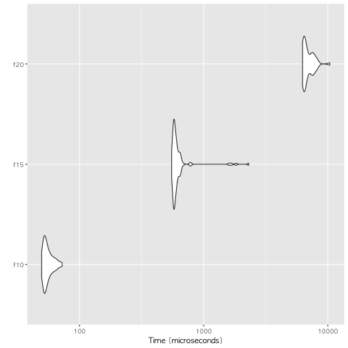
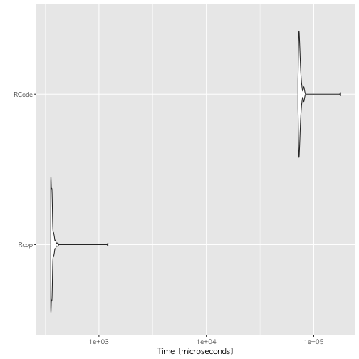

> ## 학습 목표 {.objectives}
>
> * R 스크립트, 함수 성능 측정기준 방법을 살펴본다.
> * `tictoc`, `microbenchmark`, `rbenchmark` 팩키지를 실습한다.

## 1. R 코드 기준성능 평가 팩키지 [^r-benchmark]

[^r-benchmark]: [5 ways to measure running time of R code](http://www.alexejgossmann.com/benchmarking_r/)

본인이 작성한 코드의 성능을 알고자 하는 것은 어찌 생각하면 당연할수도 있다. 실제 코드를 다시 들여다 볼 때는 
아마도 작성한 코드가 너무 느리게 실행될 때다. 하지만, R 코드 성능을 측정하는 관련된 방법이 너무 다양하게 존재하여 실제 현업에 적용할 때 어려운 점이 생긴다.

- `Sys.time` 
- `tictoc`
- `system.time`
- `rbenchmark`
-  `microbenchmark`

## 2. `Sys.time()`, `system.time()`

기본적인 사용법은 `Sys.time()`으로 현재 시간을 찍고 나서, 코드를 실행하고 나서, 종료시점에 다시 `Sys.time()`을 찍고 두 시간 차이를 구하는 방식이다.


```r
start_time <- Sys.time()
Sys.sleep(5) # 5초 동안 쿨쿨 ~~~
end_time <- Sys.time()

end_time - start_time
```

```
## Time difference of 5.086929 secs
```

또다른 방식은 `system.time()`을 활용하는 것인데 앞선 `Sys.time()`을 사용하는 것과 비교하여 어느 지점에서 시간이 더 많이 사용되는지 개발자가 알 수 있게 추가적인 정보를 제공한다.


```r
system.time(Sys.sleep(5))
```

```
##    user  system elapsed 
##   0.000   0.000   5.003
```

사용자, 시스템, elapsed로 전체 시간을 나누어서 실행시간에 대한 정보를 제공하고 있다. [^r-mailing-proc-time]

[^r-mailing-proc-time]: [r mailing list - Meaning of proc.time()](http://r.789695.n4.nabble.com/Meaning-of-proc-time-td2303263.html#a2306691)


- `사용자` 혹은 `user`: **User CPU time**은 현재 R 세션에서 사용한 CPU 시간.
- `시스템` 혹은 `system`: **System CPU time**은 커널(운영체제)에서 사용한 CPU 시간. 운영체제에서 사용한 시간은 프로세스 기동, 입출력 작업 등 많은 프로세스가 공통적으로 
수행하는 작업이 포함된다. 따라서 운영체제가 다르면 수행시간도 차이가 나는 것도 명약관화하다.
- `elapsed`: R작업과 운영체제 시스템 총 작업경과 시간. 

## 3. `tictoc`, `microbenchmark`, `rbenchmark` 팩키지 비교 [^rcpp]

`tictoc`, `microbenchmark`, `rbenchmark` 팩키지는 R코드 속도를 측정하고자하는 목적으로 개발된 것이다.
목적은 동일하지만 다소 차이가 있다.


피보나치 순열을 재귀를 사용해서 구현한 R코드와 Rcpp코드의 성능을 비교한다. Rcpp 저자인 Dirk Eddelbuettel 박사가 EARL 2015에서 스택오버플로우 예제를 참조하여 작성한 예제다.

[^rcpp]: [EARL 2015 - Day 2 Keynote - Making R Applications go Faster and Further - Dirk Eddelbuettel](https://www.youtube.com/watch?v=qXuLNQSPmCA)

$$ f(n) = \begin{cases} n, & n < 2 \mbox{  일 때}\\ f(n-1) + f(n-2), & n \geq 2 \mbox{  일 때} \end{cases}$$

피보나치 수열을 R코드로 구현한 후 `sapply` 함수로 0 에서 10까지 숫자를 피보나치 함수 `f`에 넣어 계산한다.


```r
#-------------------------------------------------------------------------
# 1. 순수한 R 코드
#-------------------------------------------------------------------------

f <- function(n) {
  if (n<2) return(n)
  return(f(n-1) + f(n-2))
}

sapply(0:10, f)
```

```
##  [1]  0  1  1  2  3  5  8 13 21 34 55
```

### 3.1. `tictoc` 팩키지로 속도 측정

`tic` 함수와 `tok` 함수를 통해 `tic`과 `toc` 사이 소요되는 시간을 측정한다.


```r
# devtools::install_github("collectivemedia/tictoc")
library(tictoc)

tic("전체시간")

tic("피보나치 10")
f(10)
```

```
## [1] 55
```

```r
toc()
```

```
## 피보나치 10: 0.002 sec elapsed
```

```r
tic("피보나치 15")
f(15)
```

```
## [1] 610
```

```r
toc()
```

```
## 피보나치 15: 0.01 sec elapsed
```

```r
tic("피보나치 20")
f(20)
```

```
## [1] 6765
```

```r
toc()
```

```
## 피보나치 20: 0.009 sec elapsed
```

```r
toc()
```

```
## 전체시간: 0.025 sec elapsed
```

### 3.2. `rbenchmark` 팩키지로 속도 측정

`rbenchmark` 팩키지는 펄(Perl) 벤치마크 모듈에 영감을 받아 제작되었다. `system.time`을 감싼 함수 하나로 구성된 팩키지다. 
`system.time`과 비교하여 반복수와 명시적으로 `user.self`, `sys.self`로 명칭을 명확히 했고, `relative`를 통해 상대적인 시간도 명기했다.

사용법은 `benchmark` 함수에 기준성능을 평가할 함수를 넣어주고, `columns= c("test", "replications", "elapsed", "relative")` 출력하려고 하는 인자를 넣어준다.

`rbenchmark` 팩키지를 사용해서 `10`, `15`, `20`일 경우를 기준성능을 상호비교한다.


```r
# install.packages("rbenchmark")
library(rbenchmark)

benchmark(f(10), f(15), f(20), columns= c("test", "replications", "elapsed", "relative"))
```

```
##    test replications elapsed relative
## 1 f(10)          100   0.005      1.0
## 2 f(15)          100   0.058     11.6
## 3 f(20)          100   0.712    142.4
```

피보나치 순열 10일 때 보다 20일 때, 상대적으로 131배나 많은 시간이 소요된 것이 확인된다. 이제 C/C++ 즉, `Rcpp`로 구현한 성능을 살펴본다.

### 3.3. `microbenchmark` 팩키지로 속도 측정

`rbenchmark` 팩키지 `benchmark()` 함수와 유사하지만, `microbenchmark()`함수는 `ggplot`의 `autoplot`과 함께 사용하면 
정말 편리하다.


```r
#devtools::install_github("olafmersmann/microbenchmarkCore")
#devtools::install_github("olafmersmann/microbenchmark")
library(microbenchmark)

mb_fibo <- microbenchmark("f10" = { f(10) },
                      "f15" = { f(15) },
                      "f20" = { f(20) }
)

mb_fibo
```

```
## Unit: microseconds
##  expr      min        lq       mean   median       uq       max neval cld
##   f10   49.496   51.7725   55.71161   53.958   58.128    72.506   100 a  
##   f15  552.234  572.4105  646.95594  585.319  615.456  2303.291   100  b 
##   f20 6260.690 6428.2490 6951.17843 6595.788 7480.900 10378.166   100   c
```

```r
autoplot(mb_fibo)
```



## 4. Rcpp 코드 구현

피보나치 구현하는 코드를 C/C++로 구현한 후에 `Rcpp::cppFunction` 내부에 C/C++코드를 넣어주고 실행시키면 된다.
전통적으로 재귀를 사용한 피보나치 순열 구현은 성능이 좋지 않은 것으로 유명한데, C/C++로 구현하여 `Rcpp` 팩키지로 실행한 것을 보면 450배 순수 R코드에 비해 성능이 월등한 것을 알 수 있다.


```r
library(Rcpp)

Rcpp::cppFunction(
  "int g(int n) {
      if (n < 2) return(n);
      return(g(n-1)+g(n-2));
  }")

Rcpp_fibo <- microbenchmark("Rcpp"  = { g(25) },
                            "RCode" = { f(25) }
)

Rcpp_fibo
```

```
## Unit: microseconds
##   expr       min         lq       mean     median        uq        max
##   Rcpp   355.829   356.6645   373.7537   363.2585   367.904   1213.485
##  RCode 71320.196 72628.8620 75387.5437 73688.5975 75104.710 177875.862
##  neval cld
##    100  a 
##    100   b
```

```r
autoplot(Rcpp_fibo)
```



> ### 윈도우즈 Rcpp 설치 {.callout}
> 
> `Rcpp`를 윈도우즈에 설치할 경우 `Rtools`가 설치되어야 한다. 그리고 `Rtools`를 윈도우 사용자경로에 추가해야 한다.
> 
> `writeLines(strsplit(Sys.getenv("PATH"), ";")[[1L]])` 명령어를 실행하여 `R`과 `Rtools`가 경로명에서 
> 확인되어야 한다.
> 
> ~~~ {.output}
> C:\Program Files\R\R-3.2.3\bin
> C:\Rtools\gcc-4.6.3\bin
> C:\Rtools\bin
> ~~~


## 4. 기준정보 벤치마크 시각화

`microbenchmark` 팩키지에 시각화하는 기능이 내장되어 있다. 
`boxplot` 등 기본 그래픽 기능을 활용하여 상대적인 비교를 시각적으로 식별하는데 도움을 주고 있다.
또한, ggplot2의 `autoplot()` 함수를 활용하면 상자그림이 갖고 있는 단점도 상당부분 보완할 수 있다.


