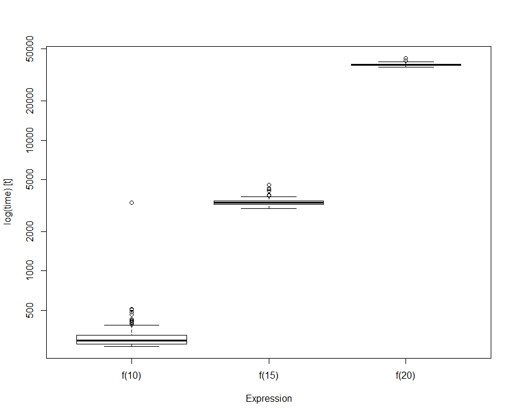

> ## 학습 목표 {.objectives}
>
> * R 스크립트, 함수 성능 측정기준을 설정한다.
> * `rbenchmark` 팩키지를 활용한다.

### 1. `rbenchmark` 기준성능 평가 팩키지

`rbenchmark` 팩키지는 펄(Perl) 벤치마크 모듈에 영감을 받아 제작되었다.
`system.time`을 감싼 함수 하나로 구성된 팩키지다. 

사용법은 `benchmark` 함수에 기준성능을 평가할 함수를 넣어주고, `columns= c("test", "replications", "elapsed", "relative")` 출력하려고 하는 인자를 넣어준다.

### 2. 피보나치 예제 

피보나치 순열을 재귀를 사용해서 구현한 R코드와 Rcpp코드의 성능을 비교한다. Rcpp 저자인 Dirk Eddelbuettel 박사가 EARL 2015에서 스택오버플로우 예제를 참조하여 작성한 예제다. [^rcpp]

[^rcpp]: [EARL 2015 - Day 2 Keynote - Making R Applications go Faster and Further - Dirk Eddelbuettel](https://www.youtube.com/watch?v=qXuLNQSPmCA)

$$ f(n) = \begin{cases} n, & n < 2 \mbox{  일 때}\\ f(n-1) + f(n-2), & n \geq 2 \mbox{  일 때} \end{cases}$$

#### 2.1. 순수 R 코드 구현

~~~ {.r}
#-------------------------------------------------------------------------
# 1. 순수한 R 코드
#-------------------------------------------------------------------------

f <- function(n) {
  if (n<2) return(n)
  return(f(n-1) + f(n-2))
}

sapply(0:10, f)
~~~

피보나치 수열을 R코드로 구현한 후 `sapply` 함수로 0 에서 10까지 숫자를 피보나치 함수 `f`에 넣어 계산한다.

~~~ {.output}
[1]  0  1  1  2  3  5  8 13 21 34 55
~~~

`rbenchmark` 팩키지를 사용해서 `10`, `15`, `20`일 경우를 기준성능을 상호비교한다.

~~~ {.r}
# install.packages("rbenchmark")
library(rbenchmark)

benchmark(f(10), f(15), f(20), columns= c("test", "replications", "elapsed", "relative"))
~~~

피보나치 순열 10일 때 보다 20일 때, 상대적으로 131배나 많은 시간이 소요된 것이 확인된다. 이제 C/C++ 즉, `Rcpp`로 구현한 성능을 살펴본다.

~~~ {.output}
   test replications elapsed relative
1 f(10)          100    0.03    1.000
2 f(15)          100    0.33   11.000
3 f(20)          100    3.95  131.667
~~~

#### 2.2. Rcpp 코드 구현

피보나치 구현하는 코드를 C/C++로 구현한 후에 `Rcpp::cppFunction` 내부에 C/C++코드를 넣어주고 실행시키면 된다.
전통적으로 재귀를 사용한 피보나치 순열 구현은 성능이 좋지 않은 것으로 유명한데, C/C++로 구현하여 `Rcpp` 팩키지로 실행한 것을 보면 450배 순수 R코드에 비해 성능이 월등한 것을 알 수 있다.

~~~ {.r}
library(Rcpp)

Rcpp::cppFunction(
  "int g(int n) {
      if (n < 2) return(n);
      return(g(n-1)+g(n-2));
  }")

benchmark(f(25), g(25), columns= c("test", "replications", "elapsed", "relative"))
~~~

~~~ {.output}
test replications elapsed relative
1 f(25)          100  17.404  446.256
2 g(25)          100   0.039    1.000
~~~

> ### 윈도우즈 Rcpp 설치 {.callout}
> 
> `Rcpp`를 윈도우즈에 설치할 경우 `Rtools`가 설치되어야 한다. 그리고 `Rtools`를 윈도우 사용자경로에 추가해야 한다.
> 
> `writeLines(strsplit(Sys.getenv("PATH"), ";")[[1L]])` 명령어를 실행하여 `R`과 `Rtools`가 경로명에서 
> 확인되어야 한다.
> 
> ~~~ {.output}
> C:\Program Files\R\R-3.2.3\bin
> C:\Rtools\gcc-4.6.3\bin
> C:\Rtools\bin
> ~~~

### 3. 기준정보 벤치마크 시각화

`microbenchmark` 팩키지에 시각화하는 기능이 내장되어 있다. `boxplot` 등 기본 그래픽 기능을 활용하여 상대적인 비교를 시각적으로 수행한다.

~~~ {.r}
#-------------------------------------------------------------------------
# 3. 시각화
#-------------------------------------------------------------------------
# install.packages("microbenchmark")
library(microbenchmark)
bm_res <- microbenchmark(f(10), f(15), f(20), unit="s")

boxplot(bm_res)
~~~

