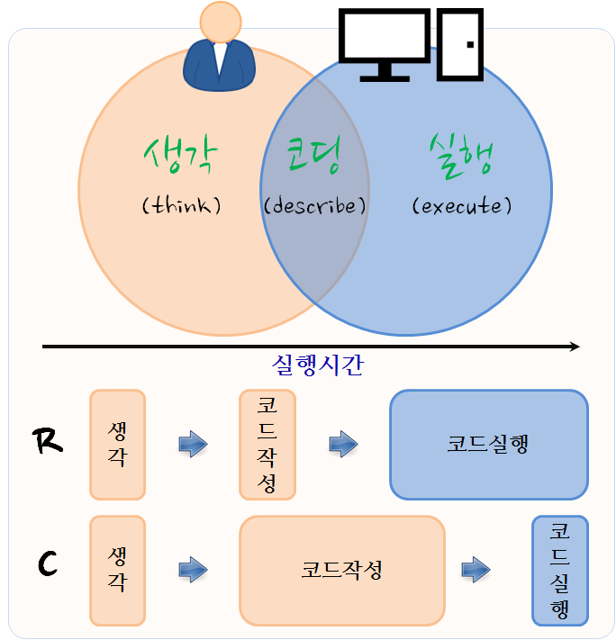
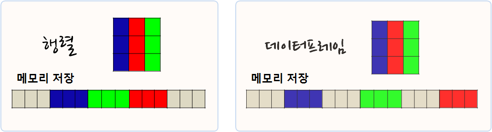
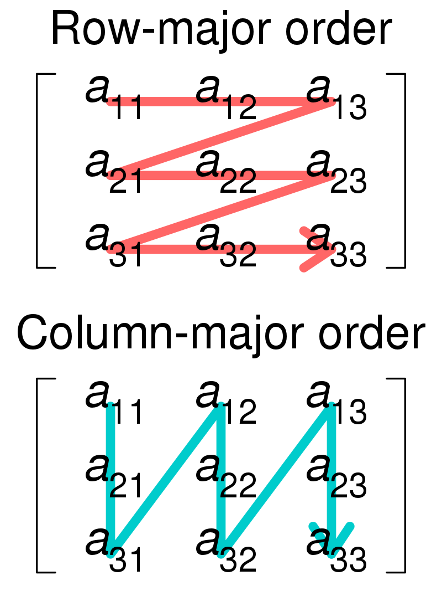

```{r setup, include=FALSE}
knitr::opts_chunk$set(echo = TRUE, message=FALSE, warning=FALSE,
                      comment="", digits = 3, tidy = FALSE, prompt = FALSE, fig.align = 'center')

library(tidyverse)
library(benchmarkme)
library(microbenchmark)
```




# 효율적인 R 코드 작성 기본기 [^efficient-r-programming] {#efficient-rcode}

[^efficient-r-programming]: [Colin Gillespie, Robin Lovelace(2016), "Efficient R programming", OReilly](https://csgillespie.github.io/efficientR/)

코드의 효율성은 좁게는 컴퓨터가 얼마나 효율적으로 빠르게 수행하여 시간을 줄일 수 있느냐로 계량화할 수 있다. 
좀더 넓게는 개발자 생산성으로 정의된다. 즉, 컴퓨터가 수행한 시간과 함께 개발자가 투여한 시간을 함께 측정하여 계량화한다.
효율적인 R 코드 작성의 시작은 도날드 커누스(Donald Knuth)의 명언에서 시작된다.

> premature optimization is the root of all evil

효율적인 R 코드를 작성하는데 필요한 3가지 구성요소는 다음과 같다.

- 생각(Think)
- 코드작성(Write)
- 코드실행(Run)

기본적인 데이터 분석도 마찬가지로 데이터 분석을 위해서 생각(think) &rarr; 코딩(describe) &rarr; 실행(describe) 과정을 거친다.
R과 C언어는 다만 강조하는 영역에서 차이가 난다. R은 생각시간이 동일할 때, 코드실행보다는 코드 작성을 줄이는데 초점이 두고 있는 반면
C언어는 코드 작성에 시간이 다소 걸리더라도 코드 실행이 빠른 면에서 장점이 있다.

<style>
div.blue { background-color:#e6f0ff; border-radius: 5px; padding: 10px;}
</style>
<div class = "blue">

**R 버젼**
<br>

R은 매년 4월 새로운 버젼이 출시된다. 예를 들어, 3.0, 3.1, 3.2, 3.3, ... 년중으로 버그 수정을 통해 추가 버젼이 출시되는데
버젼이 3.3.0, 3.3.1, 3.3.2, ... 
<br>
속도와 관련된 R 버젼은 버젼 2.0 출시당시 Lazy Loading, fast loading, 버젼 2.13에서 바이트 컴파일러 지원을 통한 함수 속도 향상,
버젼 3.0 대규모 벡터지원이 포함된다.

</div>

# 성능측정 {#measure-performance}

## 컴퓨터 성능 측정 {#measure-computer}

성능측정결과는 컴퓨터마다 차이가 날 수 있다. 그래서 먼저 본인 컴퓨터 성능을 측정해 보자.

[`benchmarkme`](https://github.com/csgillespie/benchmarkme) 팩키지에서 성능측정을 위해 개발되어 
시스템에 대한 정보를 얻을 수 있는 몇가지 함수도 함께 제공한다.

- RAM: get_ram()
- CPUs: get_cpu()
- BLAS library: get_linear_algebra()
- Is byte compiling enabled: get_byte_compiler()
- General platform info: get_platform_info()
- R version: get_r_version()

컴퓨터 성능측정을 위해 크게 `benchmark_std()`, `benchmark_io()` 두가지 함수가 제공된다.   
프로그래밍, 행렬계산, 행렬함수에 대한 5가지 작업을 수행하고 성능을 평가한다.
5, 50, 200 MB `csv` 파일을 읽고, 쓰는 입출력 성능도 비교한다.

- benchmark_std()
    - **benchmark_prog: 프로그래밍**
        - bm_prog_fib: 3,500,000 피보나치수 계산 (벡터 연산)
        - bm_prog_hilbert: 3500×3500 힐버트 행렬 (행렬 연산)
        - bm_prog_gcd: 1,000,000 최대공약수 (재귀 연산)
        - bm_prog_toeplitz: 1600×1600 퇴플리츠 행렬 (루프 연산)
        - bm_prog_escoufier: 60×60 행렬에 대한 Escoufier 방법 (혼합)
    - **benchmark_matrix_cal: 행렬 계산**
        - bm_matrix_cal_manip: 2500×2500 행렬 생성, 변환 등
        - bm_matrix_cal_power: 2500×2500 임의 정규분포 행렬 ^1000
        - bm_matrix_cal_sort: 7,000,000 확률변수 정렬
        - bm_matrix_cal_cross_product: 2500×2500 행렬 교차곱($b= a \textprime \times a$)
        - bm_matrix_cal: 3000×3000 형렬에 대한 선형회귀 
    - **benchmark_matrix_fun: 행렬 함수**
        - bm_matrix_fun_fft: 2,500,000 확률값에 대한 고속푸리에변환
        - bm_matrix_fun_eigen: 640×640 확률행렬에 대한 고유값
        - bm_matrix_fun_determinant: 2500×2500 확률행렬에 대한 행렬식(Determinant)
        - bm_matrix_fun_cholesky: 3000×3000 행렬에 대한 콜레스키 분해
        - bm_matrix_fun_inverse: 1600×1600 확률행렬에 대한 역행렬
- benchmark_io()
    - read(): 5, 50, 200 MB `csv` 파일 읽기
    - write(): 5, 50, 200 MB `csv` 파일 쓰기 

`benchmark_std` 함수를 활용한 기본 성능 평가는 다음과 같다.
`upload_results` 함수를 통해 결과를 올리게 되면, [Shiny](https://jumpingrivers.shinyapps.io/benchmarkme/) 앱으로 다른 
데이터 분석개발자들의 컴퓨터도 함께 살펴볼 수 있다. CPU, 메모리 등 어떤 컴퓨터 조합으로 데이터 분석개발을 하고 있는지 엿볼 수도 있다.


``` {r benchmarkme-performance, eval = FALSE}
library(tidyverse)
library(benchmarkme)
library(microbenchmark)

res <- benchmark_std(runs = 3)
# upload_results(res)
# # Programming benchmarks (5 tests):
# 	3,500,000 Fibonacci numbers calculation (vector calc): 0.6 (sec).
# 	Grand common divisors of 1,000,000 pairs (recursion): 0.74 (sec).
# 	Creation of a 3,500 x 3,500 Hilbert matrix (matrix calc): 0.323 (sec).
# 	Creation of a 3,000 x 3,000 Toeplitz matrix (loops): 1.38 (sec).
# 	Escoufier's method on a 60 x 60 matrix (mixed): 1 (sec).
# # Matrix calculation benchmarks (5 tests):
# 	Creation, transp., deformation of a 5,000 x 5,000 matrix: 0.64 (sec).
# 	2,500 x 2,500 normal distributed random matrix^1,000: 0.72 (sec).
# 	Sorting of 7,000,000 random values: 0.633 (sec).
# 	2,500 x 2,500 cross-product matrix (b = a' * a): 8.67 (sec).
# 	Linear regr. over a 5,000 x 500 matrix (c = a \ b'): 0.687 (sec).
# # Matrix function benchmarks (5 tests):
# 	Cholesky decomposition of a 3,000 x 3,000 matrix: 4.62 (sec).
# 	Determinant of a 2,500 x 2,500 random matrix: 2.84 (sec).
# 	Eigenvalues of a 640 x 640 random matrix: 0.57 (sec).
# 	FFT over 2,500,000 random values: 0.363 (sec).
# 	Inverse of a 1,600 x 1,600 random matrix: 2.53 (sec).
plot(res)
# You are ranked 276 out of 749 machines.
# Press return to get next plot 
# You are ranked 309 out of 747 machines.
# Press return to get next plot 
# You are ranked 331 out of 747 machines.
```

## 데이터 분석 작업 성능 측정 작업 {#benchmark-performance}

`library(microbenchmark)` 팩키지를 사용하면 함수에 대한 성능을 간편하게 측정할 수 있다. 
보다 자세한 사항은 [R 코드 성능 측정기준 - 벤치마킹](http://statkclee.github.io/parallel-r/perf-benchmark.html)을 참조한다.


``` {r benchmark-measure}
library(microbenchmark)
colon <- function(n) 1:n
seq_default <- function(n) seq(1, n)
seq_by <- function(n) seq(1, n, by = 1)

n <- 1e6
microbenchmark(colon(n),
               seq_default(n),
               seq_by(n),
               times = 10)
```

# 효율적인 R 코드 작성 [^datacamp-efficient-r-code] {#writing-efficient-rcode}

[^datacamp-efficient-r-code]: [DataCamp, Writing Efficient R Code](https://www.datacamp.com/courses/writing-efficient-r-code)

효율적으로 빠르게 돌아가는 R코드를 작성하는 방법은 단 한가지 방법은 존재하지 않지만, 일반적인 원칙은 존재한다.

- The first rule of R club: never, ever grow a vector
- This is the second rule of R club: use a vectorised solution wherever possible.
- The third rule of R club. Use a matrix whenever appropriate.

## 할당하는 경우: 루프를 돌리고, 동시에 벡터 순차적으로 키우지 말자 {#second-principle}

$1,2,3, \cdots, n$까지 자유수 순서를 갖는 벡터를 만드는 때, 
벡터를 하나씩 순차적으로 키워나가면서 루프를 돌리게 되면 최악이다.
차악으로 미리 벡터 크기를 지정하고 나서, 벡터를 순차적으로 채워나가는 것이고,
콜론 연산자를 사용하는 것이 구문도 간결하고 속도도 무척 빠르다. 


``` {r three-ways-allocation}
## 첫번째 방법
first_method <- function(n) {
  x <- 1:n
}

## 두번째 방법
second_method <- function(n) {
  x <- vector("numeric", n)
  for(i in 1:n) {  x[i] <- i }
}
## 세번째 방법
third_method <- function(n) {
  x <- NULL
  for(i in 1:n) {x <- c(x, i)}
}  

n <- 1e5
microbenchmark(first_method(n),
               second_method(n),
               third_method(n),
               times = 1)
```

## 벡터 연산을 활용할 경우 {#use-vectorized}

정규분포 난수를 10개 생성시키는 경우, 루프를 돌리게 되면 `rnorm()` 함수를 10번 호출하고, 
이를 저장하기 위해서 할당도 10번 일어나게 된다. 반면 벡터 연산을 활용할 경우 
`rnorm()` 함수를 1회 호출하고 할당도 1회하게 된다. 따라서 속도가 빠르게 된다.

더불어, 근본적으로 R코드는 하단에 C 혹은 포트란 코드로 연결되어 실행되게 되어 있어, 가능하면 
빠르게 하단의 C 혹 포트란 코드로 내리는 것이 속도향상에 이르는 지름길이 된다.

``` {r three-ways-vectorization}
## 첫번째 방법
first_method <- function(n) {
  x <- rnorm(n)
}

## 두번째 방법
second_method <- function(n) {
  x <- vector("numeric", n)
  for(i in seq_along(x))
    x[i] <- rnorm(1)
}

## 세번째 방법
third_method <- function(n) {
  x <- rnorm(n)
  for(i in seq_along(x))
    x[i] <- rnorm(1)
}  

n <- 1e6
microbenchmark(first_method(n),
               second_method(n),
               third_method(n),
               times = 1)
```

## 조건이 동일하면 데이터프레임 대신 행렬을 사용하라. [^compare-row-column] {#third-matrix}

[^compare-row-column]: [stackoverflow, "data frame (matrix) performance: memory layout"](https://stackoverflow.com/questions/4733481/data-frame-matrix-performance-memory-layout)

조건이 동일하면 데이터프레임보다 행렬을 사용하는 것이 속도가 빠르다.
딥러닝 개발을 경험하게 되면 데이터프레임이 기본 자료형이 아니라 텐서 즉 행렬이 기본자료형으로 
우연의 일치는 아니다.

데이터프레임은 행과 열로 구성된 구조를 갖는데, 열은 동일한 자료형이되는 반면, 행으로 보면 자료형이 다르다.
반면에 행렬은 행과 열 모두 동일한 자료형을 갖는다. 이런 점이 메모리에 데이터가 저장되는 면에서 효율성을 갖게 된다.



매우 큰 행렬과 데이터프레임을 두고 `mat[,7], df[,7]` 행렬과 데이터프레임으로 특정 행을 선택할 경우 속도를 비교해보면 그 차이를 확연히 알 수 있다.

한 예로 행렬은 `dim` attribute를 갖는 벡터다. 행렬 원소는 Column-major로 저장되어 있는 기본값으로 속도를 빠르게 하고자 하려면 행과 열을 바꿔 연산작업을 수행시키면 속도 향상을 기대할 수 있다. Row-major 를 택한 언어들은 C, C++, Objecttive-C, PLI, Pascal, Speakeasy, SAS, Rasdaman 등이고, column-major 를 택한 언어들은 Fortran, MATLAB, GNU Octave, S-Plus, **R**, Julia, Scilab 등이 있다. [^blog-reference]

[^blog-reference]: 그냥 그런 블로그, https://lifeisforu.tistory.com/392

```{r comparison-row-column}
set.seed(21)
a <- matrix(rnorm(1e6),1e3,1e3)
ta <- t(a)
system.time(for(i in 1:1000) colSums(ta))
system.time(for(i in 1:1000) rowSums(a))
identical(rowSums(a), colSums(ta))
```

<center>

</center>

# R 코드 속도 향상 {#improve-rcode-performance}

고성능 R 코드 작성은 [`profviz` 팩키지](https://rstudio.github.io/profvis/)를 통해 병목점을 파악하여 앞선 개념을 적용하여 병목점의 속도를 개선한다.
예를 들어, 루프가 돌고 있는 영역이 있다면 벡터화 연산을 적용하고, `apply` 함수가 적용되어 있다면, `rowSums()` 를 동일 기능을 구현하는 등 다양한 방법으로 병목점이 있는 부분에 대해서 속도를 향상시킬 수 있다.

또다른 성능향상은 병렬화를 작업을 통해 싱글코어로 개발된 코드를 멀티코어를 활용하여 동시에 돌릴 수 있도록 코드를 개선하는 것이다.


# 병렬화 {#use-parallelization}

복잡하고 한번에 풀기 어려운 문제를 병렬화시켜 분산컴퓨팅과 병렬컴퓨팅 패러다임을 적극 받아들여 문제를 푼다.

