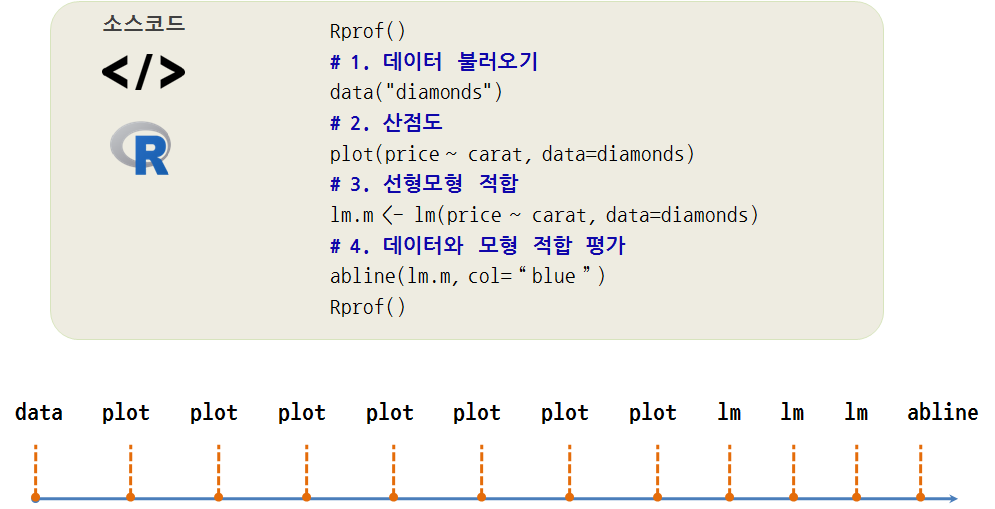

```{r setup, include=FALSE}
knitr::opts_chunk$set(echo = TRUE, message=FALSE, warning=FALSE,
                      comment="", digits = 3, tidy = FALSE, prompt = FALSE, fig.align = 'center')
```


# 정보수집 프로파일링 {#what-is-profiling}

정보수집 프로파일링(profiling)에 대해 이해하고, 프로파일링을 적용해서 성능병목점을 식별하고 성능을 향상시킨다.
R코드 어느 부분에서 가장 많은 수행시간과 메모리 저장공간을 사용했는지 파악하는 것이 중요하다. 
수행시간과 메모리 저장공간을 측정하는데 사용되는 도구가 정보수집 **프로파일링(Profiling)** 이다.

* `system.time` : 간단히 수행시간을 측정하는 함수
* `Rprof` : R코드 프로파일링하는 함수 [^Rprof]
* `Rprofmem` R 메모리 사용량을 프로파일링하는 함수

[^Rprof]: [Profiling R code](http://www.r-bloggers.com/profiling-r-code/)


`Rprof`, `Rprofmem` 함수를 추상화해서 시각화하는 팩키지가 `profviz` 로 출시되었고, 
`rbenchmark` 는 비교하는 목적으로 사용되었고, 최근에는 `bench` 팩키지가 새롭게 도입되었다.

# `Rprof` 프로파일링 [^wch-profvis] {#rprof-about-it}

[^wch-profvis]: [Profiling and performance](https://www.rstudio.com/resources/videos/profiling-and-performance/)

`Rprof` 함수는 정해진 시간, 예를 들어 `interval = 0.02` 기본디폴트 설정값으로 되어 20 $frac{1}{1000}$ 천분의 1초로 측정을 한다. 측정결과는 지정한 경로명에 위치한 파일에 저장되고, `summaryRprof` 함수로 꺼내본다.



`Rprof` 함수는 R에 기본 내장된 프로파일링 함수로 사용법은 다음과 같다.

```{r about-Rprof}
Rprof("프로파일링 경과를 저장할 파일경로 및 파일명")
## 프로파일링을 통해 정보를 추적할 R 코드
Rprof(NULL)
## 프로파일링하지 않아 정보를 추정하지 않을 R코드 
Rprof("프로파일링 경과를 저장할 파일경로 및 파일명", append=TRUE)
## 프로파일링을 통해 정보를 추적할 R 코드
Rprof(NULL)
 
# 프로파일링 추적결과를 요약하고 정리
summaryRprof("프로파일링 경과를 저장할 파일경로 및 파일명")
```


## `Rprof` 프로파일링 요약 {#rprof-summary}

* `by.self` : 해당 함수가 온전히 사용한 시간
* `by.total` : 해당 함수와 호출된 함수 모두에서 사용된 시간 
* `sample.interval` : 표본측정 시간, 기본디폴트설정으로 20 천분의 1초로 설정
* `sampling.time` : 프로파일링을 통해 수행된 전체 시간.

추가로 한번만 측정하면 측정 중간에 쓰레기수거(Garbage Collection, GC) 작업 등으로 인해 정확한 실행시간 측정에 오차가 발생할 수 있다. 이를 방지하고자, `replicate`를 사용해서 반복측정한다.

## `Rprof` 사례 {#rprof-case-study}

`example(glm)`을 통해 일반화선형모형을 적합하여 모형을 개발하는데 사용된 시간을 살펴본다.
전체적으로 80 천분의 1초가 소요되었으며 "ifelse", "psub", "set", "unlist"에서 시간이 
균등하게 사용된 것을 볼 수 있다.

```{r rprof-case-example}
##========================================================================
## Rprof 예제
##========================================================================
# 1. 프로파일링 시작
Rprof(tmp <- tempfile())
example(glm)
Rprof()

# 2. 프로파일링 결과 요약
summaryRprof(tmp)

```

## `Rprof` 시각화 {#Rprof-visualization}

숫자를 통해 프로파일링 결과를 살펴보는 것도 의미가 있지만, 시각화를 통해 전체적인 프로파일링 정보를 살펴본다.
`profr` 팩키지를 설치하고 `ggplot2` 시각화 팩키지로 프로파일링된 결과를 살펴본다.

일반선형모형을 적합시킨 결과 콜스택 깊이가 20까지 올라간 것도 확인이 된다.

```{r vis-Rprof}
##========================================================================
## Rprof 시각화
##========================================================================

# install.packages("profr")
library(profr)
library(ggplot2)
x  <- profr(example(glm))
ggplot(x)

```

## `diamonds` 회귀분석 프로파일링 예제 {#rprof-diamonds}

`profr`로 시각화하는데 `data("diamonds")` 부터 `abline(lm.m, col = "blue")`까지 R코드 실행부분을 별도 R스크립트로 저장하였다. 

```{r rprof-diamonds-lm}
##========================================================================
## 다이아몬드 회귀분석
##========================================================================
# 0. 팩키지 가져오기
library(tidyverse)
# 1. 텍스트 정보
Rprof(tmp <- tempfile())
data("diamonds")
# 1. 산점도
plot(price ~ carat, data=diamonds)
# 2. 선형모형 적합
lm.m <- lm(price ~ carat, data=diamonds)
# 3. 데이터와 모형 적합 평가
abline(lm.m, col = "blue")
Rprof()

summaryRprof(tmp)
```

상기 코드를 스크립트 파일(`diamonds-prof-ex.R`)로 저장시킨 후에 이를 실행시킨다.

```{r rprof-diamonds-lm-rcode}
# 2. 시각화
library(profr)
library(ggplot2)
x <- profr(source("code/diamonds-prof-ex.R"))
ggplot(x)
```

# `profvis` 팩키지 {#profvis-pkg}

`profvis` 팩키지 `profvis()` 함수를 사용하게 되면 R마크다운 문서에도 관련 내용을 담을 수가 있고 앞선 내용을 최신 방식으로 RStudio IDE 에서도 실행이 가능하다.

```{r profvis-rstudio}
profvis::profvis({
    ##========================================================================
    ## 다이아몬드 회귀분석
    ##========================================================================
    # 0. 팩키지 가져오기
    library(tidyverse)
    # 1. 텍스트 정보
    data("diamonds")
    # 1. 산점도
    plot(price ~ carat, data=diamonds)
    # 2. 선형모형 적합
    lm.m <- lm(price ~ carat, data=diamonds)
    # 3. 데이터와 모형 적합 평가
    abline(lm.m, col = "blue")
}, height = "250px")
```


