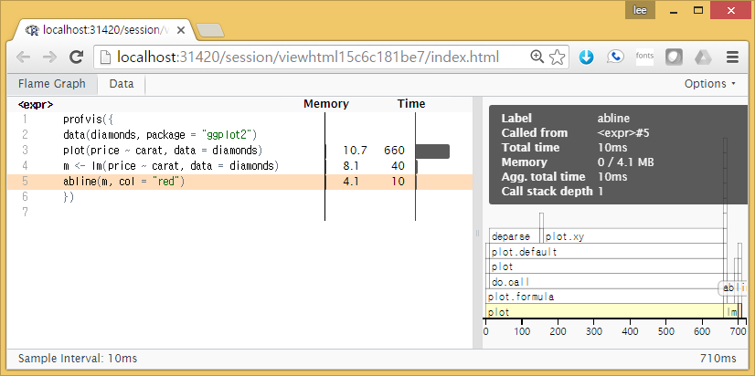
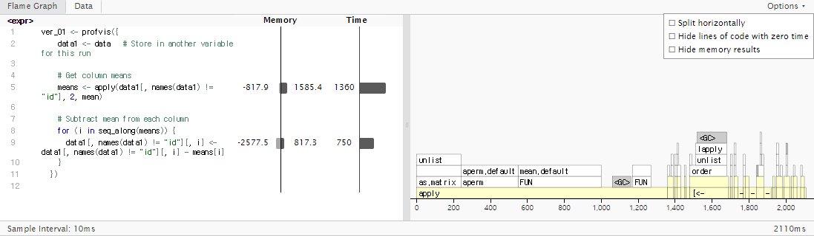
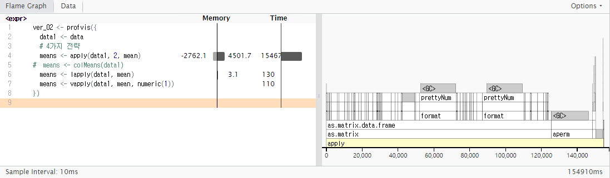
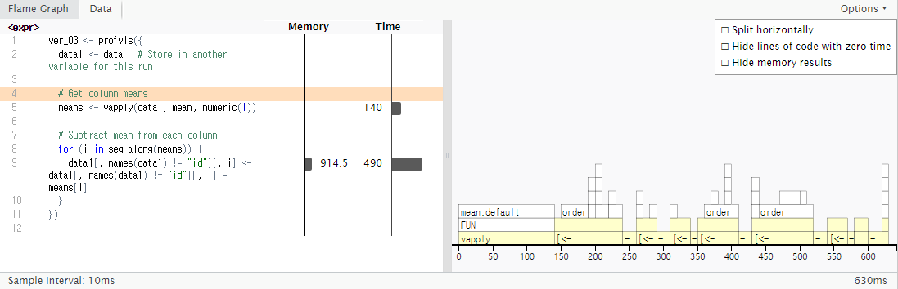
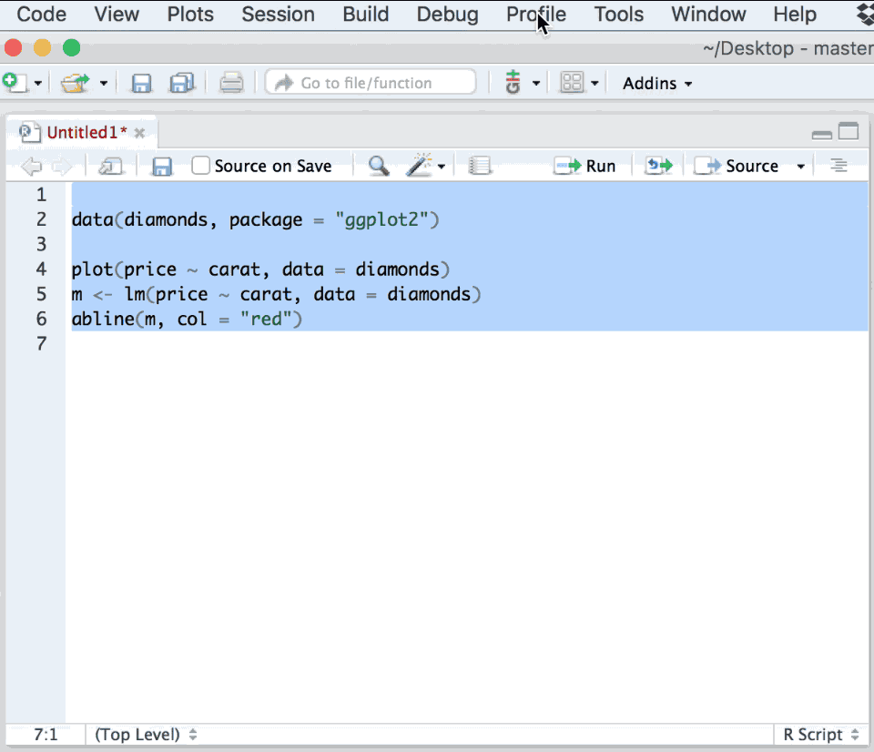

```{r setup, include=FALSE}
knitr::opts_chunk$set(echo = TRUE, message=FALSE, warning=FALSE,
                      comment="", digits = 3, tidy = FALSE, prompt = FALSE, fig.align = 'center')
```


# `profviz` 프로파일링 팩키지 [^wch-profvis] [^profiling-with-rstudio] {#profiling-profvis}

[^wch-profvis]: [Profiling and performance](https://www.rstudio.com/resources/videos/profiling-and-performance/)
[^profiling-with-rstudio]: [Javier Luraschi (June 16, 2020), "Profiling with RStudio" RStudio Blog ](https://support.rstudio.com/hc/en-us/articles/218221837-Profiling-with-RStudio)

정보수집 프로파일링을 통한 성능향상을 이해하고, 병목점을 식별하고 적절한 성능향상 전략을 적용시킨다.
동기화 및 비동기화된 R 코드 전략에 대해 살펴본다.

작성한 R코드가 느린 것은 원래 목적 자체가 속도보다는 데이터를 시각화하고 탐색적으로 분석하는데 초점이 맞춰져서 인터랙티브하게 빠른 개발 생애주기(lifecycle)를 우선하기 때문이다. 따라서 인터랙티브한 방식이 아닌 방법으로 R코드를 실행시켜야만 된다.

다양한 방법이 존재하지만, 명령라인 쉘상에서 `<`, 파이프, `R CMD BATCH` 방식이나, `Rscript`를 사용해서 R스크립트를 실행시킨다. 문제는 기능은 동작을 하지만, 성능이 잘 나오지 않는 경우도 많다. 이런 경우 R코드 어느 부분이 병목점인지 파악하고 나서 적절한 전략을 적용시키는 것이 중요하다.

```{r shell-different-ways, eval = FALSE}
$ R --slave < rscript.R
$ cat rscript.R | R --slave
$ R CMD BATCH rscript.R
$ Rscript rscript.R
```


# 다이아몬드 데이터 `profvis` 적용 [^profvis-rstudio] {#diamonds-profvis}

[^profvis-rstudio]: [Profvis — Interactive Visualizations for Profiling R Code](https://rstudio.github.io/profvis/)

다이아몬드 데이터에 `profvis` 팩키지를 적용하여 속도 및 메모리가 얼마나 소요되는지 확인한다.

```{r diamonds-profvis}
##========================================================================
## 다이아몬드 데이터 profvis 프로파일링
##========================================================================
# install.packages("profvis")

library(profvis)

profvis({
  data(diamonds, package = "ggplot2")
  
  plot(price ~ carat, data = diamonds)
  m <- lm(price ~ carat, data = diamonds)
  abline(m, col = "red")
}, height = "250px")

```


`htmlwidgets` 팩키지를 사용해서 `profvis`로 프로파일링한 결과를 `.html` 파일로 동일하게 저장하여 재현가능하게 사용하는 것도 가능하다.

``` {r diamonds-profvis-output, eval = FALSE}
##========================================================================
## profvis 프로파일링 결과 내보내기
##========================================================================

library(htmlwidgets)

diamonds_profvis <- profvis({
  data(diamonds, package = "ggplot2")
  
  plot(price ~ carat, data = diamonds)
  m <- lm(price ~ carat, data = diamonds)
  abline(m, col = "red")
})

# file_path <- "data\\diamonds_profvis.html"

# saveWidget(widget=diamonds_profvis, file = file.path(normalizePath(dirname(file_path)),basename(file_path)))
saveWidget(widget=diamonds_profvis, file = "diamonds_profvis.html" )
```


[](html/diamonds_profvis.html)


# 성능 병목점 식별 {#performance-bottleneck}

$400,000 \times 150$ 크기를 갖는 행렬을 생성하고 나서 이를 데이터프레임으로 저장한다.
평균이 5인 정규분포에서 생성된 데이터에서 평균을 빼서 중심을 0으로 맞추는 작업을 수행하자.
`apply` 함수를 사용해서 평균을 계산하고 난 후에 `for` 루프를 돌려 150개 열마다 각 열마다 계산된 평균을 
빼서 저장시키는 R코드다.


``` {r profis-profiling, eval = TRUE}
##========================================================================
## profvis 프로파일링
##========================================================================
library(profvis)

# 400,000 행 150열을 갖는 데이터를 생성
times <- 400000
cols <- 150
data <- as.data.frame(x = matrix(rnorm(times * cols, mean = 5), ncol = cols))
data <- cbind(id = paste0("g", seq_len(times)), data)

ver_01 <- profvis({
    data1 <- data   # Store in another variable for this run
    
    # Get column means
    means <- apply(data1[, names(data1) != "id"], 2, mean)
    
    # Subtract mean from each column
    for (i in seq_along(means)) {
      data1[, names(data1) != "id"][, i] <- data1[, names(data1) != "id"][, i] - means[i]
    }
  }, height = "250px")

ver_01
# 
# saveWidget(widget=ver_01, file="ver.01_html")
```

[](html/ver_01.html)

150개 칼럼에 대해 평균을 구하는데 1.36초 평균을 빼서 저장하는데 0.75초 총 2.1초 정도가 소요된 것을 확인할 수 있다.
현황이 파악되었으니, R코드 성능을 개선시키는데 다음 네가지 전략을 살펴본다.

# 성능계선 전략 도출 {#profiling-strategy}  

현황이 파악되었으니, 다음 단계로 병목점에 대한 성능향상 전략을 전개하는 것이다.
우선 `apply`는 가장 일반적인 함수로 행과 열 모두 요약할 수 있는 기능을 제공한다. 
하지만, 이번 경우에는 칼럼에 대한 평균을 계산하기 때문에 `colMeans` 함수를 사용하는 것이 성능향상을 기대할 수 있는 한 방법이 된다. `apply` 함수 내부에서 행렬로 변환하고 행렬을 전치하는 연산이 들어가는 것을 콜스택을 추적하면서 볼 수 있다. 따라서 `lapply`로 리스트를 통해 성능향상을 취하는 방법도 훌륭한 대안이 되고, `vapply` 로 벡터로 칼럼 평균을 구하는 전략도 성능향상이 기대되는 전략이 된다.

```{r strategy-profiling, eval = FALSE}
# 400,000 행 150열을 갖는 데이터를 생성
times <- 400000
cols <- 150
data <- as.data.frame(x = matrix(rnorm(times * cols, mean = 5), ncol = cols))
data <- cbind(id = paste0("g", seq_len(times)), data)

ver_02 <- profvis({
  data1 <- data
  # 4가지 전략
  means <- apply(data1, 2, mean)
  means <- colMeans(data1)
  means <- lapply(data1, mean)
  means <- vapply(data1, mean, numeric(1))
  }, height = "250px")

ver_02

# saveWidget(widget=ver_02, file="ver_02.html")
```

[](html/ver_02.html)


# 성능계선 전략 적용 {#apply-strategy}

`vapply`를 통해 가장 성능이 좋게 나온 것을 적용하여 처음 약 2.1초(2,110ms)걸리던 것이 0.6초(630ms)로 3배 이상 속도가 빨라진 것을 확인할 수 있다.

어떻게 보면 가장 범용인 `apply` 함수는 데이터프레임을 받아 행렬로 변환시키고 (`as.matrix`) 나서, 
이를 `aperm`으로 행렬을 전치시키는 작업을 수행하고 나서 숙제로 받은 평균을 계산하니 대부분의 신간을 행렬생성과 전치작업에 소요되고 정작 칼럼 평균을 계산하는 데는 상대적으로 시간을 많이 쓰지는 못하는 결과로 나타난다.

반면에 `lapply`와 `vapply`는 리스트와 벡터로 자료형을 바로잡고서 칼럼평균을 계산하니 작업 수행시간이 대폭 줄게 된다.

``` {r apply-strategy, eval = TRUE}
#-------------------------------------------------------------------------
# 3. 성능개선 적용
#-------------------------------------------------------------------------
# 400,000 행 150열을 갖는 데이터를 생성
times <- 400000
cols <- 150
data <- as.data.frame(x = matrix(rnorm(times * cols, mean = 5), ncol = cols))
data <- cbind(id = paste0("g", seq_len(times)), data)

ver_03 <- profvis({
  data1 <- data   # Store in another variable for this run
  
  # Get column means
  means <- vapply(data1, mean, numeric(1))
  
  # Subtract mean from each column
  for (i in seq_along(means)) {
    data1[, names(data1) != "id"][, i] <- data1[, names(data1) != "id"][, i] - means[i]
  }
  }, height = "250px")

ver_03

# saveWidget(widget=ver_03, file="ver_03.html")
```

[](html/ver_03.html)


# RStudio IDE 프로파일링 {#rstudio-profiling}

[Winston Chang (2016-05-23), "Profiling with RStudio and profvis" RStudio Blog](https://blog.rstudio.com/2016/05/23/profiling-with-rstudio-and-profvis/)에 실린 블로그를 참고하여 RStudio IDE 와 `Profile` 메뉴를 활용하여 R 코드 성능을 향상시킬 수 있다. 



