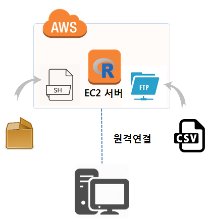

``` {r, include=FALSE}
source("tools/chunk-options.R")
knitr::opts_chunk$set(echo = TRUE, warning=FALSE, message=FALSE)

library(tidyverse)
library(httr)
options(scipen = 999)
options(dplyr.width = 120)
options(dplyr.print_max = 1e9)
```

# 기계학습 R 멀티코어 서버 제작 [^ml-aws-ec2] {#make-multicore-r-server}

[^ml-aws-ec2]: [AWS 우분투 EC2 + S3 버킷 + RStudio 서버](https://statkclee.github.io/ml/ds-aws-rstudio-server.html)



`caret` 기반 다양한 기계학습 팩키지를 쉘스크립트에 담아 EC2 인스턴스 생성시에 설치한다.
기계학습 예측모형에 배포를 위해서 원데이터를 `WinSCP`, `Filezilla` 같은 FTP 프로그램을 사용하여 전달한다.
멀티코어 병렬처리를 위한 준비가 준비가 완료되면 병렬처리 기계학습 알고리즘 코드를 작성한다.

## 기계학습 컴퓨터 준비 {#make-multicore-r-server-ml-hardware}

기계학습 컴퓨터를 준비하기 위해서 AWS에서 `인스턴스 시작`을 클릭하여 "단계 1: Amazon Machine Image(AMI) 선택"에서 
좌측에 `커뮤니티 AMI`를 선택한다. 그리고 나서 검색창에 `rstudio`를 입력하여 클릭하면 `RStudio-1.1.383_R-3.4.2_Julia-0.6.0_CUDA-8_cuDNN-6_ubuntu-16.04-LTS-64bit - ami-1280257c`을 
볼 수 있다. [RStudio Server Amazon Machine Image (AMI)](http://www.louisaslett.com/RStudio_AMI/)이미지로 기계학습을 위한 준비가 된 이미지가 기본으로 제공된다.
"단계 2: 인스턴스 유형 선택"에서 멀티코어가 많고 계산에 특화된 인스턴스로 선택한다. `c4.xlarge`는 "Compute optimized" 되었고 멀티코어 프로세스도 숫자가 많은 것을 고른다.
[EC2Instances.info Easy Amazon EC2 Instance Comparison](https://www.ec2instances.info/)에서 가격을 비교하여 본인 문제에 가성비가 뛰어난 인스턴스를 선택한다.

## 기계학습 팩키지 설치 {#make-multicore-r-server-ml-packages}

기계학습 팩키지를 설치하기 위해서 앞선 "단계 3: 인스턴스 세부 정보 구성"에서 **고급 세부 정보**를 클릭하여 준비한 R 팩키지를 쉘스크립트로 담아 파일형태로 준비한 후에 넣어준다.
적당한 파일명 `r_pkg_shell_script.sh`와 같은 명칭으로 담아낸다.

``` {r r-server-package, eval = FALSE}
#!/bin/bash

sudo su - -c "R -e \"install.packages('devtools', repos='http://cran.rstudio.com/')\""
sudo su - -c "R -e \"install.packages('Rcpp', repos='http://cran.rstudio.com/')\""
sudo su - -c "R -e \"install.packages('RcppEigen', repos='http://cran.rstudio.com/')\""
sudo su - -c "R -e \"install.packages('tidyverse', repos='http://cran.rstudio.com/')\""
sudo su - -c "R -e \"install.packages('markdown', repos='http://cran.rstudio.com/')\""
sudo su - -c "R -e \"install.packages('yaml', repos='http://cran.rstudio.com/')\""
sudo su - -c "R -e \"install.packages('htmltools', repos='http://cran.rstudio.com/')\""
sudo su - -c "R -e \"install.packages('knitr', repos='http://cran.rstudio.com/')\""
sudo su - -c "R -e \"install.packages('rmarkdown', repos='http://cran.rstudio.com/')\""
sudo su - -c "R -e \"install.packages('caret', repos='http://cran.rstudio.com/')\""
sudo su - -c "R -e \"install.packages('e1071', repos='http://cran.rstudio.com/')\""
sudo su - -c "R -e \"install.packages('randomForest', repos='http://cran.rstudio.com/')\""
```

## FTP 서버 연결 {#make-multicore-r-server-ftp}

서버가 준비되면 우선 기계학습 예측모형을 개발하기 위한 데이터를 전송해야 한다.
그러기 위해서는 권한 설정을 해야 하는데... 다음과 같이 `ubuntu` 계정이 `/home/rstudio/` 디렉토리에 소유권을 주면 
`WinSCP`와 같은 도구를 통해서 데이터를 전송할 수 있다.

``` {r ftp-server-file-transfer, eval = FALSE}
$ sudo chown -R -v ubuntu /home/rstudio/
```

## 멀티코어 서버 모니터링 {#make-multicore-r-server-htop}

기계학습 서버 모니터링을 위해서 `htop` 모니터링 도구를 설치하여 
병렬처리 기계학습 알고리즘을 학습시킬 수 때 확인목적으로 유용하게 사용된다.


``` {r winscp-transfer, eval = FALSE}
$ sudo apt-get install htop
```


# 멀티코어 헬로월드 {#make-multicore-r-server-hello-world}


