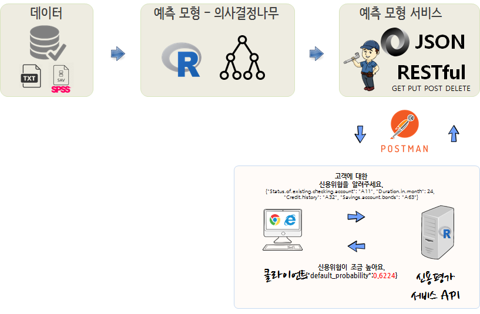
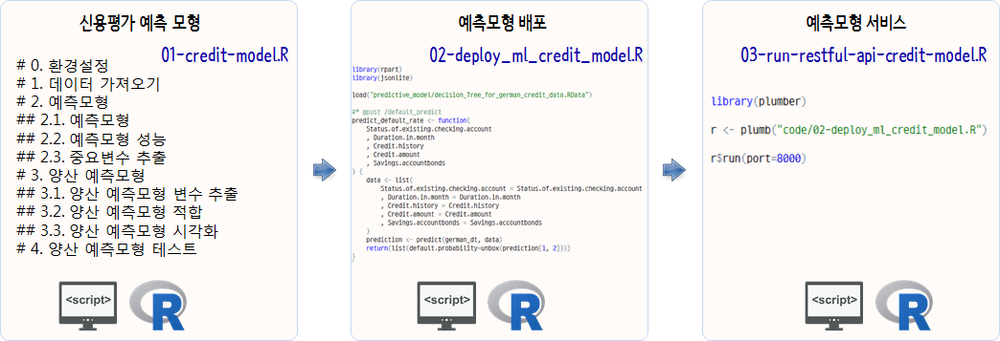
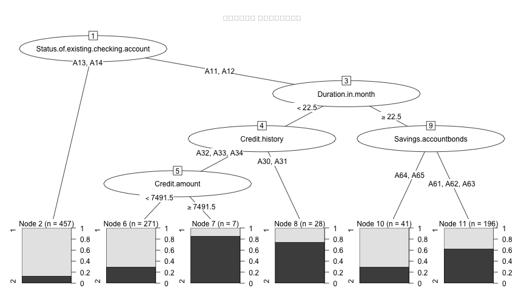
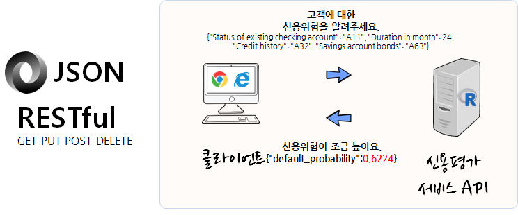
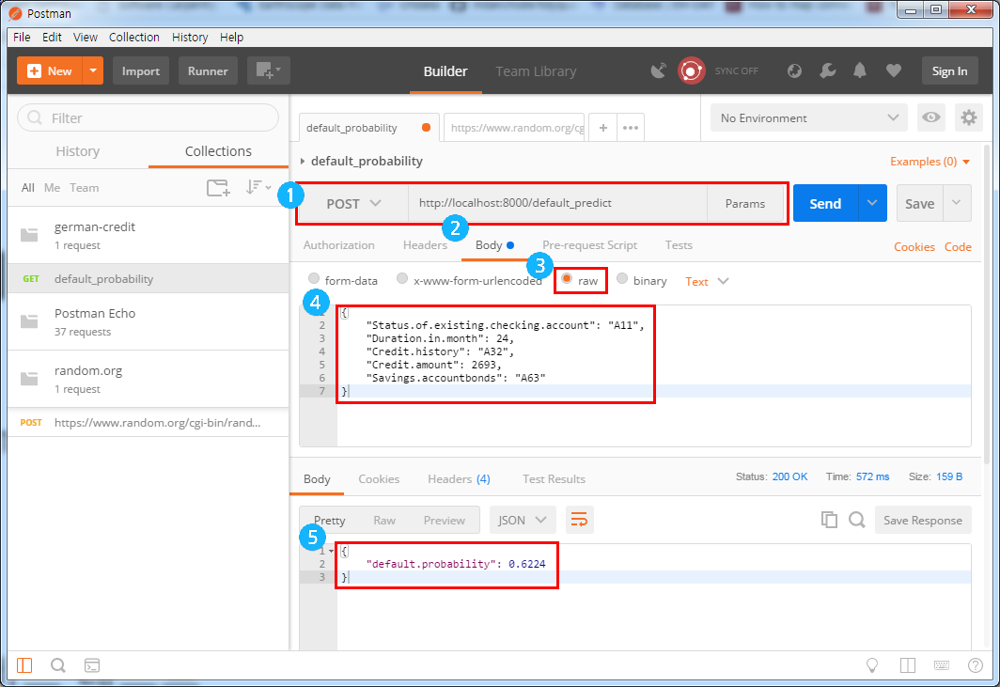

## 1. 신용위험 API [^german-credit-api] [^knowru-credit-api] {#credit-risk-api}

[^german-credit-api]: [How to create a RESTful API for a machine learning credit model in R](https://www.knowru.com/blog/how-create-restful-api-for-machine-learning-credit-model-in-r/)
[^knowru-credit-api]: [knowru - How to create a RESTful API for a machine learning credit model in R](https://www.knowru.com/blog/how-create-restful-api-for-machine-learning-credit-model-in-r/)

훌륭한 신용위험 모형을 개발하는 것도 중요하지만, 다소 성능이 떨어지더라도 실용적으로 활용될 수 있도록 RESTful API로 
예측모형 결과를 배포하는 것도 필요하다. 이런 목적으로 다양한 R 팩키지가 개발되어 지원되고 있다.

그중 [배관공(Plumber)](https://github.com/trestletech/plumber)를 활용하여 신용위험을 알려주는 API를 개발해보자.

## 2. 신용평가 모형 개발 {#develop-predictive-model}

가장 먼저 신용평가모형 개발에 오래전부터 예제 데이터로 사용된 [독일신용데이터](https://archive.ics.uci.edu/ml/support/Statlog+(German+Credit+Data))를
신용평가모형 데이터를 활용한다.

3단계로 걸쳐 신용평가 예측모형 서비스를 준비한다.

1. 신용평가 예측모형 개발: `01-credit-model.R` 
2. 개발된 신용평가 예측모형 배포: `02-deploy_ml_credit_model.R`
3. 신용평가 예측 서비스 제공: `03-run-restful-api-credit-model.R`

신용부도 이력을 갖는 데이터(`german credit`)를 가지고 신용평가모형을 개발한다. 
`randomForest` 팩키지 확률숲(Random Forest) 모형을 기본으로 중요성이 있는 변수 5개를 뽑아내서 
예측모형 아케텍쳐로 의사결정나무(`rpart`) 모형을 활용하는 신용평가 예측모형을 개발한다.
개발과정에서 준비된 신용평가모형이 정상적으로 동작하는지를 `predict` 함수에 신용위험을 평가할 고객 한명 데이터를 
준비해서 테스트한다.

- Status.of.existing.checking.account='A11'
- Duration.in.month=20
- Credit.history='A32'
- Credit.amount = 2969
- Savings.accountbonds='A65'

개발된 신용평가 예측모형을 RESTful API 함수 형태로 개발하여 배포하는 형태로 변형시키고 배포한다.

~~~{.r}
# 0. 환경설정 ----------------
# library(tidyverse)
# library(rpart)
# library(randomForest)
# library(rpart.plot)
# library(rpart)
# library(party)
# library(partykit)

# 1. 데이터 가져오기 ----------------

url <- "https://archive.ics.uci.edu/ml/machine-learning-databases/statlog/german/german.data"

col_names <- c(
    'Status.of.existing.checking.account','Duration.in.month','Credit.history'
    ,'Purpose','Credit.amount','Savings.accountbonds'
    ,'Employment.years','Installment.rate.in.percentage.of.disposable.income'
    ,'Personal.status.and.sex','Other.debtorsguarantors','Present.residence.since'
    ,'Property','Age.in.years','Other.installment.plans','Housing','Number.of.existing.credits.at.this.bank'
    ,'Job','Number.of.people.being.liable.to.provide.maintenance.for','Telephone','Foreign.worker','Status'
)
german_df <- read_delim(url, col_names = FALSE, delim=' ')
names(german_df) <- col_names

german_df <- german_df %>% mutate_if(is.character, as.factor) %>% 
    mutate(Status = factor(Status)) # randomForest 자료형 맞춰주는 작업

# 2. 예측모형 ----------------
## 2.1. 예측모형
german_formula <- as.formula(paste("Status", paste(setdiff(names(german_df), "Status"), collapse="+"), sep="~"))

german_rf <- randomForest(german_formula, data=german_df, importance=TRUE)

## 2.2. 예측모형 성능
german_rf
~~~

~~~{.output}

Call:
 randomForest(formula = german_formula, data = german_df, importance = TRUE) 
               Type of random forest: classification
                     Number of trees: 500
No. of variables tried at each split: 4

        OOB estimate of  error rate: 24%
Confusion matrix:
    1   2 class.error
1 639  61  0.08714286
2 179 121  0.59666667

~~~

~~~{.r}
## 2.3. 중요변수 추출
german_imp <- importance(german_rf)

german_imp_rowname <- rownames(german_imp) %>% as_data_frame()

german_imp_df <- as_data_frame(german_imp) %>% 
    bind_cols(german_imp_rowname) %>% 
    select(names = value, everything())

# 3. 양산 예측모형 ----------------
## 3.1. 양산 예측모형 변수 추출 ------

german_var <- german_imp_df %>% top_n(MeanDecreaseAccuracy, n=5) %>% 
    pull(names)

german_prod_formula <- as.formula(paste("Status", paste(german_var, collapse="+"), sep="~"))

## 3.2. 양산 예측모형 적합 ------

german_dt <- rpart(german_prod_formula, method="class", data=german_df)

## 3.3. 양산 예측모형 시각화 ------

plot(as.party(german_dt), tnex = 2,  
     ep_args = list(justmin = 1, just = "decreasing"), 
     main="신용평가모형 의사결정예측모형")
~~~

~~~{.r}
# 4. 양산 예측모형 테스트 ------

test_data <- list(
    Status.of.existing.checking.account='A11',
    Duration.in.month=20,
    Credit.history='A32',
    Credit.amount = 2969,
    Savings.accountbonds='A65')

predict(german_dt, test_data)
~~~

~~~{.output}
          1         2
1 0.7084871 0.2915129

~~~

~~~{.r}
save(german_dt, file='predictive_model/decision_Tree_for_german_credit_data.RData')
~~~

~~~{.error}
Error in gzfile(file, "wb"): 커넥션을 열 수 없습니다

~~~

## 3. 신용위험 서버 API {#deploy-credit-risk-model}

클라이언드 특정 고객에 대한 신용평가모형 결과를 서버쪽에서 제공하기 위한 API 코드는 다음과 같다.

즉, 예측모형 개발과 동일한 환경을 `.Rdata`에 담아 불러오고 나서,
`predict_default_rate` 함수를 `@post` `/default_predict` 서비스로 노출시킨다. 

~~~{.r}
library(jsonlite)

load("predictive_model/decision_Tree_for_german_credit_data.RData")

#* @post /default_predict
predict_default_rate <- function(
    Status.of.existing.checking.account
    , Duration.in.month
    , Credit.history
    , Credit.amount
    , Savings.accountbonds
) {
    data <- list(
        Status.of.existing.checking.account = Status.of.existing.checking.account
        , Duration.in.month = Duration.in.month
        , Credit.history = Credit.history
        , Credit.amount = Credit.amount
        , Savings.accountbonds = Savings.accountbonds
    )
    prediction <- predict(german_dt, data)
    return(list(default.probability=unbox(prediction[1, 2])))
}
~~~

## 4. 신용위험 서비스 제공 {#service-restful-api}

서버에 환경을 구축하고 나서 `r$run(port=8000)`를 실행하게 되면 
신용위험평가 결과를 제공하는 서비스에 대한 준비가 완료된다.

~~~{.r}
library(plumber)
r <- plumb("code/02-deploy_ml_credit_model.R")
r$run(port=8000)

Starting server to listen on port 8000
Running the swagger UI at http://127.0.0.1:8000/__swagger__/
~~~

## 5. 신용위험 알리미 서비스 {#curl-test}

신용위험을 예측하는 서비스가 준비되어서 서비스로 제공되고 있다.
이에, 직접 서비스를 호출하여 결과를 받아보자.
JSON 형태 데이터를 전달하면 `/default_predict` 인터페이스를 통해 신용위험 예측 서비스를 제공하는 서버가 이를 받아들어 개발된 예측모형에서 미리 
산출된 로직을 통해 신용위험을 평가하여 확률값을 계산하여 이를 전달한다.
`curl`을 활용하여 신용위험 알리미 서비스를 활용할 수도 있다.

~~~{.r}
$ curl -X POST \
       -d '{"Status.of.existing.checking.account": "A11", "Duration.in.month": 24, "
             "Credit.amount" = 2969, "Credit.history": "A32", "Savings.account.bonds": "A63"}' \
       -H 'Content-Type: application/json' \
       localhost:8000/default_predict
{"default_probability":0.6224}
~~~

터미널을 통해 일일이 타이핑하는 것이 불편해 하시는 많은 분들을 위해서 다양한 RESTful API 테스트 제품 및 서비스가 존재한다.
[POSTMAN](https://www.getpostman.com/)을 설치하여 좀더 신속하고 편리하게 예측모형 RESTful API 제공되는 서비스를 검정할 수도 있다.

