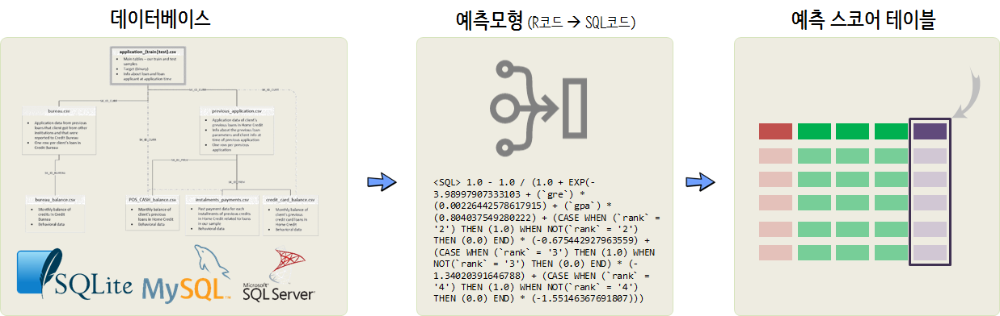

``` {r, include=FALSE}
source("tools/chunk-options.R")

knitr::opts_chunk$set(echo = TRUE, message=FALSE, warning=FALSE,
                      comment="", digits = 3, tidy = FALSE, prompt = TRUE, fig.align = 'center')

```


# RDBMS 배포 모형 {#r-db-deployment}

빅데이터 출현으로 NoSQL이 많은 관심을 가졌지만, 데이터의 가치로만 보면 
RDBMS도 못지않게 중요한 정보가 많이 담겨있고 체계적으로 관리되고 있는 것도 사실이다.
기계학습 예측모형을 개발하여 이를 RDBMS에 배포하는 상황도 일반적인 사례다.



특정 데이터베이스를 특정하면 [`tidypredict`](https://github.com/edgararuiz/tidypredict) 예측모형(`lm`, `glm`, `randomForest`, `ranger`) 변환 기능을 
사용해서 예측모형 R 코드를 SQL 코드로 변환이 가능하다.
변환된 SQL 코드를 특정 데이터베이스에 배포하는 모형이다.
현재, `lm`, `glm`, `randomForest`, `ranger` 네가지 팩키지에 대한 예측모형 배포기능만 지원하다.

# 회귀 예측모형 사례 {#r-db-deployment-lm}

가장 먼저 자동차 연비 데이터(`mtcars`)를 바탕으로 연비예측모형을 개발하고 이를 sqlite3 데이터베이스에 배포하는 사례를 살펴보자.

## 연비예측 모형 구축 {#r-db-deployment-lm-mtcars}

`mtcars` 데이터를 티블로 변환시키고 나서 `lm()` 회귀모형을 구축하고 과적합방지를 위해서 `stepAIC()` 함수로 
변수선택을 하고 이를 연비예측모형으로 지정한다. $R^2$값도 나름 준수하게 나온다.

``` {r database-deployment-lm}
# 0. 환경설정 ------
# install.packages(c("dbplyr", "RSQLite"))

library(tidyverse)
library(dbplyr)
library(RSQLite)
library(tidypredict)
library(randomForest)

# 1. 기계학습 통계모형 ---------
## 1.1. 데이터 가져오기 -----
mtcars_dat <- mtcars %>% rownames_to_column(var="maker") %>% 
    tbl_df

## 1.2. 기계학습 통계모형 -----

mtcars_lm <- lm(mpg ~ ., mtcars_dat[,-1])  %>% 
    MASS::stepAIC(direction="both", trace = FALSE)

summary(mtcars_lm)
```

## 연비 예측 배포모형 {#r-db-deployment-lm-mtcars-formula}

`src_sqlite()` 함수로 `sqlite3` 데이터베이스를 생성하고 나서 `mtcars_dat` 데이터프레임을 
데이터베이스 테이블로 등록한다. 그리고 나서, 쿼리를 던져 제대로 동작하는 테스트한다.

`tidypredict` 팩키지 `tidypredict_sql()` 함수에 인자로 `simulate_sqlite()`을 넘겨
`sqlite3` 데이터베이스 쿼리로 생성하도록 지정하여 R 연비예측모형을 SQL 코드로 변환시키도록 한다.

``` {r database-deployment-lm-sqlite}
# 2. 데이터베이스 ---------
## 2.1. 데이터베이스 테이블 생성 ------
mtcars_db_file <- "mtcars_sqlite"
mtcars_sqlite <- src_sqlite(mtcars_db_file, create = TRUE)

copy_to(mtcars_sqlite, mtcars_dat, overwrite = TRUE)

# mtcars_dbf <- tbl(mtcars_sqlite, "mtcars_dat")
# 
# mtcars_dbf %>%
#     filter(mpg > 25) %>%
#     select(maker, wt, qsec, am) %>%
#     sample_n(5)

## 2.2. 연비예측 스코어 생성 ------
mtcars_mpg_lm <- lm(mpg ~ wt + qsec + am, data = mtcars_dat)

predict_sql <- tidypredict_sql(mtcars_mpg_lm, simulate_sqlite())

# <SQL> 9.61778051456159 + (`wt`) * (-3.91650372494249) + (`qsec`) * (1.2258859715837) + (`am`) * (2.93583719188942)
```


## 예측모형 DB 배포 {#r-db-deployment-lm-mtcars-db}

데이터베이스에 배포할 테이블을 지정하여 `ALTER TABLE mtcars_score_tbl ADD COLUMN score REAL` 쿼리로 
`score` 필드를 생성시키고 나서, 앞서 연비예측모형 SQL 쿼리를 사용해서 `score` 즉 해당 차종에 대한 연비를 예측시킨다.

``` {r database-deployment-lm-sqlite-db}

# 3. 데이터베이스 스코어 적용 ---------
## 스코어 데이터베이스 테이블 생성 -----
con <- dbConnect(drv=RSQLite::SQLite(), "mtcars_sqlite")

dbWriteTable(con, "mtcars_score_tbl", mtcars_dat)

dbListTables(con)

dbExecute(con, "ALTER TABLE mtcars_score_tbl ADD COLUMN score REAL")

# dbGetQuery(con, "SELECT * FROM mtcars_score_tbl")

## 데이터 베이스 스코어링 -----
dbExecute(con, 
          "UPDATE mtcars_score_tbl SET score = 9.61778051456159 + (`wt`) * (-3.91650372494249) + (`qsec`) * (1.2258859715837) + (`am`) * (2.93583719188942)")

dbGetQuery(con, "SELECT maker, mpg, cyl,  disp,  hp,  wt,  qsec, vs, am, carb, score FROM mtcars_score_tbl")
```

# 로지스틱 회귀 예측모형 사례 {#r-db-deployment-glm}

`mtcars` 데이터로 연속형 변수(연비, `mpg`)를 예측하여 이를 데이터베이스에 배포하는 사례를 살펴봤는데,
이번에는 입학당락을 가르는 로지스틱 회귀모형을 배포하는 사례를 살펴보자. 이 경우 `score`는 입학 확률이 된다.


## 입학확률 예측모형 {#r-db-deployment-lm-admit}

`gre`, `gpa`, `rank`를 예측변수로 합격/불합격이 기록된 데이터를 입수하여 
범주형 변수는 요인형으로 변환시켜서 `admit_glm` 객체에 입학확률 예측모형을 저장시킨다.

``` {r database-deployment-glm}
# 1. 기계학습 통계모형 ---------
## 1.1. 데이터 가져오기 -----
admit_dat <- read_csv("https://stats.idre.ucla.edu/stat/data/binary.csv")

## 1.2. 데이터 변환 -----
admit_df <- admit_dat %>% 
    mutate(admit = factor(admit),
           rank  = factor(rank))

## 1.3. 기계학습 통계모형 -----
set.seed(777)
admit_glm <- glm(admit ~ ., family="binomial", data=admit_df) 

summary(admit_glm)
```


## 입학확률 배포모형 {#r-db-deployment-lm-admit-model}

`admit_glm` 모형이 R 코드로 작성되어 있어, 이를 `tidypredict_sql()` 함수로 
`sqlite` 베이스에서 돌 수 있는 SQL 코드로 변형시킨다. 

``` {r database-deployment-glm-sql}
# 2. 데이터베이스 ---------
## 2.1. 입학 예측모형 생성 ------

admit_glm_sql <- tidypredict_sql(admit_glm, simulate_sqlite())

# <SQL> 1.0 - 1.0 / (1.0 + EXP(-3.98997907333103 + (`gre`) * (0.00226442578617915) + (`gpa`) * (0.804037549280222) + (CASE WHEN (`rank` = '2') THEN (1.0) WHEN NOT(`rank` = '2') THEN (0.0) END) * (-0.675442927963559) + (CASE WHEN (`rank` = '3') THEN (1.0) WHEN NOT(`rank` = '3') THEN (0.0) END) * (-1.34020391646788) + (CASE WHEN (`rank` = '4') THEN (1.0) WHEN NOT(`rank` = '4') THEN (0.0) END) * (-1.55146367691807)))
```

## 입학확률 DB 배포 {#r-db-deployment-lm-admit-model-db}

앞선 연비예측과 동일하게 `score` 필드에 입학예측확률이 저장되도록 작업을 수행한다.

``` {r database-deployment-glm-deploy}
# 3. 데이터베이스 스코어 적용 ---------
## 스코어 데이터베이스 테이블 생성 -----
con <- dbConnect(drv=RSQLite::SQLite(), "admit_sqlite")

dbWriteTable(con, "admit_score_rf_tbl", admit_dat)

dbListTables(con)

# dbGetQuery(con, "SELECT * FROM admit_score_tbl")

## 데이터 베이스 스코어링 -----
dbExecute(con, 
          "ALTER TABLE admit_score_rf_tbl ADD COLUMN score REAL")

dbExecute(con, 
          "UPDATE admit_score_rf_tbl SET score = 1.0 - 1.0 / (1.0 + EXP(-3.98997907333103 + (`gre`) * (0.00226442578617915) + (`gpa`) * (0.804037549280222) + (CASE WHEN (`rank` = '2') THEN (1.0) WHEN NOT(`rank` = '2') THEN (0.0) END) * (-0.675442927963559) + (CASE WHEN (`rank` = '3') THEN (1.0) WHEN NOT(`rank` = '3') THEN (0.0) END) * (-1.34020391646788) + (CASE WHEN (`rank` = '4') THEN (1.0) WHEN NOT(`rank` = '4') THEN (0.0) END) * (-1.55146367691807)))")

dbGetQuery(con, "SELECT * FROM admit_score_rf_tbl LIMIT 5")
```


## 배포 스코어 검증 {#r-db-deployment-lm-admit-model-db-check}

DB에 배포된 입학확률 스코어와 R 예측확률이 동일한지 값을 뽑아내서 정확도도를 검증한다.

``` {r database-deployment-glm-check}
## 스코어링 검증 -----

glm_score_df <- predict(admit_glm, newdata = admit_df, type="response") %>% tbl_df %>% 
    rename(glm_score = value)

sqlite_score_df <- tbl(con, "admit_score_rf_tbl") %>% 
    collect() %>% select(sqlite_score = score)

score_comp_df <- bind_cols(glm_score_df, sqlite_score_df) %>% 
    mutate(score_diff = abs(glm_score - sqlite_score))

score_comp_df %>% 
    summarise(sum(score_diff))
```

# 분류 Random Forest 사례 {#r-db-deployment-rf-admit}

## 예측모형 구축 {#r-db-deployment-rf-admit-model}

입학데이터를 동일하게 사용하고 모형은 `ranger` 대신 `randomForest`를 사용한다.
성능면에서는 `ranger`가 더 좋기는 하시만, 데이터가 적은 경우 큰 차이는 없다.

``` {r database-deployment-rf}
## 1.2. 데이터 변환 -----
admit_df <- admit_dat %>% 
    mutate(admit = factor(admit),
           rank  = factor(rank))

admit_m_df <- model.matrix(admit~.-1, admit_df) %>% 
    as.data.frame()

admit_xy_df <- admit_df %>% select(admit) %>% 
    bind_cols(admit_m_df)

## 1.3. 기계학습 통계모형 -----
set.seed(777)
admit_rf <- randomForest(admit ~ ., data=admit_xy_df) 

admit_rf
```

## RF 예측모형 생성 {#r-db-deployment-rf-admit-model-generate}

`tidypredict`에서 `randomForest`, `ranger`를 지원하기 때문에 내부적으로 
`randomForest` 팩키지 `getTree()` 함수를 사용하는 `tidypredict_sql()` 기능을 통해서 
R 객체를 SQL 코드로 변환시킨다.

``` {r database-deployment-rf-deploy-sql}
# 2. 데이터베이스 ---------
## 2.1. 입학 예측모형 생성 ------

admit_sql <- tidypredict_sql(admit_rf, simulate_sqlite())
```

## RF 예측모형 배포 {#r-db-deployment-rf-admit-model-deploy}

동일한 방식으로 RF 모형을 생성된 SQL 코드 형태로 데이터베이스에 배포시킨다.

``` {r database-deployment-rf-deploy-db}
# 3. 데이터베이스 스코어 적용 ---------
## 스코어 데이터베이스 테이블 생성 -----
con <- dbConnect(drv=RSQLite::SQLite(), "admit_sqlite")

dbWriteTable(con, "admit_score_tbl", admit_xy_df)

dbListTables(con)

# dbGetQuery(con, "SELECT * FROM admit_score_tbl ")

## 데이터 베이스 스코어링 -----
dbExecute(con, 
          "ALTER TABLE admit_score_tbl ADD COLUMN score REAL")

dbExecute(con, 
          "UPDATE admit_score_tbl SET score = CASE
WHEN ((`rank1` > 0.5)) THEN ('0')
          WHEN ((`gpa` > 3.115 AND `gre` <= 420.0 AND `rank4` <= 0.5 AND `rank1` <= 0.5)) THEN ('0')
          WHEN ((`rank4` > 0.5 AND `gpa` <= 2.88 AND `gpa` <= 3.505 AND `rank1` <= 0.5)) THEN ('1')
          WHEN ((`gpa` > 2.88 AND `rank4` > 0.5 AND `gpa` <= 3.505 AND `rank1` <= 0.5)) THEN ('0')
          WHEN ((`gpa` > 3.755 AND `gpa` > 3.505 AND `rank4` > 0.5 AND `rank1` <= 0.5)) THEN ('0')
          WHEN ((`gre` <= 450.0 AND `gpa` <= 2.69 AND `gpa` <= 3.115 AND `rank4` <= 0.5 AND `rank1` <= 0.5)) THEN ('0')
          WHEN ((`gre` > 450.0 AND `rank2` <= 0.5 AND `gpa` <= 2.69 AND `gpa` <= 3.115 AND `rank4` <= 0.5 AND `rank1` <= 0.5)) THEN ('1')
          WHEN ((`rank3` > 0.5 AND `gpa` > 2.69 AND `gre` <= 670.0 AND `gpa` <= 3.115 AND `rank4` <= 0.5 AND `rank1` <= 0.5)) THEN ('0')
          WHEN ((`rank3` > 0.5 AND `gre` > 670.0 AND `gpa` > 2.69 AND `gpa` <= 3.115 AND `rank4` <= 0.5 AND `rank1` <= 0.5)) THEN ('1')
          WHEN ((`gre` > 420.0 AND `gpa` > 3.115 AND `gpa` <= 3.495 AND `rank3` <= 0.5 AND `rank4` <= 0.5 AND `rank1` <= 0.5)) THEN ('0')
          WHEN ((`gpa` > 3.505 AND `rank4` > 0.5 AND `gre` <= 520.0 AND `gpa` <= 3.625 AND `gpa` <= 3.755 AND `rank1` <= 0.5)) THEN ('0')
          WHEN ((`gre` > 520.0 AND `gpa` > 3.505 AND `rank4` > 0.5 AND `gpa` <= 3.625 AND `gpa` <= 3.755 AND `rank1` <= 0.5)) THEN ('1')
          WHEN ((`gpa` > 3.625 AND `gpa` > 3.505 AND `rank4` > 0.5 AND `gpa` <= 3.725 AND `gpa` <= 3.755 AND `rank1` <= 0.5)) THEN ('1')
          WHEN ((`gpa` > 3.725 AND `gpa` > 3.625 AND `gpa` > 3.505 AND `rank4` > 0.5 AND `gpa` <= 3.755 AND `rank1` <= 0.5)) THEN ('1')
          WHEN ((`rank2` > 0.5 AND `gre` > 450.0 AND `gpa` <= 2.595 AND `gpa` <= 2.69 AND `gpa` <= 3.115 AND `rank4` <= 0.5 AND `rank1` <= 0.5)) THEN ('0')
          WHEN ((`gpa` > 2.595 AND `rank2` > 0.5 AND `gre` > 450.0 AND `gpa` <= 2.69 AND `gpa` <= 3.115 AND `rank4` <= 0.5 AND `rank1` <= 0.5)) THEN ('1')
          WHEN ((`gpa` > 2.69 AND `gre` <= 350.0 AND `rank3` <= 0.5 AND `gre` <= 670.0 AND `gpa` <= 3.115 AND `rank4` <= 0.5 AND `rank1` <= 0.5)) THEN ('1')
          WHEN ((`gre` > 670.0 AND `gpa` > 2.69 AND `gpa` <= 2.955 AND `rank3` <= 0.5 AND `gpa` <= 3.115 AND `rank4` <= 0.5 AND `rank1` <= 0.5)) THEN ('0')
          WHEN ((`gre` > 690.0 AND `gpa` > 3.495 AND `gre` > 420.0 AND `gpa` > 3.115 AND `rank3` <= 0.5 AND `rank4` <= 0.5 AND `rank1` <= 0.5)) THEN ('0')
          WHEN ((`gre` > 350.0 AND `gpa` > 2.69 AND `gre` <= 590.0 AND `rank3` <= 0.5 AND `gre` <= 670.0 AND `gpa` <= 3.115 AND `rank4` <= 0.5 AND `rank1` <= 0.5)) THEN ('0')
          WHEN ((`gpa` > 2.955 AND `gre` > 670.0 AND `gpa` > 2.69 AND `gpa` <= 3.08 AND `rank3` <= 0.5 AND `gpa` <= 3.115 AND `rank4` <= 0.5 AND `rank1` <= 0.5)) THEN ('1')
          WHEN ((`gpa` > 3.08 AND `gpa` > 2.955 AND `gre` > 670.0 AND `gpa` > 2.69 AND `rank3` <= 0.5 AND `gpa` <= 3.115 AND `rank4` <= 0.5 AND `rank1` <= 0.5)) THEN ('0')
          WHEN ((`gre` > 670.0 AND `gpa` > 3.495 AND `gre` > 420.0 AND `gpa` > 3.115 AND `gre` <= 690.0 AND `rank3` <= 0.5 AND `rank4` <= 0.5 AND `rank1` <= 0.5)) THEN ('1')
          WHEN ((`gpa` > 3.445 AND `rank3` > 0.5 AND `gre` > 420.0 AND `gpa` > 3.115 AND `gre` <= 590.0 AND `gre` <= 690.0 AND `rank4` <= 0.5 AND `rank1` <= 0.5)) THEN ('1')
          WHEN ((`gre` > 590.0 AND `rank3` > 0.5 AND `gre` > 420.0 AND `gpa` > 3.115 AND `gpa` <= 3.255 AND `gre` <= 690.0 AND `rank4` <= 0.5 AND `rank1` <= 0.5)) THEN ('1')
          WHEN ((`gpa` > 3.52 AND `gre` > 690.0 AND `rank3` > 0.5 AND `gre` > 420.0 AND `gpa` > 3.115 AND `gpa` <= 3.97 AND `rank4` <= 0.5 AND `rank1` <= 0.5)) THEN ('0')
          WHEN ((`gpa` > 3.97 AND `gre` > 690.0 AND `rank3` > 0.5 AND `gre` > 420.0 AND `gpa` > 3.115 AND `gre` <= 730.0 AND `rank4` <= 0.5 AND `rank1` <= 0.5)) THEN ('0')
          WHEN ((`gre` > 730.0 AND `gpa` > 3.97 AND `gre` > 690.0 AND `rank3` > 0.5 AND `gre` > 420.0 AND `gpa` > 3.115 AND `rank4` <= 0.5 AND `rank1` <= 0.5)) THEN ('1')
          WHEN ((`gre` > 590.0 AND `gre` > 350.0 AND `gpa` > 2.69 AND `gpa` <= 2.885 AND `rank3` <= 0.5 AND `gre` <= 670.0 AND `gpa` <= 3.115 AND `rank4` <= 0.5 AND `rank1` <= 0.5)) THEN ('0')
          WHEN ((`gpa` > 2.885 AND `gre` > 590.0 AND `gre` > 350.0 AND `gpa` > 2.69 AND `rank3` <= 0.5 AND `gre` <= 670.0 AND `gpa` <= 3.115 AND `rank4` <= 0.5 AND `rank1` <= 0.5)) THEN ('1')
          WHEN ((`rank3` > 0.5 AND `gre` > 420.0 AND `gpa` > 3.115 AND `gpa` <= 3.135 AND `gpa` <= 3.445 AND `gre` <= 590.0 AND `gre` <= 690.0 AND `rank4` <= 0.5 AND `rank1` <= 0.5)) THEN ('1')
          WHEN ((`gpa` > 3.135 AND `rank3` > 0.5 AND `gre` > 420.0 AND `gpa` > 3.115 AND `gpa` <= 3.445 AND `gre` <= 590.0 AND `gre` <= 690.0 AND `rank4` <= 0.5 AND `rank1` <= 0.5)) THEN ('0')
          WHEN ((`gpa` > 3.255 AND `gre` > 590.0 AND `rank3` > 0.5 AND `gre` > 420.0 AND `gpa` > 3.115 AND `gpa` <= 3.54 AND `gre` <= 690.0 AND `rank4` <= 0.5 AND `rank1` <= 0.5)) THEN ('0')
          WHEN ((`gpa` > 3.54 AND `gpa` > 3.255 AND `gre` > 590.0 AND `rank3` > 0.5 AND `gre` > 420.0 AND `gpa` > 3.115 AND `gre` <= 690.0 AND `rank4` <= 0.5 AND `rank1` <= 0.5)) THEN ('1')
          WHEN ((`gre` > 690.0 AND `rank3` > 0.5 AND `gre` > 420.0 AND `gpa` > 3.115 AND `gre` <= 740.0 AND `gpa` <= 3.52 AND `gpa` <= 3.97 AND `rank4` <= 0.5 AND `rank1` <= 0.5)) THEN ('0')
          WHEN ((`gre` > 740.0 AND `gre` > 690.0 AND `rank3` > 0.5 AND `gre` > 420.0 AND `gpa` > 3.115 AND `gpa` <= 3.52 AND `gpa` <= 3.97 AND `rank4` <= 0.5 AND `rank1` <= 0.5)) THEN ('0')
          WHEN ((`gpa` > 3.495 AND `gre` > 420.0 AND `gpa` > 3.115 AND `gre` <= 550.0 AND `gre` <= 630.0 AND `gre` <= 670.0 AND `gre` <= 690.0 AND `rank3` <= 0.5 AND `rank4` <= 0.5 AND `rank1` <= 0.5)) THEN ('0')
          WHEN ((`gre` > 630.0 AND `gpa` > 3.495 AND `gre` > 420.0 AND `gpa` > 3.115 AND `gre` <= 650.0 AND `gre` <= 670.0 AND `gre` <= 690.0 AND `rank3` <= 0.5 AND `rank4` <= 0.5 AND `rank1` <= 0.5)) THEN ('0')
          WHEN ((`gre` > 650.0 AND `gre` > 630.0 AND `gpa` > 3.495 AND `gre` > 420.0 AND `gpa` > 3.115 AND `gre` <= 670.0 AND `gre` <= 690.0 AND `rank3` <= 0.5 AND `rank4` <= 0.5 AND `rank1` <= 0.5)) THEN ('0')
          WHEN ((`gre` > 550.0 AND `gpa` > 3.495 AND `gre` > 420.0 AND `gpa` > 3.115 AND `gre` <= 590.0 AND `gre` <= 630.0 AND `gre` <= 670.0 AND `gre` <= 690.0 AND `rank3` <= 0.5 AND `rank4` <= 0.5 AND `rank1` <= 0.5)) THEN ('0')
          WHEN ((`gre` > 590.0 AND `gre` > 550.0 AND `gpa` > 3.495 AND `gre` > 420.0 AND `gpa` > 3.115 AND `gpa` <= 3.57 AND `gre` <= 630.0 AND `gre` <= 670.0 AND `gre` <= 690.0 AND `rank3` <= 0.5 AND `rank4` <= 0.5 AND `rank1` <= 0.5)) THEN ('1')
          WHEN ((`gpa` > 3.57 AND `gre` > 590.0 AND `gre` > 550.0 AND `gpa` > 3.495 AND `gre` > 420.0 AND `gpa` > 3.115 AND `gre` <= 630.0 AND `gre` <= 670.0 AND `gre` <= 690.0 AND `rank3` <= 0.5 AND `rank4` <= 0.5 AND `rank1` <= 0.5)) THEN ('0')
          END")

dbGetQuery(con, "SELECT * FROM admit_score_tbl LIMIT 10")

```

## RF 예측모형 검증 {#r-db-deployment-rf-admit-model-deploy-check}

배포된 모형 예측값과 R 환경 RF 예측값과 비교검증한다.

``` {r database-deployment-rf-deploy-check}
rf_resp_df <- predict(admit_rf, newdata = admit_xy_df) %>% 
    tbl_df %>% rename(rf_pred = value)

db_resp_df <- tbl(con, "admit_score_tbl") %>% 
    collect() %>% 
    select(db_pred = score)

bind_cols(rf_resp_df, db_resp_df) %>% 
    count(rf_pred, db_pred) %>% 
    spread(db_pred,n)

tidypredict_test(admit_rf, admit_xy_df, threshold = 10)

```

