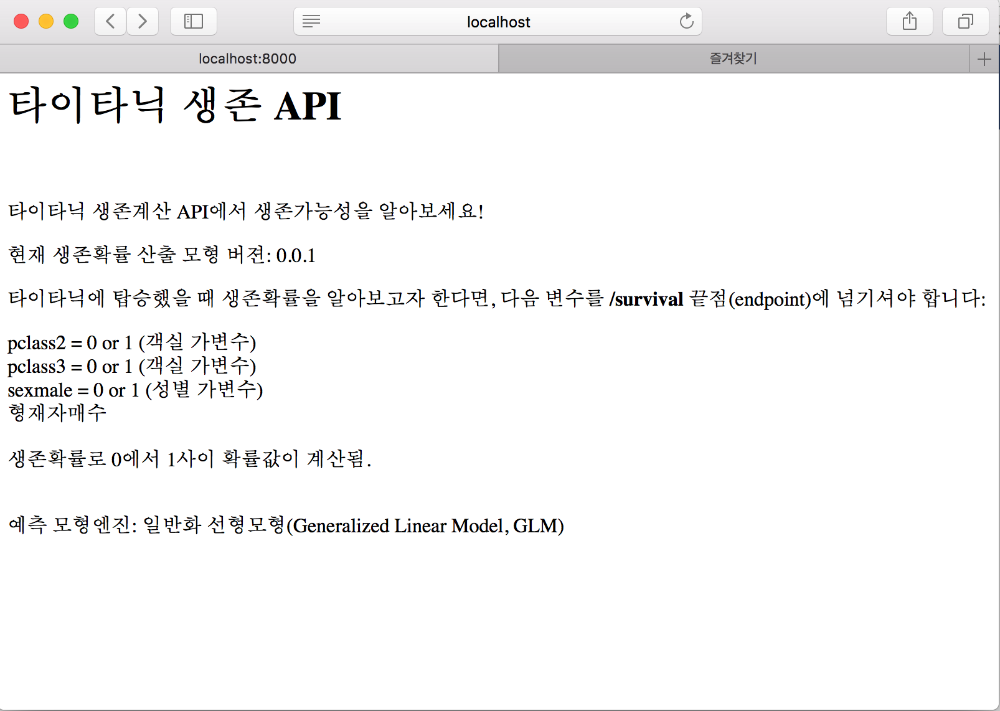
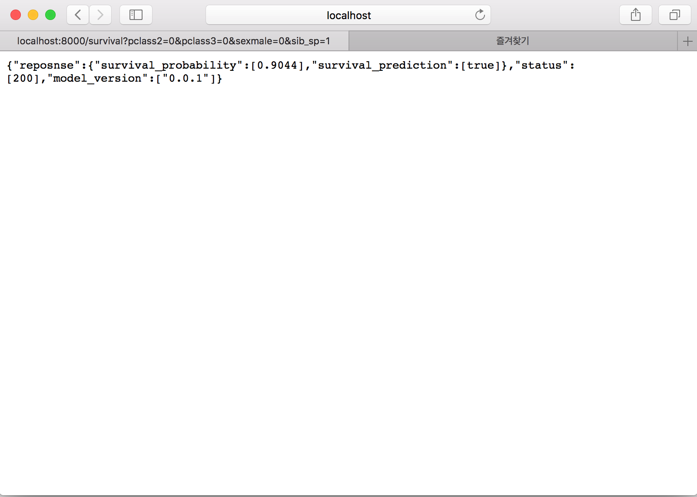

``` {r, include=FALSE}
source("tools/chunk-options.R")
knitr::opts_chunk$set(echo = TRUE, warning=FALSE, message=FALSE)

library(tidyverse)
library(httr)
options(scipen = 999)
options(dplyr.width = 120)
options(dplyr.print_max = 1e9)
```

# 그럼에도 불구하고 왜 GLM? {#r-glm-deployment}

그럼에도 불구하고 왜 GLM을 언급하는 이유는 무엇일까? 성능을 최신 기계학습 알고리즘을 도저히 따라갈 수 없음에도 불구하고 여전히 사랑받는 이유를 찾아보자.
예측성능에 별다른 차이가 없다면 단순하고 속도가 빠른 모형을 선택하는 것이 바람직하다.
그런면에서 일반화 선형모형(Generalized Lienar Model, GLM)은 성능평가를 위한 기준이 된다는 점은 높이 평가된다.
일반화 선형모형의 또 다른 장점은 예측모형을 사용하는 배포에 큰 도움이 되기도 하기 때문이다. 


원본 데이터를 가져와서 데이터프레임으로 변환시키고 나서 `glm()` 함수로 생존확률을 산출하는 모형을 제작한 후에 수식으로 모형을 뽑아낸 후에 
이를 `plumber` 팩키지를 RESTful API 엔진으로 넣어주면 속도가 좋은 생존확률 예측 서비스를 제작할 수 있다.

# GLM 기반 API 서비스 제작 {#restful-api-titanic}

## GLM 예측모형 개발 {#restful-api-titanic-model}

가장 먼저 GLM 모형을 개발할 경우 데이터 정제과정을 거치는데 이를 `clean_data()` 함수에 적어 어떻게 데이터를 
깨끗하게 정제하였는지 적어둔다. 그리고 나서 `glm()` 함수로 생존확률 예측 모형을 제작하고 나서 
`stepAIC()` 함수로 기본적인 모형과대적합을 방지하는 기능을 넣은 후에 모형성능을 살펴본다.

``` {r titanic-glm-api-data-wrangling}
# 0. 환경설정 -----
library(tidyverse)
library(janitor)
library(caret)
library(ROCR)
library(glm.deploy)
library(broom)

# 1. 데이터 -----

orig_dat <- read_csv("data/titanic/train.csv")
in_train <- createDataPartition(orig_dat$Survived, p = c(0.7, 0.3), list = FALSE)

train_dat <- orig_dat[in_train, ]
test_dat <- orig_dat[-in_train, ]

# 2. 데이터 정제과정 -----

clean_data <- function(df) {
    
    clean_df <- df %>% 
        clean_names() %>% 
        select(-cabin) %>%  # 결측값이 많아서 제외
        mutate(age = mean(age, na.rm=TRUE)) %>% 
        filter(complete.cases(.)) %>% 
        select(-passenger_id, -name, -ticket) %>%  # 모형에서 제외
        mutate(pclass = factor(pclass),
               survived = factor(survived, levels=c(0,1), labels=c("no", "yes"))) %>% 
        mutate_if(is.character, as.factor)
    
    return(clean_df)
}

train_df <- clean_data(train_dat)

# 3. 일반화 선형모형 적합 및 선택 -----

titanic_glm <- glm(survived ~ . , family=binomial(link='logit'), data=train_df) %>% 
    MASS::stepAIC(trace = FALSE)

# 4. 모형성능 -----
test_df <- clean_data(test_dat)

test_df$surv_prob <- predict(titanic_glm, newdata = test_df, type = 'response')

pr  <- prediction(test_df$surv_prob, test_df$survived)
prf <- performance(pr, measure = 'tpr', x.measure = 'fpr')

performance(pr, measure = 'auc')@y.values[[1]]

# plot(prf)
#abline(0,1, lwd = 2, lty = 2)
```

## 모형 추출 [^make-predict-equation] {#restful-api-titanic-model}

[^make-predict-equation]: [stackexchange - Make predict equation from logistic regression coefficients](https://stats.stackexchange.com/questions/233063/make-predict-equation-from-logistic-regression-coefficients)

GLM 모형 객체 `titanic_glm` 객체에서 회귀계수를 추출하여 생존확률 수식을 추출한다.
추출된 수식을 바탕으로 생존확률이 `predict()` 함수와 계산한 것이 동일한지 확인한다.

``` {r titanic-glm-api-make-predict-equation}
# 5. 모형추출 -----

tidy(titanic_glm) %>% 
    mutate(terms = str_c(estimate, " * ", term)) %>% 
    select(terms) %>% 
    summarise(equation = paste0(terms, collapse = " + ")) %>% 
    mutate(equation = str_replace_all(equation, "\\(Intercept\\)", "")) %>% 
    mutate(equation = str_replace_all(equation, "^\\*", "")) %>% 
    pull(equation) 

calc_titanic <- function(pclass2, pclass3, sexmale, sib_sp) {
    linear_combination <- 2.6158092237325 + pclass2 * -0.901259634131156 + pclass3 * -1.93400567681149 + sexmale * -2.77476751080326 + sib_sp * -0.368932395284556
    surv_prob <- 1/(1+exp(-linear_combination))
    cat("Survival Probability: ", surv_prob)
}
```


<div class = "row">
  <div class = "col-md-6">
**`predict()` 함수 생존확률**

``` {r titanic-glm-api-make-predict-equation-dt}
test_df %>% 
    select(survived, pclass, sex, sib_sp, surv_prob) %>%  
DT::datatable(rownames = FALSE)
```

  </div>
  <div class = "col-md-6">
**복사하여 붙여넣기**

``` {r titanic-glm-api-make-predict-equation-raw}
calc_titanic(0,0,0,1)

calc_titanic(0,1,1,0)
```

  </div>
</div>


## 예측모형 배포 {#restful-api-titanic-model-deployment}

`plumber` 팩키지를 활용하여 RESTful API 끝점으로 배포할 것이라... 먼저 API 사용법에 대한 내용을 
HTML 웹페이지로 정리하고 `healthcheck` 끝점으로 정상동작여부를 확인한다.
`/survival` 끝점에 GLM 예측모형 수식을 배포하여 타이타닉 탑승시 생존확률을 예측해주는 서비스를 제공한다.


``` {r plumber-glm-deployment}
# 0. 환경설정 -----
library(plumber)

# 1. HTML 웹페이지 -----
MODEL_VERSION <- "0.0.1"
VARIABLES <- list(
    
    pclass2 = "pclass2 = 0 or 1 (객실 가변수)",
    pclass3 = "pclass3 = 0 or 1 (객실 가변수)",
    sexmale = "sexmale = 0 or 1 (성별 가변수)",
    sib_sp  = "형재자매수",
    gap = "",
    survival = "생존확률로 0에서 1사이 확률값이 계산됨.")

#* @get /
#* @html
home <- function() {
    title <- "타이타닉 생존 API"
    body_intro <-  "타이타닉 생존계산 API에서 생존가능성을 알아보세요!"
    body_model <- paste("현재 생존확률 산출 모형 버젼:", MODEL_VERSION)
    body_msg <- paste("타이타닉에 탑승했을 때 생존확률을 알아보고자 한다면,", 
                      "다음 변수를 <b>/survival</b> 끝점(endpoint)에 넘기셔야 합니다:",
                      sep = "\n")
    
    body_reqs <- paste(VARIABLES, collapse = "<br>")
    
    model_detail <- paste("<br>", "예측 모형엔진: 일반화 선형모형(Generalized Linear Model, GLM)")
    
    result <- paste(
        "<html>",
        "<h1>", title, "</h1>", "<br>",
        "<body>", 
        "<p>", body_intro, "</p>",
        "<p>", body_model, "</p>",
        "<p>", body_msg, "</p>",
        "<p>", body_reqs, "</p>",
        "<p>", model_detail, "</p>",
        "</body>",
        "</html>",
        collapse = "\n"
    )
    
    return(result)
}

# 2. 건강체크 -----
#* @get /healthcheck
health_check <- function() {
    result <- data.frame(
        "input" = "",
        "status" = 200,
        "model_version" = MODEL_VERSION
    )
    
    return(result)
}

# 3. 생존확률 -----

validate_feature_inputs <- function(pclass2, pclass3, sexmale, sib_sp) {
    sexmale_valid <- (sexmale %in% c(0, 1))
    pclass2_valid <- (pclass2 %in% c(0, 1))
    pclass3_valid <- (pclass3 %in% c(0, 1))
    sib_sp_valid <- (sib_sp >=0 & sib_sp <=8)
    
    tests <- c("sib_sp must be between 0 and 8", 
               "Pclass2 must be 0 or 1", 
               "Pclass3 must be 0 or 1", 
               "Sex must be either 0 or 1")
    
    test_results <- c(sexmale_valid, pclass2_valid, pclass3_valid, sib_sp_valid)
    
    if(!all(test_results)) {
        failed <- which(!test_results)
        return(tests[failed])
    } else {
        return("OK")
    }
}

#* @post /survival
#* @get /survival
predict_survival <- function(pclass2=NA, pclass3=NULL, sexmale=NULL, sib_sp=NULL) {
    pclass2 <- as.integer(pclass2)
    pclass3 <- as.integer(pclass3)
    sexmale <- as.integer(sexmale)
    sib_sp <- as.integer(sib_sp)
    
    valid_input <- validate_feature_inputs(pclass2, pclass3, sexmale, sib_sp)
    
    if (valid_input[1] == "OK") {
        
        linear_combination <- 2.6158092237325 + pclass2 * -0.901259634131156 + pclass3 * -1.93400567681149 + sexmale * -2.77476751080326 + sib_sp * -0.368932395284556
        surv_prob <- 1/(1+exp(-linear_combination))
        
        result <- list(
            reposnse = list("survival_probability" = surv_prob,
                            "survival_prediction" = (surv_prob >= 0.5)
            ),
            status = 200,
            model_version = MODEL_VERSION)
    } else {
        result <- list(
            input = list(pclass2 = pclass2, pclass3 = pclass3, sexmale = sexmale, sib_sp = sib_sp),
            response = list(input_error = valid_input),
            status = 400,
            model_version = MODEL_VERSION)
    }
    
    return(result)
}
# http://localhost:8000/survival?pclass2=0&pclass3=0&sexmale=0&sib_sp=1
```

## 생존확률 API 서비스 {#restful-api-titanic-model-deployment-api}

타이타닉 생존확률 API에 대한 소개를 HTML으로 작성하여 제공한다.



타이타닉 생존확률이 궁금하면 객실 위치와 성별, 형제자매숫자를 넘겨 생존확률 예측 서비스를 제공받는다.




