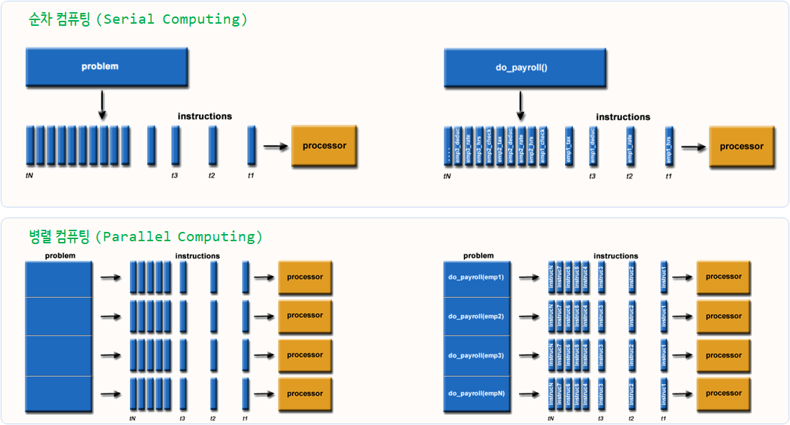

# xwMOOC 데이터 과학
xwMOOC  
`r Sys.Date()`  
 

## 1. 회문 (Palindrome) [^rstudio-webinar-debugging] {#palindrome}

[^rstudio-webinar-debugging]: [RStudio Webinar - Programming Part 2 (Debugging code in RStudio)](https://github.com/rstudio/webinars/tree/master/15-RStudio-essentials/2-Debugging)

문자에 대한 회문은 도처에서 많이 찾을 수 있다. 숫자에 대한 회문을 바탕으로 멀티코어를 활용하여 병렬프로그램을 작성하는 방법을 살펴본다.

`get_digit` 함수를 통해 입력받은 숫자의 n번째 자리수 숫자를 뽑아내는 함수를 작성하고 이를 바탕으로 
회문 숫자인지를 `palindrome` 함수로 판별한다. 그리고 숫자 자리수에 맞춰 첫째자리, 둘째자리, ... 
순으로 두 숫자를 곱해서 나온 숫자 중 가장 큰 회문 숫자를 `biggest_palindrome` 함수를 통해 찾아보자.

~~~{.r}
# 0. 환경설정 --------
# library(doParallel)
# library(tidyverse)

# 1. 기본함수 -------

## 1.1. 숫자의 n번째 자리수 숫자를 뽑아내는 함수

get_digit <- function(num, n) {
  # 왼쪽부터 숫자의 자리수를 제거하고 나서, 오른쪽 자리수 숫자를 제거
  (num %% (10 ^ n)) %/% (10 ^ (n-1))
}

## 1.2. 양의 정수가 회문인지 판정하는 함수
palindrome <- function(num) {
  digits <- floor(log(num, 10)) + 1
  for (x in 1:((digits %/% 2))) {
    digit1 <- get_digit(num, x)
    digit2 <- get_digit(num, (digits + 1) - x)
    if (digit1 != digit2)
      return(FALSE)
  }
  return(TRUE)
}

## 1.3. 세자리, 네자리, 다섯자리 ... 등등 가장 큰 회문 숫자를 탐색
biggest_palindrome <- function(digits=3) {
  
  min_digit <- 10^(digits-1)
  max_digit <- 10^digits -1

  best <- 0
  
  for (x in min_digit:max_digit) {
    for (y in x:max_digit) {
      candidate <- x * y
      if (candidate > best && palindrome(candidate)) {
        best <- candidate
      }
    }
  }
  return(best)
}
~~~

상기 함수를 통해 순차적으로 계산된 결과는 다음과 같다.

- 십자리: `biggest_palindrome(1)`를 실행하면 9.
- 백자리: `biggest_palindrome(2)`를 실행하면 9009.
- 천자리: `biggest_palindrome(3)`를 실행하면 906609.
- 만자리: `biggest_palindrome(4)`를 실행하면 99000099.

## 2. 병렬처리 [^r-parallel-computing] {#parallel}

[^r-parallel-computing]: [Introduction to Parallel Computing with R](http://bgc.yale.edu/sites/default/files/ParallelR.html)

**순차 컴퓨팅**은 문제를 일련의 이산 명령어 집합으로 나눠서 순차적으로 단일 CPU 프로세서로 처리하는 반면에,
**병렬 컴퓨팅**은 문제를 몇개에서 수십개의 CPU 프로세서(코어)로 나누어서 처리 가능한 형태로 변형한 후에 병렬적으로 처리한다.

[플린 분류(영어: Flynn taxonomy)](https://ko.wikipedia.org/wiki/%ED%94%8C%EB%A6%B0_%EB%B6%84%EB%A5%98)는 마이클 플린이 1966년에 제안한 컴퓨터 아키텍처 분류로,
일반인이 쉽게 이해하는 방식으로 보면 처리할 데이터와 처리할 CPU 프로세서에 따라 다음과 같이 네가지로 구분한다.

- SISD(Single Instruction, Single Data stream)
- SIMD(Single Instruction, Multiple Data streams)
- MISD(Multiple Instruction, Single Data stream)
- MIMD (Multiple Instruction, Multiple Data streams)

### 2.1. `for` 구문 {#parallel-for}

가장 먼저 `for`문을 통해 총 소요시간을 구해본다. 
 

~~~{.r}
# 2. 순차처리부터 병렬처리 -------

## 2.1. 순차처리 -----

elapsed_for_v <- numeric(4)

for(i in 1:4) {
  elapsed_for_v[i] <- system.time(biggest_palindrome(i))[3]
}

elapsed_for_v
~~~

~~~{.output}
[1] 0.00 0.00 0.21 7.22

~~~

### 2.2. `for` 구문 {#parallel-foreach}

`foreach`를 통해 순차적인 병렬처리를 수행해본다.
 

~~~{.r}
## 2.2. 순차처리 foreach -----

elapsed_foreach_v <- numeric(4)

foreach(i = 1:4) %do% {
  elapsed_foreach_v[i] <- system.time(biggest_palindrome(i))[3]
}
~~~

~~~{.output}
[[1]]
elapsed 
      0 

[[2]]
elapsed 
      0 

[[3]]
elapsed 
   0.25 

[[4]]
elapsed 
   6.81 

~~~

~~~{.r}
elapsed_foreach_v
~~~

~~~{.output}
[1] 0.00 0.00 0.25 6.81

~~~

### 2.3. `foreach` 병렬 구문 {#parallel-foreach-cluster}

최근 컴퓨터를 구입하게 되면 대부분 멀티코어가 들어있는 하드웨어를 갖고 있다.
따라서, 병렬처리를 위해서는 `makeCluster`를 통해 코어로 구성된 클러스터를 구성하고 나서 
이를 병렬처리를 수행한다.

~~~{.r}
## 2.3. 병렬처리 foreach -----

cl <- makeCluster(detectCores())
registerDoParallel(cl)

elapsed_parallel_v <- 
  system.time (
    palindrome_df <- foreach(i=1:4, .combine='rbind.data.frame', 
                                    .multicombine=TRUE,
                                    .export=c("get_digit","palindrome")) %dopar%  {
            biggest_palindrome(i)
          }
) [3]

stopCluster(cl)

elapsed_parallel_v
~~~

~~~{.output}
elapsed 
  35.65 

~~~

### 2.4. 결과 비교 {#parallel-summary}

자리수가 4자리가 되면 제법 소요시간이 소요된다. 5자리가 되면 유의민한 숫자가 될 것이지만 너무 큰 숫자라 더이상 회문 숫자를 구할 수가 없다.
그리고, 단일 코어에서 계산되면 빠를 것을 코어 다수에서 나눠 계산을 하게 되어 전체적인 시간이 더 늘어났다.

병렬처리작업을 수행할 경우 문제를 병렬처리가 가능한 형태로 나눠 각 코어에 분배하여 처리할 경우 원하는 효과를 거둘 수 있다.
 

~~~{.r}
# 3. 분석결과 정리 -----

data.frame("for루프" = elapsed_for_v, "foreach"=elapsed_foreach_v) %>% 
  mutate(병렬=elapsed_parallel_v, 
         자리수=c(10,100,1000,10000)) %>% 
  select(자리수, everything()) %>% 
  DT::datatable()
~~~

<!--html_preserve-->

<!--/html_preserve-->

