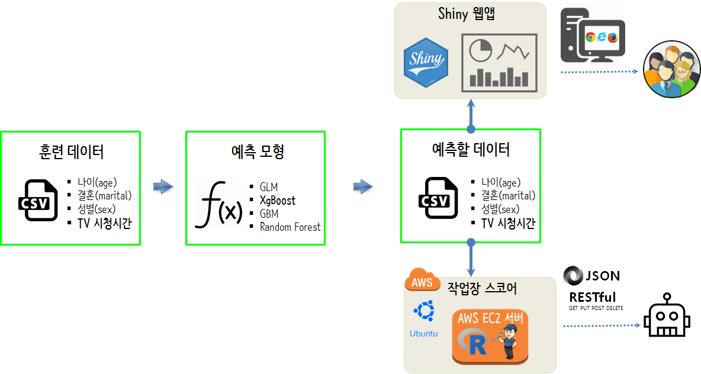
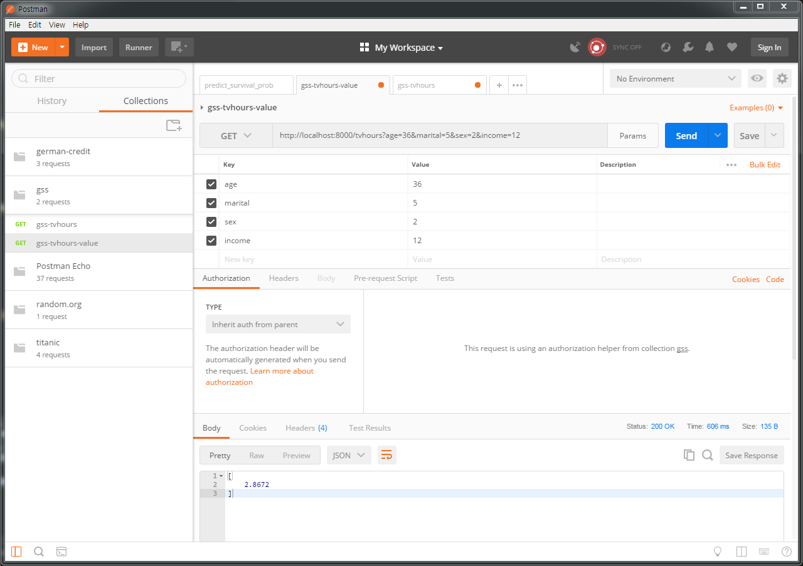

``` {r, include=FALSE}
source("tools/chunk-options.R")
knitr::opts_chunk$set(echo = TRUE, warning=FALSE, message=FALSE)

library(tidyverse)
library(httr)
options(scipen = 999)
options(dplyr.width = 120)
options(dplyr.print_max = 1e9)
```

# GSS TV 시청시간 {#gss-tvhours-data}

[General Social Survey](http://gss.norc.org/)는 1972년 이래로 미국인 생각하는 다양한 사회이슈에 대한 설문결과 조사를 제공하고 있다.
또한, GSS 데이터는 [openCPU](https://www.opencpu.org/) HTTP API 사례로 사용되고 있다.

목적은 TV 시청시간을 인구통계학적인 변수를 사용해서 예측하는데 이를 RESTful API로 제공하는 것을 목표로 해 보자.


$$\text{TV 시청시간} = f(\text{age, marital, sex, income}) + \epsilon$$

즉, 나이(age), 결혼상태(marital), 성별(sex), 가계소득(income)을 바탕으로 평균 TV시청시간을 예측하여 이를 RESTful API 서비스 형태로 제공하는 것이다.
각 변수에 대한 자세한 사항은 [GSS Data Explorer](https://gssdataexplorer.norc.org/)를 참조한다.

["rwebapps/tvscore"](https://github.com/rwebapps/tvscore) RESTful API 적용사례는 `openCPU` 팩키지를 사용한 것으로 필요한 사용하는 것도 좋을 듯하다.
다만, `openCPU`는 과학기술 분야에 방점을 두고 있다. [Deploying a scoring engine for predictive analytics with OpenCPU June 23, 2014](https://www.opencpu.org/posts/scoring-engine/) 웹페이지에서
원본 데이터를 다운로드 받을 수 있다.



1. 훈련데이터를 대상으로 탐색적 데이터분석을 진행한다.
1. `caret`을 기반으로 다양한 예측모형을 넣어 최적의 예측모형을 구축한다.
1. 최종 선택한 예측모형을 배포한다.
1. 선택된 예측모형에 기반하여 예측할 데이터를 준비한다.
1. Restful API 서버에 모형을 배포한다.
1. TV 시청시간 예측 서비스를 제공한다.

# RStudio 프로젝트 구조 {#gss-tvhours-data-project}

RStudio 프로젝트를 하나 생성하고 나서... `gss_tvhours` 디렉토리를 생성하고 RESTful API 서비스 개발에 필요한 모든 파일을 한 곳에 몰아 놓는다.

```{r rstudio-project-structure, eval = FALSE}
\rproject
 +--\code
    | predictive-model.R
 +--\data
    | GSS2012.sav
 +--\gss_tvhours
    | serve-model.R
    | glm_m.rds
    | server.R
```

# TV 시청시간 예측 서비스 {#gss-tvhours-data-restful-api}

## `caret` 예측모형 {#gss-tvhours-data-restful-api-caret}

TV 시청시간 예측 문제는 예측변수가 연속형으로 회귀모형으로 간주할 수 있다.
그리고 `GSS2012.sav` 데이터의 입력변수가 많기 때문에 변수 선택과정을 건너뛰고, 
앞서 선택한 4가지 변수만 예측모형에 개발에 넣어 가장 성능이 좋은 즉, RMSE가 적은 모형을 선택한다.
그리고 이 모형을 TV 시청시간 예측으로 배포한다.

일반화선형모형, Random Forest, CART, xgBoost 모형 아키텍처를 놓고 봤을 때 일반화선형모형이 나름 좋은 성능을 보이고 
단순한 모형이라 이를 TV 시청시간 예측모형으로 선정한다.

``` {r gss-tvhours-restful-api-model}
# 0. 환경설정 -----
library(tidyverse)
library(foreign)
library(caret)
library(yardstick)

# 1. 데이터 -----
## 1.1. 데이터 가져오기 -----
gss_dat <- read.spss("data/GSS2012.sav", to.data.frame=TRUE, use.value.labels = FALSE) %>% 
    as_tibble()

## 1.2. 데이터 정제 -----
gss_df <- gss_dat %>% 
    select(tvhours, age, marital, sex, income) %>% 
    mutate(marital = as.factor(marital),
           sex = as.factor(sex)) %>% 
    filter(complete.cases(.))

## 1.3. 데이터 분할 -----
in_train <- createDataPartition(gss_df$tvhours, p = c(0.7, 0.3), list = FALSE)

training <- gss_df[in_train, ]
testing <- gss_df[-in_train, ]

# 2. 예측모형 -----
## 2.1. 교차타당도 제어조건 설정 -----------
ml_control <- trainControl(method = "repeatedcv", 
                           number = 5, 
                           repeats = 1,
                           verboseIter=FALSE)

## 2.2. 예측모형 아키텍처 --------------------------------
### 2.2.1. GLM --------------------------------
glm_m <- train(tvhours ~ .,
                data=training, 
                method = "glm",
                trControl = ml_control)

### 2.2.2. CART --------------------------------
cart_m <- train(tvhours ~ .,
               data=training, 
               method = "rpart",
               trControl = ml_control)

### 2.2.3. RF --------------------------------
rf_m <- train(tvhours ~ .,
              data=training, 
              method = "rf",
              trControl = ml_control)

### 2.2.4. xgBoost --------------------------------
xgboost_m <- train(tvhours ~ .,
              data=training, 
              method = "xgbLinear",
              trControl = ml_control)

## 2.3. 모형 아키텍처 선정 ----- 
model_arch <- testing %>%
    mutate(GLM = predict(glm_m, testing),
           CART = predict(cart_m, testing),
           RF = predict(rf_m, testing),
           XGB = predict(xgboost_m, testing))
    
glm_metric_df      <- metrics(model_arch, truth = tvhours, estimate = GLM)
cart_metric_df     <- metrics(model_arch, truth = tvhours, estimate = CART)
rf_metric_df       <- metrics(model_arch, truth = tvhours, estimate = RF)
xgboost_metric_df  <- metrics(model_arch, truth = tvhours, estimate = XGB)


bind_rows(glm_metric_df, cart_metric_df) %>% 
    bind_rows(rf_metric_df) %>% 
    bind_rows(xgboost_metric_df) %>% 
    DT::datatable() %>% 
    DT::formatRound(c("rmse", "rsq"), digits=2)

## 2.4. 모형 성능 ----- 
metrics(model_arch, truth = tvhours, estimate = GLM)

# 3. 모형 배포 ----- 
# glm_m %>% write_rds("gss_model/glm_m.rds")
```

## RESTful API 서비스 개발 {#gss-tvhours-data-restful-api-convert}

일반화선형모형으로 TV 시청시간 예측모형으로 선정했다면 이를 RESTful API 서비스로 변환시킨다.
이를 위해서 `health_check` 서비스로 RESTful API가 정상 동작이 되는지 확인하고 나서,
`/tvhours`를 통해 서비스를 제공한다.
웹서비스를 통해 입력받는 데이터를 R 데이터프레임으로 변환시키고 나서, `predict()` 함수로 TV 시청시간을 예측하고 이를 반환한다.

``` {r gss-tvhours-restful-api-model-convert, eval=FALSE}
# serve-model.R
# 0. 환경설정 -----
library(plumber)

# 1. 모형 불러오기 ----- 
glm_m <- read_rds("gss_tvhours/glm_m.rds")

#* @get /healthcheck
health_check <- function() {
    result <- data.frame(
        "input" = "",
        "status" = 200,
        "model_version" = "GSS TV Hours"
    )
    
    return(result)
}


#* @post /tvhours
#* @get /tvhours
predict_tvhours <- function(age=NA, marital=NULL, sex=NULL, income=NULL) {
    # 1. 데이터 자료형 변환
    age <- as.integer(age)
    marital <- as.factor(marital)
    sex <- as.factor(sex)
    income <- as.integer(income)
    
    # 2. 데이터프레임 변환    
    payload <- data.frame(age = age,
                          marital = marital,
                          sex = sex,
                          income = income)

    tvhours_prediction <- predict(glm_m, payload)
    return(tvhours_prediction)
}
```

## TV 시청시간 예측 서비스 {#gss-tvhours-data-restful-api-service}

다음 코드로 RStudio에서 서비스를 실행시키면 TV 시청시간 서비스가 구동하게 되는데 
웹브라우저 주소창에 `http://localhost:8000/tvhours?age=36&marital=5&sex=2&income=12`을 입력하거나
Postman, curl을 통해 TV 시청시간 결과값을 반환 받을 수 있다.

``` {r gss-tvhours-restful-api-model-service, eval=FALSE}
# server.R
library(plumber)

serve_model <- plumb("gss_tvhours/serve-model.R")
serve_model$run(port = 8000)
```



# TV 시청시간 AWS 클라우드 서비스 [^plumber-api-on-aws] {#gss-tvhours-data-restful-api-service-aws}

[^plumber-api-on-aws]: [Andrew B. Collier (2017-09-14), Hosting a Plumber API on AWS](http://www.exegetic.biz/blog/2017/09/plumber-api-on-aws/)

TV 시청시간 예측 서비스를 AWS EC2위에 배포(`srv/shiny-server/gss-tvhours`)하고 나서 
`Rscript server.R`을 실행시키게 되면 `plumber` Restful API 서비스가 올라가기는 하지만 제대로 이용할 수 없다.

``` {r gss-tvhours-restful-api-model-service-on-aws, eval=FALSE}
$ Rscript server.R
```


## 문제확인 {#gss-tvhours-data-restful-api-service-aws-problem}

[MobaXterm: Enhanced terminal for Windows with X11 server, tabbed SSH client, network tools and much more](https://mobaxterm.mobatek.net/)을 다운로드 받아 설치하게 되면 `telnet` 명령어를 던질 수 있다. 
이를 통해서 접속이 되지 않음이 확인된다.

``` {r aws-restful-api-error, eval=FALSE}
[victor-PC1] $ telnet ec2-1xx-xxx-xxx-xx.ap-northeast-2.compute.amazonaws.com 8000
Trying 1x.xxx.xx.xxx...
telnet: Unable to connect to remote host: Connection refused
```


`sudo iptables -L`, `netstat -an | grep 8000` 명령얼르 통해서 **8000** 포트를 확인한다.
8000 포드는 `loopback` 인터페이스에 대응되는 것이 확인되어 이를 `plumber` 코드에 반영하면 된다.

``` {r aws-restful-api-error-investigate, eval=FALSE}
ubuntu@ip-xxx-xx-xx-7:~$ sudo iptables -L
Chain INPUT (policy ACCEPT)
target     prot opt source               destination

Chain FORWARD (policy ACCEPT)
target     prot opt source               destination

Chain OUTPUT (policy ACCEPT)
target     prot opt source               destination
ubuntu@ip-xxx-xx-xx-7:~$ netstat -an | grep 8000
tcp        0      0 127.0.0.1:8000          0.0.0.0:*               LISTEN
```

## 문제해결 {#gss-tvhours-data-restful-api-service-aws-problem-fix}

`serve_model$run(host = "0.0.0.0", port = 8000)`에 `host = "0.0.0.0"`를 반영시키면 문제를 해결할 수 있다.

``` {r aws-restful-api-error-fix-it, eval=FALSE}
# server.R
library(plumber)

serve_model <- plumb("gss_tvhours/serve-model.R")
serve_model$run(host = "0.0.0.0", port = 8000)
```

`8000` 포트에 `netstat -an | grep 8000` 명령어를 통해 정상적으로 대응된 모습은 다음과 같다.

``` {r aws-restful-api-error-investigate-ok, eval=FALSE}
ubuntu@ip-xxx-xx-xx-7:~$ netstat -an | grep 8000
tcp        0      0 0.0.0.0:8000            0.0.0.0:*               LISTEN
```

`http://http://ec2-xx-xxx-xx-xxx.ap-northeast-2.compute.amazonaws.com:8000/tvhours?age=36&marital=5&sex=2&income=12` 와 같은 방식으로 호출을 하게 되면 TV 시청시간에 대한 응답을 얻을 수 있다.

## 배포 {#gss-tvhours-data-restful-api-service-aws-deployment}

`serve_pm.sh` 쉘스크립트 파일을 다음과 같이 작성하여 
`ubuntu@ip-xxx-xx-xx-7:/srv/shiny-server/gss_tvhours# ./serve_pm.sh &` 실행시키면 배포가 된다.

``` {r gss-tvhours-aws-deploy-shell, eval=FALSE}
## 파일명: serve_pm.sh
#!/usr/bin/env Rscript

library(plumber)
serve_model <- plumb("gss_tvhours/serve-model.R")
serve_model$run(host="0.0.0.0", port = 8000)
```
