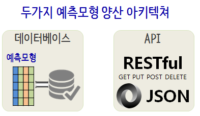
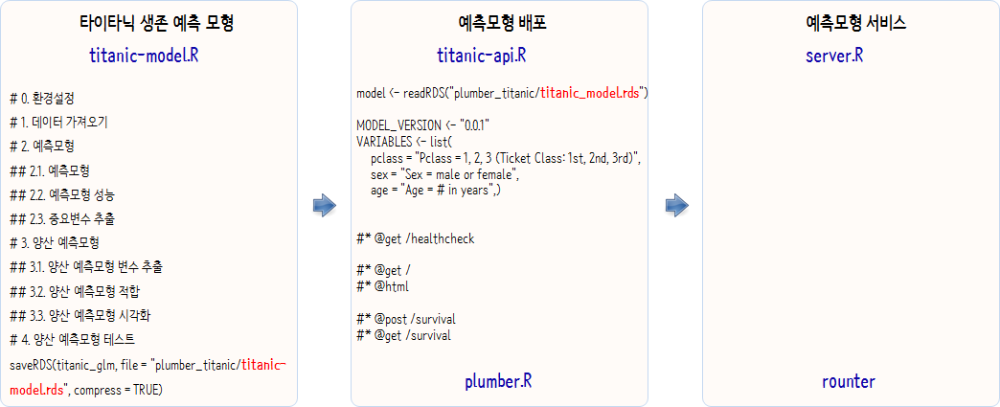
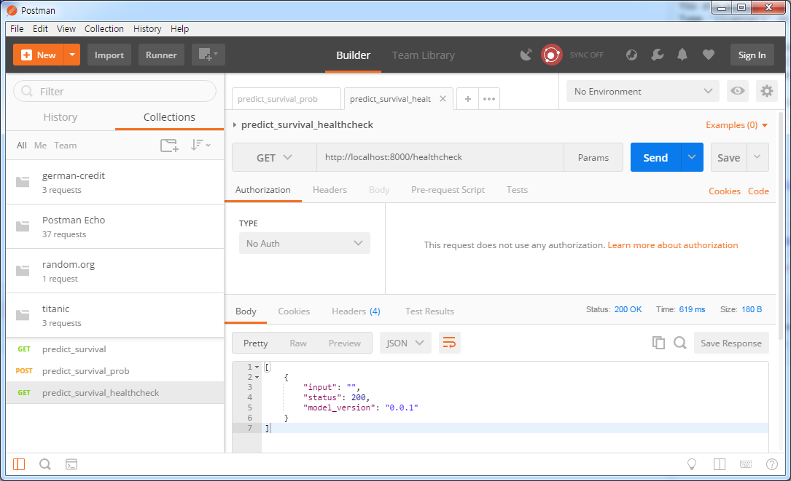
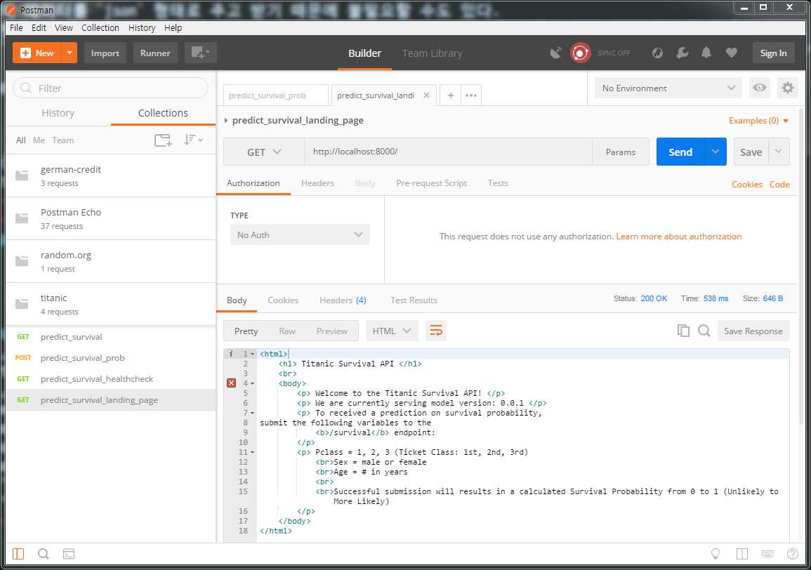
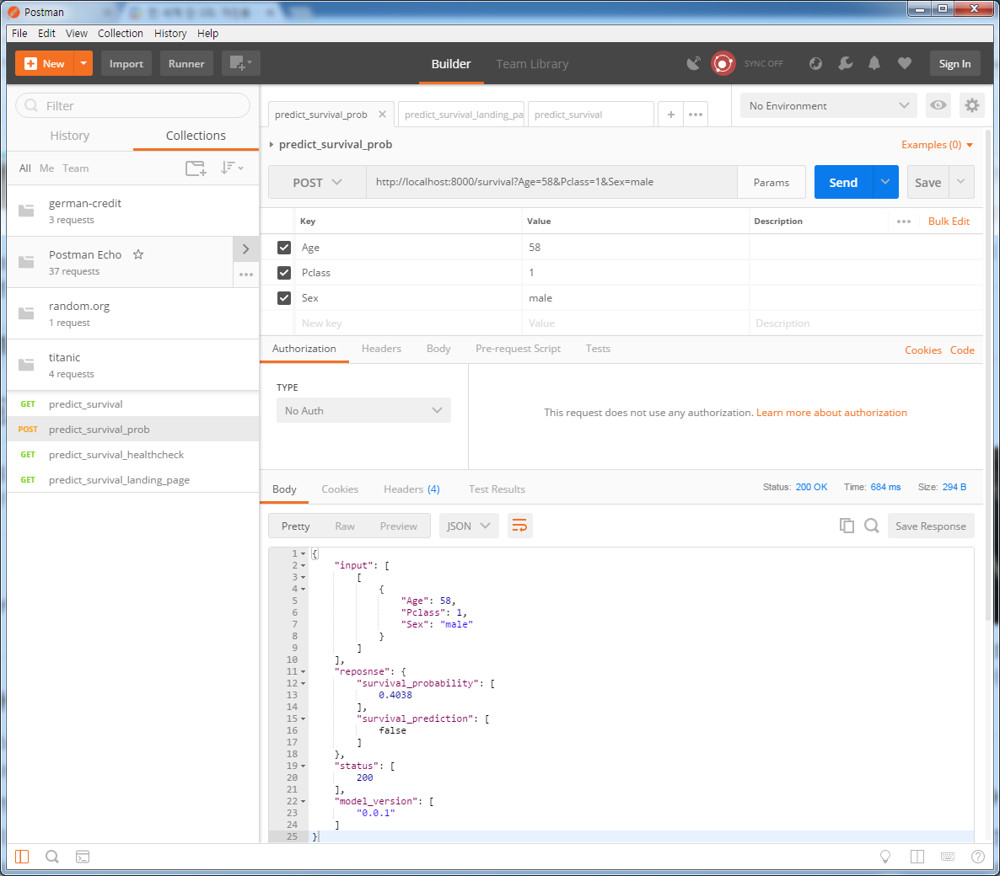

## 1. 양산환경 R [^r-as-a-webservice] {#r-in-production}

[^r-as-a-webservice]: [How do I expose R code as a web service?](https://www.quora.com/How-do-I-expose-R-code-as-a-web-service)

웹에서 R을 돌리는 방법은 오래전부터 많이 시도되어 왔고, 이제는 안정화되었다고 봐도 될듯 싶다. 
한동안 `opencup`가 많이 사용되어 왔으나 팩키지를 만들어야 기본적으로 R을 양산환경에 돌릴 수 있다는 
부담감(?)으로 작용하는 것도 사실이다. 최근에는 `plumber`

- `plumber`: [Turn your R code into a web API](https://github.com/trestletech/plumber)
- `opencpu`: [OpenCPU system for embedded scientific computation and reproducible research](https://www.opencpu.org/)
    -  팩키지를 개발하고 이를 RESTful API 서비스로 제공.
- `deployR`: [The elements of scaling R-based applications with DeployR](http://blog.revolutionanalytics.com/2016/09/the-elements-of-scaling-r-based-applications-with-deployr.html)
    - 마이크로소프트에서 개발하여 제공.
- `rapache`: [Web Application Development with R and Apache](http://rapache.net/)
    - 오래전에 개발된 후에 더이상 활발히 개발이 진행되고 있지 않는 것으로 파악됨.



기계학습, 딥러닝을 통해 학습한 예측모형을 양산환경으로 배포할 경우 크게 두가지 아키텍쳐가 가능하다.
일반적인 상용 웹사이트 사례를 들어 예측모형 양산환경에 대해서 살펴보자. [^titanic-plumber-api]

[^titanic-plumber-api]: [raybuhr blog, Making Predictions over HTTP with R October 17, 2017](https://raybuhr.github.io/2017/10/making-predictions-over-http/)

|구분|      데이터베이스            |         RESTful API          |
|----|:-----------------------------|:-----------------------------|
|장점| 데이터베이스 테이블을 단순히 병합(Join)하면 되기 때문에 속도가 매우 빠름 | 유닉스 철학에 따라 예측서비스를 독자적 수행이 가능 |
|단점| 커플링 되어 있어 일부 코드 변경을 위해서 시간이 추가로 소요되고, 한가한 시간에 배치로 테이블 예측값을 주기적 갱신 | 속도가 늦을 수 있으나 대부분의 웹사이트는 비동기식 통신을 통해 예측모형 외에 다양한 서비스를 조합해서 서비스함 |

RESTful API로 예측모형 양산 서비스를 제공할 경우 복잡한 예측모형만큼이나 난잡한 예측모형 양산 서비스를 이해하기 쉽게 할 수 있고,
유지보수하기도 쉽고, 예측모형에 대한 버젼관리 뿐만 아니라 모니터링도 한결 수월하게 진행할 수 있다.


> ### OpenCPU 와 다른 웹도구와 차별점 [^so-opencpu] {.callout}
>
> OpenCPU is a layer on top of the regular tools (e.g. RApache, rpy2) that defines a framework and protocol for interacting with R. 
> It handles stuff like object serialization, security, resource control, reproducibility etc, while abstracting away technicalities.

[^so-opencpu]: [What is the intention of opencpu.org compared to other approaches?
](https://stackoverflow.com/questions/8858429/whats-the-intention-of-opencpu-org-compared-to-other-approaches/8916615#8916615)

## 2. `plumber` 팩키지 맛보기 {#intro-to-plumber}

`plumber` 팩키지를 사용하게 되면 로컬컴퓨터에 웹서버를 띄워 간단하게 웹상에서 R을 사용한다는 의미를 체험하는데 최적이다. 
이것이 마음에 들면 확장하여 실운영환경으로 적용해서 최근 활발히 사용하고 있다.


### 2.1. 환경설치 및 R 웹서버 띄우기 {#config-webserver-plumber}

`devtools::install_github("trestletech/plumber")` 명령어로 R 웹서버를 띄우고 나서,
`myfile.R`에 웹서버를 통해 노출할 함수를 지정하면 된다. 그리고 나서 `r$run(port=8000)` 명령어를 실행하면 실제로 웹서버에 
노출한 함수를 곧바로 활용할 수 있다.


```r
devtools::install_github("trestletech/plumber")

library(plumber)

r <- plumb("code/myfile.R") 
r$run(port=8000)
Starting server to listen on port 8000
Running the swagger UI at http://127.0.0.1:8000/__swagger__/
```

### 2.2. R 웹서버에서 제공하는 서비스 {#plumber-services}

`@get`, `@post` 두가지 사례를 `normalMean`, `addTwo` 함수를 `mean`, `sum`을 통해 서비스로 제공하고 있다.


```r
#* @get /mean
normalMean <- function(samples=10){
    data <- rnorm(samples)
    mean(data)
}

#* @post /sum
addTwo <- function(a, b){
    as.numeric(a) + as.numeric(b)
}
```

### 2.3. 실행 사례 {#plumber-in-service}

`curl "http://localhost:8000/mean"` 명령어를 실행시키면 `localhost`, 8000포트를 통해 `mean` 서비스가 요청되고, 
기본설정된 매개변수 `sample=10`이 전달되어 표준정규분포에서 표본을 10개 뽑아 평균을 계산하고 출력결과를 반환시킨다.

`curl --data '{"a":4, "b":5}' http://localhost:8000/sum` 명령어를 실행시키면 `localhost`, 
8000포트를 통해 `sum` 서비스를 json 형식 데이터를 전달하여, 두값을 더한 후 결과값을 반환시킨다.


```r
$ curl "http://localhost:8000/mean"
[-0.6062]
$ curl "http://localhost:8000/mean?samples=1000"
[-0.0021]
$  curl --data "a=4&b=3" "http://localhost:8000/sum"
[7]
$ curl --data '{"a":4, "b":5}' http://localhost:8000/sum
[9]
```

## 3. 타이타닉 생존 확률 예측 서비스 {#titanic-survival-probability-in-production}

기본적으로 서비스로 관심이 있는 것은 타이타닉호에 승선했을 때, 나이, 호실, 성별 등 기본정보를 입력했을 때
생존확률이 얼마인지 알려주는 서비스를 제공하는 것이다.
결국 예측모형을 `.RData`, `.rds` 파일로 저장하면 RESTful API 서비스를 
`plumber.R` 혹은 `titanic-api.R` 파일에 기술한다. 통상 **끝점(endpoint)** 서비스를 기술한다.

- `#* @get /healthcheck`
- `#* @get /`
- `#* @html`
- `#* @post /survival`
- `#* @get /survival`

반면에, `rounter` 혹은 `server.R` 파일에는 암화화 쿠기, 오류 처리 등을 포함하여 서비스를 제공한다.




### 3.1. 타이타닉 생존 모형 {#step-01-titanic-survival-probability}

[캐글 타이타닉](https://www.kaggle.com/c/titanic/data) 데이터를 다운로드 받아 생존 예측모형을 제작한다.


```r
# 0. 환경설정 -------------------
library(tidyverse)

# 1. 데이터 불러오기 -------------------

titanic_dat <- read_csv("data/titanic-train.csv")

# 2. 데이터 전처리 -------------------

transform_titantic_data <- function(input_titantic_data) {
    ouput_titantic_data <- data_frame(
        survived = factor(input_titantic_data$Survived, levels = c(0, 1)),
        pclass   = factor(input_titantic_data$Pclass, levels = c(1, 2, 3)),
        female   = tolower(input_titantic_data$Sex) == "female",
        age      = factor(dplyr::if_else(input_titantic_data$Age < 18, "child", "adult", "unknown"), 
                     levels = c("child", "adult", "unknown"))
    )
    return(ouput_titantic_data)
}

titanic_df <- transform_titantic_data(titanic_dat)

# 3. 예측모형  -------------------

training_rows <- sample(1:nrow(titanic_df), size = floor(0.7*nrow(titanic_df)))
train_df <- titanic_df[training_rows, ]
test_df <- titanic_df[-training_rows, ]

titanic_glm <- glm(survived ~ pclass + female + age, 
                   data = titanic_df, 
                   family = binomial(link = "logit"))

# 4. 모형성능 평가  -------------------

test_predictions <- predict(titanic_glm, newdata = test_df, type = "response") >= 0.5
test_actuals <- test_df$survived == 1
accuracy <- table(test_predictions, test_actuals)
print(accuracy)
print(paste0("Accuracy: ", round(100 * sum(diag(accuracy))/sum(accuracy), 2), "%"))

# 5. 예측모형 배포 -------------------

saveRDS(titanic_glm, file = "plumber_titanic/titanic-model.rds", compress = TRUE)
```

### 3.2. 생존확률 RESTful API 서비스 건강상태 체크 {#step-02-restful-api-service}

가장 먼저 R에서 개발한 `titanic-model.rds`를 가져온다. 
그리고 나서, 모형 버젼 **MODEL_VERSION**, 입력변수 **VARIABLES**, RESTful API 서비스로 제공하는 값에 대해 기술한다.

다음으로 HTTP GET 요청으로 RESTful API가 정상 동작하는지 건강상태 확인 `http://127.0.0.1:8000/healthcheck`을 가장 먼저 수행한다.


```r
library(plumber)

model <- readRDS("plumber_titanic/titanic-model.rds")

MODEL_VERSION <- "0.0.1"
VARIABLES <- list(
    pclass = "Pclass = 1, 2, 3 (Ticket Class: 1st, 2nd, 3rd)",
    sex = "Sex = male or female",
    age = "Age = # in years",
    gap = "",
    survival = "Successful submission will results in a calculated Survival Probability from 0 to 1 (Unlikely to More Likely)")


#* @get /healthcheck
health_check <- function() {
    result <- data.frame(
        "input" = "",
        "status" = 200,
        "model_version" = MODEL_VERSION
    )
    
    return(result)
}
```



### 3.3. 생존확률 RESTful API 서비스 홈페이지 {#step-02-restful-api-service-homepage}

기계와 기계 사이에 데이터를 `json` 형태로 주고 받기 때문에 불필요할 수도 있다.
하지만, 제3자가 봤을 때 혹시 필요한 경우가 있어 **방문 페이지(landing page)**를 만들어 놓는 것이 필요한 경우도 있다.
데코레이터 `@get` 아래 `@html`을 사용하게 되면 `json` 대신에 `html`을 반환하게 되어 방문 웹페이지를 깔끔하게 구축할 수 있다.


```r
#* @get /
#* @html
home <- function() {
    title <- "Titanic Survival API"
    body_intro <-  "Welcome to the Titanic Survival API!"
    body_model <- paste("We are currently serving model version:", MODEL_VERSION)
    body_msg <- paste("To received a prediction on survival probability,", 
                      "submit the following variables to the <b>/survival</b> endpoint:",
                      sep = "\n")
    body_reqs <- paste(VARIABLES, collapse = "<br>")
    
    result <- paste(
        "<html>",
        "<h1>", title, "</h1>", "<br>",
        "<body>", 
        "<p>", body_intro, "</p>",
        "<p>", body_model, "</p>",
        "<p>", body_msg, "</p>",
        "<p>", body_reqs, "</p>",
        "</body>",
        "</html>",
        collapse = "\n"
    )
    
    return(result)
}
```



### 3.4. 생존확률 RESTful API 끝점(endpoint) {#step-03-restful-api-endpoint}

예측 서비스를 끝점(endpoint)을 통해서 바로 제공하기 전에 `transform_titantic_data()` 함수와 
`validate_feature_inputs()` 함수를 통해서 예측서비스 입력에 대해서 먼저 점검 작업을 수행한다.
특히, `validate_feature_inputs()` 함수는 입력 변수에 대해 논리 테스트를 수행하여 모든 것이 이상이 없다면 
"OK"를 결과값으로 반환시킨다.

`@post`, `@get` 방식으로  `/survival` 끝점을 통해서 `predict_survival` 함수로 산출된 생존확률값을 제공한다.


```r
transform_titantic_data <- function(input_titantic_data) {
    ouput_titantic_data <- data.frame(
        pclass = factor(input_titantic_data$Pclass, levels = c(1, 2, 3)),
        female = tolower(input_titantic_data$Sex) == "female",
        age = factor(dplyr::if_else(input_titantic_data$Age < 18, "child", "adult", "unknown"), 
                     levels = c("child", "adult", "unknown"))
    )
}

validate_feature_inputs <- function(age, pclass, sex) {
    age_valid <- (age >= 0 & age < 200 | is.na(age))
    pclass_valid <- (pclass %in% c(1, 2, 3))
    sex_valid <- (sex %in% c("male", "female"))
    tests <- c("Age must be between 0 and 200 or NA", 
               "Pclass must be 1, 2, or 3", 
               "Sex must be either male or female")
    test_results <- c(age_valid, pclass_valid, sex_valid)
    if(!all(test_results)) {
        failed <- which(!test_results)
        return(tests[failed])
    } else {
        return("OK")
    }
}

#* @post /survival
#* @get /survival
predict_survival <- function(Age=NA, Pclass=NULL, Sex=NULL) {
    age = as.integer(Age)
    pclass = as.integer(Pclass)
    sex = tolower(Sex)
    valid_input <- validate_feature_inputs(age, pclass, sex)
    if (valid_input[1] == "OK") {
        payload <- data.frame(Age=age, Pclass=pclass, Sex=sex)
        clean_data <- transform_titantic_data(payload)
        prediction <- predict(model, clean_data, type = "response")
        result <- list(
            input = list(payload),
            reposnse = list("survival_probability" = prediction,
                            "survival_prediction" = (prediction >= 0.5)
            ),
            status = 200,
            model_version = MODEL_VERSION)
    } else {
        result <- list(
            input = list(Age = Age, Pclass = Pclass, Sex = Sex),
            response = list(input_error = valid_input),
            status = 400,
            model_version = MODEL_VERSION)
    }
    
    return(result)
}
```



특히, 훌륭한 RESTful API를 설계하기 위한 지침을 참조하여 활용하는 것도 권장된다. [^good-restful-api-design]

[^good-restful-api-design]: [Principles of good RESTful API Design, DECEMBER 31, 2013](https://codeplanet.io/principles-good-restful-api-design/)
