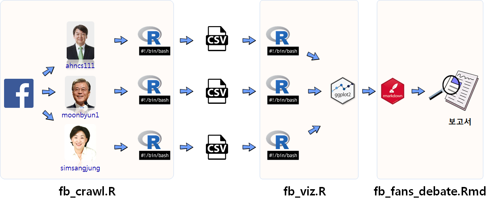
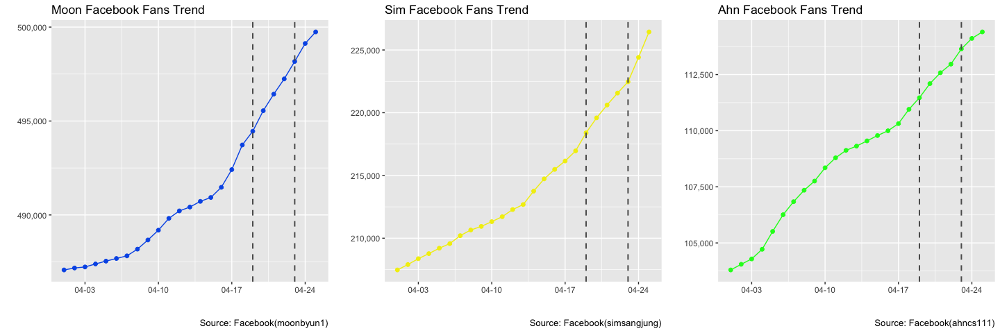
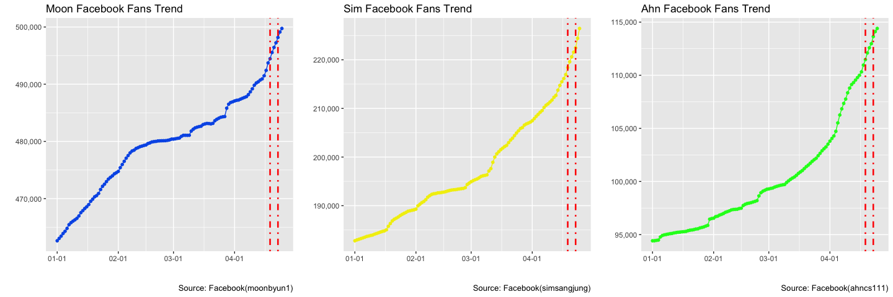
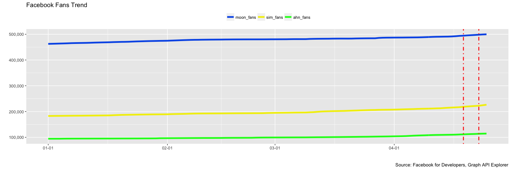

# 데이터 과학

> ## 학습 목표 {.objectives}
>
> * 유닉스 `Makefile` 자동화 과정을 R언어로 접근한다.
> * 다양한 작업 흐름의 장단점을 살펴본다.
> * R과 `make`를 혼합하여 데이터 추출작업, 시각화, 보고서 자동화를 구현한다. 

## 1. 왜 데이터 분석 자동화가 필요한가? [^jtbc-apology] [^reproducible-data-analysis] [^stat545-make]

촛불 탄핵이후 JTBC는 대한민국에서 가장 공신력있는 언론사로 굳건히 자리를 잡았다. 
하지만, 여론조사 데이터를 그래프화하여 방송하는 과정에서 어이 없는 오류로 인해 손석히 앵커가 직접 사과를 해야만 했다.

이러한 실수를 줄이기 위해서 크게 두가지 부분이 필요한데 데이터분석과정에서 사람의 개입을 최소화하는 것이 우선이다.
즉, 기계가 더 잘 할 수 있는 부분은 기계에 맡기고 사람은 사람이 잘할 수 있는 부분에 집중하면 된다. 
첫번째로 여론조사 결과를 그래프 및 표를 통해 시각화하는데 필요한 데이터를 가져오는 과정이고 이를 위해 필요한 것에 대해서는 다음을 참조한다.

- [PDF 감옥에서 데이터를 탈출시키다.](http://statkclee.github.io/data-science/ds-extract-text-from-pdf-survey.html)

두번째 필요한 작업이 데이터를 가지고 종횡비(aspect ratio)를 가지고 의도적 혹은 비의도적으로 시각화하는 기법은 차치하고 기계가 데이터를 있는 그대로 
시각화하는 방법이다. 이를 위해 꼭 필요한 것이 자동화(Automation)다.

<iframe width="560" height="315" src="https://www.youtube.com/embed/nd5-fRdhImw" frameborder="0" allowfullscreen></iframe>

[^reproducible-data-analysis]: [GNU Make for Reproducible Data Analysis](http://zmjones.com/make/)

[^jtbc-apology]: [손석희가 JTBC의 잦은 그래프 오류에 사과했다](http://www.huffingtonpost.kr/2017/04/20/story_n_16118276.html)

[^stat545-make]: [Automating data analysis pipelines](http://stat545.com/automation00_index.html)

### 1.1. 재현가능한 데이터 분석 

재현가능한 데이터 분석 결과를 구현하는 것은 사실 소프트웨어 공학의 영역이라고 볼 수 있다.
소프트웨어에서는 `DevOps`로 이를 구현한 방법론과 도구는 많이 존재하고, 데이터 분석도 예외일 수는 없다.

데이터 분석 과정을 자동화하여 재현가능하고 실뢰성있는 분석을 담아내는 방법에 대해 일부 기법과 작업흐름을 살펴보자.

- 쉘스크립트 작업 자동화 : `#!/bin/bash`
- `make all` 한통에 넣어 자동화: `report.sh`
- 최종 산출물을 생성하기 위한 규칙을 하나 생성: `fb_fans_debate.html`
- 최종 산출물이 생성되기 위한 원본 파일을 추가(의존성 생성): `fb_fans_debate.Rmd`
- 한통으로 된 규칙을 단계별로 구분: 데이터 추출, 그래프 생성, 보고서 생성
- 입력(`$<`), 출력(`$@`) 생성 파일에 대한 변수 사용
- 패턴 규칙을 사용한다. 예를 들어 `%` 기호는 임의 문자열을 매칭시킨다.

## 2. 작업 개요

페이스북 페이지에서 주요 후보별 팬수를 추출하여 이를 시각화하고 나서 보고서를 생성하는 과정을 자동화한다.

### 2.1. 모든 작업을 R에서 한방에 처리하는 방법

`Make.R` 파일을 RStudio 프로젝트 루트 디렉토리에 위치시키고 나서 각 단계별 R 스크립트를 실행하여 `.csv` 파일, 그래프 파일, html 보고서를 생성시킨다.

~~~{.r}
source("code/fb_crawl.R")
source("code/fb_viz.R")
source("code/fb_report.R")
~~~

### 2.2. 쉘스크립트 하나로 자동화하는 방법

기본적으로 RStudio를 버리고 쉘환경(리눅스 배쉬, 윈도우 터미널, 맥 터미널)에서 쉘스크립트(Shell Script)를 사용하여 자동화하는 방법이다.
하지만, 상황에 따라서 일부만 변경된 경우 그 모든 변경사항을 사람이 기억하고 있어야 해서 복잡한 자동화를 하는 경우 적합하지 않을 수 있다.

`report.sh` 파일을 작성하여 `bash report.sh` 명령어를 실행하면 Rscript에 프로그래밍된 것이 구현되어 산출물이 뽑아진다. 

~~~{.r}
#!/bin/bash

# downlaod facebook data from facebook pages
Rscript code/fb_crawl.R
# Draw graphs
Rscript code/fb_viz.R
# Make a html report
Rscript -e 'knitr::knit("report/fb_fans_debate.Rmd")'
pandoc -s -o fb_fans_debate.html fb_fans_debate.md 
~~~

### 2.3. 한통에 `make all` 실행

쉘환경을 사용하는 것은 동일하지만 `bash` 스크립트를 사용하는 대신, `make` 명령어를 사용한다. 
쉘스크립트를 그대로 `make all`로 옮겨와서 작성한 것은 다음과 같다.

즉, `fb_crawl.R`을 실행하여 페이스북에서 데이터를 가져와서 `.csv` 파일로 저장하고 나서, `fb_viz.R` 파일을 실행하여 
그래프를 `.png` 파일로 저장하고 나서 `fb_fans_debate.Rmd` 파일로 `.html` 보고서를 작성한다.

~~~{.r}
all: 
	Rscript code/fb_crawl.R
	Rscript code/fb_viz.R
	rm Rplots.pdf
	Rscript -e "rmarkdown::render('report/fb_fans_debate.Rmd')"
~~~

### 2.4. 최종 산출물(html 보고서)을 생성하는 규칙 생성

단순히 순차적으로 쭉 명령어를 실행하는 것이 아니라 특정 산출물을 생성시키기 위해 규칙을 추가한다.
즉, `fb_fans_debate.html` 파일을 생성시킨데 실행시킬 파일을 적시한다. 따라서 `fb_fans_debate.html` 보고서를 생성시키려면 
순차적으로 `fb_crawl.R`을 실행하여 페이스북에서 데이터를 가져와서 `.csv` 파일로 저장하고 나서, `fb_viz.R` 파일을 실행하여 
그래프를 `.png` 파일로 저장하고 나서 `fb_fans_debate.Rmd` 파일을 실행시켜야만 된다.

~~~{.r}
all: fb_fans_debate.html

fb_fans_debate.html:
	Rscript code/fb_crawl.R
	Rscript code/fb_viz.R
	rm Rplots.pdf
	Rscript -e "rmarkdown::render('report/fb_fans_debate.Rmd')"
~~~

### 2.5. 최종 산출물(html 보고서)에 대한 의존성(dependency) 추가

보고서에 내용이 결재권자의 의중을 반영하거나 오탈자가 있다거나 여러가지 사유로 인해서 변경되는 경우가 있다.
이런 경우가 발생하면 보고서를 새로 생성해야 하는데 이런 경우 최종 산출물 `fb_fans_debate.html` 파일은 
`fb_fans_debate.Rmd` 파일에 의존성(dependecy)을 갖게 된다. 이를 반영하여 `Makefile`을 수정하면 다음과 같다.

`fb_fans_debate.Rmd` 파일이 `report/` 디렉토리 밑에 있어 이를 반영하여 `make`가 실행이 되게 만든다.

~~~{.r}
all: report/fb_fans_debate.html

report/fb_fans_debate.html: report/fb_fans_debate.Rmd
	Rscript code/fb_crawl.R
	Rscript code/fb_viz.R
	rm Rplots.pdf
	Rscript -e "rmarkdown::render('report/fb_fans_debate.Rmd')"
~~~

### 2.6. 규칙을 모듈화하여 쪼개기

의존성까지 검증이 되었으면 이를 반영하여 보고서를 모듈화하여 각 단계별로 쪼갠다.

- 페이스북에서 각 후보별 팬수를 긁어와서 `.csv` 파일로 저장하는 모듈
- 저장된 파일에서 데이터를 불러와서 시각화한 그래프를 저장하는 모듈
- 최종 보고서를 생성하는 모듈

즉, 최종 모듈을 생성하기 위해 각 단계별로 필요한 사항을 모듈별로 작성하여 코드화한다.

~~~{.r}
all: report/fb_fans_tv_debate.html
	
data/fb_ahn.csv data/fb_moon.csv data/fb_sim.csv: 
	Rscript code/fb_crawl.R

fig/candidates.png fig/candidates_large.png fig/candidates_all.png: data/fb_ahn.csv data/fb_moon.csv data/fb_sim.csv code/fb_viz.R
	Rscript code/fb_viz.R

report/fb_fans_tv_debate.html: report/fb_fans_tv_debate.Rmd data/fb_ahn.csv data/fb_moon.csv data/fb_sim.csv fig/candidates.png fig/candidates_large.png fig/candidates_all.png
	Rscript -e "rmarkdown::render('report/fb_fans_debate.Rmd')"
~~~

### 2.7. 마지막 정리

주석(`#`)을 달고, 입력(`$<`), 출력(`$@`) 생성 파일에 대한 변수 사용하고, 패턴 규칙을 사용하여 예를 들어 `%` 기호는 임의 문자열을 매칭시켜 코드를 간결하게 만든다.

~~~{.r}
all: report/fb_fans_tv_debate.html

clean:
	rm -f data/*.csv fig/*.png report/*.html

.PHONY: all clean
.DELETE_ON_ERROR:
.SECONDARY:

# Crawl facebook fans
data/%.csv: 
	Rscript code/fb_crawl.R

# Save graphs
fig/%.png: data/%.csv code/fb_viz.R
	Rscript code/fb_viz.R

# Make a html report
report/fb_fans_tv_debate.html: report/fb_fans_tv_debate.Rmd data/%.csv fig/%.png
	Rscript -e "rmarkdown::render('$<')"
~~~

## 3. TV 토론이 지지율에 미치는 효과

TV 토론이 지지율에 미치는 효과를 검증하기 위한 도구로 페이스북 페이지 팬수 증가분을 통계지표로 삼아 분석을 진행한다.

- TV 토론 일정 
    - ~~KBS 비법정 토론: 4월 19일~~
    - ~~1차 TV 토론 (정치): 4월 23일~~
    - ~~JTBC 비법정 토론 (양극화와 안보): 4월 25일~~
    - 2차 TV 토론 (경제): 4월 28일
    - 3차 TV 토론 (사회): 5월 2일

### 3.1. JTBC TV 토론 효과

심상정 후보는 JTBC TV토론의 효과를 가장 많이 본 것으로 보이며 안철수 후보는 상대적으로 기세가 누그러진 것으로 파악됨.

<!--html_preserve-->

<!--/html_preserve-->
