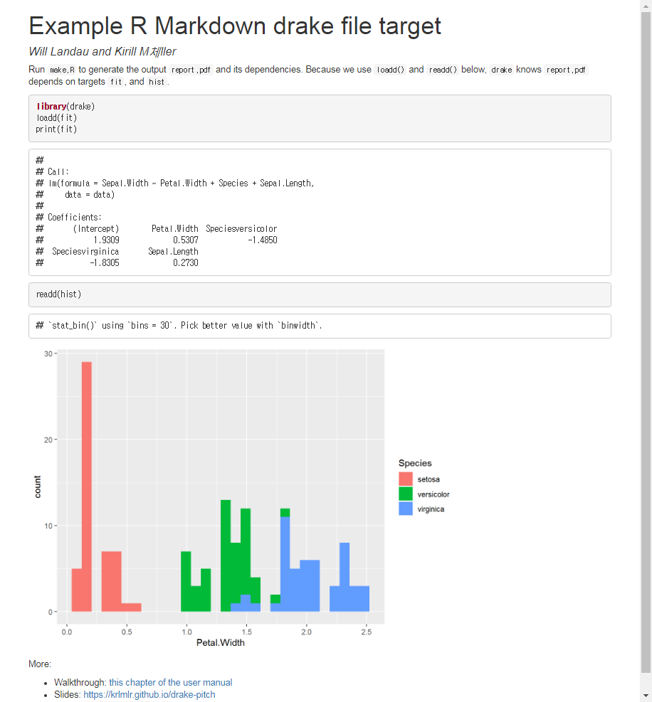

``` {r, include=FALSE}
source("tools/chunk-options.R")
knitr::opts_chunk$set(echo = TRUE, warning=FALSE, message=FALSE,
	                  comment="", digits = 3, tidy = FALSE, prompt = TRUE, fig.align = 'center')


```


# `make` 끝판왕 [^r-make-drake] {#r-make}

[^r-make-drake]: [`drake`: An R-focused pipeline toolkit for reproducibility and high-performance computing](https://github.com/ropensci/drake)

# 요리(cooking) [^r-make-cooking] {#r-make-cooking}

[^r-make-cooking]: [Cooking with R](https://github.com/krlmlr/cooking)

[^make-cooking-ex]: [Make-like declarative workflows with R](https://krlmlr.github.io/slides/drake-sib-zurich/cooking.html#1)

사실 다른 많은 일은 요리에서 많은 영감을 받아 시작된 것도 많다. 그런 점에서 데이터 과학은 요리와 매우 유사하다.
원재료를 구매해서 껍질을 벗기고 잘게 썰는 전처리 작업을 수행하고 복고, 쌂아 재료를 익히고 나서 조합하면 맛난 요리가 탄생한다. 라구(ragout)는 고기와 야채에 갖은 양념을 하여 끓인 음식의 일종이다.


## 예제 [^make-cooking-ex] {#r-make-cooking-ex}

본격적인 라구 요리를 진행하기에 앞서 고기를 썰어, 기름에 복고, 야채를 넣어 요리하는 과정을 코드로 구현해보자.
`cooking` 팩키지에 요리에 필요한 다양한 동사 `buy()`, `chop()`, `fry()`, `combine()` 동사가 들어 있고, 
이를 자동화하는 `drake_plan()`, `make()` 함수는 `drake` 팩키지에서 지원된다.

이제 가상의 요리를 진행해 본다.


```{r r-make-cooking-ex}
# make.R
library(drake)
library(cooking)
pkgconfig::set_config("drake::strings_in_dots" = "literals")

plan <- drake_plan(
    meat = buy("meat"),
    chopped_meat = chop(meat),
    fried_meat = fry(chopped_meat, with = "oil"),
    ragout = combine(fried_meat, with = "vegetables")
)

plan

make(plan)
```


`plan` 객체에는 데이터프레임으로 달성해야 되는 목표가 `target`에 담겨있고, `target`을 달성하기 위해서 수행해야 되는 명령이 `command` 칼럼에 담겨진다. 순차적으로 의존성을 갖기 때문에 데이터프레임에 담긴 순서는 의미가 크다.


`make()` 명령어를 때리거나, 터미널에서... `Rscript make.R`로 명령어를 실행시킬 수 있다.


```{r cooking-shell-make, eval = FALSE}
$ Rscript make.R
?[90m# A tibble: 4 x 2?[39m
  target       command
?[90m*?[39m ?[3m?[90m<chr>?[39m?[23m        ?[3m?[90m<chr>?[39m?[23m

?[90m1?[39m meat         ?[90m"?[39mbuy(\"meat\")?[90m"?[39m

?[90m2?[39m chopped_meat chop(meat)
?[90m3?[39m fried_meat   ?[90m"?[39mfry(chopped_meat, with = \"oil\")?[90m"?[39m

?[90m4?[39m ragout       ?[90m"?[39mcombine(fried_meat, with = \"vegetables\")?[90m"?[39
m
?[32mAll targets are already up to date.?[39m
ragout, ?[3mmade of?[23m
  fried meat, ?[3mmade of?[23m
    chopped meat, ?[3mmade of?[23m
      raw meat, ?[3mbought at?[23m
        supermarket
    oil
  vegetables
$target
[1] "meat"

$imported
[1] FALSE

$foreign
[1] TRUE

$missing
[1] FALSE

$seed
[1] 2127644670

$command
[1] "{\n buy(\"meat\") \n}"

$depends
[1] "dd4f3920ba8ed66a3e7166d53e4ced803d011a3d250c75ace8fd6706738c2d80"

$file
[1] NA

$start
    elapsed
   5.21    7.92  296.52

$time_command
  item   type elapsed user system
1 meat target       0    0      0

$time_build
  item   type elapsed user system
1 meat target    0.02    0   0.03

character(0)
```


정상적으로 실행이 되면, `readd()` 함수로 저장된 결과를 확인할 수 있다.

```{r r-make-cooking-ex-readd}
readd(ragout)
```

`vis_drake_graph()` 함수로 작업과정을 시각적으로도 확인할 수 있다.

```{r r-make-cooking-ex-viz}
config <- drake_config(plan, verbose = FALSE)

vis_drake_graph(config)
```

그외, `diagnose()`, `outdated()` 함수도 있으니 MAKE 과정에서 필요한 경우 참조한다.

# `drake` 헬로우 월드 {#r-drake-hello-world}

앞서 요리와 데이터과학의 관계를 파악했다면, 동일한 개념을 원재료를 데이터로 바꾸고,
다양한 요기함수를 데이터 전처리 및 데이터 분석함수로 바꾼 후에 최종 요리인 `.html` 보고서를 작성해 본다.
`drake` 팩키지에 포함된 헬로우 월드 예제를 그대로 따라해 보자.

## 환경설정 [^drake-hello-world-setup] {#r-drake-hello-world-setup}

[^drake-hello-world-setup]: [ropensci/drake/inst/examples/main/](https://github.com/ropensci/drake/tree/master/inst/examples/main)

가장 먼저 환경설정이 중요하다. 이를 위해서 `make.R`, `raw_data.xlsx`, `report.Rmd` 파일이 필요하다.

- `raw_data.xlsx`: 원재료 데이터(붓꽃, iris 데이터)
- `make.R`: 보고서 제작과정을 자동화
- `report.Rmd`: 데이터 분석 결과를 사람이 볼 수 있는 문서로 가공한 보고서

```{r drake-hello-world-setup, eval = FALSE}
$ ls -al
total 28
drwx------+ 1 4294967295 mkpasswd    0 Jul 12 17:35 .
drwx------+ 1 4294967295 mkpasswd    0 Jul 13 12:27 ..
-rwx------+ 1 4294967295 mkpasswd  976 Jul 12 17:10 make.R
-rwx------+ 1 4294967295 mkpasswd 9131 Jul 12 16:30 raw_data.xlsx
-rwx------+ 1 4294967295 mkpasswd  599 Jul 12 16:38 report.Rmd
```

## 구성요소 {#r-drake-hello-world-component}

### 원재료 데이터 {#r-drake-hello-world-component-iris}

`iris` 데이터를 엑셀 `raw_data.xlsx` 파일로 저장을 시켜놓은 것을 쉽게 확인할 수 있다.

```{r drake-hello-world-iris-dataset}
iris_df <- readxl::read_xlsx("data/raw_data.xlsx")
DT::datatable(iris_df)
```

### 보고서 {#r-drake-hello-world-component-report}

전형적이 Rmarkdown 파일로 앞서 `make.R`을 실행시켜 `drake`가 생성시킨 객체를 `.drake` 디렉토리에 저장시켜 뒀다 이를 불러와서 보고서에 반영시킨다. 이를 위해서 `loadd()`, `print()`, `readd()` 함수를 동원한다. 

```{r drake-hello-world-iris-report, eval = FALSE}
# ---
# title: "Example R Markdown drake file target"
# author: Will Landau and Kirill Müller
# output: html_document
# ---
# 
# Run `make.R` to generate the output `report.pdf` and its dependencies. Because we use `loadd()` and `readd()`  below, `drake` knows `report.pdf` depends on targets `fit`, and `hist`.
# 
# ```{r content}
# library(drake)
# loadd(fit)
# print(fit)
# readd(hist)
# ```
# 
# More:
# 
# - Walkthrough: [this chapter of the user manual](https://ropenscilabs.github.io/drake-manual/intro.html)
# - Slides: [https://krlmlr.github.io/drake-pitch](https://krlmlr.github.io/drake-pitch)
# - Code: `drake_example("main")`

```

### 자동화(Make) 파일 {#r-drake-hello-world-component-make}

`drake_plan()` 함수 내부에 자동화 과정을 상술한다.
그전에 `file.exists("raw_data.xlsx")`, `file.exists("report.Rmd")` 명령어를 통해 자동화과정에 필요한 내용이 충족되는지 확인한다.

1. 데이터 가져오기: `raw_data = readxl::read_xlsx(file_in("raw_data.xlsx")),`
1. 데이터 전처리: `data = raw_data %>% mutate(Species = forcats::fct_inorder(Species)) %>% select(-X__1),`
1. 시각화: `hist = create_plot(data),`
1. 기계학습 모형: `fit = lm(Sepal.Width ~ Petal.Width + Species +  Sepal.Length, data),`
1. 보고서 작성: `rmarkdown::render(knitr_in("report.Rmd"),output_file = file_out("report.html"),quiet = TRUE)`

```{r drake-hello-world-iris-make, eval = FALSE}
# 0. 환경설정 -----
library(drake) # devtools::install_github("ropensci/drake")
library(tidyverse)
pkgconfig::set_config("drake::strings_in_dots" = "literals")

create_plot <- function(data) {
    ggplot(data, aes(x = Petal.Width, fill = Species)) +
        geom_histogram()
}

plan <- drake_plan(
    raw_data = readxl::read_xlsx(file_in("raw_data.xlsx")),
    data = raw_data %>%
        mutate(Species = forcats::fct_inorder(Species)) %>% 
        select(-X__1),
    hist = create_plot(data),
    fit = lm(Sepal.Width ~ Petal.Width + Species +  Sepal.Length, data),
    rmarkdown::render(
        knitr_in("report.Rmd"),
        output_file = file_out("report.html"),
        quiet = TRUE
    )
)

plan

make(plan)
```

### 작업 자동화 {#r-drake-hello-world-component-make-run}

모든 과정이 준비가 되었으니 이제 실행해 보자. `Rscript make.R` 명령어를 실행하면 쭉 자동으로 실행이 된다.
최종적으로 `report.html` 파일이 생성된 것이 확인된다.

```{r drake-hello-world-iris-make-run, eval = FALSE}
$ Rscript make.R
-- ?[1mAttaching packages?[22m -------------------------------------------- tidyverse 1.
2.1 --
?[32m?[39m ?[34mggplot2?[39m 3.0.0     ?[32m?[39m ?[34mpurrr  ?[39m 0.2.5
?[32m?[39m ?[34mtibble ?[39m 1.4.2     ?[32m?[39m ?[34mdplyr  ?[39m 0.7.6
?[32m?[39m ?[34mtidyr  ?[39m 0.8.1     ?[32m?[39m ?[34mstringr?[39m 1.3.1
?[32m?[39m ?[34mreadr  ?[39m 1.1.1     ?[32m?[39m ?[34mforcats?[39m 0.3.0
-- ?[1mConflicts?[22m ----------------------------------------------- tidyverse_conflict
s() --
?[31mx?[39m ?[34mtidyr?[39m::?[32mexpand()?[39m masks ?[34mdrake?[39m::expand()
?[31mx?[39m ?[34mdplyr?[39m::?[32mfilter()?[39m masks ?[34mstats?[39m::filter()
?[31mx?[39m ?[34mtidyr?[39m::?[32mgather()?[39m masks ?[34mdrake?[39m::gather()
?[31mx?[39m ?[34mdplyr?[39m::?[32mlag()?[39m    masks ?[34mstats?[39m::lag()
():
1:  'ggplot2' R  3.5.1
2:  'dplyr' R  3.5.1
3:  'stringr' R  3.5.1
[1] TRUE
[1] TRUE
?[90m# A tibble: 5 x 2?[39m
  target            command
?[90m*?[39m ?[3m?[90m<chr>?[39m?[23m             ?[3m?[90m<chr>?[39m?[23m

?[90m1?[39m raw_data          ?[90m"?[39mreadxl::read_xlsx(file_in(\"raw_data.xlsx\"))?[90m"?[39m
?[90m2?[39m data              ?[90m"?[39mraw_data %>% mutate(Species = forcats::fct_inorder(Specie?[90m?[39m~
?[90m3?[39m hist              create_plot(data)

?[90m4?[39m fit               lm(Sepal.Width ~ Petal.Width + Species + Sepal.Length, dat~
?[90m5?[39m ?[90m"?[39m\"report.html\"?[90m"?[39m ?[90m"?[39mrmarkdown::render(knitr_in(
\"report.Rmd\"), output_file =?[90m?[39m~
?[32mtarget?[39m raw_data
?[32mtarget?[39m data
?[32mtarget?[39m fit
?[32mtarget?[39m hist
?[32mtarget?[39m file "report.html"
?[90m# A tibble: 150 x 5?[39m
   Sepal.Length Sepal.Width Petal.Length Petal.Width Species
          ?[3m?[90m<dbl>?[39m?[23m       ?[3m?[90m<dbl>?[39m?[23m        ?[3m?[90m<dbl>?
[39m?[23m       ?[3m?[90m<dbl>?[39m?[23m ?[3m?[90m<fct>?[39m?[23m
?[90m 1?[39m          5.1         3.5          1.4         0.2 setosa
?[90m 2?[39m          4.9         3            1.4         0.2 setosa
?[90m 3?[39m          4.7         3.2          1.3         0.2 setosa
?[90m 4?[39m          4.6         3.1          1.5         0.2 setosa
?[90m 5?[39m          5           3.6          1.4         0.2 setosa
?[90m 6?[39m          5.4         3.9          1.7         0.4 setosa
?[90m 7?[39m          4.6         3.4          1.4         0.3 setosa
?[90m 8?[39m          5           3.4          1.5         0.2 setosa
?[90m 9?[39m          4.4         2.9          1.4         0.2 setosa
?[90m10?[39m          4.9         3.1          1.5         0.1 setosa
?[90m# ... with 140 more rows?[39m
`stat_bin()` using `bins = 30`. Pick better value with `binwidth`.

Call:
lm(formula = Sepal.Width ~ Petal.Width + Species + Sepal.Length,
    data = data)

Coefficients:
      (Intercept)        Petal.Width  Speciesversicolor   Speciesvirginica
           1.9309             0.5307            -1.4850            -1.8305
     Sepal.Length
           0.2730

$ ls -al
total 788
drwx------+ 1 4294967295 mkpasswd      0 Jul 13 14:48 .
drwx------+ 1 4294967295 mkpasswd      0 Jul 13 12:27 ..
drwx------+ 1 4294967295 mkpasswd      0 Jul 13 14:49 .drake
-rwx------  1 victorlee  mkpasswd   5106 Jul 13 14:48 Rplots.pdf
-rwx------+ 1 4294967295 mkpasswd    976 Jul 12 17:10 make.R
-rwx------+ 1 4294967295 mkpasswd   9131 Jul 12 16:30 raw_data.xlsx
-rwx------+ 1 4294967295 mkpasswd    599 Jul 12 16:38 report.Rmd
-rwx------  1 victorlee  mkpasswd 763485 Jul 13 14:48 report.html
```


