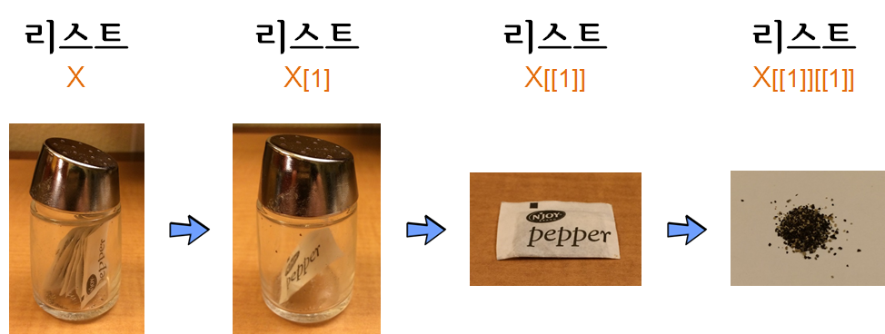

```{r, include=FALSE}
source("tools/chunk-options.R")
knitr::opts_chunk$set(collapse = TRUE, comment = "#>")
```

> ## 학습 목표 {.objectives}
>
> * 함수형 프로그래밍을 위한 기본 자료구조를 이해한다.


## 1. 벡터와 리스트 [^jennybc-purrr] [^jennybc-purrr-github]

[^jennybc-purrr]: [`purrr` tutorial: Lessons and Examples](https://jennybc.github.io/purrr-tutorial/index.html)

[^jennybc-purrr-github]: [`purrr` tutorial GitHub Webpage](https://github.com/jennybc/purrr-tutorial/)

### 1.1. 벡터

벡터와 리스트는 R의 기본 자료구조라 데이터 분석에 자주 사용되는 기본 자료구조에 친숙해지면 여러모로 장점이 많다.
가장 많이 사용되는 자료구조는 논리형(logical), 정수형(integer), 부동소수점형(double), 문자형(character)가 있다.
원자벡터는 동일한 자료형을 한곳에 모아 높은 것으로 각 원자는 자료형과 저장모드가 동일하다고 볼 수 있다.
물론 스칼라(scalar)는 길이가 1을 갖는 원자다. 원자벡터를 생성하는 기본 연산자는 `c()`가 되지만,
삶을 편하게 하는 여러가지 축약방법이 존재하는데 `1:4`, `letters`가 여기에 포함된다.

- R에서 흔히 사용되는 자료형
    - 논리형(logical)
    - 정수형(integer)
    - 부동소수점형(double)
    - 문자형(character)

``` {r fp-data-struct-vector}
(v_log <- c(TRUE, FALSE, FALSE, TRUE))

(v_int <- 1:4)

(v_doub <- 1:4 * 1.2)

(v_char <- letters[1:4])
```

#### 1.1.1. 벡터 색인(Indexing, 인텍싱)

벡터에서 특정 원소를 참조하거나 뽑아내는 것을 인덱싱(indexing)이라고 한다.
원소를 참조하거나 뽑아낼 때 사용되는 기본문법은 꺾쇠 괄호(`[`)를 사용하는 것으로,
`벡터명[색인방법]` 형태가 된다. 인덱싱 방법은 다음과 같이 세가지 방법이 있다.

- 논리 벡터 사용: `TRUE`는 뽑아내고, `FALSE`는 색인에서 제거한다.
- 정수 벡터 사용
    - 양수 정수 벡터: 벡터 색인 숫자에 해당되는 벡터만 추출, 벡터 색인은 1부터 시작.
    - 음수 정수 벡터:  벡터 색인 숫자에 해당되는 벡터만 제거.
- 문자벡터 : 문자벡터 명칭에 해당되는 원소만 추출.

``` {r fp-data-struct-index}
v_char[c(FALSE, FALSE, TRUE, TRUE)]

v_char[v_log]

v_doub[2:3]

v_char[-4]
```

#### 1.1.2. 자료형 강제변환(coersion)

자료형 강제변환은 R이 갖는 가장 큰 장점 중의 하나다. 특히, 정수형과 부동소수점형 자료변환에 대해서
큰 스트레스가 없는데 R에서 강제변환기능을 통해 이를 자체적으로 해결해 준다.
또한 비율을 구할 때 논리형 벡터가 자동으로 정수형으로 변환되어 1과 0을 이용하여 쉽게 구할 수 있다.

자료형 강제변환은 벡터 내부에 이질적인 원소들이 갖춰졌을 때 자동으로 동일한 원소들이 되도록 
변환되는 위계가 다음과 같이 존재한다.

- 논리형(logical)
- 정수형(integer)
- 부동소수점형(double)
- 문자형(character)

``` {r fp-data-struct-coercion}
v_log

as.integer(v_log)

v_int

as.numeric(v_int)

v_doub

as.character(v_doub)

as.character(as.numeric(as.integer(v_log)))
```

자료형 강제변환 위계에 대한 사례로 부동소수점과 문자형이 동일한 벡터에 입력되면,
동일한 자료형을 갖춰야 되는 벡터 입장에서 자료변환 위계구조에 따라 모두 문자형으로 변환이 된다.


``` {r fp-data-struct-coercion-hierarchy}
v_doub_copy <- v_doub
str(v_doub_copy)

v_doub_copy[3] <- "uhoh"
str(v_doub_copy)
```

### 1.2. 리스트(list) 

앞선 벡터 정의가 상당히 경직된다고 느낄 때가 있다.
즉, 벡터 길이가 동일하지 않거나 각 벡터가 동일한 자료구조를 갖지 않는 경우가 있다.
이런 경우 리스트가 필요하다. **리스트는 실제로 벡터 그 자체인데, 원자벡터는 아니다.**

- 서로 다른 자료형 벡터를 담을 수 있고, 심지어 함수도 담을 수 있다.
- 데이터프레임과 달리 각 벡터 길이가 동일할 필요는 없다.
- 리스트 내부 벡터명을 갖을 수도 있고, 갖지 않을 수도 있다. 


`list()` 명령어를 리스트 자료형을 생성한다.

``` {r fp-data-struct-list}

(x <- list(1:3, c("four", "five")))

(y <- list(logical = TRUE, integer = 4L, double = 4 * 1.2, character = "character"))

(z <- list(letters[26:22], transcendental = c(pi, exp(1)), f = function(x) x^2))
```

#### 1.2.1. 리스트(list) 인덱싱

리스트 내부 색인 인덱싱하는 방법은 다음과 같은 세가지 방법이 있다.



- `[` 꺾쇠 괄호를 하나 사용: 언제나 리스트를 반환한다. 
- `[[` 이중 꺾쇠 괄호 사용: 리스트가 제거 되어 원 벡터 내부 자료형이 반환된다. 벡터와 마찬가지로 색인 정수형 숫자, 혹은 벡터명을 사용가능.
- `$` 데이터프레임 변수명 추출 방식과 동일: `[[`처럼 사용할 수 있으나 벡터명칭을 꼭 사용해야만 된다. 

``` {r fp-data-struct-list-index}
# 리스트 인덱싱
# 1. 리스트 추출
x[c(FALSE, TRUE)]
y[2:3]
z["transcendental"]

# 2. 리스트 원소 추출
x[[2]]
y[["double"]]

# 3. `$` 연산자 사용
z$transcendental
```


### 1.3. 벡터화 연산

루프를 대신하여 벡터화 연산(Vectorized Operations)을 수행하게 되면 구문이 간결해지고 
속도 향상도 R에서 기대할 수 있다.

- 벡터화 연산을 사용하면 코드가 간결해져서 코드를 작성하는 개발자의 인지부하가 상대적으로 루프를 사용할 경우보다 줄어든다.
- 벡터화 연산은 벡터에만 사용할 수 있어, 리스트에 동일한 개념을 적용시키려면 `purrr` 팩키지를 사용해야 된다.

``` {r fp-data-struct-vector-operation}
## 자료가 벡터
### 루프 사용

n <- 5
res <- rep(NA_integer_, n) 
for (i in seq_len(n)) {
    res[i] <- i ^ 2
}
res

### 벡터연산 사용
n <- 5
seq_len(n) ^ 2

## 자료가 리스트
(v_doub <- 1:4 * 1.2)

exp(v_doub)

(l_doub <- as.list(v_doub))
exp(l_doub)

library(purrr)
map(l_doub, exp)
```

[R for Data Science: Lists of condiments](http://r4ds.had.co.nz/vectors.html#lists-of-condiments)

