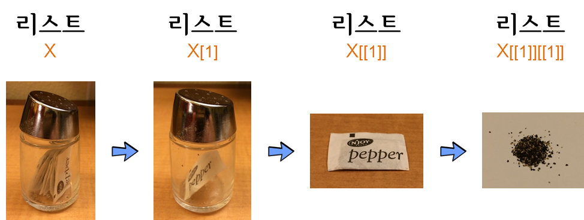

> ## 학습 목표 {.objectives}
>
> * 함수형 프로그래밍을 위한 기본 자료구조를 이해한다.

## 1. 벡터와 리스트 [^jennybc-purrr] [^jennybc-purrr-github]

[^jennybc-purrr]: [`purrr` tutorial: Lessons and Examples](https://jennybc.github.io/purrr-tutorial/index.html)

[^jennybc-purrr-github]: [`purrr` tutorial GitHub Webpage](https://github.com/jennybc/purrr-tutorial/)

### 1.1. 벡터

벡터와 리스트는 R의 기본 자료구조라 데이터 분석에 자주 사용되는 기본 자료구조에 친숙해지면 여러모로 장점이 많다.
가장 많이 사용되는 자료구조는 논리형(logical), 정수형(integer), 부동소수점형(double), 문자형(character)가 있다.
원자벡터는 동일한 자료형을 한곳에 모아 높은 것으로 각 원자는 자료형과 저장모드가 동일하다고 볼 수 있다.
물론 스칼라(scalar)는 길이가 1을 갖는 원자다. 원자벡터를 생성하는 기본 연산자는 `c()`가 되지만,
삶을 편하게 하는 여러가지 축약방법이 존재하는데 `1:4`, `letters`가 여기에 포함된다.

- R에서 흔히 사용되는 자료형
    - 논리형(logical)
    - 정수형(integer)
    - 부동소수점형(double)
    - 문자형(character)

~~~{.r}
(v_log <- c(TRUE, FALSE, FALSE, TRUE))
~~~

~~~{.output}
#> [1]  TRUE FALSE FALSE  TRUE

~~~

~~~{.r}

(v_int <- 1:4)
~~~

~~~{.output}
#> [1] 1 2 3 4

~~~

~~~{.r}

(v_doub <- 1:4 * 1.2)
~~~

~~~{.output}
#> [1] 1.2 2.4 3.6 4.8

~~~

~~~{.r}

(v_char <- letters[1:4])
~~~

~~~{.output}
#> [1] "a" "b" "c" "d"

~~~

### 1.2. 벡터 색인(Indexing, 인텍싱)

벡터에서 특정 원소를 참조하거나 뽑아내는 것을 인덱싱(indexing)이라고 한다.
원소를 참조하거나 뽑아낼 때 사용되는 기본문법은 꺾쇠 괄호(`[`)를 사용하는 것으로,
`벡터명[색인방법]` 형태가 된다. 인덱싱 방법은 다음과 같이 세가지 방법이 있다.

- 논리 벡터 사용: `TRUE`는 뽑아내고, `FALSE`는 색인에서 제거한다.
- 정수 벡터 사용
    - 양수 정수 벡터: 벡터 색인 숫자에 해당되는 벡터만 추출, 벡터 색인은 1부터 시작.
    - 음수 정수 벡터:  벡터 색인 숫자에 해당되는 벡터만 제거.
- 문자벡터 : 문자벡터 명칭에 해당되는 원소만 추출.

~~~{.r}
v_char[c(FALSE, FALSE, TRUE, TRUE)]
~~~

~~~{.output}
#> [1] "c" "d"

~~~

~~~{.r}

v_char[v_log]
~~~

~~~{.output}
#> [1] "a" "d"

~~~

~~~{.r}

v_doub[2:3]
~~~

~~~{.output}
#> [1] 2.4 3.6

~~~

~~~{.r}

v_char[-4]
~~~

~~~{.output}
#> [1] "a" "b" "c"

~~~

### 1.3. 자료형 강제변환(coersion)

자료형 강제변환은 R이 갖는 가장 큰 장점 중의 하나다. 특히, 정수형과 부동소수점형 자료변환에 대해서
큰 스트레스가 없는데 R에서 강제변환기능을 통해 이를 자체적으로 해결해 준다.
또한 비율을 구할 때 논리형 벡터가 자동으로 정수형으로 변환되어 1과 0을 이용하여 쉽게 구할 수 있다.

자료형 강제변환은 벡터 내부에 이질적인 원소들이 갖춰졌을 때 자동으로 동일한 원소들이 되도록 
변환되는 위계가 다음과 같이 존재한다.

- 논리형(logical)
- 정수형(integer)
- 부동소수점형(double)
- 문자형(character)

~~~{.r}
v_log
~~~

~~~{.output}
#> [1]  TRUE FALSE FALSE  TRUE

~~~

~~~{.r}

as.integer(v_log)
~~~

~~~{.output}
#> [1] 1 0 0 1

~~~

~~~{.r}

v_int
~~~

~~~{.output}
#> [1] 1 2 3 4

~~~

~~~{.r}

as.numeric(v_int)
~~~

~~~{.output}
#> [1] 1 2 3 4

~~~

~~~{.r}

v_doub
~~~

~~~{.output}
#> [1] 1.2 2.4 3.6 4.8

~~~

~~~{.r}

as.character(v_doub)
~~~

~~~{.output}
#> [1] "1.2" "2.4" "3.6" "4.8"

~~~

~~~{.r}

as.character(as.numeric(as.integer(v_log)))
~~~

~~~{.output}
#> [1] "1" "0" "0" "1"

~~~

자료형 강제변환 위계에 대한 사례로 부동소수점과 문자형이 동일한 벡터에 입력되면,
동일한 자료형을 갖춰야 되는 벡터 입장에서 자료변환 위계구조에 따라 모두 문자형으로 변환이 된다.

~~~{.r}
v_doub_copy <- v_doub
str(v_doub_copy)
~~~

~~~{.output}
#>  num [1:4] 1.2 2.4 3.6 4.8

~~~

~~~{.r}

v_doub_copy[3] <- "uhoh"
str(v_doub_copy)
~~~

~~~{.output}
#>  chr [1:4] "1.2" "2.4" "uhoh" "4.8"

~~~

### 1.2. 리스트(list) 

 

[R for Data Science: Lists of condiments](http://r4ds.had.co.nz/vectors.html#lists-of-condiments)

