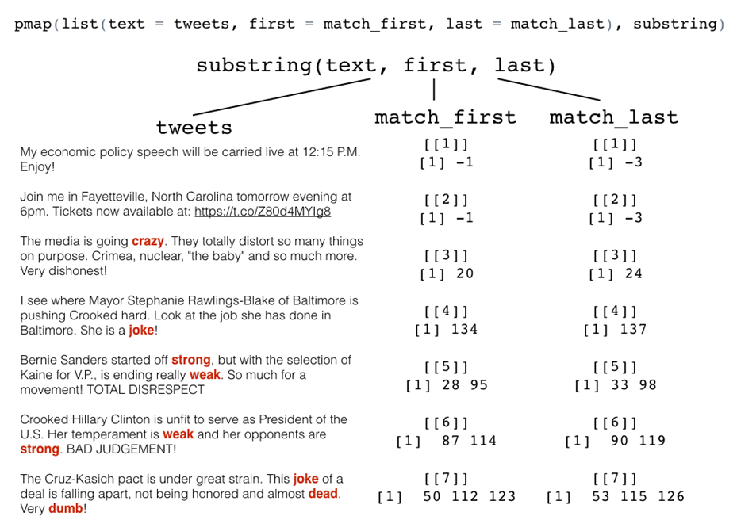

> ## 학습 목표 {.objectives}
>
> * 트럼프 트위터 트윗을 통해 지금까지 학습 내용을 적용한다.

## 1. 트럼프 트위터 트윗 [^jennybc-purrr-trump-tweet]  [^trump-tweets]

[broom](https://cran.r-project.org/web/packages/broom/index.html) 팩키지 저자로 유명한 [David Robinson](http://varianceexplained.org/)의 트럼프 트위터 분석을 통해 
지금까지 학습한 사항을 실무에 적용해 본다. 

[^jennybc-purrr-trump-tweet]: [Trump Android words](https://jennybc.github.io/purrr-tutorial/ls08_trump-tweets.html)
[^trump-tweets]: [Text analysis of Trump tweets confirms he writes only the (angrier) Android half](http://varianceexplained.org/r/trump-tweets/)

트럼프 트윗 중에서 특정 단어가 들어간 트윗에서 단어를 추출하는 것이다. 

즉, `regex <- "badly|crazy|weak|spent|strong|dumb|joke|guns|funny|dead"` 정규표현식에 패턴으로 단어를 등록해 넣고 이를 트윗에서 추출한다.

## 2. 함수형 프로그래밍을 활용하여 트윗 단어 추출

### 2.1. 환경 설정

함수형 프로그래밍 `purrr`, 데이터 조작 `dplyr`, 데이터프레임 `tibble` 팩키지를 불러온다.

~~~{.r}
# 0. 환경설정 ----------------------------------------------------
library(purrr)
library(dplyr)
library(tibble)
~~~

### 2.2. 트럼프 트윗 데이터 가져오기

웹사이트에 공개된 [http://varianceexplained.org/files/trump_tweets_df.rda](http://varianceexplained.org/files/trump_tweets_df.rda)
트럼프 트윗 데이터를 불러와서 일별한다. `strtrim()` 함수는 인자로 넣은 `70` 글자수에 맞춰 트윗을 끊어주는 역할을 한다.

~~~{.r}
# 1. 데이터 가져오기 ----------------------------------------------------

load(url("http://varianceexplained.org/files/trump_tweets_df.rda"))
# load("trump_tweets_df.rda")
glimpse(trump_tweets_df)
~~~

~~~{.output}
#> Observations: 1,512
#> Variables: 16
#> $ text          <chr> "My economic policy speech will be carried live ...
#> $ favorited     <lgl> FALSE, FALSE, FALSE, FALSE, FALSE, FALSE, FALSE,...
#> $ favoriteCount <dbl> 9214, 6981, 15724, 19837, 34051, 29831, 19223, 1...
#> $ replyToSN     <chr> NA, NA, NA, NA, NA, NA, NA, NA, NA, NA, NA, NA, ...
#> $ created       <dttm> 2016-08-08 15:20:44, 2016-08-08 13:28:20, 2016-...
#> $ truncated     <lgl> FALSE, FALSE, FALSE, FALSE, FALSE, FALSE, FALSE,...
#> $ replyToSID    <lgl> NA, NA, NA, NA, NA, NA, NA, NA, NA, NA, NA, NA, ...
#> $ id            <chr> "762669882571980801", "762641595439190016", "762...
#> $ replyToUID    <chr> NA, NA, NA, NA, NA, NA, NA, NA, NA, NA, NA, NA, ...
#> $ statusSource  <chr> "<a href=\"http://twitter.com/download/android\"...
#> $ screenName    <chr> "realDonaldTrump", "realDonaldTrump", "realDonal...
#> $ retweetCount  <dbl> 3107, 2390, 6691, 6402, 11717, 9892, 5784, 7930,...
#> $ isRetweet     <lgl> FALSE, FALSE, FALSE, FALSE, FALSE, FALSE, FALSE,...
#> $ retweeted     <lgl> FALSE, FALSE, FALSE, FALSE, FALSE, FALSE, FALSE,...
#> $ longitude     <chr> NA, NA, NA, NA, NA, NA, NA, NA, NA, NA, NA, NA, ...
#> $ latitude      <chr> NA, NA, NA, NA, NA, NA, NA, NA, NA, NA, NA, NA, ...

~~~

~~~{.r}

tweets <- trump_tweets_df$text
tweets %>% head() %>% strtrim(70)
~~~

~~~{.output}
#> [1] "My economic policy speech will be carried live at 12:15 P.M. Enjoy!"   
#> [2] "Join me in Fayetteville, North Carolina tomorrow evening at 6pm. Ticke"
#> [3] "#ICYMI: \"Will Media Apologize to Trump?\" https://t.co/ia7rKBmioA"    
#> [4] "Michael Morell, the lightweight former Acting Director of C.I.A., and "
#> [5] "The media is going crazy. They totally distort so many things on purpo"
#> [6] "I see where Mayor Stephanie Rawlings-Blake of Baltimore is pushing Cro"

~~~

### 2.3. 트럼프 트윗 데이터 표본 추출 : 트윗 7개만

트럼프 트윗 전체를 분석하기 전에 특정 트윗 일부, 7개만 추출한다.

~~~{.r}
# 2. 트럼프 안드로이드 단어 ----------------------------------------------------
regex <- "badly|crazy|weak|spent|strong|dumb|joke|guns|funny|dead"

tweets <- tweets[c(1, 2, 5, 6, 198, 347, 919)]
tweets %>% strtrim(70)
~~~

~~~{.output}
#> [1] "My economic policy speech will be carried live at 12:15 P.M. Enjoy!"   
#> [2] "Join me in Fayetteville, North Carolina tomorrow evening at 6pm. Ticke"
#> [3] "The media is going crazy. They totally distort so many things on purpo"
#> [4] "I see where Mayor Stephanie Rawlings-Blake of Baltimore is pushing Cro"
#> [5] "Bernie Sanders started off strong, but with the selection of Kaine for"
#> [6] "Crooked Hillary Clinton is unfit to serve as President of the U.S. Her"
#> [7] "The Cruz-Kasich pact is under great strain. This joke of a deal is fal"

~~~

### 2.4. 정규표현식을 활용한 단어 추출

`regmatches` 함수를 사용하면 트럼프 트윗에서 단어를 추출할 수 있다. 

~~~{.r}
# 3. gregexpr() 정규표현식 사용 ----------------------------------------------------
regmatches(tweets, gregexpr(regex, tweets)) 
~~~

~~~{.output}
#> [[1]]
#> character(0)
#> 
#> [[2]]
#> character(0)
#> 
#> [[3]]
#> [1] "crazy"
#> 
#> [[4]]
#> [1] "joke"
#> 
#> [[5]]
#> [1] "strong" "weak"  
#> 
#> [[6]]
#> [1] "weak"   "strong"
#> 
#> [[7]]
#> [1] "joke" "dead" "dumb"

~~~

### 2.5. 함수형 프로그래밍을 활용한 트윗 단어 추출

`pmap` 함수에 인자로 넘기기 위해서 사전에 준비작업을 수행하고 나서, `pmap` 함수에 넣어 트럼프 트윗에서 
매칭되는 단어를 추출한다.

~~~{.r}
# 4. substring() 함수 미리 살펴보기 ------------------------------------------------
matches <- gregexpr(regex, tweets)

(match_first <- map(matches, as.vector))
~~~

~~~{.output}
#> [[1]]
#> [1] -1
#> 
#> [[2]]
#> [1] -1
#> 
#> [[3]]
#> [1] 20
#> 
#> [[4]]
#> [1] 134
#> 
#> [[5]]
#> [1] 28 95
#> 
#> [[6]]
#> [1]  87 114
#> 
#> [[7]]
#> [1]  50 112 123

~~~

~~~{.r}
(match_length <- map(matches, attr, which = "match.length"))
~~~

~~~{.output}
#> [[1]]
#> [1] -1
#> 
#> [[2]]
#> [1] -1
#> 
#> [[3]]
#> [1] 5
#> 
#> [[4]]
#> [1] 4
#> 
#> [[5]]
#> [1] 6 4
#> 
#> [[6]]
#> [1] 4 6
#> 
#> [[7]]
#> [1] 4 4 4

~~~

~~~{.r}
(match_last <- map2(match_first, match_length, ~ .x + .y - 1))
~~~

~~~{.output}
#> [[1]]
#> [1] -3
#> 
#> [[2]]
#> [1] -3
#> 
#> [[3]]
#> [1] 24
#> 
#> [[4]]
#> [1] 137
#> 
#> [[5]]
#> [1] 33 98
#> 
#> [[6]]
#> [1]  90 119
#> 
#> [[7]]
#> [1]  53 115 126

~~~

~~~{.r}

tibble(
    naive_length = lengths(matches),
    n_words = map_int(matches, ~ sum(.x > 0))
)
~~~

~~~{.output}
#> # A tibble: 7 × 2
#>   naive_length n_words
#>          <int>   <int>
#> 1            1       0
#> 2            1       0
#> 3            1       1
#> 4            1       1
#> 5            2       2
#> 6            2       2
#> 7            3       3

~~~

~~~{.r}

pmap(list(text = tweets, first = match_first, last = match_last), substring)
~~~

~~~{.output}
#> [[1]]
#> [1] ""
#> 
#> [[2]]
#> [1] ""
#> 
#> [[3]]
#> [1] "crazy"
#> 
#> [[4]]
#> [1] "joke"
#> 
#> [[5]]
#> [1] "strong" "weak"  
#> 
#> [[6]]
#> [1] "weak"   "strong"
#> 
#> [[7]]
#> [1] "joke" "dead" "dumb"

~~~

~~~{.r}

mdf <- tibble(
    text = tweets,
    first = match_first,
    last = match_last
)
pmap(mdf, substring)
~~~

~~~{.output}
#> [[1]]
#> [1] ""
#> 
#> [[2]]
#> [1] ""
#> 
#> [[3]]
#> [1] "crazy"
#> 
#> [[4]]
#> [1] "joke"
#> 
#> [[5]]
#> [1] "strong" "weak"  
#> 
#> [[6]]
#> [1] "weak"   "strong"
#> 
#> [[7]]
#> [1] "joke" "dead" "dumb"

~~~

## 3. 매칭 리스트를 불러오는 세가지 방법

매칭 리스트를 불러오는 방법은 세가지가 존재한다.

- 사용자 정의 함수를 사전에 정의하고 호출
- 무명함수 사용
- 내장함수를 활용하는데 인자를 넘기는 방법

~~~{.r}
# 5.1. 함수 정의 후 호출
ml <- function(x) attr(x, which = "match.length")
map(matches, ml)
~~~

~~~{.output}
#> [[1]]
#> [1] -1
#> 
#> [[2]]
#> [1] -1
#> 
#> [[3]]
#> [1] 5
#> 
#> [[4]]
#> [1] 4
#> 
#> [[5]]
#> [1] 6 4
#> 
#> [[6]]
#> [1] 4 6
#> 
#> [[7]]
#> [1] 4 4 4

~~~

~~~{.r}
# 5.2. 무명함수 
(map(matches, ~ attr(.x, which = "match.length")))
~~~

~~~{.output}
#> [[1]]
#> [1] -1
#> 
#> [[2]]
#> [1] -1
#> 
#> [[3]]
#> [1] 5
#> 
#> [[4]]
#> [1] 4
#> 
#> [[5]]
#> [1] 6 4
#> 
#> [[6]]
#> [1] 4 6
#> 
#> [[7]]
#> [1] 4 4 4

~~~

~~~{.r}
# 5.3. 내장함수 활용 후 인자 넘기는 방법
(match_length <- map(matches, attr, which = "match.length"))
~~~

~~~{.output}
#> [[1]]
#> [1] -1
#> 
#> [[2]]
#> [1] -1
#> 
#> [[3]]
#> [1] 5
#> 
#> [[4]]
#> [1] 4
#> 
#> [[5]]
#> [1] 6 4
#> 
#> [[6]]
#> [1] 4 6
#> 
#> [[7]]
#> [1] 4 4 4

~~~
