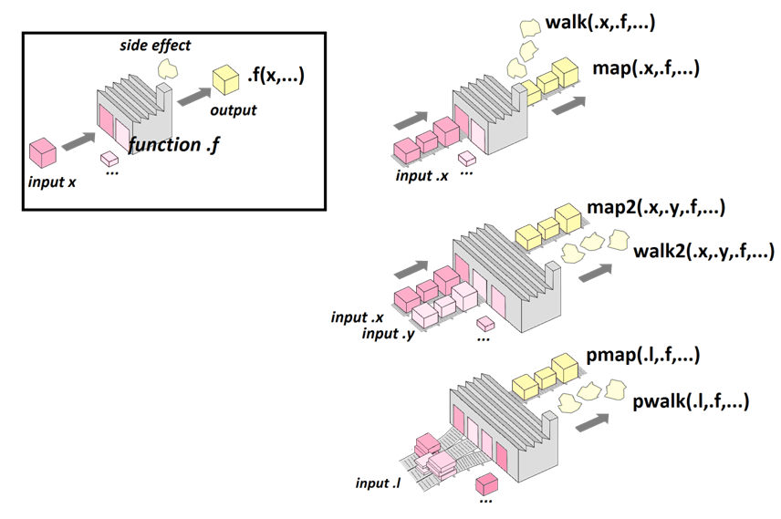

``` {r, include=FALSE}
source("tools/chunk-options.R")
knitr::opts_chunk$set(echo=TRUE, message=FALSE, warning=FALSE, fig.width = 12)
```


# 1. 데이터 정제를 위한 핵심 개념 [^fr-purr] [^github-learn-purrr] {#got-basic-concept}

[^fr-purr]: [R-atic: Iteration of functions with purrr](http://perso.ens-lyon.fr/lise.vaudor/iterer-des-fonctions-avec-purrr/)

[^github-learn-purrr]: [DanOvando/learn-purrr - Some tools for learning purrr](https://github.com/DanOvando/learn-purrr)

## 1.1. `purrr` 팩키지는 함수 반복용 {#purrr-iter-func}

> John Chambers: "To understand computations in R, two slogans are helpful: Everything that exists is an object. Everything that happens is a function call."

`purrr` 팩키지는 함수(funciton)를 데이터 객체에 반복하기 위해서 다시 만들어진 것으로 데이터 분석하는 분석가의 삶의 질을 획기적으로 높여줄 것이다.
먼저, 함수를 데이터 `input x`와 인자(`...`)를 넣으면 이를 변환시키는 자그마한 공장(small factory)으로 최종 완성품(finished goods)을 만들어 내는 과정이다.
경우에 따라서 최종 제품 대신에 다음 그림에서 연기로 표현되어 있듯이 재사용이 불가능한 형태로 나타내는 것도 필요한데 이와 같이 공정을 바꿔 연기로 빼내는 것과 
유사한 과정이 부작용(`side-effect`)이라고 정의한다.

공장에 입력 데이터로 하나만 집어 넣었는데 회귀식을 고려하면 $x$, $y$ 두가지가 필요한데 이렇게 두가지 입력을 넣게 되면 `map2()` 함수를 사용하고,
`p`개 입력을 넣게 되면 `pmap()` 함수를 사용해서 최종 완성품을 만들어 낸다.
공장에서 정상적인 과정은 항상 이상적인 상황이고 언제나 고장이 날 수 있는데 이와 같이 불량품을 알고도 만들어내는 과정에 `safely()` 함수를 사용한다.



### 1.1.1. `purrr` 팩키지는 함수 반복용 - for {#purrr-iter-func-for}

앞서 `mean_lst`를 정의하고 나서 `for` 반복루프를 돌려 5개 길이가 다르고, `NA` 결측값이 들어있는 벡터의 평균을 산출한다.

``` {r basic-concept-fr-for} 
# 0. 환경설정 -----
library(tidyverse)
library(purrr)
library(repurrrsive)

# 1. 함수를 반복 - `for` -----
dat_lst <- list(c(33,NA,2,15,7,4,5),
                c(22,1,3,NA,11,2),
                c(1,5),
                c(3),
                c(12,5,9))

mean_lst <- vector("list", length=length(dat_lst))

for (i in seq_along(dat_lst)){
    mean_lst[[i]] = mean(dat_lst[[i]], na.rm=TRUE)
}

mean_lst %>% unlist
```

### 1.1.2. `purrr` 팩키지는 함수 반복용 - map {#purrr-iter-func-map}

`map()` 함수 내부에 `mean` 함수를 인자(`na.rm = TRUE`)와 함께 넣어 `dat_lst` 데이터 5개 벡터에 대한 평균을 산출한다.

``` {r basic-concept-fr-map} 
# 2. 함수를 반복 - `purrr`:map -----

map(dat_lst, mean, na.rm=TRUE) %>% unlist
```

### 1.1.3. `purrr` 팩키지는 함수 반복용 - 부작용 {#purrr-iter-func-map}

`map()` 계열 함수를 통해 나온 출력물은 다시 활용할 수 있도록 특수 제작된 최종제품인데, 경우에 따라서는 
화면에 한번 출력하고 공장연기처럼 버려버리는 경우도 있는데 이런 경우 `print_mean()` 함수와 같이 
함수로 제작하고 나서 `walk()` 함수로 처리하면 된다.


``` {r basic-concept-fr-walk} 
# 3. 함수를 반복 - `purrr`: side-effect -----

print_mean <- function(x){
    print(paste("평균값은 ... : ",
                mean(x, na.rm=TRUE)))
    return(NULL)
}

walk(dat_lst, print_mean)
```

### 1.1.4. `purrr` 팩키지는 함수 반복용 - 입력값 2개  {#purrr-iter-func-map2}

``` {r basic-concept-fr-map2}
map2_chr(c('축구','야구','배구','수영', '컬링'), c('국대팀'), paste)
```

## 1.2. 무명함수 {#purrr-iter-func-anonymous}

변동 계수(coefficient of variation, C.V.)는 표준 편차를 산술 평균으로 나눈 것으로 상대표준편차(relative standard deviation, RSD)라고도 하는데,
측정단위가 서로 다른 자료를 비교하고자 할 때 쓰인다. 

$$CV=\frac{\sigma}{\overline x}$$

데이터분석을 할 때 데이터프레임, 변수를 많이 만들게 되면 나중에 관리하기도 번잡하고 
디버깅하기도 쉽지 않는 경우가 많다. 함수명도 마찬가지로 가능하면 함수명을 만들지 않고 필요한 경우 즉석해서 처리하는 것이 권장된다.
일반적인 함수로 작성해서 코드를 작성하는 경우와 **무명함수(anonymous function)**를 적극 활용한다.

두가지 기호 `~`, `.` 이 도입되는데 수행하는 역할은 다음과 같다. 

- `~` : 함수 사용을 표기
- `.` : 데이터프레임을 표기

``` {r got-anonymous-func}
## 2.3. 함수: 변동계수 -----
### 일반함수
coef_variation <- function(x){
    sd(x) / mean(x)
}

map(mtcars, coef_variation)

### 무명함수
map(mtcars, ~ sd(.) / mean(.))
```

# 2. 데이터 사각형화 {#got-rectangling}

## 2.1. 리스트 데이터 자체 다루기  {#got-rectangling-list}

`repurrrsive` 팩키지에 포함되어 있는 왕좌의 게임 `got_chars` 리스트 데이터를 가지고 필요한 데이터 분석과정을 진행해 보자.
가장 먼저, `listviewer::jsonedit()` 함수를 통해 데이터 구조에 친숙해 진다.

``` {r got-rectangling-list}
# 2. 데이터 가져오기 -----

## 2.1. repurrrsive 팩키지 내부 데이터
listviewer::jsonedit(got_chars)
```

`got_chars` 리스트 데이터에 `set_names()` 함수를 통해 이름을 붙이는 것부터 시작한다.

``` {r got-rectangling-list-name}
# 3. list 데이터 다루기 -----
## 3.1. 이름붙이기
got_chars %>% 
    set_names(map_chr(., 'name')) %>% 
    listviewer::jsonedit()
```

동맹을 가문 3곳 이상 맺은 등장인물을 추출하는 것은 전형적인 필터링(filtering) 문제로...
`keep()` 함수를 사용한다. `~ length(.$allegiances) >= 3` 무명함수를 만들어서 조건을 만족시키는 것만 추출시킨다.

``` {r got-rectangling-list-filter}
## 3.2. 동맹을 가문 3곳 이상 맺은 등장인물
got_chars %>%
    set_names(map_chr(.,'name')) %>%
    map(`[`,c('name','allegiances')) %>%
    keep(~ length(.$allegiances) >= 3) %>% 
    listviewer::jsonedit()
```

동맹을 맺은 가문중에서 `Stark` 가문과 동맹이 되어 있는 등장인물을 추출한다.

``` {r got-rectangling-list-filter-stark}
## 3.3. 스타크(Stark) 가문과 동맹을 맺은 등장인물
got_chars %>%
    set_names(map_chr(.,'name')) %>%
    map(`[`,c('name','allegiances')) %>%
    keep(~ifelse(length(.$allegiances) > 0, str_detect(.$allegiances, 'Stark'),FALSE)) %>% 
    listviewer::jsonedit()
```

## 2.2. 리스트 데이터를 사각형화  {#got-rectangling-list-rectangling}

### 2.2.1. 단순 리스트 {#got-rectangling-list-rectangling-simple}

중첩리스트를 갖지 않는 단순 리스트의 경우 `[`을 통해 리스트를 바로 `map_df()` 함수를 통해 데이터프레임으로 만들어 낼 수 있다.

``` {r got-rectangling-list-rectangling}
# 4. 리스트 --> 데이터 프레임
## 4.1. 단순 리스트 --> 데이터프레임
got_char_df <- map_df(got_chars, `[`, c("id", "name", "culture", "gender", "born", "alive"))
```

### 2.2.2. 리스트 칼럼(list column) {#got-rectangling-list-rectangling-list-column}

`enframe()` 함수를 통해 리스트를 리스트 칼럼 데이터프레임으로 바로 만들어 낼 수 있다.
이 경우, `name`과 달리 `allegiances`는 자체로 리스트로 일반적인 데이터프레임에는 담을 수 없는 자료구조다.

``` {r got-rectangling-list-rectangling-list-column}
## 4.2. 중첩 리스트 --> 리스트 칼럼 데이터프레임
got_chars %>%
    set_names(map_chr(.,'name'))  %>%
    map(`[`,c('name','allegiances')) %>% 
    enframe()
```

### 2.2.3. 일반적인 리스트 칼럼(list column) {#got-rectangling-list-rectangling-general}

일반적인 패턴은 리스트 데이터를 바탕으로 해당 변수를 다양한 변수 자료형에 맞춰 추출한 후에 `tibble` 자료구조로 데이터를 뽑아내는 것이 
흔한 작업패턴이다.

``` {r got-rectangling-list-rectangling-general}
## 4.3. 리스트를 데이터프레임 변수로 추출
got_df <- tibble(
    id = got_chars %>% map_int("id"),
    name = got_chars %>% map_chr("name"),
    aliases = got_chars %>% map("aliases"),
    allegiances = got_chars %>% map("allegiances"),
    alive = got_chars %>% map_lgl("alive")
)
```

### 2.2.4. 활용사례 - 라니스터 vs 스타크 {#got-rectangling-list-rectangling-ex}

라니스터 가문과 스타크 가문으로 시즌 6, 7로 넘어가면서 명확해지고 있다. 과연 라니스터 가문과 스타크 가문에 속한 
등장인물을 뽑아내어 왕좌의 게임의 등장인물 구도로 두 가문의 8번째 시즌의 결과를 유추해보자.

``` {r got-rectangling-list-rectangling-ex}
## 4.4. 라니스터 vs. 스타크

got_df %>% 
    filter(str_detect(allegiances, "Lannister|Stark")) %>% 
    select(-allegiances, -alive) %>% 
    filter(lengths(aliases) > 0) %>% 
    unnest() %>% 
    print(n=Inf)
```    
