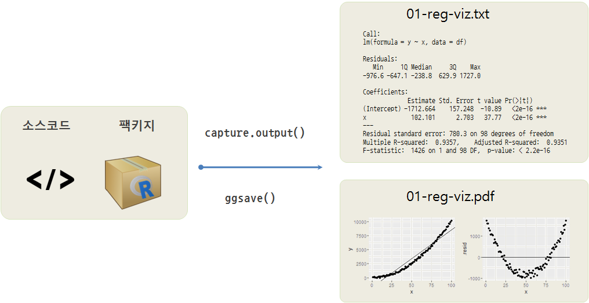
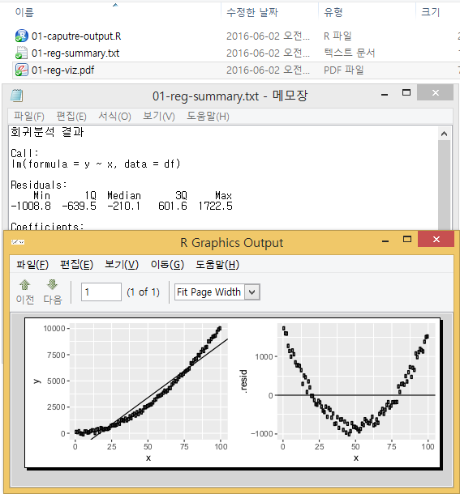

> ## 학습 목표 {.objectives}
>
> * RStudio 혹은 R 콘솔에서 작업한 결과를 내보낸다.
> * 텍스트와 시각화 산출물을 내보낸다.
> * `capture.output`, `ggsave` 함수를 이해한다.

### 1. 분석산출물 내보내기

R콘솔 혹은 RStudio에서 데이터 분석, 모형개발, 시각화, 기계학습을 마치게 되면 산출물이 생성되게 된다.
다양한 산출물이 생성되지만, 크게 텍스트와 그래프로 나누어서 로컬 컴퓨터에 저장하는 경우를 생각해 본다.

### 2. 작업 흐름도

$y=x^2$ 수식에 따라 생성되는 데이터프레임을 생성한다.
데이터를 모의시험으로 생성된 것으로 전처리 과정은 생략한다.
`lm()` 함수를 통해 선형모형을 적합시킨다. 선형회귀모형 산출결과물을 모형요약결과를 텍스트로, 
회귀분석 시각화 산출물을 `.pdf` 파일로 저장하여 다음 작업단계에서 재사용한다.

### 3. 출력산출물 생성 핵심함수

기본 `util` 팩키지에 포함된 `capture.output` 함수를 통해 선형회귀모형 산출결과를 텍스토 파일로 저장한다.
`ggplot2` 팩키지에 포함된 `ggsave` 함수를 통해 회귀분석 모형을 시각화해서 내보낸다.

### 4. 출력산출물 생성 R코드

~~~ {r}
##========================================================
## 01. 데이터 생성
##========================================================

x <- seq(1, 100,1)
y <- x**2 + jitter(x, 1000)

df <- data.frame(x,y)

##========================================================
## 02. 데이터 정제
##========================================================
## 전처리 작업 생략

##========================================================
## 03. 모형 적합
##========================================================
## 

#---------------------------------------------------------
# 3.1. 선형회귀 모형화
lm.m <- lm(y ~ x, data=df)
lm.m.summary <- summary(lm.m)
lm.m.f <- fortify(lm.m)

#---------------------------------------------------------
# 3.2. 선형회귀 시각화
library(ggplot2)
library(grid)
library(gridExtra)

# 적합모형 시각화
lm.mod.p <- ggplot(df, aes(x, y)) + geom_point() + geom_abline(intercept=-1700, slope=102)

# 잔차 시각화
res.mod.p <- ggplot(lm.m.f, aes(x, .resid)) + geom_point() + geom_abline(intercept=0, slope=0)

##========================================================
## 04. 분석결과 저장
##========================================================
## 4.1. 텍스트 저장
result <- capture.output(lm.m.summary)
cat("회귀분석 결과", result, file="./01-reg-summary.txt", sep="\n", append=TRUE, encoding="UTF-8")

## 4.2. 회귀분석 시각화 저장
lm.viz <- grid.arrange(lm.mod.p, res.mod.p, ncol = 2)
ggsave(lm.viz, file="01-reg-viz.pdf")
~~~

### 5. 출력산출물 생성결과

R콘솔 혹은 RStudio에서 `01-capture-output.R` 스크립트를 실행하면 다음과 같이 선형회귀 분석결과가 텍스트 파일과 pdf 파일로 깔끔하게 떨어져서 저장된다.

