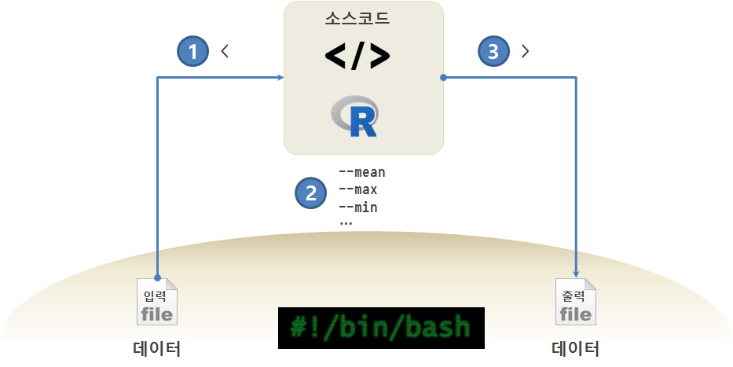

> ## 학습 목표 {.objectives}
>
> * `.R` 스크립트를 유닉스/리눅스상에서 유연하게 동작시킨다.
> * R 스크립트를 수정하지 않고, 인자를 바꿔 작업을 수행시킨다.

### 1. 인자를 갖는 R 스크립트

유닉스/GNU리눅스 환경에서 통계모형, 기계학습, 딥러닝 작업을 하게 되면 텍스트 형태 데이터, R스크립트, 출력 산출물을 갖게 되고, 입력 데이터를 출력산출물로 변환시키는데 R이 역할을 하게 된다.

R 스크립트를 유연하게 만들게 되면 데이터만 바꿔도 산출물을 생성해 내고, 경우에 따라 인자값을 달리하면 원하는 다른 결과를 얻게 된다.

> ### R 스크립트에 인자를 넘기는 방법 {.callout}
> 
> * [commandArgs](https://stat.ethz.ch/R-manual/R-devel/library/base/html/commandArgs.html)
> * [optparse - Command Line Option Parser](https://cran.r-project.org/web/packages/optparse/index.html)
> * [argparse - Command line optional and positional argument parser](https://cran.r-project.org/web/packages/argparse/index.html)
> * [getopt - C-like getopt behavior](https://cran.r-project.org/web/packages/getopt/)

### 2. 데이터를 달리하는 R 스크립트

[SOME TIME SERIES DATA SETS](http://www2.stat.duke.edu/~mw/ts_data_sets.html)에서 [Per capita annual GDP for several countries during 1950-1983 (first row is 1950, last is 1983) ](http://www2.stat.duke.edu/~mw/data-sets/ts_data/gdp) 데이터를 사용한다. 데이터를 `austria.csv`, `canada.csv`, `france.csv`와 같이 구분하여 저장한다.

#### 2.1. R 스크립트 시제품 제작

먼저 `austria.csv` 파일을 불러와서 평균을 계산하는 R스크립트를 작성한다. 

~~~ {.r}
# 데이터 불러오기
gdp.df <- read.csv("austria.csv", sep=",", head=FALSE)
# 평균계산
gdp.mean <- mean(gdp.df$V1)
# 계산결과 화면출력
cat("평균: ", gdp.mean, "\n", encoding="utf-8")
~~~

`Rscript r-args-ex01.R` 실행결과 예상대로 평균 GDP가 계산되었다.

~~~ {.output}
$ Rscript r-args-ex01.R
평균:  0.06553276
~~~

#### 2.2. 입력파일을 달리한 R스크립트 실행

국가가 더 많을 수도 있지만, `austria.csv`, `france.csv`, `canada.csv` 3개 국가가 csv 파일로 데이터가 저장되어 있으니, 입력파일을 달리하여 평균을 계산하도록 R스크립트를 작성한다.

`commandArgs` 명령어를 통해 명령라인에서 인자를 받아 온다. 인자가 순서대로 들어오기 때문에 첫번째 인자로 들어오는 국가에 대한 GDP 평균을 구하고, 이를 화면에 출력하는 R스크립트다. `strsplit` 함수를 사용해서 파일명 앞쪽 -- `.csv` 확장자 제거 -- 만을 뽑아내어 국가명을 명기했다.

~~~ {.r}
#!/usr/bin/env Rscript

args = commandArgs(trailingOnly=TRUE)
country <- args[1]

# 데이터 불러오기
gdp.df <- read.csv(country, sep=",", head=FALSE)
# 평균계산
gdp.mean <- mean(gdp.df$V1)
# 계산결과 화면출력
cat(strsplit(country, '\\.')[[1]][1], "평균: ", gdp.mean, "\n", encoding="utf-8")
~~~

~~~ {.output}
$ Rscript r-args-ex02.R  austria.csv
austria 평균:  0.06553276
$ Rscript r-args-ex02.R france.csv
france 평균:  20.95751
$ Rscript r-args-ex02.R canada.csv
canada 평균:  5.817088
~~~

#### 2.3. 국가별 다양한 기본통계를 계산

국가 데이터를 바꾸는 것에 더해서 최소, 평균, 최대 GDP를 계산하는 로직을 추가한다.
`commandArgs` 함수로 인자를 받는데, 최종 인자는 `-1`로 지정되기 때문에 그런 특성을 이용하여 R스크립트를 작성한다.
따라서, 첫번째 인자에 최소, 평균, 최소를 구할 것인지 정보를 받고, 마지막 인자로 파일명을 받는다. 

~~~ {.r}
#!/usr/bin/env Rscript

args = commandArgs(trailingOnly=TRUE)
action = args[1]
country <- args[-1]

# 데이터 불러오기
gdp.df <- read.csv(country, sep=",", head=FALSE)
# 기초 통계량 계산

if(action == "--min") {
    gdp.min <- min(gdp.df$V1)
    cat(strsplit(country, '\\.')[[1]][1], "최소: ", gdp.min, "\n", encoding="utf-8")
}else if(action == "--mean") {
    gdp.mean <- mean(gdp.df$V1)
    cat(strsplit(country, '\\.')[[1]][1], "평균: ", gdp.mean, "\n", encoding="utf-8")
}else if (action=="--max"){
    gdp.max <- max(gdp.df$V1)
    cat(strsplit(country, '\\.')[[1]][1], "최대: ", gdp.max, "\n", encoding="utf-8")
}
~~~

`Rscript r-args-ex03.R --min canada.csv` 명령라인을 살펴보면, `r-args-ex03.R` R 스크립트를 실행하고, `--min` 인자로 최소값을 계산하는데, `canada.csv` 데이터 파일을 이용한다. 

~~~ {.output}
$ Rscript r-args-ex03.R --min canada.csv
canada 최소:  3.651109
$ Rscript r-args-ex03.R --max canada.csv
canada 최대:  8.382785
$ Rscript r-args-ex03.R --mean canada.csv
canada 평균:  5.817088
~~~
