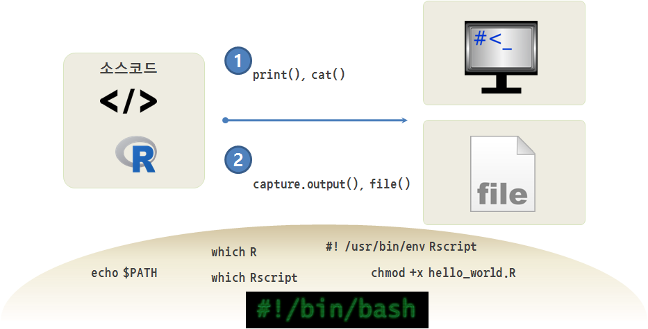

> ## 학습 목표 {.objectives}
>
> * 명령라인 인터페이스에서 R 스크립트를 실행한다.
> * 다양한 R 스크립트 실행방법을 실습한다.

### 1. R 스크립트 실행환경 [^R-scripts]

[^R-scripts]: [R scripts](http://www.r-bloggers.com/r-scripts/)

유닉스/리눅스 운영체제가 준비되었다면 R스크립트 실행환경을 준비한다.

#### 1.1. R설치

R을 스크립트 형태(`.R`) 파일로 실행할 경우 가장 먼저 `r-base-core`를 설치한다. 그래픽 사용자 인터페이스가 없는 형태의 R이 설치되며 R 스크립트 실행에 필요한 연관된 프로그램도 더불어 설치한다.

~~~ {.shell}
$ sudo apt-get install -y r-base-core
~~~

#### 1.2. R 스크립트 실행환경 

R과 스크립트를 실행할 `Rscript` 실행프로그램이 위치한 디렉토리를 확인한다. 여기에 사용되는 명령어는 `which`다.
`which R` 명령어를 통해 R 실행파일이 `/usr/bin/` 디렉토리에 위치한 것을 확인할 수 있다.

~~~ {.shell}
$ which R
~~~

~~~ {.output}
/usr/bin/R
~~~

`which Rscript` 명령어를 통해 Rcript 실행파일도 `/usr/bin/` 디렉토리에 위치한 것을 확인할 수 있다.

~~~ {.shell}
$ which Rscript
~~~

~~~ {.output}
/usr/bin/Rscript
~~~

`echo $PATH` 명령어를 통해 `/usr/bin`, 경우에 따라서는 `/usr/local/bin` 디렉토리에 R과 Rscript 실행파일이 존재하는 것을 확인한다.

~~~ {.shell}
$ echo $PATH
~~~

~~~ {.output}
/usr/local/sbin:/usr/local/bin:/usr/sbin:/usr/bin:/sbin:/bin:/usr/games:/usr/local/games
~~~

#### 1.3. R 스크립트파일 실행 

`.R` 스크립트 파일을 명령라인 인터페이스로 실행하는 방법은 다양한다. 먼저 `hello_world.R` 스크립트 파일을 생성한다.

~~~ {.r}
#! /usr/bin/env Rscript

print("Hello World!!!")
~~~

쉬뱅(shebang, #!) 다음에 스크립트를 실행할 프로그램을 지정한다. `Rscript`로 지정하여 R스크립트를 실행하는데 사용한다.

`#! /usr/bin/env Rscript`

~~~ {.shell}
$ chmod +x hello_world.R
$ ./hello_world.R
~~~

`chmod +x` 명령어를 통해서 일반 텍스트 파일을 실행가능한 파일 형식으로 지정한다.
`hello_world.R` 파일이 실행가능한 형태가 되었기 때문에 `./hello_world.R` 명령어로 R스크립트를 실행시킨다.

~~~ {.output}
Hello World!!!
~~~

#### 1.4. 기타 R 스크립트파일 실행 방법

R스크립트를 실행하는 방법은 다양하다.

~~~ {.shell}
$ R --slave -f hello_world.R
~~~ 

~~~ {.shell}
$ Rscript hello_world.R
~~~

`Rscript` 명령어로 실행을 시켜도 동일한 산출 결과가 출력된다.

~~~ {.shell}
$ R CMD BATCH hello_world.R hello_world_output.txt
~~~

`R CMD BATCH` 명령어로 실행시키면 실행결과가 `hello_world_output.txt` 파일에 저장된다. `hello_world_output.txt` 파일명을 지정하지 않으면 `hello_world.Rout` 파일에 저장된다.

~~~ {.shell}
$ R --no-save << RSCRIPT
     print("Hello World")
  RSCRIPT
~~~

`R --no-save <<` 사용법도 가능하다.

### 2. 실습 예제 [^swcarpentry-r-cmd]

[^swcarpentry-r-cmd]: [R프로그래밍 - 명령-라인 프로그램](http://statkclee.github.io/r-novice-inflammation/05-cmdline-kr.html)

#### 2.1. R스크립트 작성

`Rscript r_session_info.R` 명령어를 실행해서 실제로 RStudio나 R 콘솔을 열지 않고도 R 세션정보를 명령라인 인터페이스에서 처리하는 R 스크립트를 작성한다.

텍스트 편집기를 열고, `sessionInfo()`를 적고 파일명을 `r_session_info.R`로 저장한다.

~~~ {.r}
sessionInfo()
~~~

배쉬쉘에서 R스크립트를 실행해서 R 세션정보를 받아확인한다.

~~~ {.shell}
$ Rscript r_session_info.R
~~~

~~~ {.output}
R version 3.0.2 (2013-09-25)
Platform: x86_64-pc-linux-gnu (64-bit)

locale:
 [1] LC_CTYPE=en_US.UTF-8       LC_NUMERIC=C
 [3] LC_TIME=en_US.UTF-8        LC_COLLATE=en_US.UTF-8
 [5] LC_MONETARY=en_US.UTF-8    LC_MESSAGES=en_US.UTF-8
 [7] LC_PAPER=en_US.UTF-8       LC_NAME=C
 [9] LC_ADDRESS=C               LC_TELEPHONE=C
[11] LC_MEASUREMENT=en_US.UTF-8 LC_IDENTIFICATION=C

attached base packages:
[1] stats     graphics  grDevices utils     datasets  base
~~~

#### 2.2. R스크립트 출력결과 파일로 저장

`>` 파이프 연산자를 사용해서 R 스크립트 출력결과를 텍스트 파일로 저장한다.

~~~ {.shell}
$ Rscript r_session_info.R > r_session_info_pipe_output.txt
~~~

또다른 방법은 R 스크립트 내부에서 출력결과를 파일에 저장하고 프로그램을 종료하는 방법도 있다.

`caputre.output` 함수를 `cat`과 함께 사용하는데, 한글도 적용이 가능하도록, `encoding="UTF-8"`도 추가한다.

~~~ {.r}
output <- capture.output(sessionInfo())
cat("R 세션정보", output, file="./r_session_info_rscript.txt", sep="\n", encoding="UTF-8")
~~~

`Rscript r_session_info.R` 명령어를 실행시키면 다음과 같이 실행결과가 텍스트 파일 `r_session_info_rscript.txt`로 떨어진다.

~~~ {.output}
R 세션정보
R version 3.0.2 (2013-09-25)
Platform: x86_64-pc-linux-gnu (64-bit)

locale:
 [1] LC_CTYPE=en_US.UTF-8       LC_NUMERIC=C
 [3] LC_TIME=en_US.UTF-8        LC_COLLATE=en_US.UTF-8
 [5] LC_MONETARY=en_US.UTF-8    LC_MESSAGES=en_US.UTF-8
 [7] LC_PAPER=en_US.UTF-8       LC_NAME=C
 [9] LC_ADDRESS=C               LC_TELEPHONE=C
[11] LC_MEASUREMENT=en_US.UTF-8 LC_IDENTIFICATION=C

attached base packages:
[1] stats     graphics  grDevices utils     datasets  base
UTF-8
~~~

* [optparse - Command Line Option Parser](https://cran.r-project.org/web/packages/optparse/index.html)
* [argparse - Command line optional and positional argument parser](https://cran.r-project.org/web/packages/argparse/index.html)
* [getopt - C-like getopt behavior](https://cran.r-project.org/web/packages/getopt/)
