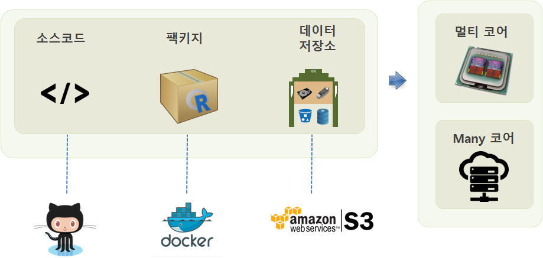

> ## 학습 목표 {.objectives}
>
> * R 병렬처리

* **multicore**: 로컬 컴퓨터에 장착된 모든 코어를 `fork()`를 사용해서 다수 코어를 활용하는데 윈도우는 지원이 되지 않는다.
* **snow**: Lisp-Stat의 아버지 루크 티어니가 개발한 것으로 로컬 컴퓨터 뿐만 아니라 다수 컴퓨터에도 동작된다.
* **parallel**: `multicore`와 `snow`를 추상화한 것으로 현재 R 기본 팩키지의 일부로 사용된다.
* **foreach**: `for` 루프를 병렬로 돌릴 수 있는 팩키지

그외 `Rmpi`, `Rdsn`, `pbdR` 등의 팩키지가 있다.

