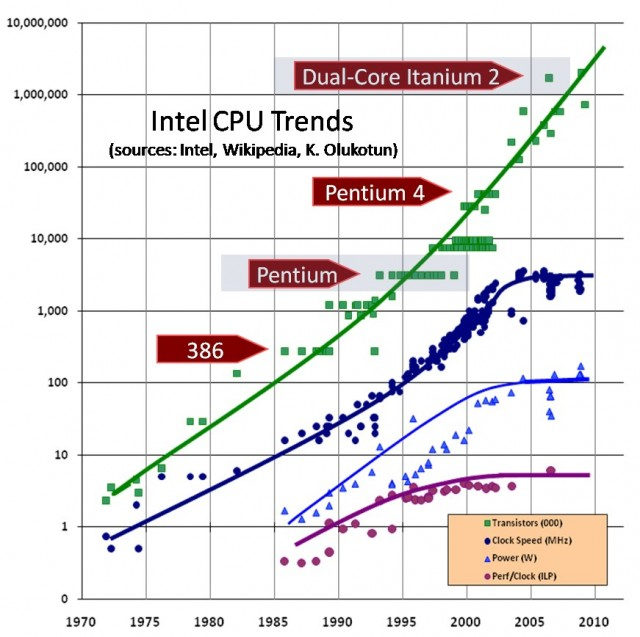

> ## 학습 목표 {.objectives}
>
> * R 성능을 높이는 방법을 이해한다.
> * R 스케일업, R 스케일아웃 전략을 이해한다.
> * R성능향상을 위해 R코드, 컴파일러, 라이브러리, 하드웨어 자원을 최대한 활용한다.

### 고성능 R 추진 전략

무어의 법칙에 따라 R 코드를 그대로 두어도 성능이 자동으로 향상되는 세상이 수십년동안 지배해왔다.
R 스케일업(Scale-up) 전략은 이와 같이 무어의 법칙에 따라 자동으로 성능을 향상시키는 것에 더해서 
추가적으로 고성능 하드웨어를 갖추고, 최대한 컴퓨팅 자원을 활용하는 전략으로 최고 성능을 갖는 R기반 제품을 생산해 내는 것이다.

R 스케일아웃(Scale-out) 전략은 더이상 무어의 법칙에 따라 하드웨어 성능이 좋아지는 것이 아니고 코어가 더 많아지고, 더 많은 컴퓨터 자원이 병렬로 이용가능하게 되어 이를 최대한 활용하여 R기반 제품 및 서비스를 개발해 나가는 것이다. [^moore-law]

[^moore-law]: [The Future of Moore’s Law and Explicit Processors](http://parallelcomputingsolutions.com/the-future-of-moores-law-and-explicit-processors/)

### R 스케일업(Scale-up) 전략

R 스케일업(Scale-up) 전략은 범용 컴파일러 대신에 인텔 CPU에서 돌아가는 ICC 컴파일러를 사용한다던가, BLAS 라이브러리를 선택한다던가 R코드를 벡터화를 활용하여 작성한다던가, Rcpp를 활용하여 C/C++ 성능을 달성한다던가 하는 방법이 포함된다.

R 스케일아웃(Scale-out) 전략은 공유메모리를 촬용한 멀티코어 중앙처리장치를 최대한 활용하여 병렬로 R코드를 실행시켜 성능향상을 도모한다던가, 다수 컴퓨터를 클러스터로 묶어 메시지 전달 방식을 활용한 병렬컴퓨팅으로 R 성능을 향상시키는 방법이 포함된다. 

|  구분   | 병렬처리 R 패키지 |
|-------------|--------------------------|
|  공유 메모리   | `foreach`, `parallel`, `snow`, `multicore` |
|  메시지 전달   | `Rmpi`, `RHIPE`, `RHadoop`, `pbdR`  |

* **공유 메모리**
    * **multicore**: 로컬 컴퓨터에 장착된 모든 코어를 `fork()`를 사용해서 다수 코어를 활용하는데 윈도우는 지원이 되지 않는다.
    * **snow**: Lisp-Stat의 아버지 티어니(Luke Tierney) 교수가 개발한 것으로 로컬 컴퓨터 뿐만 아니라 다수 컴퓨터에도 동작된다.
    * **parallel**: `multicore`와 `snow`를 추상화한 것으로 현재 R 기본 팩키지의 일부로 사용된다.
    * **foreach**: `for` 루프를 병렬로 돌릴 수 있는 팩키지, 병렬로 처리하는 작업을 통합하는 목표를 갖고 추진.
* **메시지 전달**
    * **Rmpi**:
    * **RHIPE, RHadoop** 
    * **pbdR**

### 자동화

R코드를 작성하고 모형을 개발할 환경이 갖추어졌다면, 소스코드 관리, R 팩키지 운영환경, 데이터 저장소도 체계적인 관리가 필요하다. R코드 뿐만아니라 데이터, 툴체인을 갖추고 이를 병렬컴퓨팅 환경에 맞도록 최적의 R 환경을 구축한다.

