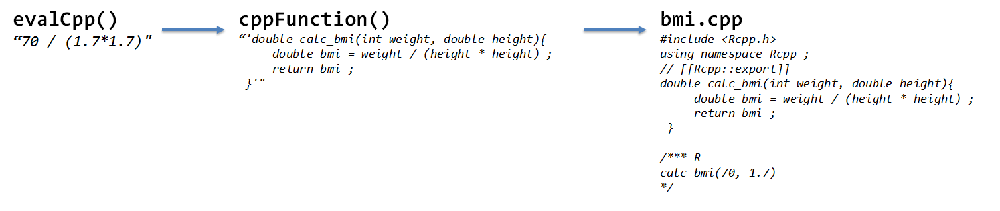

 
``` {r, include=FALSE}
# source("tools/chunk-options.R")

knitr::opts_chunk$set(echo = TRUE, warning=FALSE, message=FALSE,
                    comment="", digits = 3, tidy = FALSE, prompt = FALSE, fig.align = 'center')

```


# Rcpp 헬로월드 [^three-ways-c] {#rcpp}

[^three-ways-c]: [R과 C 연동(Rcpp 사용)](https://lareale.tistory.com/303)

[Rcpp](https://github.com/RcppCore/Rcpp)는 R과 C++를 무리없이 깔끔하게 통합시키기 위해서 개발된 팩키지다. R과 C를 연동하는 방식은 다음과 같이 세가지 유형으로 나눠볼 수 있다.

1. `.C` 함수: 간단하지만 제한적 사용이 가능하고 R 메모리 위에서 연산작업을 수행하기 때문에 객체는 포인터 연산자로 다뤄야함.
1. `.Call` 함수: 헤더파일이 필요하고 모든 객체를 `SEXP`라는 자료구조로 다뤄야함.
1. `Rcpp` 팩키지: 포인터나 `SEXP`를 사용하지 않고 데이터 연산작업 수행 가능


`Rcpp`를 사용하게 되면 코드를 더 빠르게 실행시킬 수 있지만, `C++`에 대한 모든 것을 알 필요는 없어서 간단한 `C++` 함수 작성에 집중할 수 있게 되는 장점이 크다. R과 `C++`를 다음 비교표를 통해 확인할 수 있다.

|       R     |        |        C++       |
|:-----------:|:------:|:----------------:|
| 인터프리팅  |        |     컴파일       |
| 느림        |        | 더 난이도가 있음 |
| 유연함      |        | 빠름             |

## 속도 측정 {#rcpp-performance}

[`microbenchmark`](https://github.com/joshuaulrich/microbenchmark) 팩키지는 측정하고자 하는 함수를 넣어 함수 실행시간을 비교할 수 있다.

`find_min()` 함수는 R 내부에 자체 `min()` 함수가 있지만 속도 비교를 위해서 직관적인 알고리즘을 통해서 벡터 내부 최소값을 찾아내는 함수로 구현하고 이를 `microbenchmark`를 통해서 속도를 비교해 본다.

```{r rcpp-minmax}
find_min <- function(input_v){
  ret_val <- input_v[1]
  for ( i in 2:length(input_v) ){
    if(input_v[i] < ret_val ) {
      ret_val <- input_v[i]
    }
  }
  return(ret_val)
}

## 시운전 
find_min(rnorm(100))

## 속도 비교
library(microbenchmark)
input_v <- rnorm(1e5)
microbenchmark( find_min(input_v), 
                max(input_v) )
```

## 기본 자료형 {#rcpp-datatype}

R과 C++의 기본 자료형은 정수와 실수가 될 것이다. R은 기본적으로 실수 즉 부동소수점(double)이 기본이 되는 반면 C++는 정수(integer)가 기본이 된다는 점에서 차이가 난다. 즉 R에서 앞서 계산된 BMI 24를 입력하게 되면 실수로 `double` 자료형인 반면 정수로 표기하려면 `24L`와 같이 명시적으로 표시를 해줘야한다. 반면에 `C++`는 그렇지 않다.

<div class = "row">
  <div class = "col-md-6">
**C++**

```{r rcpp-datatype}
library(Rcpp)
## 실수
bmi_c_double <- evalCpp( "24.0" )
typeof(bmi_c_double)

## 정수
bmi_c_int <- evalCpp( "24" )
typeof(bmi_c_int)
```

  </div>
  <div class = "col-md-6">
**R**

```{r rcpp-datatype-r}
## 실수
bmi_r_double <- 24.0
typeof(bmi_r_double)

## 정수
bmi_r_int <- 24L
typeof(bmi_r_int)
```

  </div>
</div>

다음으로 흥미로운 것은 자료형의 강제변환과 정수 나눗셈에 대해서 관심을 가지고 살펴보자.
`C++`에서 `24+1`은 모두 정수형이라 덧셈연산결과도 정수형이 되어야 하지만 앞에 `(double)`로 형변환(casting)하게 되면 실수형으로 자료형이 변환된다.
$\frac{24}{7}$ 연산작업을 수행하게 되면 `C++`에서 자료형 변환을 하지 않으면 정수로 떨어진다. 정확한 나눗셈값을 얻고자 하는 경우 앞에 형변환 `(double)`을 넣어 주면 근사값이 아닌 나름 정교한 나눗셈 값을 얻게 된다.

<div class = "row">
  <div class = "col-md-6">
**자료형 변환**

```{r rcpp-datatype-cast}
bmi_double <- evalCpp( "(double) (24 + 1)" )
typeof(bmi_double)
```

  </div>
  <div class = "col-md-6">
**정수 나눗셈**

```{r rcpp-datatype-r-cast}
evalCpp( "24/7" )
evalCpp( "(double) 24/7" )
```

  </div>
</div>


## `evalCpp` 함수로 `C++` 돌려보기 {#rcpp-evalCpp}

복잡한 `C++` 코드가 아니라면 `evalCpp()` 함수 내부에 `C++`코드를 넣어 실행결과를 반환받을 수 있다. BMI 지수(비만도 계산)을 `C++` 코드로 다음과 같이 작성할 수 있다. 단, 키는 cm가 아니라 m 단위로 넣어준다.

$$BMI = \frac{몸무게}{키^2}$$

```{r evalCpp-example}
library(Rcpp)
evalCpp( "70 / (1.7 * 1.7)" )
```

## 인라인 코드와 `cpp` 함수 {#rcpp-evalCpp-funciton}

`evalCpp()` 함수는 `C++` 코드 한줄을 작성해서 간단한 연산작업을 수행하는데 적합하다. `cppFunction()` 함수는 이름 그대로 `C++` 함수를 작성해서 R환경에서 불러 사용할 때 적합하다.
아래 코드는 앞서 작성한 BMI 비만도를 계산하는 계산 로직을 `C++` 코드로 작성한 사례로 `calc_bmi()` 함수를 다른 R 함수 호출하는 것과 동일한 방식으로 불러 사용할 수 있다.

```{r inline-cppfunction}
cppFunction("double calc_bmi(double weight, double height){
                    double bmi = weight / (height * height) ;
                    return bmi ;
            }" )

calc_bmi(70, 1.7)
```

`verbose = TRUE`, `rebuild = TRUE`를 순차적으로 넣어주면 작성된 `C++` 코드가 `Rcpp`의 도움으로 어떻게 내부적으로 구현되어 실행되는지 파악할 수 있다. 즉, 개발자가 자잘한 것까지 신경쓸 필요없이 개발 핵심 사항에 집중할 수 있도록 큰 도움을 주고 있다.

```{r inline-cppfunction-internal}
cppFunction("double calc_bmi(double weight, double height){
                    double bmi = weight / (height * height) ;
                    return bmi ;
            }", verbose = TRUE, rebuild = TRUE )
```

## `C++` 디버깅 {#rcpp-debugging}

`Rprintf()` 함수를 사용해서 콘솔에 변수값을 출력함으로써 간단한 디버깅을 수행할 수 있다.

```{r cpp-debugging}
cppFunction(
'double calc_bmi(double weight, double height) {
            // R콘솔에 입력값 체중과 키 출력
            Rprintf("몸무게: %f \\n", weight) ;
            Rprintf("키: %f \\n", height) ;
            double bmi = weight / (height * height) ;
            return bmi ;
            }'
)
calc_bmi(weight=70.0, height=1.7)
```

`check_bmi()` 함수와 같이 정상값을 벗어나는 경우 무리하게 BMI를 계산하는 대신 오류 메시지를 발생시켜서 동작을 중지시키거나, `tryCatch`를 사용해서 오류를 인정하고 다른 계속 프로그램 실행을 강제시킨다.

```{r rcpp-try-catch}
cppFunction('
double check_bmi(double weight, double height) {

      if(weight < 50 | height < 2.5) stop("사람이 아닙니다!!!") ;
           
      double bmi = weight / (height * height) ;
      return bmi ;
}')

# 범위 밖 사례
# check_bmi(40, 3)
# Error in check_bmi(40, 3) : 사람이 아닙니다!!!
  
tryCatch( check_bmi(40, 3), error = function(e){
    message("C++ 예외사항: ", conditionMessage(e))
})
```

# `.cpp` 파일 실행 {#rcpp-file}

간단한 `C++` 코드는 `evalCpp()` 함수로 감싸서 `C++` 표현식을 처리하고,
함수가 필요한 경우는 `cppFunction()` 함수로 감싸서 나중에 R에서 함수호출로 처리하고 
좀더 복잡한 `C++` 코드는 별도 `.cpp` 확장자를 갖는 `C++` 코드로 작성해서 활용한다.



```{r evalCpp-to-sourceCpp}
library(Rcpp)
sourceCpp("code/bmi.cpp")
calc_bmi(70, 1.7)
```

여기서 `code/bmi.cpp` 파일 구성은 다음과 같다.

```{r rcpp-eval, eval=FALSE}
#include <Rcpp.h>
using namespace Rcpp;

// [[Rcpp::export]]
double calc_bmi(int weight, double height){
  double bmi = weight / (height * height) ;
  return bmi ;
}

/*** R
calc_bmi(70, 1.7)
*/
```

## `.cpp` 파일 내부구성 {#rcpp-file}

`.cpp` 파일을 구성할 때 외부에 노출되는 함수와 그렇지 않는 내부 함수를 다음과 같이 나누어서 작성한다. 즉, `calc_bmi()` 함수는 BMI 값을 계산하고, 내부적으로 이 함수를 `print_bmi()` 함수에서 호출하여 비만값을 사람이 알기 쉬운 형태로 "저체중/정상/.../고도비만" 출력시킨다.

```{r evalCpp-to-sourceCpp-run}
library(Rcpp)
sourceCpp("code/print_bmi.cpp")
```

여기서 `code/print_bmi.cpp` 파일 구성은 다음과 같다.

```{r rcpp-eval-print, eval=FALSE}
#include <Rcpp.h>
using namespace Rcpp;

double calc_bmi(int weight, double height){
  double bmi = weight / (height * height) ;
  return bmi ;
}

// [[Rcpp::export]]
std::string print_bmi(int weight, double height){
  
  double bmi;
  std::string print_text; 
  
  bmi = calc_bmi(weight, height);
  
  if (bmi < 18.5 ) {
    print_text = "underweight, 저체중";
  } else if( (bmi >= 18.5) & (bmi < 23) ) {
    print_text =  "normal, 정상";
  } else if( (bmi >= 23) & (bmi < 25) ){
    print_text = "obesity, 빈만 1 단계";
  } else if( (bmi >= 25) & (bmi < 30) ){
    print_text = "obesity, 빈만 2,3 단계";
  } else {
    print_text = "obesity, 고도";
  } 
  return print_text;
}

/*** R
print_bmi(70, 1.7)
*/
```
