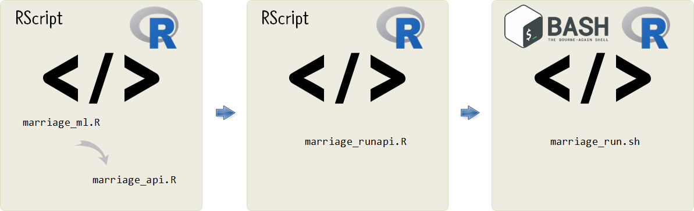

# AWS위에 HTTP API 서비스 오픈 {#http-api-strawman-version}

AWS 위에 HTTP API 서비스를 오픈하는데 모든 역량을 집중한다.
이를 위해서 가장 간단한 함수를 제작하여 이를 AWS EC2위에 올린다.



먼저 기계학습 알고리즘을 추출하여 이를 `marriage_api.R` 파일에 HTTP API 서비스로 작성한다.
그리고 나서 API를 실행하도록 `marriage_runapi.R` 파일에 `plumber` 서비스를 호스트와 함께 적어 실행시킨다.
마지막으로 `marriage_run.sh` 파일에는 쉘환경에서 `marriage_runapi.R` 파일을 실행시키도록 코드를 작성한다.

## 예측모형 구축 및 테스트 스크립트 작성 {#http-api-strawman-version-predictive-model}

가장 먼저 소득(income)과 자산(asset)이 주어졌을 때 이 정보를 이용하여 결혼할 확률을 계산하는 
함수를 임의로 작성한다.

$$\text{결혼확률} = \frac{1}{1+exp(-0.7-0.3\times \text{income} -1.1 \times {asset})} $$

상기 수식을 `calc_marriage(0.5, 0.005)` 함수로 제대로 확률값을 계산하는지 확인하는 용도로 사용한다.

그리고 나서 HTTP API 서비스로 제공하는데 `JSON` 데이터가 필요하기 때문에... `rjson` 팩키지 `toJSON()` 함수로 
테스트로 사용될 관측점을 하나 뽑아내서 `JSON` 데이터로 준비한다.

``` {r http-api-strawman, eval=FALSE}
# 파일명: marriage_ml.R
# 0. Packages -----
library(tidyverse)
library(janitor)
library(rjson)
library(jsonlite)

# 1. data -----
## 1.1. 기계학습 모형 -----
calc_marriage <- function(income, asset) {
    linear_combination <- 0.7 + 0.3 * income + 1.1 * asset
    marriage_prob <- 1/(1+exp(-linear_combination))
    cat("Marriage Probability: ", marriage_prob)
} 

## 1.2. 기계학습 검정 -----
calc_marriage(0.5, 0.005)

# 2. API 검정 -----
df <- tribble(
    ~"income", ~"asset",
    0.5, 0.005,
    2, 3
)

input_data <- df[1, ]

test_case_json <- toJSON(input_data)
cat(test_case_json)

# curl -d '{"income":0.5,"asset":0.005}' "http://localhost:8000/predict"
```


## HTTP API 서비스 명세 {#http-api-strawman-version-predictive-model-api}

`\healthcheck` 서비스를 작성하여 문제점을 사전에 적시한다.
그리고 나서, 앞서 개발한 기계학습 알고리즘을 `calc_marriage()` 함수로 준비하여 
`\predict` 서비스로 호출할 경우 결혼확률을 산출할 수 있도록 HTTP API 서비스를 명세한다.

``` {r http-api-strawman-api, eval=FALSE}
# 파일명: marriage_api.R
MODEL_VERSION <- "0.0.1"

# 2. API services -----
## 2.1. Health Check -----
#* @get /healthcheck
health_check <- function() {
    result <- data.frame(
        "input" = "",
        "status" = 200,
        "model_version" = MODEL_VERSION
    )    
    return(result)
}


calc_marriage <- function(income, asset) {
    linear_combination <- 0.7 + 0.3 * income + 1.1 * asset
    marriage_prob <- 1/(1+exp(-linear_combination))
    # cat("Marriage Probability: ", marriage_prob)
    return(marriage_prob)
} 

#* @post /predict
#* @get /predict
calculate_marriage <- function(income, asset) {
    
    income <- as.integer(income)
    asset  <- as.integer(asset)

    pred_prob <<- calc_marriage(income, asset)
    
    # paste("--\n Probability of Marriage is ", as.character(pred_prob), "\n----------------\n")
    return(list(marriage_probability=unbox(pred_prob)))
}
```

## HTTP API 서비스 명세 {#http-api-strawman-version-predictive-model-api}

`plumber` 서비스를 띄워서 해당 끝점(endpoint) 서비스에 접속하면 결혼확률을 반환하는 서비스를 실행한다.

``` {r http-api-strawman-api-plumber, eval = FALSE}
# 파일명: marriage_runapi.R
library(plumber)

r <- plumb("~/marriage_toy/marriage_api.R")

r$run(port = 8000)
```

## 배쉬쉘 서비스 실행 {#http-api-strawman-version-predictive-model-api-shell}

`marriage_run.sh`을 실행시키게 되면 `marriage_runapi.R`가 실행되고 이는 다시 `marriage_api.R`를 실행시켜 
HTTP API 결혼확률 서비스를 올리게 된다.

``` {r http-api-strawman-api-plumber-shell, eval = FALSE}
# 파일명: marriage_run.sh
#!/bin/bash

exec R --vanilla CMD BATCH marriage_runapi.R
```

# HTTP API 서비스 테스트 {#http-api-strawman-version-test}

AWS EC2에 FTP로 개발된 HTTP API 결혼예측 서비스를 올려 `./marriage_run.sh`으로 실행시키게 되면 외부에서 
API에 입력값(income, asset)을 전달하게 되면 결혼확률값을 전달받을 수 있게 된다.
특히, `curl`을 사용하면 터미널에서 앞서 생성한 JSON 데이터를 입력값을 실어서 전달하게 되면 `52.79.XXX.XXX` 호스트 8000 포트로 
\predict` 서비스를 통해 결혼확률을 얻을 수 있다.

``` {r http-api-strawman-api-plumber-shell-test, eval = FALSE}
$ curl -d '{"income":7.1,"asset":0.015}' "http://52.79.XXX.XXX:8000/predict"
{"marriage_probability":0.9427}
```

