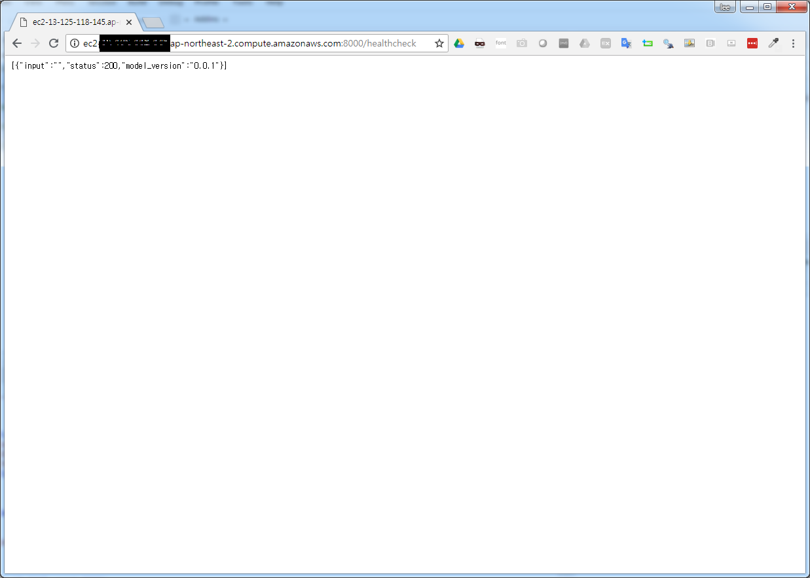
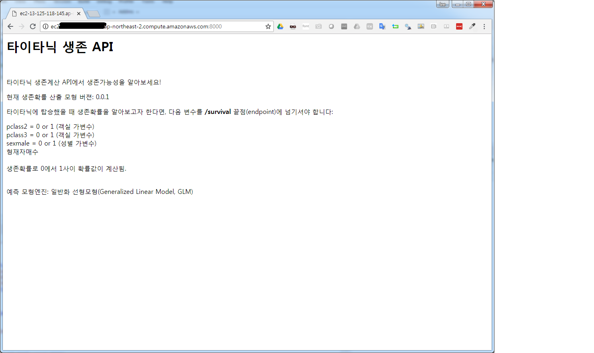
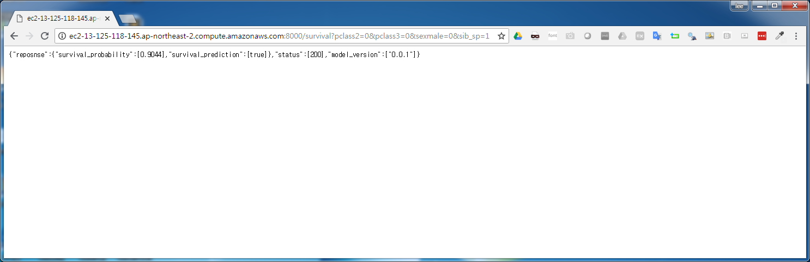

``` {r, include=FALSE}
source("tools/chunk-options.R")
knitr::opts_chunk$set(echo = TRUE, warning=FALSE, message=FALSE)

library(tidyverse)
library(httr)
options(scipen = 999)
options(dplyr.width = 120)
options(dplyr.print_max = 1e9)
```

# AWS EC2 설정 {#plumber-aws-ec2}

[R 병렬 프로그래밍 - 왜 GLM인가?](http://statkclee.github.io/parallel-r/r-deployment-glm.html)를 통해 GLM 모형을 활용하여 
타이타닉 생존 예측모형을 만들어서 로컬 컴퓨터에서 테스트를 마쳤다면 AWS와 같은 클라우드 서비스에 올리도록한다.

## WinSCP FTP 프로그램 {#plumber-aws-ec2-ftp}

WinSCP와 같은 FTP 도구를 활용해서 타이타닉 생존확률 API가 들어있는 파일과 `plumber`를 실행시킬 수 있는 코드르 함께 AWS EC2로 올리고 나서

## `plumber` API 서비스 실행 [^hosting-plumber-on-aws] {#plumber-aws-ec2-ftp-plumber}

[^hosting-plumber-on-aws]: [Hosting a Plumber API on AWS Posted by Andrew B. Collier on 2017-09-14.](http://www.exegetic.biz/blog/2017/09/plumber-api-on-aws/)

로컬 컴퓨터에서는 `host`를 특별히 지정할 필요는 없으나, AWS EC2로 올릴 경우 `host = "xxx.xx.xx.xxx"`와 같이 지정을 해줘야 한다.
간혹 `host = 0.0.0.0`와 같이 설정하면... 보안에 큰 문제가 있을 수 있으니 주의한다. 호스트 IP는 "프라이빗 IP"를 찾아 적어줘야 한다.

``` {r plumber-api-on-aws, eval = FALSE}
library(plumber)

r <- plumb("code/glm_restful/03-plumber-model.R") 

# r$run(port=8000)

r$run(host = "xxx.xx.xx.xxx", port=8000)
```

## `plumber` API 서비스 활용 {#plumber-aws-ec2-ftp-plumber-usage}

### 건강 체크 {#plumber-aws-ec2-ftp-plumber-healthcheck}

`plumber` API 서비스가 제대로 올라갔는지 가장 먼저 건강체크를 한다.

- `http://ec2-xx-xxx-118-xxx.ap-northeast-2.compute.amazonaws.com:8000/healthcheck`



### API 문서 {#plumber-aws-ec2-ftp-plumber-html}

`plumber` API 서비스에 대해서 기술한 문서를 html 파일로 올린다.

- `http://ec2-xx-xxx-118-xxx.ap-northeast-2.compute.amazonaws.com:8000/`



### API 생존확률 {#plumber-aws-ec2-ftp-plumber-prob}

`plumber` API 서비스는 결국 생존확률을 파악하고자 하는 것이니 생존확률 API를 호출하여 생존확률을 산출해낸다.

- `http://ec2-xx-xxx-118-xxx.ap-northeast-2.compute.amazonaws.com:8000/survival?pclass2=0&pclass3=0&sexmale=0&sib_sp=1`



