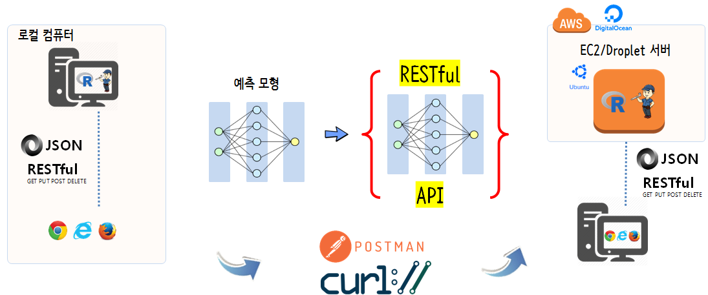

``` {r, include=FALSE}
source("tools/chunk-options.R")
knitr::opts_chunk$set(echo = TRUE, warning=FALSE, message=FALSE)

library(tidyverse)
library(httr)
options(scipen = 999)
options(dplyr.width = 120)
options(dplyr.print_max = 1e9)
```

# ML 모형을 실운영계로 적용 [^kevin-deploy] {#r-deployment-hard}

[^kevin-deploy]: [Kevin Kuo (Jun 5, 2018), "From Prototyping to Deployment at Scale with R and sparklyr", Spark+AI Summit](https://sais2018.netlify.com/)

기계학습(ML) 모형을 실운영계에 적용시킨다는 것의 의미는 개발된 예측모형을 누군가 사용하도록 만든다는 의미가 된다.
즉, 누군가 기계학습 모형을 예측에 사용하게 된다. 그럼 어떻게 사용하게 할 수 있을까?

크게 배치(batch) 모형과 실시간(real-time) 두가지 방식으로 나눌 수 있다.
배치모형은 아래 데이터베이스 모형으로 간주되고, 실시간 모형은 `RESTful API` 모형으로 구현된다.

그런데 왜 배포가 어려운가? 이 문제를 생각해 보면 기계학습 모형을 운영계에 적용시킬 경우 다양한 기술과 전문성이 요구되기 때문이다.
이 말을 풀어서 보면 많은 사람이 기계학습 모형 배포과정에 가담하게 되면 자동으로 많은 문제가 야기된다.

- 사업(Business) 
- 데이터 과학(Data Science)
- 데이터 엔지니어링(Data Engineering)
- 운영(Operation)

사람과 관련된 이슈 외에도 기술적으로 너무나도 많은 다양한 선택지가 존재하는 것도 이슈다.

- Spark ML
- dbml
- PMML
- PFA/Aardpfark
- MLeap
- ONNX
- 성능문제로 C/C++로 재구현


기계학습 예측모형을 개발하게 되면 모형데이터를 전통적인 통계모형, 기계학습, $H_2O$, 아파치 스파크, 딥러링 텐서플로우에 배포하느냐에 따라 다양한 조합의 수가 발생된다.
정확도가 높은 기계학습모형을 개발하는 것도 중요하지만, 잘 개발된 기계학습 알고리즘이 잘 적용될 수 있도록 배포하는 기술도 익혀두는 것이 더불어 요구된다.

- [전통적인 통계모형 배포](r-restful-api-on-aws-strawman.html): 예측모형을 수식으로 표현하여 배포하는 방식
- [기계학습(caret) 통계모형 배포](r-restful-api-on-aws-stoneman.html): 예측모형을 수식이 아닌 객체로 전달하여 `predict()` 함수로 배포하는 방식
- [$H_2O$ AutoML 플랫폼](https://statkclee.github.io/model/model-recipe-h2o-automl.html): $H_2O$ AutoML로 기계학습 예측모형을 만들어서 POJO/MOJO 자바코드로 배포하는 방식 **(TBD)**
- 스파크(Spark): **(TBD)**
- 텐서플로우(Tensorflow): **(TBD)**
- [데이터베이스(DBMS) 배포](r-database-tidypredict.html): R 예측모형을 `tidypredict` 팩키지로 SQL 코드를 추출하여 데이터베이스(DBMS)에 배포

# 예측모형 양산환경 [^r-as-a-webservice] {#r-in-production}

[^r-as-a-webservice]: [How do I expose R code as a web service?](https://www.quora.com/How-do-I-expose-R-code-as-a-web-service)

웹에서 R을 돌리는 방법은 오래전부터 많이 시도되어 왔고, 이제는 안정화되었다고 봐도 될듯 싶다. 
한동안 `opencup`가 많이 사용되어 왔으나 팩키지를 만들어야 기본적으로 R을 양산환경에 돌릴 수 있다는 
부담감(?)으로 작용하는 것도 사실이다. 최근에는 `plumber`가 대세로 굳어지는 듯 하다.
[Discontinuing maintenance of jug](http://fishyoperations.com/2018/01/07/discontinuing-maintenance-jug.html)를 발표하면서 
더이상 `jug`가 RESTful API 개발을 주도하는데 실패했고, 이에 대한 대안으로 [plumber](https://github.com/trestletech/plumber)를 추천하고 있다.


- `plumber`: [Turn your R code into a web API](https://github.com/trestletech/plumber)
- `jug`: [jug: A Simple Web Framework for R](https://github.com/Bart6114/jug)
- `opencpu`: [OpenCPU system for embedded scientific computation and reproducible research](https://www.opencpu.org/)
    -  팩키지를 개발하고 이를 RESTful API 서비스로 제공.
- `deployR`: [The elements of scaling R-based applications with DeployR](http://blog.revolutionanalytics.com/2016/09/the-elements-of-scaling-r-based-applications-with-deployr.html)
    - 마이크로소프트에서 개발하여 제공.
- `rapache`: [Web Application Development with R and Apache](http://rapache.net/)
    - 오래전에 개발된 후에 더이상 활발히 개발이 진행되고 있지 않는 것으로 파악됨.


기계학습, 딥러닝을 통해 학습한 예측모형을 양산환경으로 배포할 경우 크게 두가지 아키텍쳐가 가능하다.
일반적인 상용 웹사이트 사례를 들어 예측모형 양산환경에 대해서 살펴보자. [^titanic-plumber-api]

[^titanic-plumber-api]: [raybuhr blog, Making Predictions over HTTP with R October 17, 2017](https://raybuhr.github.io/2017/10/making-predictions-over-http/)


|구분|      데이터베이스            |         RESTful API          |
|----|:-----------------------------|:-----------------------------|
|장점| 데이터베이스 테이블을 단순히 병합(Join)하면 되기 때문에 속도가 매우 빠름 | 유닉스 철학에 따라 예측서비스를 독자적 수행이 가능 |
|단점| 커플링 되어 있어 일부 코드 변경을 위해서 시간이 추가로 소요되고, 한가한 시간에 배치로 테이블 예측값을 주기적 갱신 | 속도가 늦을 수 있으나 대부분의 웹사이트는 비동기식 통신을 통해 예측모형 외에 다양한 서비스를 조합해서 서비스함 |

RESTful API로 예측모형 양산 서비스를 제공할 경우 복잡한 예측모형만큼이나 난잡한 예측모형 양산 서비스를 이해하기 쉽게 할 수 있고,
유지보수하기도 쉽고, 예측모형에 대한 버젼관리 뿐만 아니라 모니터링도 한결 수월하게 진행할 수 있다.


> ### OpenCPU 와 다른 웹도구와 차별점 [^so-opencpu] {.callout}
>
> OpenCPU is a layer on top of the regular tools (e.g. RApache, rpy2) that defines a framework and protocol for interacting with R. 
> It handles stuff like object serialization, security, resource control, reproducibility etc, while abstracting away technicalities.

[^so-opencpu]: [What is the intention of opencpu.org compared to other approaches?
](https://stackoverflow.com/questions/8858429/whats-the-intention-of-opencpu-org-compared-to-other-approaches/8916615#8916615)



# 예측모형 RESTful API 서비스로 제공 {#local-computer-api}

기계학습 예측모형을 예측하려는 변수를 연속형 변수와 범주형변수로 나눠 적절한 모형 아키텍처를 선택하고 나서 
예측모형의 성능을 나타내는 지표 `RMSE`, `ROC AUC`, 정확도(accuracy)등을 가지고 모형의 복잡성 등을 평가하고 나서 
최적의 예측모형을 선택한다. `xgBoost`, `Random Forest`, `GBM`, `CART`, `GLM` 등이 예측모형이 될 수 있다.

다음 단계로 이를 `RESTful` API로 변환을 시킨다. 이때, `plumber`, `openCPU`가 검토 대상이 될 수 있다.

이제 예측모형을 RESTful API로 제공할 준비가 되었다면 다음 단계로 이를 AWS 혹은 Digital Ocean에 서버를 임차하여 배포한다.
이제 서버에 예측서비스를 요청하면 결과를 제공받을 수 있게 되었다.

## 로컬 컴퓨터 RESTful API 개발 환경 {#local-computer-api}

예를 들어 `plumber`를 RESFtul API 기본 서버로 지정하는 경우 로컬컴퓨터에서 `httr` 팩키지가 지원하는 `GET`, `POST` 함수를 
활용하여 `plumber` 팩키지가 R 코드를 서비스로 제공하도록 개발환경을 구축한다.

로컬 컴퓨터에 `plumber` 개발환경을 구축하는 방법은 다음과 같이 단순하다.

`devtools::install_github("trestletech/plumber")` 명령어로 R코드를 RESTful API로 제공하는 팩키지를 설치한다.
제공할 서비스를 `myfile.R` 파일에 담아 넣고 `POST`, `GET`으로 서비스를 명세한다.
`r$run(port=8000)` 명령어를 실행해서 `myfile.R` 파일에 담아 놓은 서비스를 RESTful API로 제공한다.

``` {r plumber-local, eval=FALSE}
devtools::install_github("trestletech/plumber")

library(plumber)

r <- plumb("code/myfile.R") 
r$run(port=8000)
Starting server to listen on port 8000
Running the swagger UI at http://127.0.0.1:8000/__swagger__/
```

## 예측 모형 개발 {#local-computer-api-pm}

기계학습 예측모형 개발에 대한 독일신용평가 데이터를 활용한 모형개발 사례는 [xwMOOC 기계학습 - 모형식별 및 선택 (yardstick)](http://statkclee.github.io/ml/ml-model-selection.html)을 
참조한다.

그외 예측모형 개발 기계학습에 대한 일반적인 내용은 다음 xwMOOC 웹페이지를 참조한다.

- [xwMOOC 기계학습 - 데이터 과학자가 바라본 기계학습](http://statkclee.github.io/ml/)

## 예측 모형 &rarr; RESTful API 서비스 변환 {#local-computer-api-pm-convert}

기계학습 예측모형 개발이 완료되었다면 다음 단계로 이를 `RESTful` API 서비스로 변환을 한다.
이에 대한 자세한 사항은 다음 두 사례를 참조한다.

- [R 병렬 프로그래밍 - 신용위험 확률(plumber) API](http://statkclee.github.io/parallel-r/r-credit-score-api.html)
- [R 병렬 프로그래밍 - R 양산환경(plumber) - 타이타닉](http://statkclee.github.io/parallel-r/r-in-production-plumber.html)

## AWS EC2/디지털바다 RESTful API 서비스 {#digital-aws-restful-api}

로컬 컴퓨터에서 RESTful API 서비스를 개발하여 테스트를 마무리했다면, 로컬 컴퓨터에 가상컴퓨터를 생성하거나,
클라우드에 예를 들어 AWS EC2 컴퓨터에 `plumber` 팩키지를 설치하여 RESTful API 서비스를 제공하도록 탈바꿈 한다.

[analogsea: Interface to 'Digital Ocean'](https://cran.r-project.org/web/packages/analogsea/)를 활용하면 GUI 대신 
R RESTful API가 제공되는 서비스를 RStudio 콘솔 CLI를 통해 가상컴퓨터로 제공할 수 있다.


<div class = "row">
  <div class = "col-md-6">
- **Plumber Server Provisioning on DigitalOcean**

<iframe width="300" height="180" src="https://www.youtube.com/embed/OiREOPog3Cs" frameborder="0" allow="autoplay; encrypted-media" allowfullscreen></iframe>

  </div>
  <div class = "col-md-6">
- **Adding HTTPS to Plumber on DigitalOcean**

<iframe width="300" height="180" src="https://www.youtube.com/embed/EpgdrRTBZwg" frameborder="0" allow="autoplay; encrypted-media" allowfullscreen></iframe>

  </div>
</div>


