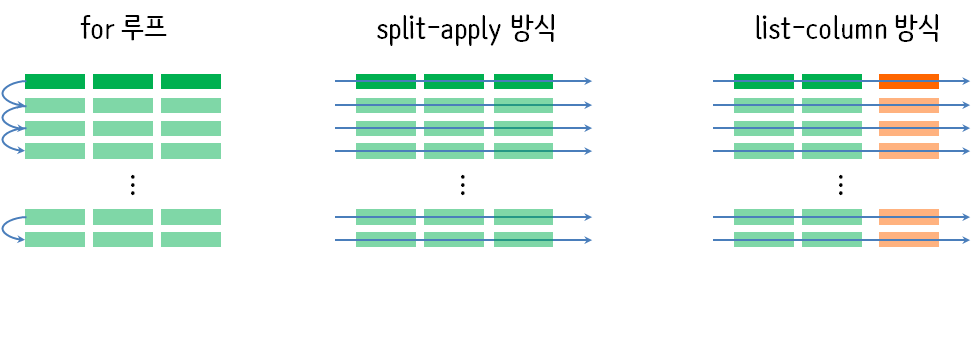

``` {r, include=FALSE}
source("tools/chunk-options.R")
knitr::opts_chunk$set(echo = TRUE, warning=FALSE, message=FALSE)

# 0. 환경설정 -----
library(tidyverse)
library(gapminder)
```

# 1. 행방향(row-wise) 데이터 [^row-wise-rstudio] [^row-wise-performance] {#row-wise-data-wrangling}

[^row-wise-rstudio]: ["Thinking inside the box: you can do that inside a data frame?!", Jenny Bryan Software Engineer, RStudio](https://github.com/rstudio/webinars/tree/master/54-row-oriented-work)

[^row-wise-performance]: [Winston Chang, "Applying a function over rows of a data frame"](https://rpubs.com/wch/200398)

R에서 열 칼럼(column)은 매우 특별한 의미를 갖는데 특히, 데이터분석에서는 환상적이다. 
하지만, 역으로 행방향 데이터 작업은 일반적이지 않고 쉽게 말해 열 칼럼방향으로 데이터를 다루는 것보다 어렵다.

빅데이터 시대 다양한 유형의 데이터를 데이터분석가 혹은 데이터 과학자가 마주하게 되면 

이러한 질문에 행방향 데이터 처리에 대해 코드를 작성하기 쉽고, 코드를 읽기 쉽고, 코드의 실행시간이 짧게 걸리는 것이 권장되는 R 코드다.

<blockquote class="twitter-tweet" data-lang="en"><p lang="en" dir="ltr">what&#39;s a safe way to iterate over rows of a dataframe? re: <a href="https://t.co/goizEjISry">https://t.co/goizEjISry</a> <a href="https://twitter.com/hashtag/rstats?src=hash&amp;ref_src=twsrc%5Etfw">#rstats</a></p>&mdash; Dean Attali (@daattali) <a href="https://twitter.com/daattali/status/761058049859518464?ref_src=twsrc%5Etfw">August 4, 2016</a></blockquote>
<script async src="https://platform.twitter.com/widgets.js" charset="utf-8"></script>

## 맛보기 {#row-wise-taste}

데이터프레임을 리스트로 변화하는 사례를 살펴보자. 먼저 데이터프레임을 하나 생성한다.

```{r dataframe}
# 0. 환경설정 -----
library(tidyverse)

# 1. 데이터 -----
## 데이터 프레임
i_have_df <- tribble(
    ~x, ~y, ~가나다,
    1L, "one", "하나",
    2L, "two", "둘"
)
```

다양한 방법이 있지만, 먼저 `pmap()` 함수에 `list()` 함수를 적용시키게 되면 각 행에 대해서 리스트 변환작업을 하고 
결과를 리스트로 반환한다.

마찬가지로 리스트를 데이터프레임으로 변환하는 방법을 살펴보자. [^spread-duplicate]
이를 위해서 `map_df()` 함수로 리스트 자료구조 객체에 `enframe()` 함수를 적용시켜 `tibble` 자료구조를 만들고 나서 `spread()` 함수로 원복시킨다.

[^spread-duplicate]: [Spread with duplicate identifiers (using tidyverse and %>%)](https://stackoverflow.com/questions/43259380/spread-with-duplicate-identifiers-using-tidyverse-and)

<div class = "row">
  <div class = "col-md-6">
**데이터프레임 &rarr; 리스트 **

``` {r dataframe-to-list}
## 데이터프레임 --> 리스트 
(i_want_list <- pmap(i_have_df, list))
```
  </div>

  <div class = "col-md-6">
**리스트 &rarr; 데이터프레임**

``` {r list-to-dataframe}
## 리스트 --> 데이터프레임
map_df(i_want_list, enframe, name="xyz") %>% 
    mutate(value = value %>% unlist) %>% 
    group_by(xyz) %>% 
    mutate(ind = row_number()) %>% 
    spread(xyz, value) %>% 
    select(-ind)
```
  </div>

</div>


# 행방향 데이터 처리 전략 {#row-wise-strategy}

행방향 데이터 처리 방향은 크게 3가지 방식으로 나눌 수 있다.

- 전통적인 `for` 루프 작성
- 분할-적용-결합 (split-apply-combine) 방식을 차용한 `lapply` 계열 함수 적용방식
- `list-column` 데이터프레임을 `tidyverse purrr` 함수형 프로그래밍을 적용하는 방식

티블(tibble)은 `tidyverse` 데이터프레임으로 데이터프레임을 행방향으로 자료처리를 할 때 유용한 반면,
리스트형 데이터는 중첩(nesting)을 통해 도출되는 `list-column`을 티블의 변수로 저장해서 
행방향 자료처리를 하는 방식이 큰 틀에서 훈륭한 전략이 된다.




## `for` 루프, `lapply`, `pmap` 비교 {#strategy-comparison}

데이터프레임을 리스트로 변환하는 방법이 믿기지 않겠지만 코드 한줄로 가능하다.
`purrr` 팩키지 `pmap()` 함수에 데이터프레임과 리스트 변환함수 `list()`를 넣어 전달하면 된다.

``` {r pmap-data}
# 0. 환경설정 -----
library(tidyverse)

# 1. 데이터 -----
## 데이터 프레임
i_have_df <- tribble(
    ~x, ~y, ~가나다,
    1L, "one", "하나",
    2L, "two", "둘"
)

## 2.3. `pmap` 함수형 프로그래밍
pmap(i_have_df, list)
```


<div class = "row">
  <div class = "col-md-6">
**for 루프**

``` {r for-loop-dataframe}
# 2. 리스트 변환하는 방법 -----
## 2.1. for 루프
i_want_list <- vector(mode = "list", length = nrow(i_have_df))

for (i in seq_along(i_want_list)) {
    i_want_list[[i]] <- as.list(i_have_df[i, , drop = FALSE])
}

i_want_list
```

  </div>
  <div class = "col-md-6">
**split-apply 방식**

``` {r for-loop-laply}
## 2.2. 행으로 쪼개서(`split`) 형별로 `lapply` 적용
i_split_df <- split(i_have_df, seq_len(nrow(i_have_df)))
lapply(i_split_df, function(row) as.list(row))
```
  </div>
</div>

## `glue` 문장 생성 {#glue-sentence}

`glue` 팩키지를 `stringr`, 파이프 연산자와 함께 결합해서 사용할 경우,
데이터프레임 내부에서 하나의 변수로 체계적으로 관리가 가능하다.

``` {r glue-sentence}
# 1. 데이터 -----
## 데이터 프레임
demo_df <- tribble(
        ~ name, ~ age,
        "정훈", 14L,
        "기민", 12L,
        "지호", 12L,
        "빅터", 1L
    )
## 2.3. `glue` 팩키지
### `stringr` 팩키지
str_glue_data(demo_df, "{name}의 나이는 {age}살 입니다.")
### `tidyverse` 팩키지
demo_df %>%
    mutate(문장 = str_glue("{name}의 나이는 {age}살 입니다."))
```    

앞서 수많은 분들의 노력으로 `for`루프를 대신하여 벡터화(vectorization)로 많은 기능이 제공된다.
이 경우도 예외가 아니라서 `paste()` 함수는 이미 벡터화되어 있어 굳이 `for` 루프로 작성하지 않아도 된다.

<div class = "row">
  <div class = "col-md-6">
**for 루프**

``` {r for-loop-dataframe-string}
# 2. 문장 생성 -----
## 2.1. for 루프 -----
### 행 단위로 문장생성
paste(demo_df$name[1], "의 나이는 ", demo_df$age[1], "살 입니다.")
### 전체 ...
demo_v <- vector(mode = "character", length = nrow(demo_df))

for (i in seq_len(nrow(demo_df))) {
    demo_v[i] <- paste0(demo_df$name[i], "의 나이는 ", demo_df$age[i], "살 입니다.")
}
demo_v
```

  </div>
  <div class = "col-md-6">
**벡터화**

``` {r for-loop-vectorized}
## 2.2. 벡터 연산작업 -----
paste0(demo_df$name, "의 나이는 ", demo_df$age, "살 입니다.")
```
  </div>
</div>

## 행수 파악하기 {#purrr-nrow}

프로젝트로 작업을 수행할 경우 데이터프레임 뿐만아니라 벡터,
리스트, 그래프 등 수많은 결과가 나온다. 이러한 결과값을 하나의 객체에 저장하는 것이 
필요한데 이럴 때 `list` 리스트 자료구조가 유용하다.
유명한 `iris`, `mtcars` 데이터프레임을 하나의 리스트 `df_list`로 생성했는데 
각 데이터프레임의 행수를 살펴보자.

``` {r list-dataframe-nrow}
# 1. 데이터 -----
## 두 데이터 프레임을 갖는 리스트
df_list <- list(
    iris = head(iris, 2),
    mtcars = head(mtcars, 3)
)
listviewer::jsonedit(df_list)
```

리스트에 포함된 각 데이터프레임에 대해서 행수를 확인하는데 사용되는 함수는 `nrow()`다.
이를 좀더 복잡한 작업을 수행할 때 `~`, `.`, `.$` 등을 사용한다.
그리고 계산작업을 수행해서 반환되는 형식도 `map_int()`와 같이 정수형으로 지정할 수 있다.
참고로 디폴트 기본값으로 리스트가 반환된다.

``` {r list-dataframe-nrow-ways}
# 2. 행수 찾아내기 -----
map(df_list, nrow)

map(df_list, ~nrow(.x))

map_int(df_list, ~nrow(.x))
```

# 중첩 리스트 데이터 {#nested-list}

`smpl_list`와 같이 중첨된 리스트 데이터는 JSON 형식이나 XML로 데이터를 
API를 통해 전달받게 되는 흔히 데이터과학자에게 전달되는 데이터다.
`listviewer`를 통해 보면 좀더 명확하게 자료구조가 다가온다.

``` {r nested-list-data-structure}
# 1. 데이터 -----
## 두 데이터 프레임을 갖는 리스트
smpl_list <- list(
    list(name = "sue", number = 1, veg = c("onion", "carrot")),
    list(name = "doug", number = 2, veg = c("potato", "beet"))
)

listviewer::jsonedit(smpl_list)
```

## 데이터프레임 변환  {#nested-list-convert}

`rbind()` 함수를 통해 중첩된 리스트 속 데이터를 데이터프레임으로 변환하게 되면
형이 맞지 않거나 데이터프레임이 아닌 행렬로 변환이 되어 추가로 손이 많이 간다.
이에 반해 `map_df()` 계열 함수를 사용하게 되면 간결한 코드를 통해
원하는 데이터프레임을 얻을 수가 있다.

<div class = "row">
  <div class = "col-md-6">
** `rbind()` **

``` {r nested-list-rbind}
# 2. 데이터프레임 변환 -----
## 문제
do.call(rbind, smpl_list)
```
  </div>

  <div class = "col-md-6">
**`map_df()`**

``` {r nested-list-map_df}
## 행방향 데이터프레임
map_dfr(smpl_list, ~ .x[c("name", "number")])
```
  </div>
</div>


중첩리스트 일부를 데이터프레임으로 만들었다면 전체를 `list-column` 데이터프레임으로 
변환시킬 수 있고, `enframe()`함수를 통해 즉시 데이터분석이 가능한 형태로 만들 수도 있다.

``` {r nested-list-unnest}
## 리스트 칼럼 티블
smpl_df <- tibble(
    name = map_chr(smpl_list, "name"),
    number = map_dbl(smpl_list, "number"),
    veg = map(smpl_list, "veg")
)

smpl_df %>% 
    mutate(veg = map(veg, enframe, name="vegetable")) %>% 
    unnest(veg)
```


# 난수생성 {#random-number}

앞서 익힌 기술을 바탕으로 난수를 생성한다.
사용자 정의 난수 생성 함수를 만들어서 `pmap()` 함수에 적용시킬 경우 
난수 생성에 필요한 모수와 함께 생성된 난수를 함께 데이터프레임에 넣을 수 있다.

``` {r random-generation}
# 1. 난수생성 -----
## 모수 설정
unif_param_df <- tibble(
    n = 1L:3L,
    min = c(0, 10, 100),
    max = c(1, 100, 1000)
)

## 난수 생성 함수 
tibble_runif <- function(n, min, max, ...) {
    runif(n = n, min = min, max = max)
}

## 난수생성
pmap(unif_param_df, tibble_runif)

## tibble 데이터프레임
unif_param_df %>% 
    mutate(rand_data = pmap(., tibble_runif))
```


# 그룹별, 다수 출력 {#group_by-case}

`for` 루프를 동원해서 행마다 연산작업을 동원하는 것도 가능하지만,
코드가 길어져서 벡터화 연산을 지원하는 함수를 사용하거나 `purrr` 팩키지 
`map` 함수를 사용했다. 

행이 그룹으로 묶여있는 경우 이에 대한 요약통계량을 계산하고자 할 때,
`group_by()` - `summarise()` 조합을 사용했다.
이런 경우 결과값이 하나의 행으로 출력되지만, 다수 값을 출력하고자 할 경우
`list()`로 묶어 낸다.

``` {r group-by-list}
# 1. `group_by` 사례 -----
iris %>%
    group_by(Species) %>%
    summarise(pl_avg = mean(Petal.Length), pw_avg = mean(Petal.Width))

# 2. 출력결과 다수 -----
iris %>%
    group_by(Species) %>%
    summarise(pl_qtile = list(quantile(Petal.Length, c(0.25, 0.5, 0.75))))
```

하지만, 후속작업으로 리스트를 다시 데이터프레임으로 바꿔서 작업을 할 경우 
`enframe()` 함수와 엮어서 `unnest`를 통해 중첩을 풀어주면 데이터프레임이 된다.
경우에 따라서 `enquantile()`와 같은 사용자 함수를 사용할 경우 좀더 간결한
코드를 생성시킬 수 있다.

``` {r group-by-list-enframe}
# 3. 데이터프레임으로 변환 -----
## map 사용
iris %>%
    group_by(Species) %>%
    summarise(pl_qtile = list(quantile(Petal.Length, c(0.25, 0.5, 0.75)))) %>%
    mutate(pl_qtile = map(pl_qtile, enframe, name = "quantile")) %>%
    unnest() %>%
    mutate(quantile = factor(quantile))
    
## 사용자 함수 생성
enquantile <- function(x, ...) {
    qtile <- enframe(quantile(x, ...), name = "quantile")
    qtile$quantile <- factor(qtile$quantile)
    list(qtile)
}

iris %>%
    group_by(Species) %>%
    summarise(pl_qtile = enquantile(Petal.Length, c(0.25, 0.5, 0.75))) %>%
    unnest()
```

# 모형 {#nested-dataframe-lm}

`gapminder` 데이터의 국가별 평균수명을 시각화할 경우 `fct_reorder2()` 함수를 사용하면 
시각적으로 편한 결과가 도출된다.

``` {r gapminder, out.width=c('50%', '50%'), fig.show='hold'}
# 국가별 수명 ----
## 알파펫 순으로 정렬된 국가
gapminder %>%
    filter(continent == "Asia") %>%
    mutate(yr1952 = year - 1952) %>% 
    ggplot(., aes(x = lifeExp, y = country)) +
      geom_point()

## 수명순으로 정렬된 국가
gapminder %>%
    filter(continent == "Asia") %>%
    mutate(yr1952 = year - 1952,
           country = fct_reorder2(country, x = year, y = lifeExp)) %>% 
    ggplot(., aes(x = lifeExp, y = country, color=as.factor(year))) +
    geom_point() 
```

단순히 평균수명을 국가별로 비교하는 것이 아니라, 회귀분석을 수행하여 절편과 회귀계수별로 
비교를 해보자. 회귀분석이 일종의 필터 역할을 수행하게 된다.

국가별로 `group_by()` 함수를 통해 `nest()`하게 되면 `list-column`이 생성된다.
이를 통해 국가별로 분석이 가능한 데이터가 준비되었다.
이제 국가별로 회귀분석을 수행하고 결과를 역시 동일하게 `fit` 변수명으로 저장시킨다.

그런 다음 절편과 회귀계수를 기준으로 국가를 정렬해서 시각화해본다.

``` {r gapminder-lm-nested}
# 회귀모형을 적합시켜 수명을 정렬 ----
## 중첩된 데이터프레임(nested dataframe)
gap_nested <- gapminder %>%
    filter(continent == "Asia") %>%
    mutate(yr1952 = year - 1952) %>% 
    group_by(country) %>%
    nest()

## 회귀모형 추가
gap_fitted <- gap_nested %>%
    mutate(fit = map(data, ~ lm(lifeExp ~ yr1952, data = .x)))

## 회귀계수 추출
gap_fitted <- gap_fitted %>%
    mutate(
        intercept = map_dbl(fit, ~ coef(.x)[["(Intercept)"]]),
        slope = map_dbl(fit, ~ coef(.x)[["yr1952"]])
    )

## 시각화
gap_fitted %>% 
    mutate(country = fct_reorder(country, intercept)) %>% 
    ggplot(., aes(x = intercept, y = country)) +
        geom_point() 

gap_fitted %>% 
    mutate(country = fct_reorder(country, slope)) %>% 
    ggplot(., aes(x = slope, y = country)) +
    geom_point() 
```


