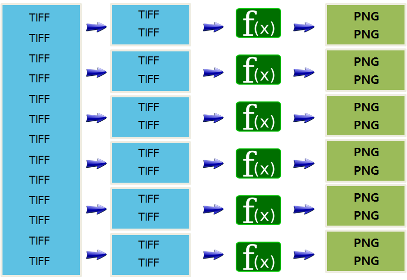

> ### 학습 목표 {.objectives}
>
> * 병렬 컴퓨팅을 이해한다.
> * 뉴욕타임즈 시간여행 기사 이미지지 병렬 알고리즘 사례를 살펴본다.

### 1. 뉴욕타임즈 [시간여행](http://timesmachine.nytimes.com/browser) 사례 

[시간여행(TimeMachine)](http://timesmachine.nytimes.com/browser) 서비스는 1851-1922년 (퍼블릭 도메인) 신문기사 전체를 스캔해서 데이터형태로 저장했다. 

- [시간여행](http://timesmachine.nytimes.com/browser) 웹친화적 서비스가 되기 **전** 모습
    - 405,000 TIFF 이미지
    - 3.3 백만 SGML, 405,000 XML
- [시간여행](http://timesmachine.nytimes.com/browser) 웹친화적 서비스가 된 **후** 모습
    - 810,000 PNG 이미지 (섬네일조각 이미지와 전체 이미지)
    - 405,000 자바스크립트 파일
- 총 처리시간: 36시간
- 작업방법 : AWS EC2/S3/Hadoop 활용
    - 수백대 가상 컴퓨터를 병렬 처리

> ### TIFF (Tagged Image File Format) {.callout}
> 앨더스(Aldus)사와 마이크로소프트사가 공동 개발한 이미지 저장 포맷이다. 
> 사용자가 고쳐서 쓸 수 있는 유연함이 특징이다. 
> 1980년대 스캐너 제조사들이 일반적인 파일 형식을 사용하기 위하여 개발되었다. 
> 컴퓨터와 스캐너의 성능이 점차 향상되자 TIFF의 스펙도 그레이스케일과 컬러이미지를 지원하도록 발전하였다.
> [출처: 위키 TIFF](https://ko.wikipedia.org/wiki/TIFF)

[참고: The New York Times Archives + Amazon Web Services = TimesMachine](http://open.blogs.nytimes.com/2008/05/21/the-new-york-times-archives-amazon-web-services-timesmachine/?_r=0)

> ### JPEG (Joint Photographic Experts Group)  {.callout}
>
>JPEG은 정지 화상을 위해서 만들어진 손실 압축 방법 표준으로 ISO와 ITU-T에서 제정하였다.  `.jpg`, `.jpeg`, `.jpe` 등의 확장자를 사용한다. 
> 손실 압축 형식이지만 파일 크기가 작기 때문에 웹에서 널리 쓰인다. 압축률을 높이면 파일 크기는 작아지지만 이미지 품질은 더욱 떨어진다. 
> JPEG/JFIF는 웹 상에서 사진 등의 화상을 보관하고 전송하는 데 가장 널리 사용되는 파일 형식이다. 
> [참고: 위키 Joint Photographic Experts Group](https://ko.wikipedia.org/wiki/JPEG)
