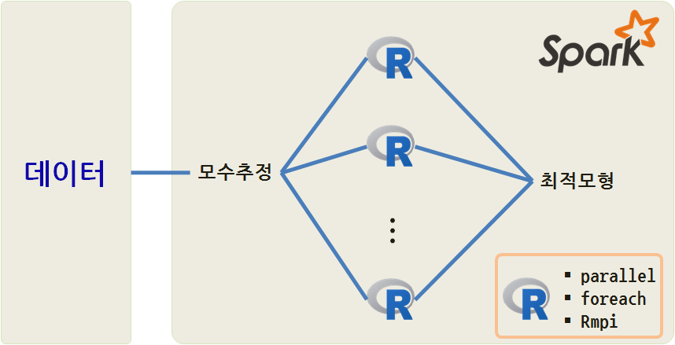
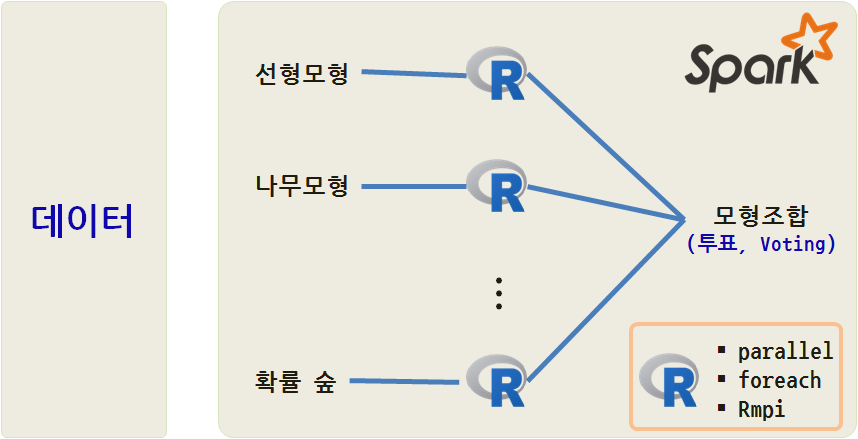

> ## 학습 목표 {.objectives}
>
> * R 스케일-아웃 전략을 통한 성능향상에 대해 살펴본다.
> * 동일 모형내 최적모형 구축과 모형결합을 통한 병렬컴퓨팅을 이해한다.
> * 병렬컴퓨팅 R 팩키지를 구분하고 이해한다.

## 1. 병렬 프로그래밍을 위한 하드웨어 환경

> ### 병렬 프로그래밍 개념과 용어 정의 {.callout}
> 
> * **암시적 병렬성(Implicit Parallelism)** : 병렬 연산처리과정이 사용자로부터 숨겨서 보이지 않음. 
예를 들어, 멀티스레드(Multi-thread BLAS)가 여기에 해당된다. 스레드란 한 메시지 처리를 완료한데 필요한 일련의 작업 혹은 프로그램 흐름을 지칭한다.
> * **명시적 병렬성(Explicit Parallelism)** : 명시적으로 작업을 수행하기 때문에 작업조합이 필요하다. `parallel` 팩키지 `mclapply()`가 여기에 해당된다.
> * **처치 곤란한 만큼 동시작업이 가능한 병렬(embarrassingly parallel) 혹은 느슨한 결합(Loosely Coupled:)** : 다소 반어법적으로 처치 곤란할 정도로 많다는 의미가 병렬처리 작업에 대입되어, 의존성이 거의 없어 임의 순서나 방법으로 처리가 가능한 작업이 여기에 해당된다.
> * **밀착결합(Tightly Coupled:)** : 느슨한 결합의 반대의 경우로 컴퓨팅 계산작업에 많은 의존성을 갖는 경우가 해당된다.

> ### 벽걸이 시간과 속도향상과 암달의 법칙 {.callout}
> 
> 병렬 프로그래밍에서 **벽걸이 시간(wallclock time)** 이 중요한데 작업시작과 작업종류를 측정한다. [암달의 법칙(Amdahl's law)](https://ko.wikipedia.org/wiki/암달의_법칙)은 암달의 저주로도 불리며, 프로그램을 100% 병렬처리가 가능하도록 만들고 프로세서를 늘리면 성능이 무한대로 가능하지만, 현실적으로 100% 병렬 프로그램을 작성할 수는 없다. 예를 들어, 95% 병렬처리가 가능하다고 가정하면, 무한대 프로세서를 사용해도 최대 20배로 **속도향상(speedup)** 이 제한된다.

## 2. 병렬 프로그래밍을 R 팩키지 툴체인

[CRAN Task View - High-Performance and Parallel Computing with R](http://cran.r-project.org/web/views/HighPerformanceComputing.html) 사이트에 가면 R에서 바라본 다양한 고성능 슈퍼컴퓨팅 관련 작업이 일목요연하게 정리되어 있다.

### 2.1. 공유 메모리 모형을 활용한 R 병렬 컴퓨팅

`parallel`은 독립적으로 서로 다른 사람들이 개발한 `snow` 와 `multicore`를 합친 것이다.
`multicore`는 **포크(fork)** 를 사용하는 반면에 `snow`는 소켓(socket)을 사용한다.
윈도우에서는 지원이 제한되는 경우가 있기 때문에, 가능하면 리눅스 계열을 운영체제를 사용한다.

#### 2.1.1. `parallel` 계열

~~~ {.r}
#-------------------------------------------------------------------------
# 1.1. multicore
#-------------------------------------------------------------------------
x <- lapply (1:10 , sqrt )
library(parallel)
x.mc <- mclapply(1:10, sqrt)
all.equal (x.mc ,x)

simplify2array(mclapply(1:10 , function(i) Sys.getpid(), mc.cores=1))

#-------------------------------------------------------------------------
# 1.2. snow
#-------------------------------------------------------------------------
# ## Set up the worker processes
cl <- makeCluster(detectCores())
cl
# socket cluster with 4 nodes on host
parSapply(cl, 1:5, sqrt)
stopCluster(cl)
~~~

|      팩키지      |      함수       |
|------------------|-----------------|
|       공통       | `detectCores()`, `splitIndices()`  |
|    `multicore`   | `mclapply()`, `mcmapply()`, `mcparallel()`, `mccollect()` |
|      `snow`      | `makeCluster()`, `stopCluster()`, `parLapply()`, `parSapply()` |

#### 2.1.2. `foreach` 계열

지금은 마이크로소프트에 인수된 Revolution Analytics에서 개발된 `foreach` 팩키지로 일종의 통합 인터페이스로 백엔드에 `doMC`, `doMPI`, `doParallel`, `doRedis`, `doRNG`, `doSNOW`를 두고 통합된 인터페이스를 제공하려고 한다.

~~~ {.r}
library(foreach)
### Example 1
foreach(i=1:3) %do% sqrt(i)
### Example 2
n <- 50
reps <- 100

x <- foreach(i=1:reps) %do% {
  sum(rnorm(n, mean=i)) / (n*reps)
}
~~~

#### 2.2. 공유메모리 분산컴퓨팅 사례 -- 제곱근

윈도우에서 `mclapply()`는 코어를 하나만 제공하기 때문에 리눅스나 맥에서 수행하다.
`mclapply`, `parSapply`, `foreach`를 사용해서 1에서 100,00까지 제곱근을 계산을 수행하고 기준정보 벤치마킹 작업을 수행한다.

~~~ {.r}
library(parallel)
library(doParallel)
library(rbenchmark)

## 환경설정
n <- 100000
ncores <- 7

cl <- makeCluster(ncores)
registerDoParallel(cl)

## 병렬처리 작업
f <- function(n) simplify2array(mclapply(1:n, sqrt, mc.cores=ncores))
g <- function(n) parSapply(cl, 1:n, sqrt)
h <- function(n, ncores)
{
  foreach(i=1:ncores, .combine=c) %dopar%
  {
    roots <- numeric(n/ncores)
    for (j in 1:(n/ncores))
      roots[j] <- sqrt(i*j)
    roots
  }
}
## 벤치마킹 정보 비교
benchmark(mclapply=f(n), parSapply=g(n), foreach=h(n, ncores),
          columns=c("test", "replications", "elapsed", "relative"))

stopCluster(cl)
~~~

작업수행결과 `foreach`가 가장 좋은 성능을 보이고 있다. 맥에서 7코어를 사용해서 작업을 수행한 것이다.

~~~ {.output}
       test replications elapsed relative
3   foreach          100   2.013    1.000
1  mclapply          100   8.394    4.170
2 parSapply          100   6.660    3.308
~~~

 
#### 2.3. 공유메모리 분산컴퓨팅 사례 -- 몬티홀 퀴즈쇼

[몬티 홀 문제](https://ko.wikipedia.org/wiki/몬티_홀_문제)는 미국의 TV 게임쇼(Let's make a deal)에서 유래한 퍼즐이다. 세 개의 문 중에 하나를 선택하여 문 뒤에 있는 선물을 가질 수 있는 게임쇼에 참가했다. 한 문 뒤에는 자동차가 있고, 나머지 두 문 뒤에는 염소가 있다. 이때 어떤 사람이 예를 들어 1번 문을 선택했을 때, 게임쇼 진행자는 3번 문을 열어 문뒤에 염소가 있음을 보여주면서 1번 대신 2번을 선택하겠냐고 물었다. 참가자가 자동차를 가지려할 때 원래 선택했던 번호를 바꾸는 것이 유리할까? 이때 진행자는 자동차와 염소가 어떤 문에 있는지 알고 있기 때문에, 진행자가 자동차가 있는 문을 여는 일은 절대 발생하지 않는다.

~~~ {.r}
lets_make_a_deal <- function()
{
  prize_door <- sample(1:3, size=1)
  first_selection <- sample(1:3, size=1)
  ### 항상 최초 선택을 바꾼다고 설정한다.
  if (prize_door == first_selection)
    return("lose")
  else
    return("win")
}

wincount <- function(winlosevec) sum(winlosevec=="win")

library(parallel)
n <- 1000000

system.time({
  winlose <- simplify2array(mclapply(1:n, lets_make_a_deal, mc.cores=7))
  print(wincount(winlose) / n)
})
~~~

백만번 모의시험을 수행했을 때, 이론적인 확률값 $\frac{2}{3}$에 수렴한다. 

~~~ {.output}
# [1] 0.666874
# 사용자  시스템 elapsed 
# 11.510   1.579   3.066 
~~~

### 3. 메시지 전달을 통한 분산 R 병렬 컴퓨팅

분산 R 병렬 컴퓨팅을 수행해야 되는 이유는 각 범용 컴퓨터 메모리가 한정되어 있기 때문이다.
만약 데이터가 메모리보다 더 커다란 경우 메시지 전달을 통한 분산 처리를 통한 방법이 남는다.

`Rmpi`가 대표적인 메시지 전달을 통한 분산병렬연산 작업을 수행한다. 
분산된 컴퓨터는 직접 다른 컴퓨터의 메모리에 접근하여 작업을 할 수 없기 때문에 네트워크를 통해
메시지를 전달해서 공동작업을 수행한다.

~~~ {.r}
library(snow)
library(Rmpi)

cl <- makeCluster(2, type="MPI")
clusterCall(cl, function() Sys.getpid())
clusterCall(cl, runif, 2)
stopCluster(cl)
mpi.quit()
~~~

### 4. R 병렬처리 두가지 접근방법

`caret`, `tm` 팩키지가 병렬컴퓨팅을 수행하는 대표적인 R 팩키지다.
서로 독립적으로 문제를 나누어서 병렬처리가 가능한 사례를 두가지 R 기계학습에서 들 수 있다.
동일한 모형내에서 최적모형을 개발할 태, 모수를 추정해야 한다. 각 변수에 대한 모수 뿐만 아니라, 능선회귀 등을 통해 정규화를 할 경우 정규화 모수 $\lambda$ 도 추정을 해서 최적모형을 찾아낸다.

스파크의 힘을 빌어 SparkR로 분산처리 모형을 개발하는 방법이 하나이고, 또다른 방식을 다양한 R 병렬컴퓨팅 팩키지를 활용하여 최적모형을 찾아내는 것도 가능하다.

두번째 병렬처리 적용이 가능한 분야는 서로 다른 모형을 추정하여 결과값을 투표로 정해 조합하는 경우로 선형모형부터, 신경망, 나무모형, 확률숲 등 다양한 모형을 데이터 적합시키고 결과를 투표로 조합해서 산출해내는 방법이 있다. 위와 마찬가지로, 스파크의 힘을 빌어 SparkR로 분산처리 모형을 개발하는 방법이 하나이고, 또다른 방식을 다양한 R 병렬컴퓨팅 팩키지를 활용하여 최적모형을 찾아내는 것도 가능하다.

