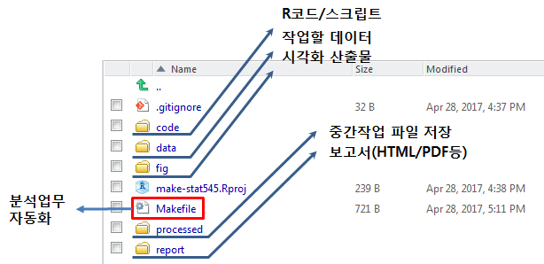

# 데이터 과학

> ## 학습 목표 {.objectives}
>
> * 데이터 분석의 전형적인 패턴을 따라 Make 자동화한다.
> * STAT545 데이터 분석 예제를 따라 자동화 과정을 실습한다.

## 1. 들어가며

데이터 분석업무를 GUI방식을 버리고 명령라인 인터페이스(CLI)로 넘어오게 되어 점점 분석의 양과 깊이가 심해지면, 프로젝트 단위 분석업무 범위를 넘어서게 된다.
이런 경우 자동화를 생각하게 되는데 잘못하면 본인이 이런 선순환이 아니라 악순환에 빠지게 되는 위험이 크다.

> ‘Automating’ comes from the roots ‘auto-‘ meaning ‘self-‘, and ‘mating’, meaning ‘screwing’.
> 
> **자동+화**의 `자동`은 본인자신을 의미하고 `화`는 일이 꼬이는 것을 의미한다. [코믹만화 원본](https://imgs.xkcd.com/comics/automation.png)을 참조한다.

## 2. 전형적인 데이터 분석업무 작업흐름

데이터 분석업무를 처음하게 되면 모든 것이 새롭지만, 몇번 데이터분석 작업을 수행하게 되면 곧 데이터 분석 작업에 반복되는 점을 발견하게 되고 자동화하는 것에 대해 
고민을 하게 된다. 전형적인 데이터 분석 업무 작업흐름은 다음과 같다.

- 데이터를 가져오기
- 데이터 전처리를 통해 깔끔한 데이터 생성
- 시각적인 그래프 생성 혹은 (예측) 모형 개발
- 보고서 작성 혹은 (예측) 모형 배포

앞선 일반적인 데이터 분석 작업흐름을 RStudio 프로젝트로 관리하면 다음과 같다.

즉, 분석할 데이터를 가져와야 하는데 데이터는 `data` 디렉토리 밑에 모두 저장된다.
데이터를 분석할 R코드는 `code` 디렉토리 밑에 저장하고,
데이터 분석에서 생성되는 중간 파일은 `processed` 디렉토리에 저장하여 나중에 모형개발 혹은 시각화를 위해 사용한다.
`fig/` 디렉토리 밑에 `.png` 그래프 산출물을 저장하고, `report/` 디렉토리에 `.Rmd` 마크다운 보고서 파일을 저장한다.

이렇게 준비된 데이터분석환경에서 파일이나 코드의 일부분이 변경될 때 모든 일을 처음부터 하는 것이 아니라, `Makefile`에 
데이터 분석 자동화 과정을 저장해 놓으면 편리하기도 하지만, **재현가능한(Reproducible)** 데이터분석 작업이 가능해진다.

## 3. STAT545 데이터 분석작업 자동화 [^stat545-make-lesson]

대부분의 *닉스(유닉스/리눅스) 시스템 특정 디렉토리 내부 파일은 단어가 많다. 
총단어숫자와 가장 흔한 단어 길이를 계산하여 통계를 내고 이를 시각화하는 그래프를 생성하는 과정을 자동화한다.

[^stat545-make-lesson]: [STAT545 - Automating Data-analysis Pipelines](http://stat545.com/automation04_make-activity.html)

### 3.1. 데이터 준비

`words.txt` 파일을 수취하는 것이 목표로 인터넷 웹주소에서 `words.txt` 데이터를 가져와서 `data/` 디렉토리 밑에 이동저장시킨다.

~~~{.r}
# 1단계 Make ----------------------------------------------------
all: words.txt

clean:
    rm -f data/words.txt

words.txt: 
    Rscript -e 'download.file("https://raw.githubusercontent.com/STAT545-UBC/make-activity/master/words.txt", destfile = "words.txt", quiet = TRUE)'
    Rscript -e 'dir.create("data", showWarnings = FALSE)'
    mv words.txt data/
~~~

### 3.2. 데이터 정제

`words.txt` 파일을 히스토그램 작업을 위해 전처리 과정을 수행한다. 이때 `histogram.r` 파일에 데이터 전처리에 대한 기능을 모두 담아 넣는다.

~~~{.r}
# histogram.r
words <- readLines("data/words.txt")
Length <- nchar(words)
hist_dat <- table(Length)
write.table(hist_dat, "processed/histogram.tsv",
						sep = "\t", row.names = FALSE, quote = FALSE)
~~~

`words.txt` 파일을 읽어와서 단어 문자수를 계산하고(`nchar`), 단어 길이별 빈도수를 `table` 함수로 계산하고 나서 `hisgram.tsv` 중간처리된 파일로 저장한다.

~~~{.r}
# 2단계 Make: Munging ----------------------------------------------------
all: processed/histogram.tsv
    
    clean:
        rm -f data/words.txt processed/histogram.tsv
    
    data/words.txt: 
        Rscript -e 'download.file("https://raw.githubusercontent.com/STAT545-UBC/make-activity/master/words.txt", destfile = "words.txt", quiet = TRUE)'
        Rscript -e 'dir.create("data", showWarnings = FALSE)'
        mv words.txt data/
        
    processed/histogram.tsv: code/histogram.r data/words.txt
    Rscript $<
~~~

### 3.3. 시각화

원데이터에 대한 정제과정이 끝났으면, 다음으로 시각화한다. 시각화하는 모듈을 별도 제작하여 앞선 히스토그램용 데이터 전처리처럼 준비해도 되고,
다음과 같이 짧은 코드이 경우 쭉 한줄로 작성해서 `make`에 넘겨도 좋다.

~~~{.r}
# 3단계 Make: Visualization ----------------------------------------------------
all: fig/histogram.png
    
    clean:
        rm -f data/words.txt processed/histogram.tsv
    
    data/words.txt: 
        Rscript -e 'download.file("https://raw.githubusercontent.com/STAT545-UBC/make-activity/master/words.txt", destfile = "words.txt", quiet = TRUE)'
        Rscript -e 'dir.create("data", showWarnings = FALSE)'
        mv words.txt data/
        
    processed/histogram.tsv: code/histogram.r data/words.txt
        Rscript $<
        
    fig/histogram.png: processed/histogram.tsv
        Rscript -e 'library(ggplot2); qplot(Length, Freq, data=read.delim("$<")); ggsave("$@")'
        rm Rplot.pdf
~~~

### 3.4. 보고서 작성

`.Rmd` 마크다운 파일에 분석결과에 대한 주석을 달아 보고서로 작성한다.

~~~{.r}
# 4단계 Make: Report ----------------------------------------------------
all: report/report.html
        
    clean:
        rm -f data/words.txt processed/histogram.tsv report/report.html
    
    data/words.txt: 
        Rscript -e 'download.file("https://raw.githubusercontent.com/STAT545-UBC/make-activity/master/words.txt", destfile = "words.txt", quiet = TRUE)'
    	Rscript -e 'dir.create("data", showWarnings = FALSE)'
    	mv words.txt data/
        
    processed/histogram.tsv: code/histogram.r data/words.txt
    	Rscript $<
        
    fig/histogram.png: processed/histogram.tsv data/words.txt
    	Rscript -e 'library(ggplot2); qplot(Length, Freq, data=read.delim("$<")); ggsave("$@")'
    	rm Rplots.pdf
    
    report/report.html: report/report.rmd fig/histogram.png processed/histogram.tsv data/words.txt
    	Rscript -e 'rmarkdown::render("$<")'                
~~~

### 3.5. 보고서 작성

`.PHONY:` 설정을 하고, `.DELETE_ON_ERROR:` 잡스러운 파일이 중간에 생성되는 것을 방지하고, `.SECONDARY:` 을 지정하여
`.Rmd` 파일이 `.md` 파일을 거쳐 `.html` 파일로 넘어갈 때 중간에 삭제되는 것을 방지하는 마지막 설정을 한다.

~~~{.r}
# 5단계 Make: Final ----------------------------------------------------
all: report/report.html

.PHONY: all clean
.DELETE_ON_ERROR:
.SECONDARY:
    
    clean:
        rm -f data/words.txt processed/histogram.tsv report/report.html
    
    data/words.txt: 
        Rscript -e 'download.file("https://raw.githubusercontent.com/STAT545-UBC/make-activity/master/words.txt", destfile = "words.txt", quiet = TRUE)'
    	Rscript -e 'dir.create("data", showWarnings = FALSE)'
    	mv words.txt data/
        
    processed/histogram.tsv: code/histogram.r data/words.txt
    	Rscript $<
        
    fig/histogram.png: processed/histogram.tsv data/words.txt
    	Rscript -e 'library(ggplot2); qplot(Length, Freq, data=read.delim("$<")); ggsave("$@")'
    	rm Rplots.pdf
    
    report/report.html: report/report.rmd fig/histogram.png processed/histogram.tsv data/words.txt
    	Rscript -e 'rmarkdown::render("$<")'                    
~~~

## 4. 보고서 생성 자동화

### 4.1. 작업 정리

`make clean` 명령어를 통해 작업환경을 깔끔하게 정리한다.

~~~{.r}
make-stat545 $ make clean
rm -f data/words.txt processed/histogram.tsv report/report.html
~~~

### 4.2. 보고서 작업 자동화

`make all` 명령어를 실행하면 최종 보고서 `report.html` 파일을 생성시키기 위한 모든 중간과정을 자동으로 실행하여 
중간 처리파일, 그래프, 보고서를 순차적으로 생성시키게 된다.

~~~{.r}
make-stat545 $ make all
Rscript -e 'download.file("https://raw.githubusercontent.com/STAT545-UBC/make-activity/master/words.txt", destfile = "words.txt", quiet = TRUE)'
Rscript -e 'dir.create("data", showWarnings = FALSE)'
mv words.txt data/
    Rscript code/histogram.r
Rscript -e 'library(ggplot2); qplot(Length, Freq, data=read.delim("processed/histogram.tsv")); ggsave("fig/histogram.png")'
Saving 7 x 7 in image
rm Rplots.pdf
Rscript -e 'rmarkdown::render("report/report.rmd")'	

processing file: report.rmd
|......................                                           |  33%
inline R code fragments

|...........................................                      |  67%
label: load-hist-dat (with options) 
List of 1
$ include: logi FALSE

|.................................................................| 100%
inline R code fragments

output file: report.knit.md

/usr/local/bin/pandoc +RTS -K512m -RTS report.utf8.md --to html --from markdown+autolink_bare_uris+ascii_identifiers+tex_math_single_backslash --output report.html --smart --email-obfuscation none --self-contained --standalone --section-divs --template /Library/Frameworks/R.framework/Versions/3.3/Resources/library/rmarkdown/rmd/h/default.html --no-highlight --variable highlightjs=1 --variable 'theme:bootstrap' --include-in-header /var/folders/g3/97168ry52ll6zfyl6ykyk3br0000gn/T//Rtmp8F2Cc4/rmarkdown-str99ca8af49d.html --mathjax --variable 'mathjax-url:https://cdn.mathjax.org/mathjax/latest/MathJax.js?config=TeX-AMS-MML_HTMLorMML' 

Output created: report.html
~~~
