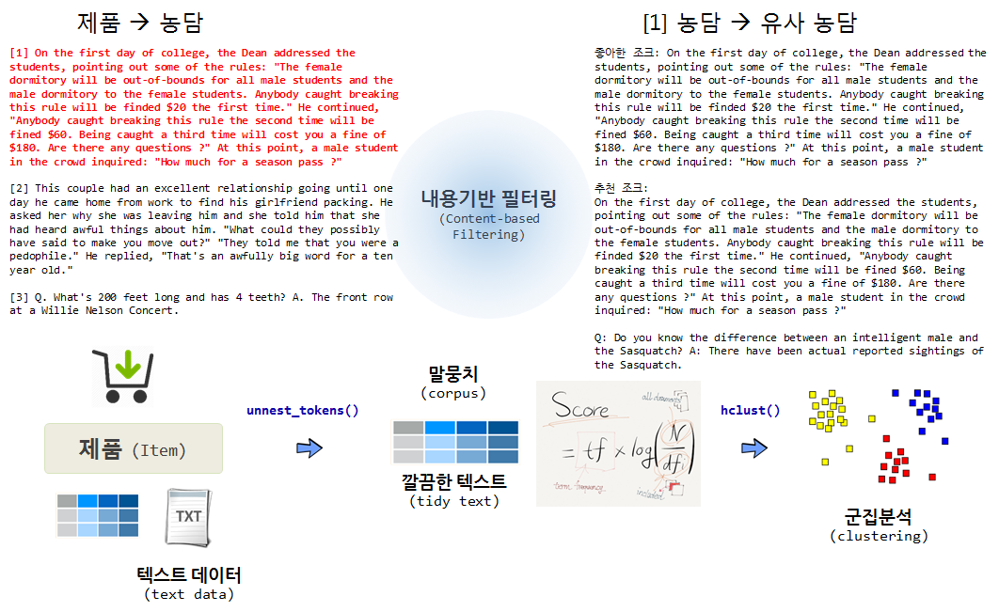

 
``` {r, include=FALSE}
source("tools/chunk-options.R")
knitr::opts_chunk$set(echo = TRUE, warning=FALSE, message=FALSE, fig.width=12)

library(recommenderlab)
library(tidyverse)
library(stringr)
library(tidytext)
library(SnowballC)
library(tm)
library(dbscan)
library(proxy)
library(extrafont)
loadfonts()
par(family = "NanumGothic")

```



## 1. 내용기반 필터링(Content-based Filtering) {#content-based-filtering}

제품에는 제품의 특성을 기술하는 다양한 정보가 포함되어 있는데, 대표적으로 영화 줄거리가 영화에 대부분 포함되어 있다.
그 외에도 영화 쟝르, 주연배우, 제작사, 제작비 등이 포함된다. 이러한 특성을 바탕으로 유사한 제품을 묶어 추천하는 것이 유사할 수 있다.

이번에는 제품을 농담(Joke)으로 상정하고 특정 농담과 유사한 농담을 추천하는 시스템을 개발해 보자.

## 2. 농담 추천 시스템 {#joke-recommendation} [^joke-recommendation]

[^joke-recommendation]: [Recommender Systems: Simple Content-based Recommender Using Text Mining](http://michael.hahsler.net/other_courses/ICMA_Recommendation_Tools/code/content-based.html)


### 2.1. 농담 데이터 {#jester-dataset}

`recommenderlab` 팩키지에 추천시스템 개발에 사용될 수 있는 좋은 데이터가 다수 포함되어 있다.
`Jester5k` 데이터셋은 1999년부터 2003년 사이 수집된 Jester 온라인 농담 추천시스템에서 5,000 유저가 평점을 내린 데이터가 포함되어 있다.

``` {r joke-data}
# 0. 환경설정 ------------------------------
# library(recommenderlab)
# library(tidyverse)
# library(stringr)
# library(tidytext)
# library(SnowballC)
# library(tm)
# library(dbscan)
# library(proxy)
# library(extrafont)
# loadfonts()
# par(family = "NanumGothic")

# 1. 농담 데이터 ------------------------------

data("Jester5k")

JesterJokes_df <- as.data.frame(JesterJokes)
DT::datatable(JesterJokes_df)
```

### 2.2. 텍스트 데이터 전처리 {#text-mining}

전통적으로 `tm` 팩키지를 활용하여 텍스트 데이터를 말뭉치(Corpus)로 변환시키고 이를 
문서단어행렬(Document Term Matrix)로 변환하고, 다시 tf-idf 로 
변환시켜 텍스트를 
분석할 수 있는 적절한 형태로 가공시킨다. 이를 `clean_joke` 함수로 구성하면 다음과 같다.

``` {r joke-text-mining}
# 2. 농담 데이터 전처리------------------------
# 농담 텍스트 --> 문서단어행렬 --> tf-idf
clean_joke <- function(jokes) {
    source <- VectorSource(jokes)
    corp <- VCorpus(source)
    
    corp <- tm_map(corp, content_transformer(tolower))
    corp <- tm_map(corp, removeWords, stopwords("english"))
    corp <- tm_map(corp, removeNumbers)
    corp <- tm_map(corp, removePunctuation)
    corp <- tm_map(corp, stemDocument)
    corp <- tm_map(corp, stripWhitespace)
    
    dtm <- DocumentTermMatrix(corp)
    tfidf <- weightTfIdf(dtm, normalize = TRUE)
    return(tfidf)
}

joke_tfidf <- clean_joke(JesterJokes)

inspect(joke_tfidf[1:10, 1:8])
```

## 3. 군집분석을 추천 시스템 핵심 엔진으로 구축  {#recommendation-engine}

`tf-idf` 형태 텍스트 데이터로 가공시키면 군집분석을 활용하여 추천시스템을 개발하는 과정은 
다양한 알고리즘을 적용하여 적절한 추천시스템을 개발하는 단계로 넘어가게 된다.

### 3.1. 계층 군집분석 

코사인을 거리로 정의하고 이를 바탕으로 계층 군집분석을 시작한다. 
그리고, 군집화하는 데이터가 크지 않아 시각화가 가능하다. 
이를 바탕으로 `recommend_jokes` 함수를 만들어 추천시스템을 개발한다.

``` {r joke-hierarchical-clustering}
# 3. 군집분석------------------------
## 3.1. 계층 군집분석 ---------------
joke_dist <- dist(as.matrix(joke_tfidf), method = "cosine")
joke_hc <- hclust(joke_dist)

## 3.2. 계층 군집분석 시각화 --------
# 군집결정
joke_cluster <- cutree(joke_hc, h = 0.95)

# 결정된 군집 시각화
plot(joke_hc, main="농담 군집분석")
abline(h=0.95, col="blue")
rect.hclust(joke_hc, h = 0.95, border = "red")
# 관심있는 첫번째 군집
rect.hclust(joke_hc, h = 0.95,  which=3, border = "green")

## 3.3. 계층 군집분석 추천 --------
recommend_jokes <- function(joke_number) {
    cat("좋아한 조크: ", JesterJokes[joke_number], "\n\n")
    cat("추천 조크: ", JesterJokes[joke_cluster==joke_cluster[joke_number]], sep = "\n\n")
}

recommend_jokes(72)
```

### 3.2. kNN 군집분석 

동일한 방법으로 인접한 농담을 5개 찾아 추천하는 알고리즘을 구현하면 다음과 같다.

``` {r joke-knn-clustering}
## 3.2. k-근접이웃 추천 ---------------

joke_nn <- kNN(joke_dist, 5)

recommend_knn_jokes <- function(joke_number) {
    cat("좋아한 조크: ", JesterJokes[joke_number], "\n\n")
    cat("추천 조크: ", JesterJokes[joke_nn$id[joke_number,]], sep = "\n\n")
}

recommend_knn_jokes(72)
```


