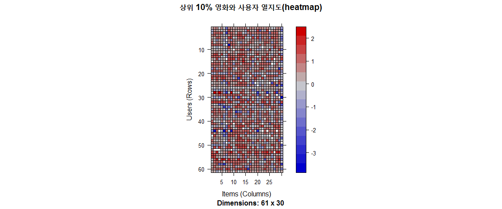

# xwMOOC 데이터 과학
xwMOOC  
`r Sys.Date()`  
 

## 1. 영화 데이터 탐색적 분석 [^recommenderlab-evaluation] {#movielens-eda}

[^recommenderlab-evaluation]: [Recommender Systems: Evaluation](http://michael.hahsler.net/other_courses/ICMA_Recommendation_Tools/code/evaluation.html)

평점데이터를 불러오고 최소 영화제목이라도 확인해야 되니 영화데이터를 불러온다.
데이터프레임을 행렬로 다시 희소행렬로 변환시킨다. 하지만, 탐색적 데이터 분석을 위해서는 
아무래도 데이터프레임이 편리하다.

~~~{.r}
# 0. 환경설정 ------------------------------
# library(recommenderlab) # devtools::install_github("mhahsler/recommenderlab")
# library(tidyverse)
# library(stringr)
# library(purrr)
# library(ggthemes)
# library(extrafont)

# 1. 데이터 가져오기 -----------------------
rating_df <- read_csv("data/ratings.csv")
rating_df <- rating_df %>% select(-timestamp) %>% 
    mutate(userId = str_c("u", userId),
           movieId = str_c("m", movieId))

movie_df <- read_csv("data/movies.csv") %>% 
    mutate(movieId = str_c("m", movieId))

# 2. 데이터 전처리 -------------------------
# 데이터프레임 -> 행렬 -> 희소행렬(realRatingMatrix)

rating_mat <- spread(rating_df, movieId, rating) %>% 
    remove_rownames() %>% 
    column_to_rownames(var="userId")

rating_rrm <- as(as(rating_mat, "matrix"), "realRatingMatrix")
~~~

### 1.1. 평점 분포 {#eda-rating-distribution}

결측점은 없어, 시각화를 통해 영화 전체 평점 분포를 살펴본다.

~~~{.r}
# 3. 탐색적 데이터 분석 -------------------
## 3.1. 평점 전체적 분포 ------------------
rating_df %>% dplyr::count(rating) %>% 
    ggplot(data=., aes(x=as.factor(rating), y=n)) +
    geom_bar(stat="identity") +
    theme_bw(base_family = "NanumGothic") +
    labs(x="평점", y="평점빈도수") +
    scale_y_continuous(labels = scales::comma)
~~~

### 1.2. 가장 평점이 많이 붙은 영화 {#movielens-rating-frequency} 

가장 평점이 많이 붙은 영화 30개를 뽑아낸다. 만약 안 본 영화가 있다면 이번 기회를 통해 꼭 관람하자.

~~~{.r}
## 3.2. 가장 평점이 많이 붙은 영화 ------------------
rating_df %>% dplyr::count(movieId, sort=TRUE) %>% 
    left_join(movie_df) %>% 
    top_n(30, n) %>% 
    DT::datatable()
~~~

<!--html_preserve-->

<!--/html_preserve-->

### 1.3. 상위 30개 영화 중 평점이 높은 영화는? {#movielens-high-rating-with-freq}

상위 30개 영화를 뽑았는데 과연 어떤 순서로 보는 것이 좋을까? 아마도 평점이 높은 순으로 영화를 보는 것이 좋을 듯 싶다.

~~~{.r}
## 3.2. 상위 30개 영화 중 평점이 높은 순 ------------
movie_top30_df <- rating_df %>% dplyr::count(movieId, sort=TRUE) %>% 
    left_join(movie_df) %>% 
    top_n(30, n)

rating_df %>% group_by(movieId) %>% 
    summarise(rating_avg = mean(rating)) %>% 
    right_join(movie_top30_df) %>% 
    arrange(desc(rating_avg)) %>% 
    DT::datatable()
~~~

<!--html_preserve-->

<!--/html_preserve-->

## 2. 추천시스템 개발을 위한 데이터 전처리 {#movielens-preprocessing}

결측값을 잘 정리하는 것과 함께 추천시스템 개발을 위해서 평점이 들어있는 행렬이 희소하기 때문에 ,
협업 필터링 추천모형에 적용될 데이터를 생성시키기 위해 관련성 높은 데이터만 추려낼 필요가 있다.
이를 위해 적어도 영화당 100명 이상 본 영화, 영화당 최소 200명이상 평점을 받은 영화를 기준으로 추천모형 개발에 준비할 데이터로 한정시킨다.
추천 행렬 크기가 상당히 줄어든 것을 확인할 수 있다. 

~~~{.r}
# 4. 데이터 전처리 -------------------
## 4.1. 데이터 크기 비교
rating_rrm <- rating_rrm[rowCounts(rating_rrm) > 100,
                         colCounts(rating_rrm) > 200]

# 데이터 크기 비교
print(object.size(rating_mat), units = "auto")
~~~

~~~{.output}
16.7 Mb

~~~

~~~{.r}
print(object.size(rating_rrm), units = "auto")     
~~~

~~~{.output}
1.1 Mb

~~~

### 2.1. 데이터 정규화 {#movielens-normalization}

상위 10%만 뽑아서 `image` 함수로 시각화를 하고 `normalize` 함수를 통해 정규화를 통해 시각적으로 특정한 패턴을 발견할 수 있는지 살펴본다.

~~~{.r}
# 5. 상위 유저 분석 -------------------
# 상위 10 %만 탐색적 분석
min_movies <- quantile(rowCounts(rating_rrm), 0.90)
min_users <- quantile(colCounts(rating_rrm), 0.90)

# 정규화
rating_rrm_norm <- normalize(rating_rrm)

# 시각화
image(rating_rrm_norm[rowCounts(rating_rrm_norm) > min_movies,
                      colCounts(rating_rrm_norm) > min_users], main = "상위 10% 영화와 사용자 열지도(heatmap)")
~~~

## 3. 영화 무비렌즈 추천모형 개발 {#movielens-recomm}

### 3.1. RMSE 기준 영화 추천 {#movielens-rmse}

RANDOM 모형이 예측모형 평가를 위한 기본이 되고 이를 바탕으로 `POPULAR`, `IBCF`, `UBCF`, `SVD` 추천 모형을 개발하고 나서,
"RMSE", "MSE", "MAE" 3가지 측도를 바탕으로 가장 오차가 작은 모형을 선택한다.

~~~{.r}
# 6. 추천모형 -------------------------
## 6.1. 모형평가 설정
rating_eval_scheme <- evaluationScheme(rating_rrm, method="cross-validation",
                                       k=3, given=3, goodRating=4)

## 6.2. 다수 모형 비교 평가
rcmm_algorithms <- list(
    RANDOM = list(name = "RANDOM", param = NULL),
    POPULAR = list(name = "POPULAR", param = NULL),
    IBCF = list(name = "IBCF", param = NULL),
    UBCF = list(name = "UBCF", param = NULL),
    SVD = list(name = "SVD", param = NULL)
)

rcmm_eval <- evaluate(rating_eval_scheme, rcmm_algorithms, type="ratings")
~~~

~~~{.output}
RANDOM run fold/sample [model time/prediction time]
	 1  [0sec/0.1sec] 
	 2  [0.02sec/0.03sec] 
	 3  [0sec/0.05sec] 
POPULAR run fold/sample [model time/prediction time]
	 1  [0.02sec/0.02sec] 
	 2  [0.05sec/0.01sec] 
	 3  [0sec/0.19sec] 
IBCF run fold/sample [model time/prediction time]
	 1  [0.31sec/0.21sec] 
	 2  [0.46sec/0.04sec] 
	 3  [0.32sec/0.02sec] 
UBCF run fold/sample [model time/prediction time]
	 1  [0.01sec/0.25sec] 
	 2  [0.01sec/0.25sec] 
	 3  [0.01sec/0.23sec] 
SVD run fold/sample [model time/prediction time]
	 1  [0.03sec/0.03sec] 
	 2  [0.36sec/0.03sec] 
	 3  [0.04sec/0.01sec] 

~~~

~~~{.r}
rcmm_eval_df <- map_df(avg(rcmm_eval), rbind)
rcmm_eval_df <- t(rcmm_eval_df) 
colnames(rcmm_eval_df) <- c("RMSE", "MSE", "MAE")    

DT::datatable(rcmm_eval_df)
~~~

<!--html_preserve-->

<!--/html_preserve-->

앞선 추천모형중 "POPULAR" 예측모형이 가장 성능이 좋게 나와 이를 바탕으로 영화를 추천한다.
이를 바탕으로 첫번째 유저에 대해서 영화를 추천한다.

~~~{.r}
## 6.3. 모형을 통한 추천

rcmm_model <- Recommender(rating_rrm, method = "POPULAR", 
                          param=list(normalize = "center", method="Cosine"))
~~~

~~~{.output}
Available parameter (with default values):
normalize	 =  center
aggregationRatings	 =  function (x, na.rm = FALSE, dims = 1, ...)  standardGeneric("colMeans")
aggregationPopularity	 =  function (x, na.rm = FALSE, dims = 1, ...)  standardGeneric("colSums")
verbose	 =  FALSE

~~~

~~~{.r}
best_prediction <- predict(rcmm_model, newdata = rating_rrm, n = 3)

recc_matrix <- sapply(best_prediction@items, function(x){
    colnames(rating_rrm)[x]
})

recc_matrix[,1] %>% as_data_frame() %>% 
    rename(movieId=value) %>% left_join(movie_df) %>% 
    DT::datatable()
~~~

<!--html_preserve-->

<!--/html_preserve-->

### 3.2. 상위 N개 영화 기준 {#movielens-topn}

RMSE도 훌륭한 측도지만 결국 추천하는 상위 1, 3, 5, 10개 추천한 영화중에 포함되었는지를 
측도로 활용하는 것이 추천시스템 개발에 좀더 현실적일 수 있다.
위와 동일하기 때문에 사용자별 영화 추천은 생략한다.

~~~{.r}
# 7. 상위 N개 추천 -------------------------
## 7.1. 모형평가 설정
rating_eval_scheme <- evaluationScheme(rating_rrm, method="cross-validation",
                                       k=3, given=10, goodRating=5)

## 7.2. 다수 모형 비교 평가
rcmm_algorithms <- list(
    UBCF_cos = list(name = "UBCF", param = list(method ="cosine")),
    UBCF_cor = list(name = "UBCF", param = list(method ="pearson")),
    RANDOM = list(name = "RANDOM", param = NULL),
    POPULAR = list(name = "POPULAR", param = NULL),
    SVD = list(name = "SVD", param = NULL)
)

rcmm_topN_eval <- evaluate(rating_eval_scheme, rcmm_algorithms, type="topNList", n=c(1, 3, 5, 10))
~~~

~~~{.output}
UBCF run fold/sample [model time/prediction time]
	 1  [0sec/0.34sec] 
	 2  [0sec/0.37sec] 
	 3  [0sec/0.33sec] 
UBCF run fold/sample [model time/prediction time]
	 1  [0.01sec/0.33sec] 
	 2  [0sec/0.31sec] 
	 3  [0.01sec/0.31sec] 
RANDOM run fold/sample [model time/prediction time]
	 1  [0sec/0.11sec] 
	 2  [0sec/0.09sec] 
	 3  [0sec/0.09sec] 
POPULAR run fold/sample [model time/prediction time]
	 1  [0.02sec/0.31sec] 
	 2  [0sec/0.31sec] 
	 3  [0sec/0.33sec] 
SVD run fold/sample [model time/prediction time]
	 1  [0.03sec/0.09sec] 
	 2  [0.02sec/0.09sec] 
	 3  [0.03sec/0.1sec] 

~~~

~~~{.r}
avg(rcmm_topN_eval)
~~~

~~~{.output}
$UBCF_cos
         TP        FP       FN       TN precision     recall        TPR
1  0.273752 0.7246377 17.70209 289.2995 0.2741898 0.01858732 0.01858732
3  0.805153 2.1900161 17.17069 287.8341 0.2688012 0.05858682 0.05858682
5  1.202899 3.7890499 16.77295 286.2351 0.2409659 0.08947205 0.08947205
10 2.162641 7.8212560 15.81320 282.2029 0.2166049 0.15588011 0.15588011
           FPR
1  0.002469323
3  0.007465528
5  0.012936170
10 0.026727307

$UBCF_cor
          TP        FP       FN       TN precision     recall        TPR
1  0.2673108 0.7310789 17.70853 289.2931 0.2677173 0.02353220 0.02353220
3  0.6876006 2.3075684 17.28824 287.7166 0.2295285 0.05013479 0.05013479
5  1.0821256 3.9098229 16.89372 286.1143 0.2167456 0.07845631 0.07845631
10 1.8824477 8.1014493 16.09340 281.9227 0.1885348 0.12945848 0.12945848
           FPR
1  0.002493965
3  0.007876633
5  0.013361794
10 0.027734637

$RANDOM
          TP        FP       FN       TN  precision      recall
1  0.0821256 0.9178744 17.89372 289.1063 0.08212560 0.003478365
3  0.2190016 2.7809984 17.75684 287.2432 0.07300054 0.009373720
5  0.3574879 4.6425121 17.61836 285.3816 0.07149758 0.017047464
10 0.6409018 9.3590982 17.33494 280.6651 0.06409018 0.032435325
           TPR         FPR
1  0.003478365 0.003155617
3  0.009373720 0.009573355
5  0.017047464 0.015974041
10 0.032435325 0.032240001

$POPULAR
          TP        FP       FN       TN precision     recall        TPR
1  0.2898551 0.7101449 17.68599 289.3140 0.2898551 0.02572048 0.02572048
3  0.8454106 2.1545894 17.13043 287.8696 0.2818035 0.06721057 0.06721057
5  1.3365539 3.6634461 16.63929 286.3607 0.2673108 0.10071493 0.10071493
10 2.3558776 7.6441224 15.61997 282.3800 0.2355878 0.17371748 0.17371748
          FPR
1  0.00241720
3  0.00732778
5  0.01247075
10 0.02608547

$SVD
          TP        FP       FN       TN precision     recall        TPR
1  0.2431562 0.7568438 17.73269 289.2673 0.2431562 0.01860029 0.01860029
3  0.6038647 2.3961353 17.37198 287.6280 0.2012882 0.04427703 0.04427703
5  0.8953301 4.1046699 17.08052 285.9195 0.1790660 0.06696335 0.06696335
10 1.5314010 8.4685990 16.44444 281.5556 0.1531401 0.10589833 0.10589833
           FPR
1  0.002582907
3  0.008205864
5  0.014068077
10 0.029029477

~~~

~~~{.r}
plot(rcmm_topN_eval, annotate = TRUE, avg=FALSE)
~~~

