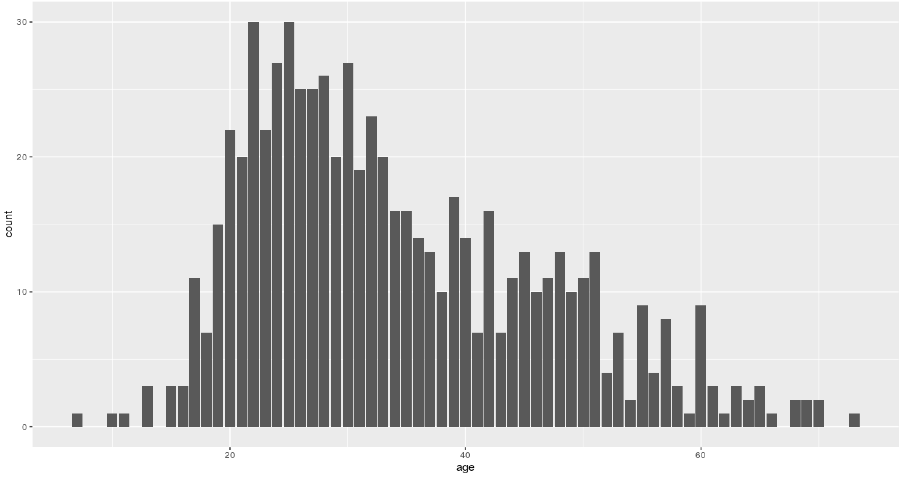

 

``` {r, include=FALSE}
# source("tools/chunk-options.R")

knitr::opts_chunk$set(echo = TRUE, warning=FALSE, message=FALSE,
                    comment="", digits = 3, tidy = FALSE, prompt = TRUE, fig.align = 'center')

library(here)

options(scipen=999)
```


# `MovieLens` 데이터 [^movielens-data] {#movielens-dataset}

[^movielens-data]: ["How to Build A Recommender System In Less Than 1 Hour"](http://blog.avenuecode.com/how-to-build-a-recommender-system-in-less-than-1-hour)

[MovieLens 1M Dataset](https://grouplens.org/datasets/movielens/1m/) 데이터를 다운로드 받아 이를 정제하는 것부터 시작한다.


### 2. `MovieLens` 데이터 정제 [^movielens-clean]

[^movielens-clean]: [Exploratory analysis of Movie preference data set](https://github.com/statkclee/STAT545A_MovieStats/blob/master/cleanMovieLensData.R)

1. 평점, 사용자, 영화 장르, 영화 아이템 파일을 순차로 R 데이터프레임으로 불러와서 데이터를 정제한다.
1. 평점 데이터프레임을 중심으로 `left_join` 연산으로 결합해 나간다.
1. 꼭 필요한 변수만 남기고 아스키 파일로 내보낸다.

~~~ {.r}
##===========================================================================
## 01. 환경설정 및 데이터 가져오기
##===========================================================================

setwd("~/06-sparkR")

library(dplyr)
library(readr)
library(plyr)

# 평점 데이터
u.df <- read_delim(file="ml-100k/u.data", delim = "|", col_names = FALSE)
colnames(u.df) <- c("user_id", "item_id", "rating", "timestamp")
u.df <- subset(u.df, select = -c(timestamp) )

## 사용자 테이블
user.df <- read_delim(file="ml-100k/u.user", delim = "|", col_names = FALSE)
colnames(user.df) <- c("user_id", "age" , "gender","occupation", "zip_code")
user.df <- subset(user.df, select = -c(zip_code) )

## 영화 쟝르 테이블
genre.df <- read_delim(file="ml-100k/u.genre", delim = "|", col_names = FALSE)
colnames(genre.df) <- c("genre", "code")

## 영화 아이템 테이블
item.df <- read_delim(file="ml-100k/u.item", delim = "|", col_names = FALSE)

genre.v <- as.vector(genre.df[["genre"]])
genre.v[genre.v %in% "Children\'s"] <- "Childrens"
colnames(item.df) <- c(c("item_id", "movie_title", "release_date", "video_release_date", 
                         "IMDb_URL"), genre.v)

item.df <- subset(item.df, select = -c(IMDb_URL, video_release_date) )

##===========================================================================
## 02. 데이터프레임 결합
##===========================================================================
# 평점 + 영화(아이템) 합체
cf.df <- left_join(u.df, item.df, by="item_id")

# 평점 + 영화(아이템) + 사용자 합체
cf.df <- left_join(cf.df, user.df, by="user_id")

# 중복제거
cf.df <- unique(cf.df)

## 장르 칼럼을 한 칼럼으로 변환하는 함수... 시간이 오래걸림
createGenreFieldSingle <- function(x){
  #temporarally remove variables to make looping easier,
  tempDat <- subset(x, select = -c(user_id, rating, movie_title, 
                                   release_date, age, gender, occupation))  
  count <- 0
  genre <- "unknown"
  
  if(nrow(x) > 1){
    tempDat <- head(tempDat, n = 1)
  }
  
  for (i in names(tempDat)){
    if(tempDat[i] == 1){
      count <- count + 1
      genre <- i
    }
  }
  if(count > 1){
    genre <- "multiple"
  }
  names(genre) <- "genre"
  return(genre)
}

genreDat <- ddply(cf.df, ~user_id + movie_title, createGenreFieldSingle)
cf.df.genre <- left_join(cf.df, genreDat, by=c("user_id", "movie_title"))

##===========================================================================
## 03. 데이터 정리 및 내보내기
##===========================================================================
cf.df.cl <- subset(cf.df.genre, select = 
                             c(user_id, item_id, movie_title, rating, genre,
                               release_date, age, gender, occupation) )

write.csv(cf.df.cl, "movie-clean.csv", row.names = FALSE)
~~~


### 3. `MovieLens` 데이터 SparkR 맛보기

`MovieLens` 데이터 일부를 불러와서 우분투에 설치한 SparkR이 정상 동작하는지 간을 보자.

SparkR 환경설정을 하고 `library(SparkR)` 라이브러리를 불러온다. 
`sqlContext`를 생성하고 데이터를 불러온다.
`cache` 함수를 이용해서 캐쉬기능을 사용하고, `registerTempTable` 기능을 활용하여 SQL 작업을 준비한다.
이제 `collect` 등 SparkR 기능을 활용하여 탐색적 데이터 분석 및 모형을 개발한다.


~~~ {.r}
##================================================================================
## 00. SparkR 환경설정
##================================================================================

Sys.setenv(SPARK_HOME = "/home/parallels/spark-1.6.1-bin-hadoop2.6/")
Sys.setenv(SPARKR_SUBMIT_ARGS="--packages com.databricks:spark-csv_2.11:1.4.0 sparkr-shell")
.libPaths(c(file.path(Sys.getenv("SPARK_HOME"), "R","lib"),  .libPaths()))

## SparkR 라이브러리를 적재한다.
library(SparkR)

##================================================================================
## 01. SparkR 초기화
##================================================================================

sc <- sparkR.init()
sqlContext <- sparkRSQL.init(sc)

##================================================================================
## 02. 데이터 불러오기
##================================================================================

user_dat <- read.table("ml-100k/u.user", sep="|")
user_df <- createDataFrame(sqlContext, user_dat)
names(user_df)<-c("id","age","gender","occupation","ZIPcode")
head(user_df)

cache(user_df)
nrow(user_df)

registerTempTable(user_df, "userTable")

##================================================================================
## 03. sql 테이블 작업데이터 준비
##================================================================================

male.user <- sql(sqlContext, "select * from userTable where gender ='M'")
head(male.user)

##================================================================================
## 04. 기초 통계작업과 시각화
##================================================================================

male.user.ages <- collect(summarize(groupBy(male.user, male.user$age), count = n(male.user$age)))
head(male.user.ages)

library(ggplot2)
ggplot(male.user.ages, aes(x=age,y=count)) + geom_bar(stat="identity")
~~~

~~~ {.output}
  age count
1  31    19
2  32    23
3  33    20
4  34    16
5  35    16
6  36    14
~~~



### 4. `MovieLens` 데이터 SparkR 추천 모형 개발

동일한 작업 흐름을 따라가지만, 차이가 가는 것은 `spark-csv` `jar` 모듈에서 만들어진 
스파크 데이터프레임이 `recommenderlab` 라이브러리에서 사용하는 `realRatingMatrix` 자료형과 일치시키는 부분이 남아있는 쟁점이다.

~~~ {.r}
##====================================================================================
## 01. 추천시스템: 환경설정
##====================================================================================
if(!"recommenderlab" %in% rownames(installed.packages())){
  install.packages("recommenderlab")}

library(recommenderlab)

##================================================================================
## 02. SparkR 환경설정
##================================================================================

Sys.setenv(SPARK_HOME = "/home/parallels/spark-1.6.1-bin-hadoop2.6/")
Sys.setenv(SPARKR_SUBMIT_ARGS="--packages com.databricks:spark-csv_2.11:1.4.0 sparkr-shell")
.libPaths(c(file.path(Sys.getenv("SPARK_HOME"), "R","lib"),  .libPaths()))

## SparkR 라이브러리를 적재한다.
library(SparkR)
library(magrittr)
##================================================================================
## 03. SparkR 초기화
##================================================================================

sc <- sparkR.init()
sqlContext <- sparkRSQL.init(sc)

##====================================================================================
## 04. 무비렌즈 데이터
##====================================================================================

# ml.df <- read.df(sqlContext, "./movie-clean.csv", "com.databricks.spark.csv", header="true", inferSchema = "true")
ml.df <- read.csv("movie-clean.csv", header=TRUE)
ml.cf.df <- ml.df[,c("user_id", "movie_title", "rating")]
ml.cf.mat <- as(ml.cf.df, "realRatingMatrix")

ml.cf.mat

##====================================================================================
## 05. Data Preprocessing
##====================================================================================
ratings_movies <- ml.cf.mat[rowCounts(ml.cf.mat) > 50,
                             colCounts(ml.cf.mat) > 100]
ratings_movies

recc_model <- Recommender(data = ratings_movies, method = "UBCF",
                          parameter = list(method = "pearson", nn=15))

n_recommended <- 5

recc_predicted <- predict(object = recc_model, newdata = ratings_movies, n = n_recommended)

recc_user_7 <- recc_predicted@items[[7]]
movies_user_7 <- recc_predicted@itemLabels[recc_user_7]
movies_user_7
~~~