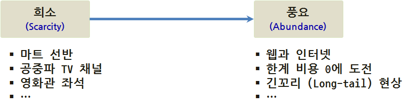
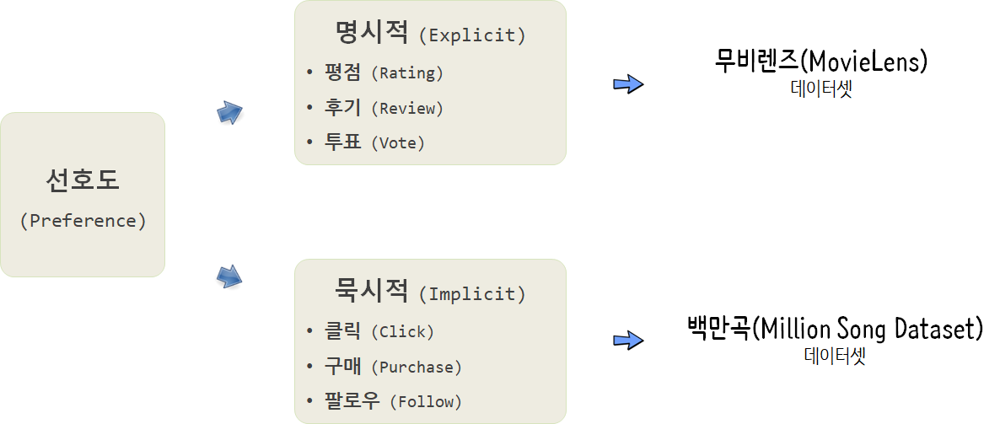
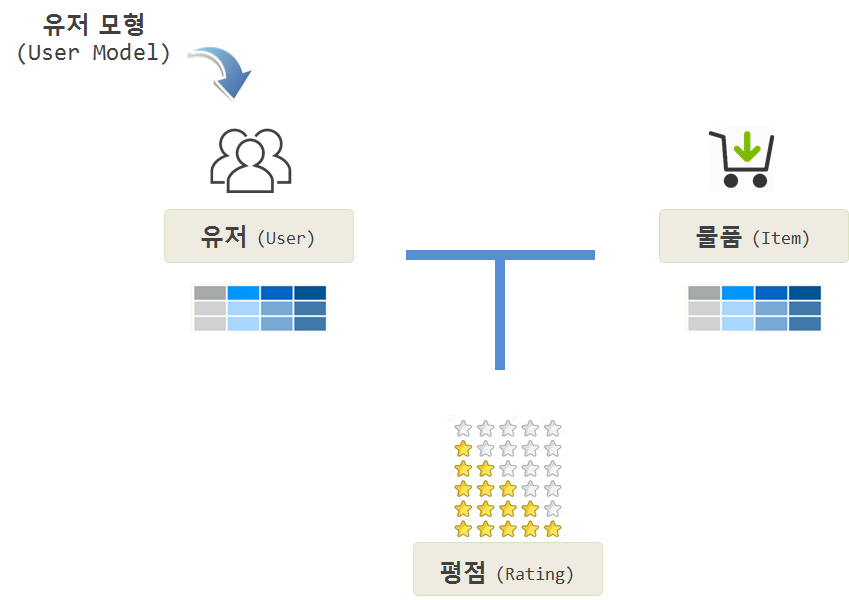

 
``` {r, include=FALSE}
source("tools/chunk-options.R")
knitr::opts_chunk$set(echo = TRUE, warning=FALSE, message=FALSE, fig.width=12)

```


## 1. 추천 시스템의 도래 [^mmds-stanford]

[^mmds-stanford]: [Mining Massive Datasets - Coursera, Stanford](https://class.coursera.org/mmds-002)



과거 거의 모든 분야에 자원이 희소하여 최대한의 자원을 절약하여 최대의 효과를 내는 방식으로 진화를 하였으나, 인터넷과 웹의 도래로 말미암아 **긴꼬리(Long-tail)** 현상이 어디서나 관측되고 있다. 따라서 과거 희소성에 근거한 접근법이 오히려 문제가 되고, 너무 많은 풍요의 시대에 추천을 통해 더 나은 방식으로 진화를 거듭해 나가고 있다. 

추천 방식을 다음과 같이 나눌 수도 있다.

* 수작업 혹은 편집자: 편집자 추천, 여행 필수품 등
* 합계 총합: 가장 인기 있는 상품, 히트상품 상위 10 개 품목, 신상품 등
* 개인에 맞춤형 추천: 아마존, 넥플릭스 등



### 1.1. 선호도 모형(Preference Model) [^coursera-recommender-system]

[^coursera-recommender-system]: [University of Minnesota (2017), "Introduction to Recommender Systems: Non-Personalized and Content-Based", Coursera](https://www.coursera.org/learn/recommender-systems-introduction/)

추천시스템을 개발하는데 있어, 선호도를 파악해야 하는데 선호도는 명시적으로 주어지는 경우와 함께 암묵적으로 나타난다.
평점, 후기, 투표등을 통해 명시적으로 선호도를 파악할 수도 있지만, 클릭수, 구매, 팔로우 등을 통해 묵시적으로 
선호도를 파악하는 것도 가능하다.

- **추천(Recommendation)**: 추천은 사용자가 좋아할 것 같은 제품이나 서비스를 제안하는 것이다. 흔히 상위 5개 상품이나 서비스가 제시되거나 특정 상품이 눈앞에 제시되기도 한다.
- **예측(Prediction)**: 예측은 사용자가 특정 제품이나 서비스를 얼마나 좋아할지를 추정하는 것이다.

|   구분   |                장점                                   |                       단점                            |
|----------|-------------------------------------------------------|-------------------------------------------------------|
|   예측   | 제품이나 상품에 대해 계량화할 수 있다.                | 모형이 잘못될 경우 제품이나 상품에 대해 위조될 위험성이 있다. |
|   추천   | 기본디폴트 설정으로 훌륭한 선택지를 제공할 수 있다.   | 상위 몇 개만 탐색하기 때문에 잘못된 추천의 경우 추가 탐색을 하지 않는 위험. |

추천 시스템을 구성하는 요소는 다음과 같다.

- 유저 모형(User Model) 
- 유저 속성: 주소, 성별 등
- 물품(Item) 속성: 제품 가격, 무게, 색상 등
- 평점(Rating): 별점, 좋아요 등



## 2. 추천시스템 데이터셋 [^Joseph-Rickert] [^big-datasets]

데이터 과학을 위해 다양한 기계학습 알고리즘, 통계모형, 신경망 딥러닝을 학습하는 것과는 별도로 이를 적용할 데이터를 찾는 것도 일이다. 
너무 많은 예제 데이터가 있는 것도 문제로 빅데이터, 데이터 과학에서 자주 인용되는 데이터를 찾아본다.

* **맥주 후기 데이터(BeerAdvocate reviews): [맥주 후기 데이터(BeerAdvocate reviews)](http://snap.stanford.edu/data/web-BeerAdvocate.html)** 데이터는 BeerAdvocate 요청으로 데이터가 더이상 제공되고 있지 않다.
* **영화 추천 데이터** : [MovieLens Data Sets](https://datahub.io/dataset/movielens)으로 무비렌즈 온라인 영화추천 사용자 71,567명이 10,681 영화에 95,580 태그 및 10,000,054 평가결과가 담긴 데이터다.
    * 1997년 9월 19일부터 1998년 4월 22일까지 7개월동안 사용자 943명로부터 1,664개 영화에서 10만개 평가를 포함한 데이터로 `library(recommenderlab)` 팩키지를 불러와서 `data(MovieLense)` 명령어로 바로 사용가능하다.
* **항공사 데이터** : [Airline on-time performance](http://stat-computing.org/dataexpo/2009/)로 1987년부터 2008년까지 국내 항공사 출발 및 도착 정보를 담고 있는 데이터셋으로 2009년 ASA 경진대회에 사용된 데이터넷으로 빅데이터의 iris 데이터라는 별명이 붙어있다. 1.23억 관측점과 변수 29개로 구성되어 보통 개인용 컴퓨터에 바로 올라가지 않는다. [다운로드](http://www.transtats.bts.gov/OT_Delay/OT_DelayCause1.asp)
    * 2013년 뉴욕에서 출발한 전체 항공사에 대한 정시 데이터정보를 [nycflights13 - Flights that Departed NYC in 2013](https://cran.r-project.org/web/packages/nycflights13/) R 팩키지로 되어 있어 바로 분석에 사용할 수 있다. `library(nycflights13)`
* **백만곡 데이터** : [Million Song Dataset](http://labrosa.ee.columbia.edu/millionsong/)는 [Echo Nest](http://the.echonest.com/company/) 회사가 생성해서 제공하는 데이터로 원래 [HDF5](https://www.hdfgroup.org/about/hdf_technologies.html) 형식으로 제공되어 활용하기 까다로왔으나 다양한 사람들의 노력으로 이제 백만곡 데이터에 대한 접근성은 나아졌다. [다운로드 1%, 1.8 GB](http://static.echonest.com/millionsongsubset_full.tar.gz), [다운로드 전체, 280 GB](http://labrosa.ee.columbia.edu/millionsong/pages/getting-dataset) [UCI 노래 출시년도 예측](http://archive.ics.uci.edu/ml/datasets/YearPredictionMSD)
    * R 팩키지로 별도로 되어 있지 않아 `sqlite` 데이터베이스 형태로 다운로드 받아 R 에서 분석한다. 711.6 MB SQLite 데이터베이스 크기를 갖는다. [^million-songs-in-r]

[^million-songs-in-r]: [The Million Song Dataset, part 1: What happened after the 1960s?](https://stattrekker.wordpress.com/2015/08/29/the-million-song-dataset-part-1-what-happened-after-the-1960s/)


```{r million-song-download, eval=FALSE}
library(RCurl)
library(RSQLite)
library(data.table)

url <- "http://labrosa.ee.columbia.edu/millionsong/sites/default/files/AdditionalFiles/track_metadata.db"
download.file(url, "track_metadata.db", "auto")

fetch  <- function(db, query, n = -1) {
  result <- dbSendQuery(db, query)
  data <- dbFetch(result, n)
  dbClearResult(result)
  return(as.data.table(data))
}

metadata.db <- dbConnect(SQLite(), dbname='track_metadata.db')

dbListTables(metadata.db)

songs <- fetch(metadata.db, "SELECT * FROM songs")
dbDisconnect(metadata.db)

head(songs, n=3)
```


[^Joseph-Rickert]: [Finding Data on the Internet](http://www.inside-r.org/howto/finding-data-internet)

[^big-datasets]: [Data Sets for Data Science](http://www.r-bloggers.com/data-sets-for-data-science/)


## 3. 추천시스템 R 팩키지 [^r-recommender-package]

[^r-recommender-package]: [R libraries for recommender systems](https://gist.github.com/talegari/77c90db326b4848368287e53b1a18e8d)

추천시스템 구현을 지원하는 R 팩키지는 다양하다. 

- [recommenderlab](https://github.com/mhahsler/recommenderlab): Lab for Developing and Testing Recommender Algorithms 
- [rrecsys](https://cran.r-project.org/web/packages/rrecsys/index.html) : Environment for Assessing Recommender Systems
- [recosystem](https://cran.r-project.org/web/packages/recosystem/index.html): Recommender System using Matrix Factorization
- [rectools](https://github.com/Pooja-Rajkumar/rectools): Advanced package for recommender systems


