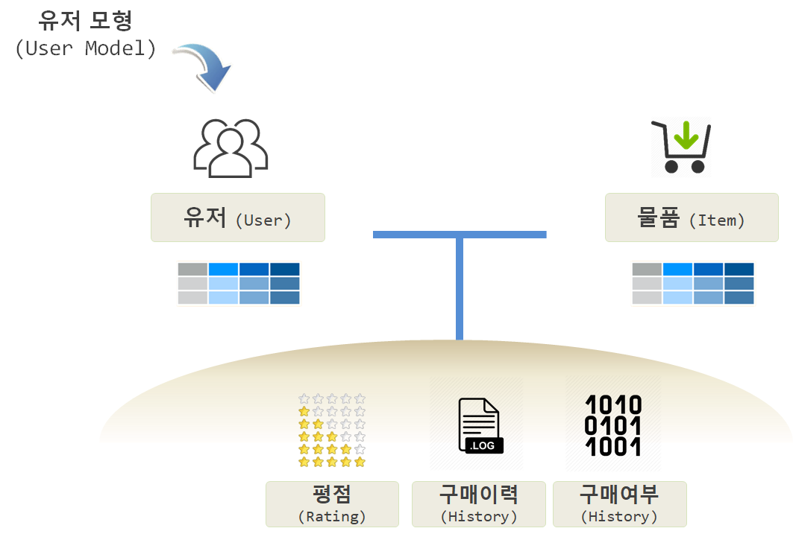
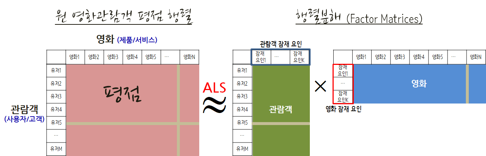

 
``` {r, include=FALSE}
# source("tools/chunk-options.R")

knitr::opts_chunk$set(echo = TRUE, warning=FALSE, message=FALSE,
                    comment="", digits = 3, tidy = FALSE, prompt = TRUE, fig.align = 'center')

library(here)

options(scipen=999)
```


# 추천 시스템의 도래 [^mmds-stanford] {#recommendation-sys}

[^mmds-stanford]: [Mining Massive Datasets - Coursera, Stanford](https://class.coursera.org/mmds-002)


과거 거의 모든 분야에 자원이 희소하여 최대한의 자원을 절약하여 최대의 효과를 내는 방식으로 진화를 하였으나, 인터넷과 웹의 도래로 말미암아 **긴꼬리(Long-tail)** 현상이 어디서나 관측되고 있다. 따라서 과거 희소성에 근거한 접근법이 오히려 문제가 되고, 너무 많은 풍요의 시대에 추천을 통해 더 나은 방식으로 진화를 거듭해 나가고 있다. 

<style>
div.blue { background-color:#e6f0ff; border-radius: 5px; padding: 10px;}
</style>
<div class = "blue">

**추천 시스템 정의**

제품/서비스 추천 문제에 통계적 기법과 지식 발견(Knowledge Discovery) 기법을 적용시킨 것이
추천시스템이다. Sarwar et al. (2000)  

*Recommender systems apply statistical and knowledge discovery
techniques to the problem of making product recommendations.*

</div>


``` {r recommendation-longtail}
# 0. 환경설정 ---------------
library(tidyverse)
library(ggthemes)
library(extrafont)
loadfonts()

# 1. 데이터 ---------------
x <- seq(0, 800, length.out=1000)
df <- data.frame(x=x, px=dexp(x, rate=0.01))

# 2. 긴꼬리 시각화 ---------------
ggplot(df, aes(x=x, y=px)) + 
    geom_line(size=1.5, color="lightgreen") +
    theme_bw(base_family = "NanumGothic") +
    labs(title="긴꼬리와 제품추천 이슈", 
         x="인기도로 정렬한 제품(영화/음악/책 등)", y="인기도 (별점 4 이상) 빈도수") +
    geom_vline(xintercept=200, size=1.5, color="darkgray", linetype="dashed") +
    theme(axis.text.y=element_blank()) +
    annotate("text", x = 400, y = 0.0075, fontface ="bold", size=7, 
             label = "긴꼬리 영역 추천문제", family="NanumGothic",
             color="darkred")
    
```

인기도가 높은 소수 제품과 **인기도가 낮은 다수 제품**을 어떻게 추천하여 효과적으로 매출로 연결시킬 수 있을까라는 문제에 추천시스템이 해답을 제시할 수 있다.

추천 방식을 다음과 같이 나눌 수도 있다.

* 수작업 혹은 편집자: 편집자 추천, 여행 필수품 등
* 합계 총합: 가장 인기 있는 상품, 히트상품 상위 10 개 품목, 신상품 등
* 개인에 맞춤형 추천: 아마존, 넥플릭스 등

명시적으로 선호도를 나타낸 경우 무비렌즈(MovieLens) 데이터가 있으며, 백만곡(One Million Song) 데이터는 노래 듣는 횟수를 
바탕으로 묵시적 선호도를 데이터가 기억한 것으로 흔히 많이 회자되고 있다.


## 선호도 모형(Preference Model) [^coursera-recommender-system] {#recommendation-preference}

[^coursera-recommender-system]: [University of Minnesota (2017), "Introduction to Recommender Systems: Non-Personalized and Content-Based", Coursera](https://www.coursera.org/learn/recommender-systems-introduction/)

추천시스템을 개발하는데 있어, 선호도를 파악해야 하는데 선호도는 명시적으로 주어지는 경우와 함께 암묵적으로 나타난다.
평점, 후기, 투표등을 통해 명시적으로 선호도를 파악할 수도 있지만, 클릭수, 구매, 팔로우 등을 통해 묵시적으로 
선호도를 파악하는 것도 가능하다.

- **추천(Recommendation)**: 추천은 사용자가 좋아할 것 같은 제품이나 서비스를 제안하는 것이다. 흔히 상위 5개 상품이나 서비스가 제시되거나 특정 상품이 눈앞에 제시되기도 한다.
- **예측(Prediction)**: 예측은 사용자가 특정 제품이나 서비스를 얼마나 좋아할지를 추정하는 것이다.

|   구분   |                장점                               |                       단점                            |
|----------|--------------------------------------------------|-------------------------------------------------------|
|   예측   | 제품이나 상품에 대해 계량화할 수 있다.               | 모형이 잘못될 경우 제품이나 상품에 대해 위조될 위험성이 있다. |
|   추천   | 기본디폴트 설정으로 훌륭한 선택지를 제공할 수 있다.   | 상위 몇 개만 탐색하기 때문에 잘못된 추천의 경우 추가 탐색을 하지 않는 위험. |

추천 시스템을 구성하는 요소는 다음과 같다.

- 유저 모형(User Model) 
- 유저 속성: 주소, 성별 등
- 물품(Item) 속성: 제품 가격, 무게, 색상 등
- 평점(Rating): 별점, 좋아요 등

유저와 물품에 대한 선호는 명시적으로 평점을 통해 나타나기도 하고, 물품 이용횟수나 판매량을 기준으로 기록되기도 하고,
사용자와 물품에 대해 접촉 이력이 있는지 없는지 여부만을 인코딩하여 기록하기도 한다.



## 추천방식 {#recommendation-methods}

콘텐츠 기반 필터링(Content-based Filtering) 추천방식은 제품/서비스 특징에 기반해서 적은 자료로 추천이 가능하나 추천범위가 한정되는 반면에,
협업 필터링 (Collaborative Filtering) 추천 방식은 유저의 평가 정보및 구매이력을 확인하기 때문에 다양한 범위에 추천이 가능한 반면
많은 자료를 필요로 한다.


## 추천시스템 데이터셋 [^Joseph-Rickert] [^big-datasets] {#recommendation-dataset}

데이터 과학을 위해 다양한 기계학습 알고리즘, 통계모형, 신경망 딥러닝을 학습하는 것과는 별도로 이를 적용할 데이터를 찾는 것도 일이다. 
너무 많은 예제 데이터가 있는 것도 문제로 빅데이터, 데이터 과학에서 자주 인용되는 데이터를 찾아본다.

* **영화 추천 데이터** : [MovieLens Data Sets](https://datahub.io/dataset/movielens)으로 무비렌즈 온라인 영화추천 사용자 71,567명이 10,681 영화에 95,580 태그 및 10,000,054 평가결과가 담긴 데이터다.
    * 1997년 9월 19일부터 1998년 4월 22일까지 7개월동안 사용자 943명로부터 1,664개 영화에서 10만개 평가를 포함한 데이터로 `library(recommenderlab)` 팩키지를 불러와서 `data(MovieLense)` 명령어로 바로 사용가능하다.
* **백만곡 데이터** : [Million Song Dataset](http://labrosa.ee.columbia.edu/millionsong/)는 [Echo Nest](http://the.echonest.com/company/) 회사가 생성해서 제공하는 데이터로 원래 [HDF5](https://www.hdfgroup.org/about/hdf_technologies.html) 형식으로 제공되어 활용하기 까다로왔으나 다양한 사람들의 노력으로 이제 백만곡 데이터에 대한 접근성은 나아졌다. [다운로드 1%, 1.8 GB](http://static.echonest.com/millionsongsubset_full.tar.gz), [다운로드 전체, 280 GB](http://labrosa.ee.columbia.edu/millionsong/pages/getting-dataset) [UCI 노래 출시년도 예측](http://archive.ics.uci.edu/ml/datasets/YearPredictionMSD)
    * R 팩키지로 별도로 되어 있지 않아 `sqlite` 데이터베이스 형태로 다운로드 받아 R 에서 분석한다. 711.6 MB SQLite 데이터베이스 크기를 갖는다. [^million-songs-in-r]
* **맥주 후기 데이터(BeerAdvocate reviews): [맥주 후기 데이터(BeerAdvocate reviews)](http://snap.stanford.edu/data/web-BeerAdvocate.html)** 데이터는 BeerAdvocate 요청으로 데이터가 더이상 제공되고 있지 않다.
* **항공사 데이터** : [Airline on-time performance](http://stat-computing.org/dataexpo/2009/)로 1987년부터 2008년까지 국내 항공사 출발 및 도착 정보를 담고 있는 데이터셋으로 2009년 ASA 경진대회에 사용된 데이터넷으로 빅데이터의 iris 데이터라는 별명이 붙어있다. 1.23억 관측점과 변수 29개로 구성되어 보통 개인용 컴퓨터에 바로 올라가지 않는다. [다운로드](http://www.transtats.bts.gov/OT_Delay/OT_DelayCause1.asp)
    * 2013년 뉴욕에서 출발한 전체 항공사에 대한 정시 데이터정보를 [nycflights13 - Flights that Departed NYC in 2013](https://cran.r-project.org/web/packages/nycflights13/) R 팩키지로 되어 있어 바로 분석에 사용할 수 있다. `library(nycflights13)`

[^million-songs-in-r]: [The Million Song Dataset, part 1: What happened after the 1960s?](https://stattrekker.wordpress.com/2015/08/29/the-million-song-dataset-part-1-what-happened-after-the-1960s/)


```{r million-song-download, eval=FALSE}
library(RCurl)
library(RSQLite)

url <- "http://labrosa.ee.columbia.edu/millionsong/sites/default/files/AdditionalFiles/track_metadata.db"
download.file(url, "track_metadata.db", "auto")

fetch  <- function(db, query, n = -1) {
  result <- dbSendQuery(db, query)
  data <- dbFetch(result, n)
  dbClearResult(result)
  return(as.data.table(data))
}

metadata.db <- dbConnect(SQLite(), dbname='track_metadata.db')

dbListTables(metadata.db)

songs <- fetch(metadata.db, "SELECT * FROM songs")
dbDisconnect(metadata.db)

head(songs, n=3)
```

[^Joseph-Rickert]: [Finding Data on the Internet](http://www.inside-r.org/howto/finding-data-internet)

[^big-datasets]: [Data Sets for Data Science](http://www.r-bloggers.com/data-sets-for-data-science/)


# 추천시스템을 구현하는 알고리즘과 시스템 [^recommender-system]  {#recommendation-algorithm}

[^recommender-system]: [추천 알고리즘 구현(Implementations) 소프트웨어](http://michael.hahsler.net/research/recommender/)

추천시스템은 상업적인 가치 뿐만 아니라 학술적으로 사람 심리, 알고리즘, 기계학습 등 다양한 분야가 망라되어 있어 오래전부터 
연구되어오고 사업적으로도 활용되어 왔다. 자바, 파이썬, PHP를 포함하여 R언어로도 구현되어 활용할 수 있다.

- Apache Mahout: A machine learning library including collaborative filtering (Java)
- C/Matlab Toolkit for Collaborative Filtering (C/Matlab)
- Cofi: A Java-Based Collaborative Filtering Library (Java)
- Crab: Recommender engine components (Python)
- easyrec: Self-contained Web application with a graphical administration interface to add recommendations to web sites (Java).
- LensKit: Implementation of recommender algorithms with an emphasis on collaborative filtering. It is developed by GroupLens Research (Java).
- MyMediaLite: Lightweight, multi-purpose library of recommender system algorithms. (C#/Mono).
- RACOFI: A rule-applying collaborative filtering system
- Rating-based item-to-item recommender system in PHP/SQL
- SUGGEST: Top-N recommendation engine that implements a variety of recommendation algorithms (only distributed in binary format)
- SVDFeature: Toolkit designed to solve the feature-based matrix factorization (C++)
- Vogoo PHP LIB: Collaborative filtering engine that allows Webmasters to easily add high personalisation features to their Web Sites (PHP)

## 추천시스템 R 팩키지 [^r-recommender-package] {#recommendation-algorithm-packages}

[^r-recommender-package]: [R libraries for recommender systems](https://gist.github.com/talegari/77c90db326b4848368287e53b1a18e8d)

추천시스템 구현을 지원하는 R 팩키지는 다양하다. 

- [sparklyr](https://github.com/rstudio/sparklyr): R interface for Apache Spark
- [recommenderlab](https://github.com/mhahsler/recommenderlab): Lab for Developing and Testing Recommender Algorithms 
- [rrecsys](https://cran.r-project.org/web/packages/rrecsys/index.html) : Environment for Assessing Recommender Systems
- [recosystem](https://cran.r-project.org/web/packages/recosystem/index.html): Recommender System using Matrix Factorization
- [rectools](https://github.com/Pooja-Rajkumar/rectools): Advanced package for recommender systems

## 추천시스템 간략한 수식 표현 {#recommendation-algorithm-math}

수학적으로 추천시스템을 표현하면 다음과 같다. 수많은 고객이 수많은 제품, 서비스에 평가를 한 평가 결과로 엄청 성긴 행렬로 표현된다.

* $U_{\text{사용자}}$ : 사용자 고객 집합
* $P_{\text{제품, 서비스}}$ : 제품이나 서비스 집합
* $R_{\text{평점}}$ : 고객이 제품에 만족도를 표현한 평점

* **효용함수** 

$$u:U_{\text{사용자}} \times P_{\text{제품, 서비스}} \Rightarrow R_{\text{평점}}$$

## 추천시스템 데이터 구조 {#recommendation-algorithm-data-structure}

추천시스템을 개발할 때 자료구조는 영화를 영화관람자가 1 에서 5점까지 별점을 주는 구조로 되어있고, 
코딩을 어떻게 하느냐에 차이가 있지만, 0 점 혹은 `?`, 결측값을 영화를 보지 않은, 경우에 따라서는 물품,제품, 서비스를 구매하지 않은 고객으로 볼 수 있다.

영화나 제품 서비스에 대한 정보는 사전에 알 수 있기 때문에, 
이 정보를 이용하여 사용자가 영화를 추천할 수도 있고, 기존 영화관람객이 다양한 영화를 평가 했다면 유사한 평점을 갖는 유사도를 추정하여 영화를 추천한다. 

$$
\begin{array}{c|cccc|cc}
\text{영화} & \text{무성} & \text{광춘} & \text{영숙} & \text{환범} & \text{영화장르}_{개그} & \text{영화장르}_{폭력} \\
\hline
\text{곡성}       & 5 & 5 & 1 & 1 & 0.9 & 0 \\
\text{왕의 남자}  & 5 & ? & ? & 1 & 1 & 0.01 \\
\text{넘버3}      & ? & 4 & 1 & ? & 0.99 & 0 \\
\text{돌아이}     & 1 & 2 & 1 & 4 & 0.1 & 1.0 \\
\text{겨울나그네} & 1 & 5 & 1 & ? & 0 & 0.9 \\
\hline
\end{array}
$$


## 행렬분해와 근사 [^matrix-factorization] {#recommendation-algorithm-math-decomposition}

[^matrix-factorization]: [김민환, Recommendation System :협업 필터링을 중심으로](http://rosaec.snu.ac.kr/meet/file/20120728b.pdf)

행렬분해를 통한 근사는 추천시스템의 핵심을 이룬다. 위키피디아 웹사이트에 [특이값 분해(Singular value decomposition)](https://en.wikipedia.org/wiki/Singular_value_decomposition)에 대한
기하적인 설명이 나와 있다. 행렬 $\mathbf{M}$을 $\mathbf{U}, \boldsymbol{\Sigma}, \mathbf{V}$ 행렬로 분해할 경우,
$\mathbf{V}$는 회전을, $\boldsymbol{\Sigma}$는 늘이고 줄이는 척도조정, $\mathbf{U}$은 두번째 회전시키는 역할을 한다.


특이값 분해를 수학표기법으로 표현하면 다음과 같다.

$$\mathbf{M} = \mathbf{U} \boldsymbol{\Sigma} \mathbf{V}^*$$

R 코드로 구현하면 모든 관객이 영화를 보았다면 다음과 같은 행태의 데이터가 나오게 된다.
$\boldsymbol{\Sigma}$ 두개 차원만 선택하여 원래 행렬을 행렬분해를 통해 근사하게 되면 
제법 오차가 작은 행렬을 구할 수 있다.

``` {r svd-data}
# 0. 환경설정 ------------------------------
library(recommenderlab) # devtools::install_github("mhahsler/recommenderlab")
library(tidyverse)
library(matrixStats)

# 1. 데이터 ------------------------------

rating_df <- tribble(
    ~ user, ~슈퍼맨,  ~배트맨,  ~색계, ~아멜리에,
      "병곤",     1 ,      2 ,      8 ,     10,
      "용섭",     10,       7,       8,      3,
      "우상",     8 ,      9 ,      9 ,     2,
      "성수",     4 ,      5 ,      9 ,     7)

rating_mat <- rating_df %>% 
    remove_rownames() %>% 
    column_to_rownames(var="user") %>% 
        as.matrix()

DT::datatable(rating_mat)

# 2. 행렬분해 ------------------------------
## 2.1. 행렬 근사
(rating_svd <- svd(rating_mat))

D <- diag(rating_svd$d)
D[3:4, 3:4] <- 0

(rating_approx <- rating_svd$u %*% D %*% t(rating_svd$v)) #  X = U D V'

sum(rating_mat - rating_approx)
```

현실적으로 모든 관객이 영화를 다 볼 수는 없고, 경우에 따라서는 평점을 남기지 않게 된다.
이런 경우 결측값이 발생되게 되고 무엇으로 그 값을 채워넣어야 한다.
예를 들어, **용섭**이 영화를 두개를 관람하지 않는 경우, 어떤 영화를 추천해야 해야하는데
행렬 근사 방법을 적용시키면 매우 커다란 행렬도 PC에서 작업이 가능하게 된다. 

``` {r svd-matrix-factorization}
## 2.2. 영화 추천
rating_mat[2,c(2,4)] <- 0

rating_mean <- rowMeans(rating_mat)
rating_std  <- rowSds(rating_mat)

rating_mat[2,c(2,4)] <- rating_mean[2] * 2

rating_std_mat <- apply(rating_mat, 1, scale)

(rating_std_svd <- svd(rating_std_mat))

D <- diag(rating_std_svd$d)
D[3:4, 3:4] <- 0

rating_std_mf <- rating_std_svd$u %*% D %*% t(rating_std_svd$v) #  X = U D V'

rating_mean + rating_std_mf * rating_std
```

**용섭**이 영화를 보지 않았다는 것을 상정하기 위해 `0`으로 치완하고 나서 각 관객별 평균과 표준편차를 구하는데 이는 정규화를 위한 것이다.
이를 통해 특이값분해(SVD)로 행렬을 분해시키고 나서, $\boldsymbol{\Sigma}$ 두개 차원만 선택하고 나서 정규화된 것을 다시 원래 척도로 되돌리는 과정을 거친다.
최종결과는 배트맨이 아멜리에 보다 큰 값이 나왔으니 배트맨을 추천한다.

# 행렬분해와 ALS [^spark-matrix-factorization] [^python-matrix-approx] [^sanghyuk-mf] {#recommendation-algorithm-als}

[^spark-matrix-factorization]: [Reza Zadeh - Spark and Matrix Factorization](https://www.youtube.com/watch?v=TukmMqw6y0s)
[^python-matrix-approx]: [Christian Thurau - Low-rank matrix approximations in Python](https://www.youtube.com/watch?v=kfEWZA-b-YQ)
[^sanghyuk-mf]: [인터넷 속의 수학 - How Does Netflix Recommend Movies? (2/2)](http://sanghyukchun.github.io/31/)

다양한 추천시스템이 존재하지만 수학적으로 보면 사용자 평가 정보와 상품 평가정보를 기반으로 전체 사용자와 상품 평가정보가 포함된 행렬을 채우는 것으로 볼 수 있다. 
물론 얼마나 잘 채우냐가 좋은 추천 시스템의 요건이 된다.
이를 위해서 사용자와 제품으로 구성된 성긴 행렬을 사용자 행렬과 제품행렬로 분해하는데 ALS(Alternative Least Square) 알고리즘을 사용한다.
앞선, SVD를 사용하지 않는 이유는 행렬분해 계산과정에서 음수가 나오기 때문에 NMF(Nonnegative Matric Factorization) 기법이 필히 요구된다.



모든 사용자와 모든 영화를 평점을 채워 빈칸이 없도록 하는 추정하는 것으로 $\text{사용자} \times \text{영화}$ 행렬을 **낮은 계수 행렬 인수분해(Low rank matrix factorization)** 로 근사하는 개념으로 
**최소자승 교대 추정(Alternating Least Square)** 방식을 사용해서 채워 넣는다.

1. 임의 $\text{사용자}$, $\text{영화}$ 벡터를 갖고 시작한다.
1. $\text{영화}$를 고정시키고 $\text{사용자}$ 벡터를 최적화한다.
1. $\text{사용자}$를 고정시키고 $\text{영화}$ 벡터를 최적화한다.
1. 수렴할 때까지 교대로 최적화 과정을 반복한다.

수식으로 표현하면 다음과 같다.

$$
\min_{U, P} \lVert R_{평점} - UP  \rVert^{2}
$$

사용자 $U \geq 0$, 제품 $P \geq 0$ 모두 0 보다 큰 조건이 붙는다.

