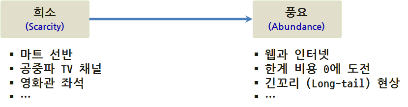

> ## 학습 목표 {.objectives}
>
> * MovieLens 데이터로 영화 추천시스템을 개발한다.
> * 로컬 컴퓨터에서 작게 개발하고 SparkR을 통해 확장을 시도한다.

### 1. 추천 시스템의 도래 [^mmds-stanford]

[^mmds-stanford]: [Mining Massive Datasets - Coursera, Stanford](https://class.coursera.org/mmds-002)

과거 거의 모든 분야에 자원이 희소하여 최대한의 자원을 절약하여 최대의 효과를 내는 방식으로 진화를 하였으나, 인터넷과 웹의 도래로 말미암아 **긴꼬리(Long-tail)** 현상이 어디서나 관측되고 있다. 따라서 과거 희소성에 근거한 접근법이 오히려 문제가 되고, 너무 많은 풍요의 시대에 추천을 통해 더 나은 방식으로 진화를 거듭해 나가고 있다. 

추천 방식을 다음과 같이 나눌 수도 있다.

* 수작업 혹은 편집자: 편집자 추천, 여행 필수품 등
* 합계 총합: 가장 인기 있는 상품, 히트상품 상위 10 개 품목, 신상품 등
* 개인에 맞춤형 추천: 아마존, 넥플릭스 등

#### 1.1. 추천시스템 간략한 수식 표현

수학적으로 추천시스템을 표현하면 다음과 같다. 수많은 고객이 수많은 제품, 서비스에 평가를 한 평가 결과로 엄청 성긴 행렬로 표현된다.

* $U_{\text{사용자}}$ : 사용자 고객 집합
* $P_{\text{제품, 서비스}}$ : 제품이나 서비스 집합
* $R_{\text{평점}}$ : 고객이 제품에 만족도를 표현한 평점

* **효용함수** 

$$u:U_{\text{사용자}} \times P_{\text{제품, 서비스}} \Rightarrow R_{\text{평점}}$$

#### 1.2. 추천시스템 데이터 구조

추천시스템을 개발할 때 자료구조는 영화를 영화관람자가 1 에서 5점까지 별점을 주는 구조로 되어있고, 코딩을 어떻게 하느냐에 차이가 있지만, 0 점 혹은 `?`, 결측값을 영화를 보지 않은, 경우에 따라서는 물품,제품, 서비스를 구매하지 않은 고객으로 볼 수 있다.

영화나 제품 서비스에 대한 정보는 사전에 알 수 있기 때문에, 이 정보를 이용하여 사용자가 영화를 추천할 수도 있고, 기존 영화관람객이 다양한 영화를 평가 했다면 유사한 평점을 갖는 유사도를 추정하여 영화를 추천한다. 

$$
\begin{array}{c|cccc|cc}
\text{영화} & \text{무성} & \text{광춘} & \text{영숙} & \text{환범} & \text{영화장르}_{개그} & \text{영화장르}_{폭력} \\
\hline
\text{곡성}       & 5 & 5 & 1 & 1 & 0.9 & 0 \\
\text{왕의 남자}  & 5 & ? & ? & 1 & 1 & 0.01 \\
\text{넘버3}      & ? & 4 & 1 & ? & 0.99 & 0 \\
\text{돌아이}     & 1 & 2 & 1 & 4 & 0.1 & 1.0 \\
\text{겨울나그네} & 1 & 5 & 1 & ? & 0 & 0.9 \\
\hline
\end{array}
$$

### 2. 추천 시스템 [^spark-matrix-factorization] [^python-matrix-approx]

[^spark-matrix-factorization]: [Reza Zadeh - Spark and Matrix Factorization](https://www.youtube.com/watch?v=TukmMqw6y0s)
[^python-matrix-approx]: [Christian Thurau - Low-rank matrix approximations in Python](https://www.youtube.com/watch?v=kfEWZA-b-YQ)

다양한 추천시스템이 존재하지만 수학적으로 보면 사용자 평가 정보와 상품 평가정보를 기반으로 전체 사용자와 상품 평가정보가 포함된 행렬을 채우는 것으로 볼 수 있다. 물론 얼마나 잘 채우냐가 좋은 추천 시스템의 요건이 된다.

모든 사용자와 모든 영화를 평점을 채워 빈칸이 없도록 하는 추정하는 것으로 $\text{사용자} \times \text{영화}$ 행렬을 **낮은 계수 행렬 인수분해(Low rank matrix factorization)** 로 근사하는 개념으로 **최소자승 교대 추정(Alternating Least Square)** 방식을 사용해서 채워 넣는다.

1. 임의 $\text{사용자}$, $\text{영화}$ 벡터를 갖고 시작한다.
1. $\text{영화}$를 고정시키고 $\text{사용자}$ 벡터를 최적화한다.
1. $\text{사용자}$를 고정시키고 $\text{영화}$ 벡터를 최적화한다.
1. 수렴할 때까지 교대로 최적화 과정을 반복한다.

수식으로 표현하면 다음과 같다.

$$
\min_{U, P} \lVert R_{평점} - UP  \rVert^{2}
$$

사용자 $U \geq 0$, 제품 $P \geq 0$ 모두 0 보다 큰 조건이 붙는다.

#### 2.1. 추천 시스템 분류 

수학적으로 추천 시스템을 살펴봤으면, 이제 협업 필터링(Collaborative filtering)에 대해 살펴본다.

* **콘텐츠 기반 필터링** : 사용자 프로파일 혹은 제품(영화 등) 프로파일 정보를 활용하여 추천하는 알고리즘
* **협업 필터링**
    * **제품-제품 협업 필터링** : 사용자에게 사용자가 구매한 것과 가장 유사한 제품을 추천하는 알고리즘
    * **사용자-사용자 협업 필터링** : 사용자에게 유사한 사용자가 구매한 것과 가장 유사한 제품을 추천하는 알고리즘

#### 2.2. 유사성 측도

유사성 측도는 유클리드, 코사인, 피어슨 상관계수가 포함된다. 

##### 2.2.1. 유클리드 거리

유클리드 거리는 피타고라스 공식을 적용하여 다음과 같이 구할 수 있다.

$$\begin{align}\mathrm{d}(\mathbf{p},\mathbf{q}) = \mathrm{d}(\mathbf{q},\mathbf{p}) & = \sqrt{(q_1-p_1)^2 + (q_2-p_2)^2 + \cdots + (q_n-p_n)^2} \\[8pt]
& = \sqrt{\sum_{i=1}^n (q_i-p_i)^2}.\end{align}$$

~~~ {.r}
a <- c(-0.012813841, -0.024518383, -0.002765056,  0.079496744,  0.063928973,
       0.476156960,  0.122111977,  0.322930189,  0.400701256,  0.454048860,
       0.525526219)

b <- c(0.64175768,  0.54625694,  0.40728261,  0.24819750,  0.09406221, 
       0.16681692, -0.04211932, -0.07130129, -0.08182200, -0.08266852,
       -0.07215885)

euclidean_dist <- dist(rbind(a, b) ,method="euclidean")

euclidean_dist
~~~

##### 2.2.2. 코사인 유사도

코사인 유사도는 두 내적 벡터의 유사도를 코사인 각도로 측정하여 -1에서 1 사이 값을 갖게 된다.

$$\text{코사인 유사도} = \cos(\theta) = {\mathbf{A} \cdot \mathbf{B} \over \|\mathbf{A}\| \|\mathbf{B}\|} = \frac{ \sum\limits_{i=1}^{n}{A_i  B_i} }{ \sqrt{\sum\limits_{i=1}^{n}{A_i^2}}  \sqrt{\sum\limits_{i=1}^{n}{B_i^2}} } $$

`crossprod` 함수로 계산을 해도 되고, `lsa` 팩키지의 `cosine` 함수를 사용한다.

~~~ {.r}
crossprod(a, b)/sqrt(crossprod(a) * crossprod(b))

library(lsa)
cosine(a, b)
~~~

##### 2.2.3. 피어슨 상관계수

피어슨 상관계수는 두변수의 공분산을 각 변수의 표준편차로 나누어서 계산된다.

$$ \rho_{X,Y}= \frac{\operatorname{cov}(X,Y)}{\sigma_X \sigma_Y} $$

피어슨 상관계수는 `cor` 기본내장함수를 사용해서 계산한다.

~~~ {.r}
df <- data.frame(a, b)
cor(df, method="pearson")
~~~

### 3. R 추천 시스템 [^r-recommendation-sys]

[^r-recommendation-sys]: [Building a Recommendation System with R](https://www.packtpub.com/big-data-and-business-intelligence/building-recommendation-system-r)

