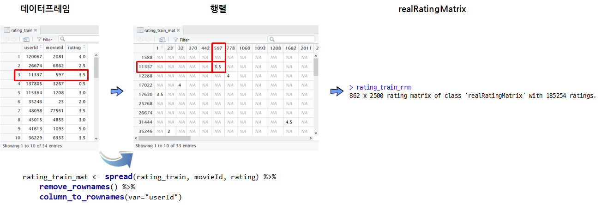

# xwMOOC 데이터 과학
xwMOOC  
`r Sys.Date()`  

## 1. 일반적인 R 추천 시스템 [^r-recommendation-sys] [^recommenderlab] [^beer-recom] [^lastfm] [^recommenderlab-ubcf] {#recom-basic}

[^lastfm]: [Collaborative Filtering with R](http://www.salemmarafi.com/code/collaborative-filtering-r/)

[^beer-recom]: [Recommendation System in R](http://blog.yhat.com/posts/recommender-system-in-r.html)

[^recommenderlab]: [Recommender Systems 101 – a step by step practical example in R](http://bigdata-doctor.com/recommender-systems-101-practical-example-in-r/)

[^r-recommendation-sys]: [Building a Recommendation System with R](https://www.packtpub.com/big-data-and-business-intelligence/building-recommendation-system-r)

[^recommenderlab-ubcf]: [Recommender Systems: User-based Collaborative Filtering](http://michael.hahsler.net/other_courses/ICMA_Recommendation_Tools/code/UBCF.html)

일반적인 추천시스템 개발 작업흐름은 다음과 같다.

1. 데이터 수집
2. 데이터 정제 및 정규화
3. 협업 필터링 적합
    * 사용자에게 상위 5개 제품 혹은 서비스 추천
4. 협업 필터링 모형 평가 및 타당성 점검
5. 추천 모형 배포

### 1.1. 영화 추천 훈련데이터 형식 [^recom-kaggle] {#movie-data}

[^recom-kaggle]: [Using R package, recommenderlab, for predicting ratings for MovieLens data](https://ashokharnal.wordpress.com/tag/item-based-collaborative-filtering-using-r/)

행렬 형태의 영화와 관람객 데이터를 다음과 같이 재표현할 수 있다.
즉, 영화관람객이 평가한 영화 평가점수가 다음과 같이 주어진다.
이 정보를 바탕으로 최적의 추천함수($f(x)$)를 개발하는 것이 목표다.
기계학습에서 보면 이 데이터가 학습데이터(training data)가 된다. [캐글 훈련데이터 다운로드, train_v2](https://inclass.kaggle.com/c/predict-movie-ratings/data)

| ID     | user | movie | rating| 
|--------|------|-------|-------|
| 610739 | 3704 | 3784  | 3     |
| 324753 | 1924 | 802   | 3     |
| 808218 | 4837 | 1387  | 4     |
| 133808 | 867  | 1196  | 4     |
| 431858 | 2631 | 3072  | 5     |

### 1.2. 협업 필터링 모형 {#collaborative-filtering}

* **콘텐츠 기반 필터링** : 사용자 프로파일 혹은 제품(영화 등) 프로파일 정보를 활용하여 추천하는 알고리즘
* **협업 필터링**
    * **제품-제품 협업 필터링** : 사용자에게 사용자가 구매한 것과 가장 유사한 제품을 추천하는 알고리즘
    * **사용자-사용자 협업 필터링** : 사용자에게 유사한 사용자가 구매한 것과 가장 유사한 제품을 추천하는 알고리즘

상품추천을 위한 훈련데이터를 학습하여 다양한 모형을 적합시키고, 실제 영화추천 데이터에 결과값을 붙여 실제 운영시스템에 배포하는 것으로 요약된다.

### 1.3. 실제 영화 추천 데이터 {#recommend}

테스트 데이터(test data)라고 부르기도 하고, 결국 신규 혹은 기존 고객에게 제품을 추천할 제품을 정량화하는 것에 불과하다. 
[캐글 테스트 데이터 다운로드, test_v2](https://inclass.kaggle.com/c/predict-movie-ratings/data)

| ID     | user | movie |     |  모형점수 |
|--------|------|-------|-----|------|
| 895537 | 5412 | 2683  |     |  ??  |
| 899740 | 5440 | 904   |     |  ??  |
| 55688  | 368  | 3717  |     |  ??  |
| 63728  | 425  | 1721  |     |  ??  |
| 822012 | 4942 | 3697  |     |  ??  |
| 781895 | 4668 | 2011  |     |  ??  |
| 472806 | 2907 | 173   |     |  ??  |

## 2. 영화 추천 [^recommenderlab-cran] {#movielens-data}

[^recommenderlab-cran]: [recommenderlab - Lab for Developing and Testing Recommender Algorithms](https://cran.r-project.org/web/packages/recommenderlab/index.html)

`recommenderlab` 협업 필터링 팩키지를 활용하면 추천시스템에 대한 개념을 잡고 학습하기 용이하다.
추천시스템이 실제 적용될 수 있는 사례를 [조크 추천시스템](https://mhahsler-apps.shinyapps.io/Jester/)에서 찾아볼 수 있다. 
물론 데이터는 `recommenderlab` 팩키지에 포함된 **Jester** 데이터셋을 사용했다.

### 2.1. 추천시스템 자료구조 {#movie-data-structure}

사용자(userId)가 영화(movieId)를 평가한 평점(rating)을 행렬형태로 저장하게 되면 저장공간 낭비가 심하다.
일반적으로 데이터프레임 형태 데이터를 행렬형태로 변환시키고 나서, 이를 희소행렬 `realRatingMatrix`을 
추천시스템 내부 자료구조로 변환시키는 과정이 일반적이다. 이를 도식화하면 다음과 같다.

### 2.1. 환경설정, 데이터 가져오기, 데이터 전처리 {#data-preprocessing}

`recommenderlab` 팩키지를 설치하고, `recommenderlab` 라이브러리를 적재하고 나서, 
`csv` 형태로 저장된 파일을 데이터프레임으로 변환시킨다. 
일반적으로 추천시스템 구축에 사용될 데이터는 엄청 성긴 행렬데이터로 어떻게 저장하느냐에 따라 저장공간을 차지하는 것부터 100배 정도 차이가 발생하는데 일반적이다. 

~~~{.r}
# 0. 환경설정 ------------------------------

# library(recommenderlab) # devtools::install_github("mhahsler/recommenderlab")
# library(tidyverse)
# library(stringr)

# 1. 데이터 가져오기 -----------------------
rating_df <- read_csv("data/ratings.csv")
rating_df <- rating_df %>% select(-timestamp) %>% 
    mutate(userId = str_c("u", userId),
           movieId = str_c("m", movieId))

# 2. 데이터 전처리 -------------------------
# 데이터프레임 -> 행렬 -> 희소행렬(realRatingMatrix)

rating_mat <- spread(rating_df, movieId, rating) %>% 
    remove_rownames() %>% 
    column_to_rownames(var="userId")

rating_rrm <- as(as(rating_mat, "matrix"), "realRatingMatrix")

# 유의미한 데이터로 축소

rating_rrm <- rating_rrm[rowCounts(rating_rrm) > 50,
                         colCounts(rating_rrm) > 100]

# 데이터 크기 비교
print(object.size(rating_mat), units = "auto")
~~~

~~~{.output}
16.7 Mb

~~~

~~~{.r}
print(object.size(rating_rrm), units = "auto")     
~~~

~~~{.output}
2.2 Mb

~~~

### 2.2. 사용자 기반 협업 필터링 추천 모형 {#collaborative-filtering}

데이터에 대한 준비가 모두 마쳤다면, 다음 단계로 추천 모형을 개발한다.
추천모형으로 사용자 기반 협업 필터링 추천 모형을 `evaluationScheme` 모형평가설정을 한후
RMSE를 모형성능평가 기준으로 설정하고 나서 모형의 성능을 살펴본다.

~~~{.r}
# 3. 추천모형 -------------------------
## 3.1. 모형평가 설정
rating_eval <- evaluationScheme(rating_rrm, method="split", train=0.7, given=5)

## 3.2. 사용자기반 협업 필터링 모형
ubcf_rmse <- Recommender(getData(rating_eval, "train"), method = "UBCF", 
                          param=list(normalize = "center", method="Cosine", nn=5))

## 3.3. 사용자기반 협업 필터링 모형 성능
ubcf_pred <- predict(ubcf_rmse, getData(rating_eval, "known"), type="ratings")
calcPredictionAccuracy(ubcf_pred, getData(rating_eval, "unknown"))
~~~

~~~{.output}
     RMSE       MSE       MAE 
0.9468404 0.8965067 0.7289031 

~~~

### 2.3. 사용자에 영화 추천 {#recommend-movies}

사용자 기반 협업 필터링 추천 모형이 개발되었다면 각 사용자에 대한 영화를 5개 추천한다.

~~~{.r}
# 4. 추천모형 활용 영화 추천 -------------------------
ubcf_pred <- predict(object = ubcf_rmse, newdata = rating_rrm,  n = 5)

recc_matrix <- sapply(ubcf_pred@items, function(x){
    colnames(rating_rrm)[x]
})

recc_matrix[,1:5] %>% DT::datatable()
~~~

<!--html_preserve-->

<!--/html_preserve-->
