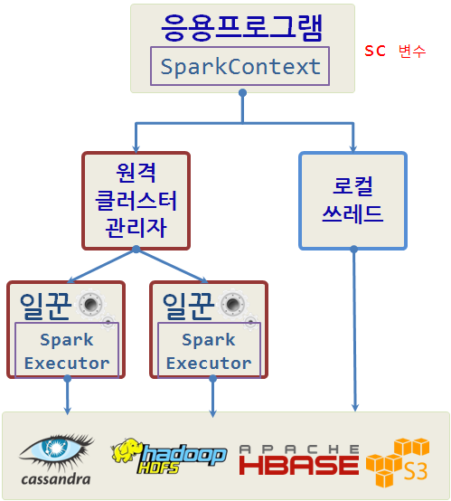
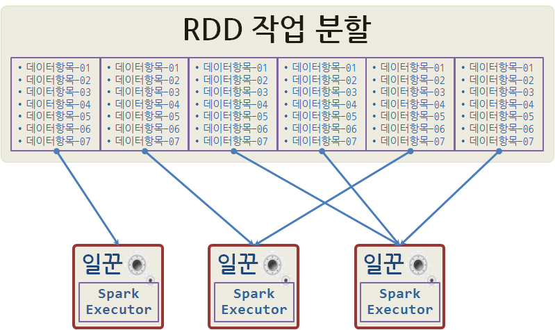
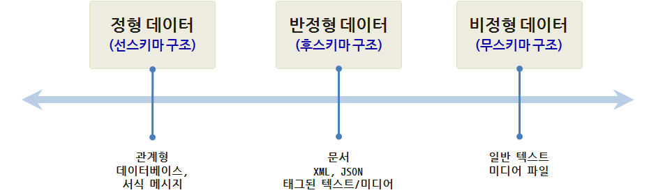
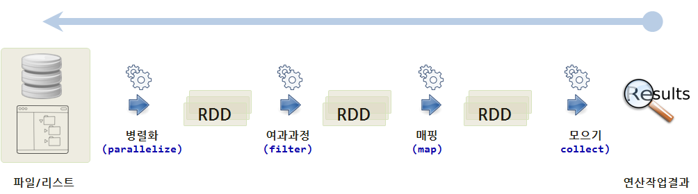

> ### 학습 목표 {.objectives}
>
> * 빅데이터를 담을 그릇에 대해 살펴본다.
> * 동질적인 컴퓨팅 자원을 분산해서 관리하는 방법을 이해한다.

### 스파크 이해하기

스파크 프로그램 실행 모형은 다음 두가지로 구성된다.

* 드라이버 프로그램
* 워커(작업자) 프로그램

스파크 응용프로그램을 생성하고 분산데이터에 작업을 실행시키기 위해 `sc` 변수를 통해 `SparkContext`를 생성시켜야 된다.
`SparkContext`가 생성되면, RDD( resilient distributed dataset)이 생성되어 분산처리할 데이터가 준비된다. 그리고 난 후에 `SparkContext`에 **마스터 모수설정** 을 하여 작업 유형과 방식을 지정한다.

일꾼 프로그램을 로컬 컴퓨터 노드 혹은 로컬 쓰레드로 동작시키는 방식과 스파크 클러스터 혹은 메쏘스 클러스터를 통해 원격으로 일꾼 프로그램에 명령을 주어 작업을 처리하는 방식으로 나뉜다.

|  작업 영역       |  마스터 모수설정  |  설명   |
|------------------|-----------------------|-------------------------------------|
|    로컬      |     `local`           | 병렬작업 없이 작업자 하나 쓰레드로 로컬에서 스파크 실행 |
|    로컬      |     `local[K]`        | 병렬작업 (멀티코어 숫자) K개 작업자를 쓰레드로 로컬에서 스파크 실행 |
|    원격      | `spark://HOST:PORT`   | 기본디폴트 7077 포트로 원격에서 스파크 클러스터에 연결시켜 작업     |
|    원격      | `mesos://HOST:PORT`   | 기본디폴트 5050 포트로 원격에서 아파치 메소스(Mesos) 클러스터에 연결시켜 작업     |

### RDD (Resilient Distributed Dataset)

RDD는 스파크의 핵심이 되는 데이터 추상화로 한번 생성되면 변경이 불가능한 Immutable 자료형이다.
RDD를 생성하는 방법은 다음과 같은 세가지 방식이 있자.

* 기존 파이썬 컬렉션(List)을 병렬화 
* 기존 RDD를 변형 
* HDFS 에서 파일 혹은 다른 데이터저장 관리시스템에서 생성

응용프로그램 개발자가 RDD에 대한 분할 갯수를 지정하는데, 더 많이 분할하면 할수록 더 많은 병렬성을 내포하게 된다.
RDD를 6개로 쪼개 일꾼 3개에 병렬처리를 시킨다. 작업을 하나만 받은 일꾼도 있고, 2개를 받은 일꾼도 있고, 3개를 처리해야 하는 일꾼도 있다.

RDD에 대한 두가지 연산유형

* **변환(Transformation)** : 지연연산(Lazy)으로 즉시 연산이 실행되지 않는다.
* **동작(Action)** : 동작이 실행될 때 비로소 RDD 변환이 실행된다.

RDD를 캐쉬형태로 메모리 혹은 디스크에 넣고 작업하는 것도 가능하다.

> ### 데이터 구조 분류 {.callout}
>
> * 선스키마를 갖는 정형데이터 : 관계형 데이터베이스
> * 후스키마를 갖는 반정형데이터 : JSON, XML, 주로 `printf`문으로 생성되는 웹로그 등.
> * 스키마가 없는 무정형 데이터 : 일반 텍스트, 미디어 파일
> 
> 

### RDD vs 데이터프레임

RDD와 데이터프레임 성능을 비교하면, 단순히 RDD를 사용하는 것에 비해 데이터프레임을 사용한 것이 성능이 최대 파있너의 경우 나오는 것이 확인된다. R 데이터프레임도 확인이 되고 있지 않지만 유사할 것으로 판단된다. 

#### 변환(Transformation)과 동작(Action)

스파크 RDD 변환은 기존 데이터에서 새로운 데이터를 생성시키지만, 바로 새로운 데이터가 생성되는 것이 아니다.
**지연연산(lazy evaluation)** 을 사용해서 기초 데이터에 적용될 변환연산을 기억하고 있고 **동작(Action)** 이 실행될 때 한번에 실행된다. 이런 과정을 통해 스파크가 자동으로 최적화 및 장애나 느리게 작업하는 일꾼을 깔끔하게 처리한다.
어떻게 보면 최종결과값을 생성해내는 방안 혹은 음식조리하는 요리법으로 간주할 수도 있다.

#### 변환(Transformation)

|     변환 작업    |                        상세설명                                             |
|------------------|-----------------------------------------------------------------------------|
|   map(*func*)    | *func* 함수를 통해 인자로 전달하고, 결과로 새로운 분산 데이터셋이 반환된다. |
| filter(*func*)   | *func* 함수를 통해 참으로 선택된 것만 인자로 전달하고, 결과로 새로운 분산 데이터셋이 반환된다. |
| distinct([작업갯수]) | 유일무이한 작업만 선택해서 인자로 전달하고, 결과로 새로운 분산 데이터셋이 반환된다. |
| flatmap(*func*)  | `map`과 유사하지만, 각 입력항목이 0 혹은 그 이상으로 *func* 함수가 단일 항목을 반환하는 것이 아니라 순열을 반환한다. |

~~~ {.python}
# coding: utf-8

# 1. map 예제
>>> rdd = sc.parallelize([1,2,3,4])
>>> rdd.map(lambda x: x*2)
# [1,2,3,4] --> [1,4,9,16]

# 2. filter 예제
>>> rdd.filter(lambda x: x %2 == 0)
# [1,2,3,4] --> [2,4]

# 3. distinct 예제
>>> rdd2 = sc.parallelize([3,5,5,2,1,2,2,3])
>>> rdd2.distinct()
# [3,5,5,2,1,2,2,3] --> [1,2,3,5]
~~~

#### 동작(Action)

|      동작 작업      |                        상세설명                                             |
|---------------------|-----------------------------------------------------------------------------|
|   reduce(*func*)    | *func* 함수를 사용해서 데이터셋 원소를 총합요약. *func* 함수는 인자를 두개 받아 하나를 반환. |
|     take(*n*)       | 첫 *n* 개 원소를 뽑아낸 배열을 생성.                                        |
|     collect()       | 배열로 모든 원소를 뽑아냄, 드라이버 프로그램 메모리가 데이터를 담을 수 있는 사전확인  |
| takeOrdered(*n, key=func*) | *key=func* 에 지정된 방식 혹은 오름차순으로 *n* 개 원소를 추출하여 반환 |

~~~ {.python}
# coding: utf-8

# 1. reduce 예제
>>> rdd = sc.parallelize([1,2,3,4])
>>> rdd.reduce(lambda a, b: a+b)
# 10

# take 예제
>>> rdd.take(3)
# [1,2,3]

# collect 예제
>>> rdd.collect()
# [1,2,3,4]
~~~

### RDD 동작방식

RDD 동작방식은 최종 결과를 얻기 위해서 모으기(collect) 동작을 일으키면, 병렬화(parallelize),
여과과정(filter), 매핑(map) 작업이 원 데이터 파일 혹은 리스트에 가해져 RDD에 순차적으로 진행된다.

### 스파크 응용프로그램 생애주기

1. 외부 데이터에서 RDD를 생성하거나 드라이버 프로그램에 컬렉션(리스트)를 병렬화하면서 시작된다.
1. 지연연산으로 앞서 생성된 RDD를 새로운 RDD로 변환시킨다.
1. 재사용하려면 RDD를 **cache()** 함수를 사용한다.
1. 동작(action)을 수행해서 병렬처리 작업을 실행시키고 최종결과를 산출시킨다.

좀더 구체적으로 살펴보면 다음과 같다.

1. 드라이버 프로그램(개발중인 스파크 응용프로그램)이 실행된다.
1. 드라이버 프로그램은 어떤 관리자를 프로그램을 사용할지에 따라 다르지만,
   응용프로그램 마스터가 YARN, Mesos, 스파크 자원관리자가 올라올 때까지 대기한다.
1. 응용프로그램 관리자가 클러스터에 작업을 분배한다. 이때 원격인지 로컬인지, CPU와 메모리 자원이 가용한 컴퓨터 노드, 자원 요구사항 등을 고려한다.
1. 일꾼이 분할된 작업을 수령한다.
1. 일꾼이 작업을 처리하고 처리결과를 파일에 저장한다.
1. 작업이 완료되면 제어권을 다시 드라이버 프로그램에 넘겨주고 다른 작업을 위해 대기한다.

