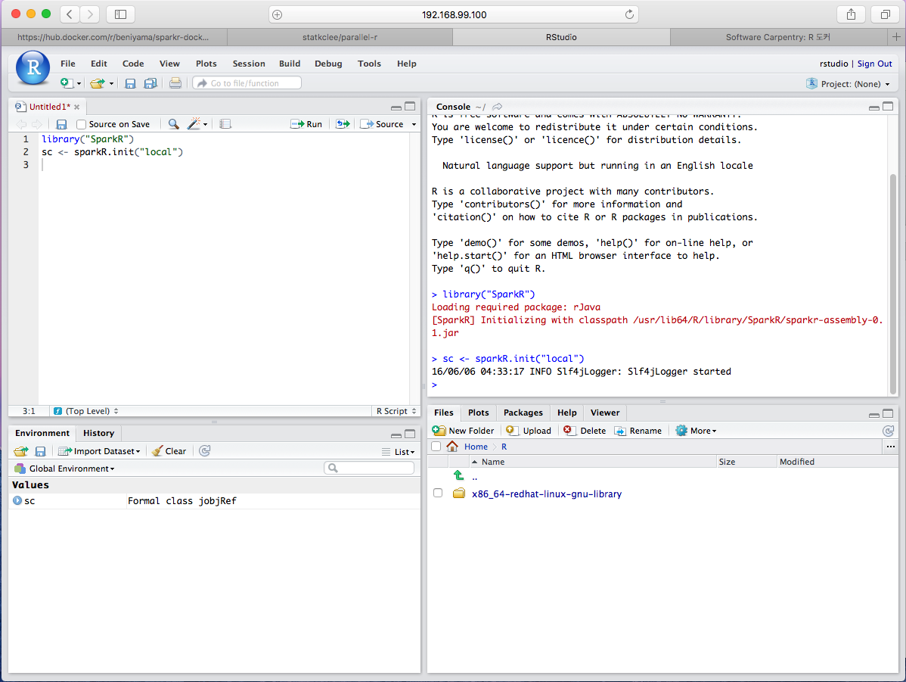

> ### 학습 목표 {.objectives}
>
> * 도커를 이용하여 `SparkR`이 설치된 컨테이너를 활용한다.

### 1. `SparkR` 도커 설치

로컬 컴퓨터에 `SparkR`이 설치된 도커 이미지를 다운로드 받아 스파크 데이터 분석을 시작한다.

리눅스, 맥, 윈도우에 도커 설치는 [R 도커](http://statkclee.github.io/r-docker/)를 참조한다.

1. [도커허브(docker hub)](https://hub.docker.com)에서 `sparkr`을 검색하고 가장 많은 `pull` 횟수를 기록한 도커 이미지를 찾는다.
1. `docker pull` 명령어로 이미지를 다운로드 받는다.
1. `docker run` 명령어로 스파크R을 실행시킨다.

현재기준 가장 많은 `pull` 을 기록한 [beniyama/sparkr-docker](https://hub.docker.com/r/beniyama/sparkr-docker/)를 사용한다.

~~~ {.shell}
$ docker pull beniyama/sparkr-docker
$ docker images
~~~

스파크R이 설치된 beniyama/sparkr-docker 도커이미지는 4GB가 넘는 대용량임을 확인할 수 있다.

~~~ {.output}
REPOSITORY               TAG                 IMAGE ID            CREATED             SIZE
ubuntu                   latest              2fa927b5cdd3        9 days ago          122 MB
rocker/hadleyverse       latest              4b8ce08aa722        2 weeks ago         2.92 GB
hello-world              latest              8deff69ab810        5 weeks ago         967 B
beniyama/sparkr-docker   latest              c844baaf0528        18 months ago       4.144 GB
~~~

`docker run -d -p 8787:8787 -t beniyama/sparkr-docker` 명령어로 8787 포트로 실행을 하고, 도커가 처음 실행될 때 생성된 IP주소 `IP 192.168.99.100`주소를 포트번호와 함께 웹브라우저에 입력하면 RStudio 로그인 화면이 나온다.

* ID: rstudio
* PW: rstudio

로그인하면 SparkR 설정이 완료된 컨테이너에 접속이 완료된 것이다.

~~~ {.shell}
$ docker run -d -p 8787:8787 -t beniyama/sparkr-docker
~~~

