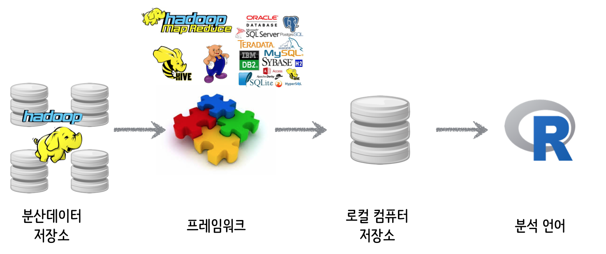
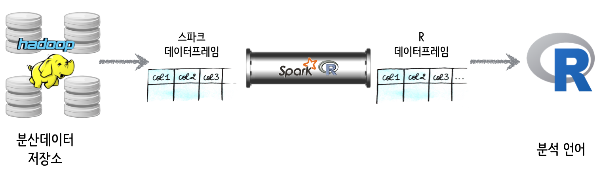

> ### 학습 목표 {.objectives}
>
> * SparkR에 대해 살펴본다.
> * R기반 전통적인 데이터분석과 차이점에 대해 이해한다.

### 1. SparkR 데이터과학 프로세스

SparkR이 R 생태계 데이터과학영역에 들어오게 되면 기존 로컬컴퓨터 데이터저장소에 저장해서 분석하던 데이터양이 급격히 커지게 된다.
정말 커다란 데이터를 R을 활용하여 분석하기 위해서는 중간에 프레임워크가 필요하다.

하둡으로 분산저장된 데이터를 로컬 컴퓨터에 저장시키기 위해서 이를 처리하는 다양한 하둡 맵리듀스, 하이브, 피그, 경우에 따라서는 관계형 데이터베이스가 필요하다. 

* 하둡같은 분산데이터 저장소에 보관된 데이터를 적재, 정제, 변환, 총합요약, 표본추출 작업이 프레임워크를 통해 일차 작업된다.
* R에서 탐색적 데이터분석, 시각화, 최종 스코어를 붙이기 위해서는 프레임워크에서 작업된 데이터가 R에서 작업하기 좋게 로컬 저장소로 옮겨진다.
* R에서 한정된 메모리용량이지만 16GB, 32GB 등도 쉽게 확장되어 저렴하게 이용할 수 있어 프레임워크와 함께 데이터 크기에 관계없이 데이터 분석 및 모형개발작업이 가능하다.

### 2. SparkR 아키텍처

R 데이터프레임이 파이썬 데이터프레임에 영향을 주었고, 동일한 개념이 Spark 데이터프레임을 가능하게 했다.
SparkR은 스파크에 대한 R 전단(Frontend)로 볼 수 있고, 결국 R 데이터프레임과 스파크 데이터프레임에 상호호환성을 보장하는 역할을 수행한다.

SparkR을 사용하게 되면 대용량 분산 저장소와 R이 직접 의사소통하게 되는 구조가 된다. 이는 마치 R이 로컬 저장소에 데이터를 저장시켜서 데이터 분석, 시각화, 모형개발 작업을 수행하는 것과 일맥상통한다.

### 3. SparkR 아키텍처

SparkR 아키텍터를 자세히 살펴보면, 대용량 분산 저장소에 저장된 데이터를 `read.df()` 함수로 불러오고, R에서 작업한 결과를 `write.df()` 함수로 대용량 분산 저장소에 저장시킨다. 만약, R 데이터프레임으로 불러와서 분석작업을 하려면, `SparkR::collect()` 함수로 가져와서 분석을 하고, `SparkR::createDataFrame()` 명령어로 스파크 데이터프레임을 생성시킨다. 

### 4. SparkR 분석

#### `SparkR::collect()` 통한  데이터프레임 작업

1. `SparkR` 라이브러리를 불러오는 환경설정작업을 수행한다.
1. `SparkR` 초기화를 한다.
1. `spark-csv` 모듈을 통해 외부 CSV 파일을 불러온다.
1. `cache`,  `registerTempTable` 통해 SQL을 통한 사전 분석을 실시한다.
1. `SparkR::collect` 명령어를 통해 R데이터프레임으로 변환하여 작업한다.

~~~ {.r}

##================================================================================
## 00. SparkR 환경설정
##================================================================================

Sys.setenv(SPARK_HOME = "/home/parallels/spark-1.6.1/")
Sys.setenv(SPARKR_SUBMIT_ARGS="--packages com.databricks:spark-csv_2.11:1.4.0 sparkr-shell")
.libPaths(c(file.path(Sys.getenv("SPARK_HOME"), "R","lib"),  .libPaths()))
library(SparkR)

##================================================================================
## 01. SparkR 초기화
##================================================================================

sc <- sparkR.init()
sqlContext <- sparkRSQL.init(sc)

##================================================================================
## 02. 데이터 불러오기
##================================================================================

flight <- read.df(sqlContext, "./nycflights13.csv", "com.databricks.spark.csv", header="true", inferSchema = "true")

head(flight)

printSchema(flight)

##================================================================================
## 03. 탐색적 자료분석 초기 설정
##================================================================================

cache(flight)
nrow(flight)

registerTempTable(flight, "flightTable")

t.sql <- sql(sqlContext, "select * from flightTable limit 10")
head(t.sql)

##================================================================================
## 04. R 데이터 분석
##================================================================================

library(dplyr)

flight.df <- SparkR::collect(flight)

f.delay <- flight.df %>% group_by(month) %>% mutate(mean.delay = mean(as.numeric(dep_time), na.rm=TRUE)) %>% 
  select(month, mean.delay)

tail(f.delay)

library(ggplot2)

ggplot(f.delay, aes(month, mean.delay)) + geom_point() + geom_line(color ="blue")
~~~

